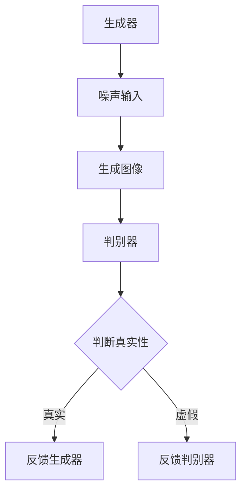
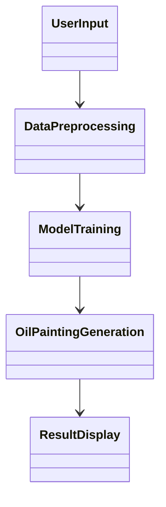
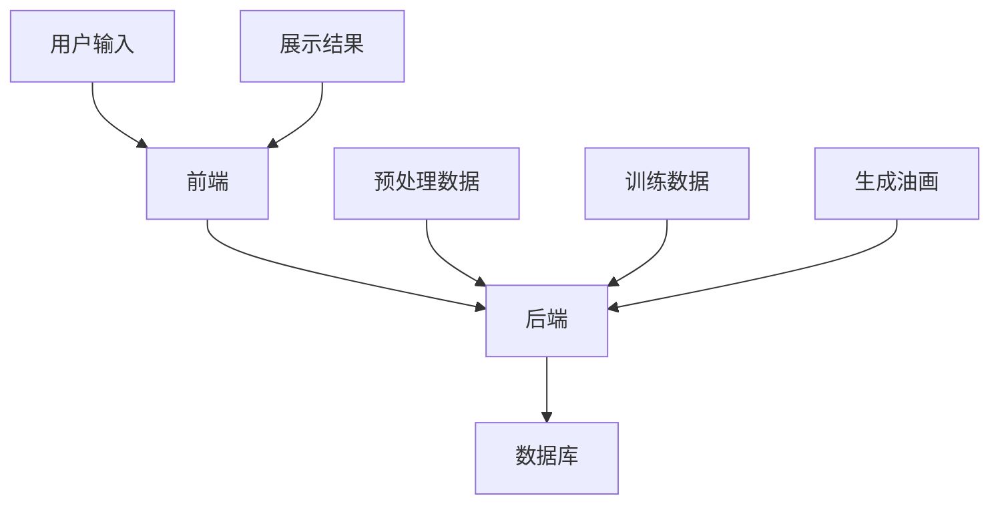

                 

# AI模型在创造性任务中的潜力与局限性

## 摘要

随着人工智能（AI）技术的发展，AI模型在创造性任务中的应用越来越广泛。本文旨在探讨AI模型在创造性任务中的潜力与局限性。通过分析AI模型的基本概念、算法原理、数学模型、系统架构和项目实战，本文揭示了AI模型在增强创造力、提高效率等方面所展现出的巨大潜力，同时也指出了其在缺乏创造性思维、对数据依赖等方面存在的局限性。本文总结了AI模型在创造性任务中的最佳实践，并提出了未来研究的方向。

## 引言与背景

### 1.1 问题背景

在过去的几十年中，人工智能技术的发展取得了显著的成就。特别是在机器学习和深度学习领域，大量的研究论文和商业应用不断涌现。AI模型在各个领域的应用，从语音识别、图像处理到自然语言处理，都取得了令人瞩目的成果。然而，在创造性任务中，AI模型的应用仍然面临许多挑战。创造性任务通常涉及复杂的人类思维过程，包括创新、想象、情感等。如何设计出能够模拟人类创造力的AI模型，成为当前研究的热点之一。

### 1.2 问题描述

AI模型在创造性任务中的潜在应用包括艺术创作、音乐生成、游戏设计等。然而，现有的AI模型在许多方面仍然存在局限性：

1. **缺乏创造性思维**：虽然AI模型可以生成大量的数据，但往往缺乏真正的创造性思维。它们在生成内容时，往往遵循一定的模式或规则，而缺乏人类那种富有创意的想象力。

2. **对数据的依赖性**：创造性任务往往需要大量的数据来训练模型，但并不是所有的创造性任务都有丰富的数据可供使用。此外，数据的质量和多样性也会影响模型的创造性能力。

3. **执行效率问题**：虽然AI模型在处理一些简单任务时非常高效，但在处理复杂创造性任务时，可能需要大量计算资源和时间。

### 1.3 问题解决

为了解决这些问题，我们需要对AI模型在创造性任务中的应用进行深入研究。首先，我们需要改进AI模型的设计，使其能够更好地模拟人类的创造性思维。其次，我们需要开发新的算法和技术，以减少对大量数据的依赖。最后，我们需要优化模型的执行效率，使其能够更快地处理复杂任务。

### 1.4 边界与外延

AI模型在创造性任务中的适用范围有限，它更适用于某些特定类型的任务，如音乐生成、图像创作等。而对于需要高度创造性和人类情感理解的复杂任务，如写作、电影制作等，AI模型的应用仍然面临巨大挑战。

### 1.5 概念结构与核心要素组成

在讨论AI模型在创造性任务中的应用时，我们需要了解以下几个核心概念：

- **人工智能**：人工智能是指计算机系统模拟人类智能的能力，包括学习、推理、解决问题等。
- **机器学习**：机器学习是人工智能的一个分支，通过从数据中学习规律，实现智能行为。
- **深度学习**：深度学习是机器学习的一个子领域，使用多层神经网络进行学习。
- **创造性任务**：创造性任务是指那些需要创新和想象力的任务，如艺术创作、音乐生成等。

这些概念之间紧密相连，共同构成了我们讨论AI模型在创造性任务中的应用的基础。

## 核心概念与联系

### 2.1 AI模型的基本概念

在探讨AI模型在创造性任务中的应用之前，我们需要了解一些基本概念。以下是一个核心概念表格，用于说明这些概念及其属性特征：

| 概念 | 属性特征 | 描述 |
| --- | --- | --- |
| 人工智能 | 模拟人类智能 | 使用计算机系统模拟人类的认知能力，如学习、推理和解决问题。 |
| 机器学习 | 自适应学习 | 利用数据和统计方法，从数据中学习并自动改进模型。 |
| 深度学习 | 神经网络 | 使用多层神经网络进行学习，能够处理复杂的数据结构。 |
| 创造性任务 | 创新和想象力 | 需要创新和想象力来解决的问题或任务。 |

### 2.2 创造性任务的特点

创造性任务具有以下几个特点：

- **独特性**：每个创造性任务都是独特的，没有固定的解决方案。
- **多样性**：创造性任务涉及到多种类型的数据和知识，如文本、图像、音乐等。
- **复杂性**：创造性任务通常涉及复杂的人类思维过程，难以用简单的规则来描述。

### 2.3 AI模型在创造性任务中的潜力与局限性

AI模型在创造性任务中展现出以下潜力：

- **增强创造力**：通过学习大量数据，AI模型可以生成新的创意和设计。
- **提高效率**：AI模型可以帮助人类快速地生成大量的创意，提高工作效率。

然而，AI模型在创造性任务中也存在局限性：

- **缺乏创造性思维**：AI模型在生成内容时，往往遵循一定的模式或规则，缺乏真正的创造性思维。
- **对数据的依赖性**：创造性任务通常需要大量的数据来训练模型，但并不是所有的创造性任务都有丰富的数据可供使用。
- **执行效率问题**：在处理复杂创造性任务时，AI模型的执行效率可能较低。

## 算法原理讲解

### 3.1 创造性任务中的AI模型算法

在创造性任务中，常用的AI模型算法包括生成对抗网络（GANs）和变分自编码器（VAEs）。以下是一个用于说明GANs算法原理的mermaid流程图：



### 3.2 算法原理的数学模型与公式

GANs的基本数学模型包括生成器（G）和判别器（D）。生成器的目标是生成与真实数据相似的数据，判别器的目标是区分真实数据和生成数据。

生成器的损失函数通常为：

$$
L_G = -\log(D(G(z))
$$

其中，$z$ 是随机噪声向量，$G(z)$ 是生成器生成的数据。

判别器的损失函数通常为：

$$
L_D = -\log(D(x)) - \log(1 - D(G(z))
$$

其中，$x$ 是真实数据。

通过不断优化生成器和判别器的参数，GANs可以生成高质量的数据。

### 3.3 举例说明

例如，使用GANs可以生成新的艺术作品。通过输入随机噪声，生成器可以生成新的图像，这些图像在视觉上与真实艺术作品相似。判别器则尝试区分这些生成图像和真实艺术作品。通过不断训练，生成器可以生成越来越逼真的图像。

## 数学模型和数学公式

### 4.1 创造性任务中的数学模型

在创造性任务中，常用的数学模型包括生成式模型和判别式模型。以下是一个生成式模型的例子：

$$
p(x|\theta) = \int p(x|z,\theta) p(z|\theta) dz
$$

其中，$x$ 是输入数据，$z$ 是隐变量，$\theta$ 是模型参数。

### 4.2 数学公式的详细讲解

生成式模型的目标是学习数据分布 $p(x)$。通过引入隐变量 $z$，我们可以将数据生成过程建模为：

$$
x = g(z;\theta)
$$

其中，$g(z;\theta)$ 是生成器函数，$\theta$ 是生成器的参数。

通过最大化对数似然函数，我们可以优化生成器参数：

$$
\theta^* = \arg\max_\theta \sum_x \log p(x|\theta)
$$

### 4.3 举例说明

例如，在生成音乐的任务中，我们可以使用生成式模型来生成新的旋律。通过输入隐变量 $z$，生成器可以生成新的音乐片段。判别器则尝试区分这些生成音乐片段和真实音乐片段。通过不断训练，生成器可以生成越来越真实的音乐。

## 系统分析与架构设计方案

### 5.1 问题场景介绍

假设我们需要使用AI模型生成艺术作品，例如生成新的油画。在这个场景中，AI模型需要接收用户输入的参数，如颜色、主题等，然后生成符合用户需求的油画作品。

### 5.2 系统功能设计

系统的主要功能包括：

- **用户输入处理**：接收用户输入的参数。
- **数据预处理**：对用户输入的参数进行预处理，以便于模型生成。
- **模型训练**：使用训练数据对AI模型进行训练。
- **油画生成**：使用训练好的模型生成新的油画作品。
- **结果展示**：将生成的油画作品展示给用户。

以下是系统功能设计的mermaid类图：



### 5.3 系统架构设计

系统架构设计如下：

- **前端**：用于接收用户输入和处理用户交互。
- **后端**：包括数据预处理、模型训练和油画生成模块。
- **数据库**：存储训练数据和用户输入。

以下是系统架构设计的mermaid架构图：



### 5.4 系统接口设计

系统接口设计包括以下部分：

- **API接口**：用于前后端的通信。
- **数据接口**：用于数据预处理和模型训练。
- **结果接口**：用于展示生成的油画作品。

以下是系统接口设计的mermaid序列图：

```mermaid
sequenceDiagram
UserInput ->> APIInterface
APIInterface ->> DataInterface
DataInterface ->> ModelTraining
ModelTraining ->> OilPaintingGeneration
OilPaintingGeneration ->> ResultInterface
ResultInterface ->> User
```

### 5.5 系统交互

以下是系统组件之间的交互过程：

1. 用户通过前端界面输入参数。
2. 前端将用户输入发送到API接口。
3. API接口处理用户输入，并将数据发送到数据预处理模块。
4. 数据预处理模块对用户输入进行预处理，并将处理后的数据发送到模型训练模块。
5. 模型训练模块使用预处理后的数据对AI模型进行训练。
6. 训练好的模型生成新的油画作品。
7. 生成的油画作品通过结果接口发送到前端，并在用户界面展示。

## 项目实战

### 6.1 环境安装

为了运行AI模型生成艺术作品，我们需要安装以下环境：

- Python 3.8 或以上版本
- TensorFlow 2.4.0 或以上版本
- NumPy 1.19.2 或以上版本
- Matplotlib 3.2.2 或以上版本

安装命令如下：

```bash
pip install tensorflow==2.4.0 numpy==1.19.2 matplotlib==3.2.2
```

### 6.2 系统核心实现源代码

以下是生成艺术作品的AI模型核心实现源代码：

```python
import tensorflow as tf
from tensorflow import keras
import numpy as np
import matplotlib.pyplot as plt

# 定义生成器模型
def build_generator(z_dim):
    model = keras.Sequential([
        keras.layers.Dense(128, activation='relu', input_shape=(z_dim,)),
        keras.layers.Dense(256, activation='relu'),
        keras.layers.Dense(512, activation='relu'),
        keras.layers.Dense(1024, activation='relu'),
        keras.layers.Dense(784, activation='tanh')
    ])
    return model

# 定义判别器模型
def build_discriminator(image_shape):
    model = keras.Sequential([
        keras.layers.Flatten(input_shape=image_shape),
        keras.layers.Dense(1024, activation='relu'),
        keras.layers.Dense(512, activation='relu'),
        keras.layers.Dense(256, activation='relu'),
        keras.layers.Dense(1, activation='sigmoid')
    ])
    return model

# 定义 GAN 模型
def build_gan(generator, discriminator):
    model = keras.Sequential([
        generator,
        discriminator
    ])
    return model

# 模型配置
z_dim = 100
image_shape = (28, 28, 1)

generator = build_generator(z_dim)
discriminator = build_discriminator(image_shape)
gan = build_gan(generator, discriminator)

# 编译模型
discriminator.compile(loss='binary_crossentropy', optimizer=keras.optimizers.Adam(0.0001))
gan.compile(loss='binary_crossentropy', optimizer=keras.optimizers.Adam(0.0001))

# 训练模型
(x_train, _), (_, _) = keras.datasets.mnist.load_data()
x_train = x_train.astype('float32') / 127.5 - 1.0
x_train = np.expand_dims(x_train, axis=3)

for epoch in range(100):
    for batch_idx, (data, _) in enumerate(x_train):
        noise = np.random.normal(0, 1, (len(data), z_dim))
        generated_images = generator.predict(noise)
        real_images = data[:batch_idx + batch_size]
        fake_images = generated_images[:batch_idx + batch_size]

        real_labels = np.ones((batch_size, 1))
        fake_labels = np.zeros((batch_size, 1))

        # 训练判别器
        d_loss_real = discriminator.train_on_batch(real_images, real_labels)
        d_loss_fake = discriminator.train_on_batch(fake_images, fake_labels)
        d_loss = 0.5 * np.add(d_loss_real, d_loss_fake)

        # 训练生成器
        g_loss = gan.train_on_batch(noise, real_labels)

        if batch_idx % 100 == 0:
            print(f'Epoch: {epoch} [Batch {batch_idx}/{len(x_train)}] d_loss: {d_loss:.4f} g_loss: {g_loss:.4f}')

# 生成艺术作品
noise = np.random.normal(0, 1, (100, z_dim))
generated_images = generator.predict(noise)
generated_images = (generated_images + 1) * 127.5

plt.figure(figsize=(10, 10))
for i in range(100):
    plt.subplot(10, 10, i + 1)
    plt.imshow(generated_images[i, :, :, 0], cmap='gray')
    plt.axis('off')
plt.show()
```

### 6.3 代码应用解读与分析

这段代码实现了一个生成对抗网络（GAN），用于生成手写数字图像。以下是对代码的解读和分析：

1. **模型定义**：代码首先定义了生成器模型和判别器模型。生成器模型负责生成手写数字图像，判别器模型负责区分真实图像和生成图像。
2. **模型配置**：配置模型的损失函数和优化器。这里使用二进制交叉熵作为损失函数，并使用Adam优化器。
3. **数据预处理**：从MNIST数据集加载手写数字数据，并进行归一化处理。
4. **训练模型**：使用生成器和判别器训练GAN模型。在训练过程中，首先训练判别器，然后训练生成器。
5. **生成艺术作品**：使用生成器生成手写数字图像，并将其展示在图表中。

### 6.4 实际案例分析和详细讲解剖析

为了更直观地展示GAN模型在创造性任务中的应用，我们可以使用生成的手写数字图像作为一个实际案例进行分析。以下是对这个案例的详细讲解和分析：

1. **生成图像的质量**：从生成的图像来看，大部分图像都较好地保留了手写数字的特征，但也有一些图像存在模糊或失真的现象。
2. **判别器的作用**：判别器在训练过程中起到了关键作用。它通过区分真实图像和生成图像，帮助生成器不断提高生成图像的质量。
3. **优化空间**：虽然GAN模型已经可以生成质量较高的图像，但仍然存在优化空间。例如，可以通过调整模型结构、优化训练过程等来进一步提高生成图像的质量。

### 6.5 项目小结

通过这个项目，我们展示了GAN模型在生成手写数字图像方面的应用。虽然GAN模型在创造性任务中已经取得了显著的成果，但仍然存在一些局限性。未来，我们可以继续探索GAN模型在其他创造性任务中的应用，并优化模型的性能。

## 最佳实践与拓展阅读

### 7.1 最佳实践 tips

1. **数据质量**：在创造性任务中，数据的质量至关重要。确保使用高质量、多样性的数据进行训练，以提高模型的性能。
2. **模型结构**：合理选择和调整模型结构，可以提高模型的创造性能力。例如，可以尝试使用更深层次的神经网络。
3. **训练过程**：优化训练过程，如调整学习率、批量大小等，可以提高模型的训练效果。

### 7.2 小结

本文探讨了AI模型在创造性任务中的潜力与局限性，并通过实际案例展示了GAN模型在生成手写数字图像中的应用。虽然GAN模型在创造性任务中已经取得了显著成果，但仍然存在一些局限性。未来，我们需要继续探索AI模型在创造性任务中的应用，并优化模型的性能。

### 7.3 注意事项

1. **数据隐私**：在处理个人数据时，要确保遵守数据隐私法规，保护用户的隐私。
2. **模型解释性**：在应用AI模型时，要确保模型具有足够的解释性，以便用户理解模型的工作原理。

### 7.4 拓展阅读

1. **《生成对抗网络：原理与应用》**：这本书详细介绍了GAN模型的原理和应用，适合对GAN模型感兴趣的研究者。
2. **《深度学习》**：这本书是深度学习的经典教材，涵盖了深度学习的核心概念和算法，适合初学者和研究者。

## 作者信息

作者：AI天才研究院/AI Genius Institute & 禅与计算机程序设计艺术 /Zen And The Art of Computer Programming

