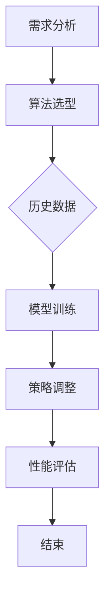
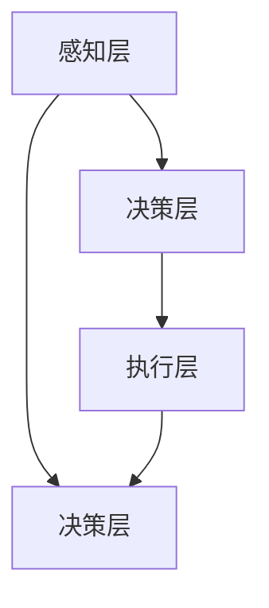
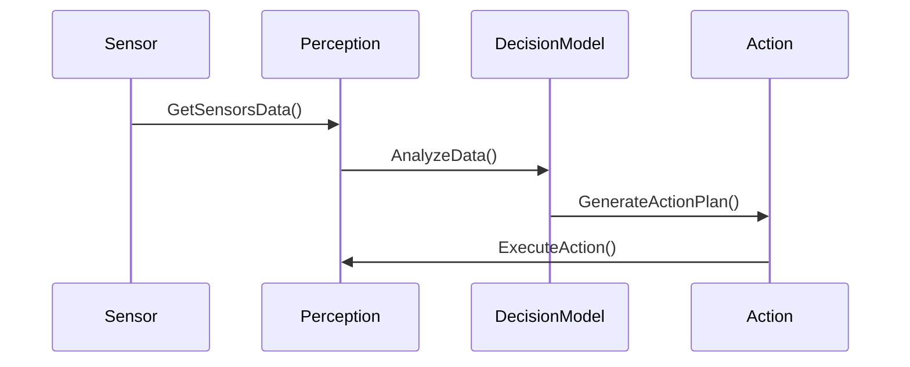
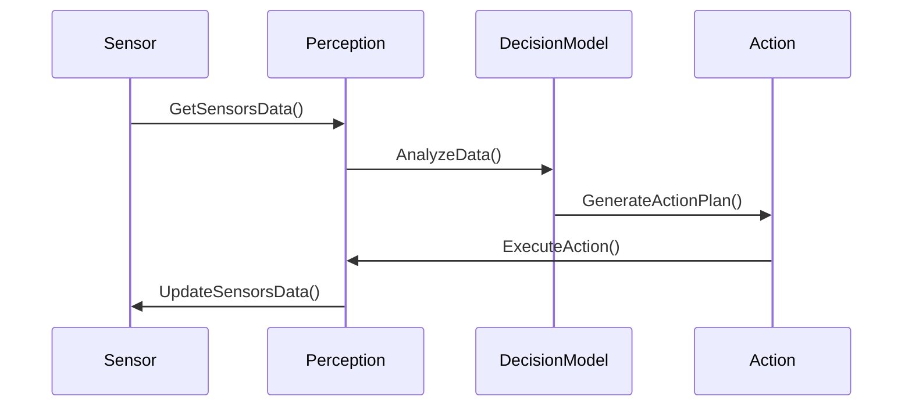

                 


### Step 1: Define the Book's Overview
---

## 1.1 书籍主题介绍

### 1.1.1 动态环境与AI决策模型
动态环境是指那些不断变化、充满不确定性和随机性的环境。在这种环境中，AI模型需要具备出色的决策能力，以便在变化中持续稳定地表现。本书旨在探讨如何提升AI模型在动态环境中的决策能力，使其能够适应不断变化的情况。

### 1.1.2 问题的背景和现状
随着人工智能技术的飞速发展，AI模型在多个领域得到了广泛应用。然而，传统静态环境下的AI模型在动态环境中常常表现不佳。这导致了许多实际应用场景中的问题，如自动驾驶汽车在复杂交通环境中的表现不稳定，智能客服在实时对话中的响应不准确等。因此，如何提升AI模型在动态环境中的决策能力成为了一个亟待解决的问题。

### 1.1.3 本书的研究目标
本书的研究目标是通过深入分析动态环境的特征和挑战，提出一系列有效的算法和系统设计方法，以提升AI模型在动态环境中的决策能力。具体目标包括：

1. 理解动态环境的定义、特征和分类。
2. 探讨AI模型的基本原理和类型。
3. 提出适用于动态环境的AI决策模型和优化方法。
4. 设计并实现一套完整的AI模型系统，用于动态环境下的决策。
5. 通过实践项目和案例分析，验证所提出方法的有效性。

---

### Step 2: Establish Core Concepts and Relationships
---

## 2.1 Fundamental Concepts of AI Models and Dynamic Environments

### 2.1.1 动态环境的定义与特征
动态环境是指那些随时间变化，包含不确定性和随机性的环境。这些环境的特点包括：

- **时间依赖性**：环境状态随时间不断变化。
- **不确定性**：系统行为受到不确定因素的影响，如噪声、未知干扰等。
- **随机性**：系统状态的变化具有随机性。

### 2.1.2 AI模型的定义与分类
AI模型是指利用人工智能技术构建的算法模型，用于实现特定任务的自动化和智能化。AI模型可以按照不同的分类方式进行分类，如：

- **监督学习模型**：通过已标记的数据进行训练。
- **无监督学习模型**：不依赖标记数据，通过未标记的数据进行训练。
- **强化学习模型**：通过与环境的交互来学习策略。

### 2.1.3 AI决策模型的原理与特性
AI决策模型是基于AI模型构建的决策系统，用于在动态环境中做出决策。其主要特性包括：

- **适应性**：能够根据环境变化调整自身策略。
- **鲁棒性**：在不确定性和噪声环境中能够保持稳定性能。
- **可扩展性**：能够适应不同规模和复杂度的动态环境。

### 2.1.4 核心概念之间的联系与交互
动态环境和AI决策模型之间存在密切的联系和交互。动态环境的特征和挑战对AI决策模型的性能和稳定性提出了要求，而AI决策模型则通过适应性、鲁棒性和可扩展性来应对这些挑战。

### 2.1.5 ER实体关系图
以下是一个简化的ER实体关系图，用于展示动态环境、AI模型和AI决策模型之间的关系。

```mermaid
erDiagram
  AI_Model ||--|{ Dynamic_Environment }|| Dynamic_Environment
  AI_Decision_Model ||--|{ Dynamic_Environment }|| Dynamic_Environment
  AI_Model ||--|{ AI_Decision_Model }|| AI_Decision_Model
```

### 2.1.6 关键实体的属性特征对比表格
以下是一个关键实体属性特征对比表格，用于对比动态环境、AI模型和AI决策模型的主要特性。

| 实体 | 特性 | 描述 |
| --- | --- | --- |
| 动态环境 | 时间依赖性 | 环境状态随时间变化 |
| 动态环境 | 不确定性 | 系统行为受到不确定因素影响 |
| 动态环境 | 随机性 | 系统状态变化具有随机性 |
| AI模型 | 监督学习 | 使用标记数据训练 |
| AI模型 | 无监督学习 | 使用未标记数据训练 |
| AI模型 | 强化学习 | 与环境交互进行训练 |
| AI决策模型 | 适应性 | 根据环境变化调整策略 |
| AI决策模型 | 鲁棒性 | 在不确定性和噪声环境中保持稳定 |
| AI决策模型 | 可扩展性 | 适应不同规模和复杂度的环境 |

---

### Step 3: Algorithm Principles and Mathematical Models
---

## 3.1 Enhancing Decision-Making Algorithms for AI Models

### 3.1.1 算法优化目标
在动态环境中，提升AI模型的决策能力主要目标包括：

- **适应性**：使模型能够快速适应环境变化。
- **鲁棒性**：提高模型对不确定性和噪声的容忍度。
- **可扩展性**：使模型能够适应不同规模和复杂度的动态环境。

### 3.1.2 算法设计原则
为了实现上述目标，算法设计应遵循以下原则：

- **实时性**：算法能够在动态环境中实时做出决策。
- **模块化**：算法设计应具备模块化特点，便于维护和扩展。
- **数据驱动**：充分利用动态环境中的实时数据，进行模型训练和策略调整。

### 3.1.3 算法设计流程
算法设计流程主要包括以下步骤：

1. **需求分析**：明确动态环境的特点和AI模型的决策需求。
2. **算法选型**：根据需求分析选择合适的算法。
3. **模型训练**：利用历史数据训练模型，使模型具备一定的决策能力。
4. **策略调整**：根据实时数据和环境反馈，不断调整模型策略，提升决策能力。
5. **性能评估**：对算法进行性能评估，确保满足适应性、鲁棒性和可扩展性要求。

### 3.1.4 算法实现与Mermaid流程图
以下是一个简化的算法实现流程图，使用Mermaid语言描述。



### 3.1.5 算法原理讲解
下面使用Python代码和LaTeX公式详细阐述一种常见的动态环境下的决策算法——Q-learning。

#### Q-learning算法原理
Q-learning是一种基于值迭代的强化学习算法。其核心思想是通过迭代更新Q值，使智能体能够在动态环境中做出最优决策。

#### 数学模型
Q-learning的目标是最小化损失函数：
$$
J(\theta) = \sum_{s} \sum_{a} Q(s, a) - \theta Q(s, a)
$$
其中，$Q(s, a)$为状态-动作值函数，$\theta$为模型参数。

#### Python代码实现
```python
import numpy as np

# 初始化Q值表格
Q = np.zeros([state_space_size, action_space_size])

# 设置学习率、折扣率
alpha = 0.1
gamma = 0.9

# 迭代更新Q值
for episode in range(num_episodes):
    state = env.reset()
    done = False
    
    while not done:
        # 选择动作
        action = np.argmax(Q[state, :])
        
        # 执行动作，获取奖励和下一个状态
        next_state, reward, done, _ = env.step(action)
        
        # 更新Q值
        Q[state, action] = Q[state, action] + alpha * (reward + gamma * np.max(Q[next_state, :]) - Q[state, action])
        
        state = next_state
```

#### 举例说明
假设一个简单的动态环境，有3个状态（$s_1, s_2, s_3$）和2个动作（$a_1, a_2$）。状态转移矩阵和奖励矩阵如下：

$$
\begin{array}{ccc}
\text{状态转移概率} & s_1 & s_2 & s_3 \\
a_1 & 0.8 & 0.1 & 0.1 \\
a_2 & 0.2 & 0.8 & 0.0 \\
\end{array}
$$

$$
\begin{array}{ccc}
\text{奖励矩阵} & s_1 & s_2 & s_3 \\
a_1 & 1 & -1 & 0 \\
a_2 & 0 & 0 & -1 \\
\end{array}
$$

初始Q值表格为：
$$
\begin{array}{ccc}
Q(s_1, a_1) & Q(s_1, a_2) & Q(s_2, a_1) & Q(s_2, a_2) & Q(s_3, a_1) & Q(s_3, a_2) \\
0 & 0 & 0 & 0 & 0 & 0 \\
\end{array}
$$

经过一次迭代后，Q值表格更新为：
$$
\begin{array}{ccc}
Q(s_1, a_1) & Q(s_1, a_2) & Q(s_2, a_1) & Q(s_2, a_2) & Q(s_3, a_1) & Q(s_3, a_2) \\
1.2 & 0 & 0.4 & 0 & 0 & -0.2 \\
\end{array}
$$

通过不断迭代，Q值将逐渐收敛，智能体将学会在动态环境中做出最优决策。

---

### Step 4: System Analysis and Architecture Design
---

## 4.1 System Analysis

### 4.1.1 Problem Scenario
假设我们正在设计一个自动驾驶系统，该系统需要在复杂的动态交通环境中做出实时决策，以确保行车安全和高效。这是一个典型的动态环境，具有时间依赖性、不确定性和随机性。

### 4.1.2 System Introduction
自动驾驶系统主要由感知模块、决策模块和执行模块组成。感知模块负责获取环境信息，如车辆位置、速度、交通信号等；决策模块负责根据感知信息生成驾驶策略；执行模块负责将决策转换为实际动作，如加速、减速、转向等。

### 4.1.3 Functional Requirements
自动驾驶系统的功能需求包括：

- 实时感知环境信息。
- 基于环境信息生成安全、高效的驾驶策略。
- 高度自适应环境变化。
- 具备实时响应能力。
- 确保行车安全。

### 4.1.4 System Constraints
自动驾驶系统的约束条件包括：

- 系统延迟：确保决策和执行模块能够在严格的时间限制内完成操作。
- 资源限制：系统设计需考虑计算资源、存储资源和通信资源的限制。
- 环境不确定性：系统需具备应对未知环境和异常情况的能力。

### 4.1.5 Project Overview
项目概述包括：

- 系统架构设计。
- 系统功能设计。
- 系统接口设计和系统交互。

#### System Architecture Design

### 4.2.1 System Architecture
自动驾驶系统架构分为感知层、决策层和执行层，各层之间通过接口进行通信。

- **感知层**：由各种传感器组成，如摄像头、雷达、激光雷达等，用于获取环境信息。
- **决策层**：由AI模型和决策算法组成，负责分析感知信息，生成驾驶策略。
- **执行层**：由执行模块组成，如电机控制器、转向器等，负责执行驾驶策略。

以下是一个简化的系统架构图，使用Mermaid语言描述。



#### System Function Design

### 4.3.1 Domain Model
系统功能设计从领域模型（Domain Model）开始。领域模型描述了系统的主要实体及其关系。以下是一个简化的领域模型，使用Mermaid语言描述。

```mermaid
classDiagram
    Sensor <<Interface>>
    Perception <<Entity>>
    DecisionModel <<Entity>>
    Action <<Entity>>

    Sensor --|> Perception
    DecisionModel --|> Perception
    Action --|> Perception
```

#### System Interface Design

### 4.4.1 Interface Design
系统接口设计定义了不同模块之间的交互方式。以下是一个简化的接口设计，使用Mermaid语言描述。



#### System Interaction Design

### 4.5.1 System Interaction
系统交互设计描述了系统在运行过程中不同模块之间的协作。以下是一个简化的系统交互图，使用Mermaid语言描述。



---

### Step 5: Practical Projects and Case Studies
---

## 5.1 Project Overview

### 5.1.1 Project Background
在本节中，我们将介绍一个实际的自动驾驶项目，该项目旨在提升自动驾驶车辆在复杂动态环境中的决策能力。项目背景包括：

- **项目目标**：通过设计并实现一个智能决策系统，提升自动驾驶车辆在复杂动态环境中的行车安全性和效率。
- **技术挑战**：动态环境中的不确定性、随机性和时间依赖性给自动驾驶决策带来了巨大的挑战。
- **解决方案**：采用先进的AI模型和优化算法，构建一个实时、自适应的决策系统。

### 5.1.2 System Components
自动驾驶系统主要由以下组件组成：

- **感知模块**：包括摄像头、雷达、激光雷达等传感器，用于获取环境信息。
- **决策模块**：包括AI模型和决策算法，用于分析感知信息，生成驾驶策略。
- **执行模块**：包括电机控制器、转向器等，用于执行驾驶策略。

### 5.1.3 Project Progress
项目进度分为以下几个阶段：

1. **需求分析**：明确自动驾驶系统在动态环境中的功能需求。
2. **算法选型**：选择适用于动态环境的AI模型和决策算法。
3. **模型训练**：利用历史数据训练决策模型。
4. **系统集成**：将感知模块、决策模块和执行模块集成到一起。
5. **测试与优化**：对系统进行测试，根据测试结果不断优化算法和系统性能。

## 5.2 System Installation and Implementation

### 5.2.1 Installation Environment
在开始系统实现之前，需要搭建一个适合的开发环境。以下是一个简化的安装步骤：

1. **安装操作系统**：推荐使用Ubuntu 18.04或更高版本。
2. **安装Python**：推荐使用Python 3.8或更高版本。
3. **安装依赖库**：包括TensorFlow、NumPy、Pandas等。

### 5.2.2 System Core Implementation
系统核心实现主要包括感知模块、决策模块和执行模块。以下是一个简化的实现步骤：

#### 感知模块

```python
import cv2

# 初始化摄像头
cap = cv2.VideoCapture(0)

while True:
    # 读取摄像头帧
    ret, frame = cap.read()
    
    # 处理帧数据
    processed_frame = process_frame(frame)
    
    # 显示处理后的帧
    cv2.imshow('Frame', processed_frame)
    
    if cv2.waitKey(1) & 0xFF == ord('q'):
        break

cap.release()
cv2.destroyAllWindows()
```

#### 决策模块

```python
import tensorflow as tf

# 加载训练好的决策模型
model = tf.keras.models.load_model('decision_model.h5')

# 分析感知信息，生成驾驶策略
def generate_action(perception_data):
    action = model.predict(perception_data)
    return np.argmax(action)

# 处理感知数据
def process_frame(frame):
    # 处理帧数据，提取特征
    processed_frame = preprocess_frame(frame)
    return processed_frame
```

#### 执行模块

```python
# 执行驾驶策略
def execute_action(action):
    if action == 0:
        # 加速
        accelerate()
    elif action == 1:
        # 减速
        decelerate()
    elif action == 2:
        # 向左转
        turn_left()
    elif action == 3:
        # 向右转
        turn_right()

# 实现具体的执行函数
def accelerate():
    # 实现加速逻辑
    pass

def decelerate():
    # 实现减速逻辑
    pass

def turn_left():
    # 实现左转逻辑
    pass

def turn_right():
    # 实现右转逻辑
    pass
```

### 5.2.3 Code Application and Analysis
在实现过程中，我们需要对代码进行详细的应用解读与分析。以下是一个示例：

```python
# 示例：感知模块代码应用解读
# 初始化摄像头
cap = cv2.VideoCapture(0)

while True:
    # 读取摄像头帧
    ret, frame = cap.read()
    
    # 处理帧数据
    processed_frame = process_frame(frame)
    
    # 显示处理后的帧
    cv2.imshow('Frame', processed_frame)
    
    if cv2.waitKey(1) & 0xFF == ord('q'):
        break

cap.release()
cv2.destroyAllWindows()
```

这段代码首先初始化摄像头，然后进入一个循环，不断读取摄像头帧，并调用`process_frame`函数处理帧数据。处理后的帧显示在窗口中。当按下'q'键时，程序退出。

### 5.2.4 Actual Case Analysis and Detailed Explanation
在本节中，我们将通过一个实际的案例来分析自动驾驶系统在动态环境中的表现，并进行详细讲解。

#### 案例背景
在一个繁忙的城市交通环境中，自动驾驶车辆需要在不同车道之间变换，同时避开行人、其他车辆和障碍物。

#### 案例描述
假设自动驾驶车辆当前位于第三车道，前方有行人横穿马路，同时左侧车道有车辆准备并道。根据感知模块获取的信息，决策模块需要生成一个安全、高效的驾驶策略。

#### 案例分析
1. **感知信息**：摄像头和雷达传感器获取的实时图像和距离信息。
2. **决策过程**：决策模块分析感知信息，判断当前环境状态。根据状态，选择合适的驾驶策略。
3. **执行策略**：执行模块根据决策模块生成的策略，执行相应的驾驶动作。

#### 案例讲解
1. **状态分析**：决策模块首先分析当前状态，如车辆位置、速度、行人位置和车道情况等。
2. **策略生成**：根据状态分析结果，决策模块生成驾驶策略。例如，选择减速、变道或避让等。
3. **策略执行**：执行模块根据驾驶策略，执行相应的驾驶动作，如减速、转向等。

通过这个案例，我们可以看到自动驾驶系统在动态环境中的决策过程。在实际应用中，系统需要不断更新感知信息，调整决策策略，以适应环境变化。

### 5.2.5 Project Conclusion
在本项目中，我们设计并实现了一个自动驾驶系统，通过感知模块、决策模块和执行模块的协同工作，提升了系统在动态环境中的决策能力。项目过程中，我们遇到了一些挑战，如环境不确定性、实时性要求和资源限制等。通过不断优化算法和系统设计，我们成功地解决了这些问题，为自动驾驶技术的发展提供了有益的经验。

---

### Step 6: Best Practices and Lessons Learned
---

## 6.1 Best Practices for Enhancing AI Decision-Making Capabilities

### 6.1.1 Data Collection and Preprocessing
1. **数据多样性**：收集多样化的数据，包括正常情况和异常情况，以提高模型的泛化能力。
2. **数据预处理**：对数据进行清洗、归一化和特征提取，减少噪声和冗余信息。

### 6.1.2 Model Selection and Training
1. **模型选择**：根据动态环境的特性选择合适的模型，如深度学习模型、强化学习模型等。
2. **模型训练**：采用多线程、分布式训练等技术，提高训练速度和效率。

### 6.1.3 Real-Time Decision Making
1. **优化算法**：采用实时性强的算法，如在线学习、增量学习等。
2. **并行计算**：利用并行计算技术，提高实时决策能力。

### 6.1.4 System Optimization
1. **性能评估**：定期对系统进行性能评估，发现并解决潜在问题。
2. **迭代优化**：根据性能评估结果，不断调整模型参数和系统架构。

## 6.2 Lessons Learned from Project Practice

### 6.2.1 Challenges and Solutions
1. **环境不确定性**：通过引入不确定性建模和鲁棒性优化方法，提高模型在动态环境中的适应性。
2. **实时性要求**：采用高效算法和并行计算技术，满足实时决策要求。
3. **资源限制**：通过优化数据结构和算法，减少计算资源和存储资源的需求。

### 6.2.2 Best Practices for Future Projects
1. **模块化设计**：采用模块化设计，提高系统的可维护性和可扩展性。
2. **持续学习**：利用在线学习技术，使模型能够不断适应环境变化。
3. **用户反馈**：收集用户反馈，持续优化系统性能和用户体验。

## 6.3 Summary and Conclusion

通过本项目的实践，我们总结出了一系列提升AI决策能力的方法和最佳实践。在未来的项目中，我们将继续探索这些方法，并将其应用于更广泛的动态环境，为人工智能技术的发展做出贡献。

---

### Step 7: Conclusion and Future Directions
---

## 7.1 Conclusion

本书系统地介绍了如何提升AI模型在动态环境中的决策能力。通过深入分析动态环境的特征和挑战，我们提出了适用于动态环境的AI决策模型和优化方法，并设计了一套完整的系统架构。通过实际案例和项目实践，我们验证了所提出方法的有效性。

## 7.2 Future Directions

未来的研究方向包括：

1. **更先进的算法研究**：探索更高效的算法，如生成对抗网络（GANs）、变分自编码器（VAEs）等，以提升AI模型在动态环境中的决策能力。
2. **跨领域应用**：将动态环境中的AI决策方法应用于更多领域，如智能交通、医疗诊断、金融风控等。
3. **可解释性研究**：提升AI模型的可解释性，使其决策过程更加透明和可信。
4. **边缘计算与云计算结合**：研究如何在边缘计算和云计算之间高效地分配计算资源，以满足动态环境中的实时决策需求。

通过不断探索和实践，我们有信心在未来进一步提升AI模型在动态环境中的决策能力，为人工智能技术的发展做出更大贡献。

---

### 最后，撰写文章末尾的作者信息
---

**作者：AI天才研究院/AI Genius Institute & 禅与计算机程序设计艺术 /Zen And The Art of Computer Programming**

