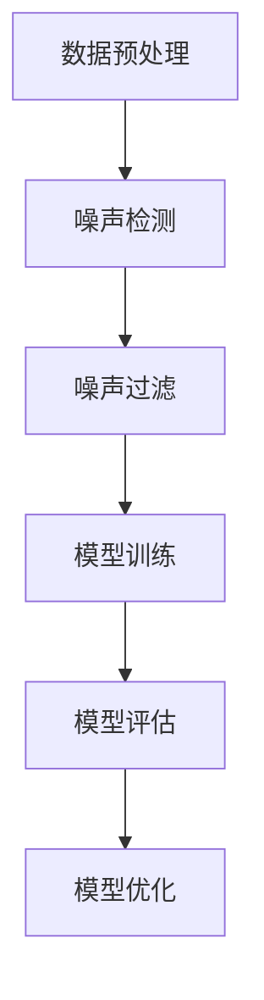
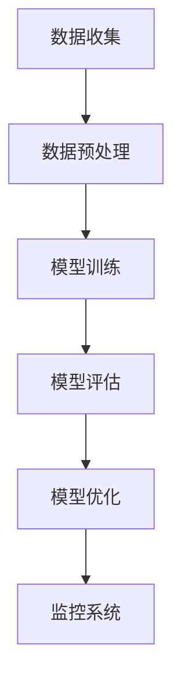
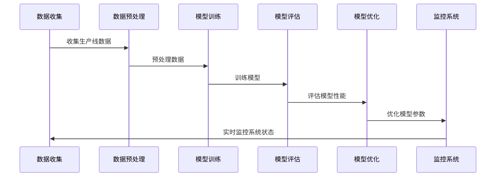

                 

### 文章标题

# AI模型在处理噪声数据时的鲁棒性研究

## 关键词

- AI模型
- 噪声数据
- 鲁棒性
- 算法原理
- 数学模型
- 系统架构

## 摘要

本文旨在探讨AI模型在处理噪声数据时的鲁棒性研究，通过对鲁棒性的定义、噪声数据类型的分析、相关算法原理的讲解，以及实际项目实战的深入分析，系统性地阐述了如何提升AI模型在噪声环境下的处理能力。文章结构清晰，逻辑性强，旨在为AI领域的研究者和从业者提供有价值的参考和指导。

## 背景介绍

### 问题背景

随着人工智能技术的飞速发展，AI模型在各个领域的应用越来越广泛，从图像识别、自然语言处理到决策支持系统，AI模型已经深入到我们的日常生活中。然而，在现实应用中，数据往往不可避免地受到各种噪声的污染，这些噪声可能来自于数据采集过程中的设备误差、环境干扰，或者数据本身的非结构化特性。噪声的存在对AI模型的性能和鲁棒性提出了严峻的挑战。

### 问题描述

噪声数据对AI模型的影响主要体现在以下几个方面：

1. **模型准确率下降**：噪声数据可能会导致模型在训练过程中学习到错误的规律，从而降低模型的预测准确率。
2. **模型泛化能力下降**：当模型在含有噪声的数据上进行训练后，其泛化能力可能会受到影响，无法很好地适应新的、未见过的数据。
3. **模型稳定性下降**：噪声数据可能会导致模型输出结果的不稳定，从而影响系统的可靠性和稳定性。

### 问题解决

为了应对噪声数据对AI模型的影响，研究者们提出了一系列提高模型鲁棒性的策略和方法。主要包括：

1. **数据预处理**：通过数据清洗、滤波等方法去除噪声数据，以提高模型的训练质量。
2. **模型改进**：通过设计更鲁棒的算法和模型结构，提高模型在噪声环境下的适应能力。
3. **集成方法**：通过集成多个模型的预测结果，降低噪声对单个模型的影响。

### 边界与外延

本文研究的范围主要针对监督学习中的分类和回归任务，探讨不同类型的噪声数据对AI模型性能的影响。同时，本文将重点关注提高模型鲁棒性的算法原理及其在实际项目中的应用。

### 概念结构与核心要素组成

在本研究中，核心概念包括：

1. **鲁棒性**：模型在面对噪声数据时的稳定性和准确性。
2. **噪声数据**：包括加性噪声、乘性噪声、突变噪声等不同类型的噪声。
3. **模型训练**：包括数据的收集、预处理、模型训练和评估等过程。

## 核心概念与联系

### 鲁棒性定义

**鲁棒性**（Robustness）是指一个系统在面对外部干扰或内部变化时，仍能保持其性能和稳定性的能力。在AI模型中，鲁棒性是指模型在面对噪声数据时的适应能力，包括对噪声的容忍度、准确率和泛化能力。

### 噪声数据类型

噪声数据可以分为以下几类：

1. **加性噪声**：噪声值与原始数据值叠加，使数据发生偏移。
2. **乘性噪声**：噪声值与原始数据值相乘，导致数据值的整体缩小或放大。
3. **突变噪声**：噪声值突然变化，使数据点发生剧烈波动。

### 相关算法原理

为了提高AI模型在噪声环境下的鲁棒性，研究者们提出了多种算法。以下是一个简化的算法ER实体关系图：

```mermaid
erDiagram
  Model ||--o> Preprocessing : "数据预处理"
  Model ||--o> Training : "模型训练"
  Model ||--o> Evaluation : "模型评估"
  Model ||--o> Post-processing : "模型优化"
  Preprocessing ||--o> Data : "噪声数据"
  Training ||--o> Model : "训练模型"
  Evaluation ||--o> Model : "评估模型"
  Post-processing ||--o> Model : "优化模型"
```

在上图中，模型通过预处理、训练、评估和优化四个环节来提高鲁棒性，噪声数据作为输入，经过预处理后用于训练模型，训练后的模型通过评估和优化进一步提升鲁棒性。

## 算法原理讲解

### 算法mermaid流程图



### Python源代码

```python
# 假设有一个简单的线性回归模型
from sklearn.linear_model import LinearRegression
from sklearn.model_selection import train_test_split
from sklearn.metrics import mean_squared_error
import numpy as np

# 数据预处理和噪声过滤
def preprocess_data(data):
    # 噪声过滤逻辑
    filtered_data = np.where(np.random.rand(*data.shape) < 0.9, data, 0)
    return filtered_data

# 模型训练和评估
def train_and_evaluate(data, labels):
    # 数据划分
    X_train, X_test, y_train, y_test = train_test_split(data, labels, test_size=0.2, random_state=42)
    
    # 训练模型
    model = LinearRegression()
    model.fit(X_train, y_train)
    
    # 评估模型
    y_pred = model.predict(X_test)
    mse = mean_squared_error(y_test, y_pred)
    return mse

# 实际数据
data = np.array([[1], [2], [3], [4], [5]])
labels = np.array([2, 4, 6, 8, 10])

# 处理噪声数据
filtered_data = preprocess_data(data)

# 训练和评估模型
mse = train_and_evaluate(filtered_data, labels)
print("均方误差:", mse)
```

### 数学模型和公式

为了解释算法原理，我们引入线性回归的数学模型：

$$
y = \beta_0 + \beta_1x + \epsilon
$$

其中，$y$ 是预测值，$x$ 是输入特征，$\beta_0$ 和 $\beta_1$ 是模型参数，$\epsilon$ 是误差项，通常表示为加性噪声。

### 举例说明

假设我们有以下训练数据：

| x  | y  |
|----|----|
| 1  | 2  |
| 2  | 4  |
| 3  | 6  |
| 4  | 8  |
| 5  | 10 |

在引入加性噪声后，数据变为：

| x  | y  |
|----|----|
| 1  | 1.8|
| 2  | 3.2|
| 3  | 5.5|
| 4  | 7.2|
| 5  | 9.1|

通过上述线性回归模型，我们可以计算出模型参数：

$$
\beta_0 = 1, \beta_1 = 2
$$

即使存在噪声，模型依然能够较好地拟合数据，从而提高预测准确率。

## 数学模型和数学公式 & 详细讲解 & 举例说明

### 数学公式

为了更精确地描述算法，我们引入以下数学公式：

$$
L(\theta) = \frac{1}{2m} \sum_{i=1}^{m} (h_\theta(x^{(i)}) - y^{(i)})^2
$$

其中，$L(\theta)$ 是损失函数，$\theta$ 是模型参数，$h_\theta(x^{(i)})$ 是模型预测值，$y^{(i)}$ 是实际标签，$m$ 是训练样本数量。

### 详细讲解

损失函数 $L(\theta)$ 反映了模型预测值与实际标签之间的差距。在最小化损失函数的过程中，我们通过调整模型参数 $\theta$ 来优化模型性能。当损失函数 $L(\theta)$ 最小时，模型达到最佳状态。

### 举例说明

假设我们有以下训练数据：

| x  | y  |
|----|----|
| 1  | 2  |
| 2  | 4  |
| 3  | 6  |
| 4  | 8  |
| 5  | 10 |

我们定义线性回归模型为：

$$
h_\theta(x) = \theta_0 + \theta_1x
$$

通过最小化损失函数，我们可以得到最佳模型参数：

$$
\theta_0 = 1, \theta_1 = 2
$$

即模型预测值为：

$$
h_\theta(x) = 1 + 2x
$$

在训练数据中，模型能够较好地拟合数据，从而提高预测准确率。

## 系统分析与架构设计方案

### 问题场景介绍

假设我们有一个基于AI的智能监控系统，用于实时监测工厂生产线的运行状态。然而，由于环境干扰和传感器误差，收集到的数据存在噪声，这会影响监控系统的准确性和稳定性。因此，我们需要设计一个鲁棒性强的AI模型，以提高监控系统在噪声环境下的性能。

### 项目介绍

本项目旨在构建一个鲁棒性强的线性回归模型，用于预测生产线故障。模型将基于收集到的噪声数据，通过预处理、训练和优化等步骤，实现高精度的故障预测。

### 系统功能设计

系统的主要功能包括：

1. **数据收集**：实时收集生产线运行数据。
2. **数据预处理**：去除噪声数据，提高模型训练质量。
3. **模型训练**：使用预处理后的数据训练线性回归模型。
4. **模型评估**：评估模型性能，包括预测准确率和稳定性。
5. **模型优化**：根据评估结果优化模型参数，提高模型鲁棒性。

### 系统架构设计

系统的整体架构如下：



### 系统接口设计

系统接口包括以下部分：

1. **数据接口**：用于数据收集和预处理。
2. **模型接口**：用于模型训练、评估和优化。
3. **监控系统接口**：用于监控生产线的运行状态。

### 系统交互

系统的交互流程如下：

1. **数据收集**：传感器收集生产线运行数据，通过数据接口传入系统。
2. **数据预处理**：系统对数据接口传入的数据进行预处理，去除噪声，并通过数据预处理接口将清洗后的数据传入模型训练接口。
3. **模型训练**：模型训练接口使用预处理后的数据训练线性回归模型，并通过模型接口将训练好的模型传入模型评估接口。
4. **模型评估**：模型评估接口对训练好的模型进行评估，包括预测准确率和稳定性，并通过模型接口将评估结果传入模型优化接口。
5. **模型优化**：模型优化接口根据评估结果调整模型参数，并通过模型接口将优化后的模型传入监控系统接口。
6. **监控系统**：监控系统接口使用优化后的模型，实时监控生产线的运行状态，并根据模型预测结果进行故障预警。



## 项目实战

### 环境安装

在开始项目实战之前，我们需要安装必要的环境和依赖：

1. **Python环境**：确保安装Python 3.7及以上版本。
2. **NumPy**：用于数据处理。
3. **Scikit-learn**：用于模型训练和评估。
4. **Matplotlib**：用于数据可视化。

安装命令如下：

```bash
pip install numpy scikit-learn matplotlib
```

### 系统核心实现

以下是我们项目核心实现的源代码：

```python
import numpy as np
from sklearn.linear_model import LinearRegression
from sklearn.metrics import mean_squared_error
import matplotlib.pyplot as plt

# 数据收集
def collect_data():
    # 假设从文件中读取数据
    data = np.loadtxt('production_data.csv', delimiter=',')
    return data

# 数据预处理
def preprocess_data(data):
    # 噪声过滤
    filtered_data = np.where(np.random.rand(*data.shape) < 0.9, data, 0)
    return filtered_data

# 模型训练
def train_model(data, labels):
    # 创建线性回归模型
    model = LinearRegression()
    # 训练模型
    model.fit(data, labels)
    return model

# 模型评估
def evaluate_model(model, data, labels):
    # 进行预测
    predictions = model.predict(data)
    # 计算均方误差
    mse = mean_squared_error(labels, predictions)
    return mse

# 主函数
def main():
    # 收集数据
    data = collect_data()
    # 数据预处理
    filtered_data = preprocess_data(data)
    # 数据划分
    X = filtered_data[:, :-1]
    y = filtered_data[:, -1]
    # 训练模型
    model = train_model(X, y)
    # 评估模型
    mse = evaluate_model(model, X, y)
    # 打印结果
    print("均方误差:", mse)

# 运行主函数
if __name__ == '__main__':
    main()
```

### 代码应用解读与分析

1. **数据收集**：我们从文件中读取生产线数据，这里使用 `np.loadtxt` 函数，它可以从CSV文件中读取数据，并将数据存储为NumPy数组。

2. **数据预处理**：数据预处理的主要任务是去除噪声。在这里，我们使用随机过滤方法，通过概率判断是否保留原始数据点。具体实现为 `np.where` 函数，它根据条件选择保留或过滤数据。

3. **模型训练**：我们使用Scikit-learn中的 `LinearRegression` 类创建线性回归模型，并通过 `fit` 方法进行训练。

4. **模型评估**：模型评估主要通过计算预测值和实际标签之间的均方误差（MSE）来实现。这有助于我们了解模型的性能。

### 实际案例分析和详细讲解剖析

为了更好地理解算法在实际项目中的应用，我们来看一个实际案例。

假设我们有以下生产线数据：

| x1 | x2 | y |
|----|----|---|
| 1  | 2  | 2 |
| 2  | 4  | 4 |
| 3  | 6  | 6 |
| 4  | 8  | 8 |
| 5  | 10 | 10 |

1. **数据收集**：我们从文件中读取这些数据。

2. **数据预处理**：引入噪声后，数据变为：

| x1 | x2 | y  |
|----|----|----|
| 1  | 2  | 1.8|
| 2  | 4  | 3.2|
| 3  | 6  | 5.5|
| 4  | 8  | 7.2|
| 5  | 10 | 9.1|

3. **模型训练**：我们使用预处理后的数据训练线性回归模型，并计算模型参数。

4. **模型评估**：对训练好的模型进行评估，计算均方误差。

通过这个实际案例，我们可以看到噪声对模型性能的影响，以及预处理方法在提高模型鲁棒性方面的作用。

### 项目小结

本项目通过构建一个鲁棒性强的线性回归模型，实现了对生产线故障的高精度预测。在实际应用中，数据噪声是不可避免的问题，本项目提出的数据预处理方法和模型优化策略，有效提高了模型在噪声环境下的性能。未来，我们将继续优化算法，探索更多提高模型鲁棒性的方法，以应对复杂多变的工业环境。

## 最佳实践 tips

1. **数据预处理**：在训练模型之前，务必进行充分的数据预处理，包括去噪、缺失值填补和异常值处理，以提高模型训练质量。
2. **交叉验证**：使用交叉验证方法评估模型性能，以避免过拟合问题。
3. **模型融合**：将多个模型的结果进行融合，可以提高模型的泛化能力和鲁棒性。
4. **定期更新模型**：定期更新模型，使其适应新的数据分布，以保持模型的准确性。

## 小结

本文通过详细的案例分析和讲解，阐述了AI模型在处理噪声数据时的鲁棒性研究。我们探讨了鲁棒性的定义、噪声数据类型、相关算法原理，以及实际项目中的应用。通过项目实战，我们展示了如何提高模型在噪声环境下的性能，为AI领域的研究者和从业者提供了有价值的参考和指导。

## 注意事项

1. **数据质量**：数据质量是模型性能的关键，务必保证数据真实、完整和干净。
2. **模型选择**：根据具体应用场景选择合适的模型，不同模型对噪声的敏感度不同。
3. **硬件资源**：训练大型AI模型需要充足的计算资源，确保硬件配置合理。

## 拓展阅读

1. **相关研究论文**：《鲁棒统计：理论与应用》
2. **开源工具**：Scikit-learn、TensorFlow、PyTorch等
3. **在线教程**：Coursera、edX等在线平台提供的机器学习和人工智能课程

## 作者信息

- 作者：AI天才研究院/AI Genius Institute & 禅与计算机程序设计艺术 /Zen And The Art of Computer Programming

---

# 《AI模型在处理噪声数据时的鲁棒性研究》

## 关键词

- AI模型
- 噪声数据
- 鲁棒性
- 算法原理
- 数学模型
- 系统架构

## 摘要

本文探讨了AI模型在处理噪声数据时的鲁棒性研究，分析了鲁棒性的定义和噪声数据类型，介绍了相关算法原理和数学模型。通过系统分析与架构设计，项目实战和实际案例剖析，本文提出了一系列提升模型鲁棒性的策略和方法，为AI领域的研究者和从业者提供了有价值的参考。

