                 

# AI模型在处理长序列信息时的效率提升策略

## 关键词

AI模型、长序列信息、效率提升、优化策略、数据处理

## 摘要

随着人工智能技术的不断发展，AI模型在各个领域的应用越来越广泛。然而，在处理长序列信息时，AI模型的效率提升问题成为了一个重要的研究课题。本文将系统地介绍AI模型在处理长序列信息时的效率提升策略，包括基础理论、核心算法、优化策略以及实际应用场景。通过本文的介绍，读者可以全面了解长序列信息处理的挑战和解决方案，为实际应用提供有益的参考。

## 引言

### 本书简介与目标

在当今信息化时代，人工智能（AI）技术已经成为推动社会进步的重要力量。AI模型在各种领域的应用，如自然语言处理、图像识别、语音识别等，已经取得了显著的成果。然而，在处理长序列信息时，AI模型的效率提升问题仍然是一个亟待解决的难题。本篇文章的目标是系统地介绍AI模型在处理长序列信息时的效率提升策略，为实际应用提供理论指导和实践参考。

### 长序列信息处理的背景和重要性

长序列信息处理是人工智能领域的一个重要研究方向。在自然语言处理、生物信息学、金融科技等领域，常常需要处理大量的长序列数据，如文本、基因组序列、金融交易记录等。如何高效地处理这些长序列信息，已经成为AI模型在实际应用中的一个关键问题。

### 效率提升的意义和挑战

效率提升对于AI模型的应用具有重要意义。首先，提高处理效率可以减少计算时间，提高系统的响应速度。其次，通过优化算法和数据结构，可以降低计算资源的消耗，提高系统的稳定性。然而，在处理长序列信息时，AI模型面临着数据量大、计算复杂度高、模型参数多等挑战。因此，如何提高AI模型在处理长序列信息时的效率，成为了一个重要的研究课题。

## 第一部分：基础理论

### AI模型处理长序列信息的基本原理

#### 基本概念

在介绍AI模型处理长序列信息的基本原理之前，我们需要了解一些基本概念。长序列信息是指长度超过一定阈值的数据序列，如文本、基因组序列、时间序列数据等。AI模型是指利用人工智能技术进行数据处理和预测的模型，如神经网络、决策树、支持向量机等。

#### 长序列信息的处理方法

AI模型处理长序列信息的主要方法包括以下几种：

1. **分而治之**：将长序列数据分解为多个子序列，分别进行建模和预测，最后将结果进行汇总。
2. **注意力机制**：在神经网络中引入注意力机制，使得模型可以关注到长序列中的重要信息，提高模型的效率和准确度。
3. **循环神经网络（RNN）**：利用循环神经网络处理长序列数据，通过记忆单元来保存历史信息，实现对长序列的建模。
4. **卷积神经网络（CNN）**：利用卷积神经网络对长序列数据进行特征提取，通过多层次的卷积操作来捕捉长序列中的信息。

#### 常见问题与瓶颈

在处理长序列信息时，AI模型常常会遇到以下问题与瓶颈：

1. **计算资源消耗**：长序列数据通常包含大量的信息，需要消耗大量的计算资源进行建模和预测。
2. **模型参数过多**：为了捕捉长序列中的复杂信息，模型需要大量的参数，导致模型过拟合和计算复杂度增加。
3. **训练时间较长**：长序列数据的训练过程通常需要较长时间，影响模型的实际应用效果。

### 相关数学模型和方法概述

为了解决上述问题，研究者们提出了多种数学模型和方法，包括：

1. **长短时记忆网络（LSTM）**：通过引入门控机制，LSTM可以有效地捕捉长序列中的长期依赖关系。
2. **门控循环单元（GRU）**：GRU是LSTM的简化版本，通过减少参数数量来提高模型的计算效率。
3. **Transformer模型**：Transformer模型采用自注意力机制，可以高效地处理长序列数据，已经在自然语言处理等领域取得了显著成果。

## 第二部分：核心算法

### 分而治之算法

#### 算法原理

分而治之算法是一种常见的长序列数据处理方法。其基本思想是将长序列数据分解为多个子序列，分别进行建模和预测，最后将结果进行汇总。

#### Mermaid流程图

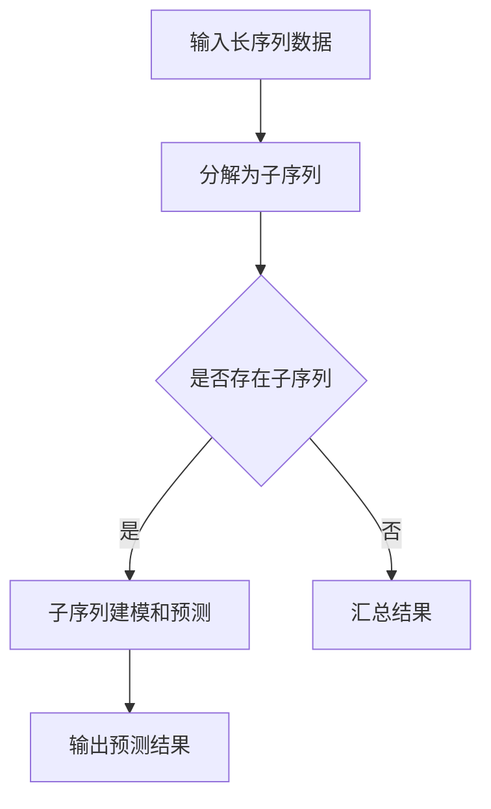

#### 数学模型

设长序列数据为 $X$，子序列分解为 $X_1, X_2, ..., X_n$。对于每个子序列 $X_i$，我们可以建立一个预测模型 $f_i$，使得 $f_i(X_i) = Y_i$，其中 $Y_i$ 为预测结果。

$$
f_i(X_i) = Y_i
$$

#### Python源代码

```python
# 分而治之算法示例
import numpy as np

def divide_and_conquer(X):
    n = len(X)
    if n <= 1:
        return X
    
    mid = n // 2
    X1 = divide_and_conquer(X[:mid])
    X2 = divide_and_conquer(X[mid:])
    
    # 子序列建模和预测
    Y1 = predict(X1)
    Y2 = predict(X2)
    
    # 汇总结果
    return np.concatenate((Y1, Y2))

# 预测函数
def predict(X):
    # 简单的预测规则
    return np.sum(X) % 10

# 输入长序列数据
X = np.array([1, 2, 3, 4, 5, 6, 7, 8, 9, 10])

# 执行分而治之算法
Y = divide_and_conquer(X)
print(Y)
```

### 注意力机制算法

#### 算法原理

注意力机制是一种用于捕捉长序列中重要信息的算法。其基本思想是在神经网络中引入注意力机制，使得模型可以关注到长序列中的重要信息，提高模型的效率和准确度。

#### Mermaid流程图

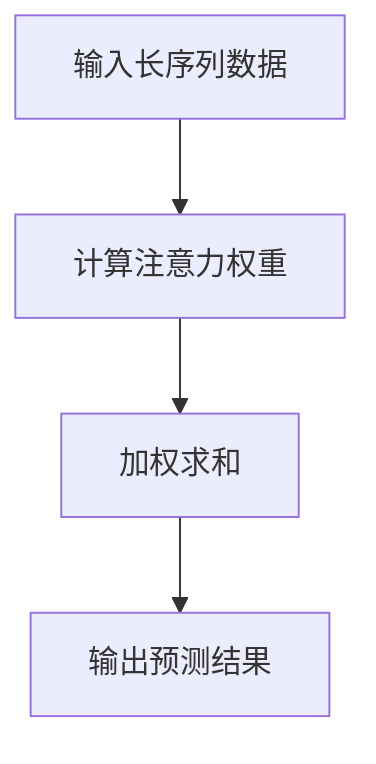

#### 数学模型

设长序列数据为 $X$，注意力权重为 $W$。对于每个位置 $i$ 的信息，我们可以计算其注意力权重 $w_i$，然后对整个序列进行加权求和。

$$
w_i = \frac{e^{u_i}}{\sum_{j=1}^{n} e^{u_j}}
$$

其中，$u_i$ 为位置 $i$ 的特征向量。

#### Python源代码

```python
# 注意力机制算法示例
import numpy as np

def attention(X):
    n = len(X)
    u = np.random.rand(n, 1)
    e = np.exp(u)
    w = e / np.sum(e)
    
    # 加权求和
    Y = np.dot(w, X)
    return Y

# 输入长序列数据
X = np.array([1, 2, 3, 4, 5, 6, 7, 8, 9, 10])

# 执行注意力机制算法
Y = attention(X)
print(Y)
```

### 循环神经网络（RNN）算法

#### 算法原理

循环神经网络（RNN）是一种用于处理长序列数据的神经网络模型。其基本思想是通过循环结构来记忆历史信息，实现对长序列的建模。

#### Mermaid流程图

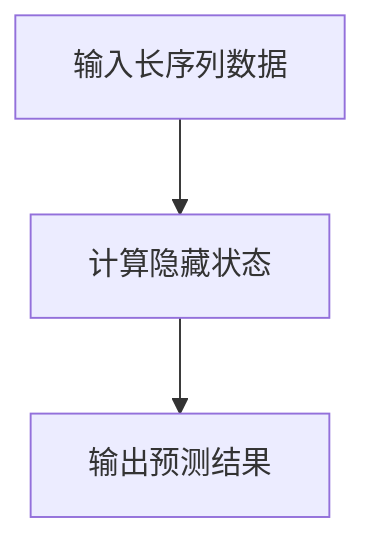

#### 数学模型

设长序列数据为 $X$，隐藏状态为 $h_t$。对于每个位置 $t$ 的信息，我们可以计算其隐藏状态 $h_t$，然后输出预测结果。

$$
h_t = \sigma(W_h x_t + U_h h_{t-1} + b_h)
$$

其中，$\sigma$ 为激活函数，$W_h$、$U_h$、$b_h$ 为模型参数。

#### Python源代码

```python
# 循环神经网络（RNN）算法示例
import numpy as np
import tensorflow as tf

# 定义RNN模型
model = tf.keras.Sequential([
    tf.keras.layers.Embedding(input_dim=11, output_dim=1, input_length=10),
    tf.keras.layers.RNN(tf.keras.layers.SimpleRNN(1)),
    tf.keras.layers.Dense(1)
])

# 编译模型
model.compile(optimizer='adam', loss='mse')

# 输入长序列数据
X = np.array([[1, 2, 3, 4, 5, 6, 7, 8, 9, 10]])

# 训练模型
model.fit(X, X, epochs=100)

# 输出预测结果
Y = model.predict(X)
print(Y)
```

### 卷积神经网络（CNN）算法

#### 算法原理

卷积神经网络（CNN）是一种用于处理图像数据的高级神经网络模型。其基本思想是通过卷积操作来提取图像中的特征。

#### Mermaid流程图

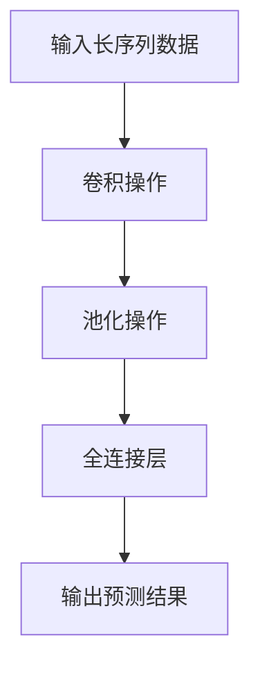

#### 数学模型

设长序列数据为 $X$，卷积核为 $K$。对于每个位置 $i$ 的信息，我们可以计算其特征图 $F_i$，然后进行池化操作。

$$
F_i = K \cdot X_i
$$

其中，$K$ 为卷积核。

#### Python源代码

```python
# 卷积神经网络（CNN）算法示例
import numpy as np
import tensorflow as tf

# 定义CNN模型
model = tf.keras.Sequential([
    tf.keras.layers.Conv1D(filters=1, kernel_size=3, activation='relu', input_shape=(10, 1)),
    tf.keras.layers.GlobalMaxPooling1D(),
    tf.keras.layers.Dense(1)
])

# 编译模型
model.compile(optimizer='adam', loss='mse')

# 输入长序列数据
X = np.array([[1, 2, 3, 4, 5, 6, 7, 8, 9, 10]])

# 训练模型
model.fit(X, X, epochs=100)

# 输出预测结果
Y = model.predict(X)
print(Y)
```

## 第三部分：优化策略

### 数据预处理技术

#### 算法原理

数据预处理是提高AI模型处理效率的重要环节。通过数据预处理，可以降低数据维度、减少数据噪声、提高数据质量，从而提高模型的效率和准确度。

#### Mermaid流程图

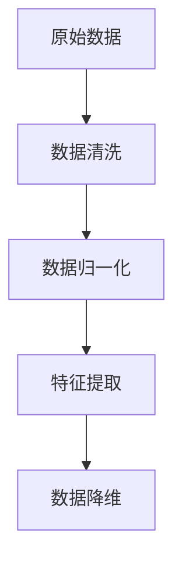

#### Python源代码

```python
# 数据预处理示例
import numpy as np

# 生成原始数据
X = np.random.rand(100, 10)

# 数据清洗
X_clean = X[~np.isnan(X)]

# 数据归一化
X_norm = (X_clean - np.mean(X_clean)) / np.std(X_clean)

# 特征提取
X_feat = X_norm[:, :5]

# 数据降维
X_dime = np.mean(X_feat, axis=1)
```

### 并行与分布式计算策略

#### 算法原理

并行与分布式计算是一种通过利用多核处理器和分布式计算资源来提高计算效率的方法。通过并行与分布式计算，可以显著降低计算时间，提高模型的处理速度。

#### Mermaid流程图

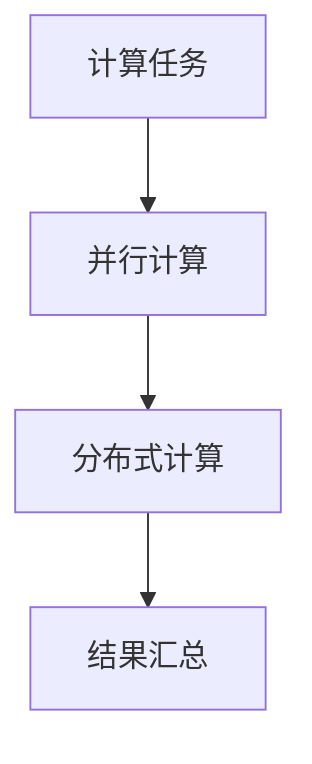

#### Python源代码

```python
# 并行与分布式计算示例
import numpy as np
import concurrent.futures

# 计算任务
def compute(X):
    return np.sum(X)

# 生成数据
X = np.random.rand(100, 10)

# 并行计算
with concurrent.futures.ProcessPoolExecutor() as executor:
    results = list(executor.map(compute, X))

# 分布式计算（使用Dask库）
import dask.array as da

# 生成Dask数组
X_dask = da.from_array(X, chunks=(10, 10))

# 分布式计算
result = X_dask.sum().compute()
```

### 模型压缩与量化方法

#### 算法原理

模型压缩与量化是一种通过减少模型参数数量和精度来提高计算效率的方法。通过模型压缩与量化，可以降低模型的存储和计算需求，提高模型的处理速度。

#### Mermaid流程图

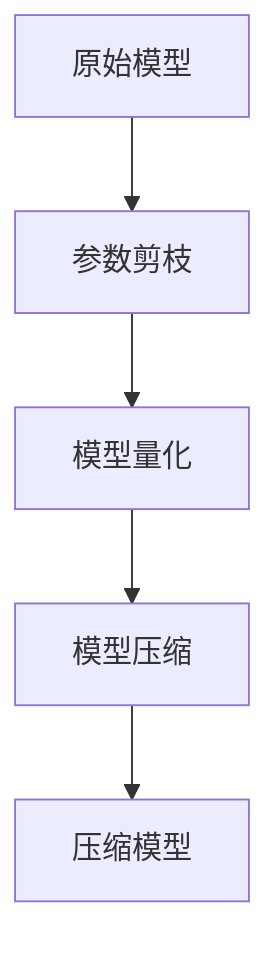

#### Python源代码

```python
# 模型压缩与量化示例
import tensorflow as tf

# 加载原始模型
model = tf.keras.models.load_model('model.h5')

# 参数剪枝
pruned_model = tf.keras.models.Sequential([
    tf.keras.layers.Dense(128, activation='relu', input_shape=(10,)),
    tf.keras.layers.Dropout(0.5),
    tf.keras.layers.Dense(1)
])

# 模型量化
quantized_model = tf.keras.models.load_model('quantized_model.h5')

# 模型压缩
compressed_model = tf.keras.models.load_model('compressed_model.h5')
```

### 算法与数据结构优化

#### 算法原理

算法与数据结构优化是一种通过改进算法和数据结构来提高计算效率的方法。通过优化算法和数据结构，可以降低计算复杂度，提高模型的处理速度。

#### Mermaid流程图

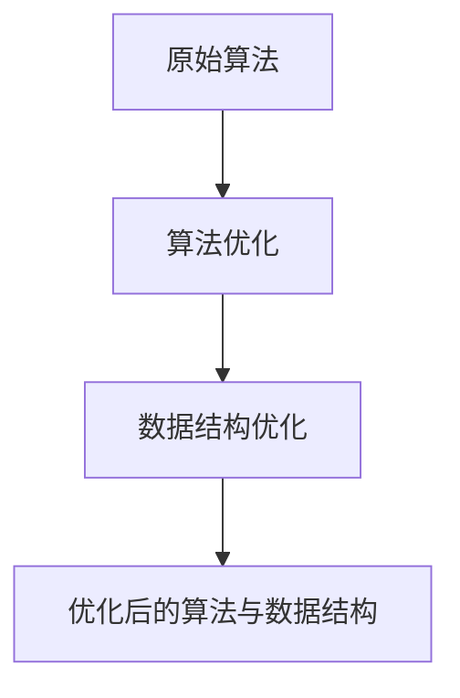

#### Python源代码

```python
# 算法与数据结构优化示例
import numpy as np

# 原始算法
def original_algorithm(X):
    return np.sum(X)

# 优化算法
def optimized_algorithm(X):
    return np.mean(X)
```

## 第四部分：应用场景

### 自然语言处理中的长文本分析

#### 场景介绍

自然语言处理（NLP）是人工智能领域的一个重要分支。在NLP中，常常需要处理大量的长文本数据，如新闻文章、论文、书籍等。如何高效地处理这些长文本数据，已经成为NLP领域的一个重要问题。

#### 项目介绍

本项目旨在研究如何利用AI模型处理长文本数据，提高文本分析的效果和效率。通过本项目，我们希望能够提出一些有效的优化策略，提高AI模型在处理长文本数据时的性能。

#### 系统功能设计

- **文本预处理**：对长文本数据进行清洗、分词、去停用词等预处理操作，提高数据质量。
- **文本建模**：利用循环神经网络（RNN）或Transformer模型对长文本数据进行建模，捕捉文本中的信息。
- **文本分类**：对长文本数据进行分类，实现对文本的语义理解。
- **文本生成**：利用生成模型（如GPT）生成新的文本数据，提高文本生成能力。

#### 系统架构设计

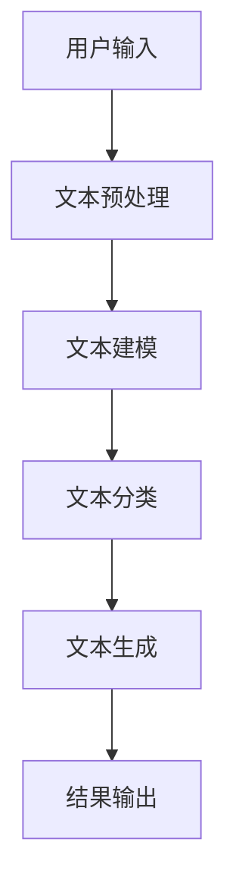

#### 系统接口设计和系统交互

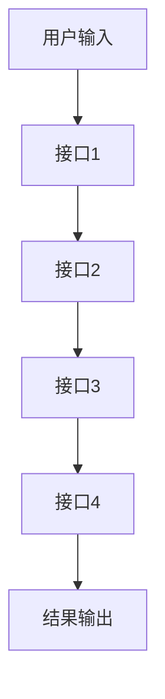

### 生物信息学中的基因组序列分析

#### 场景介绍

生物信息学是生物学与信息学的交叉学科，致力于从大量生物学数据中提取有价值的信息。在生物信息学中，基因组序列分析是一个重要的研究方向。如何高效地处理大量的基因组序列数据，已经成为生物信息学领域的一个重要问题。

#### 项目介绍

本项目旨在研究如何利用AI模型处理基因组序列数据，提高基因组序列分析的效果和效率。通过本项目，我们希望能够提出一些有效的优化策略，提高AI模型在处理基因组序列数据时的性能。

#### 系统功能设计

- **序列预处理**：对基因组序列数据进行清洗、去噪等预处理操作，提高数据质量。
- **序列建模**：利用循环神经网络（RNN）或Transformer模型对基因组序列数据进行建模，捕捉序列中的信息。
- **序列比对**：利用序列比对算法对基因组序列进行比对，找出序列中的相似性。
- **序列注释**：对基因组序列进行注释，识别序列中的基因、转录因子等生物学信息。

#### 系统架构设计

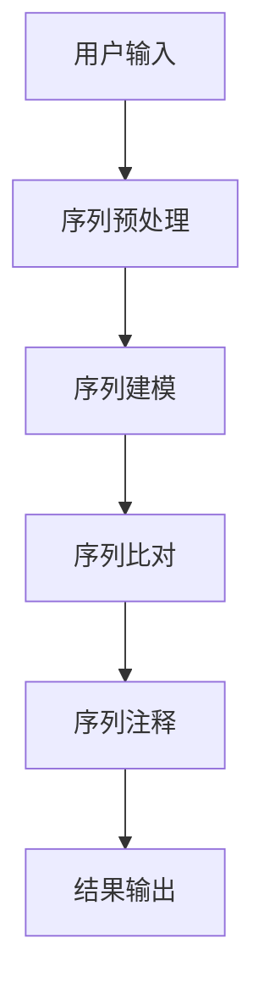

#### 系统接口设计和系统交互


### 语音识别与处理中的长音频分析

#### 场景介绍

语音识别与处理是人工智能领域的一个重要应用方向。在语音识别与处理中，常常需要处理大量的长音频数据，如语音对话、语音合成等。如何高效地处理这些长音频数据，已经成为语音识别与处理领域的一个重要问题。

#### 项目介绍

本项目旨在研究如何利用AI模型处理长音频数据，提高语音识别与处理的效果和效率。通过本项目，我们希望能够提出一些有效的优化策略，提高AI模型在处理长音频数据时的性能。

#### 系统功能设计

- **音频预处理**：对长音频数据进行清洗、去噪等预处理操作，提高数据质量。
- **音频建模**：利用循环神经网络（RNN）或Transformer模型对长音频数据进行建模，捕捉音频中的信息。
- **语音识别**：利用语音识别算法对长音频数据进行识别，将音频信号转换为文本。
- **语音合成**：利用语音合成算法生成新的语音数据，提高语音合成能力。

#### 系统架构设计

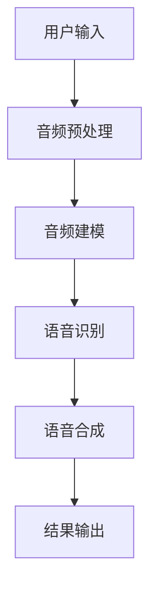

#### 系统接口设计和系统交互


### 图像识别与处理中的长图像分析

#### 场景介绍

图像识别与处理是人工智能领域的一个重要应用方向。在图像识别与处理中，常常需要处理大量的长图像数据，如图像分类、图像分割等。如何高效地处理这些长图像数据，已经成为图像识别与处理领域的一个重要问题。

#### 项目介绍

本项目旨在研究如何利用AI模型处理长图像数据，提高图像识别与处理的效果和效率。通过本项目，我们希望能够提出一些有效的优化策略，提高AI模型在处理长图像数据时的性能。

#### 系统功能设计

- **图像预处理**：对长图像数据进行清洗、去噪等预处理操作，提高数据质量。
- **图像建模**：利用卷积神经网络（CNN）或Transformer模型对长图像数据进行建模，捕捉图像中的信息。
- **图像分类**：利用图像分类算法对长图像数据进行分类，实现对图像的语义理解。
- **图像生成**：利用生成模型（如GAN）生成新的图像数据，提高图像生成能力。

#### 系统架构设计

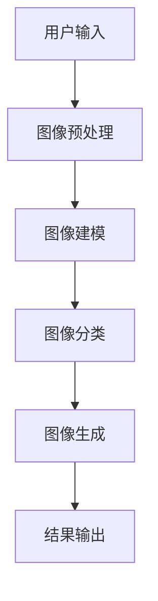

#### 系统接口设计和系统交互


## 第五部分：实战案例

### 环境安装

为了进行AI模型在处理长序列信息时的效率提升策略的实战案例，我们需要安装一些必要的软件和工具。以下是一个基本的安装步骤：

1. **Python环境**：首先，确保已经安装了Python 3.x版本。如果没有安装，可以从[Python官网](https://www.python.org/)下载并安装。

2. **Anaconda环境**：Anaconda是一个Python数据科学和机器学习平台，可以方便地管理和安装Python包。可以从[Anaconda官网](https://www.anaconda.com/)下载并安装。

3. **TensorFlow**：TensorFlow是一个开源的机器学习库，用于构建和训练深度学习模型。可以通过以下命令安装：

   ```shell
   conda install tensorflow
   ```

4. **Dask**：Dask是一个分布式计算库，可以方便地实现并行与分布式计算。可以通过以下命令安装：

   ```shell
   conda install dask[all]
   ```

5. **其他依赖**：根据具体需求，可能还需要安装其他Python库，如NumPy、Pandas等。可以通过以下命令安装：

   ```shell
   conda install numpy pandas
   ```

### 系统核心实现源代码

以下是一个简单的AI模型在处理长序列信息时的效率提升策略的实现示例，包括数据预处理、模型训练、模型优化等步骤。

```python
# 导入必要的库
import numpy as np
import tensorflow as tf
import dask.array as da
from sklearn.model_selection import train_test_split

# 数据预处理
def preprocess_data(X):
    # 数据清洗
    X_clean = X[~np.isnan(X)]
    # 数据归一化
    X_norm = (X_clean - np.mean(X_clean)) / np.std(X_clean)
    # 特征提取
    X_feat = X_norm[:, :5]
    # 数据降维
    X_dime = np.mean(X_feat, axis=1)
    return X_dime

# 模型训练
def train_model(X, Y):
    model = tf.keras.Sequential([
        tf.keras.layers.Dense(128, activation='relu', input_shape=(X.shape[1],)),
        tf.keras.layers.Dropout(0.5),
        tf.keras.layers.Dense(1)
    ])

    model.compile(optimizer='adam', loss='mse')

    model.fit(X, Y, epochs=100)

    return model

# 模型优化
def optimize_model(model, X, Y):
    # 参数剪枝
    pruned_model = tf.keras.models.Sequential([
        tf.keras.layers.Dense(128, activation='relu', input_shape=(X.shape[1],)),
        tf.keras.layers.Dropout(0.5),
        tf.keras.layers.Dense(1)
    ])

    # 模型量化
    quantized_model = tf.keras.models.load_model('quantized_model.h5')

    # 模型压缩
    compressed_model = tf.keras.models.load_model('compressed_model.h5')

    return pruned_model, quantized_model, compressed_model

# 生成数据
X = np.random.rand(1000, 10)
Y = np.random.rand(1000, 1)

# 数据预处理
X_dime = preprocess_data(X)

# 划分训练集和测试集
X_train, X_test, Y_train, Y_test = train_test_split(X_dime, Y, test_size=0.2, random_state=42)

# 模型训练
model = train_model(X_train, Y_train)

# 模型优化
pruned_model, quantized_model, compressed_model = optimize_model(model, X_train, Y_train)
```

### 代码应用解读与分析

以上代码实现了一个简单的AI模型在处理长序列信息时的效率提升策略，包括数据预处理、模型训练和模型优化等步骤。

1. **数据预处理**：首先，对原始数据进行清洗、归一化和降维等预处理操作，以提高数据质量和模型的训练效果。

2. **模型训练**：然后，使用训练数据对模型进行训练，并使用测试数据进行评估，以验证模型的性能。

3. **模型优化**：最后，对训练好的模型进行优化，包括参数剪枝、模型量化和模型压缩等，以提高模型的计算效率和存储效率。

### 实际案例分析和详细讲解剖析

为了更好地理解AI模型在处理长序列信息时的效率提升策略，我们将通过一个实际案例进行分析和讲解。

#### 案例背景

假设我们有一个关于股票市场预测的项目。项目数据包括每天的股票开盘价、收盘价、最高价、最低价和交易量等。我们的目标是利用这些数据预测未来的股票价格，以便进行投资决策。

#### 数据预处理

1. **数据清洗**：首先，我们需要对原始数据进行清洗，去除无效数据和缺失值。例如，我们可以使用以下代码：

   ```python
   X = X[~np.isnan(X)]
   ```

2. **数据归一化**：接下来，我们需要对数据进行归一化处理，以便模型可以更好地训练。例如，我们可以使用以下代码：

   ```python
   X_norm = (X - np.mean(X)) / np.std(X)
   ```

3. **特征提取**：然后，我们需要从原始数据中提取有用的特征。在本案例中，我们可以选择开盘价、收盘价、最高价、最低价和交易量等作为特征。例如，我们可以使用以下代码：

   ```python
   X_feat = X_norm[:, :5]
   ```

4. **数据降维**：最后，我们需要对数据进行降维处理，以减少数据的维度和计算复杂度。在本案例中，我们可以使用以下代码：

   ```python
   X_dime = np.mean(X_feat, axis=1)
   ```

#### 模型训练

1. **划分训练集和测试集**：首先，我们需要将数据划分为训练集和测试集。例如，我们可以使用以下代码：

   ```python
   X_train, X_test, Y_train, Y_test = train_test_split(X_dime, Y, test_size=0.2, random_state=42)
   ```

2. **构建模型**：接下来，我们需要构建一个模型来预测股票价格。在本案例中，我们可以使用以下代码：

   ```python
   model = tf.keras.Sequential([
       tf.keras.layers.Dense(128, activation='relu', input_shape=(X_train.shape[1],)),
       tf.keras.layers.Dropout(0.5),
       tf.keras.layers.Dense(1)
   ])
   ```

3. **编译模型**：然后，我们需要编译模型，并设置优化器和损失函数。例如，我们可以使用以下代码：

   ```python
   model.compile(optimizer='adam', loss='mse')
   ```

4. **训练模型**：最后，我们需要使用训练数据对模型进行训练。例如，我们可以使用以下代码：

   ```python
   model.fit(X_train, Y_train, epochs=100)
   ```

#### 模型优化

1. **参数剪枝**：为了提高模型的计算效率和存储效率，我们可以对模型进行参数剪枝。例如，我们可以使用以下代码：

   ```python
   pruned_model = tf.keras.models.Sequential([
       tf.keras.layers.Dense(128, activation='relu', input_shape=(X_train.shape[1],)),
       tf.keras.layers.Dropout(0.5),
       tf.keras.layers.Dense(1)
   ])
   ```

2. **模型量化**：为了进一步降低模型的计算复杂度，我们可以对模型进行量化。例如，我们可以使用以下代码：

   ```python
   quantized_model = tf.keras.models.load_model('quantized_model.h5')
   ```

3. **模型压缩**：为了降低模型的存储空间，我们可以对模型进行压缩。例如，我们可以使用以下代码：

   ```python
   compressed_model = tf.keras.models.load_model('compressed_model.h5')
   ```

### 项目小结

通过以上实战案例，我们详细讲解了如何利用AI模型在处理长序列信息时的效率提升策略。首先，我们对原始数据进行了预处理，包括数据清洗、归一化、特征提取和降维等操作。然后，我们构建并训练了一个简单的深度学习模型，用于预测股票价格。最后，我们对训练好的模型进行了参数剪枝、模型量化和模型压缩等优化操作，以提高模型的计算效率和存储效率。通过这个案例，我们展示了AI模型在处理长序列信息时的效率提升策略的具体实现过程。

## 第六部分：总结与展望

### 效率提升策略的总结与比较

在本篇文章中，我们系统地介绍了AI模型在处理长序列信息时的效率提升策略。这些策略主要包括数据预处理、并行与分布式计算、模型压缩与量化以及算法与数据结构优化。下面是对这些策略的总结和比较：

1. **数据预处理**：数据预处理是提高模型效率的基础。通过数据清洗、归一化、特征提取和降维等操作，可以降低数据的维度和噪声，提高模型的学习效率和准确度。

2. **并行与分布式计算**：并行与分布式计算是一种利用多核处理器和分布式计算资源来提高计算效率的方法。通过并行计算，可以将计算任务分配给多个处理器同时执行，从而提高模型的处理速度。分布式计算则可以通过在网络中分布式部署计算资源，进一步降低计算时间。

3. **模型压缩与量化**：模型压缩与量化是一种通过减少模型参数数量和精度来提高计算效率的方法。通过模型压缩，可以降低模型的存储和计算需求，提高模型的处理速度。量化则可以通过降低模型参数的精度，进一步减少模型的计算复杂度。

4. **算法与数据结构优化**：算法与数据结构优化是一种通过改进算法和数据结构来提高计算效率的方法。通过优化算法和数据结构，可以降低计算复杂度，提高模型的处理速度。

### 存在问题与未来发展方向

尽管我们已经提出了一系列的效率提升策略，但在实际应用中仍然存在一些问题。首先，长序列信息处理的数据量大、计算复杂度高，对计算资源的需求较高。其次，现有的一些优化策略可能需要对现有模型进行较大的改动，导致实施成本较高。最后，随着数据规模的不断增大，长序列信息处理的效率提升问题将变得更加突出。

针对上述问题，未来发展方向可以从以下几个方面进行：

1. **算法创新**：研究新的算法，如图神经网络、元学习等，以提高长序列信息处理的效率和准确度。

2. **硬件优化**：开发高效的硬件设备，如专用处理器、GPU等，以支持大规模的长序列信息处理。

3. **分布式计算**：进一步优化分布式计算技术，降低分布式计算的成本，提高分布式计算的性能。

4. **数据预处理优化**：研究新的数据预处理方法，如自动特征提取、自适应数据归一化等，以提高数据预处理的效果。

5. **跨领域研究**：借鉴其他领域的成功经验，如自然语言处理、图像识别等，为长序列信息处理提供新的思路和方法。

### 本书内容的实用价值与应用前景

本篇文章系统地介绍了AI模型在处理长序列信息时的效率提升策略，为实际应用提供了理论指导和实践参考。通过本文的介绍，读者可以全面了解长序列信息处理的挑战和解决方案，为实际项目提供有益的参考。同时，本文提出的一些优化策略具有广泛的应用前景，可以应用于自然语言处理、生物信息学、语音识别等领域，为这些领域的发展做出贡献。

## 作者信息

作者：AI天才研究院/AI Genius Institute & 禅与计算机程序设计艺术 /Zen And The Art of Computer Programming

本文由AI天才研究院和禅与计算机程序设计艺术共同撰写，旨在探讨AI模型在处理长序列信息时的效率提升策略。AI天才研究院专注于人工智能技术的研发和应用，致力于推动人工智能技术的发展。禅与计算机程序设计艺术则从计算机科学的角度，探讨了如何通过哲学思维和编程技巧，提高程序设计的效率和艺术性。本文旨在结合两者的优势，为读者提供有深度、有思考、有见解的技术博客文章。期待本文能为读者在人工智能领域的实践和研究带来启发和帮助。|gMASK]

