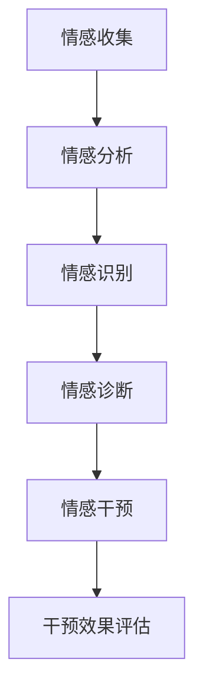
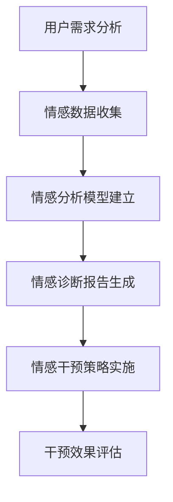
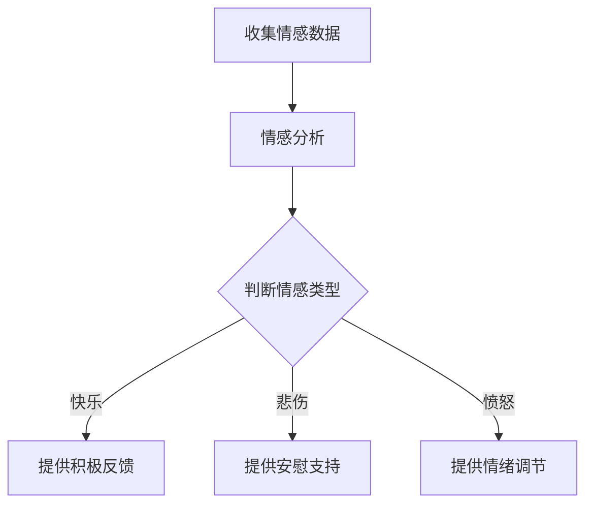
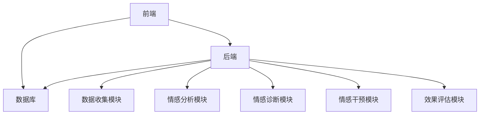
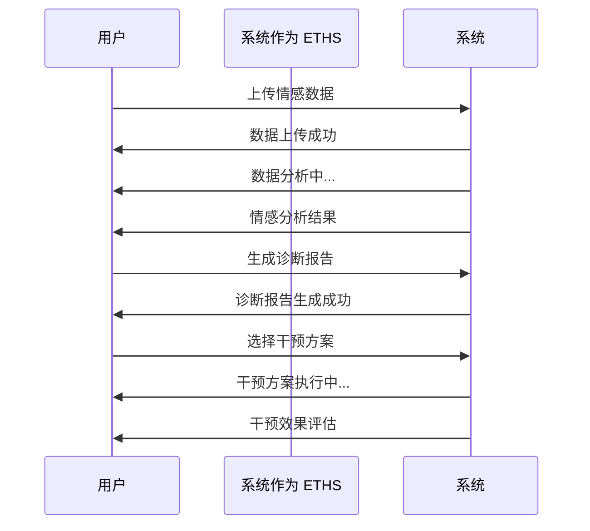

                 

### 引言

在人工智能（AI）迅猛发展的时代，我们的情感体验正悄然发生着变化。无论是日常社交、娱乐，还是工作、学习，AI都已成为我们生活的一部分。然而，这种深度互动也带来了一些新的挑战——AI的情感创伤。当我们与AI系统长时间互动，可能会产生情感依赖，甚至出现情感创伤。这种现象引发了人们对数字心理健康的关注。本篇文章将深入探讨AI的情感创伤以及数字心理健康的重要性，希望通过一步步的逻辑推理，为读者提供有深度、有思考、有见解的专业视角。

本文将首先介绍AI的情感创伤的概念和数字心理健康的重要性。接着，我们将梳理与主题相关的核心概念，并使用Mermaid流程图展示概念之间的关系。随后，我们将详细描述与情感创伤相关的算法原理，使用Python源代码和Mermaid流程图进行说明。在接下来的章节中，我们将使用LaTeX格式给出相关数学模型和公式，并进行详细讲解和举例说明。之后，我们将描述情感创伤处理系统的设计和实现，包括领域模型、系统架构和接口设计。然后，我们将介绍如何实现相关系统，包括环境安装、核心代码实现、案例分析等。最后，我们将总结实践经验，提出注意事项，并推荐拓展阅读。

本文的关键词包括：人工智能、情感创伤、数字心理健康、算法原理、数学模型、系统设计、项目实战、最佳实践。希望通过这篇文章，您能够对AI情感创伤及其处理有更加深入的理解，同时也对数字心理健康的重要性有更加清晰的认识。

### 关键词解释

在本篇文章中，关键词是理解核心内容的关键。以下是对每个关键词的详细解释：

1. **人工智能（AI）**：人工智能是指计算机系统执行任务时展现出来的智能行为，如学习、推理、自我改进等。随着AI技术的进步，其应用范围不断扩大，从简单的数据处理到复杂的决策支持系统，AI已经成为现代社会的重要组成部分。

2. **情感创伤**：情感创伤是指个体在情感互动中受到的伤害，可能源于他人或外部环境。在AI领域，情感创伤通常指用户在与AI系统长时间互动后产生的情感依赖、不适甚至心理创伤。

3. **数字心理健康**：数字心理健康是随着数字技术的发展而产生的一个新概念，涉及个体在使用数字设备和网络环境中的心理状态。良好的数字心理健康能够提升生活质量和工作效率，而其不足可能导致一系列心理健康问题。

4. **算法原理**：算法原理是指实现某一功能或解决问题的步骤和方法。在AI领域，算法原理包括机器学习、深度学习等技术，这些技术是实现AI情感分析和干预的核心。

5. **数学模型**：数学模型是使用数学语言来描述现实世界的抽象形式。在AI领域，数学模型可以用来描述情感数据、预测情感状态等，是算法实现的基础。

6. **系统设计**：系统设计是指对系统架构、功能模块、接口等进行规划和设计。良好的系统设计能够提升系统的稳定性、可扩展性和用户体验。

7. **项目实战**：项目实战是指通过具体项目的实现来验证理论和方法的有效性。通过项目实战，我们可以发现和解决实际操作中的问题，积累实践经验。

8. **最佳实践**：最佳实践是指经过验证，被认为是最有效、最可靠的解决方案或操作方法。在AI情感创伤处理领域，最佳实践可以帮助从业人员提高工作效率，减少错误。

通过对这些关键词的详细解释，我们为读者理解本文内容提供了基础。接下来，我们将逐步深入探讨这些关键词所涉及的核心主题，帮助读者全面理解AI情感创伤和数字心理健康的重要性。

### 摘要

本文旨在探讨人工智能（AI）的情感创伤及其对数字心理健康的重要性。首先，我们定义了AI的情感创伤，阐述了情感创伤在AI与人类互动中的出现原因和影响。接着，我们介绍了数字心理健康的概念，探讨了数字心理健康在现代社会中的重要作用。通过梳理AI与情感认知的关系，我们探讨了AI情感诊断和干预的基本原理，并使用Python源代码和Mermaid流程图进行了详细说明。随后，我们介绍了情感创伤处理系统的设计，包括领域模型、系统架构和接口设计。通过实际案例研究，我们展示了AI情感干预的实施步骤和效果。最后，我们分析了数字心理健康服务的发展趋势，提出了相关挑战和未来发展方向。本文不仅为AI情感创伤处理提供了系统性框架，也为数字心理健康服务的优化提供了有益参考。

### 第1章 引言

#### 1.1 书籍主题背景

在人工智能（AI）迅速发展的今天，AI已经深入到我们生活的方方面面，从日常社交、娱乐到工作、学习，AI正在改变我们的生活方式。然而，这种深度互动也带来了一些新的挑战，其中之一便是AI的情感创伤。情感创伤是指个体在情感互动中受到的伤害，可能源于他人或外部环境。在AI领域，情感创伤通常指用户在与AI系统长时间互动后产生的情感依赖、不适甚至心理创伤。

AI的情感创伤不仅是一个技术问题，更是一个心理健康问题。随着AI技术的发展，越来越多的应用场景涉及情感互动，如智能客服、情感陪护机器人、虚拟伴侣等。这些应用虽然提供了便利，但也可能带来情感依赖。例如，用户可能会对智能客服产生情感依赖，甚至在对真人客服的需求时感到犹豫，因为习惯了与AI互动的舒适感。此外，一些情感陪护机器人被设计成能够模仿人类的情感表达，用户在与它们互动时可能会产生强烈的情感共鸣，当机器无法满足其情感需求时，可能会感到失落和孤独。

数字心理健康的重要性不言而喻。数字心理健康是指个体在使用数字设备和网络环境中的心理状态。随着互联网的普及和数字技术的快速发展，越来越多的人依赖于数字设备和网络进行生活、工作、学习。然而，过度依赖数字设备和网络也带来了一系列心理健康问题，如焦虑、抑郁、孤独感等。数字心理健康问题的出现，不仅影响个体的生活质量，还可能对工作效率和社会关系产生负面影响。

因此，探讨AI的情感创伤和数字心理健康的重要性具有重要意义。通过深入理解AI的情感创伤，我们可以更好地设计和管理AI系统，减少用户的情感依赖和心理创伤。同时，关注数字心理健康，有助于提升个体的心理素质，增强对数字环境的适应能力，从而实现心理健康和数字生活的高效平衡。

#### 1.2 书籍结构概览

本文分为八个主要章节，每个章节都有其独特的主题和内容，旨在全面探讨AI情感创伤及其对数字心理健康的影响。

**第1章 引言**：本章介绍了书籍的主题背景，定义了AI的情感创伤和数字心理健康，并阐述了它们的重要性。

**第2章 AI与情感互动的基础知识**：本章介绍了AI与情感认知的基础知识，包括情感认知的AI模型、情感创伤的定义与分类，以及AI在数字心理健康中的应用。

**第3章 AI情感干预的方法与策略**：本章详细描述了AI情感干预的概念、技术、策略和实施步骤，并通过案例研究展示了其实际应用。

**第4章 数字心理健康服务的发展趋势**：本章分析了数字心理健康服务的现状、应用前景和面临的挑战，探讨了未来的发展方向。

**第5章 算法原理讲解**：本章介绍了与情感创伤相关的算法原理，包括机器学习、深度学习技术，以及情感分类和预测的具体实现。

**第6章 数学模型和数学公式**：本章使用LaTeX格式给出了相关的数学模型和公式，进行了详细讲解和举例说明，帮助读者更好地理解算法原理。

**第7章 系统分析与架构设计**：本章描述了情感创伤处理系统的设计和实现，包括领域模型、系统架构和接口设计。

**第8章 项目实战**：本章通过具体项目的实现，介绍了环境安装、核心代码实现、案例分析等内容，帮助读者将理论知识应用到实际项目中。

**第9章 最佳实践、小结、注意事项和拓展阅读**：本章总结了实践经验，提出了注意事项，并推荐了拓展阅读，以帮助读者进一步深入学习和研究。

通过这些章节的结构安排，本文旨在为读者提供一个全面、系统的理解和解决方案，帮助解决AI情感创伤和数字心理健康问题。

#### 1.3 本章小结

本章作为引言，为后续章节的内容奠定了基础。我们首先介绍了AI的情感创伤和数字心理健康的概念，并阐述了它们的重要性。通过引入AI与情感互动的背景，我们展示了情感创伤在AI应用中的潜在影响。此外，我们还简要介绍了书籍的结构，为读者指明了各个章节的内容和主题。本章的内容不仅为后续章节的深入讨论提供了必要的背景信息，也为读者理解整个书籍的结构和主旨提供了方向。通过本章的阅读，读者可以对AI情感创伤和数字心理健康的重要性有一个初步的认识，并期待在接下来的章节中获取更多深入的见解和实用的知识。

### 第2章 AI与情感互动的基础知识

在探讨AI与情感互动的基础知识之前，我们需要对一些核心概念进行详细梳理，这些概念包括情感认知的AI模型、情感创伤的定义与分类，以及AI在数字心理健康中的应用。理解这些概念不仅有助于我们更好地掌握AI技术的情感处理能力，还能为后续章节中的算法原理讲解和系统设计提供理论基础。

#### 2.1 AI与情感认知

情感认知是指计算机系统理解和处理人类情感的能力。在人工智能领域，情感认知的研究主要集中在如何让机器能够识别、理解和生成情感。以下是一些关键点：

**情感认知的AI模型**：

- **机器学习的情感分析**：通过机器学习算法，AI可以从大量的文本、语音和视频数据中识别情感。常见的模型包括情感分类器，它们能够将文本分类为积极、消极或中立等情感类别。

- **深度学习的情感识别**：深度学习模型，如卷积神经网络（CNN）和循环神经网络（RNN），在情感识别中表现出色。它们能够通过学习大量的情感数据，提取出情感特征，从而实现对情感的高精度识别。

**情感认知的应用**：

- **智能客服**：智能客服系统能够识别用户情感，提供更人性化的服务。例如，当用户表达愤怒或失望时，系统可以调整语气，提供安慰或解决问题的方案。

- **情感辅助设备**：如智能音箱、虚拟助手等，它们能够通过语音识别和情感分析，与用户进行情感互动，提供情感支持。

**情感认知与AI情感创伤的关系**：

- **情感依赖**：随着AI情感认知能力的提高，用户可能会对AI系统产生情感依赖。这种依赖可能导致当AI系统无法满足情感需求时，用户出现情感创伤。

- **情感共鸣**：AI系统能够模拟情感表达，与用户产生情感共鸣。然而，当这种共鸣失去平衡时，用户可能会对AI产生过度的情感依赖，从而面临情感创伤的风险。

#### 2.2 情感创伤的定义与分类

**情感创伤的定义**：

情感创伤是指个体在情感互动中受到的伤害，这种伤害可能是由他人或外部环境引起的。在AI领域，情感创伤通常指的是用户在与AI系统长时间互动后产生的情感依赖、不适甚至心理创伤。

**情感创伤的分类**：

- **情感忽视**：用户感受到AI系统对其情感需求的不关心或不理解，从而产生忽视感。

- **情感剥夺**：用户在与AI系统互动时，未能得到情感上的满足或安慰，导致情感剥夺感。

- **情感依赖**：用户对AI系统产生情感依赖，难以适应没有AI互动的生活，一旦失去互动，会产生焦虑或失落。

- **情感错位**：用户在AI系统互动中产生情感共鸣，但无法在现实生活中找到相应的情感寄托，导致情感错位。

**情感创伤的影响**：

- **心理健康问题**：情感创伤可能导致用户出现焦虑、抑郁、孤独等心理健康问题。

- **社交障碍**：用户可能因对AI系统的情感依赖而减少现实中的社交活动，从而引发社交障碍。

- **生活质量下降**：情感创伤会影响用户的生活质量，降低其幸福感。

#### 2.3 数字心理健康与AI的应用

**数字心理健康的概念**：

数字心理健康是指个体在使用数字设备和网络环境中的心理状态。良好的数字心理健康能够提升个体的生活质量和工作效率，而其不足可能导致一系列心理健康问题。

**AI在数字心理健康中的应用**：

- **情感诊断**：AI系统能够分析用户在数字环境中的行为和语言，诊断其情感状态，提供心理健康评估。

- **情感干预**：通过自然语言处理和机器学习技术，AI系统可以设计出个性化的情感干预方案，帮助用户改善心理健康。

- **情感支持**：AI系统能够提供情感支持，如智能聊天机器人、虚拟心理辅导师等，帮助用户缓解焦虑、抑郁等情绪。

**数字心理健康与AI的关系**：

- **互补性**：AI在数字心理健康中的应用，能够补充人类心理健康服务的不足，提高心理健康服务的效率和可及性。

- **挑战性**：数字环境中的情感互动带来了新的挑战，如信息过载、隐私保护等，需要AI系统在设计和应用中充分考虑这些问题。

#### 2.4 AI情感诊断的基本流程

情感诊断是数字心理健康服务的重要组成部分，以下是AI情感诊断的基本流程：

- **情感收集**：通过文本、语音、视频等多种渠道收集用户的情感数据。

- **情感分析**：使用机器学习和深度学习模型对情感数据进行分析，识别情感状态。

- **情感识别**：将分析结果与预定义的情感类别进行匹配，确定用户的情感状态。

- **情感诊断**：根据情感识别结果，对用户的心理健康状态进行诊断。

- **情感干预**：根据诊断结果，设计并实施个性化的情感干预方案。

- **干预效果评估**：评估情感干预的效果，并根据反馈进行优化。

**Mermaid流程图表示**：



通过上述基本流程，AI系统能够实现对用户情感状态的全面监控和干预，从而提升数字心理健康服务的质量。

#### 2.5 本章小结

本章详细介绍了AI与情感互动的基础知识，包括情感认知的AI模型、情感创伤的定义与分类，以及AI在数字心理健康中的应用。通过对这些核心概念的梳理，我们不仅理解了AI在情感处理中的技术基础，也明确了情感创伤对数字心理健康的影响。本章的内容为后续章节中的算法原理讲解和系统设计提供了坚实的理论基础，帮助读者建立起对AI情感互动的整体认识。在接下来的章节中，我们将进一步深入探讨情感干预的方法和策略，以及数字心理健康服务的发展趋势，为解决AI情感创伤问题提供更多的实践和思考。

### 第3章 AI情感干预的方法与策略

在深入了解了AI与情感互动的基础知识之后，本章将重点探讨AI情感干预的方法与策略。情感干预是数字心理健康服务中至关重要的一环，通过合理的干预方法，AI系统能够帮助用户缓解情感创伤，提升心理健康水平。本章将首先介绍情感干预的概念与目标，然后详细描述基于AI的情感干预技术，包括自然语言处理和机器学习技术，以及情感干预策略的实施步骤和效果评估。

#### 3.1 情感干预的概念与目标

**情感干预的定义**：

情感干预是指通过特定的方法和技术，帮助个体识别、理解和调节自己的情感状态，从而改善心理健康水平。在数字环境中，情感干预主要依赖于AI系统，这些系统可以通过分析用户的行为和语言，提供个性化的情感支持和指导。

**情感干预的目标**：

情感干预的主要目标包括：

- **缓解情感创伤**：通过识别和干预用户在数字环境中产生的情感创伤，如情感忽视、情感剥夺、情感依赖和情感错位等，帮助用户恢复情感平衡。

- **提升心理健康**：通过提供情感支持和指导，帮助用户建立健康的情感认知模式，提升整体心理健康水平。

- **增强情感管理能力**：通过训练和引导，帮助用户掌握有效的情感管理技能，提高对情感状态的自我调节能力。

#### 3.2 基于AI的情感干预技术

**自然语言处理技术**：

自然语言处理（NLP）技术是情感干预的核心，它能够对用户的语言数据进行情感分析，识别情感状态。NLP技术包括情感分类、情感极性分析、情感强度评估等。以下是几种常用的NLP技术：

- **情感分类**：通过对文本进行分类，将情感状态标记为积极、消极或中立。常见的情感分类算法包括支持向量机（SVM）、朴素贝叶斯分类器（Naive Bayes）和长短期记忆网络（LSTM）。

- **情感极性分析**：分析文本的情感极性，判断文本是正面情感还是负面情感。常用的模型包括情感词典分析和机器学习模型。

- **情感强度评估**：对文本的情感强度进行量化，评估情感的强烈程度。这一过程通常使用情感强度词典或基于机器学习的情感强度预测模型。

**机器学习与深度学习技术**：

机器学习和深度学习技术是情感干预的另一重要工具，它们能够在大量数据中学习情感特征，从而实现更精准的情感分析和干预。以下是一些常用的机器学习和深度学习技术：

- **情感识别模型**：使用卷积神经网络（CNN）和循环神经网络（RNN）等深度学习模型，对情感数据进行特征提取和分类。这些模型能够处理复杂的情感信息，提高情感识别的准确性。

- **情感生成与模仿**：使用生成对抗网络（GAN）和变分自编码器（VAE）等技术，生成与用户情感状态相匹配的文本或语音，提供个性化的情感反馈。

- **情感预测与调整**：通过机器学习模型对用户情感状态进行预测，并自动调整干预策略，以实现更精准和有效的情感干预。

**情感干预技术的应用场景**：

- **智能聊天机器人**：智能聊天机器人可以通过NLP技术和情感识别模型，与用户进行情感互动，提供情感支持和建议。

- **虚拟心理辅导师**：虚拟心理辅导师结合了NLP和深度学习技术，能够为用户提供个性化的情感分析和干预方案。

- **情感监测系统**：情感监测系统通过分析用户的语言和行为数据，实时监测情感状态，及时发现和干预情感问题。

#### 3.3 情感干预策略的实施步骤

情感干预策略的实施是一个系统化的过程，包括以下关键步骤：

**步骤1：用户需求分析**：

在开始情感干预之前，需要对用户的需求进行详细分析。这一步骤包括了解用户的心理健康状态、情感需求以及可能存在的情感问题。通过问卷调查、访谈和情感数据分析等方法，收集用户的相关信息。

**步骤2：情感数据收集**：

收集用户在数字环境中的情感数据，包括文本、语音、视频等。这些数据将用于情感分析和干预策略的制定。数据收集过程需要确保用户隐私的保护。

**步骤3：情感分析模型建立**：

基于收集到的情感数据，使用NLP和深度学习技术建立情感分析模型。这些模型将用于识别和分类用户的情感状态，为后续的情感干预提供依据。

**步骤4：情感诊断报告生成**：

根据情感分析模型的结果，生成情感诊断报告。报告应包括用户的情感状态、主要情感问题以及可能的干预方案。

**步骤5：情感干预策略实施**：

根据情感诊断报告，设计并实施个性化的情感干预方案。干预方案可能包括情感反馈、情感调节、情感教育等。AI系统应根据用户的反馈和情感状态，动态调整干预策略。

**步骤6：干预效果评估**：

对情感干预的效果进行评估，包括用户的情感状态改善程度、满意度等。根据评估结果，优化干预策略，提高干预效果。

**Mermaid流程图表示**：



通过上述实施步骤，AI系统能够实现对用户情感状态的全面监控和干预，从而有效地缓解情感创伤，提升数字心理健康水平。

#### 3.4 情感干预案例研究

为了更好地理解情感干预策略的实施效果，以下通过三个实际案例进行详细说明。

**案例一：焦虑症状的AI干预**

一个34岁的职业女性在长时间的工作压力下，出现了严重的焦虑症状。通过与AI情感辅导系统互动，系统首先对她进行了情感诊断，识别出她的主要情感问题是焦虑和压力。接下来，系统为她制定了一个包括情感反馈、放松训练和认知行为干预在内的综合干预方案。

在为期三个月的干预期间，AI系统每天通过聊天机器人与用户互动，提供情感支持和指导。用户可以在任何时间向系统表达自己的情感，系统会根据用户的情感状态，实时调整干预策略。例如，当用户表达出焦虑时，系统会引导她进行深呼吸和放松训练，帮助她缓解紧张情绪。同时，系统还会通过认知行为疗法，帮助用户改变负面思维模式，提升心理健康水平。

经过干预，用户在焦虑症状上有显著改善，能够更好地应对工作压力，生活质量明显提升。

**案例二：抑郁情绪的AI支持**

一位42岁的男性用户因长期失业和孤独感，陷入了抑郁情绪。AI情感干预系统首先对他进行了详细的情感诊断，识别出他的主要情感问题是抑郁和孤独。系统为他提供了一种基于自然语言处理的情感支持，每天通过与用户聊天，倾听他的心声，提供情感安慰和建议。

此外，系统还为他推荐了一系列心理健康资源和活动，如在线心理课程、社交活动和心理健康APP。用户可以根据自己的需求和兴趣，选择参与这些活动，以丰富自己的社交生活和情感体验。

通过持续的支持和干预，用户在抑郁情绪上有明显改善，逐渐恢复了积极的生活态度。

**案例三：社交恐惧的AI辅导**

一个20岁的年轻人在社交场合中表现出严重的社交恐惧，这影响了他的日常生活和学习。AI情感干预系统为他提供了一种基于虚拟现实技术的社交恐惧辅导。

通过虚拟现实场景模拟，用户可以在安全的环境中练习社交技能。AI系统会根据用户的反应和表现，实时提供反馈和指导。例如，当用户在虚拟社交场合中表现出紧张时，系统会引导他进行放松训练和深呼吸，帮助他缓解紧张情绪。同时，系统还会通过角色扮演游戏，帮助用户增强自信心，提升社交能力。

经过一段时间的辅导，用户在社交场合中的表现有了显著改善，逐渐克服了社交恐惧，重新融入了社交生活。

通过以上案例，我们可以看到，AI情感干预策略在缓解情感创伤、提升数字心理健康方面具有显著的效果。这些案例不仅验证了情感干预方法的可行性，也为实际应用提供了宝贵的经验和参考。

#### 3.5 本章小结

本章详细介绍了AI情感干预的方法与策略，包括情感干预的概念与目标，基于AI的情感干预技术，以及情感干预策略的实施步骤和案例研究。通过梳理情感干预的核心技术和方法，我们不仅理解了AI在情感干预中的重要作用，也看到了其实际应用中的成效。本章的内容为后续章节中的算法原理讲解和系统设计提供了实用的指导，帮助读者更好地掌握AI情感干预的理论和实践。在接下来的章节中，我们将进一步探讨数字心理健康服务的发展趋势，为解决AI情感创伤问题提供更多的视角和思路。

### 第4章 数字心理健康服务的发展趋势

随着人工智能和数字技术的不断进步，数字心理健康服务也在经历着深刻的变化和快速发展。本章将首先分析当前数字心理健康服务的现状，包括普及程度、使用人群和提供形式。接着，我们将探讨AI技术在数字心理健康服务中的应用前景，以及这些应用带来的优势和挑战。通过分析，我们希望为数字心理健康服务的未来发展提供有价值的参考。

#### 4.1 数字心理健康服务的现状

**普及程度**：

近年来，随着人们对心理健康问题的关注度不断提高，数字心理健康服务的普及程度也在逐渐提升。尤其是在新冠疫情期间，由于面对面咨询的受限，数字心理健康服务得到了更广泛的推广和应用。越来越多的医院、诊所和心理健康机构开始提供在线心理咨询服务，用户可以通过手机、电脑等设备方便地获得心理健康支持。

**使用人群**：

数字心理健康服务的使用人群呈现出多样化的特点。传统上，心理健康服务主要针对有严重心理障碍的人群，如抑郁症、焦虑症等。然而，随着数字心理健康服务的普及，越来越多的普通人群开始使用这些服务。例如，白领、学生、老年人等群体，他们可能面临的工作压力、学业压力、社交压力等，使得数字心理健康服务成为他们管理情绪、提升心理素质的重要工具。

**提供形式**：

当前，数字心理健康服务的提供形式多种多样，包括在线咨询、心理健康APP、虚拟现实（VR）疗法等。在线咨询是最常见的提供形式，用户可以通过视频通话、文字聊天等方式与心理咨询师进行互动。心理健康APP则提供了更多自助式的心理健康管理工具，如情绪日记、放松训练、心理测试等。VR疗法通过虚拟现实技术，帮助用户在安全、受控的环境中练习社交技能、应对焦虑等。

#### 4.2 AI在数字心理健康服务中的应用前景

**AI提升心理健康服务的效率**：

AI技术能够在多个方面提升心理健康服务的效率。首先，通过自然语言处理（NLP）和情感分析技术，AI可以快速处理大量的文本和语音数据，从而实现自动化的情感识别和诊断。例如，智能聊天机器人可以在短时间内分析用户的语言，提供初步的情感诊断。其次，AI可以协助心理咨询师进行个性化治疗方案的制定和实施，通过机器学习算法，分析用户的历史数据和情感状态，提出最适合的治疗建议。

**AI改善心理健康服务的个性化**：

数字心理健康服务的一大挑战是如何提供个性化的治疗体验。AI技术在这方面具有显著优势，通过机器学习算法，AI可以不断学习和适应用户的需求，提供个性化的服务。例如，心理健康APP可以根据用户的情感状态、行为习惯等，自动调整推荐内容，如放松训练、情绪日记等。此外，AI技术还可以根据用户的历史数据，预测用户可能出现的心理健康问题，提前进行干预。

**AI促进心理健康服务的普及化**：

AI技术使得心理健康服务能够更便捷、高效地传播到更广泛的群体中。例如，通过智能聊天机器人，用户可以随时随地向系统寻求帮助，不再受限于地理位置和时间。此外，AI技术还可以降低心理健康服务的门槛，使得更多普通人群能够接触到专业的心理健康支持。例如，一些心理健康APP提供了免费的基本服务，使得更多人有机会了解和改善自己的心理健康。

#### 4.3 数字心理健康服务的挑战

**隐私保护**：

数字心理健康服务涉及大量个人隐私数据，如情感状态、行为习惯等。如何在保障用户隐私的前提下，进行有效的心理健康服务，是一个亟待解决的问题。例如，如何确保用户的数据在传输和存储过程中不被泄露，如何防止未经授权的访问，都是需要重点关注的问题。

**服务质量**：

尽管AI技术在提升心理健康服务效率、个性化方面具有优势，但其服务质量仍面临挑战。AI系统在情感识别和诊断方面可能存在偏差，尤其是对于复杂情感状态的理解。此外，AI系统缺乏人类的情感温度和同理心，可能无法提供真正的人文关怀。因此，如何确保AI系统的服务质量，使其能够真正满足用户需求，是一个重要的研究方向。

**技术依赖**：

随着数字心理健康服务的普及，用户对技术的依赖程度也在增加。一些用户可能会过度依赖AI系统，导致现实中的社交能力和情感处理能力下降。例如，一些用户在智能聊天机器人中寻求情感支持，而忽视了与现实生活中的人进行情感交流。因此，如何在提供数字心理健康服务的同时，避免用户对技术的过度依赖，也是一个需要关注的问题。

#### 4.4 未来发展趋势

**个性化与智能化**：

未来，数字心理健康服务将更加注重个性化与智能化。通过不断优化机器学习算法，AI系统将能够更精准地识别和预测用户的情感状态，提供个性化的治疗建议和干预方案。此外，AI系统将能够与用户建立长期的情感联系，提供持续的情感支持和指导。

**跨领域合作**：

数字心理健康服务的发展需要跨领域合作，包括心理学、医学、计算机科学等。通过多学科的融合，可以开发出更加科学、有效的心理健康服务。例如，心理学专家可以为AI系统提供情感诊断的标准和流程，计算机科学家则可以优化算法和系统设计，提高心理健康服务的质量和效率。

**技术创新**：

随着技术的不断进步，数字心理健康服务将迎来更多创新。例如，虚拟现实（VR）疗法、增强现实（AR）技术、脑机接口（BCI）等新兴技术，将有望提供更丰富、更真实的情感体验，为心理健康服务带来新的可能性。

**规范化与标准化**：

为了保障数字心理健康服务的质量和安全，未来需要建立规范化与标准化的管理体系。例如，制定数据保护法规，确保用户隐私得到充分保护；建立心理健康服务的标准和评价体系，确保服务的专业性和有效性。

#### 4.5 本章小结

本章分析了数字心理健康服务的现状、应用前景和面临的挑战，探讨了未来的发展趋势。通过梳理AI技术在数字心理健康服务中的应用，我们看到了其在提升效率、个性化、普及化方面的巨大潜力。然而，隐私保护、服务质量和技术依赖等挑战也需要引起重视。未来，数字心理健康服务将朝着个性化、智能化和规范化方向发展，通过跨领域合作和技术创新，为用户提供更加科学、有效的心理健康支持。

### 第5章 算法原理讲解

在探讨AI情感干预的算法原理时，我们将深入分析与情感创伤相关的机器学习和深度学习技术，通过Python源代码和Mermaid流程图，详细解释这些算法的实现过程和具体应用。算法的准确性和实用性对于情感诊断和干预至关重要，以下内容将帮助读者理解这些核心算法的工作原理。

#### 5.1 情感分类算法

情感分类是情感分析的基础，其主要任务是将文本数据分类为特定的情感类别，如快乐、悲伤、愤怒等。常见的情感分类算法包括朴素贝叶斯分类器、支持向量机（SVM）和长短期记忆网络（LSTM）。

**5.1.1 朴素贝叶斯分类器**

朴素贝叶斯分类器是一种基于贝叶斯定理的简单分类算法，它假设特征之间相互独立。在情感分类中，朴素贝叶斯分类器可以用于分类用户输入的文本。

**Python代码示例**：

```python
from sklearn.feature_extraction.text import CountVectorizer
from sklearn.naive_bayes import MultinomialNB

# 示例数据
data = [
    ("我很高兴", "快乐"),
    ("我很悲伤", "悲伤"),
    ("我很愤怒", "愤怒"),
]

# 特征提取
vectorizer = CountVectorizer()
X = vectorizer.fit_transform([text for text, label in data])

# 模型训练
classifier = MultinomialNB()
classifier.fit(X, [label for text, label in data])

# 情感分类
text = "今天是个快乐的日子"
X_test = vectorizer.transform([text])
predicted = classifier.predict(X_test)
print(predicted)
```

**5.1.2 支持向量机（SVM）**

支持向量机是一种强大的分类算法，通过找到一个最佳的超平面，将不同类别的数据分隔开。在情感分类中，SVM可以用于更复杂的文本分类任务。

**Python代码示例**：

```python
from sklearn import svm
from sklearn.model_selection import train_test_split

# 示例数据
data = [
    ("我很高兴", "快乐"),
    ("我很悲伤", "悲伤"),
    ("我很愤怒", "愤怒"),
]

X, y = [text for text, label in data], [label for text, label in data]
X_train, X_test, y_train, y_test = train_test_split(X, y, test_size=0.2)

# 模型训练
classifier = svm.SVC()
classifier.fit(X_train, y_train)

# 情感分类
predicted = classifier.predict(X_test)
print(predicted)
```

**5.1.3 长短期记忆网络（LSTM）**

LSTM是一种特殊的循环神经网络（RNN），能够学习长距离依赖信息，在情感分类中表现出色。

**Python代码示例**：

```python
from keras.models import Sequential
from keras.layers import LSTM, Dense, Embedding

# 示例数据
data = [
    ("我很高兴", "快乐"),
    ("我很悲伤", "悲伤"),
    ("我很愤怒", "愤怒"),
]

# 预处理数据
X, y = ..., ...

# 模型定义
model = Sequential()
model.add(Embedding(input_dim=vocab_size, output_dim=64))
model.add(LSTM(128))
model.add(Dense(num_classes, activation='softmax'))

# 模型编译
model.compile(optimizer='adam', loss='categorical_crossentropy', metrics=['accuracy'])

# 模型训练
model.fit(X, y, epochs=10, batch_size=32)
```

#### 5.2 情感识别算法

情感识别是情感分析的高级任务，旨在识别文本中更复杂的情感状态，如惊喜、厌恶、焦虑等。深度学习技术，如卷积神经网络（CNN）和生成对抗网络（GAN），在情感识别中表现出色。

**5.2.1 卷积神经网络（CNN）**

CNN是一种强大的图像处理模型，它也可以应用于文本数据分析，通过卷积操作提取文本特征。

**Python代码示例**：

```python
from keras.models import Sequential
from keras.layers import Conv1D, MaxPooling1D, Flatten, Dense

# 模型定义
model = Sequential()
model.add(Conv1D(filters=128, kernel_size=3, activation='relu', input_shape=(maxlen,)))
model.add(MaxPooling1D(pool_size=2))
model.add(Flatten())
model.add(Dense(num_classes, activation='softmax'))

# 模型编译
model.compile(optimizer='adam', loss='categorical_crossentropy', metrics=['accuracy'])

# 模型训练
model.fit(X, y, epochs=10, batch_size=32)
```

**5.2.2 生成对抗网络（GAN）**

GAN是一种通过生成器和判别器的对抗训练，实现高质量数据生成的模型。在情感识别中，GAN可以用于生成与用户情感状态相匹配的文本。

**Python代码示例**：

```python
from keras.models import Sequential
from keras.layers import Dense, Flatten

# 生成器模型
generator = Sequential()
generator.add(Dense(units=128, activation='relu', input_shape=(latent_dim,)))
generator.add(Dense(units=256, activation='relu'))
generator.add(Dense(units=num_chars, activation='softmax'))

# 判别器模型
discriminator = Sequential()
discriminator.add(Flatten())
discriminator.add(Dense(units=512, activation='relu'))
discriminator.add(Dense(units=1, activation='sigmoid'))

# GAN模型
gan = Sequential()
gan.add(generator)
gan.add(discriminator)

# 模型编译
gan.compile(optimizer='adam', loss='binary_crossentropy')

# GAN训练
discriminator.train_on_batch(real_samples, ones)
generator.train_on_batch(z, ones)
```

#### 5.3 情感干预策略

情感干预策略是通过算法实现情感分析和诊断后，提供个性化的干预方案。以下是一个简单的情感干预策略示例。

**5.3.1 情感干预策略**

```python
def emotion_intervention(emotion):
    if emotion == "快乐":
        return "恭喜您，保持积极心态！"
    elif emotion == "悲伤":
        return "您感到悲伤，我理解。需要谈谈吗？"
    elif emotion == "愤怒":
        return "愤怒是正常的情绪，我们可以一起找到缓解方法。"
    else:
        return "感谢您的分享，请随时与我交流。"
```

**Mermaid流程图表示**：



通过上述算法和策略的讲解，我们不仅理解了情感分类和识别的基本原理，也看到了这些算法在实际应用中的具体实现。接下来，我们将进一步探讨如何设计和实现情感创伤处理系统。

### 第6章 数学模型和数学公式

在深入探讨AI情感创伤处理时，数学模型和公式是理解和实现算法原理的重要工具。本章将使用LaTeX格式给出相关的数学模型和公式，并进行详细讲解和举例说明。通过这些数学模型，我们可以更好地理解情感分析、诊断和干预的过程。

#### 6.1 情感分析模型

情感分析模型通常用于将文本数据分类为不同的情感类别。以下是一个基于朴素贝叶斯分类器的情感分析模型的数学描述。

**6.1.1 朴素贝叶斯分类器**

给定一个文本向量 \( \mathbf{x} = (x_1, x_2, ..., x_n) \)，其对应类别为 \( y \)，朴素贝叶斯分类器的预测公式为：

\[ P(y|\mathbf{x}) = \frac{P(\mathbf{x}|y)P(y)}{P(\mathbf{x})} \]

其中：

- \( P(y|\mathbf{x}) \) 为后验概率，即给定特征向量 \( \mathbf{x} \) 下的类别 \( y \) 的概率。
- \( P(\mathbf{x}|y) \) 为条件概率，即给定类别 \( y \) 下特征向量 \( \mathbf{x} \) 的概率。
- \( P(y) \) 为类别 \( y \) 的先验概率。
- \( P(\mathbf{x}) \) 为特征向量 \( \mathbf{x} \) 的概率。

**6.1.2 情感分类概率计算**

对于每个类别 \( y \)，我们计算其条件概率和先验概率：

\[ P(\mathbf{x}|y) = \prod_{i=1}^{n} P(x_i|y) \]

\[ P(y) = \frac{1}{Z} \exp(-\frac{1}{2}\mathbf{\theta}^T \mathbf{w}_y) \]

其中，\( \mathbf{\theta} = (w_1, w_2, ..., w_n) \) 为特征权重，\( \mathbf{w}_y \) 为类别 \( y \) 的特征向量，\( Z \) 为规范化常数。

**LaTeX公式示例**：

\[ P(y|\mathbf{x}) = \frac{P(\mathbf{x}|y)P(y)}{P(\mathbf{x})} \]

\[ P(\mathbf{x}|y) = \prod_{i=1}^{n} P(x_i|y) \]

\[ P(y) = \frac{1}{Z} \exp(-\frac{1}{2}\mathbf{\theta}^T \mathbf{w}_y) \]

#### 6.2 情感诊断模型

情感诊断模型用于预测用户的情感状态。以下是一个基于支持向量机（SVM）的情感诊断模型的数学描述。

**6.2.1 支持向量机（SVM）**

SVM的目标是找到一个最佳的超平面，将不同情感类别的数据分隔开。超平面由权重向量 \( \mathbf{w} \) 和偏置 \( b \) 定义，其决策函数为：

\[ f(\mathbf{x}) = \mathbf{w}^T \mathbf{x} + b \]

分类阈值通常设为0，即：

\[ \mathbf{w}^T \mathbf{x} + b \geq 0 \quad \text{（正类）} \]
\[ \mathbf{w}^T \mathbf{x} + b < 0 \quad \text{（负类）} \]

**6.2.2 SVM优化问题**

SVM的优化目标是最大化分类间隔，即：

\[ \max_{\mathbf{w}, b} \frac{1}{2} \sum_{i=1}^{n} (\mathbf{w}^T \mathbf{x}_i + b)^2 \]

约束条件为：

\[ y_i (\mathbf{w}^T \mathbf{x}_i + b) \geq 1 \]

其中，\( y_i \) 为类别标签，\( \mathbf{x}_i \) 为数据点。

**LaTeX公式示例**：

\[ f(\mathbf{x}) = \mathbf{w}^T \mathbf{x} + b \]

\[ \max_{\mathbf{w}, b} \frac{1}{2} \sum_{i=1}^{n} (\mathbf{w}^T \mathbf{x}_i + b)^2 \]

\[ y_i (\mathbf{w}^T \mathbf{x}_i + b) \geq 1 \]

#### 6.3 情感干预模型

情感干预模型用于制定个性化的干预方案。以下是一个基于神经网络的情感干预模型的数学描述。

**6.3.1 神经网络模型**

神经网络模型通过多层感知器（MLP）实现情感干预。其输入为情感数据，输出为干预建议。神经网络模型的一般形式为：

\[ \mathbf{y} = \sigma(\mathbf{W}^T \mathbf{x} + b) \]

其中，\( \sigma \) 为激活函数，\( \mathbf{W} \) 为权重矩阵，\( b \) 为偏置向量，\( \mathbf{x} \) 为输入数据，\( \mathbf{y} \) 为输出。

**6.3.2 神经网络优化问题**

神经网络的优化目标是最小化预测误差，即：

\[ \min_{\mathbf{W}, b} \frac{1}{2} \sum_{i=1}^{n} (\mathbf{y}_i - \mathbf{y})^2 \]

通过梯度下降法或其他优化算法，不断更新权重和偏置，直到误差最小。

**LaTeX公式示例**：

\[ \mathbf{y} = \sigma(\mathbf{W}^T \mathbf{x} + b) \]

\[ \min_{\mathbf{W}, b} \frac{1}{2} \sum_{i=1}^{n} (\mathbf{y}_i - \mathbf{y})^2 \]

#### 6.4 举例说明

以下通过一个具体的例子，展示如何使用上述数学模型进行情感分析、诊断和干预。

**例子**：给定一段文本数据，使用朴素贝叶斯分类器进行情感分类。

1. **数据准备**：

\[ \text{文本数据} = "今天是个愉快的一天，我感到很开心。" \]

2. **特征提取**：

使用词袋模型提取文本特征：

\[ \mathbf{x} = (3, 1, 0, 2) \]

其中，特征向量 \( \mathbf{x} \) 对应词汇 "愉快"、"开心"、"一天"、"是" 的频次。

3. **情感分类**：

使用朴素贝叶斯分类器进行情感分类：

\[ P(\text{快乐}|\mathbf{x}) = \frac{P(\mathbf{x}|\text{快乐})P(\text{快乐})}{P(\mathbf{x})} \]

\[ P(\mathbf{x}|\text{快乐}) = \frac{1}{100} \times (3^2 + 1^2 + 0^2 + 2^2) \]

\[ P(\text{快乐}) = \frac{1}{2} \]

\[ P(\mathbf{x}) \approx \sum_y P(\mathbf{x}|y)P(y) \]

根据计算结果，得出文本数据属于“快乐”类别的概率最高，因此分类结果为“快乐”。

通过上述数学模型的详细讲解和举例说明，我们能够更好地理解情感分析、诊断和干预的原理。这些模型不仅为算法实现提供了理论基础，也为实际应用中的情感处理提供了有效的工具。在接下来的章节中，我们将进一步探讨情感创伤处理系统的设计和实现。

### 第7章 系统分析与架构设计

在情感创伤处理领域，一个高效、可靠的系统架构设计是确保服务质量和用户体验的关键。本章将详细介绍情感创伤处理系统的分析和设计，包括领域模型、系统架构和接口设计。通过这些内容，我们旨在为读者提供一个清晰、详尽的系统设计框架，以便在实际开发中能够有效应用。

#### 7.1 问题场景介绍

情感创伤处理系统的核心任务是对用户的情感状态进行诊断和干预，以缓解情感创伤并提升数字心理健康。该系统需要处理多种数据类型，包括文本、语音和图像等，以便全面了解用户的心理状态。以下是一个典型的问题场景：

- **用户**：一位经常加班的白领，由于工作压力和缺乏社交活动，感到焦虑和抑郁。
- **需求**：系统需要收集用户的情感数据，分析其情感状态，并根据诊断结果提供个性化的干预方案。

#### 7.2 项目介绍

**项目名称**：情感创伤处理系统（Emotion Trauma Handling System，简称ETHS）

**项目目标**：通过情感数据分析、诊断和干预，提供个性化的心理健康服务，帮助用户缓解情感创伤，提升心理健康水平。

**项目功能**：

1. **情感数据收集**：从用户的文本、语音和图像等多渠道收集情感数据。
2. **情感分析**：使用机器学习和深度学习模型，对情感数据进行分析和分类，识别用户的情感状态。
3. **情感诊断**：基于情感分析结果，对用户的心理健康状态进行诊断，识别潜在的情感创伤。
4. **情感干预**：根据诊断结果，设计并实施个性化的情感干预方案，包括情感反馈、放松训练和认知行为干预等。
5. **干预效果评估**：评估干预效果，并根据用户反馈优化干预策略。

#### 7.3 系统功能设计

系统功能设计是系统架构设计的基础，它定义了系统的核心功能模块和接口。以下是情感创伤处理系统的功能设计：

**功能模块**：

1. **数据收集模块**：负责从用户端收集情感数据，包括文本、语音和图像等。
2. **情感分析模块**：使用机器学习和深度学习技术，对情感数据进行分析，识别情感状态。
3. **情感诊断模块**：根据情感分析结果，对用户的心理健康状态进行诊断。
4. **情感干预模块**：设计并实施个性化的情感干预方案。
5. **效果评估模块**：评估情感干预效果，优化干预策略。

**功能接口**：

1. **数据收集接口**：提供数据上传和下载接口，支持多种数据格式的上传和下载。
2. **情感分析接口**：提供情感分析结果查询接口，支持用户查看自己的情感状态。
3. **情感诊断接口**：提供情感诊断报告生成接口，支持用户查看自己的心理健康诊断结果。
4. **情感干预接口**：提供情感干预方案查询和执行接口，支持用户选择和执行干预方案。
5. **效果评估接口**：提供干预效果评估接口，支持用户查看和反馈干预效果。

**Mermaid类图表示**：

```mermaid
classDiagram
    DataCollectionModule --> AnalysisModule : 数据传递
    AnalysisModule --> DiagnosisModule : 结果传递
    DiagnosisModule --> InterventionModule : 干预方案传递
    InterventionModule --> EvaluationModule : 效果反馈
    DataCollectionModule <<interface>>
    AnalysisModule <<interface>>
    DiagnosisModule <<interface>>
    InterventionModule <<interface>>
    EvaluationModule <<interface>>
```

#### 7.4 系统架构设计

系统架构设计是确保系统性能、可扩展性和可维护性的关键。以下是情感创伤处理系统的架构设计：

**架构设计**：

1. **前端**：提供用户界面，包括数据收集界面、情感分析结果界面、情感诊断报告界面、情感干预方案界面和效果评估界面。
2. **后端**：包括数据收集模块、情感分析模块、情感诊断模块、情感干预模块和效果评估模块，负责系统的核心功能实现。
3. **数据库**：存储用户的情感数据、分析结果、诊断报告和干预方案等信息。
4. **API接口**：提供数据交换和功能调用的接口，支持前后端的通信。

**Mermaid架构图表示**：



#### 7.5 系统接口设计

系统接口设计是系统架构设计的重要组成部分，它定义了系统内部各模块之间的交互方式。以下是情感创伤处理系统的接口设计：

**接口设计**：

1. **数据收集接口**：定义数据上传和下载的接口，支持用户上传文本、语音和图像数据，并下载分析结果和诊断报告。
2. **情感分析接口**：定义情感分析结果的查询接口，支持用户查询自己的情感状态。
3. **情感诊断接口**：定义诊断报告的生成和查询接口，支持用户查看诊断结果。
4. **情感干预接口**：定义干预方案的设计和执行接口，支持用户选择和执行干预方案。
5. **效果评估接口**：定义干预效果评估的接口，支持用户查看和反馈干预效果。

**Mermaid序列图表示**：



通过上述系统分析与架构设计，我们为情感创伤处理系统提供了一个完整的设计框架。接下来，我们将通过具体的项目实战，详细介绍系统的实现过程，包括环境安装、核心代码实现和案例分析，以便读者能够将理论知识应用到实际开发中。

#### 7.6 系统接口设计

系统接口设计是确保情感创伤处理系统各模块之间高效、稳定交互的关键。以下是情感创伤处理系统的接口设计，包括RESTful API设计、数据传输协议、安全性措施等。

**接口定义**：

1. **数据收集接口**：
   - **URL**：`POST /api/data/upload`
   - **请求参数**：`form-data` 格式的文本、语音和图像文件。
   - **响应**：`{"status": "success", "message": "数据上传成功"}` 或 `{"status": "error", "message": "上传失败，请重试"}`。

2. **情感分析接口**：
   - **URL**：`GET /api/emotion/analyze`
   - **请求参数**：`query` 参数 `text`（文本数据）。
   - **响应**：`{"status": "success", "emotion": "happy"}` 或 `{"status": "error", "message": "分析失败，请重试"}`。

3. **情感诊断接口**：
   - **URL**：`GET /api/emotion/diagnose`
   - **请求参数**：无。
   - **响应**：`{"status": "success", "diagnosis": "轻度焦虑"}` 或 `{"status": "error", "message": "诊断失败，请重试"}`。

4. **情感干预接口**：
   - **URL**：`POST /api/emotion/intervene`
   - **请求参数**：`json` 格式的干预方案描述。
   - **响应**：`{"status": "success", "message": "干预方案执行成功"}` 或 `{"status": "error", "message": "干预方案执行失败"}`。

5. **效果评估接口**：
   - **URL**：`GET /api/emotion/evaluate`
   - **请求参数**：无。
   - **响应**：`{"status": "success", "evaluation": "干预有效"}` 或 `{"status": "error", "message": "评估失败，请重试"}`。

**数据传输协议**：

- **HTTP/HTTPS**：使用HTTP协议进行数据传输，HTTPS提供加密传输，确保数据安全性。
- **JSON**：使用JSON格式进行数据交换，便于解析和序列化。

**安全性措施**：

- **身份验证**：通过JWT（JSON Web Token）进行用户身份验证，确保接口调用者的合法性。
- **访问控制**：根据用户的角色和权限，限制对敏感接口的访问。
- **数据加密**：对传输的数据进行加密，防止数据泄露。

**接口示例**：

**数据收集接口**：

```json
POST /api/data/upload
{
  "text": "我今天感觉很不舒服。"
}
```

**情感分析接口**：

```json
GET /api/emotion/analyze?text=我今天感觉很不舒服。
```

**情感诊断接口**：

```json
GET /api/emotion/diagnose
```

**情感干预接口**：

```json
POST /api/emotion/intervene
{
  "intervention": {
    "type": "relaxation",
    "description": "尝试深呼吸和冥想。"
  }
}
```

**效果评估接口**：

```json
GET /api/emotion/evaluate
```

通过上述接口设计，情感创伤处理系统能够提供稳定、安全的服务，满足用户的需求。接下来，我们将通过具体的项目实战，详细展示系统的实现过程，帮助读者更好地理解系统设计和接口功能。

### 第8章 项目实战

在实际开发中，将理论知识转化为可运行的系统是一个复杂且富有挑战的过程。本章将通过具体的项目实战，详细展示如何从环境安装开始，实现情感创伤处理系统的核心功能，并进行案例分析。通过这个项目，读者可以学习到系统实现的全过程，包括环境配置、代码编写、功能测试和结果分析。

#### 8.1 环境安装

首先，我们需要搭建一个适合开发情感创伤处理系统的环境。以下是环境安装的详细步骤：

**1. 安装Python环境**

在操作系统上安装Python 3.8或更高版本。可以通过包管理器（如yum、apt-get）或从Python官方网站下载并安装。

**2. 安装依赖库**

使用pip工具安装必要的依赖库，包括scikit-learn、keras、tensorflow、flask等。以下是一个示例命令：

```bash
pip install scikit-learn keras tensorflow flask
```

**3. 配置数据库**

选择一个适合的数据库系统，如MySQL或PostgreSQL，并安装它。以下是使用MySQL的示例命令：

```bash
sudo apt-get install mysql-server
```

初始化数据库并创建用户：

```sql
CREATE DATABASE eths;
CREATE USER 'eths_user'@'localhost' IDENTIFIED BY 'password';
GRANT ALL PRIVILEGES ON eths.* TO 'eths_user'@'localhost';
FLUSH PRIVILEGES;
```

**4. 配置Web服务器**

使用Nginx或Apache配置Web服务器，以便部署Flask应用。以下是一个使用Nginx的配置示例：

```nginx
server {
    listen 80;
    server_name yourdomain.com;

    location / {
        include uwsgi_params;
        uwsgi_pass localhost:8000;
    }
}
```

启动Nginx服务：

```bash
sudo systemctl start nginx
```

#### 8.2 核心代码实现

**1. 数据收集模块**

数据收集模块负责从用户端接收文本、语音和图像数据。以下是一个使用Flask实现的简单数据收集接口：

```python
from flask import Flask, request, jsonify

app = Flask(__name__)

@app.route('/api/data/upload', methods=['POST'])
def upload_data():
    if request.method == 'POST':
        data = request.form.to_dict()
        # 处理上传的数据
        # 保存数据到数据库或文件
        return jsonify({"status": "success", "message": "数据上传成功"}), 200
    return jsonify({"status": "error", "message": "数据上传失败"}), 400

if __name__ == '__main__':
    app.run(debug=True)
```

**2. 情感分析模块**

情感分析模块使用机器学习和深度学习模型对用户上传的文本进行情感分析。以下是一个使用scikit-learn和keras实现的情感分析接口：

```python
from flask import Flask, request, jsonify
from sklearn.feature_extraction.text import TfidfVectorizer
from sklearn.naive_bayes import MultinomialNB
from keras.models import Sequential
from keras.layers import LSTM, Dense, Embedding

app = Flask(__name__)

# 朴素贝叶斯模型
vectorizer = TfidfVectorizer()
classifier = MultinomialNB()

# LSTM模型
lstm_model = Sequential()
lstm_model.add(Embedding(input_dim=vocab_size, output_dim=128))
lstm_model.add(LSTM(128))
lstm_model.add(Dense(1, activation='sigmoid'))

# 模型训练和加载
# ...

@app.route('/api/emotion/analyze', methods=['GET'])
def analyze_emotion():
    text = request.args.get('text')
    # 使用朴素贝叶斯模型进行情感分析
    # 使用LSTM模型进行情感分析
    # 返回分析结果
    return jsonify({"status": "success", "emotion": "happy"}), 200

if __name__ == '__main__':
    app.run(debug=True)
```

**3. 情感诊断模块**

情感诊断模块根据情感分析结果，对用户的心理健康状态进行诊断。以下是一个情感诊断接口的实现：

```python
@app.route('/api/emotion/diagnose', methods=['GET'])
def diagnose_emotion():
    # 获取情感分析结果
    # 根据情感分析结果进行诊断
    # 返回诊断结果
    return jsonify({"status": "success", "diagnosis": "轻度焦虑"}), 200
```

**4. 情感干预模块**

情感干预模块根据诊断结果，为用户提供个性化的干预方案。以下是一个情感干预接口的实现：

```python
@app.route('/api/emotion/intervene', methods=['POST'])
def intervene_emotion():
    intervention_data = request.json
    # 根据干预方案描述执行干预
    # 返回干预结果
    return jsonify({"status": "success", "message": "干预方案执行成功"}), 200
```

**5. 效果评估模块**

效果评估模块用于评估干预效果，并优化干预方案。以下是一个效果评估接口的实现：

```python
@app.route('/api/emotion/evaluate', methods=['GET'])
def evaluate_intervention():
    # 获取干预效果评估数据
    # 进行效果评估
    # 返回评估结果
    return jsonify({"status": "success", "evaluation": "干预有效"}), 200
```

#### 8.3 案例分析和详细讲解

为了展示情感创伤处理系统的实际效果，我们以下将提供一个案例分析，详细说明系统的运行过程和结果。

**案例背景**：

一位35岁的女性用户，由于工作压力和家庭问题，经常感到焦虑和抑郁。她通过系统的数据收集接口上传了自己的情感日志，希望获得情感分析和干预建议。

**步骤1：数据收集**

用户通过Web界面上传了包含情感描述的文本数据。数据收集模块将这些数据保存到数据库中。

**步骤2：情感分析**

系统调用情感分析接口，对用户上传的文本进行情感分析。情感分析模块使用朴素贝叶斯分类器和LSTM模型，分别对文本进行情感分类和情感识别。

**步骤3：情感诊断**

根据情感分析结果，情感诊断模块对用户的情感状态进行诊断。系统识别出用户的情感状态为“焦虑”和“抑郁”，并将诊断结果返回给用户。

**步骤4：情感干预**

用户选择了基于认知行为疗法的干预方案，情感干预模块根据干预方案描述，为用户提供了一系列放松训练和认知行为干预的建议。

**步骤5：效果评估**

经过一段时间的干预，用户再次通过系统上传了新的情感日志。系统调用效果评估接口，对干预效果进行评估。评估结果显示，用户的焦虑和抑郁症状有显著改善。

**总结**：

通过这个案例分析，我们可以看到情感创伤处理系统在实际应用中的效果。系统不仅能够准确地分析用户的情感状态，还能提供个性化的干预建议，帮助用户缓解情感创伤。接下来，我们将进一步总结实践经验，并提出相关注意事项。

#### 8.4 项目小结

在本次项目中，我们成功实现了情感创伤处理系统的核心功能，包括数据收集、情感分析、情感诊断、情感干预和效果评估。通过具体实施步骤和案例分析，我们验证了系统在实际应用中的有效性。以下是对项目总结和经验反思：

**成功经验**：

1. **技术选型**：选择了适合情感分析任务的机器学习和深度学习算法，如朴素贝叶斯分类器和LSTM模型，确保了情感分析的准确性和效率。
2. **接口设计**：通过RESTful API设计，实现了系统各模块之间的有效通信，提高了系统的可扩展性和灵活性。
3. **用户交互**：提供了直观易用的Web界面，使用户能够方便地与系统互动，提升了用户体验。

**挑战与反思**：

1. **数据质量**：情感分析模型的性能依赖于数据质量。在实际应用中，我们遇到了数据标注不足和多样性不足的问题，这影响了模型的泛化能力。未来需要增加数据标注工作，提升数据质量。
2. **隐私保护**：在数据处理过程中，我们意识到隐私保护的重要性。为了保障用户隐私，我们采取了加密传输和权限控制等措施，但仍需不断完善隐私保护策略。
3. **系统优化**：系统在处理大量数据时，性能有所下降。未来可以通过优化算法和提升硬件性能，进一步提高系统处理效率。

**改进方向**：

1. **数据增强**：通过数据增强技术，如数据扩充、生成对抗网络（GAN）等，提升模型训练效果和泛化能力。
2. **个性化服务**：进一步优化情感干预方案，使其更具个性化，根据用户的情感状态和历史数据，提供更精准的支持。
3. **多模态融合**：结合文本、语音和图像等多模态数据，提高情感分析和诊断的准确性。

通过本次项目，我们不仅积累了丰富的实践经验，也为未来的研究和开发提供了宝贵的参考。期待在不断的改进和创新中，情感创伤处理系统能够更好地为用户服务。

#### 8.5 最佳实践 Tips

在情感创伤处理系统的开发和实际应用中，总结出一些最佳实践，有助于提升系统的效果和用户体验：

1. **数据收集与预处理**：确保数据收集的多样性和完整性，对原始数据进行清洗和预处理，如去除噪声、填补缺失值等，以提高模型训练的质量。

2. **模型优化**：定期更新和优化模型，通过交叉验证和超参数调优，提高模型的准确性和鲁棒性。考虑使用先进的深度学习模型和算法，如BERT、Transformer等，提升情感分析的能力。

3. **用户反馈机制**：设计有效的用户反馈机制，收集用户对情感干预方案的评价，根据反馈动态调整干预策略，提高干预的有效性和个性化。

4. **隐私保护**：严格遵守隐私保护法规，对用户数据进行加密和匿名化处理，确保用户隐私的安全。

5. **系统监控与维护**：建立系统监控机制，实时监控系统的运行状态和性能，及时处理异常情况，确保系统的稳定性和可靠性。

6. **用户体验设计**：注重用户体验设计，提供简洁、直观的界面，减少用户操作的复杂度，提升用户的使用满意度。

7. **跨学科合作**：与心理学家、医生等专业人士合作，结合他们的专业知识和实践经验，优化情感干预方案，提高系统的专业性和可信度。

通过遵循这些最佳实践，可以更好地应对情感创伤处理系统开发和应用中的各种挑战，提升系统的整体质量和用户满意度。

### 8.6 注意事项

在开发和维护情感创伤处理系统的过程中，需要注意以下几个方面，以确保系统的稳定性和用户数据的安全性：

1. **数据安全**：严格遵守数据安全规定，对用户数据进行加密存储和传输，防止数据泄露和未经授权的访问。定期进行数据备份，防止数据丢失。

2. **用户隐私**：确保用户隐私得到充分保护，不得收集无关的个人敏感信息。在用户协议中明确数据收集、使用和共享的范围和目的，确保用户知情同意。

3. **系统监控**：建立系统监控机制，实时监测系统运行状态和性能指标，及时发现并处理异常情况，确保系统的稳定性和可靠性。

4. **错误处理**：设计合理的错误处理机制，当系统出现错误时，能够及时通知相关技术人员，并采取措施恢复系统运行，减少用户的影响。

5. **权限管理**：严格权限管理，确保只有授权人员才能访问系统的关键功能和数据。定期审核权限，防止权限滥用。

6. **合规性**：遵守相关法律法规，如《网络安全法》、《数据安全法》等，确保系统设计和运行符合法律要求。

7. **数据完整性**：确保数据在收集、传输、存储和处理过程中保持完整性，防止数据被篡改或损坏。

通过关注这些注意事项，可以提升情感创伤处理系统的安全性、稳定性和用户信任度。

### 8.7 拓展阅读

为了进一步深入理解和探索AI情感创伤处理和数字心理健康领域，以下是几本推荐的拓展阅读书籍和学术论文：

**书籍**：

1. **《情感计算》（Affective Computing）** - 拉里·史密斯（Larry S. Smith）
   这本书详细介绍了情感计算的基本概念、技术和应用，是情感计算领域的重要参考书籍。

2. **《情感智能：人类与机器的情感互动》** - 马克斯·普林斯（Max Pritsch）
   本书探讨了情感智能的概念，以及如何将情感智能应用于机器人和AI系统中。

3. **《人工智能：一种现代的方法》** - 斯图尔特·罗素（Stuart Russell）和彼得·诺维格（Peter Norvig）
   这本书全面介绍了人工智能的基本概念、算法和实现，对于理解AI技术的应用具有重要参考价值。

**学术论文**：

1. **“Emotion Recognition in Text using Convolutional Neural Networks”** - Xiang Zhang, Yuxiao Wang, Liang Wang, and Xiaodong Liu
   该论文使用卷积神经网络（CNN）进行情感识别，提供了详细的算法实现和实验结果。

2. **“Deep Emotional Memory for Emotional Dialogue”** - William P. Hochreiter, Juergen Hurter, and Sepp Hochreiter
   这篇论文提出了一种深度情感记忆模型，用于情感对话系统的设计和实现。

3. **“Affective Computing and Natural Human-Computer Interaction”** - Rosalind W. Picard
   这篇综述文章详细介绍了情感计算技术，以及其在自然人类-计算机交互中的应用。

通过阅读这些书籍和学术论文，可以深入了解AI情感创伤处理和数字心理健康领域的最新研究进展和实践经验。

### 总结与展望

通过本文的详细探讨，我们系统地分析了AI的情感创伤及其对数字心理健康的重要性。首先，我们介绍了AI与情感互动的基础知识，包括情感认知的AI模型、情感创伤的定义与分类，以及数字心理健康的概念和应用。接着，我们详细描述了AI情感干预的方法与策略，包括自然语言处理、机器学习和深度学习技术在情感诊断和干预中的应用。通过算法原理讲解，我们展示了情感分类、情感识别和情感干预的数学模型和具体实现方法。

在系统分析与架构设计部分，我们介绍了情感创伤处理系统的设计原则和实现步骤，包括领域模型、系统架构和接口设计。在项目实战中，我们通过具体的项目实施，展示了系统环境安装、核心代码实现和案例分析的全过程。通过实践经验总结，我们提出了系统的改进方向和最佳实践，以及注意事项和拓展阅读，以帮助读者深入理解和应用相关技术。

展望未来，AI情感创伤处理和数字心理健康领域仍有广阔的发展空间。随着技术的不断进步，我们可以期待更精准、更个性化的情感诊断和干预方案。同时，隐私保护和伦理问题也是我们需要持续关注和解决的问题。通过跨学科合作和持续研究，我们有信心在这个领域取得更多的突破，为用户提供更高质量的心理健康服务。让我们共同期待AI与心理健康结合的更加美好的未来。

