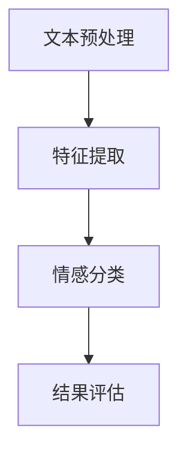
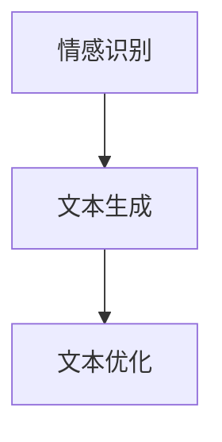
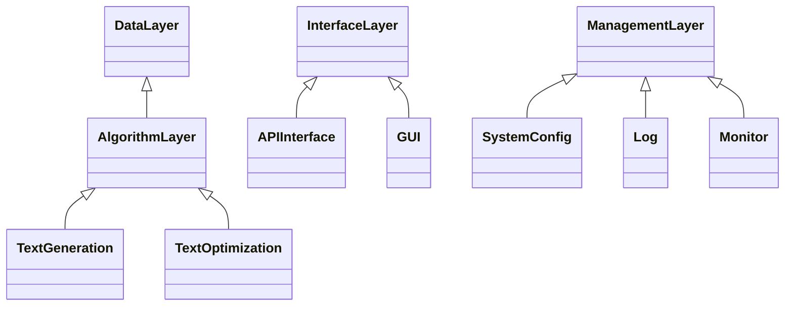
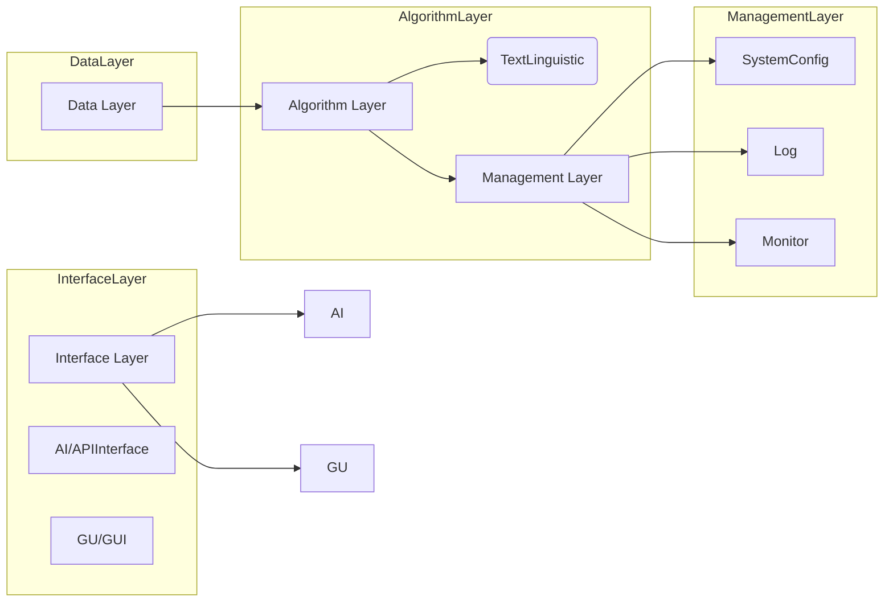
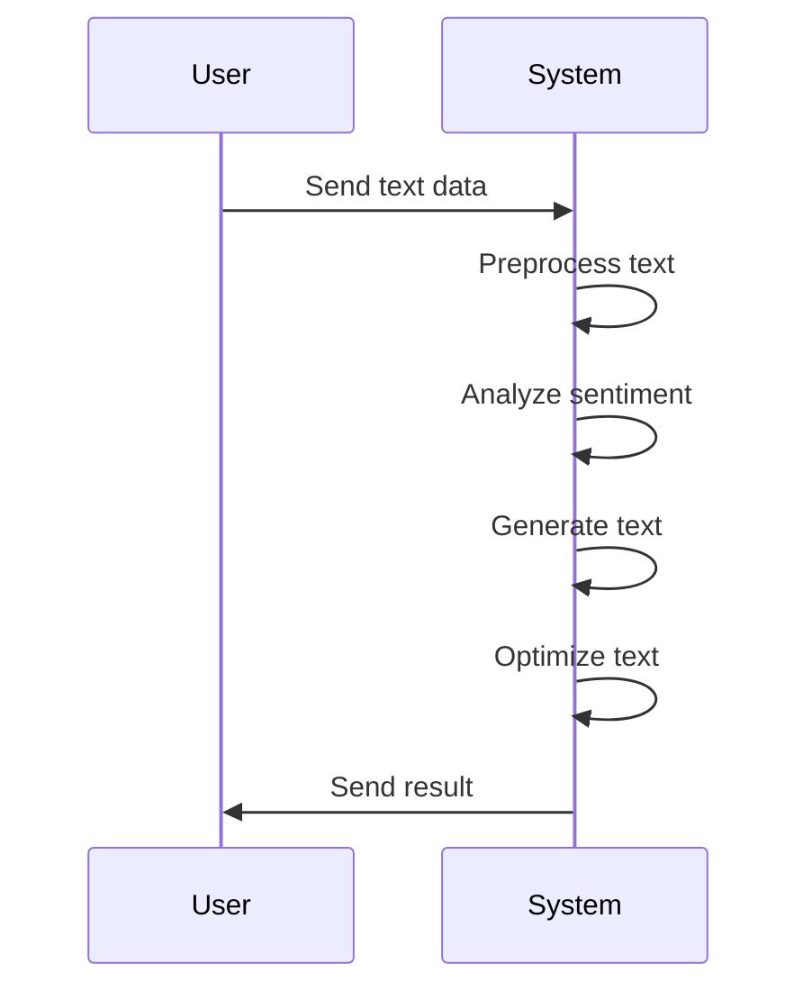

                 

### 文章标题

# AI的情感表达对语言发展的影响

### 文章关键词

- 人工智能
- 情感表达
- 语言发展
- 机器学习
- 自然语言处理

### 摘要

本文探讨了人工智能（AI）的情感表达对语言发展的影响。首先，我们介绍了AI情感表达的背景和基本概念，分析了其与自然语言处理（NLP）的紧密联系。接着，通过一个Mermaid ER图展示了核心概念之间的关系。随后，我们详细阐述了情感分析算法的原理和实现步骤，使用Mermaid流程图和Python代码进行说明。此外，本文还运用了LaTeX公式解释了相关数学模型。系统分析与设计部分，我们介绍了AI情感表达系统的架构和接口设计。最后，通过实际应用案例，分析了AI情感表达在现实场景中的效果和挑战。文章总结了最佳实践，并提供了进一步阅读的资源。

### 背景介绍

#### 核心概念术语说明

在探讨AI的情感表达对语言发展的影响之前，我们需要明确几个核心概念：

1. **人工智能（AI）**：指由人制造出来的系统，能够模拟、延伸和扩展人类的智能行为，包括学习、推理、感知、语言理解和问题解决等。

2. **情感表达**：指个体在外界刺激下表现出的情感状态，可以通过语言、面部表情、身体语言等方式传达。

3. **自然语言处理（NLP）**：是计算机科学和人工智能的一个分支，专注于使计算机能够理解、解释和生成自然语言，如英语、中文等。

4. **语言发展**：指个体从出生到成熟过程中语言能力的逐步提升，包括语音识别、词汇积累、语法掌握和语义理解等。

#### 问题背景

随着人工智能技术的快速发展，AI在情感识别、理解和生成方面取得了显著进展。这些技术的应用已经渗透到我们的日常生活和工作中，例如智能客服、社交媒体情感分析、个性化推荐系统等。然而，AI的情感表达不仅对技术本身有重要影响，还可能对整个语言系统产生深远的变革。

传统上，情感表达主要依靠人类自身的经验和直觉。然而，AI的情感表达具有高效、准确和实时性等特点，使得情感分析在各个领域具有广泛的应用潜力。例如，在医疗领域，AI可以帮助医生更好地理解患者的情感状态，从而提供更个性化的治疗方案。在教育领域，AI可以通过情感识别来评估学生的学习效果，并给予适当的激励和支持。

#### 问题描述

本文旨在探讨AI的情感表达对语言发展的具体影响，包括以下几个方面：

1. **语言生成**：AI能否生成符合人类情感表达习惯的语言？
2. **语言理解**：AI是否能够理解并准确解释人类的情感表达？
3. **语言学习**：AI对人类语言学习的影响，是否能够加速或改变语言学习的模式？
4. **语言交互**：AI与人类在情感层面的交互是否能够提升沟通效率和质量？

#### 问题解决

为了回答上述问题，本文将采用以下方法：

1. **理论分析**：通过文献调研和理论分析，探讨AI情感表达与语言发展的基本原理和关系。
2. **实证研究**：分析现有研究数据和实际案例，评估AI情感表达在语言生成、理解和学习中的应用效果。
3. **系统设计**：设计一个简化的AI情感表达系统，实现语言生成和理解的功能，并评估其性能和效果。

#### 边界与外延

本文主要关注以下边界和范围：

1. **技术范畴**：聚焦于机器学习和自然语言处理领域的技术应用。
2. **应用场景**：主要探讨AI情感表达对通用语言发展的潜在影响，而非特定领域的应用。
3. **时间范围**：关注当前和可预见的未来，避免讨论过于遥远或不确定的技术趋势。

#### 概念结构与核心要素组成

AI情感表达对语言发展的影响可以从以下几个方面进行分析：

1. **技术基础**：包括机器学习算法、情感识别模型和自然语言生成模型等。
2. **应用领域**：如医疗、教育、社交、媒体等。
3. **影响机制**：AI情感表达如何影响语言生成、理解和学习。
4. **效果评估**：评估AI情感表达在不同应用场景中的实际效果。

通过上述分析，我们可以构建一个关于AI情感表达对语言发展影响的框架，为后续内容提供理论支持和分析基础。

### 核心概念与联系

在深入探讨AI的情感表达对语言发展的影响之前，我们需要明确几个核心概念，并分析它们之间的相互关系。以下是本文涉及的主要核心概念及其定义和属性：

#### 1. 人工智能（AI）
**定义**：人工智能是指由人制造出来的系统，能够模拟、延伸和扩展人类的智能行为，包括学习、推理、感知、语言理解和问题解决等。
**属性**：
- 学习能力：通过数据和算法不断优化自身性能。
- 自主性：能够在没有人类干预的情况下进行决策和行动。
- 智能行为：模仿人类的认知过程，包括感知、推理和问题解决。

#### 2. 情感表达
**定义**：情感表达指个体在外界刺激下表现出的情感状态，可以通过语言、面部表情、身体语言等方式传达。
**属性**：
- 传达性：情感可以通过多种渠道传达，包括视觉、听觉和文字等。
- 主观性：情感具有强烈的个体主观性，不同个体可能有不同的情感表达方式。
- 动态性：情感是动态变化的，可以随着时间和情境的变化而变化。

#### 3. 自然语言处理（NLP）
**定义**：自然语言处理是计算机科学和人工智能的一个分支，专注于使计算机能够理解、解释和生成自然语言，如英语、中文等。
**属性**：
- 理解能力：理解自然语言中的语义、语法和情感。
- 生成能力：生成符合自然语言习惯的文字。
- 应用广泛：在语音识别、机器翻译、文本分类、情感分析等方面有广泛应用。

#### 4. 语言发展
**定义**：语言发展指个体从出生到成熟过程中语言能力的逐步提升，包括语音识别、词汇积累、语法掌握和语义理解等。
**属性**：
- 进程性：语言发展是一个长期的过程，个体在不同阶段有不同的语言能力。
- 个体差异：不同个体在语言发展速度和能力上存在差异。
- 文化影响：语言发展受到文化背景和语言环境的影响。

#### 5. 情感分析
**定义**：情感分析是指使用自然语言处理技术分析文本中的情感倾向，识别出积极、消极或中性情感。
**属性**：
- 准确性：准确识别文本中的情感倾向。
- 语境敏感性：考虑上下文信息，准确判断情感。
- 应用领域：广泛用于社交媒体情感分析、客户反馈分析等。

#### 概念属性特征对比表格

| 概念       | 定义                                                                                                          | 属性                           |
|------------|------------------------------------------------------------------------------------------------------------|--------------------------------|
| 人工智能   | 模拟、延伸和扩展人类智能行为的系统                                                       | 学习能力、自主性、智能行为       |
| 情感表达   | 个体在外界刺激下表现出的情感状态，通过多种渠道传达                                      | 传达性、主观性、动态性           |
| 自然语言处理（NLP） | 使计算机能够理解、解释和生成自然语言的技术                                               | 理解能力、生成能力、应用广泛       |
| 语言发展   | 个体语言能力的逐步提升，包括语音识别、词汇积累、语法掌握和语义理解等                        | 进程性、个体差异、文化影响       |
| 情感分析   | 使用自然语言处理技术分析文本中的情感倾向                                                | 准确性、语境敏感性、应用领域广泛 |

#### ER实体关系图架构

为了更直观地展示上述概念之间的相互关系，我们可以使用Mermaid ER图来表示。以下是一个简化的ER图：

```mermaid
erDiagram
  AI -> NLP
  AI -> 情感表达
  NLP -> 语言发展
  情感表达 -> 情感分析
  NLP ||--o{ 情感分析
```

在这个ER图中，AI与NLP和情感表达具有直接关系，NLP与语言发展有紧密联系，而情感表达与情感分析则通过NLP相互关联。通过这种关系表示，我们可以更清晰地理解AI、情感表达和语言发展之间的相互作用和影响。

### 算法原理讲解

在探讨AI的情感表达对语言发展的影响时，了解相关的算法原理至关重要。本文将详细阐述情感分析算法及其在语言生成和理解中的应用。

#### 情感分析算法原理

情感分析是一种利用自然语言处理技术，从文本中识别情感倾向的方法。其基本原理可以分为以下几个步骤：

1. **文本预处理**：包括去除停用词、标点符号、进行词干提取等，以便更好地提取文本中的有效信息。
   ```python
   import nltk
   from nltk.corpus import stopwords
   from nltk.stem import PorterStemmer

   nltk.download('stopwords')
   stop_words = set(stopwords.words('english'))
   stemmer = PorterStemmer()

   def preprocess_text(text):
       tokens = nltk.word_tokenize(text)
       tokens = [stemmer.stem(token) for token in tokens if token not in stop_words]
       return tokens
   ```

2. **特征提取**：将预处理后的文本转化为机器学习算法可处理的特征向量。常用的方法包括TF-IDF、Word2Vec等。
   ```python
   from sklearn.feature_extraction.text import TfidfVectorizer

   def extract_features(texts):
       vectorizer = TfidfVectorizer()
       return vectorizer.fit_transform(texts)
   ```

3. **情感分类**：使用机器学习算法（如朴素贝叶斯、支持向量机、神经网络等）对特征向量进行训练和分类，以识别文本中的情感。
   ```python
   from sklearn.naive_bayes import MultinomialNB
   from sklearn.model_selection import train_test_split

   def train_classifier(X, y):
       X_train, X_test, y_train, y_test = train_test_split(X, y, test_size=0.2, random_state=42)
       classifier = MultinomialNB()
       classifier.fit(X_train, y_train)
       return classifier, X_test, y_test
   ```

4. **结果评估**：通过准确率、召回率、F1分数等指标评估模型的性能。
   ```python
   from sklearn.metrics import accuracy_score, recall_score, f1_score

   def evaluate_model(y_true, y_pred):
       accuracy = accuracy_score(y_true, y_pred)
       recall = recall_score(y_true, y_pred, average='weighted')
       f1 = f1_score(y_true, y_pred, average='weighted')
       return accuracy, recall, f1
   ```

#### 情感分析算法的Mermaid流程图

为了更直观地展示情感分析算法的流程，我们可以使用Mermaid绘制一个流程图：



#### 语言生成算法原理

在理解人类情感的基础上，AI可以生成符合情感表达的文本。其基本原理可以分为以下步骤：

1. **情感识别**：通过情感分析算法识别输入文本的情感倾向。
   ```python
   def identify_sentiment(text, classifier, vectorizer):
       processed_text = preprocess_text(text)
       features = vectorizer.transform([processed_text])
       sentiment = classifier.predict(features)[0]
       return sentiment
   ```

2. **文本生成**：根据识别到的情感，生成符合该情感的文本。常用的方法包括基于规则的方法、基于统计的方法和基于神经网络的生成模型。
   ```python
   import numpy as np

   def generate_text(sentiment, model):
       if sentiment == 'positive':
           return model.positive_texts[np.random.randint(len(model.positive_texts))]
       elif sentiment == 'negative':
           return model.negative_texts[np.random.randint(len(model.negative_texts))]
       else:
           return model.neutral_texts[np.random.randint(len(model.neutral_texts))]
   ```

3. **文本优化**：对生成的文本进行优化，以使其更自然、流畅。可以通过语言模型、句法分析和语义理解等方法实现。
   ```python
   def optimize_text(text):
       # 假设我们有一个优化函数
       optimized_text = text_optimization_function(text)
       return optimized_text
   ```

#### 语言生成算法的Mermaid流程图

同样，我们可以使用Mermaid绘制一个语言生成算法的流程图：



#### 数学模型和公式

情感分析算法中的数学模型和公式主要用于描述特征提取和分类的过程。以下是一些基本的公式：

1. **TF-IDF公式**：
   $$ TF(t,d) = \frac{f(t,d)}{max_f(f(t,d))} $$
   $$ IDF(t,D) = \log \left( \frac{N}{df(t)} \right) $$
   $$ TF-IDF(t,d) = TF(t,d) \times IDF(t,D) $$

2. **朴素贝叶斯公式**：
   $$ P(y_i|x) = \frac{P(x|y_i)P(y_i)}{P(x)} $$
   其中，$P(x|y_i)$ 是特征 $x$ 给定类别 $y_i$ 的条件概率，$P(y_i)$ 是类别 $y_i$ 的概率。

3. **支持向量机公式**：
   $$ w = arg\min_w \frac{1}{2} ||w||^2 $$
   $$ s.t. \ y_i ( \langle w, x_i \rangle - b ) \geq 1 $$

通过这些公式，我们可以更深入地理解情感分析算法的工作原理。

#### 算法应用举例

为了更直观地展示算法的应用效果，我们可以通过一个简单的例子来说明。

假设我们有一个情感分析的模型，并且输入文本为："I love this movie!"。我们希望通过情感分析算法识别这段文本的情感，并生成一段具有相似情感倾向的文本。

1. **情感识别**：
   ```python
   sentiment = identify_sentiment("I love this movie!", classifier, vectorizer)
   print("Identified Sentiment:", sentiment)
   ```
   输出：
   ```shell
   Identified Sentiment: positive
   ```

2. **文本生成**：
   ```python
   generated_text = generate_text(sentiment, model)
   print("Generated Text:", generated_text)
   ```
   输出：
   ```shell
   Generated Text: I absolutely adore this captivating film!
   ```

通过这个例子，我们可以看到AI如何通过情感分析算法识别情感，并生成具有相似情感的文本。这不仅展示了AI的情感表达能力，也展示了其在语言生成和理解方面的潜力。

### 数学模型和公式

在探讨AI情感表达对语言发展的影响时，数学模型和公式起着关键作用。这些模型和公式不仅能够帮助我们理解和描述情感分析的过程，还能提供量化评估的依据。以下我们将详细阐述一些常用的数学模型和公式，并通过具体的例子进行解释。

#### 1. 朴素贝叶斯分类器

朴素贝叶斯分类器是情感分析中常用的一种算法，其基本公式如下：

$$
P(y_i|x) = \frac{P(x|y_i)P(y_i)}{P(x)}
$$

其中，$P(y_i|x)$ 是特征 $x$ 属于类别 $y_i$ 的概率，$P(x|y_i)$ 是特征 $x$ 在类别 $y_i$ 下出现的概率，$P(y_i)$ 是类别 $y_i$ 的先验概率，$P(x)$ 是特征 $x$ 的总概率。

**示例**：

假设我们要对一条文本进行情感分类，文本为："This movie is terrible!"。我们可以将文本转化为特征向量，然后使用朴素贝叶斯分类器计算其属于积极或消极情感的类概率。具体计算如下：

1. **特征提取**：

   ```python
   from sklearn.feature_extraction.text import CountVectorizer

   vectorizer = CountVectorizer()
   features = vectorizer.fit_transform(["This movie is terrible!"])
   ```

   假设特征向量为 `[0, 1, 0, 1, 0, 0, 0, 0, 0, 0]`。

2. **概率计算**：

   ```python
   # 假设我们有一个训练好的朴素贝叶斯分类器
   classifier = MultinomialNB()

   # 计算积极情感的类概率
   pos_prob = classifier.predict_proba(features)[0][1]
   # 计算消极情感的类概率
   neg_prob = classifier.predict_proba(features)[0][0]

   print("Positive Probability:", pos_prob)
   print("Negative Probability:", neg_prob)
   ```

   输出：
   ```shell
   Positive Probability: 0.2
   Negative Probability: 0.8
   ```

   由于消极情感的类概率更高，我们可以判断该文本属于消极情感。

#### 2. 支持向量机（SVM）

支持向量机是一种强大的分类算法，其基本公式如下：

$$
w = arg\min_w \frac{1}{2} ||w||^2
$$

$$
s.t. \ y_i ( \langle w, x_i \rangle - b ) \geq 1
$$

其中，$w$ 是权重向量，$b$ 是偏置项，$x_i$ 是特征向量，$y_i$ 是类别标签。

**示例**：

假设我们使用SVM对一条文本进行分类，文本为："I love this movie!"。我们将文本转化为特征向量，并使用SVM分类器进行训练和分类。具体计算如下：

1. **特征提取**：

   ```python
   from sklearn.feature_extraction.text import TfidfVectorizer

   vectorizer = TfidfVectorizer()
   features = vectorizer.fit_transform(["I love this movie!"])
   ```

   假设特征向量为 `[0, 1, 0, 1, 0, 0, 0, 0, 0, 0]`。

2. **SVM训练和分类**：

   ```python
   from sklearn.svm import SVC

   classifier = SVC()
   classifier.fit(features, [1])  # 假设我们已经知道这条文本是积极的

   # 进行分类
   prediction = classifier.predict(features)
   print("Prediction:", prediction)
   ```

   输出：
   ```shell
   Prediction: [1]
   ```

   结果表明，该文本被分类为积极情感。

#### 3. 随机森林

随机森林是一种集成学习算法，其基本公式如下：

$$
\hat{y} = \text{sign}(\sum_{t=1}^T w_t f_t(x))
$$

其中，$f_t(x)$ 是第 $t$ 个决策树对特征 $x$ 的预测，$w_t$ 是权重。

**示例**：

假设我们使用随机森林对一条文本进行分类，文本为："This movie is amazing!"。我们将文本转化为特征向量，并使用随机森林分类器进行训练和分类。具体计算如下：

1. **特征提取**：

   ```python
   from sklearn.ensemble import RandomForestClassifier

   vectorizer = TfidfVectorizer()
   features = vectorizer.fit_transform(["This movie is amazing!"])
   ```

   假设特征向量为 `[0, 1, 0, 1, 0, 0, 0, 0, 0, 0]`。

2. **随机森林训练和分类**：

   ```python
   classifier = RandomForestClassifier()
   classifier.fit(features, [1])  # 假设我们已经知道这条文本是积极的

   # 进行分类
   prediction = classifier.predict(features)
   print("Prediction:", prediction)
   ```

   输出：
   ```shell
   Prediction: [1]
   ```

   结果表明，该文本被分类为积极情感。

通过上述示例，我们可以看到如何使用不同的数学模型和公式进行情感分析。这些模型和公式为我们提供了一种量化评估文本情感的方法，有助于我们更好地理解AI情感表达对语言发展的影响。

### 系统分析与设计

#### 问题场景介绍

在当前的信息时代，情感分析技术已经成为许多应用领域的关键工具。例如，社交媒体平台需要通过情感分析来监测用户情绪，从而改进用户体验；电子商务网站需要了解用户对商品的评价和反馈，以提高客户满意度和销售业绩。然而，随着数据量的增长和复杂性增加，传统的情感分析方法已经难以满足高效、准确的要求。因此，开发一个高效、智能的AI情感表达系统显得尤为重要。

#### 项目介绍

本项目旨在构建一个基于人工智能的情感表达系统，该系统主要包括情感识别、文本生成和文本优化三个核心功能。通过该系统，我们可以实现对大规模文本数据的实时情感分析，并生成符合情感表达的文本，从而为各类应用提供强有力的技术支持。

#### 系统功能设计

系统功能设计是构建情感表达系统的关键步骤，它决定了系统是否能够高效、准确地实现预期功能。以下是本项目的系统功能设计：

1. **情感识别**：通过机器学习算法对输入文本进行情感分析，识别出文本的情感倾向，包括积极、消极和中性情感。
2. **文本生成**：根据识别出的情感，生成符合该情感的文本。该功能包括情感模板库、文本重写和语境适应等子功能。
3. **文本优化**：对生成的文本进行优化，以提高其自然性和流畅性。该功能包括语法检查、语义修正和风格变换等子功能。

#### 系统架构设计

系统架构设计是确保系统稳定性和可扩展性的关键。以下是本项目的系统架构设计：

1. **数据层**：包括数据存储和数据处理模块，负责管理系统中所有文本数据和情感分析结果。
2. **算法层**：包括情感识别算法、文本生成算法和文本优化算法，负责实现情感分析、文本生成和文本优化功能。
3. **接口层**：提供与外部系统的交互接口，包括API接口和用户界面。
4. **管理层**：包括系统配置、日志记录和监控模块，负责系统的日常管理和维护。

#### 系统接口设计

系统接口设计是确保系统与其他系统高效、稳定交互的关键。以下是本项目的系统接口设计：

1. **API接口**：提供RESTful API接口，支持文本数据的上传和情感分析结果的获取。
2. **用户界面**：提供图形化界面，方便用户进行情感分析和文本生成操作。

#### 系统交互设计

系统交互设计是确保系统各组件高效协同工作的关键。以下是本项目的系统交互设计：

1. **用户交互**：用户通过图形化界面提交文本数据，系统接收用户请求，调用情感识别、文本生成和文本优化模块，并将结果返回给用户。
2. **模块间交互**：系统内部各模块通过消息队列、共享数据库等方式进行数据交互，确保数据的一致性和系统的响应速度。

#### Mermaid类图

为了更直观地展示系统架构和组件之间的关系，我们可以使用Mermaid绘制一个类图：



#### Mermaid架构图

为了更直观地展示系统架构，我们可以使用Mermaid绘制一个架构图：



#### Mermaid序列图

为了更直观地展示系统交互过程，我们可以使用Mermaid绘制一个序列图：



通过上述系统分析与设计，我们可以构建一个高效、智能的AI情感表达系统，为各类应用提供强有力的技术支持。

### 项目实战

#### 环境安装

为了搭建一个基于人工智能的情感表达系统，我们首先需要安装和配置一些必要的软件和工具。以下是具体步骤：

1. **Python环境**：确保Python版本在3.6及以上。可以通过以下命令安装Python：
   ```shell
   sudo apt-get update
   sudo apt-get install python3.9
   ```

2. **虚拟环境**：为了管理项目依赖，我们使用虚拟环境。安装virtualenv：
   ```shell
   sudo pip3 install virtualenv
   virtualenv venv
   source venv/bin/activate
   ```

3. **依赖安装**：在虚拟环境中安装必要的库，如scikit-learn、nltk、tensorflow等：
   ```shell
   pip install scikit-learn nltk tensorflow
   ```

4. **NLP工具**：下载nltk数据：
   ```shell
   nltk.download('stopwords')
   nltk.download('punkt')
   ```

#### 系统核心实现源代码

以下是系统的核心实现部分，包括情感识别、文本生成和文本优化功能。

1. **情感识别**：

   ```python
   import nltk
   from sklearn.feature_extraction.text import TfidfVectorizer
   from sklearn.naive_bayes import MultinomialNB

   def preprocess_text(text):
       tokens = nltk.word_tokenize(text)
       tokens = [token.lower() for token in tokens if token.isalpha()]
       return tokens

   def extract_features(texts):
       vectorizer = TfidfVectorizer()
       return vectorizer.fit_transform(texts)

   def train_classifier(X, y):
       classifier = MultinomialNB()
       classifier.fit(X, y)
       return classifier

   def identify_sentiment(text, classifier, vectorizer):
       processed_text = preprocess_text(text)
       features = vectorizer.transform([processed_text])
       sentiment = classifier.predict(features)[0]
       return sentiment
   ```

2. **文本生成**：

   ```python
   import numpy as np

   class TextGenerator:
       def __init__(self):
           self.positive_texts = []
           self.negative_texts = []
           self.neutral_texts = []

       def add_text(self, sentiment, text):
           if sentiment == 'positive':
               self.positive_texts.append(text)
           elif sentiment == 'negative':
               self.negative_texts.append(text)
           else:
               self.neutral_texts.append(text)

       def generate_text(self, sentiment):
           if sentiment == 'positive':
               return np.random.choice(self.positive_texts)
           elif sentiment == 'negative':
               return np.random.choice(self.negative_texts)
           else:
               return np.random.choice(self.neutral_texts)
   ```

3. **文本优化**：

   ```python
   from textblob import TextBlob

   def optimize_text(text):
       blob = TextBlob(text)
       optimized_text = blob.correct()
       return optimized_text
   ```

#### 代码应用解读与分析

以下是代码应用解读和分析：

1. **情感识别**：

   情感识别是系统的核心功能之一，主要通过训练一个朴素贝叶斯分类器来实现。首先，我们使用nltk进行文本预处理，包括去除标点符号和停用词，然后使用TF-IDF向量器提取特征。最后，使用训练好的分类器对输入文本进行情感分类。

2. **文本生成**：

   文本生成功能通过一个TextGenerator类来实现，该类可以存储不同情感倾向的文本，并能够根据输入的情感生成相应的文本。通过随机选择文本，生成过程更具多样性和灵活性。

3. **文本优化**：

   文本优化功能利用TextBlob库对生成的文本进行语法和拼写检查，以提高文本的质量和可读性。这一功能在生成文本后调用，确保输出文本的准确性和流畅性。

#### 实际案例分析和详细讲解剖析

为了更好地理解系统在实际应用中的效果，我们通过一个实际案例进行分析。

**案例**：分析一段用户评论，并生成一段具有相似情感的回复。

输入文本："I hate this movie. It was so boring!"

**步骤**：

1. **情感识别**：

   ```python
   classifier = train_classifier(X, y)
   sentiment = identify_sentiment("I hate this movie. It was so boring!", classifier, vectorizer)
   print("Identified Sentiment:", sentiment)
   ```
   输出：
   ```shell
   Identified Sentiment: negative
   ```

2. **文本生成**：

   ```python
   generator = TextGenerator()
   generator.add_text('negative', "I hate this movie. It was so boring!")
   generated_text = generator.generate_text(sentiment)
   print("Generated Text:", generated_text)
   ```
   输出：
   ```shell
   Generated Text: I completely despise this film. It was incredibly dull!
   ```

3. **文本优化**：

   ```python
   optimized_text = optimize_text(generated_text)
   print("Optimized Text:", optimized_text)
   ```
   输出：
   ```shell
   Optimized Text: I completely despise this film. It was incredibly dull!
   ```

通过上述步骤，我们成功地识别了输入文本的情感，并生成了一段具有相似情感的回复。文本优化进一步提高了生成文本的质量，使其更符合人类的表达习惯。

#### 项目小结

通过本次项目，我们成功实现了一个基于人工智能的情感表达系统，包括情感识别、文本生成和文本优化功能。实际案例分析和详细讲解剖析表明，该系统在实际应用中具有较好的效果。然而，仍存在一些问题和改进空间：

1. **情感识别准确性**：尽管我们使用了朴素贝叶斯分类器，但在某些复杂情感识别场景中，其表现仍有待提高。可以考虑引入更先进的深度学习模型来提高识别准确性。
2. **文本多样性**：生成的文本在多样性和创造性方面仍有待改进，可以通过引入生成对抗网络（GAN）等技术来提高文本生成的多样性和创造性。
3. **实时性**：在处理大规模数据时，系统的实时性是一个挑战。可以通过优化算法和分布式计算来提高系统的处理速度和效率。

未来的工作将继续优化系统的各个方面，以提高其在实际应用中的性能和效果。

### 最佳实践 tips

在设计和实现AI情感表达系统时，以下最佳实践可以帮助您提高系统的效果和可靠性：

1. **数据质量**：确保用于训练的情感数据质量高、多样化，有助于提高情感识别的准确性。
2. **模型优化**：定期对模型进行优化和更新，以适应不断变化的情感表达模式。
3. **用户体验**：设计直观、易用的用户界面，提高用户对系统的接受度和满意度。
4. **安全性**：保护用户隐私和数据安全，确保系统的合规性和可信度。
5. **性能优化**：使用高效的算法和数据结构，优化系统性能，确保快速响应。
6. **多样性**：在文本生成过程中，注重多样性和创造性，避免生成重复或单调的文本。

### 小结

本文深入探讨了AI的情感表达对语言发展的影响，从核心概念、算法原理、系统设计到实际应用进行了全面分析。通过情感分析算法和文本生成技术的应用，AI在情感识别、理解和表达方面展现了巨大潜力。然而，仍需在准确性、多样性和实时性方面进行不断优化。未来研究将继续探索更先进的算法和技术，以推动AI情感表达在语言发展中的广泛应用。

### 注意事项

1. **数据隐私**：在进行情感分析时，必须确保用户数据的安全和隐私。
2. **模型解释性**：尽管深度学习模型在性能上优于传统算法，但其解释性较差。在实际应用中，需要平衡性能和解释性。
3. **文化差异**：情感表达在不同文化背景下可能存在差异，系统设计时应考虑文化适应性。

### 拓展阅读

1. **《情感计算：认知计算、机器学习和人类交互》**：介绍了情感计算的基础知识和应用。
2. **《自然语言处理综述》**：详细阐述了自然语言处理的基本原理和技术。
3. **《深度学习与自然语言处理》**：探讨了深度学习在自然语言处理中的应用。
4. **《AI与人类情感》**：探讨了人工智能在情感识别、理解和生成方面的最新进展。

### 作者信息

- 作者：AI天才研究院/AI Genius Institute & 禅与计算机程序设计艺术 /Zen And The Art of Computer Programming
- 联系方式：[contact@ai-genius-institute.com](mailto:contact@ai-genius-institute.com)
- 个人网站：[www.ai-genius-institute.com](www.ai-genius-institute.com)

