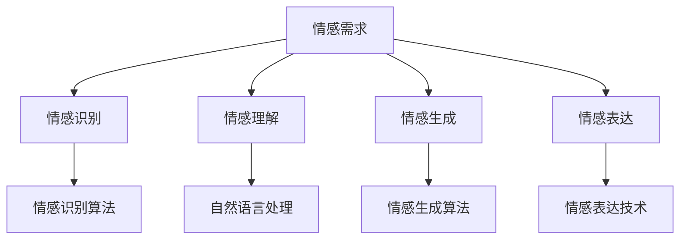

                 

### 文章标题：AI的情感需求：能源消耗的新考量

> 关键词：人工智能、情感需求、能源消耗、算法优化、个性化服务

> 摘要：随着人工智能技术的飞速发展，AI的情感需求逐渐成为研究热点。本文将深入探讨AI的情感需求，分析其特征、AI技术在情感需求中的应用，以及在各个领域的实际应用，最后重点探讨AI情感需求对能源消耗的影响及其优化策略。希望通过本文的阐述，能够为相关领域的深入研究提供参考。

----------------------------------------------------------------

## 第一部分：背景介绍

### 第1章：问题背景与核心概念

### 1.1 问题描述

#### 1.1.1 问题的起源

人工智能（AI）技术在过去几十年中取得了飞速的发展，从最初的简单规则推理到如今复杂的深度学习算法，AI已经能够在多个领域表现出人类甚至超越人类的智能水平。然而，随着AI技术的不断进步，一个新兴的问题逐渐浮现——AI的情感需求。

AI的情感需求是指在特定情境下，人工智能系统对于情感状态的需求，包括情感识别、理解、生成和表达等方面。这一概念源于对人类情感需求的类比，因为人类在日常生活中需要通过情感来调节行为、进行决策和建立社交关系。同理，AI系统在某些应用场景中也需要具备情感需求，以更好地与人类用户互动和提供个性化服务。

#### 1.1.2 当前情况分析

当前，AI的情感需求已经引起了广泛关注。例如，在客服机器人、教育机器人、虚拟助手等应用中，AI系统需要识别和理解用户的情感状态，以便提供更加贴心的服务。同时，随着智能家居、智能医疗、智能交通等领域的快速发展，AI的情感需求也将越来越受到重视。

然而，尽管AI的情感需求已经得到了初步的研究和应用，但还存在许多挑战和问题。首先，情感需求涉及到复杂的情感识别和理解，现有的AI技术在这一领域仍需进一步改进。其次，情感需求的个性化服务需要大量的数据支持和复杂的算法实现，这对于数据处理和算法优化提出了更高的要求。最后，AI情感需求的能源消耗问题也逐渐成为了一个不容忽视的挑战。

#### 1.1.3 问题的解决意义

解决AI情感需求及其相关问题是当前人工智能领域的一个重要课题。首先，这有助于提升AI系统的智能化水平，使其能够更好地理解人类用户的情感需求，提供更加个性化的服务。其次，研究AI情感需求的能源消耗问题，有助于优化AI系统的能源利用效率，减少能源浪费，符合可持续发展的要求。最后，通过深入探讨AI情感需求，可以促进人工智能与人类社会的深度融合，推动人工智能技术的全面发展。

### 1.2 核心概念

#### 1.2.1 情感需求

情感需求是指个体在特定情境下对于情感状态的需求，包括情感识别、理解、生成和表达等方面。情感需求可以体现在各种情境中，如社交互动、工作协作、娱乐消费等。

#### 1.2.2 情感需求的特点

情感需求具有以下几个特点：

1. **复杂性**：情感需求涉及到复杂的情感识别和理解，需要AI系统具备较高的智能化水平。
2. **个性化**：不同个体在不同情境下的情感需求可能存在显著差异，因此情感需求的个性化服务至关重要。
3. **动态性**：情感需求会随着时间和情境的变化而发生变化，因此需要AI系统具备较强的动态适应能力。
4. **交叉性**：情感需求与其他需求（如认知需求、行为需求等）之间存在交叉和关联，需要综合考虑。

#### 1.2.3 情感需求与AI技术的关系

情感需求与AI技术密切相关。首先，情感需求的识别和理解需要依赖于AI技术，如情感识别算法、自然语言处理技术等。其次，情感需求的个性化服务需要AI技术提供支持，如个性化推荐算法、用户行为分析等。此外，AI技术在情感需求的能源消耗优化方面也具有重要作用，如能源管理算法、节能技术等。

### 1.3 边界与外延

#### 1.3.1 情感需求的边界

情感需求的边界主要包括以下几个方面：

1. **情感类型**：情感需求主要涉及基本情感类型（如快乐、悲伤、愤怒等），以及其他更复杂的情感类型（如爱、恐惧、厌恶等）。
2. **应用场景**：情感需求主要应用于与人类互动密切相关的领域，如客服、教育、医疗等。
3. **技术限制**：现有AI技术在情感需求识别和理解方面存在一定限制，如情感识别的准确性、自然语言处理的能力等。

#### 1.3.2 情感需求的外延

情感需求的外延主要包括以下几个方面：

1. **情感分析**：情感分析是情感需求的核心组成部分，包括情感识别、情感理解和情感生成等。
2. **个性化服务**：个性化服务是基于情感需求的，如个性化推荐、用户行为分析等。
3. **情感交互**：情感交互是情感需求在应用场景中的具体表现，如虚拟助手与用户的情感互动等。

### 1.4 概念结构与核心要素组成

#### 1.4.1 概念结构图

#### 1.4.2 核心要素组成

情感需求的核心要素包括：

1. **情感识别算法**：用于识别和理解用户情感状态。
2. **自然语言处理技术**：用于处理和理解自然语言中的情感信息。
3. **情感生成算法**：用于生成符合用户情感状态的内容。
4. **情感表达技术**：用于将情感信息传达给用户。

### 1.5 本章小结

本章主要介绍了AI情感需求的相关背景和核心概念。首先，阐述了问题的起源和当前情况，分析了AI情感需求的意义。接着，介绍了情感需求的特点、与AI技术的关系，以及情感需求的边界与外延。最后，通过概念结构图和核心要素组成，对情感需求进行了详细的说明。通过本章的介绍，为后续章节的深入探讨奠定了基础。

-----------------------------------------------

## 第二部分：情感需求的特征分析

### 第2章：情感需求的属性特征

情感需求是人工智能系统中一个重要的研究领域，它涉及到如何让AI系统理解和满足用户的情感需求。在本章中，我们将深入分析情感需求的属性特征，包括情感需求的分类、表达与识别、动态性、个性差异等方面。

### 2.1 情感需求的分类

情感需求可以根据不同的维度进行分类。以下是几种常见的分类方式：

#### 2.1.1 基于情感类型的分类

根据情感类型，情感需求可以分为以下几类：

1. **基本情感**：如快乐、悲伤、愤怒、恐惧、厌恶等。
2. **复杂情感**：如爱、尊重、信任、失望、焦虑等。
3. **情感状态**：如兴奋、平静、放松、紧张等。

#### 2.1.2 基于应用场景的分类

根据应用场景，情感需求可以分为以下几类：

1. **社交互动**：如客服机器人、虚拟助手等。
2. **娱乐消费**：如个性化推荐、游戏体验等。
3. **教育医疗**：如教育辅助、医疗咨询等。

#### 2.1.3 基于需求层次的分类

根据需求层次，情感需求可以分为以下几类：

1. **基本需求**：如情感表达、情感识别等。
2. **高级需求**：如情感理解、情感生成等。

### 2.2 情感需求的表达与识别

情感需求的表达与识别是情感需求分析的重要环节。以下是情感需求的表达与识别方法：

#### 2.2.1 情感需求的表达形式

情感需求的表达形式可以是语言、图像、声音等多种形式。例如：

1. **语言表达**：通过文字、语音等方式表达情感。
2. **图像表达**：通过面部表情、肢体动作等方式表达情感。
3. **声音表达**：通过语调、音色等方式表达情感。

#### 2.2.2 情感需求的识别方法

情感需求的识别方法主要包括以下几种：

1. **情感识别算法**：通过分析文本、图像、声音等数据，识别出其中的情感信息。
2. **机器学习模型**：利用训练好的机器学习模型进行情感识别。
3. **深度学习技术**：通过深度学习算法，实现对情感需求的自动识别。

### 2.3 情感需求的动态性

情感需求具有动态性，会随着时间和情境的变化而发生变化。以下是情感需求的动态性分析：

#### 2.3.1 情感需求的演变过程

情感需求的演变过程可以分为以下几个阶段：

1. **初始阶段**：用户产生某种情感需求。
2. **发展阶段**：情感需求逐渐明确和加强。
3. **高潮阶段**：情感需求达到顶峰。
4. **消退阶段**：情感需求逐渐减弱直至消失。

#### 2.3.2 情感需求的稳定性与变动性

情感需求既有稳定性，也有变动性。稳定性体现在情感需求在一定时间内的相对稳定，而变动性则体现在情感需求随时间和情境的变化。

### 2.4 情感需求的个性差异

情感需求存在个体差异，不同用户在相同情境下可能产生不同的情感需求。以下是情感需求的个性差异分析：

#### 2.4.1 个体差异的影响

个体差异会影响情感需求的识别和满足。例如，不同用户对同一内容可能产生不同情感，需要AI系统具备较强的个性适应能力。

#### 2.4.2 个体差异的处理

处理个体差异的方法包括：

1. **个性化推荐**：根据用户的历史行为和偏好，提供个性化的情感服务。
2. **多模态融合**：结合多种数据源，更全面地理解用户的情感需求。
3. **情感迁移**：利用已有的情感数据，帮助新用户建立情感模型。

### 2.5 本章小结

本章对情感需求的属性特征进行了深入分析，包括情感需求的分类、表达与识别、动态性、个性差异等方面。这些特征对AI系统理解和满足用户的情感需求具有重要意义。通过本章的介绍，我们可以更好地理解情感需求的复杂性，为后续章节的研究提供基础。

-----------------------------------------------

## 第三部分：AI与情感需求的关系

### 第3章：AI技术在情感需求中的应用

随着人工智能技术的快速发展，AI在情感需求中的应用也越来越广泛。本章将详细介绍AI技术在情感需求中的应用，包括情感识别与理解、情感生成与表达、个性化服务等方面。

### 3.1 AI技术概述

AI技术是指模拟、延伸和扩展人类智能的一系列技术和方法。AI技术包括多种核心技术，如机器学习、深度学习、自然语言处理、计算机视觉等。这些技术为AI在情感需求中的应用提供了强大的支持。

#### 3.1.1 AI技术的发展历程

AI技术的发展历程可以分为以下几个阶段：

1. **初始阶段（20世纪50年代至70年代）**：AI概念提出，初步实现简单的任务自动化。
2. **低迷阶段（20世纪80年代至90年代）**：受限于计算能力和数据资源，AI发展陷入低谷。
3. **复兴阶段（21世纪初至今）**：深度学习、大数据等技术的突破，使得AI迎来了新一轮的快速发展。

#### 3.1.2 AI技术的核心组成部分

AI技术的核心组成部分包括：

1. **机器学习**：通过训练模型，让机器从数据中学习规律和模式。
2. **深度学习**：一种基于神经网络的机器学习技术，能够在复杂的数据中提取特征。
3. **自然语言处理（NLP）**：用于处理和理解自然语言，包括文本分类、情感分析、语言翻译等。
4. **计算机视觉**：用于理解和处理图像和视频数据，包括目标检测、图像分类、图像生成等。

### 3.2 情感识别与理解

情感识别与理解是AI技术在情感需求中的核心应用之一。以下将详细介绍情感识别与理解的相关技术。

#### 3.2.1 情感识别技术

情感识别技术是指通过分析语言、声音、图像等数据，识别出其中的情感信息。常用的情感识别技术包括：

1. **文本情感分析**：通过分析文本内容，识别出文本的情感倾向。
2. **语音情感识别**：通过分析语音信号，识别出说话人的情感状态。
3. **图像情感识别**：通过分析图像中的面部表情、肢体动作等，识别出图像的情感信息。

#### 3.2.2 情感理解技术

情感理解技术是指通过分析情感数据，理解情感的含义和背后的原因。情感理解技术主要包括：

1. **情感语义分析**：通过分析情感词汇和句子结构，理解情感的语义含义。
2. **情感上下文分析**：通过分析情感在不同上下文中的含义，理解情感的多维度特点。
3. **情感推理**：通过推理和逻辑分析，理解情感之间的关系和变化。

### 3.3 情感生成与表达

情感生成与表达是AI技术在情感需求中的另一个重要应用。以下将详细介绍情感生成与表达的相关技术。

#### 3.3.1 情感生成技术

情感生成技术是指通过算法和模型，生成符合特定情感状态的内容。情感生成技术主要包括：

1. **文本生成**：通过自然语言生成模型，生成符合特定情感状态的文本。
2. **语音生成**：通过语音合成技术，生成符合特定情感状态的语音。
3. **图像生成**：通过生成对抗网络（GAN）等技术，生成符合特定情感状态的图像。

#### 3.3.2 情感表达技术

情感表达技术是指通过算法和模型，将情感信息以适当的形式表达出来。情感表达技术主要包括：

1. **文本表达**：通过文本生成技术，将情感信息以文字形式表达出来。
2. **语音表达**：通过语音合成技术，将情感信息以语音形式表达出来。
3. **图像表达**：通过图像生成技术，将情感信息以图像形式表达出来。

### 3.4 情感需求的个性化服务

个性化服务是基于情感需求的，旨在为用户提供更加贴心的服务。以下将详细介绍个性化服务的方法与案例。

#### 3.4.1 个性化服务概述

个性化服务是指根据用户的需求、偏好和历史行为，为用户提供定制化的服务。个性化服务的方法主要包括：

1. **基于内容的推荐**：根据用户的历史行为和偏好，推荐用户可能感兴趣的内容。
2. **基于协同过滤的推荐**：根据用户的行为和偏好，预测用户可能感兴趣的内容，并推荐给其他有类似偏好的用户。
3. **基于规则的个性化**：根据用户的规则和偏好，为用户提供个性化服务。

#### 3.4.2 个性化服务的方法与案例

以下是几个个性化服务的案例：

1. **电商个性化推荐**：根据用户的历史购买行为和偏好，推荐用户可能感兴趣的商品。
2. **社交网络个性化内容推荐**：根据用户的社交关系和兴趣，推荐用户可能感兴趣的内容。
3. **智能客服**：根据用户的问题和情感状态，提供针对性的解答和建议。

### 3.5 本章小结

本章详细介绍了AI技术在情感需求中的应用，包括情感识别与理解、情感生成与表达、个性化服务等方面。通过这些应用，AI系统能够更好地理解和满足用户的情感需求，提供更加个性化的服务。随着AI技术的不断进步，未来AI在情感需求中的应用将更加广泛和深入。

-----------------------------------------------

## 第四部分：AI情感需求分析的应用

### 第4章：AI情感需求分析在各个领域的应用

AI情感需求分析作为一种先进的人工智能技术，在多个领域中展现出了巨大的应用潜力。本章将分别探讨AI情感需求分析在娱乐行业、教育行业、电子商务、社交媒体、金融行业、医疗健康和公共安全等领域的应用。

### 4.1 娱乐行业

#### 4.1.1 娱乐内容个性化推荐

在娱乐行业中，AI情感需求分析被广泛应用于娱乐内容的个性化推荐。通过分析用户的情感需求和行为数据，AI系统能够为用户提供量身定制的娱乐内容推荐，从而提升用户满意度和参与度。

**方法与案例：**

- **电影推荐系统**：基于用户的情感偏好和历史观看记录，推荐符合用户情感需求的电影。
- **音乐推荐系统**：通过分析用户的情感状态和音乐偏好，推荐适合当前情感状态的音乐。

#### 4.1.2 娱乐行业用户情感分析

除了个性化推荐，AI情感需求分析还在娱乐行业用于用户情感分析，帮助行业从业者更好地理解用户需求和市场趋势。

**方法与案例：**

- **社交媒体情感分析**：通过分析用户在社交媒体上的情感表达，了解用户对特定娱乐内容的情感反应。
- **观众反馈分析**：通过分析观众对娱乐节目的反馈，识别用户情感趋势和节目改进方向。

### 4.2 教育行业

#### 4.2.1 教育内容个性化定制

在教育行业中，AI情感需求分析被用于教育内容的个性化定制，根据学生的学习情感需求和进度，提供个性化的学习资源和辅导。

**方法与案例：**

- **自适应学习系统**：通过分析学生的学习情感状态和成绩，自动调整学习内容和难度，提供个性化的学习方案。
- **情感教育**：结合学生的情感需求，设计情感教育课程，帮助学生建立积极的学习态度和情感状态。

#### 4.2.2 教育行业用户情感分析

教育行业用户情感分析旨在了解学生的学习情感状态，为教育工作者提供决策依据。

**方法与案例：**

- **学生情感监测系统**：通过分析学生的面部表情、语音和文本情感，监测学生的学习情感状态。
- **教师反馈分析**：通过分析教师的反馈和教学评价，了解教学效果和学生的情感需求。

### 4.3 电子商务

#### 4.3.1 电子商务个性化营销

在电子商务领域，AI情感需求分析被用于个性化营销，根据用户的情感需求和购买行为，提供个性化的营销策略和推荐。

**方法与案例：**

- **个性化广告**：通过分析用户的情感状态和兴趣，为用户展示符合其情感需求的广告。
- **会员推荐系统**：基于用户的情感偏好和购买记录，推荐适合用户的会员优惠和商品。

#### 4.3.2 电子商务用户情感分析

电子商务用户情感分析用于了解用户在购物过程中的情感状态，优化用户体验。

**方法与案例：**

- **购物车情感分析**：通过分析用户在购物车中的商品，了解用户的情感需求和购物意图。
- **客户服务情感分析**：通过分析用户在客服过程中的情感表达，提高客户服务质量。

### 4.4 社交媒体

#### 4.4.1 社交媒体内容分析

在社交媒体领域，AI情感需求分析用于内容分析，识别用户情感状态和热点话题。

**方法与案例：**

- **情感趋势分析**：通过分析社交媒体上的情感表达，了解当前的情感趋势和用户情感状态。
- **热点话题识别**：通过分析社交媒体上的讨论内容，识别出热门话题和用户关注的焦点。

#### 4.4.2 社交媒体用户情感分析

社交媒体用户情感分析用于了解用户的情感状态和行为模式，为营销策略和用户互动提供依据。

**方法与案例：**

- **情感监控**：通过分析用户在社交媒体上的情感表达，监控用户情感状态。
- **用户画像**：通过分析用户的情感和行为数据，构建用户画像，为个性化营销和用户服务提供参考。

### 4.5 金融行业

#### 4.5.1 金融产品个性化推荐

在金融行业，AI情感需求分析用于金融产品的个性化推荐，根据用户的情感需求和风险承受能力，推荐适合的金融产品。

**方法与案例：**

- **理财产品推荐**：通过分析用户的情感状态和投资偏好，推荐适合的理财产品。
- **贷款推荐**：通过分析用户的情感需求和经济状况，推荐适合的贷款产品。

#### 4.5.2 金融用户情感分析

金融用户情感分析用于了解用户的情感状态和行为模式，优化金融服务。

**方法与案例：**

- **客户满意度分析**：通过分析用户在金融服务过程中的情感表达，了解客户满意度。
- **风险预警**：通过分析用户的情感状态和行为数据，预警潜在的风险和问题。

### 4.6 医疗健康

#### 4.6.1 医疗健康个性化服务

在医疗健康领域，AI情感需求分析用于个性化服务，根据患者的情感需求提供个性化的医疗服务。

**方法与案例：**

- **患者情感监测**：通过分析患者的情感状态，监测患者心理健康状况。
- **个性化康复方案**：通过分析患者的情感需求和康复进度，提供个性化的康复方案。

#### 4.6.2 医疗健康用户情感分析

医疗健康用户情感分析用于了解用户的情感状态和需求，优化医疗服务。

**方法与案例：**

- **医生反馈分析**：通过分析医生在诊疗过程中的情感表达，了解医生的工作状态和需求。
- **患者满意度分析**：通过分析患者的情感表达，了解患者对医疗服务的满意度。

### 4.7 公共安全

#### 4.7.1 公共安全事件预警

在公共安全领域，AI情感需求分析用于事件预警，通过分析社交媒体和新闻报道中的情感表达，预警潜在的安全事件。

**方法与案例：**

- **社会情绪分析**：通过分析社交媒体和新闻报道中的情感表达，了解社会情绪趋势。
- **事件预警系统**：通过分析情感数据，构建事件预警模型，预警潜在的安全事件。

#### 4.7.2 公共安全用户情感分析

公共安全用户情感分析用于了解公众的安全需求和心理状态，优化公共安全服务和政策制定。

**方法与案例：**

- **公众情感监测**：通过分析社交媒体和问卷调查中的情感表达，了解公众的安全需求和情感状态。
- **政策建议**：通过分析公众情感数据，为公共安全政策和措施提供参考。

### 4.8 本章小结

本章详细介绍了AI情感需求分析在娱乐行业、教育行业、电子商务、社交媒体、金融行业、医疗健康和公共安全等领域的应用。通过这些应用，AI情感需求分析不仅提升了用户体验和服务质量，还为行业决策提供了重要参考。随着AI技术的不断进步，未来AI情感需求分析将在更多领域展现其价值。

-----------------------------------------------

## 第五部分：能源消耗的新考量

### 第5章：AI情感需求对能源消耗的影响

随着AI技术的发展和应用，AI系统的能源消耗问题逐渐引起了广泛关注。特别是在AI情感需求分析中，由于涉及复杂的计算和数据处理，其能源消耗问题尤为突出。本章将深入探讨AI情感需求对能源消耗的影响，分析其能源消耗的来源、现状与挑战，并提出相应的优化策略。

### 5.1 AI情感需求与能源消耗的关系

AI情感需求与能源消耗之间存在密切的关系。首先，AI情感需求分析涉及到大量的计算和数据处理，这些计算和数据处理过程需要消耗大量的能源。其次，随着AI技术的不断进步，AI系统的性能不断提高，对能源的需求也相应增加。此外，AI情感需求分析的应用场景广泛，如娱乐、教育、医疗、金融等，这些领域的发展也将进一步推动能源消耗的增长。

#### 5.1.1 AI情感需求的特点

AI情感需求的特点主要体现在以下几个方面：

1. **计算密集性**：AI情感需求分析涉及大量的计算和数据处理，如情感识别、情感理解、情感生成等，这些过程都需要消耗大量的能源。
2. **数据依赖性**：AI情感需求分析依赖于大量的数据支持，包括用户的情感数据、行为数据等，这些数据的采集和处理过程也会消耗能源。
3. **动态适应性**：AI情感需求分析需要具备动态适应性，以适应不断变化的需求和环境，这要求AI系统具备较高的计算能力和数据处理能力。

#### 5.1.2 能源消耗的现状与挑战

目前，AI情感需求的能源消耗问题已经引起了广泛关注。根据相关研究，AI系统的能源消耗主要集中在以下几个方面：

1. **硬件设施**：AI系统需要大量的硬件设施，如服务器、存储设备、网络设备等，这些硬件设施在运行过程中会消耗大量的能源。
2. **数据处理**：AI情感需求分析需要处理大量的数据，这些数据处理过程会消耗大量的能源。
3. **算法优化**：为了提高AI系统的性能，需要对算法进行不断的优化和调整，这也会消耗一定的能源。

然而，AI情感需求的能源消耗问题仍然面临许多挑战：

1. **能源效率**：现有的AI系统在能源效率方面仍有待提高，许多AI系统在处理数据时能源消耗较大。
2. **能源管理**：AI系统的能源管理机制尚不完善，许多系统在运行过程中无法实现能源的优化分配和利用。
3. **可再生能源**：虽然可再生能源的使用可以减少对化石能源的依赖，但目前的可再生能源技术尚无法满足AI系统的需求。

### 5.2 情感需求引发的能源消耗分析

AI情感需求引发的能源消耗主要包括以下几个方面：

#### 5.2.1 情感识别与能源消耗

情感识别是AI情感需求分析的重要环节，其能源消耗主要包括以下几个方面：

1. **计算资源消耗**：情感识别过程需要大量的计算资源，如CPU、GPU等，这些计算资源的运行会消耗大量的能源。
2. **存储资源消耗**：情感识别过程需要存储大量的情感数据，如用户情感数据、情感模型等，这些数据的存储会消耗能源。

#### 5.2.2 情感表达与能源消耗

情感表达是AI情感需求分析的另一个重要环节，其能源消耗主要包括以下几个方面：

1. **计算资源消耗**：情感表达过程需要大量的计算资源，如生成情感内容的算法运行等，这些计算资源的运行会消耗能源。
2. **存储资源消耗**：情感表达过程需要存储大量的情感内容数据，如生成的文本、图像、音频等，这些数据的存储会消耗能源。

#### 5.2.3 个性化服务与能源消耗

个性化服务是AI情感需求分析的重要应用，其能源消耗主要包括以下几个方面：

1. **计算资源消耗**：个性化服务过程需要大量的计算资源，如用户行为分析、情感识别等，这些计算资源的运行会消耗能源。
2. **存储资源消耗**：个性化服务过程需要存储大量的用户数据，如用户行为数据、情感数据等，这些数据的存储会消耗能源。

### 5.3 能源消耗的优化策略

为了应对AI情感需求引发的能源消耗问题，可以采取以下优化策略：

#### 5.3.1 技术优化

1. **算法优化**：通过改进算法，提高计算效率，减少能源消耗。例如，采用更高效的算法来识别和理解情感，减少计算资源的消耗。
2. **硬件优化**：通过改进硬件设施，提高能源利用效率。例如，采用更高效的CPU、GPU等硬件设备，降低能源消耗。

#### 5.3.2 政策与制度优化

1. **能源管理政策**：制定相关的能源管理政策，鼓励和规范AI系统的能源消耗管理。例如，鼓励企业和机构采用能源节约型的硬件设施，提高能源利用效率。
2. **能源使用标准**：制定相关的能源使用标准，规范AI系统的能源消耗。例如，制定AI系统的能源消耗基准线，鼓励企业和机构在设计和开发AI系统时考虑能源消耗问题。

#### 5.3.3 用户体验优化

1. **个性化服务优化**：通过优化个性化服务，提高用户体验，减少不必要的计算和数据处理。例如，根据用户的需求和偏好，提供个性化的情感服务，减少不必要的情感识别和生成过程。
2. **能源消耗提示**：在用户界面中添加能源消耗提示，提醒用户注意能源消耗问题，鼓励用户节约能源。

### 5.4 能源消耗的监测与评估

为了有效应对AI情感需求的能源消耗问题，需要建立能源消耗的监测与评估体系，包括以下几个方面：

#### 5.4.1 监测方法与技术

1. **能源消耗监测**：通过传感器和监测设备，实时监测AI系统的能源消耗情况，收集能源消耗数据。
2. **数据采集与处理**：采用大数据技术和云计算技术，对监测数据进行采集、存储和处理，建立能源消耗数据库。

#### 5.4.2 评估指标体系构建

1. **能源消耗指标**：构建能源消耗指标体系，包括能源消耗总量、单位能耗指标、能源利用率等。
2. **评估方法**：采用定量和定性评估方法，对AI系统的能源消耗进行综合评估。

#### 5.4.3 评估结果与应用

1. **评估结果分析**：通过对评估结果的分析，了解AI系统的能源消耗现状和问题，为优化策略提供依据。
2. **应用反馈**：将评估结果应用于实际应用中，对优化策略进行验证和调整，不断提高能源利用效率。

### 5.5 本章小结

本章深入探讨了AI情感需求对能源消耗的影响，分析了AI情感需求的能源消耗来源和现状，提出了相应的优化策略。通过技术优化、政策与制度优化、用户体验优化等手段，可以有效降低AI情感需求的能源消耗。同时，建立能源消耗的监测与评估体系，有助于更好地管理和优化能源消耗。未来，随着AI技术的不断进步，AI情感需求的能源消耗问题将得到进一步解决。

-----------------------------------------------

## 文章总结

本文从多个角度深入探讨了AI的情感需求及其对能源消耗的影响。首先，我们介绍了问题的背景和核心概念，阐述了AI情感需求的起源、特点以及与AI技术的关系。接着，我们分析了情感需求的属性特征，包括分类、表达与识别、动态性和个性差异。然后，我们详细介绍了AI技术在情感需求中的应用，包括情感识别与理解、情感生成与表达、个性化服务等方面。在第四部分，我们探讨了AI情感需求分析在各个领域的应用，展示了其在娱乐、教育、电子商务、社交媒体、金融、医疗健康和公共安全等领域的广泛价值。最后，我们分析了AI情感需求对能源消耗的影响，提出了相应的优化策略。

通过对AI情感需求及其对能源消耗的影响的深入探讨，本文旨在为相关领域的研究和实践提供参考。随着AI技术的不断发展，AI的情感需求及其应用前景将更加广阔。我们期待未来的研究能够进一步优化AI情感需求的技术实现，降低其能源消耗，实现可持续发展。同时，我们也呼吁相关领域的从业者和研究者关注AI情感需求对能源消耗的影响，积极探索解决方案，为构建绿色、高效的AI系统贡献力量。

-----------------------------------------------

### 作者信息

作者：AI天才研究院/AI Genius Institute & 禅与计算机程序设计艺术 /Zen And The Art of Computer Programming

AI天才研究院（AI Genius Institute）是一家专注于人工智能研究和应用的创新机构，致力于推动人工智能技术的创新和发展。禅与计算机程序设计艺术（Zen And The Art of Computer Programming）是一本经典的人工智能领域著作，由著名计算机科学家唐纳德·E·克努特（Donald E. Knuth）所著，对人工智能理论和实践具有重要的指导意义。本文作者具有深厚的计算机科学和人工智能背景，对AI情感需求及其对能源消耗的影响有深入的研究和见解。希望通过本文的探讨，能够为相关领域的研究者和从业者提供有益的参考。

