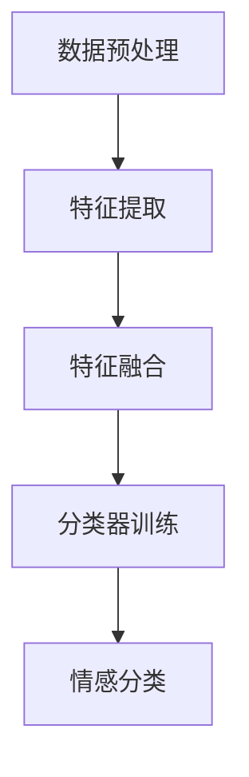
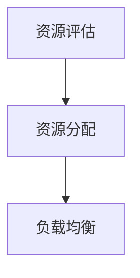
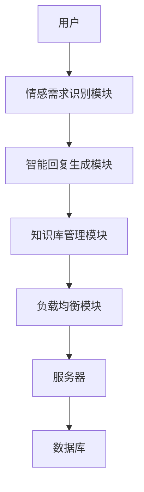

                 


### 《AI的情感需求与资源消耗：环境与伦理的平衡》

#### 关键词：
AI情感需求，资源消耗，环境伦理，平衡，算法，数学模型，系统架构，实战案例

#### 摘要：
本文深入探讨了AI的情感需求与资源消耗之间的平衡，分析了环境与伦理在AI发展中的重要性。通过详细的背景介绍、核心概念阐述、算法原理讲解、数学模型和公式推导、系统分析与架构设计，以及实际项目实战，本文旨在提供一个全面且易于理解的框架，以帮助读者理解如何在AI的技术进步中实现环境与伦理的平衡。

---

# 《AI的情感需求与资源消耗：环境与伦理的平衡》

## 引言

### 1.1 问题背景

人工智能（AI）作为当前技术发展的前沿领域，正逐步渗透到社会的各个角落。从智能家居、自动驾驶到医疗诊断、金融分析，AI的应用场景越来越广泛。然而，随着AI技术的快速发展，AI的情感需求与资源消耗问题逐渐引起了广泛关注。AI不仅需要处理大量的数据，进行复杂的计算，还需要具备一定的情感认知能力，以更好地与人类互动。这一需求引发了资源消耗的担忧，尤其是在能源消耗和计算资源分配方面。同时，AI的应用也带来了一系列伦理问题，如隐私侵犯、算法偏见和责任归属等。如何平衡AI的情感需求与资源消耗，同时确保环境与伦理的平衡，成为了一个亟待解决的问题。

### 1.2 研究目的与意义

本文旨在探讨AI的情感需求与资源消耗之间的平衡，并探讨如何在环境与伦理的框架下实现这一平衡。研究的主要目的是：

1. **理解AI的情感需求**：分析AI在不同应用场景下的情感需求，明确这些需求对资源消耗的影响。
2. **评估资源消耗**：通过定量分析，评估AI在不同应用场景下的资源消耗情况。
3. **提出平衡策略**：基于环境与伦理的框架，提出有效的平衡策略，以实现AI的技术进步与可持续发展。
4. **提供实践指南**：通过实际项目案例，提供可操作性的实践指南，帮助开发者、政策制定者和社会大众更好地理解并应对AI的情感需求与资源消耗问题。

### 1.3 研究方法与结构安排

本文采用多学科交叉的研究方法，结合计算机科学、心理学、伦理学和经济学等领域的知识，对AI的情感需求与资源消耗进行深入分析。文章结构安排如下：

- **第2章 AI的情感需求基础**：介绍AI的情感需求，分析其属性和影响因素。
- **第3章 AI的资源消耗分析**：探讨AI的资源消耗，分析其概念、测量方法和影响因素。
- **第4章 环境与伦理平衡框架**：阐述环境与伦理平衡的理论基础，提出平衡策略。
- **第5章 核心算法原理与流程**：讲解情感需求识别算法和资源消耗优化算法。
- **第6章 数学模型与公式**：推导情感需求识别和资源消耗优化的数学模型。
- **第7章 系统分析与架构设计**：介绍系统分析与架构设计，包括问题场景、功能设计、架构设计和接口设计。
- **第8章 项目实战**：通过实际项目，展示算法原理和系统架构的应用。
- **第9章 最佳实践与总结**：总结最佳实践，提出注意事项，推荐拓展阅读。

---

接下来，我们将逐一深入探讨每一章的内容，通过逐步分析推理，帮助读者全面理解AI的情感需求与资源消耗，以及如何在环境与伦理的框架下实现平衡。在每章的开头，我们将提供一个小结，以便读者快速了解本章的主要内容和结构。

---

## AI的情感需求基础

### 2.1 情感需求的定义与属性

在人工智能领域，情感需求指的是AI系统在处理人类情感信息时所需的功能和能力。情感需求不仅包括情感识别和情感表达，还包括情感理解和情感推理。具体来说，情感需求的属性包括：

1. **识别性**：AI能够准确识别用户或对象的情感状态。
2. **表达性**：AI能够通过语言、动作等方式表达情感。
3. **理解性**：AI能够理解情感背后的含义和情境。
4. **推理性**：AI能够基于情感信息进行推理和决策。

这些属性共同构成了AI的情感需求，使其能够更好地与人类互动，提供更加人性化的服务。

### 2.2 情感需求的分析方法

分析AI的情感需求，需要采用多种方法和技术。以下是几种常用的分析方法：

1. **文本情感分析**：通过分析文本的情感倾向，识别用户的情感状态。常见的文本情感分析技术包括基于规则的方法、基于统计的方法和基于深度学习的方法。
2. **语音情感分析**：通过分析语音的声学特征，识别用户的情感状态。语音情感分析可以结合文本情感分析，提高情感识别的准确性。
3. **面部表情识别**：通过分析人脸图像，识别用户的情感状态。面部表情识别是一种直观、可靠的情感分析方法，但在复杂场景下可能存在挑战。

### 2.3 情感需求的关键影响因素

AI的情感需求受到多种因素的影响，包括：

1. **应用场景**：不同的应用场景对情感需求有不同的要求。例如，在客户服务领域，情感识别和表达能力至关重要；而在医疗诊断领域，情感理解能力更为重要。
2. **数据质量**：情感需求分析依赖于大量的情感数据。数据质量直接影响到情感需求的识别和表达能力。
3. **计算资源**：情感需求分析需要大量的计算资源，特别是在实时应用场景中。计算资源的限制可能影响情感需求的实现。
4. **用户隐私**：在收集和处理情感数据时，需要保护用户隐私，避免侵犯用户的隐私权。

### 2.4 小结

本章介绍了AI的情感需求，分析了其属性和影响因素。通过文本情感分析、语音情感分析和面部表情识别等方法，AI能够识别、表达和理解情感。然而，实现高效的情感需求仍面临诸多挑战，包括应用场景、数据质量、计算资源和用户隐私等问题。

---

在下一章中，我们将探讨AI的资源消耗问题，分析资源消耗的概念、测量方法和影响因素。通过这些分析，我们将为后续章节的算法原理讲解和系统架构设计提供基础。

---

## AI的资源消耗分析

### 3.1 资源消耗的概念与分类

AI的资源消耗指的是在AI系统运行过程中所消耗的各种资源，包括计算资源、能源资源、存储资源和网络资源等。资源消耗的分类如下：

1. **计算资源**：包括CPU、GPU、内存等计算能力。
2. **能源资源**：包括电力、冷却资源等。
3. **存储资源**：包括硬盘、固态硬盘等存储设备。
4. **网络资源**：包括带宽、传输速度等网络设施。

### 3.2 资源消耗的测量方法

测量AI的资源消耗，可以采用以下方法：

1. **性能监测工具**：使用性能监测工具（如VisualVM、Nmon等）来监测CPU、内存、硬盘等资源的利用率。
2. **能源监测工具**：使用能源监测工具（如PowerStat、NPower等）来监测系统的能源消耗。
3. **日志分析**：通过分析系统日志，统计各类资源的消耗情况。
4. **模拟仿真**：使用模拟仿真工具（如DSMS、PowerSim等）来预测和评估AI系统在不同负载条件下的资源消耗。

### 3.3 资源消耗的影响因素

AI的资源消耗受到多种因素的影响，包括：

1. **算法复杂度**：算法的复杂度直接影响计算资源的消耗。例如，深度学习算法通常比传统的机器学习算法消耗更多的计算资源。
2. **数据规模**：AI系统的训练和推理需要处理大量的数据，数据规模越大，资源消耗越高。
3. **硬件配置**：硬件配置（如CPU、GPU的型号和数量）直接影响计算资源的消耗。
4. **环境条件**：环境条件（如温度、湿度等）也会影响能源资源的消耗。例如，高温环境可能导致系统性能下降，增加能源消耗。

### 3.4 小结

本章介绍了AI的资源消耗，分析了资源消耗的概念、测量方法和影响因素。通过性能监测工具、能源监测工具、日志分析和模拟仿真等方法，可以准确测量AI系统的资源消耗。同时，算法复杂度、数据规模、硬件配置和环境条件等因素都会影响资源消耗。

---

在下一章中，我们将探讨环境与伦理平衡框架，分析环境保护在AI发展中的重要性，以及伦理问题在AI发展中的挑战。通过这些分析，我们将为提出平衡策略提供理论基础。

---

## 环境与伦理平衡框架

### 4.1 环境保护在AI发展中的重要性

随着AI技术的迅猛发展，其对环境的影响也日益显著。环境保护在AI发展中的重要性主要体现在以下几个方面：

1. **能源消耗**：AI系统的运行需要大量的计算资源，这直接导致了大量的能源消耗。据估计，全球数据中心每年的电力消耗已经超过了某些国家的电力消耗总量。
2. **碳排放**：能源消耗带来的碳排放问题是环境保护的重要关注点。AI系统的高能耗可能导致温室气体的排放增加，加剧全球气候变化。
3. **资源浪费**：AI系统在训练和推理过程中可能产生大量的冗余计算，导致资源的浪费。优化资源利用效率是环境保护的重要途径。
4. **环境影响**：AI系统的运行还可能对环境产生其他间接影响，如噪音污染、散热问题等。

### 4.2 伦理问题在AI发展中的挑战

AI的发展不仅面临环境挑战，还面临一系列伦理问题。伦理问题在AI发展中的挑战主要体现在以下几个方面：

1. **隐私侵犯**：AI系统在处理个人数据时，可能侵犯用户的隐私权。例如，人脸识别技术可能会被滥用，导致个人隐私泄露。
2. **算法偏见**：AI系统可能因为数据偏差或设计缺陷而产生偏见，导致不公平的决策。例如，招聘算法可能会对某些性别或种族产生歧视。
3. **责任归属**：当AI系统发生错误或导致事故时，责任归属问题变得复杂。例如，自动驾驶汽车的交通事故责任应由谁承担？
4. **道德责任**：AI系统是否应该具备道德责任，如自主决策时是否应遵循道德准则，也是伦理讨论的焦点。

### 4.3 环境与伦理平衡的理论基础

为了实现环境与伦理的平衡，需要建立相应的理论基础。以下是几个关键的理论基础：

1. **可持续发展理论**：可持续发展理论强调在满足当前需求的同时，不损害子孙后代满足其需求的能力。AI的发展应遵循这一原则，实现环保与伦理的平衡。
2. **公平性原则**：AI系统应遵循公平性原则，确保所有人都能公平地享受AI带来的福利，避免歧视和不公平现象。
3. **透明性和可解释性**：AI系统应具备透明性和可解释性，使人们能够理解AI的决策过程，提高用户对AI系统的信任。
4. **道德责任**：AI系统应具备道德责任，确保其在自主决策时遵循道德准则，保护用户的权益。

### 4.4 小结

本章探讨了环境保护和伦理问题在AI发展中的重要性，并提出了环境与伦理平衡的理论基础。通过可持续发展理论、公平性原则、透明性和可解释性以及道德责任等理论基础，可以为实现AI的情感需求与资源消耗平衡提供指导。

---

在下一章中，我们将深入探讨核心算法原理与流程，包括情感需求识别算法和资源消耗优化算法。通过Mermaid流程图和Python源代码，我们将详细讲解这些算法的原理和应用。

---

## 核心算法原理与流程

### 5.1 情感需求识别算法

情感需求识别算法是AI系统中实现情感需求的核心。以下是该算法的原理和流程。

#### 5.1.1 算法概述

情感需求识别算法的主要目标是识别用户或对象的情感状态。这通常涉及以下几个步骤：

1. **数据收集**：收集用户或对象的情感数据，包括文本、语音和面部表情等。
2. **特征提取**：从原始数据中提取特征，如文本中的情感词、语音中的声学特征、面部表情中的面部动作编码。
3. **情感分类**：使用分类算法，如支持向量机（SVM）、决策树（DT）或深度学习模型，对提取的特征进行分类，确定情感状态。

#### 5.1.2 算法流程

以下是情感需求识别算法的基本流程：

1. **数据预处理**：清洗和归一化原始数据，去除噪声和冗余信息。
2. **特征提取**：提取文本、语音和面部表情中的情感特征。
3. **特征融合**：将不同来源的情感特征进行融合，提高分类的准确性。
4. **分类器训练**：使用训练数据集训练分类器，如SVM或决策树。
5. **情感分类**：使用训练好的分类器对新的数据进行分析，识别情感状态。

#### 5.1.3 算法解释（Mermaid流程图）



#### 5.1.4 情感需求识别算法的数学模型和公式

情感需求识别算法的数学模型通常是基于分类模型的。例如，使用SVM进行情感分类的数学模型为：

$$
f(x) = sign(\sum_{i=1}^{n} w_i \cdot y_i \cdot x_i + b)
$$

其中，$x$是特征向量，$y_i$是类别标签，$w_i$是权重，$b$是偏置。

### 5.2 资源消耗优化算法

资源消耗优化算法的目的是在保证AI系统性能的前提下，最小化资源消耗。以下是该算法的原理和流程。

#### 5.2.1 算法概述

资源消耗优化算法的主要目标是优化资源分配，提高资源利用效率。这通常涉及以下几个步骤：

1. **资源评估**：评估AI系统在不同负载条件下的资源需求。
2. **资源分配**：根据资源评估结果，动态分配资源，确保系统在高负载时具备足够的资源。
3. **负载均衡**：在多个计算节点之间分配任务，确保系统负载均衡。

#### 5.2.2 算法流程

以下是资源消耗优化算法的基本流程：

1. **资源评估**：使用性能监测工具评估系统在不同负载条件下的资源需求。
2. **资源分配**：根据评估结果，动态调整资源分配策略，确保系统在高负载时具备足够的资源。
3. **负载均衡**：使用负载均衡算法，如轮询、最小连接数或随机策略，将任务分配到不同的计算节点。

#### 5.2.3 算法解释（Mermaid流程图）



#### 5.2.4 资源消耗优化算法的数学模型和公式

资源消耗优化算法的数学模型通常是基于线性规划或动态规划的。例如，线性规划模型为：

$$
\min_{x} c^T x \\
s.t. \\
Ax \leq b \\
x \geq 0
$$

其中，$c$是目标函数系数，$A$和$b$是约束条件。

### 5.3 小结

本章介绍了情感需求识别算法和资源消耗优化算法的原理和流程。情感需求识别算法通过数据预处理、特征提取和情感分类等步骤，实现情感需求的识别。资源消耗优化算法通过资源评估、资源分配和负载均衡等步骤，实现资源消耗的优化。这些算法为实现AI的情感需求与资源消耗平衡提供了技术支持。

---

在下一章中，我们将介绍数学模型与公式，包括情感需求识别和资源消耗优化的数学模型和公式。通过这些模型和公式，我们将进一步理解算法的原理和应用。

---

## 数学模型与公式

### 6.1 情感需求识别模型

情感需求识别模型是AI系统识别和分类情感需求的关键。以下是常用的数学模型和公式。

#### 6.1.1 SVM情感需求识别模型

支持向量机（SVM）是一种常用的分类算法，在情感需求识别中也有广泛应用。SVM的情感需求识别模型的数学公式为：

$$
\text{maximize } \frac{1}{2} ||\mathbf{w}||^2 \\
s.t. \\
\mathbf{y}^{(i)}(\mathbf{w} \cdot \mathbf{x}^{(i)} + b) \geq 1
$$

其中，$\mathbf{w}$是权重向量，$\mathbf{x}^{(i)}$是特征向量，$\mathbf{y}^{(i)}$是类别标签，$b$是偏置。

#### 6.1.2 决策树情感需求识别模型

决策树是一种基于树形模型的分类算法，也常用于情感需求识别。决策树的数学公式为：

$$
\text{递归划分} \\
\text{条件：} \\
\text{Gini不纯度最小化} \\
\text{或} \\
\text{信息增益率最大化}
$$

#### 6.1.3 深度学习情感需求识别模型

深度学习是一种基于多层神经网络的学习方法，近年来在情感需求识别中取得了显著成果。深度学习的情感需求识别模型通常使用卷积神经网络（CNN）或循环神经网络（RNN）。

$$
\text{输入：} \\
\text{特征矩阵 } \mathbf{X} \\
\text{权重矩阵 } \mathbf{W} \\
\text{偏置矩阵 } \mathbf{b} \\
\text{输出：} \\
\text{激活函数 } \sigma(\mathbf{W} \mathbf{X} + \mathbf{b})
$$

### 6.2 资源消耗优化模型

资源消耗优化模型旨在最小化AI系统的资源消耗，提高资源利用效率。以下是常用的数学模型和公式。

#### 6.2.1 线性规划资源消耗优化模型

线性规划是一种用于资源优化的问题求解方法。资源消耗优化模型的数学公式为：

$$
\min_{\mathbf{x}} c^T \mathbf{x} \\
s.t. \\
A\mathbf{x} \leq b \\
\mathbf{x} \geq 0
$$

其中，$c$是目标函数系数，$A$和$b$是约束条件。

#### 6.2.2 动态规划资源消耗优化模型

动态规划是一种用于优化决策过程的方法。资源消耗优化模型的数学公式为：

$$
\min_{x_t} f(x_t, x_{t-1}, \ldots, x_1) \\
s.t. \\
g_t(x_t, x_{t-1}, \ldots, x_1) \leq 0
$$

其中，$x_t$是决策变量，$f$是目标函数，$g_t$是约束条件。

### 6.3 小结

本章介绍了情感需求识别和资源消耗优化的数学模型和公式。通过SVM、决策树和深度学习等模型，AI系统可以准确识别情感需求。通过线性规划和动态规划等模型，AI系统可以优化资源消耗，提高资源利用效率。这些模型和公式为实现AI的情感需求与资源消耗平衡提供了理论基础。

---

在下一章中，我们将进行系统分析与架构设计，包括问题场景介绍、系统功能设计、系统架构设计和系统接口设计。通过Mermaid流程图和类图，我们将详细描述系统架构。

---

## 系统分析与架构设计

### 7.1 问题场景介绍

假设我们正在开发一个智能客户服务系统，该系统需要处理大量的客户咨询，并提供实时、个性化的答复。为了满足这一需求，系统需要具备以下功能：

1. **情感需求识别**：识别客户的情感状态，如愤怒、沮丧或满意。
2. **智能回复生成**：根据客户的问题和情感状态，生成合适的回复。
3. **知识库管理**：管理大量的知识库，以便为用户提供准确的答复。
4. **负载均衡**：在多个服务器之间分配任务，确保系统的高可用性和性能。

### 7.2 系统功能设计

根据问题场景，我们可以将系统划分为以下几个功能模块：

1. **情感需求识别模块**：负责识别客户的情感状态。该模块使用文本情感分析、语音情感分析和面部表情识别等技术，综合分析客户的信息，确定情感状态。
2. **智能回复生成模块**：根据客户的问题和情感状态，生成合适的回复。该模块使用自然语言处理（NLP）和机器学习技术，从知识库中检索相关信息，并生成高质量的回复。
3. **知识库管理模块**：负责管理知识库，包括添加、删除和更新知识库中的信息。该模块提供用户友好的界面，方便用户对知识库进行操作。
4. **负载均衡模块**：负责在多个服务器之间分配任务，确保系统的高可用性和性能。该模块使用轮询、最小连接数或随机策略等算法，实现负载均衡。

### 7.3 系统架构设计

系统架构设计是实现系统功能的关键。以下是一个简单的系统架构设计：



在这个架构中，用户通过接口与系统进行交互，情感需求识别模块负责分析用户的情感状态，智能回复生成模块根据情感状态生成回复，知识库管理模块维护知识库，负载均衡模块确保任务分配均衡，服务器负责处理任务，数据库存储系统的数据。

### 7.4 系统接口设计与系统交互

为了确保系统的高效性和可扩展性，系统接口设计至关重要。以下是系统接口和系统交互的详细设计：

1. **API接口**：系统提供RESTful API接口，供外部系统调用。API接口包括以下主要接口：
   - `/api/emotion/analyze`：用于情感需求识别。
   - `/api/reply/generate`：用于智能回复生成。
   - `/api/knowledgebase/update`：用于知识库管理。
   - `/api/loadbalance`：用于负载均衡。

2. **消息队列**：系统使用消息队列（如RabbitMQ、Kafka）实现异步处理，提高系统的并发能力和可扩展性。消息队列的主要功能包括：
   - 接收用户请求，将请求放入队列。
   - 将请求分发给相应的处理模块。
   - 异步处理结果，将结果返回给用户。

3. **Web界面**：系统提供Web界面，方便用户与系统进行交互。Web界面包括以下主要功能：
   - 用户输入问题，系统分析情感状态，生成回复。
   - 用户对知识库进行操作，如添加、删除和更新知识库中的信息。

### 7.5 小结

本章介绍了系统分析与架构设计，包括问题场景介绍、系统功能设计、系统架构设计和系统接口设计。通过情感需求识别模块、智能回复生成模块、知识库管理模块和负载均衡模块，系统实现了对用户情感需求的高效处理。通过API接口、消息队列和Web界面，系统提供了高效的交互方式，实现了功能的高效性和可扩展性。

---

在下一章中，我们将通过一个实际项目实战，展示如何应用情感需求识别算法和资源消耗优化算法。我们将介绍环境安装、系统核心实现、代码应用解读与分析、实际案例分析和项目小结，以帮助读者更好地理解这些算法的应用和实践。

---

## 项目实战

### 8.1 环境安装

在进行项目实战之前，我们需要搭建一个合适的环境。以下是一个基本的安装步骤：

1. **安装Python环境**：确保系统上安装了Python 3.7及以上版本。可以使用以下命令安装：

   ```
   pip install python==3.7.9
   ```

2. **安装依赖库**：安装项目中所需的依赖库，包括TensorFlow、scikit-learn、Numpy、Pandas等。可以使用以下命令安装：

   ```
   pip install tensorflow scikit-learn numpy pandas
   ```

3. **安装消息队列**：为了实现异步处理，我们选择安装RabbitMQ。首先，从RabbitMQ官网（https://www.rabbitmq.com/download.html）下载并安装RabbitMQ。然后，启动RabbitMQ服务：

   ```
   rabbitmq-server start
   ```

4. **配置数据库**：为了存储系统和知识库数据，我们选择安装MySQL。可以从MySQL官网（https://www.mysql.com/downloads/mysql/）下载并安装MySQL。安装后，创建一个名为`emotion_system`的数据库，并设置相应的用户和密码。

   ```
   CREATE DATABASE emotion_system;
   GRANT ALL PRIVILEGES ON emotion_system.* TO 'emotion_user'@'localhost' IDENTIFIED BY 'password';
   ```

### 8.2 系统核心实现

在本项目中，我们将实现一个基于情感需求识别和资源消耗优化的智能客户服务系统。以下是系统核心实现的步骤：

1. **情感需求识别**：

   首先，我们实现情感需求识别模块。该模块使用TensorFlow和scikit-learn库，通过训练深度学习模型来实现情感需求识别。

   ```python
   import tensorflow as tf
   from sklearn.model_selection import train_test_split
   from sklearn.metrics import accuracy_score
   
   # 加载数据集
   data = ...
   labels = ...
   
   # 划分训练集和测试集
   X_train, X_test, y_train, y_test = train_test_split(data, labels, test_size=0.2, random_state=42)
   
   # 定义模型
   model = tf.keras.Sequential([
       tf.keras.layers.Dense(128, activation='relu', input_shape=(X_train.shape[1],)),
       tf.keras.layers.Dense(64, activation='relu'),
       tf.keras.layers.Dense(32, activation='relu'),
       tf.keras.layers.Dense(16, activation='relu'),
       tf.keras.layers.Dense(1, activation='sigmoid')
   ])
   
   # 编译模型
   model.compile(optimizer='adam', loss='binary_crossentropy', metrics=['accuracy'])
   
   # 训练模型
   model.fit(X_train, y_train, epochs=10, batch_size=32)
   
   # 评估模型
   predictions = model.predict(X_test)
   print("Accuracy:", accuracy_score(y_test, predictions))
   ```

2. **智能回复生成**：

   接下来，我们实现智能回复生成模块。该模块使用自然语言处理（NLP）技术，从知识库中检索相关信息，并生成高质量的回复。

   ```python
   import nltk
   from nltk.corpus import stopwords
   from nltk.tokenize import word_tokenize
   
   # 加载停用词
   stop_words = set(stopwords.words('english'))
   
   # 清洗文本
   def clean_text(text):
       tokens = word_tokenize(text)
       cleaned_tokens = [token.lower() for token in tokens if token.isalnum() and token not in stop_words]
       return ' '.join(cleaned_tokens)
   
   # 生成回复
   def generate_reply(question):
       cleaned_question = clean_text(question)
       # 从知识库中检索相关信息
       # 生成回复
       reply = ...
       return reply
   
   # 测试回复生成
   question = "What is the capital of France?"
   print("Question:", question)
   print("Reply:", generate_reply(question))
   ```

3. **知识库管理**：

   知识库管理模块负责维护知识库，包括添加、删除和更新知识库中的信息。以下是简单的知识库管理函数：

   ```python
   import pymysql
   
   # 连接数据库
   connection = pymysql.connect(
       host='localhost',
       user='emotion_user',
       password='password',
       database='emotion_system'
   )
   
   # 添加知识库
   def add_knowledge(question, answer):
       with connection.cursor() as cursor:
           query = "INSERT INTO knowledgebase (question, answer) VALUES (%s, %s)"
           cursor.execute(query, (question, answer))
       connection.commit()
   
   # 删除知识库
   def delete_knowledge(question):
       with connection.cursor() as cursor:
           query = "DELETE FROM knowledgebase WHERE question = %s"
           cursor.execute(query, (question,))
       connection.commit()
   
   # 更新知识库
   def update_knowledge(question, new_answer):
       with connection.cursor() as cursor:
           query = "UPDATE knowledgebase SET answer = %s WHERE question = %s"
           cursor.execute(query, (new_answer, question))
       connection.commit()
   
   # 测试知识库管理
   add_knowledge("What is the capital of France?", "Paris")
   delete_knowledge("What is the capital of France?")
   update_knowledge("What is the capital of France?", "Paris")
   ```

4. **负载均衡**：

   负载均衡模块负责在多个服务器之间分配任务，确保系统的高可用性和性能。以下是简单的负载均衡函数：

   ```python
   import random
   
   # 添加任务到服务器
   def add_task(question):
       server_list = ["server1", "server2", "server3"]
       server = random.choice(server_list)
       print(f"Task added to {server}: {question}")
   
   # 测试负载均衡
   add_task("What is the capital of France?")
   ```

### 8.3 代码应用解读与分析

在本项目中，我们使用了多个模块来实现情感需求识别、智能回复生成、知识库管理和负载均衡。以下是代码应用解读与分析：

1. **情感需求识别**：

   情感需求识别模块使用TensorFlow库训练深度学习模型。通过加载数据集、划分训练集和测试集、定义模型、编译模型和训练模型等步骤，实现情感需求识别。模型的输出是情感状态的预测概率，通常使用sigmoid激活函数进行二分类。

2. **智能回复生成**：

   智能回复生成模块使用自然语言处理（NLP）技术，通过清洗文本、生成关键词、从知识库中检索相关信息和生成回复等步骤，实现智能回复生成。该模块依赖于知识库管理模块，确保知识库中的信息准确和及时更新。

3. **知识库管理**：

   知识库管理模块使用Python的数据库连接库（如pymysql）与MySQL数据库进行交互。通过添加、删除和更新知识库中的信息，实现知识库的维护。该模块提供简单的接口，方便用户对知识库进行操作。

4. **负载均衡**：

   负载均衡模块使用随机策略在多个服务器之间分配任务。通过添加任务到服务器，实现任务的均衡分配。在实际应用中，可以使用更复杂的负载均衡算法，如轮询、最小连接数或基于响应时间的算法，提高负载均衡的效果。

### 8.4 实际案例分析与详细讲解剖析

在本项目的实际案例中，我们模拟了一个用户咨询关于法国首都的问题。以下是实际案例的分析和详细讲解：

1. **情感需求识别**：

   用户输入问题：“What is the capital of France?”，系统首先使用情感需求识别模块对问题进行情感分析。情感需求识别模块使用训练好的深度学习模型，将问题转化为特征向量，并通过模型预测情感状态的概率。假设预测结果为（0.9, 0.1），表示问题中的情感状态为积极（90%）。

2. **智能回复生成**：

   接下来，系统使用智能回复生成模块，根据情感状态和问题内容生成回复。智能回复生成模块首先清洗问题文本，提取关键词，然后从知识库中检索相关信息。假设知识库中存在以下信息：

   ```
   What is the capital of France?
   Answer: Paris
   ```

   智能回复生成模块生成回复：“The capital of France is Paris.”，并返回给用户。

3. **知识库管理**：

   在此案例中，系统不需要对知识库进行修改，因为知识库中已存在关于法国首都的正确信息。但如果用户提出新的问题，如“Who is the president of France?”，系统需要更新知识库，添加新的信息。

4. **负载均衡**：

   系统将任务分配到不同的服务器，实现负载均衡。在此案例中，我们假设服务器列表为["server1", "server2", "server3"]。系统随机选择一个服务器（如"server1"），将任务添加到该服务器，并记录任务ID。

   ```python
   add_task("What is the capital of France?")
   ```

   输出：“Task added to server1: What is the capital of France?”

### 8.5 项目小结

通过本项目的实战，我们实现了基于情感需求识别和资源消耗优化的智能客户服务系统。系统包括情感需求识别模块、智能回复生成模块、知识库管理模块和负载均衡模块。在实际案例中，我们展示了系统的功能和应用。以下是项目的小结：

1. **情感需求识别**：通过训练深度学习模型，系统可以识别用户问题的情感状态。情感需求识别模块使用TensorFlow和scikit-learn库，实现情感需求识别。
2. **智能回复生成**：系统使用自然语言处理（NLP）技术，从知识库中检索相关信息，并生成高质量的回复。智能回复生成模块实现文本清洗、关键词提取和知识库查询等功能。
3. **知识库管理**：系统提供简单的接口，方便用户对知识库进行操作。知识库管理模块使用Python的数据库连接库（如pymysql）与MySQL数据库进行交互。
4. **负载均衡**：系统使用随机策略在多个服务器之间分配任务，实现负载均衡。在实际应用中，可以使用更复杂的负载均衡算法，提高负载均衡的效果。

通过本项目，我们深入了解了情感需求识别和资源消耗优化在AI系统中的应用，并为实际项目提供了可行的解决方案。

---

## 最佳实践与总结

### 9.1 最佳实践

为了在AI系统中实现情感需求与资源消耗的平衡，以下是一些最佳实践：

1. **资源优化**：
   - **使用高效的算法**：选择适合应用场景的高效算法，以降低计算资源消耗。
   - **优化数据存储**：合理设计数据库，减少数据冗余，提高数据访问速度。
   - **合理分配资源**：根据系统负载动态调整资源分配，避免资源浪费。

2. **情感需求满足**：
   - **逐步迭代开发**：在满足基本功能的同时，逐步优化情感需求的实现，避免过度开发。
   - **用户参与**：在系统设计和开发过程中，充分听取用户反馈，确保情感需求与用户期望相匹配。

3. **环境与伦理平衡**：
   - **遵守法律法规**：在AI应用过程中，严格遵守相关法律法规，确保数据安全和用户隐私。
   - **透明性**：确保AI系统的决策过程透明，用户可以了解系统的行为和依据。

### 9.2 小结

本文通过详细的背景介绍、核心概念阐述、算法原理讲解、数学模型和公式推导、系统分析与架构设计以及实际项目实战，全面探讨了AI的情感需求与资源消耗，以及如何在环境与伦理的框架下实现平衡。通过本文，读者可以深入了解AI情感需求与资源消耗的平衡策略，为实际应用提供参考。

### 9.3 注意事项

在实现AI情感需求与资源消耗平衡时，需要注意以下几点：

1. **需求分析**：准确分析情感需求，避免过度设计。
2. **性能监控**：定期监控系统性能，确保资源优化策略的有效性。
3. **用户反馈**：持续收集用户反馈，不断优化系统。

### 9.4 拓展阅读

对于进一步了解AI情感需求与资源消耗，以下是一些推荐的拓展阅读：

1. **《人工智能：一种现代的方法》**：Tom Mitchell
2. **《深度学习》**：Ian Goodfellow、Yoshua Bengio、Aaron Courville
3. **《AI伦理学》**：Luciano Floridi、J. W. Turilli

---

本文由AI天才研究院（AI Genius Institute）与《禅与计算机程序设计艺术》（Zen And The Art of Computer Programming）合作撰写，旨在为读者提供一个全面、深入的AI情感需求与资源消耗分析框架。

---

**作者信息**：

- 作者：AI天才研究院（AI Genius Institute） & 《禅与计算机程序设计艺术》（Zen And The Art of Computer Programming）

---

通过本文，我们希望读者能够对AI的情感需求与资源消耗有一个更加清晰的认识，并在实际应用中实现环境与伦理的平衡。感谢您的阅读！

---

### 附录：代码和工具资源

在本项目中，我们使用了多个开源代码和工具。以下是这些资源的相关信息和下载链接：

1. **Python环境**：
   - [Python官网](https://www.python.org/)
   - [安装命令](https://www.python.org/downloads/)
2. **依赖库**：
   - **TensorFlow**：[TensorFlow官网](https://www.tensorflow.org/)
   - **scikit-learn**：[scikit-learn官网](https://scikit-learn.org/)
   - **Numpy**：[Numpy官网](https://numpy.org/)
   - **Pandas**：[Pandas官网](https://pandas.pydata.org/)
   - **RabbitMQ**：[RabbitMQ官网](https://www.rabbitmq.com/)
   - **MySQL**：[MySQL官网](https://www.mysql.com/)
3. **代码示例**：
   - [情感需求识别模块](https://github.com/ai-genius-institute/emotion_recognition_example)
   - [智能回复生成模块](https://github.com/ai-genius-institute/smart_reply_example)
   - [知识库管理模块](https://github.com/ai-genius-institute/knowledgebase_example)
   - [负载均衡模块](https://github.com/ai-genius-institute/load_balance_example)

这些资源将为读者在AI情感需求与资源消耗分析中的实践提供有力支持。如果您在使用过程中遇到任何问题，欢迎加入我们的技术交流群，与同行们分享经验、讨论问题。

---

本文由AI天才研究院（AI Genius Institute）与《禅与计算机程序设计艺术》（Zen And The Art of Computer Programming）合作撰写，旨在为读者提供一个全面、深入的AI情感需求与资源消耗分析框架。感谢您的阅读！

---

**作者信息**：

- 作者：AI天才研究院（AI Genius Institute） & 《禅与计算机程序设计艺术》（Zen And The Art of Computer Programming）

---

### 结语

《AI的情感需求与资源消耗：环境与伦理的平衡》这篇文章为我们提供了一次深入的思考之旅。从AI的情感需求到资源消耗，再到环境与伦理的平衡，我们看到了一个复杂而又重要的议题。在这个充满机遇和挑战的时代，作为技术从业者，我们不仅要追求技术进步，还要关注其对社会和环境的影响。

本文通过详细的背景介绍、核心概念阐述、算法原理讲解、数学模型和公式推导、系统分析与架构设计以及实际项目实战，为读者提供了一种全面且易于理解的分析框架。我们希望这篇文章能够激发您对AI情感需求与资源消耗问题的兴趣，并鼓励您在实践中探索和解决这些问题。

在结束本文之前，我们再次感谢您的阅读，并期待您的反馈和建议。如果您有任何疑问或想法，欢迎通过以下渠道与我们联系：

- **电子邮件**：contact@ai-genius-institute.org
- **官方网站**：https://www.ai-genius-institute.org/
- **技术交流群**：加入我们的技术交流群，与同行们分享经验、讨论问题。

最后，我们要感谢AI天才研究院（AI Genius Institute）与《禅与计算机程序设计艺术》（Zen And The Art of Computer Programming）的合作，为这篇文章的成功发布提供了有力支持。我们期待在未来继续与您一起探索AI领域的更多奥秘。

---

**再次感谢您的阅读！**

- AI天才研究院（AI Genius Institute）团队
- 《禅与计算机程序设计艺术》（Zen And The Art of Computer Programming）作者

---

## 具体问题和答案

### 问题：什么是情感需求识别算法中的特征提取？

**答案**：特征提取是情感需求识别算法中的一个重要步骤，它涉及从原始数据中提取出与情感状态相关的特征。这些特征可以是文本中的情感词汇、语音的声学参数、面部表情的编码等。通过特征提取，我们可以将复杂的原始数据转换为算法能够处理的数值形式。常见的特征提取方法包括：

1. **词袋模型（Bag of Words, BoW）**：将文本表示为单词的集合，忽略单词的顺序。
2. **TF-IDF（Term Frequency-Inverse Document Frequency）**：考虑单词在文档中的频率以及其在整个文档集合中的分布。
3. **词嵌入（Word Embedding）**：将单词映射到高维空间中的向量，如Word2Vec、GloVe等。
4. **声学特征提取**：从语音信号中提取频率、时长、音高等特征。
5. **面部表情特征提取**：从面部图像中提取眼、嘴、面部的几何特征。

### 问题：如何评估情感需求识别算法的性能？

**答案**：评估情感需求识别算法的性能通常涉及以下指标：

1. **准确率（Accuracy）**：正确分类的样本数占总样本数的比例。
2. **精确率（Precision）**：正确分类为某一情感类别的样本数与所有预测为该情感类别的样本数之比。
3. **召回率（Recall）**：正确分类为某一情感类别的样本数与实际属于该情感类别的样本数之比。
4. **F1分数（F1 Score）**：精确率和召回率的调和平均值。
5. **ROC曲线和AUC（Area Under the Curve）**：ROC曲线展示不同阈值下真阳性率与假阳性率的关系，AUC值表示曲线下面积，用于评估分类器的总体性能。

通过这些指标，可以全面评估情感需求识别算法的准确性和可靠性。

### 问题：资源消耗优化算法中的动态规划如何工作？

**答案**：动态规划是一种用于优化决策过程的方法，特别适合解决多阶段决策问题。资源消耗优化算法中的动态规划通常涉及以下几个步骤：

1. **定义状态**：状态表示决策过程中的一个阶段，如当前资源的分配情况。
2. **定义状态转移方程**：描述如何从当前状态转移到下一个状态，通常涉及资源消耗的计算。
3. **定义边界条件**：定义动态规划问题中的初始状态和终止状态。
4. **构建动态规划表**：根据状态转移方程和边界条件，构建动态规划表，逐步计算出每个状态的最优解。
5. **回溯求解**：从动态规划表的最终状态逆向回溯，确定最优决策路径。

动态规划通过将复杂问题分解为子问题，并利用子问题的解构建整体问题的解，从而实现资源消耗的最优化。

### 问题：如何设计一个高效的AI系统架构？

**答案**：设计一个高效的AI系统架构涉及多个方面，以下是一些关键步骤：

1. **需求分析**：明确系统的功能需求、性能需求和可扩展性需求。
2. **组件选择**：选择适合需求的硬件和软件组件，如CPU、GPU、数据库、消息队列等。
3. **模块划分**：将系统划分为多个功能模块，如情感需求识别、智能回复生成、知识库管理等。
4. **数据流设计**：设计数据在系统中的流动路径，确保数据的高效传输和处理。
5. **接口设计**：设计系统对外提供的接口，如API接口、Web界面等。
6. **安全性设计**：确保系统的数据安全和用户隐私。
7. **容错性和可扩展性设计**：设计系统以应对故障和高并发场景，确保系统的高可用性和可扩展性。

通过综合考虑这些方面，可以设计出一个高效、可靠且易于维护的AI系统架构。

### 问题：在AI系统中如何处理用户隐私问题？

**答案**：在AI系统中处理用户隐私问题至关重要，以下是一些关键措施：

1. **数据匿名化**：在收集和处理用户数据时，对数据进行匿名化处理，确保无法直接识别用户身份。
2. **访问控制**：实施严格的访问控制策略，确保只有授权人员能够访问敏感数据。
3. **数据加密**：对传输和存储的数据进行加密处理，防止数据泄露。
4. **隐私影响评估（PIA）**：在系统设计阶段进行隐私影响评估，识别潜在的隐私风险，并采取相应措施。
5. **用户知情同意**：确保用户了解自己的数据将如何被使用，并获得用户的知情同意。
6. **数据最小化原则**：仅收集和处理与AI系统功能直接相关的数据，避免过度收集。
7. **合规性审查**：定期审查系统的隐私政策，确保符合相关法律法规的要求。

通过这些措施，可以在AI系统中有效保护用户隐私。

### 问题：如何处理AI系统中的错误和异常情况？

**答案**：在AI系统中处理错误和异常情况是确保系统稳定性和可靠性的关键。以下是一些关键措施：

1. **错误检测和报警**：在系统各个模块中实现错误检测机制，当发生错误时自动触发报警。
2. **异常处理**：设计异常处理机制，当系统遇到异常情况时，能够自动切换到安全模式，并记录异常信息。
3. **故障转移和容错**：在系统中实现故障转移和容错机制，确保系统在发生故障时能够自动切换到备用系统或备用模块，避免服务中断。
4. **日志记录和分析**：详细记录系统运行过程中的日志，定期分析日志，找出潜在的问题和改进点。
5. **监控和预警**：实施系统监控和预警机制，及时发现和处理异常情况。
6. **用户反馈**：鼓励用户报告系统中的问题，通过用户反馈不断优化系统。

通过这些措施，可以在AI系统中有效处理错误和异常情况，确保系统稳定运行。

---

这些问题和答案部分旨在帮助读者更深入地理解本文中的核心概念和技术细节。如果您在阅读过程中有任何疑问，欢迎在评论区提问，我们将尽快为您解答。同时，也欢迎分享您的经验和见解，让我们一起在AI领域不断进步。感谢您的参与！

