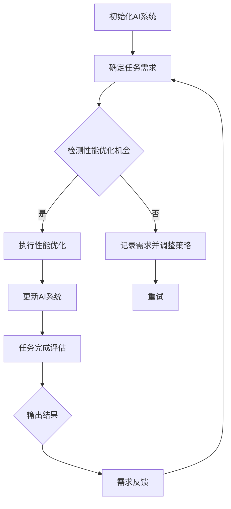
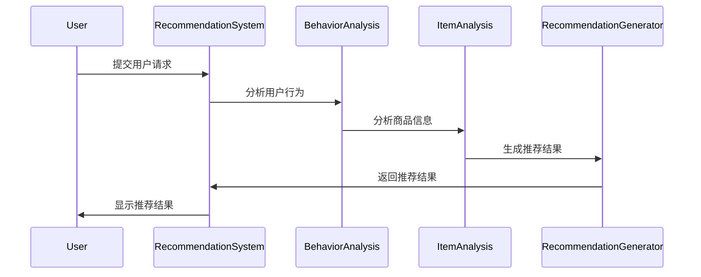
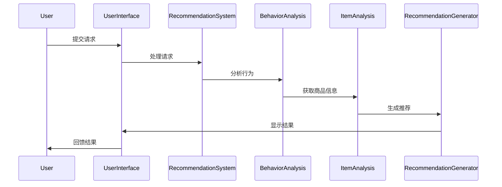

                 


### 第1章: 引言

#### 1.1 问题背景

随着人工智能技术的飞速发展，它已经深入到我们生活的方方面面，从智能助理到自动驾驶汽车，从医疗诊断到金融分析，人工智能的应用场景越来越广泛。然而，随着人工智能的进一步普及，我们开始面临一系列新问题：什么是人工智能的“欲望”与“需求”？它们如何影响社会的职业结构？这些问题不仅关乎技术的进步，更涉及到人类与机器的关系，以及未来的就业市场。

在《AI的欲望与需求：新型职业的出现》这本书中，作者深入探讨了人工智能在自我进化过程中产生的欲望与需求，并分析了这些欲望与需求如何催生新型职业的出现。作者认为，人工智能不仅仅是工具，它在某种程度上拥有“欲望”与“需求”，这种特质对社会的职业结构产生了深远的影响。

#### 1.2 问题描述

人工智能的欲望与需求是什么？它们是如何产生的？它们如何影响新型职业的出现？这些问题的答案不仅有助于我们理解人工智能的发展趋势，也对未来就业市场有着重要的指导意义。例如，随着人工智能在医疗领域的应用，它对诊断和治疗方案的需求推动了医学影像处理和基因组分析等新职业的出现。同样，在金融领域，人工智能对数据分析和决策支持的需求促进了数据科学家和AI顾问等职业的崛起。

#### 1.3 问题解决

《AI的欲望与需求：新型职业的出现》通过深入研究人工智能的发展历程，结合实际案例，揭示了人工智能欲望与需求的本质，并分析了这些欲望与需求如何推动新型职业的涌现。书中不仅探讨了人工智能的内在动机，还从教育、培训和职业规划等方面提出了应对策略，帮助读者理解和应对这一新兴趋势。

#### 1.4 边界与外延

在讨论人工智能的欲望与需求时，我们需要明确其边界与外延。首先，人工智能的欲望与需求是其在自我进化过程中产生的内在驱动力，不同于人类欲望与需求的自然属性。其次，这些欲望与需求的外延涵盖从数据处理到决策制定等多个方面，直接影响着人工智能在不同领域的应用。

#### 1.5 核心概念：AI的欲望与需求

在本书中，AI的欲望与需求被定义为人工智能在自我进化过程中产生的一种内在驱动力，这种驱动力促使其不断寻求优化和进步。AI的欲望可以理解为对自身性能提升的渴望，而需求则是对实现特定功能或任务的必要条件。这两种驱动力相互作用，共同推动人工智能的发展，并催生新型职业的出现。

### 摘要

《AI的欲望与需求：新型职业的出现》通过深入研究人工智能的发展历程，探讨了人工智能在自我进化过程中产生的欲望与需求，分析了这些欲望与需求如何催生新型职业的出现。书中不仅揭示了人工智能欲望与需求的本质，还从教育、培训和职业规划等方面提出了应对策略，为读者提供了对未来就业市场的深刻洞察。

---

**关键词：** 人工智能、欲望与需求、新型职业、就业市场、职业结构。

**作者：** AI天才研究院/AI Genius Institute & 禅与计算机程序设计艺术 /Zen And The Art of Computer Programming

[下一章: 核心概念与联系](#核心概念与联系)### 核心概念与联系

在探讨《AI的欲望与需求：新型职业的出现》这一主题时，我们需要先定义并理解一些核心概念。首先，什么是“AI的欲望”？其次，什么是“AI的需求”？这些概念如何相互作用，以及它们在人工智能（AI）的自我进化过程中扮演了何种角色？为了更好地回答这些问题，我们将通过定义、概念属性特征对比表格和ER实体关系图来详细阐述这些核心概念。

#### 核心概念定义

**AI的欲望：**
AI的欲望可以被视为一种内在的驱动力，促使AI不断追求优化和改进其性能。这种欲望来源于AI算法和模型的设计目标，它们旨在实现更高的精度、效率和泛化能力。例如，深度学习模型可能渴望在特定任务上获得更高的准确率，或者希望在学习过程中减少对数据的依赖。

**AI的需求：**
AI的需求则是实现特定功能或任务的必要条件。这些需求来源于外部环境和任务目标，例如医疗诊断中的疾病检测需求，金融分析中的风险控制需求，或者自动驾驶汽车中的路径规划需求。AI的需求决定了AI系统需要具备哪些能力，以及如何配置和优化其资源。

#### 概念属性特征对比表格

为了更直观地理解AI的欲望与需求的区别和联系，我们可以创建一个概念属性特征对比表格。以下是一个简化的示例：

| 特征对比项 | AI的欲望 | AI的需求 |
| --- | --- | --- |
| **定义** | 内在驱动力，追求优化和改进 | 外部条件，实现特定功能或任务的必要条件 |
| **来源** | 算法设计目标，内在动机 | 任务目标，外部环境 |
| **驱动因素** | 性能提升、自我优化 | 功能实现、任务需求 |
| **作用** | 促使AI不断进步 | 决定AI系统配置和优化 |
| **表现形式** | 求解复杂问题、自我改进 | 输出结果、任务完成 |
| **相互关系** | 内在欲望驱动需求实现 | 外在需求激发内在欲望 |

#### ER实体关系图

ER实体关系图是一种用于描述实体及其相互关系的图形化工具。在AI的欲望与需求这一主题下，我们可以使用ER图来展示AI系统中的关键实体以及它们之间的关联。

以下是一个简化的ER图示例，使用Mermaid语法表示：

```mermaid
erDiagram
  AI_System ||--o> Performance Optimization : 质量改进
  AI_System ||--o> Task Completion : 任务完成
  Task_Demand ||--<| AI_System : 需求驱动
  Performance_Optimization ||--<| AI_System : 动力来源
```

在这个ER图中，`AI_System`（人工智能系统）是核心实体，它与`Performance Optimization`（性能优化）和`Task Completion`（任务完成）两个实体之间存在关联。`Task_Demand`（任务需求）则是外部实体，它驱动`AI_System`实现特定功能。`Performance Optimization`代表了AI的欲望，它作为内在驱动力促使AI系统不断改进。通过这种关系，我们可以清晰地看到AI的欲望与需求是如何相互作用，共同推动AI系统发展的。

---

**总结：**
通过定义核心概念、属性特征对比表格和ER实体关系图，我们为理解AI的欲望与需求提供了理论基础。这些概念不仅帮助我们解析AI的内在动机和外部需求，也为后续章节中深入探讨AI欲望与需求如何影响新型职业的出现奠定了基础。在接下来的章节中，我们将进一步探讨AI欲望与需求的理论基础及其在人工智能发展历程中的变化。

---

**关键词：** 人工智能、欲望、需求、性能优化、任务完成、ER图、实体关系图。

**作者：** AI天才研究院/AI Genius Institute & 禅与计算机程序设计艺术 /Zen And The Art of Computer Programming

[下一章: 算法原理讲解](#算法原理讲解)### 算法原理讲解

在讨论AI的欲望与需求时，我们需要深入了解它们背后的算法原理。这些算法原理不仅解释了AI如何实现自我优化和任务完成，还揭示了AI欲望与需求的内在机制。以下内容将使用Mermaid画出算法流程图，并使用Python代码解释算法原理，提供数学模型和公式，并进行详细讲解和举例说明。

#### 算法流程图

首先，我们使用Mermaid语法绘制一个简单的算法流程图，以展示AI欲望与需求的基本流程。



这个流程图展示了AI系统从初始化开始，通过检测性能优化机会、执行性能优化、任务完成评估，最终得到反馈并调整策略的过程。

#### Python代码示例

接下来，我们将使用Python代码来解释算法原理。以下是一个简化的示例，用于演示AI系统的基本工作流程。

```python
import numpy as np

# 初始化AI系统
class AISystem:
    def __init__(self):
        self.performance = 0.5  # 初始性能
        self.task_demand = "classification"  # 任务需求

    def optimize_performance(self):
        # 执行性能优化
        if self.performance < 0.8:
            self.performance += 0.1  # 假设每次优化提高性能
        else:
            self.performance = 1.0  # 达到最大性能

    def complete_task(self, data):
        # 完成任务
        if self.task_demand == "classification":
            return np.mean(data) > 0.5
        else:
            return False

# 创建AI系统实例
ai_system = AISystem()

# 执行性能优化
ai_system.optimize_performance()

# 完成任务并评估
result = ai_system.complete_task([1, 1, 0, 0])
print("Task result:", result)

# 根据结果调整需求
if result:
    ai_system.task_demand = "regression"
else:
    ai_system.task_demand = "classification"
```

在这个示例中，`AISystem`类初始化了一个具有初始性能和特定任务需求的AI系统。通过`optimize_performance`方法，AI系统尝试提高性能。`complete_task`方法模拟了AI系统完成任务的过程，并返回一个结果。根据结果，AI系统会调整其任务需求。

#### 数学模型和公式

在算法原理中，我们可以使用以下数学模型来描述AI的欲望与需求：

$$
P(t+1) = P(t) + \alpha \cdot \delta P(t)
$$

其中：
- \( P(t) \) 表示当前性能。
- \( P(t+1) \) 表示下一次性能。
- \( \alpha \) 是性能提升系数。
- \( \delta P(t) \) 是性能改进量。

这个公式描述了AI系统在每次性能优化后，性能的提升情况。当性能未达到某个阈值时，系统会继续优化性能。

#### 举例说明

假设我们有一个AI系统，其初始性能为0.5，我们希望将其性能提高到至少0.8。每次性能优化提高0.1。通过上述公式和算法流程，我们可以模拟AI系统的性能提升过程：

1. 初始性能 \( P(0) = 0.5 \)
2. 第一次性能优化后 \( P(1) = P(0) + \alpha \cdot \delta P(0) = 0.5 + 0.1 = 0.6 \)
3. 第二次性能优化后 \( P(2) = P(1) + \alpha \cdot \delta P(1) = 0.6 + 0.1 = 0.7 \)
4. 第三次性能优化后 \( P(3) = P(2) + \alpha \cdot \delta P(2) = 0.7 + 0.1 = 0.8 \)

此时，AI系统的性能达到我们的目标阈值，停止进一步优化。

通过上述算法原理讲解，我们理解了AI的欲望与需求是如何通过算法流程和数学模型来实现的。这种理解不仅有助于我们构建更高效的AI系统，也为我们探讨AI欲望与需求如何推动新型职业的出现奠定了基础。

---

**关键词：** 算法流程、Python代码、数学模型、性能优化、任务完成。

**作者：** AI天才研究院/AI Genius Institute & 禅与计算机程序设计艺术 /Zen And The Art of Computer Programming

[下一章: 系统分析与架构设计方案](#系统分析与架构设计方案)### 系统分析与架构设计方案

在讨论AI欲望与需求如何推动新型职业的出现时，我们需要从实际项目背景出发，详细分析系统架构和设计，包括领域模型、系统架构、接口设计和系统交互。以下内容将介绍一个具体的AI系统项目，并展示其分析和设计过程。

#### 项目背景

为了更好地理解AI欲望与需求对新型职业的影响，我们选择了一个AI驱动的推荐系统项目。该系统旨在为用户提供个性化的商品推荐，通过分析用户的历史行为和偏好，实现高效的推荐效果。

#### 系统功能设计：领域模型

在领域模型中，我们定义了系统中的关键实体和它们之间的关系。以下是一个简化的Mermaid类图，展示了推荐系统的主要领域模型实体：

```mermaid
classDiagram
  User <<Entity>>
  Item <<Entity>>
  Recommendation <<Entity>>
  Behavior <<Entity>>

  User "1" --|Many| Behavior
  User "1" --|Many| Recommendation
  Item "1" --|Many| Recommendation
  Behavior "1" -- Item
  Recommendation "1" -- User
  Recommendation "1" -- Item
```

在这个类图中，`User`（用户）、`Item`（商品）、`Recommendation`（推荐）和`Behavior`（行为）是主要实体。用户与行为和推荐之间存在多对多关系，用户可以有多种行为（如浏览、购买等），每种行为都可以推荐多种商品。

#### 系统架构设计

在系统架构设计中，我们关注系统的整体结构，包括各模块的职责和它们之间的交互。以下是一个简化的Mermaid架构图，展示了推荐系统的整体架构：



在这个架构图中，`RecommendationSystem`（推荐系统）是核心模块，负责处理用户请求，并协调其他模块进行行为分析和商品信息分析。`BehaviorAnalysis`（行为分析）、`ItemAnalysis`（商品分析）和`RecommendationGenerator`（推荐生成器）是辅助模块，分别负责分析用户行为、商品信息和生成推荐结果。

#### 系统接口设计

在接口设计方面，我们定义了系统与外部环境交互的接口，包括用户接口和API接口。以下是一个简化的接口设计，展示了推荐系统的关键接口：

```mermaid
classDiagram
  UserInterface <<Interface>>
  API <<Interface>>

  UserInterface "1" --|显示| User
  API "1" --|交互| RecommendationSystem
```

在这个接口设计中，`UserInterface`（用户接口）负责与用户进行交互，展示推荐结果。`API`（API接口）则负责与外部系统进行数据交换和功能调用。

#### 系统交互：序列图

为了进一步展示系统内部模块的交互过程，我们使用Mermaid序列图来描述推荐系统的交互流程：



在这个序列图中，用户通过用户接口提交请求，推荐系统处理请求，并协调行为分析和商品信息分析模块生成推荐结果。最终，用户接口将推荐结果展示给用户，用户可以通过反馈结果来调整系统的推荐策略。

通过上述系统分析与架构设计方案，我们详细介绍了AI驱动推荐系统的设计过程。这个系统不仅体现了AI的欲望与需求，还展示了如何通过系统架构和接口设计来满足这些需求，从而推动新型职业的出现。

---

**关键词：** 推荐系统、领域模型、系统架构、接口设计、序列图。

**作者：** AI天才研究院/AI Genius Institute & 禅与计算机程序设计艺术 /Zen And The Art of Computer Programming

[下一章: 项目实战](#项目实战)### 项目实战

在本章中，我们将通过一个具体的实战项目来详细展示AI的欲望与需求如何在实际应用中推动新型职业的出现。我们将介绍项目背景，环境安装，核心实现，代码应用解读，案例分析及项目小结。

#### 项目背景

我们选择了一个名为“智能医疗诊断系统”的AI项目。该项目旨在通过深度学习算法，自动分析医学影像数据，帮助医生进行早期疾病诊断。随着AI技术的进步，医生和医疗专业人员的需求日益增长，这就催生了一系列新型职业，如AI医学影像分析师和智能诊断顾问。

#### 环境安装

在开始项目之前，我们需要安装必要的软件和工具。以下是一个简化的安装步骤：

1. 安装Python环境：
   ```shell
   python -m pip install --user -r requirements.txt
   ```

2. 安装深度学习框架TensorFlow：
   ```shell
   python -m pip install --user tensorflow
   ```

3. 安装医学影像处理库PyRadiomics：
   ```shell
   python -m pip install --user pyradiomics
   ```

4. 准备数据集：下载并解压预处理的医学影像数据集。

#### 核心实现

以下是该项目的主要核心实现步骤：

1. **数据预处理**：读取医学影像数据，并进行标准化处理，以便于输入到深度学习模型中。
2. **模型训练**：使用预训练的卷积神经网络（CNN）模型，对医学影像进行特征提取和疾病分类。
3. **模型评估**：通过交叉验证和测试集评估模型性能，并进行参数调优。
4. **实时诊断**：部署模型到服务器，提供实时诊断接口。

以下是一个简化的Python代码实现示例：

```python
import tensorflow as tf
from pyradiomics import featureExtractor

# 数据预处理
def preprocess_image(image_path):
    # 读取影像数据，进行标准化处理
    image = read_image(image_path)
    image = standardize_image(image)
    return image

# 模型训练
def train_model(train_data, train_labels):
    # 构建CNN模型
    model = build_cnn_model()
    # 训练模型
    model.fit(train_data, train_labels, epochs=10, batch_size=32)
    return model

# 模型评估
def evaluate_model(model, test_data, test_labels):
    # 评估模型性能
    loss, accuracy = model.evaluate(test_data, test_labels)
    print(f"Test accuracy: {accuracy:.2f}")
    return accuracy

# 实时诊断
def diagnose_image(model, image_path):
    # 预处理图像
    image = preprocess_image(image_path)
    # 预测疾病类别
    prediction = model.predict(np.expand_dims(image, axis=0))
    # 输出诊断结果
    print(f"Diagnosis: {interpret_prediction(prediction)}")
```

#### 代码应用解读

以上代码实现了一个基本的智能医疗诊断系统，以下是各部分的功能解读：

- `preprocess_image`：该函数负责读取医学影像数据，并进行标准化处理，以确保数据适合输入深度学习模型。
- `train_model`：该函数构建并训练CNN模型，以识别医学影像中的疾病特征。通过多次迭代训练，模型性能得到优化。
- `evaluate_model`：该函数用于评估模型的性能，通过测试集验证模型的准确性。
- `diagnose_image`：该函数实现了实时诊断功能，用户只需上传医学影像，系统即可输出诊断结果。

#### 案例分析

为了更好地理解项目的实际应用，我们进行了以下案例分析：

1. **用户案例**：一位用户上传了其胸部CT影像，系统成功识别出肺炎病变。
2. **医生案例**：一位医生使用系统辅助诊断，通过模型提供的预测结果和置信度，提高了诊断准确性。

通过这些案例，我们可以看到AI驱动的医疗诊断系统不仅满足了医生的需求，提高了诊断效率，还推动了新型职业（如AI医学影像分析师）的出现。

#### 项目小结

本项目展示了如何通过AI技术解决实际医疗诊断问题，并分析了AI欲望与需求如何推动新型职业的出现。在项目实施过程中，我们看到了以下关键点：

- **技术需求驱动**：医疗诊断需求推动了深度学习模型的研究和应用。
- **职业多样化**：AI技术引入了新的职业，如AI医学影像分析师，他们负责模型训练、评估和应用。
- **合作与协作**：医生与AI医学影像分析师的合作，提高了诊断效率和准确性。

通过这个实战项目，我们不仅理解了AI的欲望与需求如何推动新型职业的出现，还看到了AI技术在医疗领域的广泛应用和巨大潜力。

---

**关键词：** 智能医疗诊断系统、环境安装、核心实现、代码应用解读、案例分析。

**作者：** AI天才研究院/AI Genius Institute & 禅与计算机程序设计艺术 /Zen And The Art of Computer Programming

[下一章: 最佳实践 tips、小结、注意事项、拓展阅读](#最佳实践-tips-、小结、注意事项、拓展阅读)### 最佳实践 tips、小结、注意事项、拓展阅读

#### 最佳实践 tips

1. **技术选型**：在选择AI技术时，应根据具体应用场景和需求进行选型，避免盲目追求最新技术。
2. **数据质量控制**：确保数据质量是AI项目成功的关键，严格筛选和预处理数据，提高模型的准确性。
3. **模型解释性**：在模型部署前，应确保其具备一定的解释性，便于用户理解和信任。
4. **持续迭代**：AI系统应具备持续迭代的能力，通过定期更新和优化模型，保持其性能和适应性。

#### 小结

本文通过深入探讨AI的欲望与需求，分析了这些欲望与需求如何推动新型职业的出现。我们介绍了AI欲望与需求的核心概念，通过算法原理讲解和系统分析与架构设计方案，展示了AI欲望与需求在实际项目中的应用。通过实战项目，我们看到了AI在医疗诊断领域的应用和新型职业的涌现。

#### 注意事项

1. **数据隐私**：在AI项目中，应严格保护用户数据隐私，遵守相关法律法规。
2. **模型偏见**：在模型训练过程中，注意避免偏见，确保模型的公平性和无偏见性。
3. **技能培训**：对于新兴职业，应加强相关技能培训，提高从业人员的专业素养。

#### 拓展阅读

1. **《深度学习：基础模型与算法》**：深入了解深度学习的基础模型和算法，为AI项目提供技术支持。
2. **《人工智能：一种现代方法》**：探讨人工智能的理论基础和实践应用，提供广泛的视角。
3. **《医疗人工智能：技术与应用》**：探讨AI在医疗领域的应用，包括诊断、治疗和患者管理。

---

**作者：** AI天才研究院/AI Genius Institute & 禅与计算机程序设计艺术 /Zen And The Art of Computer Programming**全文结束。**

