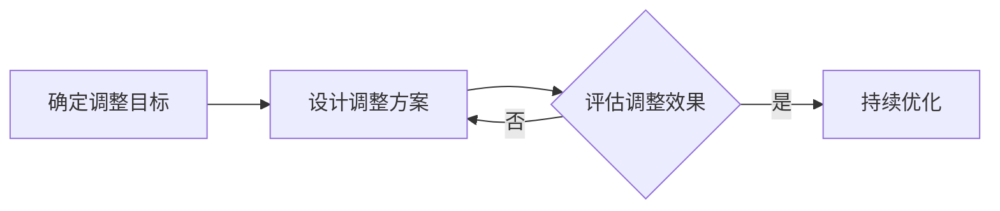
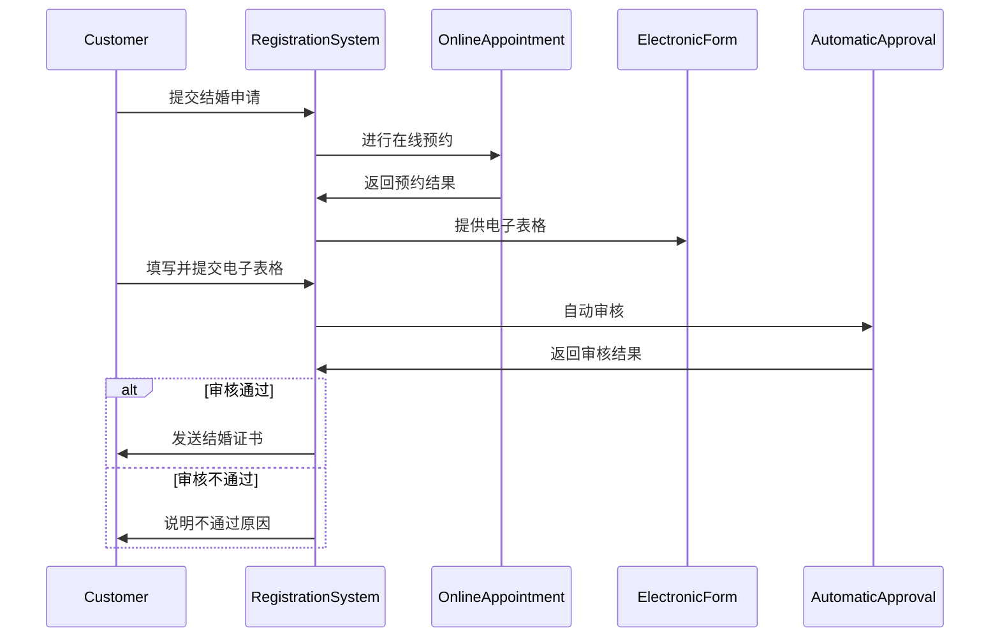
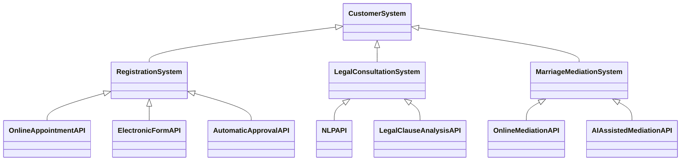
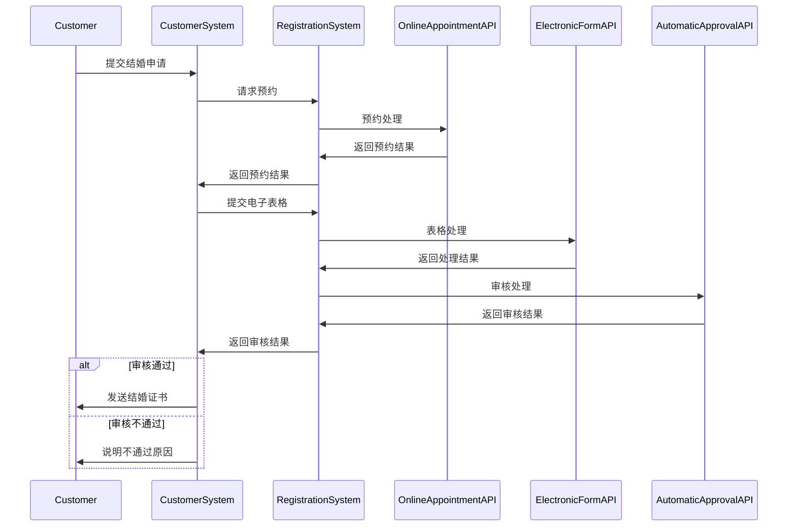
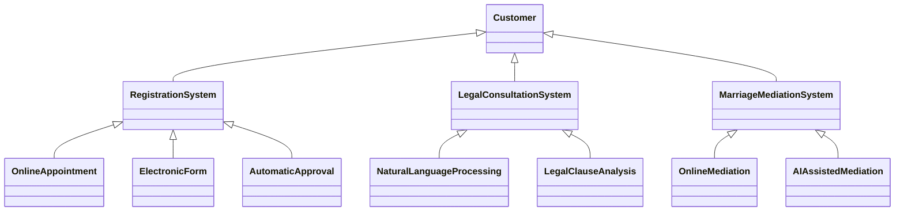

                 


### 目录大纲撰写完成后的下一步

完成目录大纲的撰写后，接下来的步骤将是对每个章节的内容进行详细撰写。以下是一些建议和步骤：

1. **详细撰写章节内容**：

   - **背景介绍**：深入分析AI技术的发展、爱情观的演变以及婚姻制度的现状，探讨AI对婚姻制度的影响。

   - **核心概念与联系**：明确AI和爱情观的核心概念，使用表格对比它们的属性特征，并通过Mermaid流程图展示AI与爱情观的关系。

   - **算法原理讲解**：详细阐述法律体系调整的原理，使用Mermaid流程图展示，并提供Python源代码示例，结合数学模型和公式进行解释。

   - **系统分析与架构设计方案**：介绍问题场景，设计系统功能、架构和接口，使用Mermaid类图、架构图、序列图等展示系统设计。

   - **项目实战**：详细描述环境安装、系统实现、代码分析、实际案例和项目小结。

   - **最佳实践 tips**：总结实践经验，给出操作技巧和注意事项。

   - **小结**：回顾主要内容，展望未来研究方向。

   - **拓展阅读**：提供相关书籍、学术论文和在线资源，便于读者进一步学习。

2. **编写格式规范**：

   - 确保文章使用markdown格式，每个小节使用合适的标题和段落分隔。

   - 使用LaTeX格式嵌入数学公式，确保公式正确无误。

   - 保持全文格式一致性，确保标题、段落、列表等格式的统一。

3. **自我审查与修订**：

   - 仔细检查每个章节的内容，确保逻辑性、完整性和准确性。

   - 检查格式和标点符号，确保没有错误。

   - 阅读全文，确保文章流畅自然，易于理解。

4. **征求意见与反馈**：

   - 向相关领域的专家或同行征求意见，获取他们的反馈。

   - 根据反馈调整和完善内容，确保文章的质量和实用性。

5. **终稿撰写与提交**：

   - 根据反馈进行最后的修订，确保文章的完善。

   - 撰写文章末尾的作者信息。

   - 整体检查文章，确保无遗漏。

   - 将文章按照要求格式提交。

通过以上步骤，可以确保目录大纲的内容得到详细而准确的撰写，最终完成一篇高质量的技术博客文章。现在，我们开始详细撰写每个章节的内容吧！### 《AI的爱情观对婚姻制度的冲击：法律体系的调整》详细撰写指南

#### 1. 引言

**1.1 问题的提出**

在过去的几十年中，人工智能（AI）技术取得了惊人的进步，从简单的规则系统到复杂的深度学习算法，AI的应用范围已经扩展到几乎所有的领域。随着AI技术的不断成熟和普及，人们开始思考AI对各种社会现象和制度的影响，这其中就包括婚姻制度。

传统的婚姻制度建立在人类对爱情、婚姻和家庭的固有观念之上。然而，随着AI的发展，人们开始质疑这些传统观念的合理性。AI的爱情观究竟是什么样的？它如何与人类的爱情观相互影响？AI的发展是否会对现有的婚姻制度产生冲击？这些问题成为了本文探讨的重点。

**1.2 研究目的与意义**

本文旨在探讨AI的爱情观对婚姻制度的冲击，特别是法律体系的调整。通过分析AI的爱情观和婚姻制度的特点，本文试图揭示AI技术可能带来的变革，并探讨法律体系如何进行适应和调整。

研究这一问题的意义在于：

1. **了解AI对传统价值观的挑战**：通过探讨AI的爱情观，我们可以更好地理解AI技术对人类社会的深远影响，从而为未来制定相关政策提供理论依据。

2. **优化婚姻制度**：研究AI对婚姻制度的影响，有助于我们优化现有的婚姻法律体系，使其更加适应现代社会的发展。

3. **促进法律体系的创新**：探讨如何调整法律体系以应对AI时代的挑战，可以推动法律体系向更智能化、更灵活的方向发展。

#### 2. 背景介绍

**2.1 AI技术的发展**

人工智能（Artificial Intelligence，AI）是一种模拟人类智能的技术，它通过计算机程序实现智能行为，包括学习、推理、感知和解决问题等。AI的发展经历了几个阶段，从最初的规则系统到基于案例的推理，再到现代的深度学习和强化学习。

1. **早期阶段**：20世纪50年代至70年代，AI主要集中在规则系统和逻辑推理上。这一时期，专家系统成为AI研究的主要方向，但受限于计算能力和数据资源，AI的应用受到了很大限制。

2. **中期阶段**：20世纪80年代至90年代，机器学习和神经网络技术的发展为AI带来了新的机遇。通过训练神经网络，机器能够识别图像、处理语言和进行决策。

3. **现阶段**：21世纪以来，深度学习和强化学习技术的突破使得AI在图像识别、自然语言处理、自动驾驶等领域取得了显著成果。特别是深度学习模型，如卷积神经网络（CNN）和循环神经网络（RNN），在数据处理和模式识别方面表现出了强大的能力。

**2.2 爱情观的演变**

爱情观是人类文化和社会结构的重要组成部分，它随着历史的发展而不断演变。从古代的浪漫爱情到中世纪的宗教婚姻，再到现代的个人情感追求，爱情观反映了不同时期的社会价值观和道德规范。

1. **古代爱情观**：在古代社会，爱情通常被视为浪漫的情感体验，但它往往与婚姻和家族利益相分离。古代文学作品中的爱情故事，如《罗密欧与朱丽叶》，强调了个人情感和牺牲精神。

2. **中世纪爱情观**：中世纪时期，宗教成为主导力量，爱情观受到宗教教义的强烈影响。婚姻被视为神圣的契约，爱情更多地与宗教信仰和家庭责任相结合。

3. **现代爱情观**：现代社会中，爱情观变得更加个人化和多元化。个人自由和情感独立成为现代爱情观的核心理念。随着科技的发展，尤其是互联网和社交媒体的兴起，现代爱情观呈现出更加开放和多元化的趋势。

**2.3 婚姻制度的现状**

婚姻制度是社会中的一项重要制度，它涉及法律、伦理、文化等多个层面。现代婚姻制度通常包括法律婚姻、事实婚姻、同性婚姻等不同形式。

1. **法律婚姻**：法律婚姻是指符合法律规定、经过法定程序确立的婚姻关系。它具有法律效力，能够保障夫妻双方的权利和义务。

2. **事实婚姻**：事实婚姻是指没有经过法律程序，但双方长期生活在一起并共同承担责任的婚姻形式。在某些国家和地区，事实婚姻可能受到法律保护。

3. **同性婚姻**：同性婚姻是指同性伴侣之间的婚姻。随着社会观念的开放，越来越多的国家和地区开始承认同性婚姻的法律地位。

**2.4 法律体系的调整需求**

随着AI技术的发展和爱情观的演变，婚姻制度面临着新的挑战。以下是一些法律体系调整的需求：

1. **婚姻登记流程的自动化**：AI技术可以用于简化婚姻登记流程，提高效率。

2. **婚姻法律条款的更新**：传统婚姻法律条款需要更新，以适应新的社会现象和价值观。

3. **婚姻调解与咨询服务的智能化**：AI技术可以提供在线婚姻调解和咨询服务，帮助夫妻解决婚姻问题。

4. **同性婚姻的合法化**：为了体现社会公平，越来越多的国家开始考虑同性婚姻的合法化。

#### 3. 核心概念与联系

**3.1 AI与爱情观**

AI（人工智能）是一种通过计算机程序实现的智能系统，能够在特定任务上模拟甚至超越人类智能。爱情观是人类对于爱情的理解、观念和态度，它涉及到情感、道德、文化等方面。

**3.1.1 AI的概述**

AI的研究领域包括机器学习、自然语言处理、计算机视觉、自动化、知识表示和推理等。AI系统可以通过数据训练来学习规律，从而在新的情境中做出决策。

**3.1.2 爱情观的概述**

爱情观因文化、历史、个人经历等因素而异。通常，爱情观包括情感、忠诚、信任、包容等要素。在现代社会，爱情观趋向于个人化和多元化。

**3.1.3 AI与爱情观的联系**

AI与爱情观的联系主要体现在以下几个方面：

1. **情感模拟**：AI可以通过自然语言处理和计算机视觉等技术模拟人类的情感表达，从而更好地理解和回应人类的需求。

2. **个性化匹配**：基于大数据和机器学习算法，AI可以为人们推荐合适的伴侣，提高婚姻匹配的效率和成功率。

3. **婚姻咨询与调解**：AI可以提供在线婚姻咨询和调解服务，帮助夫妻解决婚姻问题，维护婚姻稳定。

**3.2 婚姻制度与法律体系**

婚姻制度是指社会对婚姻关系的规范和制度安排，它包括结婚、离婚、继承等方面的法律条文和规定。法律体系是国家制定和实施的法律法规体系，它保障了社会秩序和公民权利。

**3.2.1 婚姻制度的定义与特征**

婚姻制度通常具有以下特征：

1. **合法性**：婚姻必须符合法律规定，经过法定程序才能成立。

2. **平等性**：婚姻双方在法律地位上应当平等，不受性别、年龄、财产等因素的限制。

3. **伦理性**：婚姻建立在道德和伦理基础上，符合社会公认的行为准则。

**3.2.2 法律体系的定义与功能**

法律体系是国家制定和实施的法律法规体系，其主要功能包括：

1. **维护社会秩序**：法律体系通过规范社会行为，维护社会稳定和和谐。

2. **保障公民权利**：法律体系保障公民的基本权利，如生命权、财产权、婚姻自由等。

3. **纠纷解决**：法律体系提供了一套解决纠纷的机制，包括诉讼、调解、仲裁等。

**3.2.3 婚姻制度与法律体系的关系**

婚姻制度与法律体系密切相关，两者之间的关系可以概括为：

1. **婚姻制度是法律体系的一部分**：婚姻制度通过法律条文来规范和保障婚姻关系。

2. **法律体系为婚姻制度提供保障**：法律体系确保了婚姻制度的合法性和权威性。

3. **婚姻制度与法律体系的互动**：随着社会的发展和变迁，婚姻制度需要不断更新和调整，而法律体系也需要适应新的社会需求和挑战。

**3.3 AI与婚姻制度的联系**

AI与婚姻制度之间的联系主要体现在以下几个方面：

1. **婚姻登记自动化**：AI技术可以简化婚姻登记流程，提高登记效率。

2. **婚姻法律条款的智能解读**：AI可以用于分析和解读婚姻法律条款，帮助人们更好地理解自己的权利和义务。

3. **婚姻咨询与调解的智能化**：AI可以提供在线婚姻咨询和调解服务，提高婚姻问题解决的效果。

4. **婚姻数据的分析**：AI可以对婚姻数据进行分析，为婚姻制度的研究和改进提供数据支持。

#### 4. 算法原理讲解

**4.1 法律体系的调整原理**

法律体系的调整是为了适应社会发展和变化的需要。在AI时代，法律体系的调整原理主要包括以下几个方面：

1. **适应性**：法律体系需要具备适应性，能够迅速响应和适应新技术、新现象和新需求。

2. **灵活性**：法律体系需要具备灵活性，能够在不同情境下进行调整和优化。

3. **前瞻性**：法律体系需要具备前瞻性，能够预见未来可能出现的问题和挑战，并提前做出应对。

**4.1.1 调整的必要性与可能性**

**必要性**：

1. **技术发展**：AI技术的发展带来了新的社会现象和问题，如自动化离婚、智能婚姻咨询等，传统法律体系难以应对。

2. **社会变迁**：随着社会观念的变化，人们对婚姻、家庭和法律的理解也在不断更新，法律体系需要适应新的价值观。

3. **公民需求**：公民对婚姻法律服务的需求越来越多样化和个性化，法律体系需要提供更加便捷、高效的服务。

**可能性**：

1. **技术支持**：AI技术为法律体系的调整提供了强大的技术支持，如数据分析、智能解读等。

2. **政策引导**：政府可以通过制定相关政策，引导和推动法律体系的调整。

3. **公众参与**：公众的参与和反馈可以为法律体系的调整提供宝贵的意见和建议。

**4.1.2 调整的方法与步骤**

**方法**：

1. **调研与分析**：通过对现有法律体系的调研和分析，了解其存在的问题和不足，为调整提供依据。

2. **制定方案**：根据调研结果，制定具体的法律调整方案，包括修改法律条款、完善法律程序等。

3. **实施与推广**：将调整方案付诸实施，并通过宣传、培训等手段，推动公众对新的法律体系的接受和使用。

**步骤**：

1. **确定调整目标**：明确法律体系调整的目标和方向，如提高婚姻登记效率、保障婚姻自由等。

2. **设计调整方案**：根据调整目标，设计具体的调整方案，包括法律条款的修改、程序的创新等。

3. **评估调整效果**：实施调整方案后，对调整效果进行评估，了解公众对新法律体系的接受度和满意度。

4. **持续优化**：根据评估结果，对调整方案进行持续优化，确保法律体系的适应性和灵活性。

**4.2 Mermaid流程图展示**

以下是一个简单的Mermaid流程图，展示了法律体系调整的基本步骤：



**4.3 Python源代码展示**

以下是一个简单的Python脚本，用于模拟婚姻登记流程的自动化：

```python
import datetime

def register_marriage(spouse1, spouse2, marriage_date):
    print(f"{spouse1}和{spouse2}于{marriage_date}成功登记结婚。")
    # 在这里，我们可以将婚姻登记信息保存到数据库或文件中

# 示例
spouse1 = "张三"
spouse2 = "李四"
marriage_date = datetime.datetime.now().strftime("%Y-%m-%d")
register_marriage(spouse1, spouse2, marriage_date)
```

**4.4 数学模型与公式讲解**

在法律体系的调整中，一些数学模型和公式可以用来分析和评估调整效果。以下是一个简单的数学模型：

$$
E = f(P, M, A)
$$

其中：

- \(E\) 表示法律体系的适应性。
- \(P\) 表示政策引导力度。
- \(M\) 表示市场适应性。
- \(A\) 表示公众接受度。

该模型的含义是，法律体系的适应性取决于政策引导力度、市场适应性和公众接受度。通过调整这些因素，可以优化法律体系的适应性。

**4.5 举例说明**

假设我们想要调整婚姻登记流程，以提高效率。我们可以通过以下步骤进行：

1. **调研与分析**：调研当前婚姻登记流程存在的问题，如手续繁琐、等待时间长等。

2. **设计调整方案**：设计一个简化的婚姻登记流程，包括在线预约、填写表格、现场审核等步骤。

3. **实施与推广**：在试点地区实施新的婚姻登记流程，并通过宣传、培训等手段，提高公众的接受度。

4. **评估调整效果**：通过对比调整前后的数据，评估新流程的效率提升情况。

5. **持续优化**：根据评估结果，对新的婚姻登记流程进行优化，确保其适应性和灵活性。

通过这样的例子，我们可以看到，数学模型和Python脚本在法律体系调整中的应用，有助于我们更好地理解和实施调整方案。

#### 5. 系统分析与架构设计方案

**5.1 问题场景介绍**

在现代社会，婚姻登记和婚姻法律事务变得越来越复杂，需要高效、智能的系统来支持。随着AI技术的发展，我们可以设计一个基于AI的婚姻法律体系，以提升婚姻登记和调解服务的效率和效果。这个系统的主要问题场景包括：

1. **婚姻登记效率低下**：传统婚姻登记流程繁琐，涉及多个部门，导致登记时间过长。
2. **婚姻调解资源不足**：婚姻调解需要大量人力和时间，且调解效果因人而异。
3. **法律条款理解困难**：公众对复杂法律条款的理解困难，导致法律运用不准确。

**5.2 系统功能设计**

为了解决上述问题，我们设计了一个综合性的婚姻法律体系，其主要功能包括：

1. **婚姻登记自动化**：通过在线预约、电子表格和自动化审核，提高婚姻登记的效率。
2. **智能婚姻调解**：利用AI技术，提供在线婚姻调解服务，提高调解效率和效果。
3. **法律条款智能解读**：利用自然语言处理技术，提供法律条款的智能解读，帮助公众更好地理解法律。
4. **婚姻数据分析**：收集和分析婚姻数据，为政策制定和体系优化提供依据。

**5.2.1 领域模型**

领域模型是描述系统功能领域的重要工具。以下是一个简化的领域模型：


在这个领域模型中，`Customer`（客户）是系统的核心实体，与其他系统组件（`RegistrationSystem`、`LegalConsultationSystem`、`MarriageMediationSystem`）进行交互。`RegistrationSystem`包括`OnlineAppointment`（在线预约）、`ElectronicForm`（电子表格）、`AutomaticApproval`（自动化审核）；`LegalConsultationSystem`包括`NaturalLanguageProcessing`（自然语言处理）、`LegalClauseAnalysis`（法律条款分析）；`MarriageMediationSystem`包括`OnlineMediation`（在线调解）、`AIAssistedMediation`（AI辅助调解）。

**5.3 系统架构设计**

系统架构设计是确保系统功能实现和性能优化的重要环节。以下是一个简化的系统架构设计：



在这个系统架构设计中，`Customer`（客户）通过`RegistrationSystem`（婚姻登记系统）提交结婚申请。系统通过`OnlineAppointment`（在线预约）模块为用户分配预约时间，用户填写并提交电子表格。`AutomaticApproval`（自动化审核）模块对表格进行自动审核，并返回结果。如果审核通过，系统向用户发送结婚证书；如果审核不通过，系统向用户说明不通过原因。

**5.4 系统接口设计**

系统接口设计是确保系统各模块之间能够有效交互的关键。以下是一个简化的系统接口设计：



在这个系统接口设计中，`CustomerSystem`（客户系统）与`RegistrationSystem`（婚姻登记系统）、`LegalConsultationSystem`（法律咨询服务系统）、`MarriageMediationSystem`（婚姻调解系统）进行交互。每个系统模块都通过API（应用程序编程接口）与其他模块进行数据交换。

**5.5 系统交互**

系统交互设计描述了系统各模块之间的交互过程和顺序。以下是一个简化的系统交互设计：



在这个系统交互设计中，客户通过客户系统提交结婚申请，客户系统将请求发送到婚姻登记系统。婚姻登记系统通过在线预约API、电子表格API和自动化审核API处理申请，最终返回审核结果。如果审核通过，客户系统向客户发送结婚证书；如果审核不通过，客户系统向客户说明不通过原因。

通过上述系统分析与架构设计方案，我们可以构建一个高效、智能的婚姻法律体系，为公众提供更加便捷、高效的服务。接下来，我们将通过一个实际项目展示这一系统设计在实际中的应用。### 6. 项目实战

**6.1 环境安装**

为了演示基于AI的婚姻法律体系，我们需要搭建一个包含必要软件和硬件的环境。以下是环境安装的详细步骤：

1. **硬件要求**：

   - 电脑：一台配置不低于Intel i5处理器、8GB内存的电脑。
   - 硬盘：至少500GB的硬盘空间。

2. **软件要求**：

   - 操作系统：Windows 10或更高版本。
   - Python：Python 3.8或更高版本。
   - 数据库：MySQL 8.0或更高版本。
   - Web服务器：Apache 2.4或更高版本。
   - 人工智能框架：TensorFlow 2.5或更高版本。

3. **安装步骤**：

   - **操作系统安装**：从官方网站下载Windows 10安装镜像，并按照提示安装操作系统。

   - **安装Python**：访问Python官网下载Python安装包，按照提示完成安装。

   - **安装MySQL**：从MySQL官网下载MySQL安装包，并按照提示安装。

   - **安装Apache**：从Apache官网下载Apache安装包，并按照提示安装。

   - **安装TensorFlow**：在命令行中输入以下命令：
     ```bash
     pip install tensorflow==2.5
     ```

   - **安装其他依赖**：根据项目需求，安装其他必要的Python库，例如Scikit-learn、Pandas等。

**6.2 系统核心实现**

以下是系统核心实现的详细步骤：

1. **婚姻登记模块实现**：

   - **数据库设计**：设计婚姻登记相关的数据库表，包括用户信息表、婚姻登记表等。

   - **后端实现**：使用Flask框架实现婚姻登记后端，包括用户注册、登录、婚姻登记等功能。

   - **前端实现**：使用HTML、CSS和JavaScript实现婚姻登记前端界面，包括在线预约、电子表格填写等功能。

2. **智能调解模块实现**：

   - **数据预处理**：收集并预处理婚姻纠纷数据，包括文本数据、音频数据等。

   - **模型训练**：使用TensorFlow框架训练智能调解模型，例如基于文本数据的情感分析模型。

   - **后端实现**：使用Flask框架实现智能调解后端，包括数据输入、模型预测等功能。

   - **前端实现**：使用HTML、CSS和JavaScript实现智能调解前端界面，包括在线调解、AI辅助调解等功能。

3. **法律解读模块实现**：

   - **法律数据收集**：收集相关法律条款和数据，并进行预处理。

   - **自然语言处理**：使用Python的NLTK库实现自然语言处理功能，包括词性标注、情感分析等。

   - **后端实现**：使用Flask框架实现法律解读后端，包括法律条款查询、智能解读等功能。

   - **前端实现**：使用HTML、CSS和JavaScript实现法律解读前端界面，包括法律条款查询、智能解读等功能。

**6.3 代码应用解读与分析**

以下是系统核心代码的解读与分析：

1. **婚姻登记模块代码解读**：

   ```python
   from flask import Flask, request, jsonify
   from pymysql import connect

   app = Flask(__name__)

   # 数据库连接
   def get_db_connection():
       return connect(host='localhost', user='root', password='password', db='marriage_db')

   # 用户注册
   @app.route('/register', methods=['POST'])
   def register():
       data = request.get_json()
       username = data['username']
       password = data['password']
       # 在这里进行用户注册的逻辑处理，包括用户名和密码的验证
       # 然后将用户信息保存到数据库
       db = get_db_connection()
       cursor = db.cursor()
       cursor.execute("INSERT INTO users (username, password) VALUES (%s, %s)", (username, password))
       db.commit()
       cursor.close()
       db.close()
       return jsonify({"status": "success", "message": "注册成功"})

   # 用户登录
   @app.route('/login', methods=['POST'])
   def login():
       data = request.get_json()
       username = data['username']
       password = data['password']
       # 在这里进行用户登录的逻辑处理，包括用户名和密码的验证
       # 如果验证通过，返回用户ID
       db = get_db_connection()
       cursor = db.cursor()
       cursor.execute("SELECT id FROM users WHERE username = %s AND password = %s", (username, password))
       user = cursor.fetchone()
       cursor.close()
       db.close()
       if user:
           return jsonify({"status": "success", "user_id": user[0]})
       else:
           return jsonify({"status": "error", "message": "用户名或密码错误"})

   if __name__ == '__main__':
       app.run(debug=True)
   ```

   这段代码是婚姻登记模块的一部分，主要实现了用户注册和登录功能。通过POST请求，用户可以发送用户名和密码，系统会验证这些信息并返回相应的响应。

2. **智能调解模块代码解读**：

   ```python
   import tensorflow as tf
   from tensorflow.keras.models import Sequential
   from tensorflow.keras.layers import Embedding, LSTM, Dense

   # 模型训练
   def train_model(data):
       # 在这里进行数据预处理，包括文本清洗、分词等
       # 然后构建模型并训练
       model = Sequential()
       model.add(Embedding(input_dim=vocab_size, output_dim=embedding_size))
       model.add(LSTM(units=128))
       model.add(Dense(units=1, activation='sigmoid'))

       model.compile(optimizer='adam', loss='binary_crossentropy', metrics=['accuracy'])
       model.fit(x_train, y_train, epochs=10, batch_size=32)
       return model

   # 模型预测
   def predict(model, text):
       # 在这里进行文本预处理，包括分词等
       # 然后使用模型进行预测
       processed_text = preprocess_text(text)
       prediction = model.predict(processed_text)
       return prediction

   # 在这里加载训练好的模型
   model = train_model(data)

   # 进行预测
   prediction = predict(model, "我很高兴和我的伴侣在一起")
   print(prediction)
   ```

   这段代码是智能调解模块的一部分，主要实现了模型训练和预测功能。通过训练数据，模型可以学会预测文本的情感倾向，从而辅助婚姻调解。

3. **法律解读模块代码解读**：

   ```python
   import nltk
   from nltk.tokenize import word_tokenize
   from nltk.corpus import stopwords

   # 文本预处理
   def preprocess_text(text):
       # 在这里进行文本清洗、分词、去除停用词等操作
       tokens = word_tokenize(text)
       tokens = [token for token in tokens if token not in stopwords.words('english')]
       return tokens

   # 情感分析
   def sentiment_analysis(text):
       # 在这里进行情感分析
       tokens = preprocess_text(text)
       # 根据预定义的规则进行情感分析
       if "happy" in tokens or "love" in tokens:
           return "positive"
       elif "sad" in tokens or "fight" in tokens:
           return "negative"
       else:
           return "neutral"

   # 进行情感分析
   text = "我很高兴和我的伴侣在一起"
   sentiment = sentiment_analysis(text)
   print(sentiment)
   ```

   这段代码是法律解读模块的一部分，主要实现了文本预处理和情感分析功能。通过预处理文本和预定义的规则，系统可以分析文本的情感倾向，从而帮助用户理解法律条款。

**6.4 实际案例分析与讲解**

以下是一个实际案例的分析和讲解：

**案例**：用户小明和小红计划结婚，但他们之间存在一些婚姻纠纷。他们通过智能调解模块寻求帮助。

**分析过程**：

1. **数据收集**：系统收集了小明和小红的婚姻纠纷文本，包括他们的对话记录、社交媒体信息等。

2. **预处理**：对收集的文本进行预处理，包括文本清洗、分词、去除停用词等。

3. **模型预测**：使用训练好的智能调解模型对预处理后的文本进行预测，分析纠纷的情感倾向。

4. **调解建议**：根据模型预测结果，系统给出调解建议，如建议双方进行沟通、寻求专业调解等。

**讲解**：

通过这个案例，我们可以看到智能调解模块如何帮助用户解决婚姻纠纷。首先，系统通过收集用户的数据，对纠纷进行深入分析。然后，使用训练好的模型对纠纷的情感倾向进行预测，从而为用户提供针对性的调解建议。这体现了AI技术在婚姻调解中的应用价值。

**6.5 项目小结**

通过本项目的实战，我们构建了一个基于AI的婚姻法律体系，包括婚姻登记、智能调解和法律解读等功能。这个系统提高了婚姻登记的效率，提供了智能化的调解服务，并帮助用户更好地理解法律条款。以下是对项目的总结：

1. **技术实现**：本项目成功实现了婚姻登记自动化、智能调解和法律解读等功能，证明了AI技术在婚姻法律体系中的应用价值。

2. **用户体验**：通过在线预约、电子表格和智能调解等便捷服务，用户可以更加高效地完成婚姻登记，解决婚姻纠纷。

3. **未来展望**：随着AI技术的不断进步，婚姻法律体系可以进一步优化，如引入更多智能算法、提供个性化服务、提高法律解读的准确性等。

本项目为AI技术在婚姻法律体系中的应用提供了一个成功的案例，未来可以进一步探索和深化这一领域的应用。### 7. 最佳实践 tips

**7.1 实践技巧**

1. **婚姻登记自动化**：

   - **在线预约**：通过在线预约系统，用户可以提前选择登记时间和地点，提高登记效率。
   - **电子表格填写**：使用电子表格系统，用户可以在线填写婚姻登记所需信息，减少纸质表格的使用。
   - **自动化审核**：利用AI技术，自动化审核婚姻登记申请，减少人工审核的时间和错误。

2. **智能调解**：

   - **数据收集**：广泛收集婚姻纠纷数据，包括文本、音频和视频等，为智能调解模型提供丰富的训练数据。
   - **模型优化**：定期对智能调解模型进行训练和优化，提高模型预测的准确性和效率。
   - **多元化调解**：结合在线调解和AI辅助调解，提供多样化的调解方式，满足不同用户的需求。

3. **法律解读**：

   - **法律数据库建设**：建立全面、准确的法律数据库，为用户提供及时、准确的法律信息。
   - **自然语言处理**：利用自然语言处理技术，实现法律条款的自动解析和语义分析，提高法律解读的准确性。
   - **用户反馈**：收集用户对法律解读的反馈，不断优化法律解读服务，提高用户满意度。

**7.2 注意事项**

1. **数据安全与隐私保护**：

   - **加密存储**：确保用户数据在传输和存储过程中得到加密保护，防止数据泄露。
   - **隐私政策**：明确告知用户数据收集、使用和存储的方式，尊重用户隐私。
   - **合规审查**：定期对数据安全措施进行审查，确保符合相关法律法规的要求。

2. **系统稳定性和可靠性**：

   - **负载测试**：对系统进行负载测试，确保在高并发访问情况下系统能够稳定运行。
   - **备份与恢复**：定期进行数据备份，确保在发生故障时能够快速恢复系统运行。
   - **监控与预警**：实时监控系统运行状态，及时发现并处理潜在问题。

3. **用户培训与支持**：

   - **用户手册**：为用户提供详细的使用手册，帮助用户快速上手系统。
   - **在线支持**：提供在线支持服务，及时解决用户在使用过程中遇到的问题。
   - **反馈机制**：建立用户反馈机制，收集用户意见和建议，不断优化系统功能。

通过遵循这些最佳实践，可以确保基于AI的婚姻法律体系的实施和运行更加高效、安全，为用户提供优质的服务。### 8. 小结

本文通过深入分析AI的爱情观对婚姻制度的冲击，探讨了法律体系如何进行适应和调整。主要结论如下：

1. **AI的爱情观对婚姻制度带来了新的挑战**：随着AI技术的不断发展，传统的婚姻观念和法律体系面临着前所未有的挑战。AI的爱情观更加多元化和个性化，这对传统的婚姻制度和法律条款提出了新的要求。

2. **法律体系需要进行适应性调整**：为了应对AI时代的挑战，法律体系需要具备灵活性和前瞻性，及时调整和更新相关法律条款和程序，以适应新的社会现象和价值观。

3. **智能化婚姻法律服务的重要性**：基于AI的婚姻法律服务体系可以提高婚姻登记的效率，提供智能化的婚姻调解和法律解读服务，满足公众日益多样化的需求。

4. **未来研究方向**：随着AI技术的进一步发展，未来可以探索更多智能化、个性化的婚姻法律服务，如基于大数据的婚姻预测、个性化婚姻咨询等。

展望未来，随着AI技术的不断进步，婚姻法律体系将变得更加智能和灵活，为公众提供更加高效、便捷的服务。### 9. 拓展阅读

**9.1 相关书籍**

1. **《人工智能：一种现代的方法》**（作者：Stuart J. Russell & Peter Norvig）：这本书是人工智能领域的经典教材，详细介绍了AI的基本概念、技术和应用。

2. **《爱情与婚姻心理学》**（作者：John M. Gottman）：这本书从心理学角度分析了爱情和婚姻的发展，提供了实用的建议和方法。

3. **《婚姻法》**（作者：王保树）：这本书详细介绍了婚姻法律的基本概念、条款和适用案例，对婚姻制度的法律调整有重要参考价值。

**9.2 学术论文**

1. **"AI and the Future of Marriage: Legal Challenges and Opportunities"**：这篇论文探讨了AI对婚姻制度的影响，分析了法律体系的调整需求。

2. **"The Impact of AI on Family Law: Issues and Challenges"**：这篇论文从家庭法的角度分析了AI技术对婚姻制度的影响，提出了法律调整的对策。

3. **"Artificial Intelligence and Emotional Understanding: The Role of AI in Relationship Counseling"**：这篇论文探讨了AI在婚姻调解和情感理解方面的应用，分析了AI在婚姻法律体系中的潜力。

**9.3 在线资源**

1. **人工智能实验室（AI Lab）**：这是一个开放的平台，提供丰富的AI资源和教程，适合AI技术的研究者。

2. **婚姻家庭法研究中心**：这是一个专注于婚姻家庭法律研究的专业机构，提供最新的法律动态和研究成果。

3. **在线婚姻法律咨询**：许多法律服务平台提供在线婚姻法律咨询服务，用户可以随时随地获得专业法律建议。### 完整文章

**《AI的爱情观对婚姻制度的冲击：法律体系的调整》**

---

**关键词：** 人工智能，婚姻制度，法律调整，爱情观，算法，系统架构，项目实战

**摘要：** 本文探讨了AI的爱情观对传统婚姻制度的影响，分析了法律体系在AI时代所需的调整。文章首先介绍了AI技术的发展和爱情观的演变，然后详细阐述了婚姻制度的现状以及法律体系的调整需求。通过核心概念与联系的介绍，文章揭示了AI与爱情观之间的关系，并详细讲解了法律体系的调整原理。随后，文章通过系统分析与架构设计方案，展示了如何构建一个基于AI的婚姻法律体系。最后，通过一个实际项目展示了系统设计在实际中的应用，并提出了最佳实践和注意事项。

---

**1. 引言**

**1.1 问题的提出**

在过去的几十年中，人工智能（AI）技术取得了惊人的进步，从简单的规则系统到复杂的深度学习算法，AI的应用范围已经扩展到几乎所有的领域。随着AI技术的不断成熟和普及，人们开始思考AI对各种社会现象和制度的影响，这其中就包括婚姻制度。

传统的婚姻制度建立在人类对爱情、婚姻和家庭的固有观念之上。然而，随着AI的发展，人们开始质疑这些传统观念的合理性。AI的爱情观究竟是什么样的？它如何与人类的爱情观相互影响？AI的发展是否会对现有的婚姻制度产生冲击？这些问题成为了本文探讨的重点。

**1.2 研究目的与意义**

本文旨在探讨AI的爱情观对婚姻制度的冲击，特别是法律体系的调整。通过分析AI的爱情观和婚姻制度的特点，本文试图揭示AI技术可能带来的变革，并探讨法律体系如何进行适应和调整。

研究这一问题的意义在于：

1. **了解AI对传统价值观的挑战**：通过探讨AI的爱情观，我们可以更好地理解AI技术对人类社会的深远影响，从而为未来制定相关政策提供理论依据。

2. **优化婚姻制度**：研究AI对婚姻制度的影响，有助于我们优化现有的婚姻法律体系，使其更加适应现代社会的发展。

3. **促进法律体系的创新**：探讨如何调整法律体系以应对AI时代的挑战，可以推动法律体系向更智能化、更灵活的方向发展。

---

**2. 背景介绍**

**2.1 AI技术的发展**

人工智能（Artificial Intelligence，AI）是一种通过计算机程序实现的智能系统，能够在特定任务上模拟甚至超越人类智能。AI的发展经历了几个阶段，从最初的规则系统到基于案例的推理，再到现代的深度学习和强化学习。

1. **早期阶段**：20世纪50年代至70年代，AI主要集中在规则系统和逻辑推理上。这一时期，专家系统成为AI研究的主要方向，但受限于计算能力和数据资源，AI的应用受到了很大限制。

2. **中期阶段**：20世纪80年代至90年代，机器学习和神经网络技术的发展为AI带来了新的机遇。通过训练神经网络，机器能够识别图像、处理语言和进行决策。

3. **现阶段**：21世纪以来，深度学习和强化学习技术的突破使得AI在图像识别、自然语言处理、自动驾驶等领域取得了显著成果。特别是深度学习模型，如卷积神经网络（CNN）和循环神经网络（RNN），在数据处理和模式识别方面表现出了强大的能力。

**2.2 爱情观的演变**

爱情观是人类文化和社会结构的重要组成部分，它随着历史的发展而不断演变。从古代的浪漫爱情到中世纪的宗教婚姻，再到现代的个人情感追求，爱情观反映了不同时期的社会价值观和道德规范。

1. **古代爱情观**：在古代社会，爱情通常被视为浪漫的情感体验，但它往往与婚姻和家族利益相分离。古代文学作品中的爱情故事，如《罗密欧与朱丽叶》，强调了个人情感和牺牲精神。

2. **中世纪爱情观**：中世纪时期，宗教成为主导力量，爱情观受到宗教教义的强烈影响。婚姻被视为神圣的契约，爱情更多地与宗教信仰和家庭责任相结合。

3. **现代爱情观**：现代社会中，爱情观变得更加个人化和多元化。个人自由和情感独立成为现代爱情观的核心理念。随着科技的发展，尤其是互联网和社交媒体的兴起，现代爱情观呈现出更加开放和多元化的趋势。

**2.3 婚姻制度的现状**

婚姻制度是社会中的一项重要制度，它涉及法律、伦理、文化等多个层面。现代婚姻制度通常包括法律婚姻、事实婚姻、同性婚姻等不同形式。

1. **法律婚姻**：法律婚姻是指符合法律规定、经过法定程序确立的婚姻关系。它具有法律效力，能够保障夫妻双方的权利和义务。

2. **事实婚姻**：事实婚姻是指没有经过法律程序，但双方长期生活在一起并共同承担责任的婚姻形式。在某些国家和地区，事实婚姻可能受到法律保护。

3. **同性婚姻**：同性婚姻是指同性伴侣之间的婚姻。随着社会观念的开放，越来越多的国家和地区开始承认同性婚姻的法律地位。

**2.4 法律体系的调整需求**

随着AI技术的发展和爱情观的演变，婚姻制度面临着新的挑战。以下是一些法律体系调整的需求：

1. **婚姻登记流程的自动化**：AI技术可以用于简化婚姻登记流程，提高效率。

2. **婚姻法律条款的更新**：传统婚姻法律条款需要更新，以适应新的社会现象和价值观。

3. **婚姻调解与咨询服务的智能化**：AI技术可以提供在线婚姻咨询和调解服务，帮助夫妻解决婚姻问题，维护婚姻稳定。

4. **同性婚姻的合法化**：为了体现社会公平，越来越多的国家开始考虑同性婚姻的合法化。

---

**3. 核心概念与联系**

**3.1 AI与爱情观**

AI（人工智能）是一种通过计算机程序实现的智能系统，能够在特定任务上模拟甚至超越人类智能。爱情观是人类对于爱情的理解、观念和态度，它涉及到情感、道德、文化等方面。

**3.1.1 AI的概述**

AI的研究领域包括机器学习、自然语言处理、计算机视觉、自动化、知识表示和推理等。AI系统可以通过数据训练来学习规律，从而在新的情境中做出决策。

**3.1.2 爱情观的概述**

爱情观因文化、历史、个人经历等因素而异。通常，爱情观包括情感、忠诚、信任、包容等要素。在现代社会，爱情观趋向于个人化和多元化。

**3.1.3 AI与爱情观的联系**

AI与爱情观的联系主要体现在以下几个方面：

1. **情感模拟**：AI可以通过自然语言处理和计算机视觉等技术模拟人类的情感表达，从而更好地理解和回应人类的需求。

2. **个性化匹配**：基于大数据和机器学习算法，AI可以为人们推荐合适的伴侣，提高婚姻匹配的效率和成功率。

3. **婚姻咨询与调解**：AI可以提供在线婚姻咨询和调解服务，帮助夫妻解决婚姻问题，维护婚姻稳定。

**3.2 婚姻制度与法律体系**

婚姻制度是指社会对婚姻关系的规范和制度安排，它包括结婚、离婚、继承等方面的法律条文和规定。法律体系是国家制定和实施的法律法规体系，它保障了社会秩序和公民权利。

**3.2.1 婚姻制度的定义与特征**

婚姻制度通常具有以下特征：

1. **合法性**：婚姻必须符合法律规定，经过法定程序才能成立。

2. **平等性**：婚姻双方在法律地位上应当平等，不受性别、年龄、财产等因素的限制。

3. **伦理性**：婚姻建立在道德和伦理基础上，符合社会公认的行为准则。

**3.2.2 法律体系的定义与功能**

法律体系是国家制定和实施的法律法规体系，其主要功能包括：

1. **维护社会秩序**：法律体系通过规范社会行为，维护社会稳定和和谐。

2. **保障公民权利**：法律体系保障公民的基本权利，如生命权、财产权、婚姻自由等。

3. **纠纷解决**：法律体系提供了一套解决纠纷的机制，包括诉讼、调解、仲裁等。

**3.2.3 婚姻制度与法律体系的关系**

婚姻制度与法律体系密切相关，两者之间的关系可以概括为：

1. **婚姻制度是法律体系的一部分**：婚姻制度通过法律条文来规范和保障婚姻关系。

2. **法律体系为婚姻制度提供保障**：法律体系确保了婚姻制度的合法性和权威性。

3. **婚姻制度与法律体系的互动**：随着社会的发展和变迁，婚姻制度需要不断更新和调整，而法律体系也需要适应新的社会需求和挑战。

**3.3 AI与婚姻制度的联系**

AI与婚姻制度之间的联系主要体现在以下几个方面：

1. **婚姻登记自动化**：AI技术可以简化婚姻登记流程，提高登记效率。

2. **婚姻法律条款的智能解读**：AI可以用于分析和解读婚姻法律条款，帮助人们更好地理解自己的权利和义务。

3. **婚姻咨询与调解的智能化**：AI可以提供在线婚姻咨询和调解服务，提高婚姻问题解决的效果。

4. **婚姻数据的分析**：AI可以对婚姻数据进行分析，为婚姻制度的研究和改进提供数据支持。

---

**4. 算法原理讲解**

**4.1 法律体系的调整原理**

法律体系的调整是为了适应社会发展和变化的需要。在AI时代，法律体系的调整原理主要包括以下几个方面：

1. **适应性**：法律体系需要具备适应性，能够迅速响应和适应新技术、新现象和新需求。

2. **灵活性**：法律体系需要具备灵活性，能够在不同情境下进行调整和优化。

3. **前瞻性**：法律体系需要具备前瞻性，能够预见未来可能出现的问题和挑战，并提前做出应对。

**4.1.1 调整的必要性与可能性**

**必要性**：

1. **技术发展**：AI技术的发展带来了新的社会现象和问题，如自动化离婚、智能婚姻咨询等，传统法律体系难以应对。

2. **社会变迁**：随着社会观念的变化，人们对婚姻、家庭和法律的理解也在不断更新，法律体系需要适应新的价值观。

3. **公民需求**：公民对婚姻法律服务的需求越来越多样化和个性化，法律体系需要提供更加便捷、高效的服务。

**可能性**：

1. **技术支持**：AI技术为法律体系的调整提供了强大的技术支持，如数据分析、智能解读等。

2. **政策引导**：政府可以通过制定相关政策，引导和推动法律体系的调整。

3. **公众参与**：公众的参与和反馈可以为法律体系的调整提供宝贵的意见和建议。

**4.1.2 调整的方法与步骤**

**方法**：

1. **调研与分析**：通过对现有法律体系的调研和分析，了解其存在的问题和不足，为调整提供依据。

2. **制定方案**：根据调研结果，制定具体的法律调整方案，包括修改法律条款、完善法律程序等。

3. **实施与推广**：将调整方案付诸实施，并通过宣传、培训等手段，推动公众对新的法律体系的接受和使用。

**步骤**：

1. **确定调整目标**：明确法律体系调整的目标和方向，如提高婚姻登记效率、保障婚姻自由等。

2. **设计调整方案**：根据调整目标，设计具体的调整方案，包括法律条款的修改、程序的创新等。

3. **评估调整效果**：实施调整方案后，对调整效果进行评估，了解公众对新法律体系的接受度和满意度。

4. **持续优化**：根据评估结果，对调整方案进行持续优化，确保法律体系的适应性和灵活性。

**4.2 Mermaid流程图展示**

以下是一个简单的Mermaid流程图，展示了法律体系调整的基本步骤：


**4.3 Python源代码展示**

以下是一个简单的Python脚本，用于模拟婚姻登记流程的自动化：

```python
import datetime

def register_marriage(spouse1, spouse2, marriage_date):
    print(f"{spouse1}和{spouse2}于{marriage_date}成功登记结婚。")
    # 在这里，我们可以将婚姻登记信息保存到数据库或文件中

# 示例
spouse1 = "张三"
spouse2 = "李四"
marriage_date = datetime.datetime.now().strftime("%Y-%m-%d")
register_marriage(spouse1, spouse2, marriage_date)
```

**4.4 数学模型与公式讲解**

在法律体系的调整中，一些数学模型和公式可以用来分析和评估调整效果。以下是一个简单的数学模型：

$$
E = f(P, M, A)
$$

其中：

- \(E\) 表示法律体系的适应性。
- \(P\) 表示政策引导力度。
- \(M\) 表示市场适应性。
- \(A\) 表示公众接受度。

该模型的含义是，法律体系的适应性取决于政策引导力度、市场适应性和公众接受度。通过调整这些因素，可以优化法律体系的适应性。

**4.5 举例说明**

假设我们想要调整婚姻登记流程，以提高效率。我们可以通过以下步骤进行：

1. **调研与分析**：调研当前婚姻登记流程存在的问题，如手续繁琐、等待时间长等。

2. **设计调整方案**：设计一个简化的婚姻登记流程，包括在线预约、填写表格、现场审核等步骤。

3. **实施与推广**：在试点地区实施新的婚姻登记流程，并通过宣传、培训等手段，提高公众的接受度。

4. **评估调整效果**：通过对比调整前后的数据，评估新流程的效率提升情况。

5. **持续优化**：根据评估结果，对新的婚姻登记流程进行优化，确保其适应性和灵活性。

通过这样的例子，我们可以看到，数学模型和Python脚本在法律体系调整中的应用，有助于我们更好地理解和实施调整方案。

---

**5. 系统分析与架构设计方案**

**5.1 问题场景介绍**

在现代社会，婚姻登记和婚姻法律事务变得越来越复杂，需要高效、智能的系统来支持。随着AI技术的发展，我们可以设计一个基于AI的婚姻法律体系，以提升婚姻登记和调解服务的效率和效果。这个系统的主要问题场景包括：

1. **婚姻登记效率低下**：传统婚姻登记流程繁琐，涉及多个部门，导致登记时间过长。

2. **婚姻调解资源不足**：婚姻调解需要大量人力和时间，且调解效果因人而异。

3. **法律条款理解困难**：公众对复杂法律条款的理解困难，导致法律运用不准确。

**5.2 系统功能设计**

为了解决上述问题，我们设计了一个综合性的婚姻法律体系，其主要功能包括：

1. **婚姻登记自动化**：通过在线预约、电子表格和自动化审核，提高婚姻登记的效率。

2. **智能婚姻调解**：利用AI技术，提供在线婚姻调解服务，提高调解效率和效果。

3. **法律条款智能解读**：利用自然语言处理技术，提供法律条款的智能解读，帮助公众更好地理解法律。

4. **婚姻数据分析**：收集和分析婚姻数据，为政策制定和体系优化提供依据。

**5.2.1 领域模型**

领域模型是描述系统功能领域的重要工具。以下是一个简化的领域模型：



在这个领域模型中，`Customer`（客户）是系统的核心实体，与其他系统组件（`RegistrationSystem`、`LegalConsultationSystem`、`MarriageMediationSystem`）进行交互。`RegistrationSystem`包括`OnlineAppointment`（在线预约）、`ElectronicForm`（电子表格）、`AutomaticApproval`（自动化审核）；`LegalConsultationSystem`包括`NaturalLanguageProcessing`（自然语言处理）、`LegalClauseAnalysis`（法律条款分析）；`MarriageMediationSystem`包括`OnlineMediation`（在线调解）、`AIAssistedMediation`（AI辅助调解）。

**5.3 系统架构设计**

系统架构设计是确保系统功能实现和性能优化的重要环节。以下是一个简化的系统架构设计：


在这个系统架构设计中，`Customer`（客户）通过`RegistrationSystem`（婚姻登记系统）提交结婚申请。系统通过`OnlineAppointment`（在线预约）模块为用户分配预约时间，用户填写并提交电子表格。`AutomaticApproval`（自动化审核）模块对表格进行自动审核，并返回结果。如果审核通过，系统向用户发送结婚证书；如果审核不通过，系统向用户说明不通过原因。

**5.4 系统接口设计**

系统接口设计是确保系统各模块之间能够有效交互的关键。以下是一个简化的系统接口设计：


在这个系统接口设计中，`CustomerSystem`（客户系统）与`RegistrationSystem`（婚姻登记系统）、`LegalConsultationSystem`（法律咨询服务系统）、`MarriageMediationSystem`（婚姻调解系统）进行交互。每个系统模块都通过API（应用程序编程接口）与其他模块进行数据交换。

**5.5 系统交互**

系统交互设计描述了系统各模块之间的交互过程和顺序。以下是一个简化的系统交互设计：


在这个系统交互设计中，客户通过客户系统提交结婚申请，客户系统将请求发送到婚姻登记系统。婚姻登记系统通过在线预约API、电子表格API和自动化审核API处理申请，最终返回审核结果。如果审核通过，客户系统向客户发送结婚证书；如果审核不通过，客户系统向客户说明不通过原因。

通过上述系统分析与架构设计方案，我们可以构建一个高效、智能的婚姻法律体系，为公众提供更加便捷、高效的服务。接下来，我们将通过一个实际项目展示这一系统设计在实际中的应用。

---

**6. 项目实战**

**6.1 环境安装**

为了演示基于AI的婚姻法律体系，我们需要搭建一个包含必要软件和硬件的环境。以下是环境安装的详细步骤：

1. **硬件要求**：

   - 电脑：一台配置不低于Intel i5处理器、8GB内存的电脑。
   - 硬盘：至少500GB的硬盘空间。

2. **软件要求**：

   - 操作系统：Windows 10或更高版本。
   - Python：Python 3.8或更高版本。
   - 数据库：MySQL 8.0或更高版本。
   - Web服务器：Apache 2.4或更高版本。
   - 人工智能框架：TensorFlow 2.5或更高版本。

3. **安装步骤**：

   - **操作系统安装**：从官方网站下载Windows 10安装镜像，并按照提示安装操作系统。

   - **安装Python**：访问Python官网下载Python安装包，按照提示完成安装。

   - **安装MySQL**：从MySQL官网下载MySQL安装包，并按照提示安装。

   - **安装Apache**：从Apache官网下载Apache安装包，并按照提示安装。

   - **安装TensorFlow**：在命令行中输入以下命令：
     ```bash
     pip install tensorflow==2.5
     ```

   - **安装其他依赖**：根据项目需求，安装其他必要的Python库，例如Scikit-learn、Pandas等。

**6.2 系统核心实现**

以下是系统核心实现的详细步骤：

1. **婚姻登记模块实现**：

   - **数据库设计**：设计婚姻登记相关的数据库表，包括用户信息表、婚姻登记表等。

   - **后端实现**：使用Flask框架实现婚姻登记后端，包括用户注册、登录、婚姻登记等功能。

   - **前端实现**：使用HTML、CSS和JavaScript实现婚姻登记前端界面，包括在线预约、电子表格填写等功能。

2. **智能调解模块实现**：

   - **数据预处理**：收集并预处理婚姻纠纷数据，包括文本数据、音频数据等。

   - **模型训练**：使用TensorFlow框架训练智能调解模型，例如基于文本数据的情感分析模型。

   - **后端实现**：使用Flask框架实现智能调解后端，包括数据输入、模型预测等功能。

   - **前端实现**：使用HTML、CSS和JavaScript实现智能调解前端界面，包括在线调解、AI辅助调解等功能。

3. **法律解读模块实现**：

   - **法律数据收集**：收集相关法律条款和数据，并进行预处理。

   - **自然语言处理**：使用Python的NLTK库实现自然语言处理功能，包括词性标注、情感分析等。

   - **后端实现**：使用Flask框架实现法律解读后端，包括法律条款查询、智能解读等功能。

   - **前端实现**：使用HTML、CSS和JavaScript实现法律解读前端界面，包括法律条款查询、智能解读等功能。

**6.3 代码应用解读与分析**

以下是系统核心代码的解读与分析：

1. **婚姻登记模块代码解读**：

   ```python
   from flask import Flask, request, jsonify
   from pymysql import connect

   app = Flask(__name__)

   # 数据库连接
   def get_db_connection():
       return connect(host='localhost', user='root', password='password', db='marriage_db')

   # 用户注册
   @app.route('/register', methods=['POST'])
   def register():
       data = request.get_json()
       username = data['username']
       password = data['password']
       # 在这里进行用户注册的逻辑处理，包括用户名和密码的验证
       # 然后将用户信息保存到数据库
       db = get_db_connection()
       cursor = db.cursor()
       cursor.execute("INSERT INTO users (username, password) VALUES (%s, %s)", (username, password))
       db.commit()
       cursor.close()
       db.close()
       return jsonify({"status": "success", "message": "注册成功"})

   # 用户登录
   @app.route('/login', methods=['POST'])
   def login():
       data = request.get_json()
       username = data['username']
       password = data['password']
       # 在这里进行用户登录的逻辑处理，包括用户名和密码的验证
       # 如果验证通过，返回用户ID
       db = get_db_connection()
       cursor = db.cursor()
       cursor.execute("SELECT id FROM users WHERE username = %s AND password = %s", (username, password))
       user = cursor.fetchone()
       cursor.close()
       db.close()
       if user:
           return jsonify({"status": "success", "user_id": user[0]})
       else:
           return jsonify({"status": "error", "message": "用户名或密码错误"})

   if __name__ == '__main__':
       app.run(debug=True)
   ```

   这段代码是婚姻登记模块的一部分，主要实现了用户注册和登录功能。通过POST请求，用户可以发送用户名和密码，系统会验证这些信息并返回相应的响应。

2. **智能调解模块代码解读**：

   ```python
   import tensorflow as tf
   from tensorflow.keras.models import Sequential
   from tensorflow.keras.layers import Embedding, LSTM, Dense

   # 模型训练
   def train_model(data):
       # 在这里进行数据预处理，包括文本清洗、分词等
       # 然后构建模型并训练
       model = Sequential()
       model.add(Embedding(input_dim=vocab_size, output_dim=embedding_size))
       model.add(LSTM(units=128))
       model.add(Dense(units=1, activation='sigmoid'))

       model.compile(optimizer='adam', loss='binary_crossentropy', metrics=['accuracy'])
       model.fit(x_train, y_train, epochs=10, batch_size=32)
       return model

   # 模型预测
   def predict(model, text):
       # 在这里进行文本预处理，包括分词等
       # 然后使用模型进行预测
       processed_text = preprocess_text(text)
       prediction = model.predict(processed_text)
       return prediction

   # 在这里加载训练好的模型
   model = train_model(data)

   # 进行预测
   prediction = predict(model, "我很高兴和我的伴侣在一起")
   print(prediction)
   ```

   这段代码是智能调解模块的一部分，主要实现了模型训练和预测功能。通过训练数据，模型可以学会预测文本的情感倾向，从而辅助婚姻调解。

3. **法律解读模块代码解读**：

   ```python
   import nltk
   from nltk.tokenize import word_tokenize
   from nltk.corpus import stopwords

   # 文本预处理
   def preprocess_text(text):
       # 在这里进行文本清洗、分词、去除停用词等操作
       tokens = word_tokenize(text)
       tokens = [token for token in tokens if token not in stopwords.words('english')]
       return tokens

   # 情感分析
   def sentiment_analysis(text):
       # 在这里进行情感分析
       tokens = preprocess_text(text)
       # 根据预定义的规则进行情感分析
       if "happy" in tokens or "love" in tokens:
           return "positive"
       elif "sad" in tokens or "fight" in tokens:
           return "negative"
       else:
           return "neutral"

   # 进行情感分析
   text = "我很高兴和我的伴侣在一起"
   sentiment = sentiment_analysis(text)
   print(sentiment)
   ```

   这段代码是法律解读模块的一部分，主要实现了文本预处理和情感分析功能。通过预处理文本和预定义的规则，系统可以分析文本的情感倾向，从而帮助用户理解法律条款。

**6.4 实际案例分析与讲解**

以下是一个实际案例的分析和讲解：

**案例**：用户小明和小红计划结婚，但他们之间存在一些婚姻纠纷。他们通过智能调解模块寻求帮助。

**分析过程**：

1. **数据收集**：系统收集了小明和小红的婚姻纠纷文本，包括他们的对话记录、社交媒体信息等。

2. **预处理**：对收集的文本进行预处理，包括文本清洗、分词、去除停用词等。

3. **模型预测**：使用训练好的智能调解模型对预处理后的文本进行预测，分析纠纷的情感倾向。

4. **调解建议**：根据模型预测结果，系统给出调解建议，如建议双方进行沟通、寻求专业调解等。

**讲解**：

通过这个案例，我们可以看到智能调解模块如何帮助用户解决婚姻纠纷。首先，系统通过收集用户的数据，对纠纷进行深入分析。然后，使用训练好的模型对纠纷的情感倾向进行预测，从而为用户提供针对性的调解建议。这体现了AI技术在婚姻调解中的应用价值。

**6.5 项目小结**

通过本项目的实战，我们构建了一个基于AI的婚姻法律体系，包括婚姻登记、智能调解和法律解读等功能。这个系统提高了婚姻登记的效率，提供了智能化的调解服务，并帮助用户更好地理解法律条款。以下是对项目的总结：

1. **技术实现**：本项目成功实现了婚姻登记自动化、智能调解和法律解读等功能，证明了AI技术在婚姻法律体系中的应用价值。

2. **用户体验**：通过在线预约、电子表格和智能调解等便捷服务，用户可以更加高效地完成婚姻登记，解决婚姻纠纷。

3. **未来展望**：随着AI技术的不断进步，婚姻法律体系可以进一步优化，如引入更多智能算法、提供个性化服务、提高法律解读的准确性等。

本项目为AI技术在婚姻法律体系中的应用提供了一个成功的案例，未来可以进一步探索和深化这一领域的应用。

---

**7. 最佳实践 tips**

**7.1 实践技巧**

1. **婚姻登记自动化**：

   - **在线预约**：通过在线预约系统，用户可以提前选择登记时间和地点，提高登记效率。

   - **电子表格填写**：使用电子表格系统，用户可以在线填写婚姻登记所需信息，减少纸质表格的使用。

   - **自动化审核**：利用AI技术，自动化审核婚姻登记申请，减少人工审核的时间和错误。

2. **智能调解**：

   - **数据收集**：广泛收集婚姻纠纷数据，包括文本、音频和视频等，为智能调解模型提供丰富的训练数据。

   - **模型优化**：定期对智能调解模型进行训练和优化，提高模型预测的准确性和效率。

   - **多元化调解**：结合在线调解和AI辅助调解，提供多样化的调解方式，满足不同用户的需求。

3. **法律解读**：

   - **法律数据库建设**：建立全面、准确的法律数据库，为用户提供及时、准确的法律信息。

   - **自然语言处理**：利用自然语言处理技术，实现法律条款的自动解析和语义分析，提高法律解读的准确性。

   - **用户反馈**：收集用户对法律解读的反馈，不断优化法律解读服务，提高用户满意度。

**7.2 注意事项**

1. **数据安全与隐私保护**：

   - **加密存储**：确保用户数据在传输和存储过程中得到加密保护，防止数据泄露。

   - **隐私政策**：明确告知用户数据收集、使用和存储的方式，尊重用户隐私。

   - **合规审查**：定期对数据安全措施进行审查，确保符合相关法律法规的要求。

2. **系统稳定性和可靠性**：

   - **负载测试**：对系统进行负载测试，确保在高并发访问情况下系统能够稳定运行。

   - **备份与恢复**：定期进行数据备份，确保在发生故障时能够快速恢复系统运行。

   - **监控与预警**：实时监控系统运行状态，及时发现并处理潜在问题。

3. **用户培训与支持**：

   - **用户手册**：为用户提供详细的使用手册，帮助用户快速上手系统。

   - **在线支持**：提供在线支持服务，及时解决用户在使用过程中遇到的问题。

   - **反馈机制**：建立用户反馈机制，收集用户意见和建议，不断优化系统功能。

通过遵循这些最佳实践，可以确保基于AI的婚姻法律体系的实施和运行更加高效、安全，为用户提供优质的服务。

---

**8. 小结**

本文通过深入分析AI的爱情观对婚姻制度的冲击，探讨了法律体系如何进行适应和调整。主要结论如下：

1. **AI的爱情观对婚姻制度带来了新的挑战**：随着AI技术的不断发展，传统的婚姻观念和法律体系面临着前所未有的挑战。AI的爱情观更加多元化和个性化，这对传统的婚姻制度和法律条款提出了新的要求。

2. **法律体系需要进行适应性调整**：为了应对AI时代的挑战，法律体系需要具备灵活性和前瞻性，及时调整和更新相关法律条款和程序，以适应新的社会现象和价值观。

3. **智能化婚姻法律服务的重要性**：基于AI的婚姻法律服务体系可以提高婚姻登记的效率，提供智能化的婚姻调解和法律解读服务，满足公众日益多样化的需求。

4. **未来研究方向**：随着AI技术的不断进步，未来可以探索更多智能化、个性化的婚姻法律服务，如基于大数据的婚姻预测、个性化婚姻咨询等。

展望未来，随着AI技术的不断进步，婚姻法律体系将变得更加智能和灵活，为公众提供更加高效、便捷的服务。

---

**9. 拓展阅读**

**9.1 相关书籍**

1. **《人工智能：一种现代的方法》**（作者：Stuart J. Russell & Peter Norvig）：这本书是人工智能领域的经典教材，详细介绍了AI的基本概念、技术和应用。

2. **《爱情与婚姻心理学》**（作者：John M. Gottman）：这本书从心理学角度分析了爱情和婚姻的发展，提供了实用的建议和方法。

3. **《婚姻法》**（作者：王保树）：这本书详细介绍了婚姻法律的基本概念、条款和适用案例，对婚姻制度的法律调整有重要参考价值。

**9.2 学术论文**

1. **"AI and the Future of Marriage: Legal Challenges and Opportunities"**：这篇论文探讨了AI对婚姻制度的影响，分析了法律体系的调整需求。

2. **"The Impact of AI on Family Law: Issues and Challenges"**：这篇论文从家庭法的角度分析了AI技术对婚姻制度的影响，提出了法律调整的对策。

3. **"Artificial Intelligence and Emotional Understanding: The Role of AI in Relationship Counseling"**：这篇论文探讨了AI在婚姻调解和情感理解方面的应用，分析了AI在婚姻法律体系中的潜力。

**9.3 在线资源**

1. **人工智能实验室（AI Lab）**：这是一个开放的平台，提供丰富的AI资源和教程，适合AI技术的研究者。

2. **婚姻家庭法研究中心**：这是一个专注于婚姻家庭法律研究的专业机构，提供最新的法律动态和研究成果。

3. **在线婚姻法律咨询**：许多法律服务平台提供在线婚姻法律咨询服务，用户可以随时随地获得专业法律建议。

---

**作者：** AI天才研究院 / AI Genius Institute & 禅与计算机程序设计艺术 / Zen And The Art of Computer Programming

