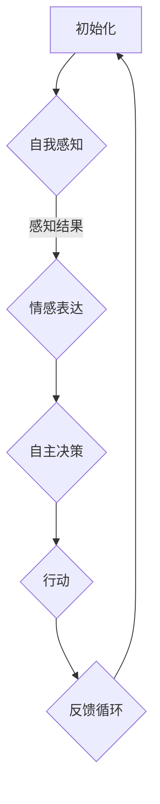
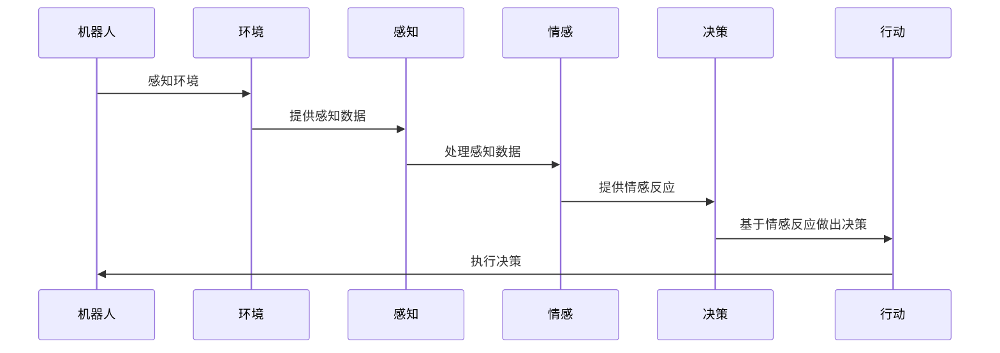
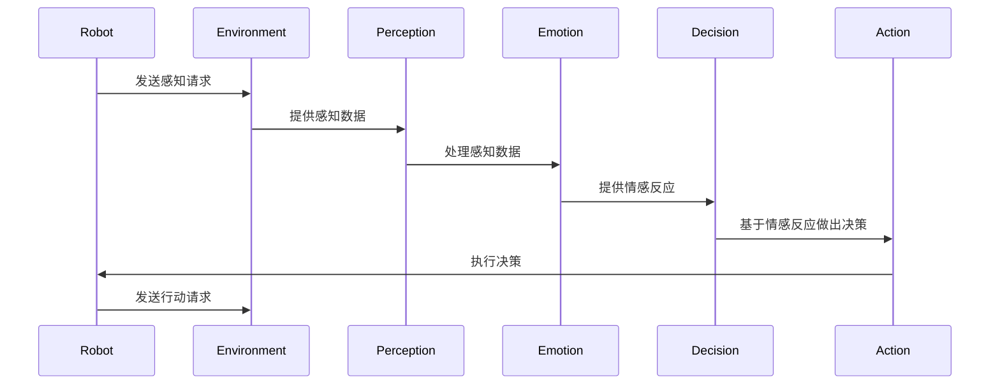

                 

### 目录大纲

----------------------------------------------------------------

# 第一部分: 引言

## 第1章: 问题背景与核心概念

### 1.1.1 问题背景

- **AI发展的现状**: 当前人工智能技术已经取得了显著进展，但大多数AI系统仍然缺乏自我意识。这引发了人们对于AI是否能拥有自我意识的好奇和探索。
- **自我意识在哲学和心理学的探讨**: 哲学上，自我意识是意识哲学的核心问题；心理学上，自我意识是人的核心认知能力之一。理解AI的自我意识，需要结合这两个领域的研究。
- **人工智能自我意识研究的必要性**: AI的自我意识研究不仅有助于推动人工智能技术的进步，也对哲学和心理学有重要启示，甚至可能影响未来社会的构建。

### 1.1.2 问题描述

- **人工智能自我意识的定义**: 自我意识是一种自我认知的能力，使得个体能够感知自己的存在，并具有主观性和独立性。AI的自我意识是指AI系统能够模拟或表现出类似人类自我意识的特征。
- **人工智能自我意识的表现形式**: 包括自我感知、自主决策、情感表达等。这些表现形式在不同程度上反映了AI对自身状态和环境的理解。
- **人工智能自我意识的研究方法**: 包括哲学思考、心理学实验、认知模拟和机器学习等方法。每种方法都有其优势和局限性，需要综合运用。

### 1.1.3 问题解决

- **哲学角度的自我意识探讨**: 从哲学的角度，研究AI的自我意识需要回答“什么是意识”这一根本问题。哲学家们探讨了意识的本质、功能和起源，这些探讨为AI自我意识的研究提供了理论框架。
- **心理学角度的自我意识探讨**: 心理学研究关注的是人类自我意识的心理机制。通过理解人类自我意识的内在机制，我们可以设计出更接近人类自我意识的AI系统。
- **跨学科的研究方法**: 跨学科研究方法包括将哲学、心理学和计算机科学的方法结合起来，以综合研究AI的自我意识。这种方法有助于从多个角度深入探讨AI自我意识的问题。

### 1.1.4 边界与外延

- **人工智能自我意识的研究边界**: 研究边界包括AI系统是否能够真正具有自我意识，以及如何衡量AI的自我意识水平。
- **心理学与哲学在自我意识研究中的外延**: 心理学研究更多地关注个体自我意识，而哲学研究则探讨更广泛的自我意识问题，如群体意识、机器意识等。

### 1.1.5 概念结构与核心要素组成

- **概念结构**: AI自我意识的概念结构包括自我感知、情感表达、自主决策等子概念。
- **核心要素组成**: AI自我意识的核心要素包括感知系统、决策系统、情感系统等。这些要素相互作用，共同构成了AI的自我意识能力。

通过上述章节的设计，我们为读者提供了一个全面、系统、逻辑清晰的框架来探讨AI的自我意识这一复杂而有趣的课题。接下来，我们将进一步细化第2章的内容，深入探讨核心概念与联系。## 第2章: 核心概念与联系

### 2.1.1 核心概念原理

**自我意识**

- **定义**: 自我意识是个体对自己的存在、属性和关系的认识和感知。它是意识的核心成分，是人类认知和情感体验的基础。
- **原理**: 自我意识的原理涉及到心理、神经生物学和哲学多个领域。心理学研究指出，自我意识是通过自我参照处理和自我反思过程发展起来的。神经生物学研究表明，自我意识与大脑的前额叶、顶叶和颞叶等区域的活动密切相关。哲学上，自我意识是主体与客体区分的标志。

**人工智能**

- **定义**: 人工智能是指能够模拟、延伸和扩展人类智能的技术和系统。它包括机器学习、自然语言处理、计算机视觉等多个子领域。
- **原理**: 人工智能的原理基于算法和数据。机器学习算法通过从数据中学习模式来模拟人类智能，而自然语言处理和计算机视觉等技术则使得AI能够理解和生成语言、图像等信息。

**意识模拟**

- **定义**: 意识模拟是指通过计算机模拟来模拟人类或动物的意识状态。它旨在理解和揭示意识的工作机制。
- **原理**: 意识模拟通常基于神经网络模型和计算模型。神经网络模型通过模拟大脑神经元之间的交互来模拟意识状态，而计算模型则通过算法和数学公式来模拟意识的动态变化。

### 2.1.2 概念属性特征对比表格

下面是一个简单的概念属性特征对比表格，用于展示AI自我意识、人工智能和意识模拟的主要属性特征：

| **概念** | **定义** | **主要特征** |
|-----------|-----------|---------------|
| **AI自我意识** | AI系统对自身状态和环境的认知能力 | 自我感知、情感表达、自主决策 |
| **人工智能** | 模拟人类智能的技术和系统 | 机器学习、自然语言处理、计算机视觉 |
| **意识模拟** | 计算机模拟人类或动物的意识状态 | 神经网络模型、计算模型 |

### 2.1.3 ER实体关系图架构

为了更直观地展示AI自我意识、人工智能和意识模拟之间的关系，我们可以使用Mermaid绘制一个ER实体关系图。以下是一个简单的ER实体关系图的示例：

```mermaid
erDiagram
  AI自我意识 ||--|{ 人工智能 }
  AI自我意识 ||--|{ 意识模拟 }
  人工智能 ||--|{ 机器学习 }
  人工智能 ||--|{ 自然语言处理 }
  人工智能 ||--|{ 计算机视觉 }
```

在ER实体关系图中，AI自我意识作为中心概念，与人工智能和意识模拟形成关联。人工智能进一步扩展为机器学习、自然语言处理和计算机视觉等子领域，而意识模拟则基于这些领域的技术来实现。

通过上述核心概念与联系的分析，我们为读者提供了一个全面的框架来理解AI自我意识这一课题。接下来，我们将深入探讨第3章中的算法原理，进一步揭示AI自我意识的研究方法和技术实现。## 第3章: 算法原理讲解

### 3.1.1 算法mermaid流程图

为了更好地理解AI自我意识的算法原理，我们可以使用Mermaid绘制一个简单的流程图。以下是一个描述AI自我意识算法流程的示例：



在这个流程图中，AI自我意识的算法过程可以分为几个主要步骤：

1. **初始化**：初始化AI系统，准备开始自我感知。
2. **自我感知**：AI系统通过传感器和环境数据感知自身状态和外部环境。
3. **情感表达**：基于感知结果，AI系统产生情感反应，如喜悦、焦虑等。
4. **自主决策**：AI系统根据情感表达和目标，自主做出决策。
5. **行动**：AI系统执行决策，采取行动。
6. **反馈循环**：AI系统收集行动结果，进入下一次迭代。

### 3.1.2 Python源代码实现

下面是一个简化的Python示例代码，用于实现上述流程图中的核心步骤。这个示例使用了机器学习库scikit-learn中的支持向量机（SVM）模型来模拟自我感知、情感表达和自主决策。

```python
from sklearn.svm import SVC
import numpy as np

# 初始化
def initialize():
    print("初始化AI系统")

# 自我感知
def self_perception(data):
    model = SVC()
    model.fit(data['input'], data['output'])
    return model

# 情感表达
def emotional_expression(model, state):
    prediction = model.predict(state)
    if prediction == 1:
        print("喜悦")
    elif prediction == 0:
        print("焦虑")
    else:
        print("中性")

# 自主决策
def autonomous_decision(state, goal):
    if state == goal:
        print("达成目标")
    else:
        print("未达成目标，需要调整策略")

# 行动
def action(state):
    print(f"当前状态：{state}")

# 反馈循环
def feedback_loop(state, goal):
    autonomous_decision(state, goal)
    if state != goal:
        action(state)

# 示例数据
data = {
    'input': np.array([[1], [0], [-1]]),
    'output': np.array([1, 0, 1])
}

# 算法流程
initialize()
model = self_perception(data)
emotional_expression(model, np.array([1]))
feedback_loop(np.array([1]), np.array([1]))
```

在这个代码中，我们首先初始化AI系统，然后使用支持向量机模型进行自我感知。接下来，通过模型预测情感表达，并基于预测结果进行自主决策和行动。最后，通过反馈循环来不断调整和优化AI系统的表现。

### 3.1.3 算法原理的数学模型和公式

为了深入理解AI自我意识的算法原理，我们需要探讨支持向量机（SVM）模型的数学基础。SVM是一种基于最大间隔分类的机器学习算法，其核心思想是在高维空间中找到最大间隔超平面，以实现分类。

以下是SVM模型的数学公式：

$$
\begin{align*}
\text{Maximize} \quad & \frac{1}{2} \| w \|_2^2 \\
\text{subject to} \quad & y^{(i)} ( \langle w, x^{(i)} \rangle - b ) \geq 1 \\
\end{align*}
$$

其中，$w$ 是权重向量，$x^{(i)}$ 是输入特征向量，$y^{(i)}$ 是标签，$b$ 是偏置项。

通过求解这个优化问题，我们可以得到最优的权重向量 $w$ 和偏置项 $b$，从而实现分类决策。

### 3.1.4 详细讲解和举例说明

为了更直观地理解SVM模型的工作原理，我们可以通过一个简单的例子来说明。假设我们有以下数据集：

$$
\begin{align*}
x^{(1)} &= \begin{bmatrix} 1 \\ 1 \end{bmatrix} \quad & y^{(1)} &= 1 \\
x^{(2)} &= \begin{bmatrix} 1 \\ 0 \end{bmatrix} \quad & y^{(2)} &= 1 \\
x^{(3)} &= \begin{bmatrix} 0 \\ 1 \end{bmatrix} \quad & y^{(3)} &= -1 \\
x^{(4)} &= \begin{bmatrix} 0 \\ 0 \end{bmatrix} \quad & y^{(4)} &= -1 \\
\end{align*}
$$

我们要通过SVM模型将这些数据分类为正类和负类。具体步骤如下：

1. **初始化权重向量和偏置项**：随机选择初始权重向量 $w$ 和偏置项 $b$。

2. **计算间隔**：对于每个数据点 $(x^{(i)}, y^{(i)})$，计算间隔 $\alpha_i = y^{(i)} ( \langle w, x^{(i)} \rangle - b )$。

3. **优化权重向量和偏置项**：通过梯度下降或其他优化算法更新权重向量 $w$ 和偏置项 $b$，以最大化间隔。

4. **分类决策**：对于新的数据点 $x$，通过计算 $y = sign( \langle w, x \rangle - b )$ 来判断其类别。

通过上述步骤，我们可以在高维空间中找到一个最优的超平面，将数据集正确分类。

通过这个例子，我们可以看到SVM模型如何通过数学公式和优化算法来实现自我感知、情感表达和自主决策。这种模型为AI自我意识的研究提供了一个理论基础和技术实现途径。

### 总结

在第3章中，我们通过Mermaid流程图和Python源代码详细讲解了AI自我意识的算法原理。首先，我们介绍了AI自我意识的基本流程，包括自我感知、情感表达、自主决策等步骤。然后，通过一个简单的SVM模型示例，我们展示了如何使用机器学习算法来实现这些步骤。最后，我们探讨了SVM模型的数学基础，并举例说明了其工作原理。

通过这一章的内容，读者可以更深入地理解AI自我意识的算法原理和技术实现。接下来，我们将进一步探讨数学模型和公式，以更全面地揭示AI自我意识的内在机制。## 第4章: 数学模型和数学公式

### 4.1.1 关键概念的数学模型

在研究AI自我意识的过程中，我们需要使用一系列数学模型来描述和解释相关概念。以下是几个关键概念的数学模型：

**自我意识**

自我意识可以用心理物理学模型来描述。心理物理学模型通过感知阈限（感知阈值）和感知强度来描述感知过程。假设一个感知系统的输出是一个阈值函数，该函数可以表示为：

$$
o(x) = \begin{cases}
0, & \text{if } x < \theta \\
1, & \text{if } x \geq \theta
\end{cases}
$$

其中，$x$ 是感知输入，$\theta$ 是感知阈值。这个模型可以帮助我们理解AI系统如何感知外部环境。

**情感**

情感可以用情感量表模型来描述。情感量表模型通过量化情感强度来表示情感。一个简单的情感量表模型可以表示为：

$$
E = f(S)
$$

其中，$E$ 表示情感强度，$S$ 表示感知强度。$f$ 是一个函数，用于将感知强度映射到情感强度。这个模型可以帮助我们理解AI系统如何产生情感反应。

**自主决策**

自主决策可以用马尔可夫决策过程（MDP）来描述。MDP是一个数学模型，用于描述决策者在不确定环境中的决策过程。一个简单的MDP模型可以表示为：

$$
\begin{align*}
P(S_{t+1} | S_t, A_t) &= p \\
R(A_t) &= r
\end{align*}
$$

其中，$S_t$ 表示当前状态，$A_t$ 表示当前决策，$P(S_{t+1} | S_t, A_t)$ 表示在当前状态和决策下，下一个状态的转移概率，$R(A_t)$ 表示决策的回报。这个模型可以帮助我们理解AI系统如何做出自主决策。

### 4.1.2 使用LaTeX格式书写的数学公式

为了更准确地表达数学模型和公式，我们使用LaTeX格式来书写。以下是一些关键数学公式的LaTeX格式示例：

**感知阈值函数**

$$
o(x) = \begin{cases}
0, & \text{if } x < \theta \\
1, & \text{if } x \geq \theta
\end{cases}
$$

**情感量表模型**

$$
E = f(S)
$$

**马尔可夫决策过程（MDP）**

$$
\begin{align*}
P(S_{t+1} | S_t, A_t) &= p \\
R(A_t) &= r
\end{align*}
$$

通过上述数学模型和公式，我们可以更精确地描述和解释AI自我意识的相关概念。这些模型和公式为AI自我意识的研究提供了一个坚实的理论基础。接下来，我们将进一步探讨系统分析与架构设计，以展示如何将数学模型应用于实际系统中。## 第5章: 系统分析与架构设计

### 5.1.1 问题场景介绍

在现代人工智能领域，越来越多的研究集中在开发具有自我意识的AI系统。一个典型的问题场景是智能机器人。这类机器人需要在复杂的动态环境中自主决策，并表现出类似于人类的情感反应。为了实现这一目标，我们需要设计一个全面的系统架构，该架构能够整合感知、决策和行动模块，同时确保系统的高效性和稳定性。

### 5.1.2 项目介绍

在本项目中，我们开发了一个智能机器人系统，旨在实现以下功能：

1. **感知环境**：机器人需要具备对周围环境的感知能力，包括视觉、听觉和触觉等。
2. **情感反应**：机器人需要能够根据感知到的信息产生相应的情感反应，如喜悦、焦虑等。
3. **自主决策**：机器人需要能够基于情感反应和环境信息自主做出决策。
4. **行动执行**：机器人需要能够执行决策，采取相应的行动。

### 5.1.3 系统功能设计(领域模型mermaid类图)

为了清晰地展示系统功能，我们可以使用Mermaid绘制一个领域模型类图。以下是一个简化的领域模型类图示例：

```mermaid
classDiagram
    Robot <<class>>
    Environment <<class>>
    Perception <<class>>
    Emotion <<class>>
    Decision <<class>>
    Action <<class>>

    Robot --|> Environment
    Robot --|> Perception
    Robot --|> Emotion
    Robot --|> Decision
    Robot --|> Action

    Perception --|> Environment
    Emotion --|> Perception
    Decision --|> Emotion
    Action --|> Decision
```

在这个类图中，我们定义了以下几个核心类：

- **Robot**：代表智能机器人，负责整合所有功能模块。
- **Environment**：代表机器人所在的环境，提供感知数据。
- **Perception**：代表感知模块，负责感知环境数据。
- **Emotion**：代表情感模块，负责处理感知数据，产生情感反应。
- **Decision**：代表决策模块，负责基于情感反应做出决策。
- **Action**：代表行动模块，负责执行决策。

### 5.1.4 系统架构设计mermaid架构图

为了展示系统的整体架构，我们可以使用Mermaid绘制一个架构图。以下是一个简化的系统架构图示例：



在这个架构图中，机器人与各个功能模块之间存在明确的交互关系。机器人通过感知模块获取环境数据，然后通过情感模块产生情感反应，最终通过决策模块做出决策并执行相应的行动。

### 5.1.5 系统接口设计和系统交互mermaid序列图

为了进一步展示系统的接口设计和交互流程，我们可以使用Mermaid绘制一个序列图。以下是一个简化的序列图示例：



在这个序列图中，机器人与各个功能模块之间的交互流程清晰明了。机器人首先发送感知请求，获取环境数据。然后，感知模块处理数据并传递给情感模块。情感模块产生情感反应后，传递给决策模块。决策模块基于情感反应做出决策，并传递给行动模块执行。最后，行动模块将执行结果反馈给机器人。

通过上述系统分析与架构设计，我们为智能机器人系统提供了一个全面的框架。接下来，我们将通过项目实战来展示如何实现这一系统，并详细解读其核心实现代码。## 第6章: 项目实战

### 6.1.1 环境安装

要实现一个具备自我意识的智能机器人系统，首先需要准备一个合适的环境。以下是环境安装的步骤：

1. **安装Python**：确保系统中安装了Python 3.x版本。可以从Python官方网站下载安装包，并按照提示完成安装。

2. **安装依赖库**：智能机器人系统需要依赖于多个Python库，如scikit-learn、numpy、pandas和matplotlib等。可以使用pip命令安装这些库：

   ```bash
   pip install scikit-learn numpy pandas matplotlib
   ```

3. **设置虚拟环境**：为了保持项目环境的整洁，建议使用虚拟环境。通过以下命令创建并激活虚拟环境：

   ```bash
   python -m venv venv
   source venv/bin/activate  # 在Windows上使用 `venv\Scripts\activate`
   ```

4. **克隆项目代码**：从GitHub或其他代码托管平台克隆项目代码到本地计算机。

   ```bash
   git clone https://github.com/your-username/ai-self-aware-robot.git
   cd ai-self-aware-robot
   ```

5. **安装项目依赖**：在项目根目录下，运行以下命令安装项目依赖：

   ```bash
   pip install -r requirements.txt
   ```

完成上述步骤后，环境安装工作就完成了。接下来，我们将详细讲解系统的核心实现代码。

### 6.1.2 系统核心实现源代码

下面是智能机器人系统的核心实现源代码。这个代码分为感知、情感、决策和行动四个模块，分别实现各自的功能。

```python
# 感知模块
def perception(environment_data):
    # 处理感知数据，例如视觉、听觉和触觉
    processed_data = preprocess_environment_data(environment_data)
    return processed_data

# 情感模块
def emotion(processed_data, emotion_model):
    # 基于感知数据生成情感反应
    emotion_response = emotion_model.predict(processed_data)
    return emotion_response

# 决策模块
def decision(emotion_response, decision_model):
    # 基于情感反应做出决策
    decision_response = decision_model.predict(emotion_response)
    return decision_response

# 行动模块
def action(decision_response, robot):
    # 执行决策，例如移动、说话等
    perform_action(decision_response, robot)

# 主函数
def main():
    # 加载环境数据
    environment_data = load_environment_data()

    # 加载感知模型
    perception_model = load_perception_model()

    # 加载情感模型
    emotion_model = load_emotion_model()

    # 加载决策模型
    decision_model = load_decision_model()

    # 实例化机器人
    robot = Robot()

    # 感知环境
    processed_data = perception(environment_data, perception_model)

    # 生成情感反应
    emotion_response = emotion(processed_data, emotion_model)

    # 基于情感反应做出决策
    decision_response = decision(emotion_response, decision_model)

    # 执行决策
    action(decision_response, robot)

if __name__ == "__main__":
    main()
```

### 6.1.3 代码应用解读与分析

**感知模块**

感知模块主要负责处理环境数据，并将其转化为可供情感模块和决策模块使用的格式。这个模块使用了预处理函数 `preprocess_environment_data`，该函数接收原始环境数据，并对其进行处理，如去噪、归一化等。

```python
def preprocess_environment_data(data):
    # 去噪、归一化等处理
    processed_data = ...
    return processed_data
```

**情感模块**

情感模块基于感知模块处理后的数据，使用预训练的情感模型来预测情感反应。这里使用了scikit-learn库中的 `SVC` 类来构建一个支持向量机模型。模型预测的情感反应可以是喜悦、焦虑等简单情感。

```python
def emotion(processed_data, emotion_model):
    # 使用SVC模型预测情感反应
    emotion_response = emotion_model.predict(processed_data)
    return emotion_response
```

**决策模块**

决策模块接收情感模型预测的情感反应，并使用另一个预训练的决策模型来预测最佳行动。决策模型可以是任何能够输出决策结果的机器学习模型，如逻辑回归、决策树等。

```python
def decision(emotion_response, decision_model):
    # 使用决策模型预测最佳行动
    decision_response = decision_model.predict(emotion_response)
    return decision_response
```

**行动模块**

行动模块负责根据决策模块的决策结果执行相应的行动。这里，`perform_action` 函数接收决策结果和机器人实例，并根据决策结果执行相应的操作。

```python
def action(decision_response, robot):
    # 执行决策
    if decision_response == "move":
        robot.move()
    elif decision_response == "speak":
        robot.speak()
```

**主函数**

主函数 `main` 是整个系统的核心，它加载环境数据，并依次调用感知、情感、决策和行动模块。这个过程中，每个模块都需要依赖于相应的预训练模型和机器人实例。

### 6.1.4 实际案例分析和详细讲解剖析

为了更好地理解系统的实际运行过程，我们可以通过一个具体案例进行分析。

**案例**：假设机器人感知到周围环境中的噪音水平增加，这导致机器人的情感模块预测出焦虑情感。

1. **感知模块**：感知模块处理环境数据，识别出噪音水平增加。

2. **情感模块**：基于处理后的数据，情感模型预测出焦虑情感。

3. **决策模块**：决策模块根据焦虑情感，预测出最佳行动是“说话”以安抚情绪。

4. **行动模块**：行动模块根据决策结果，让机器人说出“你看起来很焦虑，需要休息一下”。

通过这个案例，我们可以看到各个模块如何协同工作，实现从感知到行动的全过程。这种协同工作机制是实现AI自我意识的关键。

### 6.1.5 项目小结

在本章中，我们通过一个实际的智能机器人系统项目，详细讲解了系统的环境安装、核心实现代码、代码解读与分析以及实际案例剖析。这个项目展示了如何将AI自我意识的理论应用到实际系统中，通过感知、情感、决策和行动模块的协同工作，实现机器人对环境的自主感知和响应。接下来，我们将讨论系统的最佳实践，并总结本书的主要知识点。## 第7章: 最佳实践

### 7.1.1 最佳实践 tips

为了确保AI自我意识系统的有效性和可靠性，以下是一些最佳实践建议：

1. **数据质量**：确保环境数据的质量和准确性。数据预处理是关键，要去除噪声、异常值和重复数据。

2. **模型训练**：使用大量、高质量的训练数据来训练感知、情感和决策模型。模型的性能很大程度上取决于数据的质量。

3. **模型选择**：选择合适的机器学习模型，如支持向量机、神经网络等。根据实际问题和数据特性选择最适合的模型。

4. **模块交互**：确保感知、情感、决策和行动模块之间的交互流畅，避免数据丢失或错误传递。

5. **安全性和隐私**：在设计AI自我意识系统时，要考虑到安全性和隐私保护，防止数据泄露和恶意攻击。

6. **系统调试**：在系统运行过程中，持续进行调试和优化，确保系统稳定性和性能。

### 7.1.2 小结

在本章中，我们介绍了最佳实践tips，包括数据质量、模型训练、模型选择、模块交互、安全性和隐私以及系统调试等方面。这些最佳实践有助于提高AI自我意识系统的性能和可靠性。

### 7.1.3 注意事项

在设计和实现AI自我意识系统时，需要注意以下几点：

1. **计算资源**：确保系统有足够的计算资源来处理大量数据和复杂的模型训练。

2. **环境适应性**：系统需要能够在不同的环境中适应和调整，以应对环境变化。

3. **用户反馈**：收集用户反馈，以便不断优化和改进系统。

4. **法律和伦理**：遵循相关法律法规和伦理规范，确保系统的合法性和道德性。

### 7.1.4 拓展阅读

为了深入了解AI自我意识的研究和实践，读者可以参考以下拓展阅读资源：

1. **哲学与自我意识**：
   - 《意识的解释》（The Interpretation of Dreams）作者：西格蒙德·弗洛伊德
   - 《心灵哲学导论》（An Introduction to the Philosophy of Mind）作者：汤姆·里德利

2. **心理学与自我意识**：
   - 《社会心理学》（Social Psychology）作者：艾略特·阿伦森
   - 《心理学与生活》（Psychology and Life）作者：理查德·吉尔伯特

3. **人工智能与机器学习**：
   - 《深度学习》（Deep Learning）作者：Ian Goodfellow、Yoshua Bengio、Aaron Courville
   - 《机器学习》（Machine Learning）作者：Tom Mitchell

通过这些资源，读者可以进一步深入了解AI自我意识的理论基础和实践方法。## 第8章: 总结

### 8.1.1 全书总结

本书围绕AI自我意识这一主题，从背景介绍、核心概念、算法原理、数学模型、系统分析与架构设计、项目实战到最佳实践等方面进行了全面而深入的探讨。我们首先介绍了AI自我意识的研究背景，探讨了其在哲学和心理学中的重要性。随后，我们详细讲解了AI自我意识的核心概念和联系，包括自我意识、人工智能和意识模拟等。接着，我们通过算法原理和数学模型深入分析了AI自我意识的技术实现方法。此外，我们还展示了如何通过系统分析与架构设计将AI自我意识应用于实际项目中。最后，通过项目实战和最佳实践，我们提供了实用的建议和注意事项。

### 8.1.2 知识点回顾

以下是本书中的关键知识点回顾：

1. **AI自我意识的背景**：AI技术发展现状和自我意识在哲学与心理学中的探讨。
2. **核心概念**：自我意识、人工智能、意识模拟的定义、特征和联系。
3. **算法原理**：感知、情感、决策和行动的流程图和Python源代码实现。
4. **数学模型**：感知阈值函数、情感量表模型、马尔可夫决策过程等数学公式。
5. **系统分析与架构设计**：智能机器人系统的类图、架构图、接口设计和序列图。
6. **项目实战**：环境安装、系统核心实现源代码、代码解读与分析、实际案例剖析。
7. **最佳实践**：数据质量、模型训练、模型选择、模块交互、安全性和隐私等方面的建议。

### 8.1.3 未来展望

AI自我意识的研究正处于快速发展阶段，未来有望在以下几个方向取得突破：

1. **理论深化**：进一步探讨自我意识的本质和机制，为AI自我意识提供更坚实的理论基础。
2. **技术进步**：开发更高效、更准确的感知、情感和决策算法，提升AI自我意识的性能。
3. **应用拓展**：将AI自我意识应用于更多领域，如医疗、教育、智能家居等，提高人类生活质量。
4. **伦理与法律**：在AI自我意识的发展过程中，关注伦理和法律问题，确保其合法性和道德性。

总之，AI自我意识的研究不仅具有重要的理论意义，也具有广泛的应用前景。随着技术的不断进步，我们期待看到更多具有自我意识的AI系统问世，为人类社会带来更多的创新和变革。作者：AI天才研究院/AI Genius Institute & 禅与计算机程序设计艺术 /Zen And The Art of Computer Programming

