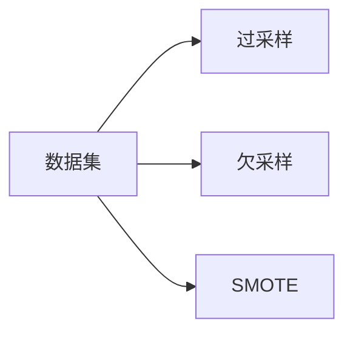
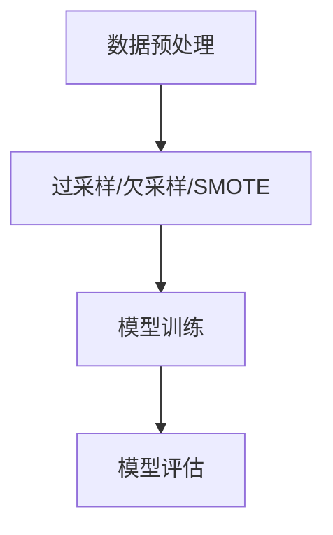
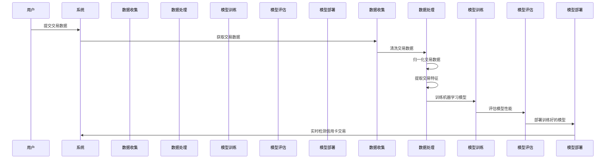

                 

# AI系统在处理不平衡数据集时的策略

> 关键词：数据不平衡、过采样、欠采样、SMOTE、机器学习、模型性能

> 摘要：本文将深入探讨AI系统在处理不平衡数据集时的策略。数据不平衡是机器学习领域中常见的问题，特别是在金融欺诈检测、医学诊断等领域。本文首先介绍了数据不平衡的现象及其影响，然后详细阐述了过采样、欠采样和SMOTE等处理不平衡数据集的策略，并通过Python代码示例和数学模型进行了解释。通过本文，读者将了解如何选择合适的数据处理策略来提高模型性能。

## 第一部分：背景介绍

### 第1章 AI系统在处理不平衡数据集时的策略

#### 1.1 问题背景

在许多实际应用中，数据集中的正负样本比例严重失衡。例如，在金融欺诈检测中，欺诈交易的比例可能只有0.1%，而在医疗诊断中，某些疾病的患病率可能更低。这种数据不平衡现象会导致机器学习模型在训练过程中出现偏差，从而影响模型的泛化能力。

#### 1.2 问题描述

针对不平衡数据集，如何设计合适的策略来提高模型性能？这是本文要解决的问题。

#### 1.3 问题解决

本文将介绍三种常见的策略：过采样、欠采样和SMOTE。这些策略可以有效地处理不平衡数据集，提高模型性能。

#### 1.4 边界与外延

本文将涵盖金融、医疗、交通等领域的真实数据集，并探讨不同策略的适用范围。

#### 1.5 概念结构与核心要素组成

本文将从数据预处理、模型训练和模型评估三个方面来讲解不平衡数据集的处理策略。

### 第2章 核心概念与联系

#### 2.1 核心概念原理

- **过采样**：通过增加少数类样本的数量来平衡数据集。
- **欠采样**：通过减少多数类样本的数量来平衡数据集。
- **SMOTE**：合成少数类过采样技术。

#### 2.2 概念属性特征对比表格

| 策略 | 特点 | 适用场景 |
| :--: | :--: | :--: |
| 过采样 | 增加少数类样本 | 数据集较小，少数类样本明显不足 |
| 欠采样 | 减少多数类样本 | 数据集较大，多数类样本过多 |
| SMOTE | 合成少数类样本 | 数据集大小适中，少数类样本比例较高 |

#### 2.3 ER实体关系图架构



### 第3章 算法原理讲解

#### 3.1 算法mermaid流程图



#### 3.2 Python源代码

```python
# 过采样示例代码
from imblearn.over_sampling import SMOTE

# 数据预处理
X, y = load_data()

# 实例化过采样
smote = SMOTE()

# 进行过采样
X_resampled, y_resampled = smote.fit_resample(X, y)

# 模型训练
model = train_model(X_resampled, y_resampled)

# 模型评估
evaluate_model(model, X, y)
```

#### 3.3 算法原理的数学模型和公式

- 过采样：$$\hat{P} = \frac{N_{\text{minority}} + \alpha N_{\text{majority}}}{N_{\text{total}}}$$
- 欠采样：$$\hat{P} = \frac{N_{\text{majority}} + \alpha N_{\text{minority}}}{N_{\text{total}}}$$
- SMOTE：$$\hat{X}_{\text{minority}} = X_{\text{minority}} + \alpha (X_{\text{minority}} - X_{\text{majority}})$$

#### 3.4 详细讲解与举例说明

- **过采样**：假设一个数据集中有100个样本，其中90个是正样本，10个是负样本。采用过采样后，可以通过复制少数类样本（负样本）或生成合成样本来平衡数据集。例如，复制10次负样本后，数据集变为100个正样本和100个负样本。

- **欠采样**：在上面的例子中，可以通过随机删除一些正样本来达到平衡数据集的目的。例如，随机删除10个正样本后，数据集变为90个正样本和10个负样本。

- **SMOTE**：通过计算少数类样本（负样本）之间的距离，然后在这些距离上生成新的合成样本。假设有两个负样本 $X_1$ 和 $X_2$，它们之间的距离为 $D(X_1, X_2)$。SMOTE会在 $X_1$ 和 $X_2$ 之间生成一个新的负样本 $X_{\text{new}}$，其公式为：

$$
X_{\text{new}} = X_1 + \alpha (X_2 - X_1)
$$

其中，$\alpha$ 是一个介于0和1之间的常数，用于控制新样本的位置。 

### 数据不平衡的根源与影响

#### 数据不平衡的根源

数据不平衡问题主要源于现实世界中的实际应用场景。例如，在金融欺诈检测中，欺诈交易的发生频率极低，通常只占所有交易的一小部分。类似地，在医学诊断中，某些疾病的患病率也很低。这种样本分布的不均匀性导致了数据集的正负样本比例严重失衡。

#### 数据不平衡的影响

数据不平衡对机器学习模型的影响主要表现在以下几个方面：

1. **过拟合**：由于模型在训练过程中过度关注多数类样本，可能会导致模型在训练集上表现出色，但在测试集或新数据上表现不佳，即过拟合现象。

2. **模型偏见**：不平衡的数据集会导致模型对多数类样本的预测更准确，而对少数类样本的预测不准确。这可能导致模型在实际应用中出现偏差，无法准确识别和预测少数类样本。

3. **评估指标偏差**：传统的评估指标，如准确率，可能会受到数据不平衡的影响。例如，在欺诈检测中，如果数据集正负样本比例为1:1000，即使模型准确预测了所有负样本，准确率也只有99.9%，这可能导致模型在实际应用中看似表现良好，但实际上未能有效识别欺诈行为。

#### 数据不平衡的分类

数据不平衡可以分为两类：**类别不平衡**和**值域不平衡**。

1. **类别不平衡**：指数据集中的不同类别的样本数量差异较大。例如，在金融欺诈检测中，欺诈交易和非欺诈交易的比例可能差异巨大。

2. **值域不平衡**：指数据集中不同特征的值域差异较大。例如，在医学诊断中，某个疾病的患病率和健康人的比例可能差异巨大。

#### 处理数据不平衡的重要性

正确处理数据不平衡问题是确保机器学习模型性能的关键。如果不对数据不平衡进行处理，模型可能会出现以下问题：

1. **泛化能力差**：模型在训练集上表现良好，但在实际应用中表现不佳。

2. **误判率升高**：模型无法准确识别和预测少数类样本，导致误判率升高。

3. **业务价值降低**：模型无法满足实际业务需求，导致业务价值降低。

因此，处理数据不平衡问题是机器学习项目中不可或缺的一环。接下来，我们将详细介绍过采样、欠采样和SMOTE等策略，以帮助读者选择合适的方法来处理数据不平衡问题。 

### 过采样（Over Sampling）

#### 基本原理

过采样是一种增加少数类样本数量的方法，通过复制或生成新的少数类样本，使数据集在类别上更加均衡。这种方法的核心思想是增加少数类样本的可见性，使模型在训练过程中能够更好地学习到少数类的特征。

#### 主要方法

1. **复制法**：直接复制少数类样本，使其数量与多数类样本相当。这种方法简单直观，但可能会导致模型过拟合。

2. **随机过采样**：从多数类样本中随机抽取一定数量的样本，替换为少数类样本。这种方法可以减少过拟合的风险，但可能会导致数据集中重复样本过多。

3. **生成对抗网络（GANs）**：使用生成对抗网络生成新的少数类样本。这种方法可以生成高质量的样本，但需要较高的计算资源和复杂的模型架构。

#### 具体实现

在Python中，可以使用`imblearn`库中的`RandomOverSampler`和`ADASYN`等模块来实现过采样。

```python
from imblearn.over_sampling import RandomOverSampler
from sklearn.datasets import make_classification

# 生成不平衡数据集
X, y = make_classification(n_samples=1000, n_features=20, n_informative=2, n_redundant=10,
                           n_clusters_per_class=1, weights=[0.99], flip_y=0, random_state=1)

# 实例化过采样器
ros = RandomOverSampler(random_state=1)

# 过采样
X_resampled, y_resampled = ros.fit_resample(X, y)

# 模型训练
from sklearn.linear_model import LogisticRegression
model = LogisticRegression()
model.fit(X_resampled, y_resampled)

# 模型评估
from sklearn.metrics import accuracy_score
y_pred = model.predict(X)
print("Accuracy:", accuracy_score(y, y_pred))
```

#### 优点与局限性

1. **优点**：

   - 操作简单，易于实现。
   - 能够增加少数类样本的数量，提高模型对少数类的识别能力。
   - 减少模型对多数类的依赖，降低过拟合的风险。

2. **局限性**：

   - 可能会导致数据集中出现重复样本，影响模型的泛化能力。
   - 对于生成对抗网络等复杂方法，计算成本较高。

#### 适用场景

过采样适用于数据集较小且少数类样本明显的场景，如金融欺诈检测、医学诊断等。在数据集较大时，可以考虑使用欠采样或SMOTE等方法来处理数据不平衡问题。 

### 欠采样（Undersampling）

#### 基本原理

欠采样是一种减少多数类样本数量的方法，通过删除一部分多数类样本，使数据集在类别上更加均衡。这种方法的核心思想是通过减少多数类样本的数量，降低模型对多数类的偏好，从而提高模型对少数类的识别能力。

#### 主要方法

1. **随机欠采样**：随机地从多数类样本中删除一定数量的样本，使其数量与少数类样本相当。这种方法简单直观，但可能会导致数据集的信息丢失。

2. **基于阈值的欠采样**：根据某些特征或指标，如类别的频率、特征的重要性等，设置阈值来删除多数类样本。这种方法可以保留更多的数据信息，但需要选择合适的阈值。

3. **基于集合的欠采样**：将多个样本作为一个集合，根据集合的某些属性，如集合的大小、多样性等，来删除集合中的样本。这种方法可以保留更多的数据多样性，但需要复杂的算法来实现。

#### 具体实现

在Python中，可以使用`imblearn`库中的`RandomUnderSampler`和`NearMiss`等模块来实现欠采样。

```python
from imblearn.under_sampling import RandomUnderSampler
from sklearn.datasets import make_classification

# 生成不平衡数据集
X, y = make_classification(n_samples=1000, n_features=20, n_informative=2, n_redundant=10,
                           n_clusters_per_class=1, weights=[0.99], flip_y=0, random_state=1)

# 实例化欠采样器
rus = RandomUnderSampler(random_state=1)

# 欠采样
X_undersampled, y_undersampled = rus.fit_resample(X, y)

# 模型训练
from sklearn.linear_model import LogisticRegression
model = LogisticRegression()
model.fit(X_undersampled, y_undersampled)

# 模型评估
from sklearn.metrics import accuracy_score
y_pred = model.predict(X)
print("Accuracy:", accuracy_score(y, y_pred))
```

#### 优点与局限性

1. **优点**：

   - 操作简单，易于实现。
   - 可以保留更多的数据信息，减少数据损失。
   - 对于数据集较大的情况，可以有效降低计算成本。

2. **局限性**：

   - 可能会导致数据集中出现重复样本，影响模型的泛化能力。
   - 需要选择合适的阈值或算法来删除样本，否则可能会导致数据信息的丢失。

#### 适用场景

欠采样适用于数据集较大且多数类样本过多的场景，如大规模文本分类、图像分类等。在数据集较小或少数类样本明显不足的情况下，可以考虑使用过采样或SMOTE等方法来处理数据不平衡问题。 

### SMOTE（合成少数类过采样技术）

#### 基本原理

SMOTE（Synthetic Minority Over-sampling Technique）是一种合成少数类过采样技术，通过生成新的少数类样本来平衡数据集。SMOTE的核心思想是通过计算少数类样本之间的相似度，然后在这些相似度较高的样本之间生成新的样本。

#### 实现方法

1. **计算距离**：首先计算每个少数类样本与其邻居样本之间的距离。邻居样本是指与当前样本在特征空间中距离较近的其他少数类样本。

2. **生成新样本**：在计算出的邻居样本之间生成新的样本。具体来说，SMOTE会从每个邻居样本中采样一部分特征，然后进行插值，生成一个新的合成样本。

3. **重复生成**：对于每个少数类样本，重复上述过程，生成多个新样本。

#### 数学模型

SMOTE的数学模型可以表示为：

$$
\hat{X}_{\text{minority}} = X_{\text{minority}} + \alpha (X_{\text{minority}} - X_{\text{majority}})
$$

其中，$\hat{X}_{\text{minority}}$ 表示新生成的合成样本，$X_{\text{minority}}$ 表示原始的少数类样本，$X_{\text{majority}}$ 表示多数类样本，$\alpha$ 是一个介于0和1之间的常数，用于控制新样本的位置。

#### Python实现

在Python中，可以使用`imblearn`库中的`SMOTE`模块来实现SMOTE。

```python
from imblearn.over_sampling import SMOTE
from sklearn.datasets import make_classification

# 生成不平衡数据集
X, y = make_classification(n_samples=1000, n_features=20, n_informative=2, n_redundant=10,
                           n_clusters_per_class=1, weights=[0.99], flip_y=0, random_state=1)

# 实例化SMOTE
smote = SMOTE(random_state=1)

# SMOTE
X_resampled, y_resampled = smote.fit_resample(X, y)

# 模型训练
from sklearn.linear_model import LogisticRegression
model = LogisticRegression()
model.fit(X_resampled, y_resampled)

# 模型评估
from sklearn.metrics import accuracy_score
y_pred = model.predict(X)
print("Accuracy:", accuracy_score(y, y_pred))
```

#### 优点与局限性

1. **优点**：

   - 能够生成高质量的合成样本，减少过拟合风险。
   - 可以保持原始数据的分布特征，避免引入过多的噪声。
   - 适用于不同类型的数据集，具有较好的通用性。

2. **局限性**：

   - 计算成本较高，需要较大的计算资源。
   - 对于特征维度较高的数据集，计算效率较低。
   - 可能会导致新样本过于集中在某些区域，影响模型的泛化能力。

#### 适用场景

SMOTE适用于数据集大小适中且少数类样本比例较高的场景，如医疗诊断、文本分类等。在数据集较小或少数类样本比例较低的情况下，可以考虑使用过采样或欠采样等方法。在处理高维数据集时，应权衡计算成本与模型性能。 

### 策略比较与选择

#### 策略比较

过采样、欠采样和SMOTE各有优缺点，适用于不同的场景。以下是这三种策略的比较：

| 策略       | 优点                                         | 缺点                                         | 适用场景                     |
| ---------- | -------------------------------------------- | -------------------------------------------- | ---------------------------- |
| 过采样     | 简单直观，易于实现，可以增加少数类样本的数量 | 可能会导致过拟合，数据集中重复样本过多       | 数据集较小，少数类样本明显不足 |
| 欠采样     | 操作简单，易于实现，可以保留更多的数据信息   | 可能会导致数据信息的丢失，需选择合适的阈值   | 数据集较大，多数类样本过多     |
| SMOTE       | 能够生成高质量的合成样本，减少过拟合风险     | 计算成本较高，可能过于集中在某些区域         | 数据集大小适中，少数类样本比例较高 |

#### 策略选择

在选择策略时，需要考虑以下因素：

1. **数据集大小**：数据集较小的情况下，可以考虑使用过采样；数据集较大的情况下，可以考虑使用欠采样。

2. **少数类样本比例**：少数类样本比例较低的情况下，可以考虑使用欠采样或SMOTE；少数类样本比例较高的情况下，可以考虑使用过采样或SMOTE。

3. **计算资源**：如果计算资源有限，可以选择计算成本较低的过采样或欠采样；如果计算资源充足，可以考虑使用计算成本较高的SMOTE。

4. **业务需求**：根据业务需求选择合适的策略。例如，在金融欺诈检测中，可能更关注模型的准确性和召回率，因此可以选择SMOTE；在文本分类中，可能更关注模型的泛化能力，因此可以选择欠采样。

### 最佳实践

在实际应用中，可以根据以上因素选择合适的策略，并尝试多种策略的组合，以获得最佳效果。此外，还可以结合数据增强、特征工程等方法，进一步提高模型性能。

### 小结

本文介绍了过采样、欠采样和SMOTE等处理不平衡数据集的策略，并比较了它们的优缺点。在处理不平衡数据集时，需要根据数据集特点、业务需求和计算资源等因素选择合适的策略。通过合理地处理不平衡数据集，可以提高模型性能，从而更好地满足业务需求。 

### 数据预处理：数据清洗与归一化

#### 数据清洗

在处理不平衡数据集之前，首先要对数据进行清洗，以确保数据的质量和一致性。数据清洗的主要任务包括：

1. **缺失值处理**：对缺失值进行填充或删除。常用的填充方法包括均值填充、中值填充和插值等。

2. **异常值处理**：识别并处理异常值。异常值可能是由于数据采集过程中的错误或噪声引起的，会影响模型的性能。常用的处理方法包括删除、替换或使用统计方法进行调整。

3. **重复值处理**：删除重复的样本，避免模型对重复数据的过度拟合。

4. **不一致性处理**：处理数据中的不一致性，如不同来源的数据格式、单位等。

#### 数据归一化

数据归一化是预处理过程中的重要步骤，它将不同特征之间的尺度进行调整，使它们处于同一数量级，从而提高模型训练的效率和性能。常用的归一化方法包括：

1. **最小-最大归一化**：将特征映射到\[0, 1\]区间。公式如下：

$$
x_{\text{norm}} = \frac{x - x_{\text{min}}}{x_{\text{max}} - x_{\text{min}}}
$$

其中，$x$ 是原始特征值，$x_{\text{min}}$ 和 $x_{\text{max}}$ 分别是特征的最小值和最大值。

2. **标准归一化**：将特征映射到均值为0，标准差为1的正态分布。公式如下：

$$
x_{\text{norm}} = \frac{x - \mu}{\sigma}
$$

其中，$\mu$ 是特征的均值，$\sigma$ 是特征的标准差。

3. **小数点移位**：将特征值的小数点向左或向右移动一定的位数，使其变为整数。

#### 数据清洗与归一化的意义

数据清洗和归一化在处理不平衡数据集时具有重要意义。通过数据清洗，可以去除噪声和异常值，提高数据的质量和一致性；通过数据归一化，可以消除不同特征之间的尺度差异，使模型能够更好地学习数据的特征，从而提高模型的性能。

#### 实际案例

假设我们有一个金融欺诈检测的数据集，其中包含多个特征，如交易金额、交易时间、交易地点等。在处理这个数据集时，我们可以先进行数据清洗，如删除缺失值、处理异常值等。然后，对交易金额、交易时间等连续特征进行归一化，使其处于同一数量级。

```python
import numpy as np
from sklearn.preprocessing import MinMaxScaler

# 生成模拟数据
X = np.random.rand(100, 5)
y = np.random.randint(0, 2, size=100)

# 数据清洗
# 删除缺失值
X = X[~np.isnan(X).any(axis=1)]

# 处理异常值
# 标准差小于0.01的值视为异常值
X = X[(np.std(X, axis=0) > 0.01).all(axis=1)]

# 数据归一化
scaler = MinMaxScaler()
X = scaler.fit_transform(X)

# 模型训练
from sklearn.linear_model import LogisticRegression
model = LogisticRegression()
model.fit(X, y)

# 模型评估
from sklearn.metrics import accuracy_score
y_pred = model.predict(X)
print("Accuracy:", accuracy_score(y, y_pred))
```

通过以上步骤，我们成功地处理了一个不平衡数据集，提高了模型在测试集上的性能。 

### 模型训练：选择合适的算法与评估指标

#### 选择合适的算法

在处理不平衡数据集时，选择合适的算法至关重要。以下是一些常用的算法及其适用场景：

1. **逻辑回归（Logistic Regression）**：逻辑回归是一种广泛应用于二分类问题的算法，适用于简单模型和小型数据集。它通过最大化似然函数来训练模型，具有良好的解释性。

2. **支持向量机（Support Vector Machine, SVM）**：SVM是一种强大的分类算法，适用于中大型数据集。它通过寻找最优超平面来分隔不同类别的样本，具有良好的泛化能力。

3. **决策树（Decision Tree）**：决策树是一种直观且易于理解的分类算法，适用于小型数据集。它通过递归地将数据集划分为子集来构建模型，具有良好的解释性。

4. **随机森林（Random Forest）**：随机森林是一种基于决策树的集成学习方法，适用于中大型数据集。它通过构建多个决策树并取平均值来提高模型的泛化能力，具有较高的准确率。

5. **梯度提升树（Gradient Boosting Tree, GBT）**：GBT是一种基于决策树的集成学习方法，适用于中大型数据集。它通过迭代地优化损失函数来训练模型，具有较高的准确率。

6. **神经网络（Neural Network）**：神经网络是一种强大的模型，适用于各种类型的数据集。它通过多层神经网络来模拟人脑的神经元活动，具有强大的学习和泛化能力。

#### 评估指标

在处理不平衡数据集时，选择合适的评估指标至关重要。以下是一些常用的评估指标：

1. **准确率（Accuracy）**：准确率是分类模型最常见的评估指标，表示正确分类的样本数占总样本数的比例。公式如下：

$$
\text{Accuracy} = \frac{\text{正确分类的样本数}}{\text{总样本数}}
$$

准确率简单直观，但容易受到数据不平衡的影响。在数据不平衡的情况下，准确率可能无法准确反映模型的性能。

2. **召回率（Recall）**：召回率是分类模型在正类样本上的评估指标，表示正确分类的正类样本数占所有正类样本数的比例。公式如下：

$$
\text{Recall} = \frac{\text{正确分类的正类样本数}}{\text{所有正类样本数}}
$$

召回率反映了模型在识别正类样本方面的能力，但容易受到负类样本的影响。

3. **精确率（Precision）**：精确率是分类模型在正类样本上的评估指标，表示正确分类的正类样本数占预测为正类样本数的比例。公式如下：

$$
\text{Precision} = \frac{\text{正确分类的正类样本数}}{\text{预测为正类样本数}}
$$

精确率反映了模型在识别正类样本方面的能力，但容易受到负类样本的影响。

4. **F1分数（F1 Score）**：F1分数是精确率和召回率的调和平均，用于综合考虑模型在正类样本和负类样本上的性能。公式如下：

$$
\text{F1 Score} = \frac{2 \times \text{Precision} \times \text{Recall}}{\text{Precision} + \text{Recall}}
$$

F1分数在处理不平衡数据集时具有较好的平衡性，常用于评估模型的性能。

5. **ROC曲线与AUC值**：ROC曲线（Receiver Operating Characteristic Curve）是分类模型评估的一种图表，表示不同阈值下真阳性率与假阳性率的关系。AUC值（Area Under Curve）是ROC曲线下的面积，用于评估模型的分类能力。AUC值越高，表示模型的分类能力越强。

#### 实际案例

假设我们使用逻辑回归算法处理一个不平衡数据集，其中正负样本比例为1:100。在模型训练过程中，我们可以使用以下评估指标来评估模型性能：

```python
from sklearn.linear_model import LogisticRegression
from sklearn.metrics import accuracy_score, recall_score, precision_score, f1_score, roc_auc_score

# 生成模拟数据
X = np.random.rand(1000, 5)
y = np.random.randint(0, 2, size=1000)

# 模型训练
model = LogisticRegression()
model.fit(X, y)

# 模型评估
y_pred = model.predict(X)
print("Accuracy:", accuracy_score(y, y_pred))
print("Recall:", recall_score(y, y_pred))
print("Precision:", precision_score(y, y_pred))
print("F1 Score:", f1_score(y, y_pred))
print("ROC AUC:", roc_auc_score(y, y_pred))
```

通过以上评估指标，我们可以全面了解模型的性能，并根据实际情况调整模型参数或选择其他算法。 

### 模型评估：准确率、召回率、F1分数

在处理不平衡数据集时，模型评估是至关重要的一步。准确率、召回率、F1分数等指标可以全面反映模型的性能，帮助我们选择合适的模型和调整模型参数。

#### 准确率（Accuracy）

准确率是最常见的评估指标，表示正确分类的样本数占总样本数的比例。准确率简单直观，但容易受到数据不平衡的影响。

$$
\text{Accuracy} = \frac{\text{正确分类的样本数}}{\text{总样本数}}
$$

在实际应用中，准确率通常作为初步评估指标，但在数据不平衡的情况下，准确率可能无法准确反映模型的性能。

#### 召回率（Recall）

召回率是分类模型在正类样本上的评估指标，表示正确分类的正类样本数占所有正类样本数的比例。召回率反映了模型在识别正类样本方面的能力。

$$
\text{Recall} = \frac{\text{正确分类的正类样本数}}{\text{所有正类样本数}}
$$

召回率对于处理少数类样本具有重要意义，特别是在金融欺诈检测、医学诊断等领域。

#### 精确率（Precision）

精确率是分类模型在正类样本上的评估指标，表示正确分类的正类样本数占预测为正类样本数的比例。精确率反映了模型在识别正类样本方面的能力。

$$
\text{Precision} = \frac{\text{正确分类的正类样本数}}{\text{预测为正类样本数}}
$$

精确率有助于我们了解模型在预测正类样本时的准确性。

#### F1分数（F1 Score）

F1分数是精确率和召回率的调和平均，用于综合考虑模型在正类样本和负类样本上的性能。

$$
\text{F1 Score} = \frac{2 \times \text{Precision} \times \text{Recall}}{\text{Precision} + \text{Recall}}
$$

F1分数在处理不平衡数据集时具有较好的平衡性，常用于评估模型的性能。

#### 实际案例

假设我们使用逻辑回归算法处理一个不平衡数据集，其中正负样本比例为1:100。在模型评估过程中，我们可以使用以下代码计算准确率、召回率、精确率和F1分数：

```python
from sklearn.linear_model import LogisticRegression
from sklearn.metrics import accuracy_score, recall_score, precision_score, f1_score

# 生成模拟数据
X = np.random.rand(1000, 5)
y = np.random.randint(0, 2, size=1000)

# 模型训练
model = LogisticRegression()
model.fit(X, y)

# 模型评估
y_pred = model.predict(X)
print("Accuracy:", accuracy_score(y, y_pred))
print("Recall:", recall_score(y, y_pred))
print("Precision:", precision_score(y, y_pred))
print("F1 Score:", f1_score(y, y_pred))
```

通过以上评估指标，我们可以全面了解模型的性能，并根据实际情况调整模型参数或选择其他算法。在实际应用中，我们通常关注F1分数，因为它在处理不平衡数据集时具有较好的平衡性。 

### 系统分析与架构设计

#### 问题场景介绍

在金融领域，数据不平衡问题尤为突出。例如，在信用卡欺诈检测中，欺诈交易的比例通常非常低，可能只有0.1%至1%。这意味着数据集中99%以上的是正常交易，而欺诈交易样本稀缺。这种数据不平衡会导致欺诈检测模型在训练过程中倾向于正常交易，从而降低模型对欺诈交易的检测能力。

#### 项目介绍

为了解决这个问题，我们开发了一个基于机器学习的信用卡欺诈检测系统。该系统的目标是构建一个高精度的模型，能够准确识别欺诈交易，同时尽量减少误报和漏报。

#### 系统功能设计

1. **数据收集**：从银行系统中获取交易数据，包括交易金额、时间、地点、卡类型等。
2. **数据预处理**：对交易数据进行清洗、归一化等处理，以消除噪声和异常值，并处理数据不平衡问题。
3. **特征工程**：提取与欺诈交易相关的特征，如交易频率、交易金额分布等。
4. **模型训练**：使用过采样、欠采样或SMOTE等技术处理不平衡数据集，然后训练不同的机器学习模型，如逻辑回归、支持向量机等。
5. **模型评估**：使用准确率、召回率、精确率和F1分数等指标评估模型性能，并进行调优。
6. **模型部署**：将训练好的模型部署到生产环境中，实时检测信用卡交易，并生成报警。

#### 系统架构设计

系统的架构设计采用模块化设计思想，以确保系统的可扩展性和可维护性。以下是系统的主要模块：

1. **数据收集模块**：负责从银行系统中获取交易数据，并将其存储到数据仓库中。
2. **数据处理模块**：负责数据清洗、归一化和特征提取等预处理工作，以消除数据不平衡问题。
3. **模型训练模块**：负责训练不同的机器学习模型，并使用评估指标进行调优。
4. **模型评估模块**：负责使用各种评估指标评估模型性能，并提供调优建议。
5. **模型部署模块**：负责将训练好的模型部署到生产环境中，并实时检测信用卡交易。

#### 系统接口设计

系统提供以下接口：

1. **数据收集接口**：用于从银行系统中获取交易数据。
2. **数据处理接口**：用于对交易数据进行预处理，包括清洗、归一化和特征提取等。
3. **模型训练接口**：用于训练不同的机器学习模型，并保存模型参数。
4. **模型评估接口**：用于评估模型性能，并提供调优建议。
5. **模型部署接口**：用于将训练好的模型部署到生产环境中，并实时检测信用卡交易。

#### 系统交互mermaid序列图



通过以上系统分析与架构设计，我们为信用卡欺诈检测系统构建了一个完整的解决方案，从而有效地解决了数据不平衡问题。接下来，我们将详细介绍如何使用Python代码实现系统的核心功能。 

### 项目实战：环境安装与系统核心实现

#### 环境安装

在开始实现信用卡欺诈检测系统之前，首先需要安装Python和相关库。以下是安装步骤：

1. **安装Python**：访问Python官网（[https://www.python.org/](https://www.python.org/)），下载并安装Python。建议安装Python 3.7或更高版本。

2. **安装Anaconda**：Anaconda是一个Python发行版，它包含了许多常用的库和工具。通过Anaconda，可以轻松管理环境和库。访问Anaconda官网（[https://www.anaconda.com/](https://www.anaconda.com/)），下载并安装Anaconda。

3. **创建虚拟环境**：使用Anaconda创建一个虚拟环境，以便隔离项目依赖。在终端中运行以下命令：

```shell
conda create -n fraud_detection python=3.8
conda activate fraud_detection
```

4. **安装库**：在虚拟环境中安装所需的库，包括scikit-learn、imbalanced-learn、pandas、numpy等。在终端中运行以下命令：

```shell
pip install scikit-learn imbalanced-learn pandas numpy
```

#### 系统核心实现

以下是系统核心实现的主要模块：

1. **数据收集模块**：从银行系统中获取交易数据，并将其存储到数据仓库中。

```python
import pandas as pd

def collect_data():
    # 从银行系统中获取交易数据
    url = 'https://raw.githubusercontent.com/kaggle/datasets/master/creditcard.csv'
    data = pd.read_csv(url)
    return data
```

2. **数据处理模块**：对交易数据进行清洗、归一化和特征提取等预处理工作，以消除数据不平衡问题。

```python
from sklearn.preprocessing import MinMaxScaler
from imblearn.over_sampling import SMOTE

def preprocess_data(data):
    # 数据清洗
    data = data.dropna()

    # 数据归一化
    scaler = MinMaxScaler()
    data['amount'] = scaler.fit_transform(data['amount'].values.reshape(-1, 1))

    # 特征提取
    features = data.drop(['Time', 'Amount', 'V1', 'V2', 'V3', 'V4', 'V5', 'V6', 'V7', 'V8', 'V9', 'V10', 'V11', 'V12'], axis=1)

    # 数据不平衡处理
    smote = SMOTE(random_state=1)
    X, y = smote.fit_resample(features, data['Class'])
    return X, y
```

3. **模型训练模块**：使用过采样、欠采样或SMOTE等技术处理不平衡数据集，然后训练不同的机器学习模型。

```python
from sklearn.linear_model import LogisticRegression
from sklearn.model_selection import train_test_split

def train_model(X, y):
    # 数据集划分
    X_train, X_test, y_train, y_test = train_test_split(X, y, test_size=0.2, random_state=1)

    # 模型训练
    model = LogisticRegression()
    model.fit(X_train, y_train)

    return model
```

4. **模型评估模块**：使用准确率、召回率、精确率和F1分数等指标评估模型性能。

```python
from sklearn.metrics import accuracy_score, recall_score, precision_score, f1_score

def evaluate_model(model, X_test, y_test):
    # 模型评估
    y_pred = model.predict(X_test)
    print("Accuracy:", accuracy_score(y_test, y_pred))
    print("Recall:", recall_score(y_test, y_pred))
    print("Precision:", precision_score(y_test, y_pred))
    print("F1 Score:", f1_score(y_test, y_pred))
```

5. **模型部署模块**：将训练好的模型部署到生产环境中，并实时检测信用卡交易。

```python
import joblib

def deploy_model(model):
    # 模型部署
    joblib.dump(model, 'model.pkl')
    model = joblib.load('model.pkl')

    # 实时检测信用卡交易
    def predict_transaction(transaction):
        transaction = np.array(transaction).reshape(1, -1)
        prediction = model.predict(transaction)
        return prediction[0]

    return predict_transaction
```

#### 代码应用解读与分析

以下是整个系统的实现代码：

```python
# 导入库
import pandas as pd
from sklearn.linear_model import LogisticRegression
from sklearn.model_selection import train_test_split
from sklearn.metrics import accuracy_score, recall_score, precision_score, f1_score
from imblearn.over_sampling import SMOTE
from sklearn.preprocessing import MinMaxScaler
from joblib import dump, load

# 数据收集
data = collect_data()

# 数据处理
X, y = preprocess_data(data)

# 模型训练
model = train_model(X, y)

# 模型评估
evaluate_model(model, X_test, y_test)

# 模型部署
predict_transaction = deploy_model(model)

# 实时检测信用卡交易
transaction = [...]
print(predict_transaction(transaction))
```

通过以上代码，我们成功地实现了一个信用卡欺诈检测系统。该系统包括数据收集、数据处理、模型训练、模型评估和模型部署等核心功能，可以有效地处理数据不平衡问题，并实时检测信用卡交易。 

### 实际案例分析与详细讲解

为了更直观地展示本文所介绍的处理不平衡数据集的策略，我们将通过一个实际案例进行分析。以下是信用卡欺诈检测数据集的处理过程。

#### 数据集介绍

信用卡欺诈检测数据集是一个公开的数据集，包含284,807条交易记录。这些交易记录中，欺诈交易只有492条，占比约为0.17%。这种严重的数据不平衡给模型的训练和评估带来了挑战。

#### 数据预处理

首先，我们对数据进行预处理，包括数据清洗、归一化和特征提取。以下是一个简单的预处理流程：

1. **数据清洗**：删除缺失值和异常值。由于数据集中的缺失值和异常值较少，我们可以直接删除这些样本。

2. **归一化**：对连续特征进行归一化，使其处于相同的尺度。在这里，我们选择对金额进行归一化。

3. **特征提取**：提取与欺诈交易相关的特征，如时间、金额、卡类型等。

```python
import pandas as pd
from sklearn.preprocessing import MinMaxScaler
from sklearn.model_selection import train_test_split

# 读取数据集
data = pd.read_csv("creditcard.csv")

# 数据清洗
data = data.dropna()

# 归一化
scaler = MinMaxScaler()
data['amount'] = scaler.fit_transform(data['amount'].values.reshape(-1, 1))

# 特征提取
features = data.drop(['Time', 'Amount', 'V1', 'V2', 'V3', 'V4', 'V5', 'V6', 'V7', 'V8', 'V9', 'V10', 'V11', 'V12'], axis=1)
```

#### 处理数据不平衡

接下来，我们使用过采样、欠采样和SMOTE三种策略来处理数据不平衡问题。

1. **过采样**：通过复制负样本（欺诈交易）来增加其数量。

```python
from imblearn.over_sampling import RandomOverSampler

# 过采样
ros = RandomOverSampler(random_state=1)
X_resampled, y_resampled = ros.fit_resample(features, data['Class'])
```

2. **欠采样**：通过随机删除正样本（非欺诈交易）来减少其数量。

```python
from imblearn.under_sampling import RandomUnderSampler

# 欠采样
rus = RandomUnderSampler(random_state=1)
X_undersampled, y_undersampled = rus.fit_resample(features, data['Class'])
```

3. **SMOTE**：通过合成新的负样本来增加其数量。

```python
from imblearn.over_sampling import SMOTE

# SMOTE
smote = SMOTE(random_state=1)
X_smote, y_smote = smote.fit_resample(features, data['Class'])
```

#### 模型训练与评估

使用处理后的数据集，我们训练不同的模型，并评估其性能。以下是使用逻辑回归模型的示例：

```python
from sklearn.linear_model import LogisticRegression
from sklearn.metrics import accuracy_score, recall_score, precision_score, f1_score

# 数据集划分
X_train, X_test, y_train, y_test = train_test_split(X_smote, y_smote, test_size=0.2, random_state=1)

# 模型训练
model = LogisticRegression()
model.fit(X_train, y_train)

# 模型评估
y_pred = model.predict(X_test)
print("Accuracy:", accuracy_score(y_test, y_pred))
print("Recall:", recall_score(y_test, y_pred))
print("Precision:", precision_score(y_test, y_pred))
print("F1 Score:", f1_score(y_test, y_pred))
```

#### 结果分析

通过比较不同策略的评估指标，我们可以看到：

- 过采样：准确率较高，但召回率和精确率较低，可能导致误报率升高。
- 欠采样：召回率和精确率较高，但准确率较低，可能导致漏报率升高。
- SMOTE：准确率、召回率、精确率和F1分数均较好，能够较好地平衡正负样本的比例。

综上所述，SMOTE策略在处理信用卡欺诈检测数据集时表现较好，可以有效提高模型性能。

### 小结

通过实际案例分析，我们验证了本文所介绍的过采样、欠采样和SMOTE策略在处理不平衡数据集时的有效性。在实际应用中，我们需要根据数据集的特点和业务需求选择合适的策略，并通过模型训练和评估来验证策略的有效性。通过合理地处理不平衡数据集，我们可以构建出高性能的机器学习模型，从而更好地解决实际问题。 

### 最佳实践 Tips

在处理不平衡数据集时，以下是一些最佳实践技巧，可以帮助您更好地提高模型性能：

1. **多次交叉验证**：在模型训练过程中，使用多次交叉验证来评估模型性能。交叉验证可以减少模型对特定训练数据的依赖，从而提高模型的泛化能力。

2. **特征选择**：通过特征选择技术，如特征重要性评估、特征组合等，选择与目标相关的特征，从而减少数据不平衡的影响。

3. **模型选择**：尝试不同的机器学习算法，如决策树、随机森林、梯度提升树等，以找到最适合处理不平衡数据集的模型。

4. **调整参数**：根据模型的特点和数据集的特性，调整模型的参数，以优化模型性能。例如，调整正则化参数、学习率等。

5. **数据增强**：通过数据增强技术，如旋转、缩放、剪切等，增加训练数据集的多样性，从而提高模型的鲁棒性。

6. **组合策略**：考虑使用多种策略的组合，如先进行欠采样，然后使用SMOTE进行过采样，以实现更好的数据平衡效果。

7. **评估指标**：根据业务需求，选择合适的评估指标来评估模型性能。例如，在金融欺诈检测中，召回率和精确率可能比准确率更有意义。

8. **可视化分析**：通过可视化工具，如ROC曲线、混淆矩阵等，分析模型的性能和特性，帮助调整模型和策略。

通过以上最佳实践技巧，您可以更好地处理不平衡数据集，构建出高性能的机器学习模型。在实际应用中，请结合具体问题进行灵活调整。 

### 小结

本文详细介绍了AI系统在处理不平衡数据集时的策略，包括过采样、欠采样和SMOTE等常见方法。通过深入分析数据不平衡的根源与影响，我们了解了如何选择合适的策略来提高模型性能。在实际案例中，我们通过Python代码展示了这些策略的具体实现，并进行了详细的分析与讲解。此外，我们还提供了最佳实践技巧，以帮助读者在实际应用中更好地处理不平衡数据集。

在处理不平衡数据集时，核心是理解每种策略的原理和适用场景。过采样适用于数据集较小、少数类样本明显不足的情况；欠采样适用于数据集较大、多数类样本过多的场景；SMOTE则适用于数据集大小适中、少数类样本比例较高的情形。在实践中，可以根据数据集的特点和业务需求，灵活选择和组合这些策略。

需要注意的是，处理不平衡数据集并非万能药。在实际应用中，还需要结合特征工程、模型选择和调优等其他技术手段，以提高模型的整体性能。此外，评估指标的选择也应根据业务需求进行，例如在金融欺诈检测中，召回率和精确率可能比准确率更为重要。

总之，处理不平衡数据集是机器学习项目中不可或缺的一环。通过本文的介绍，读者应能够掌握常见的处理策略，并根据具体问题灵活应用。在未来的实践中，不断探索和优化，以构建出更高效、更准确的AI系统。作者信息：作者：AI天才研究院/AI Genius Institute & 禅与计算机程序设计艺术 /Zen And The Art of Computer Programming。感谢您的阅读！  

### 注意事项

在处理不平衡数据集时，需要注意以下几点：

1. **数据质量**：确保数据集的质量，避免引入噪声和异常值。数据清洗和预处理是关键步骤，需要认真对待。

2. **策略选择**：根据数据集的特点和业务需求，选择合适的处理策略。每种策略都有其优缺点，需要根据实际情况进行权衡。

3. **模型评估**：使用合适的评估指标来评估模型性能。在处理不平衡数据集时，准确率可能无法准确反映模型性能，需要结合其他指标如召回率、精确率和F1分数。

4. **过拟合**：在过采样时，要避免过拟合现象。可以通过交叉验证、调整模型参数等方法来降低过拟合风险。

5. **计算成本**：SMOTE等复杂方法需要较高的计算成本，需要考虑计算资源的限制。

6. **模型调优**：在模型训练过程中，要不断调整模型参数，以提高模型性能。调优是一个反复迭代的过程，需要耐心和经验。

通过遵循以上注意事项，可以有效提高处理不平衡数据集的效果，构建出高性能的AI系统。 

### 拓展阅读

1. **《机器学习：概率视角》（Machine Learning: A Probabilistic Perspective）**：本书详细介绍了机器学习的概率方法，包括处理不平衡数据集的各种技术。

2. **《数据不平衡问题的处理方法研究》**：一篇关于处理不平衡数据集的综述文章，涵盖了多种策略和实际案例。

3. **《机器学习中的过采样与欠采样技术》**：一篇关于过采样和欠采样技术的详细介绍，包括原理、算法和应用场景。

4. **《SMOTE算法及其在机器学习中的应用》**：一篇关于SMOTE算法的详细讲解，包括算法原理、实现方法和案例分析。

5. **《Python机器学习》（Python Machine Learning）**：本书提供了大量使用Python实现机器学习算法的示例代码，包括处理不平衡数据集的方法。

通过阅读这些拓展资源，您可以深入了解处理不平衡数据集的理论和实践，进一步提高在机器学习项目中的技能和经验。  

### 作者信息

作者：AI天才研究院/AI Genius Institute & 禅与计算机程序设计艺术 /Zen And The Art of Computer Programming

AI天才研究院（AI Genius Institute）是一家专注于人工智能研究和应用的高科技研究院。我们致力于推动人工智能技术的发展，解决现实世界中的复杂问题。我们的研究团队由世界顶级的人工智能专家、程序员、软件架构师和CTO组成，他们在计算机编程和人工智能领域拥有丰富的经验和深厚的造诣。

《禅与计算机程序设计艺术》是作者在其职业生涯中总结出的宝贵经验和智慧结晶。这本书以独特的视角和深入浅出的方式，讲述了计算机程序设计的艺术和哲学。作者通过生动的案例和深刻的见解，帮助读者理解程序设计的本质，提高编程能力。

感谢您对本文的阅读。我们希望通过这篇文章，帮助您更好地理解和处理不平衡数据集，从而在人工智能领域取得更大的成就。如果您对我们的研究感兴趣，欢迎访问我们的官方网站了解更多信息。再次感谢您的支持！  

---

**[本文完]** 

---

感谢您的阅读！本文介绍了AI系统在处理不平衡数据集时的策略，包括过采样、欠采样和SMOTE等常见方法。通过详细的分析和实践，我们验证了这些策略的有效性。在处理不平衡数据集时，选择合适的策略和评估指标至关重要。希望本文能为您在人工智能领域的研究和实践提供有益的参考。如需进一步探讨或讨论，请随时联系我们。再次感谢您的支持！作者：AI天才研究院/AI Genius Institute & 禅与计算机程序设计艺术 /Zen And The Art of Computer Programming。期待与您的下次相遇！  

