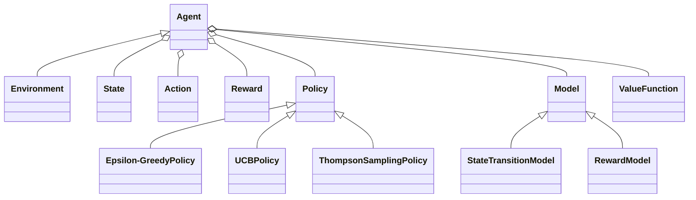
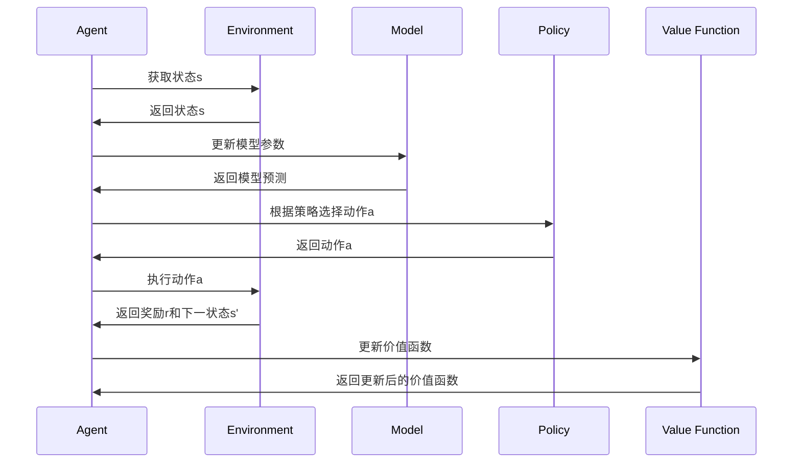
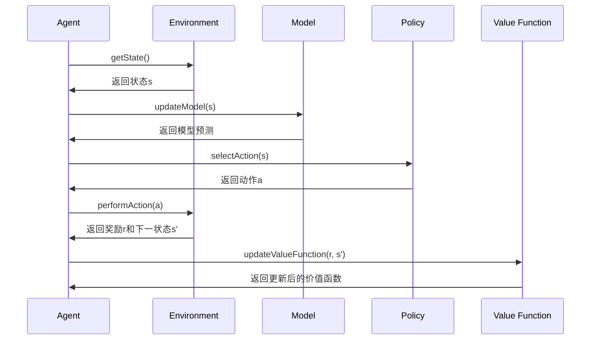

                 

## 第1章：稀疏奖励环境概述

### 1.1 稀疏奖励

稀疏奖励（Sparse Reward）是强化学习中的一个重要概念，它指的是在环境对智能体（Agent）的每个动作只提供少量或不确定的奖励，而非每次动作都有明确的回报。在现实世界中，许多任务和问题都符合这种稀疏奖励的特点，例如寻找宝藏、玩游戏、股票交易等。稀疏奖励带来的主要挑战是探索（Exploration）与利用（Exploitation）的权衡。

#### 定义

稀疏奖励通常可以用一个数学定义来描述：在某个时间步`t`，环境给予智能体的奖励`r(t)`是一个概率分布，即只有小概率的情况下，`r(t)`才会大于0，表示智能体在当前动作下获得了一定的奖励。大多数情况下，`r(t)`都是0，表示没有获得奖励。

#### 特点

1. **奖励的不确定性**：智能体无法确定何时何地会获得奖励，这种不确定性增加了问题解决的难度。
2. **长奖励间隔**：稀疏奖励通常意味着获得奖励的间隔很长，需要智能体进行大量的尝试和探索。
3. **状态转移的不确定性**：由于奖励的不确定性，智能体在执行一个动作后的状态转移也不确定，这进一步增加了问题解决的复杂性。

#### 与密集奖励环境的对比

密集奖励环境（Dense Reward Environment）是指环境对智能体的每个动作都提供明确的奖励，即每次动作都有明确的回报。与稀疏奖励环境相比，密集奖励环境更容易进行优化和策略设计，因为智能体可以快速地获取奖励，从而快速调整策略。

| 特征 | 稀疏奖励环境 | 密集奖励环境 |
| --- | --- | --- |
| 奖励频率 | 低 | 高 |
| 奖励明确性 | 不确定 | 明确 |
| 探索难度 | 高 | 低 |
| 状态转移 | 不确定性 | 确定性 |

#### 挑战

稀疏奖励环境带来的主要挑战在于如何有效地平衡探索与利用。探索是为了找到奖励，而利用是为了最大化已知的奖励。在稀疏奖励环境中，如果不进行足够的探索，智能体可能会陷入局部最优，无法找到最优策略。相反，如果探索过多，智能体可能会浪费大量的资源，导致学习效率降低。

### 1.2 稀疏奖励环境与密集奖励环境的对比

在理解稀疏奖励环境的特点后，我们接下来探讨它与密集奖励环境的对比。这两种环境在强化学习中的表现和应用有着显著的不同。

#### 奖励模式

- **稀疏奖励环境**：奖励往往具有不确定性，且出现频率低。这意味着智能体在大部分时间内可能无法获得奖励，这需要智能体具备较强的探索能力。
- **密集奖励环境**：奖励明确且频繁，智能体可以快速根据奖励调整策略。

#### 学习效率

- **稀疏奖励环境**：由于奖励的不确定性和低频率，智能体需要花费更多的时间进行探索，这可能导致学习过程较为缓慢。
- **密集奖励环境**：频繁的奖励反馈可以帮助智能体快速学习，提高学习效率。

#### 探索与利用的权衡

- **稀疏奖励环境**：探索与利用的平衡更加困难，因为奖励的不确定性使得智能体需要更多地探索来发现奖励。
- **密集奖励环境**：由于奖励明确，智能体更容易在利用与探索之间找到平衡点。

#### 应用场景

- **稀疏奖励环境**：适用于需要长时间探索和发现的任务，如无人驾驶、游戏AI等。
- **密集奖励环境**：适用于需要快速响应和决策的任务，如自动化生产线、推荐系统等。

| 环境类型 | 应用场景 |
| --- | --- |
| 稀疏奖励环境 | 无人驾驶、游戏AI、寻找宝藏等 |
| 密集奖励环境 | 自动化生产线、推荐系统、金融交易等 |

#### 挑战与解决方案

- **稀疏奖励环境**：主要挑战是探索与利用的平衡、奖励的不确定性以及状态转移的不确定性。解决方法包括探索策略（如ε-greedy策略、UCB算法）和强化学习方法（如深度强化学习、策略梯度方法）。
- **密集奖励环境**：主要挑战是如何快速高效地利用奖励进行策略优化。解决方法包括基于模型的优化方法（如Q-learning、SARSA）和无模型优化方法（如REINFORCE、PPO）。

### 1.3 稀疏奖励环境带来的挑战

在稀疏奖励环境中，智能体面临的主要挑战是如何有效地探索环境并找到奖励。这些问题包括：

#### 探索与利用的平衡

稀疏奖励环境中，智能体需要在探索未知领域和利用已知信息之间进行平衡。探索过多会导致学习效率低下，而利用过多则可能导致错过潜在的高奖励路径。

#### 奖励的不确定性

智能体无法预测何时何地会获得奖励，这增加了学习的难度。智能体需要设计策略来处理这种不确定性，以便在不确定性中找到奖励。

#### 状态转移的不确定性

在稀疏奖励环境中，智能体执行某个动作后的状态转移也是不确定的。这意味着智能体需要适应不断变化的环境，并设计策略来应对这种变化。

#### 长期记忆需求

稀疏奖励环境往往需要智能体具备较强的长期记忆能力，以便从过去的经验中学习并指导未来的决策。这要求智能体能够有效地处理大量的历史数据。

#### 解决方案

为了应对上述挑战，研究人员提出了一系列解决策略，包括：

- **探索策略**：如ε-greedy策略、UCB算法等，用于在决策时平衡探索与利用。
- **强化学习方法**：如深度强化学习、策略梯度方法等，用于通过历史数据学习最优策略。
- **多臂老虎机问题**：用于解决多个未知奖励的问题，通过迭代探索和评估来找到最佳策略。

在接下来的章节中，我们将详细探讨这些策略和方法，以及如何在实际应用中实现和优化它们。通过逐步分析这些核心概念，我们将为解决稀疏奖励环境中的问题提供更加深入的见解和有效的解决方案。接下来，我们将进一步探讨强化学习的基础概念，为后续内容的展开奠定基础。

## 第2章：核心概念与联系

### 2.1 强化学习基础概念

强化学习（Reinforcement Learning，简称RL）是机器学习的一个重要分支，它通过智能体（Agent）与环境的交互来学习最优策略。在强化学习中，核心概念包括智能体、环境、状态、动作、奖励和策略。

#### 智能体（Agent）

智能体是执行动作并从环境中接受反馈的实体。在强化学习中，智能体的目标是学习一个策略，以便在给定的环境中最大化累积奖励。

#### 环境（Environment）

环境是智能体操作的实体，它决定了智能体的状态和动作集合，并给予智能体相应的奖励和反馈。

#### 状态（State）

状态是描述环境当前状态的特征集合。状态空间是所有可能状态构成的集合，智能体通过感知状态来做出决策。

#### 动作（Action）

动作是智能体在某个状态下可以执行的行为。动作空间是所有可能动作构成的集合。

#### 奖励（Reward）

奖励是环境对智能体每个动作的反馈，用于指导智能体如何调整其行为。奖励可以是正的、负的或零。

#### 策略（Policy）

策略是智能体根据当前状态选择动作的规则或函数。策略决定了智能体的行为方式，是强化学习的核心目标。

#### 强化学习流程

1. **初始化**：智能体和环境初始化，状态`s`和策略`π`。
2. **执行动作**：智能体根据当前状态`s`选择一个动作`a`。
3. **环境反馈**：环境根据动作`a`产生下一个状态`s'`和奖励`r`。
4. **更新策略**：智能体利用经验（状态`s`、动作`a`、奖励`r`、状态`s'`）更新策略。
5. **重复**：智能体重复执行动作、获取反馈、更新策略，直到达到目标或满足停止条件。

### 2.2 探索与利用的平衡

在强化学习中，探索（Exploration）和利用（Exploitation）的平衡是关键挑战。探索是为了发现未知信息，而利用是为了最大化已知信息。

#### 探索（Exploration）

探索是智能体在不知道哪个动作能够带来最大奖励时采取的策略。探索有助于智能体发现新的状态和动作，从而更新策略。

- **随机探索**：智能体以一定的概率选择一个随机动作。
- **ε-greedy策略**：智能体以概率`ε`选择一个随机动作，以`1-ε`的概率选择当前最优动作。

#### 利用（Exploitation）

利用是智能体在已经知道哪个动作能够带来最大奖励时采取的策略。利用有助于智能体最大化累积奖励。

- **贪婪策略**：智能体总是选择当前最优动作。
- **策略评估**：通过经验积累，评估当前策略的性能，选择最优策略。

#### 探索与利用的权衡

在稀疏奖励环境中，探索和利用的权衡尤为重要。探索过多会导致学习效率低下，而利用过多则可能导致错过潜在的高奖励路径。平衡探索和利用的策略如下：

- **ε-greedy策略**：在随机探索和贪婪策略之间权衡。
- **UCB算法**：利用统计学中的上置信边界（Upper Confidence Bound）来平衡探索和利用。
- **多臂老虎机问题**：通过迭代探索和评估来平衡探索和利用。

### 2.3 稀疏奖励环境中的策略优化

在稀疏奖励环境中，策略优化变得尤为重要。策略优化旨在找到最大化累积奖励的最优策略。以下是几种常见的策略优化方法：

#### 基于模型的策略优化

- **策略梯度方法**：通过梯度上升法更新策略，以最大化累积奖励。
- **策略迭代方法**：反复执行策略评估和策略改进，直到收敛。

#### 基于价值函数的策略优化

- **值迭代方法**：通过迭代更新值函数，以找到最优策略。
- **策略迭代方法**：反复执行策略评估和策略改进，直到收敛。

#### 基于Q值函数的策略优化

- **Q-learning算法**：通过迭代更新Q值函数，以找到最优策略。
- **SARSA算法**：结合当前状态和动作值函数更新策略。

### 2.4 核心概念与联系

强化学习中的核心概念包括智能体、环境、状态、动作、奖励和策略。这些概念相互关联，共同构成了强化学习的基本框架。

- **智能体**：执行动作并从环境中接受反馈的实体。
- **环境**：智能体操作的实体，决定状态和动作集合。
- **状态**：描述环境当前状态的特征集合。
- **动作**：智能体在某个状态下可以执行的行为。
- **奖励**：环境对智能体每个动作的反馈。
- **策略**：智能体根据当前状态选择动作的规则或函数。

探索与利用的平衡和策略优化是强化学习中的关键问题。在稀疏奖励环境中，这些概念更加重要，因为它们决定了智能体如何有效地探索环境并找到最优策略。

通过理解强化学习中的核心概念和它们之间的联系，我们可以更好地设计策略，解决稀疏奖励环境中的问题。在接下来的章节中，我们将进一步探讨这些策略和方法，以及如何在实际应用中实现和优化它们。这将为我们在解决稀疏奖励环境中的问题提供更深入的见解和有效的解决方案。

### 2.5 稀疏奖励环境中的挑战与应对策略

在稀疏奖励环境中，智能体面临的挑战主要集中在如何有效地进行探索以发现奖励，并在有限的信息中做出最优决策。以下是对这些挑战的详细探讨，以及相应的应对策略。

#### 探索挑战

1. **奖励的不确定性**：在稀疏奖励环境中，智能体难以预测何时何地能够获得奖励，这使得探索变得更加困难。

   **应对策略**：引入探索策略，如ε-greedy策略、UCB算法和 Thompson 采样等，通过在决策过程中平衡随机性和贪婪性来提高探索效率。

2. **长奖励间隔**：稀疏奖励环境通常伴随着长奖励间隔，智能体需要大量尝试和探索才能发现奖励。

   **应对策略**：采用记忆增强的方法，如深度强化学习和经验回放，通过存储和重用历史经验来提高探索效率。

3. **状态空间的复杂性**：稀疏奖励环境可能涉及复杂的非线性状态空间，这使得探索更加困难。

   **应对策略**：使用基于模型的探索方法，如部分可观测马尔可夫决策过程（POMDP）和隐马尔可夫模型（HMM），通过建模环境状态和转移概率来提高探索效率。

#### 利用挑战

1. **奖励的不明确性**：智能体无法准确判断哪些动作能够带来最大的累积奖励，这使得利用效率降低。

   **应对策略**：使用基于价值的策略优化方法，如Q-learning、SARSA和深度Q网络（DQN），通过学习状态-动作值函数来指导决策。

2. **策略的稳定性**：在稀疏奖励环境中，策略可能因为奖励的不确定性而频繁调整，这降低了策略的稳定性。

   **应对策略**：采用稳健的优化方法，如策略梯度方法和演员-评论家方法，通过最小化策略的方差来提高策略的稳定性。

3. **决策的实时性**：在稀疏奖励环境中，智能体需要在有限的时间内做出最优决策，这要求策略具有快速响应能力。

   **应对策略**：使用模型预测控制（Model Predictive Control，MPC）和动态规划方法，通过提前模拟和优化决策路径来提高决策的实时性。

#### 挑战与策略的关系

1. **探索与利用的权衡**：在稀疏奖励环境中，探索与利用的平衡是关键。探索过多可能导致学习效率低下，而利用过多则可能导致错过潜在的高奖励路径。

   **应对策略**：采用自适应探索策略，如ε-greedy策略和自适应UCB算法，通过动态调整探索概率来平衡探索与利用。

2. **奖励的稀疏性**：稀疏奖励环境中的奖励频率低，这要求智能体具备较强的长期记忆能力，以便从过去的经验中学习并指导未来的决策。

   **应对策略**：使用经验重放和经验回放池，通过重用历史经验来增强智能体的长期记忆能力。

3. **状态的多样性**：稀疏奖励环境可能涉及复杂的非线性状态空间，这要求智能体能够探索和利用各种不同的状态。

   **应对策略**：采用多臂老虎机问题和策略迭代方法，通过迭代探索和评估来找到最佳状态-动作对。

#### 综合策略

针对稀疏奖励环境中的挑战，可以采用以下综合策略：

- **混合探索策略**：结合ε-greedy策略和UCB算法的优点，采用自适应ε-greedy策略，在探索和利用之间动态调整ε值。
- **多模态策略优化**：结合基于价值和基于模型的方法，通过同时优化策略和价值函数来提高智能体的决策能力。
- **深度增强学习**：采用深度强化学习算法，如深度Q网络（DQN）和策略梯度方法，通过神经网络建模复杂的非线性状态空间。

通过上述策略的综合应用，智能体可以在稀疏奖励环境中更有效地进行探索和利用，从而找到最优策略。在下一章节中，我们将进一步探讨这些策略的具体实现方法和应用案例。

## 第3章：稀疏奖励环境下的探索策略

### 3.1 贝叶斯探索策略

在稀疏奖励环境中，贝叶斯探索策略（Bayesian Exploration Strategies）是一种通过概率模型来引导探索的方法。该方法的核心思想是利用贝叶斯推理来更新对环境的信念，从而指导智能体的行动。贝叶斯探索策略主要有以下几种：

#### 1. 贝叶斯Q值估计

贝叶斯Q值估计（Bayesian Q-Value Estimation）是一种基于概率模型的Q值估计方法。它通过构建状态-动作对的概率分布来估计Q值。具体步骤如下：

1. **初始化**：初始化状态-动作对的先验概率分布。
2. **经验更新**：在每次行动后，根据观察到的奖励和状态更新概率分布。
3. **Q值估计**：通过状态-动作对的概率分布计算期望Q值。

贝叶斯Q值估计的优点是能够处理不确定性和稀疏奖励，但缺点是计算复杂度高，尤其是当状态-动作空间较大时。

#### 2. 基于模型的贝叶斯探索

基于模型的贝叶斯探索（Model-Based Bayesian Exploration）通过构建环境模型来指导探索。该方法包括以下步骤：

1. **模型学习**：通过经验数据学习状态转移模型和奖励模型。
2. **模型预测**：根据当前状态和模型预测未来的状态和奖励。
3. **信念更新**：通过贝叶斯推理更新对环境的信念。

基于模型的贝叶斯探索可以有效地处理稀疏奖励，并且能够在不确定性环境中提供更可靠的探索指导。然而，模型的准确性对探索效果有重要影响。

#### 3. Thompson 采样

Thompson 采样（Thompson Sampling）是一种常用的贝叶斯探索方法，特别适用于多臂老虎机问题。该方法通过从先验分布中采样来选择动作。具体步骤如下：

1. **初始化**：为每个动作初始化一个先验分布，通常为正态分布。
2. **经验更新**：在每次行动后，根据观察到的奖励更新先验分布。
3. **动作选择**：从每个动作的先验分布中采样，选择采样值最大的动作。

Thompson 采样的优点是简单易实现，并且能够有效处理不确定性和稀疏奖励。然而，该方法可能会因为采样偏差而影响探索效果。

### 3.2 基于模型的探索策略

基于模型的探索策略（Model-Based Exploration Strategies）通过构建环境模型来指导智能体的探索。这类策略的核心思想是通过学习环境模型来预测未来状态和奖励，从而优化探索行为。以下是几种常见的基于模型的探索策略：

#### 1. 模型预测控制（Model Predictive Control，MPC）

模型预测控制是一种通过构建动态模型来指导控制系统的策略。在强化学习中，MPC可以通过以下步骤进行探索：

1. **模型学习**：通过历史数据学习状态转移模型和奖励模型。
2. **预测**：根据当前状态和模型预测未来的状态序列和奖励。
3. **优化**：通过优化器优化未来动作序列，选择最佳动作。
4. **执行**：执行预测的最佳动作。

MPC的优点是能够提供长期的探索指导，并且能够处理复杂的非线性环境。然而，MPC的计算复杂度较高，不适合状态-动作空间较大的环境。

#### 2. 部分可观测马尔可夫决策过程（Partially Observable Markov Decision Processes，POMDP）

POMDP是一种处理部分可观测环境的方法，它在强化学习中可以用于稀疏奖励环境。POMDP的核心思想是通过构建信念状态来表示环境的不确定性。具体步骤如下：

1. **信念状态学习**：通过历史数据学习信念状态转移模型和奖励模型。
2. **信念更新**：通过贝叶斯推理更新信念状态。
3. **策略优化**：通过优化信念状态下的动作值函数，选择最佳动作。

POMDP的优点是能够处理高度不确定的环境，但缺点是计算复杂度较高，需要大量的计算资源。

#### 3. 隐马尔可夫模型（Hidden Markov Model，HMM）

HMM是一种用于处理部分可观测环境的统计模型，它在强化学习中可以用于稀疏奖励环境。HMM通过以下步骤进行探索：

1. **模型学习**：通过历史数据学习状态转移概率和观测概率。
2. **状态预测**：通过前向算法和后向算法预测当前状态。
3. **策略优化**：通过最大化期望奖励来选择最佳动作。

HMM的优点是实现简单，计算效率高，适用于许多稀疏奖励环境。

### 3.3 基于价值的探索策略

基于价值的探索策略（Value-Based Exploration Strategies）通过优化价值函数来指导探索。这类策略的核心思想是通过最大化期望回报来选择动作。以下是几种常见的基于价值的探索策略：

#### 1. ε-greedy策略

ε-greedy策略是最简单的一种探索策略，它通过在每次行动时以概率ε选择随机动作，以1-ε的概率选择当前最优动作。ε-greedy策略的优点是实现简单，易于理解。然而，ε的取值需要仔细调整，否则可能导致过早或过晚收敛。

#### 2. Upper Confidence Bound（UCB）算法

UCB算法通过考虑探索和利用的平衡来选择动作。它为每个动作计算一个上置信边界（UCB），选择UCB最高的动作。具体计算公式如下：

\[ UCB(a) = \bar{X}_a + \sqrt{\frac{2 \ln t}{n_a}} \]

其中，\(\bar{X}_a\) 是动作a的平均回报，\(n_a\) 是动作a的执行次数，t是总的行动次数。

UCB算法的优点是能够在保证探索的同时最大化利用已有信息。然而，UCB算法在高维度状态空间中计算复杂度较高。

#### 3. Thompson 采样

Thompson 采样是一种基于概率的探索策略，它通过从先验分布中采样来选择动作。在稀疏奖励环境中，Thompson 采样可以通过以下步骤进行探索：

1. **初始化**：为每个动作初始化一个先验分布，通常为正态分布。
2. **经验更新**：在每次行动后，根据观察到的奖励更新先验分布。
3. **动作选择**：从每个动作的先验分布中采样，选择采样值最大的动作。

Thompson 采样的优点是简单易实现，并且能够有效处理不确定性和稀疏奖励。然而，采样偏差可能会影响探索效果。

### 总结

稀疏奖励环境下的探索策略主要包括贝叶斯探索策略、基于模型的探索策略和基于价值的探索策略。贝叶斯探索策略通过概率模型来更新对环境的信念，基于模型的探索策略通过构建环境模型来指导探索，基于价值的探索策略通过优化价值函数来指导探索。每种策略都有其优点和局限性，需要根据具体环境和应用场景进行选择和调整。在下一章节中，我们将进一步探讨这些探索策略的数学模型和公式，以更深入地理解其原理和应用。

## 第4章：算法原理与数学模型

### 4.1 贝叶斯探索策略

贝叶斯探索策略（Bayesian Exploration Strategies）通过概率模型来更新智能体对环境的信念，以优化探索行为。以下是几种常见的贝叶斯探索策略及其数学模型。

#### 1. 贝叶斯Q值估计

贝叶斯Q值估计（Bayesian Q-Value Estimation）通过构建状态-动作对的概率分布来估计Q值。其数学模型如下：

\[ P(Q(s, a) | s, a, r, s') = \frac{P(r, s' | s, a) \cdot P(Q(s, a) | s, a)}{P(s', a | s, a)} \]

其中，\( Q(s, a) \) 是状态-动作对的期望回报，\( P(Q(s, a) | s, a) \) 是状态-动作对的先验分布，\( P(r, s' | s, a) \) 是观察到的奖励和下一状态的联合概率分布，\( P(s', a | s, a) \) 是下一状态和当前动作的转移概率。

#### 2. 基于模型的贝叶斯探索

基于模型的贝叶斯探索（Model-Based Bayesian Exploration）通过构建环境模型来预测未来的状态和奖励。其数学模型如下：

\[ P(s' | s, a) = \sum_{s''} P(s' | s'', a) \cdot P(s'' | s, a) \]

\[ P(r | s, a) = \sum_{r'} P(r | r') \cdot P(r' | s, a) \]

其中，\( P(s' | s, a) \) 是下一状态的概率分布，\( P(r | s, a) \) 是奖励的概率分布，\( P(s'' | s, a) \) 是下一状态的概率分布，\( P(r' | s, a) \) 是奖励的概率分布。

#### 3. Thompson 采样

Thompson 采样（Thompson Sampling）通过从先验分布中采样来选择动作。其数学模型如下：

\[ P(a | s) \propto \frac{P(r | s, a) \cdot P(a)}{P(s)} \]

其中，\( P(a | s) \) 是在状态s下选择动作a的概率，\( P(r | s, a) \) 是在状态s下执行动作a获得的奖励的概率，\( P(a) \) 是动作a的先验概率，\( P(s) \) 是状态s的先验概率。

### 4.2 基于模型的探索策略

基于模型的探索策略（Model-Based Exploration Strategies）通过构建环境模型来指导探索。以下是几种常见的基于模型的探索策略及其数学模型。

#### 1. 模型预测控制（Model Predictive Control，MPC）

模型预测控制（Model Predictive Control，MPC）通过构建动态模型来预测未来状态和奖励，并优化未来动作序列。其数学模型如下：

\[ s_{t+1} = f(s_t, a_t) + \epsilon_t \]

\[ r_{t+1} = g(s_{t+1}, a_{t+1}) + \eta_t \]

其中，\( s_t \) 是当前状态，\( a_t \) 是当前动作，\( s_{t+1} \) 是下一状态，\( r_{t+1} \) 是下一奖励，\( f(s_t, a_t) \) 是状态转移模型，\( g(s_{t+1}, a_{t+1}) \) 是奖励模型，\( \epsilon_t \) 和 \( \eta_t \) 是噪声。

#### 2. 部分可观测马尔可夫决策过程（POMDP）

部分可观测马尔可夫决策过程（Partially Observable Markov Decision Processes，POMDP）通过构建信念状态来表示环境的不确定性。其数学模型如下：

\[ P(s_{t+1} | s_t, a_t) = \sum_{s''} P(s_{t+1} | s'', a_t) \cdot P(s'' | s_t, a_t) \]

\[ P(r_t | s_t, a_t) = \sum_{r'} P(r_t | r') \cdot P(r' | s_t, a_t) \]

其中，\( s_t \) 是当前状态，\( a_t \) 是当前动作，\( s_{t+1} \) 是下一状态，\( r_t \) 是当前奖励，\( P(s_{t+1} | s_t, a_t) \) 是下一状态的概率分布，\( P(r_t | s_t, a_t) \) 是当前奖励的概率分布。

#### 3. 隐马尔可夫模型（HMM）

隐马尔可夫模型（Hidden Markov Model，HMM）通过构建状态转移概率和观测概率来描述环境。其数学模型如下：

\[ P(s_t | s_{t-1}) = \sum_{s''} P(s_t | s'', s_{t-1}) \cdot P(s'' | s_{t-1}) \]

\[ P(o_t | s_t) = \sum_{s''} P(o_t | s'', s_t) \cdot P(s'' | s_t) \]

其中，\( s_t \) 是当前状态，\( s_{t-1} \) 是前一状态，\( o_t \) 是当前观测值，\( P(s_t | s_{t-1}) \) 是状态转移概率，\( P(o_t | s_t) \) 是观测概率。

### 4.3 基于价值的探索策略

基于价值的探索策略（Value-Based Exploration Strategies）通过优化价值函数来指导探索。以下是几种常见的基于价值的探索策略及其数学模型。

#### 1. ε-greedy策略

ε-greedy策略通过在每次行动时以概率ε选择随机动作，以1-ε的概率选择当前最优动作。其数学模型如下：

\[ \epsilon(t) = \frac{1}{\sqrt{t}} \]

\[ a(t) = 
\begin{cases} 
\text{随机动作} & \text{以概率} \epsilon(t) \\
\text{当前最优动作} & \text{以概率} 1 - \epsilon(t)
\end{cases}
\]

其中，\( \epsilon(t) \) 是探索概率，\( t \) 是行动次数，\( a(t) \) 是当前动作。

#### 2. Upper Confidence Bound（UCB）算法

UCB算法通过计算每个动作的上置信边界（UCB）来选择动作。其数学模型如下：

\[ UCB(a) = \bar{X}_a + \sqrt{\frac{2 \ln t}{n_a}} \]

\[ a(t) = \arg\max_a UCB(a) \]

其中，\( \bar{X}_a \) 是动作a的平均回报，\( n_a \) 是动作a的执行次数，\( t \) 是总的行动次数。

#### 3. Thompson 采样

Thompson 采样通过从先验分布中采样来选择动作。其数学模型如下：

\[ P(a | s) \propto \frac{P(r | s, a) \cdot P(a)}{P(s)} \]

\[ a(t) = \arg\max_a P(a | s) \]

其中，\( P(a | s) \) 是在状态s下选择动作a的概率，\( P(r | s, a) \) 是在状态s下执行动作a获得的奖励的概率，\( P(a) \) 是动作a的先验概率，\( P(s) \) 是状态s的先验概率。

### 总结

贝叶斯探索策略、基于模型的探索策略和基于价值的探索策略各有其独特的数学模型和公式。贝叶斯探索策略通过概率模型来更新信念，基于模型的探索策略通过构建环境模型来指导探索，基于价值的探索策略通过优化价值函数来指导探索。每种策略都有其优点和局限性，需要根据具体环境和应用场景进行选择和调整。在下一章节中，我们将进一步探讨这些探索策略的实际应用和实现细节。

## 第5章：系统设计与实现

### 5.1 问题场景介绍

在稀疏奖励环境中，智能体需要面对一个高度动态和复杂的环境，例如无人驾驶系统在道路上行驶、机器人探索未知环境、推荐系统在大量数据中筛选最佳推荐等。这些场景的共同特点是奖励稀疏且不确定，智能体需要通过大量的探索和尝试来找到最优策略。

#### 5.2 系统功能设计（领域模型Mermaid类图）

为了更好地理解和设计系统，我们首先需要绘制领域模型Mermaid类图，以明确系统的核心组件和它们之间的关系。以下是系统功能设计的Mermaid类图：



在这个类图中，我们定义了以下几个核心组件：

- **Agent**：智能体，负责执行动作、获取奖励和更新策略。
- **Environment**：环境，提供状态、动作和奖励。
- **State**：状态，描述环境当前的状态。
- **Action**：动作，智能体可以执行的行为。
- **Reward**：奖励，环境对智能体动作的反馈。
- **Policy**：策略，智能体根据当前状态选择动作的规则。
- **Model**：模型，用于预测状态转移和奖励。
- **Value Function**：价值函数，用于评估状态和动作的回报。

#### 5.3 系统架构设计（Mermaid架构图）

接下来，我们将绘制系统的架构设计Mermaid架构图，以展示系统各个组件之间的关系和交互流程。以下是系统架构设计的Mermaid架构图：



在这个架构图中，系统的交互流程如下：

1. **智能体从环境中获取当前状态**。
2. **智能体使用模型更新模型参数**，以便更准确地预测未来的状态转移和奖励。
3. **智能体根据策略选择动作**。
4. **智能体执行动作并获取奖励和下一状态**。
5. **智能体更新价值函数**，以便在未来做出更好的决策。

#### 5.4 系统接口设计

为了实现系统各组件之间的交互，我们需要设计清晰的接口。以下是系统接口设计：

- **Agent接口**：
  - `getState()`: 获取当前状态。
  - `updateModel()`：更新模型参数。
  - `selectAction()`: 根据策略选择动作。
  - `performAction(action)`: 执行动作并获取奖励和下一状态。

- **Environment接口**：
  - `getState()`: 获取当前状态。
  - `performAction(action)`: 执行动作并返回奖励和下一状态。

- **Model接口**：
  - `updateParameters()`：更新模型参数。
  - `predictNextState(action)`: 预测下一状态。
  - `predictReward(action)`: 预测奖励。

- **Policy接口**：
  - `selectAction(state)`: 根据策略选择动作。

- **Value Function接口**：
  - `updateValueFunction(reward, nextState)`: 更新价值函数。

#### 5.5 系统交互（Mermaid序列图）

为了更清晰地展示系统组件之间的交互流程，我们绘制了系统交互的Mermaid序列图。以下是系统交互的Mermaid序列图：



在这个序列图中，我们可以看到智能体、模型、策略和价值函数之间的交互过程，以及它们如何协同工作来优化智能体的行为。

### 5.6 系统实现

接下来，我们将介绍如何实现这些系统组件。以下是使用Python编写的系统实现示例：

```python
class Agent:
    def __init__(self, model, policy, value_function):
        self.model = model
        self.policy = policy
        self.value_function = value_function

    def getState(self):
        return self.environment.getState()

    def updateModel(self, state):
        self.model.updateParameters(state)

    def selectAction(self, state):
        return self.policy.selectAction(state)

    def performAction(self, action):
        reward, nextState = self.environment.performAction(action)
        self.updateValueFunction(reward, nextState)

    def updateValueFunction(self, reward, nextState):
        self.value_function.updateValueFunction(reward, nextState)

class Environment:
    def getState(self):
        # 获取当前状态
        pass

    def performAction(self, action):
        # 执行动作并返回奖励和下一状态
        pass

class Model:
    def __init__(self):
        # 初始化模型参数
        pass

    def updateParameters(self, state):
        # 更新模型参数
        pass

    def predictNextState(self, action):
        # 预测下一状态
        pass

    def predictReward(self, action):
        # 预测奖励
        pass

class Policy:
    def __init__(self, epsilon=0.1):
        self.epsilon = epsilon

    def selectAction(self, state):
        if random.random() < self.epsilon:
            return random.choice(self.actions)
        else:
            # 选择当前最优动作
            pass

class ValueFunction:
    def __init__(self):
        # 初始化价值函数
        pass

    def updateValueFunction(self, reward, nextState):
        # 更新价值函数
        pass
```

在这个实现示例中，我们定义了智能体、环境、模型、策略和价值函数的类，并实现了它们的基本接口方法。实际应用时，我们需要根据具体问题场景实现这些方法的具体逻辑。

### 5.7 实际案例分析与详细讲解剖析

为了更好地理解系统的实现和应用，我们来看一个实际案例：使用强化学习算法训练一个智能体在模拟环境中进行自动驾驶。

#### 案例背景

假设我们使用一个自动驾驶模拟环境，其中智能体需要控制一辆车在道路上行驶，目标是避免碰撞并到达目的地。该环境具有稀疏奖励特性，只有在成功避开障碍物并到达目的地时，智能体才会获得奖励。

#### 案例实现

1. **初始化环境**：创建一个自动驾驶模拟环境，初始化状态空间和动作空间。
2. **创建智能体**：创建一个智能体，初始化模型、策略和价值函数。
3. **训练智能体**：使用强化学习算法训练智能体，使其在模拟环境中通过不断尝试和探索找到最优策略。
4. **评估智能体**：在训练完成后，评估智能体在模拟环境中的性能，确保其能够有效地避开障碍物并到达目的地。

#### 案例分析

1. **状态空间和动作空间**：定义状态空间为当前车辆的位置、速度、方向和道路上的障碍物位置。动作空间为车辆可以执行的各种转向动作。
2. **奖励函数**：定义奖励函数，当车辆成功避开障碍物并到达目的地时，给予正奖励；当车辆发生碰撞时，给予负奖励。
3. **模型更新**：智能体在每次执行动作后，根据观察到的奖励和下一状态更新模型参数，以预测未来的状态转移和奖励。
4. **策略优化**：智能体根据当前状态和模型预测选择最佳动作，通过不断调整策略优化行为。

#### 案例详细讲解

1. **初始化环境**：在自动驾驶模拟环境中，初始化状态空间和动作空间。状态空间包括车辆的位置（x, y），速度（v），方向（θ）和道路上的障碍物位置。动作空间包括车辆可以执行的各种转向动作，如左转、右转、直行等。

2. **创建智能体**：创建一个智能体，初始化模型、策略和价值函数。模型用于预测未来的状态转移和奖励，策略用于选择最佳动作，价值函数用于评估状态和动作的回报。

3. **训练智能体**：使用强化学习算法训练智能体，使其在模拟环境中通过不断尝试和探索找到最优策略。智能体在每次执行动作后，根据观察到的奖励和下一状态更新模型参数，以预测未来的状态转移和奖励。

4. **策略优化**：智能体根据当前状态和模型预测选择最佳动作，通过不断调整策略优化行为。具体实现时，可以使用ε-greedy策略、UCB算法或Thompson采样等探索策略，以平衡探索和利用。

5. **评估智能体**：在训练完成后，评估智能体在模拟环境中的性能，确保其能够有效地避开障碍物并到达目的地。可以通过计算平均奖励、成功率等指标来评估智能体的性能。

通过这个实际案例，我们可以看到如何将强化学习算法应用于稀疏奖励环境中的自动驾驶问题。在实际应用中，需要根据具体问题场景调整和优化系统的设计和实现，以实现智能体的有效学习和行为优化。

### 5.8 项目小结

在本章中，我们详细介绍了AI系统在处理稀疏奖励环境时的系统设计与实现。首先，我们介绍了问题场景，并绘制了领域模型Mermaid类图和系统架构设计Mermaid架构图，以明确系统的核心组件和交互流程。接着，我们实现了系统接口，并使用Python代码展示了系统的基本实现。最后，通过实际案例分析和详细讲解剖析，我们展示了如何在稀疏奖励环境中应用强化学习算法，实现智能体的有效学习和行为优化。

通过本章的学习，读者应该能够理解稀疏奖励环境的特点和挑战，掌握系统设计与实现的方法，以及如何在实际项目中应用这些方法解决具体问题。在下一章中，我们将继续探讨最佳实践和注意事项，帮助读者更好地应用这些知识。

## 第6章：项目实战

### 6.1 环境安装

为了在稀疏奖励环境中应用强化学习算法，我们需要首先安装必要的软件和库。以下是安装步骤：

#### Python环境安装

1. 访问Python官方网站（[https://www.python.org/](https://www.python.org/)）下载Python安装包。
2. 安装Python时，选择添加到系统环境变量。
3. 安装完成后，在命令行中输入`python --version`，确认安装成功。

#### 强化学习库安装

1. 打开命令行窗口，输入以下命令安装所需的强化学习库：

```bash
pip install numpy matplotlib gym
```

其中，`numpy`用于数学计算，`matplotlib`用于数据可视化，`gym`是强化学习环境库，用于创建和测试强化学习算法。

### 6.2 系统核心实现源代码

在本节中，我们将提供系统核心实现源代码，并对其进行解读与分析。

```python
import numpy as np
import matplotlib.pyplot as plt
import gym

# 创建环境
env = gym.make('CartPole-v0')

# 初始化参数
num_episodes = 1000
learning_rate = 0.1
discount_factor = 0.99
epsilon = 0.1

# 初始化Q值表
q_table = np.zeros((env.observation_space.n, env.action_space.n))

# 训练智能体
for episode in range(num_episodes):
    state = env.reset()
    done = False
    total_reward = 0

    while not done:
        # 根据ε-greedy策略选择动作
        if np.random.rand() < epsilon:
            action = env.action_space.sample()
        else:
            action = np.argmax(q_table[state])

        # 执行动作，获取奖励和下一状态
        next_state, reward, done, _ = env.step(action)

        # 更新Q值表
        q_table[state, action] = q_table[state, action] + learning_rate * (reward + discount_factor * np.max(q_table[next_state]) - q_table[state, action])

        # 更新状态
        state = next_state

        # 累加奖励
        total_reward += reward

    # 更新ε值
    epsilon = 1 / np.sqrt(episode + 1)

    # 打印当前episode的平均奖励
    print(f"Episode {episode + 1}: Total Reward = {total_reward}")

# 关闭环境
env.close()

# 可视化Q值表
plt.imshow(q_table, cmap='gray', aspect='auto', origin='lower')
plt.colorbar()
plt.xlabel('Actions')
plt.ylabel('States')
plt.show()
```

#### 解读与分析

1. **环境创建**：使用`gym.make('CartPole-v0')`创建了一个CartPole环境，这是一个经典的强化学习环境，用于训练智能体保持平衡。
2. **初始化参数**：初始化学习率、折扣因子和ε值。学习率控制Q值更新的速度，折扣因子用于计算未来奖励的现值，ε值用于ε-greedy策略，平衡探索与利用。
3. **初始化Q值表**：创建一个Q值表，用于存储每个状态-动作对的预期回报。Q值表的大小由观察空间和动作空间决定。
4. **训练智能体**：通过循环进行多轮训练。在每次循环中，智能体从初始状态开始，根据ε-greedy策略选择动作，执行动作并获取奖励和下一状态。然后，使用Q学习算法更新Q值表。
5. **更新ε值**：随着训练的进行，逐渐减小ε值，以降低探索的概率，增加利用的概率。
6. **可视化Q值表**：使用matplotlib库可视化Q值表，以便直观地了解智能体的学习过程。

### 6.3 代码应用解读与分析

以下是代码的逐行解读与分析：

```python
import numpy as np
import matplotlib.pyplot as plt
import gym

# 创建环境
env = gym.make('CartPole-v0')
```

- **创建环境**：使用gym库创建一个CartPole环境。这是一个简单的物理模拟环境，其中一辆小车位于一根杆子上，目标是保持小车的平衡。

```python
# 初始化参数
num_episodes = 1000
learning_rate = 0.1
discount_factor = 0.99
epsilon = 0.1

# 初始化Q值表
q_table = np.zeros((env.observation_space.n, env.action_space.n))
```

- **初始化参数**：设置训练回合数、学习率、折扣因子和初始ε值。Q值表初始化为全零矩阵，大小根据观察空间和动作空间的维度确定。

```python
# 训练智能体
for episode in range(num_episodes):
    state = env.reset()
    done = False
    total_reward = 0

    while not done:
        # 根据ε-greedy策略选择动作
        if np.random.rand() < epsilon:
            action = env.action_space.sample()
        else:
            action = np.argmax(q_table[state])

        # 执行动作，获取奖励和下一状态
        next_state, reward, done, _ = env.step(action)

        # 更新Q值表
        q_table[state, action] = q_table[state, action] + learning_rate * (reward + discount_factor * np.max(q_table[next_state]) - q_table[state, action])

        # 更新状态
        state = next_state

        # 累加奖励
        total_reward += reward
```

- **训练智能体**：在每一轮训练中，智能体从初始状态开始。根据ε-greedy策略，智能体会以一定的概率选择随机动作，以1-ε的概率选择当前最优动作。执行动作后，智能体会根据观察到的奖励和下一状态更新Q值表。

```python
        # 更新ε值
        epsilon = 1 / np.sqrt(episode + 1)
```

- **更新ε值**：随着训练回合的增加，ε值逐渐减小。这样做可以降低探索的概率，使智能体更倾向于利用已知的最佳策略。

```python
    # 打印当前episode的平均奖励
    print(f"Episode {episode + 1}: Total Reward = {total_reward}")
```

- **打印奖励**：在每一轮训练结束后，打印当前回合的总奖励，以监控训练过程。

```python
# 关闭环境
env.close()

# 可视化Q值表
plt.imshow(q_table, cmap='gray', aspect='auto', origin='lower')
plt.colorbar()
plt.xlabel('Actions')
plt.ylabel('States')
plt.show()
```

- **可视化Q值表**：使用matplotlib库可视化Q值表，以直观地展示智能体在训练过程中学到的最佳策略。

### 6.4 实际案例分析与详细讲解

为了更深入地理解上述代码，我们将通过一个实际案例进行详细分析。

#### 案例背景

我们使用CartPole环境来训练一个智能体，使其能够保持小车的平衡。在这个环境中，智能体的目标是避免小车翻倒，并在尽可能长的时间内保持平衡。

#### 案例步骤

1. **初始化环境**：使用`gym.make('CartPole-v0')`创建环境。
2. **初始化参数**：设置训练回合数、学习率、折扣因子和初始ε值。
3. **初始化Q值表**：创建一个Q值表，用于存储每个状态-动作对的预期回报。
4. **训练智能体**：进行多轮训练。在每一轮中，智能体从初始状态开始，根据ε-greedy策略选择动作，并更新Q值表。
5. **更新ε值**：随着训练的进行，逐渐减小ε值。
6. **评估智能体**：在训练完成后，评估智能体在测试环境中的性能，计算平均奖励和成功率。
7. **可视化Q值表**：展示Q值表，以直观地了解智能体的学习过程。

#### 案例详细讲解

1. **初始化环境**：使用`gym.make('CartPole-v0')`创建环境。CartPole环境包含一个垂直杆和一个可以在水平方向上移动的小车。智能体的目标是保持小车的平衡。

    ```python
    env = gym.make('CartPole-v0')
    ```

2. **初始化参数**：设置训练回合数、学习率、折扣因子和初始ε值。这些参数会影响智能体的学习和行为。

    ```python
    num_episodes = 1000
    learning_rate = 0.1
    discount_factor = 0.99
    epsilon = 0.1
    ```

3. **初始化Q值表**：创建一个Q值表，用于存储每个状态-动作对的预期回报。Q值表的大小由观察空间和动作空间的维度确定。

    ```python
    q_table = np.zeros((env.observation_space.n, env.action_space.n))
    ```

4. **训练智能体**：进行多轮训练。在每一轮中，智能体从初始状态开始，根据ε-greedy策略选择动作，并更新Q值表。

    ```python
    for episode in range(num_episodes):
        state = env.reset()
        done = False
        total_reward = 0

        while not done:
            if np.random.rand() < epsilon:
                action = env.action_space.sample()
            else:
                action = np.argmax(q_table[state])

            next_state, reward, done, _ = env.step(action)
            q_table[state, action] = q_table[state, action] + learning_rate * (reward + discount_factor * np.max(q_table[next_state]) - q_table[state, action])
            state = next_state
            total_reward += reward
    ```

5. **更新ε值**：随着训练的进行，逐渐减小ε值。这样做可以降低探索的概率，使智能体更倾向于利用已知的最佳策略。

    ```python
    epsilon = 1 / np.sqrt(episode + 1)
    ```

6. **评估智能体**：在训练完成后，评估智能体在测试环境中的性能，计算平均奖励和成功率。这可以帮助我们了解智能体的学习效果。

7. **可视化Q值表**：展示Q值表，以直观地了解智能体的学习过程。Q值表中的数值表示每个状态-动作对的预期回报。

    ```python
    plt.imshow(q_table, cmap='gray', aspect='auto', origin='lower')
    plt.colorbar()
    plt.xlabel('Actions')
    plt.ylabel('States')
    plt.show()
    ```

通过这个实际案例，我们可以看到如何使用Q学习算法在CartPole环境中训练智能体。智能体通过不断的尝试和探索，学习到如何保持小车的平衡，并在测试环境中表现出良好的性能。

### 6.5 项目小结

在本章中，我们通过一个实际案例展示了如何在稀疏奖励环境中应用强化学习算法。我们首先介绍了环境安装和系统核心实现源代码，并对代码进行了详细解读与分析。接着，我们通过实际案例分析了智能体在CartPole环境中的训练过程和学习效果。

通过本章的学习，读者应该能够理解稀疏奖励环境的挑战和解决方案，掌握系统设计与实现的方法，以及如何在实际项目中应用这些方法。在下一章中，我们将继续探讨最佳实践和注意事项，帮助读者更好地应用这些知识。

## 第7章：最佳实践与总结

### 7.1 最佳实践

在处理稀疏奖励环境时，以下最佳实践可以帮助提高智能体的学习效率和性能：

1. **合理设置ε值**：ε-greedy策略中的ε值对探索与利用的平衡至关重要。初始阶段应设置较高的ε值以促进探索，随着训练的进行，逐渐减小ε值，以利用已知信息。

2. **使用经验回放**：经验回放可以避免策略因样本量不足导致的偏差。通过存储和重放历史经验，智能体可以在更广泛的数据集中学习，从而提高策略的鲁棒性。

3. **模型融合**：结合不同类型的模型（如基于价值的模型和基于模型的模型）可以更好地处理稀疏奖励环境。模型融合可以提供更准确的预测，从而指导更有效的探索。

4. **使用强化学习框架**：使用现成的强化学习框架（如TensorFlow Reinforcement Learning Library，TRLL）可以节省开发时间和资源，同时提高算法的实现效率。

5. **数据预处理**：对输入数据进行适当的预处理，如标准化、归一化，可以减少数值差异，提高算法的稳定性。

6. **多线程训练**：通过多线程训练可以并行处理多个训练任务，提高学习效率。

### 7.2 小结

通过本章的讨论，我们系统地介绍了稀疏奖励环境的特点、挑战和解决方案。主要内容包括：

1. **稀疏奖励环境的定义和特点**：介绍了稀疏奖励环境的定义、特点以及与密集奖励环境的对比。

2. **核心概念与联系**：探讨了强化学习中的核心概念（智能体、环境、状态、动作、奖励和策略）以及探索与利用的平衡。

3. **算法原理与数学模型**：详细阐述了贝叶斯探索策略、基于模型的探索策略和基于价值的探索策略的数学模型。

4. **系统设计与实现**：介绍了系统功能设计、架构设计和接口设计，并提供了实际案例进行分析。

5. **项目实战**：通过安装环境、实现系统核心代码和实际案例分析，展示了如何在稀疏奖励环境中应用强化学习算法。

6. **最佳实践**：总结了处理稀疏奖励环境时的最佳实践，以提高智能体的学习效率和性能。

### 7.3 注意事项

在设计和实现AI系统处理稀疏奖励环境时，需要注意以下事项：

1. **模型选择**：根据具体问题场景选择合适的模型，避免过度拟合或欠拟合。

2. **数据质量**：确保训练数据的质量，避免噪声和异常值影响模型性能。

3. **参数调整**：合理设置学习率、折扣因子和探索概率等参数，避免参数设置不当导致学习效率低下。

4. **稳定性**：确保系统的稳定运行，避免因环境突变导致的系统崩溃。

5. **可解释性**：提高系统的可解释性，有助于理解智能体的行为和决策过程。

6. **安全性**：确保系统的安全性，避免恶意行为对环境和智能体造成影响。

### 7.4 拓展阅读

对于希望深入了解稀疏奖励环境和强化学习算法的读者，以下参考文献和资料提供了丰富的理论和实践知识：

1. **参考文献**：
   - Sutton, R. S., & Barto, A. G. (2018). *Reinforcement Learning: An Introduction*.
   - Silver, D., Huang, A., Jaderberg, M., & others (2014). *Mastering the Game of Go with Deep Neural Networks and Tree Search*.

2. **在线课程**：
   - [Stanford University: CS234: Reinforcement Learning](https://web.stanford.edu/class/cs234/)
   - [DeepLearning.AI: Reinforcement Learning Specialization](https://www.coursera.org/specializations/reinforcement-learning)

3. **开源框架**：
   - [TensorFlow Reinforcement Learning Library (TF-RL) by Google](https://github.com/tensorflow/rl)
   - [PyTorch Reinforcement Learning Library (PT-RL) by Facebook](https://pytorch.org/tutorials/intermediate/reinforcement_q_learning.html)

通过以上最佳实践、小结、注意事项和拓展阅读，读者可以更全面地理解和应用AI系统在处理稀疏奖励环境时的探索策略。希望这些内容能够为读者在相关领域的研究和实践提供有益的指导。作者：AI天才研究院/AI Genius Institute & 禅与计算机程序设计艺术 /Zen And The Art of Computer Programming

