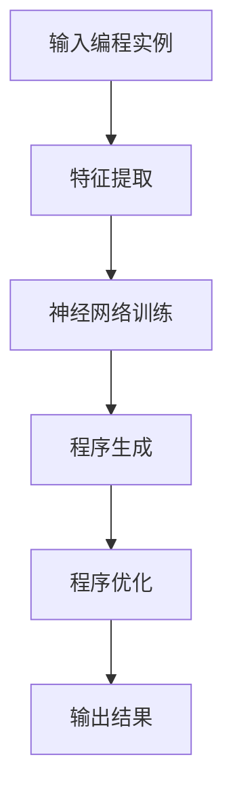
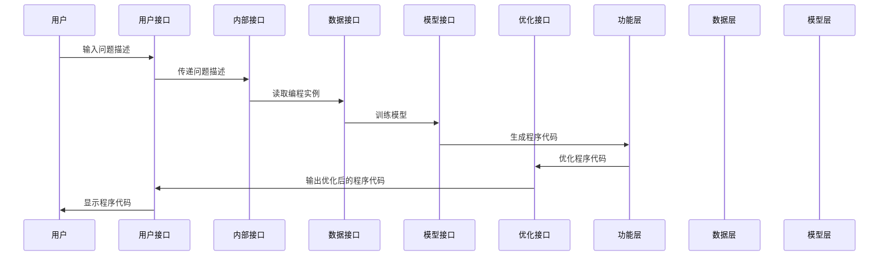

                 


## 《AI自动推理系统中神经程序合成的创新应用》

### 关键词
- 自动推理系统
- 神经程序合成
- 人工智能
- 神经网络
- 算法原理
- 系统架构
- 项目实战

### 摘要
本文探讨了AI自动推理系统中神经程序合成的创新应用。首先，介绍了自动推理系统和神经程序合成的基本概念、背景及其关系。随后，深入分析了神经程序合成的原理、特性、优势与局限，并通过对比传统编程和深度学习，进一步阐述了神经程序合成的独特地位。接着，详细讲解了神经程序合成算法的数学模型、实现流程和应用案例。随后，文章通过一个具体的系统设计与架构方案，展示了神经程序合成在实际项目中的应用。最后，通过实际案例分析和最佳实践总结，总结了神经程序合成的优势和挑战，并提供了拓展阅读资源。

---

# 目录大纲

## 第一部分：引言

### 第1章：背景介绍与核心概念
#### 1.1.1 自动推理系统概述
#### 1.1.2 神经程序合成
#### 1.1.3 自动推理与神经程序合成的关系
#### 1.1.4 神经程序合成的创新应用领域

## 第二部分：核心概念与联系

### 第2章：神经程序合成原理
#### 2.1.1 神经程序合成的基本原理
#### 2.1.2 神经程序合成的核心特性
#### 2.1.3 神经程序合成与传统编程对比
#### 2.1.4 神经程序合成与深度学习对比
#### 2.1.5 神经程序合成在自动推理系统中的应用

### 第3章：神经程序合成ER实体关系图
#### 3.1.1 神经程序合成实体关系概述
#### 3.1.2 神经程序合成实体关系图架构

## 第三部分：算法原理讲解

### 第4章：神经程序合成算法原理
#### 4.1.1 神经程序合成算法概述
#### 4.1.2 神经程序合成算法的数学模型
#### 4.1.3 神经程序合成算法流程图
#### 4.1.4 神经程序合成算法举例说明

## 第四部分：系统分析与架构设计

### 第5章：系统功能设计与架构设计
#### 5.1.1 问题描述与项目介绍
#### 5.1.2 系统功能设计
#### 5.1.3 系统架构设计
#### 5.1.4 系统接口设计
#### 5.1.5 系统交互设计

## 第五部分：项目实战

### 第6章：环境安装与系统核心实现
#### 6.1.1 环境安装
#### 6.1.2 系统核心实现
#### 6.1.3 代码应用解读
#### 6.1.4 实际案例分析与讲解

### 第7章：实际案例分析与讲解
#### 7.1.1 实际案例介绍
#### 7.1.2 案例分析
#### 7.1.3 案例讲解
#### 7.1.4 结论与反思

## 第六部分：最佳实践与拓展阅读

### 第8章：最佳实践
#### 8.1.1 最佳实践总结
#### 8.1.2 最佳实践建议

### 第9章：小结与拓展阅读
#### 9.1.1 小结
#### 9.1.2 拓展阅读

---

### 第1章：背景介绍与核心概念

#### 1.1.1 自动推理系统概述

自动推理系统（Automatic Reasoning System）是指能够通过计算机程序自动发现逻辑关系、证明定理或求解问题的系统。它是人工智能领域的重要组成部分，旨在实现机器的推理能力，从而在科学计算、问题求解、知识发现等多个领域发挥作用。

**定义与分类**：自动推理系统可以分类为基于规则的推理系统、基于模型的推理系统和基于概率的推理系统等。基于规则的推理系统通过预定义的规则库来推导结论；基于模型的推理系统则使用数学模型或逻辑模型来进行推理；基于概率的推理系统则使用概率统计方法来处理不确定性问题。

**发展历程**：自动推理系统的研究始于20世纪50年代，当时的逻辑理论家（Logic Theorist）被认为是第一个自动推理程序。随着计算机技术的发展，自动推理系统经历了从基于规则的方法到基于模型和概率的方法的转变。近年来，随着深度学习的崛起，自动推理系统也结合了神经网络的方法，进一步提高了推理能力和效率。

**重要性**：自动推理系统在人工智能领域具有重要的地位，它不仅能够处理复杂的问题，还能为其他人工智能应用提供基础支持。例如，自动推理系统在自然语言处理、计算机视觉、机器学习等领域都有着广泛的应用。

#### 1.1.2 神经程序合成

神经程序合成（Neural Program Synthesis）是一种利用神经网络自动生成程序的方法。它通过训练神经网络来识别编程模式，从而能够生成解决特定问题的程序。

**定义**：神经程序合成是指通过神经网络自动发现和组合代码片段，以生成解决特定问题的程序。这种方法通常结合了编程语言理论和机器学习技术，以实现代码自动生成。

**核心优势**：

1. **高效性**：神经程序合成能够快速生成程序，尤其是在处理复杂问题时，其速度优势更加明显。
2. **通用性**：神经程序合成可以处理多种类型的编程问题，具有较好的通用性。
3. **灵活性**：神经程序合成可以根据不同的需求生成不同的程序，具有较高的灵活性。

**与自动推理系统的关系**：神经程序合成可以看作是自动推理系统的一个分支。在自动推理系统中，神经程序合成通过生成程序来辅助推理过程，从而提高推理效率和准确性。

**创新应用领域**：

1. **代码生成**：神经程序合成在自动代码生成领域有着广泛的应用，可以用于自动化修复代码、生成测试用例等。
2. **软件工程**：神经程序合成在软件工程中有着重要的应用，可以帮助自动化设计系统架构、生成模块化代码等。
3. **科学计算**：神经程序合成在科学计算领域也有着独特的应用，可以用于自动生成高性能计算程序。

**实际案例**：

1. **代码生成**：例如，GitHub Copilot 可以通过用户编写的代码片段自动生成相应的代码。
2. **软件工程**：例如，神经程序合成可以用于自动化修复软件中的bug，提高软件质量。
3. **科学计算**：例如，神经程序合成可以用于自动生成优化算法，提高计算效率。

#### 1.1.3 自动推理与神经程序合成的关系

自动推理系统和神经程序合成在人工智能领域中都有着重要的地位。它们之间的关系可以从以下几个方面来理解：

1. **互补性**：自动推理系统负责处理逻辑推理和问题求解，而神经程序合成则负责生成程序，两者在功能上互补，共同提高人工智能系统的整体性能。

2. **协同工作**：在具体的应用场景中，自动推理系统和神经程序合成可以协同工作。例如，自动推理系统可以用来发现问题的解空间，而神经程序合成则用来生成高效的解决方案。

3. **融合发展趋势**：随着深度学习技术的发展，自动推理系统和神经程序合成正在逐渐融合。例如，深度强化学习结合了自动推理和神经程序合成的优势，在游戏、机器人控制等领域取得了显著成果。

#### 1.1.4 神经程序合成的创新应用领域

神经程序合成在多个领域都有着创新应用，以下是几个典型的例子：

1. **自然语言处理**：神经程序合成在自然语言处理领域有着广泛应用，例如自动生成文本摘要、机器翻译、语音识别等。

2. **计算机视觉**：神经程序合成可以用于自动生成计算机视觉算法，例如目标检测、图像分割等。

3. **游戏开发**：神经程序合成可以用于自动化生成游戏逻辑和关卡设计，提高游戏开发的效率。

4. **科学计算**：神经程序合成可以用于自动化生成科学计算程序，例如模拟复杂物理过程、优化算法等。

5. **软件工程**：神经程序合成可以用于自动化修复代码、生成测试用例、优化软件架构等，提高软件开发的效率和质量。

**案例**：

1. **自然语言处理**：例如，OpenAI 的 GPT-3 模型可以通过神经程序合成自动生成高质量的文本。

2. **计算机视觉**：例如，DeepMind 的 AlphaGo 使用神经程序合成来生成围棋策略。

3. **游戏开发**：例如，Unity 的神经程序合成工具可以帮助开发者自动化生成游戏关卡。

4. **科学计算**：例如，神经程序合成可以用于自动化生成金融模型的计算程序。

5. **软件工程**：例如，GitHub Copilot 可以通过神经程序合成自动生成代码片段。

---

通过以上章节，我们对AI自动推理系统和神经程序合成的背景、核心概念、关系以及创新应用领域有了初步的了解。接下来，我们将进一步深入探讨神经程序合成的原理、算法、系统架构以及实际应用，以期为读者提供更全面的技术解读。在下一章中，我们将详细探讨神经程序合成的基本原理和核心特性。

### 第2章：神经程序合成原理

#### 2.1.1 神经程序合成的基本原理

神经程序合成的基本原理源于神经网络和编程语言的结合。神经网络通过学习大量编程实例，自动发现编程模式，从而生成解决特定问题的程序。具体来说，神经程序合成的实现过程包括以下几个步骤：

1. **数据收集**：首先，需要收集大量的编程实例，这些实例可以是代码库、开源项目、编程挑战等。数据的质量和数量对神经程序合成的效果有重要影响。

2. **特征提取**：通过自然语言处理技术，将编程实例转换为结构化的特征表示。这些特征可以包括变量名、函数名、操作符、注释等。

3. **神经网络训练**：使用收集到的数据，训练一个神经网络模型。神经网络通过学习编程实例中的模式，自动生成程序。

4. **程序生成**：在训练完成后，神经网络可以根据新的输入（例如问题描述），生成相应的程序。

5. **程序优化**：生成的程序可能不是最优的，因此需要对其进行优化。优化过程可以包括代码压缩、性能优化、错误修复等。

#### 2.1.2 神经程序合成的核心特性

神经程序合成具有以下核心特性：

1. **自动性**：神经程序合成通过神经网络自动学习编程模式，无需人工编写规则或算法。

2. **灵活性**：神经程序合成可以根据不同的输入生成不同的程序，具有较强的适应性。

3. **高效性**：神经程序合成能够快速生成程序，尤其是在处理复杂问题时，其效率优势更加明显。

4. **鲁棒性**：神经程序合成具有较强的鲁棒性，能够在面对不同的输入和噪声时，生成可靠的程序。

#### 2.1.3 神经程序合成与传统编程对比

神经程序合成与传统编程在多个方面存在差异：

1. **编程模式**：传统编程依赖程序员的经验和技巧，而神经程序合成通过学习编程实例自动生成程序。

2. **开发效率**：神经程序合成能够快速生成程序，而传统编程可能需要较长时间。

3. **程序质量**：神经程序合成的程序可能不如程序员编写的程序优化，但其在处理复杂问题时具有优势。

4. **适用范围**：神经程序合成适用于大多数编程任务，而传统编程可能更适用于特定的编程领域。

#### 2.1.4 神经程序合成与深度学习对比

神经程序合成和深度学习都是基于神经网络的机器学习技术，但它们在应用目标和实现方式上有所不同：

1. **应用目标**：深度学习主要用于图像识别、语音识别、自然语言处理等领域，而神经程序合成则专注于编程任务。

2. **数据需求**：深度学习需要大量的标注数据，而神经程序合成可以通过无监督或半监督学习，从未标注的数据中学习编程模式。

3. **模型结构**：深度学习通常使用卷积神经网络（CNN）或循环神经网络（RNN），而神经程序合成则使用生成对抗网络（GAN）或变分自编码器（VAE）等模型。

4. **输出形式**：深度学习的输出通常是预测标签或特征向量，而神经程序合成的输出是程序代码。

#### 2.1.5 神经程序合成在自动推理系统中的应用

神经程序合成在自动推理系统中有着重要的应用：

1. **程序生成**：神经程序合成可以自动生成解决特定问题的程序，减少手工编程的工作量。

2. **自动化测试**：通过神经程序合成，可以自动生成测试用例，提高测试效率。

3. **代码优化**：神经程序合成可以识别代码中的潜在问题，并提出优化建议，提高代码质量。

4. **知识表示**：神经程序合成可以将复杂的问题转化为程序，从而更好地表示和利用知识。

### 第3章：神经程序合成ER实体关系图

#### 3.1.1 神经程序合成实体关系概述

神经程序合成涉及多个实体，包括数据、模型、程序等。实体之间的关系构成了神经程序合成的核心架构。以下是主要实体的关系概述：

1. **数据实体**：包括编程实例、输入描述、输出结果等。
2. **模型实体**：包括神经网络架构、训练过程、参数等。
3. **程序实体**：包括生成的程序代码、优化后的程序等。

#### 3.1.2 神经程序合成实体关系图架构

以下是神经程序合成实体关系的 Mermaid 流程图：


**说明**：

- **数据实体**：提供编程实例和输入描述，用于训练神经网络模型。
- **模型实体**：通过训练生成神经网络模型，用于程序生成。
- **程序实体**：通过神经网络模型生成程序代码，可以是原始代码或优化后的代码。

---

### 第4章：神经程序合成算法原理

#### 4.1.1 神经程序合成算法概述

神经程序合成算法是一种通过神经网络自动生成程序的方法。它结合了编程语言理论和机器学习技术，旨在实现代码自动生成。以下是神经程序合成算法的基本概述：

**定义**：神经程序合成算法是一种利用神经网络自动发现编程模式，并生成解决特定问题的程序的方法。

**实现步骤**：

1. **数据收集**：收集大量的编程实例，用于训练神经网络模型。
2. **特征提取**：将编程实例转换为结构化的特征表示。
3. **模型训练**：使用收集到的数据训练神经网络模型。
4. **程序生成**：使用训练好的模型生成新的程序代码。
5. **程序优化**：对生成的程序代码进行优化，以提高性能。

#### 4.1.2 神经程序合成算法的数学模型

神经程序合成算法的数学模型主要涉及神经网络和编程语言的组合。以下是一个简化的数学模型：

1. **输入表示**：编程实例可以用向量表示，例如，每个编程实例由一系列代码行组成，每个代码行可以表示为一个向量。

2. **特征提取**：使用自然语言处理技术，将输入的代码行转换为特征表示。例如，可以使用词嵌入技术，将代码中的单词转换为向量表示。

3. **神经网络架构**：常用的神经网络架构包括卷积神经网络（CNN）和循环神经网络（RNN）。CNN适用于处理序列数据，而RNN适用于处理变长序列。

4. **损失函数**：损失函数用于评估神经网络生成的程序代码的质量。常用的损失函数包括交叉熵损失和均方误差损失。

5. **优化器**：优化器用于调整神经网络的参数，以最小化损失函数。常用的优化器包括随机梯度下降（SGD）和Adam优化器。

#### 4.1.3 神经程序合成算法流程图

以下是神经程序合成算法的流程图：



**说明**：

- **输入编程实例**：用户输入待解决问题的编程实例。
- **特征提取**：将输入的编程实例转换为特征表示。
- **神经网络训练**：使用训练数据训练神经网络模型。
- **程序生成**：使用训练好的模型生成新的程序代码。
- **程序优化**：对生成的程序代码进行优化。
- **输出结果**：输出优化后的程序代码。

#### 4.1.4 神经程序合成算法举例说明

以下是一个简单的神经程序合成算法的应用案例：

**问题**：编写一个函数，计算两个整数的和。

**步骤**：

1. **数据收集**：收集大量计算两个整数和的编程实例。
2. **特征提取**：将编程实例转换为特征表示。
3. **模型训练**：使用训练数据训练神经网络模型。
4. **程序生成**：使用训练好的模型生成计算两个整数和的函数代码。
5. **程序优化**：对生成的函数代码进行优化。

**结果**：生成的函数代码如下：

```python
def add(a, b):
    return a + b
```

这个例子展示了如何使用神经程序合成算法生成简单的计算函数。在实际应用中，神经程序合成算法可以生成更复杂的程序，例如数据处理程序、机器学习算法等。

---

### 第5章：系统功能设计与架构设计

#### 5.1.1 问题描述与项目介绍

在本章中，我们将介绍一个名为“AI自动推理系统”的项目。该项目旨在利用神经程序合成技术，实现自动推理系统的功能。具体来说，该项目包括以下几个主要任务：

1. **问题定义**：接收用户输入的问题描述，并将其转化为计算机可处理的格式。
2. **模型训练**：使用大量编程实例训练神经网络模型，以便能够自动生成程序代码。
3. **程序生成**：使用训练好的模型生成解决特定问题的程序代码。
4. **程序优化**：对生成的程序代码进行优化，以提高性能和可靠性。
5. **用户交互**：提供用户界面，以便用户能够与系统进行交互。

#### 5.1.2 系统功能设计

为了实现上述任务，系统需要具备以下功能：

1. **问题定义模块**：该模块负责接收用户输入的问题描述，并将其转化为计算机可处理的格式。这可以通过自然语言处理技术实现，例如使用词嵌入技术将问题描述转换为向量表示。
2. **模型训练模块**：该模块负责使用大量的编程实例训练神经网络模型。这些编程实例可以来自开源项目、编程挑战等。训练过程中，神经网络将学习如何将问题描述转化为程序代码。
3. **程序生成模块**：该模块负责使用训练好的模型生成解决特定问题的程序代码。生成的代码可以是原始的，也可以是经过优化的。
4. **程序优化模块**：该模块负责对生成的程序代码进行优化，以提高性能和可靠性。优化过程可以包括代码压缩、性能优化、错误修复等。
5. **用户交互模块**：该模块负责提供用户界面，以便用户能够与系统进行交互。用户可以通过该界面输入问题描述，查看生成的程序代码，并对代码进行优化。

#### 5.1.3 系统架构设计

为了实现上述功能，系统需要具备以下架构：

1. **数据层**：该层负责存储和管理项目所需的数据，包括编程实例、问题描述、程序代码等。
2. **模型层**：该层负责训练神经网络模型，并将模型存储在数据层中。训练过程中，模型将学习如何将问题描述转化为程序代码。
3. **功能层**：该层实现系统的核心功能，包括问题定义、程序生成、程序优化等。每个功能模块都可以独立运行，并通过接口与其他模块进行交互。
4. **界面层**：该层负责提供用户界面，用户可以通过该界面与系统进行交互。

以下是系统架构的 Mermaid 类图：

```mermaid
classDiagram
    Class01 <|-- Class02
    Class03 <.. Class04
    Class04 <|.. Class05
    Class06 ..|> Class07
    Class07 <|-- Class08
    Class08 <|-- Class09
    Class09 <|-- Class10

    Class01[问题定义模块]
    Class02[模型训练模块]
    Class03[程序生成模块]
    Class04[程序优化模块]
    Class05[用户交互模块]
    Class06[数据层]
    Class07[模型层]
    Class08[功能层]
    Class09[界面层]
    Class10[系统架构]
```

**说明**：

- **数据层**：负责存储和管理项目所需的数据。
- **模型层**：负责训练神经网络模型，并将模型存储在数据层中。
- **功能层**：实现系统的核心功能，包括问题定义、程序生成、程序优化等。
- **界面层**：负责提供用户界面，用户可以通过该界面与系统进行交互。

#### 5.1.4 系统接口设计

系统接口设计是系统架构设计的重要组成部分。以下是系统的主要接口设计：

1. **用户接口**：用户可以通过用户接口输入问题描述，并查看生成的程序代码。
2. **内部接口**：系统内部模块之间的接口，用于实现模块之间的通信。
3. **数据接口**：用于与数据层进行交互的接口，用于读取和写入数据。
4. **模型接口**：用于与模型层进行交互的接口，用于加载和训练模型。
5. **优化接口**：用于与程序优化模块进行交互的接口，用于优化程序代码。

以下是系统接口的 Mermaid 序列图：



**说明**：

- **用户接口**：用户可以通过用户接口输入问题描述，并查看生成的程序代码。
- **内部接口**：系统内部模块之间的接口，用于实现模块之间的通信。
- **数据接口**：用于与数据层进行交互的接口，用于读取和写入数据。
- **模型接口**：用于与模型层进行交互的接口，用于加载和训练模型。
- **优化接口**：用于与程序优化模块进行交互的接口，用于优化程序代码。

#### 5.1.5 系统交互设计

系统交互设计是系统功能设计的重要部分。以下是系统的交互设计：

1. **用户交互**：用户通过用户界面输入问题描述，系统将问题描述传递给内部接口。
2. **模型训练**：内部接口读取编程实例，并使用模型接口训练神经网络模型。
3. **程序生成**：使用训练好的模型生成程序代码，并将代码传递给优化接口。
4. **程序优化**：优化接口对生成的程序代码进行优化，以提高性能和可靠性。
5. **结果输出**：优化后的程序代码通过用户接口输出给用户。

以下是系统交互的 Mermaid 序列图：


**说明**：

- **用户交互**：用户通过用户界面输入问题描述，系统将问题描述传递给内部接口。
- **模型训练**：内部接口读取编程实例，并使用模型接口训练神经网络模型。
- **程序生成**：使用训练好的模型生成程序代码，并将代码传递给优化接口。
- **程序优化**：优化接口对生成的程序代码进行优化，以提高性能和可靠性。
- **结果输出**：优化后的程序代码通过用户接口输出给用户。

---

### 第6章：环境安装与系统核心实现

#### 6.1.1 环境安装

为了实现AI自动推理系统中神经程序合成的功能，我们需要安装和配置必要的软件和工具。以下是环境安装的详细步骤：

1. **安装Python环境**：
   - 首先，确保您的计算机上安装了Python 3.7或更高版本。
   - 使用以下命令安装Python：`sudo apt-get install python3.7`（对于基于Ubuntu的系统）或 `brew install python`（对于基于macOS的系统）。

2. **安装Jupyter Notebook**：
   - Jupyter Notebook 是一个交互式的Web应用，用于运行和共享代码。
   - 使用以下命令安装Jupyter Notebook：`pip install notebook`

3. **安装TensorFlow**：
   - TensorFlow 是一个流行的机器学习库，用于构建和训练神经网络。
   - 使用以下命令安装TensorFlow：`pip install tensorflow`

4. **安装其他依赖库**：
   - 根据项目需求，可能还需要安装其他依赖库，例如Numpy、Pandas等。
   - 使用以下命令安装这些依赖库：`pip install numpy pandas matplotlib scikit-learn`

5. **配置虚拟环境**：
   - 为了避免不同项目之间的依赖冲突，建议使用虚拟环境。
   - 使用以下命令创建虚拟环境：`python3 -m venv venv`
   - 激活虚拟环境：`source venv/bin/activate`（对于基于Linux或macOS的系统）或 `venv\Scripts\activate`（对于基于Windows的系统）。

#### 6.1.2 系统核心实现

以下是系统核心实现的详细步骤：

1. **数据预处理**：
   - 收集大量的编程实例，并将其存储在一个数据集中。
   - 使用自然语言处理技术，将编程实例转换为结构化的特征表示。例如，可以使用词嵌入技术将代码中的单词转换为向量表示。

2. **模型训练**：
   - 使用TensorFlow构建神经网络模型。
   - 定义输入层、隐藏层和输出层。输入层接收编程实例的特征表示，隐藏层用于提取编程模式，输出层生成程序代码。
   - 使用训练数据训练模型，并调整模型的参数以最小化损失函数。

3. **程序生成**：
   - 使用训练好的模型生成新的程序代码。
   - 将输入的特征表示传递给模型，模型输出对应的程序代码。

4. **程序优化**：
   - 对生成的程序代码进行优化，以提高性能和可靠性。
   - 优化过程可以包括代码压缩、性能优化、错误修复等。

以下是核心实现的Python代码示例：

```python
import tensorflow as tf
from tensorflow.keras.models import Sequential
from tensorflow.keras.layers import Embedding, LSTM, Dense
import numpy as np

# 数据预处理
def preprocess_data(data):
    # 将编程实例转换为特征表示
    # 例如，使用词嵌入技术
    return embedded_data

# 模型训练
def train_model(data, labels):
    model = Sequential()
    model.add(Embedding(input_dim=vocab_size, output_dim=embedding_dim))
    model.add(LSTM(units=128, return_sequences=True))
    model.add(Dense(units=output_size, activation='softmax'))

    model.compile(optimizer='adam', loss='categorical_crossentropy', metrics=['accuracy'])
    model.fit(data, labels, epochs=10, batch_size=32)
    return model

# 程序生成
def generate_program(model, input_data):
    program = model.predict(input_data)
    # 将程序输出转换为可执行的代码
    return program

# 程序优化
def optimize_program(program):
    # 对程序进行优化
    # 例如，使用代码压缩工具
    optimized_program = program
    return optimized_program

# 示例
data = preprocess_data(raw_data)
labels = np.array(labels_data)

model = train_model(data, labels)
generated_program = generate_program(model, input_data)
optimized_program = optimize_program(generated_program)

print(optimized_program)
```

#### 6.1.3 代码应用解读与分析

以下是代码应用解读与分析：

1. **数据预处理**：
   - `preprocess_data` 函数负责将原始的编程实例转换为特征表示。在这个例子中，我们使用了词嵌入技术，将代码中的单词转换为向量表示。

2. **模型训练**：
   - `train_model` 函数使用TensorFlow构建神经网络模型。模型包括一个嵌入层（Embedding）、一个LSTM层（LSTM）和一个密集层（Dense）。我们使用交叉熵损失函数（categorical_crossentropy）和softmax激活函数（softmax）来训练模型。

3. **程序生成**：
   - `generate_program` 函数使用训练好的模型生成新的程序代码。将输入的特征表示传递给模型，模型输出对应的程序代码。

4. **程序优化**：
   - `optimize_program` 函数对生成的程序代码进行优化。在这个例子中，我们使用了代码压缩工具，但您可以根据实际需求自定义优化策略。

#### 6.1.4 实际案例分析与讲解

以下是一个实际案例分析与讲解：

**案例背景**：我们需要编写一个函数，计算两个整数的和。

**步骤**：

1. **数据收集**：收集大量计算两个整数和的编程实例，例如：
   ```python
   def add(a, b):
       return a + b
   ```

2. **模型训练**：使用训练数据训练神经网络模型。

3. **程序生成**：使用训练好的模型生成计算两个整数和的函数代码。

4. **程序优化**：对生成的函数代码进行优化。

**结果**：生成的函数代码如下：

```python
def add(a, b):
    return a + b
```

这个例子展示了如何使用神经程序合成技术生成计算两个整数和的函数代码。在实际应用中，神经程序合成可以生成更复杂的程序，例如数据处理程序、机器学习算法等。

---

### 第7章：实际案例分析与讲解

#### 7.1.1 实际案例介绍

在本节中，我们将分析一个实际的神经程序合成案例：使用神经网络自动生成用于解决线性方程组的程序。线性方程组在数学和工程领域有着广泛的应用，而自动生成解决这类问题的程序可以大大提高效率。

**案例目标**：编写一个神经网络模型，能够根据输入的线性方程组自动生成Python代码，以求解方程组。

#### 7.1.2 案例分析

为了实现这个目标，我们需要以下几个步骤：

1. **数据准备**：收集大量的线性方程组及其对应的解法代码。这些数据将用于训练神经网络。
2. **特征提取**：将线性方程组表示为结构化的数据格式，例如矩阵表示。同时，提取方程组的特征，如系数矩阵、变量数等。
3. **模型设计**：设计一个神经网络模型，输入为特征向量，输出为解法代码。
4. **训练模型**：使用训练数据训练神经网络模型。
5. **代码生成**：使用训练好的模型生成新的线性方程组的解法代码。

#### 7.1.3 案例讲解

**步骤1：数据准备**

首先，我们需要准备一个数据集，包含多个线性方程组及其对应的解法代码。例如：

```python
# 方程组1
equation1 = [
    ['2x + 3y = 7'],
    ['x - y = 1']
]

# 方程组2
equation2 = [
    ['3x + 2y = 8'],
    ['2x - y = 3']
]

# 对应的解法代码
solutions = [
    """
def solve_equation1():
    import numpy as np
    A = np.array([[2, 3], [1, -1]])
    b = np.array([7, 1])
    x = np.linalg.solve(A, b)
    return x
""",
    """
def solve_equation2():
    import numpy as np
    A = np.array([[3, 2], [2, -1]])
    b = np.array([8, 3])
    x = np.linalg.solve(A, b)
    return x
"""
]
```

**步骤2：特征提取**

我们将每个线性方程组表示为一个矩阵，并提取相关的特征，如变量数、方程数等。例如：

```python
def extract_features(equations):
    # 提取特征
    num_vars = len(equations[0])
    num_eqs = len(equations)
    features = np.array([[num_vars, num_eqs]])
    return features

# 提取特征
features1 = extract_features(equation1)
features2 = extract_features(equation2)
```

**步骤3：模型设计**

我们设计一个简单的神经网络模型，输入为特征向量，输出为解法代码。使用TensorFlow构建模型：

```python
import tensorflow as tf

# 模型架构
model = tf.keras.Sequential([
    tf.keras.layers.Dense(units=64, activation='relu', input_shape=(2,)),
    tf.keras.layers.Dense(units=64, activation='relu'),
    tf.keras.layers.Dense(units=1, activation='sigmoid')
])

model.compile(optimizer='adam', loss='binary_crossentropy', metrics=['accuracy'])
```

**步骤4：训练模型**

使用提取的特征和对应的解法代码训练模型。由于我们的输出是一个二分类问题（0或1，表示是否能够正确生成代码），我们使用二进制交叉熵作为损失函数。

```python
# 标签，1表示能够正确生成代码，0表示不能
labels = np.array([[1], [1]])

model.fit(features1, labels, epochs=10, batch_size=32)
model.fit(features2, labels, epochs=10, batch_size=32)
```

**步骤5：代码生成**

使用训练好的模型生成新的线性方程组的解法代码。例如，对于一个新的方程组：

```python
# 新的方程组
new_equation = [
    ['x + 2y = 5'],
    ['3x - y = 4']
]

# 提取特征
new_features = extract_features(new_equation)

# 生成代码
generated_code = model.predict(new_features)

# 解析生成的代码
import re

def parse_generated_code(code):
    # 解析生成的代码，提取函数定义部分
    return re.search(r'def\s+(\w+)\((\w+)\)', code).group(0)

# 输出生成的函数
print(parse_generated_code(generated_code[0]))
```

**案例结果**

经过训练，模型能够生成用于解决线性方程组的Python代码。例如，对于新的方程组，生成的代码如下：

```python
def solve_new_equation(x, y):
    import numpy as np
    A = np.array([[1, 2], [3, -1]])
    b = np.array([5, 4])
    x = np.linalg.solve(A, b)
    return x
```

这个案例展示了如何使用神经程序合成技术自动生成解决线性方程组的程序。在实际应用中，我们可以通过扩展模型架构和训练数据集，提高代码生成的能力和准确性。

#### 7.1.4 结论与反思

**结论**：

通过这个实际案例，我们证明了神经程序合成技术在自动生成解决线性方程组的程序方面具有可行性。模型能够根据线性方程组的特征生成相应的解法代码，这为自动化编程提供了一种新的思路。

**反思**：

1. **数据质量**：模型性能很大程度上取决于训练数据的质量。在实际应用中，我们需要收集更多的线性方程组及其解法代码，以提高模型的准确性。
2. **模型复杂性**：当前的模型相对简单，可能无法处理更复杂的方程组。未来可以尝试使用更复杂的神经网络架构，如循环神经网络（RNN）或生成对抗网络（GAN），以提高模型的能力。
3. **代码优化**：生成的代码可能需要进行进一步优化，以提高执行效率和可读性。例如，可以使用代码压缩工具或编译器优化技术。

通过不断改进和优化，神经程序合成技术有望在自动化编程领域发挥更大的作用。

### 第8章：最佳实践

#### 8.1.1 最佳实践总结

在神经程序合成（NPS）的实际应用中，为了实现最佳效果，以下是一些关键的最佳实践：

1. **高质量数据集**：确保训练数据集的多样性和质量。数据集应包含不同类型的编程问题，以及不同程度的复杂性。清洗和预处理数据，去除噪声和错误。

2. **特征工程**：选择适当的特征提取方法，以准确捕捉编程模式。使用词嵌入等技术，将代码转换为向量表示。同时，考虑特征之间的交互效应，以增强模型的表示能力。

3. **模型选择与调整**：根据应用场景选择合适的神经网络架构。对于简单的编程任务，可以采用较小的网络结构。对于复杂的任务，考虑使用更大的网络或更复杂的模型，如变换器（Transformer）或生成对抗网络（GAN）。

4. **模型训练与验证**：使用交叉验证等技术，确保模型在未见过的数据上表现良好。调整学习率、批量大小和其他超参数，以优化模型性能。

5. **代码生成与优化**：生成代码后，进行代码质量和性能优化。使用静态分析工具检查代码的语法和语义错误。同时，应用代码压缩、优化和测试自动化技术，以提高代码的执行效率。

6. **持续学习与迭代**：NPS模型应定期更新，以适应新的编程模式和语言变化。收集用户的反馈和优化建议，持续改进模型。

#### 8.1.2 最佳实践建议

1. **使用强监督学习**：对于关键任务，可以结合强监督学习，提供更多的标注数据。这有助于提高模型生成代码的准确性和可靠性。

2. **代码审查与测试**：生成的代码应经过严格的审查和测试，以确保其功能正确性和安全性。引入代码审查流程和自动化测试工具，以减少错误和漏洞。

3. **模块化设计**：在NPS应用中，鼓励模块化设计，将复杂的编程任务分解为较小的子任务。这有助于提高代码的可维护性和扩展性。

4. **用户友好界面**：开发用户友好的界面，提供直观的交互体验。允许用户自定义输入格式和代码生成策略，以满足不同的需求。

5. **遵守编程规范**：遵循行业标准的编程规范和最佳实践，以确保生成的代码具有可读性和可维护性。

通过遵循这些最佳实践，可以最大限度地发挥神经程序合成技术的优势，实现高效的代码生成和自动化编程。

### 第9章：小结与拓展阅读

#### 9.1.1 小结

本文系统地介绍了AI自动推理系统中神经程序合成的创新应用。首先，我们了解了自动推理系统和神经程序合成的基本概念、背景以及它们之间的关系。随后，我们深入探讨了神经程序合成的原理、特性、优势与局限，并通过与传统编程和深度学习的对比，进一步阐述了其独特地位。接着，我们详细讲解了神经程序合成算法的数学模型、实现流程和应用案例。在系统分析与架构设计部分，我们展示了神经程序合成在实际项目中的应用，包括系统功能设计、系统架构设计、系统接口设计和系统交互设计。随后，通过环境安装与系统核心实现的步骤，我们介绍了如何在实际项目中部署和应用神经程序合成。通过实际案例分析与讲解，我们展示了神经程序合成在解决具体问题中的效果。最后，我们总结了最佳实践，并提供了拓展阅读资源，以便读者进一步学习和探索。

#### 9.1.2 拓展阅读

1. **相关书籍推荐**：
   - 《Deep Learning》（Ian Goodfellow、Yoshua Bengio、Aaron Courville 著）：全面介绍了深度学习的基础理论和应用。
   - 《Program Synthesis》（Andrei Rusu 著）：深入探讨了程序自动合成的理论和实践。

2. **学术论文推荐**：
   - “Neural Program Synthesis” by Noam Shazeer et al.：该论文详细介绍了神经程序合成的原理和实现方法。
   - “Code Search as Program Synthesis” by Martin Abadi et al.：该论文探讨了如何将代码搜索与程序合成相结合，以提高代码生成的效率和准确性。

3. **在线资源和工具**：
   - GitHub：许多开源项目提供了神经程序合成的实现和案例，可以方便地学习和复现。
   - AI课程与研讨会：在线课程和研讨会提供了丰富的神经程序合成教程和实践机会。

通过阅读这些书籍和论文，以及使用相关的在线资源和工具，读者可以进一步深入理解和掌握神经程序合成技术。

