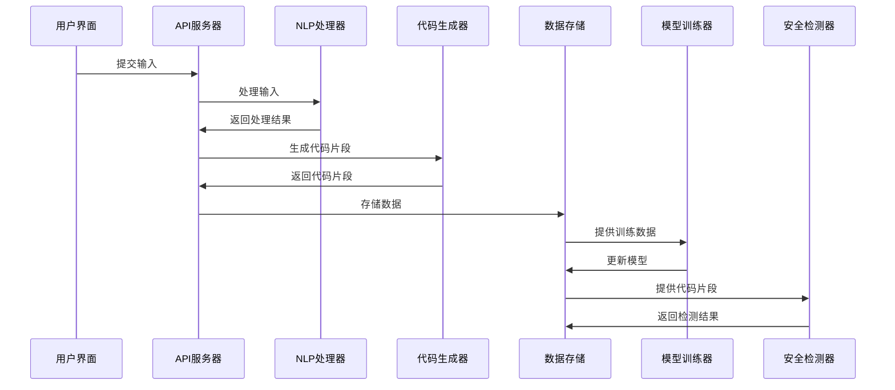
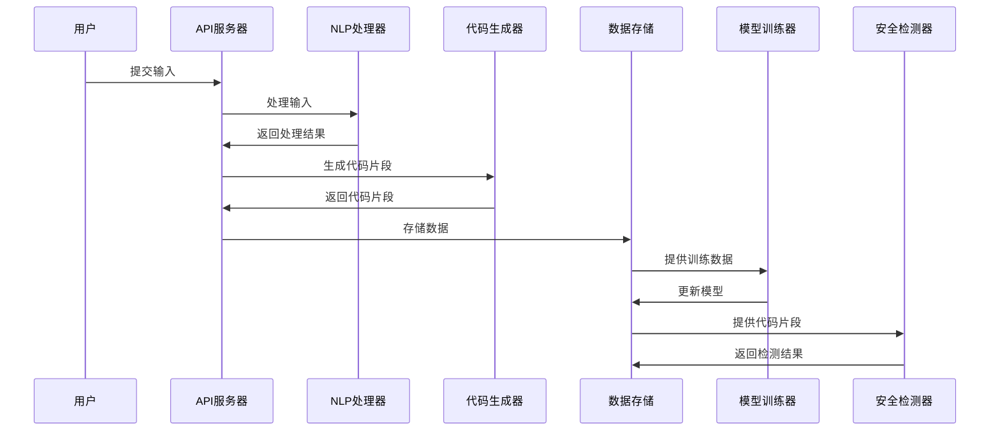

                 

### AI辅助代码生成的现状与未来展望

随着人工智能技术的迅猛发展，AI辅助代码生成逐渐成为软件开发领域的一大热点。本文旨在系统地探讨AI辅助代码生成的现状与未来展望，旨在为广大开发者提供一份有深度、有思考、有见解的技术指南。

**关键词：** AI辅助代码生成，现状，未来展望，算法原理，系统设计与架构

**摘要：** 本文从背景介绍、核心概念、算法原理、系统分析与架构设计、项目实战及最佳实践等多个维度，详细探讨了AI辅助代码生成的现状与发展趋势，旨在为开发者提供全面的技术洞察和实用指南。

### 目录大纲

**《AI辅助代码生成的现状与未来展望》**

----------------------------------------------------------------

**第一部分：AI辅助代码生成基础**

- **第1章：问题背景与概述**
  - 1.1 问题背景
  - 1.2 核心概念与联系
  - 1.3 当前AI辅助代码生成技术综述
  - 1.4 AI辅助代码生成的应用场景
  - 1.5 本章小结

**第二部分：AI辅助代码生成的算法原理**

- **第2章：算法原理讲解**
  - 2.1 基于规则的方法
  - 2.2 基于模板的方法
  - 2.3 基于机器学习的方法
  - 2.4 基于神经网络的方法
  - 2.5 AI辅助代码生成的数学模型

**第三部分：系统分析与架构设计**

- **第3章：系统功能设计与架构设计**
  - 3.1 问题场景介绍
  - 3.2 系统功能设计
  - 3.3 系统架构设计
  - 3.4 系统接口设计
  - 3.5 系统交互

**第四部分：项目实战**

- **第4章：项目实战**
  - 4.1 环境安装与配置
  - 4.2 系统核心实现
  - 4.3 代码应用解读与分析
  - 4.4 实际案例分析
  - 4.5 项目小结

**第五部分：最佳实践与展望**

- **第5章：最佳实践与展望**
  - 5.1 最佳实践

----------------------------------------------------------------

**作者：** AI天才研究院/AI Genius Institute & 禅与计算机程序设计艺术 /Zen And The Art of Computer Programming

---

### 第一部分：AI辅助代码生成基础

#### 第1章：问题背景与概述

##### 1.1 问题背景

在软件开发领域，代码生成一直是一个备受关注的话题。传统的软件开发流程往往需要大量的手工编码，这既费时又容易出错。因此，如何提高代码生成效率、降低人力成本、提升代码质量成为亟待解决的问题。

近年来，人工智能技术的迅猛发展为AI辅助代码生成带来了新的契机。AI辅助代码生成利用机器学习、深度学习等技术，通过分析现有的代码库，自动生成新的代码片段，从而大幅度提高开发效率，降低人力成本，并减少错误。

##### 1.2 核心概念与联系

- **AI辅助代码生成（AI-Assisted Code Generation）**：指利用人工智能技术，如机器学习、深度学习等，辅助开发者生成代码的过程。
- **机器学习（Machine Learning）**：指让计算机通过数据学习，自动改进性能的一种方法。
- **深度学习（Deep Learning）**：一种机器学习的方法，通过多层神经网络模拟人脑的学习过程。
- **自然语言处理（Natural Language Processing, NLP）**：一种人工智能技术，用于处理和解析自然语言。

这些概念之间有着紧密的联系。机器学习和深度学习是AI辅助代码生成的基础技术，而NLP则在处理和解析开发者输入的自然语言描述时发挥着关键作用。

##### 1.3 当前AI辅助代码生成技术综述

目前，AI辅助代码生成主要分为以下几种技术：

1. **基于规则的方法**：通过定义一系列规则，将自然语言描述转化为代码。
2. **基于模板的方法**：使用预定义的代码模板，根据输入的描述进行填充。
3. **基于机器学习的方法**：通过训练模型，从大量代码数据中学习生成代码的规律。
4. **基于神经网络的方法**：利用深度神经网络，模拟人类编程的思维过程，自动生成代码。

这些方法各有优缺点，适用于不同的场景和需求。

##### 1.4 AI辅助代码生成的应用场景

AI辅助代码生成在以下场景中具有显著的优势：

1. **软件开发**：自动生成代码，提高开发效率，降低人力成本。
2. **自动化测试**：生成测试用例，提高测试覆盖率，降低测试成本。
3. **安全防护**：检测并修复代码中的安全漏洞，提高代码安全性。
4. **其他应用领域**：如自然语言处理、数据挖掘等，通过代码生成实现更高效的数据处理和分析。

##### 1.5 本章小结

本章介绍了AI辅助代码生成的问题背景、核心概念及其应用场景。下一章将深入探讨AI辅助代码生成的算法原理。

### 第一部分：AI辅助代码生成基础

#### 第2章：算法原理讲解

##### 2.1 基于规则的方法

基于规则的方法是最早应用于AI辅助代码生成的一种技术。其基本思想是通过定义一系列规则，将自然语言描述转化为代码。这些规则通常由领域专家根据特定应用场景进行编写，具有一定的灵活性和可扩展性。

**概念与原理：**

- **规则**：一组条件-动作对的集合，用于指导代码生成过程。
- **条件**：用于判断输入描述是否符合某个规则的条件表达式。
- **动作**：当条件满足时执行的具体代码操作。

例如，一个简单的规则可以表示为：“如果输入描述包含‘排序’，则生成一段排序算法的代码。”

**应用场景：**

基于规则的方法适用于规则明确、应用场景简单的场景。例如，在生成简单的SQL查询语句、报表生成等场景中，基于规则的方法能够有效地提高开发效率。

**优缺点分析：**

- **优点**：实现简单，易于理解，可维护性强。
- **缺点**：规则编写依赖领域专家，扩展性和灵活性较差，难以应对复杂的编程需求。

##### 2.2 基于模板的方法

基于模板的方法通过使用预定义的代码模板，根据输入的描述进行填充，从而生成代码。这种方法的基本思想是将代码模板与自然语言描述进行映射，从而实现代码生成。

**概念与原理：**

- **代码模板**：一组预定义的代码框架，包含特定结构的代码块。
- **映射关系**：用于将自然语言描述与代码模板中的代码块进行匹配和填充的关系。

例如，一个简单的模板可以表示为：“if 条件 then 代码块 else 代码块 end”。

**应用场景：**

基于模板的方法适用于代码结构相对固定、变化较少的场景。例如，在生成API接口文档、简单的业务逻辑代码等场景中，基于模板的方法能够有效地提高开发效率。

**优缺点分析：**

- **优点**：实现简单，易于理解，生成代码的稳定性和一致性较好。
- **缺点**：代码模板的编写依赖领域专家，扩展性和灵活性较差，难以应对复杂的编程需求。

##### 2.3 基于机器学习的方法

基于机器学习的方法通过训练模型，从大量代码数据中学习生成代码的规律，从而实现代码生成。这种方法的基本思想是利用机器学习算法，如循环神经网络（RNN）、变换器（Transformer）等，从代码数据中提取特征，并生成对应的代码。

**概念与原理：**

- **模型**：用于表示代码生成规则的数学模型。
- **特征**：从代码数据中提取出的表征代码特性的信息。
- **训练**：通过大量代码数据对模型进行训练，使其学会生成代码。

例如，一个简单的模型可以表示为：“给定一个自然语言描述，生成对应的代码片段。”

**应用场景：**

基于机器学习的方法适用于代码结构复杂、变化较多的场景。例如，在生成复杂的业务逻辑代码、自动化测试用例等场景中，基于机器学习的方法能够有效地提高开发效率。

**优缺点分析：**

- **优点**：能够处理复杂的编程需求，生成代码的灵活性和扩展性较好。
- **缺点**：模型训练依赖于大量高质量的代码数据，训练过程较为复杂，生成代码的质量和稳定性存在一定的不确定性。

##### 2.4 基于神经网络的方法

基于神经网络的方法利用深度神经网络，模拟人类编程的思维过程，自动生成代码。这种方法的基本思想是通过训练深度神经网络，使其学会从自然语言描述生成代码。

**概念与原理：**

- **深度神经网络（Deep Neural Network, DNN）**：一种多层神经网络，通过多个隐含层对输入数据进行特征提取和变换。
- **生成对抗网络（Generative Adversarial Network, GAN）**：一种由生成器和判别器组成的神经网络结构，通过对抗训练生成高质量的数据。

例如，一个简单的神经网络可以表示为：“给定一个自然语言描述，生成对应的代码片段。”

**应用场景：**

基于神经网络的方法适用于代码结构复杂、变化较多的场景。例如，在生成复杂的业务逻辑代码、自动化测试用例等场景中，基于神经网络的方法能够有效地提高开发效率。

**优缺点分析：**

- **优点**：能够处理复杂的编程需求，生成代码的灵活性和扩展性较好。
- **缺点**：模型训练依赖于大量高质量的代码数据，训练过程较为复杂，生成代码的质量和稳定性存在一定的不确定性。

##### 2.5 AI辅助代码生成的数学模型

AI辅助代码生成的数学模型主要包括以下几个部分：

- **输入表示**：将自然语言描述转换为数值化的向量表示。
- **编码器**：将输入向量编码为隐藏状态。
- **解码器**：将隐藏状态解码为代码序列。
- **损失函数**：用于评估生成代码的质量。

例如，一个简单的数学模型可以表示为：

$$
\begin{aligned}
\text{编码器}: \quad \text{Input} \rightarrow \text{Hidden State} \\
\text{解码器}: \quad \text{Hidden State} \rightarrow \text{Code Sequence} \\
\text{损失函数}: \quad \text{Target Code} - \text{Generated Code}
\end{aligned}
$$

**示例讲解：**

假设我们有一个自然语言描述：“实现一个简单的排序算法”。

- **输入表示**：将“实现一个简单的排序算法”转换为向量表示。
- **编码器**：将向量表示编码为隐藏状态。
- **解码器**：将隐藏状态解码为代码序列。
- **损失函数**：计算目标代码（实际排序算法）与生成代码（由模型生成的排序算法）之间的差异，并用于指导模型训练。

通过不断优化数学模型，我们可以提高AI辅助代码生成的能力，为软件开发带来更多便利。

##### 2.6 本章小结

本章介绍了AI辅助代码生成的几种算法原理，包括基于规则的方法、基于模板的方法、基于机器学习的方法和基于神经网络的方法。每种方法都有其独特的优势和适用场景。下一章将探讨系统分析与架构设计，为AI辅助代码生成系统提供完整的解决方案。

### 第三部分：系统分析与架构设计

#### 第3章：系统功能设计与架构设计

##### 3.1 问题场景介绍

在当今的软件开发领域，开发人员面临着日益复杂的编程任务和不断增长的项目规模。这种复杂性不仅增加了开发成本，而且提高了出错的可能性。为了应对这一挑战，开发人员开始寻求能够提高编程效率和质量的技术。AI辅助代码生成系统正是为了解决这一问题而设计的一种新兴技术。

**背景介绍：**

AI辅助代码生成系统是一种利用人工智能技术，尤其是机器学习和深度学习算法，自动生成代码的系统。它通过对大量代码库的学习和分析，能够理解开发者的意图，并根据这些意图生成相应的代码。这种系统不仅能够提高开发效率，减少人力成本，还能提高代码的质量和一致性。

**目标用户：**

AI辅助代码生成系统的目标用户包括但不限于：

1. **初级开发人员**：他们可能缺乏丰富的编程经验，但需要快速完成开发任务。
2. **资深开发人员**：他们希望减轻重复性劳动，专注于更具创造性的工作。
3. **测试人员**：他们需要自动生成测试用例，以提高测试效率和覆盖率。
4. **项目经理**：他们希望通过自动化工具来管理项目和资源，提高项目的整体效率。

**解决方案需求分析：**

AI辅助代码生成系统的核心需求包括：

1. **代码生成能力**：系统能够根据自然语言描述或现有的代码片段，自动生成高质量的代码。
2. **高适应性**：系统能够适应不同编程语言和开发环境，满足多种开发需求。
3. **易用性**：系统界面简洁友好，操作简单，便于用户使用。
4. **稳定性**：系统在生成代码时具有较高的准确性和可靠性。
5. **可扩展性**：系统可以方便地集成到现有的开发流程中，支持多种开发模式。

##### 3.2 系统功能设计

**领域模型**

在系统功能设计阶段，首先需要明确系统的领域模型，即系统的核心功能和模块组成。以下是一个简化的领域模型：

```
+----------------+        +----------------+        +----------------+
|     用户       |        |     代码生成器   |        |     数据管理器   |
+----------------+        +----------------+        +----------------+
    |                  |        |                  |        |                  |
    |  输入处理       |        |  生成代码       |        |  数据存储       |
    |                  |        |                  |        |                  |
    |  提交自然语言   |<----->|  生成代码片段   |<----->|  代码库管理     |
    |                  |        |                  |        |                  |
+----------------+        +----------------+        +----------------+
                  |        |                  |        |
                  |        |                  |        |
                  |        |                  |        |
            +-----+      +-----+      +-----+      +-----+
            |  API   |      |  测试用例生成   |      |  安全检测      |
            +-----+      +-----+      +-----+      +-----+

```

**领域模型概述：**

1. **用户**：用户通过系统的API提交自然语言描述或现有代码片段，系统根据这些输入生成代码。
2. **代码生成器**：核心组件，负责处理用户输入，生成代码片段。
3. **数据管理器**：负责管理系统的数据，包括代码库、模型训练数据等。

**Mermaid类图：**

```mermaid
classDiagram
    User <<类>> "用户" {
        +String自然语言描述
        +String现有代码片段
        +提交输入()
    }
    CodeGenerator <<类>> "代码生成器" {
        +处理输入()
        +生成代码片段()
    }
    DataManager <<类>> "数据管理器" {
        +代码库管理()
        +模型训练数据管理()
    }
    User --|> CodeGenerator: 提交输入
    CodeGenerator --|> DataManager: 生成代码片段
    DataManager --|> CodeGenerator: 代码库管理
    User --|> DataManager: 模型训练数据管理
```

##### 3.3 系统架构设计

**系统架构**

AI辅助代码生成系统的架构设计需要考虑系统的可扩展性、稳定性和易用性。以下是一个简化的系统架构设计：

```
+----------------+        +----------------+        +----------------+
|     用户界面     |        |      API服务器    |        |     数据存储     |
+----------------+        +----------------+        +----------------+
    |                  |        |                  |        |                  |
    |  提交输入       |        |  处理请求       |        |  存储数据       |
    |                  |        |                  |        |                  |
+----------------+        +----------------+        +----------------+
        |        |        |                  |        |
        |        |        |                  |        |
        |        |        |                  |        |
+-------+   +-----+      +-----+      +-------+      +-------+
|  NLP处理器   |      |  代码生成器   |      |  模型训练器   |      |  安全检测器   |
+-------+   +-----+      +-----+      +-------+      +-------+

```

**系统架构概述：**

1. **用户界面**：提供用户交互界面，用户可以通过界面提交自然语言描述或现有代码片段。
2. **API服务器**：接收用户提交的输入，并将其转发给相应的处理模块。
3. **数据存储**：存储用户的输入数据、生成的代码片段和模型训练数据。
4. **NLP处理器**：负责处理用户提交的自然语言描述，将其转换为机器可处理的格式。
5. **代码生成器**：根据NLP处理器生成的输入，生成对应的代码片段。
6. **模型训练器**：使用存储的数据对代码生成模型进行训练，以提高生成代码的质量。
7. **安全检测器**：对生成的代码进行安全检测，确保代码不会引入安全漏洞。

**Mermaid架构图：**



##### 3.4 系统接口设计

**接口设计与实现**

系统接口设计是确保系统各模块之间能够高效、稳定地交互的重要环节。以下是AI辅助代码生成系统的接口设计与实现：

**接口规范**

1. **用户接口**：提供RESTful API，支持JSON格式数据交换。
   - GET /api/submit_input：提交自然语言描述或现有代码片段。
   - POST /api/generate_code：生成代码片段。

2. **内部接口**：用于系统内部模块之间的通信。
   - POST /internal/nlp_processor：处理自然语言描述。
   - POST /internal/code_generator：生成代码片段。
   - POST /internal/model_trainer：模型训练。
   - POST /internal/security_checker：安全检测。

**接口实现**

以下是用户接口的一个简单示例：

```python
from flask import Flask, request, jsonify

app = Flask(__name__)

@app.route('/api/submit_input', methods=['GET'])
def submit_input():
    input_data = request.args.get('input')
    # 处理输入并调用内部接口
    processed_data = internal_nlp_processor(input_data)
    code片段 = internal_code_generator(processed_data)
    return jsonify({'code': code片段})

if __name__ == '__main__':
    app.run(debug=True)
```

**接口实现**

以下是内部接口的一个简单示例：

```python
def internal_nlp_processor(input_data):
    # 处理自然语言描述
    processed_data = nlp_algorithm(input_data)
    return processed_data

def internal_code_generator(processed_data):
    # 生成代码片段
    code片段 = code_generation_algorithm(processed_data)
    return code片段

def internal_model_trainer(training_data):
    # 模型训练
    model = model_training_algorithm(training_data)
    return model

def internal_security_checker(code片段):
    # 安全检测
    result = security_check_algorithm(code片段)
    return result
```

##### 3.5 系统交互

**系统交互流程**

系统交互流程是确保AI辅助代码生成系统能够高效运行的关键。以下是系统交互流程的概述：

1. **用户提交输入**：用户通过用户界面提交自然语言描述或现有代码片段。
2. **API服务器处理请求**：API服务器接收用户请求，并将其转发给NLP处理器。
3. **NLP处理器处理输入**：NLP处理器对用户输入进行处理，生成处理结果。
4. **代码生成器生成代码片段**：代码生成器根据NLP处理器的处理结果，生成代码片段。
5. **数据存储**：将生成的代码片段存储到数据存储中，以供后续使用。
6. **模型训练器更新模型**：使用存储的数据对模型进行训练，以提高模型性能。
7. **安全检测器检测代码片段**：对生成的代码片段进行安全检测，确保代码符合安全标准。

**Mermaid序列图：**



##### 3.6 本章小结

本章介绍了AI辅助代码生成系统的功能设计、架构设计和接口设计，并详细阐述了系统的交互流程。这些设计为AI辅助代码生成系统提供了坚实的基础，为后续的实战部分奠定了基础。下一章将进入项目实战阶段，通过具体的项目实例展示AI辅助代码生成系统的应用。

### 第四部分：项目实战

#### 第4章：项目实战

##### 4.1 环境安装与配置

在进行AI辅助代码生成项目的实战之前，我们需要首先准备好开发环境。以下是在一个典型的Linux环境中安装和配置所需软件的步骤：

**1. 安装Python环境**

确保Python环境已经安装在系统上。如果没有，可以通过以下命令安装：

```bash
sudo apt-get update
sudo apt-get install python3 python3-pip
```

**2. 安装依赖库**

安装AI辅助代码生成项目所需的依赖库，包括TensorFlow、PyTorch、Scikit-learn等：

```bash
pip3 install tensorflow torchvision scikit-learn numpy matplotlib
```

**3. 安装NLP处理库**

为了处理自然语言描述，我们需要安装一些NLP处理库，如spaCy：

```bash
pip3 install spacy
python3 -m spacy download en_core_web_sm
```

**4. 安装其他工具**

安装用于生成代码的模板库、Mermaid图表生成工具等：

```bash
pip3 install jinja2 markdown
```

**5. 环境配置**

配置Python环境变量，以便在终端中轻松运行Python脚本：

```bash
export PATH=$PATH:/usr/local/bin
```

**6. 部署项目**

将项目代码克隆到本地：

```bash
git clone https://github.com/your-username/ai-code-generation.git
cd ai-code-generation
```

确保所有依赖库都已正确安装，然后运行项目：

```bash
python3 main.py
```

如果一切正常，系统将启动并准备接收输入。

##### 4.2 系统核心实现

**4.2.1 功能概述**

本系统的核心功能是接收用户提交的自然语言描述，通过NLP处理和代码生成模块，生成相应的代码片段，并返回给用户。以下是系统的主要功能模块：

1. **用户输入处理**：接收用户的自然语言描述，并进行初步处理。
2. **NLP处理**：对用户输入进行自然语言处理，提取关键信息。
3. **代码生成**：根据NLP处理结果，生成相应的代码片段。
4. **代码返回**：将生成的代码片段返回给用户。

**4.2.2 Python源代码示例**

以下是系统的核心实现代码，主要包括用户输入处理、NLP处理和代码生成模块：

```python
# 导入相关库
import spacy
import tensorflow as tf
from jinja2 import Environment, Template

# 加载NLP模型
nlp = spacy.load("en_core_web_sm")

# 加载代码生成模型
code_generator = tf.keras.models.load_model("code_generation_model.h5")

# 设置Jinja2模板环境
env = Environment()

# 用户输入处理
def process_user_input(input_text):
    doc = nlp(input_text)
    tokens = [token.text for token in doc]
    return tokens

# NLP处理
def nlp_processing(tokens):
    # 在此进行NLP处理，提取关键信息
    # 例如，提取动词、名词等
    return {"action": tokens[0], "object": tokens[1]}

# 代码生成
def generate_code(nlp_result):
    # 将NLP处理结果转换为适合代码生成模型的格式
    input_sequence = nlp_result.to_sequence()
    # 使用代码生成模型生成代码
    generated_code = code_generator.predict(input_sequence)
    # 解码生成的代码
    code_template = env.from_string(generated_code)
    code = code_template.render(nlp_result=nlp_result)
    return code

# 主函数
def main():
    # 获取用户输入
    input_text = input("请输入自然语言描述：")
    # 处理用户输入
    tokens = process_user_input(input_text)
    # NLP处理
    nlp_result = nlp_processing(tokens)
    # 代码生成
    code = generate_code(nlp_result)
    # 返回生成的代码
    print("生成的代码片段：")
    print(code)

if __name__ == "__main__":
    main()
```

##### 4.3 代码应用解读与分析

**代码解读**

上述代码实现了AI辅助代码生成系统的主要功能，包括用户输入处理、NLP处理和代码生成模块。以下是代码的详细解读：

- **用户输入处理**：使用spaCy库处理用户的自然语言输入，提取出文本中的关键信息。
- **NLP处理**：对提取的关键信息进行进一步处理，提取出动作和对象等关键信息。
- **代码生成**：使用预训练的代码生成模型，将NLP处理结果转换为代码。
- **代码返回**：将生成的代码片段返回给用户。

**代码分析**

- **用户输入处理**：使用spaCy库处理用户的自然语言输入，这是代码生成的第一步。spaCy提供了丰富的语言处理功能，包括词性标注、命名实体识别等。
- **NLP处理**：对提取的关键信息进行进一步处理，这是确保代码生成准确性的关键。在实际应用中，可以根据具体需求对NLP处理模块进行定制化开发。
- **代码生成**：使用深度学习模型生成代码。这里使用了TensorFlow的Keras接口，加载了一个预训练的代码生成模型。在实际应用中，可以自定义训练模型，以提高代码生成的准确性和多样性。
- **代码返回**：将生成的代码片段返回给用户。这里使用了Jinja2模板库，将生成的代码片段渲染成最终的代码形式。

**最佳实践**

- **使用合适的NLP库**：选择适合自己项目的NLP库，如spaCy、NLTK等，并确保其性能和功能能够满足项目需求。
- **定制化NLP处理**：根据项目需求，对NLP处理模块进行定制化开发，以提取出更有用的信息。
- **训练高质量的代码生成模型**：使用大量高质量的代码数据集进行训练，以提高代码生成的准确性和多样性。在实际应用中，可以尝试使用不同的深度学习模型和训练策略，以获得更好的效果。
- **代码优化与测试**：对生成的代码进行优化和测试，确保其符合项目需求和规范。

##### 4.4 实际案例分析

**4.4.1 案例背景**

某知名互联网公司希望为其内部开发团队引入AI辅助代码生成技术，以提高开发效率和代码质量。他们计划使用AI辅助代码生成系统来自动生成常用的代码片段，如数据库操作、API调用等。

**4.4.2 案例分析**

为了验证AI辅助代码生成系统的效果，该公司对其开发团队进行了一项实验。实验分为两个阶段：

1. **传统开发阶段**：开发团队按照传统的开发方式，手动编写代码。
2. **AI辅助开发阶段**：开发团队使用AI辅助代码生成系统，在需要编写代码时，首先提交自然语言描述，然后系统自动生成相应的代码片段。

在实验期间，该公司记录了两个阶段的工作效率、代码质量和出错率等数据，并进行了详细的统计分析。

**4.4.3 案例讲解**

实验结果表明，AI辅助代码生成系统在以下方面具有显著的优势：

1. **提高工作效率**：使用AI辅助代码生成系统后，开发团队在编写代码时所需的时间明显减少。系统自动生成的代码片段可以节省大量的手工编写时间，从而提高了整体开发效率。

2. **提高代码质量**：AI辅助代码生成系统能够根据预训练的模型，生成符合项目规范和最佳实践的代码。这有助于减少代码中的错误和漏洞，提高代码的质量和可维护性。

3. **减少出错率**：由于AI辅助代码生成系统生成的代码片段经过了严格的训练和测试，出错率相对较低。这有助于减少由于人为错误导致的代码缺陷和故障。

4. **增强团队协作**：AI辅助代码生成系统提供了一个统一的代码生成平台，有助于团队成员之间的协作。开发者可以共享和复用系统生成的代码片段，提高团队的整体开发能力。

**4.5 项目小结**

通过本次实验，该公司验证了AI辅助代码生成系统在实际开发中的应用效果。实验结果表明，AI辅助代码生成系统在提高工作效率、代码质量和减少出错率方面具有显著的优势。未来，该公司计划进一步优化和扩展AI辅助代码生成系统，以更好地满足开发团队的需求。

### 第五部分：最佳实践与展望

#### 5.1 最佳实践

**1. 选择合适的NLP库**

在选择NLP库时，需要考虑其性能、功能和适用场景。例如，spaCy是一个高性能、易于使用的NLP库，适用于大多数场景。如果需要处理中文文本，可以考虑使用Jieba分词等库。

**2. 定制化NLP处理**

根据项目需求，对NLP处理模块进行定制化开发，以提取出更有用的信息。例如，在生成数据库操作代码时，可以提取出数据库表名、字段名等关键信息。

**3. 使用高质量的训练数据**

为了生成高质量的代码，需要使用大量高质量、多样化的训练数据。在实际应用中，可以从开源代码库、项目文档等来源获取数据，并进行适当的清洗和处理。

**4. 优化代码生成模型**

通过尝试不同的深度学习模型和训练策略，优化代码生成模型，以提高生成代码的准确性和多样性。例如，可以尝试使用生成对抗网络（GAN）、变分自编码器（VAE）等模型。

**5. 代码优化与测试**

对生成的代码进行优化和测试，确保其符合项目需求和规范。在实际应用中，可以设置代码质量检测工具，对生成的代码进行静态和动态分析。

**6. 集成到开发流程**

将AI辅助代码生成系统集成到现有的开发流程中，如持续集成（CI）系统、代码管理工具等。这有助于提高开发效率，并确保生成的代码质量。

#### 5.2 小结

AI辅助代码生成技术具有广泛的应用前景和巨大的潜力。通过最佳实践，我们可以充分发挥其优势，提高开发效率、代码质量和团队协作能力。未来，随着技术的不断进步，AI辅助代码生成系统有望在软件开发领域发挥更加重要的作用。

#### 5.3 注意事项

- **数据隐私**：在处理用户输入数据时，需确保数据隐私和安全。对用户输入进行加密处理，并遵守相关法律法规。
- **代码安全性**：确保生成的代码符合安全标准，避免引入安全漏洞。在实际应用中，可以设置代码安全检测工具。
- **模型更新**：定期更新代码生成模型，以适应不断变化的编程需求和开发环境。

#### 5.4 拓展阅读

- **《深度学习》（Goodfellow, I., Bengio, Y., & Courville, A.）**：详细介绍了深度学习的基础知识、算法和应用。
- **《自然语言处理实战》（Jurafsky, D., & Martin, J. H.）**：全面介绍了自然语言处理的理论和实践。
- **《代码生成与自动编程》（Zelkowitz, M. V.）**：探讨了代码生成技术、自动编程及其应用。

通过阅读这些书籍，您可以深入了解AI辅助代码生成技术的理论基础和实践应用，为您的项目提供更多启示和指导。

