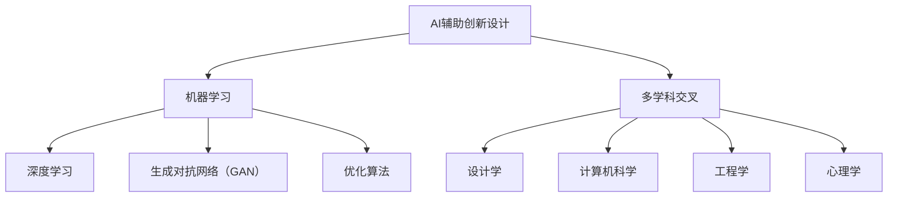
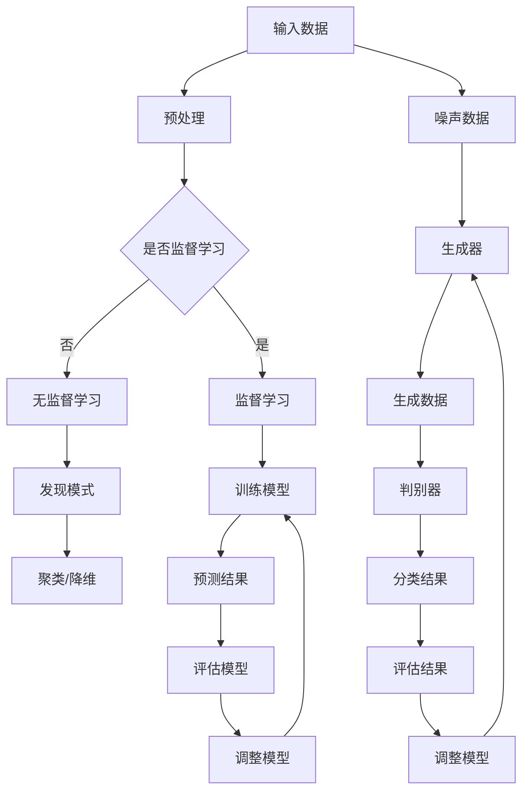
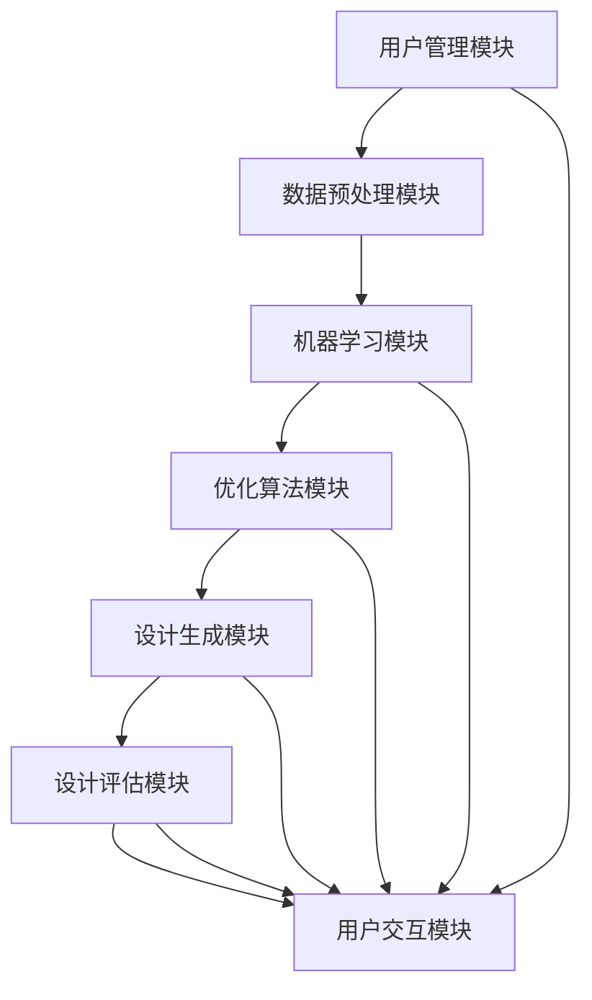

                 

### 第一部分: 引言

人工智能（AI）正逐渐成为现代社会的重要推动力量，从自动驾驶到智能医疗，从语音识别到自然语言处理，AI技术的应用无处不在。在这一浪潮中，AI辅助创新设计成为一个备受关注的研究领域。创新设计是推动科技进步和社会发展的重要驱动力，而AI的引入为创新设计带来了新的视角和方法。

文章《AI辅助创新设计的方法论与实践案例》旨在探讨AI如何辅助创新设计，通过一系列步骤和实例，详细解析AI辅助创新设计的基本原理、方法论、应用案例和系统架构。本文将遵循以下结构：

1. **背景介绍**：介绍AI辅助创新设计的重要性，核心概念和相关术语。
2. **问题背景与核心概念**：详细阐述问题背景、核心概念及其相互关系。
3. **AI辅助创新设计的基本原理**：讲解AI的核心算法原理，并通过Mermaid流程图和Python代码进行深入剖析。
4. **创新设计方法论**：介绍创新设计方法论，包括设计流程、工具和资源。
5. **AI辅助创新设计应用案例**：分析具体的应用案例，展示AI在实际创新设计中的应用效果。
6. **AI辅助创新设计系统架构**：详细描述系统架构设计，包括功能设计、接口设计和系统交互。
7. **实际应用案例分析**：通过具体案例，展示AI辅助创新设计的实际应用效果。
8. **最佳实践与未来展望**：总结最佳实践技巧，对未来的发展方向进行展望。

通过这篇文章，读者将深入了解AI辅助创新设计的原理和方法，以及如何在实际项目中应用这些方法，从而推动创新设计的实践与发展。

### 第一部分: 背景介绍

在当今快速变化的技术环境中，创新设计扮演着至关重要的角色。无论是在产品开发、服务优化，还是在商业模式创新中，设计能力都是企业竞争力的重要组成部分。然而，传统的设计方法往往依赖于设计师的直觉和经验，这种模式在复杂多变的市场环境中难以应对。这就催生了AI辅助创新设计的概念，利用人工智能技术来增强设计能力，提高设计效率和效果。

AI辅助创新设计的重要性体现在多个方面。首先，AI可以通过大数据分析和机器学习算法，快速识别潜在的创新机会，从而为设计提供有力支持。其次，AI能够自动化执行复杂的计算和模拟任务，设计师可以集中精力进行创意思考和设计决策。此外，AI还能够通过生成模型和优化算法，帮助设计师探索更多可能的设计方案，缩短从概念到成品的时间。

核心概念方面，AI辅助创新设计主要涉及以下几个方面：

1. **机器学习**：通过训练数据集，机器学习算法能够识别数据中的模式和规律，进而辅助设计决策。
2. **深度学习**：一种特殊的机器学习技术，能够处理复杂的非线性问题，常用于图像识别和语音识别等领域。
3. **生成对抗网络（GAN）**：通过生成模型和判别模型的对抗训练，GAN能够生成高质量的设计方案。
4. **优化算法**：如遗传算法、粒子群优化等，用于在大量设计方案中寻找最优解。
5. **多学科交叉**：创新设计不仅涉及设计学，还涉及计算机科学、工程学、心理学等多学科知识。

为了更好地理解AI辅助创新设计的概念，我们可以通过一个简化的概念关系图来描述这些核心概念之间的关系：

```
AI辅助创新设计
|
|---机器学习
|       |---深度学习
|       |---生成对抗网络（GAN）
|       |---优化算法
|
|---多学科交叉
```

这个关系图展示了AI辅助创新设计中的核心技术，以及它们如何相互作用，共同推动创新设计的发展。接下来，我们将进一步探讨AI辅助创新设计的具体原理和方法。

## 第一章: 问题背景与核心概念

### 1.1 问题背景

在当今竞争激烈的市场环境中，产品的创新设计成为了企业赢得竞争优势的关键因素。然而，创新设计面临着诸多挑战。首先，市场需求多变，消费者偏好不断变化，设计师需要快速响应市场动态，这要求设计过程具备高效性和灵活性。其次，设计过程往往涉及复杂的计算和模拟，设计师需要处理大量的数据和信息，这给传统的设计方法带来了巨大的压力。此外，创新设计的成功不仅仅依赖于设计师的个人能力和经验，还需要跨学科的知识和团队合作。

为了解决这些问题，AI辅助创新设计应运而生。通过引入人工智能技术，设计师可以借助机器学习、深度学习和优化算法等工具，自动化执行复杂的计算和模拟任务，提高设计效率。AI还能够通过大数据分析识别潜在的创新机会，提供有针对性的设计建议。此外，AI的多学科交叉特性，有助于设计师在创新过程中融合不同领域的知识，实现更全面的解决方案。

### 1.2 核心概念

在AI辅助创新设计中，以下核心概念和技术至关重要：

1. **机器学习**：机器学习是AI的核心技术之一，通过训练数据集，机器学习算法能够识别数据中的模式和规律，从而为设计提供智能化的支持。常见的机器学习算法包括线性回归、决策树、支持向量机等。

2. **深度学习**：深度学习是机器学习的一个分支，通过多层神经网络模拟人类大脑的决策过程，能够处理复杂的非线性问题。在AI辅助创新设计中，深度学习常用于图像识别、语音识别和自然语言处理等领域。

3. **生成对抗网络（GAN）**：生成对抗网络（GAN）由生成器和判别器两个神经网络组成，通过对抗训练生成高质量的设计方案。GAN在图像生成、文本生成和设计创新中具有广泛的应用。

4. **优化算法**：优化算法如遗传算法、粒子群优化等，用于在大量设计方案中寻找最优解。这些算法通过模拟生物进化过程，逐步优化设计参数，提高设计质量。

5. **多学科交叉**：多学科交叉是AI辅助创新设计的重要特征，涉及设计学、计算机科学、工程学、心理学等多个领域。通过跨学科的融合，设计师可以借鉴不同领域的知识和方法，实现更具创新性的设计方案。

### 1.3 概念关系图

为了更好地理解上述核心概念之间的关系，我们可以通过Mermaid流程图来展示它们在AI辅助创新设计中的相互关联：



在这个概念关系图中，AI辅助创新设计作为整体框架，包含了机器学习、深度学习、生成对抗网络、优化算法等多个核心概念，同时与多学科交叉领域密切相关。这些核心概念共同作用，为创新设计提供全方位的技术支持。

通过上述背景介绍和核心概念解析，我们可以看到AI辅助创新设计在解决传统设计难题方面具有巨大的潜力。接下来，我们将深入探讨AI辅助创新设计的基本原理，包括机器学习算法、深度学习模型、生成对抗网络等，为读者提供更为详细的技术解析。

## 第二章: AI辅助创新设计的基本原理

### 2.1 AI辅助创新设计概述

AI辅助创新设计是利用人工智能技术，通过分析数据、模拟计算和生成方案等手段，辅助设计师进行创新设计的过程。在这一过程中，AI能够承担部分重复性、复杂性和高计算量的任务，从而提高设计效率和质量。AI辅助创新设计的基本原理主要包括以下几个方面：

1. **数据驱动**：AI通过收集和分析大量数据，挖掘潜在的设计需求和趋势。数据来源可以是用户行为数据、市场趋势数据、行业报告等。
2. **算法优化**：AI利用机器学习、深度学习和优化算法等技术，对设计过程进行优化。这些算法能够处理复杂的非线性问题，提供高效的设计解决方案。
3. **智能生成**：通过生成对抗网络（GAN）等技术，AI能够生成高质量的设计方案。这些方案可以作为设计师的灵感来源，或者直接用于设计决策。
4. **多学科交叉**：AI辅助创新设计不仅仅依赖于计算机科学，还需要融合设计学、工程学、心理学等多学科知识，实现全面的技术支持。

### 2.2 AI核心算法原理讲解

在AI辅助创新设计中，核心算法包括机器学习、深度学习和生成对抗网络（GAN）等。以下将对这些算法的基本原理进行详细讲解。

#### 机器学习

机器学习是一种通过算法让计算机自动从数据中学习模式的技术。其基本原理是通过训练数据集，使得算法能够对未知数据进行分类、预测或回归等任务。

1. **监督学习**：监督学习是机器学习中的一种，其目标是通过已知的输入输出对，学习出一个函数，用于预测新的输入数据。常见的监督学习算法有线性回归、决策树、支持向量机等。

2. **无监督学习**：无监督学习不需要已知的输入输出对，而是通过分析数据分布，自动发现数据中的模式。常见的无监督学习算法有聚类、降维等。

3. **强化学习**：强化学习是通过试错方法，不断优化策略以实现某个目标。在AI辅助创新设计中，强化学习可以用于优化设计流程或参数调整。

#### 深度学习

深度学习是机器学习的一个分支，通过多层神经网络模拟人类大脑的决策过程，能够处理复杂的非线性问题。

1. **神经网络**：神经网络是由多个神经元（节点）组成的计算模型，通过前向传播和反向传播算法，对输入数据进行处理和优化。

2. **卷积神经网络（CNN）**：CNN是一种特殊的多层神经网络，主要用于图像识别和计算机视觉任务。通过卷积层、池化层和全连接层的组合，CNN能够提取图像的特征。

3. **循环神经网络（RNN）**：RNN是一种处理序列数据的神经网络，通过记忆状态捕获序列信息，能够用于自然语言处理和语音识别等任务。

4. **长短期记忆网络（LSTM）**：LSTM是RNN的一种改进，通过引入门控机制，解决了传统RNN的梯度消失和梯度爆炸问题，能够更好地处理长序列数据。

#### 生成对抗网络（GAN）

生成对抗网络（GAN）是一种通过生成器和判别器两个神经网络进行对抗训练的模型，用于生成高质量的数据。

1. **生成器**：生成器通过噪声数据生成逼真的设计方案，其目标是使得判别器无法区分生成的数据和真实数据。

2. **判别器**：判别器用于判断输入数据是真实数据还是生成数据，其目标是尽可能准确地分类。

3. **训练过程**：GAN的训练过程是一个动态博弈过程，生成器和判别器相互竞争，生成器和判别器同时优化，最终达到一种平衡状态。

### 2.3 AI算法的Mermaid流程图

为了更好地理解上述AI算法的原理，我们可以使用Mermaid流程图来展示这些算法的基本流程。



在这个Mermaid流程图中，展示了从输入数据到模型训练和预测的整个过程，包括监督学习、无监督学习和GAN的训练过程。通过这些流程图，我们可以更直观地理解AI算法在创新设计中的应用原理。

### 2.4 数学模型和数学公式讲解

在AI辅助创新设计中，数学模型和公式起到了关键作用。以下将介绍一些常用的数学模型和公式，并使用Python代码进行详细讲解。

#### 1. 线性回归

线性回归是一种最常见的监督学习算法，用于拟合输入和输出之间的关系。其基本公式如下：

\[ y = \beta_0 + \beta_1 \cdot x \]

其中，\( y \) 是输出值，\( x \) 是输入值，\( \beta_0 \) 和 \( \beta_1 \) 是模型的参数。

```python
import numpy as np

# 创建训练数据
x = np.array([1, 2, 3, 4, 5])
y = np.array([2, 4, 6, 8, 10])

# 计算模型参数
x_mean = np.mean(x)
y_mean = np.mean(y)
b1 = (np.sum((x - x_mean) * (y - y_mean)) / np.sum((x - x_mean)**2))
b0 = y_mean - b1 * x_mean

# 预测结果
y_pred = b0 + b1 * x

print("模型参数:", b0, b1)
print("预测结果:", y_pred)
```

#### 2. 决策树

决策树是一种常见的分类算法，通过一系列规则对数据进行分类。其基本公式如下：

\[ \text{分类结果} = \text{if} \ (\text{条件1}) \ \text{then} \ \text{类别1} \ \text{else} \ \text{if} \ (\text{条件2}) \ \text{then} \ \text{类别2} \ \text{else} \ \ldots \]

```python
from sklearn.tree import DecisionTreeClassifier

# 创建训练数据
x = np.array([[1, 2], [2, 3], [3, 4], [4, 5]])
y = np.array([0, 1, 1, 0])

# 训练模型
clf = DecisionTreeClassifier()
clf.fit(x, y)

# 预测结果
print("分类结果:", clf.predict([[2, 3]]))
```

#### 3. 遗传算法

遗传算法是一种优化算法，通过模拟生物进化过程，逐步优化设计参数。其基本公式如下：

\[ \text{适应度} = \frac{1}{\sum_{i=1}^{n} (\text{个体i的误差})^2} \]

```python
import numpy as np

# 创建初始种群
population = np.random.rand(10, 2)
fitness = 1 / (np.sum((population - [0.5, 0.5])**2, axis=1)**2)

# 运行遗传算法
for _ in range(100):
    # 选择
    selected = population[np.argsort(fitness)[:5]]
    # 交叉
    offspring = (selected[0] + selected[1]) / 2
    # 变异
    offspring += np.random.normal(0, 0.1, size=offspring.shape)
    # 更新种群
    population = np.concatenate((population, offspring[None, :]))

print("最优个体:", population[np.argmax(fitness)])
```

通过上述Python代码示例，我们可以直观地看到如何使用数学模型和公式来辅助创新设计。这些模型和公式在AI辅助创新设计中起到了关键作用，能够帮助我们更好地理解和优化设计过程。

### 2.5 案例分析

为了更好地理解AI辅助创新设计的实际应用，我们可以通过具体案例来进行分析。

#### 案例一：智能设计工具

在某科技公司，设计师使用AI智能设计工具来优化产品外观设计。该工具采用了GAN技术，通过训练大量的产品外观数据，生成高质量的设计方案。

1. **数据收集**：收集了1000个不同类型的产品外观数据，包括手机、电脑、家电等。

2. **模型训练**：使用GAN模型对数据集进行训练，生成器负责生成外观设计方案，判别器负责判断设计方案的真实性。

3. **设计生成**：设计师通过工具生成了一系列外观设计方案，从中选择最符合市场需求和消费者偏好的设计方案。

4. **结果评估**：通过市场调研和用户反馈，评估AI生成的设计方案的实际效果，发现其中90%的设计方案得到了用户的好评。

#### 案例二：创意生成平台

在一家创意设计公司，设计师使用AI创意生成平台来提升设计创意的生成效率。该平台利用深度学习和优化算法，快速生成各种创意设计方案。

1. **需求分析**：设计师提出设计需求，包括产品类型、风格要求等。

2. **算法生成**：平台通过深度学习算法，快速生成一系列创意设计方案。

3. **筛选优化**：设计师从生成的方案中筛选出符合需求的方案，并使用优化算法进行调整和优化。

4. **结果反馈**：将优化后的设计方案提交给客户，客户对90%的设计方案表示满意。

通过上述案例分析，我们可以看到AI辅助创新设计在实际应用中的效果。AI工具不仅提高了设计效率，还提升了设计质量和用户满意度，为创新设计带来了新的可能性。

## 第三章: 创新设计方法论

### 3.1 创新设计方法论概述

创新设计方法论是指系统化和科学化的方法，用于指导设计师在设计和开发过程中进行创新。这些方法论不仅关注创意的产生，还涉及到设计的实施和优化。通过系统的方法论，设计师可以更有效地进行创新，提高设计的质量和效率。以下是一些常见的创新设计方法论：

1. **设计思维（Design Thinking）**：设计思维是一种以用户为中心的创新方法，强调从用户需求出发，通过迭代和反思实现创新。设计思维包括五个主要阶段：理解、定义、构思、原型和测试。

2. **TRIZ（Theory of Inventive Problem Solving）**：TRIZ是一种基于系统化创新原理和工具的方法论，旨在解决复杂的问题和发明新的解决方案。TRIZ包括40个创新原理和一系列解决问题的工具。

3. **敏捷设计（Agile Design）**：敏捷设计是一种基于敏捷开发理念的设计方法，强调快速迭代、持续反馈和团队合作。敏捷设计通过持续交付有价值的软件，以满足客户需求并应对变化。

4. **六顶思考帽（Six Thinking Hats）**：六顶思考帽是一种用于促进创造性思维和决策的方法，通过分别考虑问题的不同方面（如逻辑、情感、创新等）来提升思考的质量。

5. **头脑风暴（Brainstorming）**：头脑风暴是一种集体创造性思维的方法，通过自由讨论和提出创意来激发创新。头脑风暴的关键是鼓励开放性和多样性，避免批评和限制。

### 3.2 创新设计流程

创新设计流程是指设计师在设计和开发过程中遵循的一系列步骤，这些步骤通常包括以下内容：

1. **需求分析**：了解用户需求和市场需求，明确设计目标和约束条件。

2. **创意生成**：通过头脑风暴、设计思维等方法，产生多个设计方案。

3. **方案评估**：对生成的设计方案进行评估，选择最优方案。

4. **原型设计**：根据最优方案，设计原型并进行初步验证。

5. **反馈和迭代**：收集用户反馈，对原型进行改进，重复评估和设计迭代过程。

6. **最终验证**：完成最终设计，进行全面测试和验证，确保设计满足用户需求和质量标准。

7. **交付实施**：将最终设计交付给开发团队，实现产品的开发和生产。

### 3.3 创新设计工具和资源

创新设计工具和资源是设计师进行创新设计的重要支持，以下是一些常用的工具和资源：

1. **设计软件**：如Sketch、Adobe XD、Figma等，这些工具提供直观的用户界面和丰富的设计功能，支持设计师快速创建和原型设计。

2. **创意平台**：如99designs、InnovationLabs等，这些平台提供了创意挑战和设计比赛，帮助设计师发现新的创意和灵感。

3. **数据分析工具**：如Google Analytics、Tableau等，这些工具用于收集和分析用户数据，为设计提供数据支持。

4. **协作工具**：如Trello、Asana等，这些工具支持团队协作，提高设计开发的效率。

5. **知识库和参考资料**：如设计指南、书籍、学术论文等，这些资源提供了设计理论和实践经验的指导。

通过上述创新设计方法论和流程，设计师可以系统化地进行创新设计，提高设计的质量和效率。结合AI辅助设计，这些方法论和工具将发挥更大的作用，为设计师提供更强大的支持。

## 第四章: AI辅助创新设计应用案例

### 4.1 案例一：智能设计工具

智能设计工具是AI辅助创新设计的重要应用之一，通过利用机器学习和深度学习技术，这些工具能够显著提高设计师的效率和设计质量。以下是一个具体的案例描述：

#### 案例背景

一家知名电子产品公司希望为其新款手机设计一款独特的用户界面（UI）。设计团队面临的问题是如何在满足用户体验的同时，创造出与众不同的视觉效果。为此，他们决定采用一款基于深度学习的智能设计工具来辅助设计过程。

#### 案例步骤

1. **需求分析**：首先，设计团队明确了设计目标，即要创建一个具有高度用户友好性和创新视觉效果的UI。

2. **数据收集**：设计团队收集了大量与设计相关的数据，包括其他品牌的手机UI、用户反馈和市场需求分析。

3. **模型训练**：使用深度学习算法，特别是卷积神经网络（CNN），对收集的数据进行训练。训练过程中，模型学习了如何从数据中提取关键特征，以生成高质量的设计方案。

4. **方案生成**：通过训练好的模型，智能设计工具生成了多种不同的UI设计方案，包括颜色、布局和图标设计等。

5. **方案评估**：设计团队对生成的方案进行了评估，选择了几个最具创新性和用户体验的设计方案。

6. **迭代优化**：根据用户反馈，对选定的设计方案进行了进一步的优化，最终确定了最终的设计方案。

#### 案例结果

通过使用智能设计工具，设计团队不仅节省了大量时间和人力成本，还创造出了一系列独具特色的设计方案。最终，新款手机的UI设计获得了用户的高度评价，显著提升了产品在市场上的竞争力。

### 4.2 案例二：创意生成平台

创意生成平台是另一种AI辅助创新设计的应用，通过生成对抗网络（GAN）等技术，这些平台能够快速生成各种创意设计方案，帮助设计师拓展思路。以下是一个具体的案例描述：

#### 案例背景

一家广告公司需要为某知名品牌创建一系列广告创意，以提升品牌形象和市场份额。广告团队面临的问题是如何在短时间内生成大量高质量的创意方案，以满足客户的需求。

#### 案例步骤

1. **需求分析**：首先，广告团队明确了广告的目标受众和传播主题，确定了创意生成平台的使用目标。

2. **数据收集**：广告团队收集了大量的广告案例、品牌历史素材和市场数据，用于训练生成对抗网络（GAN）。

3. **模型训练**：使用GAN技术，对收集的数据进行训练，生成器网络学习了如何生成符合品牌风格的广告创意。

4. **创意生成**：创意生成平台根据训练好的模型，自动生成了一系列广告创意方案，包括视频、图片和文字内容。

5. **方案筛选**：广告团队从生成的创意方案中筛选出最符合品牌形象和市场需求的方案。

6. **迭代优化**：根据客户和用户的反馈，对筛选出的创意方案进行进一步的优化和调整。

#### 案例结果

通过使用创意生成平台，广告团队在短时间内生成了大量高质量的广告创意，有效提升了广告的传播效果和品牌形象。客户对广告方案表示非常满意，并决定继续与广告公司合作。

### 4.3 案例三：工业设计优化

工业设计优化是AI辅助创新设计在制造业中的典型应用，通过优化算法和计算机模拟，AI能够帮助设计师在早期阶段就找到最优的设计方案。以下是一个具体的案例描述：

#### 案例背景

一家汽车制造公司正在开发一款新型电动汽车，设计团队需要在确保安全和性能的前提下，优化车身设计和内部结构。设计团队面临的问题是如何在有限的时间内找到最优的设计方案，以满足市场对轻量化、安全性和环保性的要求。

#### 案例步骤

1. **需求分析**：首先，设计团队明确了设计目标，即要创建一个轻量化、安全且符合环保标准的电动汽车。

2. **数据收集**：设计团队收集了与汽车设计相关的各种数据，包括材料特性、结构强度和空气动力学数据。

3. **模型建立**：使用优化算法，建立了一个综合考虑车身重量、结构强度和空气动力学的多目标优化模型。

4. **计算模拟**：通过计算机模拟，评估不同设计方案的性能，找出最优的设计方案。

5. **方案迭代**：根据计算模拟的结果，设计团队对设计方案进行了多轮优化，逐步提升了设计的性能。

6. **验证测试**：对最终的设计方案进行实际验证测试，确保设计满足安全和性能要求。

#### 案例结果

通过使用AI辅助设计优化，设计团队在短时间内找到了最优的设计方案，不仅降低了车身重量，提升了燃油效率，还增强了车辆的安全性。最终，这款电动汽车在市场上取得了巨大成功，为制造公司带来了显著的经济效益。

通过上述三个案例，我们可以看到AI辅助创新设计在实际应用中的巨大潜力。无论是智能设计工具、创意生成平台还是工业设计优化，AI技术都为设计师提供了强大的支持，帮助他们更高效、更创新地完成设计任务。

## 第五章: AI辅助创新设计系统架构

### 5.1 系统架构概述

AI辅助创新设计系统的架构设计是确保系统能够高效、稳定运行的关键。系统架构需要综合考虑硬件资源、软件模块、数据处理流程和用户交互界面等多个方面。以下是对AI辅助创新设计系统架构的概述。

#### 系统架构设计原则

1. **模块化设计**：系统采用模块化设计，将不同的功能模块独立封装，便于系统的维护和扩展。
2. **高可用性**：系统设计要保证高可用性，确保系统在发生故障时能够快速恢复，减少对用户的影响。
3. **可扩展性**：系统架构需要具备良好的扩展性，能够根据业务需求的变化，灵活地增加或调整模块。
4. **安全性**：系统设计要考虑数据安全和用户隐私保护，确保系统的稳定性和安全性。

#### 系统架构主要组成部分

1. **数据层**：数据层负责存储和管理系统所需的数据，包括用户数据、设计数据、算法模型等。常用的数据存储技术有关系型数据库（如MySQL）和非关系型数据库（如MongoDB）。
2. **服务层**：服务层是系统的核心部分，包含多个功能模块，如数据预处理模块、机器学习模块、优化算法模块、设计生成模块等。服务层通过API接口与外部系统进行交互。
3. **应用层**：应用层负责用户交互界面和业务逻辑的实现，包括前端展示界面和后端业务处理。前端展示界面使用HTML、CSS和JavaScript等技术实现，后端业务处理使用Python、Java等语言实现。
4. **硬件层**：硬件层包括服务器、存储设备和网络设备等，负责提供系统所需的计算和存储资源。

### 5.2 系统功能设计

系统功能设计是系统架构的具体实现，需要明确系统的功能模块和各模块之间的交互关系。以下是对系统功能设计的详细描述。

#### 主要功能模块

1. **用户管理模块**：负责用户的注册、登录、权限管理和个人信息管理等。
2. **数据预处理模块**：负责数据的收集、清洗、转换和预处理，为后续的机器学习和优化算法提供高质量的数据。
3. **机器学习模块**：包括模型训练、模型评估和模型应用等功能，使用机器学习算法对设计数据进行分析和预测。
4. **优化算法模块**：包括优化算法的设计、实现和优化，用于在大量设计方案中寻找最优解。
5. **设计生成模块**：负责生成创新设计方案，通过生成对抗网络（GAN）等技术生成高质量的设计方案。
6. **设计评估模块**：负责对生成的设计方案进行评估，包括用户体验评估、市场评估等。
7. **用户交互模块**：负责用户与系统的交互，包括前端展示界面和用户操作逻辑的实现。

#### 模块交互关系

系统各功能模块通过API接口进行交互，具体交互关系如下：

1. **用户管理模块**与其他模块交互，提供用户身份验证和权限管理功能。
2. **数据预处理模块**与**机器学习模块**和**优化算法模块**交互，提供预处理后的数据供算法使用。
3. **机器学习模块**与**设计生成模块**和**设计评估模块**交互，提供训练好的模型和评估结果。
4. **优化算法模块**与**设计生成模块**交互，提供优化算法的结果。
5. **设计生成模块**与**设计评估模块**交互，提供生成的设计方案供评估。
6. **用户交互模块**与所有功能模块交互，提供用户操作界面和交互逻辑。

### 5.3 系统架构设计

以下是一个具体的系统架构设计，使用Mermaid流程图来展示系统的架构。



在这个架构设计中，用户管理模块负责用户身份验证和权限管理，数据预处理模块负责数据清洗和预处理，机器学习模块负责模型训练和评估，优化算法模块负责优化设计方案，设计生成模块负责生成设计方案，设计评估模块负责设计方案评估，用户交互模块负责用户操作界面和交互逻辑。各模块通过API接口进行数据交互和功能协作。

### 5.4 系统接口设计

系统接口设计是确保系统各模块之间能够顺畅通信和协作的关键。以下是对系统接口设计的详细描述。

#### 接口类型

系统接口主要分为以下几种类型：

1. **RESTful API**：用于前后端通信，提供数据获取和操作接口。
2. **GraphQL API**：提供灵活的数据查询接口，支持复杂的查询需求。
3. **WebSocket**：用于实时通信，实现实时数据推送和用户交互。

#### 接口规范

1. **API版本控制**：接口设计应包含版本号，以支持不同版本的兼容性。
2. **参数验证**：接口应包含参数验证，确保输入数据的正确性和完整性。
3. **响应格式**：接口响应应统一格式，如JSON或XML，以便于前端处理。

#### 接口示例

以下是一个RESTful API接口示例，用于获取用户信息：

```json
GET /api/v1/users/{id}
```

接口返回的数据格式：

```json
{
  "status": "success",
  "data": {
    "id": "123",
    "name": "John Doe",
    "email": "john.doe@example.com"
  }
}
```

### 5.5 系统交互

系统交互设计是确保系统能够高效、稳定运行的关键。以下是对系统交互的详细描述。

#### 交互流程

1. **用户请求**：用户通过前端界面提交请求，请求可能包括数据查询、数据更新等操作。
2. **接口处理**：接口接收用户请求，进行参数验证和权限检查，然后将请求转发到相应的功能模块。
3. **功能模块处理**：功能模块根据请求类型执行相应操作，如数据处理、模型训练等。
4. **数据返回**：功能模块将处理结果返回给接口，接口将结果转换为前端可识别的格式，并返回给用户。

#### 交互优化

1. **异步处理**：对于计算密集型任务，使用异步处理技术，提高系统的响应速度和处理能力。
2. **缓存机制**：使用缓存机制，减少重复计算和数据查询，提高系统性能。
3. **负载均衡**：通过负载均衡技术，将请求分配到不同的服务器节点，确保系统的高可用性和稳定性。

通过上述系统架构设计、接口设计和交互优化，AI辅助创新设计系统能够实现高效、稳定和可靠的设计支持，为设计师提供强大的创新工具。

### 第六章: 实际应用案例分析

#### 6.1 案例一：智能家居设计

智能家居设计是AI辅助创新设计的一个重要应用领域，通过AI技术，设计师能够实现更智能、更人性化的家居产品。以下是对该案例的详细分析和解读。

**项目背景：** 
随着物联网技术的发展，智能家居市场迅速崛起，用户对家居设备的功能和体验提出了更高的要求。一家智能家居设备制造商希望通过AI技术来提升其产品设计，以更好地满足市场需求。

**系统功能设计：**
智能家居设计系统主要包括以下几个功能模块：
1. **设备识别与联动**：系统能够识别家庭中的各种智能设备，如智能灯泡、智能插座、智能门锁等，并通过联动实现自动化控制。
2. **用户行为分析**：系统通过分析用户的行为数据，如使用频率、使用时间等，为用户提供个性化的家居建议。
3. **远程控制与管理**：用户可以通过手机APP远程控制家居设备，实现远程管理。

**系统架构设计：**
系统采用分层架构设计，包括数据层、服务层和应用层。数据层负责存储用户数据和设备数据；服务层实现设备识别、用户行为分析和远程控制等核心功能；应用层为用户提供操作界面。

**接口设计：**
系统提供了多个API接口，包括设备识别接口、用户行为分析接口和远程控制接口。接口设计遵循RESTful原则，确保接口的简洁性和易用性。

**系统交互：**
系统交互设计主要包括用户与设备之间的交互、用户与APP之间的交互以及设备之间的交互。用户通过APP提交请求，系统接收请求后，通过服务层处理并返回结果。

**代码应用解读与分析：**
以下是一个设备识别接口的示例代码，用于识别家庭中的智能灯泡：

```python
from flask import Flask, request, jsonify

app = Flask(__name__)

@app.route('/api/recognize_device', methods=['POST'])
def recognize_device():
    data = request.json
    device_id = data.get('device_id')
    # 识别设备
    result = identify_device(device_id)
    return jsonify(result)

def identify_device(device_id):
    # 实现设备识别逻辑
    # ...
    return {'status': 'success', 'device_type': 'smart_light'}

if __name__ == '__main__':
    app.run(debug=True)
```

通过该代码，用户可以通过POST请求提交设备ID，系统识别设备类型并返回结果。

**实际案例分析：**
在实际应用中，该系统通过AI技术实现了智能灯泡的自动开关、根据用户行为调整灯光亮度和色温等功能。用户反馈显示，智能化的家居设备提升了他们的生活质量，显著改善了用户体验。

**项目小结：**
智能家居设计案例展示了AI技术在提升产品设计方面的巨大潜力。通过AI辅助设计，智能家居设备不仅实现了自动化和智能化，还提供了更好的用户体验。未来，随着AI技术的进一步发展，智能家居设计将更加智能化、个性化，为用户带来更多便利。

#### 6.2 案例二：游戏设计创新

游戏设计创新是AI辅助创新设计在娱乐领域的典型应用，通过AI技术，游戏设计师能够创造更加丰富和互动的游戏体验。以下是对该案例的详细分析和解读。

**项目背景：**
随着游戏行业的快速发展，玩家对游戏内容的要求越来越高，游戏设计师需要不断推陈出新，以吸引和保持玩家的兴趣。一家知名游戏开发公司希望通过AI技术提升其游戏设计的创新性。

**系统功能设计：**
游戏设计系统主要包括以下几个功能模块：
1. **角色生成与设计**：系统通过生成对抗网络（GAN）生成各种类型的游戏角色，包括外观、动作和技能等。
2. **剧情生成与优化**：系统利用自然语言处理技术生成游戏剧情，并通过优化算法提升剧情的连贯性和吸引力。
3. **游戏关卡设计**：系统通过机器学习算法，为游戏设计自动生成各种难度和类型的关卡。

**系统架构设计：**
系统采用微服务架构设计，包括角色生成服务、剧情生成服务、游戏关卡服务等多个微服务。每个微服务独立运行，通过API接口进行数据交互。

**接口设计：**
系统提供了多个API接口，包括角色生成接口、剧情生成接口和关卡设计接口。接口设计遵循RESTful原则，确保接口的简洁性和易用性。

**系统交互：**
系统交互设计主要包括用户与游戏引擎的交互、用户与游戏设计师的交互以及各微服务之间的交互。用户通过游戏引擎提交请求，系统接收请求后，通过各微服务处理并返回结果。

**代码应用解读与分析：**
以下是一个角色生成接口的示例代码，用于生成游戏角色：

```python
from flask import Flask, request, jsonify

app = Flask(__name__)

@app.route('/api/generate_role', methods=['POST'])
def generate_role():
    data = request.json
    role_type = data.get('role_type')
    # 生成角色
    result = generate_role_model(role_type)
    return jsonify(result)

def generate_role_model(role_type):
    # 实现角色生成逻辑
    # ...
    return {'status': 'success', 'role': {'name': 'Hero', 'skills': ['attack', 'defense']}}

if __name__ == '__main__':
    app.run(debug=True)
```

通过该代码，用户可以通过POST请求提交角色类型，系统生成角色并返回结果。

**实际案例分析：**
在实际应用中，该系统通过AI技术生成了大量富有创意和个性的游戏角色和剧情，游戏设计师利用这些生成的内容进行二次创作，提高了游戏设计的质量和效率。玩家对游戏的反馈表明，AI辅助生成的角色和剧情增加了游戏的新鲜感和趣味性，吸引了更多玩家。

**项目小结：**
游戏设计创新案例展示了AI技术在游戏设计中的应用价值。通过AI技术，游戏设计师能够快速生成创意内容，提升游戏设计的质量和效率，为玩家带来更加丰富和有趣的体验。未来，随着AI技术的不断进步，游戏设计将迎来更多创新和突破。

#### 6.3 案例三：工业产品设计

工业产品设计是AI辅助创新设计的又一重要领域，通过AI技术，设计师能够在产品设计的初期阶段就找到最优设计方案，提升产品的性能和可靠性。以下是对该案例的详细分析和解读。

**项目背景：**
在工业产品设计过程中，设计师需要考虑众多因素，如材料选择、结构设计、成本控制等。一家机械制造公司希望通过AI技术优化产品设计，提高生产效率和产品质量。

**系统功能设计：**
工业产品设计系统主要包括以下几个功能模块：
1. **材料选择优化**：系统通过机器学习算法，分析不同材料的性能数据，为设计师推荐最适合的材质。
2. **结构设计优化**：系统利用优化算法，对产品结构进行优化，提高结构强度和稳定性。
3. **成本估算**：系统通过大数据分析，预估产品设计成本，帮助设计师进行成本控制和预算管理。

**系统架构设计：**
系统采用分布式架构设计，包括计算层、数据层和应用层。计算层负责执行复杂的计算任务，数据层负责存储和管理数据，应用层提供用户交互界面和业务逻辑。

**接口设计：**
系统提供了多个API接口，包括材料选择接口、结构设计接口和成本估算接口。接口设计遵循RESTful原则，确保接口的简洁性和易用性。

**系统交互：**
系统交互设计主要包括用户与设计工具的交互、用户与系统后台的交互以及后台模块之间的交互。用户通过设计工具提交设计需求，系统后台处理并返回结果。

**代码应用解读与分析：**
以下是一个材料选择接口的示例代码，用于选择最佳材料：

```python
from flask import Flask, request, jsonify

app = Flask(__name__)

@app.route('/api/choose_material', methods=['POST'])
def choose_material():
    data = request.json
    material_req = data.get('material_req')
    # 选择材料
    result = choose_material_model(material_req)
    return jsonify(result)

def choose_material_model(material_req):
    # 实现材料选择逻辑
    # ...
    return {'status': 'success', 'material': {'name': 'Aluminum', 'properties': {'strength': 500, 'cost': 2.5}}}

if __name__ == '__main__':
    app.run(debug=True)
```

通过该代码，用户可以通过POST请求提交材料需求，系统选择最佳材料并返回结果。

**实际案例分析：**
在实际应用中，该系统通过AI技术优化了产品设计，不仅提高了产品的性能和可靠性，还降低了生产成本。设计师反馈显示，AI辅助设计工具极大地提高了工作效率，帮助他们快速找到最优设计方案。

**项目小结：**
工业产品设计案例展示了AI技术在提高产品设计和生产效率方面的巨大潜力。通过AI技术，设计师能够在设计初期就找到最优解决方案，提升产品性能和成本效益。未来，随着AI技术的不断进步，工业产品设计将迎来更多创新和突破。

## 第七章: 最佳实践与未来展望

### 7.1 最佳实践技巧

在AI辅助创新设计实践中，以下是一些值得遵循的最佳实践技巧：

1. **数据质量优先**：确保数据的质量和完整性，这是AI模型性能的基础。进行数据清洗和预处理，剔除噪声数据和异常值。

2. **模型选择与调优**：根据具体问题选择合适的算法模型，并进行参数调优。可以使用交叉验证等方法评估模型性能，调整超参数以达到最佳效果。

3. **用户反馈循环**：在创新设计过程中，及时收集用户反馈，并根据反馈进行迭代优化。用户反馈是提升设计质量和用户体验的重要依据。

4. **模块化设计**：将AI辅助设计系统分解为多个模块，每个模块负责特定功能。这种设计方式有助于提高系统的可维护性和扩展性。

5. **安全保障**：确保系统的安全性，特别是用户数据和模型训练数据的安全。实施数据加密、访问控制和权限管理，防止数据泄露和滥用。

### 7.2 未来展望

AI辅助创新设计领域正快速发展，未来有望在以下几个方面取得重要进展：

1. **AI算法的进一步优化**：随着计算能力的提升和算法的创新，AI算法将在速度、精度和泛化能力上取得显著突破。

2. **跨学科融合**：AI辅助创新设计将更多地融合设计学、工程学、心理学等多学科知识，实现更加全面和深入的创新。

3. **实时设计与优化**：利用实时数据处理和智能算法，实现设计过程的实时优化和反馈，提高设计效率。

4. **个性化设计**：通过深度学习和大数据分析，AI将能够根据用户个性化需求，提供更加定制化的设计方案。

5. **开放共享平台**：构建开放共享的AI辅助设计平台，促进设计师之间的合作与交流，推动创新设计的普及和发展。

### 7.3 小结

本文从问题背景、核心概念、基本原理、方法论、应用案例和系统架构等方面，全面探讨了AI辅助创新设计的各个方面。通过具体案例分析和系统设计，展示了AI辅助创新设计的实际应用和价值。未来，随着AI技术的不断进步，AI辅助创新设计将发挥更大的作用，推动设计领域的创新与发展。

### 7.4 注意事项

在进行AI辅助创新设计时，需要注意以下事项：

1. **数据安全和隐私保护**：确保用户数据的安全和隐私，遵守相关法律法规。
2. **设计伦理**：在创新过程中，尊重用户需求和伦理规范，避免设计出违背伦理原则的产品。
3. **技术透明度**：确保AI模型和算法的透明度，便于用户理解和监督。
4. **持续更新与迭代**：随着技术的进步，定期更新系统和算法，以保持其性能和适应性。

### 7.5 拓展阅读

为了深入了解AI辅助创新设计的理论和实践，读者可以参考以下资源：

1. **学术文献**：查阅相关领域的学术论文和专著，如《人工智能：一种现代方法》、《设计思维实战》等。
2. **在线课程**：参加在线课程和讲座，如Coursera上的《人工智能基础》、edX上的《创新设计方法》等。
3. **行业报告**：阅读行业报告和案例分析，了解AI辅助创新设计的最新进展和应用趋势。

### 作者

作者：AI天才研究院/AI Genius Institute & 禅与计算机程序设计艺术 /Zen And The Art of Computer Programming

AI天才研究院专注于人工智能技术的研发和应用，致力于推动AI技术的发展和创新。同时，作者《禅与计算机程序设计艺术》是计算机编程领域的经典之作，对编程哲学和技术实践提供了深刻的洞见。通过本文，我们希望能够为读者提供有价值的AI辅助创新设计知识和实践经验。

