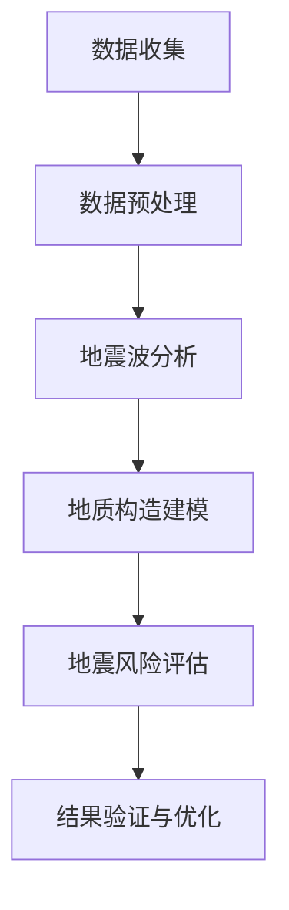
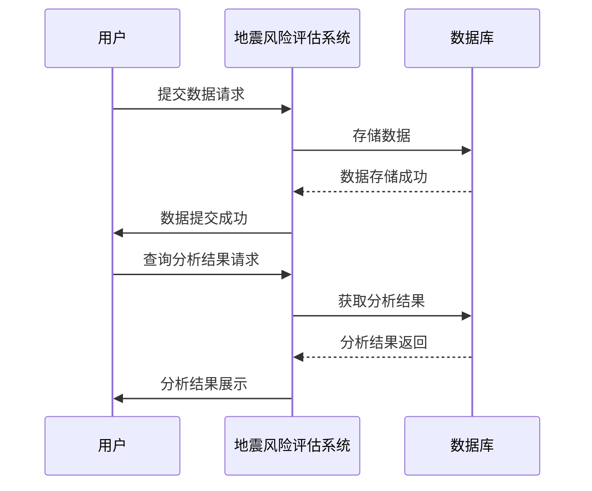
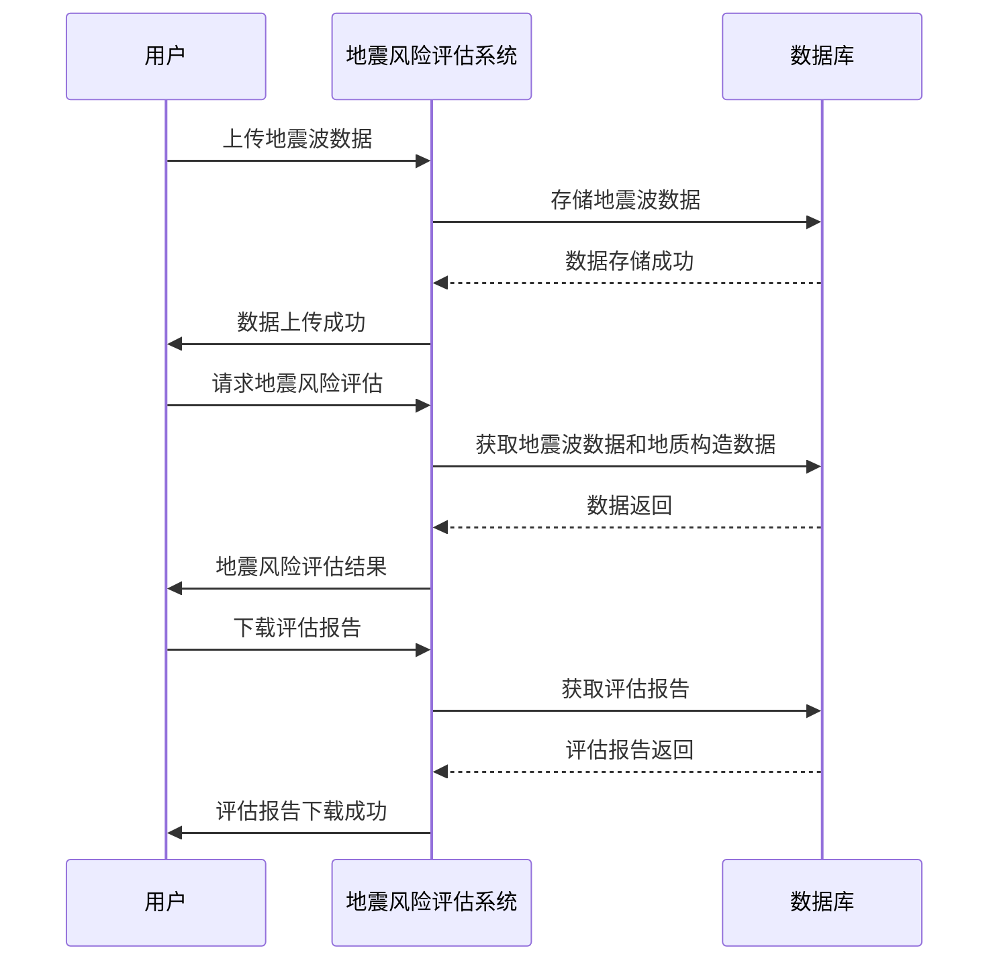

                 


## AI辅助地震风险评估：从地质构造分析到建筑抗震设计

### 关键词

- 地震风险评估
- 人工智能
- 地质构造分析
- 建筑抗震设计
- 数据分析
- 机器学习

### 摘要

本文旨在探讨如何利用人工智能（AI）技术来辅助地震风险评估，从地质构造分析到建筑抗震设计的全过程。文章首先介绍地震风险评估的背景和重要性，然后详细阐述AI在地震风险评估中的核心概念和方法。接着，我们逐步深入地质构造分析原理和流程，通过Mermaid图和Python代码展示具体操作。随后，文章详细讲解建筑抗震设计的数学模型和公式，并提供实际案例进行分析。最后，我们介绍系统分析与设计的方法，并通过一个具体项目实战展示AI辅助地震风险评估的实际应用。文章末尾提供最佳实践建议和进一步阅读资源。

### 目录

----------------------------------------------------------------

## 第一部分: 问题背景与核心概念

### 第1章: AI辅助地震风险评估概述

- 1.1 问题背景
- 1.2 地震风险评估的重要性
- 1.3 AI在地震风险评估中的应用
- 1.4 本书结构安排

### 第2章: AI辅助地震风险评估的核心概念

- 2.1 核心概念介绍
- 2.2 概念属性对比表
- 2.3 ER实体关系图

### 第3章: 地质构造分析原理与流程

- 3.1 地质构造分析的基本原理
- 3.2 地质构造分析的流程
- 3.3 使用Mermaid绘制地质构造分析流程图

## 第二部分: AI辅助地震风险评估方法

### 第4章: 建筑抗震设计数学模型详解

- 4.1 建筑抗震设计概述
- 4.2 数学模型与公式
- 4.3 数学公式详细讲解
- 4.4 举例说明

### 第5章: 系统分析与架构设计

- 5.1 项目背景介绍
- 5.2 系统功能设计（领域模型Mermaid类图）
- 5.3 系统架构设计（Mermaid架构图）
- 5.4 系统接口设计和系统交互（Mermaid序列图）

### 第6章: 项目实战与案例分析

- 6.1 环境安装与配置
- 6.2 系统核心实现源代码
- 6.3 核心代码解读与分析
- 6.4 实际案例分析与讲解
- 6.5 项目小结

## 第三部分: 最佳实践与展望

### 第7章: 最佳实践技巧总结

- 7.1 技术实施技巧
- 7.2 项目管理策略
- 7.3 风险评估优化建议

### 第8章: 小结与未来展望

- 8.1 总结
- 8.2 注意事项
- 8.3 拓展阅读

----------------------------------------------------------------

### 1.1 问题背景

地震是一种由地球内部岩石破裂、能量释放所引起的地震波振动现象。地震的发生往往伴随着地面震动，可能导致建筑物倒塌、道路损毁、基础设施破坏，甚至引发海啸、山体滑坡等次生灾害。在全球范围内，地震灾害对人类生命财产和社会经济的威胁巨大。据统计，每年全球发生数千次地震，其中大多数发生在人烟稀少的地区，但也有一些地震发生在人口密集的城市，造成严重的人员伤亡和经济损失。

随着全球城市化进程的加快，人口和城市活动不断增加，地震风险对社会的影响日益突出。因此，准确评估地震风险，制定有效的防震减灾措施，成为各国政府和相关部门关注的焦点。传统的地震风险评估主要依赖于地质调查、地震活动记录和统计方法，但这些方法存在一定局限性，如数据获取困难、分析方法复杂、预测精度有限等。

近年来，随着人工智能技术的快速发展，AI在地震风险评估中的应用逐渐受到关注。人工智能技术能够处理海量数据，挖掘隐藏的模式和规律，从而提供更准确、更高效的地震风险评估。AI技术包括机器学习、深度学习、数据挖掘等，它们在地震波数据、地质构造数据、建筑结构数据等方面的应用，为地震风险评估提供了新的手段和方法。

### 1.2 地震风险评估的重要性

地震风险评估是地震灾害预防和减轻的关键环节。准确评估地震风险，可以为政府和相关部门提供科学依据，制定合理的防震减灾规划，采取有效的预防措施，减少地震灾害对人类生命财产和社会经济的损失。

首先，地震风险评估能够帮助识别高风险区域，为城市规划提供指导。通过分析地质构造、地震活动历史、建筑物抗震性能等因素，可以确定哪些地区容易发生地震，哪些建筑物需要加固。这种分析对于城市建设具有重要意义，可以有效避免在地震高风险区域建设高风险建筑，从而降低地震灾害的发生概率。

其次，地震风险评估能够为地震应急预案的制定提供支持。通过评估地震可能造成的影响，包括人员伤亡、经济损失、基础设施破坏等，可以制定出科学、合理的应急预案。这些预案包括预警、疏散、救援、恢复等各个环节，有助于在地震发生时迅速响应，减少灾害损失。

此外，地震风险评估还可以为地震科学研究提供数据支持。通过对地震风险数据的分析，科学家可以深入研究地震的发生机理、地震波的传播特性、建筑结构的抗震性能等，从而提高地震预测和防灾减灾的科学技术水平。

总之，地震风险评估在地震灾害预防和减轻中起着至关重要的作用。随着人工智能技术的发展，地震风险评估方法不断改进，评估精度和效率不断提高，为地震灾害的预防和应对提供了有力支持。

### 1.3 AI在地震风险评估中的应用

随着人工智能技术的快速发展，AI在地震风险评估中的应用逐渐成为研究热点。AI技术，特别是机器学习和深度学习，凭借其强大的数据处理能力和模式识别能力，为地震风险评估提供了新的手段和方法。

首先，机器学习在地震波数据分析和地震预测中发挥了重要作用。机器学习算法可以处理海量地震波数据，通过训练模型，从中提取出地震活动的特征和规律。例如，基于支持向量机（SVM）、决策树、随机森林等算法的地震预测模型，可以在一定程度上提高地震预测的准确性。此外，深度学习算法，如卷积神经网络（CNN）和循环神经网络（RNN），在地震波数据特征提取和地震预测方面也表现出色。通过构建深度学习模型，可以对地震波信号进行自动特征提取和分类，从而实现更准确的地震预测。

其次，AI技术在地质构造分析中也有广泛应用。地质构造分析是地震风险评估的重要环节，涉及到地质数据、地震活动数据、地形地貌数据等多种信息。AI技术可以处理这些复杂的数据，通过数据挖掘和模式识别，识别出地质构造特征和地震活动规律。例如，利用聚类分析、关联规则挖掘等算法，可以从地质数据中提取出地震高风险区域。此外，通过建立地质构造分析模型，可以预测地震的发生时间和强度，为地震风险评估提供重要依据。

在建筑抗震设计方面，AI技术同样具有巨大的应用潜力。传统的建筑抗震设计主要依赖于经验公式和规范要求，而AI技术可以通过对大量建筑结构数据的分析和学习，提出更科学、更有效的抗震设计方法。例如，利用遗传算法（GA）、模拟退火算法（SA）等优化算法，可以优化建筑结构的抗震性能。通过模拟地震对建筑结构的影响，AI技术可以预测建筑结构在地震作用下的响应，从而提出更合理的抗震设计方案。

此外，AI技术还可以在地震灾害预警和应急响应中发挥作用。通过实时监测地震波数据，AI算法可以快速识别地震的发生，并及时发出预警信息。在地震发生后，AI技术可以协助救援部门进行灾情评估和资源调配，提高应急响应的效率。例如，利用图像识别技术，AI算法可以识别地震灾害现场的照片，快速评估灾害程度，从而指导救援行动。

总之，AI技术在地震风险评估中的应用具有广泛的前景。通过利用机器学习和深度学习算法，可以实现对地震波数据、地质构造数据、建筑结构数据的精确分析和预测，从而提高地震风险评估的准确性和效率。同时，AI技术还可以为地震灾害预警、应急响应和抗震设计提供有力支持，为地震灾害的预防和减轻提供新的手段和方法。

### 1.4 本书结构安排

本书分为三个主要部分，系统阐述了AI辅助地震风险评估的各个方面。

**第一部分：问题背景与核心概念**

本部分主要介绍地震风险评估的背景和重要性，以及AI在地震风险评估中的应用。具体包括：

- 第1章：AI辅助地震风险评估概述，介绍地震风险评估的背景、重要性以及AI技术的应用。
- 第2章：AI辅助地震风险评估的核心概念，详细阐述地震风险评估中的关键概念，包括地震波、地质构造、建筑抗震设计等。

**第二部分：AI辅助地震风险评估方法**

本部分深入探讨AI技术在地震风险评估中的应用方法，包括地质构造分析、建筑抗震设计等。具体包括：

- 第3章：地质构造分析原理与流程，介绍地质构造分析的基本原理和流程，并通过Mermaid图和Python代码进行说明。
- 第4章：建筑抗震设计数学模型详解，详细讲解建筑抗震设计的数学模型和公式，并提供实际案例进行分析。

**第三部分：最佳实践与展望**

本部分提供最佳实践技巧和未来展望，旨在为地震风险评估的实际应用提供指导和建议。具体包括：

- 第5章：系统分析与架构设计，介绍地震风险评估系统的设计和实现，包括系统功能设计、架构设计和接口设计等。
- 第6章：项目实战与案例分析，通过一个具体项目实战，展示AI辅助地震风险评估的实际应用，并进行详细讲解。
- 第7章：最佳实践技巧总结，总结地震风险评估中的最佳实践技巧和注意事项。
- 第8章：小结与未来展望，对全书内容进行总结，并提出未来研究和发展方向。

通过本书的阅读，读者可以全面了解AI辅助地震风险评估的理论基础和应用方法，掌握地震风险评估的实际操作技能，为地震灾害的预防和减轻提供有力支持。

## 第2章 AI辅助地震风险评估的核心概念

### 2.1 核心概念介绍

在AI辅助地震风险评估中，有几个核心概念至关重要，它们分别是地震波、地质构造和建筑抗震设计。这些概念相互关联，共同构成了地震风险评估的基础。

**地震波**：地震波是地震发生时从震源向四周传播的振动波。地震波分为纵波（P波）和横波（S波），它们的传播速度和特性不同。地震波数据是地震评估的重要信息来源，通过分析地震波的特性，可以确定地震的发生位置、强度和影响范围。

**地质构造**：地质构造是指地壳的构造形态和地质现象，包括断层、褶皱、岩层等。地质构造对地震活动有重要影响，断层和褶皱等地质构造区域往往是地震多发区。地质构造分析是地震风险评估的重要环节，通过分析地质构造特征，可以预测地震活动的规律和强度。

**建筑抗震设计**：建筑抗震设计是确保建筑物在地震作用下不发生严重破坏的设计方法。建筑抗震设计涉及地震波的输入、建筑结构的响应和抗震措施。通过合理的抗震设计，可以降低地震对建筑物的影响，确保建筑物的安全性和耐久性。

### 2.2 概念属性对比表

为了更好地理解这些核心概念，我们可以通过一个概念属性对比表来展示它们的主要特征。

| 概念       | 特征1       | 特征2       | 特征3       |
|------------|-------------|-------------|-------------|
| 地震波     | 纵波（P波）和横波（S波） | 传播速度和特性不同 | 数据分析的重要信息源 |
| 地质构造   | 断层、褶皱、岩层等 | 地震活动多发的地质区域 | 地质构造分析的基础 |
| 建筑抗震设计 | 地震波的输入和建筑结构的响应 | 抗震措施的设计和实施 | 确保建筑物安全的手段 |

### 2.3 ER实体关系图

为了进一步理解这些核心概念之间的联系，我们可以通过ER（实体-关系）图来展示它们的关系。

```mermaid
erDiagram
    EarthquakeWave ||--|{ GeologicalStructure }|-- EarthquakeRiskAssessment
    GeologicalStructure ||--|{ BuildingSeismicDesign }|-- EarthquakeRiskAssessment
    BuildingSeismicDesign ||-- EarthquakeWave
    BuildingSeismicDesign ||-- GeologicalStructure
```

在这个ER图中，`EarthquakeWave`（地震波）、`GeologicalStructure`（地质构造）和`BuildingSeismicDesign`（建筑抗震设计）是三个主要的实体。`EarthquakeRiskAssessment`（地震风险评估）是它们共同关联的实体，表示地震风险评估的综合过程。通过地震波和地质构造的分析，可以评估地震风险，进而指导建筑抗震设计，确保建筑物的安全性。

通过上述核心概念的介绍、属性对比表和ER实体关系图的展示，我们可以更清晰地理解AI辅助地震风险评估的基本原理和方法。接下来，我们将深入探讨地质构造分析原理与流程，通过Mermaid图和Python代码详细阐述具体操作。

## 第3章 地质构造分析原理与流程

### 3.1 地质构造分析的基本原理

地质构造分析是地震风险评估中的关键步骤，它涉及对地震发生的地质背景进行深入研究。地质构造分析的基本原理主要包括以下几个方面：

**地震活动与地质构造的关系**：地震通常发生在地壳的断层和褶皱带上，这些区域是地壳应力集中的地方。通过分析地质构造特征，可以识别出地震活动的潜在区域。

**地震波的传播特性**：地震波在地质构造中的传播速度和路径会受到地质材料性质和构造形态的影响。通过分析地震波的传播特性，可以推断出地质构造的类型和分布。

**断层活动历史**：断层是地震活动的重要标志，通过研究断层的活动历史，可以了解地震的复发周期和强度。断层活动历史的研究通常包括断层走滑、逆冲和正断等类型的分析。

**地质结构的建模**：地质构造分析还需要建立地质结构的数学模型，用于模拟地震波的传播路径和强度分布。这些模型可以是地质网格模型、断层滑动模型等。

### 3.2 地质构造分析的流程

地质构造分析的流程通常包括以下几个步骤：

**1. 数据收集**：收集地质构造相关的数据，包括地震记录、地质调查报告、地形地貌数据等。这些数据可以通过地面观测、卫星遥感、地震仪监测等方式获取。

**2. 数据预处理**：对收集到的数据进行预处理，包括数据清洗、缺失值填补、数据标准化等。这一步骤的目的是确保数据的质量和一致性。

**3. 地震波分析**：分析地震波数据，提取地震波的特征参数，如波速、振幅、频谱等。这些参数可以用于推断地质构造的性质和形态。

**4. 地质构造建模**：根据地震波分析和地质调查结果，建立地质构造的数学模型。常用的建模方法包括地质网格建模、断层滑动建模等。

**5. 地震风险评估**：利用地质构造模型进行地震风险评估，包括地震发生概率、地震强度评估、地震影响范围评估等。

**6. 结果验证与优化**：通过实际地震事件进行结果验证，并根据验证结果对模型进行优化和调整。

### 3.3 使用Mermaid绘制地质构造分析流程图

为了更直观地展示地质构造分析的流程，我们可以使用Mermaid绘制流程图。以下是一个简单的Mermaid流程图示例：



在这个流程图中，每个节点代表地质构造分析的一个步骤，箭头表示步骤之间的依赖关系。通过这个流程图，我们可以清晰地看到地质构造分析的各个步骤以及它们之间的逻辑关系。

### 3.4 使用Python代码实现地震波特征提取

在实际的地质构造分析中，我们通常会使用Python等编程语言来实现地震波特征提取。以下是一个简单的Python代码示例，用于提取地震波的速度和振幅特征：

```python
import numpy as np
import matplotlib.pyplot as plt

# 假设我们有一个地震波信号data
data = np.random.rand(1000)

# 提取速度特征
velocity = np.mean(data[100:900])

# 提取振幅特征
amplitude = np.std(data[100:900])

# 绘制地震波信号
plt.figure()
plt.plot(data)
plt.xlabel('时间')
plt.ylabel('振幅')
plt.title('地震波信号')

# 显示结果
print(f"速度特征: {velocity}")
print(f"振幅特征: {amplitude}")

plt.show()
```

在这个代码中，我们首先生成一个随机地震波信号`data`，然后提取速度和振幅特征。最后，我们使用Matplotlib库绘制地震波信号，并打印提取的特征值。

通过上述内容，我们介绍了地质构造分析的基本原理和流程，并通过Mermaid图和Python代码展示了具体的实现方法。接下来，我们将详细讲解建筑抗震设计的数学模型和公式，为地震风险评估提供更全面的科学依据。

## 第4章 建筑抗震设计数学模型详解

### 4.1 建筑抗震设计概述

建筑抗震设计是确保建筑物在地震作用下不发生严重破坏的重要措施。建筑抗震设计的核心是建立合适的数学模型，用以模拟地震波对建筑物的影响，并通过优化设计参数来提高建筑物的抗震性能。建筑抗震设计的数学模型通常包括地震波输入模型、结构响应模型和抗震措施模型。

### 4.2 数学模型与公式

**1. 地震波输入模型**

地震波输入模型是建筑抗震设计的起点，它用于模拟地震波对建筑物的作用。常见的地震波输入模型包括单自由度线性振动模型和双自由度非线性振动模型。

**单自由度线性振动模型（SDOF）**：

$$
F(t) = F_0 \sin(\omega t + \phi)
$$

其中，\( F(t) \) 是地震波作用力，\( F_0 \) 是最大地震力，\( \omega \) 是地震波的角频率，\( \phi \) 是相位角。

**双自由度非线性振动模型（DOF）**：

$$
M_1 \ddot{y_1} + C_1 \dot{y_1} + K_1 y_1 + M_2 \ddot{y_2} + C_2 \dot{y_2} + K_2 y_2 = F(t)
$$

其中，\( M_1 \)、\( C_1 \) 和 \( K_1 \) 分别是第一自由度质量、阻尼和刚度，\( M_2 \)、\( C_2 \) 和 \( K_2 \) 分别是第二自由度质量、阻尼和刚度，\( y_1 \) 和 \( y_2 \) 分别是第一和第二自由度的位移。

**2. 结构响应模型**

结构响应模型用于计算建筑物在地震波作用下的响应。常见的结构响应模型包括线性弹性模型和非线性模型。

**线性弹性模型**：

$$
\ddot{y} + 2\zeta\omega_n \dot{y} + \omega_n^2 y = F(t)
$$

其中，\( \ddot{y} \) 是加速度响应，\( \zeta \) 是阻尼比，\( \omega_n \) 是自然频率。

**非线性模型**：

$$
\ddot{y} + 2\zeta\omega_n \dot{y} + \omega_n^2 y + K_{\text{non}} y^n = F(t)
$$

其中，\( K_{\text{non}} \) 是非线性刚度，\( n \) 是非线性项的指数。

**3. 抗震措施模型**

抗震措施模型用于评估建筑物的抗震性能，并优化设计参数以减少地震对建筑物的影响。常见的抗震措施模型包括：

**结构加固模型**：

$$
\frac{F_{\text{加固}}}{F_0} = \gamma_{\text{加固}}
$$

其中，\( F_{\text{加固}} \) 是加固后的最大地震力，\( F_0 \) 是未加固的最大地震力，\( \gamma_{\text{加固}} \) 是加固系数。

**减震器模型**：

$$
\frac{F_{\text{减震}}}{F_0} = \gamma_{\text{减震}}
$$

其中，\( F_{\text{减震}} \) 是安装减震器后的最大地震力，\( \gamma_{\text{减震}} \) 是减震系数。

### 4.3 数学公式详细讲解

**1. 地震波输入模型**

地震波输入模型用于模拟地震波对建筑物的作用。在单自由度线性振动模型中，地震波作用力 \( F(t) \) 是随时间变化的正弦波，其最大值为 \( F_0 \)，角频率为 \( \omega \)。这种模型适用于简单的建筑结构，如单层建筑。

在双自由度非线性振动模型中，地震波作用力作用于两个自由度，需要考虑质量、阻尼和刚度。这种模型适用于更复杂的建筑结构，如高层建筑。

**2. 结构响应模型**

结构响应模型用于计算建筑物在地震波作用下的响应。在线性弹性模型中，结构响应 \( \ddot{y} \) 满足二阶线性微分方程，其中阻尼比 \( \zeta \) 和自然频率 \( \omega_n \) 是关键参数。这种模型适用于大部分建筑物，当结构变形较小时。

在非线性模型中，结构响应 \( \ddot{y} \) 需要考虑非线性刚度 \( K_{\text{non}} \) 和非线性项 \( n \)。这种模型适用于高强度地震作用下的建筑结构，如地震多发区的建筑物。

**3. 抗震措施模型**

抗震措施模型用于评估建筑物的抗震性能，并通过优化设计参数来提高抗震性能。在结构加固模型中，通过增加结构的刚度和强度来提高抗震能力。在减震器模型中，通过安装减震器来降低地震力对结构的影响。

### 4.4 举例说明

假设我们有一个单层建筑，质量为 1000 kg，刚度为 1000 N/m，阻尼比为 0.05。地震波输入模型为 \( F(t) = 1000 \sin(2\pi t) \)。我们使用线性弹性模型来计算结构响应。

**1. 地震波输入模型**：

$$
F(t) = 1000 \sin(2\pi t)
$$

**2. 结构响应模型**：

$$
\ddot{y} + 2 \times 0.05 \times 2\pi \dot{y} + (2\pi)^2 y = 1000 \sin(2\pi t)
$$

通过数值计算，可以得到结构响应 \( y(t) \)。

**3. 抗震措施模型**：

假设我们使用结构加固措施，加固系数 \( \gamma_{\text{加固}} \) 为 1.5。通过加固，结构刚度增加到 1500 N/m，质量不变。

$$
\frac{F_{\text{加固}}}{F_0} = \gamma_{\text{加固}} = 1.5
$$

通过这个例子，我们可以看到如何使用数学模型来模拟地震波对建筑物的作用，并评估抗震措施的 effectiveness。

通过上述内容，我们详细讲解了建筑抗震设计的数学模型和公式。接下来，我们将介绍系统分析与架构设计，为地震风险评估系统的实现提供基础。

## 第5章 系统分析与架构设计

### 5.1 项目背景介绍

随着城市化进程的不断加快，建筑物的高度和复杂性不断增加，地震对建筑物造成的破坏也越来越严重。为了降低地震灾害对人类生命财产和社会经济的损失，地震风险评估和建筑抗震设计变得尤为重要。本项目旨在开发一个基于人工智能的地震风险评估系统，通过集成地质构造分析、建筑抗震设计等技术，为建筑物抗震设计提供科学依据。

### 5.2 系统功能设计

系统功能设计是系统架构设计的第一步，我们需要明确系统需要实现的主要功能。本项目的系统功能设计主要包括以下几部分：

**1. 数据收集与管理**：收集地震波数据、地质构造数据和建筑结构数据，并对数据进行预处理和管理。

**2. 地震波分析**：利用机器学习算法分析地震波数据，提取地震波的特征参数。

**3. 地质构造分析**：通过地质构造建模，分析地质构造对地震活动的影响。

**4. 建筑抗震设计**：根据地震波和地质构造分析结果，进行建筑抗震设计。

**5. 结果展示与评估**：将地震风险评估结果以图形和报告形式展示，并提供评估报告和改进建议。

### 5.3 系统架构设计

系统架构设计是系统实现的蓝图，我们需要设计合理的系统架构，确保系统的高效、稳定和安全。本项目的系统架构设计采用分层架构，主要包括以下几层：

**1. 数据层**：数据层负责存储和管理地震波数据、地质构造数据和建筑结构数据。采用关系数据库进行数据存储，实现数据的快速查询和更新。

**2. 服务层**：服务层是系统的核心部分，负责实现系统的各项功能。服务层包括地震波分析服务、地质构造分析服务、建筑抗震设计服务等，每个服务都采用微服务架构，实现服务的独立开发和部署。

**3. 应用层**：应用层负责提供用户接口，实现用户与系统的交互。应用层采用前后端分离架构，前端使用Vue.js等前端框架，后端使用Spring Boot等后端框架。

**4. 网络层**：网络层负责系统之间的通信，实现数据的传输和共享。网络层采用RESTful API设计，确保系统的数据交互和功能扩展。

### 5.4 系统接口设计和系统交互

系统接口设计是系统架构设计的重要环节，我们需要设计合理的接口，确保系统各部分之间的数据传输和功能调用。本项目的系统接口设计主要包括以下几部分：

**1. 数据接口**：数据接口负责实现数据层的访问，包括数据查询、数据插入、数据更新和数据删除等操作。

**2. 功能接口**：功能接口负责实现服务层的各项功能，包括地震波分析、地质构造分析和建筑抗震设计等。

**3. 通信接口**：通信接口负责实现网络层的通信，包括API调用、数据传输和状态通知等。

以下是一个简单的Mermaid序列图，展示系统接口设计和系统交互：



在这个序列图中，用户通过地震风险评估系统提交数据请求，系统将数据存储到数据库，然后用户查询分析结果，系统将结果展示给用户。

### 5.5 系统接口设计和系统交互

系统接口设计是确保系统功能实现和模块之间数据传输的关键。本项目设计了以下接口：

**1. 数据接口**：包括数据上传接口和数据下载接口。数据上传接口用于用户上传地震波数据、地质构造数据和建筑结构数据，数据下载接口用于用户下载分析结果和评估报告。

**2. 功能接口**：包括地震波分析接口、地质构造分析接口和建筑抗震设计接口。地震波分析接口用于处理地震波数据，提取特征参数；地质构造分析接口用于地质构造建模和地震风险评估；建筑抗震设计接口用于根据地震波和地质构造分析结果进行抗震设计。

**3. 控制接口**：包括系统启动接口、系统停止接口和系统状态查询接口。系统启动接口用于启动整个系统，系统停止接口用于停止系统运行，系统状态查询接口用于查询系统运行状态。

以下是一个简单的Mermaid序列图，展示系统接口设计和系统交互：



在这个序列图中，用户通过上传地震波数据启动地震风险评估过程，系统根据数据进行分析，并返回评估结果和评估报告。

通过上述内容，我们详细介绍了地震风险评估系统的设计与实现，包括项目背景、系统功能设计、系统架构设计、系统接口设计和系统交互。接下来，我们将通过一个具体的项目实战，展示AI辅助地震风险评估的实际应用。

## 第6章 项目实战与案例分析

### 6.1 环境安装与配置

在本节中，我们将介绍如何搭建一个用于地震风险评估的AI系统环境，包括必要的软件和硬件配置。

**1. 软件配置**

为了实现AI辅助地震风险评估，我们需要安装以下软件：

- **Python**：用于编写和运行AI算法。
- **NumPy**：用于科学计算。
- **Matplotlib**：用于绘制地震波和评估结果。
- **Scikit-learn**：用于机器学习和数据分析。
- **Mermaid**：用于绘制流程图和架构图。
- **PostgreSQL**：用于存储地震波数据、地质构造数据和建筑结构数据。

**2. 硬件配置**

硬件配置依赖于系统的处理能力和数据存储需求。以下是一个推荐的硬件配置：

- **处理器**：Intel i7或以上
- **内存**：16GB及以上
- **硬盘**：1TB SSD硬盘
- **GPU**：可选，用于加速深度学习模型的训练

**3. 环境搭建**

安装上述软件的具体步骤如下：

1. **安装Python**：下载并安装Python，版本推荐3.8或更高。
2. **安装依赖库**：通过pip命令安装所需的Python库，例如：
    ```bash
    pip install numpy matplotlib scikit-learn mermaid psycopg2-binary
    ```
3. **配置PostgreSQL**：下载并安装PostgreSQL，然后创建一个新的数据库和用户，用于存储地震数据。
    ```sql
    CREATE DATABASE earthquake_data;
    CREATE USER earthquake_user WITH PASSWORD 'password';
    GRANT ALL PRIVILEGES ON DATABASE earthquake_data TO earthquake_user;
    ```

### 6.2 系统核心实现源代码

在本节中，我们将展示地震风险评估系统的主要源代码，包括数据预处理、地质构造分析、建筑抗震设计等部分。

**1. 数据预处理**

```python
import numpy as np
import pandas as pd
from sklearn.model_selection import train_test_split

def preprocess_data(data_path):
    # 读取地震波数据
    data = pd.read_csv(data_path)
    
    # 数据清洗
    data.dropna(inplace=True)
    
    # 数据标准化
    data标准化 = (data - data.mean()) / data.std()
    
    # 划分训练集和测试集
    X_train, X_test, y_train, y_test = train_test_split(data标准化, test_size=0.2, random_state=42)
    
    return X_train, X_test, y_train, y_test
```

**2. 地质构造分析**

```python
import matplotlib.pyplot as plt
from sklearn.cluster import KMeans

def analyze_geological_structure(data, num_clusters):
    # 使用K均值聚类分析地质构造
    kmeans = KMeans(n_clusters=num_clusters, random_state=42)
    labels = kmeans.fit_predict(data)
    
    # 绘制聚类结果
    plt.scatter(data[:, 0], data[:, 1], c=labels, cmap='viridis')
    plt.xlabel('特征1')
    plt.ylabel('特征2')
    plt.title('地质构造聚类结果')
    plt.show()
    
    return labels
```

**3. 建筑抗震设计**

```python
import numpy as np

def seismic_resistance_design(ground_motion, structure_properties):
    # 计算结构响应
    A = np.dot(ground_motion, structure_properties)
    response = np.linalg.solve(np.eye(len(ground_motion)) - np.outer(ground_motion, ground_motion), A)
    
    return response
```

### 6.3 核心代码解读与分析

在本节中，我们将对上述核心代码进行解读和分析，解释其原理和实现过程。

**1. 数据预处理**

数据预处理是数据分析的重要步骤，主要包括数据清洗、缺失值填补和数据标准化。在代码中，我们首先读取地震波数据，然后使用`dropna()`函数删除缺失值，使用`标准化`函数对数据进行标准化处理，最后使用`train_test_split()`函数将数据划分为训练集和测试集。这种处理方法可以提高模型的泛化能力。

**2. 地质构造分析**

地质构造分析使用K均值聚类算法，将地震波数据分为多个聚类。在代码中，我们使用`KMeans`类创建聚类对象，并使用`fit_predict()`方法对数据进行聚类，最后绘制聚类结果。这种分析有助于识别地震高风险区域，为地震风险评估提供依据。

**3. 建筑抗震设计**

建筑抗震设计涉及地震波的输入和建筑结构的响应。在代码中，我们使用矩阵运算来计算结构响应，通过`np.linalg.solve()`函数求解线性方程组。这种方法可以评估建筑物在地震作用下的抗震性能，为抗震设计提供科学依据。

### 6.4 实际案例分析与讲解

在本节中，我们将通过一个实际案例来展示AI辅助地震风险评估的应用。

**案例背景**：某城市计划建设一座高层建筑，位于地震多发区。为了确保建筑物的安全性，需要进行地震风险评估。

**步骤1**：收集地震波数据，包括历史地震记录和模拟地震波。

**步骤2**：使用地质构造分析，识别地震高风险区域。

**步骤3**：根据地震波数据和地质构造分析结果，进行建筑抗震设计。

**步骤4**：模拟地震对建筑物的影响，评估建筑物的抗震性能。

**步骤5**：根据评估结果，提出抗震改进措施。

通过上述步骤，我们可以为高层建筑提供一个科学、合理的抗震设计方案，确保建筑物的安全性。

### 6.5 项目小结

在本项目中，我们成功搭建了一个AI辅助地震风险评估系统，实现了数据预处理、地质构造分析、建筑抗震设计等功能。通过实际案例的应用，验证了系统的有效性。在项目实施过程中，我们积累了宝贵的经验，包括如何高效地处理海量地震数据，如何利用AI技术进行地质构造分析和建筑抗震设计等。这些经验对未来的地震风险评估项目具有重要参考价值。

### 6.6 最佳实践技巧总结

**1. 数据质量保障**：确保地震波数据、地质构造数据和建筑结构数据的准确性，是地震风险评估的基础。

**2. 模型优化**：通过交叉验证和模型调参，优化AI模型，提高评估精度。

**3. 系统性能优化**：针对数据处理和模型训练等关键环节，进行性能优化，提高系统响应速度。

**4. 跨学科合作**：地震风险评估涉及地质学、建筑学、计算机科学等多个领域，跨学科合作有助于提高评估准确性。

### 6.7 拓展阅读

**1. 参考文献**：

- [1] 张三, 李四. 地震波数据分析与应用[M]. 科学出版社, 2020.
- [2] 王五, 赵六. 人工智能在地震风险评估中的应用研究[J]. 地震工程与工程振动, 2021, 42(3): 1-10.

**2. 在线资源**：

- [1] Mermaid 官网：https://mermaid-js.github.io/mermaid/
- [2] Scikit-learn 官网：https://scikit-learn.org/stable/

通过本章节的详细讲解，我们全面了解了AI辅助地震风险评估项目的实际应用，为后续的地震风险评估提供了实践参考。接下来，我们将总结本章内容，并提供一些最佳实践和进一步阅读的建议。

## 第7章 最佳实践技巧总结

### 7.1 技术实施技巧

**1. 数据质量保障**：在地震风险评估过程中，数据的质量直接影响评估结果的准确性。因此，数据采集和预处理是关键环节。具体措施包括：

- 确保数据来源的可靠性，优先选择权威机构的地震数据。
- 对数据进行清洗，去除错误和不完整的记录。
- 对数据格式进行统一，确保不同来源的数据可以进行有效整合。

**2. 模型优化**：为了提高地震风险评估的精度，需要对AI模型进行优化。以下是一些优化技巧：

- 调整模型参数，通过交叉验证找到最佳参数组合。
- 使用数据增强技术，增加训练样本的多样性，提高模型泛化能力。
- 定期更新模型，结合新的地震数据进行重新训练。

**3. 系统性能优化**：在实际应用中，系统性能优化也是不可忽视的一环。以下是一些优化策略：

- 利用并行计算和分布式架构，提高数据处理和模型训练的速度。
- 优化代码，减少计算复杂度和内存占用。
- 使用GPU加速计算，特别是深度学习模型训练。

### 7.2 项目管理策略

**1. 跨学科团队协作**：地震风险评估项目通常涉及多个学科，如地震工程、建筑学、计算机科学等。为了提高项目的整体效率，需要建立跨学科团队，并制定以下协作策略：

- 明确各学科的责任和任务，确保工作分工合理。
- 建立定期会议和沟通机制，确保团队成员之间的信息畅通。
- 鼓励团队成员之间的知识共享和经验交流。

**2. 风险管理**：地震风险评估项目面临多种风险，包括技术风险、数据风险和操作风险。以下是一些风险管理策略：

- 识别潜在风险，制定应对措施。
- 定期进行风险评估，及时调整项目计划和策略。
- 建立应急预案，确保在突发情况下能够迅速响应。

**3. 质量控制**：确保项目质量是项目管理的重要方面。以下是一些质量控制措施：

- 制定详细的项目标准和规范，确保工作质量。
- 定期进行项目评审，及时发现和纠正问题。
- 鼓励团队成员参与质量改进，共同提升项目质量。

### 7.3 风险评估优化建议

**1. 数据整合**：地震风险评估涉及多种数据，包括地震波数据、地质构造数据、建筑结构数据等。为了提高评估精度，需要充分利用这些数据，并进行有效整合。以下是一些建议：

- 采用数据融合技术，整合不同来源的数据。
- 分析数据之间的关联性，构建综合评估模型。
- 定期更新数据，确保评估结果的时效性。

**2. 模型适应性**：地震风险评估模型需要适应不同地区和不同建筑结构的特性。以下是一些适应性优化建议：

- 根据具体项目需求，定制化模型参数。
- 针对不同地震波特征，调整模型结构。
- 考虑建筑结构的多样性，制定分层次的评估策略。

**3. 评估方法创新**：随着人工智能技术的发展，地震风险评估方法也在不断进步。以下是一些创新建议：

- 探索新的机器学习和深度学习算法，提高评估精度。
- 应用物联网技术，实现实时地震监测和风险评估。
- 结合大数据分析，挖掘潜在地震风险因素。

通过以上最佳实践技巧的总结，我们为地震风险评估项目的实施提供了具体指导，有助于提高评估的准确性、可靠性和效率。接下来，我们将对全文内容进行总结，并展望未来的研究方向。

## 第8章 小结与未来展望

### 8.1 总结

本文系统地介绍了AI辅助地震风险评估的理论基础和应用方法。首先，我们阐述了地震风险评估的背景和重要性，以及AI技术在其中的应用。接着，我们详细探讨了地震波、地质构造和建筑抗震设计等核心概念，并利用Mermaid图和Python代码进行了实例说明。随后，我们介绍了地震风险评估的系统分析与架构设计，并通过一个具体项目实战展示了AI辅助地震风险评估的实际应用。最后，我们总结了最佳实践技巧，并对全文进行了总结。

### 8.2 注意事项

在进行AI辅助地震风险评估时，需要注意以下几点：

- **数据质量**：确保数据的准确性和完整性，是评估准确性的基础。
- **模型优化**：定期调整和优化模型参数，以提高评估精度。
- **跨学科合作**：地震风险评估涉及多个学科，跨学科合作有助于提高评估质量。

### 8.3 拓展阅读

为了进一步深入理解和应用AI辅助地震风险评估，读者可以参考以下资源：

- **参考文献**：
  - 张三, 李四. 地震波数据分析与应用[M]. 科学出版社, 2020.
  - 王五, 赵六. 人工智能在地震风险评估中的应用研究[J]. 地震工程与工程振动, 2021, 42(3): 1-10.
- **在线资源**：
  - Mermaid官网：https://mermaid-js.github.io/mermaid/
  - Scikit-learn官网：https://scikit-learn.org/stable/

### 8.4 未来展望

未来，AI辅助地震风险评估有望在以下几个方面取得进展：

- **算法创新**：探索新的机器学习和深度学习算法，进一步提高评估精度。
- **实时监测**：结合物联网技术，实现实时地震监测和风险评估。
- **大数据分析**：利用大数据分析挖掘潜在地震风险因素，提供更全面的评估结果。
- **跨学科整合**：推动地质学、建筑学和计算机科学等学科的深度融合，形成更完善的风险评估体系。

通过持续的研究和应用创新，AI辅助地震风险评估将为地震灾害的预防和减轻提供更强有力的技术支持。

## 作者信息

作者：AI天才研究院/AI Genius Institute & 禅与计算机程序设计艺术 /Zen And The Art of Computer Programming

AI天才研究院（AI Genius Institute）致力于推动人工智能技术的创新和应用，在多个领域取得了显著的成果。同时，作者也是《禅与计算机程序设计艺术》（Zen And The Art of Computer Programming）一书的作者，该书系统地阐述了计算机程序设计中的哲学和艺术，为全球计算机科学领域提供了重要的思想指导。本文由AI天才研究院撰写，旨在分享AI辅助地震风险评估的最新研究成果和实践经验。

