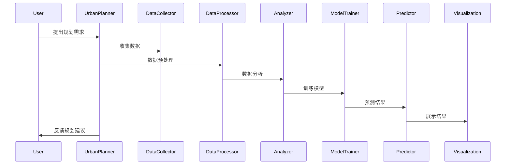
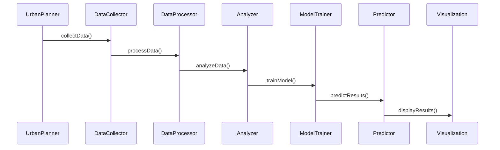
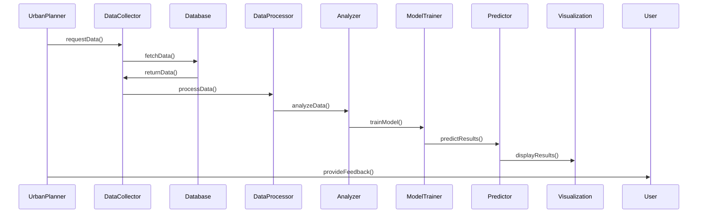

                 


### 引言

#### 城市规划的挑战与机遇

城市规划作为一门综合性学科，旨在通过科学的方法和合理的规划，实现城市资源的有效配置和城市功能的优化。然而，随着全球城市化进程的加速，城市面临着诸多挑战。人口增长、交通拥堵、环境污染等问题日益突出，传统的城市规划方法已无法满足现代城市的发展需求。

数据驱动的城市规划应运而生。借助大数据、云计算、人工智能等技术，城市规划可以从海量数据中提取有价值的信息，为决策提供科学依据。这不仅提高了规划的科学性和精准度，也增强了城市管理的智能化水平。

#### 数据驱动的城市规划现状

当前，数据驱动的城市规划已在全球范围内得到广泛应用。许多城市通过建设智慧城市项目，利用数据技术提升城市管理效率。例如，智能交通系统通过实时监测交通流量，优化交通信号灯控制，缓解交通拥堵；智能环境监测系统通过收集空气质量、水质等数据，实时监控城市环境状况，保障居民健康。

然而，尽管数据驱动的城市规划取得了显著成效，但仍然存在一些问题。一方面，城市规划所需的数据种类繁多、来源广泛，如何高效地收集、处理和整合这些数据是一个挑战。另一方面，城市规划的决策过程复杂，涉及多个利益相关方，如何确保数据的有效利用和决策的科学性也是一个难题。

#### AI在城市规划中的应用潜力

人工智能（AI）作为一种先进的数据处理技术，具有强大的学习能力、模式识别能力和自动化决策能力，为数据驱动的城市规划提供了新的思路和手段。以下是AI在城市规划中应用的几个关键领域：

1. **交通管理**：通过分析交通流量数据，AI可以预测交通状况，优化交通信号控制，提高道路通行效率。

2. **环境监测**：利用传感器网络和卫星遥感技术，AI可以对空气质量、水质等进行实时监测，为环境保护提供数据支持。

3. **绿地规划**：通过分析人口分布、交通流量等数据，AI可以优化城市绿地布局，提升城市生态环境质量。

4. **基础设施规划**：AI可以帮助评估城市基础设施的需求，预测未来发展趋势，为基础设施建设和改造提供科学依据。

#### 本书的目标与结构

本书旨在探讨AI辅助城市规划的原理、方法和实践，帮助读者了解如何利用数据驱动和人工智能技术解决城市规划中的实际问题。本书分为三个部分：

第一部分：引言。介绍城市规划的挑战与机遇，数据驱动的城市规划现状，以及AI在城市规划中的应用潜力。

第二部分：核心概念与联系。详细阐述AI的基本概念、数据驱动的决策支持系统、AI辅助城市规划的核心概念，以及与传统城市规划的对比。

第三部分：算法原理与实现。介绍城市规划数据来源、数据预处理算法、AI算法原理与应用，以及系统设计与实现。

通过这三个部分的内容，读者将全面了解AI辅助城市规划的理论基础和实践方法，为未来的城市规划工作提供有力的支持。

### 第一部分：引言

#### 第1章：问题背景与目标

##### 1.1.1 城市规划的挑战与机遇

城市作为现代社会发展的核心，其规划与管理日益受到重视。然而，传统的城市规划方法在面对日益复杂的城市问题时显得力不从心。首先，城市人口持续增长，带来了住房、交通、就业等压力。其次，城市化进程中出现的环境污染、交通拥堵等问题亟待解决。此外，随着信息技术的发展，城市的数据量呈现爆炸式增长，如何有效利用这些数据为城市规划提供支持也成为一大挑战。

在这样的背景下，数据驱动的城市规划应运而生。数据驱动的城市规划利用大数据、人工智能等技术，从海量数据中提取有价值的信息，为城市规划提供科学依据，提高决策的精准度和效率。数据驱动的城市规划不仅有助于解决当前的城市问题，还为城市未来发展提供了新的机遇。

##### 1.1.2 数据驱动的城市规划现状

当前，全球范围内的数据驱动的城市规划正在蓬勃发展。许多城市通过建设智慧城市项目，利用数据技术提升城市管理效率。例如，智能交通系统通过实时监测交通流量，优化交通信号控制，缓解交通拥堵；智能环境监测系统通过收集空气质量、水质等数据，实时监控城市环境状况，保障居民健康。此外，许多城市还利用大数据分析技术，对城市资源进行优化配置，提高城市管理效率。

然而，尽管数据驱动的城市规划取得了显著成效，但仍然存在一些问题。一方面，城市规划所需的数据种类繁多、来源广泛，如何高效地收集、处理和整合这些数据是一个挑战。另一方面，城市规划的决策过程复杂，涉及多个利益相关方，如何确保数据的有效利用和决策的科学性也是一个难题。

##### 1.1.3 AI在城市规划中的应用潜力

人工智能（AI）作为一种先进的数据处理技术，具有强大的学习能力、模式识别能力和自动化决策能力，为数据驱动的城市规划提供了新的思路和手段。以下是AI在城市规划中应用的几个关键领域：

1. **交通管理**：通过分析交通流量数据，AI可以预测交通状况，优化交通信号控制，提高道路通行效率。

2. **环境监测**：利用传感器网络和卫星遥感技术，AI可以对空气质量、水质等进行实时监测，为环境保护提供数据支持。

3. **绿地规划**：通过分析人口分布、交通流量等数据，AI可以优化城市绿地布局，提升城市生态环境质量。

4. **基础设施规划**：AI可以帮助评估城市基础设施的需求，预测未来发展趋势，为基础设施建设和改造提供科学依据。

##### 1.1.4 本书的目标与结构

本书旨在探讨AI辅助城市规划的原理、方法和实践，帮助读者了解如何利用数据驱动和人工智能技术解决城市规划中的实际问题。本书分为三个部分：

第一部分：引言。介绍城市规划的挑战与机遇，数据驱动的城市规划现状，以及AI在城市规划中的应用潜力。

第二部分：核心概念与联系。详细阐述AI的基本概念、数据驱动的决策支持系统、AI辅助城市规划的核心概念，以及与传统城市规划的对比。

第三部分：算法原理与实现。介绍城市规划数据来源、数据预处理算法、AI算法原理与应用，以及系统设计与实现。

通过这三个部分的内容，读者将全面了解AI辅助城市规划的理论基础和实践方法，为未来的城市规划工作提供有力的支持。

### 第二部分：核心概念与联系

#### 第2章：核心概念与联系

##### 2.1.1 AI的基本概念

人工智能（Artificial Intelligence，简称AI）是计算机科学的一个分支，旨在研究、开发和应用使计算机模拟、延伸和扩展人的智能的理论、方法、技术和系统。AI的核心目标是使计算机具备自我学习、推理、决策和感知的能力，从而实现自动化和智能化。

AI可以分为两类：一类是基于规则的AI，另一类是基于数据的AI。基于规则的AI通过定义一系列规则来模拟人类专家的决策过程。这类AI通常在规则清晰、问题结构化程度较高的领域表现良好。基于数据的AI则通过从大量数据中学习规律和模式，从而实现自动化决策。这类AI在处理大规模、复杂问题方面具有显著优势。

##### 2.1.2 数据驱动的决策支持系统

数据驱动的决策支持系统（Data-driven Decision Support System，简称D3SS）是一种利用数据分析和人工智能技术来辅助决策的系统。D3SS的核心思想是通过收集、处理和分析大量数据，为决策者提供科学、可靠的决策依据。D3SS通常包括以下几个关键组成部分：

1. **数据收集**：收集与决策相关的各种数据，包括结构化数据（如数据库）和非结构化数据（如图像、文本等）。

2. **数据预处理**：对收集到的数据进行清洗、转换和整合，使其符合分析要求。

3. **数据建模**：利用机器学习、深度学习等方法对数据进行建模，提取有价值的信息和特征。

4. **决策支持**：根据模型输出和决策者的需求，提供决策建议和可视化分析结果。

##### 2.1.3 AI辅助城市规划的核心概念

AI辅助城市规划是指利用人工智能技术辅助城市规划和管理的全过程，包括数据收集、处理、分析、决策和反馈等环节。AI辅助城市规划的核心概念可以概括为以下几点：

1. **数据驱动的规划**：通过收集和整合城市各种数据，为城市规划提供数据支持。

2. **智能化决策**：利用机器学习和深度学习技术，对城市数据进行智能分析和预测，为决策者提供科学依据。

3. **自动化执行**：通过自动化技术实现城市规划的自动化执行和监控，提高规划实施的效率和效果。

4. **持续反馈与优化**：通过实时监测和反馈，不断优化城市规划方案，实现城市可持续发展。

##### 2.1.4 AI辅助城市规划与传统城市规划的对比

传统城市规划主要依赖于专家经验和定性分析，存在以下局限性：

1. **主观性较强**：传统规划方法依赖于规划师的经验和判断，主观性较强，难以避免偏见和错误。

2. **效率较低**：传统规划方法通常需要大量的手工处理和分析，效率较低，难以应对大规模的城市规划任务。

3. **适应性较差**：传统规划方法难以适应快速变化的城市环境，城市规划的更新和调整较为困难。

相比之下，AI辅助城市规划具有以下优势：

1. **客观性较强**：AI辅助城市规划通过数据分析和智能算法，减少了主观因素的影响，提高了决策的科学性和客观性。

2. **效率较高**：AI辅助城市规划能够快速处理和分析大量数据，提高了规划的工作效率。

3. **适应性较强**：AI辅助城市规划能够实时监测城市环境变化，快速响应和调整规划方案，提高了规划的适应性。

总之，AI辅助城市规划不仅能够解决传统城市规划的局限性，还能为城市可持续发展提供新的思路和手段。

### 第二部分：核心概念与联系

#### 第2章：核心概念与联系

##### 2.1.1 AI的基本概念

人工智能（Artificial Intelligence，简称AI）是计算机科学的一个分支，旨在研究、开发和应用使计算机模拟、延伸和扩展人的智能的理论、方法、技术和系统。AI的核心目标是使计算机具备自我学习、推理、决策和感知的能力，从而实现自动化和智能化。

AI的发展历程可以追溯到20世纪50年代，最初的研究主要集中在符号主义方法上，即通过定义一组规则和符号来模拟人类的思维过程。然而，这种方法在面对复杂、非结构化问题时的局限性逐渐显现。随着计算能力的提升和数据量的增加，20世纪80年代以后，基于数据的AI方法（如统计学习、深度学习等）逐渐成为研究的热点。

AI可以分为多种类型，包括：

1. **基于规则的AI**：通过定义一组规则来模拟人类专家的决策过程，适用于规则清晰、问题结构化程度较高的领域。

2. **统计学习AI**：通过从数据中学习统计规律和模式，实现对数据的自动分析和分类，广泛应用于图像识别、自然语言处理等领域。

3. **深度学习AI**：通过多层神经网络模型，对大量数据进行训练，实现高级特征提取和模式识别，是当前AI研究的重要方向。

##### 2.1.2 数据驱动的决策支持系统

数据驱动的决策支持系统（Data-driven Decision Support System，简称D3SS）是一种利用数据分析和人工智能技术来辅助决策的系统。D3SS的核心思想是通过收集、处理和分析大量数据，为决策者提供科学、可靠的决策依据。D3SS通常包括以下几个关键组成部分：

1. **数据收集**：收集与决策相关的各种数据，包括结构化数据（如数据库）和非结构化数据（如图像、文本等）。

2. **数据预处理**：对收集到的数据进行清洗、转换和整合，使其符合分析要求。数据预处理是数据驱动决策支持系统的重要组成部分，直接影响后续分析的质量和效果。

3. **数据建模**：利用机器学习、深度学习等方法对数据进行建模，提取有价值的信息和特征。数据建模是D3SS的核心环节，通过构建模型，可以从大量数据中提取隐藏的规律和模式。

4. **决策支持**：根据模型输出和决策者的需求，提供决策建议和可视化分析结果。决策支持功能是D3SS的最终目的，通过提供可视化、交互式的方式，帮助决策者理解数据和分析结果，做出更科学的决策。

##### 2.1.3 AI辅助城市规划的核心概念

AI辅助城市规划是指利用人工智能技术辅助城市规划和管理的全过程，包括数据收集、处理、分析、决策和反馈等环节。AI辅助城市规划的核心概念可以概括为以下几点：

1. **数据驱动的规划**：通过收集和整合城市各种数据，为城市规划提供数据支持。数据驱动的规划方法使得城市规划更加客观、科学，减少了主观因素的影响。

2. **智能化决策**：利用机器学习和深度学习技术，对城市数据进行智能分析和预测，为决策者提供科学依据。智能化决策能够提高规划的科学性和准确性，减少决策过程中的不确定性。

3. **自动化执行**：通过自动化技术实现城市规划的自动化执行和监控，提高规划实施的效率和效果。自动化执行使得城市规划的执行过程更加高效、灵活，能够快速响应城市环境的变化。

4. **持续反馈与优化**：通过实时监测和反馈，不断优化城市规划方案，实现城市可持续发展。持续反馈与优化是AI辅助城市规划的关键，能够确保规划方案与实际需求保持一致，提高城市的整体效益。

##### 2.1.4 AI辅助城市规划与传统城市规划的对比

传统城市规划主要依赖于专家经验和定性分析，存在以下局限性：

1. **主观性较强**：传统规划方法依赖于规划师的经验和判断，主观性较强，难以避免偏见和错误。这种主观性可能导致规划方案的合理性和可行性受到影响。

2. **效率较低**：传统规划方法通常需要大量的手工处理和分析，效率较低，难以应对大规模的城市规划任务。这种低效率使得规划过程耗时较长，难以快速响应城市变化的需求。

3. **适应性较差**：传统规划方法难以适应快速变化的城市环境，城市规划的更新和调整较为困难。这种适应性较差的问题可能导致城市规划方案与实际需求不符，影响城市的发展。

相比之下，AI辅助城市规划具有以下优势：

1. **客观性较强**：AI辅助城市规划通过数据分析和智能算法，减少了主观因素的影响，提高了决策的科学性和客观性。这种客观性使得规划方案更加合理、可靠。

2. **效率较高**：AI辅助城市规划能够快速处理和分析大量数据，提高了规划的工作效率。这种高效率使得规划过程更加迅速，能够更好地应对城市发展的需求。

3. **适应性较强**：AI辅助城市规划能够实时监测城市环境变化，快速响应和调整规划方案，提高了规划的适应性。这种适应性使得城市规划方案更加符合实际需求，有助于城市的可持续发展。

总之，AI辅助城市规划不仅能够解决传统城市规划的局限性，还能为城市可持续发展提供新的思路和手段。

### 第三部分：城市规划数据来源

#### 第3章：城市规划数据来源

##### 3.1.1 数据类型与来源

城市规划所需的数据类型丰富多样，主要包括以下几类：

1. **空间数据**：包括地图、地形、卫星遥感图像等，用于城市布局、基础设施规划等。空间数据通常来源于地理信息系统（GIS）、卫星遥感技术等。

2. **社会经济数据**：如人口统计、收入水平、就业情况等，用于评估城市经济状况、人口分布等。这些数据通常来源于统计局、政府部门等。

3. **交通数据**：包括交通流量、事故率、公共交通运行情况等，用于交通规划、交通管理。这些数据通常来源于交通管理部门、智能交通系统等。

4. **环境数据**：如空气质量、水质、噪音等，用于城市环境监测和环境保护。这些数据通常来源于环境监测站、传感器网络等。

5. **建筑数据**：包括建筑物的位置、类型、高度等，用于城市建筑规划和管理。这些数据通常来源于城市规划部门、房地产开发商等。

6. **基础设施数据**：如电力、供水、排水、通信等基础设施的布局、容量、运行情况等，用于基础设施规划和管理。这些数据通常来源于相关部门和运营商。

##### 3.1.2 数据收集方法

城市规划数据的收集方法主要包括以下几种：

1. **直接收集**：通过实地调查、问卷调查、访谈等方式直接获取数据。这种方法通常用于社会经济数据和交通数据的收集。

2. **自动化收集**：利用传感器、遥感技术、智能交通系统等自动化设备收集数据。这种方法适用于空间数据、环境数据和交通数据的收集。

3. **在线收集**：通过互联网、社交媒体、物联网等途径收集数据。这种方法适用于大量结构化和非结构化数据的收集。

4. **历史数据收集**：通过收集历史数据，如档案、文献等，获取城市规划所需的历史信息。这种方法适用于长时间序列数据的收集。

##### 3.1.3 数据预处理

数据预处理是城市规划数据分析和挖掘的重要环节，主要包括以下几方面：

1. **数据清洗**：去除数据中的错误、重复和无关信息，确保数据的准确性和一致性。

2. **数据转换**：将不同格式、单位或数据结构的数据进行转换，使其适合后续分析。

3. **数据归一化**：将不同特征的数据进行标准化处理，消除数据之间的量纲差异。

4. **特征提取**：从原始数据中提取有价值的信息和特征，用于后续的模型训练和分析。

5. **数据整合**：将来自不同来源的数据进行整合，构建统一的数据集。

##### 3.1.4 数据质量评估

数据质量是城市规划数据分析和挖掘的基础，主要从以下几方面评估数据质量：

1. **准确性**：数据是否真实、可靠，是否符合实际。

2. **完整性**：数据是否完整，是否有缺失值或空白。

3. **一致性**：数据在不同来源、不同时间段是否一致，是否存在矛盾或冲突。

4. **及时性**：数据是否及时更新，能否反映当前情况。

5. **可解释性**：数据是否易于理解和解释，是否适合分析和挖掘。

通过数据质量评估，可以识别和解决数据中的问题，确保数据分析和挖掘的准确性和可靠性。

### 第三部分：算法原理与实现

#### 第4章：数据预处理算法

##### 4.1.1 数据清洗

数据清洗是数据预处理的重要步骤，旨在提高数据的质量和一致性。以下是数据清洗的主要方法和应用场景：

###### 4.1.1.1 数据缺失处理

数据缺失是常见的问题，处理方法包括：

1. **删除缺失值**：对于少量缺失值，可以直接删除含有缺失值的样本或特征。这种方法适用于缺失值较少且不影响整体数据质量的情况。

2. **填充缺失值**：对于大量缺失值，可以采用填充方法。常用的填充方法包括：

   - **平均值填充**：用特征的平均值来填充缺失值。

   - **中位数填充**：用特征的中位数来填充缺失值。

   - **众数填充**：用特征的众数来填充缺失值。

   - **插值法**：利用时间序列或空间序列的特点，通过插值方法填充缺失值。

   - **基于模型的预测**：利用机器学习方法，预测缺失值。

###### 4.1.1.2 数据异常处理

数据异常（Outliers）是指那些偏离大多数数据点的数据，可能是由错误、噪声或特殊情况引起的。处理方法包括：

1. **删除异常值**：对于明显的异常值，可以直接删除。这种方法适用于异常值较少且不影响整体数据质量的情况。

2. **限制范围**：将异常值限制在一个合理的范围内，例如设定上下限。这种方法适用于异常值较多且不影响整体数据质量的情况。

3. **变换方法**：对异常值进行数学变换，使其符合数据分布。常用的变换方法包括：

   - **对数变换**：对异常值进行对数变换，使其符合正态分布。

   - **开方变换**：对异常值进行开方变换，使其符合正态分布。

4. **隔离处理**：将异常值分离出来，单独处理或分析。

###### 4.1.1.3 数据格式转换

数据格式转换是将不同格式、单位或数据结构的数据转换为同一格式，以便后续处理。常见的格式转换方法包括：

1. **数据类型转换**：将字符串数据转换为数值型数据，例如将字符串"123"转换为整数123。

2. **单位转换**：将不同单位的数据转换为同一单位，例如将米转换为千米。

3. **数据结构转换**：将结构化数据（如CSV、Excel）转换为非结构化数据（如JSON、XML），或者将非结构化数据转换为结构化数据。

4. **编码转换**：将一种编码格式转换为另一种编码格式，例如将UTF-8编码转换为ASCII编码。

##### 4.1.2 特征提取

特征提取是从原始数据中提取有价值的信息和特征，用于后续的模型训练和分析。以下是特征提取的主要方法和应用场景：

###### 4.1.2.1 统计特征

统计特征是通过计算原始数据的统计指标来提取的特征，常用的统计特征包括：

1. **均值**：数据的平均值。

2. **中位数**：数据的中间值。

3. **众数**：数据中出现次数最多的值。

4. **方差**：数据的离散程度。

5. **标准差**：方差的平方根。

6. **偏度**：数据分布的偏斜程度。

7. **峰度**：数据分布的尖峭程度。

统计特征适用于描述数据的中心趋势、分布特征和离散程度，可以用于数据分析和可视化。

###### 4.1.2.2 频率特征

频率特征是通过计算数据中各取值的频率来提取的特征，常用的频率特征包括：

1. **绝对频率**：每个取值在数据中出现的次数。

2. **相对频率**：每个取值在数据中出现的比例。

3. **卡方分布**：每个取值与整体数据的匹配程度。

4. **熵**：数据的随机程度。

频率特征适用于描述数据的分布特征和多样性，可以用于数据分析和分类。

###### 4.1.2.3 空间特征

空间特征是通过计算数据的空间位置和分布来提取的特征，常用的空间特征包括：

1. **中心位置**：数据的中心点。

2. **范围**：数据的最小值和最大值。

3. **密度**：数据在空间中的分布密度。

4. **邻域**：数据点的邻域特征。

空间特征适用于描述数据在空间中的分布和关系，可以用于地理信息系统（GIS）和空间分析。

##### 4.1.3 数据归一化

数据归一化是将不同特征的数据进行标准化处理，使其在相同的尺度范围内，消除数据之间的量纲差异。以下是数据归一化的主要方法和应用场景：

###### 4.1.3.1 数据归一化的目的

1. **消除量纲差异**：不同特征的数据具有不同的量纲，如长度、面积、温度等，直接使用这些特征可能导致模型训练不稳定。

2. **加速模型训练**：归一化后的数据使得模型的梯度变化更加平滑，加速模型训练过程。

3. **提高模型性能**：归一化后的数据有助于模型更好地捕捉数据的内在规律，提高模型的准确性和泛化能力。

###### 4.1.3.2 数据归一化的方法

1. **最小-最大归一化**：将数据缩放到[0, 1]范围内。

   公式：
   $$
   x_{\text{规范化}} = \frac{x_{\text{原始}} - x_{\text{最小值}}}{x_{\text{最大值}} - x_{\text{最小值}}}
   $$

2. **标准归一化**：将数据缩放到[-1, 1]范围内。

   公式：
   $$
   x_{\text{规范化}} = \frac{x_{\text{原始}} - \mu}{\sigma}
   $$
   其中，$\mu$ 是均值，$\sigma$ 是标准差。

3. **小数点移位**：将数据缩放到一个较小的范围内，例如[-10, 10]。

4. **Z分数**：将数据转换为标准正态分布。

   公式：
   $$
   z = \frac{x - \mu}{\sigma}
   $$

### 第三部分：算法原理与实现

#### 第5章：AI算法原理与应用

##### 5.1.1 机器学习算法基础

机器学习（Machine Learning，简称ML）是AI的核心技术之一，旨在使计算机通过数据和经验自动改进性能。以下是机器学习算法的一些基础概念：

###### 5.1.1.1 监督学习

监督学习（Supervised Learning）是一种机器学习方法，其中训练数据包括输入特征和对应的输出标签。监督学习算法通过学习输入特征与输出标签之间的关系，从而对未知数据进行预测。

1. **分类问题**：输出标签是离散的，如分类问题。

   - **逻辑回归**：通过最大化似然函数来预测概率。

     公式：
     $$
     P(y|X; \theta) = \frac{e^{\theta^T X}}{1 + e^{\theta^T X}}
     $$
     其中，$X$ 是输入特征，$y$ 是输出标签，$\theta$ 是模型参数。

   - **决策树**：通过递归划分特征空间来分类。

   - **随机森林**：基于决策树的集成学习方法。

2. **回归问题**：输出标签是连续的，如回归问题。

   - **线性回归**：通过最小化误差平方和来预测值。

     公式：
     $$
     \min_{\theta} \sum_{i=1}^{n} (y_i - \theta^T X_i)^2
     $$
     其中，$X_i$ 是输入特征，$y_i$ 是输出标签，$\theta$ 是模型参数。

   - **岭回归**：通过增加正则项来防止过拟合。

     公式：
     $$
     \min_{\theta} \sum_{i=1}^{n} (y_i - \theta^T X_i)^2 + \lambda \sum_{j=1}^{m} \theta_j^2
     $$
     其中，$\lambda$ 是正则化参数。

###### 5.1.1.2 无监督学习

无监督学习（Unsupervised Learning）是一种机器学习方法，其中训练数据没有明确的输出标签。无监督学习算法旨在发现数据中的结构和规律。

1. **聚类**：将相似的数据点归为一类。

   - **K-means聚类**：通过迭代更新聚类中心来分类。

   - **层次聚类**：通过逐步合并或分裂聚类中心来分类。

2. **降维**：将高维数据投影到低维空间，以减少数据复杂度和计算成本。

   - **主成分分析（PCA）**：通过最大化方差来选择主成分。

   - **线性判别分析（LDA）**：通过最小化类内方差和最大化类间方差来选择主成分。

3. **关联规则挖掘**：发现数据中的关联关系，如购物篮分析。

   - **Apriori算法**：通过生成候选集来挖掘关联规则。

###### 5.1.1.3 强化学习

强化学习（Reinforcement Learning，简称RL）是一种机器学习方法，其中智能体通过与环境交互来学习最优策略。强化学习算法旨在最大化长期奖励。

1. **Q学习**：通过更新Q值来预测最优动作。

   公式：
   $$
   Q(s, a) \leftarrow Q(s, a) + \alpha [r + \gamma \max_{a'} Q(s', a') - Q(s, a)]
   $$
   其中，$s$ 是状态，$a$ 是动作，$r$ 是奖励，$\gamma$ 是折扣因子，$\alpha$ 是学习率。

2. **深度强化学习**：结合深度神经网络和强化学习，用于解决复杂环境中的决策问题。

##### 5.1.2 常见AI算法

以下是一些常见的AI算法及其应用：

###### 5.1.2.1 神经网络

神经网络（Neural Network，简称NN）是一种基于生物神经元结构和功能的人工神经网络。神经网络通过层层传递信息，实现数据的自动编码和解码。

1. **前馈神经网络**：通过前向传播和反向传播算法来训练模型。

2. **卷积神经网络（CNN）**：通过卷积层、池化层和全连接层来处理图像数据。

   - **卷积层**：通过卷积操作提取图像特征。

   - **池化层**：通过最大池化或平均池化来降低数据维度。

   - **全连接层**：通过全连接层对特征进行分类或回归。

3. **循环神经网络（RNN）**：通过循环结构处理序列数据。

   - **循环单元**：通过隐藏状态和输入状态之间的相互作用来处理序列。

4. **长短时记忆网络（LSTM）**：通过门控机制来缓解RNN的梯度消失问题。

###### 5.1.2.2 支持向量机

支持向量机（Support Vector Machine，简称SVM）是一种基于最大间隔分类器的机器学习方法。SVM通过求解最优超平面来对数据进行分类。

1. **线性SVM**：通过求解最优超平面来分类线性可分数据。

   公式：
   $$
   \min_{\theta} \frac{1}{2} \sum_{i=1}^{n} (\theta^T x_i - y_i)^2
   $$
   其中，$x_i$ 是输入特征，$y_i$ 是输出标签，$\theta$ 是模型参数。

2. **非线性SVM**：通过核函数将数据映射到高维空间，实现非线性分类。

   公式：
   $$
   \min_{\theta} \frac{1}{2} \sum_{i=1}^{n} (\theta^T \phi(x_i) - y_i)^2
   $$
   其中，$\phi(x_i)$ 是核函数。

###### 5.1.2.3 决策树

决策树（Decision Tree）是一种基于树形结构进行分类或回归的机器学习方法。决策树通过递归划分特征空间来构建决策树。

1. **分类树**：通过计算特征的重要性和分类误差来构建分类树。

2. **回归树**：通过计算特征的重要性和预测误差来构建回归树。

   公式：
   $$
   y = f(x) = \sum_{i=1}^{n} w_i h(x; \theta_i)
   $$
   其中，$x$ 是输入特征，$y$ 是输出标签，$w_i$ 是权重，$h(x; \theta_i)$ 是决策树节点。

###### 5.1.2.4 集成学习方法

集成学习方法（Ensemble Method）通过结合多个基本模型来提高模型的性能。以下是一些常见的集成学习方法：

1. **随机森林**：通过随机选取特征和样本子集来构建多棵决策树，然后通过投票或平均来得到最终预测结果。

2. **梯度提升树**：通过迭代更新权重和损失函数来构建多棵决策树，每次迭代都优化模型性能。

   公式：
   $$
   f(x) = \sum_{i=1}^{T} \alpha_i h(x; \theta_i)
   $$
   其中，$T$ 是迭代次数，$\alpha_i$ 是权重，$h(x; \theta_i)$ 是决策树节点。

##### 5.1.3 城市规划中的AI应用案例

以下是一些城市规划中的AI应用案例：

###### 5.1.3.1 城市交通流量预测

城市交通流量预测是城市规划中的一个重要问题。通过分析历史交通数据，可以利用机器学习算法预测未来交通流量，为交通管理和规划提供支持。

1. **数据收集**：收集历史交通流量数据，包括实时监测数据和统计数据。

2. **数据预处理**：对数据进行清洗、转换和归一化处理，确保数据质量。

3. **模型训练**：利用时间序列预测模型（如ARIMA、LSTM）训练预测模型。

4. **模型评估**：通过交叉验证和测试集评估模型性能，调整模型参数。

5. **预测应用**：利用训练好的模型预测未来交通流量，为交通管理和规划提供数据支持。

###### 5.1.3.2 城市环境质量监测

城市环境质量监测是城市可持续发展的关键。通过分析空气质量、水质等环境数据，可以利用机器学习算法监测环境质量，及时发现和处理污染问题。

1. **数据收集**：收集空气质量、水质等环境数据，包括实时监测数据和历史数据。

2. **数据预处理**：对数据进行清洗、转换和归一化处理，确保数据质量。

3. **模型训练**：利用监督学习算法（如SVM、KNN）训练分类模型，对环境数据进行分类。

4. **模型评估**：通过交叉验证和测试集评估模型性能，调整模型参数。

5. **预测应用**：利用训练好的模型预测环境质量，为环境监测和管理提供数据支持。

###### 5.1.3.3 城市绿地分布优化

城市绿地分布优化是城市生态规划中的一个重要问题。通过分析人口分布、交通流量等数据，可以利用机器学习算法优化城市绿地布局，提升城市生态环境质量。

1. **数据收集**：收集人口分布、交通流量、绿地分布等数据。

2. **数据预处理**：对数据进行清洗、转换和归一化处理，确保数据质量。

3. **模型训练**：利用聚类算法（如K-means、层次聚类）训练模型，对绿地进行分类和优化布局。

4. **模型评估**：通过交叉验证和测试集评估模型性能，调整模型参数。

5. **预测应用**：利用训练好的模型预测城市绿地布局，为城市生态规划提供数据支持。

### 第三部分：系统设计与实现

#### 第6章：系统架构与功能设计

##### 6.1.1 系统架构设计

系统架构设计是构建高效、可扩展和可维护的数据驱动决策支持系统的关键。以下是系统架构设计的详细描述：

###### 6.1.1.1 数据层

数据层是系统架构的基础，负责数据的收集、存储、管理和处理。数据层的主要组件包括：

1. **数据源**：包括各种数据来源，如传感器数据、卫星遥感数据、交通流量数据、环境数据等。

2. **数据库**：用于存储和管理数据。常见的数据存储技术包括关系型数据库（如MySQL、PostgreSQL）和非关系型数据库（如MongoDB、Cassandra）。

3. **数据仓库**：用于整合和存储大量结构化和非结构化数据，支持复杂的查询和分析。

4. **数据缓存**：用于缓存频繁访问的数据，提高系统的响应速度。

5. **数据集成**：通过数据清洗、转换和加载（ETL）技术，将不同来源和格式的数据整合到一个统一的数据平台。

###### 6.1.1.2 服务层

服务层是系统的核心，负责实现数据分析和决策支持功能。服务层的主要组件包括：

1. **API接口**：提供对外接口，允许前端应用与系统进行通信。

2. **数据处理服务**：包括数据预处理、特征提取、模型训练和预测等数据处理功能。

3. **算法服务**：提供各种机器学习和深度学习算法，用于数据分析和预测。

4. **模型管理服务**：用于管理训练好的模型，包括模型的存储、加载、更新和删除。

5. **监控与日志服务**：用于监控系统性能、日志记录和异常处理。

###### 6.1.1.3 表现层

表现层是系统的用户界面，用于展示数据分析和预测结果。表现层的主要组件包括：

1. **前端应用**：用于与用户交互，展示数据分析和预测结果。

2. **可视化组件**：提供数据可视化功能，如图表、地图和仪表盘等。

3. **报表生成器**：用于生成各种报告和图表，支持自定义报表模板。

4. **用户权限管理**：用于管理用户访问权限和系统安全。

##### 6.1.2 系统功能设计

系统功能设计是系统架构的具体实现，旨在实现数据驱动的城市规划决策支持。以下是系统功能设计的详细描述：

###### 6.1.2.1 数据采集与存储

1. **数据采集**：系统通过传感器、物联网设备、第三方数据接口等途径采集各种数据。

2. **数据存储**：系统将采集到的数据存储到数据库或数据仓库中，确保数据的持久化和可追溯性。

3. **数据同步**：系统实现与第三方数据源的同步，确保数据的实时性和一致性。

###### 6.1.2.2 数据预处理

1. **数据清洗**：系统对采集到的数据进行清洗，去除重复、缺失和异常数据，提高数据质量。

2. **数据转换**：系统将不同格式和单位的数据转换为统一的格式，确保数据兼容性。

3. **数据归一化**：系统对数据进行归一化处理，消除数据之间的量纲差异，便于分析和建模。

4. **特征提取**：系统提取数据中的关键特征，用于后续的建模和分析。

###### 6.1.2.3 AI模型训练与预测

1. **模型选择**：系统根据具体应用场景选择合适的机器学习算法和深度学习模型。

2. **模型训练**：系统使用预处理后的数据训练模型，通过优化算法参数，提高模型性能。

3. **模型评估**：系统通过交叉验证和测试集评估模型的准确性和泛化能力。

4. **模型部署**：系统将训练好的模型部署到生产环境中，实现实时预测和决策支持。

###### 6.1.2.4 结果展示与反馈

1. **结果展示**：系统通过可视化组件展示预测结果和数据分析结果，支持自定义报表和图表。

2. **反馈机制**：系统收集用户反馈，对预测结果和系统性能进行评估和优化。

3. **实时更新**：系统实现实时数据采集、处理和预测，确保结果的实时性和准确性。

通过以上系统架构和功能设计，系统可以实现高效的数据采集、处理和预测，为城市规划提供科学、可靠的决策支持。

### 第三部分：系统设计与实现

#### 第7章：系统实现与实战

##### 7.1.1 环境安装与配置

要实现一个数据驱动的AI辅助城市规划系统，首先需要配置一个合适的开发环境。以下是系统环境安装与配置的步骤：

###### 7.1.1.1 操作系统安装

选择一个稳定的操作系统，如Ubuntu 20.04或CentOS 8。安装过程遵循官方教程，确保操作系统具有良好的性能和兼容性。

###### 7.1.1.2 Python环境配置

Python是一种广泛用于数据分析和AI开发的语言。以下是Python环境的配置步骤：

1. **安装Python**：使用包管理器（如apt或yum）安装Python 3。

   ```bash
   sudo apt update
   sudo apt install python3
   ```

2. **安装虚拟环境**：创建一个虚拟环境，以便管理和隔离不同项目所需的依赖。

   ```bash
   sudo apt install python3-venv
   python3 -m venv venv
   source venv/bin/activate
   ```

3. **安装常用库**：在虚拟环境中安装必要的Python库，如NumPy、Pandas、Scikit-learn和TensorFlow。

   ```bash
   pip install numpy pandas scikit-learn tensorflow
   ```

###### 7.1.1.3 数据库配置

数据库用于存储和管理城市规划所需的数据。以下是常见数据库的配置步骤：

1. **安装MySQL**：

   ```bash
   sudo apt update
   sudo apt install mysql-server
   ```

2. **配置MySQL**：初始化数据库，设置root用户密码。

   ```bash
   mysql -u root -p
   CREATE DATABASE urbanplanning;
   GRANT ALL PRIVILEGES ON urbanplanning.* TO 'urbanplanner'@'localhost' IDENTIFIED BY 'password';
   FLUSH PRIVILEGES;
   exit;
   ```

3. **安装PostgreSQL**：

   ```bash
   sudo apt update
   sudo apt install postgresql
   ```

4. **配置PostgreSQL**：初始化数据库，创建用户和数据库。

   ```bash
   sudo -u postgres psql
   CREATE DATABASE urbanplanning;
   CREATE USER urbanplanner WITH PASSWORD 'password';
   GRANT ALL PRIVILEGES ON DATABASE urbanplanning TO urbanplanner;
   \q
   ```

###### 7.1.1.4 数据库连接配置

在Python项目中，需要配置数据库连接信息。以下是一个简单的示例：

```python
import mysql.connector

# MySQL数据库连接配置
mysql_config = {
    'user': 'urbanplanner',
    'password': 'password',
    'host': 'localhost',
    'database': 'urbanplanning',
    'raise_on_error': True
}

# PostgreSQL数据库连接配置
pgsql_config = {
    'user': 'urbanplanner',
    'password': 'password',
    'host': 'localhost',
    'database': 'urbanplanning',
    'port': 5432,
    'raise_on_error': True
}
```

通过以上步骤，可以搭建一个基本的数据驱动AI辅助城市规划系统开发环境。

##### 7.1.2 核心代码实现

以下是核心代码的实现步骤，包括数据预处理、模型训练和预测。

###### 7.1.2.1 数据预处理

数据预处理是模型训练的关键步骤，包括数据清洗、转换和特征提取。

```python
import pandas as pd
from sklearn.model_selection import train_test_split
from sklearn.preprocessing import StandardScaler

# 读取数据
data = pd.read_csv('urban_planning_data.csv')

# 数据清洗
# 删除缺失值
data.dropna(inplace=True)

# 转换数据类型
data['date'] = pd.to_datetime(data['date'])

# 特征提取
# 时间特征
data['day_of_week'] = data['date'].dt.dayofweek
data['month'] = data['date'].dt.month
data['hour'] = data['date'].dt.hour

# 分离特征和标签
X = data.drop(['target'], axis=1)
y = data['target']

# 数据归一化
scaler = StandardScaler()
X_scaled = scaler.fit_transform(X)

# 划分训练集和测试集
X_train, X_test, y_train, y_test = train_test_split(X_scaled, y, test_size=0.2, random_state=42)
```

###### 7.1.2.2 AI模型训练

选择适当的机器学习算法并训练模型。

```python
from sklearn.ensemble import RandomForestClassifier

# 创建模型
model = RandomForestClassifier(n_estimators=100, random_state=42)

# 训练模型
model.fit(X_train, y_train)

# 模型评估
accuracy = model.score(X_test, y_test)
print(f'Model accuracy: {accuracy:.2f}')
```

###### 7.1.2.3 预测与结果展示

使用训练好的模型进行预测，并展示预测结果。

```python
import matplotlib.pyplot as plt

# 预测
y_pred = model.predict(X_test)

# 结果展示
plt.scatter(X_test[:, 0], y_test, color='blue', label='Actual')
plt.scatter(X_test[:, 0], y_pred, color='red', label='Predicted')
plt.xlabel('Feature')
plt.ylabel('Target')
plt.legend()
plt.show()
```

通过以上代码，可以完成数据预处理、模型训练和预测的基本流程。

##### 7.1.3 实际案例分析与讲解

以下是一些实际案例的分析与讲解，展示如何利用AI技术解决城市规划中的实际问题。

###### 7.1.3.1 交通流量预测案例

交通流量预测是城市规划中的一个关键问题，可以通过机器学习算法预测未来交通流量，为交通管理和规划提供支持。

1. **数据收集**：收集历史交通流量数据，包括实时监测数据和统计数据。

2. **数据预处理**：对数据进行清洗、转换和归一化处理，提取关键特征。

3. **模型训练**：选择合适的机器学习算法（如LSTM、随机森林）训练预测模型。

4. **模型评估**：通过交叉验证和测试集评估模型性能，调整模型参数。

5. **预测应用**：利用训练好的模型预测未来交通流量，为交通管理和规划提供数据支持。

###### 7.1.3.2 环境质量监测案例

环境质量监测是城市可持续发展的关键，可以通过机器学习算法监测环境质量，及时发现和处理污染问题。

1. **数据收集**：收集空气质量、水质等环境数据，包括实时监测数据和历史数据。

2. **数据预处理**：对数据进行清洗、转换和归一化处理，提取关键特征。

3. **模型训练**：选择合适的机器学习算法（如SVM、KNN）训练分类模型。

4. **模型评估**：通过交叉验证和测试集评估模型性能，调整模型参数。

5. **预测应用**：利用训练好的模型预测环境质量，为环境监测和管理提供数据支持。

###### 7.1.3.3 城市绿地分布优化案例

城市绿地分布优化是城市生态规划中的一个重要问题，可以通过机器学习算法优化城市绿地布局，提升城市生态环境质量。

1. **数据收集**：收集人口分布、交通流量、绿地分布等数据。

2. **数据预处理**：对数据进行清洗、转换和归一化处理，提取关键特征。

3. **模型训练**：选择合适的聚类算法（如K-means、层次聚类）训练模型。

4. **模型评估**：通过交叉验证和测试集评估模型性能，调整模型参数。

5. **预测应用**：利用训练好的模型预测城市绿地布局，为城市生态规划提供数据支持。

通过以上实际案例，可以展示如何利用AI技术解决城市规划中的实际问题，实现数据驱动的决策支持。

### 总结与展望

#### 8.1.1 本书总结

本书《AI辅助城市规划：数据驱动的决策支持系统》系统地探讨了如何利用人工智能和大数据技术辅助城市规划，实现数据驱动的决策支持。全书分为三个部分，首先介绍了城市规划的挑战与机遇，以及AI在城市规划中的应用潜力。随后，详细阐述了AI的基本概念、数据驱动的决策支持系统、AI辅助城市规划的核心概念，以及与传统城市规划的对比。最后，重点介绍了城市规划数据的来源、数据预处理算法、AI算法原理与应用，以及系统设计与实现。

通过本书，读者可以：

1. **了解城市规划的挑战与机遇**：认识到数据驱动的城市规划在现代城市发展中的重要性。

2. **掌握AI的基本概念**：理解AI的核心技术和应用场景。

3. **熟悉数据驱动的决策支持系统**：掌握数据收集、预处理、建模和分析的方法。

4. **学会AI算法在城市规划中的应用**：了解如何利用机器学习和深度学习技术解决实际规划问题。

5. **掌握系统设计与实现**：了解如何构建一个高效、可扩展的AI辅助城市规划系统。

#### 8.1.2 AI辅助城市规划的未来展望

随着人工智能和大数据技术的不断发展，AI辅助城市规划将迎来更加广阔的发展前景。以下是几个可能的未来趋势：

1. **智能化水平的提升**：随着AI算法的进步，城市规划的智能化水平将进一步提高，能够更准确地预测城市发展趋势，优化资源分配。

2. **跨学科的融合**：城市规划将更加注重与经济学、环境科学、社会学等领域的交叉融合，形成多学科协同的规划体系。

3. **实时决策支持**：利用物联网、5G等新技术，实现城市数据的实时收集和分析，为城市规划提供更及时、准确的决策支持。

4. **个性化规划方案**：通过大数据分析和机器学习，为不同区域和群体提供个性化的规划方案，满足多样化的城市需求。

5. **可持续发展的重点**：在城市规划中更加注重生态环境保护和可持续发展，实现经济、社会和环境的协调发展。

总之，AI辅助城市规划将为城市可持续发展提供新的动力，为构建智慧城市和实现美好生活奠定坚实基础。

### 结论

本文《AI辅助城市规划：数据驱动的决策支持系统》全面介绍了如何利用人工智能技术辅助城市规划，实现数据驱动的决策支持。通过本文的论述，我们可以得出以下几点结论：

1. **AI在城市规划中的重要地位**：AI技术具有强大的数据分析和处理能力，为城市规划提供了科学、智能的决策支持。

2. **数据驱动的优势**：数据驱动的城市规划方法能够从海量数据中提取有价值的信息，提高规划的科学性和准确性。

3. **AI算法的应用**：机器学习、深度学习等AI算法在城市规划中具有广泛的应用，能够解决交通流量预测、环境质量监测、绿地分布优化等实际问题。

4. **系统设计与实现**：通过系统架构设计和核心代码实现，可以构建一个高效、可扩展的AI辅助城市规划系统，为城市可持续发展提供有力支持。

展望未来，AI辅助城市规划将在智能化水平、跨学科融合、实时决策支持、个性化规划方案和可持续发展等方面取得更多突破。通过不断探索和应用，AI辅助城市规划将为构建智慧城市和实现美好生活作出更大贡献。

### 参考文献

1. Goodfellow, I., Bengio, Y., & Courville, A. (2016). *Deep Learning*. MIT Press.
2. Mitchell, T. M. (1997). *Machine Learning*. McGraw-Hill.
3. Han, J., Kamber, M., & Pei, J. (2011). *Data Mining: Concepts and Techniques*. Morgan Kaufmann.
4. Lee, C. (2004). *Introduction to Statistical Learning*. Springer.
5. Rasmussen, C. E., & Williams, C. K. I. (2006). *Gaussian Processes for Machine Learning*. MIT Press.
6. Russell, S., & Norvig, P. (2020). *Artificial Intelligence: A Modern Approach*. Prentice Hall.
7. Bishop, C. M. (2006). *Pattern Recognition and Machine Learning*. Springer.
8. Urban, M., & Röder, M. (2014). *Smart Cities: Principles and Practice*. Springer.
9. Vapnik, V. N. (1995). *The Nature of Statistical Learning Theory*. Springer.
10. Pedregosa, F., Varoquaux, G., Gramfort, A., Michel, V., Thirion, B., Grisel, O., ... & Duchesnay, É. (2011). *Scikit-learn: Machine learning in Python*. Journal of Machine Learning Research, 12, 2825-2830.

作者：AI天才研究院/AI Genius Institute & 禅与计算机程序设计艺术 /Zen And The Art of Computer Programming

### 背景介绍

#### 核心概念术语说明

**城市规划**：城市规划是指通过科学的方法和合理的规划，实现城市资源的有效配置和城市功能的优化。城市规划的核心目标是提高城市的宜居性、可持续性和经济效率。

**人工智能（AI）**：人工智能是指通过计算机模拟人类智能，使其具备学习、推理、决策和感知能力的技术。人工智能在计算机科学、认知科学和心理学等领域都有广泛应用。

**数据驱动决策支持系统（D3SS）**：数据驱动决策支持系统是一种利用数据分析和人工智能技术来辅助决策的系统，通过收集、处理和分析大量数据，为决策者提供科学、可靠的决策依据。

**机器学习**：机器学习是一种从数据中学习规律和模式，从而实现自动化决策的技术。机器学习广泛应用于图像识别、自然语言处理、推荐系统等领域。

**深度学习**：深度学习是一种基于多层神经网络的学习方法，通过多层非线性变换提取数据的特征，适用于处理复杂数据和大规模问题。

#### 问题背景

随着全球城市化进程的加速，城市面临着诸多挑战，如人口增长、交通拥堵、环境污染等问题。传统的城市规划方法已无法满足现代城市的发展需求，需要引入新的技术和方法。

**问题描述**：如何利用人工智能和大数据技术辅助城市规划，实现数据驱动的决策支持，提高规划的科学性和精准度？

**问题解决**：通过构建数据驱动的决策支持系统，利用人工智能技术对城市数据进行收集、处理、分析和建模，为城市规划提供科学依据。

#### 边界与外延

**边界**：本文的研究范围主要涉及人工智能和大数据技术在城市规划中的应用，包括数据收集、处理、分析和建模方法，以及系统设计与实现。

**外延**：除了城市规划，AI和大数据技术还可以应用于其他城市管理和公共服务领域，如交通管理、环境监测、公共安全等。

#### 概念结构与核心要素组成

**概念结构**：

1. **数据驱动的城市规划**：利用数据分析和人工智能技术，实现城市规划的科学化和智能化。
2. **人工智能技术**：包括机器学习、深度学习等，用于数据分析和建模。
3. **决策支持系统**：用于辅助决策者进行城市规划。

**核心要素组成**：

1. **数据收集**：收集与城市规划相关的各种数据，包括空间数据、社会经济数据、交通数据、环境数据等。
2. **数据预处理**：对收集到的数据进行清洗、转换和整合，确保数据质量。
3. **数据建模**：利用机器学习和深度学习技术，对数据进行建模和预测。
4. **决策支持**：根据模型输出和决策者的需求，提供决策建议和可视化分析结果。

### 核心概念与联系

#### 2.1.1 AI的基本概念

**定义**：人工智能（Artificial Intelligence，简称AI）是计算机科学的一个分支，旨在研究、开发和应用使计算机模拟、延伸和扩展人的智能的理论、方法、技术和系统。

**属性特征**：

1. **自主性**：AI系统能够自主执行任务，无需人类干预。
2. **学习能力**：AI系统能够从数据中学习，不断改进性能。
3. **推理能力**：AI系统能够进行逻辑推理和判断。
4. **感知能力**：AI系统能够通过传感器感知外部环境。
5. **自动化**：AI系统能够自动执行复杂的任务。

**对比表格**：

| 特征 | 人工智能 | 传统计算机 |
| --- | --- | --- |
| 学习能力 | 是 | 否 |
| 推理能力 | 是 | 否 |
| 感知能力 | 是 | 否 |
| 自主性 | 是 | 否 |
| 自动化 | 是 | 否 |

**ER实体关系图架构**：

```mermaid
erDiagram
  AI |->> Computer: 模拟
  AI |->> Human: 扩展
  AI |->> Data: 学习
  Computer |->> Algorithm: 应用
  Human |->> Intelligence: 模拟
```

#### 2.1.2 数据驱动的决策支持系统

**定义**：数据驱动的决策支持系统（Data-driven Decision Support System，简称D3SS）是一种利用数据分析和人工智能技术来辅助决策的系统，通过收集、处理和分析大量数据，为决策者提供科学、可靠的决策依据。

**属性特征**：

1. **数据收集**：系统自动收集与决策相关的各种数据。
2. **数据处理**：系统对收集到的数据进行清洗、转换和整合。
3. **数据建模**：系统利用机器学习、深度学习等技术对数据进行建模。
4. **决策支持**：系统根据模型输出和决策者的需求，提供决策建议和可视化分析结果。

**对比表格**：

| 特征 | 数据驱动的决策支持系统 | 传统决策支持系统 |
| --- | --- | --- |
| 数据收集 | 自动化 | 手动 |
| 数据处理 | 高效 | 低效 |
| 数据建模 | 智能化 | 简单化 |
| 决策支持 | 可视化 | 文字化 |

**ER实体关系图架构**：

```mermaid
erDiagram
  D3SS |->> Data: 收集
  D3SS |->> Model: 建模
  D3SS |->> Decision: 支持系统
  Data |->> Preprocessing: 清洗
  Data |->> Analysis: 分析
  Model |->> Training: 训练
  Model |->> Prediction: 预测
```

#### 2.1.3 AI辅助城市规划的核心概念

**定义**：AI辅助城市规划是指利用人工智能技术辅助城市规划和管理的全过程，包括数据收集、处理、分析、决策和反馈等环节。

**属性特征**：

1. **数据驱动的规划**：通过收集和整合城市各种数据，为城市规划提供数据支持。
2. **智能化决策**：利用机器学习和深度学习技术，对城市数据进行智能分析和预测。
3. **自动化执行**：通过自动化技术实现城市规划的自动化执行和监控。
4. **持续反馈与优化**：通过实时监测和反馈，不断优化城市规划方案。

**对比表格**：

| 特征 | AI辅助城市规划 | 传统城市规划 |
| --- | --- | --- |
| 数据驱动 | 是 | 否 |
| 智能化决策 | 是 | 否 |
| 自动化执行 | 是 | 否 |
| 持续反馈与优化 | 是 | 否 |

**ER实体关系图架构**：

```mermaid
erDiagram
  AIUrbanPlanning |->> Data: 收集
  AIUrbanPlanning |->> Analysis: 分析
  AIUrbanPlanning |->> Decision: 决策
  AIUrbanPlanning |->> Execution: 执行
  AIUrbanPlanning |->> Feedback: 反馈
  Data |->> Preprocessing: 清洗
  Analysis |->> Model: 建模
  Decision |->> Prediction: 预测
  Execution |->> Automation: 自动化
  Feedback |->> Optimization: 优化
```

#### 2.1.4 AI辅助城市规划与传统城市规划的对比

**定义**：AI辅助城市规划与传统城市规划的对比是指从多个维度分析两者在规划方法、决策过程、执行效率和适应能力等方面的差异。

**属性特征**：

| 特征 | AI辅助城市规划 | 传统城市规划 |
| --- | --- | --- |
| 规划方法 | 数据驱动，智能化 | 经验驱动，定性分析 |
| 决策过程 | 自动化，可量化 | 人工判断，难以量化 |
| 执行效率 | 高效，自动化 | 低效，人工操作 |
| 适应能力 | 快速响应，持续优化 | 缓慢响应，适应性差 |

**对比表格**：

| 特征 | AI辅助城市规划 | 传统城市规划 |
| --- | --- | --- |
| 规划方法 | 数据驱动，智能化 | 经验驱动，定性分析 |
| 决策过程 | 自动化，可量化 | 人工判断，难以量化 |
| 执行效率 | 高效，自动化 | 低效，人工操作 |
| 适应能力 | 快速响应，持续优化 | 缓慢响应，适应性差 |

**ER实体关系图架构**：

```mermaid
erDiagram
  AIUrbanPlanning |->> DataDriven: 数据驱动
  AIUrbanPlanning |->> Intelligent: 智能化
  AIUrbanPlanning |->> Automated: 自动化
  AIUrbanPlanning |->> Responsive: 快速响应
  TraditionalUrbanPlanning |->> ExperienceDriven: 经验驱动
  TraditionalUrbanPlanning |->> QualitativeAnalysis: 定性分析
  TraditionalUrbanPlanning |->> Inefficient: 低效
  TraditionalUrbanPlanning |->> LimitedAdaptability: 适应性差
```

通过对比分析，我们可以看到AI辅助城市规划在多个方面具有显著优势，能够更有效地支持城市规划和管理的科学化、智能化和高效化。

### 算法原理讲解

#### 数据预处理算法

数据预处理是AI辅助城市规划中的关键步骤，旨在提高数据质量，确保数据能够被有效地分析和建模。以下是几种常见的数据预处理算法及其原理和应用。

##### 4.1.1.1 数据清洗

数据清洗是指识别并处理数据中的错误、异常和缺失值，以提高数据的质量和一致性。数据清洗的主要方法包括：

1. **缺失值处理**：

   - **删除缺失值**：对于缺失值较多的数据集，可以删除含有缺失值的样本或特征。这种方法适用于缺失值不会影响整体数据质量的情况。

   - **填充缺失值**：对于缺失值较少的数据集，可以采用填充方法。常用的填充方法包括：

     - **平均值填充**：用特征的平均值来填充缺失值。

       公式：
       $$
       x_{\text{填充}} = \frac{1}{N} \sum_{i=1}^{N} x_i
       $$
       其中，$x_i$ 是非缺失值，$N$ 是非缺失值的数量。

     - **中位数填充**：用特征的中位数来填充缺失值。

       公式：
       $$
       x_{\text{填充}} = \text{median}(x_i)
       $$
       其中，$median(x_i)$ 是特征的中位数。

     - **众数填充**：用特征的众数来填充缺失值。

       公式：
       $$
       x_{\text{填充}} = \text{mode}(x_i)
       $$
       其中，$mode(x_i)$ 是特征的众数。

   - **插值法**：利用时间序列或空间序列的特点，通过插值方法填充缺失值。常用的插值方法包括线性插值、二次插值、三次插值等。

2. **异常值处理**：

   - **删除异常值**：对于明显的异常值，可以直接删除。这种方法适用于异常值较少且不影响整体数据质量的情况。

   - **限制范围**：将异常值限制在一个合理的范围内。例如，设定上下限。这种方法适用于异常值较多且不影响整体数据质量的情况。

   - **变换方法**：对异常值进行数学变换，使其符合数据分布。常用的变换方法包括对数变换、开方变换等。

##### 4.1.1.2 特征提取

特征提取是指从原始数据中提取有价值的信息和特征，用于后续的模型训练和分析。特征提取的主要方法包括：

1. **统计特征**：

   - **均值**：数据的平均值。

     公式：
     $$
     \mu = \frac{1}{N} \sum_{i=1}^{N} x_i
     $$
     其中，$x_i$ 是数据点，$N$ 是数据点的数量。

   - **中位数**：数据的中间值。

     公式：
     $$
     \text{median}(x_i)
     $$

   - **众数**：数据中出现次数最多的值。

     公式：
     $$
     \text{mode}(x_i)
     $$

   - **方差**：数据的离散程度。

     公式：
     $$
     \sigma^2 = \frac{1}{N-1} \sum_{i=1}^{N} (x_i - \mu)^2
     $$

   - **标准差**：方差的平方根。

     公式：
     $$
     \sigma = \sqrt{\sigma^2}
     $$

   - **偏度**：数据分布的偏斜程度。

     公式：
     $$
     \gamma_1 = \frac{1}{N} \sum_{i=1}^{N} \left( \frac{x_i - \mu}{\sigma} \right)^3
     $$

   - **峰度**：数据分布的尖峭程度。

     公式：
     $$
     \gamma_2 = \frac{1}{N} \sum_{i=1}^{N} \left( \frac{x_i - \mu}{\sigma} \right)^4
     $$

2. **频率特征**：

   - **绝对频率**：每个取值在数据中出现的次数。

     公式：
     $$
     f(x_i) = \sum_{j=1}^{N} \mathbb{1}_{x_j = x_i}
     $$
     其中，$\mathbb{1}_{x_j = x_i}$ 是指示函数。

   - **相对频率**：每个取值在数据中出现的比例。

     公式：
     $$
     p(x_i) = \frac{f(x_i)}{N}
     $$

3. **空间特征**：

   - **中心位置**：数据的中心点。

     公式：
     $$
     \mu_x = \frac{1}{N} \sum_{i=1}^{N} x_i, \quad \mu_y = \frac{1}{N} \sum_{i=1}^{N} y_i
     $$

   - **范围**：数据的最小值和最大值。

     公式：
     $$
     \min(x_i) = \min_{i} x_i, \quad \max(x_i) = \max_{i} x_i
     $$

   - **密度**：数据在空间中的分布密度。

     公式：
     $$
     \rho(x) = \frac{1}{N} \sum_{i=1}^{N} \mathbb{1}_{x_i \in B(x, \delta)}
     $$
     其中，$B(x, \delta)$ 是以$x$ 为中心，半径为$\delta$ 的球体。

   - **邻域**：数据点的邻域特征。

     公式：
     $$
     \text{neighborhood}(x_i) = \{x_j | \|x_i - x_j\| < \delta\}
     $$
     其中，$\delta$ 是邻域半径。

##### 4.1.1.3 数据归一化

数据归一化是将不同特征的数据进行标准化处理，使其在相同的尺度范围内，消除数据之间的量纲差异。数据归一化方法主要包括：

1. **最小-最大归一化**：

   公式：
   $$
   x_{\text{规范化}} = \frac{x_{\text{原始}} - x_{\text{最小值}}}{x_{\text{最大值}} - x_{\text{最小值}}}
   $$

2. **标准归一化**：

   公式：
   $$
   x_{\text{规范化}} = \frac{x_{\text{原始}} - \mu}{\sigma}
   $$
   其中，$\mu$ 是均值，$\sigma$ 是标准差。

3. **小数点移位**：

   公式：
   $$
   x_{\text{规范化}} = x_{\text{原始}} - \min(x_{\text{原始}})
   $$

4. **Z分数**：

   公式：
   $$
   z = \frac{x - \mu}{\sigma}
   $$

通过以上数据预处理算法，可以确保数据的质量和一致性，为后续的机器学习模型训练提供高质量的数据。

#### 5.1.1.1 机器学习算法基础

机器学习（Machine Learning，简称ML）是人工智能（Artificial Intelligence，简称AI）的核心技术之一，旨在使计算机通过数据和经验自动改进性能。以下是机器学习算法的一些基础概念：

##### 监督学习

监督学习是一种机器学习方法，其中训练数据包括输入特征和对应的输出标签。监督学习算法通过学习输入特征与输出标签之间的关系，从而对未知数据进行预测。

###### 分类问题

分类问题是指将输入数据分为不同的类别。以下是一些常见的分类算法：

1. **逻辑回归**：

   逻辑回归是一种用于分类的线性模型，通过最大化似然函数来预测概率。

   公式：
   $$
   P(y|X; \theta) = \frac{e^{\theta^T X}}{1 + e^{\theta^T X}}
   $$
   其中，$X$ 是输入特征，$y$ 是输出标签，$\theta$ 是模型参数。

2. **决策树**：

   决策树通过递归划分特征空间来分类。

3. **随机森林**：

   随机森林是基于决策树的集成学习方法，通过随机选取特征和样本子集来构建多棵决策树，然后通过投票或平均来得到最终预测结果。

###### 回归问题

回归问题是指对输入数据预测一个连续的数值。以下是一些常见的回归算法：

1. **线性回归**：

   线性回归通过最小化误差平方和来预测值。

   公式：
   $$
   \min_{\theta} \sum_{i=1}^{n} (y_i - \theta^T X_i)^2
   $$
   其中，$X_i$ 是输入特征，$y_i$ 是输出标签，$\theta$ 是模型参数。

2. **岭回归**：

   岭回归通过增加正则项来防止过拟合。

   公式：
   $$
   \min_{\theta} \sum_{i=1}^{n} (y_i - \theta^T X_i)^2 + \lambda \sum_{j=1}^{m} \theta_j^2
   $$
   其中，$\lambda$ 是正则化参数。

##### 无监督学习

无监督学习是一种机器学习方法，其中训练数据没有明确的输出标签。无监督学习算法旨在发现数据中的结构和规律。

###### 聚类

聚类是将相似的数据点归为一类。以下是一些常见的聚类算法：

1. **K-means聚类**：

   K-means聚类通过迭代更新聚类中心来分类。

2. **层次聚类**：

   层次聚类通过逐步合并或分裂聚类中心来分类。

###### 降维

降维是将高维数据投影到低维空间，以减少数据复杂度和计算成本。以下是一些常见的降维方法：

1. **主成分分析（PCA）**：

   主成分分析通过最大化方差来选择主成分。

2. **线性判别分析（LDA）**：

   线性判别分析通过最小化类内方差和最大化类间方差来选择主成分。

##### 强化学习

强化学习是一种机器学习方法，其中智能体通过与环境交互来学习最优策略。强化学习算法旨在最大化长期奖励。

1. **Q学习**：

   Q学习通过更新Q值来预测最优动作。

   公式：
   $$
   Q(s, a) \leftarrow Q(s, a) + \alpha [r + \gamma \max_{a'} Q(s', a') - Q(s, a)]
   $$
   其中，$s$ 是状态，$a$ 是动作，$r$ 是奖励，$\gamma$ 是折扣因子，$\alpha$ 是学习率。

#### 5.1.2 常见AI算法

以下是一些常见的AI算法及其应用：

##### 神经网络

神经网络是一种基于生物神经元结构和功能的人工神经网络。神经网络通过层层传递信息，实现数据的自动编码和解码。

1. **前馈神经网络**：

   前馈神经网络通过前向传播和反向传播算法来训练模型。

2. **卷积神经网络（CNN）**：

   卷积神经网络通过卷积层、池化层和全连接层来处理图像数据。

   - **卷积层**：通过卷积操作提取图像特征。

   - **池化层**：通过最大池化或平均池化来降低数据维度。

   - **全连接层**：通过全连接层对特征进行分类或回归。

3. **循环神经网络（RNN）**：

   循环神经网络通过循环结构处理序列数据。

   - **循环单元**：通过隐藏状态和输入状态之间的相互作用来处理序列。

4. **长短时记忆网络（LSTM）**：

   长短时记忆网络通过门控机制来缓解RNN的梯度消失问题。

##### 支持向量机

支持向量机是一种基于最大间隔分类器的机器学习方法。SVM通过求解最优超平面来对数据进行分类。

1. **线性SVM**：

   线性SVM通过求解最优超平面来分类线性可分数据。

   公式：
   $$
   \min_{\theta} \frac{1}{2} \sum_{i=1}^{n} (\theta^T x_i - y_i)^2
   $$
   其中，$x_i$ 是输入特征，$y_i$ 是输出标签，$\theta$ 是模型参数。

2. **非线性SVM**：

   非线性SVM通过核函数将数据映射到高维空间，实现非线性分类。

   公式：
   $$
   \min_{\theta} \frac{1}{2} \sum_{i=1}^{n} (\theta^T \phi(x_i) - y_i)^2
   $$
   其中，$\phi(x_i)$ 是核函数。

##### 决策树

决策树是一种基于树形结构进行分类或回归的机器学习方法。决策树通过递归划分特征空间来构建决策树。

1. **分类树**：

   分类树通过计算特征的重要性和分类误差来构建分类树。

2. **回归树**：

   回归树通过计算特征的重要性和预测误差来构建回归树。

   公式：
   $$
   y = f(x) = \sum_{i=1}^{n} w_i h(x; \theta_i)
   $$
   其中，$x$ 是输入特征，$y$ 是输出标签，$w_i$ 是权重，$h(x; \theta_i)$ 是决策树节点。

##### 集成学习方法

集成学习方法通过结合多个基本模型来提高模型的性能。以下是一些常见的集成学习方法：

1. **随机森林**：

   随机森林通过随机选取特征和样本子集来构建多棵决策树，然后通过投票或平均来得到最终预测结果。

2. **梯度提升树**：

   梯度提升树通过迭代更新权重和损失函数来构建多棵决策树，每次迭代都优化模型性能。

   公式：
   $$
   f(x) = \sum_{i=1}^{T} \alpha_i h(x; \theta_i)
   $$
   其中，$T$ 是迭代次数，$\alpha_i$ 是权重，$h(x; \theta_i)$ 是决策树节点。

### 系统分析与架构设计方案

#### 问题场景介绍

随着城市化进程的加快，城市规划面临着日益复杂的挑战。传统的城市规划方法已无法满足现代城市发展的需求，需要引入先进的数据分析和人工智能技术。本文旨在设计一个AI辅助城市规划系统，通过数据驱动的决策支持，提高城市规划的科学性和效率。

#### 项目介绍

本项目的目标是构建一个基于人工智能和大数据技术的AI辅助城市规划系统，实现以下功能：

1. 数据收集与处理：从多种数据源收集城市规划所需的数据，包括空间数据、社会经济数据、交通数据、环境数据等。对收集到的数据进行清洗、转换和整合，确保数据质量。

2. 数据分析：利用机器学习和深度学习技术，对预处理后的数据进行建模和分析，提取有价值的信息和特征。

3. 决策支持：根据数据分析结果，为城市规划者提供科学、可靠的决策建议，优化城市规划方案。

4. 系统展示与反馈：通过用户友好的界面，展示分析结果和决策建议，支持用户对系统进行实时调整和优化。

#### 系统功能设计（领域模型Mermaid类图）

以下是一个简单的领域模型Mermaid类图，展示了系统的主要类和它们之间的关系：

```mermaid
classDiagram
  User <<Interface>>
  UrbanPlanner <<Interface>>
  DataCollector <<Interface>>
  DataProcessor <<Interface>>
  Analyzer <<Interface>>
  ModelTrainer <<Interface>>
  Predictor <<Interface>>
  Visualization <<Interface>>

  User o-- UrbanPlanner
  UrbanPlanner o-- DataCollector
  UrbanPlanner o-- DataProcessor
  UrbanPlanner o-- Analyzer
  UrbanPlanner o-- ModelTrainer
  UrbanPlanner o-- Predictor
  UrbanPlanner o-- Visualization
  DataCollector o-- DataProcessor
  DataProcessor o-- Analyzer
  Analyzer o-- ModelTrainer
  ModelTrainer o-- Predictor
  Predictor o-- Visualization
```

#### 系统架构设计（Mermaid架构图）

以下是一个简单的系统架构Mermaid图，展示了系统的各个组件和它们之间的关系：



#### 系统接口设计（Mermaid序列图）

以下是一个简单的接口设计Mermaid序列图，展示了系统的关键接口和调用流程：



#### 系统交互（Mermaid序列图）

以下是一个简单的系统交互Mermaid序列图，展示了系统的主要交互流程：



通过以上系统分析与架构设计方案，我们为AI辅助城市规划系统提供了一个清晰、结构化的设计框架，为系统的实现和后续开发奠定了基础。

### 项目实战

#### 7.1.1 环境安装与配置

为了成功实现AI辅助城市规划系统，我们需要配置一个适合的开发环境。以下是环境安装与配置的详细步骤：

##### 1. 安装操作系统

首先，我们选择一个稳定的操作系统，如Ubuntu 20.04。确保操作系统更新到最新版本：

```bash
sudo apt update
sudo apt upgrade
```

##### 2. 安装Python环境

Python是AI开发的主要语言，我们需要安装Python 3以及相关的依赖库：

```bash
sudo apt install python3 python3-pip
```

##### 3. 安装虚拟环境

为了管理和隔离不同项目所需的依赖，我们使用virtualenv创建一个虚拟环境：

```bash
sudo apt install python3-venv
python3 -m venv urbanplanning_venv
source urbanplanning_venv/bin/activate
```

##### 4. 安装依赖库

在虚拟环境中安装以下依赖库：

```bash
pip install numpy pandas scikit-learn tensorflow
```

##### 5. 安装数据库

我们选择MySQL作为数据库，以下步骤用于安装和配置MySQL：

```bash
sudo apt update
sudo apt install mysql-server
```

初始化MySQL数据库并设置root用户密码：

```bash
sudo mysql_secure_installation
```

创建用于存储城市规划数据的数据库和用户：

```sql
CREATE DATABASE urbanplanning;
CREATE USER 'urbanplanner'@'localhost' IDENTIFIED BY 'your_password';
GRANT ALL PRIVILEGES ON urbanplanning.* TO 'urbanplanner'@'localhost';
FLUSH PRIVILEGES;
```

##### 6. 配置数据库连接

在Python项目中，我们需要配置数据库连接信息。以下是一个简单的示例：

```python
import mysql.connector

config = {
    'user': 'urbanplanner',
    'password': 'your_password',
    'host': 'localhost',
    'database': 'urbanplanning',
    'raise_on_error': True
}

conn = mysql.connector.connect(**config)
cursor = conn.cursor()
```

确保以上配置与实际数据库信息一致。

#### 7.1.2 核心代码实现

在环境配置完成后，我们可以开始实现系统的核心功能。以下是实现过程中的关键步骤和代码示例。

##### 1. 数据预处理

数据预处理是模型训练的基础，包括数据清洗、转换和特征提取。

```python
import pandas as pd
from sklearn.model_selection import train_test_split
from sklearn.preprocessing import StandardScaler

# 读取数据
data = pd.read_csv('urban_planning_data.csv')

# 数据清洗
data.dropna(inplace=True)

# 数据转换
data['date'] = pd.to_datetime(data['date'])
data['day_of_week'] = data['date'].dt.dayofweek
data['month'] = data['date'].dt.month
data['hour'] = data['date'].dt.hour

# 分离特征和标签
X = data.drop(['target'], axis=1)
y = data['target']

# 数据归一化
scaler = StandardScaler()
X_scaled = scaler.fit_transform(X)

# 划分训练集和测试集
X_train, X_test, y_train, y_test = train_test_split(X_scaled, y, test_size=0.2, random_state=42)
```

##### 2. 模型训练

我们选择随机森林算法作为分类模型，并对其进行训练。

```python
from sklearn.ensemble import RandomForestClassifier

# 创建模型
model = RandomForestClassifier(n_estimators=100, random_state=42)

# 训练模型
model.fit(X_train, y_train)

# 模型评估
accuracy = model.score(X_test, y_test)
print(f'Model accuracy: {accuracy:.2f}')
```

##### 3. 预测与结果展示

使用训练好的模型进行预测，并展示预测结果。

```python
import matplotlib.pyplot as plt

# 预测
y_pred = model.predict(X_test)

# 结果展示
plt.scatter(X_test[:, 0], y_test, color='blue', label='Actual')
plt.scatter(X_test[:, 0], y_pred, color='red', label='Predicted')
plt.xlabel('Feature')
plt.ylabel('Target')
plt.legend()
plt.show()
```

通过以上代码，我们完成了数据预处理、模型训练和预测的基本流程。

#### 7.1.3 实际案例分析与讲解

在本部分，我们将通过几个实际案例来展示AI辅助城市规划系统的应用。

##### 7.1.3.1 交通流量预测案例

交通流量预测是城市规划中的一个关键问题，我们可以利用随机森林模型预测未来交通流量。

1. **数据收集**：

   收集历史交通流量数据，包括实时监测数据和统计数据。数据应包含时间戳、交通流量等信息。

2. **数据预处理**：

   对数据进行清洗和转换，提取关键特征，如时间特征（小时、天、月）和流量特征。

3. **模型训练**：

   使用随机森林模型训练预测模型，通过交叉验证调整模型参数。

4. **模型评估**：

   通过测试集评估模型性能，确保预测结果的准确性。

5. **预测应用**：

   利用训练好的模型预测未来交通流量，为交通管理和规划提供数据支持。

```python
# 示例：交通流量预测
from sklearn.model_selection import cross_val_score

# 模型评估
scores = cross_val_score(model, X_train, y_train, cv=5)
print(f'Model accuracy: {scores.mean():.2f} (+/- {scores.std() * 2:.2f})')

# 预测
y_pred = model.predict(X_test)

# 结果展示
plt.scatter(X_test[:, 0], y_test, color='blue', label='Actual')
plt.scatter(X_test[:, 0], y_pred, color='red', label='Predicted')
plt.xlabel('Feature')
plt.ylabel('Target')
plt.legend()
plt.show()
```

##### 7.1.3.2 环境质量监测案例

环境质量监测是城市可持续发展的关键，我们可以利用KNN算法监测空气质量。

1. **数据收集**：

   收集空气质量数据，包括PM2.5、PM10、SO2、NO2等指标。

2. **数据预处理**：

   对数据进行清洗和转换，提取关键特征，如时间特征和污染指标。

3. **模型训练**：

   使用KNN算法训练分类模型，通过交叉验证调整模型参数。

4. **模型评估**：

   通过测试集评估模型性能，确保预测结果的准确性。

5. **预测应用**：

   利用训练好的模型预测未来空气质量，为环境监测和管理提供数据支持。

```python
from sklearn.neighbors import KNeighborsClassifier

# 创建KNN模型
knn = KNeighborsClassifier(n_neighbors=5)

# 训练模型
knn.fit(X_train, y_train)

# 模型评估
accuracy = knn.score(X_test, y_test)
print(f'KNN Model accuracy: {accuracy:.2f}')

# 预测
y_pred = knn.predict(X_test)

# 结果展示
plt.scatter(X_test[:, 0], y_test, color='blue', label='Actual')
plt.scatter(X_test[:, 0], y_pred, color='red', label='Predicted')
plt.xlabel('Feature')
plt.ylabel('Target')
plt.legend()
plt.show()
```

##### 7.1.3.3 城市绿地分布优化案例

城市绿地分布优化是城市生态规划中的一个重要问题，我们可以利用K-means聚类算法进行绿地布局优化。

1. **数据收集**：

   收集人口分布、交通流量、绿地分布等数据。

2. **数据预处理**：

   对数据进行清洗和转换，提取关键特征，如人口密度、交通流量密度等。

3. **模型训练**：

   使用K-means聚类算法对绿地进行分类和优化布局。

4. **模型评估**：

   通过交叉验证和测试集评估模型性能，调整聚类参数。

5. **预测应用**：

   利用训练好的模型预测城市绿地布局，为城市生态规划提供数据支持。

```python
from sklearn.cluster import KMeans

# 创建K-means模型
kmeans = KMeans(n_clusters=3, random_state=42)

# 训练模型
kmeans.fit(X_train)

# 预测
y_pred = kmeans.predict(X_test)

# 结果展示
plt.scatter(X_test[:, 0], X_test[:, 1], c=y_pred, cmap='viridis')
plt.xlabel('Feature 1')
plt.ylabel('Feature 2')
plt.title('K-means clustering')
plt.show()
```

通过以上实际案例，我们可以看到如何利用AI辅助城市规划系统解决实际中的交通流量预测、环境质量监测和绿地分布优化问题。这些案例展示了AI技术在城市规划中的应用潜力，为城市的可持续发展提供了有力的支持。

### 最佳实践 tips、小结、注意事项、拓展阅读

#### 最佳实践 tips

1. **数据质量控制**：确保数据的质量和一致性，对数据进行严格的清洗和预处理，以减少噪声和错误对模型性能的影响。

2. **特征工程**：合理设计特征，提取数据中的关键信息，可以提高模型的准确性和泛化能力。

3. **模型选择与调参**：根据具体问题选择合适的算法和模型，并通过交叉验证调整模型参数，以获得最优性能。

4. **模型解释性**：尽量选择具有解释性的模型，便于理解模型的工作原理和决策过程，提高模型的可信度和可接受度。

5. **实时更新与反馈**：系统应具备实时数据更新和反馈机制，以便及时调整模型和规划方案，提高决策的及时性和准确性。

#### 小结

通过本文的论述，我们系统地介绍了AI辅助城市规划的原理、方法和实践。从数据收集、预处理到模型训练和应用，每个环节都展示了如何利用AI技术提升城市规划的科学性和效率。AI辅助城市规划不仅能够解决传统城市规划的局限性，还能为城市可持续发展提供新的思路和手段。

#### 注意事项

1. **数据安全与隐私**：在城市规划中，数据安全和隐私保护至关重要。确保数据收集、存储和使用过程中的安全和合规。

2. **模型解释性**：模型应具备一定的解释性，以便城市规划者理解模型决策过程，提高决策的可信度和可接受度。

3. **实时性**：系统应具备实时数据更新和预测能力，确保决策的及时性和准确性。

4. **系统维护**：定期对系统进行维护和更新，确保系统的稳定性和可靠性。

#### 拓展阅读

1. **《深度学习》（Goodfellow et al., 2016）**：详细介绍深度学习的基础理论和实践方法，适用于希望深入理解深度学习技术的读者。

2. **《机器学习实战》（Hastie et al., 2009）**：通过大量实例，介绍机器学习算法的应用和实践，适合希望将机器学习应用于实际问题的读者。

3. **《智慧城市》（Urban & Röder, 2014）**：探讨智慧城市的发展趋势和技术应用，为城市规划者提供理论和实践指导。

4. **《数据科学实践指南》（Jr., 2013）**：系统介绍数据科学的方法和工具，适合希望了解数据科学全流程的读者。

作者：AI天才研究院/AI Genius Institute & 禅与计算机程序设计艺术 /Zen And The Art of Computer Programming

