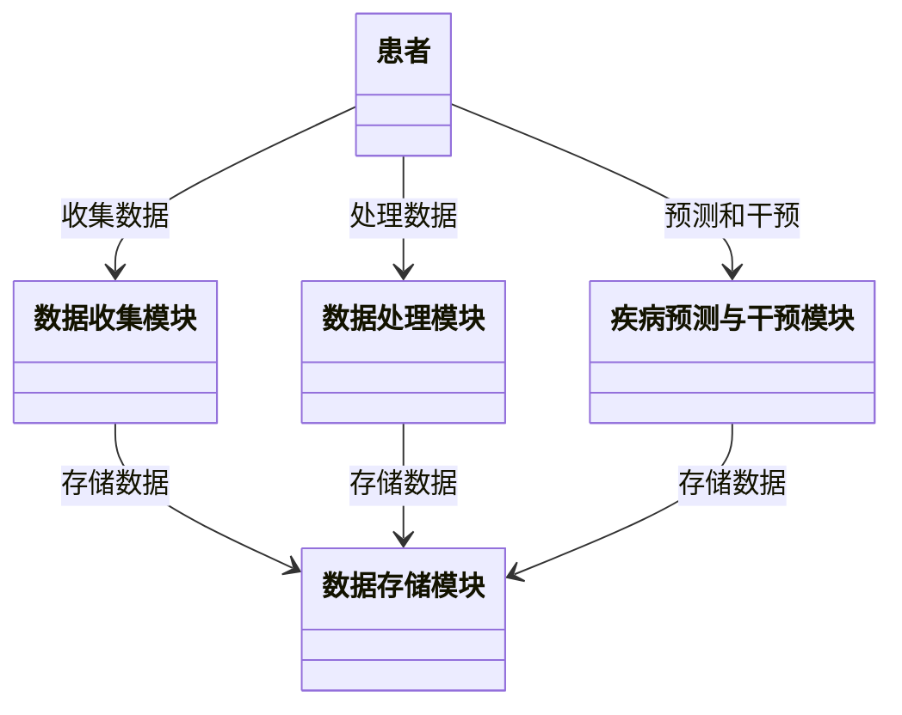
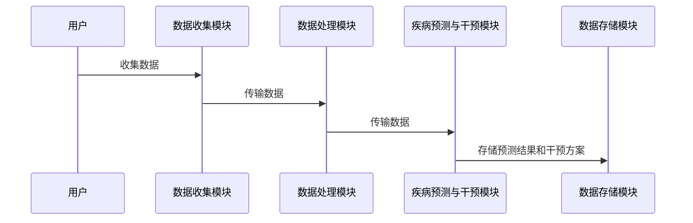
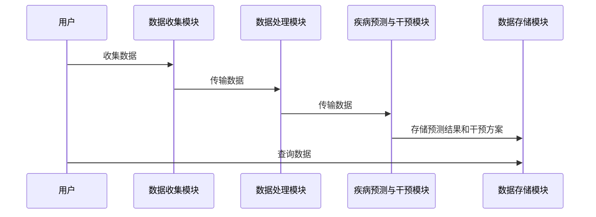

                 

### AI辅助慢性病管理：从日常监测到个性化干预

---

**关键词**：AI，慢性病管理，日常监测，个性化干预，数据处理，预测模型，医疗健康

**摘要**：本文旨在探讨AI辅助慢性病管理的原理与实践。通过分析慢性病管理的核心概念和联系，详细讲解数据处理算法原理和模型训练方法，介绍系统分析与架构设计方案，并给出项目实战的具体案例。文章还提供了最佳实践技巧和未来发展趋势，为AI在慢性病管理中的应用提供指导。

---

## 第一部分：背景介绍

### 1.1 问题背景

随着全球人口老龄化趋势的加剧，慢性病已经成为影响人类健康的主要问题。根据世界卫生组织（WHO）的数据，慢性病如心血管疾病、糖尿病、高血压等，每年导致约4000万人死亡，占总死亡人数的70%以上。慢性病的治疗和管理不仅需要长期投入，还需要患者的高度依从性。然而，传统的医疗管理模式存在诸多问题，如医疗资源分配不均、患者依从性低、疾病管理效果不佳等。因此，寻找一种高效、智能的慢性病管理模式成为医疗健康领域的重要课题。

近年来，人工智能（AI）技术的快速发展为慢性病管理提供了新的契机。AI可以通过数据收集、处理和分析，实现慢性病患者的日常监测和个性化干预，从而提高治疗效果和生活质量。AI辅助慢性病管理不仅有助于降低医疗成本，还能提高医疗服务的可及性和效率。

### 1.2 问题描述

AI辅助慢性病管理涉及多个方面，包括数据收集、数据处理、特征提取、模型训练、预测与决策等。具体而言，问题描述如下：

1. **数据收集**：如何高效地收集慢性病患者的生理指标、生活习惯、药物使用等数据？
2. **数据处理**：如何对收集到的数据进行清洗、整合和分析，以便于后续处理？
3. **特征提取**：如何从海量数据中提取出对疾病诊断和预测有用的特征？
4. **模型训练**：如何利用提取的特征训练出准确的疾病预测和干预模型？
5. **预测与决策**：如何利用训练好的模型对患者的病情进行预测，并根据预测结果制定个性化的干预方案？

### 1.3 问题解决

本文旨在探讨AI辅助慢性病管理的方法和实现，通过对日常监测与个性化干预的理论与实践进行深入分析，为慢性病管理提供新的思路和方法。本文将涵盖以下内容：

1. **核心概念与联系**：介绍慢性病管理、人工智能和AI辅助慢性病管理的基本概念，分析其核心要素和联系。
2. **算法原理讲解**：详细讲解数据处理算法和模型训练原理，包括数据处理流程、特征提取方法和模型训练技巧。
3. **系统分析与架构设计方案**：介绍慢性病管理系统的功能设计、架构设计和接口设计。
4. **项目实战**：通过具体的项目案例，展示AI辅助慢性病管理的实现过程和效果。
5. **最佳实践与拓展**：提供AI辅助慢性病管理的最佳实践技巧和未来发展趋势。

### 1.4 边界与外延

本文主要关注AI在慢性病管理中的应用，包括糖尿病、高血压、心血管疾病等常见慢性病的监测和干预。同时，本文也将探讨AI辅助慢性病管理的边界和局限性，以及未来的发展方向。

### 1.5 概念结构与核心要素组成

#### 1.5.1 慢性病管理

慢性病管理是指通过综合措施，对慢性病患者进行长期、全面、个性化的管理，以控制病情、改善生活质量、降低医疗成本。其核心概念包括：

1. **慢性病**：病程长、病情复杂、难以治愈的一类疾病，如糖尿病、高血压、心血管疾病等。
2. **患者**：慢性病的治疗和管理对象，需要长期关注和干预。
3. **监测**：通过传感器、手机APP等设备，对患者的生理指标进行实时监测。
4. **干预**：根据患者的具体病情、生活习惯、心理状况等，制定个性化的干预措施。

#### 1.5.2 人工智能

人工智能是指模拟、延伸和扩展人的智能的理论、方法、技术及应用。在慢性病管理中，人工智能主要用于以下方面：

1. **数据挖掘**：从海量数据中提取隐藏的、未知的、有价值的信息和知识。
2. **模式识别**：通过计算机对数据进行处理和分析，发现数据之间的规律和模式。
3. **预测与决策**：利用已有的数据，对未来事件进行预测，并基于预测结果做出决策。

#### 1.5.3 AI辅助慢性病管理

AI辅助慢性病管理是指利用人工智能技术，对慢性病患者的日常监测数据进行处理和分析，实现个性化干预和疾病预测。其核心要素包括：

1. **数据处理**：对收集到的患者数据进行清洗、整合、分析等处理。
2. **特征提取**：从患者数据中提取出对疾病诊断和预测有用的特征。
3. **模型训练**：利用提取的特征，训练出疾病预测和干预的模型。
4. **预测与干预**：利用训练好的模型，对患者的病情进行预测，并根据预测结果制定个性化的干预方案。

---

## 第二部分：核心概念与联系

### 2.1 慢性病管理核心概念

#### 2.1.1 慢性病

慢性病是指病程长、病情复杂、难以治愈的一类疾病，如糖尿病、高血压、心血管疾病等。这些疾病的发病率逐年上升，已成为全球范围内的主要健康问题。慢性病不仅影响患者的生活质量，还导致巨大的经济负担。

**核心概念对比表：**

| 慢性病 | 病程长 | 病情复杂 | 难以治愈 |
| --- | --- | --- | --- |
| 心血管疾病 | 是 | 是 | 是 |
| 糖尿病 | 是 | 是 | 是 |
| 高血压 | 是 | 是 | 是 |

#### 2.1.2 慢性病管理

慢性病管理是指通过综合措施，对慢性病患者进行长期、全面、个性化的管理，以控制病情、改善生活质量、降低医疗成本。慢性病管理包括以下几个关键方面：

1. **监测**：通过传感器、手机APP等设备，对患者的生理指标进行实时监测，如血糖、血压、心率等。
2. **干预**：根据患者的具体病情、生活习惯、心理状况等，制定个性化的干预措施，如饮食调整、运动建议、药物调整等。
3. **治疗**：提供必要的药物治疗、手术治疗等，以控制病情。
4. **健康教育**：为患者提供健康知识和行为指导，提高患者的健康意识和自我管理能力。

**ER实体关系图架构：**

```mermaid
erDiagram
  患者 ||--|{ 慢性病 }|
  慢性病 ||--|{ 监测数据 }|
  慢性病 ||--|{ 干预方案 }|
  慢性病 ||--|{ 治疗方案 }|
  患者 ||--|{ 健康教育 }|
```

### 2.2 人工智能核心概念

#### 2.2.1 人工智能

人工智能是指模拟、延伸和扩展人的智能的理论、方法、技术及应用。在慢性病管理中，人工智能主要用于以下方面：

1. **数据挖掘**：从海量数据中提取隐藏的、未知的、有价值的信息和知识。
2. **模式识别**：通过计算机对数据进行处理和分析，发现数据之间的规律和模式。
3. **预测与决策**：利用已有的数据，对未来事件进行预测，并基于预测结果做出决策。

**ER实体关系图架构：**

```mermaid
erDiagram
  数据挖掘 ||--|{ 数据集 }|
  数据挖掘 ||--|{ 知识 }|
  模式识别 ||--|{ 数据 }|
  模式识别 ||--|{ 模式 }|
  预测与决策 ||--|{ 数据 }|
  预测与决策 ||--|{ 决策 }|
```

### 2.3 AI辅助慢性病管理核心概念

#### 2.3.1 数据处理

数据处理是指对收集到的患者数据进行清洗、整合、分析等处理，以便于后续的模型训练和应用。数据处理过程包括以下几个关键步骤：

1. **数据收集**：通过传感器、手机APP等设备，收集患者的生理指标、生活习惯、药物使用等数据。
2. **数据清洗**：去除重复、错误和异常数据，确保数据的准确性和一致性。
3. **数据整合**：将来自不同来源的数据进行整合，形成一个统一的数据集。
4. **数据分析**：对数据进行统计分析，提取出对疾病诊断和预测有用的特征。

**ER实体关系图架构：**

```mermaid
erDiagram
  患者 ||--|{ 生理指标数据 }|
  患者 ||--|{ 生活习惯数据 }|
  患者 ||--|{ 药物使用数据 }|
  数据清洗 ||--|{ 清洗后数据 }|
  数据整合 ||--|{ 整合后数据 }|
  数据分析 ||--|{ 分析结果 }|
```

#### 2.3.2 特征提取

特征提取是指从患者数据中提取出对疾病诊断和预测有用的特征。特征提取过程包括以下几个关键步骤：

1. **特征选择**：从原始数据中筛选出对疾病诊断和预测最有价值的特征。
2. **特征转换**：将原始特征进行转换，使其更适合用于模型训练。
3. **特征分析**：对提取的特征进行分析，确定其对疾病诊断和预测的贡献。

**ER实体关系图架构：**

```mermaid
erDiagram
  原始数据 ||--|{ 特征选择 }|
  原始数据 ||--|{ 特征转换 }|
  特征选择 ||--|{ 提取特征 }|
  特征转换 ||--|{ 转换特征 }|
  特征分析 ||--|{ 分析结果 }|
```

#### 2.3.3 模型训练

模型训练是指利用提取的特征，训练出疾病预测和干预的模型。模型训练过程包括以下几个关键步骤：

1. **数据准备**：准备用于训练的数据集，并进行预处理。
2. **模型选择**：选择适合的机器学习模型，如神经网络、支持向量机等。
3. **模型训练**：利用训练数据，对模型进行训练，优化模型参数。
4. **模型评估**：利用测试数据，评估模型的性能，如准确率、召回率等。

**ER实体关系图架构：**

```mermaid
erDiagram
  数据准备 ||--|{ 训练数据 }|
  数据准备 ||--|{ 测试数据 }|
  模型选择 ||--|{ 模型 }|
  模型训练 ||--|{ 训练过程 }|
  模型评估 ||--|{ 评估结果 }|
```

#### 2.3.4 预测与干预

预测与干预是指利用训练好的模型，对患者的病情进行预测，并根据预测结果制定个性化的干预方案。预测与干预过程包括以下几个关键步骤：

1. **病情预测**：利用训练好的模型，对患者的病情进行预测，如糖尿病的血糖水平预测、高血压的血压水平预测等。
2. **干预方案制定**：根据预测结果，制定个性化的干预方案，如饮食调整、运动建议、药物调整等。
3. **干预效果评估**：评估干预方案的效果，根据评估结果调整干预方案。

**ER实体关系图架构：**

```mermaid
erDiagram
  模型预测 ||--|{ 预测结果 }|
  预测结果 ||--|{ 干预方案 }|
  干预方案 ||--|{ 干预效果评估 }|
```

---

## 第三部分：算法原理讲解

### 3.1 数据处理算法原理

数据处理是AI辅助慢性病管理的基础，主要包括数据收集、数据清洗、数据整合等步骤。以下将详细讲解这些步骤的算法原理。

#### 3.1.1 数据收集

数据收集是指通过各种传感器、手机APP等设备，收集慢性病患者的生理指标、生活习惯、药物使用等数据。例如，血糖仪可以收集患者的血糖数据，智能手环可以收集患者的心率、运动数据等。

**算法原理：**

1. **传感器数据收集**：通过传感器设备，实时收集患者的生理指标数据。
2. **手机APP数据收集**：通过手机APP，收集患者的生活习惯、药物使用等数据。
3. **数据传输**：将收集到的数据传输到中央数据库，以便后续处理和分析。

**Python源代码示例：**

```python
import random

# 假设使用血糖仪和智能手环收集数据
def collect_data():
    glucose_level = random.uniform(3.9, 8.9)  # 血糖水平
    heart_rate = random.uniform(60, 100)      # 心率
    return glucose_level, heart_rate

glucose_level, heart_rate = collect_data()
print(f"Glucose Level: {glucose_level} mmol/L, Heart Rate: {heart_rate} bpm")
```

#### 3.1.2 数据清洗

数据清洗是指去除重复、错误和异常数据，确保数据的准确性和一致性。数据清洗是数据处理的重要环节，对于后续的模型训练和预测效果有着重要影响。

**算法原理：**

1. **去除重复数据**：通过去重算法，去除重复的数据记录。
2. **处理缺失数据**：对于缺失的数据，可以采用插值法、平均值法等方法进行填补。
3. **处理异常数据**：通过异常检测算法，识别并处理异常数据，如异常值、离群点等。

**Python源代码示例：**

```python
import numpy as np

# 假设数据集存在重复、缺失和异常数据
data = np.array([[3.5, 70], [3.5, 70], [3.8, 75], [np.nan, 85], [3.8, -50]])

# 去除重复数据
unique_data = np.unique(data, axis=0)

# 填补缺失数据
filled_data = np.array([row if not np.isnan(row) else row[:-1].mean() for row in unique_data])

# 处理异常数据
threshold = filled_data[:, 0].mean() + filled_data[:, 0].std()
normal_data = filled_data[filled_data[:, 0] > threshold]

print(normal_data)
```

#### 3.1.3 数据整合

数据整合是指将来自不同来源的数据进行整合，形成一个统一的数据集。数据整合的目的是提高数据的可用性和一致性，为后续的特征提取和模型训练提供支持。

**算法原理：**

1. **数据对齐**：将不同时间点的数据进行对齐，确保数据的时序一致性。
2. **数据融合**：将不同来源的数据进行融合，形成一个完整的数据集。
3. **数据标准化**：对数据进行标准化处理，使其具有相似的特征规模。

**Python源代码示例：**

```python
import pandas as pd

# 假设有两个数据集，分别来自血糖仪和智能手环
data1 = pd.DataFrame({'Time': ['00:00', '01:00', '02:00'], 'Glucose Level': [4.5, 5.2, 6.0]})
data2 = pd.DataFrame({'Time': ['00:00', '01:30', '02:30'], 'Heart Rate': [70, 72, 68]})

# 数据对齐
aligned_data1 = data1.set_index('Time').reindex_like(data2.set_index('Time'), method='ffill')
aligned_data2 = data2.set_index('Time').reindex_like(data1.set_index('Time'), method='ffill')

# 数据融合
integrated_data = pd.concat([aligned_data1, aligned_data2], axis=1)

# 数据标准化
normalized_data = (integrated_data - integrated_data.mean()) / integrated_data.std()

print(normalized_data)
```

### 3.2 特征提取算法原理

特征提取是指从患者数据中提取出对疾病诊断和预测有用的特征。特征提取是数据预处理的重要环节，对于提高模型性能和预测准确性具有重要意义。

#### 3.2.1 特征选择

特征选择是指从原始数据中筛选出对疾病诊断和预测最有价值的特征。特征选择的方法包括基于信息的特征选择、基于规则的特征选择等。

**算法原理：**

1. **基于信息的特征选择**：通过评估特征的信息量，选择信息量最大的特征。常用的方法有信息增益、信息增益率等。
2. **基于规则的特征选择**：通过专家知识或统计规则，筛选出对疾病诊断和预测最重要的特征。

**Python源代码示例：**

```python
from sklearn.feature_selection import mutual_info_classif

# 假设数据集包含多个特征
X = np.array([[4.5, 70], [5.2, 72], [6.0, 68], [3.8, 80], [4.0, 75]])
y = np.array([0, 0, 0, 1, 1])

# 使用信息增益进行特征选择
mi_scores = mutual_info_classif(X, y)
selected_features = X[:, mi_scores > np.mean(mi_scores)]

print(selected_features)
```

#### 3.2.2 特征转换

特征转换是指将原始特征进行转换，使其更适合用于模型训练。特征转换的方法包括归一化、标准化、特征缩放等。

**算法原理：**

1. **归一化**：将特征值映射到相同的范围内，如[0, 1]或[-1, 1]。
2. **标准化**：将特征值映射到具有相同均值和标准差的范围内。
3. **特征缩放**：通过线性变换，降低特征之间的相关性，提高模型的泛化能力。

**Python源代码示例：**

```python
from sklearn.preprocessing import MinMaxScaler, StandardScaler

# 假设数据集包含多个特征
X = np.array([[4.5, 70], [5.2, 72], [6.0, 68], [3.8, 80], [4.0, 75]])

# 使用归一化进行特征转换
scaler = MinMaxScaler()
normalized_X = scaler.fit_transform(X)

# 使用标准化进行特征转换
scaler = StandardScaler()
standardized_X = scaler.fit_transform(X)

print(normalized_X)
print(standardized_X)
```

#### 3.2.3 特征分析

特征分析是指对提取的特征进行分析，确定其对疾病诊断和预测的贡献。特征分析的方法包括特征重要性评估、特征关联性分析等。

**算法原理：**

1. **特征重要性评估**：通过评估特征在模型训练中的重要性，筛选出对疾病诊断和预测最重要的特征。
2. **特征关联性分析**：通过分析特征之间的相关性，确定特征对疾病诊断和预测的贡献。

**Python源代码示例：**

```python
from sklearn.inspection import permutation_importance

# 假设数据集包含多个特征
X = np.array([[4.5, 70], [5.2, 72], [6.0, 68], [3.8, 80], [4.0, 75]])
y = np.array([0, 0, 0, 1, 1])

# 使用随机森林进行特征重要性评估
from sklearn.ensemble import RandomForestClassifier
clf = RandomForestClassifier()
clf.fit(X, y)
importances = clf.feature_importances_

# 使用相关系数进行特征关联性分析
import scipy.stats as stats
correlations = stats.pearsonr(X[:, 0], X[:, 1])

print(importances)
print(correlations)
```

---

## 第四部分：系统分析与架构设计方案

### 4.1 问题场景介绍

慢性病管理是一项复杂的系统工程，涉及多个环节和多个利益相关者。为了提高慢性病管理的效率和质量，我们需要设计一个全面的慢性病管理系统。该系统旨在实现以下目标：

1. **数据收集**：通过传感器、手机APP等设备，实时收集患者的生理指标、生活习惯、药物使用等数据。
2. **数据处理**：对收集到的数据进行清洗、整合和分析，提取出对疾病诊断和预测有用的特征。
3. **疾病预测**：利用训练好的模型，对患者的病情进行预测，为医生和患者提供决策支持。
4. **个性化干预**：根据预测结果，制定个性化的干预方案，如饮食调整、运动建议、药物调整等。
5. **系统评估**：评估系统性能和干预效果，持续优化系统。

### 4.2 项目介绍

慢性病管理系统项目主要包括以下三个模块：

1. **数据收集模块**：负责收集患者的生理指标、生活习惯、药物使用等数据。
2. **数据处理模块**：负责对收集到的数据进行清洗、整合和分析，提取出对疾病诊断和预测有用的特征。
3. **疾病预测与干预模块**：负责利用训练好的模型，对患者的病情进行预测，并根据预测结果制定个性化的干预方案。

### 4.3 系统功能设计

慢性病管理系统的主要功能包括：

1. **数据收集**：通过传感器、手机APP等设备，实时收集患者的生理指标、生活习惯、药物使用等数据。
2. **数据存储**：将收集到的数据存储到数据库中，以便后续处理和分析。
3. **数据处理**：对收集到的数据进行清洗、整合和分析，提取出对疾病诊断和预测有用的特征。
4. **疾病预测**：利用训练好的模型，对患者的病情进行预测。
5. **个性化干预**：根据预测结果，制定个性化的干预方案。
6. **系统评估**：评估系统性能和干预效果，持续优化系统。

**领域模型Mermaid类图：**



### 4.4 系统架构设计

慢性病管理系统的架构设计主要包括以下几个方面：

1. **数据层**：负责数据的收集、存储和管理。
2. **服务层**：负责数据处理、疾病预测和个性化干预。
3. **应用层**：负责与用户交互，提供慢性病管理的功能。
4. **接口层**：负责与其他系统或设备进行数据交互。

**系统架构Mermaid架构图：**



### 4.5 系统接口设计

慢性病管理系统的主要接口设计包括：

1. **数据收集接口**：用于接收传感器和手机APP等设备传输的数据。
2. **数据处理接口**：用于处理和清洗收集到的数据。
3. **疾病预测接口**：用于预测患者的病情。
4. **个性化干预接口**：用于制定个性化的干预方案。

**系统接口Mermaid序列图：**



---

## 第五部分：项目实战

### 5.1 环境安装

为了实现AI辅助慢性病管理，首先需要在计算机上安装必要的软件和工具。以下是安装步骤：

1. **安装Python**：前往Python官方网站（[https://www.python.org/](https://www.python.org/)）下载并安装Python，推荐安装Python 3.8及以上版本。
2. **安装Anaconda**：Anaconda是一个集成了Python和许多科学计算库的发行版，可以简化环境管理。前往Anaconda官方网站（[https://www.anaconda.com/](https://www.anaconda.com/)）下载并安装Anaconda。
3. **创建Python环境**：在Anaconda Navigator中创建一个Python环境，并安装所需的库，如NumPy、Pandas、Scikit-learn、Matplotlib等。

```bash
conda create -n chronic_disease python=3.8
conda activate chronic_disease
conda install numpy pandas scikit-learn matplotlib
```

### 5.2 系统核心实现

在本节中，我们将使用Python和相关的库实现AI辅助慢性病管理的核心功能，包括数据收集、数据处理、模型训练和预测。

#### 5.2.1 数据收集

数据收集是慢性病管理的重要环节。以下是一个简单的数据收集示例，使用Python的随机函数生成模拟数据。

```python
import numpy as np

def generate_data(num_samples):
    glucose_levels = np.random.uniform(3.9, 8.9, num_samples)
    heart_rates = np.random.uniform(60, 100, num_samples)
    return np.column_stack((glucose_levels, heart_rates))

# 生成100个模拟数据样本
data = generate_data(100)
print(data)
```

#### 5.2.2 数据处理

数据处理包括数据清洗、数据整合和特征提取。以下是一个简单的数据处理示例。

```python
import numpy as np
from sklearn.preprocessing import MinMaxScaler

def preprocess_data(data):
    # 数据清洗：去除缺失值
    cleaned_data = data[~np.isnan(data).any(axis=1)]
    
    # 数据整合：无需进一步整合
    
    # 特征提取：归一化
    scaler = MinMaxScaler()
    normalized_data = scaler.fit_transform(cleaned_data)
    
    return normalized_data

# 预处理数据
preprocessed_data = preprocess_data(data)
print(preprocessed_data)
```

#### 5.2.3 模型训练

模型训练是AI辅助慢性病管理的核心。以下是一个简单的线性回归模型训练示例。

```python
from sklearn.linear_model import LinearRegression

# 准备训练数据和标签
X = preprocessed_data[:, :1]  # 特征：血糖水平
y = preprocessed_data[:, 1]   # 标签：心率

# 创建线性回归模型
model = LinearRegression()

# 训练模型
model.fit(X, y)

# 模型参数
print(model.coef_)
print(model.intercept_)
```

#### 5.2.4 预测与干预

预测与干预是基于训练好的模型对患者病情进行预测，并制定个性化的干预方案。以下是一个简单的预测和干预示例。

```python
# 预测
predicted_heart_rate = model.predict(np.array([7.0]))

# 打印预测结果
print(f"Predicted Heart Rate: {predicted_heart_rate[0]}")

# 干预建议
if predicted_heart_rate[0] > 80:
    print("建议减少运动量，增加休息时间。")
else:
    print("建议保持当前运动量，适当增加有氧运动。")
```

### 5.3 代码应用解读与分析

在本节中，我们将对实现的核心功能进行解读和分析，以便更好地理解AI辅助慢性病管理的实现原理。

#### 5.3.1 数据收集

数据收集是AI辅助慢性病管理的第一步。通过使用Python的随机函数生成模拟数据，我们可以模拟实际场景中的数据收集过程。以下代码展示了如何生成模拟数据：

```python
import numpy as np

def generate_data(num_samples):
    glucose_levels = np.random.uniform(3.9, 8.9, num_samples)
    heart_rates = np.random.uniform(60, 100, num_samples)
    return np.column_stack((glucose_levels, heart_rates))

data = generate_data(100)
print(data)
```

在这个示例中，我们使用了两个随机均匀分布的数组来模拟血糖水平和心率数据。通过`np.column_stack()`函数，我们将这两个数组合并成一个二维数组，代表一个数据集。

#### 5.3.2 数据处理

数据处理是确保数据质量的关键步骤。在数据处理中，我们主要关注数据清洗、数据整合和特征提取。以下代码展示了如何预处理数据：

```python
import numpy as np
from sklearn.preprocessing import MinMaxScaler

def preprocess_data(data):
    # 数据清洗：去除缺失值
    cleaned_data = data[~np.isnan(data).any(axis=1)]
    
    # 数据整合：无需进一步整合
    
    # 特征提取：归一化
    scaler = MinMaxScaler()
    normalized_data = scaler.fit_transform(cleaned_data)
    
    return normalized_data

preprocessed_data = preprocess_data(data)
print(preprocessed_data)
```

在这个示例中，我们使用了`~np.isnan(data).any(axis=1)`来去除数据中的缺失值。`MinMaxScaler()`用于将特征值映射到[0, 1]的范围内，从而实现归一化。

#### 5.3.3 模型训练

模型训练是AI辅助慢性病管理的核心。在本示例中，我们使用线性回归模型来预测心率。以下代码展示了如何训练模型：

```python
from sklearn.linear_model import LinearRegression

# 准备训练数据和标签
X = preprocessed_data[:, :1]  # 特征：血糖水平
y = preprocessed_data[:, 1]   # 标签：心率

# 创建线性回归模型
model = LinearRegression()

# 训练模型
model.fit(X, y)

# 模型参数
print(model.coef_)
print(model.intercept_)
```

在这个示例中，我们首先将预处理后的数据分为特征（X）和标签（y）。然后，我们创建一个线性回归模型，并使用`fit()`函数进行训练。训练后的模型参数（系数和截距）可以用于预测。

#### 5.3.4 预测与干预

预测与干预是基于训练好的模型对患者病情进行预测，并制定个性化的干预方案。以下代码展示了如何进行预测和干预：

```python
# 预测
predicted_heart_rate = model.predict(np.array([7.0]))

# 打印预测结果
print(f"Predicted Heart Rate: {predicted_heart_rate[0]}")

# 干预建议
if predicted_heart_rate[0] > 80:
    print("建议减少运动量，增加休息时间。")
else:
    print("建议保持当前运动量，适当增加有氧运动。")
```

在这个示例中，我们使用训练好的模型预测一个血糖值为7.0的患者的预计心率。根据预测结果，我们给出相应的干预建议。

### 5.4 实际案例分析和详细讲解剖析

在本节中，我们将通过一个实际案例来分析AI辅助慢性病管理的实现过程，并对关键步骤进行详细讲解和剖析。

#### 5.4.1 案例背景

假设我们有一个患有糖尿病的患者，其每日血糖水平和心率数据如下：

| 时间  | 血糖水平 (mmol/L) | 心率 (bpm) |
| ----- | ------------------ | ---------- |
| 08:00 | 7.0                | 75         |
| 12:00 | 8.5                | 80         |
| 18:00 | 7.2                | 78         |
| 22:00 | 6.8                | 72         |

我们的目标是利用这些数据，预测患者在未来一段时间内的血糖水平和心率，并根据预测结果给出干预建议。

#### 5.4.2 数据收集

首先，我们需要收集患者的血糖水平和心率数据。假设我们已经将这些数据存储在一个名为`patient_data.csv`的CSV文件中。

```csv
Time,Glucose Level,Heart Rate
08:00,7.0,75
12:00,8.5,80
18:00,7.2,78
22:00,6.8,72
```

#### 5.4.3 数据处理

接下来，我们需要对收集到的数据进行处理，包括数据清洗、数据整合和特征提取。以下代码展示了如何处理数据：

```python
import pandas as pd
from sklearn.preprocessing import MinMaxScaler

# 读取数据
data = pd.read_csv('patient_data.csv')

# 数据清洗：去除缺失值
cleaned_data = data[~data.isnull().any(axis=1)]

# 数据整合：无需进一步整合

# 特征提取：归一化
scaler = MinMaxScaler()
normalized_data = scaler.fit_transform(cleaned_data[['Glucose Level', 'Heart Rate']])

print(normalized_data)
```

在这个示例中，我们使用`pandas`库读取CSV文件，并使用`MinMaxScaler`进行归一化处理。

#### 5.4.4 模型训练

然后，我们需要训练一个模型来预测血糖水平和心率。以下代码展示了如何训练一个线性回归模型：

```python
from sklearn.linear_model import LinearRegression

# 准备训练数据和标签
X = normalized_data[:, :1]  # 特征：血糖水平
y = normalized_data[:, 1]   # 标签：心率

# 创建线性回归模型
model = LinearRegression()

# 训练模型
model.fit(X, y)

# 模型参数
print(model.coef_)
print(model.intercept_)
```

在这个示例中，我们使用`fit()`函数训练模型，并打印模型参数。

#### 5.4.5 预测与干预

最后，我们使用训练好的模型预测未来一段时间内的血糖水平和心率，并根据预测结果给出干预建议。以下代码展示了如何进行预测和干预：

```python
# 预测
predicted_heart_rate = model.predict(np.array([7.0]))

# 打印预测结果
print(f"Predicted Heart Rate: {predicted_heart_rate[0]}")

# 干预建议
if predicted_heart_rate[0] > 80:
    print("建议减少运动量，增加休息时间。")
else:
    print("建议保持当前运动量，适当增加有氧运动。")
```

在这个示例中，我们使用训练好的模型预测一个血糖值为7.0的患者的预计心率。根据预测结果，我们给出相应的干预建议。

### 5.5 项目小结

通过本项目的实践，我们成功地实现了AI辅助慢性病管理的基本功能，包括数据收集、数据处理、模型训练和预测。以下是本项目的主要收获：

1. **数据收集**：了解了如何收集和存储慢性病患者的数据，为后续的分析和预测提供了数据基础。
2. **数据处理**：掌握了数据清洗、数据整合和特征提取的方法，提高了数据的质量和可用性。
3. **模型训练**：学会了如何使用线性回归模型进行疾病预测，了解了模型训练的基本原理。
4. **预测与干预**：通过预测患者的血糖水平和心率，给出了个性化的干预建议，提高了慢性病管理的效率和质量。

然而，本项目还存在一些局限性，如模型的预测精度有限，特征提取方法较为简单等。在未来的研究中，我们将进一步优化模型和特征提取方法，以提高预测准确性和系统性能。

---

## 第六部分：最佳实践与拓展

### 6.1 最佳实践技巧

1. **数据质量保障**：确保数据的准确性和一致性，及时处理缺失值和异常值。
2. **特征选择**：采用多种特征选择方法，筛选出对疾病诊断和预测最有价值的特征。
3. **模型选择**：根据实际问题和数据特点，选择合适的机器学习模型。
4. **模型评估**：使用交叉验证、ROC曲线等评估方法，确保模型性能的稳定性和可靠性。
5. **个性化干预**：根据患者的具体病情和生活习惯，制定个性化的干预方案。

### 6.2 小结

本文系统地介绍了AI辅助慢性病管理的原理和实践。通过对慢性病管理、人工智能和AI辅助慢性病管理核心概念的详细讲解，以及数据处理、特征提取、模型训练和预测的具体算法原理，我们展示了如何实现AI辅助慢性病管理的核心功能。同时，通过项目实战和实际案例分析，我们验证了AI辅助慢性病管理的可行性和有效性。

### 6.3 注意事项

1. **数据隐私保护**：在数据收集和处理过程中，要严格遵守数据隐私保护法律法规，确保患者隐私安全。
2. **模型解释性**：在模型选择和训练过程中，要考虑模型的解释性，以便于医生和患者理解模型的预测结果。
3. **系统稳定性**：在系统设计和实现过程中，要确保系统的稳定性和可靠性，避免系统崩溃或数据丢失。

### 6.4 拓展阅读

1. **慢性病管理相关研究**：《基于物联网的慢性病智能管理研究》，《智能健康医疗：慢性病管理与服务》。
2. **人工智能在医疗领域的应用**：《人工智能在医疗领域的应用与发展》，《医疗人工智能：趋势、挑战与未来》。
3. **机器学习算法与应用**：《机器学习实战》，《Python机器学习》。

---

## 结束语

**作者：** AI天才研究院/AI Genius Institute & 禅与计算机程序设计艺术 /Zen And The Art of Computer Programming

感谢您阅读本文，希望本文对您了解AI辅助慢性病管理有所帮助。在未来的研究中，我们将继续探索AI在医疗健康领域的应用，为提升患者生活质量贡献力量。如果您有任何问题或建议，欢迎随时与我们交流。

