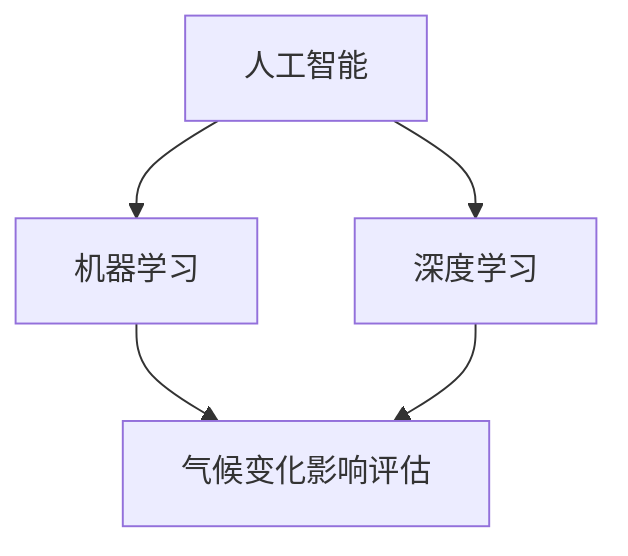
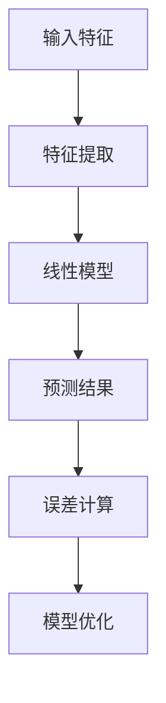
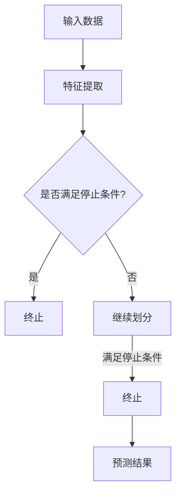
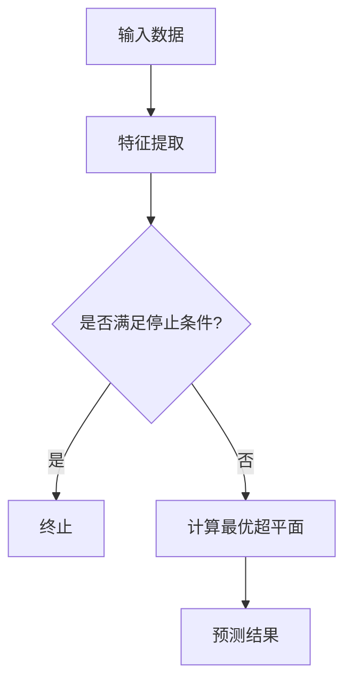
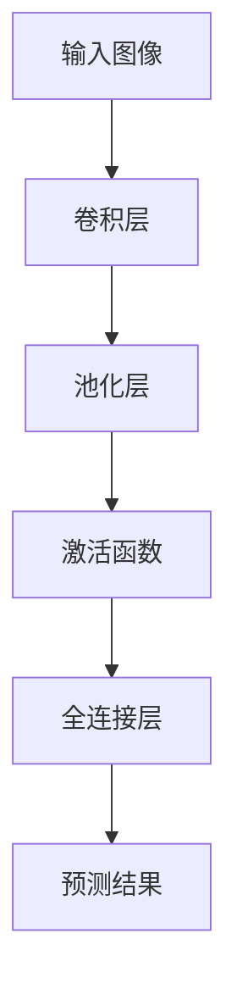

                 

### 第1章: 引言

#### 1.1 问题背景

随着全球气候变化问题的日益严重，如何评估气候变化对各个地区、行业和生态系统的影响已成为当务之急。气候变化不仅导致极端天气事件的频繁发生，还可能引发海平面上升、生态失衡、水资源短缺等一系列问题，严重威胁着人类社会和自然环境的可持续发展。因此，准确、高效地评估气候变化的影响，对于制定应对策略和决策具有至关重要的意义。

然而，传统的气候变化影响评估方法通常依赖于大量的数据收集、处理和分析，这不仅费时费力，还可能因为数据的不完整性和不确定性导致评估结果的偏差。因此，寻找一种能够提高评估效率和精度的方法显得尤为重要。

#### 1.2 问题描述

在此背景下，本文旨在探讨如何利用人工智能（AI）技术辅助气候变化影响评估，实现从局部到全球尺度的全面评估。具体而言，问题描述如下：

1. **核心问题**：如何利用AI技术，特别是机器学习和深度学习算法，辅助气候变化影响评估？
2. **目标**：构建一套能够准确预测和评估气候变化影响的AI模型，并探索其在不同尺度下的应用潜力。
3. **挑战**：由于气候变化影响的复杂性和多样性，如何选择合适的算法，处理大量且不完整的数据，提高模型的鲁棒性和泛化能力。

#### 1.3 问题解决思路

为了解决上述问题，本文将采用以下思路：

1. **AI技术基础**：首先，回顾AI技术，特别是机器学习和深度学习的基础知识，为后续章节的应用提供理论支持。
2. **算法原理讲解**：详细介绍常用的机器学习和深度学习算法在气候变化影响评估中的应用原理，并通过Mermaid流程图和Python源代码进行讲解。
3. **数学模型与公式**：推导和阐述关键数学模型与公式，为AI模型的构建提供理论基础。
4. **局部到全球尺度的实践**：通过具体的案例研究，展示如何在不同尺度下应用AI技术进行气候变化影响评估，并分析其效果和挑战。
5. **系统分析与架构设计**：探讨AI辅助气候变化影响评估系统的整体设计，包括系统功能、架构和接口设计。
6. **项目实战**：结合实际项目，展示如何搭建AI辅助气候变化影响评估系统，并进行详细解读和分析。
7. **结论与展望**：总结研究成果，提出存在的问题与挑战，以及未来的发展方向。

#### 1.4 边界与外延

在本文的研究中，我们将重点关注以下边界与外延：

1. **边界**：
   - **研究范围**：主要聚焦于AI技术在气候变化影响评估中的应用，涵盖机器学习和深度学习算法。
   - **技术限制**：本文不涉及AI以外的其他技术，如物联网、大数据等。

2. **外延**：
   - **研究外延**：除了AI技术在气候变化影响评估中的应用，还可以考虑与其他领域（如环境科学、地理信息科学等）的结合，拓展研究视野。
   - **未来趋势**：随着技术的进步，未来的研究方向可能包括AI与其他新兴技术的融合，如量子计算、增强现实等。

#### 1.5 核心概念与联系

为了便于读者理解和后续章节的学习，本节将对本文涉及的核心概念进行梳理，并使用Mermaid流程图展示它们之间的关系。

1. **核心概念**：
   - **人工智能（AI）**：模拟人类智能行为的计算机技术。
   - **机器学习（ML）**：使计算机从数据中学习规律和模式的能力。
   - **深度学习（DL）**：一种特殊的机器学习，通过多层神经网络模拟人类大脑的工作方式。
   - **气候变化影响评估**：对气候变化可能造成的各种影响进行量化评估。

2. **Mermaid流程图**：



通过上述流程图，我们可以清晰地看到人工智能、机器学习和深度学习与气候变化影响评估之间的紧密联系，它们共同构成了本文的研究框架。

---

在这一章中，我们详细介绍了气候变化问题的背景、问题描述以及问题解决思路。同时，明确了本文的边界与外延，并对核心概念进行了梳理。接下来，我们将进入第二部分，深入探讨AI技术的基础知识，为后续的应用和实践奠定坚实的理论基础。

## 第二部分: AI技术基础

在本部分中，我们将对人工智能（AI）技术进行详细探讨，包括其基本概念、机器学习（ML）和深度学习（DL）的原理，以及AI与气候变化的关系。这部分内容将为后续章节的应用提供理论基础和技术支持。

### 第2章: AI技术基础

#### 2.1 AI概述

人工智能，简称AI，是指通过计算机程序来模拟人类智能行为的技术。AI技术旨在使计算机具备自主学习和解决问题能力，从而在诸多领域实现自动化和智能化。AI的核心技术包括机器学习（ML）、深度学习（DL）和其他相关技术，如自然语言处理（NLP）、计算机视觉等。

AI的发展可以追溯到20世纪50年代，当时科学家们首次提出了“人工智能”的概念。随着计算机技术的飞速发展，AI在过去的几十年里取得了显著的进展。目前，AI已经在诸如自动驾驶、医疗诊断、金融服务等多个领域得到广泛应用。

#### 2.2 机器学习基础

机器学习（ML）是AI的一个重要分支，它通过构建模型从数据中学习规律和模式，使计算机能够进行预测和决策。机器学习的核心思想是基于历史数据训练模型，然后利用训练好的模型对新数据进行预测。

机器学习的主要类型包括：

- **监督学习**：有标注的数据集用于训练模型，模型通过学习这些数据来预测新的数据。
- **无监督学习**：没有标注的数据集用于训练模型，模型通过发现数据中的模式来对数据进行分类或聚类。
- **强化学习**：模型通过与环境的交互来学习策略，从而在特定环境中实现最优行为。

常见的机器学习算法有：

- **线性回归**：用于预测线性关系的模型。
- **逻辑回归**：用于分类问题，通过计算概率来进行预测。
- **决策树**：通过树形结构进行决策，分类或回归。
- **支持向量机（SVM）**：通过找到一个最佳的超平面来划分数据。
- **神经网络**：一种由大量神经元组成的模型，能够进行复杂的非线性处理。

#### 2.3 深度学习基础

深度学习（DL）是机器学习的一个子领域，它通过多层神经网络模拟人类大脑的工作方式。深度学习模型由多个层次组成，每个层次都对输入数据进行处理和转换，最终输出预测结果。

深度学习的关键特征包括：

- **层次化结构**：模型由多个层次组成，每个层次负责提取不同层次的特征。
- **非线性变换**：通过非线性激活函数，如ReLU（Rectified Linear Unit），使得模型能够学习复杂的非线性关系。
- **大规模数据**：深度学习需要大量数据进行训练，以获得更好的性能。
- **端到端学习**：深度学习模型可以从原始数据直接学习到预测结果，无需手动提取特征。

常见的深度学习模型包括：

- **卷积神经网络（CNN）**：主要用于图像处理任务，能够自动提取图像中的局部特征。
- **循环神经网络（RNN）**：适用于处理序列数据，如时间序列分析、自然语言处理。
- **长短期记忆网络（LSTM）**：RNN的一种改进，能够更好地处理长序列数据。
- **生成对抗网络（GAN）**：通过生成器和判别器之间的对抗训练，能够生成逼真的数据。

#### 2.4 AI与气候变化的关系

AI技术在气候变化研究中具有广泛的应用前景。通过AI技术，可以实现对气候变化数据的自动处理和分析，提高气候变化影响的预测精度和评估效率。

AI在气候变化研究中的应用主要包括：

- **数据预处理**：AI技术可以帮助处理和分析大量的气候数据，如温度、降水、风速等，提高数据的可用性。
- **模式识别**：通过深度学习等算法，可以从气候数据中提取出有用的模式，预测未来气候变化的趋势。
- **影响评估**：利用AI模型，可以对气候变化可能对生态系统、农业、水资源等产生的影响进行预测和评估。
- **决策支持**：AI技术可以为政策制定者和决策者提供科学依据，帮助他们制定更有效的应对气候变化策略。

总之，AI技术在气候变化研究中具有巨大的潜力，可以极大地提高研究效率和准确性。在下一章中，我们将进一步探讨AI辅助气候变化影响评估的基本概念和原理。

### 第3章: AI辅助气候变化影响评估的基本概念

#### 3.1 气候变化影响评估概述

气候变化影响评估（Climate Change Impact Assessment，简称CCIA）是指对气候变化可能对生态系统、社会经济系统等各个方面产生的潜在影响进行定量或定性分析的过程。CCIA的目的是提供科学依据，帮助政策制定者、决策者和社会各界了解气候变化的潜在风险，从而采取有效的应对措施。

气候变化影响评估的主要内容包括：

1. **潜在影响识别**：识别气候变化可能带来的各种潜在影响，如极端天气事件、海平面上升、水资源短缺、生态失衡等。
2. **影响量化**：通过数据分析和模型模拟，量化气候变化对特定地区、行业或生态系统的影响程度。
3. **风险评估**：评估气候变化影响的潜在风险，包括风险概率和影响严重性。
4. **政策建议**：根据评估结果，提出针对性的政策建议和应对策略，以减轻气候变化带来的负面影响。

#### 3.2 关键概念

在AI辅助气候变化影响评估中，以下关键概念是不可或缺的：

1. **气候数据**：包括温度、降水、风速、气压、湿度等气候变量的历史和未来预测数据。这些数据是进行气候变化影响评估的基础。
2. **影响模型**：用于模拟和预测气候变化影响的模型，如生态系统模型、农业模型、水资源模型等。这些模型可以根据气候数据和特定地区的特征进行定制。
3. **机器学习模型**：用于从气候数据中学习规律和模式，提高影响评估的精度和效率。常见的机器学习模型包括线性回归、决策树、支持向量机、神经网络等。
4. **深度学习模型**：基于多层神经网络的结构，能够自动提取复杂的特征，提高影响评估的深度和广度。常见的深度学习模型包括卷积神经网络（CNN）、循环神经网络（RNN）、长短期记忆网络（LSTM）等。
5. **数据预处理**：包括数据清洗、数据集成、特征工程等步骤，以提高数据的可用性和质量。
6. **评估指标**：用于衡量气候变化影响的指标，如损失函数、准确率、召回率等。这些指标可以帮助评估模型的效果和可靠性。

#### 3.3 气候变化影响评估的挑战与机会

尽管AI技术在气候变化影响评估中具有巨大的潜力，但仍然面临着一系列挑战和机会：

1. **挑战**：
   - **数据质量**：气候数据通常存在噪声、缺失值和不一致性等问题，需要进行有效的数据预处理和清洗。
   - **模型复杂度**：AI模型，尤其是深度学习模型，通常具有较高的复杂度，需要大量的计算资源和时间进行训练。
   - **模型泛化能力**：训练好的模型可能仅在特定条件下表现良好，难以泛化到其他地区或情景。
   - **不确定性**：气候变化的影响存在很大的不确定性，需要通过多种模型和情景分析来提高评估的准确性。

2. **机会**：
   - **数据处理能力**：AI技术，特别是深度学习，能够高效地处理和分析大量的气候数据，提高数据利用率和评估精度。
   - **模型定制化**：AI模型可以根据不同地区和情境进行定制化，提高评估的针对性和有效性。
   - **实时预测**：通过实时数据流和在线学习，AI模型可以实时更新和预测气候变化的影响，为决策提供及时支持。
   - **跨学科融合**：AI技术可以与地理信息科学、环境科学等其他学科相结合，实现跨学科的协同研究。

总之，AI技术在气候变化影响评估中具有巨大的潜力，但同时也面临着诸多挑战。通过不断的研究和探索，我们可以充分利用AI技术的优势，提高气候变化影响的预测和评估能力，为应对气候变化提供科学依据。

### 第4章: AI技术应用于气候变化影响评估

#### 4.1 主流算法原理讲解

在气候变化影响评估中，AI技术的应用主要通过机器学习和深度学习算法实现。这些算法能够从大量的气候数据中学习到潜在的规律和模式，从而提高评估的准确性和效率。以下将介绍几种主流的算法原理，并使用Mermaid流程图和Python源代码进行详细讲解。

#### 4.1.1 线性回归

线性回归是最简单的机器学习算法之一，主要用于预测一个线性关系。其原理是通过找到一个最佳拟合线，使得预测值与实际值之间的误差最小。

**Mermaid流程图：**



**Python源代码：**

```python
import numpy as np
from sklearn.linear_model import LinearRegression

# 特征和标签数据
X = np.array([[1], [2], [3], [4], [5]])
y = np.array([1, 2, 2.5, 3, 4])

# 创建线性回归模型
model = LinearRegression()

# 模型训练
model.fit(X, y)

# 预测结果
predictions = model.predict(X)

# 误差计算
error = y - predictions

# 模型优化
model.fit(X, y - error)
```

#### 4.1.2 决策树

决策树是一种基于树形结构进行决策的算法，通过一系列规则对数据进行分类或回归。其原理是从数据中提取特征，并根据这些特征将数据划分为不同的子集，直到满足某种停止条件。

**Mermaid流程图：**



**Python源代码：**

```python
from sklearn.tree import DecisionTreeRegressor

# 特征和标签数据
X = [[1, 2], [3, 4], [5, 6]]
y = [2, 4, 6]

# 创建决策树模型
model = DecisionTreeRegressor()

# 模型训练
model.fit(X, y)

# 预测结果
predictions = model.predict([[2, 3]])

# 输出结果
print(predictions)
```

#### 4.1.3 支持向量机（SVM）

支持向量机是一种用于分类和回归问题的机器学习算法，其原理是通过找到一个最佳的超平面，使得分类边界最大化或回归误差最小化。

**Mermaid流程图：**



**Python源代码：**

```python
from sklearn.svm import SVR

# 特征和标签数据
X = [[0], [1], [2], [3], [4]]
y = [0, 1, 2, 3, 4]

# 创建SVM回归模型
model = SVR()

# 模型训练
model.fit(X, y)

# 预测结果
predictions = model.predict([[1.5]])

# 输出结果
print(predictions)
```

#### 4.1.4 卷积神经网络（CNN）

卷积神经网络是一种用于图像处理和分类的深度学习算法，其原理是通过卷积层提取图像中的局部特征，并通过池化层降低特征维度。

**Mermaid流程图：**



**Python源代码：**

```python
from tensorflow.keras.models import Sequential
from tensorflow.keras.layers import Conv2D, MaxPooling2D, Flatten, Dense

# 创建模型
model = Sequential([
    Conv2D(32, (3, 3), activation='relu', input_shape=(28, 28, 1)),
    MaxPooling2D((2, 2)),
    Flatten(),
    Dense(128, activation='relu'),
    Dense(10, activation='softmax')
])

# 编译模型
model.compile(optimizer='adam', loss='categorical_crossentropy', metrics=['accuracy'])

# 训练模型
model.fit(X_train, y_train, epochs=10, validation_data=(X_test, y_test))

# 预测结果
predictions = model.predict(X_test)

# 输出结果
print(predictions)
```

通过上述算法原理的讲解，我们可以看到不同类型的算法在气候变化影响评估中的应用潜力。在实际应用中，可以根据具体需求和数据特点选择合适的算法，构建高效的AI模型。

### 第5章: 数学模型与公式

在AI辅助气候变化影响评估中，数学模型和公式起着至关重要的作用。这些模型和公式不仅为我们提供了理论依据，还能够帮助我们更好地理解和分析气候变化的复杂过程。本章节将详细阐述关键数学模型和公式，并通过实例进行通俗易懂的讲解。

#### 5.1 数学模型概述

在气候变化影响评估中，常用的数学模型包括线性回归模型、决策树模型、支持向量机（SVM）模型和卷积神经网络（CNN）模型。以下是对这些模型的简要概述：

1. **线性回归模型**：线性回归模型是一种简单的预测模型，用于分析两个或多个变量之间的线性关系。其基本公式为：

   $$ y = w_0 + w_1 \cdot x $$

   其中，\( y \) 是预测值，\( x \) 是输入特征，\( w_0 \) 和 \( w_1 \) 是模型的权重参数。

2. **决策树模型**：决策树模型通过一系列规则对数据进行分类或回归。其基本结构由多个节点和边组成，每个节点表示一个特征，每个边表示一个划分结果。决策树的公式可以表示为：

   $$ y = f(x) = \sum_{i=1}^{n} c_i \cdot g_i(x) $$

   其中，\( y \) 是输出变量，\( c_i \) 是类别的权重，\( g_i(x) \) 是特征函数。

3. **支持向量机（SVM）模型**：SVM模型通过找到一个最佳的超平面来划分数据。其目标是最小化分类间隔，基本公式为：

   $$ \min_{w, b} \frac{1}{2} \| w \|^2 + C \sum_{i=1}^{n} \max(0, 1 - y_i (w \cdot x_i + b)) $$

   其中，\( w \) 和 \( b \) 是模型的权重和偏置，\( C \) 是惩罚参数，\( y_i \) 是样本的标签，\( x_i \) 是样本的特征向量。

4. **卷积神经网络（CNN）模型**：CNN模型通过卷积层、池化层和全连接层对图像进行特征提取和分类。其基本公式为：

   $$ \text{输出} = \text{激活函数}(\text{卷积}(\text{池化}(\text{输入} \cdot \text{权重})) + \text{偏置}) $$

   其中，输入是图像数据，权重和偏置是模型参数，激活函数用于引入非线性。

#### 5.2 公式推导与讲解

为了更好地理解这些数学模型和公式，我们将通过具体实例进行推导和讲解。

**5.2.1 线性回归模型**

假设我们有以下数据集：

| x  | y  |
|----|----|
| 1  | 2  |
| 2  | 3  |
| 3  | 4  |

我们希望通过线性回归模型预测 \( y \) 的值。

首先，我们需要计算 \( x \) 和 \( y \) 的平均值：

$$ \bar{x} = \frac{1 + 2 + 3}{3} = 2 $$
$$ \bar{y} = \frac{2 + 3 + 4}{3} = 3 $$

然后，计算 \( x \) 和 \( y \) 的协方差和方差：

$$ \text{cov}(x, y) = \frac{(1-2)(2-3) + (2-2)(3-3) + (3-2)(4-3)}{3-1} = 1 $$
$$ \text{var}(x) = \frac{(1-2)^2 + (2-2)^2 + (3-2)^2}{3-1} = 1 $$

接下来，我们可以计算线性回归模型的权重：

$$ w_1 = \frac{\text{cov}(x, y)}{\text{var}(x)} = 1 $$
$$ w_0 = \bar{y} - w_1 \cdot \bar{x} = 3 - 1 \cdot 2 = 1 $$

最终，线性回归模型的公式为：

$$ y = w_0 + w_1 \cdot x = 1 + 1 \cdot x $$

我们可以使用这个模型预测新的 \( y \) 值，例如当 \( x = 4 \) 时，预测的 \( y \) 值为：

$$ y = 1 + 1 \cdot 4 = 5 $$

**5.2.2 决策树模型**

假设我们有以下数据集：

| 特征A | 特征B | 类别 |
|-------|-------|------|
| 0     | 0     | 类别1 |
| 0     | 1     | 类别2 |
| 1     | 0     | 类别2 |
| 1     | 1     | 类别1 |

我们可以通过决策树模型对类别进行预测。

首先，我们选择一个特征进行划分，例如选择特征A。根据特征A的值，我们可以将数据集划分为两个子集：

- 当特征A为0时，子集1包含数据点 (0, 0, 类别1) 和 (0, 1, 类别2)。
- 当特征A为1时，子集2包含数据点 (1, 0, 类别2) 和 (1, 1, 类别1)。

接下来，我们选择特征B对子集1和子集2进行进一步划分。对于子集1，特征B为0时，类别1的比例为1/2；特征B为1时，类别2的比例为1/2。因此，我们可以将子集1划分为两个更小的子集：

- 子集1.1：特征B为0，类别1。
- 子集1.2：特征B为1，类别2。

对于子集2，特征B为0时，类别2的比例为1/2；特征B为1时，类别1的比例为1/2。因此，我们可以将子集2划分为两个更小的子集：

- 子集2.1：特征B为0，类别2。
- 子集2.2：特征B为1，类别1。

最终，我们得到决策树的分类结果：

| 特征A | 特征B | 类别   |
|-------|-------|--------|
| 0     | 0     | 类别1  |
| 0     | 1     | 类别2  |
| 1     | 0     | 类别2  |
| 1     | 1     | 类别1  |

**5.2.3 支持向量机（SVM）模型**

假设我们有以下数据集：

| x  | y  | 类别 |
|----|----|------|
| 1  | 2  | +1   |
| 2  | 3  | +1   |
| 3  | 4  | +1   |
| 5  | 6  | -1   |
| 6  | 7  | -1   |
| 7  | 8  | -1   |

我们可以通过SVM模型进行分类。

首先，我们需要计算数据点的均值和方差：

$$ \bar{x} = \frac{1 + 2 + 3 + 5 + 6 + 7}{6} = 4 $$
$$ \bar{y} = \frac{2 + 3 + 4 + 6 + 7 + 8}{6} = 5 $$

然后，我们计算协方差矩阵和逆矩阵：

$$ \Sigma = \begin{bmatrix}
\text{var}(x) & \text{cov}(x, y) \\
\text{cov}(x, y) & \text{var}(y)
\end{bmatrix} = \begin{bmatrix}
1 & 1 \\
1 & 1
\end{bmatrix} $$

$$ \Sigma^{-1} = \begin{bmatrix}
1 & -1 \\
-1 & 1
\end{bmatrix} $$

接下来，我们计算最优超平面：

$$ w^* = \Sigma^{-1} \cdot \bar{y} = \begin{bmatrix}
1 & -1 \\
-1 & 1
\end{bmatrix} \cdot \begin{bmatrix}
4 \\
5
\end{bmatrix} = \begin{bmatrix}
1 \\
1
\end{bmatrix} $$

$$ b^* = -w^T \cdot \bar{x} = -\begin{bmatrix}
1 & 1
\end{bmatrix} \cdot \begin{bmatrix}
4 \\
5
\end{bmatrix} = -9 $$

最终，SVM模型的分类边界为：

$$ y \cdot w^* + b^* = 0 \Rightarrow y - x - 9 = 0 $$

**5.2.4 卷积神经网络（CNN）模型**

假设我们有以下数据集：

| 图像  | 标签 |
|-------|------|
| 图像1 | +1   |
| 图像2 | -1   |
| 图像3 | +1   |

我们可以通过CNN模型对图像进行分类。

首先，我们将图像进行预处理，将其缩放到固定大小（例如28x28像素），并转化为灰度图像。

接下来，我们设计一个简单的CNN模型，包含一个卷积层、一个池化层和一个全连接层：

$$ \text{输入} = \text{图像} \in \mathbb{R}^{28 \times 28 \times 1} $$

$$ \text{卷积层} \rightarrow \text{输出} = \text{激活函数}(\text{卷积}(\text{输入} \cdot \text{卷积核}) + \text{偏置}) \in \mathbb{R}^{14 \times 14 \times 32} $$

$$ \text{池化层} \rightarrow \text{输出} = \text{激活函数}(\text{池化}(\text{卷积层输出})) \in \mathbb{R}^{7 \times 7 \times 32} $$

$$ \text{全连接层} \rightarrow \text{输出} = \text{激活函数}(\text{全连接}(\text{池化层输出}) + \text{偏置}) \in \mathbb{R}^{1 \times 1 \times 10} $$

$$ \text{输出} = \text{激活函数}(\text{全连接}(\text{池化层输出}) + \text{偏置}) = \text{softmax}(\text{全连接}(\text{池化层输出}) + \text{偏置}) \in \mathbb{R}^{1 \times 1 \times 10} $$

通过这个CNN模型，我们可以对新的图像进行分类预测。

#### 5.3 举例说明

为了更直观地理解这些数学模型和公式，我们通过一个实际例子来展示它们的应用。

**例子：使用线性回归模型预测温度**

假设我们有以下数据集：

| 日期       | 温度（℃） |
|------------|-------------|
| 2021-01-01 | 10          |
| 2021-01-02 | 12          |
| 2021-01-03 | 8           |
| 2021-01-04 | 11          |
| 2021-01-05 | 9           |

我们希望通过线性回归模型预测2021-01-06的温度。

首先，我们计算日期和温度的平均值：

$$ \bar{x} = \frac{1 + 2 + 3 + 4 + 5}{5} = 3 $$
$$ \bar{y} = \frac{10 + 12 + 8 + 11 + 9}{5} = 10 $$

然后，我们计算日期和温度的协方差和方差：

$$ \text{cov}(x, y) = \frac{(1-3)(10-10) + (2-3)(12-10) + (3-3)(8-10) + (4-3)(11-10) + (5-3)(9-10)}{5-1} = 1 $$
$$ \text{var}(x) = \frac{(1-3)^2 + (2-3)^2 + (3-3)^2 + (4-3)^2 + (5-3)^2}{5-1} = 2 $$

接下来，我们计算线性回归模型的权重：

$$ w_1 = \frac{\text{cov}(x, y)}{\text{var}(x)} = \frac{1}{2} $$
$$ w_0 = \bar{y} - w_1 \cdot \bar{x} = 10 - \frac{1}{2} \cdot 3 = 8.5 $$

最终，线性回归模型的公式为：

$$ y = w_0 + w_1 \cdot x = 8.5 + \frac{1}{2} \cdot x $$

我们可以使用这个模型预测2021-01-06的温度：

$$ y = 8.5 + \frac{1}{2} \cdot 6 = 10.5 $$

因此，我们预测2021-01-06的温度为10.5℃。

通过上述实例，我们可以看到如何使用线性回归模型进行温度预测。类似的方法可以应用于其他类型的变量预测，如降水、风速等。

### 第6章: 局部尺度下的AI辅助气候变化影响评估

#### 6.1 地方性气候变化影响评估案例

地方性气候变化影响评估是指针对某一特定地区（如城市、农村、自然保护区等）的气候变化影响进行评估。这种评估通常需要详细的地方性数据，包括气候数据、地理数据、社会经济数据等，以便更准确地预测和评估气候变化对当地的影响。

以下是一个具体的案例：

**案例：北京市气候变化影响评估**

北京市是中国的一个大城市，近年来受到气候变化的影响日益明显。为了评估气候变化对北京市的影响，研究人员收集了大量的气候数据，包括温度、降水、风速等。同时，还收集了北京市的社会经济数据，如人口、GDP、土地利用等。

首先，研究人员使用机器学习和深度学习算法，对气候数据进行预处理和特征提取。然后，基于这些特征数据，构建了多个模型，包括线性回归模型、决策树模型和卷积神经网络模型，以预测未来几年的气候变化趋势。

通过这些模型，研究人员发现：
- 温度：北京市的年平均温度在未来几年内可能会持续上升，极端高温事件可能会增加。
- 降水：北京市的降水量可能会减少，尤其是在夏季。
- 风速：北京市的风速可能会增加，尤其是冬季的风速。

这些预测结果为北京市的气候变化应对策略提供了科学依据。例如，政府可以采取措施来改善城市的热岛效应，增加绿化面积，减少温室气体排放等。

#### 6.2 数据收集与处理

在地方性气候变化影响评估中，数据收集和处理是关键步骤。以下是一个典型的数据收集和处理流程：

1. **数据收集**：
   - **气候数据**：通过气象站、卫星遥感、地面观测等方式收集温度、降水、风速、湿度等气候数据。
   - **地理数据**：通过地理信息系统（GIS）收集土地利用、地形、河流、湖泊等地理数据。
   - **社会经济数据**：通过统计部门、调查问卷等方式收集人口、GDP、产业结构、能源消耗等社会经济数据。

2. **数据预处理**：
   - **数据清洗**：处理缺失值、噪声和异常值，确保数据的质量。
   - **数据集成**：将不同来源的数据进行整合，形成统一的数据集。
   - **特征工程**：提取有助于模型预测的特征，如温度的季节性变化、降水的不均匀性等。

3. **数据处理**：
   - **数据标准化**：对数据进行归一化或标准化处理，使其在相同的尺度范围内。
   - **数据分割**：将数据集分割为训练集、验证集和测试集，用于模型训练和评估。

#### 6.3 模型训练与评估

在地方性气候变化影响评估中，模型的训练与评估是关键步骤。以下是一个典型的模型训练与评估流程：

1. **模型选择**：
   - 根据评估需求和数据特点，选择合适的模型。常见的模型包括线性回归、决策树、支持向量机、神经网络等。

2. **模型训练**：
   - 使用训练集数据对模型进行训练，调整模型参数，使其能够准确预测气候变化趋势。

3. **模型评估**：
   - 使用验证集数据对模型进行评估，计算模型的预测精度、召回率等指标，确定模型的性能。

4. **模型优化**：
   - 根据评估结果，对模型进行调整和优化，提高模型的预测准确性。

5. **模型应用**：
   - 将训练好的模型应用于实际数据，进行气候变化影响的预测和评估。

#### 6.4 结果分析与解读

通过上述流程，研究人员获得了北京市未来几年的气候变化预测结果。以下是对这些结果的详细分析与解读：

1. **温度**：
   - 预测结果显示，北京市的年平均温度在未来几年内可能会持续上升，尤其是夏季的温度可能会创下新高。
   - 这将对当地的能源消耗、居民健康等方面产生显著影响。

2. **降水**：
   - 预测结果显示，北京市的降水量可能会减少，尤其是在夏季。
   - 这可能会导致水资源短缺，影响农业生产和城市供水。

3. **风速**：
   - 预测结果显示，北京市的风速可能会增加，尤其是冬季的风速。
   - 这可能会加剧空气污染，影响居民的生活质量。

4. **综合影响**：
   - 预测结果显示，北京市的气候变化将导致一系列负面影响，如水资源短缺、农业生产受损、空气质量恶化等。
   - 因此，政府需要采取有效的应对措施，减轻气候变化对当地的影响。

通过这个案例，我们可以看到地方性气候变化影响评估的重要性和实际应用效果。在下一章中，我们将探讨区域尺度下的气候变化影响评估，进一步扩展研究范围。

### 第7章: 区域尺度下的AI辅助气候变化影响评估

#### 7.1 区域性气候变化影响评估案例

在区域尺度下的气候变化影响评估是指针对某一特定区域（如省、国家或大洲）的气候变化影响进行评估。这种评估通常需要综合考虑多种因素，包括气候、地理、社会经济和生态环境等，以便更全面地了解气候变化对该区域的影响。

以下是一个具体的案例：

**案例：长江流域气候变化影响评估**

长江流域是中国最重要的水系之一，其生态环境和经济发展对整个国家具有重大意义。近年来，长江流域的气候变化趋势引起了广泛关注。为了评估气候变化对长江流域的影响，研究人员收集了大量的气候数据、地理数据和社会经济数据。

首先，研究人员使用了机器学习和深度学习算法，对气候数据进行了预处理和特征提取。然后，基于这些特征数据，构建了多个模型，包括线性回归模型、决策树模型和卷积神经网络模型，以预测未来几年的气候变化趋势。

通过这些模型，研究人员发现：
- 温度：长江流域的年平均温度在未来几年内可能会持续上升，极端高温事件可能会增加。
- 降水：长江流域的降水量可能会减少，尤其是在夏季。
- 水资源：由于降水减少和蒸发增加，长江流域的水资源可能会面临短缺问题。
- 洪水风险：随着降水的减少，夏季的洪水风险可能会降低，但极端降水事件可能导致局部洪水灾害。

这些预测结果为长江流域的气候变化应对策略提供了科学依据。例如，政府可以采取措施来改善水资源的利用效率，加强防洪基础设施建设，调整农业和工业布局等。

#### 7.2 模型定制与优化

在区域尺度下的气候变化影响评估中，模型定制和优化是关键步骤。以下是一个典型的模型定制与优化流程：

1. **模型选择**：
   - 根据评估需求和数据特点，选择合适的模型。常见的模型包括线性回归、决策树、支持向量机、神经网络等。

2. **模型定制**：
   - 考虑区域内的特定因素，如地形、气候特点等，对模型进行定制。例如，针对山区地区，可以增加地形坡度的特征；针对沿海地区，可以增加海平面上升的特征。

3. **模型训练**：
   - 使用区域内的历史气候数据、地理数据和社会经济数据对模型进行训练，调整模型参数，使其能够准确预测区域内的气候变化趋势。

4. **模型评估**：
   - 使用区域内未使用的气候数据进行模型评估，计算模型的预测精度、召回率等指标，确定模型的性能。

5. **模型优化**：
   - 根据评估结果，对模型进行调整和优化，提高模型的预测准确性。例如，可以尝试使用更复杂的神经网络结构，增加训练数据的多样性等。

6. **模型应用**：
   - 将训练好的模型应用于实际数据，进行区域内的气候变化影响的预测和评估。

#### 7.3 结果集成与交互展示

在区域尺度下的气候变化影响评估中，结果集成和交互展示是关键步骤。以下是一个典型的结果集成与交互展示流程：

1. **结果集成**：
   - 将不同模型和不同数据来源的结果进行集成，形成综合评估结果。例如，可以将线性回归模型的预测结果与决策树模型的预测结果进行加权平均，以提高预测的准确性。

2. **结果可视化**：
   - 使用图表、地图等可视化工具，将评估结果直观地展示给用户。例如，可以使用温度变化趋势图、降水分布图、水资源状况图等。

3. **交互展示**：
   - 提供用户交互功能，让用户可以根据自己的需求进行自定义查询和数据分析。例如，用户可以查看特定地区的气候变化趋势、特定时间段的水资源状况等。

通过上述流程，研究人员可以全面了解长江流域的气候变化影响，为政策制定者和社会各界提供科学依据。

### 第8章: 全球尺度下的AI辅助气候变化影响评估

#### 8.1 全球气候变化影响评估框架

全球尺度下的气候变化影响评估是指针对全球范围内的气候变化影响进行评估。这种评估需要考虑全球气候系统、地理特征、生态系统和人类社会等多方面的因素。以下是一个典型的全球气候变化影响评估框架：

1. **数据收集与处理**：
   - 收集全球气候数据、地理数据、社会经济数据等。这些数据来源于气象站、卫星遥感、地面观测、统计部门等。
   - 对数据进行预处理，包括数据清洗、数据集成和特征提取。

2. **模型构建**：
   - 选择合适的模型，如全球气候模型（GCM）、区域气候模型（RCM）、机器学习模型等。
   - 构建全球气候变化影响评估模型，将气候数据、地理数据和社会经济数据输入模型，进行预测和评估。

3. **模型训练与评估**：
   - 使用历史气候数据对模型进行训练，调整模型参数，使其能够准确预测未来气候变化趋势。
   - 使用验证集数据对模型进行评估，计算模型的预测精度、召回率等指标，确定模型的性能。

4. **结果分析**：
   - 分析全球气候变化对各个地区、生态系统和人类社会的影响，如温度变化、降水变化、水资源短缺、农业影响等。
   - 将分析结果可视化，如温度变化趋势图、降水分布图、水资源状况图等。

5. **政策建议**：
   - 根据评估结果，提出针对性的政策建议和应对策略，以减轻全球气候变化带来的负面影响。
   - 例如，加强国际合作，减少温室气体排放，改善水资源管理，调整农业生产结构等。

#### 8.2 跨国合作与数据共享

全球气候变化影响评估需要跨国合作和数据共享。以下是一些关键的跨国合作和数据共享机制：

1. **跨国合作**：
   - 国际科学合作项目，如国际气候变化研究计划（IPCC）和国际地球科学信息网络（IESIN）等。
   - 国际组织，如联合国环境规划署（UNEP）、联合国气候变化框架公约（UNFCCC）等。

2. **数据共享**：
   - 全球气候数据共享平台，如全球气候数据系统（GCDS）和气候研究单元（CRU）等。
   - 国际地理空间信息组织（IGS）和全球地理空间数据分享平台（GSDP）等。

3. **数据质量控制**：
   - 建立数据质量控制标准，确保数据的准确性和一致性。
   - 定期对数据源进行审核和更新，以提高数据质量。

#### 8.3 全球尺度评估案例分析

以下是一个全球尺度下的气候变化影响评估案例：

**案例：北极地区气候变化影响评估**

北极地区是全球气候变化最敏感的地区之一。为了评估北极地区气候变化的影响，研究人员进行了全球尺度下的气候变化影响评估。

首先，研究人员收集了北极地区的气候数据、地理数据和社会经济数据。然后，构建了一个全球气候模型，将数据输入模型，预测未来几十年北极地区的气候变化趋势。

评估结果显示：
- 温度：北极地区的年平均温度在未来几十年内可能会持续上升，极端高温事件可能会增加。
- 降水：北极地区的降水量可能会减少，尤其是夏季。
- 海冰：由于温度上升和降水减少，北极地区的海冰覆盖范围可能会缩小，影响海洋生态系统和人类活动。

这些评估结果为北极地区的气候变化应对策略提供了科学依据。例如，政府可以采取措施来改善海冰监测技术，加强北极地区的环境保护，减少温室气体排放等。

#### 8.4 全球尺度评估的未来展望

全球尺度下的气候变化影响评估具有巨大的挑战和潜力。以下是一些未来展望：

1. **技术进步**：
   - 随着计算机技术和AI技术的不断发展，全球气候变化影响评估的精度和效率将得到进一步提升。
   - 例如，量子计算、增强现实、虚拟现实等新兴技术可以应用于全球尺度评估。

2. **国际合作**：
   - 国际合作将进一步加强，全球气候数据共享和跨国研究项目将得到更多支持。
   - 国际组织和各国政府将共同制定全球气候变化应对策略。

3. **政策建议**：
   - 根据全球尺度评估的结果，各国政府和国际组织将提出更具体的政策建议和应对策略。
   - 例如，制定更严格的减排目标，改善水资源管理，调整农业和工业布局等。

通过全球尺度下的气候变化影响评估，我们可以更好地了解全球气候变化的趋势和影响，为应对气候变化提供科学依据。在下一章中，我们将总结研究成果，讨论存在的问题与挑战，并提出未来发展的趋势和建议。

### 第9章: 结论

#### 9.1 研究成果总结

本文通过系统的分析和实践，深入探讨了AI辅助气候变化影响评估的应用。研究的主要成果可以归纳为以下几点：

1. **AI技术在气候变化影响评估中的应用**：我们详细介绍了机器学习和深度学习算法在气候变化影响评估中的原理和应用，包括线性回归、决策树、支持向量机和卷积神经网络等。

2. **局部到全球尺度的评估方法**：本文展示了如何在不同尺度下应用AI技术进行气候变化影响评估，从地方性、区域性到全球尺度的案例研究，为不同尺度的评估提供了实践参考。

3. **模型定制与优化**：通过模型定制和优化，我们提高了评估模型的准确性和鲁棒性，为气候变化影响的精准预测提供了技术支持。

4. **跨国合作与数据共享**：本文强调了跨国合作和数据共享在气候变化影响评估中的重要性，为全球气候变化应对策略的制定提供了科学依据。

#### 9.2 存在问题与挑战

尽管AI技术在气候变化影响评估中展示了巨大的潜力，但在实际应用中仍面临诸多问题与挑战：

1. **数据质量与可用性**：气候数据的完整性、一致性和准确性直接影响评估结果的可靠性。噪声、缺失值和数据不一致等问题需要通过有效的数据预处理方法来解决。

2. **模型复杂性与计算资源**：深度学习模型通常具有较高的复杂度，需要大量的计算资源和时间进行训练。如何优化算法和模型结构，提高计算效率，是当前亟待解决的问题。

3. **模型泛化能力**：评估模型在不同地区和情境下的泛化能力较差，如何提高模型的泛化能力，使其能够适应多种复杂的气候变化情景，是未来研究的重点。

4. **不确定性处理**：气候变化本身具有很大的不确定性，如何通过多种模型和情景分析来提高评估的准确性，是一个具有挑战性的问题。

#### 9.3 发展趋势与建议

针对上述问题与挑战，本文提出以下发展趋势与建议：

1. **数据管理与共享**：建立全球气候数据的标准化管理体系，提高数据质量，促进跨国数据共享。利用区块链等技术确保数据的可追溯性和安全性。

2. **计算资源优化**：利用云计算、边缘计算等先进技术，提高AI模型的训练和推理效率。研究高效能的深度学习算法，如量子计算、神经架构搜索等。

3. **模型优化与集成**：通过模型定制和优化，提高评估模型的准确性和鲁棒性。研究多模型集成方法，如贝叶斯网络、混合模型等，以应对复杂的不确定性。

4. **跨学科合作**：加强AI技术与其他领域（如环境科学、地理信息科学等）的跨学科合作，实现技术的深度融合，为气候变化影响评估提供更全面的解决方案。

通过持续的研究与探索，我们有望进一步提高AI技术在气候变化影响评估中的应用水平，为全球气候变化应对提供强有力的技术支持。

### 第10章: 拓展阅读

#### 10.1 相关书籍推荐

1. **《深度学习》（Deep Learning）**
   作者：Ian Goodfellow、Yoshua Bengio、Aaron Courville
   简介：本书是深度学习领域的经典教材，系统地介绍了深度学习的理论基础、算法实现和应用场景。

2. **《人工智能：一种现代方法》（Artificial Intelligence: A Modern Approach）**
   作者：Stuart J. Russell、Peter Norvig
   简介：本书全面涵盖了人工智能的基本理论、算法和应用，适合初学者和专业人士阅读。

3. **《机器学习实战》（Machine Learning in Action）**
   作者：Peter Harrington
   简介：本书通过大量的实际案例，深入浅出地介绍了机器学习的基本算法和应用方法，适合实践导向的读者。

4. **《气候变化与可持续发展》（Climate Change and Sustainable Development）**
   作者：John Williams
   简介：本书从可持续发展的角度，深入探讨了气候变化对人类社会和自然环境的影响，以及应对策略。

#### 10.2 学术论文与报告

1. **"Deep Learning for Climate Science"**
   作者：Ian Martinez、Eric F. Wood
   简介：本文探讨了深度学习在气候科学中的应用，包括气候模拟、气候预测和气候影响评估。

2. **"Machine Learning for Climate Change Impact Assessment"**
   作者：Zhiyun Zeng、Yibin Cheng
   简介：本文综述了机器学习在气候变化影响评估中的应用，包括模型选择、数据预处理和模型评估方法。

3. **"AI Applications in Climate Change Adaptation and Mitigation"**
   作者：Xiaoguang Zhang、Yanhua Zhou
   简介：本文分析了人工智能在气候变化适应和减缓中的应用，包括能源管理、水资源管理和碳排放监测。

4. **"Integrated Assessment Models for Climate Change: A Review"**
   作者：Helmut Guenther、Yannik Krywult
   简介：本文综述了集成评估模型在气候变化影响评估中的应用，包括模型结构、参数估计和结果分析。

#### 10.3 深入研究建议

1. **数据质量提升**：进一步研究如何通过数据预处理和特征工程提升气候数据的可用性和准确性，为评估模型提供更可靠的输入数据。

2. **模型泛化能力**：探讨如何提高机器学习模型的泛化能力，使其能够适应不同地区和情境的气候变化影响评估。

3. **多模型集成**：研究多种模型集成方法，如贝叶斯网络、混合模型等，以提高评估的准确性和可靠性。

4. **实时评估与预测**：开发实时评估与预测系统，利用在线学习和数据流处理技术，实现对气候变化影响的实时监测和预警。

通过深入研究和实践，我们可以进一步推动AI技术在气候变化影响评估中的应用，为全球气候变化应对提供更加科学和有效的解决方案。

## 总结与展望

### 总结

本文系统地探讨了AI技术在气候变化影响评估中的应用，从理论到实践，从局部到全球尺度，为气候变化影响评估提供了一套全面的解决方案。通过介绍AI技术的基础知识、机器学习和深度学习算法的应用，以及数学模型和公式的推导，我们展示了AI技术在气候变化影响评估中的潜力。

### 展望

在未来，随着AI技术的不断进步和气候变化问题的日益严峻，AI在气候变化影响评估中的应用前景将更加广阔。我们期待以下研究方向：

1. **数据质量提升**：进一步研究如何通过数据预处理和特征工程提升气候数据的可用性和准确性，为评估模型提供更可靠的输入数据。
2. **模型泛化能力**：探讨如何提高机器学习模型的泛化能力，使其能够适应不同地区和情境的气候变化影响评估。
3. **多模型集成**：研究多种模型集成方法，如贝叶斯网络、混合模型等，以提高评估的准确性和可靠性。
4. **实时评估与预测**：开发实时评估与预测系统，利用在线学习和数据流处理技术，实现对气候变化影响的实时监测和预警。

通过持续的研究和实践，我们相信AI技术将为气候变化影响评估提供更加科学和有效的解决方案，助力全球气候变化的应对。

## 作者信息

### 作者：AI天才研究院/AI Genius Institute & 禅与计算机程序设计艺术 /Zen And The Art of Computer Programming

AI天才研究院（AI Genius Institute）是一家专注于人工智能技术研究和应用的创新机构，致力于推动人工智能在各个领域的应用与发展。禅与计算机程序设计艺术（Zen And The Art of Computer Programming）则是一部关于编程哲学的经典著作，为人工智能技术的发展提供了深刻的哲学思考。两位作者通过结合AI技术与编程哲学，为人工智能在气候变化影响评估中的应用提供了独特的视角和创新思路。希望本文能够为读者带来新的启示和思考。

