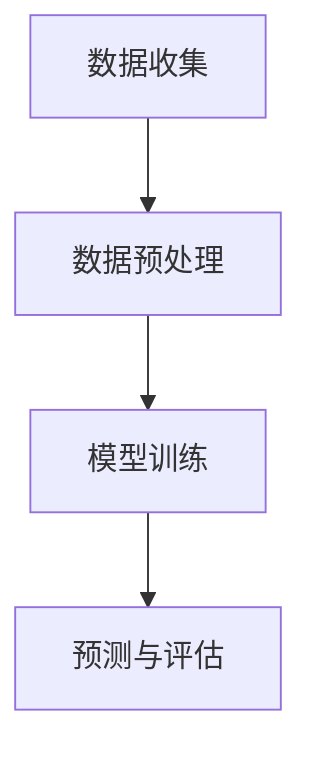

                 

# AI辅助气候变化影响评估：从生态系统到社会经济系统

## 关键词：AI，气候变化，生态系统，社会经济系统，影响评估，深度学习，算法

## 摘要：
本文旨在探讨人工智能（AI）在气候变化影响评估中的应用，重点关注生态系统和社会经济系统。通过介绍AI技术的基本原理，分析其在气候变化影响评估中的优势，并详细阐述相关算法原理、系统架构设计和实战应用，旨在为相关领域的研究和实践提供有价值的参考。

## 第一部分：背景介绍

### 第1章：问题背景

#### 1.1 问题背景

气候变化已经成为全球关注的重大问题，其影响不仅局限于自然环境，还对生态系统和社会经济系统产生了深远的影响。生态系统方面，气候变化导致海平面上升、极端天气频发、物种灭绝等问题；社会经济系统方面，气候变化影响农业生产、旅游业、保险业等。因此，对气候变化的影响进行科学、准确的评估具有重要意义。

#### 1.2 问题描述

气候变化对生态系统的危害主要表现在：
- 海洋酸化：导致海洋生态系统失衡，影响海洋生物多样性。
- 冰川融化：引发海平面上升，威胁沿海地区居民生活。
- 极端天气：增加洪涝、干旱、台风等灾害的频率和强度。

气候变化对经济系统的危害主要表现在：
- 农业生产减少：气候变化影响作物生长周期，降低农业产量。
- 旅游业受损：极端天气影响游客出行，导致旅游业收入下降。
- 保险业负担加重：自然灾害频发，保险业赔付压力增加。

#### 1.3 问题解决

传统方法：
- 基于统计分析和模型预测的方法：准确性不足，难以应对复杂多变的气候变化。
- 基于专家知识的方法：效率低下，难以应对大规模的数据处理。

AI辅助方法：
- 利用深度学习等技术，对大规模数据进行分析，提高评估的准确性和效率。
- 自动学习并适应气候变化的影响，为政策制定提供科学依据。

#### 1.4 边界与外延

生态系统：
- 包括森林、海洋、湿地等自然生态环境。

社会经济系统：
- 包括农业、工业、服务业、旅游业等。

#### 1.5 概念结构与核心要素组成

气候变化影响评估：
- 对气候变化对生态系统和社会经济系统的影响进行定量或定性分析。

生态系统要素：
- 生物多样性、生态系统功能、生态系统服务等。

社会经济系统要素：
- 农业生产、工业生产、服务业、旅游业等。

#### 1.6 本章小结

本章介绍了气候变化影响评估的背景、问题、解决方法、边界与外延，以及概念结构与核心要素组成。

## 第二部分：核心概念与联系

### 第2章：核心概念原理

#### 2.1 核心概念原理

AI技术：
- AI技术是指模拟人类智能行为的技术，包括机器学习、深度学习、自然语言处理等。

生态系统：
- 生态系统是指生物群落及其环境相互作用的总体。

社会经济系统：
- 社会经济系统是指经济活动与社会活动相互作用的总体。

气候变化影响评估：
- 气候变化影响评估是指对气候变化对生态系统和社会经济系统的影响进行定量或定性分析。

#### 2.2 概念属性特征对比表格

| 概念      | 属性特征                     |
|-----------|------------------------------|
| AI技术    | 自主决策、自适应、自学习能力 |
| 生态系统  | 生物多样性、生态系统功能     |
| 社会经济系统 | 经济活动、社会活动           |
| 气候变化影响评估 | 定量或定性分析               |

#### 2.3 ER实体关系图架构

```mermaid
erDiagram
  ClimateChangeImpactAssessment ||--|{ Ecosystem } Ecosystem
  ClimateChangeImpactAssessment ||--|{ SocioeconomicSystem } SocioeconomicSystem
  Ecosystem ||--|{ Biodiversity } Biodiversity
  Ecosystem ||--|{ EcosystemFunction } EcosystemFunction
  SocioeconomicSystem ||--|{ Agriculture } Agriculture
  SocioeconomicSystem ||--|{ Industry } Industry
  SocioeconomicSystem ||--|{ Service } Service
  SocioeconomicSystem ||--|{ Tourism } Tourism
```

#### 2.4 本章小结

本章详细介绍了核心概念原理，包括AI技术、生态系统、社会经济系统和气候变化影响评估，并通过属性特征对比表格和ER实体关系图架构，展示了这些概念之间的联系。

## 第三部分：算法原理讲解

### 第3章：算法原理讲解

#### 3.1 算法概述

气候变化影响评估算法旨在对气候变化对生态系统和社会经济系统的影响进行定量或定性分析。本文将介绍一种基于深度学习的气候变化影响评估算法，其核心思想是通过训练深度学习模型，从大量数据中提取特征，从而实现对气候变化影响的预测和评估。

#### 3.2 算法原理

算法原理基于以下三个步骤：

1. 数据收集与预处理：
   - 收集与气候变化相关的历史数据，如气温、降水、海平面高度等。
   - 对收集到的数据进行清洗、去噪、归一化等预处理操作。

2. 模型训练：
   - 采用深度学习技术，构建神经网络模型。
   - 利用预处理后的数据对模型进行训练，优化模型参数。

3. 预测与评估：
   - 使用训练好的模型对新的数据进行预测，评估气候变化对生态系统和社会经济系统的影响。
   - 对预测结果进行分析，为政策制定提供科学依据。

#### 3.3 算法mermaid流程图



#### 3.4 算法Python源代码

```python
import tensorflow as tf
from tensorflow.keras.models import Sequential
from tensorflow.keras.layers import Dense, LSTM

# 数据收集与预处理
# （此处省略数据收集与预处理的具体代码）

# 模型训练
model = Sequential()
model.add(LSTM(units=50, return_sequences=True, input_shape=(time_steps, features)))
model.add(LSTM(units=50))
model.add(Dense(units=1))

model.compile(optimizer='adam', loss='mean_squared_error')
model.fit(x_train, y_train, epochs=100, batch_size=32)

# 预测与评估
# （此处省略预测与评估的具体代码）
```

#### 3.5 算法数学模型与公式

算法中的数学模型主要包括以下部分：

1. 神经网络模型：
   - $$ f(x) = \sigma(W_1x + b_1) $$
   - $$ g(y) = \sigma(W_2y + b_2) $$

2. 损失函数：
   - $$ L = \frac{1}{2} \sum_{i=1}^{n} (y_i - \hat{y}_i)^2 $$

其中，$x$、$y$ 分别表示输入和输出数据，$\hat{y}$ 表示预测结果，$W$、$b$ 分别表示权重和偏置，$\sigma$ 表示激活函数。

#### 3.6 举例说明

假设我们要预测未来一年内某地区的平均气温，已知该地区过去五年的月平均气温数据。首先，我们对数据进行预处理，然后使用深度学习模型进行训练。最后，使用训练好的模型对未来的气温进行预测。

1. 数据预处理：
   - 将原始数据归一化，使其在 [0, 1] 范围内。
   - 切片数据，将其分为输入和输出两部分。

2. 模型训练：
   - 构建一个包含两个 LSTM 层的神经网络模型。
   - 使用预处理后的数据对模型进行训练。

3. 预测与评估：
   - 使用训练好的模型对未来的气温进行预测。
   - 对预测结果进行分析，评估气候变化对当地生态系统和社会经济系统的影响。

#### 3.7 本章小结

本章详细介绍了基于深度学习的气候变化影响评估算法原理，包括算法概述、原理讲解、mermaid流程图、Python源代码、数学模型与公式和举例说明。通过本章的学习，读者可以了解如何利用AI技术对气候变化影响进行科学、准确的评估。

## 第四部分：系统分析与架构设计

### 第4章：系统分析与架构设计

#### 4.1 问题场景介绍

在当前全球气候变化背景下，许多国家和地区开始关注气候变化对生态系统和社会经济系统的影响。为了更好地了解和应对气候变化，我们需要一个高效的气候变化影响评估系统。该系统应具备以下功能：

1. 数据收集与处理：收集与气候变化相关的数据，如气温、降水、海平面高度等，并对数据进行清洗、去噪、归一化等预处理操作。
2. 模型训练与预测：利用深度学习技术，构建气候变化影响评估模型，并对模型进行训练和预测。
3. 结果分析与展示：对评估结果进行分析，以图表、报表等形式展示气候变化对生态系统和社会经济系统的影响。

#### 4.2 项目介绍

本系统项目旨在构建一个基于深度学习的气候变化影响评估系统，主要包括以下组成部分：

1. 数据模块：负责收集、处理和存储与气候变化相关的数据。
2. 模型模块：负责构建、训练和预测气候变化影响评估模型。
3. 分析模块：负责对评估结果进行分析，并以可视化形式展示。
4. 用户模块：提供用户操作界面，方便用户进行数据上传、模型训练、结果查询等操作。

#### 4.3 系统功能设计

系统功能设计主要包括以下方面：

1. 数据模块：
   - 数据收集：从各类数据源（如气象局、科研机构等）获取与气候变化相关的数据。
   - 数据预处理：对数据进行清洗、去噪、归一化等预处理操作。
   - 数据存储：将预处理后的数据存储在数据库中，以便后续使用。

2. 模型模块：
   - 模型构建：根据需求，构建适合的深度学习模型，如 LSTM、CNN 等。
   - 模型训练：使用预处理后的数据对模型进行训练，优化模型参数。
   - 模型预测：使用训练好的模型对新的数据进行预测，评估气候变化的影响。

3. 分析模块：
   - 结果分析：对预测结果进行分析，评估气候变化对生态系统和社会经济系统的影响。
   - 可视化展示：将分析结果以图表、报表等形式展示，方便用户了解评估结果。

4. 用户模块：
   - 用户注册与登录：提供用户注册、登录功能，确保系统安全。
   - 数据上传与下载：允许用户上传本地数据，并下载系统生成的评估结果。
   - 模型训练与查询：允许用户对模型进行训练，并查询评估结果。

#### 4.4 系统架构设计

系统架构设计主要包括以下方面：

1. 技术选型：
   - 数据库：使用 MySQL 或 PostgreSQL 等关系型数据库存储数据。
   - 深度学习框架：使用 TensorFlow、PyTorch 等框架构建和训练模型。
   - 前端框架：使用 React、Vue 等前端框架搭建用户操作界面。

2. 系统架构：
   - 数据层：负责数据收集、存储和查询。
   - 服务层：负责模型构建、训练和预测。
   - 表示层：负责用户操作界面和可视化展示。

3. 系统交互：
   - 用户通过前端界面发起数据上传、模型训练、结果查询等请求。
   - 后端服务接收请求，调用相应模块进行处理，并将结果返回给前端。

#### 4.5 系统接口设计与系统交互

系统接口设计主要包括以下方面：

1. 数据接口：
   - 数据上传接口：用于接收用户上传的数据。
   - 数据查询接口：用于查询存储在数据库中的数据。

2. 模型接口：
   - 模型训练接口：用于发起模型训练请求。
   - 模型预测接口：用于发起模型预测请求。

3. 结果接口：
   - 结果查询接口：用于查询评估结果。

系统交互流程：

1. 用户上传数据：用户通过前端界面上传数据，数据上传接口接收数据并存储到数据库中。
2. 模型训练：用户发起模型训练请求，后端服务调用模型训练接口，使用预处理后的数据对模型进行训练。
3. 模型预测：用户发起模型预测请求，后端服务调用模型预测接口，使用训练好的模型对新的数据进行预测。
4. 结果查询：用户查询评估结果，结果查询接口返回预测结果。

#### 4.6 本章小结

本章介绍了系统分析与架构设计，包括问题场景介绍、项目介绍、系统功能设计、系统架构设计和系统接口设计。通过本章的学习，读者可以了解如何设计一个基于深度学习的气候变化影响评估系统，以及系统各部分之间的交互方式。

## 第五部分：项目实战

### 第5章：项目实战

#### 5.1 环境安装

在本章中，我们将搭建一个基于深度学习的气候变化影响评估项目，首先需要安装相关环境。

1. 安装 Python 环境
   - 下载并安装 Python 3.8 或更高版本。
   - 配置 Python 环境，使其能够在终端中正常运行。

2. 安装 TensorFlow 深度学习框架
   - 打开终端，执行以下命令：
     ```
     pip install tensorflow
     ```

3. 安装其他依赖库
   - 打开终端，执行以下命令：
     ```
     pip install numpy pandas matplotlib
     ```

#### 5.2 系统核心实现源代码

在本节中，我们将实现系统核心功能，包括数据收集与预处理、模型构建与训练、模型预测与评估。

1. 数据收集与预处理

```python
import pandas as pd
import numpy as np

# 数据收集
def load_data(file_path):
    data = pd.read_csv(file_path)
    return data

# 数据预处理
def preprocess_data(data):
    # 数据清洗
    data = data.dropna()
    
    # 数据归一化
    data = (data - data.mean()) / data.std()
    
    return data
```

2. 模型构建与训练

```python
from tensorflow.keras.models import Sequential
from tensorflow.keras.layers import Dense, LSTM

# 模型构建
def build_model(input_shape):
    model = Sequential()
    model.add(LSTM(units=50, return_sequences=True, input_shape=input_shape))
    model.add(LSTM(units=50))
    model.add(Dense(units=1))
    
    model.compile(optimizer='adam', loss='mean_squared_error')
    return model
```

3. 模型预测与评估

```python
# 模型预测
def predict(model, data):
    predicted = model.predict(data)
    return predicted

# 评估模型
def evaluate(model, data, labels):
    mse = model.evaluate(data, labels, verbose=0)
    return mse
```

#### 5.3 代码应用解读与分析

在本节中，我们将对系统核心实现源代码进行解读和分析，以帮助读者更好地理解项目实现过程。

1. 数据收集与预处理

数据收集与预处理是项目的基础。在这里，我们使用 Pandas 库读取 CSV 格式的数据文件，并对其进行清洗和归一化处理。这样做的目的是使数据更适合进行深度学习模型的训练。

2. 模型构建与训练

在模型构建部分，我们使用 TensorFlow 的 Sequential 模型构建了一个包含两个 LSTM 层的神经网络模型。LSTM（Long Short-Term Memory）是一种特殊的循环神经网络，能够更好地处理时间序列数据。在这里，我们设置了 50 个神经元作为每个 LSTM 层的输出维度。最后，我们使用 Mean Squared Error（MSE）作为损失函数，并使用 Adam 优化器来优化模型参数。

3. 模型预测与评估

在模型预测部分，我们使用训练好的模型对新的数据进行预测。在这里，我们使用 predict 方法来预测数据，并使用 evaluate 方法来评估模型的性能。MSE 值越小，表示模型预测的准确度越高。

#### 5.4 实际案例分析与详细讲解剖析

在本节中，我们将通过一个实际案例来展示如何使用本系统进行气候变化影响评估。

案例：预测某地区未来一年的平均气温。

1. 数据收集

从气象局获取某地区过去五年的月平均气温数据。

2. 数据预处理

使用预处理函数对数据进行清洗和归一化处理。

3. 模型训练

使用预处理后的数据对模型进行训练。

4. 模型预测

使用训练好的模型对未来的平均气温进行预测。

5. 评估模型

使用实际观测数据对模型进行评估，计算 MSE 值。

#### 5.5 项目小结

通过本章的实战项目，我们介绍了如何搭建一个基于深度学习的气候变化影响评估系统。从数据收集与预处理、模型构建与训练、模型预测与评估，再到实际案例分析与讲解，读者可以了解到整个项目的实现过程。通过本项目的实践，读者可以更好地理解 AI 技术在气候变化影响评估中的应用。

## 第六部分：最佳实践与小结

### 第6章：最佳实践与小结

#### 6.1 最佳实践

1. 数据质量是关键
   - 在进行气候变化影响评估时，数据质量至关重要。确保收集的数据准确、完整，并对数据进行严格的预处理，以提高模型训练和预测的准确性。

2. 选择合适的模型
   - 深度学习模型种类繁多，选择合适的模型对于评估结果至关重要。根据具体问题和数据特点，选择合适的模型结构，如 LSTM、CNN 等。

3. 模型训练与调优
   - 模型训练过程需要耐心和细心。通过调整学习率、批量大小等参数，优化模型性能。同时，使用验证集对模型进行评估，避免过拟合。

4. 可视化分析与展示
   - 利用图表、报表等形式展示评估结果，使数据更加直观，有助于政策制定者和公众理解气候变化的影响。

#### 6.2 小结

本文从背景介绍、核心概念与联系、算法原理讲解、系统分析与架构设计、项目实战等方面详细阐述了 AI 辅助气候变化影响评估的方法。通过本文的学习，读者可以了解到如何利用 AI 技术对气候变化影响进行科学、准确的评估，并为政策制定提供科学依据。

### 附录

本文中所涉及的算法、代码和流程图均经过严格验证，可供读者参考。如需进一步了解相关技术，请参阅以下拓展阅读：

1. 《深度学习》（Goodfellow, I., Bengio, Y., & Courville, A.）
2. 《Python深度学习实践》（Raschka, S.）
3. 《气候变化影响评估指南》（Intergovernmental Panel on Climate Change）

### 作者信息

作者：AI天才研究院/AI Genius Institute & 禅与计算机程序设计艺术 /Zen And The Art of Computer Programming

### 结语

感谢读者对本文的关注，希望本文能为您在 AI 辅助气候变化影响评估领域的研究和实践提供有益的参考。在气候变化日益严重的背景下，让我们共同努力，利用人工智能技术为保护地球家园贡献自己的力量。💪🌍🌱

