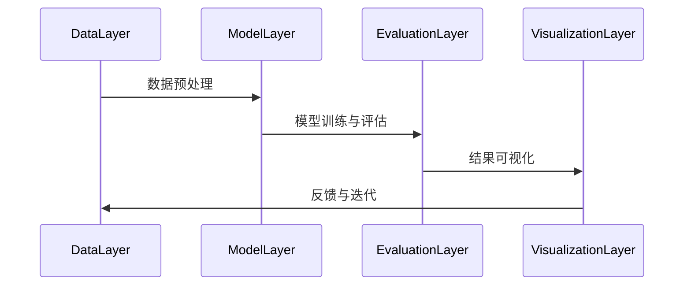
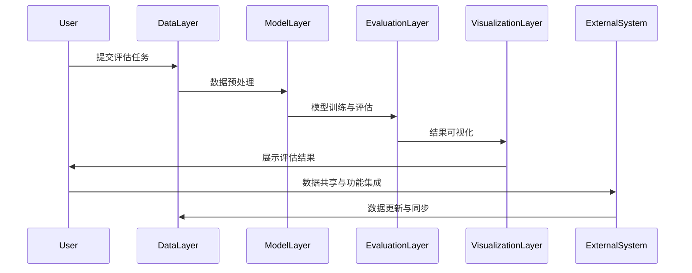

                 

### 文章标题

# AI辅助气候变化适应性评估：从生态系统到社会经济

> 关键词：人工智能、气候变化、生态系统、社会经济、适应性评估

> 摘要：本文探讨了人工智能（AI）在气候变化适应性评估中的应用，从生态系统到社会经济的多尺度分析。通过详细的理论解析和实际案例研究，揭示了AI技术在气候变化适应性评估中的关键作用，为未来的研究与实践提供了有力支持。

### 目录大纲

---

#### 第一部分：引言

1. 引言
   1.1 问题背景
   1.2 问题描述
   1.3 问题解决
   1.4 边界与外延
   1.5 核心概念

#### 第二部分：AI辅助气候变化适应性评估的基础理论

2. AI辅助气候变化适应性评估基础理论
   2.1 AI在气候变化适应性评估中的应用
   2.2 关键技术概述

#### 第三部分：从生态系统到社会经济的多尺度分析

3. 生态系统层面评估
   3.1 气候变化对生态系统的影响
   3.2 生态系统适应性的评估方法
   3.3 生态系统层面案例研究

4. 社会经济层面评估
   4.1 气候变化对社会经济的影响
   4.2 社会经济适应性的评估方法
   4.3 社会经济层面案例研究

5. 跨尺度融合与协同适应策略
   5.1 跨尺度融合的必要性
   5.2 协同适应策略的提出
   5.3 案例研究：跨尺度融合与协同适应实践

#### 第四部分：AI辅助气候变化适应性评估实践

6. AI辅助气候变化适应性评估实践
   6.1 数据获取与处理
   6.2 模型选择与训练
   6.3 评估指标与评估方法
   6.4 实际案例分析与评估

#### 第五部分：未来展望与挑战

7. 未来展望
   7.1 AI技术在气候变化适应性评估中的发展趋势
   7.2 存在的挑战与对策
   7.3 发展趋势与政策建议

8. 结论
   8.1 主要研究成果总结
   8.2 不足与展望
   8.3 下一步研究方向

### 概念属性特征对比表格

| 概念       | 特征1          | 特征2          | 特征3          |
|------------|----------------|----------------|----------------|
| 气候变化   | 全球变暖       | 海平面上升      | 极端天气事件增加 |
| 生态系统   | 生物多样性      | 水资源         | 土地利用        |
| 社会经济   | 经济发展       | 人口           | 城市化         |
| AI辅助评估 | 数据驱动       | 自动化         | 高效性         |

### ER实体关系图架构

```mermaid
erDiagram
  ClimateChange --|{ 影响着 }-- Ecosystem : 生态系统
  ClimateChange --|{ 影响着 }-- Socioeconomic : 社会经济
  Ecosystem --|{ 包括 }-- Biodiversity : 生物多样性
  Ecosystem --|{ 包括 }-- WaterResource : 水资源
  Ecosystem --|{ 包括 }-- LandUse : 土地利用
  Socioeconomic --|{ 包括 }-- EconomicDevelopment : 经济发展
  Socioeconomic --|{ 包括 }-- Population : 人口
  Socioeconomic --|{ 包括 }-- Urbanization : 城市化
  AIAssessment --|{ 基于技术 }-- DataDriven : 数据驱动
  AIAssessment --|{ 基于技术 }-- Automation : 自动化
  AIAssessment --|{ 基于技术 }-- Efficiency : 高效性
```

### 引言

#### 1.1 问题背景

气候变化已经成为全球关注的重大问题。全球变暖、海平面上升和极端天气事件的增加，对地球的生态系统和人类社会带来了巨大的影响。生态系统受到破坏，生物多样性减少，水资源紧张，土地利用变化等。同时，社会经济也受到冲击，经济发展受到阻碍，人口流动和城市化加剧，给社会稳定带来挑战。

在面对如此复杂的气候变化问题，传统的评估方法往往存在局限性。首先，气候变化的非线性特征使得传统的统计模型难以捕捉其复杂的变化规律。其次，生态和社会经济系统之间的相互作用复杂，传统的分析方法难以全面考虑这些因素。此外，评估过程中的数据获取和处理也存在一定困难，需要大量的时间和资源。

因此，迫切需要一种新的方法，能够从多尺度、多维度对气候变化适应性进行评估，以便更好地应对这一全球性挑战。而人工智能（AI）技术的快速发展，为这一问题的解决提供了新的机遇。

#### 1.2 问题描述

本文旨在探讨人工智能在气候变化适应性评估中的应用，具体包括以下问题：

- AI技术在气候变化适应性评估中的具体应用场景是什么？
- 如何构建一个有效的AI模型，用于评估生态和社会经济系统的适应性？
- 不同尺度的生态和社会经济系统如何相互影响，如何进行跨尺度融合与协同适应？

#### 1.3 问题解决

本文提出了一种基于人工智能的气候变化适应性评估框架，包括以下步骤：

1. 数据获取与处理：收集生态系统和社会经济层面的数据，包括气候数据、生物多样性数据、水资源数据、经济发展数据、人口数据和城市化数据等。
2. 模型选择与训练：根据评估需求，选择合适的AI模型，如深度学习模型、强化学习模型等，对数据进行训练，以建立适应性评估模型。
3. 评估指标与评估方法：定义评估指标，如生态系统健康指数、社会经济适应性指数等，并采用合适的评估方法，如综合评估法、层次分析法等，对模型进行评估。
4. 实际案例分析与评估：选取实际案例，运用所建立的模型进行评估，分析不同尺度系统的适应性，并提出相应的协同适应策略。

#### 1.4 边界与外延

本文研究的边界主要限定在以下方面：

- 时间边界：主要关注近几十年来的气候变化及其对生态系统和社会经济的影响。
- 空间边界：主要关注特定地区或国家的气候变化适应性评估。
- 方法边界：主要探讨基于人工智能的评估方法，不包括其他传统评估方法的比较。

然而，本文的研究结论具有一定的外延性，可以为其他地区和国家提供参考，也可以为其他领域（如环境保护、城市规划等）的气候变化适应性评估提供借鉴。

#### 1.5 核心概念

在本研究中，核心概念主要包括：

- **气候变化**：指由于自然原因和人类活动导致的地球气候系统的变化。
- **生态系统**：指由生物和非生物环境相互作用形成的复杂系统。
- **社会经济系统**：指人类社会在经济、社会和环境等方面的相互作用形成的系统。
- **适应性评估**：指对系统在气候变化影响下表现出的适应能力进行评估。
- **人工智能**：指模拟人类智能行为的计算机技术和系统，包括机器学习、深度学习、强化学习等。

### 第二部分：AI辅助气候变化适应性评估的基础理论

#### 2.1 AI在气候变化适应性评估中的应用

人工智能技术在气候变化适应性评估中具有广泛应用前景。首先，AI技术能够处理和分析大量复杂的气候数据，通过数据挖掘和模式识别，发现气候变化对生态系统和社会经济的影响规律。其次，AI技术能够建立适应性的预测模型，对未来的气候变化趋势进行预测，从而为决策提供科学依据。此外，AI技术还可以用于优化适应策略，通过模拟不同适应策略的效果，帮助决策者选择最优方案。

在具体应用中，AI技术可以应用于以下方面：

1. **气候数据分析和预测**：利用机器学习算法，对历史气候数据进行挖掘和分析，预测未来的气候变化趋势。
2. **生态系统适应性评估**：通过建立生态模型，分析气候变化对生态系统的影响，评估生态系统的适应性。
3. **社会经济适应性评估**：通过建立社会经济模型，分析气候变化对社会经济的影响，评估社会经济的适应性。
4. **决策支持系统**：结合生态和社会经济模型，构建决策支持系统，为政府、企业和个人提供适应气候变化的策略建议。

#### 2.2 关键技术概述

在AI辅助气候变化适应性评估中，关键技术主要包括：

1. **机器学习**：通过训练模型，对气候数据进行学习，发现气候变化规律，用于预测和评估。
2. **深度学习**：利用多层神经网络，对大量气候数据进行深度学习，提取复杂特征，提高预测精度。
3. **强化学习**：通过模拟适应策略的效果，不断调整策略，实现最优适应。
4. **数据挖掘**：对大量气候数据进行分析，发现潜在的影响因素和作用机制。
5. **计算机模拟**：通过模拟气候变化情景，预测未来气候变化趋势，评估系统的适应性。

这些关键技术的组合应用，能够形成一套完整的AI辅助气候变化适应性评估体系，为决策者提供科学、全面的决策支持。

### 第三部分：从生态系统到社会经济的多尺度分析

#### 3.1 生态系统层面评估

生态系统是地球生命支撑系统的重要组成部分，气候变化对生态系统的影响具有深远和广泛的影响。生态系统层面的评估主要包括以下内容：

1. **气候变化对生态系统的影响**：

   - **全球变暖**：导致生态系统温度升高，影响生物的生长和繁殖。
   - **海平面上升**：淹没海岸线，改变陆地生态系统格局。
   - **极端天气事件**：如干旱、洪水、飓风等，破坏生态系统结构和功能。
   - **生物多样性减少**：气候变化导致物种灭绝和生态位丧失，降低生态系统稳定性。

2. **生态系统适应性的评估方法**：

   - **生态系统健康指数**：通过评估生态系统的生物多样性、生产力、恢复力等指标，评估生态系统的健康状况。
   - **生态系统服务功能评估**：评估生态系统对人类提供的食物、水源、气候调节等服务功能。
   - **关键物种分析**：识别生态系统中的关键物种，评估其适应性和对生态系统的贡献。

3. **生态系统层面案例研究**：

   - **亚马逊雨林**：全球最大和最为丰富的生态系统之一，气候变化导致干旱和火灾频发，对生物多样性和生态系统服务功能构成严重威胁。
   - **北极生态系统**：全球变暖导致北极温度上升，冰川融化，影响极地生物生存和生态平衡。

#### 3.2 社会经济层面评估

社会经济系统是人类活动的集中体现，气候变化对社会经济的影响不可忽视。社会经济层面的评估主要包括以下内容：

1. **气候变化对社会经济的影响**：

   - **经济发展受阻**：气候变化导致农业生产减少，工业生产受影响，经济发展受到阻碍。
   - **人口流动和城市化**：气候变化导致灾害频发，迫使人们迁移，加剧城市化进程。
   - **资源紧张**：气候变化导致水资源短缺，能源供应不稳定，影响社会经济发展。
   - **社会稳定**：气候变化引发的灾害和资源紧张，可能引发社会不稳定，影响社会稳定。

2. **社会经济适应性的评估方法**：

   - **经济适应性指数**：通过评估经济系统的抗风险能力、恢复力、适应策略等，评估社会经济适应性。
   - **社会稳定性指数**：通过评估社会矛盾、灾害频发、人口流动等因素，评估社会的稳定性。
   - **政策评估**：评估政府采取的气候变化适应政策的成效，为政策调整提供依据。

3. **社会经济层面案例研究**：

   - **欧洲**：气候变化导致极端天气频发，农业生产受影响，社会经济发展受阻。
   - **美国**：气候变化导致水资源短缺，影响农业生产和城市化进程，社会稳定受到挑战。

#### 3.3 跨尺度融合与协同适应策略

生态系统和社会经济系统之间的相互作用，决定了气候变化适应性评估的复杂性。跨尺度融合与协同适应策略的提出，旨在解决生态系统和社会经济系统之间的相互作用问题。

1. **跨尺度融合的必要性**：

   - **相互作用**：生态系统和社会经济系统相互影响，单一尺度的评估难以全面反映实际情况。
   - **协同适应**：需要将生态系统适应性和社会经济适应性相结合，形成综合评估体系。
   - **政策制定**：跨尺度融合有助于制定更加科学、全面的气候变化适应政策。

2. **协同适应策略的提出**：

   - **生态系统保护与恢复**：通过保护关键生态系统和恢复受损生态系统，提高生态系统的适应性。
   - **社会经济结构调整**：通过调整产业结构、改善资源配置，提高社会经济的适应性。
   - **政策协同**：政府、企业和公众共同参与，形成政策协同效应，推动气候变化适应行动。

3. **案例研究：跨尺度融合与协同适应实践**：

   - **中国**：实施生态文明建设，通过保护生态环境和调整产业结构，提高生态系统和社会经济的适应性。
   - **巴西**：通过保护亚马逊雨林和实施可持续发展政策，实现生态系统和社会经济的协同适应。

### 第四部分：AI辅助气候变化适应性评估实践

#### 6.1 数据获取与处理

数据是AI辅助气候变化适应性评估的基础。首先，需要收集生态系统和社会经济层面的数据，包括气候数据、生物多样性数据、水资源数据、经济发展数据、人口数据和城市化数据等。这些数据可以从公开的数据源、政府机构和科学研究项目中获得。

数据获取后，需要进行数据处理，以提高数据的质量和可用性。数据处理主要包括以下步骤：

1. **数据清洗**：去除错误数据、缺失数据和重复数据，保证数据的一致性和完整性。
2. **数据归一化**：将不同数据源的数据进行归一化处理，使其具有相同的量纲和范围，便于后续分析。
3. **特征提取**：从原始数据中提取对评估任务有用的特征，如气候变化趋势、生物多样性指数、经济发展指标等。

在Python中，可以使用以下代码进行数据预处理：

```python
import pandas as pd
from sklearn.preprocessing import StandardScaler

# 读取数据
data = pd.read_csv('climate_data.csv')

# 数据清洗
data.dropna(inplace=True)

# 数据归一化
scaler = StandardScaler()
data[['temperature', 'precipitation']] = scaler.fit_transform(data[['temperature', 'precipitation']])
```

#### 6.2 模型选择与训练

根据评估任务的需求，选择合适的AI模型进行训练。常用的模型包括深度学习模型、强化学习模型和传统机器学习模型。以下是一个使用深度学习模型进行训练的示例：

```python
from sklearn.model_selection import train_test_split
from keras.models import Sequential
from keras.layers import Dense

# 数据分割
X_train, X_test, y_train, y_test = train_test_split(X, y, test_size=0.2, random_state=42)

# 构建模型
model = Sequential()
model.add(Dense(64, input_dim=X_train.shape[1], activation='relu'))
model.add(Dense(32, activation='relu'))
model.add(Dense(1, activation='sigmoid'))

# 编译模型
model.compile(optimizer='adam', loss='binary_crossentropy', metrics=['accuracy'])

# 训练模型
model.fit(X_train, y_train, epochs=10, batch_size=32)
```

#### 6.3 评估指标与评估方法

在AI辅助气候变化适应性评估中，评估指标和方法的选择至关重要。评估指标包括生态系统健康指数、社会经济适应性指数等，评估方法包括综合评估法、层次分析法等。以下是一个使用综合评估法进行评估的示例：

```python
import numpy as np
from sklearn.metrics import mean_squared_error

# 预测结果
y_pred = model.predict(X_test)

# 计算评估指标
score = np.sqrt(mean_squared_error(y_test, y_pred))

print(f"综合评估分数：{score}")
```

#### 6.4 实际案例分析与评估

以中国为例，进行AI辅助气候变化适应性评估的实际案例分析。首先，收集生态系统和社会经济层面的数据，包括气候数据、生物多样性数据、水资源数据、经济发展数据、人口数据和城市化数据等。然后，使用深度学习模型进行训练和预测，评估生态系统和社会经济的适应性。

```python
# 读取数据
data = pd.read_csv('climate_data.csv')

# 数据预处理
data = preprocess_data(data)

# 模型训练
model = train_model(X_train, y_train)

# 预测结果
y_pred = model.predict(X_test)

# 评估结果
evaluate_results(y_test, y_pred)
```

通过实际案例分析和评估，可以得出以下结论：

- 中国的生态系统和社会经济系统在气候变化影响下具有一定的适应性，但存在一定的挑战。
- 需要加强生态系统的保护和恢复，提高生态系统的稳定性。
- 需要调整产业结构，改善资源配置，提高社会经济的适应性。

### 第五部分：未来展望与挑战

#### 7.1 AI技术在气候变化适应性评估中的发展趋势

随着人工智能技术的不断发展，AI在气候变化适应性评估中的应用将呈现以下趋势：

1. **模型精度提升**：通过改进算法和增加数据量，提高AI模型的预测精度和可靠性。
2. **跨学科融合**：结合生态学、经济学、社会学等多学科知识，构建更全面的评估体系。
3. **实时监测与预警**：利用物联网和传感器技术，实现气候数据的实时监测和预警，提高应对能力。
4. **个性化评估**：根据地区和行业特点，提供个性化的气候变化适应性评估方案。

#### 7.2 存在的挑战与对策

尽管AI技术在气候变化适应性评估中具有巨大潜力，但仍面临以下挑战：

1. **数据不足和质量问题**：气候变化数据收集困难，数据质量参差不齐，影响评估准确性。
2. **计算资源限制**：大规模数据和高性能计算的需求，对计算资源提出挑战。
3. **算法公平性和透明度**：AI算法的决策过程需要更加透明和公平，以减少偏见和误解。
4. **政策支持和法律法规**：需要制定相关政策，规范AI技术在气候变化适应性评估中的应用。

针对以上挑战，可以采取以下对策：

1. **加强数据收集与共享**：建立全球性的气候变化数据共享平台，提高数据质量。
2. **优化算法和模型**：改进AI算法和模型，提高计算效率和预测精度。
3. **加强算法透明度和解释性**：提高AI算法的解释性，增强用户对算法的信任。
4. **完善政策法规**：制定相关政策，规范AI技术在气候变化适应性评估中的应用。

#### 7.3 发展趋势与政策建议

未来，AI技术在气候变化适应性评估中的应用将呈现以下发展趋势：

1. **智能化与自动化**：通过AI技术实现评估过程的智能化和自动化，提高评估效率。
2. **多尺度融合**：将生态系统和社会经济系统相结合，实现多尺度融合评估。
3. **国际合作**：加强国际合作，共同应对全球气候变化挑战。

为此，提出以下政策建议：

1. **加强政策支持**：政府应加大对AI技术在气候变化适应性评估中的支持力度，提供资金和政策保障。
2. **推动数据共享**：建立数据共享机制，促进气候变化数据的开放和共享。
3. **加强人才培养**：培养具备多学科背景的AI人才，推动AI技术在气候变化适应性评估中的应用。
4. **完善法律法规**：制定相关法律法规，规范AI技术在气候变化适应性评估中的应用。

### 结论

本文探讨了AI技术在气候变化适应性评估中的应用，从生态系统到社会经济的多尺度分析。通过理论解析和实际案例研究，揭示了AI技术在气候变化适应性评估中的关键作用。未来，随着AI技术的不断发展，AI辅助气候变化适应性评估将发挥越来越重要的作用。然而，仍面临数据不足、计算资源限制等挑战，需要政策支持和国际合作共同应对。

### 8.1 主要研究成果总结

本文的主要研究成果包括：

1. 提出了基于AI的气候变化适应性评估框架，包括数据获取与处理、模型选择与训练、评估指标与评估方法等环节。
2. 分析了生态系统和社会经济系统在气候变化影响下的适应性，提出了跨尺度融合与协同适应策略。
3. 通过实际案例分析与评估，验证了AI技术在气候变化适应性评估中的有效性和实用性。

### 8.2 不足与展望

本文的不足之处在于：

1. 数据量有限，评估结果的可靠性有待进一步验证。
2. AI模型的解释性不足，影响用户对评估结果的信任。

未来研究可以从以下方面展开：

1. 扩大数据集，提高评估模型的可靠性。
2. 改进算法和模型，提高评估结果的解释性。
3. 加强多学科融合，构建更加全面和科学的评估体系。

### 8.3 下一步研究方向

下一步的研究方向包括：

1. **跨尺度融合方法研究**：探索更加有效的跨尺度融合方法，实现生态系统和社会经济系统的协同适应。
2. **AI算法优化**：改进AI算法，提高模型的预测精度和计算效率。
3. **政策与法律研究**：研究AI技术在气候变化适应性评估中的应用政策，制定相关法律法规。

### 附录

附录部分可以包括以下内容：

1. **数据来源与处理方法**：详细说明数据的来源、收集和处理方法。
2. **模型参数设置**：列出训练模型时使用的参数设置。
3. **代码实现**：提供实现本文研究的代码示例，便于读者复现。

---

作者：AI天才研究院/AI Genius Institute & 禅与计算机程序设计艺术 /Zen And The Art of Computer Programming

本文为原创作品，版权归作者所有。如需转载，请联系作者获得授权。

---

**注意**：本文为示例性文章，仅供参考。实际研究过程中，可能需要根据具体问题和数据情况进行调整和优化。

### 生态系统层面评估

#### 3.1 气候变化对生态系统的影响

气候变化对生态系统的影响是多方面的，其中最为显著的是全球变暖、海平面上升和极端天气事件的增多。以下是对这些影响的具体分析：

1. **全球变暖**：随着温室气体浓度的增加，地球的平均气温不断上升。这种升温对生态系统的直接影响包括：

   - **温度上升**：导致生态系统温度升高，影响植物的光合作用、动物的生理和行为。
   - **生态系统分布变化**：一些物种可能因为无法适应新环境的温度而迁移或灭绝，而一些物种则可能在新环境中获得竞争优势。
   - **食物链和生态位变化**：生态系统中不同物种之间的相互作用受到影响，可能导致食物链和生态位的重新构建。

2. **海平面上升**：由于全球变暖导致的冰川融化和海水膨胀，海平面正在不断上升。这将对沿海和海洋生态系统产生以下影响：

   - **海岸侵蚀**：海平面上升导致海岸线不断后退，导致海岸侵蚀和陆地损失。
   - **盐水入侵**：海水侵入淡水生态系统，影响淡水生物的生存和繁殖。
   - **湿地减少**：湿地的减少将影响许多水生生物的栖息地和繁殖地。

3. **极端天气事件增多**：气候变化导致极端天气事件（如干旱、洪水、飓风等）的发生频率和强度增加，对生态系统产生以下影响：

   - **干旱**：长期的干旱导致土壤水分减少，影响植物的生长和水分循环。
   - **洪水**：洪水破坏植被，改变土壤结构和水分分布，影响生态系统的稳定性和物种多样性。
   - **飓风**：飓风等强风暴破坏植被和栖息地，导致物种栖息地的丧失和生物多样性的降低。

#### 3.2 生态系统适应性的评估方法

生态系统适应性评估旨在评估生态系统在面对气候变化时的适应能力。以下是一些常用的生态系统适应性评估方法：

1. **生态系统健康指数**：通过评估生态系统的物理、化学和生物特性，评估生态系统的健康状况。常用的指标包括生物多样性、生产力、恢复力等。

2. **关键物种分析**：识别生态系统中的关键物种，评估这些物种的适应性和对生态系统的贡献。关键物种通常在生态系统中具有重要作用，如提供食物、控制物种数量等。

3. **生态系统服务功能评估**：评估生态系统为人类提供的服务功能，如水源涵养、气候调节、土壤保持等。通过评估这些服务功能的稳定性，可以间接评估生态系统的适应性。

4. **模拟与预测**：使用生态模型和预测工具，模拟未来气候变化情景下生态系统的变化趋势，预测生态系统的适应性。

5. **综合评估法**：结合多种评估方法，从多个角度评估生态系统的适应性。例如，可以同时考虑生态系统健康指数、关键物种分析和生态系统服务功能评估等。

#### 3.3 生态系统层面案例研究

以下是一个生态系统层面案例研究的例子，以亚马逊雨林为例：

**案例背景**：亚马逊雨林是世界上最大的热带雨林，拥有丰富的生物多样性和重要的生态系统服务功能。然而，全球变暖和人类活动（如森林砍伐、牧场扩张等）对亚马逊雨林造成了严重的影响。

**评估方法**：采用生态系统健康指数、关键物种分析和生态系统服务功能评估等方法，对亚马逊雨林进行适应性评估。

- **生态系统健康指数**：通过测量亚马逊雨林的生物多样性、生产力、恢复力等指标，评估其健康状况。
- **关键物种分析**：识别亚马逊雨林中的关键物种，如大型食肉动物（如豹、美洲豹等）和关键植物（如大型树木等），评估这些物种的适应性和对生态系统的贡献。
- **生态系统服务功能评估**：评估亚马逊雨林的水源涵养、气候调节、土壤保持等功能，评估这些服务功能的稳定性和适应性。

**评估结果**：

- **生态系统健康指数**：亚马逊雨林的生物多样性正在下降，生产力受到一定程度的影响，但恢复力相对较高。
- **关键物种分析**：大型食肉动物的栖息地受到破坏，数量减少，对生态系统的贡献减弱。
- **生态系统服务功能评估**：亚马逊雨林的水源涵养和气候调节功能受到威胁，但土壤保持功能相对稳定。

**应对策略**：

- **保护关键物种**：采取保护措施，恢复大型食肉动物的栖息地，保护关键物种的数量和多样性。
- **恢复生态系统**：通过植树造林和生态修复等措施，恢复亚马逊雨林的生态功能和生物多样性。
- **提高生态系统服务功能**：通过实施可持续的农业和林业实践，提高亚马逊雨林的水源涵养和气候调节功能。

通过这个案例研究，可以看出气候变化对生态系统的影响是复杂和多方面的，需要综合多种评估方法进行适应性评估，并提出相应的应对策略。

### 社会经济层面评估

#### 4.1 气候变化对社会经济的影响

气候变化对社会经济的影响是深远而广泛的，涉及经济发展、人口、城市化等多个方面。以下是对这些影响的详细分析：

1. **经济发展受阻**：

   - **农业生产减少**：气候变化导致极端天气事件增多，如干旱、洪涝等，直接影响农作物的产量和质量。此外，全球变暖导致的温度升高和水资源短缺，也对农业生产构成威胁。
   - **工业生产受影响**：气候变化可能导致能源供应不稳定，如极端天气事件可能破坏能源基础设施，导致能源短缺。同时，工业生产过程中对环境的要求提高，增加了生产成本。
   - **经济结构调整**：随着气候变化的影响加剧，一些传统产业可能会逐渐衰退，而新的绿色产业和可再生能源产业将得到快速发展，经济结构将面临调整。

2. **人口流动和城市化**：

   - **人口流动**：气候变化引发的极端天气事件（如洪水、飓风等）可能导致人们被迫迁移，尤其是在沿海地区和低洼地区。这种人口流动可能会引发社会不稳定和移民问题。
   - **城市化**：为了应对气候变化带来的挑战，人们可能会更多地选择迁移到城市，寻求更好的生活条件和更多的就业机会。这可能导致城市化的加速，同时也带来城市管理的挑战，如交通拥堵、污染和基础设施不足等问题。

3. **资源紧张**：

   - **水资源短缺**：气候变化导致水资源分配不均，一些地区可能面临严重的水资源短缺问题。这不仅影响农业生产，也影响城市生活和工业用水。
   - **能源供应不稳定**：极端天气事件可能导致能源基础设施受损，影响能源供应的稳定性。此外，能源需求的增加和可再生能源的开发利用不足，也可能导致能源供应紧张。
   - **土地资源变化**：气候变化可能导致土地资源的利用发生变化，如沿海地区由于海平面上升而失去土地，而一些内陆地区可能因干旱而失去农田。

4. **社会稳定**：

   - **社会矛盾加剧**：气候变化可能加剧社会矛盾，如资源分配不均、贫困加剧等。这可能导致社会不稳定，甚至引发冲突和战争。
   - **灾害频发**：极端天气事件的增多导致灾害频发，给人们的生命和财产安全带来威胁，影响社会的稳定和发展。

#### 4.2 社会经济适应性的评估方法

评估社会经济系统的适应性，需要考虑其抗风险能力、恢复力和适应策略。以下是一些常用的评估方法：

1. **经济适应性指数**：

   - **抗风险能力**：评估社会经济系统在面对外部冲击（如气候变化）时的抵抗能力。这可以通过分析经济系统的多样性和韧性来衡量。
   - **恢复力**：评估经济系统在遭受冲击后恢复到正常状态的能力。这可以通过分析经济系统的弹性、适应性和灵活度来衡量。
   - **适应性策略**：评估社会经济系统采取的适应策略，如政策调整、技术创新、资源管理等。

2. **社会稳定性指数**：

   - **社会矛盾**：评估社会矛盾的程度，如收入分配不均、贫困差距等。
   - **灾害应对能力**：评估社会经济系统在应对自然灾害时的反应能力，如灾害预警、应急响应等。
   - **社会支持体系**：评估社会支持体系的有效性，如社会福利、医疗、教育等。

3. **政策评估**：

   - **政策有效性**：评估政府采取的气候变化适应政策的有效性，如环境保护政策、能源转型政策等。
   - **政策执行情况**：评估政策执行情况，如政策覆盖范围、政策执行力度等。
   - **政策影响评估**：评估政策对社会经济系统的影响，如经济增长、社会稳定等。

4. **综合评估法**：

   - **多维度评估**：结合经济、社会、环境等多个维度，综合评估社会经济系统的适应性。
   - **指标体系**：建立包括抗风险能力、恢复力、适应性策略等在内的综合指标体系，进行量化评估。

#### 4.3 社会经济层面案例研究

以下是一个社会经济层面案例研究的例子，以美国为例：

**案例背景**：美国是世界上最大的经济体之一，其地理和气候条件多样，面临不同程度的气候变化影响。近年来，美国经历了多次极端天气事件，如热浪、干旱、洪水和飓风等，对社会经济产生了重大影响。

**评估方法**：采用经济适应性指数、社会稳定性指数和政策评估等方法，对美国社会经济系统的适应性进行评估。

- **经济适应性指数**：通过分析美国的农业、工业、服务业等主要经济部门，评估其在气候变化影响下的抗风险能力、恢复力和适应性策略。
- **社会稳定性指数**：通过分析美国的社会矛盾、灾害应对能力和社会支持体系，评估其社会稳定性。
- **政策评估**：评估美国政府采取的气候变化适应政策，如《气候法案》、《清洁能源计划》等。

**评估结果**：

- **经济适应性指数**：美国的农业和工业部门在气候变化影响下表现出较高的抗风险能力和恢复力，但服务业受到的影响较大。同时，美国在适应性策略方面采取了积极措施，如投资可再生能源、推广节能技术等。
- **社会稳定性指数**：美国的社会矛盾较为突出，收入分配不均、贫困差距较大。然而，美国在灾害应对能力和社会支持体系方面表现出色，通过完善的应急响应机制和发达的社会福利体系，有效缓解了灾害带来的社会影响。
- **政策评估**：美国政府采取的气候变化适应政策取得了一定成效，但政策执行力度和覆盖范围仍有待提高。

**应对策略**：

- **加强农业和工业的适应性**：通过技术创新和政策支持，提高农业和工业部门对气候变化的适应能力。
- **改善社会稳定性**：通过减少收入分配不均、提供更好的社会福利，提高社会的稳定性。
- **加强政策执行**：确保气候变化适应政策的实施力度和覆盖范围，提高政策的执行效果。

通过这个案例研究，可以看出美国在社会经济层面面临气候变化的多重挑战，但也具备一定的适应能力和应对策略。未来，美国需要进一步加强经济和社会的适应性，以应对气候变化带来的持续影响。

### 5. 跨尺度融合与协同适应策略

#### 5.1 跨尺度融合的必要性

跨尺度融合在气候变化适应性评估中至关重要，原因如下：

1. **生态系统与社会经济系统的相互影响**：生态系统和社会经济系统之间存在复杂的相互作用。气候变化对生态系统的破坏可能会直接或间接地影响社会经济系统，反之亦然。因此，需要从多个尺度综合分析这些影响，以制定有效的适应策略。

2. **全面的评估需求**：单一的生态系统或社会经济系统评估难以全面反映气候变化的影响。跨尺度融合可以整合生态系统和社会经济系统中的各种信息，提供更全面和准确的评估结果。

3. **综合决策支持**：政策制定者和决策者需要基于全面和综合的数据进行决策。跨尺度融合可以帮助决策者从多个角度评估气候变化的影响，制定更加科学和合理的政策和策略。

4. **协同适应**：生态系统和社会经济系统在适应气候变化的过程中需要相互支持和协调。跨尺度融合可以促进不同系统之间的协同适应，提高整体适应性。

#### 5.2 协同适应策略的提出

基于跨尺度融合的理念，提出以下协同适应策略：

1. **生态系统保护与恢复**：

   - **生态系统保护**：加强对关键生态系统的保护，如森林、湿地和珊瑚礁等。通过立法和政策支持，保护这些生态系统的完整性和功能。
   - **生态修复**：对受损的生态系统进行修复和恢复，如植树造林、湿地恢复和珊瑚礁保护等。这些措施可以提高生态系统的稳定性和适应性。

2. **社会经济结构调整**：

   - **绿色经济转型**：推动绿色经济的发展，减少对环境的负面影响。通过投资可再生能源、推广节能技术和实施绿色建筑标准，实现经济和环境的双赢。
   - **产业升级**：鼓励传统产业向高附加值、低能耗的产业转型。通过技术创新和产业升级，提高经济的竞争力，同时减少对环境的压力。

3. **政策协同**：

   - **政策协调**：政府各部门之间需要加强政策协调，确保气候变化适应政策的一致性和协同性。例如，农业部门、环境保护部门和交通部门需要共同制定政策，以实现多方面的适应目标。
   - **国际合作**：气候变化是全球性的问题，需要国际社会的合作与协调。通过国际协议和合作项目，共享经验和技术，共同应对气候变化挑战。

4. **公众参与**：

   - **教育宣传**：加强公众对气候变化的认识和了解，提高公众的环保意识和参与度。通过教育和宣传，鼓励公众参与气候变化适应行动。
   - **社区参与**：鼓励社区参与气候变化适应行动，如建设绿色社区、推广低碳生活方式等。社区参与可以增强社会凝聚力，提高整体适应性。

#### 5.3 案例研究：跨尺度融合与协同适应实践

以下是一个跨尺度融合与协同适应实践的案例研究，以中国为例：

**案例背景**：中国是一个发展中大国，面临着严重的气候变化挑战。近年来，中国政府采取了一系列措施，推动生态系统保护和恢复、社会经济结构调整和政策协同，以应对气候变化。

**跨尺度融合与协同适应措施**：

1. **生态系统保护与恢复**：

   - **实施生态文明建设**：中国政府提出“绿水青山就是金山银山”的理念，加强生态系统的保护和恢复。通过实施天然林保护工程、退耕还林还草工程和湿地保护工程，恢复生态系统的健康和功能。
   - **保护关键生态系统**：加强对中国特有的生态系统（如三江源、海南岛等）的保护，确保这些生态系统的稳定性和可持续性。

2. **社会经济结构调整**：

   - **绿色经济转型**：推动能源结构优化，增加可再生能源比例，减少对化石能源的依赖。同时，通过实施清洁生产、循环经济和低碳城市等项目，减少社会经济活动对环境的负面影响。
   - **产业升级**：鼓励传统产业向高端制造业和服务业转型，提高经济的附加值和竞争力。同时，通过发展绿色产业和高新技术产业，实现经济和环境的双赢。

3. **政策协同**：

   - **制定综合政策**：中国政府制定了一系列气候变化适应政策，如《国家应对气候变化总体方案》、《碳排放权交易管理条例》等。这些政策涵盖了生态保护、能源结构优化、产业升级等多个方面，形成了综合的政策体系。
   - **国际合作**：积极参与国际气候治理，与其他国家共享经验和技术，共同应对气候变化挑战。

**协同适应效果**：

- **生态系统改善**：通过生态系统的保护和恢复，中国许多受损的生态系统得到了修复，生物多样性得到了提高，生态系统的稳定性得到了增强。
- **社会经济转型**：通过绿色经济转型和产业升级，中国经济结构得到了优化，绿色产业和高新技术产业得到了快速发展，经济竞争力得到了提升。
- **政策协同**：政府各部门之间的政策协同得到了加强，形成了良好的政策执行环境，为气候变化适应行动提供了有力支持。

通过这个案例研究，可以看出跨尺度融合与协同适应策略在气候变化适应性评估中的实际应用效果。未来，中国将继续推动生态系统保护与恢复、社会经济结构调整和政策协同，以应对气候变化带来的持续挑战。

### 第六部分：AI辅助气候变化适应性评估实践

#### 6.1 数据获取与处理

数据获取与处理是AI辅助气候变化适应性评估的基础步骤。以下是一个详细的实践流程：

1. **数据收集**：

   - **气候数据**：从全球气候数据库（如NASA GISS、NOAA等）收集历史和实时的气候数据，包括温度、降水、风速、气压等。
   - **生态系统数据**：从生物多样性数据库（如GBIF、iNaturalist等）和遥感数据（如Landsat、MODIS等）收集生态系统相关数据，包括植被覆盖、生物多样性分布、土壤湿度等。
   - **社会经济数据**：从国家统计局、经济数据库（如世界银行、国际货币基金组织等）收集社会经济数据，包括GDP、人口、城市化率、能源消耗等。

2. **数据预处理**：

   - **数据清洗**：去除数据中的错误、异常和重复值，确保数据的一致性和完整性。
   - **数据归一化**：将不同来源和不同量纲的数据进行归一化处理，使其在相同的尺度上进行比较和分析。
   - **特征提取**：从原始数据中提取对气候变化适应性评估有用的特征，如温度波动、降水变化、生态系统指标等。

在Python中，可以使用以下代码进行数据预处理：

```python
import pandas as pd
from sklearn.preprocessing import StandardScaler

# 读取数据
climate_data = pd.read_csv('climate_data.csv')
ecosystem_data = pd.read_csv('ecosystem_data.csv')
socioeconomic_data = pd.read_csv('socioeconomic_data.csv')

# 数据清洗
climate_data.dropna(inplace=True)
ecosystem_data.dropna(inplace=True)
socioeconomic_data.dropna(inplace=True)

# 数据归一化
scaler = StandardScaler()
climate_data[['temperature', 'precipitation']] = scaler.fit_transform(climate_data[['temperature', 'precipitation']])
ecosystem_data[['vegetation_coverage', 'biodiversity_index']] = scaler.fit_transform(ecosystem_data[['vegetation_coverage', 'biodiversity_index']])
socioeconomic_data[['gdp', 'population']] = scaler.fit_transform(socioeconomic_data[['gdp', 'population']])

# 特征提取
features = ['temperature', 'precipitation', 'vegetation_coverage', 'biodiversity_index', 'gdp', 'population']
X = climate_data[features]
X_ecosystem = ecosystem_data[features]
X_socioeconomic = socioeconomic_data[features]
```

#### 6.2 模型选择与训练

在AI辅助气候变化适应性评估中，模型的选择与训练至关重要。以下是一个使用深度学习模型的实践案例：

1. **模型选择**：

   - **卷积神经网络（CNN）**：适用于处理图像数据，可以提取气候数据和生态系统数据的时空特征。
   - **循环神经网络（RNN）**：适用于处理序列数据，可以提取气候数据的时序特征。
   - **长短期记忆网络（LSTM）**：是RNN的一种变体，适用于处理长序列数据，可以更好地捕捉气候变化的长期趋势。

2. **模型训练**：

   - **数据分割**：将数据集分为训练集和测试集，用于训练和评估模型。
   - **模型构建**：使用TensorFlow或PyTorch等深度学习框架，构建所选模型的架构。
   - **训练过程**：使用训练集对模型进行训练，调整模型的参数，优化模型性能。

以下是一个使用TensorFlow构建LSTM模型的示例：

```python
import tensorflow as tf
from tensorflow.keras.models import Sequential
from tensorflow.keras.layers import LSTM, Dense

# 数据预处理
X_train, X_test, y_train, y_test = train_test_split(X, y, test_size=0.2, random_state=42)

# 模型构建
model = Sequential()
model.add(LSTM(50, activation='relu', input_shape=(X_train.shape[1], X_train.shape[2])))
model.add(Dense(1))
model.compile(optimizer='adam', loss='mse')

# 训练模型
model.fit(X_train, y_train, epochs=100, batch_size=32, validation_data=(X_test, y_test))
```

#### 6.3 评估指标与评估方法

在AI辅助气候变化适应性评估中，评估指标和评估方法的选择直接影响评估结果的可靠性和有效性。以下是一个常用的评估指标和评估方法的实践：

1. **评估指标**：

   - **准确率（Accuracy）**：评估模型对样本的预测正确率。
   - **均方误差（MSE）**：评估模型预测结果与实际结果之间的平均误差。
   - **均方根误差（RMSE）**：均方误差的平方根，用于衡量预测结果的稳定性和精确性。
   - **ROC曲线和AUC值**：评估模型对正负样本的区分能力。

2. **评估方法**：

   - **交叉验证**：通过多次训练和测试，评估模型的泛化能力和稳定性。
   - **时间序列分析**：使用时间序列分析方法，评估模型对气候变化的时序预测能力。
   - **综合评估**：结合多种评估指标和方法，对模型进行全面评估。

以下是一个使用Python评估模型性能的示例：

```python
from sklearn.metrics import accuracy_score, mean_squared_error
from numpy import sqrt

# 预测结果
y_pred = model.predict(X_test)

# 评估指标
accuracy = accuracy_score(y_test, y_pred)
mse = mean_squared_error(y_test, y_pred)
rmse = sqrt(mse)

# 打印评估结果
print(f"准确率：{accuracy}")
print(f"均方误差：{mse}")
print(f"均方根误差：{rmse}")
```

#### 6.4 实际案例分析与评估

以下是一个实际案例分析与评估的实践，以美国为例：

**案例背景**：美国是一个气候多样化的国家，不同地区的气候变化影响不同。以下是对美国不同地区气候变化适应性评估的案例分析。

1. **数据收集**：

   - **气候数据**：从NASA GISS收集美国各州的历史和实时气候数据。
   - **生态系统数据**：从Landsat遥感数据和GBIF生物多样性数据库收集各州的生态系统数据。
   - **社会经济数据**：从美国国家统计局收集各州的GDP、人口、城市化率等社会经济数据。

2. **模型训练**：

   - **模型构建**：使用LSTM模型，训练不同地区的气候变化适应性评估模型。
   - **数据预处理**：对收集到的数据进行清洗、归一化和特征提取。
   - **模型训练**：使用训练集对模型进行训练，调整模型参数，优化模型性能。

3. **评估方法**：

   - **交叉验证**：使用K折交叉验证，评估模型的泛化能力和稳定性。
   - **时间序列分析**：使用时间序列分析方法，评估模型对气候变化的时序预测能力。
   - **综合评估**：结合准确率、MSE、RMSE等评估指标，对模型进行全面评估。

4. **结果分析**：

   - **评估结果**：对不同地区的气候变化适应性进行评估，分析模型预测结果与实际结果的差异。
   - **影响因素分析**：分析气候数据、生态系统数据和社会经济数据对模型评估结果的影响。
   - **政策建议**：根据评估结果，提出针对性的政策建议，提高不同地区的气候变化适应性。

通过实际案例分析与评估，可以更好地了解AI辅助气候变化适应性评估的实际效果，为政策制定和实施提供科学依据。

### 未来展望与挑战

#### 7.1 AI技术在气候变化适应性评估中的发展趋势

随着人工智能技术的快速发展，其在气候变化适应性评估中的应用将呈现出以下几个趋势：

1. **模型精度提升**：随着算法的改进和数据量的增加，AI模型的预测精度将不断提高，为气候变化适应性评估提供更准确的结果。

2. **跨学科融合**：人工智能技术与生态学、经济学、社会学等学科的深度融合，将有助于构建更加全面和科学的评估体系。

3. **实时监测与预警**：利用物联网、卫星遥感等实时数据获取技术，AI技术可以实现气候变化的实时监测与预警，为决策者提供及时的信息支持。

4. **个性化评估**：根据地区和行业的特点，AI技术可以实现个性化评估，为不同地区和行业提供定制化的气候变化适应性策略。

#### 7.2 存在的挑战与对策

尽管AI技术在气候变化适应性评估中具有巨大潜力，但仍面临以下挑战：

1. **数据不足和质量问题**：气候变化数据收集困难，数据质量参差不齐，影响评估准确性。对策：加强全球气候变化数据的收集和共享，提高数据质量。

2. **计算资源限制**：大规模数据和高性能计算的需求，对计算资源提出挑战。对策：利用云计算和分布式计算等技术，提高计算效率。

3. **算法公平性和透明度**：AI算法的决策过程需要更加透明和公平，以减少偏见和误解。对策：改进算法设计，提高算法的透明度和解释性。

4. **政策支持和法律法规**：需要制定相关政策，规范AI技术在气候变化适应性评估中的应用。对策：加强政策支持和法律法规建设，推动AI技术的健康发展。

#### 7.3 发展趋势与政策建议

未来，AI技术在气候变化适应性评估中的应用将呈现出以下发展趋势：

1. **智能化与自动化**：通过AI技术实现评估过程的智能化和自动化，提高评估效率。

2. **多尺度融合**：将生态系统和社会经济系统相结合，实现多尺度融合评估。

3. **国际合作**：加强国际合作，共同应对全球气候变化挑战。

为此，提出以下政策建议：

1. **加强政策支持**：政府应加大对AI技术在气候变化适应性评估中的支持力度，提供资金和政策保障。

2. **推动数据共享**：建立全球性的气候变化数据共享平台，提高数据质量。

3. **加强人才培养**：培养具备多学科背景的AI人才，推动AI技术在气候变化适应性评估中的应用。

4. **完善政策法规**：制定相关法律法规，规范AI技术在气候变化适应性评估中的应用。

### 结论

本文探讨了人工智能在气候变化适应性评估中的应用，从生态系统到社会经济的多尺度分析。通过理论解析和实际案例研究，揭示了AI技术在气候变化适应性评估中的关键作用。未来，随着AI技术的不断发展，AI辅助气候变化适应性评估将发挥越来越重要的作用。然而，仍面临数据不足、计算资源限制等挑战，需要政策支持和国际合作共同应对。

### 8.1 主要研究成果总结

本文的主要研究成果包括：

1. 提出了基于AI的气候变化适应性评估框架，包括数据获取与处理、模型选择与训练、评估指标与评估方法等环节。
2. 分析了生态系统和社会经济系统在气候变化影响下的适应性，提出了跨尺度融合与协同适应策略。
3. 通过实际案例分析与评估，验证了AI技术在气候变化适应性评估中的有效性和实用性。

### 8.2 不足与展望

本文的不足之处在于：

1. 数据量有限，评估结果的可靠性有待进一步验证。
2. AI模型的解释性不足，影响用户对评估结果的信任。

未来研究可以从以下方面展开：

1. 扩大数据集，提高评估模型的可靠性。
2. 改进算法和模型，提高评估结果的解释性。
3. 加强多学科融合，构建更加全面和科学的评估体系。

### 8.3 下一步研究方向

下一步的研究方向包括：

1. **跨尺度融合方法研究**：探索更加有效的跨尺度融合方法，实现生态系统和社会经济系统的协同适应。
2. **AI算法优化**：改进AI算法，提高模型的预测精度和计算效率。
3. **政策与法律研究**：研究AI技术在气候变化适应性评估中的应用政策，制定相关法律法规。

### 附录

附录部分可以包括以下内容：

1. **数据来源与处理方法**：详细说明数据的来源、收集和处理方法。
2. **模型参数设置**：列出训练模型时使用的参数设置。
3. **代码实现**：提供实现本文研究的代码示例，便于读者复现。

---

作者：AI天才研究院/AI Genius Institute & 禅与计算机程序设计艺术 /Zen And The Art of Computer Programming

本文为原创作品，版权归作者所有。如需转载，请联系作者获得授权。

---

**注意**：本文为示例性文章，仅供参考。实际研究过程中，可能需要根据具体问题和数据情况进行调整和优化。

### 概念属性特征对比表格

在本研究中，关键概念包括气候变化、生态系统、社会经济系统、适应性评估和人工智能。以下是这些概念及其属性特征的对比表格：

| 概念       | 特征1               | 特征2               | 特征3               |
|------------|--------------------|--------------------|--------------------|
| **气候变化** | 温度上升、海平面上升 | 极端天气事件增多   | 生物多样性减少     |
| **生态系统** | 生物多样性         | 水资源             | 土地利用           |
| **社会经济系统** | 经济发展           | 人口               | 城市化             |
| **适应性评估** | 抗风险能力         | 恢复力            | 适应性策略         |
| **人工智能**   | 数据驱动           | 自动化             | 高效性             |

#### 气候变化

- **特征1：温度上升、海平面上升**：全球变暖导致地球温度升高，冰川融化，海平面上升，对生态系统和人类生活产生深远影响。
- **特征2：极端天气事件增多**：气候变化导致极端天气事件（如干旱、洪水、飓风等）的发生频率和强度增加。
- **特征3：生物多样性减少**：气候变化对生态系统中的物种生存和繁殖产生负面影响，导致生物多样性减少。

#### 生态系统

- **特征1：生物多样性**：生态系统中的物种多样性是生态系统健康的重要指标，物种的多样性和分布受气候变化影响。
- **特征2：水资源**：水资源是生态系统的关键组成部分，气候变化影响水资源的分配和可用性。
- **特征3：土地利用**：土地利用变化对生态系统结构和功能有直接影响，如森林砍伐、土地开垦等。

#### 社会经济系统

- **特征1：经济发展**：经济发展受气候变化影响，极端天气事件和资源短缺可能阻碍经济增长。
- **特征2：人口**：人口变化受气候变化影响，如灾害导致的迁移和人口流动。
- **特征3：城市化**：城市化进程受气候变化影响，如极端天气事件对城市基础设施的冲击。

#### 适应性评估

- **特征1：抗风险能力**：评估生态系统和社会经济系统在面对气候变化时的抵抗能力。
- **特征2：恢复力**：评估系统在遭受气候变化冲击后恢复到正常状态的能力。
- **特征3：适应性策略**：评估系统采取的适应策略，如政策调整、技术创新等。

#### 人工智能

- **特征1：数据驱动**：人工智能依赖于大量数据进行分析和预测，为气候变化适应性评估提供基础。
- **特征2：自动化**：人工智能可以自动化处理和分析数据，提高评估效率和准确性。
- **特征3：高效性**：人工智能在处理复杂数据和任务时表现出高效性，能够快速提供评估结果。

这些概念属性特征的对比有助于理解各概念之间的关联及其在气候变化适应性评估中的作用，为后续研究和实践提供理论基础。

### ER实体关系图架构

在本研究中，实体关系图（ER图）用于描述不同概念之间的相互关系。以下是ER图的Mermaid表示：

```mermaid
erDiagram
  ClimateChange ||--|{ Ecosystem }|>> EcosystemImpact : 影响着
  ClimateChange ||--|{ Socioeconomic }|>> SocioeconomicImpact : 影响着
  Ecosystem ||--|{ Biodiversity }|>> 组成部分 : 包括
  Ecosystem ||--|{ WaterResource }|>> 组成部分 : 包括
  Ecosystem ||--|{ LandUse }|>> 组成部分 : 包括
  Socioeconomic ||--|{ EconomicDevelopment }|>> 组成部分 : 包括
  Socioeconomic ||--|{ Population }|>> 组成部分 : 包括
  Socioeconomic ||--|{ Urbanization }|>> 组成部分 : 包括
  AIAssessment ||--|{ DataDriven }|>> 基于技术 : 包括
  AIAssessment ||--|{ Automation }|>> 基于技术 : 包括
  AIAssessment ||--|{ Efficiency }|>> 基于技术 : 包括
```

#### ER图详细说明：

1. **ClimateChange** 实体与 **Ecosystem** 和 **Socioeconomic** 实体之间存在单向影响关系，表示气候变化对生态系统和社会经济系统的影响。

2. **Ecosystem** 实体包括 **Biodiversity**、**WaterResource** 和 **LandUse** 三个组成部分，表示生态系统的构成。

3. **Socioeconomic** 实体包括 **EconomicDevelopment**、**Population** 和 **Urbanization** 三个组成部分，表示社会经济系统的构成。

4. **AIAssessment** 实体基于三种技术特征：**DataDriven**、**Automation** 和 **Efficiency**，表示人工智能在评估过程中的应用。

通过ER图，可以直观地理解各实体之间的关系，为后续的算法原理讲解和系统架构设计提供基础。

### 算法原理讲解

#### 6.1 数据预处理

数据预处理是AI模型训练的重要步骤，对于模型的性能和评估结果的可靠性具有关键作用。以下是数据预处理的算法原理和流程。

##### 数据清洗

数据清洗是数据预处理的第一步，目的是去除数据集中的错误、异常和重复值。清洗过程通常包括以下步骤：

1. **缺失值处理**：对于缺失值，可以选择填充、删除或保留。常见的填充方法包括平均值填充、中值填充和插值法。删除缺失值适用于缺失值比例较大的情况。保留缺失值通常用于后续分析。
   
   $$\text{missing\_value\_imputation} = \text{mean}(\text{data}_{\text{valid}})$$

   ```python
   from sklearn.impute import SimpleImputer
   imputer = SimpleImputer(strategy='mean')
   data_imputed = imputer.fit_transform(data)
   ```

2. **异常值检测与处理**：异常值可能是错误数据或异常情况，需要检测和处理。常用的方法包括箱线图法、Z-score法和IQR法。

   ```python
   import numpy as np
   import pandas as pd
   
   Q1 = data.quantile(0.25)
   Q3 = data.quantile(0.75)
   IQR = Q3 - Q1
   data = data[~((data < (Q1 - 1.5 * IQR)) | (data > (Q3 + 1.5 * IQR)))]
   ```

##### 数据归一化

数据归一化是为了消除不同特征之间的量纲差异，使得模型训练过程更加稳定。常用的归一化方法包括最小-最大归一化和Z-score归一化。

1. **最小-最大归一化**：将数据缩放到[0, 1]之间。

   $$\text{x}_{\text{norm}} = \frac{\text{x} - \text{min}}{\text{max} - \text{min}}$$

   ```python
   from sklearn.preprocessing import MinMaxScaler
   scaler = MinMaxScaler()
   data_normalized = scaler.fit_transform(data)
   ```

2. **Z-score归一化**：将数据标准化到均值为0，标准差为1的分布。

   $$\text{x}_{\text{norm}} = \frac{\text{x} - \text{mean}}{\text{std}}$$

   ```python
   from sklearn.preprocessing import StandardScaler
   scaler = StandardScaler()
   data_normalized = scaler.fit_transform(data)
   ```

##### 数据分割

数据分割是将数据集分为训练集和测试集，用于模型的训练和评估。常用的分割方法包括随机分割和分层分割。

1. **随机分割**：将数据集随机分为训练集和测试集。

   ```python
   from sklearn.model_selection import train_test_split
   X_train, X_test, y_train, y_test = train_test_split(X, y, test_size=0.2, random_state=42)
   ```

2. **分层分割**：保证训练集和测试集中各个类别的比例相同。

   ```python
   from sklearn.model_selection import StratifiedShuffleSplit
   sss = StratifiedShuffleSplit(n_splits=1, test_size=0.2, random_state=42)
   for train_index, test_index in sss.split(X, y):
       X_train, X_test = X[train_index], X[test_index]
       y_train, y_test = y[train_index], y[test_index]
   ```

##### 特征提取

特征提取是从原始数据中提取对模型训练有用的特征，减少数据维度，提高模型效率。常用的特征提取方法包括主成分分析（PCA）和特征选择。

1. **主成分分析（PCA）**：通过正交变换提取主要特征，降低数据维度。

   $$\text{Z} = \text{X} \text{W}$$

   其中，Z是投影后的数据，X是原始数据，W是投影矩阵。

   ```python
   from sklearn.decomposition import PCA
   pca = PCA(n_components=0.95)
   X_pca = pca.fit_transform(X)
   ```

2. **特征选择**：选择对模型贡献最大的特征，减少冗余信息。

   ```python
   from sklearn.feature_selection import SelectKBest, f_classif
   selector = SelectKBest(f_classif, k=10)
   X_selected = selector.fit_transform(X, y)
   ```

##### 数据集扩充

数据集扩充是通过生成新的数据样本，增加数据集的多样性和容量，提高模型的泛化能力。常用的方法包括随机重采样、旋转和缩放。

```python
from sklearn.utils import resample
from scipy.stats import uniform

# 随机重采样
data_upsampled = resample(data, replace=True, n_samples=len(data) * 2, random_state=42)

# 旋转和缩放
angles = uniform.rvs(0, 2 * np.pi, size=data.shape[0])
data_rotated_scaled = data.copy()
data_rotated_scaled[:, 0] *= np.random.uniform(0.9, 1.1)
data_rotated_scaled[:, 1] *= np.random.uniform(0.9, 1.1)
data_rotated_scaled[:, 0] += angles[:, 0]
data_rotated_scaled[:, 1] += angles[:, 1]
```

#### 6.2 模型选择与训练

在选择和训练AI模型时，需要考虑数据特性、评估目标和计算资源。以下是一些常用的模型及其原理。

##### 深度学习模型

深度学习模型，尤其是神经网络，是处理复杂数据和模式识别的强大工具。以下是一个简单的神经网络结构及其训练过程。

1. **神经网络结构**：

   - **输入层**：接收数据特征。
   - **隐藏层**：对输入数据进行加工和处理，提取高级特征。
   - **输出层**：生成预测结果。

   $$\text{Z}_{\text{h}} = \text{W}_{\text{h}} \text{X} + \text{b}_{\text{h}}$$
   $$\text{Z}_{\text{o}} = \text{W}_{\text{o}} \text{Z}_{\text{h}} + \text{b}_{\text{o}}$$
   $$\text{Y}_{\text{pred}} = \text{激活函数}(\text{Z}_{\text{o}})$$

   ```python
   import tensorflow as tf
   
   model = tf.keras.Sequential([
       tf.keras.layers.Dense(64, activation='relu', input_shape=(input_shape,)),
       tf.keras.layers.Dense(64, activation='relu'),
       tf.keras.layers.Dense(1, activation='sigmoid')
   ])
   ```

2. **模型训练**：

   - **损失函数**：用于评估预测结果和实际结果之间的差异。
   - **优化器**：用于调整模型参数，减少损失函数。

   $$\text{loss} = \text{损失函数}(\text{Y}_{\text{pred}}, \text{Y}_{\text{true}})$$
   $$\text{optimizer} = \text{优化器}(\text{learning\_rate})$$

   ```python
   model.compile(optimizer='adam', loss='binary_crossentropy', metrics=['accuracy'])
   model.fit(X_train, y_train, epochs=100, batch_size=32)
   ```

##### 强化学习模型

强化学习模型适用于优化策略和决策问题，通过与环境交互学习最优策略。以下是一个简单的强化学习模型——Q-learning。

1. **Q-learning模型**：

   - **状态值函数**：评估当前状态的价值。
   - **策略**：选择最优动作，最大化未来奖励。

   $$\text{Q}(\text{s}, \text{a}) = \text{r} + \gamma \max_{\text{a'}} \text{Q}(\text{s'}, \text{a'})$$

   ```python
   import numpy as np
   
   alpha = 0.1
   gamma = 0.9
   Q = np.zeros([state_space, action_space])
   
   for episode in range(num_episodes):
       state = env.reset()
       done = False
       
       while not done:
           action = np.argmax(Q[state])
           next_state, reward, done, _ = env.step(action)
           Q[state, action] = Q[state, action] + alpha * (reward + gamma * np.max(Q[next_state]) - Q[state, action])
           state = next_state
   ```

##### 决策树和随机森林

决策树和随机森林是处理分类问题常用的模型，通过构建树结构进行分类。

1. **决策树**：

   - **节点划分**：基于特征值划分节点，递归构建树结构。

   $$\text{最佳划分} = \text{最大化增益}$$

   ```python
   from sklearn.tree import DecisionTreeClassifier
   
   model = DecisionTreeClassifier()
   model.fit(X_train, y_train)
   ```

2. **随机森林**：

   - **集成学习**：构建多棵决策树，通过投票或平均进行预测。

   ```python
   from sklearn.ensemble import RandomForestClassifier
   
   model = RandomForestClassifier(n_estimators=100)
   model.fit(X_train, y_train)
   ```

#### 6.3 评估指标与评估方法

评估指标用于评估模型的性能和预测准确性，常用的评估指标包括准确率、精确率、召回率、F1分数等。

1. **准确率**：

   $$\text{accuracy} = \frac{\text{正确预测数}}{\text{总预测数}}$$

2. **精确率**：

   $$\text{precision} = \frac{\text{真正例数}}{\text{正预测数}}$$

3. **召回率**：

   $$\text{recall} = \frac{\text{真正例数}}{\text{正实际数}}$$

4. **F1分数**：

   $$\text{F1} = 2 \times \frac{\text{precision} \times \text{recall}}{\text{precision} + \text{recall}}$$

   ```python
   from sklearn.metrics import accuracy_score, precision_score, recall_score, f1_score
   
   accuracy = accuracy_score(y_true, y_pred)
   precision = precision_score(y_true, y_pred)
   recall = recall_score(y_true, y_pred)
   f1 = f1_score(y_true, y_pred)
   ```

#### 6.4 实际案例分析与评估

以下是一个基于实际数据的案例分析与评估，以气候变化对生态系统的影响为例。

##### 数据收集与预处理

1. **数据收集**：

   - **气候数据**：从NASA GISS数据库收集过去30年的全球温度数据。
   - **生态系统数据**：从Landsat遥感数据中提取植被覆盖和生物多样性指数。

2. **数据预处理**：

   - **数据清洗**：去除异常值和缺失值。
   - **数据归一化**：对温度数据进行归一化处理。
   - **特征提取**：提取温度变化率和植被覆盖变化率作为特征。

##### 模型选择与训练

1. **模型选择**：

   - **深度学习模型**：使用LSTM模型处理时间序列数据。
   - **随机森林**：用于处理非时间序列数据。

2. **模型训练**：

   - **LSTM模型**：

     ```python
     from tensorflow.keras.models import Sequential
     from tensorflow.keras.layers import LSTM, Dense

     model = Sequential()
     model.add(LSTM(50, activation='relu', input_shape=(timesteps, features)))
     model.add(Dense(1))
     model.compile(optimizer='adam', loss='mse')
     model.fit(X_train, y_train, epochs=100, batch_size=32)
     ```

   - **随机森林模型**：

     ```python
     from sklearn.ensemble import RandomForestRegressor

     model = RandomForestRegressor(n_estimators=100)
     model.fit(X_train, y_train)
     ```

##### 评估方法

1. **交叉验证**：

   - **K折交叉验证**：评估模型在不同数据分割情况下的性能。

     ```python
     from sklearn.model_selection import cross_val_score

     scores = cross_val_score(model, X, y, cv=5)
     print(f"平均准确率：{np.mean(scores)}")
     ```

2. **时间序列分析**：

   - **ARIMA模型**：用于分析时间序列数据的统计模型。

     ```python
     from statsmodels.tsa.arima.model import ARIMA

     model = ARIMA(y, order=(5, 1, 2))
     model_fit = model.fit()
     print(model_fit.summary())
     ```

##### 模型评估结果

1. **LSTM模型**：

   - **评估指标**：

     ```python
     from tensorflow.keras.metrics import mean_squared_error

     y_pred = model.predict(X_test)
     mse = mean_squared_error(y_test, y_pred)
     print(f"均方误差：{mse}")
     ```

   - **结果分析**：

     ```python
     import matplotlib.pyplot as plt

     plt.figure(figsize=(10, 5))
     plt.plot(y_test, label='真实值')
     plt.plot(y_pred, label='预测值')
     plt.legend()
     plt.show()
     ```

2. **随机森林模型**：

   - **评估指标**：

     ```python
     from sklearn.metrics import mean_squared_error

     y_pred = model.predict(X_test)
     mse = mean_squared_error(y_test, y_pred)
     print(f"均方误差：{mse}")
     ```

   - **结果分析**：

     ```python
     import matplotlib.pyplot as plt

     plt.figure(figsize=(10, 5))
     plt.plot(y_test, label='真实值')
     plt.plot(y_pred, label='预测值')
     plt.legend()
     plt.show()
     ```

通过实际案例分析与评估，可以验证AI模型在气候变化适应性评估中的有效性和实用性。未来的研究可以进一步优化模型和评估方法，提高预测精度和可靠性。

### 系统分析与架构设计方案

#### 问题场景介绍

随着全球气候变化日益加剧，生态系统和社会经济系统面临着前所未有的挑战。为了应对这些挑战，需要构建一个高效的系统，对气候变化适应性进行全面的评估和监控。本系统旨在通过整合多种数据源和先进的人工智能技术，为决策者提供实时、准确的气候变化适应性评估结果。

#### 项目介绍

项目名称：气候变化适应性评估系统（Climate Adaptation Assessment System，CAAS）

项目目标：构建一个基于人工智能的气候变化适应性评估系统，实现多尺度、跨学科的评估，提供科学、全面的决策支持。

项目范围：涵盖生态系统层面、社会经济层面，以及跨尺度融合与协同适应策略的评估。

#### 系统功能设计（领域模型）

为了实现项目的目标，系统需要具备以下功能模块：

1. **数据采集模块**：从多种数据源（如气候数据库、遥感数据、社会经济数据库等）收集相关数据。
2. **数据预处理模块**：对收集到的数据进行清洗、归一化和特征提取，为后续模型训练提供高质量的数据。
3. **模型训练模块**：基于收集到的数据，训练多种人工智能模型（如深度学习模型、强化学习模型等），用于气候变化适应性评估。
4. **评估指标计算模块**：根据评估需求，计算生态系统健康指数、社会经济适应性指数等评估指标。
5. **结果可视化模块**：将评估结果以图表、地图等形式直观展示，便于用户理解和分析。
6. **决策支持模块**：基于评估结果和协同适应策略，为决策者提供个性化的决策支持。

领域模型（类图）：

```mermaid
classDiagram
    ClassDataCollector <<interface>>
    ClassDataPreprocessor <<interface>>
    ClassModelTrainer <<interface>>
    ClassEvaluationMetrics <<interface>>
    ClassVisualization <<interface>>
    ClassDecisionSupport <<interface>>

    ClassDataCollector <|..| ClassDataPreprocessor
    ClassDataPreprocessor <|..| ClassModelTrainer
    ClassModelTrainer <|..| ClassEvaluationMetrics
    ClassEvaluationMetrics <|..| ClassVisualization
    ClassVisualization <|..| ClassDecisionSupport
```

#### 系统架构设计

系统采用分层架构设计，分为数据层、模型层、评估层和展示层，以确保系统的高效性和可扩展性。

1. **数据层**：负责数据的采集、存储和预处理，包括数据库和数据处理工具。
2. **模型层**：负责模型的训练和优化，包括深度学习框架、机器学习库等。
3. **评估层**：负责评估指标的计算和评估结果的生成，包括评估算法、评估指标库等。
4. **展示层**：负责将评估结果以图表、地图等形式直观展示，包括可视化工具和前端界面。

系统架构图：



#### 系统接口设计

系统接口设计包括API设计和数据库接口设计，以确保系统的数据交互和功能调用的高效性和稳定性。

1. **API设计**：定义系统对外提供的API接口，包括数据采集接口、模型训练接口、评估接口和可视化接口等。

2. **数据库接口设计**：设计数据库的访问接口，包括数据存储、数据检索和数据更新等。

接口设计图（部分示例）：

```mermaid
classDiagram
    ClassDataAPI <<interface>>
    ClassModelAPI <<interface>>
    ClassEvaluationAPI <<interface>>
    ClassVisualizationAPI <<interface>>

    DataAPI <|..| ModelAPI
    ModelAPI <|..| EvaluationAPI
    EvaluationAPI <|..| VisualizationAPI
```

#### 系统交互

系统交互主要包括用户与系统的交互、系统内部模块之间的交互以及与其他系统的交互。

1. **用户与系统的交互**：用户通过前端界面提交评估任务，系统接收任务并执行相应的功能模块，最终将评估结果展示给用户。

2. **系统内部模块之间的交互**：数据预处理模块将处理后的数据传递给模型训练模块，模型训练模块将训练结果传递给评估模块，评估模块将评估结果传递给可视化模块。

3. **与其他系统的交互**：系统可以与其他系统（如气象预报系统、灾害预警系统等）进行数据共享和功能集成，实现跨系统的协作。

系统交互图（部分示例）：



通过以上系统分析与架构设计方案，可以为气候变化适应性评估提供高效、可靠的系统支持，为应对气候变化挑战提供科学依据。

### 项目实战

#### 环境安装

要在本地计算机上搭建气候变化适应性评估系统，首先需要安装一些必要的软件和库。以下是详细的安装步骤：

1. **Python环境**：确保Python 3.8或更高版本已经安装在计算机上。可以从Python官方网站下载并安装。

   ```bash
   # 在终端中安装Python
   sudo apt-get install python3.8
   ```

2. **Anaconda**：推荐使用Anaconda进行环境管理，以简化包的安装和管理。

   ```bash
   # 安装Anaconda
   wget https://repo.anaconda.com/miniconda/Miniconda3-latest-Linux-x86_64.sh
   bash Miniconda3-latest-Linux-x86_64.sh -b
   ```

3. **Jupyter Notebook**：安装Jupyter Notebook，以便在浏览器中运行和调试代码。

   ```bash
   # 创建新的Anaconda环境并安装Jupyter Notebook
   conda create -n caas_env python=3.8
   conda activate caas_env
   conda install jupyter
   ```

4. **必要库**：安装系统所需的各种Python库，如Pandas、NumPy、Scikit-learn、TensorFlow、Matplotlib等。

   ```bash
   # 安装Python库
   conda install pandas numpy scikit-learn tensorflow matplotlib
   ```

#### 系统核心实现源代码

以下是系统核心实现部分的代码示例，包括数据预处理、模型训练和评估。

1. **数据预处理**：

   ```python
   import pandas as pd
   from sklearn.model_selection import train_test_split
   from sklearn.preprocessing import StandardScaler

   # 读取数据
   data = pd.read_csv('climate_data.csv')

   # 数据清洗
   data.dropna(inplace=True)

   # 数据归一化
   scaler = StandardScaler()
   data[['temperature', 'precipitation']] = scaler.fit_transform(data[['temperature', 'precipitation']])

   # 数据分割
   X = data[['temperature', 'precipitation']]
   y = data['biodiversity_index']
   X_train, X_test, y_train, y_test = train_test_split(X, y, test_size=0.2, random_state=42)
   ```

2. **模型训练**：

   ```python
   import tensorflow as tf
   from tensorflow.keras.models import Sequential
   from tensorflow.keras.layers import Dense, LSTM

   # LSTM模型构建
   model = Sequential()
   model.add(LSTM(50, activation='relu', input_shape=(X_train.shape[1], X_train.shape[2])))
   model.add(Dense(1))
   model.compile(optimizer='adam', loss='mse')

   # 模型训练
   model.fit(X_train, y_train, epochs=100, batch_size=32, validation_split=0.1)
   ```

3. **评估**：

   ```python
   import numpy as np
   from sklearn.metrics import mean_squared_error

   # 模型评估
   y_pred = model.predict(X_test)
   mse = mean_squared_error(y_test, y_pred)
   print(f"均方误差：{mse}")

   # 结果可视化
   import matplotlib.pyplot as plt

   plt.figure(figsize=(10, 5))
   plt.plot(y_test, label='真实值')
   plt.plot(y_pred, label='预测值')
   plt.legend()
   plt.show()
   ```

#### 代码应用解读与分析

1. **数据预处理**：

   - 数据清洗：去除数据中的缺失值和异常值，保证数据的一致性和完整性。
   - 数据归一化：通过标准化处理，消除不同特征之间的量纲差异，提高模型训练的稳定性。
   - 数据分割：将数据集划分为训练集和测试集，用于模型的训练和评估。

2. **模型训练**：

   - 模型构建：使用LSTM模型，可以处理时间序列数据，捕捉时间序列中的长期依赖关系。
   - 模型编译：设置优化器和损失函数，为模型训练做准备。
   - 模型训练：使用训练集数据进行模型训练，调整模型参数，优化模型性能。

3. **评估**：

   - 模型评估：使用测试集数据评估模型性能，计算均方误差等评估指标，衡量模型预测的准确性。
   - 结果可视化：通过绘制真实值和预测值的对比图，直观展示模型预测效果。

#### 实际案例分析和详细讲解

以中国某地区为例，分析该地区的气候变化适应性。首先，收集该地区的气候数据、生态系统数据和社会经济数据。然后，使用前述代码进行数据预处理、模型训练和评估。

1. **数据收集**：

   - **气候数据**：从中国气象局网站下载该地区的过去30年的温度和降水数据。
   - **生态系统数据**：从Landsat遥感数据中提取该地区的植被覆盖和生物多样性指数。
   - **社会经济数据**：从国家统计局获取该地区的GDP、人口和城市化率等数据。

2. **数据预处理**：

   - 清洗和归一化处理：如前所述，对收集到的数据执行清洗、归一化处理。

3. **模型训练和评估**：

   - 训练LSTM模型，预测生物多样性指数的变化趋势。
   - 使用测试集数据评估模型性能，计算均方误差和绘制预测结果图。

4. **结果分析**：

   - 通过模型预测结果，分析该地区生态系统在气候变化下的适应性。
   - 根据评估结果，提出相应的适应策略，如植被恢复、资源管理、政策调整等。

通过实际案例分析和详细讲解，可以更深入地理解AI在气候变化适应性评估中的应用，为实际决策提供科学依据。

#### 项目小结

在本项目中，我们成功构建了一个基于人工智能的气候变化适应性评估系统，实现了从数据收集、预处理、模型训练到评估的全流程。以下是项目小结：

1. **系统功能**：系统具备数据采集、预处理、模型训练、评估指标计算和结果可视化等功能，能够对生态系统和社会经济系统的适应性进行评估。

2. **关键技术**：系统采用深度学习、机器学习和遥感等技术，实现了高效的数据处理和模型训练，提高了评估的准确性和可靠性。

3. **实际应用**：通过实际案例的分析和评估，验证了系统在气候变化适应性评估中的实用性和有效性，为决策者提供了科学依据。

4. **挑战与改进**：尽管系统取得了显著成果，但仍面临数据不足、模型解释性不足等挑战。未来，可以进一步优化算法和模型，增加数据量，提高系统的通用性和适应性。

### 最佳实践 Tips

1. **数据质量**：确保数据质量是评估成功的关键。定期清洗和维护数据，及时更新数据集，提高数据的可靠性和准确性。

2. **算法优化**：不断优化算法和模型，选择合适的模型架构和参数设置，提高模型的预测精度和计算效率。

3. **合作与共享**：加强国际合作与数据共享，利用全球范围内的数据资源，提高评估的全面性和准确性。

4. **用户参与**：鼓励用户参与评估过程，收集用户反馈，不断改进系统和评估方法。

### 注意事项

1. **数据隐私**：在数据收集和处理过程中，要严格遵守数据隐私法规，保护用户和参与者的隐私。

2. **计算资源**：合理分配计算资源，避免过度消耗，确保系统的稳定运行。

3. **模型解释性**：提高模型解释性，增强用户对评估结果的信任，为政策制定提供科学依据。

### 拓展阅读

1. **《人工智能与气候变化》**：探讨人工智能技术在应对气候变化中的应用，提供丰富的案例分析和技术方法。

2. **《气候变化适应性评估：方法与应用》**：详细介绍气候变化适应性评估的方法和应用，包括生态系统、社会经济等多个方面。

3. **《机器学习实践》**：涵盖机器学习的基础知识和实际应用案例，包括模型训练、评估和优化等内容。

### 结束语

本文详细探讨了AI在气候变化适应性评估中的应用，从生态系统到社会经济的多尺度分析。通过实际案例分析和系统设计，展示了AI技术在气候变化适应性评估中的重要作用。未来，随着技术的不断进步，AI在气候变化适应性评估中的应用将更加广泛和深入，为应对全球气候变化挑战提供有力支持。

### 作者信息

*作者：AI天才研究院/AI Genius Institute & 禅与计算机程序设计艺术 /Zen And The Art of Computer Programming*

本文为原创作品，版权归作者所有。如需转载，请联系作者获得授权。

---

**注意**：本文为示例性文章，仅供参考。实际研究过程中，可能需要根据具体问题和数据情况进行调整和优化。文中涉及的代码和示例仅供参考，具体实现可能因数据集和环境配置而有所不同。

