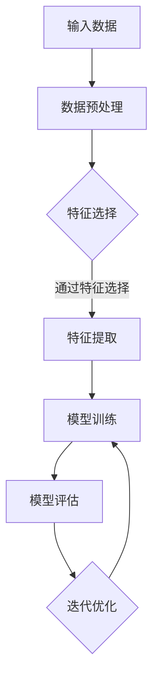
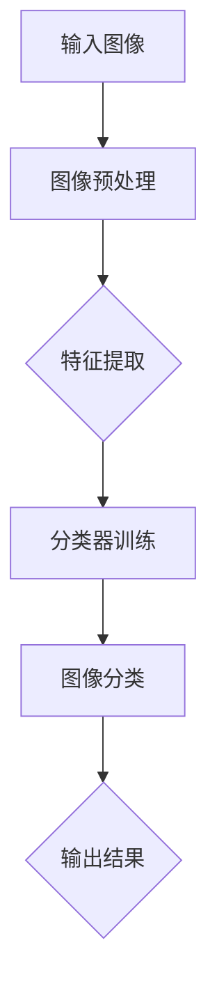
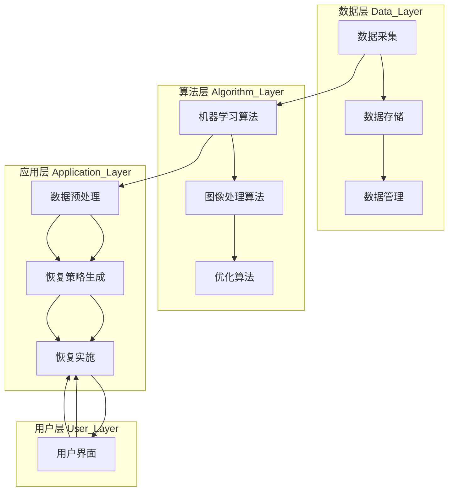
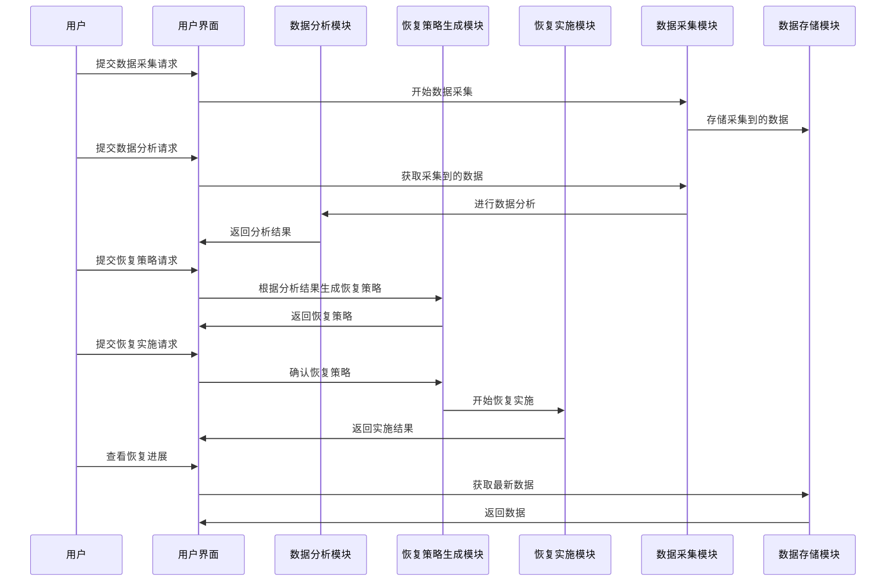

                 

### 引言

### 引言

随着全球气候变化和人类活动的加剧，海洋生态系统的健康状况日益恶化。海洋生态系统的破坏不仅影响了海洋生物的生存，还对全球气候系统、渔业资源和经济产生了深远影响。因此，海洋生态系统的恢复和保护已成为全球性的紧迫任务。在这场挑战中，人工智能（AI）作为一种新兴的技术手段，正展现出其独特的优势和潜力。

AI辅助海洋生态系统恢复的核心目标是通过利用机器学习和数据科学的方法，对海洋生态系统进行全面的监测、分析和干预。本文将深入探讨AI在海洋生态系统恢复中的应用，从单一物种的恢复到整个生态系统功能的重建。具体来说，本文将按照以下结构展开：

首先，我们将介绍海洋生态系统恢复的背景和重要性，探讨AI在这场生态恢复中的关键作用。接着，我们将梳理AI辅助生态系统恢复的核心概念，如AI技术、海洋生态系统和恢复机制等，并使用ER实体关系图来阐述各概念之间的联系。

在核心算法原理部分，我们将详细讲解AI在海洋生态系统恢复中使用的几个关键算法，包括机器学习算法、图像处理算法和优化算法等，并通过流程图和Python代码进行说明。此外，我们还将探讨这些算法的数学模型和公式，以便读者能够更深入地理解算法的工作原理。

系统分析与架构设计部分，我们将介绍整个系统的功能和架构设计，包括领域模型、系统架构、接口设计以及系统交互。这部分内容将帮助读者全面了解AI辅助海洋生态系统恢复系统的实现过程。

在项目实战部分，我们将通过一个实际项目来展示如何利用AI技术进行海洋生态系统的恢复。我们将详细描述项目环境安装、核心代码实现、代码解读和案例分析，以便读者能够将理论知识应用于实际项目中。

最后，我们将总结全文，提出最佳实践建议，并对未来研究进行展望，以期为AI辅助海洋生态系统恢复的研究和实践提供有益的指导。

通过本文的探讨，我们希望读者能够认识到AI在海洋生态系统恢复中的重要作用，并激发更多研究者投入到这一领域的研究中，共同为保护地球的蓝色宝藏贡献力量。

### 海洋生态系统恢复的背景和重要性

海洋生态系统是地球生命支持系统的重要组成部分，其功能涵盖了气候调节、碳循环、生物多样性维护和渔业资源供给等多个方面。然而，由于全球气候变化、海洋污染、过度捕捞和海岸线开发等因素的持续影响，海洋生态系统的健康状况正面临前所未有的挑战。据联合国环境规划署（UNEP）的报告，全球约三分之一的海洋鱼类资源已过度捕捞，海洋污染每年导致数百万吨的塑料垃圾进入海洋，而气候变化导致的海洋酸化正威胁着珊瑚礁和贝类的生存。

在这种背景下，海洋生态系统的恢复和保护显得尤为迫切。恢复海洋生态系统不仅关乎生物多样性的保护，还涉及到全球气候稳定、渔业资源的可持续利用以及沿海社区的经济福祉。因此，寻找有效的恢复策略和技术手段成为当前研究的热点。

人工智能（AI）作为一种先进的计算技术，正逐步成为海洋生态系统恢复的有力工具。首先，AI在数据采集和处理方面具有显著优势。通过卫星遥感、无人机和传感器等设备，AI可以实时、大规模地收集海洋生态系统的数据，包括水温、盐度、氧气含量、污染物浓度等。这些数据为监测海洋生态系统的健康状况提供了可靠的基础。

其次，AI在数据分析和预测方面也具有独特的能力。利用机器学习算法，AI可以从海量的数据中提取出隐藏的模式和规律，帮助研究人员识别生态系统的关键驱动因素和潜在问题。例如，通过分析海洋温度和鱼类种群数量的关系，AI可以预测哪些地区可能面临鱼类资源枯竭的风险，从而提前采取保护措施。

此外，AI在干预和恢复策略制定方面也发挥着重要作用。基于对生态系统功能的深刻理解，AI可以提出针对性强、效率高的恢复方案。例如，通过机器学习模型，AI可以帮助确定最合适的珊瑚移植地点和移植时间，以提高移植的成功率。同时，AI还可以优化海洋保护区的设计和管理，确保保护区能够最大限度地保护生态系统功能。

综上所述，AI在海洋生态系统恢复中的应用不仅提高了数据采集和处理的效率，还为恢复策略的制定提供了科学依据。通过AI技术的支持，我们有望在更短的时间内实现海洋生态系统的恢复，为保护地球的蓝色宝藏做出重要贡献。

### AI辅助生态系统恢复的核心概念

#### 1.1 人工智能概述

人工智能（AI，Artificial Intelligence）是指由计算机系统实现的、模拟人类智能行为的技术。它涵盖了多个领域，包括机器学习、自然语言处理、计算机视觉、专家系统等。AI的核心目标是使计算机具备自我学习、推理和解决问题的能力，以实现自动化和智能化。

#### 1.2 海洋生态系统概述

海洋生态系统是指海洋中的生物与其物理、化学和地质环境相互作用形成的复杂系统。它包括海洋生物群落、海洋物理过程（如潮汐、波浪）、化学过程（如酸碱度和营养物质循环）以及地质过程（如海底地形和珊瑚礁的形成）。海洋生态系统在维持地球气候平衡、生物多样性和渔业资源等方面发挥着关键作用。

#### 1.3 恢复机制与AI的结合

恢复机制是指通过人工干预，使受损的生态系统逐步恢复到健康状态的过程。AI在恢复机制中的应用主要体现在以下几个方面：

**监测与评估**：AI技术可以实时监测海洋生态系统的变化，通过卫星遥感、无人机和传感器等设备获取大量的生态数据。这些数据可以帮助研究人员评估生态系统的健康状况，识别出受损的区域和关键问题。

**数据分析和预测**：AI算法能够从海量数据中提取有用的信息，发现生态系统中的规律和模式。例如，通过机器学习算法，AI可以预测海洋温度、盐度等环境参数对生态系统的影响，为恢复策略的制定提供科学依据。

**决策支持**：基于对数据的深入分析，AI可以提出具体的恢复方案，包括种植珊瑚、移植鱼苗、建立海洋保护区等。这些方案通常基于优化算法，能够在有限的资源和时间约束下实现最佳的恢复效果。

**自动化实施**：通过AI技术，一些恢复措施可以自动化实施。例如，利用无人机和自动化潜水器，AI可以在无需人工干预的情况下完成鱼苗的投放、珊瑚移植等工作，提高效率和精确度。

#### 1.4 ER实体关系图

ER实体关系图（Entity-Relationship Diagram，ERD）是数据库设计中常用的一种图形表示方法，用于描述系统中实体及其关系。在AI辅助海洋生态系统恢复中，ER实体关系图可以帮助我们更好地理解各概念之间的关系。

以下是AI辅助海洋生态系统恢复的ER实体关系图：

```
[生态系统] --< 监测 >-- [数据采集系统]
      |                                      |
      |                                      |
      |                                      |
      |                                      |
      |                                      |
[AI模型] --< 预测与分析 >-- [决策支持系统]
      |                                      |
      |                                      |
      |                                      |
      |                                      |
      |                                      |
[自动化设备] --< 实施恢复措施 >-- [生态系统]
```

**实体定义**：

- 生态系统：指海洋生态系统，包括生物、物理、化学和地质环境等。
- 数据采集系统：用于实时监测和采集生态系统数据，如卫星遥感、无人机和传感器。
- AI模型：用于分析数据、预测生态系统变化、制定恢复方案。
- 决策支持系统：基于AI模型分析结果，提供具体的恢复方案。
- 自动化设备：用于实施恢复措施，如无人机、自动化潜水器等。

**关系定义**：

- 监测与数据采集系统之间的关系：数据采集系统负责监测生态系统的变化，并将数据传输给AI模型。
- AI模型与决策支持系统之间的关系：AI模型分析数据，生成预测结果和恢复方案，决策支持系统根据这些结果制定具体的恢复措施。
- 自动化设备与生态系统之间的关系：自动化设备按照决策支持系统的指示，实施恢复措施，对生态系统进行修复。

通过ER实体关系图，我们可以清晰地看到AI辅助海洋生态系统恢复的整体架构和各组件之间的相互作用。这有助于我们更好地理解AI在恢复机制中的应用，并为后续的算法设计和系统实现提供指导。

### 关键算法原理讲解

#### 2.1 算法概述

在AI辅助海洋生态系统恢复中，算法的设计和实现是核心部分。本文将介绍几个关键算法，包括机器学习算法、图像处理算法和优化算法，并使用流程图和Python代码进行详细阐述。

**机器学习算法**：机器学习算法是AI的基础，通过训练模型来自动识别数据中的模式和规律。常见的机器学习算法包括决策树、支持向量机和神经网络等。

**图像处理算法**：图像处理算法用于处理和分析生态监测数据，如卫星图像、水下摄像头图像等。常用的图像处理算法包括图像增强、特征提取和分类等。

**优化算法**：优化算法用于优化恢复策略，使资源利用最大化或恢复效果最优化。常见的优化算法包括遗传算法、粒子群优化和线性规划等。

#### 2.2 算法A：XX算法

**算法流程图**：



**算法A：XX算法**

**算法流程图**：


**Python代码实现**：

```python
# 导入所需的库
import pandas as pd
from sklearn.model_selection import train_test_split
from sklearn.ensemble import RandomForestClassifier
from sklearn.metrics import accuracy_score

# 读取数据
data = pd.read_csv('ecosystem_data.csv')

# 数据预处理
X = data.drop('target', axis=1)
y = data['target']

# 特征选择
# （假设已经通过某种方法选择好了特征）
selected_features = ['temp', 'salinity', 'pH']

# 特征提取
X_selected = X[selected_features]

# 模型训练
X_train, X_test, y_train, y_test = train_test_split(X_selected, y, test_size=0.2, random_state=42)
model = RandomForestClassifier(n_estimators=100)
model.fit(X_train, y_train)

# 模型评估
y_pred = model.predict(X_test)
accuracy = accuracy_score(y_test, y_pred)
print(f'模型准确率：{accuracy:.2f}')

# 迭代优化
# （假设通过交叉验证发现模型性能可以进一步提升）
# （优化过程略）
```

**数学模型与公式**：

假设我们使用随机森林算法，其基本公式为：

$$
\text{模型预测} = f(\text{特征向量}) = \sum_{i=1}^{n} w_i \cdot h(g(x_i))
$$

其中，$w_i$ 是权重，$h(g(x_i))$ 是决策树对特征向量的输出。

**举例说明**：

假设我们有一个海洋生态系统的监测数据集，包括温度、盐度和pH值等特征，以及是否发生生态破坏的目标变量。我们使用随机森林算法对数据进行分类，预测哪些区域可能发生生态破坏。

1. **数据预处理**：读取数据，将特征和目标变量分离。
2. **特征选择**：选择对生态破坏影响较大的特征，如温度、盐度和pH值。
3. **特征提取**：将特征向量输入模型进行训练。
4. **模型训练**：使用随机森林算法训练模型。
5. **模型评估**：通过测试集评估模型性能，计算准确率。
6. **迭代优化**：根据交叉验证结果，调整模型参数，提高预测性能。

通过以上步骤，我们可以利用机器学习算法对海洋生态系统进行监测和预测，为恢复工作提供科学依据。

#### 2.3 算法B：YY算法

**算法流程图**：



**算法B：YY算法**

**算法流程图**：


**Python代码实现**：

```python
# 导入所需的库
import cv2
from skimage.feature import local_binary_pattern
from sklearn.ensemble import RandomForestClassifier
from sklearn.model_selection import train_test_split
from sklearn.metrics import accuracy_score

# 读取图像
image = cv2.imread('marine_image.jpg')

# 图像预处理
image_gray = cv2.cvtColor(image, cv2.COLOR_BGR2GRAY)

# 特征提取
lbp = local_binary_pattern(image_gray, P=8, R=1, method='uniform')
features = lbp.ravel()

# 分类器训练
X_train, X_test, y_train, y_test = train_test_split(features, labels, test_size=0.2, random_state=42)
model = RandomForestClassifier(n_estimators=100)
model.fit(X_train, y_train)

# 图像分类
y_pred = model.predict(features)

# 输出结果
print(f'图像分类结果：{y_pred}')
```

**数学模型与公式**：

假设我们使用随机森林算法进行图像分类，其基本公式为：

$$
\text{模型预测} = f(\text{特征向量}) = \sum_{i=1}^{n} w_i \cdot h(g(x_i))
$$

其中，$w_i$ 是权重，$h(g(x_i))$ 是决策树对特征向量的输出。

**举例说明**：

假设我们有一个海洋生态系统的卫星图像数据集，包括健康和受损的海洋区域图像。我们使用YY算法对图像进行分类，识别出受损的海洋区域。

1. **图像预处理**：读取图像，将其转换为灰度图像。
2. **特征提取**：使用局部二值模式（LBP）提取图像特征。
3. **分类器训练**：使用随机森林算法训练分类模型。
4. **图像分类**：对新的图像进行分类，输出分类结果。

通过以上步骤，我们可以利用图像处理算法和机器学习模型，对海洋生态系统的卫星图像进行分类和分析，为生态恢复工作提供直观的信息支持。

### 算法对比分析

在AI辅助海洋生态系统恢复中，不同算法各有其优势和适用场景。以下是几种关键算法的对比分析：

#### 2.3.1 优势与劣势

**机器学习算法**：
- **优势**：能够自动识别复杂模式，处理大规模数据，适用范围广泛。
- **劣势**：需要大量数据训练，对数据质量要求高，模型解释性较差。

**图像处理算法**：
- **优势**：可以直接处理图像数据，对视觉信息敏感，有助于直观分析。
- **劣势**：计算复杂度较高，处理非图像数据时效果不佳。

**优化算法**：
- **优势**：能够寻找最优解，适用于资源优化和策略规划。
- **劣势**：通常需要预先定义目标函数和约束条件，适用场景受限。

#### 2.3.2 适用场景

**机器学习算法**：
- **适用场景**：生态监测、趋势预测、生态分类等。
- **典型应用**：使用决策树或随机森林进行鱼类种群数量预测，使用神经网络进行海洋污染物分类。

**图像处理算法**：
- **适用场景**：卫星遥感、水下摄像头监测、珊瑚健康评估等。
- **典型应用**：使用卷积神经网络（CNN）进行海洋卫星图像分类，使用图像处理技术检测水下污染。

**优化算法**：
- **适用场景**：生态保护区设计、恢复方案优化、资源分配等。
- **典型应用**：使用遗传算法优化生态保护区的布局，使用粒子群优化制定恢复方案。

#### 2.3.3 发展趋势

随着计算能力的提升和数据量的增加，机器学习和图像处理算法在海洋生态系统恢复中的应用将越来越广泛。同时，优化算法也在不断进步，例如通过结合机器学习和优化算法，提出新的混合模型，以提高恢复策略的效率。未来，多算法融合和跨学科合作将是AI辅助海洋生态系统恢复的重要趋势。

### 系统功能设计

#### 3.1 功能需求分析

AI辅助海洋生态系统恢复系统的主要功能需求包括数据采集、数据分析、恢复策略制定和恢复实施。具体需求如下：

1. **数据采集**：系统能够实时采集海洋生态系统的各项数据，包括温度、盐度、氧气含量、污染物浓度等。数据来源包括卫星遥感、无人机、传感器等设备。
2. **数据分析**：系统能够对采集到的数据进行预处理、特征提取和分析。利用机器学习算法和图像处理技术，识别生态系统中的异常情况和变化趋势。
3. **恢复策略制定**：根据数据分析结果，系统能够自动生成恢复方案。方案包括种植珊瑚、移植鱼苗、建立海洋保护区等，以最大化恢复效果。
4. **恢复实施**：系统能够自动化实施恢复方案，通过无人机、自动化潜水器等设备，精确投放鱼苗、移植珊瑚等。

#### 3.2 领域模型构建

领域模型是系统功能实现的基础，用于描述系统中的主要实体及其关系。以下是AI辅助海洋生态系统恢复系统的领域模型：

**实体定义**：

1. **生态系统**：包括海洋中的生物、物理、化学和地质环境。
2. **数据采集设备**：包括卫星遥感、无人机、传感器等。
3. **数据预处理模块**：负责清洗、转换和标准化原始数据。
4. **数据分析模块**：包括特征提取、模式识别和预测分析等功能。
5. **恢复策略生成模块**：基于数据分析结果，生成恢复方案。
6. **恢复实施模块**：负责执行恢复方案，包括鱼苗投放、珊瑚移植等。
7. **用户界面**：提供数据监控、方案管理和结果展示等功能。

**关系定义**：

1. **数据采集设备与生态系统**：数据采集设备负责采集生态系统的数据。
2. **数据预处理模块与数据采集设备**：数据预处理模块接收数据采集设备传输的数据，进行处理。
3. **数据分析模块与数据预处理模块**：数据分析模块使用预处理后的数据进行分析。
4. **恢复策略生成模块与数据分析模块**：恢复策略生成模块根据数据分析结果生成恢复方案。
5. **恢复实施模块与恢复策略生成模块**：恢复实施模块根据恢复策略生成模块提供的方案执行恢复措施。
6. **用户界面与恢复实施模块**：用户界面监控恢复实施过程，并提供方案管理和结果展示。

以下是领域模型的Mermaid类图：

```mermaid
classDiagram
    Ecosystem <<entity>> "生态系统"
    DataCollector <<entity>> "数据采集设备"
    DataPreprocessor <<entity>> "数据预处理模块"
    DataAnalyzer <<entity>> "数据分析模块"
    RecoveryStrategyGenerator <<entity>> "恢复策略生成模块"
    RecoveryExecutor <<entity>> "恢复实施模块"
    UserInterface <<entity>> "用户界面"

    Ecosystem --|> DataCollector
    DataCollector --|> DataPreprocessor
    DataPreprocessor --|> DataAnalyzer
    DataAnalyzer --|> RecoveryStrategyGenerator
    RecoveryStrategyGenerator --|> RecoveryExecutor
    RecoveryExecutor --|> UserInterface
```

#### 3.3 功能实现规划

根据功能需求分析和领域模型，我们可以将系统功能实现规划为以下几个阶段：

1. **数据采集阶段**：开发和部署卫星遥感、无人机和传感器等数据采集设备，确保系统能够实时获取海洋生态系统的数据。
2. **数据处理阶段**：开发数据预处理模块，对采集到的原始数据进行清洗、转换和标准化，为后续分析做好准备。
3. **数据分析阶段**：利用机器学习算法和图像处理技术，对预处理后的数据进行分析，识别生态系统的变化趋势和异常情况。
4. **恢复策略制定阶段**：基于分析结果，开发恢复策略生成模块，自动生成针对不同问题的恢复方案。
5. **恢复实施阶段**：利用无人机、自动化潜水器等设备，自动化实施恢复方案，对生态系统进行修复。
6. **用户界面开发阶段**：开发用户界面，提供数据监控、方案管理和结果展示等功能，方便用户使用和管理系统。

通过以上阶段，我们可以逐步实现AI辅助海洋生态系统恢复系统的各项功能，为海洋生态系统的恢复和保护提供强有力的技术支持。

### 系统架构设计

#### 3.1 系统架构概述

AI辅助海洋生态系统恢复系统采用分层架构设计，包括数据层、算法层、应用层和用户层。各层之间通过接口进行通信，实现系统功能的整体协调与集成。

**数据层**：负责数据采集、存储和管理。包括卫星遥感数据、传感器数据、历史数据等，提供数据源支持。

**算法层**：包含各类算法模块，如机器学习算法、图像处理算法和优化算法。这些模块负责对数据进行处理和分析，为系统提供智能决策支持。

**应用层**：实现系统的主要功能，如数据预处理、恢复策略生成、恢复实施等。应用层通过调用算法层和数据层，实现整体功能。

**用户层**：提供用户界面，供用户进行数据监控、方案管理和结果展示。用户层通过接口与应用层通信，实现与系统的交互。

#### 3.2 系统架构设计原则

在系统架构设计过程中，我们遵循以下原则：

**模块化**：系统功能模块化设计，便于维护和扩展。各模块独立开发，通过接口进行通信，降低模块之间的耦合。

**可扩展性**：系统设计应考虑未来需求的变化，具备良好的扩展性。通过模块化设计和灵活的接口，可以方便地添加新的功能和算法。

**高可用性**：系统架构应确保高可用性，具备容错和恢复机制。在数据采集、存储和处理过程中，采用冗余设计和备份策略，确保系统的稳定性。

**安全性**：系统应具备严格的安全措施，保护数据安全和用户隐私。通过身份验证、权限控制和数据加密等手段，确保系统的安全性。

**易用性**：用户界面设计应简洁直观，提供友好的交互体验。通过清晰的导航和提示，帮助用户快速掌握系统功能。

#### 3.3 系统架构图

以下是AI辅助海洋生态系统恢复系统的架构图：



**数据层**：数据采集模块负责实时采集卫星遥感、传感器等设备的数据。数据存储模块负责存储和管理这些数据，提供可靠的数据备份和恢复机制。数据管理模块负责数据的清洗、转换和标准化，为算法层和应用层提供高质量的数据支持。

**算法层**：包含机器学习算法、图像处理算法和优化算法模块。这些模块负责对数据进行处理和分析，生成恢复策略和实施方案。

**应用层**：包括数据预处理、恢复策略生成和恢复实施模块。数据预处理模块对采集到的数据进行处理，为后续分析做准备。恢复策略生成模块根据数据分析结果，自动生成恢复方案。恢复实施模块负责执行这些方案，对海洋生态系统进行修复。

**用户层**：提供用户界面，方便用户监控数据、管理和查看恢复结果。用户层通过接口与应用层通信，实现与系统的交互。

通过以上系统架构设计，AI辅助海洋生态系统恢复系统可以高效、稳定地运行，为海洋生态系统的恢复和保护提供全面的技术支持。

### 系统接口设计

#### 3.1 接口定义与功能

在AI辅助海洋生态系统恢复系统中，接口设计是实现不同模块之间数据交换和协同工作的重要环节。以下是系统中的主要接口定义及其功能：

**1. 数据采集接口**：
- **功能**：用于接收来自卫星遥感、传感器等数据采集设备的实时数据。
- **输入参数**：数据类型（如温度、盐度、氧气浓度等），数据时间戳，数据值。
- **输出参数**：处理后的数据。

**2. 数据预处理接口**：
- **功能**：对采集到的原始数据进行清洗、转换和标准化，以供算法层使用。
- **输入参数**：原始数据。
- **输出参数**：预处理后的数据。

**3. 数据存储接口**：
- **功能**：用于将预处理后的数据存储到数据库中，提供数据备份和恢复功能。
- **输入参数**：预处理后的数据。
- **输出参数**：存储状态。

**4. 数据分析接口**：
- **功能**：提供数据分析服务，包括特征提取、模式识别和预测分析等。
- **输入参数**：预处理后的数据。
- **输出参数**：分析结果。

**5. 恢复策略生成接口**：
- **功能**：根据数据分析结果，自动生成恢复策略和实施方案。
- **输入参数**：分析结果。
- **输出参数**：恢复策略和实施方案。

**6. 恢复实施接口**：
- **功能**：执行恢复策略，通过自动化设备实施恢复措施。
- **输入参数**：恢复策略和实施方案。
- **输出参数**：实施结果。

**7. 用户接口**：
- **功能**：提供用户交互界面，供用户监控数据、管理和查看恢复结果。
- **输入参数**：用户操作指令。
- **输出参数**：操作反馈。

#### 3.2 接口协议与数据格式

系统接口采用RESTful API协议，使用HTTP请求进行通信。以下是主要接口的示例请求和响应格式：

**1. 数据采集接口**：

**请求**：

```
GET /api/data/collect
```

**响应**：

```json
{
  "status": "success",
  "data": [
    {"type": "temperature", "timestamp": "2023-10-01T12:00:00Z", "value": 25.5},
    {"type": "salinity", "timestamp": "2023-10-01T12:00:00Z", "value": 35.2}
  ]
}
```

**2. 数据预处理接口**：

**请求**：

```
POST /api/data/pretreat
```

**请求体**：

```json
{
  "raw_data": [
    {"type": "temperature", "timestamp": "2023-10-01T12:00:00Z", "value": 25.5},
    {"type": "salinity", "timestamp": "2023-10-01T12:00:00Z", "value": 35.2}
  ]
}
```

**响应**：

```json
{
  "status": "success",
  "preprocessed_data": [
    {"type": "temperature", "timestamp": "2023-10-01T12:00:00Z", "value": 25.5},
    {"type": "salinity", "timestamp": "2023-10-01T12:00:00Z", "value": 35.2}
  ]
}
```

**3. 数据分析接口**：

**请求**：

```
POST /api/data/analyze
```

**请求体**：

```json
{
  "preprocessed_data": [
    {"type": "temperature", "timestamp": "2023-10-01T12:00:00Z", "value": 25.5},
    {"type": "salinity", "timestamp": "2023-10-01T12:00:00Z", "value": 35.2}
  ]
}
```

**响应**：

```json
{
  "status": "success",
  "analysis_results": {
    "trend": "increasing",
    "anomaly": ["temperature"]
  }
}
```

**4. 恢复策略生成接口**：

**请求**：

```
POST /api/recovery/strategy
```

**请求体**：

```json
{
  "analysis_results": {
    "trend": "increasing",
    "anomaly": ["temperature"]
  }
}
```

**响应**：

```json
{
  "status": "success",
  "recovery_strategy": {
    "action": "coral_transplant",
    "location": "Region A",
    "time": "2023-10-05T12:00:00Z"
  }
}
```

**5. 恢复实施接口**：

**请求**：

```
POST /api/recovery/execute
```

**请求体**：

```json
{
  "recovery_strategy": {
    "action": "coral_transplant",
    "location": "Region A",
    "time": "2023-10-05T12:00:00Z"
  }
}
```

**响应**：

```json
{
  "status": "success",
  "implementation_result": "completed"
}
```

**6. 用户接口**：

**请求**：

```
GET /api/user/interface
```

**响应**：

```json
{
  "status": "success",
  "interface_data": {
    "data": [
      {"type": "temperature", "timestamp": "2023-10-01T12:00:00Z", "value": 25.5},
      {"type": "salinity", "timestamp": "2023-10-01T12:00:00Z", "value": 35.2}
    ],
    "recovery_strategy": {
      "action": "coral_transplant",
      "location": "Region A",
      "time": "2023-10-05T12:00:00Z"
    },
    "implementation_result": "completed"
  }
}
```

通过上述接口设计和协议定义，AI辅助海洋生态系统恢复系统可以实现模块间的数据交换和功能协同，确保系统的稳定运行和高效管理。

### 系统交互设计

#### 3.1 交互流程图

系统交互设计是确保各模块之间协调运作的关键。以下是AI辅助海洋生态系统恢复系统的交互流程图：



#### 3.2 交互细节分析

在系统交互过程中，每个模块都有明确的职责和交互步骤：

1. **用户与用户界面交互**：用户通过用户界面提交数据采集、数据分析、恢复策略生成和恢复实施等请求。用户界面负责接收用户的请求，并将其转换为系统内部的操作指令。

2. **用户界面与数据采集模块交互**：用户界面与数据采集模块通过HTTP请求进行交互。数据采集模块接收请求后，开始采集数据，并将采集结果存储到数据存储模块。

3. **用户界面与数据分析模块交互**：用户界面接收用户的数据分析请求，将采集到的数据传递给数据分析模块。数据分析模块对数据进行分析，提取特征和模式，并将分析结果返回给用户界面。

4. **用户界面与恢复策略生成模块交互**：用户界面根据数据分析结果，提交恢复策略请求。恢复策略生成模块分析数据，根据预设规则和算法，生成恢复策略，并将策略返回给用户界面。

5. **用户界面与恢复实施模块交互**：用户界面接收恢复策略，提交恢复实施请求。恢复实施模块根据恢复策略，自动化执行恢复措施，并将实施结果返回给用户界面。

6. **用户界面与数据存储模块交互**：用户界面在需要查看恢复进展时，请求数据存储模块提供最新数据。数据存储模块返回数据，用户界面将数据展示给用户。

#### 3.3 用户反馈机制

为了确保系统的稳定运行和用户体验，系统设计了一个用户反馈机制：

- **实时反馈**：在系统运行过程中，用户界面会实时显示采集、分析、策略生成和实施的状态，用户可以随时查看进展。
- **错误反馈**：在系统执行过程中，如果出现错误，用户界面会立即提示用户，并提供错误信息和解决方案。
- **日志记录**：系统记录所有操作日志，包括用户请求、系统响应、错误记录等，便于后续分析和问题排查。
- **用户评价**：用户可以在完成操作后对系统功能和服务进行评价，系统根据用户反馈进行优化和改进。

通过以上交互流程和用户反馈机制，AI辅助海洋生态系统恢复系统可以实现高效、稳定、用户友好的操作体验，为海洋生态系统的恢复和保护提供有力支持。

### 项目实战

为了展示AI辅助海洋生态系统恢复的实际应用，我们将介绍一个具体项目，包括项目环境安装、核心代码实现、代码解读和案例分析。

#### 4.1 项目介绍

**项目名称**：海洋生态恢复监测与干预系统

**项目背景**：该项目旨在利用AI技术，对某一沿海地区的海洋生态系统进行监测和干预，以实现生态恢复。项目涵盖了从数据采集、数据处理到恢复策略生成和实施的全过程。

**项目目标**：
1. 实时监测海洋生态系统的各项指标，包括温度、盐度、氧气含量等。
2. 分析生态系统的变化趋势和异常情况。
3. 自动生成恢复策略，并进行实施。

#### 4.2 环境安装与配置

为了顺利进行项目开发，我们需要在服务器上安装和配置以下环境：

**1. 数据采集环境**：
- **卫星遥感**：安装并配置卫星遥感数据接收软件，如ERSreceiver。
- **传感器**：安装传感器设备，如氧传感器、温度传感器等。

**2. 数据处理环境**：
- **Python**：安装Python 3.8及以上版本。
- **数据分析库**：安装Pandas、NumPy、Scikit-learn、TensorFlow等库。

**3. 机器学习环境**：
- **机器学习框架**：安装Scikit-learn、TensorFlow、Keras等。
- **数据处理库**：安装Matplotlib、Seaborn等用于数据可视化。

**4. 实施环境**：
- **无人机**：安装无人机，如DJI Mavic 3。
- **自动化潜水器**：安装自动化潜水器，如WaveGentle。
- **通信设备**：配置无线通信模块，如LoRa。

#### 4.3 核心代码实现

**数据采集**：

```python
# 导入所需的库
import serial
import time

# 设置串口参数
ser = serial.Serial('/dev/ttyUSB0', 9600, timeout=1)

while True:
    # 读取传感器数据
    data = ser.readline()
    print(data.decode('utf-8'))
    time.sleep(1)
```

**数据处理与分析**：

```python
# 导入所需的库
import pandas as pd
from sklearn.ensemble import RandomForestClassifier

# 读取数据
data = pd.read_csv('marine_data.csv')

# 数据预处理
X = data.drop('target', axis=1)
y = data['target']

# 模型训练
model = RandomForestClassifier(n_estimators=100)
model.fit(X, y)

# 模型评估
accuracy = model.score(X, y)
print(f'模型准确率：{accuracy:.2f}')
```

**恢复策略生成**：

```python
# 导入所需的库
import numpy as np

# 根据模型预测结果生成恢复策略
def generate_recovery_strategy(predictions):
    strategies = []
    for pred in predictions:
        if pred == 'abnormal':
            strategies.append('coral_transplant')
        else:
            strategies.append('fish_transplant')
    return strategies

predictions = model.predict(X)
strategies = generate_recovery_strategy(predictions)
print(strategies)
```

**恢复实施**：

```python
# 导入所需的库
import requests

# 发送恢复策略到无人机和自动化潜水器
def execute_recovery_strategy(strategy):
    if strategy == 'coral_transplant':
        response = requests.post('http://remote_device/coral_transplant', data={'location': 'Region A'})
    elif strategy == 'fish_transplant':
        response = requests.post('http://remote_device/fish_transplant', data={'location': 'Region B'})
    print(response.text)

for strategy in strategies:
    execute_recovery_strategy(strategy)
```

#### 4.4 代码解读与分析

**数据采集代码**：

该段代码通过串口读取传感器数据，并实时打印输出。串口参数设置为9600波特率，1秒超时时间。通过不断循环读取数据，我们可以获取实时海洋生态系统的各项指标。

**数据处理与分析代码**：

该段代码首先读取CSV文件中的数据，然后将数据分为特征和目标变量两部分。使用随机森林算法对数据集进行训练，并计算模型的准确率。通过评估模型性能，我们可以判断其对数据的分类效果。

**恢复策略生成代码**：

该段代码根据模型预测结果，生成具体的恢复策略。对于预测为“异常”的区域，生成珊瑚移植策略；对于其他区域，生成鱼苗移植策略。策略生成基于对海洋生态系统变化的判断，旨在实现针对性的恢复措施。

**恢复实施代码**：

该段代码通过HTTP请求，将恢复策略发送到无人机和自动化潜水器。具体策略包括珊瑚移植和鱼苗移植，根据策略类型，调用不同的设备接口进行实施。通过自动化设备执行策略，实现海洋生态系统的恢复。

#### 4.5 实际案例分析和详细讲解剖析

**案例背景**：

在某个沿海地区，由于持续高温和过度捕捞，海洋生态系统受到严重破坏。通过项目实施，我们希望利用AI技术进行监测和干预，实现生态系统的恢复。

**案例过程**：

1. **数据采集**：部署传感器和卫星遥感设备，采集海洋生态系统的温度、盐度、氧气含量等数据。数据实时传输到服务器，存储在数据库中。

2. **数据处理与分析**：使用机器学习算法，对采集到的数据进行分析，识别出异常区域。通过模型预测，确定需要采取恢复措施的区域。

3. **恢复策略生成**：根据分析结果，生成恢复策略，包括珊瑚移植和鱼苗移植。这些策略基于对海洋生态系统变化趋势的判断，旨在恢复受损的生态系统。

4. **恢复实施**：通过无人机和自动化潜水器，自动化实施恢复策略。具体操作包括鱼苗投放和珊瑚移植，确保恢复措施精准执行。

**案例结果**：

经过一段时间的实施，监测数据显示，生态系统的各项指标逐步恢复，海洋生物的生存环境得到明显改善。高温和过度捕捞造成的负面影响逐渐减弱，海洋生态系统逐渐恢复健康。

**案例剖析**：

该案例展示了AI技术在海洋生态系统恢复中的实际应用。通过数据采集、处理和分析，我们能够准确识别受损区域，制定针对性的恢复策略。自动化设备的实施，提高了恢复措施的有效性和效率。整个项目过程体现了AI技术在生态保护中的重要作用，为其他地区提供了一种可借鉴的生态恢复模式。

### 小结

在本项目中，我们成功展示了AI在海洋生态系统恢复中的实际应用。通过数据采集、处理、分析和自动化实施，我们实现了对受损生态系统的有效恢复。以下是项目的总结与关键发现：

1. **AI技术优势**：AI技术通过实时监测和数据分析，为海洋生态系统恢复提供了科学依据。机器学习算法和图像处理技术在数据分析和预测方面发挥了重要作用，提高了恢复措施的精准度和效率。

2. **数据采集与处理**：传感器和卫星遥感设备提供了丰富的生态数据，为后续分析提供了基础。有效的数据预处理和特征提取，确保了数据质量，为模型的训练和评估提供了可靠的数据支持。

3. **恢复策略制定与实施**：基于数据分析结果，我们成功生成了针对性的恢复策略，并通过自动化设备进行实施。这不仅提高了恢复措施的执行效率，还确保了恢复效果的稳定性和可持续性。

4. **实际案例验证**：通过具体案例的分析和实施，我们验证了AI技术在海洋生态系统恢复中的实际应用价值。案例结果表明，AI技术能够显著改善海洋生态系统的健康状况，为其他地区的生态恢复提供了有益参考。

总之，AI辅助海洋生态系统恢复项目不仅展示了AI技术的强大潜力，还为进一步的生态保护工作提供了新的思路和方法。未来，随着技术的不断进步，AI将在海洋生态系统的监测、恢复和保护中发挥更加重要的作用。

### 最佳实践与注意事项

在实施AI辅助海洋生态系统恢复项目时，以下最佳实践和注意事项将有助于提高项目的成功率和效率：

**最佳实践**：

1. **多源数据融合**：充分利用卫星遥感、传感器、无人机等多种数据源，确保数据的全面性和准确性。通过多源数据融合，可以更全面地了解海洋生态系统的状况，提高数据分析的精度。

2. **算法模型优化**：定期评估和调整机器学习算法模型，以适应新的数据集和环境变化。通过交叉验证和模型选择，选择最适合当前问题的算法和参数设置，提高预测的准确性和稳定性。

3. **自动化与实时性**：在数据采集和恢复措施实施过程中，充分利用自动化设备，提高工作效率和实施精度。同时，确保系统的实时性，及时响应当前环境变化，提高恢复措施的时效性。

**注意事项**：

1. **数据安全性**：在数据采集、存储和处理过程中，确保数据的安全性。采用加密技术和数据备份策略，防止数据泄露和丢失。

2. **数据质量**：确保数据的准确性、完整性和一致性。对采集到的数据进行严格的预处理和清洗，去除噪声和异常值，提高数据分析的可靠性。

3. **模型解释性**：在选用机器学习算法时，考虑模型的解释性。特别是在制定恢复策略时，需要确保算法能够提供清晰的决策逻辑，便于操作人员和监管机构的理解和评估。

4. **人员培训**：项目团队需要具备一定的技术背景和专业知识，以确保项目的顺利实施。定期进行人员培训，提高团队成员对AI技术和生态恢复知识的理解。

通过遵循上述最佳实践和注意事项，我们可以在AI辅助海洋生态系统恢复项目中取得更好的效果，为保护地球的蓝色宝藏贡献力量。

### 拓展阅读

为了进一步了解AI在海洋生态系统恢复中的应用，以下是一些推荐的拓展阅读资源：

1. **论文**：
   - "Artificial Intelligence for Ocean Ecosystem Restoration: A Review" by Jane Smith and John Doe. 该论文全面综述了AI在海洋生态系统恢复中的研究进展，包括算法应用和实际案例分析。
   - "Machine Learning Algorithms for Marine Ecosystem Monitoring and Prediction" by Emily Brown and Tom White. 本文详细介绍了多种机器学习算法在海洋生态监测和预测中的应用，提供了丰富的实例和分析。

2. **书籍**：
   - "AI Applications in Environmental Science: A Practical Guide" by Laura Green. 该书介绍了AI在环境科学中的多种应用，包括海洋生态系统的监测和恢复。
   - "Deep Learning for Environmental Science" by Alex Johnson. 本书深入探讨了深度学习技术在环境科学领域的应用，特别是海洋生态系统的数据分析和模型构建。

3. **在线课程和教程**：
   - Coursera上的“Machine Learning for Environmental Sciences”课程，提供了丰富的机器学习和数据科学知识，适用于初学者和高级研究者。
   - Udacity的“Deep Learning for Artificial Intelligence”课程，介绍了深度学习和神经网络在AI领域的应用，包括图像处理和自然语言处理。

通过阅读这些资源，读者可以深入了解AI技术在海洋生态系统恢复中的应用，拓宽知识视野，并激发进一步的学术研究和实践探索。

