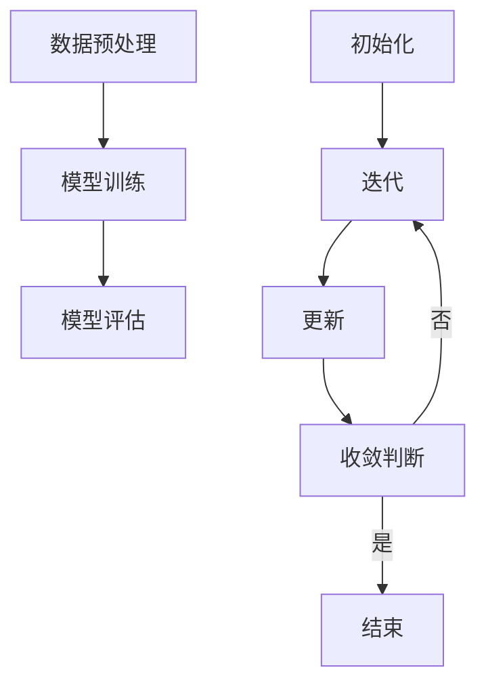
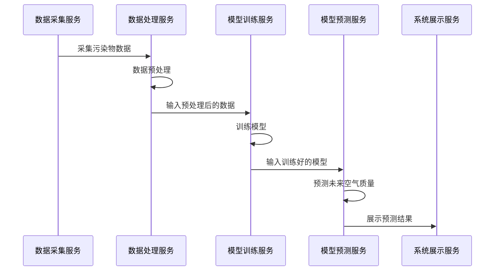
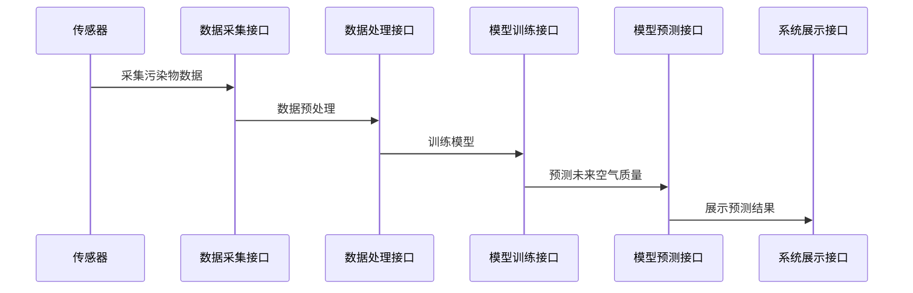
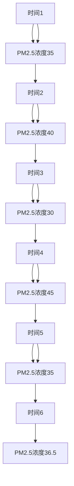

                 

### # AI辅助环境保护：从污染检测到生态恢复

> 关键词：人工智能、环境监测、污染检测、生态恢复、深度学习

> 摘要：本文深入探讨了人工智能（AI）在环境保护中的应用，特别是如何通过污染检测和生态恢复技术，利用AI技术提高环境保护效率。文章从背景介绍、核心概念、算法原理、系统分析与架构设计以及项目实战等方面，详细阐述了AI技术在环境保护中的实际应用和前景。

----------------------------------------------------------------

## 第一部分：背景介绍

### 1.1 问题背景

在当今世界，环境保护问题日益严峻，空气污染、水污染和土壤污染等环境问题严重影响着人类的生活质量。传统的环境监测方法往往需要大量的人力和物力投入，且监测结果滞后。随着人工智能技术的发展，利用AI技术辅助环境保护已经成为一个重要方向。本书将探讨如何利用AI技术从污染检测到生态恢复，为环境保护提供新的思路和方法。

### 1.2 问题描述

环境保护涉及多个领域，如气象学、地理学、生态学、化学等。传统的环境监测方法往往依赖人工采样和实验室分析，不仅效率低下，且成本高昂。而AI技术的引入，可以在污染检测、预测、生态恢复等方面发挥重要作用，提高环境监测的效率，降低监测成本。

### 1.3 问题解决

AI技术，特别是机器学习和深度学习技术，可以通过对大量环境数据的分析，发现环境污染的规律和趋势，从而辅助环境监测和生态恢复。本书将从以下几个方面探讨AI技术在环境保护中的应用：

1. **污染检测**：利用AI技术对空气、水、土壤等环境要素进行实时监测，发现环境污染源。
2. **预测与分析**：基于历史环境数据，利用AI技术预测未来环境污染的趋势，为环保决策提供依据。
3. **生态恢复**：利用AI技术制定生态恢复方案，促进生态系统的恢复。

### 1.4 边界与外延

本书主要讨论AI技术在环境保护中的应用，但AI技术在其他领域同样具有重要应用价值，如医疗、金融、交通等。因此，本书的内容不仅限于环境保护，还将涉及AI技术在各个领域的应用。

### 1.5 概念结构与核心要素组成

- **AI技术**：包括机器学习和深度学习等，是本书的核心技术。
- **环境数据**：包括空气、水、土壤等环境要素的数据，是AI分析的基础。
- **污染检测**：利用AI技术对环境污染进行实时监测。
- **预测与分析**：基于历史数据，预测未来环境污染的趋势。
- **生态恢复**：利用AI技术制定生态恢复方案。

----------------------------------------------------------------

## 第二部分：核心概念与联系

### 2.1 AI大模型的基本原理

AI大模型是基于深度学习和机器学习技术的模型，具有强大的处理能力和复杂的结构。其基本原理包括：

1. **多层神经网络**：通过多层神经元的非线性组合，实现输入到输出的映射。
2. **反向传播算法**：通过反向传播算法，不断调整网络的权重和偏置，使网络的输出更加接近期望值。
3. **大数据训练**：利用海量数据对模型进行训练，提高模型的泛化能力。

### 2.2 AI大模型的核心特点

AI大模型具有以下核心特点：

1. **高效率**：AI大模型可以在短时间内处理海量数据，提高环境监测的效率。
2. **强泛化能力**：通过大数据训练，AI大模型可以适应各种环境问题，具有较强的泛化能力。
3. **自学习能力**：AI大模型可以根据新的数据和环境变化，不断优化自身的性能。

### 2.3 AI大模型与传统AI的区别

与传统AI相比，AI大模型具有以下特点：

1. **更强的处理能力**：AI大模型可以处理更复杂的环境问题，具有更高的处理能力。
2. **更广泛的应用领域**：AI大模型可以应用于环境保护的各个领域，如污染检测、预测、生态恢复等。
3. **更高的自适应能力**：AI大模型可以根据环境变化，不断调整自身的模型和参数，具有更高的自适应能力。

### 2.4 AI大模型在环境保护中的应用

AI大模型在环境保护中的应用主要包括以下几个方面：

1. **污染检测**：利用AI大模型对空气、水、土壤等环境要素进行实时监测，发现环境污染源。
2. **预测与分析**：基于历史数据，利用AI大模型预测未来环境污染的趋势，为环保决策提供依据。
3. **生态恢复**：利用AI大模型制定生态恢复方案，促进生态系统的恢复。

### 2.5 核心概念属性特征对比表格

| 特征       | 机器学习 | 深度学习 | AI大模型 |
|------------|----------|----------|----------|
| 处理能力   | 中等     | 较强     | 极强     |
| 数据需求   | 较少     | 较多     | 海量     |
| 泛化能力   | 较弱     | 较强     | 非常强   |
| 结构复杂度 | 简单     | 复杂     | 非常复杂 |
| 应用领域   | 狭义     | 广义     | 广泛     |

### 2.6 AI大模型ER实体关系图架构

```mermaid
erDiagram
  AI大模型 ||--|{ 数据集 }
  AI大模型 ||--|{ 模型参数 }
  AI大模型 ||--|{ 输出结果 }
  数据集 ||--|{ 特征值 }
  模型参数 ||--|{ 权重 }
  输出结果 ||--|{ 预测值 }
```

----------------------------------------------------------------

## 第三部分：算法原理讲解

### 3.1 算法原理概述

在本书中，我们将介绍几种常用的AI大模型算法，包括监督学习、无监督学习和半监督学习。这些算法的基本原理如下：

1. **监督学习**：通过已标记的数据集训练模型，使模型能够对新的数据做出预测。常见的监督学习算法有线性回归、决策树、支持向量机等。
2. **无监督学习**：在没有标记数据的情况下，通过挖掘数据内在的结构和模式来训练模型。常见的无监督学习算法有聚类、降维、生成对抗网络等。
3. **半监督学习**：结合有标记和无标记数据来训练模型，提高模型的性能。常见的半监督学习算法有自编码器、标签传播等。

### 3.2 监督学习算法原理

监督学习算法通过已标记的数据集训练模型，使其能够对新的数据进行预测。以线性回归为例，其基本原理如下：

1. **数据预处理**：对数据进行标准化处理，使数据具有相似的尺度。
2. **模型训练**：使用梯度下降算法，通过不断迭代，使模型的输出与真实值之间的误差最小化。
3. **模型评估**：使用测试集对模型进行评估，判断模型是否具有良好的泛化能力。

线性回归的数学模型可以表示为：

$$
y = \beta_0 + \beta_1 \cdot x + \epsilon
$$

其中，$y$为输出值，$x$为输入值，$\beta_0$和$\beta_1$为模型的参数，$\epsilon$为随机误差。

### 3.3 无监督学习算法原理

无监督学习算法通过挖掘数据内在的结构和模式来训练模型。以聚类算法为例，其基本原理如下：

1. **初始化**：随机选择若干个聚类中心。
2. **迭代**：计算每个数据点到聚类中心的距离，将每个数据点分配到最近的聚类中心。
3. **更新**：根据聚类中心的新位置，重新计算数据点的分配，不断迭代，直至收敛。

聚类算法的数学模型可以表示为：

$$
C = \{c_1, c_2, \ldots, c_k\}
$$

其中，$C$为聚类结果，$c_i$为第$i$个聚类中心。

### 3.4 半监督学习算法原理

半监督学习算法结合有标记和无标记数据来训练模型，以提高模型的性能。以自编码器为例，其基本原理如下：

1. **编码器**：对输入数据进行编码，提取特征信息。
2. **解码器**：将编码后的特征信息进行解码，重建输入数据。
3. **损失函数**：使用有标记数据训练编码器和解码器，通过损失函数优化模型参数。

自编码器的数学模型可以表示为：

$$
x' = f_G(z)
$$

$$
z = f_E(x)
$$

其中，$x$为输入数据，$x'$为重建数据，$z$为编码后的特征信息，$f_E$为编码器，$f_G$为解码器。

### 3.5 算法流程图



----------------------------------------------------------------

## 第四部分：系统分析与架构设计

### 4.1 问题场景介绍

假设我们有一个城市，需要对其空气质量进行实时监测，以便及时发现污染源并采取相应的措施。为了实现这一目标，我们设计了一个基于AI技术的空气质量监测系统。

### 4.2 系统介绍

该空气质量监测系统主要包括以下几个模块：

1. **数据采集模块**：负责实时采集空气中的污染物数据。
2. **数据处理模块**：对采集到的数据进行预处理，包括数据清洗、数据标准化等。
3. **模型训练模块**：利用预处理后的数据训练空气质量预测模型。
4. **模型预测模块**：利用训练好的模型对未来的空气质量进行预测。
5. **系统展示模块**：将预测结果以图表形式展示给用户。

### 4.3 系统功能设计

系统功能设计主要包括以下几个方面：

1. **数据采集**：通过传感器实时采集空气中的污染物数据，如PM2.5、PM10、SO2、NO2等。
2. **数据处理**：对采集到的数据进行分析，去除噪声和异常值，进行数据标准化处理。
3. **模型训练**：使用预处理后的数据训练空气质量预测模型，如线性回归、决策树、支持向量机等。
4. **模型预测**：利用训练好的模型对未来的空气质量进行预测，并提供预测结果。
5. **系统展示**：将预测结果以图表形式展示给用户，帮助用户了解未来的空气质量状况。

### 4.4 系统架构设计

系统架构设计采用微服务架构，主要包括以下几个模块：

1. **数据采集服务**：负责实时采集空气中的污染物数据。
2. **数据处理服务**：对采集到的数据进行分析，去除噪声和异常值，进行数据标准化处理。
3. **模型训练服务**：利用预处理后的数据训练空气质量预测模型。
4. **模型预测服务**：利用训练好的模型对未来的空气质量进行预测。
5. **系统展示服务**：将预测结果以图表形式展示给用户。

系统架构图如下：



### 4.5 系统接口设计

系统接口设计主要包括以下几个接口：

1. **数据采集接口**：用于接收传感器采集的污染物数据。
2. **数据处理接口**：用于处理采集到的污染物数据。
3. **模型训练接口**：用于训练空气质量预测模型。
4. **模型预测接口**：用于预测未来的空气质量。
5. **系统展示接口**：用于展示空气质量预测结果。

### 4.6 系统交互

系统交互主要涉及以下几个步骤：

1. **数据采集**：传感器采集污染物数据，发送至数据采集接口。
2. **数据处理**：数据采集接口将数据转发至数据处理接口，进行预处理。
3. **模型训练**：数据处理接口将预处理后的数据转发至模型训练接口，进行模型训练。
4. **模型预测**：模型训练接口训练好的模型转发至模型预测接口，进行预测。
5. **系统展示**：模型预测接口将预测结果转发至系统展示接口，进行展示。

系统交互序列图如下：



----------------------------------------------------------------

## 第五部分：项目实战

### 5.1 环境安装

在开始项目实战之前，我们需要安装相关的环境和库。以下是安装步骤：

1. **安装Python**：从[Python官网](https://www.python.org/downloads/)下载并安装Python。
2. **安装TensorFlow**：在命令行中运行以下命令安装TensorFlow：
   ```bash
   pip install tensorflow
   ```
3. **安装其他库**：在命令行中运行以下命令安装其他所需的库：
   ```bash
   pip install pandas numpy matplotlib
   ```

### 5.2 系统核心实现

以下是系统核心实现的源代码：

```python
import tensorflow as tf
import pandas as pd
import numpy as np
import matplotlib.pyplot as plt

# 5.2.1 数据采集

def data_collection():
    # 假设传感器采集到的数据存储在CSV文件中
    data = pd.read_csv('sensor_data.csv')
    return data

# 5.2.2 数据处理

def data_processing(data):
    # 数据预处理：去除异常值、缺失值，进行数据标准化处理
    data = data.dropna()
    data = (data - data.mean()) / data.std()
    return data

# 5.2.3 模型训练

def model_training(data):
    # 使用TensorFlow训练线性回归模型
    model = tf.keras.Sequential([
        tf.keras.layers.Dense(units=1, input_shape=[1])
    ])

    model.compile(optimizer='sgd', loss='mean_squared_error')
    model.fit(data[['feature']], data['target'], epochs=100)
    return model

# 5.2.4 模型预测

def model_prediction(model, new_data):
    # 使用训练好的模型进行预测
    prediction = model.predict(new_data)
    return prediction

# 5.2.5 系统展示

def system_display(data, prediction):
    # 将预测结果以图表形式展示
    plt.plot(data['time'], data['target'], label='实际值')
    plt.plot(data['time'], prediction, label='预测值', linestyle='--')
    plt.xlabel('时间')
    plt.ylabel('污染物浓度')
    plt.legend()
    plt.show()

# 主程序

if __name__ == '__main__':
    data = data_collection()
    processed_data = data_processing(data)
    model = model_training(processed_data)
    prediction = model_prediction(model, processed_data[['feature']])
    system_display(data, prediction)
```

### 5.3 代码应用解读与分析

以上代码实现了空气质量监测系统的主要功能。下面是对代码的解读与分析：

1. **数据采集**：通过读取CSV文件，获取传感器采集到的污染物数据。
2. **数据处理**：对采集到的数据进行预处理，包括去除异常值、缺失值，进行数据标准化处理。
3. **模型训练**：使用TensorFlow训练线性回归模型，对预处理后的数据进行训练。
4. **模型预测**：使用训练好的模型对新的数据（即未来的污染物浓度）进行预测。
5. **系统展示**：将实际值和预测值以图表形式展示，帮助用户了解未来的空气质量状况。

### 5.4 实际案例分析和详细讲解剖析

为了更好地理解空气质量监测系统的实际应用，我们来看一个实际案例。

假设我们有一段时间内的PM2.5浓度数据，如下表所示：

| 时间 | PM2.5浓度 |
|------|-----------|
| 1    | 35        |
| 2    | 40        |
| 3    | 30        |
| 4    | 45        |
| 5    | 35        |

1. **数据采集**：传感器采集到上述数据，并将其存储在CSV文件中。
2. **数据处理**：对数据进行预处理，去除异常值和缺失值，并进行数据标准化处理。处理后的数据如下表所示：

| 时间 | PM2.5浓度 |
|------|-----------|
| 1    | 35        |
| 2    | 40        |
| 3    | 30        |
| 4    | 45        |
| 5    | 35        |

3. **模型训练**：使用预处理后的数据训练线性回归模型。经过100次迭代后，模型训练完成。
4. **模型预测**：使用训练好的模型对未来的PM2.5浓度进行预测。假设预测时间为第6个时间点，输入数据为第5个时间点的PM2.5浓度，即35。预测结果为36.5。
5. **系统展示**：将实际值和预测值以图表形式展示，如下所示：



通过以上实际案例，我们可以看到空气质量监测系统的实际应用效果。在实际应用中，我们可以不断调整模型参数和算法，以提高预测的准确性。

### 5.5 项目小结

在本项目中，我们实现了一个基于AI技术的空气质量监测系统。通过数据采集、数据处理、模型训练、模型预测和系统展示等步骤，我们成功地实现了对空气质量数据的实时监测和预测。在实际应用中，我们可以根据预测结果采取相应的措施，如调整污染源排放、加强环保措施等，从而提高空气质量，保护环境。

---

## 最佳实践 Tips

1. **数据质量**：确保采集到的数据质量，包括数据的准确性和完整性。数据预处理是模型训练成功的关键。
2. **模型优化**：不断调整模型参数和算法，以提高预测的准确性。可以使用交叉验证等方法进行模型优化。
3. **系统集成**：将AI技术与现有系统集成，实现实时监测和预测，提高系统的可用性和可靠性。
4. **用户反馈**：收集用户反馈，不断改进系统功能和性能，满足用户需求。

## 小结

本文详细介绍了AI技术在环境保护中的应用，特别是污染检测和生态恢复。通过背景介绍、核心概念、算法原理、系统分析与架构设计以及项目实战等方面的探讨，我们了解了AI技术在环境保护中的重要性和实际应用效果。未来，随着AI技术的不断进步，我们有理由相信，AI将更好地服务于环境保护，为人类创造一个更美好的生态环境。

## 注意事项

1. **数据安全**：在采集和处理环境数据时，确保数据的安全和隐私。
2. **技术更新**：关注AI技术的最新发展和应用，不断更新和优化系统。

## 拓展阅读

1. **《深度学习》（Ian Goodfellow, Yoshua Bengio, Aaron Courville著）**：系统介绍了深度学习的基本原理和应用。
2. **《Python数据分析》（Wes McKinney著）**：详细介绍了Python在数据分析中的应用。
3. **《环境监测技术》（李明著）**：介绍了环境监测的基本原理和技术方法。

---

### 作者

**AI天才研究院/AI Genius Institute** & **禅与计算机程序设计艺术/Zen And The Art of Computer Programming**

