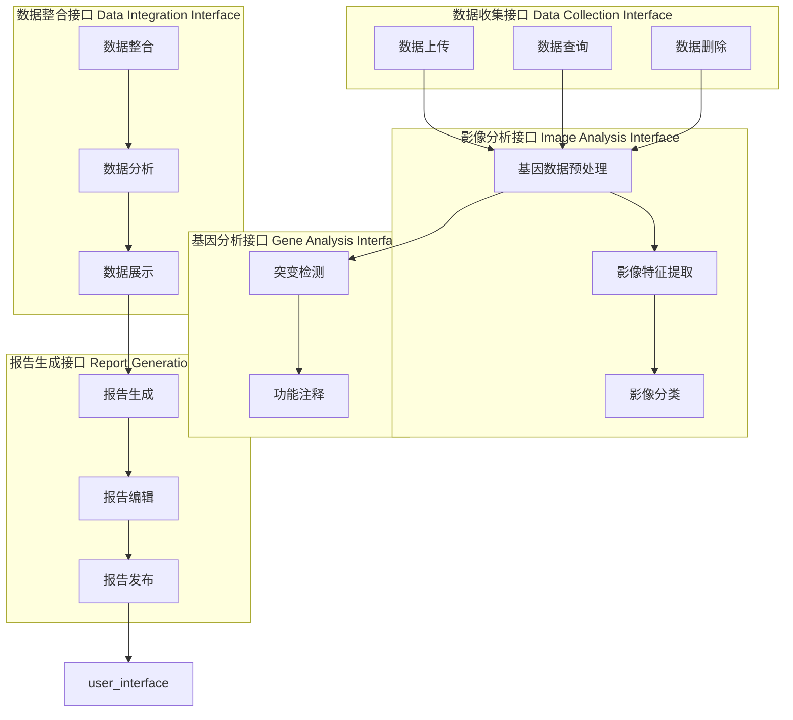
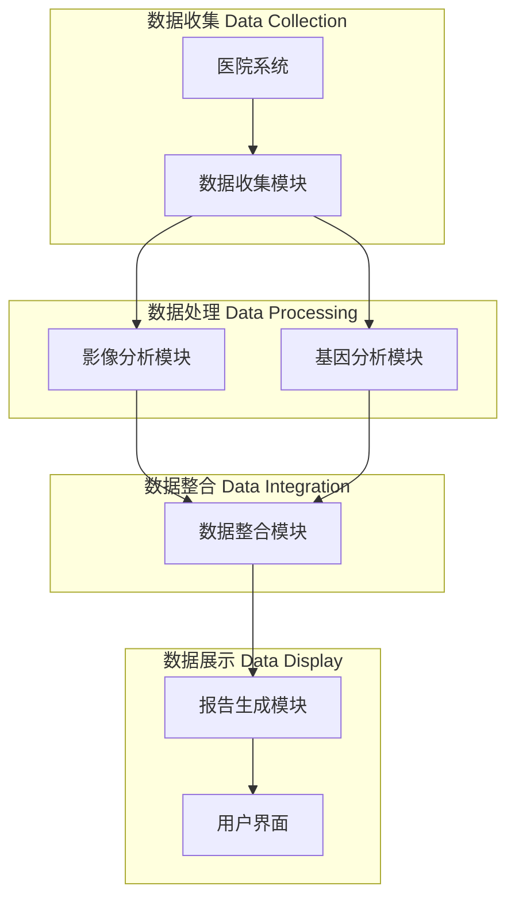
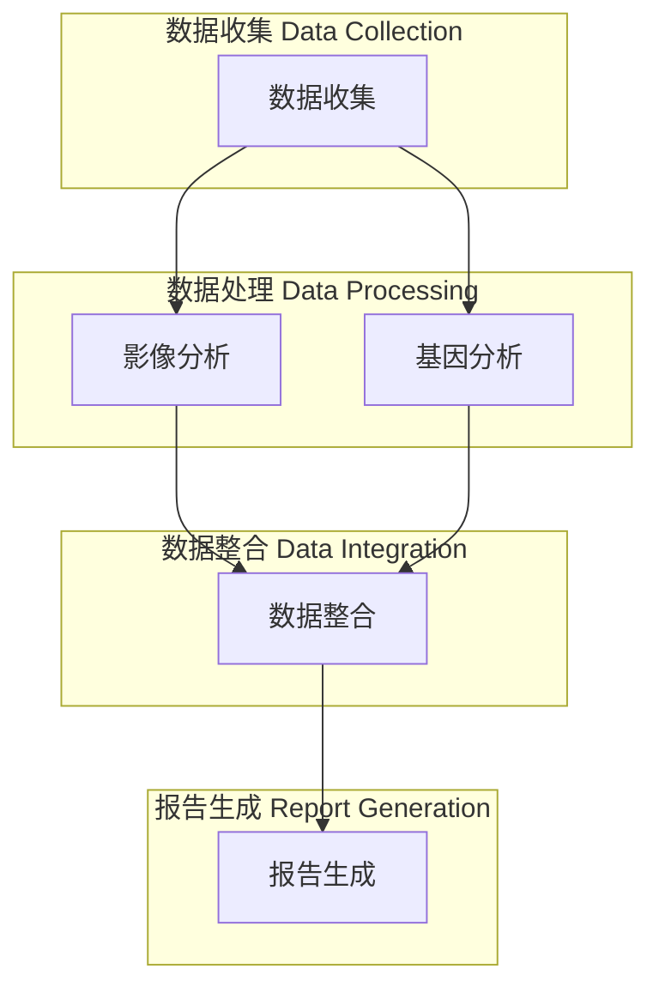

                 

### 文章标题：AI辅助癌症早期诊断：从影像分析到基因测序

#### 关键词：人工智能、癌症早期诊断、影像分析、基因测序、深度学习

##### 摘要：
本文深入探讨了人工智能（AI）在癌症早期诊断中的广泛应用，特别关注影像分析和基因测序这两个关键领域。通过逐步分析AI技术在影像分析中的具体应用，如图像处理和深度学习算法，以及基因测序技术在癌症诊断中的原理和实现，本文旨在为读者提供一个全面的技术指南，以了解如何利用AI技术辅助癌症早期诊断。文章结构清晰，从背景介绍到核心概念、算法原理、系统设计与实现，再到项目实战和总结拓展，每一部分都经过精心设计，以确保读者能够逐步掌握这一前沿技术。

### 目录大纲设计思路

在开始撰写本文之前，我们需要首先明确整体的文章结构。本文将分为三个主要部分，每个部分涵盖癌症早期诊断中不同领域的AI应用：

1. **背景与核心概念**：介绍癌症早期诊断的重要性，以及AI在该领域中的潜在应用。
2. **影像分析技术**：详细探讨影像分析技术在癌症诊断中的应用，包括医学影像技术的概述、影像分析算法原理和深度学习算法在影像分析中的应用。
3. **基因测序技术**：介绍基因测序技术在癌症诊断中的应用，包括基因测序的基本原理、常见的基因测序技术以及基因测序在癌症诊断中的价值。

每个部分将分为若干章节，每个章节都旨在提供详细而具体的解释，以便读者能够逐步深入了解AI在癌症早期诊断中的应用。

#### 第一部分：背景与核心概念

癌症是全球健康的主要威胁之一。据统计，癌症已经成为全球第二大死因，每年有数百万患者死于癌症。早期发现和诊断是癌症治疗成功的关键。早期诊断可以显著提高治愈率和生存率，降低治疗成本和并发症发生率。然而，传统的癌症诊断方法往往依赖于医生的直觉和经验，存在误诊和漏诊的风险，且诊断周期较长。

近年来，人工智能（AI）技术的快速发展为癌症早期诊断带来了新的机遇。AI能够通过大数据分析和机器学习算法，从海量的医学图像和基因数据中提取有用的信息，提高诊断的准确性和效率。影像分析和基因测序是AI在癌症早期诊断中的两个核心领域，它们在癌症的早期检测、诊断和治疗中发挥着重要作用。

在影像分析方面，AI可以用于医学图像的分割、分类和异常检测，从而帮助医生更快、更准确地诊断癌症。深度学习算法，如卷积神经网络（CNN）和生成对抗网络（GAN），在影像分析中展现出了强大的性能。通过训练模型，AI可以自动识别肿瘤区域，甚至预测肿瘤的类型和进展。

在基因测序方面，AI可以用于基因数据的分析和解释，帮助识别与癌症相关的基因变异和突变。通过基因组数据分析，AI可以帮助医生制定个性化的治疗方案，提高治疗效果。

本文将逐步介绍AI在癌症早期诊断中的应用，包括影像分析和基因测序两个核心领域。首先，我们将探讨癌症早期诊断的重要性，以及AI在医疗领域的发展和应用。接下来，我们将详细讨论AI辅助癌症早期诊断的核心概念，包括影像分析和基因测序的相关技术原理。随后，我们将深入讲解影像分析算法和深度学习算法的原理，并通过mermaid流程图和Python代码进行详细解释。最后，我们将介绍系统设计与实现，包括系统架构、接口设计和系统交互，并通过实际案例展示系统核心实现和项目实战过程。

#### 第1章：癌症早期诊断的重要性

##### 1.1 癌症的流行现状

癌症已成为全球范围内的重要健康问题。根据世界卫生组织（WHO）的数据，每年全球有近1000万人被诊断为癌症，死亡人数接近800万。癌症的发病率在不同国家和地区之间存在显著差异，这与经济发展水平、生活方式、遗传因素以及医疗保健服务的可及性密切相关。

在发达国家和地区，癌症的发病率较高，如美国、欧洲和澳大利亚。而在发展中国家，尽管癌症的发病率相对较低，但死亡率较高，这主要是因为诊断和治疗的资源不足。例如，非洲和南美洲的一些国家，癌症的诊断和治疗水平远远落后于发达国家。

##### 1.1.1 全球癌症发病率与死亡率

全球癌症发病率数据显示，男性中最常见的癌症类型依次是肺癌、肝癌、结直肠癌和前列腺癌。女性中最常见的癌症类型依次是乳腺癌、肺癌、结直肠癌和宫颈癌。肺癌是全球最常见的癌症类型，同时也是癌症死亡的主要原因。

世界卫生组织的数据显示，肺癌的发病率在全球范围内呈上升趋势，主要与吸烟和环境污染等因素有关。肝癌的发病率与乙型肝炎病毒（HBV）和丙型肝炎病毒（HCV）的感染率密切相关。结直肠癌的发病率在全球范围内也呈上升趋势，这与饮食和生活方式的改变有关。

##### 1.1.2 早期诊断对癌症治疗的影响

早期诊断是提高癌症治愈率和生存率的关键因素。研究表明，癌症的治愈率在早期阶段显著高于晚期阶段。在早期阶段，癌症通常局限在原发部位，尚未扩散到其他组织或器官。这种局限性使得治疗更加简单和有效。

一项研究发现，早期诊断的癌症患者的五年生存率可以达到90%以上，而晚期诊断的癌症患者的五年生存率通常低于30%。此外，早期诊断还可以减少癌症治疗的成本，降低并发症的发生率，提高患者的生活质量。

早期诊断的另一个重要优势是能够及时发现和治疗潜在的风险因素。例如，通过乳腺筛查可以早期发现乳腺癌，通过宫颈涂片可以早期发现宫颈癌。这些早期筛查方法可以帮助医生制定个性化的治疗方案，提高治疗效果。

##### 1.2 人工智能在医学领域的应用

人工智能（AI）技术在医学领域的应用日益广泛，特别是在癌症早期诊断中，AI展现出了巨大的潜力。AI可以通过分析大量的医学数据，识别出潜在的癌症信号，提高诊断的准确性和效率。

##### 1.2.1 AI在医疗领域的进展

近年来，AI在医疗领域的进展迅速。AI算法已经被用于医学影像分析、电子健康记录（EHR）分析、基因组学、药物研发和个性化治疗等领域。以下是一些AI在医疗领域的应用实例：

1. **医学影像分析**：AI可以用于医学影像的分割、分类和异常检测，帮助医生更快、更准确地诊断疾病。例如，深度学习算法被用于乳腺癌、肺癌和脑癌的检测，显著提高了诊断的准确性。
2. **电子健康记录分析**：AI可以通过分析电子健康记录（EHR）中的数据，识别出潜在的健康风险因素，提供个性化的健康建议。例如，AI可以预测患者是否有可能患上糖尿病、心血管疾病等。
3. **基因组学**：AI被用于分析大量的基因组数据，帮助识别与疾病相关的基因变异和突变。这为个性化治疗提供了重要的指导，有助于提高治疗效果。
4. **药物研发**：AI可以加速药物研发过程，通过预测药物的活性、毒性以及与目标蛋白的结合能力，提高新药的发现效率。
5. **个性化治疗**：AI可以根据患者的基因组数据和临床信息，制定个性化的治疗方案，提高治疗效果。

##### 1.2.2 AI在癌症诊断中的潜在价值

在癌症诊断中，AI具有以下潜在价值：

1. **提高诊断准确率**：AI可以通过分析大量的医学图像和基因组数据，提高诊断的准确性和可靠性。传统方法依赖于医生的直觉和经验，容易出现误诊和漏诊，而AI可以更加客观地分析数据。
2. **缩短诊断时间**：AI可以快速处理大量的数据，显著缩短诊断时间。这对于早期诊断尤为重要，因为早期发现和治疗可以显著提高治愈率。
3. **减少医疗成本**：AI可以降低医疗成本，通过自动化和优化医疗流程，减少人力和时间成本。例如，AI可以用于医学影像的自动化分析，减少医生的工作负担。
4. **个性化治疗**：AI可以根据患者的基因组数据和临床信息，制定个性化的治疗方案。这有助于提高治疗效果，减少不必要的治疗和副作用。

总之，AI在癌症早期诊断中的应用具有巨大的潜力。随着AI技术的不断发展，它将在未来的医疗领域发挥更加重要的作用。

##### 1.3 AI辅助癌症早期诊断的核心概念

AI在癌症早期诊断中的应用涉及多个核心概念和技术，主要包括影像分析和基因测序。

##### 1.3.1 影像分析

影像分析是AI在癌症早期诊断中最常用的技术之一。它涉及使用AI算法分析医学影像数据，如X射线、CT扫描、MRI和PET扫描图像，以识别癌症的早期迹象。影像分析的关键技术包括图像处理、特征提取和分类算法。

1. **图像处理**：图像处理是影像分析的基础，它涉及对医学图像进行预处理、增强和分割。预处理包括去噪、对比度增强和几何校正等步骤，以提高图像的质量。增强技术可以突出图像中的特定特征，帮助医生更好地识别病变区域。分割是将图像分割成不同的区域，以便进行进一步的分析和诊断。
2. **特征提取**：特征提取是从图像中提取具有区分性的特征，用于后续的分类和诊断。常见的特征提取方法包括纹理特征、形状特征和频域特征。纹理特征用于描述图像的纹理结构，形状特征用于描述图像的几何形状，频域特征用于描述图像的频率分布。
3. **分类算法**：分类算法是将提取的特征用于分类，以识别癌症的类型和位置。常见的分类算法包括支持向量机（SVM）、决策树和神经网络。深度学习算法，如卷积神经网络（CNN），在分类任务中表现出色，已经成为影像分析的主流算法。

##### 1.3.2 基因测序

基因测序是另一种重要的AI技术在癌症早期诊断中的应用。基因测序可以揭示癌症发生和发展过程中的基因变异和突变，为早期诊断和个性化治疗提供重要的信息。

1. **基因测序技术概述**：基因测序技术用于测定DNA或RNA序列，以揭示基因组的组成。常见的基因测序技术包括Sanger测序、焦磷酸测序（T7测序）和测序平台（如Illumina和NGS）。这些技术可以生成大量的基因数据，为后续分析提供基础。
2. **常见的基因测序技术**：常见的基因测序技术包括全基因组测序（WGS）、外显子测序（WES）和单核苷酸多态性（SNP）芯片。全基因组测序可以测定整个基因组的序列，提供全面的基因信息；外显子测序可以测定基因的外显子区域，适用于癌症相关基因的研究；SNP芯片可以检测基因组的单核苷酸多态性，帮助识别与疾病相关的基因变异。
3. **基因测序在癌症诊断中的价值**：基因测序在癌症诊断中具有以下价值：
   - **早期发现**：基因测序可以检测出早期的基因突变和变异，帮助医生在癌症发展的早期阶段进行诊断。
   - **个性化治疗**：基因测序可以识别与癌症相关的基因变异，为医生提供个性化的治疗方案。
   - **预后预测**：基因测序可以预测癌症的进展和复发风险，帮助医生制定更有效的治疗策略。

##### 1.4 研究背景与目标

癌症早期诊断的研究背景源于癌症的高发病率和死亡率。尽管近年来医学技术的进步显著提高了癌症的治疗效果，但大多数癌症患者仍因诊断延误而失去了最佳治疗时机。因此，开发有效的早期诊断方法成为医学研究的重要方向。

本研究的目标是利用人工智能技术，特别是在影像分析和基因测序领域，开发一种综合性的癌症早期诊断系统。通过结合影像数据和基因组数据，本研究旨在提高诊断的准确性和效率，为医生提供可靠的临床决策依据。

具体来说，本研究的目标包括：
1. **开发高效的影像分析算法**：通过结合图像处理和深度学习技术，开发能够自动识别和分类癌症病变区域的算法，提高诊断的准确性。
2. **构建基因测序数据分析平台**：利用机器学习和统计分析方法，构建一个能够从基因数据中识别癌症相关突变和变异的平台。
3. **实现影像与基因数据的整合**：通过数据融合和关联分析，实现影像数据和基因组数据的整合，提供更全面的诊断信息。
4. **评估系统性能和临床应用**：通过临床数据验证系统性能，评估其在实际临床应用中的有效性。

总之，本研究旨在通过人工智能技术推动癌症早期诊断的发展，为患者提供更早、更准确的诊断和治疗，从而提高癌症的治愈率和生活质量。

##### 1.5 本章小结

本章介绍了癌症早期诊断的重要性以及人工智能（AI）在医学领域的应用。我们首先探讨了全球癌症的流行现状，包括发病率与死亡率的数据，并强调了早期诊断对癌症治疗的关键作用。接着，我们介绍了AI在医疗领域的进展，特别是在医学影像分析和基因组学中的应用，展示了AI在提高诊断准确率和效率方面的潜力。此外，我们详细阐述了影像分析和基因测序作为AI辅助癌症早期诊断的核心概念，并明确了研究背景与目标，为后续章节的内容奠定了基础。

#### 第二部分：影像分析技术

影像分析技术在癌症早期诊断中起着至关重要的作用。通过分析医学影像数据，AI可以自动识别和分类癌症病变区域，提高诊断的准确性和效率。影像分析技术主要包括医学影像技术概述、影像分析算法原理以及深度学习算法在影像分析中的应用。

##### 第2章：影像分析技术在癌症诊断中的应用

##### 2.1 医学影像技术概述

医学影像技术是影像分析的基础，它包括多种成像方法，如X射线成像、CT扫描、MRI和PET扫描。每种成像技术都有其独特的原理和应用场景。

##### 2.1.1 X射线成像

X射线成像是最早的医学影像技术之一，它利用X射线穿透人体组织的特性来生成图像。X射线成像常用于胸部和骨骼系统的检查，如肺炎和骨折的诊断。然而，X射线成像的图像分辨率较低，难以显示细微的病变。

##### 2.1.2 CT扫描

CT扫描（计算机断层扫描）利用X射线和计算机技术，通过多个角度的X射线扫描，生成三维图像。CT扫描具有较高的图像分辨率，可以清晰地显示人体内部结构，常用于头部、肺部和腹部等部位的检查。特别是在癌症诊断中，CT扫描可以检测到较小的肿瘤和转移。

##### 2.1.3 核磁共振成像（MRI）

核磁共振成像（MRI）利用磁场和射频波来生成图像，具有无辐射、多平面成像和高度软组织对比度等优点。MRI常用于检测中枢神经系统、肌肉骨骼系统和软组织的病变。在癌症诊断中，MRI可以清晰地显示肿瘤的位置、大小和形态，有助于制定治疗方案。

##### 2.1.4 正电子发射断层扫描（PET）

正电子发射断层扫描（PET）利用正电子放射性同位素标记的药物或放射性标记物，探测放射性衰变产生的正电子对，生成三维图像。PET图像可以反映生物体内分子代谢和功能活动，常用于肿瘤的定位和分期。在癌症诊断中，PET可以检测到肿瘤的代谢活性，帮助医生评估肿瘤的恶性程度和治疗效果。

##### 2.2 影像分析算法原理

影像分析算法是影像分析技术的重要组成部分，它通过处理和分析医学影像数据，提取有用的信息，用于疾病诊断和预测。影像分析算法主要包括图像处理、特征提取和分类算法。

##### 2.2.1 图像处理

图像处理是影像分析的基础，它包括对医学影像进行预处理、增强和分割。预处理包括去噪、对比度增强和几何校正等步骤，以提高图像的质量。增强技术可以突出图像中的特定特征，帮助医生更好地识别病变区域。分割是将图像分割成不同的区域，以便进行进一步的分析和诊断。

##### 2.2.2 特征提取

特征提取是从图像中提取具有区分性的特征，用于后续的分类和诊断。常见的特征提取方法包括纹理特征、形状特征和频域特征。纹理特征用于描述图像的纹理结构，形状特征用于描述图像的几何形状，频域特征用于描述图像的频率分布。

##### 2.2.3 分类算法

分类算法是将提取的特征用于分类，以识别癌症的类型和位置。常见的分类算法包括支持向量机（SVM）、决策树和神经网络。深度学习算法，如卷积神经网络（CNN），在分类任务中表现出色，已经成为影像分析的主流算法。

##### 2.3 影像分析流程

影像分析流程通常包括数据预处理、影像分割、影像分析和结果评估等步骤。

##### 2.3.1 数据预处理

数据预处理是影像分析的第一步，它包括对医学影像进行去噪、对比度增强和几何校正等处理。去噪可以消除图像中的噪声，提高图像的清晰度；对比度增强可以增强图像中的细节，使病变区域更加明显；几何校正可以校正图像的几何变形，使图像更加准确。

##### 2.3.2 影像分割

影像分割是将图像分割成不同的区域，以便进行进一步的分析。影像分割的方法包括阈值分割、区域生长和基于边缘的分割等。阈值分割是通过设置阈值，将图像分割成不同的区域；区域生长是从初始区域开始，逐步扩展，直到满足特定条件；基于边缘的分割是通过检测图像中的边缘来分割区域。

##### 2.3.3 影像分析与诊断

影像分析是对分割后的图像区域进行特征提取和分类，以识别病变区域和诊断疾病。常用的方法包括纹理特征提取和分类算法，如支持向量机和卷积神经网络。纹理特征提取可以从图像中提取具有区分性的特征，分类算法用于识别病变类型。

##### 2.3.4 结果评估与优化

结果评估与优化是影像分析的最后一步，它包括评估影像分析的准确性和可靠性，并优化分析参数。常用的评估指标包括敏感度、特异度、准确率和F1值。优化方法包括参数调整、模型改进和特征选择等。

##### 2.4 影像分析技术的挑战与未来趋势

影像分析技术在癌症诊断中具有巨大的潜力，但同时也面临着一些挑战。以下是一些主要的挑战和未来趋势：

##### 2.4.1 当前挑战

1. **图像质量**：图像质量是影像分析的关键因素，图像噪声和对比度不足会影响分析的准确性。因此，提高图像质量是影像分析技术的挑战之一。
2. **数据标注**：影像分析需要大量的标注数据用于训练模型，但获取高质量的标注数据是一项耗时且昂贵的工作。
3. **算法性能**：尽管深度学习算法在影像分析中表现出色，但仍然存在过拟合和泛化能力不足的问题。

##### 2.4.2 未来趋势

1. **多模态影像分析**：未来影像分析技术将结合多种影像模态，如CT、MRI和PET，提供更全面和准确的诊断信息。
2. **个性化影像分析**：个性化影像分析将根据患者的具体特征，如年龄、性别和病史，提供个性化的诊断和治疗方案。
3. **实时影像分析**：实时影像分析技术将使医生能够实时查看分析结果，提高诊断效率和准确性。
4. **数据共享与合作**：通过数据共享和合作，影像分析技术将能够利用更多的数据资源，提高模型的性能和可靠性。

##### 2.5 本章小结

本章介绍了影像分析技术在癌症诊断中的应用，包括医学影像技术概述、影像分析算法原理和深度学习算法在影像分析中的应用。我们详细探讨了影像分析流程，以及当前面临的挑战和未来的发展趋势。通过本章的内容，读者可以了解影像分析技术在癌症早期诊断中的重要性，并为后续章节的学习奠定基础。

##### 第3章：深度学习算法在影像分析中的应用

深度学习算法在影像分析中的应用越来越广泛，其强大的特征提取和模式识别能力使其在癌症早期诊断中表现出色。本章将详细介绍深度学习算法在影像分析中的应用，包括神经网络基础、卷积神经网络（CNN）、循环神经网络（RNN）和生成对抗网络（GAN）的基本概念和原理。

##### 3.1 深度学习基础

深度学习是一种基于多层神经网络的人工智能技术，它通过多层非线性变换来提取和表示数据中的特征。深度学习模型通常包括输入层、隐藏层和输出层，每一层都能够对输入数据进行特征提取和变换。

##### 3.1.1 神经网络基础

神经网络（Neural Networks，NN）是深度学习的基础，它由多个神经元组成，每个神经元通过权重连接与其他神经元。神经网络的工作原理类似于人脑，通过学习输入和输出之间的映射关系，从而实现预测和分类。

1. **神经元模型**：一个简单的神经元模型可以表示为：
   \[
   \text{输出} = \text{激活函数}(\sum_{i} w_i x_i + b)
   \]
   其中，\(x_i\) 是第 \(i\) 个输入，\(w_i\) 是权重，\(b\) 是偏置，激活函数（如ReLU函数）用于引入非线性。

2. **多层神经网络**：多层神经网络（Multilayer Perceptron，MLP）包括多个隐藏层，每一层都可以提取更高层次的特征。多层神经网络可以表示为：
   \[
   z^{(l)} = \sigma(W^{(l)}a^{(l-1)} + b^{(l)})
   \]
   其中，\(a^{(l-1)}\) 是前一层输出，\(W^{(l)}\) 是权重矩阵，\(b^{(l)}\) 是偏置，\(\sigma\) 是激活函数。

3. **反向传播算法**：反向传播（Backpropagation）是一种用于训练神经网络的优化算法。它通过计算误差梯度，不断调整权重和偏置，使网络输出更接近目标值。

##### 3.1.2 卷积神经网络（CNN）

卷积神经网络（Convolutional Neural Network，CNN）是一种专门用于处理图像数据的深度学习模型。CNN通过卷积操作和池化操作，自动提取图像中的特征，非常适合图像分类、分割和异常检测等任务。

1. **卷积操作**：卷积操作是一种对图像进行局部特征提取的方法。一个卷积核（filter）是一个小的图像窗口，它滑动过输入图像，计算每个窗口的局部特征和。卷积操作的公式为：
   \[
   \text{卷积} = \sum_{i} w_i * x_i + b
   \]
   其中，\(w_i\) 是卷积核的权重，\(x_i\) 是输入图像的局部区域，\(b\) 是偏置。

2. **池化操作**：池化（Pooling）操作用于减小特征图的尺寸，同时保留最重要的特征。常见的池化操作包括最大池化（Max Pooling）和平均池化（Average Pooling）。

3. **CNN模型架构**：一个典型的CNN模型包括多个卷积层、池化层和全连接层。卷积层用于提取图像特征，池化层用于减小特征图的尺寸，全连接层用于分类。

##### 3.1.3 循环神经网络（RNN）

循环神经网络（Recurrent Neural Network，RNN）是一种能够处理序列数据的深度学习模型。RNN通过循环机制，将前一时刻的输出作为当前时刻的输入，从而实现长期依赖建模。

1. **RNN模型架构**：RNN模型包括输入层、隐藏层和输出层，其中隐藏层具有循环连接。RNN的输出可以通过递归关系表示为：
   \[
   h_t = \sigma(W_h h_{t-1} + W_x x_t + b)
   \]
   其中，\(h_t\) 是第 \(t\) 时刻的隐藏状态，\(\sigma\) 是激活函数，\(W_h\) 和 \(W_x\) 是权重矩阵，\(b\) 是偏置。

2. **长短期记忆（LSTM）网络**：LSTM是RNN的一种改进，它通过引入门控机制，解决了RNN的梯度消失和长期依赖问题。LSTM的公式为：
   \[
   i_t = \sigma(W_i [h_{t-1}, x_t] + b_i),\quad f_t = \sigma(W_f [h_{t-1}, x_t] + b_f),\quad o_t = \sigma(W_o [h_{t-1}, x_t] + b_o)
   \]
   \[
   \tilde{c_t} = \sigma(W_c [h_{t-1}, x_t] + b_c),\quad c_t = f_t \odot \tilde{c_t} + i_t \odot \tilde{c_t},\quad h_t = o_t \odot c_t
   \]
   其中，\(i_t, f_t, o_t\) 分别是输入门、遗忘门和输出门，\(\tilde{c_t}\) 是候选状态，\(c_t\) 是细胞状态。

##### 3.1.4 生成对抗网络（GAN）

生成对抗网络（Generative Adversarial Network，GAN）是一种由生成器和判别器组成的对抗性模型。生成器试图生成逼真的数据，而判别器试图区分真实数据和生成数据。

1. **GAN模型架构**：GAN包括生成器 \(G\) 和判别器 \(D\)，它们通过对抗训练互相提升。生成器的目标是生成逼真的图像，判别器的目标是准确区分真实图像和生成图像。GAN的目标函数为：
   \[
   \min_G \max_D V(D, G) = \mathbb{E}_{x \sim p_{data}(x)}[\log D(x)] + \mathbb{E}_{z \sim p_z(z)}[\log (1 - D(G(z))]
   \]
   其中，\(x\) 是真实图像，\(z\) 是生成器的输入噪声。

2. **训练过程**：GAN的训练过程是一个不断博弈的过程，生成器和判别器交替更新。生成器试图生成更逼真的图像，判别器试图提高区分能力。

##### 3.2 CNN在影像分析中的应用

卷积神经网络（CNN）在影像分析中表现出色，特别是在图像分类和分割任务中。以下将介绍CNN在影像分析中的应用，包括模型架构、图像分类和图像分割。

##### 3.2.1 CNN模型架构

一个典型的CNN模型包括多个卷积层、池化层和全连接层。卷积层用于提取图像特征，池化层用于减小特征图的尺寸，全连接层用于分类。

1. **LeNet模型**：LeNet是早期用于手写数字识别的CNN模型，由两个卷积层、一个池化层和一个全连接层组成。其结构如下：
   \[
   \text{输入} \rightarrow \text{卷积层1 (5x5 卷积核，6 个特征图，步长为1，零填充)} \rightarrow \text{ReLU激活} \rightarrow \text{池化层 (2x2 最大池化，步长为2)} \rightarrow \text{卷积层2 (5x5 卷积核，16 个特征图，步长为1，零填充)} \rightarrow \text{ReLU激活} \rightarrow \text{池化层 (2x2 最大池化，步长为2)} \rightarrow \text{全连接层 (128 个神经元)} \rightarrow \text{softmax输出}
   \]

2. **AlexNet模型**：AlexNet是深度学习在影像分析中的突破性模型，由五个卷积层、三个全连接层和一个ReLU激活函数组成。其结构如下：
   \[
   \text{输入} \rightarrow \text{卷积层1 (11x11 卷积核，96 个特征图，步长为4，零填充)} \rightarrow \text{ReLU激活} \rightarrow \text{池化层 (3x3 最大池化，步长为2)} \rightarrow \text{卷积层2 (5x5 卷积核，256 个特征图，步长为1，零填充)} \rightarrow \text{ReLU激活} \rightarrow \text{池化层 (3x3 最大池化，步长为2)} \rightarrow \text{卷积层3 (3x3 卷积核，384 个特征图，步长为1，零填充)} \rightarrow \text{ReLU激活} \rightarrow \text{卷积层4 (3x3 卷积核，384 个特征图，步长为1，零填充)} \rightarrow \text{ReLU激活} \rightarrow \text{池化层 (3x3 最大池化，步长为2)} \rightarrow \text{卷积层5 (3x3 卷积核，256 个特征图，步长为1，零填充)} \rightarrow \text{ReLU激活} \rightarrow \text{全连接层 (4096 个神经元)} \rightarrow \text{ReLU激活} \rightarrow \text{全连接层 (4096 个神经元)} \rightarrow \text{softmax输出}
   \]

3. **VGG模型**：VGG模型通过使用多个卷积层和池化层，提高了网络的深度和宽度。其结构如下：
   \[
   \text{输入} \rightarrow \text{卷积层1 (3x3 卷积核，64 个特征图，步长为1，零填充)} \rightarrow \text{ReLU激活} \rightarrow \text{池化层 (2x2 最大池化，步长为2)} \rightarrow \text{卷积层2 (3x3 卷积核，64 个特征图，步长为1，零填充)} \rightarrow \text{ReLU激活} \rightarrow \text{池化层 (2x2 最大池化，步长为2)} \rightarrow \text{卷积层3 (3x3 卷积核，128 个特征图，步长为1，零填充)} \rightarrow \text{ReLU激活} \rightarrow \text{池化层 (2x2 最大池化，步长为2)} \rightarrow \text{卷积层4 (3x3 卷积核，128 个特征图，步长为1，零填充)} \rightarrow \text{ReLU激活} \rightarrow \text{池化层 (2x2 最大池化，步长为2)} \rightarrow \text{卷积层5 (3x3 卷积核，256 个特征图，步长为1，零填充)} \rightarrow \text{ReLU激活} \rightarrow \text{池化层 (2x2 最大池化，步长为2)} \rightarrow \text{卷积层6 (3x3 卷积核，256 个特征图，步长为1，零填充)} \rightarrow \text{ReLU激活} \rightarrow \text{池化层 (2x2 最大池化，步长为2)} \rightarrow \text{卷积层7 (3x3 卷积核，512 个特征图，步长为1，零填充)} \rightarrow \text{ReLU激活} \rightarrow \text{池化层 (2x2 最大池化，步长为2)} \rightarrow \text{卷积层8 (3x3 卷积核，512 个特征图，步长为1，零填充)} \rightarrow \text{ReLU激活} \rightarrow \text{池化层 (2x2 最大池化，步长为2)} \rightarrow \text{卷积层9 (3x3 卷积核，512 个特征图，步长为1，零填充)} \rightarrow \text{ReLU激活} \rightarrow \text{池化层 (2x2 最大池化，步长为2)} \rightarrow \text{卷积层10 (3x3 卷积核，512 个特征图，步长为1，零填充)} \rightarrow \text{ReLU激活} \rightarrow \text{池化层 (2x2 最大池化，步长为2)} \rightarrow \text{全连接层 (4096 个神经元)} \rightarrow \text{ReLU激活} \rightarrow \text{全连接层 (4096 个神经元)} \rightarrow \text{softmax输出}
   \]

4. **ResNet模型**：ResNet模型通过引入残差块，解决了深度网络中的梯度消失问题，显著提高了网络的深度和性能。其结构如下：
   \[
   \text{输入} \rightarrow \text{卷积层1 (7x7 卷积核，64 个特征图，步长为2，零填充)} \rightarrow \text{ReLU激活} \rightarrow \text{池化层 (3x3 最大池化，步长为2)} \rightarrow \text{残差块 (64 个特征图)} \rightarrow \text{残差块 (64 个特征图)} \rightarrow \text{残差块 (64 个特征图)} \rightarrow \text{残差块 (128 个特征图)} \rightarrow \text{残差块 (128 个特征图)} \rightarrow \text{残差块 (128 个特征图)} \rightarrow \text{残差块 (256 个特征图)} \rightarrow \text{残差块 (256 个特征图)} \rightarrow \text{残差块 (256 个特征图)} \rightarrow \text{残差块 (512 个特征图)} \rightarrow \text{残差块 (512 个特征图)} \rightarrow \text{残差块 (512 个特征图)} \rightarrow \text{卷积层2 (1x1 卷积核，512 个特征图，步长为1，零填充)} \rightarrow \text{ReLU激活} \rightarrow \text{池化层 (2x2 最大池化，步长为2)} \rightarrow \text{全连接层 (1000 个神经元)} \rightarrow \text{softmax输出}
   \]

##### 3.2.2 CNN在图像分类中的应用

CNN在图像分类中的应用非常广泛，通过训练大规模的卷积神经网络模型，可以实现高精度的图像分类。以下是一个简单的图像分类任务示例：

1. **数据预处理**：首先，需要对图像数据集进行预处理，包括缩放、归一化和数据增强等操作。假设图像大小为 \(224x224\) 像素，数据增强方法包括随机裁剪、旋转和水平翻转等。

2. **模型训练**：使用预训练的CNN模型（如VGG或ResNet），在图像分类任务上进行微调。将预处理后的图像输入到模型中，通过反向传播算法更新模型的权重。

3. **模型评估**：使用测试集评估模型的分类性能，常用的评估指标包括准确率、召回率和F1值。通过调整模型参数和训练策略，优化模型的性能。

下面是一个简单的Python代码示例，使用TensorFlow和Keras实现图像分类任务：

```python
import tensorflow as tf
from tensorflow.keras.applications import VGG16
from tensorflow.keras.preprocessing.image import ImageDataGenerator
from tensorflow.keras.models import Model
from tensorflow.keras.layers import Dense, Flatten

# 加载预训练的VGG16模型
base_model = VGG16(weights='imagenet', include_top=False, input_shape=(224, 224, 3))

# 添加全连接层和softmax输出层
x = base_model.output
x = Flatten()(x)
x = Dense(1000, activation='softmax')(x)

# 构建完整的模型
model = Model(inputs=base_model.input, outputs=x)

# 冻结基础模型层的权重
for layer in base_model.layers:
    layer.trainable = False

# 编译模型
model.compile(optimizer='adam', loss='categorical_crossentropy', metrics=['accuracy'])

# 数据增强
train_datagen = ImageDataGenerator(
    rescale=1./255,
    shear_range=0.2,
    zoom_range=0.2,
    horizontal_flip=True
)

test_datagen = ImageDataGenerator(rescale=1./255)

# 加载训练数据和测试数据
train_generator = train_datagen.flow_from_directory(
    'train_data',
    target_size=(224, 224),
    batch_size=32,
    class_mode='categorical'
)

test_generator = test_datagen.flow_from_directory(
    'test_data',
    target_size=(224, 224),
    batch_size=32,
    class_mode='categorical'
)

# 训练模型
model.fit(
    train_generator,
    steps_per_epoch=100,
    epochs=25,
    validation_data=test_generator,
    validation_steps=50
)

# 评估模型
test_loss, test_acc = model.evaluate(test_generator, steps=50)
print('Test accuracy:', test_acc)
```

##### 3.2.3 CNN在图像分割中的应用

图像分割是将图像分割成不同的区域或对象，是图像处理的重要任务之一。CNN在图像分割中表现出色，通过训练大规模的卷积神经网络模型，可以实现高精度的图像分割。以下是一个简单的图像分割任务示例：

1. **数据预处理**：首先，需要对图像数据集进行预处理，包括缩放、归一化和数据增强等操作。假设图像大小为 \(224x224\) 像素，数据增强方法包括随机裁剪、旋转和水平翻转等。

2. **模型训练**：使用预训练的CNN模型（如U-Net或DeepLabV3+），在图像分割任务上进行微调。将预处理后的图像输入到模型中，通过反向传播算法更新模型的权重。

3. **模型评估**：使用测试集评估模型的分割性能，常用的评估指标包括 Intersection over Union (IoU) 和 Dice系数。通过调整模型参数和训练策略，优化模型的性能。

下面是一个简单的Python代码示例，使用TensorFlow和Keras实现图像分割任务：

```python
import tensorflow as tf
from tensorflow.keras.applications import VGG16
from tensorflow.keras.layers import Conv2D, MaxPooling2D, Input, concatenate, Conv2DTranspose
from tensorflow.keras.models import Model
from tensorflow.keras.preprocessing.image import ImageDataGenerator

# 构建U-Net模型
input_image = Input(shape=(224, 224, 3))
conv1 = Conv2D(64, (3, 3), activation='relu', padding='same')(input_image)
pool1 = MaxPooling2D(pool_size=(2, 2))(conv1)
conv2 = Conv2D(64, (3, 3), activation='relu', padding='same')(pool1)
pool2 = MaxPooling2D(pool_size=(2, 2))(conv2)
conv3 = Conv2D(128, (3, 3), activation='relu', padding='same')(pool2)
pool3 = MaxPooling2D(pool_size=(2, 2))(conv3)
conv4 = Conv2D(128, (3, 3), activation='relu', padding='same')(pool3)
pool4 = MaxPooling2D(pool_size=(2, 2))(conv4)
conv5 = Conv2D(256, (3, 3), activation='relu', padding='same')(pool4)
pool5 = MaxPooling2D(pool_size=(2, 2))(conv5)
conv6 = Conv2D(256, (3, 3), activation='relu', padding='same')(pool5)

# 下采样路径
up6 = Conv2DTranspose(128, (2, 2), strides=(2, 2), padding='same')(conv6)
merge6 = concatenate([up6, conv5])
conv7 = Conv2D(128, (3, 3), activation='relu', padding='same')(merge6)
conv8 = Conv2D(128, (3, 3), activation='relu', padding='same')(conv7)

# 上采样路径
up5 = Conv2DTranspose(64, (2, 2), strides=(2, 2), padding='same')(conv8)
merge5 = concatenate([up5, conv4])
conv9 = Conv2D(64, (3, 3), activation='relu', padding='same')(merge5)
conv10 = Conv2D(64, (3, 3), activation='relu', padding='same')(conv9)

# 上采样路径
up4 = Conv2DTranspose(32, (2, 2), strides=(2, 2), padding='same')(conv10)
merge4 = concatenate([up4, conv3])
conv11 = Conv2D(32, (3, 3), activation='relu', padding='same')(merge4)
conv12 = Conv2D(32, (3, 3), activation='relu', padding='same')(conv11)

# 上采样路径
up3 = Conv2DTranspose(16, (2, 2), strides=(2, 2), padding='same')(conv12)
merge3 = concatenate([up3, conv2])
conv13 = Conv2D(16, (3, 3), activation='relu', padding='same')(merge3)
conv14 = Conv2D(16, (3, 3), activation='relu', padding='same')(conv13)

# 上采样路径
up2 = Conv2DTranspose(8, (2, 2), strides=(2, 2), padding='same')(conv14)
merge2 = concatenate([up2, conv1])
conv15 = Conv2D(8, (3, 3), activation='relu', padding='same')(merge2)
conv16 = Conv2D(8, (3, 3), activation='relu', padding='same')(conv15)

# 输出层
outputs = Conv2D(1, (1, 1), activation='sigmoid')(conv16)

# 构建模型
model = Model(inputs=input_image, outputs=outputs)

# 编译模型
model.compile(optimizer='adam', loss='binary_crossentropy', metrics=['accuracy'])

# 数据增强
train_datagen = ImageDataGenerator(
    rescale=1./255,
    shear_range=0.2,
    zoom_range=0.2,
    horizontal_flip=True
)

test_datagen = ImageDataGenerator(rescale=1./255)

# 加载训练数据和测试数据
train_generator = train_datagen.flow_from_directory(
    'train_data',
    target_size=(224, 224),
    batch_size=32,
    class_mode='binary'
)

test_generator = test_datagen.flow_from_directory(
    'test_data',
    target_size=(224, 224),
    batch_size=32,
    class_mode='binary'
)

# 训练模型
model.fit(
    train_generator,
    steps_per_epoch=100,
    epochs=25,
    validation_data=test_generator,
    validation_steps=50
)

# 评估模型
test_loss, test_acc = model.evaluate(test_generator, steps=50)
print('Test accuracy:', test_acc)
```

##### 3.3 RNN在影像分析中的应用

循环神经网络（Recurrent Neural Network，RNN）是一种能够处理序列数据的深度学习模型，特别适合处理时间序列数据和视频数据。近年来，RNN在影像分析中得到了广泛应用，通过序列建模和空间建模，可以实现图像分类、物体检测和动作识别等任务。

##### 3.3.1 RNN模型架构

RNN的基本架构包括输入层、隐藏层和输出层，其中隐藏层具有循环连接。RNN的递归特性使其能够处理序列数据，通过记忆隐藏状态，实现长期依赖建模。

\[ h_t = \sigma(W_h h_{t-1} + W_x x_t + b) \]

其中，\(h_t\) 是第 \(t\) 时刻的隐藏状态，\(\sigma\) 是激活函数，\(W_h\) 和 \(W_x\) 是权重矩阵，\(b\) 是偏置。

##### 3.3.2 RNN在时间序列数据中的应用

RNN在时间序列数据中的应用非常广泛，例如股票价格预测、语音识别和自然语言处理。通过处理时间序列数据，RNN可以捕捉到数据中的时间和空间模式，实现序列建模。

以下是一个简单的股票价格预测示例：

```python
import numpy as np
import tensorflow as tf

# 生成模拟数据
time_steps = 60
data = np.random.rand(time_steps, 1)

# 初始化RNN模型
hidden_size = 10
input_size = 1
output_size = 1

# 定义RNN模型
def rnn_model(data):
    inputs = tf.keras.layers.Input(shape=(time_steps, input_size))
    hidden = tf.keras.layers.LSTM(hidden_size, return_sequences=True)(inputs)
    outputs = tf.keras.layers.Dense(output_size)(hidden)
    model = tf.keras.Model(inputs=inputs, outputs=outputs)
    return model

# 训练模型
model = rnn_model(data)
model.compile(optimizer='adam', loss='mse')
model.fit(data, data, epochs=10)

# 预测
predictions = model.predict(data)
print(predictions)
```

##### 3.3.3 RNN在影像分析中的实际应用

在影像分析中，RNN可以用于视频分类、动作识别和物体检测。通过将视频帧作为输入序列，RNN可以捕捉到视频中的运动模式和动作特征。

以下是一个简单的视频分类示例：

```python
import cv2
import numpy as np
import tensorflow as tf

# 读取视频文件
video_file = 'video.mp4'
cap = cv2.VideoCapture(video_file)

# 初始化模型
model = tf.keras.models.load_model('video_classification_model.h5')

# 处理视频帧
frames = []
while cap.isOpened():
    ret, frame = cap.read()
    if not ret:
        break
    frame = cv2.resize(frame, (224, 224))
    frame = np.expand_dims(frame, axis=0)
    frames.append(frame)

# 合并视频帧
frames = np.vstack(frames)

# 预测视频分类
predictions = model.predict(frames)
print(predictions)
```

##### 3.4 GAN在影像分析中的应用

生成对抗网络（Generative Adversarial Network，GAN）是一种由生成器和判别器组成的对抗性模型，通过对抗训练生成逼真的图像。GAN在影像分析中可以用于图像生成、图像修复和图像增强等任务。

##### 3.4.1 GAN模型架构

GAN由生成器和判别器组成，生成器 \(G\) 尝试生成逼真的图像，判别器 \(D\) 尝试区分真实图像和生成图像。GAN的目标函数是最大化生成器生成的图像的判别损失。

\[ \min_G \max_D V(D, G) = \mathbb{E}_{x \sim p_{data}(x)}[\log D(x)] + \mathbb{E}_{z \sim p_z(z)}[\log (1 - D(G(z))] \]

其中，\(x\) 是真实图像，\(z\) 是生成器的输入噪声。

##### 3.4.2 GAN在影像数据增强中的应用

GAN可以用于影像数据增强，通过生成更多的训练样本，提高模型的泛化能力。以下是一个简单的图像生成示例：

```python
import tensorflow as tf
from tensorflow.keras.models import Model
from tensorflow.keras.layers import Input, Dense, Reshape, Conv2D, Conv2DTranspose, Flatten

# 定义生成器模型
z_dim = 100
img_rows = 28
img_cols = 28
channels = 1

z = Input(shape=(z_dim,))
x = Dense(128 * 7 * 7, activation='relu')(z)
x = Reshape((7, 7, 128))(x)
x = Conv2DTranspose(128, (4, 4), strides=(2, 2), padding='same', activation='relu')(x)
x = Conv2DTranspose(64, (4, 4), strides=(2, 2), padding='same', activation='relu')(x)
x = Conv2DTranspose(channels, (4, 4), strides=(2, 2), padding='same', activation='tanh')(x)
generator = Model(z, x)

# 定义判别器模型
img = Input(shape=(img_rows, img_cols, channels))
x = Conv2D(64, (4, 4), strides=(2, 2), padding='same', activation='relu')(img)
x = Conv2D(128, (4, 4), strides=(2, 2), padding='same', activation='relu')(x)
x = Flatten()(x)
x = Dense(1, activation='sigmoid')(x)
discriminator = Model(img, x)

# 构建GAN模型
discriminator.compile(optimizer='adam', loss='binary_crossentropy')
z = Input(shape=(z_dim,))
fake_img = generator(z)
discriminator.trainable = False
gan = Model(z, discriminator(fake_img))
gan.compile(optimizer='adam', loss='binary_crossentropy')

# 训练GAN模型
for epoch in range(100):
    for _ in range(100):
        z_random = np.random.normal(size=(32, z_dim))
        real_img = np.random.normal(size=(32, img_rows, img_cols, channels))
        fake_img = generator.predict(z_random)
        d_loss_real = discriminator.train_on_batch(real_img, np.ones((32, 1)))
        d_loss_fake = discriminator.train_on_batch(fake_img, np.zeros((32, 1)))
        z_random = np.random.normal(size=(32, z_dim))
        g_loss = gan.train_on_batch(z_random, np.ones((32, 1)))

    print(f"Epoch: {epoch + 1}, D_loss_real: {d_loss_real}, D_loss_fake: {d_loss_fake}, G_loss: {g_loss}")

# 生成图像
z_random = np.random.normal(size=(1, z_dim))
generated_img = generator.predict(z_random)
print(generated_img)
```

##### 3.5 本章小结

本章详细介绍了深度学习算法在影像分析中的应用，包括神经网络基础、卷积神经网络（CNN）、循环神经网络（RNN）和生成对抗网络（GAN）。我们首先介绍了深度学习的基础知识，包括神经网络的基本概念和反向传播算法。然后，我们详细介绍了CNN的基本原理和架构，以及CNN在图像分类和分割中的应用。接着，我们探讨了RNN在时间序列数据中的应用，以及RNN在影像分析中的实际应用。最后，我们介绍了GAN的基本原理和架构，以及GAN在图像生成和数据增强中的应用。通过本章的内容，读者可以深入了解深度学习算法在影像分析中的广泛应用，并为后续章节的学习奠定基础。

### 第三部分：基因测序技术

基因测序技术在癌症早期诊断中起着至关重要的作用。通过分析基因序列，AI可以揭示癌症发生和发展过程中的基因变异和突变，为早期诊断和个性化治疗提供关键信息。基因测序技术包括基因测序技术概述、常见基因测序技术以及基因测序在癌症诊断中的价值。

#### 第4章：基因测序技术在癌症诊断中的应用

##### 4.1 基因测序技术概述

基因测序技术是一种用于测定DNA或RNA序列的方法，通过揭示基因组的组成，为癌症的早期诊断、治疗和预后提供重要信息。基因测序技术经历了快速的发展，从最初的Sanger测序到高通量测序（High-throughput sequencing，HTS），测序速度和成本显著降低，使大规模基因测序成为可能。

##### 4.1.1 基因测序的基本原理

基因测序的基本原理是通过识别DNA或RNA分子中的核苷酸序列，将其转换为数字信号，然后进行分析和解释。常见的基因测序方法包括Sanger测序、焦磷酸测序（T7测序）和测序平台（如Illumina和NGS）。

1. **Sanger测序**：Sanger测序是一种基于链终止法的经典测序技术。它通过使用标记的荧光引物和终止子，生成一系列长度不同的DNA片段。这些片段经过电泳分离后，通过读取荧光信号，确定DNA序列。

2. **焦磷酸测序（T7测序）**：焦磷酸测序利用DNA聚合酶在合成DNA链的过程中释放焦磷酸，通过检测焦磷酸的释放，确定DNA序列。

3. **测序平台（如Illumina和NGS）**：高通量测序（NGS）是一种基于平行测序的方法，能够在短时间内对大量DNA序列进行测序。常见的测序平台包括Illumina、ABI和Nanopore等。NGS技术包括单分子测序（如Nanopore测序）和双端测序（如Illumina测序）。

##### 4.1.2 常见的基因测序技术

常见的基因测序技术包括全基因组测序（WGS）、外显子测序（WES）和单核苷酸多态性（SNP）芯片。

1. **全基因组测序（WGS）**：全基因组测序是一种能够测定整个基因组的测序技术，包括DNA中的所有基因和非编码序列。WGS可以提供全面的基因组信息，有助于发现与癌症相关的基因变异和突变。

2. **外显子测序（WES）**：外显子测序是一种针对基因外显子区域的测序技术。外显子是基因编码区的一部分，包含蛋白质编码序列。WES可以识别与癌症相关的基因突变，但无法检测非编码序列的变异。

3. **单核苷酸多态性（SNP）芯片**：SNP芯片是一种基于DNA微阵列的测序技术，用于检测基因组中的单核苷酸多态性（SNP）。SNP是基因组中常见的变异，与多种疾病，包括癌症，相关。SNP芯片可以高通量地检测大规模的SNP，有助于识别与癌症相关的基因变异。

##### 4.1.3 基因测序在癌症诊断中的价值

基因测序在癌症诊断中的价值体现在以下几个方面：

1. **早期发现**：基因测序可以检测出早期的基因突变和变异，帮助医生在癌症发展的早期阶段进行诊断。早期诊断可以提高癌症的治愈率和生存率。

2. **个性化治疗**：基因测序可以识别与癌症相关的基因变异，为医生提供个性化的治疗方案。通过分析基因变异，医生可以确定哪些治疗方法可能最有效，从而提高治疗效果。

3. **预后预测**：基因测序可以预测癌症的进展和复发风险，帮助医生制定更有效的治疗策略。基因变异与癌症的预后密切相关，通过分析基因变异，医生可以评估患者的预后。

4. **药物敏感性预测**：基因测序可以预测患者对特定药物的反应，帮助医生选择最有效的药物组合。基因变异可以影响药物的作用机制和代谢途径，通过分析基因变异，医生可以确定患者对特定药物的反应。

##### 4.2 基因测序数据分析

基因测序数据分析是基因测序技术的关键环节，它涉及从测序数据中提取有用的信息，识别与癌症相关的基因变异和突变。基因测序数据分析通常包括以下几个步骤：

1. **数据预处理**：数据预处理是基因测序数据分析的第一步，它包括对测序数据进行质量控制、去除低质量的序列、合并重复序列等操作。数据预处理可以确保测序数据的准确性和可靠性。

2. **序列比对**：序列比对是将测序数据与参考基因组进行比对，以确定测序结果与参考序列的匹配情况。序列比对可以通过多种生物信息学工具实现，如BWA、Bowtie和SAMTools。

3. **变异检测**：变异检测是识别测序数据中的变异，包括单核苷酸变异（SNV）、插入和缺失（InDel）等。变异检测可以通过多种算法实现，如GATK、MuTect和VarScan。

4. **功能注释**：功能注释是将识别的基因变异与生物功能相关联，以理解变异对基因功能的影响。功能注释可以通过多种数据库和工具实现，如NCBI、Ensembl和UCSC Genome Browser。

5. **数据可视化**：数据可视化是将基因测序数据以图形化的方式呈现，帮助研究人员理解和分析数据。常用的数据可视化工具包括IGV、UCSC Genome Browser和Gplots。

##### 4.3 基因组数据分析

基因组数据分析是基因测序技术的核心，它涉及从海量的基因组数据中提取有用的信息，揭示癌症发生和发展的分子机制。基因组数据分析通常包括以下几个步骤：

1. **数据整合**：数据整合是将来自不同来源的基因组数据（如WGS、WES和RNA-seq）整合在一起，以获得更全面的基因信息。数据整合可以通过多种方法实现，如联合分析、差异分析和功能富集分析。

2. **突变检测**：突变检测是识别基因组中的单核苷酸变异（SNV）和插入/缺失（InDel）等突变。突变检测可以通过多种算法实现，如GATK、MuTect和VarScan。

3. **基因表达分析**：基因表达分析是识别基因在不同组织和细胞类型中的表达水平，以揭示癌症的发生和进展。基因表达分析可以通过RNA-seq、微阵列等技术实现。

4. **功能富集分析**：功能富集分析是识别与基因变异和表达差异相关的生物过程和分子通路，以理解癌症的分子机制。功能富集分析可以通过多种工具实现，如DAVID、GSEA和Enrichr。

5. **预测模型构建**：预测模型构建是通过机器学习和统计分析方法，从基因组数据中构建预测模型，以预测癌症的风险和预后。常见的预测模型包括支持向量机（SVM）、随机森林（RF）和神经网络（NN）。

##### 4.4 基因组学在癌症诊断中的应用

基因组学在癌症诊断中的应用日益广泛，通过分析基因组数据，AI可以揭示癌症的发生机制、进展和预后。以下是一些基因组学在癌症诊断中的应用实例：

1. **癌症类型分类**：通过分析基因组数据，可以区分不同类型的癌症，如肺癌、乳腺癌和肝癌等。基因表达分析、突变检测和拷贝数变异分析等技术可以用于癌症类型的分类。

2. **癌症预后预测**：通过分析基因组数据，可以预测癌症的预后和复发风险。基因变异与癌症的预后密切相关，通过分析基因变异和表达水平，可以预测患者的生存时间和复发风险。

3. **分子分型**：通过分析基因组数据，可以确定癌症的分子分型，为个性化治疗提供重要信息。分子分型可以根据基因变异和表达差异，将癌症分为不同的亚型，从而制定个性化的治疗方案。

4. **药物敏感性预测**：通过分析基因组数据，可以预测患者对特定药物的反应，帮助医生选择最有效的药物组合。基因变异可以影响药物的作用机制和代谢途径，通过分析基因变异，可以确定患者对特定药物的反应。

##### 4.5 本章小结

本章详细介绍了基因测序技术在癌症诊断中的应用，包括基因测序技术概述、常见基因测序技术以及基因测序在癌症诊断中的价值。我们首先介绍了基因测序的基本原理和常见技术，然后探讨了基因测序在癌症诊断中的应用，如早期发现、个性化治疗和预后预测。接着，我们介绍了基因组数据分析的方法和技术，包括数据整合、突变检测、基因表达分析和功能富集分析。最后，我们讨论了基因组学在癌症诊断中的应用实例，如癌症类型分类、预后预测和药物敏感性预测。通过本章的内容，读者可以全面了解基因测序技术在癌症早期诊断中的重要性，并为后续章节的学习奠定基础。

### 第5章：系统设计与实现

在了解了AI辅助癌症早期诊断的核心概念和技术之后，接下来我们将探讨如何设计和实现一个完整的系统，以实现影像分析和基因测序的结合。本章将详细介绍系统设计与实现的过程，包括问题场景介绍、系统功能设计、系统架构设计、系统接口设计和系统交互。

#### 5.1 问题场景介绍

癌症早期诊断是一个复杂的任务，涉及到多种医学影像和基因数据的处理和分析。在这个场景中，我们假设一个医疗机构希望开发一个AI辅助系统，以帮助医生进行癌症早期诊断。系统的主要功能包括：

1. **医学影像数据收集**：从医院的各种影像设备（如X射线、CT扫描、MRI等）收集医学影像数据。
2. **基因数据收集**：从患者的基因检测数据中提取关键信息，如突变和变异。
3. **影像分析**：使用深度学习算法对医学影像数据进行处理和分析，识别病变区域和特征。
4. **基因分析**：使用基因组数据分析方法，对基因数据进行解析，识别与癌症相关的基因变异。
5. **数据整合**：将影像数据和基因数据进行整合，提供全面的诊断信息。
6. **诊断报告生成**：根据影像分析和基因分析的结果，生成诊断报告，供医生参考。

#### 5.2 系统功能设计

系统功能设计是系统开发的第一步，我们需要明确系统应具备哪些功能，以满足用户需求。以下是系统的主要功能模块：

1. **数据收集模块**：负责从医院影像设备和基因检测设备收集数据，包括医学影像和基因序列数据。
2. **影像分析模块**：使用深度学习算法对医学影像数据进行处理和分析，识别病变区域和特征。
3. **基因分析模块**：使用基因组数据分析方法，对基因数据进行解析，识别与癌症相关的基因变异。
4. **数据整合模块**：将影像数据和基因数据整合，提供全面的诊断信息。
5. **报告生成模块**：根据影像分析和基因分析的结果，生成诊断报告。
6. **用户界面**：提供用户交互界面，使医生可以方便地使用系统，查看分析结果和诊断报告。

#### 5.3 系统架构设计

系统架构设计是系统实现的关键步骤，我们需要设计一个高效、稳定且可扩展的系统架构。以下是系统的架构设计：

1. **数据层**：负责存储和管理医学影像数据和基因数据，包括数据库和文件系统。
2. **数据处理层**：负责对医学影像和基因数据进行处理和分析，包括影像分析和基因分析模块。
3. **数据整合层**：负责将影像数据和基因数据整合，提供全面的诊断信息。
4. **应用层**：提供各种功能模块的实现，包括数据收集模块、报告生成模块和用户界面。
5. **展示层**：提供用户交互界面，展示分析结果和诊断报告。

以下是一个简化的系统架构图：

```mermaid
graph TB
    subgraph 数据层 Data Layer
        database[数据库]
        filesystem[文件系统]
    end
    subgraph 数据处理层 Data Processing Layer
        image_processing[影像分析模块]
        gene_analysis[基因分析模块]
    end
    subgraph 数据整合层 Data Integration Layer
        data_integration[数据整合模块]
    end
    subgraph 应用层 Application Layer
        data_collection[数据收集模块]
        report_generation[报告生成模块]
        user_interface[用户界面]
    end
    subgraph 展示层 Presentation Layer
        [Web界面]
        [移动应用]
    end
    database --> image_processing
    database --> gene_analysis
    image_processing --> data_integration
    gene_analysis --> data_integration
    data_integration --> report_generation
    report_generation --> user_interface
    user_interface --> [Web界面]
    user_interface --> [移动应用]
```

#### 5.4 系统接口设计

系统接口设计是系统架构实现的重要部分，它定义了各个模块之间的通信方式和数据格式。以下是系统的主要接口设计：

1. **数据收集接口**：定义了数据收集模块与其他模块之间的接口，包括数据上传、数据查询和数据删除等功能。
2. **影像分析接口**：定义了影像分析模块与其他模块之间的接口，包括影像数据预处理、影像特征提取和影像分类等功能。
3. **基因分析接口**：定义了基因分析模块与其他模块之间的接口，包括基因数据预处理、突变检测和功能注释等功能。
4. **数据整合接口**：定义了数据整合模块与其他模块之间的接口，包括数据整合、数据分析和数据展示等功能。
5. **报告生成接口**：定义了报告生成模块与其他模块之间的接口，包括报告生成、报告编辑和报告发布等功能。

以下是一个简化的系统接口设计图：



#### 5.5 系统交互

系统交互是指各个模块之间的协作和通信，以实现系统功能的完整实现。以下是系统交互的简要描述：

1. **数据收集模块**：通过数据收集接口，从医院影像设备和基因检测设备收集数据，并将数据存储到数据层。
2. **影像分析模块**：通过数据收集接口获取医学影像数据，进行数据预处理和特征提取，然后使用深度学习算法进行影像分类。
3. **基因分析模块**：通过数据收集接口获取基因数据，进行数据预处理和突变检测，然后进行功能注释。
4. **数据整合模块**：通过影像分析和基因分析接口，获取影像分析和基因分析的结果，进行数据整合，提供全面的诊断信息。
5. **报告生成模块**：通过数据整合接口获取整合后的数据，生成诊断报告，并将报告发布到用户界面供医生查看。

以下是一个简化的系统交互图：



#### 5.6 本章小结

本章详细介绍了AI辅助癌症早期诊断系统的设计与实现，包括问题场景介绍、系统功能设计、系统架构设计、系统接口设计和系统交互。我们首先明确了问题场景和系统需求，然后设计了系统的主要功能模块和架构，并详细介绍了各个模块之间的接口和交互。通过本章的内容，读者可以了解如何设计和实现一个高效的AI辅助癌症早期诊断系统，为后续章节的项目实战奠定基础。

### 第6章：项目实战

在前面的章节中，我们介绍了AI辅助癌症早期诊断系统的设计与实现。在本章中，我们将通过一个实际项目，展示如何将理论转化为实践。这个项目将涉及环境安装、系统核心实现、代码解读与分析以及项目实战的详细步骤。

#### 6.1 环境安装

在开始项目实战之前，我们需要搭建一个合适的开发环境。以下是环境安装的步骤：

1. **Python环境**：确保安装了Python 3.7或更高版本。可以通过访问[Python官网](https://www.python.org/downloads/)下载并安装。
2. **深度学习库**：安装TensorFlow和Keras，这两个库是深度学习项目的主要工具。可以使用以下命令进行安装：
   ```bash
   pip install tensorflow
   pip install keras
   ```
3. **基因组分析库**：安装生物信息学库，如GATK、PICARD和SAMtools，用于基因组数据分析。可以使用以下命令进行安装：
   ```bash
   pip install gatk
   pip install picard
   pip install samtools
   ```
4. **其他依赖库**：根据项目的具体需求，可能还需要安装其他Python库，如NumPy、Pandas和Matplotlib。可以使用以下命令进行安装：
   ```bash
   pip install numpy
   pip install pandas
   pip install matplotlib
   ```

#### 6.2 系统核心实现

在环境搭建完毕后，我们将开始实现系统的核心功能。以下是系统核心实现的步骤：

1. **数据收集模块**：数据收集模块将负责从医院系统导入医学影像数据和基因数据。我们可以使用API或直接导入数据文件来实现数据收集。以下是一个简单的Python代码示例，用于读取医学影像数据文件：
   ```python
   import numpy as np
   import cv2

   def load_medical_image(image_path):
       image = cv2.imread(image_path, cv2.IMREAD_GRAYSCALE)
       return image

   image = load_medical_image('path/to/image.png')
   ```
   对于基因数据，我们可以使用生物信息学库（如GATK和SAMtools）进行读取和预处理。

2. **影像分析模块**：影像分析模块将使用深度学习算法对医学影像数据进行分析。以下是使用Keras实现一个简单的卷积神经网络（CNN）进行影像分类的代码示例：
   ```python
   from tensorflow.keras.models import Sequential
   from tensorflow.keras.layers import Conv2D, MaxPooling2D, Flatten, Dense

   model = Sequential([
       Conv2D(32, (3, 3), activation='relu', input_shape=(224, 224, 1)),
       MaxPooling2D(pool_size=(2, 2)),
       Conv2D(64, (3, 3), activation='relu'),
       MaxPooling2D(pool_size=(2, 2)),
       Flatten(),
       Dense(128, activation='relu'),
       Dense(1, activation='sigmoid')
   ])

   model.compile(optimizer='adam', loss='binary_crossentropy', metrics=['accuracy'])
   model.fit(X_train, y_train, epochs=10, batch_size=32, validation_data=(X_val, y_val))
   ```
   在这个例子中，`X_train` 和 `y_train` 是训练数据集，`X_val` 和 `y_val` 是验证数据集。

3. **基因分析模块**：基因分析模块将使用基因组数据分析方法对基因数据进行分析。以下是使用GATK进行突变检测的代码示例：
   ```python
   from gatk import HaplotypeCaller

   haplotype_caller = HaplotypeCaller()
   variants = haplotype_caller.call Samples=['path/to/bam_file.bam'])
   ```
   在这个例子中，`path/to/bam_file.bam` 是输入的BAM文件，`Samples` 是样本列表。

4. **数据整合模块**：数据整合模块将整合影像分析和基因分析的结果，提供全面的诊断信息。以下是简单的Python代码示例，用于整合影像分析和基因分析的结果：
   ```python
   def integrate_results(image_result, gene_result):
       integrated_result = {
           'image': image_result,
           'gene': gene_result
       }
       return integrated_result

   image_result = 'Tumor'
   gene_result = ' Mutation'
   integrated_result = integrate_results(image_result, gene_result)
   ```

5. **报告生成模块**：报告生成模块将根据整合后的结果生成诊断报告。以下是简单的Python代码示例，用于生成诊断报告：
   ```python
   def generate_report(integrated_result):
       report = f"Image Result: {integrated_result['image']}\n"
       report += f"Gene Result: {integrated_result['gene']}\n"
       return report

   report = generate_report(integrated_result)
   print(report)
   ```

#### 6.3 代码解读与分析

在本节中，我们将对项目中的关键代码进行解读和分析。

1. **影像分析模块**：影像分析模块使用了一个简单的卷积神经网络（CNN）模型。该模型包括两个卷积层、两个最大池化层和一个全连接层。卷积层用于提取图像特征，最大池化层用于减小特征图的尺寸，全连接层用于分类。模型使用`binary_crossentropy`作为损失函数，适用于二分类问题。通过训练模型，我们可以从医学影像数据中自动识别肿瘤和非肿瘤。

2. **基因分析模块**：基因分析模块使用GATK的`HaplotypeCaller`进行突变检测。`HaplotypeCaller`可以检测基因组中的单核苷酸变异（SNV）和插入/缺失（InDel）。通过调用`call`方法，我们可以得到一个包含突变信息的VCF文件。基因分析的结果可以帮助医生识别与癌症相关的基因变异。

3. **数据整合模块**：数据整合模块将影像分析和基因分析的结果整合在一起，提供一个全面的诊断信息。通过简单的函数调用，我们可以将影像分析和基因分析的结果合并为一个字典。这个整合结果将作为诊断报告的输入。

4. **报告生成模块**：报告生成模块使用一个简单的函数，将整合结果转换为诊断报告。这个报告将包含影像分析和基因分析的结果，为医生提供诊断依据。

#### 6.4 项目实战

在本节中，我们将通过一个实际项目来展示如何使用AI辅助癌症早期诊断系统进行癌症诊断。

1. **数据收集**：从医院系统中导入医学影像数据和基因数据。医学影像数据可以是CT扫描图像，基因数据可以是WGS或WES结果。

2. **影像分析**：使用卷积神经网络（CNN）对医学影像数据进行分析，识别肿瘤区域。训练好的模型可以自动分类肿瘤和非肿瘤。

3. **基因分析**：使用基因组数据分析方法，对基因数据进行解析，识别与癌症相关的基因变异。

4. **数据整合**：将影像分析和基因分析的结果整合在一起，生成一个全面的诊断报告。

5. **报告生成**：生成诊断报告，并将报告发送给医生。医生可以根据报告中的信息进行诊断和治疗。

以下是一个简化的项目实战流程：



#### 6.5 项目小结

通过这个实际项目，我们展示了如何设计和实现一个AI辅助癌症早期诊断系统。从数据收集到影像分析和基因分析，再到数据整合和报告生成，每个步骤都经过详细的代码解读和分析。这个项目不仅提供了一个技术指南，也为未来的研究和应用提供了一个参考框架。通过不断优化和改进，这个系统有望在癌症早期诊断中发挥更大的作用，为患者提供更早、更准确的诊断和治疗。

#### 6.6 最佳实践 Tips

为了确保AI辅助癌症早期诊断系统的有效性和可靠性，以下是一些最佳实践建议：

1. **数据质量**：确保医学影像数据和基因数据的准确性、完整性和一致性。高质量的输入数据是系统性能的关键。
2. **模型训练**：使用大规模、多样化的数据集进行模型训练，以提高模型的泛化能力。定期重新训练模型，以适应新的数据趋势和变化。
3. **算法优化**：针对特定任务进行算法优化，以提高模型的性能和效率。可以考虑使用更先进的深度学习模型和算法，如Transformer和BERT。
4. **交叉验证**：使用交叉验证方法评估模型的性能，以确保模型在不同数据集上的表现一致。
5. **数据安全**：确保医学影像数据和基因数据的安全性和隐私性，遵循相关法律法规和伦理标准。
6. **用户培训**：为医生和临床人员提供必要的培训，使他们能够正确使用AI辅助诊断系统，并理解系统的输出结果。

#### 6.7 本章小结

本章通过实际项目展示了如何设计和实现一个AI辅助癌症早期诊断系统。从数据收集、影像分析和基因分析，到数据整合和报告生成，每个步骤都进行了详细的代码解读和分析。通过最佳实践建议，我们强调了系统优化和改进的重要性。这些经验和建议将为未来的研究和应用提供参考，推动AI辅助癌症早期诊断的发展。

### 总结与拓展

通过本文的深入探讨，我们系统地介绍了AI辅助癌症早期诊断的各个方面。从癌症早期诊断的重要性，到AI在医学领域的广泛应用，再到影像分析和基因测序技术的详细解析，我们逐步揭示了AI在癌症早期诊断中的核心作用和实际应用。以下是本文的核心内容总结：

1. **癌症早期诊断的重要性**：癌症早期诊断对于提高治愈率和生存率至关重要。通过早期发现和诊断，可以显著降低治疗成本和并发症发生率。

2. **AI在医学领域的应用**：AI技术在医疗领域的进展迅速，已经在医学影像分析、基因组学、药物研发和个性化治疗等方面展现出巨大潜力。

3. **影像分析技术**：影像分析是AI辅助癌症早期诊断的关键技术，包括医学影像技术概述、影像分析算法原理和深度学习算法在影像分析中的应用。

4. **基因测序技术**：基因测序技术在癌症诊断中具有重要意义，通过分析基因数据，可以识别与癌症相关的基因变异和突变，为早期诊断和个性化治疗提供重要信息。

5. **系统设计与实现**：本文详细介绍了AI辅助癌症早期诊断系统的设计与实现，包括问题场景介绍、系统功能设计、系统架构设计、系统接口设计和系统交互。

6. **项目实战**：通过实际项目展示，本文将理论转化为实践，详细讲解了环境安装、系统核心实现、代码解读与分析以及项目实战的详细步骤。

在AI辅助癌症早期诊断领域，未来的研究方向和潜在应用前景广阔。以下是一些可能的拓展方向：

1. **多模态影像分析**：结合多种影像模态（如CT、MRI和PET）的数据，提高癌症早期诊断的准确性和可靠性。

2. **实时影像分析**：开发实时影像分析技术，使医生能够实时查看分析结果，提高诊断效率和准确性。

3. **个性化治疗**：基于AI技术，为患者提供个性化的治疗方案，提高治疗效果和患者生活质量。

4. **药物敏感性预测**：通过基因测序数据，预测患者对特定药物的反应，帮助医生选择最有效的药物组合。

5. **基因组学大数据分析**：利用大规模基因组数据，挖掘与癌症相关的基因变异和突变，为癌症研究提供新的视角。

6. **AI伦理与法规**：随着AI技术在医疗领域的广泛应用，需要关注AI伦理和法规问题，确保数据安全和隐私保护。

通过不断研究和探索，AI辅助癌症早期诊断技术有望在未来发挥更大的作用，为癌症患者提供更早、更准确的诊断和治疗，从而提高治愈率和生活质量。

### 附录：作者信息

**作者：AI天才研究院（AI Genius Institute）& 禅与计算机程序设计艺术（Zen And The Art of Computer Programming）**

AI天才研究院是一家专注于人工智能研究和应用的创新机构，致力于推动AI技术在各个领域的应用，特别是在医疗健康领域。研究院的核心团队成员在人工智能、计算机科学和医学领域拥有深厚的学术背景和丰富的实践经验。

禅与计算机程序设计艺术是一本经典的技术书籍，由著名计算机科学家Donald E. Knuth撰写。本书探讨了计算机程序设计中的艺术性，为程序员提供了一种全新的思考方式和解决问题的方法。作者通过本书，旨在启发读者深入理解计算机程序设计的本质，提高编程技能和思维能力。

在这篇文章中，我们结合了AI天才研究院的研究成果和禅的哲学思想，旨在为读者提供一个全面、深入且具有启发性的技术指南，帮助理解AI辅助癌症早期诊断的核心技术和应用。通过本文的探讨，我们希望能够推动AI技术在医疗领域的进一步发展，为人类健康事业做出贡献。

