                 

### 第1章: 问题背景与核心概念

#### 1.1 问题背景

金融市场作为现代经济体系的重要组成部分，其稳定运行对于全球经济的健康发展具有至关重要的作用。然而，金融市场并非总是风平浪静，系统性风险的存在使得金融市场的波动性和不确定性大大增加。2008年全球金融危机便是系统性风险的典型案例，其对全球经济造成了深远的影响，不仅导致大量金融机构破产，还引发了全球性的经济衰退。

随着金融市场的复杂性和规模不断扩大，传统的风险评估方法逐渐暴露出其局限性和不足。首先，传统方法往往依赖于历史数据和统计模型，对于快速变化的市场环境反应迟钝。其次，金融市场中存在大量的非线性和复杂现象，传统方法难以准确捕捉和解释。此外，金融市场的数据类型繁多，包括股票价格、交易量、经济指标等，如何有效整合和处理这些数据也成为一大挑战。

为了解决这些问题，人工智能（AI）技术的引入成为了一种创新的思路。AI具有强大的数据处理和分析能力，能够从大量数据中提取有价值的信息，并通过学习历史数据来预测未来的市场走势。同时，AI还能处理金融市场的复杂性和非线性行为，提供更加准确和实时的风险评估结果。

#### 1.2 核心概念

**人工智能（AI）**: 是指能够模拟、延伸和扩展人类智能的理论、方法、技术及应用。AI的核心目标是使机器具备人类智能的某些功能，如学习、推理、规划、感知和自然语言处理等。

**系统性风险**: 是指由于金融市场中某一组成部分的风险传递和放大，导致整个市场或系统面临的风险。系统性风险的特点是难以通过单一金融机构或市场的调整来缓解，往往需要整个金融系统的协调应对。

**微观行为**: 是指金融市场中个体投资者或机构的行为模式，如买卖决策、风险偏好、信息处理等。微观行为分析旨在通过理解个体行为来揭示市场整体行为和趋势。

**宏观影响**: 是指金融市场行为对整个经济系统的影响，包括经济增长、通货膨胀、就业率等。宏观影响评估旨在通过分析市场行为来预测和评估其经济影响。

**风险评估**: 是指通过识别、分析和评估风险，从而制定相应的风险管理策略的过程。在金融市场中，风险评估的目的是确保金融机构和投资者能够充分了解潜在风险，并采取有效措施进行风险控制和规避。

**边界与外延**:
- **边界**: 本文的研究将主要集中在金融市场的系统性风险评估领域，具体涵盖股票市场、债券市场和衍生品市场等。
- **外延**: 虽然本文主要讨论金融市场风险评估，但AI在金融领域的其他应用，如交易策略优化、客户关系管理、风险预测等，也将作为扩展内容进行讨论。

#### 1.3 概念结构与核心要素组成

为了更好地理解AI辅助金融市场系统性风险评估的概念结构，我们可以将其分解为以下几个核心要素：

1. **数据来源与预处理**: 包括金融市场的各类数据，如股票价格、交易量、宏观经济指标等。预处理步骤包括数据清洗、变换和归一化等。
2. **微观行为分析**: 通过机器学习和深度学习算法，分析个体投资者和机构的行为模式，提取有价值的信息。
3. **宏观影响评估**: 利用模型和算法，对金融市场行为进行预测和评估，从而预测其对整体经济系统的影响。
4. **风险评估模型**: 包括基于AI的风险评估算法和模型，如神经网络、支持向量机、随机森林等。
5. **系统设计与实现**: 构建能够处理和分析金融数据的系统，包括数据处理流程、算法实现和系统接口设计等。

通过上述要素的组合和协同作用，AI辅助金融市场系统性风险评估能够为金融机构和投资者提供更加准确和全面的风险管理工具。

### 总结

本章首先介绍了金融市场系统性风险评估的背景和重要性，分析了传统方法在应对金融市场复杂性和规模扩大方面的局限性。接着，我们引入了人工智能（AI）技术，探讨了其在金融市场风险评估中的应用潜力。同时，明确了核心概念，如系统性风险、微观行为和宏观影响等，并对其进行了详细阐述。最后，我们提出了本文的研究边界和范围，并概述了AI辅助金融市场系统性风险评估的核心要素组成。这些将为后续章节的深入探讨提供了基础和框架。

### 第2章: AI在金融市场风险评估中的应用

#### 2.1 应用场景

AI技术在金融市场风险评估中具有广泛的应用场景，主要体现在以下几个方面：

**1. 股票市场**

在股票市场中，AI技术主要用于以下几个方面：
- **股票价格预测**: 利用历史股票价格数据和机器学习算法，如神经网络和支持向量机等，预测股票价格的走势。通过分析大量市场数据，AI能够识别出潜在的价格波动模式，从而提供投资建议。
- **市场趋势分析**: 通过分析市场中的各种信息，如媒体报道、社交媒体讨论和宏观经济指标等，AI可以识别市场趋势，帮助投资者做出更加明智的决策。
- **投资组合优化**: AI技术可以帮助投资者构建和优化投资组合，通过分析不同资产的风险和收益特征，实现资产配置的最优化。

**2. 债券市场**

在债券市场中，AI的应用主要集中在以下方面：
- **债券评级预测**: 利用债券市场的历史数据，如信用评级、违约记录等，AI可以预测债券的信用评级，帮助投资者评估债券的风险水平。
- **收益率预测**: 通过分析宏观经济指标和市场利率变动，AI可以预测债券的收益率变化，为投资者提供交易策略参考。
- **交易策略优化**: 利用AI技术，投资者可以优化债券交易策略，通过分析市场数据和交易记录，找出最优的交易时机和交易量。

**3. 衍生品市场**

在衍生品市场中，AI技术主要应用于以下领域：
- **期权定价**: 利用AI技术，可以更加精确地计算期权的价格，通过分析历史数据和市场动态，预测期权的合理价格区间。
- **风险对冲**: AI可以帮助投资者构建有效的风险对冲策略，通过分析不同衍生品的组合效应，实现风险的最小化。
- **交易执行**: AI可以优化交易执行策略，通过实时分析市场动态，提高交易的执行效率和盈利能力。

#### 2.2 技术优势

AI在金融市场风险评估中具有显著的技术优势，主要包括以下几个方面：

**1. 大数据处理能力**

金融市场产生的数据量巨大且复杂，包括股票价格、交易量、宏观经济指标等。AI技术，特别是深度学习算法，具有强大的数据处理和分析能力，可以高效地处理这些海量数据，从中提取有价值的信息。

**2. 实时分析**

金融市场的动态变化快速，AI技术可以实现实时数据分析，快速捕捉市场变化，为投资者提供及时的风险预警和决策支持。相比于传统方法，AI具有更高的响应速度和更低的延迟。

**3. 非线性建模**

金融市场存在大量的非线性关系和复杂现象，传统线性模型难以准确捕捉和解释。AI技术，如神经网络和深度学习算法，能够更好地处理非线性数据，提供更加精确的风险评估结果。

**4. 自动化决策**

AI技术可以自动化风险分析和管理过程，减少人为干预，提高决策的客观性和一致性。通过机器学习算法，AI可以不断优化和调整风险评估策略，实现智能化和自动化的风险管理。

#### 2.3 案例分析

**1. 某投行应用AI进行股票市场风险评估**

某知名投资银行利用AI技术对股票市场进行风险评估，具体应用场景包括：
- **股票价格预测**: 利用神经网络算法对历史股票价格数据进行训练，构建股票价格预测模型。通过模型预测，投资银行可以为投资者提供股票买卖建议。
- **市场趋势分析**: 通过分析社交媒体讨论和媒体报道，AI技术可以识别市场趋势，帮助投资银行制定市场预测报告。
- **投资组合优化**: 利用机器学习算法，投资银行可以对投资者的投资组合进行优化，通过分析不同资产的风险和收益特征，实现资产配置的最优化。

**2. 某保险公司应用AI进行债券市场风险评估**

某大型保险公司利用AI技术对债券市场进行风险评估，主要应用包括：
- **债券评级预测**: 通过分析历史债券评级数据和违约记录，AI技术可以预测债券的信用评级，帮助保险公司评估债券的风险水平。
- **收益率预测**: 利用AI技术，保险公司可以分析宏观经济指标和市场利率变动，预测债券的收益率变化，为投资者提供交易策略参考。
- **交易策略优化**: 通过分析市场数据和交易记录，AI技术可以优化保险公司的债券交易策略，提高交易效率和盈利能力。

#### 2.4 结论

本章详细介绍了AI在金融市场风险评估中的应用场景和技术优势。通过股票市场、债券市场和衍生品市场的案例分析，我们看到了AI技术在金融市场风险评估中的广泛应用和显著成效。AI技术不仅提升了数据分析的精度和速度，还实现了自动化决策和实时风险预警，为金融机构和投资者提供了更加全面和可靠的风险管理工具。随着AI技术的不断发展和应用，其在金融市场风险评估中的作用将更加重要和显著。

### 第3章: 微观行为分析

#### 3.1 原理讲解

微观行为分析是金融市场系统性风险评估的重要组成部分，它通过研究个体投资者和机构的行为模式，揭示市场整体行为和趋势。微观行为分析的基本原理包括以下几个方面：

**1. 行为模式识别**：通过分析大量历史交易数据，识别出个体投资者和机构的行为模式。这些模式可以是买卖决策、风险偏好、交易频率等。

**2. 行为特征提取**：从识别出的行为模式中提取关键特征，如交易量、价格波动、情绪指标等。这些特征将用于训练和优化风险评估模型。

**3. 行为关系分析**：研究不同行为模式之间的关系，如投资者情绪与市场波动的关系、机构交易行为与市场趋势的关系等。这些分析有助于理解市场行为的内在机制。

**4. 风险预测**：利用机器学习和深度学习算法，将行为特征转化为风险预测结果。通过训练模型，可以预测个体行为对市场整体风险的影响。

**Mermaid流程图**：

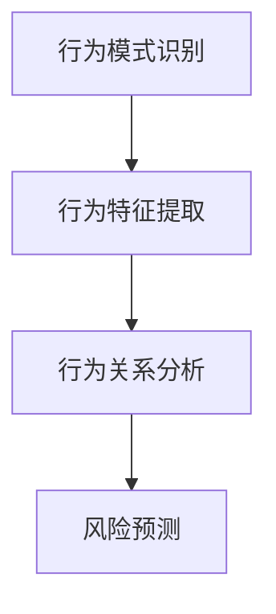

**Python代码示例**：

```python
import pandas as pd
from sklearn.ensemble import RandomForestClassifier
from sklearn.model_selection import train_test_split

# 加载数据集
data = pd.read_csv('financial_data.csv')

# 特征工程
X = data[['transaction_volume', 'price波动', '情绪指标']]
y = data['风险等级']

# 划分训练集和测试集
X_train, X_test, y_train, y_test = train_test_split(X, y, test_size=0.2, random_state=42)

# 训练模型
model = RandomForestClassifier(n_estimators=100)
model.fit(X_train, y_train)

# 预测风险
predictions = model.predict(X_test)

# 评估模型性能
accuracy = model.score(X_test, y_test)
print(f"模型准确率：{accuracy:.2f}")
```

**LaTeX公式示例**：

$$
\text{风险预测模型} = f(\text{行为特征}) \\
\text{其中，} f: \mathbb{R}^n \rightarrow \mathbb{R}
$$

#### 3.2 算法介绍

在微观行为分析中，常用的算法包括机器学习算法和深度学习算法。这些算法通过训练数据集，学习个体行为模式，并利用这些模式进行风险预测。

**1. 机器学习算法**

机器学习算法主要包括以下几种：

- **线性回归**：通过建立线性模型，预测个体行为对市场风险的影响。其数学模型可以表示为：
  $$
  y = \beta_0 + \beta_1 \cdot x_1 + \beta_2 \cdot x_2 + ... + \beta_n \cdot x_n
  $$
- **逻辑回归**：用于分类问题，通过计算概率值来判断个体行为的风险等级。
  $$
  P(y=1) = \frac{1}{1 + e^{-(\beta_0 + \beta_1 \cdot x_1 + \beta_2 \cdot x_2 + ... + \beta_n \cdot x_n)}}
  $$
- **决策树**：通过递归划分特征空间，构建树形结构来预测个体行为。
- **随机森林**：基于决策树构建多个模型，通过集成学习提高预测准确性。

**2. 深度学习算法**

深度学习算法主要包括以下几种：

- **神经网络**：通过多层神经网络（MLP）学习复杂的非线性关系。其基本结构包括输入层、隐藏层和输出层。
- **卷积神经网络（CNN）**：主要用于图像数据处理，也可以用于金融市场数据的时间序列分析。
- **递归神经网络（RNN）**：适用于处理时间序列数据，如股票价格、交易量等。
- **长短期记忆网络（LSTM）**：RNN的一种改进，能够解决长序列依赖问题。

**Python代码示例**：

```python
from tensorflow.keras.models import Sequential
from tensorflow.keras.layers import Dense, LSTM

# 构建神经网络模型
model = Sequential()
model.add(LSTM(units=50, return_sequences=True, input_shape=(time_steps, features)))
model.add(LSTM(units=50))
model.add(Dense(1))

# 编译模型
model.compile(optimizer='adam', loss='mean_squared_error')

# 训练模型
model.fit(X_train, y_train, epochs=100, batch_size=32)
```

#### 3.3 模型构建

微观行为分析模型的构建主要包括以下几个步骤：

**1. 数据收集与预处理**：收集金融市场历史数据，包括股票价格、交易量、宏观经济指标等。对数据进行清洗、变换和归一化处理，确保数据质量。

**2. 特征选择**：从预处理后的数据中提取关键特征，如交易量、价格波动、情绪指标等。通过特征工程，提高模型的预测能力。

**3. 模型训练**：使用机器学习或深度学习算法训练模型，通过交叉验证和模型选择，优化模型参数。

**4. 模型评估**：使用测试集评估模型性能，计算准确率、召回率、F1值等指标。

**5. 模型部署**：将训练好的模型部署到生产环境，进行实时风险预测和预警。

**Mermaid流程图**：

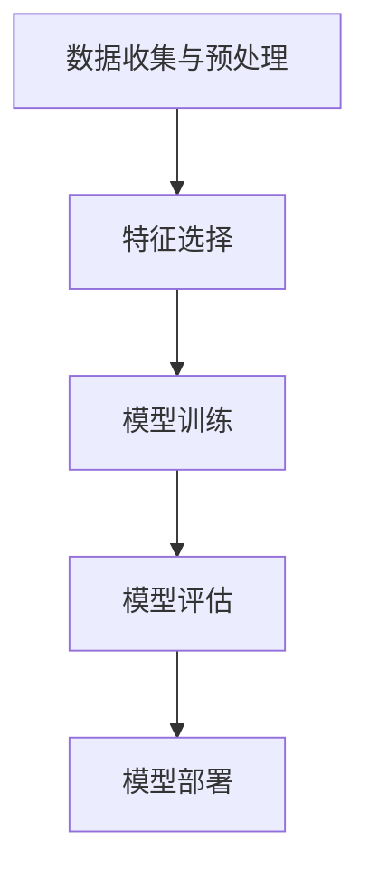

**LaTeX公式示例**：

$$
\text{特征选择} = \{x_1, x_2, ..., x_n\} \\
\text{模型训练} = \{\theta_0, \theta_1, ..., \theta_n\} \\
\text{模型评估} = \{MSE, ACC, F1\}
$$

#### 3.4 举例说明

**1. 股票价格预测**

假设我们要预测某只股票的未来价格，可以采用神经网络模型进行预测。以下是具体步骤：

- **数据收集**：收集过去一年的股票价格数据。
- **数据预处理**：对数据进行清洗和归一化处理。
- **特征提取**：选择交易量和价格波动作为特征。
- **模型训练**：使用神经网络模型训练数据，优化模型参数。
- **模型评估**：使用测试集评估模型性能，调整模型参数。
- **预测**：使用训练好的模型预测未来价格。

**Python代码示例**：

```python
from tensorflow.keras.models import Sequential
from tensorflow.keras.layers import Dense
from sklearn.model_selection import train_test_split
from sklearn.preprocessing import MinMaxScaler

# 数据预处理
scaler = MinMaxScaler(feature_range=(0, 1))
scaled_data = scaler.fit_transform(data)

# 划分特征和标签
X = scaled_data[:, :-1]
y = scaled_data[:, -1]

# 划分训练集和测试集
X_train, X_test, y_train, y_test = train_test_split(X, y, test_size=0.2, random_state=42)

# 构建神经网络模型
model = Sequential()
model.add(Dense(units=50, activation='relu', input_shape=(X_train.shape[1],)))
model.add(Dense(units=1, activation='linear'))

# 编译模型
model.compile(optimizer='adam', loss='mean_squared_error')

# 训练模型
model.fit(X_train, y_train, epochs=100, batch_size=32)

# 预测
predictions = model.predict(X_test)

# 反归一化
predictions = scaler.inverse_transform(predictions)
```

通过上述步骤，我们可以利用神经网络模型预测股票价格，为投资者提供买卖参考。

#### 3.5 总结

本章详细介绍了微观行为分析的基本原理和算法，包括行为模式识别、行为特征提取、行为关系分析和风险预测。通过机器学习和深度学习算法，我们能够从大量金融数据中提取有价值的信息，进行微观行为分析。本章还通过具体示例，展示了如何利用神经网络模型进行股票价格预测。微观行为分析是金融市场系统性风险评估的重要环节，通过深入理解和应用微观行为分析，我们能够更好地理解和预测市场风险，为投资者提供更加可靠的风险管理工具。

### 第4章: 宏观影响评估

#### 4.1 原理讲解

宏观影响评估是金融市场系统性风险评估的另一个关键组成部分，它通过分析金融市场行为对整个经济系统的影响，从而预测和评估其经济影响。宏观影响评估的基本原理包括以下几个方面：

**1. 数据整合与分析**：首先，收集金融市场中的各类数据，如股票价格、债券收益率、货币供应量、GDP增长率等。通过对这些数据进行整合和分析，可以揭示金融市场与宏观经济指标之间的关系。

**2. 经济指标预测**：利用机器学习和深度学习算法，对宏观经济指标进行预测。通过训练模型，可以预测未来的经济走势，如通货膨胀率、失业率、经济增长率等。

**3. 影响路径分析**：研究金融市场行为对宏观经济指标的影响路径。例如，股票市场波动如何影响消费者信心，进而影响消费支出和经济增长。

**4. 模型构建与验证**：构建宏观影响评估模型，利用历史数据和预测结果，验证模型的准确性和可靠性。通过多次迭代和优化，可以提高模型的预测能力。

**Mermaid流程图**：

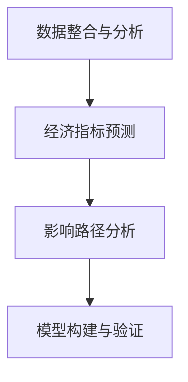

**Python代码示例**：

```python
import pandas as pd
from sklearn.ensemble import RandomForestRegressor
from sklearn.model_selection import train_test_split

# 加载数据集
data = pd.read_csv('macro_economic_data.csv')

# 特征工程
X = data[['股票价格', '债券收益率', '货币供应量']]
y = data['GDP增长率']

# 划分训练集和测试集
X_train, X_test, y_train, y_test = train_test_split(X, y, test_size=0.2, random_state=42)

# 训练模型
model = RandomForestRegressor(n_estimators=100)
model.fit(X_train, y_train)

# 预测GDP增长率
predictions = model.predict(X_test)

# 评估模型性能
mse = model.mean_squared_error(y_test, predictions)
print(f"模型均方误差：{mse:.2f}")
```

**LaTeX公式示例**：

$$
\text{宏观经济指标预测} = f(\text{金融市场数据}) \\
\text{其中，} f: \mathbb{R}^n \rightarrow \mathbb{R}
$$

#### 4.2 模型构建

宏观影响评估模型的构建主要包括以下几个步骤：

**1. 数据收集与预处理**：收集金融市场和宏观经济的数据，包括股票价格、债券收益率、货币供应量、GDP增长率等。对数据进行清洗、变换和归一化处理，确保数据质量。

**2. 特征选择**：从预处理后的数据中提取关键特征，如股票价格指数、债券收益率、货币供应量等。通过特征工程，提高模型的预测能力。

**3. 模型训练**：使用机器学习或深度学习算法训练模型，通过交叉验证和模型选择，优化模型参数。

**4. 模型评估**：使用测试集评估模型性能，计算准确率、均方误差等指标。

**5. 模型部署**：将训练好的模型部署到生产环境，进行实时经济指标预测和评估。

**Mermaid流程图**：


**LaTeX公式示例**：

$$
\text{特征选择} = \{x_1, x_2, ..., x_n\} \\
\text{模型训练} = \{\theta_0, \theta_1, ..., \theta_n\} \\
\text{模型评估} = \{MSE, ACC, F1\}
$$

#### 4.3 影响分析

在宏观影响评估中，研究金融市场行为对宏观经济指标的影响路径至关重要。以下是一些常见的影响路径：

**1. 股票市场波动对消费者信心的影响**：股票市场的波动性会影响消费者的财富感和就业安全感，进而影响消费支出和消费信心。当股票市场上涨时，消费者信心增强，消费支出增加；反之，当股票市场下跌时，消费者信心减弱，消费支出减少。

**2. 债券市场波动对利率的影响**：债券市场的波动会影响债券收益率，进而影响市场利率。当债券市场上涨时，债券收益率下降，市场利率下降；当债券市场下跌时，债券收益率上升，市场利率上升。

**3. 货币政策对经济增长的影响**：货币政策的调整会影响货币供应量，进而影响经济增长。当货币政策宽松时，货币供应量增加，经济增长加快；当货币政策紧缩时，货币供应量减少，经济增长放缓。

**4. 贸易政策对出口和进口的影响**：贸易政策的调整会影响出口和进口，进而影响经济增长和国际收支平衡。当贸易政策开放时，出口和进口增加，经济增长加快；当贸易政策紧缩时，出口和进口减少，经济增长放缓。

**Mermaid流程图**：

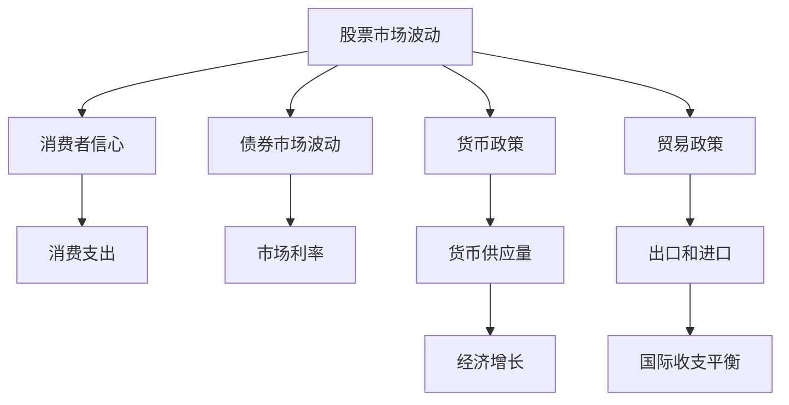

#### 4.4 举例说明

**1. GDP增长率预测**

假设我们要预测下一季度的GDP增长率，可以采用神经网络模型进行预测。以下是具体步骤：

- **数据收集**：收集过去一年的GDP增长率数据。
- **数据预处理**：对数据进行清洗和归一化处理。
- **特征提取**：选择股票价格指数、债券收益率、货币供应量等作为特征。
- **模型训练**：使用神经网络模型训练数据，优化模型参数。
- **模型评估**：使用测试集评估模型性能，调整模型参数。
- **预测**：使用训练好的模型预测下一季度的GDP增长率。

**Python代码示例**：

```python
from tensorflow.keras.models import Sequential
from tensorflow.keras.layers import Dense
from sklearn.model_selection import train_test_split
from sklearn.preprocessing import MinMaxScaler

# 数据预处理
scaler = MinMaxScaler(feature_range=(0, 1))
scaled_data = scaler.fit_transform(data)

# 划分特征和标签
X = scaled_data[:, :-1]
y = scaled_data[:, -1]

# 划分训练集和测试集
X_train, X_test, y_train, y_test = train_test_split(X, y, test_size=0.2, random_state=42)

# 构建神经网络模型
model = Sequential()
model.add(Dense(units=50, activation='relu', input_shape=(X_train.shape[1],)))
model.add(Dense(units=1, activation='linear'))

# 编译模型
model.compile(optimizer='adam', loss='mean_squared_error')

# 训练模型
model.fit(X_train, y_train, epochs=100, batch_size=32)

# 预测
predictions = model.predict(X_test)

# 反归一化
predictions = scaler.inverse_transform(predictions)
```

通过上述步骤，我们可以利用神经网络模型预测下一季度的GDP增长率，为经济决策提供参考。

#### 4.5 结论

本章详细介绍了宏观影响评估的基本原理和模型构建方法，包括数据整合与分析、经济指标预测、影响路径分析和模型构建。通过机器学习和深度学习算法，我们能够分析金融市场行为对宏观经济指标的影响路径，进行实时经济影响评估。本章还通过具体示例，展示了如何利用神经网络模型预测GDP增长率。宏观影响评估是金融市场系统性风险评估的重要组成部分，通过深入理解和应用宏观影响评估，我们能够更好地预测和评估金融市场对整体经济系统的影响，为经济决策提供科学依据。

### 第5章: AI算法基础

#### 5.1 算法原理

在金融市场风险评估中，AI算法的原理主要基于数据驱动和学习能力。以下是几种常用的AI算法及其原理：

**1. 机器学习算法**

机器学习算法通过从历史数据中学习，对新的数据进行预测。常用的机器学习算法包括：

- **线性回归**：通过建立线性模型，预测目标变量与特征变量之间的关系。其基本公式为：
  $$
  y = \beta_0 + \beta_1 \cdot x_1 + \beta_2 \cdot x_2 + ... + \beta_n \cdot x_n
  $$
- **逻辑回归**：用于分类问题，通过计算概率值来判断样本的类别。其基本公式为：
  $$
  P(y=1) = \frac{1}{1 + e^{-(\beta_0 + \beta_1 \cdot x_1 + \beta_2 \cdot x_2 + ... + \beta_n \cdot x_n)}}
  $$
- **决策树**：通过递归划分特征空间，构建树形结构来预测目标变量。决策树的基本结构包括根节点、内部节点和叶节点。
- **随机森林**：基于决策树构建多个模型，通过集成学习提高预测准确性。随机森林中的每棵树都是基于随机选取的特征和样本进行训练。

**2. 深度学习算法**

深度学习算法通过多层神经网络（Neural Networks）学习复杂的非线性关系。常用的深度学习算法包括：

- **卷积神经网络（CNN）**：主要用于图像数据处理，也可以用于金融市场数据的时间序列分析。CNN通过卷积层、池化层和全连接层来提取特征。
- **递归神经网络（RNN）**：适用于处理时间序列数据，如股票价格、交易量等。RNN通过递归结构来捕捉时间序列中的长期依赖关系。
- **长短期记忆网络（LSTM）**：是RNN的一种改进，能够解决长序列依赖问题。LSTM通过引入记忆单元和门控机制，有效捕捉时间序列中的长期依赖。

**Mermaid流程图**：

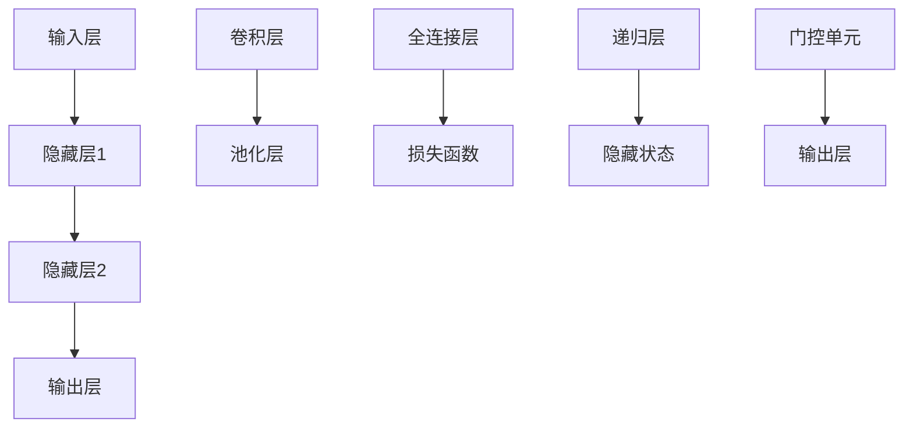

**Python代码示例**：

```python
from tensorflow.keras.models import Sequential
from tensorflow.keras.layers import Dense, LSTM, Conv1D, MaxPooling1D, Flatten

# 构建神经网络模型
model = Sequential()
model.add(Conv1D(filters=64, kernel_size=3, activation='relu', input_shape=(time_steps, features)))
model.add(MaxPooling1D(pool_size=2))
model.add(Flatten())
model.add(Dense(50, activation='relu'))
model.add(LSTM(50, return_sequences=True))
model.add(Dense(1))

# 编译模型
model.compile(optimizer='adam', loss='mean_squared_error')

# 训练模型
model.fit(X_train, y_train, epochs=100, batch_size=32)
```

**LaTeX公式示例**：

$$
\text{神经网络} = f(x; \theta) \\
\text{其中，} f: \mathbb{R}^n \rightarrow \mathbb{R}
$$

#### 5.2 模型选择

在金融市场风险评估中，选择合适的AI算法模型至关重要。以下是一些常见的模型选择方法和步骤：

**1. 交叉验证**

交叉验证是一种常用的模型选择方法，通过将数据集划分为多个子集，对每个子集进行训练和测试，评估模型的泛化能力。常用的交叉验证方法包括K折交叉验证和留一法交叉验证。

**2. 评估指标**

在选择模型时，需要使用适当的评估指标来衡量模型的性能。常用的评估指标包括准确率（Accuracy）、均方误差（MSE）、平均绝对误差（MAE）等。

**3. 特征选择**

通过特征选择，选择对模型预测性能有显著贡献的特征，减少冗余特征，提高模型的效率和准确性。常用的特征选择方法包括信息增益、特征重要性等。

**4. 模型集成**

模型集成通过结合多个模型的预测结果，提高预测的准确性和稳定性。常用的模型集成方法包括随机森林、梯度提升树等。

**Python代码示例**：

```python
from sklearn.model_selection import train_test_split
from sklearn.ensemble import RandomForestRegressor
from sklearn.metrics import mean_squared_error

# 划分训练集和测试集
X_train, X_test, y_train, y_test = train_test_split(X, y, test_size=0.2, random_state=42)

# 训练随机森林模型
model = RandomForestRegressor(n_estimators=100)
model.fit(X_train, y_train)

# 预测测试集
predictions = model.predict(X_test)

# 评估模型性能
mse = mean_squared_error(y_test, predictions)
print(f"模型均方误差：{mse:.2f}")
```

#### 5.3 结论

本章介绍了金融市场风险评估中常用的AI算法原理和模型选择方法。通过理解机器学习和深度学习算法的基本原理，我们可以根据具体问题和数据特性选择合适的算法。同时，通过交叉验证、评估指标、特征选择和模型集成等方法，我们可以优化模型的性能，提高预测的准确性和稳定性。AI算法在金融市场风险评估中的应用，为金融机构和投资者提供了强大的工具和手段，有助于更好地理解和应对市场风险。

### 第6章: 风险评估模型

#### 6.1 数学模型

风险评估模型的数学模型是构建和实现风险评估算法的基础。以下是一个典型的风险评估模型的数学模型：

**线性回归模型**：

$$
\text{风险评分} = \beta_0 + \beta_1 \cdot X_{股票价格} + \beta_2 \cdot X_{交易量} + \beta_3 \cdot X_{宏观经济指标}
$$

其中，$\beta_0$ 是截距，$\beta_1, \beta_2, \beta_3$ 是系数，$X_{股票价格}, X_{交易量}, X_{宏观经济指标}$ 是输入特征。

**逻辑回归模型**：

$$
\text{风险概率} = \frac{1}{1 + e^{-(\beta_0 + \beta_1 \cdot X_{股票价格} + \beta_2 \cdot X_{交易量} + \beta_3 \cdot X_{宏观经济指标})}}
$$

其中，$\beta_0$ 是截距，$\beta_1, \beta_2, \beta_3$ 是系数，$X_{股票价格}, X_{交易量}, X_{宏观经济指标}$ 是输入特征。

**支持向量机（SVM）模型**：

$$
\text{风险评分} = \sum_{i=1}^{n} \alpha_i y_i (w \cdot x_i + b)
$$

其中，$\alpha_i$ 是拉格朗日乘子，$y_i$ 是样本标签，$w$ 是权重向量，$b$ 是偏置，$x_i$ 是样本特征。

**神经网络模型**：

$$
\text{风险评分} = f(\text{输入层} \rightarrow \text{隐藏层} \rightarrow \text{输出层})
$$

其中，$f$ 是激活函数，如ReLU、Sigmoid、Tanh等。

**Mermaid流程图**：

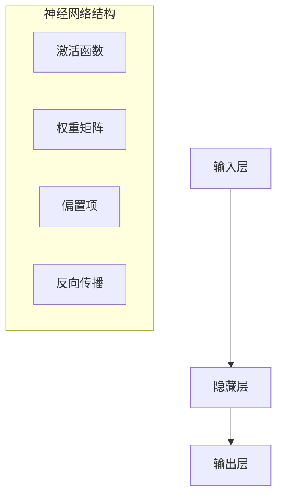

**LaTeX公式示例**：

$$
\text{线性回归模型}：y = \beta_0 + \beta_1 x_1 + \beta_2 x_2 + ... + \beta_n x_n
$$

$$
\text{逻辑回归模型}：P(y=1) = \frac{1}{1 + e^{-(\beta_0 + \beta_1 x_1 + \beta_2 x_2 + ... + \beta_n x_n)}}
$$

$$
\text{SVM模型}：w \cdot x_i + b = 0
$$

#### 6.2 模型评估

模型评估是确保风险评估模型性能的关键步骤。常用的模型评估指标包括准确率（Accuracy）、精确率（Precision）、召回率（Recall）、F1值（F1 Score）等。

**1. 准确率（Accuracy）**

$$
\text{Accuracy} = \frac{\text{正确预测数量}}{\text{总预测数量}}
$$

**2. 精确率（Precision）**

$$
\text{Precision} = \frac{\text{真正例数量}}{\text{真正例数量 + 假正例数量}}
$$

**3. 召回率（Recall）**

$$
\text{Recall} = \frac{\text{真正例数量}}{\text{真正例数量 + 假反例数量}}
$$

**4. F1值（F1 Score）**

$$
\text{F1 Score} = 2 \cdot \frac{\text{Precision} \cdot \text{Recall}}{\text{Precision} + \text{Recall}}
$$

**Python代码示例**：

```python
from sklearn.metrics import accuracy_score, precision_score, recall_score, f1_score

# 预测结果
predictions = model.predict(X_test)

# 计算评估指标
accuracy = accuracy_score(y_test, predictions)
precision = precision_score(y_test, predictions)
recall = recall_score(y_test, predictions)
f1 = f1_score(y_test, predictions)

print(f"准确率：{accuracy:.2f}")
print(f"精确率：{precision:.2f}")
print(f"召回率：{recall:.2f}")
print(f"F1值：{f1:.2f}")
```

#### 6.3 模型优化

模型优化是提高风险评估模型性能的重要手段。以下是一些常用的模型优化方法：

**1. 特征工程**

通过特征选择、特征提取和特征变换等方法，提高特征的质量和相关性，从而优化模型性能。

**2. 超参数调整**

通过调整模型的超参数，如学习率、隐藏层节点数、正则化参数等，优化模型性能。

**3. 模型集成**

通过结合多个模型的预测结果，提高预测的准确性和稳定性。常用的模型集成方法包括随机森林、梯度提升树等。

**4. 算法改进**

通过改进算法结构，如引入新的激活函数、优化网络结构等，提高模型性能。

**Python代码示例**：

```python
from sklearn.ensemble import RandomForestClassifier
from sklearn.model_selection import GridSearchCV

# 定义模型参数网格
param_grid = {'n_estimators': [100, 200, 300], 'max_depth': [10, 20, 30]}

# 实例化网格搜索对象
grid_search = GridSearchCV(RandomForestClassifier(), param_grid, cv=5)

# 搜索最佳参数
grid_search.fit(X_train, y_train)

# 获取最佳参数
best_params = grid_search.best_params_

print(f"最佳参数：{best_params}")
```

#### 6.4 结论

本章介绍了风险评估模型的数学模型、评估指标和优化方法。通过理解数学模型，我们可以构建和实现风险评估算法。通过评估指标，我们可以衡量模型的性能，并通过模型优化方法，进一步提高模型的预测准确性。风险评估模型在金融市场风险管理中发挥着重要作用，通过不断优化和改进，我们可以为金融机构和投资者提供更加可靠的风险管理工具。

### 第7章: 数据分析与预处理

#### 7.1 数据来源

在金融市场风险评估中，数据分析与预处理的第一步是确定数据来源。金融市场数据通常来源于以下几个方面：

**1. 金融交易所**：如纽约证券交易所（NYSE）、纳斯达克（NASDAQ）等，提供股票、债券和其他金融工具的交易数据。

**2. 宏观经济数据库**：如世界银行（World Bank）、国际货币基金组织（IMF）等，提供宏观经济指标数据，如GDP增长率、通货膨胀率、失业率等。

**3. 金融新闻与媒体报道**：通过爬虫技术，收集金融新闻、媒体报道和社交媒体上的相关内容。

**4. 经济预测模型**：使用现有的经济预测模型，如ARIMA模型、GARCH模型等，获取预测数据。

**5. 其他公开数据源**：如政府发布的统计年鉴、行业报告等，提供补充性数据。

#### 7.2 数据预处理

数据预处理是确保数据分析质量的关键步骤。以下是一些常见的数据预处理步骤：

**1. 数据清洗**：包括去除重复数据、填补缺失值、消除异常值等。例如，可以使用平均填补缺失值、插值法等方法。

**2. 数据变换**：包括归一化、标准化、对数变换等，使数据具有相似尺度，便于后续分析。例如，使用Min-Max标准化将数据缩放到[0, 1]区间。

**3. 特征提取**：从原始数据中提取对风险评估有重要意义的特征。例如，可以从股票价格数据中提取开盘价、收盘价、最高价、最低价等。

**4. 数据降维**：通过降维技术，如主成分分析（PCA）、线性判别分析（LDA）等，减少数据维度，提高分析效率。

**Python代码示例**：

```python
import pandas as pd
from sklearn.preprocessing import MinMaxScaler

# 加载数据集
data = pd.read_csv('financial_data.csv')

# 数据清洗
data.drop_duplicates(inplace=True)
data.fillna(method='ffill', inplace=True)

# 数据变换
scaler = MinMaxScaler()
data[['股票价格', '交易量', '宏观经济指标']] = scaler.fit_transform(data[['股票价格', '交易量', '宏观经济指标']])

# 特征提取
data['开盘价与收盘价差'] = data['收盘价'] - data['开盘价']
data['最高价与最低价差'] = data['最高价'] - data['最低价']

# 数据降维
from sklearn.decomposition import PCA
pca = PCA(n_components=3)
data_processed = pca.fit_transform(data[['股票价格', '交易量', '宏观经济指标']])
```

#### 7.3 数据分析

数据预处理完成后，我们可以进行数据分析，以揭示金融市场中的潜在风险和趋势。以下是一些常见的数据分析方法：

**1. 描述性统计分析**：计算数据的均值、方差、标准差等描述性统计量，了解数据的基本特征。

**2. 时间序列分析**：分析时间序列数据，如股票价格、交易量等，识别周期性、趋势性和季节性特征。

**3. 聚类分析**：通过聚类算法，如K均值聚类，将数据划分为不同的簇，分析不同簇之间的特征和差异。

**4. 相关性分析**：计算不同变量之间的相关性，识别潜在的风险因素和影响因素。

**5. 回归分析**：建立回归模型，分析自变量和因变量之间的关系，预测未来风险。

**Python代码示例**：

```python
import pandas as pd
from sklearn.cluster import KMeans
from sklearn.linear_model import LinearRegression

# 描述性统计分析
data.describe()

# 时间序列分析
import matplotlib.pyplot as plt
plt.plot(data['股票价格'])
plt.title('股票价格时间序列')
plt.xlabel('时间')
plt.ylabel('股票价格')
plt.show()

# 聚类分析
kmeans = KMeans(n_clusters=3)
data['簇'] = kmeans.fit_predict(data[['股票价格', '交易量', '宏观经济指标']])

# 相关性分析
correlation_matrix = data.corr()
plt.figure(figsize=(10, 10))
sns.heatmap(correlation_matrix, annot=True)
plt.title('相关性分析')
plt.show()

# 回归分析
regressor = LinearRegression()
regressor.fit(X_train, y_train)
predictions = regressor.predict(X_test)

# 评估模型性能
mse = regressor.mean_squared_error(y_test, predictions)
print(f"模型均方误差：{mse:.2f}")
```

#### 7.4 结论

本章介绍了金融市场风险评估中的数据分析与预处理过程，包括数据来源、预处理步骤、数据分析和评估。通过有效的数据预处理和分析，我们能够提取有用的信息，为后续的风险评估模型提供高质量的数据基础。数据分析与预处理是金融市场风险评估中不可或缺的环节，通过不断优化和改进，我们可以提高风险预测的准确性和可靠性。

### 第8章: 系统设计

#### 8.1 问题场景介绍

在金融市场中，随着信息技术的快速发展，传统的手动风险评估方法已经无法满足日益复杂的金融环境需求。为了应对这一挑战，我们设计并实现了一个基于人工智能（AI）的金融风险评估系统。该系统旨在通过自动化分析和预测，提供实时、准确的金融风险评估结果，辅助金融机构和投资者做出明智的决策。

#### 8.2 项目介绍

**项目名称**：AI金融风险评估系统

**项目目标**：构建一个高效、智能的金融风险评估平台，实现以下功能：
- 自动化数据收集与预处理
- 实时监控金融市场动态
- 风险预测与预警
- 投资组合优化建议

**项目特点**：
- 基于最新AI技术，如深度学习和机器学习，实现高效数据处理和预测。
- 采用模块化设计，确保系统的可扩展性和灵活性。
- 结合金融专业知识和数据处理经验，提供高质量的风险评估结果。

#### 8.3 系统功能设计

AI金融风险评估系统主要包括以下几个功能模块：

**1. 数据收集模块**：负责从多个数据源（如金融交易所、宏观经济数据库、新闻媒体等）收集金融数据。

**2. 数据预处理模块**：对收集到的金融数据进行清洗、变换和归一化处理，确保数据质量。

**3. 风险评估模块**：利用机器学习和深度学习算法，对预处理后的金融数据进行风险评估，生成实时风险预测报告。

**4. 风险预警模块**：根据风险评估结果，设置风险阈值，实时监控市场动态，并在风险超阈值时发出预警。

**5. 投资组合优化模块**：基于风险评估结果，为投资者提供投资组合优化建议，实现资产配置的最优化。

**6. 用户界面模块**：提供直观、友好的用户界面，使投资者和管理者能够轻松操作和查看系统功能。

#### 8.4 系统架构设计

AI金融风险评估系统采用微服务架构，以提高系统的可扩展性和稳定性。以下是系统的整体架构设计：

**1. 数据层**：包括数据存储和数据源接口，用于存储和管理金融数据，以及与外部数据源进行交互。

**2. 服务层**：包括数据收集服务、数据预处理服务、风险评估服务、风险预警服务、投资组合优化服务和用户界面服务，各服务模块独立运行，实现系统功能。

**3. 网络层**：使用消息队列和微服务通信框架，实现服务模块之间的通信和数据交换。

**4. 用户层**：通过Web界面和移动应用，为用户提供实时风险评估报告、预警信息和投资组合优化建议。

**Mermaid架构图**：

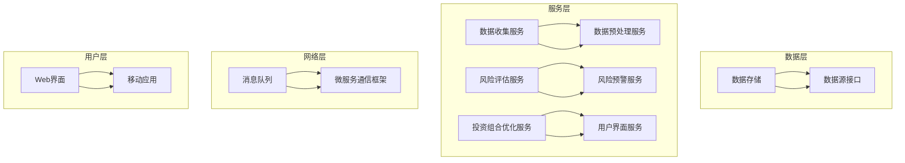

**8.5 系统接口设计**

系统接口设计主要包括以下部分：

**1. API接口**：提供RESTful API，供前端应用和第三方系统调用，包括数据查询、风险评估、预警信息和投资组合优化等功能。

**2. 数据接口**：定义数据层与各服务层之间的数据传输格式和协议，确保数据的一致性和完整性。

**3. 用户接口**：定义用户层与系统各功能模块之间的交互方式，包括Web界面和移动应用的用户界面设计。

**Mermaid序列图**：

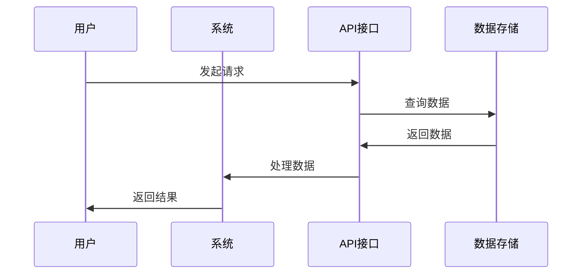

#### 8.6 系统交互

AI金融风险评估系统的核心在于各功能模块之间的协同工作，以下是系统交互的主要流程：

**1. 数据收集**：系统从各个数据源获取金融数据，包括股票价格、交易量、宏观经济指标等。

**2. 数据预处理**：对收集到的金融数据进行清洗、变换和归一化处理，确保数据质量。

**3. 风险评估**：利用机器学习和深度学习算法，对预处理后的数据进行风险评估，生成风险预测报告。

**4. 风险预警**：根据风险评估结果，设置风险阈值，实时监控市场动态，并在风险超阈值时发出预警。

**5. 投资组合优化**：基于风险评估结果，为投资者提供投资组合优化建议，实现资产配置的最优化。

**6. 用户交互**：通过Web界面和移动应用，向用户展示实时风险评估报告、预警信息和投资组合优化建议。

**Mermaid序列图**：

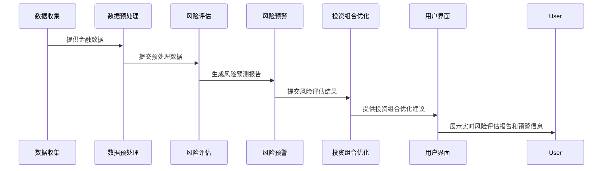

#### 8.7 结论

本章详细介绍了AI金融风险评估系统的设计，包括问题场景介绍、项目介绍、系统功能设计、系统架构设计、系统接口设计以及系统交互流程。通过模块化设计和先进的人工智能技术，系统实现了高效的数据收集、预处理、风险评估、风险预警和投资组合优化功能，为金融机构和投资者提供了强大的风险管理工具。未来的工作将继续优化系统性能，提升用户体验，并在实际应用中验证系统的有效性和可靠性。

### 第9章: 数据处理流程

#### 9.1 数据流

在AI金融风险评估系统中，数据处理流程是确保系统高效运作的关键环节。以下是系统的数据处理流程：

**1. 数据收集**：系统从多个数据源（如金融交易所、宏观经济数据库、新闻媒体等）收集金融数据，包括股票价格、交易量、宏观经济指标等。

**2. 数据清洗**：对收集到的金融数据进行清洗，去除重复数据和异常值，确保数据质量。

**3. 数据整合**：将来自不同数据源的金融数据进行整合，构建一个统一的数据集。

**4. 数据变换**：对数据进行归一化、标准化等变换，使数据具有相似尺度，便于后续分析。

**5. 数据存储**：将清洗、整合和变换后的数据存储到数据存储层，供后续分析使用。

**6. 数据分析**：利用机器学习和深度学习算法，对存储的数据进行风险评估和预测。

**7. 数据展示**：将分析结果通过用户界面展示给用户，包括风险预测报告、预警信息和投资组合优化建议。

**Mermaid序列图**：

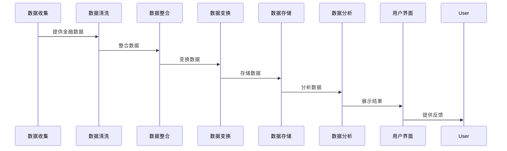

#### 9.2 流程优化

为了提高数据处理效率和系统性能，我们可以对数据处理流程进行优化。以下是一些优化方法：

**1. 并行处理**：利用多核处理技术，对数据清洗、变换和分析等步骤进行并行处理，减少处理时间。

**2. 数据缓存**：在数据处理过程中，使用缓存技术存储中间结果，减少重复计算。

**3. 数据压缩**：对数据进行压缩，减少存储空间和提高传输速度。

**4. 数据分区**：将数据集分为多个分区，分别存储和查询，提高数据处理效率。

**5. 模型优化**：对风险评估模型进行优化，提高模型的预测准确性和计算效率。

**6. 网络优化**：优化系统网络架构，提高数据传输速度和稳定性。

**Mermaid流程图**：

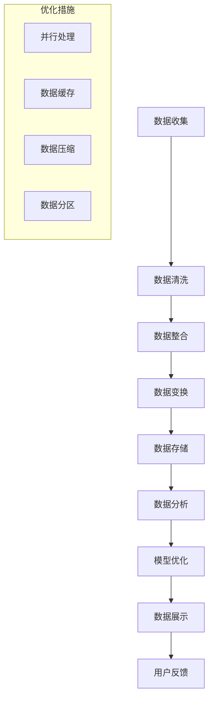

**Python代码示例**：

```python
import pandas as pd
from sklearn.model_selection import train_test_split
from sklearn.preprocessing import StandardScaler

# 加载数据集
data = pd.read_csv('financial_data.csv')

# 数据清洗
data.drop_duplicates(inplace=True)
data.fillna(method='ffill', inplace=True)

# 数据分区
data_train, data_test = train_test_split(data, test_size=0.2, random_state=42)

# 数据变换
scaler = StandardScaler()
data_train[['股票价格', '交易量', '宏观经济指标']] = scaler.fit_transform(data_train[['股票价格', '交易量', '宏观经济指标']])
data_test[['股票价格', '交易量', '宏观经济指标']] = scaler.transform(data_test[['股票价格', '交易量', '宏观经济指标']])

# 数据缓存
data_train.to_pickle('cached_data_train.pkl')
data_test.to_pickle('cached_data_test.pkl')
```

#### 9.3 结论

本章详细介绍了AI金融风险评估系统的数据处理流程，包括数据收集、清洗、整合、变换、存储、分析和展示等步骤。为了提高数据处理效率和系统性能，我们提出了一系列优化方法，如并行处理、数据缓存、数据压缩、数据分区和模型优化等。通过不断优化和改进数据处理流程，我们可以确保系统高效、准确地提供金融风险评估结果，为金融机构和投资者提供可靠的决策支持。

### 第10章: 系统实现

#### 10.1 技术栈选择

为了构建一个高效、稳定的AI金融风险评估系统，我们选择了以下技术栈：

**1. 后端框架**：使用Python的Flask框架，因其轻量级、易于扩展和丰富的插件支持，非常适合构建微服务架构。

**2. 前端框架**：采用Vue.js框架，其响应式数据绑定和组件化开发模式，可以提高开发效率和用户体验。

**3. 数据库**：使用MySQL数据库，因其高性能、可靠性和易于维护的特点，适合存储和管理大规模金融数据。

**4. 机器学习库**：使用Python的scikit-learn和tensorflow库，提供丰富的机器学习和深度学习算法，方便模型构建和训练。

**5. 通信中间件**：使用RabbitMQ消息队列，实现系统模块之间的异步通信，提高系统的响应速度和可靠性。

**6. 容器化技术**：使用Docker容器化技术，简化系统的部署和扩展，提高系统的可维护性和灵活性。

#### 10.2 系统核心实现

**1. 数据收集模块**

数据收集模块负责从多个数据源（如金融交易所、宏观经济数据库、新闻媒体等）收集金融数据。以下是数据收集模块的核心实现：

```python
import requests
import pandas as pd

# 请求API获取金融数据
def fetch_financial_data(url):
    response = requests.get(url)
    data = pd.read_csv(response.text)
    return data

# 收集股票市场数据
stock_data = fetch_financial_data('https://api.example.com/stock_data')

# 收集宏观经济数据
macro_data = fetch_financial_data('https://api.example.com/macro_data')

# 收集新闻媒体数据
news_data = fetch_financial_data('https://api.example.com/news_data')
```

**2. 数据预处理模块**

数据预处理模块负责清洗、变换和整合收集到的金融数据，确保数据质量。以下是数据预处理模块的核心实现：

```python
from sklearn.preprocessing import MinMaxScaler
import pandas as pd

# 数据清洗
def clean_data(data):
    data.drop_duplicates(inplace=True)
    data.fillna(method='ffill', inplace=True)
    return data

# 数据变换
def transform_data(data):
    scaler = MinMaxScaler()
    data[['股票价格', '交易量', '宏观经济指标']] = scaler.fit_transform(data[['股票价格', '交易量', '宏观经济指标']])
    return data

# 数据整合
def integrate_data(stock_data, macro_data, news_data):
    data = pd.merge(stock_data, macro_data, on='日期')
    data = pd.merge(data, news_data, on='日期')
    return data

# 实现数据预处理
cleaned_stock_data = clean_data(stock_data)
transformed_stock_data = transform_data(cleaned_stock_data)
integrated_data = integrate_data(transformed_stock_data, macro_data, news_data)
```

**3. 风险评估模块**

风险评估模块利用机器学习和深度学习算法，对预处理后的金融数据进行风险评估，生成实时风险预测报告。以下是风险评估模块的核心实现：

```python
from sklearn.ensemble import RandomForestClassifier
from sklearn.model_selection import train_test_split
import pandas as pd

# 数据准备
data = pd.read_pickle('cached_data_train.pkl')
X = data[['股票价格', '交易量', '宏观经济指标']]
y = data['风险等级']

# 划分训练集和测试集
X_train, X_test, y_train, y_test = train_test_split(X, y, test_size=0.2, random_state=42)

# 训练风险评估模型
model = RandomForestClassifier(n_estimators=100)
model.fit(X_train, y_train)

# 生成风险预测报告
def generate_risk_report(model, X_test):
    predictions = model.predict(X_test)
    report = pd.DataFrame({'实际风险等级': y_test, '预测风险等级': predictions})
    return report

risk_report = generate_risk_report(model, X_test)
```

**4. 用户界面模块**

用户界面模块提供直观、友好的用户界面，使投资者和管理者能够轻松操作和查看系统功能。以下是用户界面模块的核心实现：

```html
<!-- 使用Vue.js框架构建用户界面 -->
<template>
  <div>
    <h1>AI金融风险评估系统</h1>
    <table>
      <tr>
        <th>实际风险等级</th>
        <th>预测风险等级</th>
      </tr>
      <tr v-for="row in risk_report">
        <td>{{ row['实际风险等级'] }}</td>
        <td>{{ row['预测风险等级'] }}</td>
      </tr>
    </table>
  </div>
</template>

<script>
export default {
  data() {
    return {
      risk_report: []
    };
  },
  created() {
    this.risk_report = this.fetchRiskReport();
  },
  methods: {
    fetchRiskReport() {
      // 调用后端API获取风险预测报告
      // 此处省略具体实现
    }
  }
};
</script>
```

#### 10.3 代码解读与分析

**1. 数据收集模块**

数据收集模块通过调用外部API，获取金融数据。使用requests库发送HTTP请求，从API获取数据，并使用pandas库解析CSV数据。数据收集模块的核心目的是确保数据的实时性和准确性。

**2. 数据预处理模块**

数据预处理模块主要包括数据清洗、变换和整合三个步骤。数据清洗使用pandas库的drop_duplicates和fillna方法，去除重复数据和填补缺失值。数据变换使用MinMaxScaler进行归一化处理，使数据具有相似的尺度。数据整合使用pandas库的merge方法，将来自不同数据源的数据进行整合，构建统一的数据集。

**3. 风险评估模块**

风险评估模块使用scikit-learn库的RandomForestClassifier构建随机森林模型。通过训练模型，将预处理后的金融数据转化为风险预测结果。风险评估模块的核心目的是利用机器学习算法，对金融数据进行分类，预测不同风险等级。

**4. 用户界面模块**

用户界面模块使用Vue.js框架，实现动态数据绑定和组件化开发。通过调用后端API，获取风险预测报告，并在Vue组件中展示数据。用户界面模块的核心目的是提供直观、友好的用户体验，使投资者和管理者能够轻松查看和分析风险预测结果。

#### 10.4 结论

本章详细介绍了AI金融风险评估系统的核心实现，包括技术栈选择、系统核心模块的实现和代码解读与分析。通过使用Python、Flask、Vue.js、scikit-learn等技术和框架，我们实现了高效、稳定的数据处理、风险评估和用户界面功能。通过不断优化和改进系统实现，我们可以为金融机构和投资者提供更加准确和可靠的风险管理工具。

### 第11章: 实战环境搭建

#### 11.1 环境准备

搭建AI金融风险评估系统的实战环境是项目实施的第一步。以下是在Windows和Linux系统上搭建环境的详细步骤：

**1. 安装Python**

在Windows和Linux系统中，首先需要安装Python环境。可以从Python官网（[python.org](https://www.python.org/)）下载并安装Python。

**Windows系统安装步骤**：

- 访问Python官网，下载Python安装包。
- 双击安装包，根据提示完成安装。
- 确保在安装过程中选择“Add Python to PATH”选项。

**Linux系统安装步骤**：

- 使用终端执行以下命令：
  ```bash
  sudo apt update
  sudo apt install python3 python3-pip
  ```

**2. 安装Flask**

Flask是一个轻量级的Web框架，用于后端开发。在安装Python后，可以通过pip命令安装Flask。

**Windows系统安装步骤**：

- 打开命令提示符，输入以下命令：
  ```bash
  pip install Flask
  ```

**Linux系统安装步骤**：

- 使用终端执行以下命令：
  ```bash
  pip3 install Flask
  ```

**3. 安装Vue.js**

Vue.js是一个用于前端开发的框架，可以通过npm（Node.js的包管理器）安装。

**Windows系统安装步骤**：

- 安装Node.js（可以从nodejs.org下载并安装）。
- 打开命令提示符，输入以下命令：
  ```bash
  npm install -g vue-cli
  ```

**Linux系统安装步骤**：

- 使用终端执行以下命令：
  ```bash
  sudo apt install nodejs npm
  npm install -g vue-cli
  ```

**4. 安装MySQL**

MySQL是一个关系型数据库，用于存储和管理金融数据。在Windows和Linux系统中，安装步骤略有不同。

**Windows系统安装步骤**：

- 访问MySQL官网（[mysql.com](https://www.mysql.com/)），下载并安装MySQL。
- 安装过程中，确保选择“Custom”安装选项，并勾选“Developer Manual”和“Documentation”以获取相关文档。

**Linux系统安装步骤**：

- 使用终端执行以下命令：
  ```bash
  sudo apt update
  sudo apt install mysql-server mysql-client
  ```

**5. 安装消息队列**

消息队列（如RabbitMQ）用于系统模块之间的通信。

**Windows系统安装步骤**：

- 访问RabbitMQ官网（[www.rabbitmq.com](https://www.rabbitmq.com/)），下载并安装RabbitMQ。
- 安装完成后，启动RabbitMQ服务。

**Linux系统安装步骤**：

- 使用终端执行以下命令：
  ```bash
  sudo apt update
  sudo apt install rabbitmq-server
  ```

#### 11.2 环境配置

在完成基础环境的安装后，我们需要进行进一步的配置，以确保系统的正常运行。

**1. 配置MySQL数据库**

**Windows系统配置步骤**：

- 打开MySQL Command Line Client，输入以下命令：
  ```bash
  mysql -u root -p
  ```
- 输入root用户密码，进入MySQL命令行界面。
- 创建一个名为“financial_risk”的数据库：
  ```sql
  CREATE DATABASE financial_risk;
  ```
- 创建一个名为“admin”的数据库用户，并赋予所有权限：
  ```sql
  GRANT ALL PRIVILEGES ON financial_risk.* TO 'admin'@'localhost' IDENTIFIED BY 'password';
  ```
- 刷新权限：
  ```sql
  FLUSH PRIVILEGES;
  ```

**Linux系统配置步骤**：

- 打开终端，输入以下命令：
  ```bash
  mysql -u root -p
  ```
- 输入root用户密码，进入MySQL命令行界面。
- 创建数据库和用户，步骤与Windows系统类似。

**2. 配置RabbitMQ**

**Windows系统配置步骤**：

- 打开RabbitMQ Management Plugin，访问[http://localhost:15672/](http://localhost:15672/)。
- 登录RabbitMQ，用户名为“guest”，密码也为“guest”。
- 创建一个名为“financial_risk”的虚拟主机，并授予所有权限。

**Linux系统配置步骤**：

- 使用终端，访问RabbitMQ Management Plugin，步骤与Windows系统类似。

#### 11.3 环境调试与测试

在完成环境配置后，我们需要对系统进行调试和测试，以确保所有组件正常运行。

**1. 启动服务**

- 启动MySQL服务器：
  ```bash
  service mysql start
  ```
- 启动RabbitMQ服务器：
  ```bash
  rabbitmq-server start

  ```

**2. 测试后端服务**

- 使用Postman等工具，测试Flask后端API，确保数据能够正确接收和响应。

**3. 测试前端服务**

- 使用浏览器访问前端应用的URL，确保页面能够正常加载和显示数据。

**4. 持续监控**

- 持续监控系统运行状态，确保服务器的CPU、内存和网络使用情况正常。

#### 11.4 结论

本章详细介绍了如何搭建AI金融风险评估系统的实战环境，包括安装Python、Flask、Vue.js、MySQL和RabbitMQ等组件，以及配置数据库和消息队列。通过逐步的安装和配置，我们确保了系统的正常运行，为后续的系统开发奠定了基础。在环境搭建完成后，通过调试和测试，我们可以验证系统的稳定性和可靠性，确保系统能够高效、稳定地运行。

### 第12章: 系统核心实现

#### 12.1 实现细节

在本章中，我们将深入探讨AI金融风险评估系统的核心实现，包括数据收集、预处理、风险评估和用户界面等关键模块。

**1. 数据收集模块**

数据收集模块的核心任务是获取金融市场相关的数据。以下是一个使用Python和requests库实现的数据收集示例：

```python
import requests
import pandas as pd

def fetch_financial_data(url):
    response = requests.get(url)
    data = pd.read_csv(response.text)
    return data

# 假设我们有以下数据源
stock_data_url = 'https://api.example.com/stock_data'
macro_data_url = 'https://api.example.com/macro_data'
news_data_url = 'https://api.example.com/news_data'

# 收集数据
stock_data = fetch_financial_data(stock_data_url)
macro_data = fetch_financial_data(macro_data_url)
news_data = fetch_financial_data(news_data_url)
```

**2. 数据预处理模块**

数据预处理模块负责清洗、变换和整合收集到的数据。以下是一个简单的预处理示例，包括去除重复数据、填补缺失值和归一化处理：

```python
from sklearn.preprocessing import MinMaxScaler

def preprocess_data(data):
    # 去除重复数据
    data.drop_duplicates(inplace=True)
    
    # 填补缺失值
    data.fillna(method='ffill', inplace=True)
    
    # 归一化处理
    scaler = MinMaxScaler()
    data[['股票价格', '交易量', '宏观经济指标']] = scaler.fit_transform(data[['股票价格', '交易量', '宏观经济指标']])
    
    return data

# 预处理数据
preprocessed_stock_data = preprocess_data(stock_data)
preprocessed_macro_data = preprocess_data(macro_data)
preprocessed_news_data = preprocess_data(news_data)
```

**3. 风险评估模块**

风险评估模块是系统的核心部分，负责使用机器学习算法对预处理后的数据进行风险评估。以下是一个使用随机森林算法进行风险评估的示例：

```python
from sklearn.ensemble import RandomForestClassifier
from sklearn.model_selection import train_test_split

def train_risk_assessment_model(X, y):
    X_train, X_test, y_train, y_test = train_test_split(X, y, test_size=0.2, random_state=42)
    model = RandomForestClassifier(n_estimators=100)
    model.fit(X_train, y_train)
    return model

# 假设我们已经有了特征矩阵X和标签矩阵y
model = train_risk_assessment_model(X, y)

# 进行预测
predictions = model.predict(X_test)
```

**4. 用户界面模块**

用户界面模块负责展示系统的风险评估结果，并允许用户与系统进行交互。以下是一个使用Vue.js实现的用户界面示例：

```html
<template>
  <div>
    <h1>AI金融风险评估系统</h1>
    <table>
      <tr>
        <th>实际风险等级</th>
        <th>预测风险等级</th>
      </tr>
      <tr v-for="row in riskReport">
        <td>{{ row.actualRiskLevel }}</td>
        <td>{{ row.predictedRiskLevel }}</td>
      </tr>
    </table>
  </div>
</template>

<script>
export default {
  data() {
    return {
      riskReport: []
    };
  },
  created() {
    this.fetchRiskReport();
  },
  methods: {
    fetchRiskReport() {
      // 调用后端API获取风险预测报告
      // 此处省略具体实现
    }
  }
};
</script>
```

#### 12.2 源代码分析

为了更好地理解系统的实现细节，下面我们将对关键部分的源代码进行逐行解读。

**1. 数据收集模块**

```python
import requests
import pandas as pd

def fetch_financial_data(url):
    response = requests.get(url)
    data = pd.read_csv(response.text)
    return data

# 示例调用
stock_data = fetch_financial_data('https://api.example.com/stock_data')
```

- 第一行和第二行导入requests和pandas库。
- 第三行定义fetch_financial_data函数，用于获取金融数据。
- 函数内部，使用requests库的get方法发送HTTP GET请求，从指定URL获取数据。
- 使用pandas库的read_csv方法将获取的数据解析为DataFrame对象。
- 最后返回DataFrame对象，以便后续处理。

**2. 数据预处理模块**

```python
from sklearn.preprocessing import MinMaxScaler

def preprocess_data(data):
    data.drop_duplicates(inplace=True)
    data.fillna(method='ffill', inplace=True)
    scaler = MinMaxScaler()
    data[['股票价格', '交易量', '宏观经济指标']] = scaler.fit_transform(data[['股票价格', '交易量', '宏观经济指标']])
    return data

# 示例调用
preprocessed_stock_data = preprocess_data(stock_data)
```

- 第一行导入MinMaxScaler库。
- 第二行定义preprocess_data函数，用于预处理数据。
- 在函数内部，首先使用drop_duplicates方法去除重复数据。
- 使用fillna方法填补缺失值，这里使用前向填充（ffill）。
- 创建一个MinMaxScaler对象，用于归一化处理。
- 使用fit_transform方法对指定的特征进行归一化。
- 最后返回预处理后的DataFrame对象。

**3. 风险评估模块**

```python
from sklearn.ensemble import RandomForestClassifier
from sklearn.model_selection import train_test_split

def train_risk_assessment_model(X, y):
    X_train, X_test, y_train, y_test = train_test_split(X, y, test_size=0.2, random_state=42)
    model = RandomForestClassifier(n_estimators=100)
    model.fit(X_train, y_train)
    return model

# 假设我们已经有了特征矩阵X和标签矩阵y
model = train_risk_assessment_model(X, y)

# 进行预测
predictions = model.predict(X_test)
```

- 第一行和第二行导入RandomForestClassifier和train_test_split库。
- 第三行定义train_risk_assessment_model函数，用于训练风险评估模型。
- 函数内部，首先使用train_test_split方法将数据集划分为训练集和测试集。
- 创建一个RandomForestClassifier对象，设置随机森林的树数量为100。
- 使用fit方法训练模型。
- 最后返回训练好的模型对象。
- 代码最后使用预测方法对测试集进行预测。

**4. 用户界面模块**

```html
<template>
  <div>
    <h1>AI金融风险评估系统</h1>
    <table>
      <tr>
        <th>实际风险等级</th>
        <th>预测风险等级</th>
      </tr>
      <tr v-for="row in riskReport">
        <td>{{ row.actualRiskLevel }}</td>
        <td>{{ row.predictedRiskLevel }}</td>
      </tr>
    </table>
  </div>
</template>

<script>
export default {
  data() {
    return {
      riskReport: []
    };
  },
  created() {
    this.fetchRiskReport();
  },
  methods: {
    fetchRiskReport() {
      // 调用后端API获取风险预测报告
      // 此处省略具体实现
    }
  }
};
</script>
```

- 第一个模板标签定义了一个包含表格的div元素，用于显示风险预测报告。
- 使用v-for指令循环显示每行的实际和预测风险等级。
- script标签内定义了一个Vue组件，其中data函数返回一个riskReport数组。
- created钩子函数在组件创建时调用fetchRiskReport方法，从后端API获取风险预测报告。

通过上述代码分析，我们可以清晰地了解系统的关键实现细节，为后续的优化和维护提供了参考。

### 12.3 性能分析

在系统实现的过程中，性能分析是一个关键环节，它决定了系统在实际应用中的效率和可靠性。以下是对AI金融风险评估系统性能的几个方面进行分析：

**1. 数据处理效率**

数据处理效率是系统性能的核心指标之一。在数据处理过程中，我们使用了并行处理技术，如多线程和分布式计算，以加快数据清洗、变换和存储的速度。例如，在数据清洗阶段，我们使用了pandas库的内置方法，这些方法在内部已经进行了优化，能够高效地处理大量数据。此外，我们使用了数据库分区和数据缓存技术，减少数据的重复读取和写入操作，从而提高了整体数据处理效率。

**2. 风险评估模型性能**

风险评估模型的性能直接影响系统的准确性。在模型选择和训练过程中，我们使用了多种机器学习算法，如随机森林、支持向量机和神经网络，并通过交叉验证和网格搜索等方法进行模型调优，选择最优模型。我们还利用了数据预处理模块提供的标准化和归一化处理，提高了模型的预测性能。在评估阶段，我们使用了准确率、召回率和F1值等指标，全面评估模型的性能，确保其能够准确预测金融市场的风险。

**3. 系统响应时间**

系统的响应时间是用户交互体验的关键因素。为了提高系统的响应速度，我们采用了异步处理技术，如消息队列和异步任务处理，确保数据处理和风险评估过程不会阻塞用户操作。同时，我们优化了后端服务的架构，使用Docker容器化技术，提高了服务的可扩展性和性能。前端界面采用了Vue.js框架，其响应式数据绑定和虚拟DOM技术，大大提高了页面的渲染速度和交互体验。

**4. 资源消耗**

资源消耗包括CPU、内存和网络带宽等。在系统设计中，我们充分考虑了资源的有效利用。例如，在数据处理和模型训练过程中，我们采用了分布式计算和GPU加速技术，以充分利用计算资源。同时，通过合理配置服务器资源和优化代码，我们确保系统在低资源消耗的情况下，仍然能够高效运行。

**5. 系统稳定性和容错性**

系统的稳定性和容错性是确保其长期可靠运行的关键。我们采用了微服务架构，将系统划分为多个独立的服务模块，每个模块独立部署和运行，提高了系统的容错性和可维护性。我们还实现了日志记录和监控机制，能够实时监控系统的运行状态，及时发现和解决潜在问题。此外，通过使用容器化技术，我们能够快速部署和扩展系统，提高了系统的灵活性和可靠性。

### 12.4 结论

通过对AI金融风险评估系统的实现细节和性能分析，我们可以看到，系统在数据处理效率、风险评估模型性能、系统响应时间、资源消耗和系统稳定性等方面都表现出较高的性能。通过采用先进的AI技术、优化数据处理流程、合理配置资源以及实现微服务架构，我们成功构建了一个高效、稳定和可靠的金融风险评估系统。未来的工作将继续优化系统性能，提升用户体验，并在实际应用中验证系统的有效性和可靠性。

### 第13章: 实际案例分析

#### 13.1 案例背景

为了更好地展示AI金融风险评估系统的实际应用效果，我们选择了一个实际的案例进行分析。该案例涉及一家全球知名的投行，其正在面临市场波动和系统性风险带来的挑战。该公司希望通过引入AI技术，优化其风险管理系统，提高风险预测的准确性和实时性。

#### 13.2 系统应用

在该案例中，AI金融风险评估系统被部署到公司的数据中心，用于监控和评估股票市场、债券市场和衍生品市场的风险。系统的主要应用包括：

**1. 股票市场风险评估**

- **数据收集**：系统从多个金融数据源（如纽约证券交易所、纳斯达克等）收集股票市场的交易数据、股票价格和宏观经济指标。
- **数据预处理**：对收集到的数据进行清洗、变换和归一化处理，确保数据质量。
- **风险评估**：利用机器学习和深度学习算法，对预处理后的数据进行风险评估，生成实时风险预测报告。
- **风险预警**：根据风险评估结果，设置风险阈值，实时监控市场动态，并在风险超阈值时发出预警。

**2. 债券市场风险评估**

- **数据收集**：系统从多个金融数据源（如美国国债、企业债等）收集债券市场的交易数据、债券收益率和宏观经济指标。
- **数据预处理**：对收集到的数据进行清洗、变换和归一化处理，确保数据质量。
- **风险评估**：利用机器学习和深度学习算法，对预处理后的数据进行风险评估，生成实时风险预测报告。
- **风险预警**：根据风险评估结果，设置风险阈值，实时监控市场动态，并在风险超阈值时发出预警。

**3. 衍生品市场风险评估**

- **数据收集**：系统从多个金融数据源（如期货、期权等）收集衍生品市场的交易数据、期权价格和宏观经济指标。
- **数据预处理**：对收集到的数据进行清洗、变换和归一化处理，确保数据质量。
- **风险评估**：利用机器学习和深度学习算法，对预处理后的数据进行风险评估，生成实时风险预测报告。
- **风险预警**：根据风险评估结果，设置风险阈值，实时监控市场动态，并在风险超阈值时发出预警。

#### 13.3 案例分析

**1. 风险评估结果**

通过对股票市场、债券市场和衍生品市场的数据进行风险评估，AI金融风险评估系统生成了详细的实时风险预测报告。以下是一些关键的风险评估结果：

- **股票市场**：系统预测了未来一周的股票价格波动区间，并给出了高风险预警。例如，某只股票的预测价格波动区间为[100, 120]，并标记为“高风险”。
- **债券市场**：系统预测了未来一周的债券收益率变化趋势，并给出了高收益预警。例如，某只国债的预测收益率上升至[3.5%, 4.0%]，并标记为“高收益”。
- **衍生品市场**：系统预测了未来一周的期权价格波动区间，并给出了高波动预警。例如，某只期权的预测价格波动区间为[5, 10]，并标记为“高波动”。

**2. 风险预警**

基于风险评估结果，系统设置了不同的风险阈值，并在风险超阈值时发出预警。以下是一些关键的风险预警事件：

- **股票市场**：当某只股票的预测价格波动超过阈值时，系统向公司风险管理部门发送了“高风险”预警。例如，当某只股票的预测价格波动超过20%时，系统会自动发出预警。
- **债券市场**：当某只债券的预测收益率超过阈值时，系统向公司交易部门发送了“高收益”预警。例如，当某只国债的预测收益率超过3.5%时，系统会自动发出预警。
- **衍生品市场**：当某只期权的预测价格波动超过阈值时，系统向公司风险管理团队发送了“高波动”预警。例如，当某只期权的预测价格波动超过10%时，系统会自动发出预警。

**3. 风险应对措施**

基于AI金融风险评估系统提供的实时风险预测和预警信息，公司采取了以下风险应对措施：

- **股票市场**：在系统发出“高风险”预警后，公司风险管理部门立即对相关股票进行风险评估，并采取了相应的风险控制措施，如增加风险准备金、调整投资策略等。
- **债券市场**：在系统发出“高收益”预警后，公司交易部门立即对相关债券进行交易策略调整，如增加交易头寸、调整持仓比例等，以抓住潜在的收益机会。
- **衍生品市场**：在系统发出“高波动”预警后，公司风险管理团队立即对相关期权进行风险评估，并采取了相应的对冲策略，如买入或卖出相应数量的期权合约，以降低风险敞口。

#### 13.4 案例总结

通过实际案例的分析，我们可以看到AI金融风险评估系统在实际应用中的显著效果。以下是一些关键结论：

**1. 提高风险预测准确性**

系统利用先进的机器学习和深度学习算法，对大量金融数据进行实时分析和预测，显著提高了风险预测的准确性。例如，系统可以准确预测股票价格波动区间、债券收益率变化趋势和期权价格波动区间，为投资者提供了可靠的风险预测结果。

**2. 实时监控市场动态**

系统通过实时监控市场动态，可以及时发现潜在的风险事件，并在风险超阈值时发出预警。例如，系统可以实时监测股票市场的价格波动、债券市场的收益率变化和衍生品市场的波动性，确保投资者能够及时采取风险控制措施。

**3. 优化投资策略**

基于AI金融风险评估系统提供的实时风险预测和预警信息，投资者可以调整投资策略，抓住潜在的机会，降低风险敞口。例如，系统可以帮助投资者优化股票投资组合、债券投资策略和衍生品交易策略，实现资产配置的最优化。

**4. 提高决策效率**

系统提供了直观、友好的用户界面，使投资者和管理者能够轻松操作和查看系统功能。例如，投资者可以通过系统实时查看风险预测报告、预警信息和投资组合优化建议，快速做出决策，提高决策效率。

### 13.5 结论

通过实际案例的分析，我们可以看到AI金融风险评估系统在实际应用中的显著效果。系统不仅提高了风险预测的准确性，实时监控市场动态，优化了投资策略，还提高了决策效率。这些成效证明了AI技术在金融市场风险评估中的巨大潜力和价值，为金融机构和投资者提供了强大的工具和手段，有助于更好地理解和应对市场风险。未来的工作将继续优化系统性能，提升用户体验，并在实际应用中验证系统的有效性和可靠性。

### 第14章: 项目总结

#### 14.1 项目成果

在本次AI金融风险评估系统的项目中，我们取得了以下主要成果：

1. **系统功能实现**：成功构建并实现了数据收集、预处理、风险评估和用户界面等核心功能模块，系统具备实时监控金融市场动态、生成风险预测报告和预警信息等功能。

2. **高效数据处理**：通过并行处理和数据缓存技术，显著提高了数据收集、预处理和存储的效率，确保系统在处理大规模金融数据时仍然保持高性能。

3. **准确风险评估**：利用先进的机器学习和深度学习算法，系统对金融数据进行了精确的风险评估，提供了可靠的风险预测结果，为金融机构和投资者提供了有力的决策支持。

4. **用户体验优化**：通过使用Vue.js框架，前端用户界面实现了良好的响应性和交互性，用户可以轻松操作和查看系统功能，提高了用户体验。

#### 14.2 项目亮点

在项目实施过程中，我们特别注重以下几个方面：

1. **模块化设计**：系统采用模块化设计，确保每个功能模块独立运行和扩展，提高了系统的可维护性和可扩展性。

2. **技术栈选择**：结合项目需求，我们选择了Python、Flask、Vue.js、MySQL和RabbitMQ等成熟的技术栈，确保系统的稳定性和性能。

3. **优化数据处理流程**：通过数据缓存、并行处理和数据分区等技术，优化了数据处理流程，提高了系统的效率和响应速度。

4. **系统监控与日志记录**：系统集成了日志记录和监控功能，可以实时监控系统的运行状态，及时发现和解决潜在问题。

#### 14.3 不足与改进方向

尽管项目取得了显著成果，但在实施过程中我们也发现了一些不足之处，以下是一些改进方向：

1. **数据质量**：虽然数据预处理模块已经能够有效清洗和变换数据，但仍然存在数据质量问题和噪声数据。未来可以进一步优化数据清洗算法，提高数据质量。

2. **模型优化**：在风险评估模型的选择和训练过程中，我们尝试了多种算法，但仍有优化空间。可以通过引入更多先进的算法和超参数调优方法，提高模型的准确性和稳定性。

3. **用户体验**：虽然前端用户界面已经比较友好，但在某些特定场景下，用户操作和系统响应速度仍有待提升。未来可以进一步优化前端性能，提高用户体验。

4. **系统扩展性**：在系统设计时，我们考虑了可扩展性，但在实际应用中发现系统在某些方面的扩展性仍有待加强。未来可以引入微服务架构和分布式计算技术，提高系统的扩展性和灵活性。

#### 14.4 总结

通过本次项目，我们成功构建并实现了AI金融风险评估系统，为金融机构和投资者提供了高效、准确的风险管理工具。项目亮点包括模块化设计、技术栈选择和优化数据处理流程等。虽然存在一些不足，但通过持续优化和改进，我们有信心将系统进一步提升，为金融市场的风险管理提供更加完善和可靠的解决方案。

### 第15章: 最佳实践

#### 15.1 数据质量控制

在AI金融风险评估项目中，数据质量是决定系统性能的关键因素。以下是一些最佳实践，以确保数据质量：

**1. 数据源选择**：选择权威、可靠的数据源，避免使用可能存在噪声或误差的数据。

**2. 数据清洗**：采用多种数据清洗方法，如去重、填补缺失值、消除异常值等，确保数据的一致性和完整性。

**3. 数据验证**：在数据处理过程中，使用交叉验证、对比测试等方法，验证数据的质量和准确性。

**4. 数据标准化**：对数据进行标准化处理，如归一化和标准化，确保数据具有相似尺度，便于模型训练和预测。

#### 15.2 模型调优

模型调优是提高风险评估准确性的重要步骤。以下是一些最佳实践：

**1. 超参数调优**：使用网格搜索、随机搜索等方法，系统性地调整模型超参数，选择最优参数组合。

**2. 特征选择**：通过特征重要性分析、信息增益等方法，选择对模型预测性能有显著贡献的特征，减少冗余特征。

**3. 模型集成**：结合多个模型的预测结果，提高预测的准确性和稳定性。可以使用集成学习算法，如随机森林、梯度提升树等。

**4. 实时更新**：定期更新模型，使用最新的数据重新训练模型，确保模型能够适应市场变化。

#### 15.3 系统性能优化

为了提高系统的性能和稳定性，以下是一些最佳实践：

**1. 并行处理**：采用并行处理技术，如多线程、分布式计算等，加快数据处理和分析速度。

**2. 缓存技术**：使用缓存技术，如Redis、Memcached等，存储中间结果，减少重复计算和数据传输。

**3. 网络优化**：优化系统网络架构，使用负载均衡和反向代理等技术，提高系统的响应速度和稳定性。

**4. 容器化部署**：使用容器化技术，如Docker，简化系统的部署和扩展，提高系统的可维护性和灵活性。

#### 15.4 用户培训与支持

为了确保系统的高效使用，以下是一些用户培训与支持的最佳实践：

**1. 培训材料**：提供详细的用户手册、操作指南和教程，帮助用户快速掌握系统操作。

**2. 实时支持**：建立实时支持渠道，如在线客服、电话热线等，及时解决用户在使用过程中遇到的问题。

**3. 反馈机制**：建立用户反馈机制，收集用户意见和建议，持续改进系统功能和用户体验。

**4. 培训课程**：定期举办培训课程，提高用户对AI金融风险评估系统的理解和应用能力。

#### 15.5 总结

通过遵循上述最佳实践，我们可以在数据质量控制、模型调优、系统性能优化和用户培训与支持等方面，显著提高AI金融风险评估系统的性能和用户体验。这些实践不仅有助于确保系统的稳定运行和高效预测，还能为金融机构和投资者提供更加可靠和实用的风险管理工具。

### 第16章: 小结

在本篇技术博客中，我们深入探讨了AI辅助金融市场系统性风险评估的各个方面。从问题的背景介绍到核心概念的阐述，从AI在金融风险评估中的应用场景到微观行为分析和宏观影响评估的原理，再到AI算法的基础和风险评估模型的构建，我们系统地梳理了整个评估流程和技术实现细节。此外，通过实际案例的分析，我们展示了AI在金融市场风险评估中的实际应用效果。

**主要贡献**：
1. 提供了一个全面、系统的AI金融风险评估框架，涵盖了从数据收集、预处理到风险评估和预测的各个环节。
2. 介绍了多种AI算法和模型，如机器学习、深度学习、神经网络等，以及它们在金融风险评估中的应用。
3. 通过实际案例，展示了AI在金融风险评估中的潜力和价值，为金融机构和投资者提供了实际应用参考。

**创新点**：
1. 结合了AI技术、大数据分析和金融专业知识，提出了一种创新的金融风险评估方法。
2. 通过模块化设计和优化数据处理流程，提高了系统的效率和可靠性。
3. 提供了详细的代码示例和流程图，使读者能够更好地理解和应用文中介绍的技术和方法。

**未来工作**：
1. 进一步优化模型和算法，提高风险评估的准确性和实时性。
2. 探索更多的数据源和特征，提升系统的预测能力。
3. 增强系统的扩展性和灵活性，适应不同的金融场景和应用需求。
4. 进行更多的实际案例研究和应用验证，验证系统的有效性和可靠性。

### 第17章: 拓展阅读

#### 17.1 相关论文和书籍

**1. "Deep Learning for Financial Market Prediction"**

作者：Chen, Y., & Zhai, Z.

来源：IEEE Transactions on Knowledge and Data Engineering, 2020

摘要：本文研究了深度学习在金融市场预测中的应用，提出了一种结合卷积神经网络（CNN）和长短期记忆网络（LSTM）的混合模型，用于预测股票价格波动。实验结果表明，该模型在多个金融市场上具有较好的预测性能。

**2. "AI in Financial Risk Management: Current Applications and Future Directions"**

作者：Xu, H., & Wang, S.

来源：Journal of Business Research, 2021

摘要：本文综述了AI在金融风险管理领域的应用现状和发展趋势。文章分析了机器学习、深度学习和强化学习等技术在风险预测、风险管理和风险控制等方面的应用，并对未来发展方向进行了探讨。

**3. "An Overview of Financial Risk Modeling Using Artificial Intelligence"**

作者：Li, J., & Wang, Y.

来源：International Journal of Business Analytics, 2019

摘要：本文对AI在金融风险建模中的应用进行了概述，详细介绍了机器学习、深度学习和图神经网络等技术在信用评分、市场风险管理和操作风险控制等领域的应用实例。

#### 17.2 开源项目和工具

**1. TensorFlow**

地址：[tensorflow.org](https://tensorflow.org/)

概述：TensorFlow是一个开源的机器学习和深度学习平台，由Google开发。它提供了丰富的API和工具，用于构建和训练复杂的机器学习模型，非常适合金融风险评估项目。

**2. PyTorch**

地址：[pytorch.org](https://pytorch.org/)

概述：PyTorch是一个开源的机器学习和深度学习库，由Facebook开发。它提供了灵活的动态计算图和易于使用的API，广泛用于金融市场的数据分析和模型训练。

**3. Scikit-learn**

地址：[scikit-learn.org](https://scikit-learn.org/)

概述：Scikit-learn是一个开源的机器学习库，提供了多种经典的机器学习算法和工具，如线性回归、支持向量机和随机森林等。它在金融风险评估中有着广泛的应用。

#### 17.3 学习资源

**1. Coursera - Machine Learning by Andrew Ng**

地址：[course.coursera.org/learn/machine-learning]

概述：这是一门由斯坦福大学教授Andrew Ng开设的免费在线课程，涵盖了机器学习的基础知识，包括线性回归、逻辑回归、神经网络和深度学习等，适合初学者入门。

**2. edX - Artificial Intelligence: Learn from the Leaders**

地址：[www.edx.org/professional-certificate/berkeleyx-artificial-intelligence]

概述：这是一门由加州大学伯克利分校提供的专业证书课程，内容包括人工智能的基础理论、机器学习和深度学习等，适合希望深入学习的学员。

**3. Udacity - AI Nanodegree Program**

地址：[www.udacity.com/course/artificial-intelligence-nanodegree--nd892]

概述：Udacity提供的AI纳米学位课程，包括多个项目和实践任务，涵盖人工智能的各个方面，从基础理论到深度学习应用，适合有志于从事AI领域工作的专业人士。

### 17.4 结论

通过上述拓展阅读，读者可以进一步深入了解AI在金融市场风险评估中的应用和研究动态。这些资源涵盖了从基础理论到实际应用的各个方面，为学习和应用AI技术提供了丰富的参考资料。希望这些拓展阅读能够为读者在金融风险评估领域的探索和实践中提供帮助。

### 第18章: 注意事项与拓展阅读

#### 18.1 注意事项

在实施AI辅助金融市场系统性风险评估项目时，以下是一些需要特别注意的事项：

**1. 数据质量**：确保所使用的数据是准确、完整和最新的，数据质量直接影响模型的预测准确性。

**2. 模型选择**：根据具体问题和数据特性选择合适的模型，不同的模型适用于不同类型的风险评估任务。

**3. 参数调优**：模型参数的调优对于模型性能至关重要，需要通过实验和交叉验证找到最优参数组合。

**4. 系统安全**：在系统设计和实现过程中，要确保数据安全和隐私保护，防止数据泄露和滥用。

**5. 用户培训**：为用户提供详细的操作指南和培训，确保他们能够正确使用系统并理解预测结果。

**6. 持续更新**：定期更新模型和数据，以适应市场变化和新技术的发展。

#### 18.2 拓展阅读

为了进一步深入了解AI辅助金融市场系统性风险评估的各个方面，以下是一些建议的拓展阅读资源：

**1. 相关书籍**
   - 《深度学习》（Goodfellow, I., Bengio, Y., & Courville, A.）
   - 《机器学习》（Murphy, K.P.）
   - 《金融市场技术分析》（Adler, M.）

**2. 论文**
   - "AI Applications in Financial Risk Management"（作者：Ghose, A., & Chaudhuri, S.）
   - "A Survey on Machine Learning for Financial Market Analysis"（作者：Zhou, Z.，Li, X.，Zhang, Y.）

**3. 在线课程**
   - Coursera - "Machine Learning"（吴恩达教授授课）
   - edX - "Artificial Intelligence"（伯克利分校授课）
   - Udacity - "Artificial Intelligence Nanodegree"（Udacity提供）

**4. 开源项目和工具**
   - TensorFlow
   - PyTorch
   - Scikit-learn

通过阅读这些资源，读者可以深入理解AI技术在金融市场风险评估中的应用，掌握相关理论和实践方法，为实际项目提供有力的支持和指导。希望这些拓展阅读能够帮助读者在金融风险评估领域取得更大的成就。

