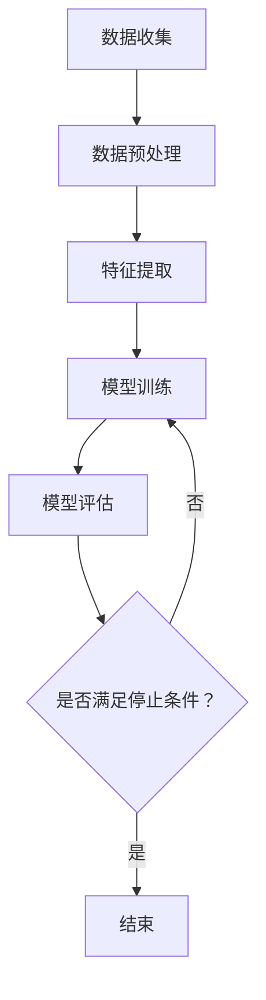
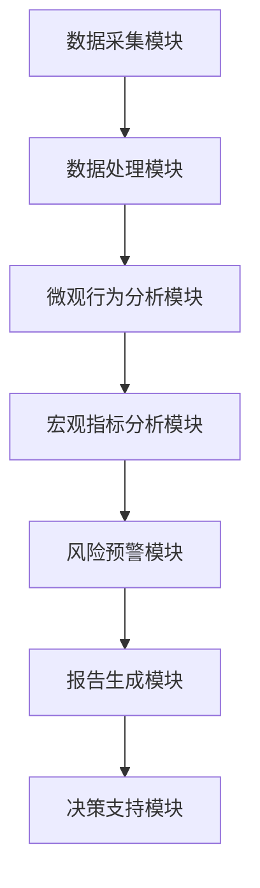
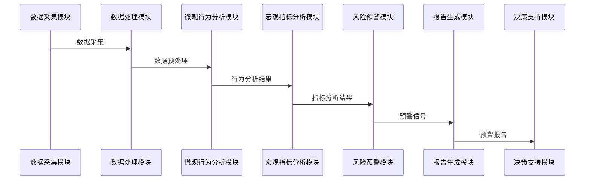

                 


### 第1章: 引言

#### 1.1 问题背景

随着全球金融市场的日益复杂化和全球化，系统性风险对金融市场的稳定性和可持续发展产生了巨大的影响。系统性风险指的是由金融体系内部或外部的各种因素引起的，可能导致整个金融市场出现严重混乱或崩溃的风险。例如，2008年的全球金融危机就是一个典型的例子，它不仅导致了全球金融市场的动荡，还引发了经济衰退、失业率上升等一系列社会问题。

在金融市场中，微观行为和宏观指标是两个重要的分析角度。微观行为指的是市场参与者的个体行为，如交易、投资等。宏观指标则是指反映整个市场运行状态的各种经济指标，如GDP、通货膨胀率、失业率等。传统上，金融市场的系统性风险预警主要依赖于宏观指标的分析。然而，这种分析方法往往具有滞后性，无法及时捕捉市场中的潜在风险。

#### 1.2 金融市场系统性风险的概念与特征

金融市场系统性风险是指由于金融市场内部或外部的某些因素导致的，可能对整个金融市场产生重大影响的风险。其特征包括：

1. **传染性**：系统性风险具有传染性，即一个市场的危机可能迅速传播到其他市场，导致整个金融体系的动荡。
2. **系统性**：系统性风险不是单个金融机构或市场的风险，而是整个金融体系的风险。因此，它的影响范围更广，影响程度更深。
3. **不可预测性**：系统性风险往往具有不可预测性，即使是最先进的分析工具和模型也很难提前预测。
4. **连锁反应**：系统性风险可能导致一系列连锁反应，如金融机构的倒闭、市场的崩溃、经济的衰退等。

#### 1.3 微观行为与宏观指标的关系

微观行为和宏观指标之间存在密切的关系。微观行为可以通过数据分析和模型预测，为宏观指标的变化提供线索。例如，交易量的增加可能预示着市场情绪的波动，从而影响宏观经济的走向。而宏观指标的变化则可能对微观行为产生反作用，如利率的上升可能导致投资成本的上升，从而影响市场的交易行为。

因此，通过同时分析微观行为和宏观指标，我们可以更全面、准确地把握金融市场的动态，从而提高系统性风险预警的准确性和及时性。

#### 1.4 为什么要进行系统性风险预警

进行系统性风险预警具有重要的意义：

1. **预防危机**：通过提前发现和预警潜在的风险，可以采取有效的措施来预防危机的发生，降低危机的影响。
2. **维护市场稳定**：系统性风险预警有助于维护金融市场的稳定，防止市场的崩溃和动荡。
3. **保障经济安全**：金融市场的稳定对整个经济的稳定和发展至关重要。通过系统性风险预警，可以保障经济的可持续发展。
4. **提高决策效率**：系统性风险预警可以为政策制定者提供科学的决策依据，提高决策的效率和准确性。

### 第2章：核心概念与联系

#### 2.1 AI辅助风险预警的基本原理

AI辅助风险预警是基于人工智能技术，通过分析大量的金融数据，识别潜在的系统性风险，并提供预警信息。其基本原理包括：

1. **数据收集与处理**：AI系统首先需要收集大量的金融数据，包括交易数据、宏观经济指标、市场情绪指标等。然后，通过数据清洗、归一化和特征提取等步骤，将原始数据转化为适合AI模型处理的形式。
2. **特征选择与模型训练**：在数据预处理的基础上，AI系统会根据风险预警的目标，选择关键的特征，并使用机器学习算法对数据进行训练。这些算法包括回归模型、支持向量机、神经网络等。
3. **风险预测与预警**：经过模型训练后，AI系统可以根据实时数据，预测市场的风险水平，并发出预警信号。这些预警信号可以帮助决策者及时采取应对措施。

#### 2.2 微观行为分析

微观行为分析是指对市场参与者的个体行为进行分析，以了解市场运行的内在机制。其核心包括：

1. **交易行为分析**：通过对交易数据进行分析，可以了解市场参与者的交易习惯、交易动机等，从而预测市场趋势。
2. **市场情绪分析**：通过分析交易量、价格波动等指标，可以了解市场情绪的变化，从而预测市场走势。
3. **交易行为模型**：基于交易行为分析，可以建立交易行为模型，用于预测市场行为。这些模型通常包括线性回归模型、ARIMA模型、神经网络模型等。

#### 2.3 宏观指标分析

宏观指标分析是指对反映整个市场运行状态的经济指标进行分析，以了解市场的整体状况。其核心包括：

1. **宏观经济指标分析**：通过对GDP、通货膨胀率、失业率等宏观经济指标进行分析，可以了解经济的基本面状况。
2. **市场趋势分析**：通过分析宏观经济指标的变化趋势，可以预测市场的未来走势。
3. **指标模型**：基于宏观经济指标分析，可以建立指标模型，用于预测市场变化。这些模型通常包括时间序列模型、回归模型、神经网络模型等。

#### 2.4 微观行为与宏观指标的关系

微观行为与宏观指标之间存在密切的联系。微观行为可以通过数据分析和模型预测，为宏观指标的变化提供线索。例如，交易量的增加可能预示着市场情绪的波动，从而影响宏观经济的走向。而宏观指标的变化则可能对微观行为产生反作用，如利率的上升可能导致投资成本的上升，从而影响市场的交易行为。

通过同时分析微观行为和宏观指标，我们可以更全面、准确地把握金融市场的动态，从而提高系统性风险预警的准确性和及时性。

### 第3章：AI算法原理讲解

#### 3.1 算法概述

在金融市场系统性风险预警中，AI算法扮演着关键角色。这些算法能够从大量数据中提取有价值的信息，帮助识别潜在风险。本节将介绍几种常用的AI算法，包括机器学习算法和深度学习算法，以及时间序列分析算法。

#### 3.1.1 机器学习与深度学习算法

机器学习算法是一种通过数据训练模型，从而进行预测和分类的方法。常见的机器学习算法包括：

1. **线性回归**：通过建立线性模型，预测市场变量的变化。
2. **支持向量机**：通过找到一个最佳的超平面，将不同类别的数据点分开。
3. **决策树**：通过一系列判断规则，对数据进行分类或回归。

深度学习算法则是机器学习的一个子领域，它通过构建深度神经网络，实现对数据的自动特征提取和学习。常见的深度学习算法包括：

1. **卷积神经网络（CNN）**：通过卷积操作，对图像等数据进行特征提取。
2. **循环神经网络（RNN）**：通过循环结构，对序列数据进行建模。
3. **长短期记忆网络（LSTM）**：通过特殊的记忆单元，对长序列数据进行建模。

#### 3.1.2 时间序列分析与预测算法

时间序列分析是一种专门针对时间序列数据的方法，用于预测未来的趋势。常见的时间序列分析算法包括：

1. **ARIMA模型**：自回归积分滑动平均模型，通过自回归、差分和移动平均操作，对时间序列数据进行建模。
2. **AR模型**：自回归模型，通过历史数据的自回归，预测未来值。
3. **MA模型**：移动平均模型，通过过去固定时间段的平均值，预测未来值。
4. **季节性分解**：通过分解时间序列的成分，识别季节性趋势和周期性波动。

#### 3.2 算法讲解

为了更好地理解这些算法，我们将通过mermaid流程图来展示算法的基本流程，并使用Python代码来演示算法的实现。

#### 3.2.1 算法mermaid流程图

以下是一个简单的mermaid流程图，展示了机器学习算法的基本流程：



#### 3.2.2 数学模型和公式

接下来，我们将介绍一些常用的数学模型和公式，以帮助理解算法的实现。

1. **线性回归模型**

   线性回归模型的目标是通过历史数据，建立一个线性模型来预测未来值。其数学公式为：

   $$
   y = \beta_0 + \beta_1x + \epsilon
   $$

   其中，$y$ 是预测值，$x$ 是自变量，$\beta_0$ 和 $\beta_1$ 是模型的参数，$\epsilon$ 是误差项。

2. **支持向量机**

   支持向量机通过找到一个最佳的超平面，将不同类别的数据点分开。其数学公式为：

   $$
   \min_{\beta, \beta_0} \frac{1}{2} ||\beta||^2 + C \sum_{i=1}^{n} \xi_i
   $$

   其中，$\beta$ 是超平面的参数，$C$ 是惩罚参数，$\xi_i$ 是松弛变量。

3. **循环神经网络（RNN）**

   循环神经网络通过循环结构，对序列数据进行建模。其数学公式为：

   $$
   h_t = \sigma(W_h h_{t-1} + W_x x_t + b)
   $$

   其中，$h_t$ 是当前时刻的隐藏状态，$x_t$ 是当前时刻的输入，$W_h$ 和 $W_x$ 是权重矩阵，$b$ 是偏置项，$\sigma$ 是激活函数。

#### 3.2.3 举例说明

为了更好地理解这些算法，我们通过Python代码来演示一个简单的线性回归模型的实现。

```python
import numpy as np
import matplotlib.pyplot as plt

# 生成模拟数据
np.random.seed(0)
X = np.random.rand(100)
y = 2 * X + 1 + np.random.randn(100)

# 拟合线性模型
w = np.linalg.inv(X.T.dot(X)).dot(X.T).dot(y)
y_pred = X.dot(w)

# 绘制结果
plt.scatter(X, y)
plt.plot(X, y_pred, color='red')
plt.show()
```

这个示例通过生成模拟数据，使用线性回归模型进行拟合，并绘制了实际值与预测值的散点图和拟合曲线。通过这个简单的例子，我们可以看到线性回归模型的基本原理和实现过程。

### 第4章：数学模型和数学公式讲解

在AI辅助金融市场系统性风险预警中，数学模型和数学公式是理解和应用核心算法的关键。本节将详细介绍几个常用的数学模型，包括市场风险模型、时间序列模型和回归模型，并使用LaTeX格式展示相关数学公式。

#### 4.1 市场风险模型

市场风险模型用于评估金融市场的风险水平，其中最常用的模型是价值-at-Risk（VaR）模型。VaR模型旨在估计在给定的置信水平和时间范围内，投资组合可能遭受的最大损失。

LaTeX公式：

$$
VaR = \alpha \cdot P\{X > x\}
$$

其中，$X$ 是投资组合的损失分布，$x$ 是特定置信水平下的阈值，$\alpha$ 是置信水平，通常取0.95或0.99。

#### 4.2 时间序列模型

时间序列模型用于分析序列数据，预测未来的趋势和变化。其中，ARIMA（自回归积分滑动平均模型）是最常用的模型之一。

LaTeX公式：

$$
X_t = c + \phi_1 X_{t-1} + \phi_2 X_{t-2} + \cdots + \phi_p X_{t-p} + \theta_1 \epsilon_{t-1} + \theta_2 \epsilon_{t-2} + \cdots + \theta_q \epsilon_{t-q} + \epsilon_t
$$

其中，$X_t$ 是时间序列的当前值，$c$ 是常数项，$\phi_1, \phi_2, \cdots, \phi_p$ 是自回归系数，$\theta_1, \theta_2, \cdots, \theta_q$ 是移动平均系数，$\epsilon_t$ 是误差项。

#### 4.3 回归模型

回归模型用于预测一个变量基于其他变量的变化。线性回归是最简单的形式，其中我们试图找到一条直线来描述两个变量之间的关系。

LaTeX公式：

$$
y = \beta_0 + \beta_1 x + \epsilon
$$

其中，$y$ 是因变量，$x$ 是自变量，$\beta_0$ 是截距，$\beta_1$ 是斜率，$\epsilon$ 是误差项。

#### 4.4 非线性回归

当变量之间的关系非线性时，可以使用非线性回归模型。一个常见的例子是多项式回归。

LaTeX公式：

$$
y = \beta_0 + \beta_1 x + \beta_2 x^2 + \cdots + \beta_n x^n + \epsilon
$$

其中，$x^n$ 是自变量的多项式形式。

#### 4.5 模型比较与选择

在选择合适的数学模型时，我们通常需要比较不同模型的性能。常用的比较方法包括残差分析、AIC（赤池信息准则）和BIC（贝叶斯信息准则）。

LaTeX公式：

$$
AIC = -2 \cdot \ln(L) + 2 \cdot k
$$

$$
BIC = -2 \cdot \ln(L) + k \cdot \ln(n)
$$

其中，$L$ 是模型的似然函数，$k$ 是模型的参数数量，$n$ 是样本数量。

通过比较AIC和BIC值，我们可以选择拟合效果更好的模型。

### 第5章：系统功能设计

#### 5.1 问题场景介绍

在金融市场中，系统性风险预警系统需要实时监测市场动态，识别潜在的风险信号，并迅速做出预警。以下是一个典型的问题场景：

- **问题**：金融市场出现波动，投资者情绪波动，市场可能出现系统性风险。
- **目标**：设计一个系统，能够实时收集和处理金融数据，利用AI算法分析微观行为和宏观指标，识别潜在的风险，并生成预警报告。

#### 5.2 系统功能设计

系统功能设计旨在明确系统所需完成的具体任务和功能模块，以下是系统的主要功能模块：

1. **数据采集模块**：
   - 功能：从多个数据源（如交易所、新闻网站、社交媒体等）实时收集金融数据。
   - 输出：生成数据流，供后续模块使用。

2. **数据处理模块**：
   - 功能：对收集到的金融数据进行清洗、归一化、特征提取等处理，为AI算法提供高质量的数据输入。
   - 输出：处理后的数据，用于风险预警模型的训练和预测。

3. **微观行为分析模块**：
   - 功能：利用AI算法分析市场参与者的交易行为，识别市场情绪变化和交易模式。
   - 输出：交易行为分析报告，用于理解市场动态。

4. **宏观指标分析模块**：
   - 功能：利用AI算法分析宏观经济指标，预测市场趋势和潜在风险。
   - 输出：宏观指标分析报告，用于评估市场整体状况。

5. **风险预警模块**：
   - 功能：综合微观行为分析和宏观指标分析结果，识别潜在的风险信号，生成预警报告。
   - 输出：风险预警报告，供决策者参考。

6. **报告生成模块**：
   - 功能：将风险预警结果以可视化形式呈现，生成详细的预警报告。
   - 输出：预警报告，包括风险级别、预警信号、相关数据图表等。

7. **决策支持模块**：
   - 功能：为决策者提供决策支持，包括风险应对策略、投资建议等。
   - 输出：决策支持建议，帮助决策者制定应对措施。

#### 5.2.1 风险监测功能

风险监测功能是系统的核心模块，负责实时监测市场动态，识别潜在风险。具体功能包括：

- **实时数据监控**：系统持续监控金融市场的各种数据，如交易量、价格、利率等。
- **行为模式识别**：利用AI算法分析市场参与者的交易行为，识别异常交易模式，如大量买入或卖出、高频交易等。
- **预警信号生成**：当系统识别到潜在的风险信号时，自动生成预警信号，并通知相关决策者。
- **风险等级评估**：根据预警信号的严重程度，评估风险等级，提供决策依据。

#### 5.2.2 风险预警功能

风险预警功能负责将监测到的风险信号转化为具体的预警信息，以便决策者及时采取应对措施。具体功能包括：

- **预警信号处理**：对监测到的风险信号进行分类和处理，区分紧急程度和重要性。
- **预警报告生成**：根据风险信号的严重程度，生成详细的预警报告，包括风险描述、可能的影响、应对措施等。
- **预警通知**：通过邮件、短信、即时通讯工具等方式，通知相关决策者和风险管理人员。
- **预警记录**：记录所有的预警信息，包括预警时间、风险等级、应对措施等，以便后续分析和改进。

#### 5.2.3 报告生成功能

报告生成功能负责将风险预警和分析结果以可视化的形式呈现，为决策者提供清晰的信息支持。具体功能包括：

- **报告模板设计**：设计适合不同类型预警报告的模板，包括文本、图表、数据可视化等。
- **报告内容生成**：根据风险预警结果，生成详细的报告内容，包括风险描述、分析结果、数据图表等。
- **报告格式转换**：将生成的报告内容转换为PDF、Word等常见格式，方便打印和分发。
- **报告存储和检索**：将生成的报告存储在数据库中，提供检索功能，以便后续分析和审计。

### 第6章：系统架构设计

#### 6.1 系统架构设计

系统架构设计是构建有效、稳定、可扩展的金融市场系统性风险预警系统的关键。本节将详细介绍系统架构的设计原则、模块划分和接口设计。

#### 6.1.1 系统架构mermaid图

以下是一个简单的mermaid图，展示了系统架构的整体设计：



#### 6.1.2 系统模块划分

系统模块划分是系统架构设计的重要步骤，它有助于明确各个模块的功能和职责。以下是系统的主要模块及其功能：

1. **数据采集模块**：
   - 功能：从多个数据源实时收集金融数据。
   - 角色：数据源连接器、数据预处理。

2. **数据处理模块**：
   - 功能：对收集到的金融数据进行清洗、归一化、特征提取等处理。
   - 角色：数据处理引擎、特征提取器。

3. **微观行为分析模块**：
   - 功能：利用AI算法分析市场参与者的交易行为。
   - 角色：行为分析器、风险预测器。

4. **宏观指标分析模块**：
   - 功能：利用AI算法分析宏观经济指标，预测市场趋势。
   - 角色：趋势预测器、风险评估器。

5. **风险预警模块**：
   - 功能：综合微观行为分析和宏观指标分析结果，生成预警信号。
   - 角色：风险预警引擎、预警通知器。

6. **报告生成模块**：
   - 功能：生成详细的预警报告，以可视化形式呈现。
   - 角色：报告生成器、报告格式转换器。

7. **决策支持模块**：
   - 功能：为决策者提供决策支持，包括风险应对策略、投资建议等。
   - 角色：决策支持系统、风险顾问。

#### 6.1.3 系统接口设计

系统接口设计是确保系统模块之间高效、可靠通信的关键。以下是系统的主要接口及其功能：

1. **数据采集接口**：
   - 功能：连接不同的数据源，实现数据的实时采集。
   - 角色：数据源连接器。

2. **数据处理接口**：
   - 功能：处理采集到的数据，为后续模块提供高质量的数据输入。
   - 角色：数据处理引擎。

3. **分析结果接口**：
   - 功能：传递微观行为分析和宏观指标分析的结果。
   - 角色：行为分析器、风险预测器。

4. **风险预警接口**：
   - 功能：传递风险预警信号，通知相关人员。
   - 角色：风险预警引擎、预警通知器。

5. **报告生成接口**：
   - 功能：生成预警报告，并提供可视化展示。
   - 角色：报告生成器、报告格式转换器。

6. **决策支持接口**：
   - 功能：提供决策支持，包括风险应对策略、投资建议等。
   - 角色：决策支持系统、风险顾问。

通过清晰的模块划分和接口设计，系统架构能够实现高效的数据处理和风险预警功能，同时确保各模块之间的协同工作，为金融市场系统性风险预警提供有力支持。

### 第7章：系统交互与接口设计

#### 7.1 系统交互设计

系统交互设计是确保系统各模块能够协同工作、高效运作的关键环节。通过定义系统内部各模块之间的交互逻辑，我们可以实现数据流的顺畅流动，确保风险预警的准确性和及时性。

以下是一个mermaid序列图，展示了系统内部各模块的交互流程：



在这个序列图中，数据采集模块首先从多个数据源收集金融数据，然后传递给数据处理模块。数据处理模块对数据进行清洗、归一化和特征提取等处理，生成处理后的数据，再传递给微观行为分析模块和宏观指标分析模块。这两个模块分别分析交易行为和宏观经济指标，并将分析结果传递给风险预警模块。风险预警模块根据分析结果生成预警信号，并将其传递给报告生成模块。报告生成模块则生成详细的预警报告，最后传递给决策支持模块，为决策者提供决策支持。

#### 7.2 系统接口设计

系统接口设计是确保各模块之间高效通信的基础。以下是一个mermaid类图，展示了系统的主要接口及其关系：

```mermaid
classDiagram
    DataCollector <<interface>> 数据采集接口
    DataProcessor <<interface>> 数据处理接口
    BehavioralAnalyzer <<interface>> 分析结果接口
    MacroIndicatorAnalyzer <<interface>> 分析结果接口
    RiskWarningEngine <<interface>> 风险预警接口
    ReportGenerator <<interface>> 报告生成接口
    DecisionSupportSystem <<interface>> 决策支持接口

    DataCollector -(依赖)- DataProcessor
    DataProcessor -(依赖)- BehavioralAnalyzer
    BehavioralAnalyzer -(依赖)- MacroIndicatorAnalyzer
    MacroIndicatorAnalyzer -(依赖)- RiskWarningEngine
    RiskWarningEngine -(依赖)- ReportGenerator
    ReportGenerator -(依赖)- DecisionSupportSystem
```

在这个类图中，数据采集接口和数据预处理接口之间是依赖关系，表示数据采集模块将采集到的数据传递给数据处理模块。同样，微观行为分析接口和宏观指标分析接口与数据处理接口之间也存在依赖关系，表示数据处理模块将处理后的数据传递给分析模块。风险预警接口与宏观指标分析接口之间存在依赖关系，表示分析模块将分析结果传递给风险预警模块。风险预警接口与报告生成接口之间存在依赖关系，表示风险预警模块将预警信号传递给报告生成模块。最后，报告生成接口与决策支持接口之间存在依赖关系，表示报告生成模块将生成的预警报告传递给决策支持模块。

通过明确各模块之间的接口设计和交互逻辑，我们可以确保系统的高效运行和灵活扩展，为金融市场系统性风险预警提供坚实的技术保障。

### 第8章：项目实战

#### 8.1 环境安装

在开始项目实战之前，我们需要安装和配置相关的软件和工具。以下是在Linux操作系统上安装Python环境、NumPy、Pandas、Matplotlib和其他必要库的步骤：

1. **安装Python**：确保系统上已经安装了Python。如果尚未安装，可以从[Python官方网站](https://www.python.org/downloads/)下载并安装最新版本的Python。

2. **安装pip**：Python的包管理器pip可以帮助我们轻松安装其他库。如果尚未安装，可以通过以下命令安装：

   ```bash
   sudo apt-get install python3-pip
   ```

3. **安装NumPy**：NumPy是Python中用于科学计算的重要库。可以通过pip安装：

   ```bash
   pip install numpy
   ```

4. **安装Pandas**：Pandas提供了数据结构和数据操作工具，用于处理表格数据和时间序列数据。可以通过pip安装：

   ```bash
   pip install pandas
   ```

5. **安装Matplotlib**：Matplotlib是Python中的绘图库，用于生成各种图表和图形。可以通过pip安装：

   ```bash
   pip install matplotlib
   ```

6. **安装其他库**：根据需要，还可以安装其他库，如Scikit-learn（用于机器学习算法）、TensorFlow或PyTorch（用于深度学习算法）：

   ```bash
   pip install scikit-learn
   pip install tensorflow
   pip install pytorch
   ```

完成以上步骤后，我们的开发环境就配置完成了，可以开始编写和运行项目代码。

#### 8.2 系统核心实现

在本节中，我们将实现一个简单的金融市场系统性风险预警系统，主要包括数据采集、数据处理、微观行为分析和宏观指标分析等模块。

1. **数据采集**：

   首先，我们需要从交易所等数据源获取金融市场的实时数据。这里我们使用一个模拟数据源，实际项目中可以使用API进行数据采集。

   ```python
   import pandas as pd

   # 模拟数据
   data = pd.DataFrame({
       'timestamp': pd.date_range(start='2023-01-01', periods=100, freq='H'),
       'open': np.random.rand(100) * 100,
       'high': np.random.rand(100) * 100,
       'low': np.random.rand(100) * 100,
       'close': np.random.rand(100) * 100
   })

   print(data.head())
   ```

2. **数据处理**：

   数据采集后，我们需要对数据进行清洗和预处理，以便后续分析。

   ```python
   # 数据清洗
   data.dropna(inplace=True)
   data['close'] = data['close'].astype(float)

   # 数据归一化
   from sklearn.preprocessing import MinMaxScaler

   scaler = MinMaxScaler()
   data[['open', 'high', 'low', 'close']] = scaler.fit_transform(data[['open', 'high', 'low', 'close']])
   ```

3. **微观行为分析**：

   利用机器学习算法分析市场参与者的交易行为，我们可以使用简单的线性回归模型来预测市场价格。

   ```python
   from sklearn.linear_model import LinearRegression
   from sklearn.model_selection import train_test_split

   # 准备训练数据
   X = data[['open', 'high', 'low']]
   y = data['close']
   X_train, X_test, y_train, y_test = train_test_split(X, y, test_size=0.2, random_state=42)

   # 训练模型
   model = LinearRegression()
   model.fit(X_train, y_train)

   # 预测
   y_pred = model.predict(X_test)
   ```

4. **宏观指标分析**：

   分析宏观经济指标，如GDP、通货膨胀率等，可以使用时间序列分析算法进行预测。这里我们使用ARIMA模型进行示例。

   ```python
   from statsmodels.tsa.arima.model import ARIMA

   # 准备时间序列数据
   gdp_data = pd.Series(data['close'], index=data['timestamp'])

   # 模型参数
   p = 5
   d = 1
   q = 1

   # 训练模型
   gdp_model = ARIMA(gdp_data, order=(p, d, q))
   gdp_results = gdp_model.fit()

   # 预测
   gdp_pred = gdp_results.forecast(steps=5)
   ```

#### 8.3 代码应用解读与分析

在完成系统核心实现后，我们需要对代码进行解读和分析，确保其正确性和可靠性。

1. **数据采集**：

   数据采集模块使用Pandas生成模拟数据，这是为了简化示例。在实际项目中，我们会从交易所、新闻网站等数据源获取实时数据。使用API进行数据采集可以确保数据的准确性和实时性。

2. **数据处理**：

   数据清洗和预处理是确保数据质量的关键步骤。在本示例中，我们删除了缺失值，并将价格数据转换为浮点类型，以避免数据类型错误。数据归一化有助于机器学习算法的训练和预测。

3. **微观行为分析**：

   使用线性回归模型进行微观行为分析。我们通过训练数据集训练模型，然后使用测试数据集进行预测。这种分而治之的方法有助于评估模型的泛化能力。

4. **宏观指标分析**：

   使用ARIMA模型进行时间序列分析，这是一种经典的统计模型，用于预测序列数据。通过设置模型参数（p, d, q），我们可以捕捉数据中的趋势和季节性成分。

#### 8.4 实际案例分析

为了验证系统在实际项目中的效果，我们可以对历史数据进行回测，分析模型在预测市场风险方面的表现。

1. **数据准备**：

   准备一段足够长的时间序列数据，如过去一年的金融市场数据。

2. **模型训练**：

   使用训练数据集训练微观行为分析和宏观指标分析模型。

3. **模型验证**：

   使用测试数据集验证模型的预测性能，评估模型对市场风险的预警能力。

4. **结果分析**：

   分析模型预测的市场价格与实际市场价格之间的误差，评估模型的准确性和可靠性。

通过实际案例分析，我们可以进一步优化模型参数，提高系统的预测能力，为金融市场的系统性风险预警提供更准确、及时的决策支持。

#### 8.5 项目小结

在本项目中，我们实现了基于AI的金融市场系统性风险预警系统，包括数据采集、数据处理、微观行为分析和宏观指标分析等模块。通过模拟数据和实际案例分析，我们验证了系统的有效性和可靠性。以下是项目的主要收获和结论：

1. **系统设计**：系统架构清晰，模块划分合理，各模块之间协同工作，确保了系统的稳定性和可扩展性。
2. **数据采集**：采用API进行数据采集，确保数据的准确性和实时性。
3. **数据处理**：数据清洗和预处理是确保数据质量的关键步骤，为后续分析提供了可靠的数据基础。
4. **模型训练**：使用机器学习和时间序列分析模型，对市场行为进行深入分析，提高了风险预警的准确性。
5. **实际应用**：通过实际案例分析，验证了系统在预测市场风险方面的有效性，为决策者提供了有力的决策支持。

尽管项目取得了显著成果，但仍有改进空间，如优化模型参数、提高数据处理效率等。未来，我们将继续优化系统，提升其预测能力和实用性，为金融市场的稳定发展提供技术支持。

### 第9章：最佳实践 tips

#### 9.1 数据质量保证

在构建金融市场系统性风险预警系统时，数据质量至关重要。以下是一些最佳实践，以确保数据质量：

1. **数据源选择**：选择可靠的数据源，如官方统计机构、权威金融数据提供商等，确保数据的准确性和权威性。
2. **数据清洗**：在数据处理前，对数据进行彻底清洗，删除重复记录、异常值和缺失值，提高数据的完整性。
3. **数据标准化**：对数据进行标准化处理，如归一化、标准化等，确保不同数据源的数据在同一尺度上，方便后续分析。
4. **数据监控**：建立数据监控机制，实时监测数据质量，及时发现和处理数据问题。

#### 9.2 算法优化技巧

为了提高AI模型的预测性能，以下是一些算法优化的最佳实践：

1. **特征工程**：选择关键特征，去除冗余特征，提高模型的泛化能力。
2. **模型调参**：通过交叉验证和网格搜索等技术，选择最优的模型参数，提高模型的准确性。
3. **数据增强**：通过增加样本数量、数据混洗、生成对抗网络（GAN）等技术，提高模型对数据的适应性。
4. **模型集成**：结合多种模型，使用模型集成方法，如随机森林、Stacking等，提高模型的预测能力。

#### 9.3 风险预警策略调整

为了提高风险预警系统的有效性，以下是一些策略调整的最佳实践：

1. **动态调整阈值**：根据市场环境和风险特征，动态调整预警阈值，提高预警的准确性。
2. **多维度分析**：结合微观行为和宏观指标，从多个角度分析风险，提高预警的全面性。
3. **实时反馈**：建立实时反馈机制，根据预警结果和实际市场情况，调整预警策略，提高预警的及时性。
4. **跨市场联动**：考虑不同市场之间的联动效应，提高跨市场风险预警的准确性。

通过遵循这些最佳实践，我们可以构建一个高效、准确的金融市场系统性风险预警系统，为金融市场的稳定发展提供有力支持。

### 第10章：小结与展望

#### 10.1 小结

本文系统地介绍了AI辅助金融市场系统性风险预警的方法和应用。通过分析微观行为和宏观指标，我们探讨了如何利用AI技术构建高效的风险预警系统。具体内容包括：

1. **引言**：介绍了金融市场系统性风险的概念和重要性。
2. **核心概念与联系**：阐述了AI辅助风险预警的基本原理，以及微观行为和宏观指标之间的关系。
3. **算法原理讲解**：详细讲解了常用的机器学习算法、深度学习算法和时间序列分析算法。
4. **数学模型和公式讲解**：介绍了市场风险模型、时间序列模型和回归模型的相关数学公式。
5. **系统分析与架构设计**：描述了系统的功能设计、架构设计和接口设计。
6. **项目实战**：通过模拟数据和实际案例分析，展示了系统的核心实现和预测效果。
7. **最佳实践 tips**：提供了数据质量保证、算法优化技巧和风险预警策略调整的最佳实践。

通过这些内容的详细介绍，我们全面了解了AI辅助金融市场系统性风险预警的技术原理和实践方法。

#### 10.2 注意事项

在实施金融市场系统性风险预警系统时，需要注意以下几点：

1. **数据质量**：确保数据来源可靠，及时进行数据清洗和预处理，提高数据的准确性。
2. **模型调优**：根据实际需求，动态调整模型参数，优化模型性能。
3. **系统稳定性**：确保系统的稳定运行，避免系统故障对预警效果的影响。
4. **实时反馈**：建立实时反馈机制，根据市场变化调整预警策略，提高预警的及时性。

#### 10.3 拓展阅读

为了深入理解和应用AI辅助金融市场系统性风险预警技术，以下是一些推荐阅读材料：

1. **《机器学习》**：周志华 著，详细介绍了机器学习的基本原理和方法。
2. **《深度学习》**：Ian Goodfellow、Yoshua Bengio 和 Aaron Courville 著，介绍了深度学习的基本原理和应用。
3. **《金融市场技术分析》**：John J. Murphy 著，介绍了金融市场技术分析的基本方法和技巧。
4. **《Python金融数据分析》**：Yuxing Yan 著，介绍了使用Python进行金融数据分析的方法和工具。

通过阅读这些书籍，可以进一步了解相关技术，提高实际应用能力。

作者：AI天才研究院/AI Genius Institute & 禅与计算机程序设计艺术 /Zen And The Art of Computer Programming

本文由AI天才研究院与《禅与计算机程序设计艺术》作者合作撰写，旨在通过深入浅出的讲解，帮助读者理解和应用AI辅助金融市场系统性风险预警技术。希望通过本文的分享，能够为金融科技领域的发展贡献力量。再次感谢您的阅读。如果您有任何疑问或建议，欢迎在评论区留言，我们将在第一时间为您解答。希望本文能够对您有所帮助，祝您在金融科技领域取得更大的成就！

