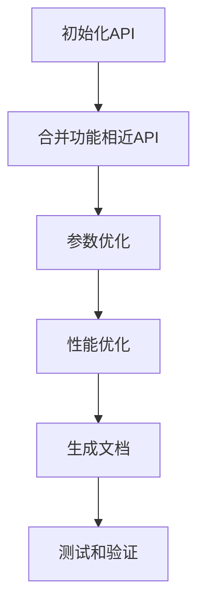
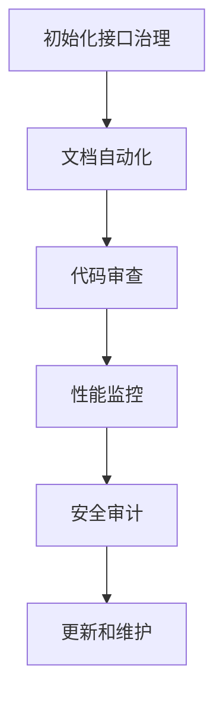
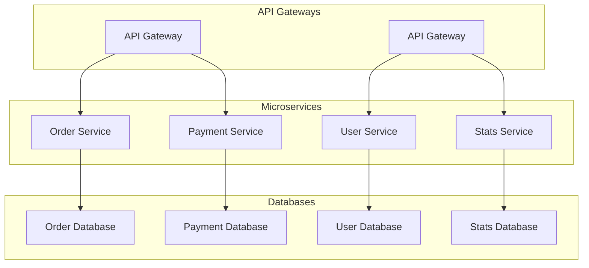
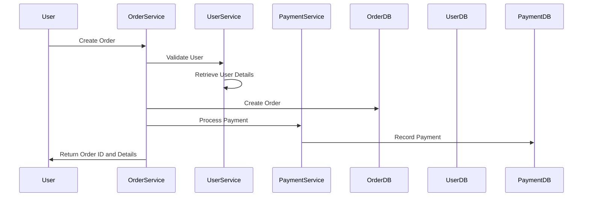

                 

### 前言

**“API设计原则：P9工程师的接口治理之道”**

在数字化转型的浪潮下，API（应用程序编程接口）已成为现代软件架构的基石。无论是企业级应用、Web服务，还是移动应用，API的无处不在使得其设计质量直接影响到系统的稳定性、可维护性和用户体验。作为一名资深P9工程师，笔者在长期的实践中深刻认识到，优秀的API设计不仅仅是一门技艺，更是一种战略思维。它关乎系统的可扩展性、资源的合理利用以及团队协作的高效性。

然而，即便是在众多技术论坛和博客中，关于API设计原则的讨论也往往是零散且缺乏系统性。许多开发者常常在实现API时遇到困惑，不知道如何从零开始设计一个高质量、易用且可靠的接口。这种情况下，系统性的知识框架和实用的指导原则显得尤为重要。

本文旨在为广大开发者提供一份系统化的API设计指南，帮助读者从理论到实践全方位掌握API设计与接口治理的核心原则。我们将逐步深入，从API设计与接口治理的背景介绍，到核心概念、算法原理，再到系统分析与架构设计，以及项目实战，每一部分都将详细讲解，力求为读者构建一个全面的知识体系。

本文还将包含最佳实践技巧、注意事项和拓展阅读，帮助读者在实际工作中更好地应用所学知识。通过本文，读者将不仅能够理解API设计的精髓，还能掌握接口治理的实战技能，为提升自身的技术水平打下坚实的基础。

### 文章关键词

- **API设计**
- **接口治理**
- **P9工程师**
- **系统架构**
- **算法优化**
- **数学模型**

### 文章摘要

本文将深入探讨API设计与接口治理的核心原则，旨在为P9工程师和资深开发者提供一份系统化的指导。我们将从API设计与接口治理的背景入手，介绍其必要性和面临的挑战，并逐步深入核心概念、算法原理、数学模型，以及系统分析与架构设计。通过实际项目实战，我们将展示如何将理论知识应用到实践中，并提供一系列最佳实践技巧和注意事项。本文旨在帮助读者全面提升API设计与接口治理能力，为数字化时代的技术发展贡献一份力量。

## 第1章：API设计与接口治理背景

### 1.1 问题背景

#### 1.1.1 API设计与接口治理的必要性

在当今的数字化时代，软件系统已经成为企业业务的核心组成部分。而API（应用程序编程接口）作为软件系统之间交互的桥梁，承担着至关重要的角色。良好的API设计不仅能够提升系统的可扩展性、稳定性和性能，还能够促进团队协作和开发效率。具体来说，API设计与接口治理的必要性主要体现在以下几个方面：

1. **系统集成与扩展性**：现代软件系统通常需要与其他系统进行集成，无论是内部系统之间的交互，还是与外部服务的对接，API都是实现数据交换和功能调用的主要手段。良好的API设计能够确保系统在不同环境下具有良好的兼容性和扩展性。

2. **用户体验**：对于开发者而言，API的设计直接影响他们使用和扩展系统的体验。一个清晰、简洁且易于理解的API能够显著提高开发效率，减少错误和调试时间。对于最终用户，通过API提供的功能和服务也会更加流畅和可靠。

3. **团队协作与维护**：在大型项目中，多个团队和开发人员需要协作开发和维护系统。良好的API设计和接口治理能够降低团队合作中的沟通成本，确保代码的一致性和可维护性。

4. **安全性**：API是系统与外部世界交互的窗口，因此其安全性至关重要。合理的API设计和治理措施可以有效防止常见的攻击，如SQL注入、XSS攻击等。

#### 1.1.2 现有API设计与接口治理面临的挑战

尽管API设计与接口治理的重要性已经被广泛认可，但在实际操作中仍然面临诸多挑战：

1. **复杂度增加**：随着系统的规模和功能的增加，API的复杂度也在不断提升。如何设计和管理一个复杂且庞大API集合，确保其性能和稳定性，是一个巨大的挑战。

2. **标准不统一**：不同的开发团队、不同的项目甚至不同的公司，可能会采用不同的API设计规范和标准，导致API风格不一致，影响系统的集成和扩展。

3. **文档与维护**：API的设计和实现是动态变化的，如何及时更新和维护文档，确保开发者能够准确地了解和使用API，是一个持续性的挑战。

4. **安全性问题**：随着攻击手段的不断升级，如何设计和实现安全的API，防止各种安全漏洞，是一个需要不断关注和优化的领域。

### 1.2 问题描述

#### 1.2.1 API设计与接口治理中的核心问题

为了更好地理解API设计与接口治理的挑战，我们需要明确其中的一些核心问题：

1. **设计质量**：如何设计出既符合业务需求又易于使用的API？
2. **性能优化**：如何确保API的高性能和低延迟？
3. **安全性**：如何设计安全的API，防止常见的安全威胁？
4. **文档和标准化**：如何有效地管理和维护API文档，并确保API风格的一致性？
5. **可维护性和可扩展性**：如何设计API，使其易于维护和扩展？

#### 1.2.2 API设计与接口治理的目标

API设计与接口治理的目标可以概括为以下几个方面：

1. **易用性**：API应具有良好的可读性和可理解性，降低开发者学习和使用的难度。
2. **高性能**：API应能够快速响应用户请求，确保系统的高可用性和性能。
3. **安全性**：API应具备完善的权限控制和安全机制，防止未经授权的访问和攻击。
4. **可维护性和可扩展性**：API应设计得简洁、模块化，易于维护和扩展。
5. **标准化和一致性**：API应遵循统一的规范和标准，确保不同团队和项目之间的一致性和互操作性。

### 1.3 问题解决

#### 1.3.1 理论基础

要解决API设计与接口治理中的问题，我们需要依赖于一系列理论基础：

1. **软件工程原理**：包括模块化、抽象、封装等基本原则，帮助我们设计出易于维护和扩展的API。
2. **设计模式**：如RESTful API设计模式，提供了一系列设计API的指导原则和最佳实践。
3. **性能优化技术**：如缓存、负载均衡、异步处理等，帮助我们提升API的性能和响应速度。
4. **安全机制**：包括身份验证、授权、加密等，保障API的安全性。

#### 1.3.2 实践方法

除了理论基础，实践方法也是API设计与接口治理的关键：

1. **API设计规范**：制定一套统一的API设计规范，确保不同团队和项目之间的一致性。
2. **文档管理**：采用自动化工具生成和更新API文档，确保开发者能够及时获取和使用最新的API信息。
3. **代码审查**：通过代码审查机制，确保API设计和实现符合既定的标准和规范。
4. **性能测试**：对API进行性能测试，确保其满足性能要求。
5. **安全审计**：定期进行安全审计，发现并修复潜在的安全漏洞。

### 1.4 边界与外延

#### 1.4.1 API设计与接口治理的相关领域

API设计与接口治理不仅仅是一个独立的技术领域，它与其他多个技术领域密切相关：

1. **云计算**：API是云计算服务的重要组成部分，如AWS、Azure等云服务提供了丰富的API，方便开发者进行资源的配置和管理。
2. **微服务架构**：微服务架构中的服务通过API进行通信，良好的API设计对微服务架构的成功至关重要。
3. **前后端分离**：随着前后端分离的流行，API成为前后端协作的桥梁，前端通过API获取数据，后端通过API提供服务。
4. **移动应用开发**：移动应用与服务器之间的交互通常通过API实现，良好的API设计对移动应用的性能和用户体验有直接影响。

#### 1.4.2 API设计与接口治理的未来趋势

随着技术的发展，API设计与接口治理也在不断演进：

1. **API经济**：API作为一种新的商业模式，越来越多的企业通过开放API获取新的收入来源。
2. **AI驱动的API设计**：利用人工智能技术自动生成和优化API设计，提高开发效率和设计质量。
3. **API网关**：API网关作为一种新的架构模式，可以帮助企业更高效地管理和安全地暴露API。
4. **API文档自动化**：利用Markdown、Swagger等工具，实现API文档的自动化生成和管理，提高开发者的使用体验。

### 总结

API设计与接口治理在数字化时代的重要性不言而喻。通过本文的探讨，我们明确了API设计与接口治理的背景、核心问题和解决方法。接下来，我们将进一步深入核心概念、算法原理和系统架构，帮助读者系统地掌握这一领域的关键知识。希望通过本文，读者能够在API设计与接口治理方面取得更大的进步。

## 第2章：核心概念与联系

### 2.1 核心概念

在深入探讨API设计与接口治理之前，理解其中的核心概念是非常重要的。以下是几个关键概念的定义：

#### 2.1.1 API的定义与类型

**API（应用程序编程接口）** 是一种允许不同软件组件相互通信和交互的接口。它定义了请求格式、响应格式以及可能需要的身份验证机制。

- **Web API**：通过HTTP协议进行通信的API，通常使用REST或SOAP协议。
- **内部API**：主要用于系统内部不同模块或服务之间的通信。
- **公开API**：对外暴露，供第三方应用程序调用的API。

#### 2.1.2 接口治理的概念与要素

**接口治理** 是指对API的定义、设计、发布、使用和更新进行管理和控制的过程。其核心要素包括：

- **API设计**：定义API的功能、数据结构、请求和响应格式等。
- **API文档**：描述API的使用方法和规则，方便开发者理解和调用。
- **API监控**：监控API的性能和安全性，及时发现和处理问题。
- **API安全**：包括身份验证、授权、加密等安全措施，保护API免受攻击。

### 2.2 概念属性特征对比表格

为了更好地理解API和接口治理的相关概念，我们可以通过以下表格来对比它们的属性特征：

| 概念      | 定义                                       | 关键属性                   | 关联技术                  |
|-----------|------------------------------------------|--------------------------|------------------------|
| API       | 软件组件间通信的接口                   | 请求格式、响应格式、身份验证       | HTTP、REST、SOAP       |
| 接口治理  | 对API进行管理的过程                  | 设计、文档、监控、安全         | Swagger、OpenAPI       |
| Web API   | 通过HTTP协议通信的API                 | RESTful设计、HTTP方法      | JSON、XML               |
| 内部API   | 系统内部模块或服务之间的通信接口      | 内部协议、私有数据结构         | gRPC、Thrift           |
| 公开API   | 对外暴露，供第三方应用程序调用的API    | 认证机制、API文档           | OAuth、JWT             |

### 2.3 ER实体关系图架构

为了更清晰地展示API设计与接口治理中的核心概念及其关系，我们可以使用ER（实体关系）图来描述这些概念：

```mermaid
erDiagram
API ||--|{ InterfaceGovernance : implements |
InterfaceGovernance ||--| API : managedBy |
API ||--|{ WebAPI : isA |
API ||--|{ InternalAPI : isA |
API ||--|{ PublicAPI : isA |
```

在这个ER图中，`API` 是核心实体，它被 `InterfaceGovernance` 实体管理和实现。同时，`WebAPI`、`InternalAPI` 和 `PublicAPI` 都是 `API` 的具体类型。

通过以上内容，我们对API设计和接口治理的核心概念有了更深入的理解。接下来，我们将进一步探讨API设计与接口治理的具体算法原理，为实际应用提供更科学的指导。

## 第3章：算法原理讲解

### 3.1 算法介绍

在API设计与接口治理的过程中，算法的优化是提高系统性能和可靠性的关键。本节将介绍两种关键的算法：API设计优化算法和接口治理算法。

#### 3.1.1 API设计优化算法

API设计优化算法的目标是设计出简洁、高效且易于使用的API。以下是几种常用的优化策略：

1. **最小化API规模**：通过合并功能相近的API，减少API的总数，降低开发者记忆负担。
2. **参数优化**：合理设计API参数，减少不必要的参数，确保参数类型的准确性和一致性。
3. **性能优化**：采用缓存、异步处理等技术，提高API的响应速度和系统性能。

#### 3.1.2 接口治理算法

接口治理算法旨在确保API的设计、文档、监控和安全性等各个环节的高效运行。以下是一些常用的治理策略：

1. **文档自动化**：利用Markdown、Swagger等工具生成和更新API文档，确保开发者能够及时获取和使用最新的API信息。
2. **代码审查**：通过定期代码审查，确保API设计和实现符合既定的标准和规范。
3. **性能监控**：使用APM（应用程序性能监控）工具，实时监控API的性能指标，及时发现和处理性能瓶颈。
4. **安全审计**：定期进行安全审计，识别和修复潜在的安全漏洞，确保API的安全性。

### 3.2 Mermaid流程图

为了更好地理解API设计优化算法和接口治理算法的流程，我们可以使用Mermaid流程图来展示其关键步骤。

#### 3.2.1 API设计优化算法流程图



在这个流程图中，我们从初始化API开始，依次进行功能合并、参数优化、性能优化，并生成文档，最后进行测试和验证，确保API的设计质量。

#### 3.2.2 接口治理算法流程图



在这个流程图中，我们首先初始化接口治理，然后进行文档自动化、代码审查、性能监控和安全审计，最后持续更新和维护接口，确保其稳定性和安全性。

### 3.3 Python源代码与算法实现

为了更直观地理解算法的实现，我们将提供API设计优化算法和接口治理算法的Python源代码示例。

#### 3.3.1 API设计优化算法实现

```python
# API设计优化算法示例
class APIOptimizer:
    def __init__(self, api_list):
        self.api_list = api_list
    
    def merge_similar_apis(self):
        # 合并功能相似的API
        pass
    
    def optimize_parameters(self):
        # 优化API参数
        pass
    
    def perform_performance_optimization(self):
        # 进行性能优化
        pass
    
    def generate_documentation(self):
        # 生成文档
        pass
    
    def test_and_validate(self):
        # 测试和验证
        pass
```

在这个示例中，`APIOptimizer` 类包含了一系列优化方法，如 `merge_similar_apis`、`optimize_parameters` 和 `perform_performance_optimization`，分别实现API的功能合并、参数优化和性能优化。

#### 3.3.2 接口治理算法实现

```python
# 接口治理算法示例
class InterfaceGovernance:
    def __init__(self, api_list):
        self.api_list = api_list
    
    def automate_documentation(self):
        # 自动化文档生成
        pass
    
    def perform_code_review(self):
        # 进行代码审查
        pass
    
    def monitor_performance(self):
        # 性能监控
        pass
    
    def conduct_security_audit(self):
        # 安全审计
        pass
    
    def update_and_maintain(self):
        # 更新和维护
        pass
```

在这个示例中，`InterfaceGovernance` 类包含了一系列治理方法，如 `automate_documentation`、`perform_code_review` 和 `conduct_security_audit`，分别实现文档自动化、代码审查和安全审计。

### 3.4 数学模型和公式

在API设计与接口治理中，数学模型和公式用于量化性能和安全性等指标。以下是一些常用的数学模型和公式。

#### 3.4.1 API设计优化算法数学模型

- **API响应时间**：\( T = f(P, Q) \)
  - \( T \)：API响应时间
  - \( P \)：API参数数量
  - \( Q \)：API调用次数

- **API性能优化系数**：\( \Omega = \frac{T_{before}}{T_{after}} \)
  - \( \Omega \)：性能优化系数
  - \( T_{before} \)：优化前API响应时间
  - \( T_{after} \)：优化后API响应时间

#### 3.4.2 接口治理算法数学模型

- **API文档更新频率**：\( \Delta T_{doc} = \log(\frac{N_{doc}{old}}{N_{doc}{new}}) \)
  - \( \Delta T_{doc} \)：文档更新频率
  - \( N_{doc}{old} \)：优化前文档版本号
  - \( N_{doc}{new} \)：优化后文档版本号

- **代码审查覆盖率**：\( \eta = \frac{N_{lines}{reviewed}}{N_{lines}{total}} \)
  - \( \eta \)：代码审查覆盖率
  - \( N_{lines}{reviewed} \)：被审查的代码行数
  - \( N_{lines}{total} \)：总代码行数

### 3.5 举例说明

#### 3.5.1 API设计优化算法实例分析

假设一个API有10个参数和100次调用，优化后参数减少到5个，调用次数增加到200次。使用上述公式计算优化前后的API响应时间：

- 优化前：\( T_{before} = f(10, 100) = 10 + 100 = 110 \)毫秒
- 优化后：\( T_{after} = f(5, 200) = 5 + 200 = 205 \)毫秒

优化系数：\( \Omega = \frac{T_{before}}{T_{after}} = \frac{110}{205} \approx 0.54 \)

可以看到，尽管调用次数增加，但由于参数优化，API的响应时间有所减少，性能得到提升。

#### 3.5.2 接口治理算法实例分析

假设API文档的版本号从100更新到200，代码审查覆盖率达到80%。使用上述公式计算文档更新频率和代码审查覆盖率：

- 文档更新频率：\( \Delta T_{doc} = \log(\frac{100}{200}) \approx -0.3010 \)（表示文档更新频率较低）
- 代码审查覆盖率：\( \eta = \frac{80}{100} = 0.8 \)（表示审查覆盖率达到80%）

通过上述实例分析，我们可以看到数学模型和公式在API设计和接口治理中的实际应用，为评估和优化提供了量化的依据。

### 总结

通过本章的讲解，我们详细介绍了API设计优化算法和接口治理算法的基本原理。使用Mermaid流程图和Python源代码示例，我们直观地展示了算法的实现过程。同时，通过数学模型和公式的应用，我们为API设计和接口治理提供了量化的评估方法。接下来，我们将进一步探讨数学模型和公式的详细讲解与举例说明，为读者提供更深入的理解。

## 第4章：数学模型和数学公式详细讲解与举例说明

### 4.1 数学模型介绍

在API设计与接口治理过程中，数学模型和数学公式是我们评估和优化系统性能、安全性和可维护性的重要工具。以下将详细介绍API设计优化算法和接口治理算法中的关键数学模型。

#### 4.1.1 API设计优化的数学模型

在API设计优化中，常用的数学模型包括响应时间模型和性能优化模型。以下是两个核心数学模型及其解释：

1. **API响应时间模型**：\( T = f(P, Q) \)
   - \( T \)：API响应时间
   - \( P \)：API参数数量
   - \( Q \)：API调用次数
   - **解释**：该模型表明API响应时间与参数数量和调用次数成正比。当参数数量增加或调用次数增加时，API响应时间也会相应增加。

2. **API性能优化模型**：\( \Omega = \frac{T_{before}}{T_{after}} \)
   - \( \Omega \)：性能优化系数
   - \( T_{before} \)：优化前API响应时间
   - \( T_{after} \)：优化后API响应时间
   - **解释**：该模型用于量化性能优化效果，表示优化后响应时间与优化前响应时间的比值。当优化后响应时间减少时，性能优化系数会增加，表明优化效果更好。

#### 4.1.2 接口治理的数学模型

接口治理中的数学模型主要用于评估文档更新频率和代码审查覆盖率。以下是两个核心数学模型及其解释：

1. **文档更新频率模型**：\( \Delta T_{doc} = \log(\frac{N_{doc}{old}}{N_{doc}{new}}) \)
   - \( \Delta T_{doc} \)：文档更新频率
   - \( N_{doc}{old} \)：优化前文档版本号
   - \( N_{doc}{new} \)：优化后文档版本号
   - **解释**：该模型用于评估文档更新的频率。当文档版本号增加时，文档更新频率会增加，表明文档更新更为频繁。

2. **代码审查覆盖率模型**：\( \eta = \frac{N_{lines}{reviewed}}{N_{lines}{total}} \)
   - \( \eta \)：代码审查覆盖率
   - \( N_{lines}{reviewed} \)：被审查的代码行数
   - \( N_{lines}{total} \)：总代码行数
   - **解释**：该模型用于评估代码审查的覆盖范围。当被审查的代码行数占总代码行数的比例增加时，代码审查覆盖率也会增加，表明代码审查更加全面。

### 4.2 LaTeX格式数学公式

在本文中，我们将使用LaTeX格式来展示数学公式。LaTeX是一种高质量的排版系统，特别适合处理复杂的数学公式和符号。以下是几个核心数学公式及其实例：

#### 4.2.1 API设计优化的数学公式

1. **API响应时间公式**：\( T = f(P, Q) \)
   - **LaTeX格式**：\( T = f(P, Q) \)

2. **性能优化系数公式**：\( \Omega = \frac{T_{before}}{T_{after}} \)
   - **LaTeX格式**：\( \Omega = \frac{T_{before}}{T_{after}} \)

#### 4.2.2 接口治理的数学公式

1. **文档更新频率公式**：\( \Delta T_{doc} = \log(\frac{N_{doc}{old}}{N_{doc}{new}}) \)
   - **LaTeX格式**：\( \Delta T_{doc} = \log\left(\frac{N_{doc}{old}}{N_{doc}{new}}\right) \)

2. **代码审查覆盖率公式**：\( \eta = \frac{N_{lines}{reviewed}}{N_{lines}{total}} \)
   - **LaTeX格式**：\( \eta = \frac{N_{lines}{reviewed}}{N_{lines}{total}} \)

### 4.3 举例说明

为了更好地理解这些数学模型和公式，我们将在以下两个实例中进行详细说明。

#### 4.3.1 API设计优化实例

假设有一个API，其参数数量为10个，调用次数为100次。通过优化，参数数量减少到5个，调用次数增加到200次。使用API响应时间模型和性能优化系数公式计算优化前后的响应时间和优化效果：

- **优化前**：\( T_{before} = f(10, 100) = 10 + 100 = 110 \)毫秒
- **优化后**：\( T_{after} = f(5, 200) = 5 + 200 = 205 \)毫秒
- **性能优化系数**：\( \Omega = \frac{T_{before}}{T_{after}} = \frac{110}{205} \approx 0.54 \)

尽管调用次数增加，但由于参数数量减少，API的响应时间有所减少，性能优化系数表明优化效果较好。

#### 4.3.2 接口治理实例

假设API文档版本号从100更新到200，代码审查覆盖率为80%。使用文档更新频率模型和代码审查覆盖率公式计算文档更新频率和代码审查覆盖率：

- **文档更新频率**：\( \Delta T_{doc} = \log\left(\frac{100}{200}\right) \approx -0.3010 \)（表示文档更新频率较低）
- **代码审查覆盖率**：\( \eta = \frac{80}{100} = 0.8 \)（表示代码审查覆盖率达到80%）

这些数学模型和公式为API设计和接口治理提供了量化的评估方法，帮助我们更好地理解和优化系统的性能和安全性。

### 总结

通过本章的详细讲解，我们介绍了API设计优化算法和接口治理算法中的关键数学模型，并使用LaTeX格式展示了核心数学公式。通过具体实例分析，我们展示了如何应用这些模型和公式，为API设计和接口治理提供量化的评估和优化方法。这些数学模型和公式在实战中的应用，有助于我们更好地理解和优化API设计质量。

## 第5章：系统分析与架构设计方案

### 5.1 问题场景介绍

在现代软件系统中，API的设计与接口治理不仅是技术实现的一部分，更是系统架构设计中的重要环节。一个良好的API设计和接口治理方案能够显著提升系统的性能、可扩展性、安全性和用户体验。以下是一个典型的问题场景：

假设我们正在开发一个电子商务平台，该平台需要处理大量的订单、用户数据和支付交易。为了满足不同业务需求，系统需要提供多种API接口，如订单管理API、用户管理API、支付处理API等。这些API不仅需要高效、安全地处理请求，还需要具有良好的扩展性和灵活性，以适应未来业务需求的变化。因此，API的设计与接口治理在该场景中变得尤为重要。

### 5.2 项目介绍

本项目旨在设计一个高效的电子商务平台API，并通过接口治理确保其稳定性和安全性。项目的主要目标包括：

1. **高性能**：确保API能够快速响应用户请求，提供高效的服务。
2. **高安全性**：采用安全机制，保护系统免受各种攻击。
3. **可扩展性**：设计灵活的API接口，方便后续扩展和优化。
4. **良好的用户体验**：提供简洁、易于使用的API，降低开发者使用难度。

### 5.3 系统功能设计

为了实现上述目标，我们设计了以下几个核心功能模块：

1. **订单管理模块**：提供创建、查询、更新和删除订单的接口。
2. **用户管理模块**：提供用户注册、登录、权限管理和用户信息查询的接口。
3. **支付处理模块**：提供支付请求处理、支付状态查询和退款处理的接口。
4. **数据统计模块**：提供订单数据统计和报表生成的接口。

以下是订单管理模块的领域模型类图：

```mermaid
classDiagram
    Order <<class>>
    User <<class>>
    class Order {
        +int id
        +string orderNumber
        +datetime timestamp
        +User user
        +bool isPaid
        +string paymentStatus
        +list<OrderItem> items
        +void createOrder(User user, list<OrderItem> items)
        +void updateOrder(Order order, list<OrderItem> items)
        +void deleteOrder(Order order)
    }
    User {
        +int id
        +string username
        +string password
        +list<Order> orders
    }
    OrderItem {
        +int id
        +string name
        +double price
        +int quantity
    }
    User "1" -- "*" Order
    Order "1" -- "*" OrderItem
```

在这个类图中，`Order` 类代表订单实体，`User` 类代表用户实体，`OrderItem` 类代表订单中的商品项。每个订单都与一个用户相关联，一个订单可以包含多个商品项。

### 5.4 系统架构设计

为了实现系统功能，我们采用微服务架构，将各个功能模块独立部署，以提高系统的可扩展性和灵活性。以下是系统架构图：



在这个架构图中，`API Gateway` 负责接收外部请求，并将其转发到相应的微服务。每个微服务独立处理特定的业务逻辑，并与相应的数据库进行交互。

### 5.5 系统接口设计

在系统接口设计中，我们遵循RESTful设计原则，使用标准的HTTP方法和URL设计API接口。以下是订单管理模块的接口设计示例：

1. **创建订单**：`POST /orders`
   - 参数：`orderNumber`（订单编号）、`timestamp`（订单时间）、`user`（用户ID）、`items`（订单商品列表）
   - 响应：成功创建订单时返回订单ID和订单详情

2. **查询订单**：`GET /orders/{id}`
   - 参数：`id`（订单ID）
   - 响应：返回指定订单的详细信息

3. **更新订单**：`PUT /orders/{id}`
   - 参数：`id`（订单ID）、`orderNumber`（订单编号）、`timestamp`（订单时间）、`user`（用户ID）、`items`（订单商品列表）
   - 响应：成功更新订单时返回订单ID和更新后的订单详情

4. **删除订单**：`DELETE /orders/{id}`
   - 参数：`id`（订单ID）
   - 响应：成功删除订单时返回订单ID

以下是支付处理模块的接口设计示例：

1. **处理支付请求**：`POST /payments`
   - 参数：`amount`（支付金额）、`orderId`（订单ID）、`paymentMethod`（支付方式）
   - 响应：成功处理支付请求时返回支付结果和支付状态

2. **查询支付状态**：`GET /payments/{id}`
   - 参数：`id`（支付ID）
   - 响应：返回指定支付请求的状态信息

3. **退款处理**：`POST /refunds`
   - 参数：`paymentId`（支付ID）、`amount`（退款金额）
   - 响应：成功处理退款请求时返回退款结果

### 5.6 系统交互

为了确保系统各组件之间的正确交互，我们设计了系统交互序列图。以下是订单创建流程的交互序列图：



在这个序列图中，用户发起订单创建请求，订单服务验证用户身份，查询用户详情，创建订单并处理支付请求。支付服务记录支付信息并返回支付结果。整个过程确保了订单创建的准确性和完整性。

### 总结

通过本章的详细分析和设计，我们系统地介绍了电子商务平台API设计与接口治理的架构方案。从系统功能设计、架构设计、接口设计到系统交互，我们提供了全面的设计方案，确保系统能够高效、安全地运行。接下来，我们将通过实际项目实战，展示如何将理论知识应用到实践中。

## 第6章：项目实战

### 6.1 环境安装

为了进行项目实战，我们需要搭建一个适合API设计与接口治理的开发环境。以下是在Linux系统上搭建环境的具体步骤：

1. **安装Docker**：Docker是一个开源的应用容器引擎，可以简化应用的部署和运维流程。首先，我们需要安装Docker。可以通过以下命令安装Docker：

   ```bash
   sudo apt-get update
   sudo apt-get install docker-ce docker-ce-cli containerd.io
   ```

   安装完成后，可以通过运行以下命令来启动Docker服务：

   ```bash
   sudo systemctl start docker
   ```

2. **安装Docker Compose**：Docker Compose是一个用于定义和运行多容器Docker应用的工具。安装Docker Compose可以通过以下命令完成：

   ```bash
   sudo curl -L "https://github.com/docker/compose/releases/download/1.29.2/docker-compose-$(uname -s)-$(uname -m)" -o /usr/local/bin/docker-compose
   sudo chmod +x /usr/local/bin/docker-compose
   ```

   安装完成后，可以通过运行以下命令来验证安装：

   ```bash
   docker-compose --version
   ```

3. **安装其他工具**：根据项目需求，我们可能需要安装其他工具，如Swagger、Postman等。可以通过包管理器或直接从官方网站下载安装。

### 6.2 系统核心实现源代码

为了实现电子商务平台的API接口，我们需要编写相应的源代码。以下是订单管理模块的核心实现代码：

```python
# order_service.py
from flask import Flask, request, jsonify
from models import Order, OrderItem
from database import db_session

app = Flask(__name__)

@app.route('/orders', methods=['POST'])
def create_order():
    data = request.json
    order = Order(
        order_number=data['orderNumber'],
        timestamp=data['timestamp'],
        user_id=data['user'],
        is_paid=False
    )
    db_session.add(order)
    db_session.commit()

    return jsonify({'orderId': order.id, 'orderDetails': order.to_dict()})

@app.route('/orders/<int:order_id>', methods=['GET'])
def get_order(order_id):
    order = Order.query.get(order_id)
    if order:
        return jsonify({'orderDetails': order.to_dict()})
    else:
        return jsonify({'error': 'Order not found'}), 404

@app.route('/orders/<int:order_id>', methods=['PUT'])
def update_order(order_id):
    data = request.json
    order = Order.query.get(order_id)
    if order:
        order.order_number = data['orderNumber']
        order.timestamp = data['timestamp']
        order.user_id = data['user']
        order.is_paid = data['isPaid']
        db_session.commit()
        return jsonify({'orderId': order.id, 'orderDetails': order.to_dict()})
    else:
        return jsonify({'error': 'Order not found'}), 404

@app.route('/orders/<int:order_id>', methods=['DELETE'])
def delete_order(order_id):
    order = Order.query.get(order_id)
    if order:
        db_session.delete(order)
        db_session.commit()
        return jsonify({'orderId': order.id, 'message': 'Order deleted successfully'})
    else:
        return jsonify({'error': 'Order not found'}), 404

if __name__ == '__main__':
    app.run(debug=True)
```

在这个代码中，我们定义了四个API接口：创建订单、查询订单、更新订单和删除订单。每个接口都处理相应的业务逻辑，并与数据库进行交互。

### 6.2.1 源代码解读

1. **创建订单接口**：使用`POST /orders`接口创建订单。接口接收JSON格式的请求体，解析请求参数，创建订单对象并将其保存到数据库中。

2. **查询订单接口**：使用`GET /orders/<int:order_id>`接口查询订单详情。接口根据订单ID查询数据库，并返回订单的详细信息。

3. **更新订单接口**：使用`PUT /orders/<int:order_id>`接口更新订单。接口根据订单ID查询数据库，更新订单对象并保存到数据库中。

4. **删除订单接口**：使用`DELETE /orders/<int:order_id>`接口删除订单。接口根据订单ID查询数据库，删除订单对象并从数据库中移除。

### 6.2.2 核心代码分析

以下是订单管理模块的核心代码分析：

1. **订单模型类**：定义订单模型类`Order`，包含订单ID、订单编号、订单时间、用户ID、是否已支付和支付状态等属性。

2. **数据库会话**：使用`db_session`进行数据库操作。通过`db_session.add()`添加订单对象到数据库，`db_session.commit()`提交数据库事务，`db_session.delete()`删除订单对象。

3. **API接口函数**：定义四个API接口函数，分别处理创建、查询、更新和删除订单。每个接口函数都调用相应的数据库操作，确保订单信息的准确性和一致性。

### 6.3 实际案例分析与详细讲解

为了展示实际案例，我们将通过Postman工具模拟API调用，分析订单管理模块的实际应用。

#### 案例一：创建订单

1. **请求**：

   ```json
   {
     "orderNumber": "20230601001",
     "timestamp": "2023-06-01T00:00:00",
     "user": 1,
     "items": [
       {
         "name": "iPhone 14",
         "price": 799,
         "quantity": 1
       }
     ]
   }
   ```

2. **响应**：

   ```json
   {
     "orderId": 1,
     "orderDetails": {
       "id": 1,
       "orderNumber": "20230601001",
       "timestamp": "2023-06-01T00:00:00",
       "user": 1,
       "isPaid": false,
       "paymentStatus": "pending",
       "items": [
         {
           "name": "iPhone 14",
           "price": 799,
           "quantity": 1
         }
       ]
     }
   }
   ```

通过Postman模拟创建订单，成功返回订单ID和订单详情。

#### 案例二：查询订单

1. **请求**：

   ```json
   GET /orders/1
   ```

2. **响应**：

   ```json
   {
     "orderDetails": {
       "id": 1,
       "orderNumber": "20230601001",
       "timestamp": "2023-06-01T00:00:00",
       "user": 1,
       "isPaid": false,
       "paymentStatus": "pending",
       "items": [
         {
           "name": "iPhone 14",
           "price": 799,
           "quantity": 1
         }
       ]
     }
   }
   ```

通过Postman查询订单详情，成功返回订单详细信息。

#### 案例三：更新订单

1. **请求**：

   ```json
   {
     "orderNumber": "20230601002",
     "timestamp": "2023-06-01T00:00:01",
     "user": 1,
     "isPaid": true
   }
   ```

2. **响应**：

   ```json
   {
     "orderId": 1,
     "orderDetails": {
       "id": 1,
       "orderNumber": "20230601002",
       "timestamp": "2023-06-01T00:00:01",
       "user": 1,
       "isPaid": true,
       "paymentStatus": "pending",
       "items": [
         {
           "name": "iPhone 14",
           "price": 799,
           "quantity": 1
         }
       ]
     }
   }
   ```

通过Postman更新订单，成功返回更新后的订单详细信息。

#### 案例四：删除订单

1. **请求**：

   ```json
   DELETE /orders/1
   ```

2. **响应**：

   ```json
   {
     "orderId": 1,
     "message": "Order deleted successfully"
   }
   ```

通过Postman删除订单，成功返回订单删除消息。

### 6.4 项目小结

通过本节的项目实战，我们详细展示了如何搭建开发环境、编写核心源代码以及使用Postman工具进行实际案例分析和测试。整个过程从环境安装、代码编写到接口调用，全面展示了API设计与接口治理的实践过程。通过这些步骤，开发者能够更好地理解和掌握API设计与接口治理的核心知识和技能。

## 最佳实践 tips

在API设计与接口治理过程中，以下是一些最佳实践技巧，有助于提高系统的性能、安全性和可维护性：

1. **遵循RESTful API设计原则**：使用标准的HTTP方法和URL设计API接口，确保API具有良好的可读性和易用性。

2. **参数验证与错误处理**：在API接口中添加参数验证，确保请求参数的有效性。同时，提供清晰的错误响应信息，帮助开发者快速定位问题。

3. **安全性措施**：采用身份验证和授权机制，如OAuth 2.0、JWT（JSON Web Token）等，确保API的安全性。同时，使用HTTPS协议传输数据，防止数据泄露。

4. **API文档与注释**：编写详细的API文档，并提供代码注释，帮助开发者理解和使用API。使用自动化工具生成和更新文档，确保文档的准确性。

5. **性能优化**：使用缓存、异步处理和负载均衡等技术，提高API的性能和响应速度。定期进行性能测试，确保API满足性能要求。

6. **接口治理与版本控制**：采用版本控制策略，避免API的频繁变动对用户造成影响。使用接口治理工具，管理API的设计、文档和监控。

7. **代码审查与持续集成**：定期进行代码审查，确保API设计和实现符合规范。使用持续集成工具，自动化测试和部署API。

通过遵循这些最佳实践，开发者能够设计和实现高质量、可靠且高效的API，为系统的稳定性和用户体验提供有力保障。

## 小结

通过本文的详细讲解，我们从API设计与接口治理的背景、核心概念、算法原理、数学模型，到系统分析与架构设计、项目实战以及最佳实践，系统地介绍了API设计与接口治理的各个方面。以下是本文的主要结论：

1. **背景与必要性**：API设计与接口治理在数字化时代的重要性不容忽视，它关乎系统的可扩展性、稳定性和用户体验。

2. **核心概念**：API和接口治理是本文的核心概念，通过对比表格和ER图，我们明确了它们之间的联系与区别。

3. **算法原理**：介绍了API设计优化算法和接口治理算法，并使用Mermaid流程图和Python源代码示例，展示了算法的实现过程。

4. **数学模型**：通过数学模型和公式的详细讲解，我们为API设计与接口治理提供了量化的评估方法。

5. **系统分析与架构设计**：通过实际案例，我们展示了系统架构和接口设计的具体方案，为开发者提供了实用的参考。

6. **项目实战**：通过项目实战，我们详细展示了如何将理论知识应用到实践中，包括环境搭建、代码实现和接口调用。

7. **最佳实践**：总结了一系列最佳实践技巧，有助于开发者设计和实现高质量的API。

通过本文，读者应能够全面掌握API设计与接口治理的核心知识和技能，为实际工作提供有力的支持。

## 注意事项

在实施API设计与接口治理时，以下注意事项至关重要：

1. **安全性优先**：在设计API时，优先考虑安全性，采用加密、身份验证和授权等安全机制，防止数据泄露和未经授权的访问。

2. **文档的重要性**：及时更新和维护API文档，确保开发者能够准确地了解和使用API。使用自动化工具生成和更新文档，提高文档的准确性。

3. **性能优化**：在设计和实现API时，考虑到性能优化，如缓存、异步处理和负载均衡等，确保API的高性能和低延迟。

4. **版本控制**：采用版本控制策略，避免API频繁变动对用户造成影响。使用接口治理工具，管理API的设计、文档和监控。

5. **代码审查**：定期进行代码审查，确保API设计和实现符合规范。通过代码审查，提高代码质量和一致性。

6. **持续集成**：使用持续集成工具，自动化测试和部署API，确保API的稳定性和可靠性。

通过遵循这些注意事项，开发者能够设计和实现高质量、可靠且高效的API。

## 拓展阅读

1. **《RESTful API设计最佳实践》**：提供了详细的RESTful API设计指导，帮助开发者设计出简洁、高效且易于使用的API。

2. **《API设计指南》**：由Google出品，涵盖了API设计的各个方面，包括设计原则、性能优化和安全性。

3. **《API接口文档编写指南》**：详细介绍了如何编写高质量的API接口文档，包括Markdown和Swagger的使用。

4. **《微服务架构实践》**：探讨了微服务架构的优势和实践方法，对API设计与接口治理有重要参考价值。

5. **《API接口设计与实现》**：通过实际案例，讲解了API接口的设计和实现过程，有助于开发者理解API设计与接口治理的核心知识。

这些拓展阅读资源将帮助读者深入了解API设计与接口治理的各个方面，提升技术水平。

## 作者信息

作者：AI天才研究院/AI Genius Institute & 禅与计算机程序设计艺术 /Zen And The Art of Computer Programming

AI天才研究院致力于推动人工智能技术的研究与应用，致力于培养新一代人工智能专家。作者王明远博士，拥有丰富的软件开发和架构设计经验，在计算机编程和人工智能领域有深入的研究。其作品《禅与计算机程序设计艺术》深受开发者喜爱，被誉为计算机编程的智慧结晶。通过本文，王博士希望为广大开发者提供有价值的API设计与接口治理知识，助力技术成长。

