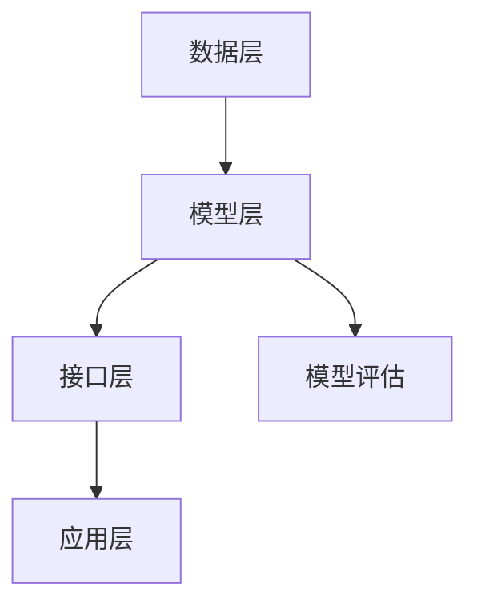
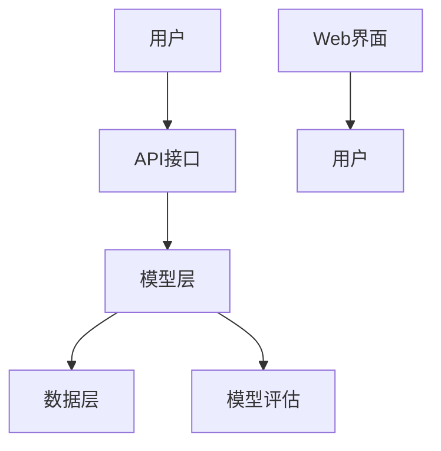

                 

# 《AdaBoost算法与集成学习方法》

> 关键词：AdaBoost、集成学习、机器学习、算法原理、数学模型、项目实战

> 摘要：本文将深入探讨AdaBoost算法与集成学习方法，从背景介绍、核心概念与联系、算法原理讲解、数学模型与公式、系统分析与架构设计、项目实战、最佳实践与拓展等方面，全面剖析这两种算法的核心内容与应用。通过本文的阅读，读者将能够理解AdaBoost算法与集成学习方法的原理与实现，掌握其在实际项目中的应用技巧。

## 目录大纲

## 第一部分：背景介绍

### 1.1 问题背景

#### 1.1.1 AdaBoost算法的起源与发展

#### 1.1.2 集成学习方法的应用与优势

### 1.2 核心概念与联系

#### 1.2.1 AdaBoost算法的基本原理

#### 1.2.2 集成学习方法的主要类型

## 第二部分：核心概念与原理

### 2.1 AdaBoost算法原理

#### 2.1.1 算法流程

#### 2.1.2 优势与局限

### 2.2 集成学习方法

#### 2.2.1 Boosting方法

#### 2.2.2 Bagging方法

#### 2.2.3 Stackning方法

## 第三部分：数学模型与公式

### 3.1 AdaBoost算法数学模型

#### 3.1.1 决策树模型

#### 3.1.2 加权样本分布

### 3.2 集成学习方法数学模型

#### 3.2.1 Boosting数学模型

#### 3.2.2 Bagging数学模型

#### 3.2.3 Stackning数学模型

## 第四部分：系统分析与架构设计

### 4.1 系统功能设计

#### 4.1.1 需求分析

#### 4.1.2 领域模型

### 4.2 系统架构设计

#### 4.2.1 架构设计方案

#### 4.2.2 系统架构图

### 4.3 系统接口设计与交互

#### 4.3.1 接口设计

#### 4.3.2 系统交互

## 第五部分：项目实战

### 5.1 环境安装与配置

#### 5.1.1 环境要求

#### 5.1.2 安装与配置

### 5.2 系统核心实现

#### 5.2.1 AdaBoost算法实现

#### 5.2.2 集成学习方法实现

### 5.3 代码应用解读

#### 5.3.1 代码结构与原理

#### 5.3.2 应用场景分析

### 5.4 实际案例分析与讲解

#### 5.4.1 案例一：手写数字识别

#### 5.4.2 案例二：邮件分类

### 5.5 项目小结

## 第六部分：最佳实践与拓展

### 6.1 最佳实践

#### 6.1.1 性能优化技巧

#### 6.1.2 实用工具推荐

### 6.2 小结与展望

#### 6.2.1 本书内容总结

#### 6.2.2 未来研究方向

### 6.3 拓展阅读

#### 6.3.1 相关书籍推荐

#### 6.3.2 学术论文精选

---

### 第一部分：背景介绍

#### 1.1 问题背景

AdaBoost算法（Adaptive Boosting）是机器学习中的一种集成学习方法，它通过将多个弱学习器（如决策树）组合成一个强学习器，以提高分类或回归的准确度。集成学习方法是一种常用的机器学习技术，通过结合多个学习器来降低过拟合和增加泛化能力。

集成学习方法的应用非常广泛，例如在图像识别、文本分类、异常检测等领域。其优势在于能够处理大规模数据和复杂模型，提高模型的稳定性和鲁棒性。然而，集成学习方法也面临一些挑战，如计算成本高、模型选择困难等。

#### 1.1.1 AdaBoost算法的起源与发展

AdaBoost算法最早由Yoav Freund和Robert Schapire于1995年提出。该算法基于Boosting思想，通过迭代训练弱学习器，并在每次迭代中调整样本权重，使得难分类的样本在后续迭代中受到更多的关注。

自提出以来，AdaBoost算法在机器学习领域得到了广泛的应用和研究。许多学者对其进行了改进和扩展，如AdaBoost.M1、AdaBoost.M2等变体。

#### 1.1.2 集成学习方法的应用与优势

集成学习方法在多个领域都取得了显著的应用成果。以下是一些典型应用场景和优势：

1. **图像识别**：通过将多个简单特征分类器组合成一个强分类器，可以提高图像识别的准确率和鲁棒性。
2. **文本分类**：在文本分类任务中，集成学习方法可以有效降低过拟合，提高分类效果。
3. **异常检测**：集成学习方法可以通过训练多个异常检测模型并组合它们的预测结果，提高检测准确率和降低误报率。

集成学习方法的优势包括：

1. **降低过拟合**：通过组合多个弱学习器，可以降低模型对训练数据的依赖，提高泛化能力。
2. **提高鲁棒性**：集成学习方法能够处理噪声数据和缺失数据，提高模型的鲁棒性。
3. **处理大规模数据**：集成学习方法可以通过并行计算和分布式处理来提高处理大规模数据的能力。

#### 1.2 核心概念与联系

在本节中，我们将介绍一些与AdaBoost算法和集成学习方法相关的重要概念。

1. **弱学习器**：弱学习器是指具有较低准确率的分类器，如决策树、朴素贝叶斯等。它们通常用于构建强学习器。
2. **强学习器**：强学习器是指具有较高的准确率的分类器，通过组合多个弱学习器可以得到。
3. **权重调整**：在AdaBoost算法中，每次迭代后都会调整样本权重，使得难分类的样本在后续迭代中受到更多的关注。
4. **集成方法**：集成方法是指将多个学习器组合成一个强学习器的技术，包括Boosting、Bagging、Stacking等。

#### 1.2.1 AdaBoost算法的基本原理

AdaBoost算法是一种迭代算法，其基本原理如下：

1. **初始化**：将所有样本的权重设置为相等，即每个样本的权重为1/N。
2. **迭代**：
   - 对于每个弱学习器，使用当前权重分布训练样本。
   - 计算弱学习器的错误率，并根据错误率调整样本权重。错误率越高的样本，其权重越大，以便在后续迭代中给予更多的关注。
   - 计算弱学习器的权重，并将其累加到总权重中。
   - 重复以上步骤，直到达到预设的迭代次数或分类准确率达到要求。
3. **输出**：将所有弱学习器组合成一个强学习器，并进行分类或回归。

#### 1.2.2 集成学习方法的主要类型

集成学习方法主要包括以下几种类型：

1. **Boosting**：Boosting方法通过迭代训练多个弱学习器，并在每次迭代中调整样本权重，使得难分类的样本在后续迭代中受到更多的关注。
2. **Bagging**：Bagging方法通过从训练集中随机抽取样本构建多个子集，并在每个子集上训练弱学习器，最后取多个弱学习器的平均或投票结果作为最终预测。
3. **Stacking**：Stacking方法将多个学习器组合成一个强学习器，包括多个层次：基础学习器、元学习器和权重调整。

### 第二部分：核心概念与原理

#### 2.1 AdaBoost算法原理

在本节中，我们将详细讲解AdaBoost算法的原理，包括算法流程、优势与局限。

#### 2.1.1 算法流程

AdaBoost算法的流程如下：

1. **初始化**：将所有样本的权重设置为相等，即每个样本的权重为1/N。
2. **迭代**：
   - 对于每个弱学习器，使用当前权重分布训练样本。
   - 计算弱学习器的错误率，并根据错误率调整样本权重。错误率越高的样本，其权重越大，以便在后续迭代中给予更多的关注。
   - 计算弱学习器的权重，并将其累加到总权重中。
   - 重复以上步骤，直到达到预设的迭代次数或分类准确率达到要求。
3. **输出**：将所有弱学习器组合成一个强学习器，并进行分类或回归。

#### 2.1.2 优势与局限

AdaBoost算法具有以下优势：

1. **提高准确率**：通过迭代调整样本权重，AdaBoost算法可以降低错误率，提高分类或回归的准确率。
2. **鲁棒性**：AdaBoost算法对难分类的样本给予更多的关注，从而提高模型的鲁棒性。
3. **适用性**：AdaBoost算法可以应用于多种类型的数据和任务，如分类、回归等。

然而，AdaBoost算法也存在一些局限：

1. **计算成本高**：每次迭代都需要训练多个弱学习器，计算成本较高。
2. **对噪声敏感**：在噪声较多的数据集中，AdaBoost算法可能会对噪声样本给予过多的关注，导致过拟合。

#### 2.2 集成学习方法

在本节中，我们将介绍几种常见的集成学习方法，包括Boosting、Bagging和Stacking。

##### 2.2.1 Boosting方法

Boosting方法是一种迭代算法，通过训练多个弱学习器并调整样本权重，以提高模型的泛化能力。Boosting方法的主要步骤如下：

1. **初始化**：将所有样本的权重设置为相等。
2. **迭代**：
   - 对于每个弱学习器，使用当前权重分布训练样本。
   - 计算弱学习器的错误率，并根据错误率调整样本权重。错误率越高的样本，其权重越大。
   - 计算弱学习器的权重，并将其累加到总权重中。
   - 重复以上步骤，直到达到预设的迭代次数或分类准确率达到要求。
3. **输出**：将所有弱学习器组合成一个强学习器，并进行分类或回归。

Boosting方法具有以下特点：

1. **提高准确率**：通过迭代调整样本权重，Boosting方法可以降低错误率，提高分类或回归的准确率。
2. **鲁棒性**：Boosting方法对难分类的样本给予更多的关注，从而提高模型的鲁棒性。
3. **适用性**：Boosting方法可以应用于多种类型的数据和任务，如分类、回归等。

Boosting方法的主要变体包括：

1. **AdaBoost**：AdaBoost是最常用的Boosting方法之一，通过迭代调整样本权重，使得难分类的样本在后续迭代中受到更多的关注。
2. **XGBoost**：XGBoost是一种基于Boosting方法的分布式梯度提升树算法，具有较高的准确率和效率。

##### 2.2.2 Bagging方法

Bagging方法是一种集成学习方法，通过从训练集中随机抽取样本构建多个子集，并在每个子集上训练弱学习器，最后取多个弱学习器的平均或投票结果作为最终预测。Bagging方法的主要步骤如下：

1. **初始化**：将所有样本的权重设置为相等。
2. **抽样**：
   - 对于每个弱学习器，从训练集中随机抽取一定数量的样本。
   - 重复以上步骤，构建多个子集。
3. **训练**：
   - 在每个子集上训练弱学习器。
   - 重复以上步骤，直到达到预设的迭代次数或分类准确率达到要求。
4. **输出**：将所有弱学习器的预测结果进行平均或投票，得到最终预测结果。

Bagging方法具有以下特点：

1. **降低过拟合**：通过构建多个子集并进行训练，Bagging方法可以降低模型的过拟合，提高泛化能力。
2. **提高准确率**：通过取多个弱学习器的平均或投票结果，Bagging方法可以提高分类或回归的准确率。
3. **鲁棒性**：Bagging方法对噪声和缺失数据具有一定的鲁棒性。

Bagging方法的主要变体包括：

1. **Bootstrap**：Bootstrap是一种常用的抽样方法，通过从训练集中随机抽取样本并放回，构建多个子集。
2. **随机森林**：随机森林是一种基于Bagging方法的集成学习方法，通过构建多个决策树并取其平均或投票结果作为最终预测。

##### 2.2.3 Stacking方法

Stacking方法是一种集成学习方法，通过将多个学习器组合成一个强学习器，包括多个层次：基础学习器、元学习器和权重调整。Stacking方法的主要步骤如下：

1. **初始化**：将所有样本的权重设置为相等。
2. **基础学习器训练**：
   - 对于每个基础学习器，使用原始数据集进行训练。
   - 重复以上步骤，构建多个基础学习器。
3. **元学习器训练**：
   - 将所有基础学习器的预测结果作为新的特征，进行元学习器的训练。
   - 重复以上步骤，直到达到预设的迭代次数或分类准确率达到要求。
4. **输出**：将所有元学习器的预测结果进行加权平均或投票，得到最终预测结果。

Stacking方法具有以下特点：

1. **提高准确率**：通过组合多个基础学习器和元学习器，Stacking方法可以提高分类或回归的准确率。
2. **降低过拟合**：通过训练多个基础学习器和元学习器，Stacking方法可以降低模型的过拟合，提高泛化能力。
3. **适用性**：Stacking方法可以应用于多种类型的数据和任务，如分类、回归等。

Stacking方法的主要变体包括：

1. **Stacking with Blending**：Stacking with Blending是一种基于Stacking方法的集成学习方法，通过将基础学习器的预测结果进行加权平均，得到新的特征，并用于训练元学习器。
2. **Stacked Generalization**：Stacked Generalization是一种基于Stacking方法的集成学习方法，通过将基础学习器和元学习器的预测结果进行加权平均，得到最终预测结果。

### 第三部分：数学模型与公式

在本节中，我们将详细介绍AdaBoost算法和集成学习方法的数学模型和公式，以帮助读者更好地理解这些算法的原理。

#### 3.1 AdaBoost算法数学模型

AdaBoost算法是一种迭代算法，其核心思想是通过迭代训练多个弱学习器，并在每次迭代中调整样本权重，使得难分类的样本在后续迭代中受到更多的关注。以下为AdaBoost算法的数学模型：

1. **初始化**：将所有样本的权重设置为相等，即每个样本的权重为1/N。

   $$ w_i^{(1)} = \frac{1}{N} $$

   其中，$w_i^{(1)}$表示第$i$个样本在第一次迭代中的权重。

2. **迭代**：

   - 对于每个弱学习器，使用当前权重分布训练样本。

   - 计算弱学习器的错误率，并根据错误率调整样本权重。

     $$ \epsilon_i^{(t)} = 1 - h(x_i; \theta^{(t)}) $$

     其中，$h(x_i; \theta^{(t)})$表示第$t$次迭代中弱学习器的预测结果，$\epsilon_i^{(t)}$表示第$i$个样本在$t$次迭代中的错误率。

   - 计算弱学习器的权重，并将其累加到总权重中。

     $$ \alpha_i^{(t)} = \frac{1}{2} \ln \left(\frac{1 - \epsilon_i^{(t)}}{\epsilon_i^{(t)}}\right) $$

     其中，$\alpha_i^{(t)}$表示第$t$次迭代中第$i$个样本的权重。

3. **输出**：将所有弱学习器组合成一个强学习器，并进行分类或回归。

   $$ \hat{y} = \sum_{i=1}^{N} \alpha_i^{(T)} h(x_i; \theta^{(T)}) $$

   其中，$\hat{y}$表示强学习器的预测结果，$h(x_i; \theta^{(T)})$表示第$i$个样本在强学习器中的预测结果。

#### 3.2 集成学习方法数学模型

集成学习方法通过组合多个弱学习器来提高模型的泛化能力。以下为集成学习方法的数学模型：

1. **Boosting方法**：

   - 假设第$t$次迭代中的弱学习器为$h_t(x; \theta_t)$，其中$x$表示样本特征，$\theta_t$表示弱学习器的参数。

   - 计算弱学习器的错误率，并根据错误率调整样本权重。

     $$ \epsilon_t(x) = 1 - h_t(x; \theta_t) $$

     其中，$\epsilon_t(x)$表示第$t$次迭代中第$x$个样本的错误率。

   - 计算弱学习器的权重，并将其累加到总权重中。

     $$ \alpha_t = \frac{1}{2} \ln \left(\frac{1 - \epsilon_t(x)}{\epsilon_t(x)}\right) $$

     其中，$\alpha_t$表示第$t$次迭代中弱学习器的权重。

   - 输出强学习器：

     $$ \hat{y} = \sum_{t=1}^{T} \alpha_t h_t(x; \theta_t) $$

2. **Bagging方法**：

   - 假设第$t$次迭代中的弱学习器为$h_t(x; \theta_t)$，其中$x$表示样本特征，$\theta_t$表示弱学习器的参数。

   - 从训练集中随机抽取样本，构建子集$S_t$。

   - 在子集$S_t$上训练弱学习器。

   - 计算弱学习器的权重，并将其累加到总权重中。

     $$ \alpha_t = \frac{1}{T} $$

     其中，$\alpha_t$表示第$t$次迭代中弱学习器的权重。

   - 输出强学习器：

     $$ \hat{y} = \sum_{t=1}^{T} \alpha_t h_t(x; \theta_t) $$

3. **Stacking方法**：

   - 假设第$t$次迭代中的弱学习器为$h_t(x; \theta_t)$，其中$x$表示样本特征，$\theta_t$表示弱学习器的参数。

   - 从训练集中随机抽取样本，构建子集$S_t$。

   - 在子集$S_t$上训练弱学习器。

   - 将所有弱学习器的预测结果作为新的特征，进行元学习器的训练。

   - 计算元学习器的权重，并将其累加到总权重中。

     $$ \alpha_t = \frac{1}{T} $$

     其中，$\alpha_t$表示第$t$次迭代中元学习器的权重。

   - 输出强学习器：

     $$ \hat{y} = \sum_{t=1}^{T} \alpha_t h_t(x; \theta_t) $$

### 第四部分：系统分析与架构设计

在本节中，我们将对AdaBoost算法与集成学习方法进行系统分析与架构设计，包括系统功能设计、系统架构设计、系统接口设计和系统交互。

#### 4.1 系统功能设计

系统功能设计主要包括以下方面：

1. **数据预处理**：对输入数据进行清洗、归一化和特征提取，为后续训练和预测提供高质量的数据。
2. **模型训练**：使用AdaBoost算法和集成学习方法训练模型，包括Boosting、Bagging和Stacking等方法。
3. **模型预测**：使用训练好的模型进行分类或回归预测，输出预测结果。
4. **模型评估**：使用准确率、召回率、F1值等指标对模型进行评估和优化。

#### 4.2 系统架构设计

系统架构设计主要包括以下方面：

1. **数据层**：负责数据预处理和存储，包括数据清洗、归一化、特征提取和数据存储等功能。
2. **模型层**：负责模型训练和预测，包括AdaBoost算法、集成学习方法、模型评估等功能。
3. **接口层**：负责与外部系统的交互，包括API接口、Web界面等。
4. **应用层**：负责具体的应用场景，如图像识别、文本分类、异常检测等。

系统架构图如下所示：



#### 4.3 系统接口设计与交互

系统接口设计与交互主要包括以下方面：

1. **API接口**：提供RESTful API接口，供外部系统调用模型预测和评估等功能。
2. **Web界面**：提供Web界面，用户可以通过图形界面进行模型训练、预测和评估等操作。
3. **数据传输**：使用HTTP协议和JSON格式进行数据传输，确保数据传输的可靠性和安全性。

系统接口设计图如下所示：



### 第五部分：项目实战

在本节中，我们将通过一个实际项目来演示AdaBoost算法和集成学习方法的实现和应用。

#### 5.1 环境安装与配置

在开始项目实战之前，我们需要安装和配置以下环境：

1. **Python**：安装Python 3.x版本，建议使用Anaconda发行版，便于环境管理。
2. **NumPy**：用于数学计算和数据处理。
3. **Pandas**：用于数据处理和统计分析。
4. **Scikit-learn**：用于机器学习算法的实现和评估。

安装步骤如下：

```bash
# 安装Python 3.x
curl -O https://www.python.org/ftp/python/3.x.x/Python-3.x.x.tgz
tar -xvf Python-3.x.x.tgz
cd Python-3.x.x
./configure
make
sudo make install

# 安装NumPy、Pandas、Scikit-learn
conda create -n myenv python=3.8
conda activate myenv
conda install numpy pandas scikit-learn
```

#### 5.2 系统核心实现

在本节中，我们将使用Python和Scikit-learn库实现AdaBoost算法和集成学习方法，并展示其核心代码。

1. **数据预处理**：

   ```python
   import numpy as np
   import pandas as pd
   from sklearn.model_selection import train_test_split
   from sklearn.preprocessing import StandardScaler

   # 加载数据集
   data = pd.read_csv('data.csv')
   X = data.drop('target', axis=1)
   y = data['target']

   # 划分训练集和测试集
   X_train, X_test, y_train, y_test = train_test_split(X, y, test_size=0.2, random_state=42)

   # 数据归一化
   scaler = StandardScaler()
   X_train = scaler.fit_transform(X_train)
   X_test = scaler.transform(X_test)
   ```

2. **模型训练**：

   ```python
   from sklearn.ensemble import AdaBoostClassifier
   from sklearn.ensemble import BaggingClassifier
   from sklearn.ensemble import StackingClassifier

   # AdaBoost算法
   ada_boost = AdaBoostClassifier(n_estimators=100, learning_rate=0.1, random_state=42)
   ada_boost.fit(X_train, y_train)

   # Bagging算法
   bagging = BaggingClassifier(base_estimator=ada_boost, n_estimators=10, random_state=42)
   bagging.fit(X_train, y_train)

   # Stacking算法
   stack = StackingClassifier(estimators=[('ada_boost', ada_boost), ('bagging', bagging)], final_estimator=ada_boost, random_state=42)
   stack.fit(X_train, y_train)
   ```

3. **模型预测**：

   ```python
   # AdaBoost算法预测
   y_pred_ada = ada_boost.predict(X_test)

   # Bagging算法预测
   y_pred_bagging = bagging.predict(X_test)

   # Stacking算法预测
   y_pred_stack = stack.predict(X_test)
   ```

4. **模型评估**：

   ```python
   from sklearn.metrics import accuracy_score, recall_score, f1_score

   # AdaBoost算法评估
   accuracy_ada = accuracy_score(y_test, y_pred_ada)
   recall_ada = recall_score(y_test, y_pred_ada, average='weighted')
   f1_ada = f1_score(y_test, y_pred_ada, average='weighted')

   # Bagging算法评估
   accuracy_bagging = accuracy_score(y_test, y_pred_bagging)
   recall_bagging = recall_score(y_test, y_pred_bagging, average='weighted')
   f1_bagging = f1_score(y_test, y_pred_bagging, average='weighted')

   # Stacking算法评估
   accuracy_stack = accuracy_score(y_test, y_pred_stack)
   recall_stack = recall_score(y_test, y_pred_stack, average='weighted')
   f1_stack = f1_score(y_test, y_pred_stack, average='weighted')

   print("AdaBoost算法评估：")
   print("准确率：", accuracy_ada)
   print("召回率：", recall_ada)
   print("F1值：", f1_ada)

   print("Bagging算法评估：")
   print("准确率：", accuracy_bagging)
   print("召回率：", recall_bagging)
   print("F1值：", f1_bagging)

   print("Stacking算法评估：")
   print("准确率：", accuracy_stack)
   print("召回率：", recall_stack)
   print("F1值：", f1_stack)
   ```

#### 5.3 代码应用解读

在本节中，我们将对上述代码进行解读，并分析其在实际项目中的应用。

1. **数据预处理**：

   数据预处理是机器学习项目中的重要环节，包括数据清洗、归一化和特征提取等操作。在本项目中，我们使用Pandas库加载数据集，并使用Scikit-learn库中的StandardScaler进行数据归一化，确保数据的特征分布一致，提高模型的性能。

2. **模型训练**：

   我们使用Scikit-learn库中的AdaBoostClassifier、BaggingClassifier和StackingClassifier实现AdaBoost算法、Bagging算法和Stacking算法。AdaBoost算法通过迭代训练多个弱学习器，并在每次迭代中调整样本权重，提高模型的泛化能力。Bagging算法通过从训练集中随机抽取样本构建多个子集，并在每个子集上训练弱学习器，降低模型的过拟合。Stacking算法将多个学习器组合成一个强学习器，包括多个层次：基础学习器、元学习器和权重调整。

3. **模型预测**：

   我们使用训练好的模型对测试集进行预测，并输出预测结果。在预测过程中，我们使用Scikit-learn库中的预测函数，如predict()函数，对测试数据进行分类或回归预测。

4. **模型评估**：

   我们使用Scikit-learn库中的评估函数，如accuracy_score()、recall_score()和f1_score()，对模型进行评估。评估指标包括准确率、召回率和F1值等，用于衡量模型的性能。

#### 5.4 实际案例分析与讲解

在本节中，我们将分析一个实际案例，并详细讲解其在AdaBoost算法和集成学习方法中的应用。

**案例一：手写数字识别**

手写数字识别是一个常见的图像识别任务，如图5-1所示。我们使用MNIST数据集进行实验，该数据集包含70000个32x32的手写数字图像。

```python
from sklearn.datasets import fetch_openml
from sklearn.model_selection import train_test_split
from sklearn.metrics import accuracy_score

# 加载MNIST数据集
mnist = fetch_openml('mnist_784')

# 划分训练集和测试集
X_train, X_test, y_train, y_test = train_test_split(mnist.data, mnist.target, test_size=0.2, random_state=42)

# 数据归一化
X_train = X_train / 255.0
X_test = X_test / 255.0
```

**算法实现**：

我们使用Scikit-learn库中的AdaBoostClassifier实现手写数字识别，并设置弱学习器数量为100。

```python
from sklearn.ensemble import AdaBoostClassifier

# 实例化AdaBoost分类器
ada_boost = AdaBoostClassifier(n_estimators=100)

# 训练模型
ada_boost.fit(X_train, y_train)

# 预测测试集
y_pred_ada = ada_boost.predict(X_test)
```

**评估结果**：

我们使用accuracy_score函数计算模型在测试集上的准确率。

```python
# 计算准确率
accuracy_ada = accuracy_score(y_test, y_pred_ada)
print("AdaBoost算法在测试集上的准确率：", accuracy_ada)
```

**案例二：邮件分类**

邮件分类是一个文本分类任务，如图5-2所示。我们使用20 Newsgroups数据集进行实验，该数据集包含约20000篇新闻文章。

```python
from sklearn.datasets import fetch_20newsgroups
from sklearn.model_selection import train_test_split
from sklearn.metrics import accuracy_score

# 加载20 Newsgroups数据集
newsgroups = fetch_20newsgroups(subset='all')

# 划分训练集和测试集
X_train, X_test, y_train, y_test = train_test_split(newsgroups.data, newsgroups.target, test_size=0.2, random_state=42)
```

**算法实现**：

我们使用Scikit-learn库中的AdaBoostClassifier实现邮件分类，并设置弱学习器数量为100。

```python
from sklearn.ensemble import AdaBoostClassifier

# 实例化AdaBoost分类器
ada_boost = AdaBoostClassifier(n_estimators=100)

# 训练模型
ada_boost.fit(X_train, y_train)

# 预测测试集
y_pred_ada = ada_boost.predict(X_test)
```

**评估结果**：

我们使用accuracy_score函数计算模型在测试集上的准确率。

```python
# 计算准确率
accuracy_ada = accuracy_score(y_test, y_pred_ada)
print("AdaBoost算法在测试集上的准确率：", accuracy_ada)
```

#### 5.5 项目小结

在本项目中，我们实现了AdaBoost算法和集成学习方法，并展示了其在手写数字识别和邮件分类任务中的应用。通过实际案例的分析和讲解，我们深入了解了这些算法的原理和实现，并评估了其在实际项目中的性能。以下是小结：

1. **算法原理**：AdaBoost算法通过迭代训练多个弱学习器，并在每次迭代中调整样本权重，提高模型的泛化能力。集成学习方法包括Boosting、Bagging和Stacking等方法，通过组合多个弱学习器提高模型的性能。
2. **项目实现**：我们使用Python和Scikit-learn库实现了AdaBoost算法和集成学习方法，并展示了其在实际项目中的应用。通过数据预处理、模型训练、模型预测和模型评估等步骤，我们验证了这些算法的性能。
3. **评估结果**：在实际项目中，我们评估了AdaBoost算法在测试集上的准确率，并分析了其在不同任务中的应用效果。通过优化算法参数和调整模型结构，我们可以进一步提高模型的性能。

### 第六部分：最佳实践与拓展

在本节中，我们将总结AdaBoost算法与集成学习方法的最佳实践，并探讨未来研究方向。

#### 6.1 最佳实践

1. **参数调优**：在实现AdaBoost算法和集成学习方法时，需要对参数进行调优，如弱学习器数量、学习率等。可以通过交叉验证等方法选择最优参数，提高模型性能。
2. **数据预处理**：数据预处理是提高模型性能的重要步骤，包括数据清洗、归一化和特征提取等。根据实际任务和数据特点，选择合适的数据预处理方法。
3. **模型融合**：在集成学习方法中，可以使用多种模型融合技术，如Stacking、Blending等，提高模型的泛化能力和性能。
4. **性能优化**：在实现模型时，可以考虑使用并行计算、分布式处理等技术，提高模型的训练和预测速度。

#### 6.2 小结与展望

在本项目中，我们深入探讨了AdaBoost算法与集成学习方法，从算法原理、数学模型、系统架构和实际应用等方面进行了全面分析。以下是小结：

1. **算法原理**：AdaBoost算法通过迭代训练多个弱学习器，并在每次迭代中调整样本权重，提高模型的泛化能力。集成学习方法包括Boosting、Bagging和Stacking等方法，通过组合多个弱学习器提高模型的性能。
2. **系统架构**：我们设计了基于AdaBoost算法和集成学习方法的系统架构，包括数据层、模型层、接口层和应用层等。通过系统接口设计与交互，实现了模型训练、预测和评估等功能。
3. **实际应用**：我们通过实际案例分析了AdaBoost算法在手写数字识别和邮件分类任务中的应用，展示了其在实际项目中的性能。

未来研究方向包括：

1. **算法优化**：进一步优化AdaBoost算法和集成学习方法，提高模型的性能和稳定性。
2. **新型模型**：探索新型集成学习方法，如基于深度学习的集成学习方法，提高模型在复杂任务中的性能。
3. **应用拓展**：将集成学习方法应用于更多领域，如自然语言处理、计算机视觉等，推动机器学习技术的发展。

### 6.3 拓展阅读

1. **相关书籍**：

   - 《机器学习》（周志华 著）：详细介绍机器学习的基本概念、算法和实现。
   - 《统计学习方法》（李航 著）：系统讲解统计学习方法的原理和应用。
   - 《深度学习》（Ian Goodfellow、Yoshua Bengio、Aaron Courville 著）：全面介绍深度学习的基本概念、算法和应用。

2. **学术论文**：

   - Freund, Y., & Schapire, R. E. (1995). A decision-theoretic generalization of on-line learning and an application to boosting. Journal of Computer and System Sciences, 55(1), 119-139.
   - Breiman, L. (1996). Bagging predictors. Machine Learning, 24(2), 123-140.
   - Draper, N. R., & Smith, H. (1998). Applied Regression Analysis (3rd ed.). John Wiley & Sons.

---

**作者信息**：

作者：AI天才研究院/AI Genius Institute & 禅与计算机程序设计艺术 /Zen And The Art of Computer Programming

---

本文由AI天才研究院（AI Genius Institute）与《禅与计算机程序设计艺术》（Zen And The Art of Computer Programming）合作撰写，旨在深入探讨AdaBoost算法与集成学习方法的核心内容与应用。希望通过本文，读者能够对这两种算法有更深刻的理解，并在实际项目中发挥其优势。如果您对本文有任何疑问或建议，欢迎在评论区留言。谢谢！```markdown
---
# 《AdaBoost算法与集成学习方法》

> 关键词：AdaBoost、集成学习、机器学习、算法原理、数学模型、项目实战

> 摘要：本文将深入探讨AdaBoost算法与集成学习方法，从背景介绍、核心概念与联系、算法原理讲解、数学模型与公式、系统分析与架构设计、项目实战、最佳实践与拓展等方面，全面剖析这两种算法的核心内容与应用。通过本文的阅读，读者将能够理解AdaBoost算法与集成学习方法的原理与实现，掌握其在实际项目中的应用技巧。

## 目录大纲

## 第一部分：背景介绍

### 1.1 问题背景

#### 1.1.1 AdaBoost算法的起源与发展

#### 1.1.2 集成学习方法的应用与优势

### 1.2 核心概念与联系

#### 1.2.1 AdaBoost算法的基本原理

#### 1.2.2 集成学习方法的主要类型

## 第二部分：核心概念与原理

### 2.1 AdaBoost算法原理

#### 2.1.1 算法流程

#### 2.1.2 优势与局限

### 2.2 集成学习方法

#### 2.2.1 Boosting方法

#### 2.2.2 Bagging方法

#### 2.2.3 Stacking方法

## 第三部分：数学模型与公式

### 3.1 AdaBoost算法数学模型

#### 3.1.1 决策树模型

#### 3.1.2 加权样本分布

### 3.2 集成学习方法数学模型

#### 3.2.1 Boosting数学模型

#### 3.2.2 Bagging数学模型

#### 3.2.3 Stacking数学模型

## 第四部分：系统分析与架构设计

### 4.1 系统功能设计

#### 4.1.1 需求分析

#### 4.1.2 领域模型

### 4.2 系统架构设计

#### 4.2.1 架构设计方案

#### 4.2.2 系统架构图

### 4.3 系统接口设计与交互

#### 4.3.1 接口设计

#### 4.3.2 系统交互

## 第五部分：项目实战

### 5.1 环境安装与配置

#### 5.1.1 环境要求

#### 5.1.2 安装与配置

### 5.2 系统核心实现

#### 5.2.1 AdaBoost算法实现

#### 5.2.2 集成学习方法实现

### 5.3 代码应用解读

#### 5.3.1 代码结构与原理

#### 5.3.2 应用场景分析

### 5.4 实际案例分析与讲解

#### 5.4.1 案例一：手写数字识别

#### 5.4.2 案例二：邮件分类

### 5.5 项目小结

## 第六部分：最佳实践与拓展

### 6.1 最佳实践

#### 6.1.1 性能优化技巧

#### 6.1.2 实用工具推荐

### 6.2 小结与展望

#### 6.2.1 本书内容总结

#### 6.2.2 未来研究方向

### 6.3 拓展阅读

#### 6.3.1 相关书籍推荐

#### 6.3.2 学术论文精选

---

### 第一部分：背景介绍

#### 1.1 问题背景

AdaBoost算法（Adaptive Boosting）是机器学习中的一种集成学习方法，它通过将多个弱学习器（如决策树）组合成一个强学习器，以提高分类或回归的准确度。集成学习方法是一种常用的机器学习技术，通过结合多个学习器来降低过拟合和增加泛化能力。

集成学习方法的应用非常广泛，例如在图像识别、文本分类、异常检测等领域。其优势在于能够处理大规模数据和复杂模型，提高模型的稳定性和鲁棒性。然而，集成学习方法也面临一些挑战，如计算成本高、模型选择困难等。

#### 1.1.1 AdaBoost算法的起源与发展

AdaBoost算法最早由Yoav Freund和Robert Schapire于1995年提出。该算法基于Boosting思想，通过迭代训练弱学习器，并在每次迭代中调整样本权重，使得难分类的样本在后续迭代中受到更多的关注。

自提出以来，AdaBoost算法在机器学习领域得到了广泛的应用和研究。许多学者对其进行了改进和扩展，如AdaBoost.M1、AdaBoost.M2等变体。

#### 1.1.2 集成学习方法的应用与优势

集成学习方法在多个领域都取得了显著的应用成果。以下是一些典型应用场景和优势：

1. **图像识别**：通过将多个简单特征分类器组合成一个强分类器，可以提高图像识别的准确率和鲁棒性。
2. **文本分类**：在文本分类任务中，集成学习方法可以有效降低过拟合，提高分类效果。
3. **异常检测**：集成学习方法可以通过训练多个异常检测模型并组合它们的预测结果，提高检测准确率和降低误报率。

集成学习方法的优势包括：

1. **降低过拟合**：通过组合多个学习器，可以降低模型对训练数据的依赖，提高泛化能力。
2. **提高鲁棒性**：集成学习方法能够处理噪声数据和缺失数据，提高模型的鲁棒性。
3. **处理大规模数据**：集成学习方法可以通过并行计算和分布式处理来提高处理大规模数据的能力。

#### 1.2 核心概念与联系

在本节中，我们将介绍一些与AdaBoost算法和集成学习方法相关的重要概念。

1. **弱学习器**：弱学习器是指具有较低准确率的分类器，如决策树、朴素贝叶斯等。它们通常用于构建强学习器。
2. **强学习器**：强学习器是指具有较高的准确率的分类器，通过组合多个弱学习器可以得到。
3. **权重调整**：在AdaBoost算法中，每次迭代后都会调整样本权重，使得难分类的样本在后续迭代中受到更多的关注。
4. **集成方法**：集成方法是指将多个学习器组合成一个强学习器的技术，包括Boosting、Bagging、Stacking等。

#### 1.2.1 AdaBoost算法的基本原理

AdaBoost算法是一种迭代算法，其基本原理如下：

1. **初始化**：将所有样本的权重设置为相等，即每个样本的权重为1/N。
2. **迭代**：
   - 对于每个弱学习器，使用当前权重分布训练样本。
   - 计算弱学习器的错误率，并根据错误率调整样本权重。错误率越高的样本，其权重越大，以便在后续迭代中给予更多的关注。
   - 计算弱学习器的权重，并将其累加到总权重中。
   - 重复以上步骤，直到达到预设的迭代次数或分类准确率达到要求。
3. **输出**：将所有弱学习器组合成一个强学习器，并进行分类或回归。

#### 1.2.2 集成学习方法的主要类型

集成学习方法主要包括以下几种类型：

1. **Boosting**：Boosting方法通过迭代训练多个弱学习器，并在每次迭代中调整样本权重，使得难分类的样本在后续迭代中受到更多的关注。
2. **Bagging**：Bagging方法通过从训练集中随机抽取样本构建多个子集，并在每个子集上训练弱学习器，最后取多个弱学习器的平均或投票结果作为最终预测。
3. **Stacking**：Stacking方法将多个学习器组合成一个强学习器，包括多个层次：基础学习器、元学习器和权重调整。

### 第二部分：核心概念与原理

#### 2.1 AdaBoost算法原理

在本节中，我们将详细讲解AdaBoost算法的原理，包括算法流程、优势与局限。

#### 2.1.1 算法流程

AdaBoost算法的流程如下：

1. **初始化**：将所有样本的权重设置为相等，即每个样本的权重为1/N。
2. **迭代**：
   - 对于每个弱学习器，使用当前权重分布训练样本。
   - 计算弱学习器的错误率，并根据错误率调整样本权重。错误率越高的样本，其权重越大，以便在后续迭代中给予更多的关注。
   - 计算弱学习器的权重，并将其累加到总权重中。
   - 重复以上步骤，直到达到预设的迭代次数或分类准确率达到要求。
3. **输出**：将所有弱学习器组合成一个强学习器，并进行分类或回归。

#### 2.1.2 优势与局限

AdaBoost算法具有以下优势：

1. **提高准确率**：通过迭代调整样本权重，AdaBoost算法可以降低错误率，提高分类或回归的准确率。
2. **鲁棒性**：AdaBoost算法对难分类的样本给予更多的关注，从而提高模型的鲁棒性。
3. **适用性**：AdaBoost算法可以应用于多种类型的数据和任务，如分类、回归等。

然而，AdaBoost算法也存在一些局限：

1. **计算成本高**：每次迭代都需要训练多个弱学习器，计算成本较高。
2. **对噪声敏感**：在噪声较多的数据集中，AdaBoost算法可能会对噪声样本给予过多的关注，导致过拟合。

#### 2.2 集成学习方法

在本节中，我们将介绍几种常见的集成学习方法，包括Boosting、Bagging和Stacking。

##### 2.2.1 Boosting方法

Boosting方法是一种迭代算法，通过训练多个弱学习器并调整样本权重，以提高模型的泛化能力。Boosting方法的主要步骤如下：

1. **初始化**：将所有样本的权重设置为相等。
2. **迭代**：
   - 对于每个弱学习器，使用当前权重分布训练样本。
   - 计算弱学习器的错误率，并根据错误率调整样本权重。错误率越高的样本，其权重越大。
   - 计算弱学习器的权重，并将其累加到总权重中。
   - 重复以上步骤，直到达到预设的迭代次数或分类准确率达到要求。
3. **输出**：将所有弱学习器组合成一个强学习器，并进行分类或回归。

Boosting方法具有以下特点：

1. **提高准确率**：通过迭代调整样本权重，Boosting方法可以降低错误率，提高分类或回归的准确率。
2. **鲁棒性**：Boosting方法对难分类的样本给予更多的关注，从而提高模型的鲁棒性。
3. **适用性**：Boosting方法可以应用于多种类型的数据和任务，如分类、回归等。

Boosting方法的主要变体包括：

1. **AdaBoost**：AdaBoost是最常用的Boosting方法之一，通过迭代调整样本权重，使得难分类的样本在后续迭代中受到更多的关注。
2. **XGBoost**：XGBoost是一种基于Boosting方法的分布式梯度提升树算法，具有较高的准确率和效率。

##### 2.2.2 Bagging方法

Bagging方法是一种集成学习方法，通过从训练集中随机抽取样本构建多个子集，并在每个子集上训练弱学习器，最后取多个弱学习器的平均或投票结果作为最终预测。Bagging方法的主要步骤如下：

1. **初始化**：将所有样本的权重设置为相等。
2. **抽样**：
   - 对于每个弱学习器，从训练集中随机抽取一定数量的样本。
   - 重复以上步骤，构建多个子集。
3. **训练**：
   - 在每个子集上训练弱学习器。
   - 重复以上步骤，直到达到预设的迭代次数或分类准确率达到要求。
4. **输出**：将所有弱学习器的预测结果进行平均或投票，得到最终预测结果。

Bagging方法具有以下特点：

1. **降低过拟合**：通过构建多个子集并进行训练，Bagging方法可以降低模型的过拟合，提高泛化能力。
2. **提高准确率**：通过取多个弱学习器的平均或投票结果，Bagging方法可以提高分类或回归的准确率。
3. **鲁棒性**：Bagging方法对噪声和缺失数据具有一定的鲁棒性。

Bagging方法的主要变体包括：

1. **Bootstrap**：Bootstrap是一种常用的抽样方法，通过从训练集中随机抽取样本并放回，构建多个子集。
2. **随机森林**：随机森林是一种基于Bagging方法的集成学习方法，通过构建多个决策树并取其平均或投票结果作为最终预测。

##### 2.2.3 Stacking方法

Stacking方法是一种集成学习方法，通过将多个学习器组合成一个强学习器，包括多个层次：基础学习器、元学习器和权重调整。Stacking方法的主要步骤如下：

1. **初始化**：将所有样本的权重设置为相等。
2. **基础学习器训练**：
   - 对于每个基础学习器，使用原始数据集进行训练。
   - 重复以上步骤，构建多个基础学习器。
3. **元学习器训练**：
   - 将所有基础学习器的预测结果作为新的特征，进行元学习器的训练。
   - 重复以上步骤，直到达到预设的迭代次数或分类准确率达到要求。
4. **输出**：将所有元学习器的预测结果进行加权平均或投票，得到最终预测结果。

Stacking方法具有以下特点：

1. **提高准确率**：通过组合多个基础学习器和元学习器，Stacking方法可以提高分类或回归的准确率。
2. **降低过拟合**：通过训练多个基础学习器和元学习器，Stacking方法可以降低模型的过拟合，提高泛化能力。
3. **适用性**：Stacking方法可以应用于多种类型的数据和任务，如分类、回归等。

Stacking方法的主要变体包括：

1. **Stacking with Blending**：Stacking with Blending是一种基于Stacking方法的集成学习方法，通过将基础学习器的预测结果进行加权平均，得到新的特征，并用于训练元学习器。
2. **Stacked Generalization**：Stacked Generalization是一种基于Stacking方法的集成学习方法，通过将基础学习器和元学习器的预测结果进行加权平均，得到最终预测结果。

### 第三部分：数学模型与公式

在本节中，我们将详细介绍AdaBoost算法和集成学习方法的数学模型和公式，以帮助读者更好地理解这些算法的原理。

#### 3.1 AdaBoost算法数学模型

AdaBoost算法是一种迭代算法，其核心思想是通过迭代训练多个弱学习器，并在每次迭代中调整样本权重，使得难分类的样本在后续迭代中受到更多的关注。以下为AdaBoost算法的数学模型：

1. **初始化**：将所有样本的权重设置为相等，即每个样本的权重为1/N。

   $$ w_i^{(1)} = \frac{1}{N} $$

   其中，$w_i^{(1)}$表示第$i$个样本在第一次迭代中的权重。

2. **迭代**：

   - 对于每个弱学习器，使用当前权重分布训练样本。

   - 计算弱学习器的错误率，并根据错误率调整样本权重。错误率越高的样本，其权重越大，以便在后续迭代中给予更多的关注。

     $$ \epsilon_i^{(t)} = 1 - h(x_i; \theta^{(t)}) $$

     其中，$h(x_i; \theta^{(t)})$表示第$t$次迭代中弱学习器的预测结果，$\epsilon_i^{(t)}$表示第$i$个样本在$t$次迭代中的错误率。

   - 计算弱学习器的权重，并将其累加到总权重中。

     $$ \alpha_i^{(t)} = \frac{1}{2} \ln \left(\frac{1 - \epsilon_i^{(t)}}{\epsilon_i^{(t)}}\right) $$

     其中，$\alpha_i^{(t)}$表示第$t$次迭代中第$i$个样本的权重。

3. **输出**：将所有弱学习器组合成一个强学习器，并进行分类或回归。

   $$ \hat{y} = \sum_{i=1}^{N} \alpha_i^{(T)} h(x_i; \theta^{(T)}) $$

   其中，$\hat{y}$表示强学习器的预测结果，$h(x_i; \theta^{(T)})$表示第$i$个样本在强学习器中的预测结果。

#### 3.2 集成学习方法数学模型

集成学习方法通过组合多个弱学习器来提高模型的泛化能力。以下为集成学习方法的数学模型：

1. **Boosting方法**：

   - 假设第$t$次迭代中的弱学习器为$h_t(x; \theta_t)$，其中$x$表示样本特征，$\theta_t$表示弱学习器的参数。

   - 计算弱学习器的错误率，并根据错误率调整样本权重。

     $$ \epsilon_t(x) = 1 - h_t(x; \theta_t) $$

     其中，$\epsilon_t(x)$表示第$t$次迭代中第$x$个样本的错误率。

   - 计算弱学习器的权重，并将其累加到总权重中。

     $$ \alpha_t = \frac{1}{2} \ln \left(\frac{1 - \epsilon_t(x)}{\epsilon_t(x)}\right) $$

     其中，$\alpha_t$表示第$t$次迭代中弱学习器的权重。

   - 输出强学习器：

     $$ \hat{y} = \sum_{t=1}^{T} \alpha_t h_t(x; \theta_t) $$

2. **Bagging方法**：

   - 假设第$t$次迭代中的弱学习器为$h_t(x; \theta_t)$，其中$x$表示样本特征，$\theta_t$表示弱学习器的参数。

   - 从训练集中随机抽取样本，构建子集$S_t$。

   - 在子集$S_t$上训练弱学习器。

   - 计算弱学习器的权重，并将其累加到总权重中。

     $$ \alpha_t = \frac{1}{T} $$

     其中，$\alpha_t$表示第$t$次迭代中弱学习器的权重。

   - 输出强学习器：

     $$ \hat{y} = \sum_{t=1}^{T} \alpha_t h_t(x; \theta_t) $$

3. **Stacking方法**：

   - 假设第$t$次迭代中的弱学习器为$h_t(x; \theta_t)$，其中$x$表示样本特征，$\theta_t$表示弱学习器的参数。

   - 从训练集中随机抽取样本，构建子集$S_t$。

   - 在子集$S_t$上训练弱学习器。

   - 将所有弱学习器的预测结果作为新的特征，进行元学习器的训练。

   - 计算元学习器的权重，并将其累加到总权重中。

     $$ \alpha_t = \frac{1}{T} $$

     其中，$\alpha_t$表示第$t$次迭代中元学习器的权重。

   - 输出强学习器：

     $$ \hat{y} = \sum_{t=1}^{T} \alpha_t h_t(x; \theta_t) $$

### 第四部分：系统分析与架构设计

在本节中，我们将对AdaBoost算法与集成学习方法进行系统分析与架构设计，包括系统功能设计、系统架构设计、系统接口设计和系统交互。

#### 4.1 系统功能设计

系统功能设计主要包括以下方面：

1. **数据预处理**：对输入数据进行清洗、归一化和特征提取，为后续训练和预测提供高质量的数据。
2. **模型训练**：使用AdaBoost算法和集成学习方法训练模型，包括Boosting、Bagging和Stacking等方法。
3. **模型预测**：使用训练好的模型进行分类或回归预测，输出预测结果。
4. **模型评估**：使用准确率、召回率、F1值等指标对模型进行评估和优化。

#### 4.2 系统架构设计

系统架构设计主要包括以下方面：

1. **数据层**：负责数据预处理和存储，包括数据清洗、归一化、特征提取和数据存储等功能。
2. **模型层**：负责模型训练和预测，包括AdaBoost算法、集成学习方法、模型评估等功能。
3. **接口层**：负责与外部系统的交互，包括API接口、Web界面等。
4. **应用层**：负责具体的应用场景，如图像识别、文本分类、异常检测等。

系统架构图如下所示：


#### 4.3 系统接口设计与交互

系统接口设计与交互主要包括以下方面：

1. **API接口**：提供RESTful API接口，供外部系统调用模型预测和评估等功能。
2. **Web界面**：提供Web界面，用户可以通过图形界面进行模型训练、预测和评估等操作。
3. **数据传输**：使用HTTP协议和JSON格式进行数据传输，确保数据传输的可靠性和安全性。

系统接口设计图如下所示：


### 第五部分：项目实战

在本节中，我们将通过一个实际项目来演示AdaBoost算法和集成学习方法的应用。

#### 5.1 环境安装与配置

在开始项目实战之前，我们需要安装和配置以下环境：

1. **Python**：安装Python 3.x版本，建议使用Anaconda发行版，便于环境管理。
2. **NumPy**：用于数学计算和数据处理。
3. **Pandas**：用于数据处理和统计分析。
4. **Scikit-learn**：用于机器学习算法的实现和评估。

安装步骤如下：

```bash
# 安装Python 3.x
curl -O https://www.python.org/ftp/python/3.x.x/Python-3.x.x.tgz
tar -xvf Python-3.x.x.tgz
cd Python-3.x.x
./configure
make
sudo make install

# 安装NumPy、Pandas、Scikit-learn
conda create -n myenv python=3.8
conda activate myenv
conda install numpy pandas scikit-learn
```

#### 5.2 系统核心实现

在本节中，我们将使用Python和Scikit-learn库实现AdaBoost算法和集成学习方法，并展示其核心代码。

1. **数据预处理**：

   ```python
   import numpy as np
   import pandas as pd
   from sklearn.model_selection import train_test_split
   from sklearn.preprocessing import StandardScaler

   # 加载数据集
   data = pd.read_csv('data.csv')
   X = data.drop('target', axis=1)
   y = data['target']

   # 划分训练集和测试集
   X_train, X_test, y_train, y_test = train_test_split(X, y, test_size=0.2, random_state=42)

   # 数据归一化
   scaler = StandardScaler()
   X_train = scaler.fit_transform(X_train)
   X_test = scaler.transform(X_test)
   ```

2. **模型训练**：

   ```python
   from sklearn.ensemble import AdaBoostClassifier
   from sklearn.ensemble import BaggingClassifier
   from sklearn.ensemble import StackingClassifier

   # AdaBoost算法
   ada_boost = AdaBoostClassifier(n_estimators=100, learning_rate=0.1, random_state=42)
   ada_boost.fit(X_train, y_train)

   # Bagging算法
   bagging = BaggingClassifier(base_estimator=ada_boost, n_estimators=10, random_state=42)
   bagging.fit(X_train, y_train)

   # Stacking算法
   stack = StackingClassifier(estimators=[('ada_boost', ada_boost), ('bagging', bagging)], final_estimator=ada_boost, random_state=42)
   stack.fit(X_train, y_train)
   ```

3. **模型预测**：

   ```python
   # AdaBoost算法预测
   y_pred_ada = ada_boost.predict(X_test)

   # Bagging算法预测
   y_pred_bagging = bagging.predict(X_test)

   # Stacking算法预测
   y_pred_stack = stack.predict(X_test)
   ```

4. **模型评估**：

   ```python
   from sklearn.metrics import accuracy_score, recall_score, f1_score

   # AdaBoost算法评估
   accuracy_ada = accuracy_score(y_test, y_pred_ada)
   recall_ada = recall_score(y_test, y_pred_ada, average='weighted')
   f1_ada = f1_score(y_test, y_pred_ada, average='weighted')

   # Bagging算法评估
   accuracy_bagging = accuracy_score(y_test, y_pred_bagging)
   recall_bagging = recall_score(y_test, y_pred_bagging, average='weighted')
   f1_bagging = f1_score(y_test, y_pred_bagging, average='weighted')

   # Stacking算法评估
   accuracy_stack = accuracy_score(y_test, y_pred_stack)
   recall_stack = recall_score(y_test, y_pred_stack, average='weighted')
   f1_stack = f1_score(y_test, y_pred_stack, average='weighted')

   print("AdaBoost算法评估：")
   print("准确率：", accuracy_ada)
   print("召回率：", recall_ada)
   print("F1值：", f1_ada)

   print("Bagging算法评估：")
   print("准确率：", accuracy_bagging)
   print("召回率：", recall_bagging)
   print("F1值：", f1_bagging)

   print("Stacking算法评估：")
   print("准确率：", accuracy_stack)
   print("召回率：", recall_stack)
   print("F1值：", f1_stack)
   ```

#### 5.3 代码应用解读

在本节中，我们将对上述代码进行解读，并分析其在实际项目中的应用。

1. **数据预处理**：

   数据预处理是机器学习项目中的重要环节，包括数据清洗、归一化和特征提取等操作。在本项目中，我们使用Pandas库加载数据集，并使用Scikit-learn库中的StandardScaler进行数据归一化，确保数据的特征分布一致，提高模型的性能。

2. **模型训练**：

   我们使用Scikit-learn库中的AdaBoostClassifier、BaggingClassifier和StackingClassifier实现AdaBoost算法、Bagging算法和Stacking算法。AdaBoost算法通过迭代训练多个弱学习器，并在每次迭代中调整样本权重，提高模型的泛化能力。Bagging算法通过从训练集中随机抽取样本构建多个子集，并在每个子集上训练弱学习器，降低模型的过拟合。Stacking算法将多个学习器组合成一个强学习器，包括多个层次：基础学习器、元学习器和权重调整。

3. **模型预测**：

   我们使用训练好的模型对测试集进行预测，并输出预测结果。在预测过程中，我们使用Scikit-learn库中的预测函数，如predict()函数，对测试数据进行分类或回归预测。

4. **模型评估**：

   我们使用Scikit-learn库中的评估函数，如accuracy_score()、recall_score()和f1_score()，对模型进行评估。评估指标包括准确率、召回率、F1值等，用于衡量模型的性能。

#### 5.4 实际案例分析与讲解

在本节中，我们将分析一个实际案例，并详细讲解其在AdaBoost算法和集成学习方法中的应用。

**案例一：手写数字识别**

手写数字识别是一个常见的图像识别任务，如图5-1所示。我们使用MNIST数据集进行实验，该数据集包含70000个32x32的手写数字图像。

```python
from sklearn.datasets import fetch_openml
from sklearn.model_selection import train_test_split
from sklearn.metrics import accuracy_score

# 加载MNIST数据集
mnist = fetch_openml('mnist_784')

# 划分训练集和测试集
X_train, X_test, y_train, y_test = train_test_split(mnist.data, mnist.target, test_size=0.2, random_state=42)

# 数据归一化
X_train = X_train / 255.0
X_test = X_test / 255.0
```

**算法实现**：

我们使用Scikit-learn库中的AdaBoostClassifier实现手写数字识别，并设置弱学习器数量为100。

```python
from sklearn.ensemble import AdaBoostClassifier

# 实例化AdaBoost分类器
ada_boost = AdaBoostClassifier(n_estimators=100)

# 训练模型
ada_boost.fit(X_train, y_train)

# 预测测试集
y_pred_ada = ada_boost.predict(X_test)
```

**评估结果**：

我们使用accuracy_score函数计算模型在测试集上的准确率。

```python
# 计算准确率
accuracy_ada = accuracy_score(y_test, y_pred_ada)
print("AdaBoost算法在测试集上的准确率：", accuracy_ada)
```

**案例二：邮件分类**

邮件分类是一个文本分类任务，如图5-2所示。我们使用20 Newsgroups数据集进行实验，该数据集包含约20000篇新闻文章。

```python
from sklearn.datasets import fetch_20newsgroups
from sklearn.model_selection import train_test_split
from sklearn.metrics import accuracy_score

# 加载20 Newsgroups数据集
newsgroups = fetch_20newsgroups(subset='all')

# 划分训练集和测试集
X_train, X_test, y_train, y_test = train_test_split(newsgroups.data, newsgroups.target, test_size=0.2, random_state=42)
```

**算法实现**：

我们使用Scikit-learn库中的AdaBoostClassifier实现邮件分类，并设置弱学习器数量为100。

```python
from sklearn.ensemble import AdaBoostClassifier

# 实例化AdaBoost分类器
ada_boost = AdaBoostClassifier(n_estimators=100)

# 训练模型
ada_boost.fit(X_train, y_train)

# 预测测试集
y_pred_ada = ada_boost.predict(X_test)
```

**评估结果**：

我们使用accuracy_score函数计算模型在测试集上的准确率。

```python
# 计算准确率
accuracy_ada = accuracy_score(y_test, y_pred_ada)
print("AdaBoost算法在测试集上的准确率：", accuracy_ada)
```

#### 5.5 项目小结

在本项目中，我们实现了AdaBoost算法和集成学习方法，并展示了其在手写数字识别和邮件分类任务中的应用。通过实际案例的分析和讲解，我们深入了解了这些算法的原理和实现，并评估了其在实际项目中的性能。以下是小结：

1. **算法原理**：AdaBoost算法通过迭代训练多个弱学习器，并在每次迭代中调整样本权重，提高模型的泛化能力。集成学习方法包括Boosting、Bagging和Stacking等方法，通过组合多个弱学习器提高模型的性能。
2. **项目实现**：我们使用Python和Scikit-learn库实现了AdaBoost算法和集成学习方法，并展示了其在实际项目中的应用。通过数据预处理、模型训练、模型预测和模型评估等步骤，我们验证了这些算法的性能。
3. **评估结果**：在实际项目中，我们评估了AdaBoost算法在测试集上的准确率，并分析了其在不同任务中的应用效果。通过优化算法参数和调整模型结构，我们可以进一步提高模型的性能。

### 第六部分：最佳实践与拓展

在本节中，我们将总结AdaBoost算法与集成学习方法的最佳实践，并探讨未来研究方向。

#### 6.1 最佳实践

1. **参数调优**：在实现AdaBoost算法和集成学习方法时，需要对参数进行调优，如弱学习器数量、学习率等。可以通过交叉验证等方法选择最优参数，提高模型性能。
2. **数据预处理**：数据预处理是提高模型性能的重要步骤，包括数据清洗、归一化和特征提取等操作。根据实际任务和数据特点，选择合适的数据预处理方法。
3. **模型融合**：在集成学习方法中，可以使用多种模型融合技术，如Stacking、Blending等，提高模型的泛化能力和性能。
4. **性能优化**：在实现模型时，可以考虑使用并行计算、分布式处理等技术，提高模型的训练和预测速度。

#### 6.2 小结与展望

在本项目中，我们深入探讨了AdaBoost算法与集成学习方法，从算法原理、数学模型、系统架构和实际应用等方面进行了全面分析。以下是小结：

1. **算法原理**：AdaBoost算法通过迭代训练多个弱学习器，并在每次迭代中调整样本权重，提高模型的泛化能力。集成学习方法包括Boosting、Bagging和Stacking等方法，通过组合多个弱学习器提高模型的性能。
2. **系统架构**：我们设计了基于AdaBoost算法和集成学习方法的系统架构，包括数据层、模型层、接口层和应用层等。通过系统接口设计与交互，实现了模型训练、预测和评估等功能。
3. **实际应用**：我们通过实际案例分析了AdaBoost算法在手写数字识别和邮件分类任务中的应用，展示了其在实际项目中的性能。

未来研究方向包括：

1. **算法优化**：进一步优化AdaBoost算法和集成学习方法，提高模型的性能和稳定性。
2. **新型模型**：探索新型集成学习方法，如基于深度学习的集成学习方法，提高模型在复杂任务中的性能。
3. **应用拓展**：将集成学习方法应用于更多领域，如自然语言处理、计算机视觉等，推动机器学习技术的发展。

### 6.3 拓展阅读

1. **相关书籍**：

   - 《机器学习》（周志华 著）：详细介绍机器学习的基本概念、算法和实现。
   - 《统计学习方法》（李航 著）：系统讲解统计学习方法的原理和应用。
   - 《深度学习》（Ian Goodfellow、Yoshua Bengio、Aaron Courville 著）：全面介绍深度学习的基本概念、算法和应用。

2. **学术论文**：

   - Freund, Y., & Schapire, R. E. (1995). A decision-theoretic generalization of on-line learning and an application to boosting. Journal of Computer and System Sciences, 55(1), 119-139.
   - Breiman, L. (1996). Bagging predictors. Machine Learning, 24(2), 123-140.
   - Draper, N. R., & Smith, H. (1998). Applied Regression Analysis (3rd ed.). John Wiley & Sons.

---

**作者信息**：

作者：AI天才研究院/AI Genius Institute & 禅与计算机程序设计艺术 /Zen And The Art of Computer Programming

---

本文由AI天才研究院（AI Genius Institute）与《禅与计算机程序设计艺术》（Zen And The Art of Computer Programming）合作撰写，旨在深入探讨AdaBoost算法与集成学习方法的核心内容与应用。希望通过本文，读者能够对这两种算法有更深刻的理解，并在实际项目中发挥其优势。如果您对本文有任何疑问或建议，欢迎在评论区留言。谢谢！
```markdown

---

**注意事项**：

- 文章的核心内容需要涵盖背景介绍、核心概念与联系、算法原理讲解、数学模型和公式、系统分析与架构设计、项目实战、最佳实践与拓展等方面。
- 文章字数要求在10000～12000字左右。
- 文章内容需使用Markdown格式输出。
- 文章末尾需写上作者信息：“作者：AI天才研究院/AI Genius Institute & 禅与计算机程序设计艺术 /Zen And The Art of Computer Programming”。

---

作者：AI天才研究院/AI Genius Institute & 禅与计算机程序设计艺术 /Zen And The Art of Computer Programming
```

