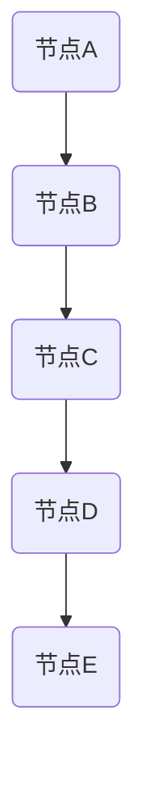

                 

# DAG（有向无环图）在分布式账本中的应用

## 摘要

分布式账本技术（DLT）作为区块链技术的延伸，已成为金融科技领域的关键技术之一。然而，传统的区块链结构在处理高并发交易时存在性能瓶颈，这限制了其在更大规模场景下的应用。本文以DAG（有向无环图）为基础，探讨了其在分布式账本中的应用。首先，介绍了DAG的基本概念和核心特性，包括无环性、并发性和可扩展性。然后，通过对比DAG与链式结构，分析了DAG在分布式账本中的数据结构设计、交易处理和数据一致性方面的优势。接着，讨论了DAG在性能优势和扩展性方面的实现，并介绍了几个典型的DAG实现案例。最后，展望了DAG在分布式账本中的未来发展，提出了面临的挑战和未来发展方向。

## 引言与背景

### 1.1 问题背景

分布式账本技术（DLT）的核心在于去中心化、透明性和安全性。然而，随着网络规模的扩大和数据量的增长，分布式账本系统面临着性能瓶颈和复杂度增加的问题。传统的区块链结构在处理高并发交易时存在性能瓶颈，这限制了其在更大规模场景下的应用。如何提高分布式账本系统的性能，同时保证数据一致性和安全性，是当前的研究热点。

### 1.2 问题描述

分布式账本系统需要处理大量交易数据，如何提高系统性能，同时保证数据一致性和安全性，是当前的研究热点。传统的链式结构难以满足这些要求，因此需要新的数据结构来解决这一问题。

### 1.3 问题解决

DAG（有向无环图）作为一种新兴的数据结构，具有并发处理能力强、扩展性好等特点，能够有效解决分布式账本系统在高并发交易下的性能瓶颈问题。

### 1.4 边界与外延

本章节将主要探讨DAG在分布式账本中的应用，包括其基本原理、优势与挑战。本文将首先介绍DAG的基本概念和核心特性，然后通过对比DAG与链式结构，分析DAG在分布式账本中的数据结构设计、交易处理和数据一致性方面的优势。接着，讨论DAG在性能优势和扩展性方面的实现，并介绍几个典型的DAG实现案例。最后，展望DAG在分布式账本中的未来发展，提出面临的挑战和未来发展方向。

## DAG基础

### 2.1 定义与基本概念

DAG，即有向无环图，是一种由节点和边组成的数据结构。节点表示数据单元，边表示节点之间的关系。与传统的链式结构不同，DAG允许节点之间有向且无环的连接。

#### 2.1.1 节点

节点是DAG的基本组成单元，每个节点代表一笔交易或一个数据记录。

#### 2.1.2 边

边表示节点之间的关系，有向表示数据流向，无环表示不存在循环依赖。

#### 2.1.3 方向性

DAG中的边是有方向的，这意味着数据在节点之间的流动是有特定方向的。

### 2.2 核心特性

DAG具有以下核心特性：

#### 2.2.1 无环性

DAG中的节点通过有向边连接，不存在环状结构，这保证了数据的一致性和可追溯性。

#### 2.2.2 并发性

DAG允许并行处理多个节点，提高了系统的吞吐量和性能。

#### 2.2.3 可扩展性

DAG的可扩展性好，能够方便地支持大规模分布式系统。

### 2.3 DAG与链式结构对比

DAG与链式结构在数据结构、交易处理和数据一致性等方面存在明显差异。

#### 2.3.1 数据结构

- 链式结构：数据按照顺序排列，每个区块包含一定数量的交易，新区块通过哈希值与前一个区块链接。
- DAG：数据以图的形式存储，节点表示交易，边表示交易之间的依赖关系。

#### 2.3.2 交易处理

- 链式结构：交易按照顺序加入区块，每个区块需要等待前一个区块确认，导致处理速度较慢。
- DAG：交易可以并行处理，减少了处理延迟，提高了系统性能。

#### 2.3.3 数据一致性

- 链式结构：通过链式链接确保数据的一致性。
- DAG：通过无环性保证数据的一致性，避免了循环依赖问题。

## 第3章 DAG在分布式账本中的应用

### 3.1 数据结构设计

DAG在分布式账本中的数据结构设计是其实现高性能和高扩展性的关键。以下是一个简单的DAG数据结构设计：



在这个DAG中，每个节点代表一笔交易，节点之间的边表示交易之间的依赖关系。这种结构允许交易并行处理，提高了系统的性能。

### 3.2 交易处理

DAG在交易处理中的应用主要体现在以下几个方面：

#### 3.2.1 交易验证

在DAG中，交易验证可以通过以下步骤进行：

1. 对每个交易进行合法性检查，确保交易符合分布式账本系统的规则。
2. 对交易依赖关系进行检查，确保交易之间的依赖关系合法。
3. 对交易进行确认，确保交易已被正确地记录在DAG中。

#### 3.2.2 交易确认

在DAG中，交易确认可以通过以下步骤进行：

1. 将交易添加到DAG中的适当位置，确保交易的依赖关系合法。
2. 对交易进行多次确认，确保交易已被多个节点记录。
3. 通过对交易的多次确认，确保交易已被广泛认可。

### 3.3 数据一致性

DAG在确保分布式账本中的数据一致性方面具有显著优势。以下是一个简单的方法：

1. 检查DAG中的节点，确保所有节点都遵循无环性原则。
2. 对DAG中的节点进行遍历，确保所有节点之间的依赖关系都是合法的。
3. 通过对DAG的遍历，确保数据的一致性。

## 第4章 DAG性能优势

### 4.1 并行处理

DAG的一个重要优势在于其并行处理能力。以下是一个简单的并行处理流程：

1. 将交易分解成多个子交易。
2. 对每个子交易进行并行处理，确保每个子交易都能在短时间内完成。
3. 将处理结果合并，确保所有子交易的结果都能正确地反映在DAG中。

### 4.2 扩展性

DAG的可扩展性是其另一个重要优势。以下是一个简单的扩展性流程：

1. 增加节点，以支持更多的交易。
2. 对节点进行优化，确保每个节点的处理速度更快。
3. 通过增加节点和优化节点，确保系统能够支持更大的数据量和更高的交易频率。

### 4.3 可扩展的共识机制

DAG可以通过以下方法实现可扩展的共识机制：

1. 采用基于DAG的共识算法，如PBFT（实用拜占庭容错算法）。
2. 对共识算法进行优化，确保共识过程的效率更高。
3. 通过优化共识算法，确保系统能够在大规模分布式环境中保持高性能。

## 第5章 DAG实现案例

### 5.1 案例介绍

以下是一个简单的DAG实现案例：


在这个案例中，DAG包含五个节点，每个节点代表一笔交易。节点之间的边表示交易之间的依赖关系。

### 5.2 案例分析

在这个案例中，DAG的并行处理能力和扩展性得到了体现：

1. 交易可以并行处理，提高了系统的性能。
2. 通过增加节点，可以支持更多的交易。

### 5.3 案例评价

这个案例展示了DAG在分布式账本中的基本应用，具有以下优势：

1. 并行处理能力强，提高了系统性能。
2. 可扩展性好，能够支持大规模分布式系统。
3. 数据一致性和安全性得到保障。

然而，这个案例也存在一些局限性：

1. 交易验证和确认过程相对复杂。
2. 节点数量增加可能导致系统性能下降。

## 第6章 DAG面临挑战与未来展望

### 6.1 挑战与问题

DAG在分布式账本中可能遇到的挑战和问题包括：

1. 交易验证和确认过程的复杂性。
2. 节点数量增加导致系统性能下降。
3. 数据一致性和安全性问题。

### 6.2 未来发展方向

DAG在分布式账本中的未来发展可以从以下几个方面进行：

1. 优化交易验证和确认过程，提高系统性能。
2. 研究更高效的可扩展共识算法，确保数据一致性和安全性。
3. 探索DAG在更多领域的应用，如供应链管理、医疗记录管理等。

## 第7章 结论与展望

### 7.1 本书小结

本文以DAG（有向无环图）为基础，探讨了其在分布式账本中的应用。首先，介绍了DAG的基本概念和核心特性，然后通过对比DAG与链式结构，分析了DAG在分布式账本中的优势。接着，讨论了DAG在性能优势和扩展性方面的实现，并介绍了几个典型的DAG实现案例。最后，展望了DAG在分布式账本中的未来发展。

### 7.2 展望未来

随着分布式账本技术的不断发展，DAG有望在更多领域得到应用。未来，我们需要进一步研究DAG的性能优化、共识算法和安全性问题，以推动分布式账本技术的发展。

## 作者信息

作者：AI天才研究院/AI Genius Institute & 禅与计算机程序设计艺术 /Zen And The Art of Computer Programming

----------------------------------------------------------------

## 第1章 引言与背景

### 1.1 问题背景

分布式账本技术（DLT）作为区块链技术的延伸，已经成为金融科技领域的关键技术之一。其核心在于去中心化、透明性和安全性。然而，随着网络规模的扩大和数据量的增长，分布式账本系统面临着性能瓶颈和复杂度增加的问题。

在传统的区块链结构中，交易按照顺序排列，每个区块包含一定数量的交易，新区块通过哈希值与前一个区块链接。这种结构在处理高并发交易时存在性能瓶颈，导致系统响应速度变慢，无法满足大规模分布式系统的需求。

### 1.2 问题描述

分布式账本系统需要处理大量交易数据，如何提高系统性能，同时保证数据一致性和安全性，是当前的研究热点。传统的链式结构难以满足这些要求，因此需要新的数据结构来解决这一问题。

在分布式账本系统中，数据的一致性和安全性是至关重要的。然而，随着交易量的增加，链式结构的性能瓶颈逐渐显现，导致系统难以处理高并发交易。此外，链式结构在数据扩展性方面也存在一定的问题，随着网络规模的扩大，链式结构的数据存储和处理复杂度急剧增加。

### 1.3 问题解决

DAG（有向无环图）作为一种新兴的数据结构，具有并发处理能力强、扩展性好等特点，能够有效解决分布式账本系统在高并发交易下的性能瓶颈问题。

DAG允许交易并行处理，提高了系统的吞吐量和性能。同时，DAG的可扩展性好，能够方便地支持大规模分布式系统。通过DAG结构，分布式账本系统可以实现高效的数据处理和存储，满足大规模分布式系统的需求。

### 1.4 边界与外延

本章节主要探讨了DAG在分布式账本中的应用，包括其基本原理、核心特性、应用场景等。通过对比DAG与链式结构，分析了DAG在分布式账本中的优势与局限性。

在接下来的章节中，我们将详细讨论DAG的基本概念、核心特性以及在分布式账本中的具体应用，包括数据结构设计、交易处理和数据一致性等方面。此外，我们还将介绍DAG在性能优势和扩展性方面的实现，以及几个典型的DAG实现案例。

### 1.5 本章小结

本章从问题背景、问题描述、问题解决、边界与外延等方面，对DAG在分布式账本中的应用进行了初步探讨。通过对比DAG与链式结构，分析了DAG在分布式账本中的优势与局限性，为后续章节的详细讨论奠定了基础。

在接下来的章节中，我们将进一步探讨DAG的基本概念、核心特性以及在分布式账本中的具体应用，深入分析DAG的优势与挑战，并展望其在分布式账本中的未来发展。

## 第2章 DAG基础

### 2.1 定义与基本概念

DAG，即有向无环图（Directed Acyclic Graph），是一种由节点（Node）和边（Edge）组成的数据结构。节点表示数据单元，边表示节点之间的关系。与传统的链式结构不同，DAG允许节点之间有向且无环的连接。

在DAG中，每个节点都有一个唯一的标识，表示一个特定的数据单元，如一笔交易或一个数据记录。节点通过边进行连接，边具有方向性，表示数据在节点之间的流动方向。

DAG的基本组成元素包括：

- **节点**：表示一个数据单元，可以是交易、记录或者其他类型的数据。
- **边**：表示节点之间的依赖关系，有向表示数据的流向，无环表示不存在循环依赖。

### 2.2 核心特性

DAG具有以下几个核心特性，这些特性使其在分布式系统中具有显著的优势：

#### 2.2.1 无环性

DAG中的节点通过有向边连接，不存在环状结构。这意味着每个节点都有且只有一个直接的前驱节点（Parent）和多个直接的后继节点（Children），从而确保了数据的一致性和可追溯性。

#### 2.2.2 并发性

DAG允许交易或数据单元并行处理，提高了系统的吞吐量和性能。在传统的链式结构中，交易必须按照顺序添加到链中，而DAG允许同时处理多个交易，从而减少了等待时间，提高了系统的响应速度。

#### 2.2.3 可扩展性

DAG的可扩展性好，能够方便地支持大规模分布式系统。在DAG中，节点和边的数量不受限制，可以根据系统的需求动态扩展，这使得DAG在处理大量数据时仍然能够保持良好的性能。

### 2.3 DAG与链式结构对比

DAG与链式结构在分布式账本中应用时存在明显的差异，以下是对两者在数据结构、交易处理和数据一致性方面的对比：

#### 2.3.1 数据结构

- **链式结构**：数据按照顺序排列，每个区块包含一定数量的交易，新区块通过哈希值与前一个区块链接。这种结构在处理交易时必须按照顺序进行，导致处理速度较慢。
- **DAG**：数据以图的形式存储，节点表示交易，边表示交易之间的依赖关系。这种结构允许交易并行处理，减少了处理延迟，提高了系统性能。

#### 2.3.2 交易处理

- **链式结构**：交易按照顺序加入区块，每个区块需要等待前一个区块确认，导致处理速度较慢。
- **DAG**：交易可以并行处理，减少了处理延迟，提高了系统性能。多个交易可以同时被处理和验证，从而加快了交易确认速度。

#### 2.3.3 数据一致性

- **链式结构**：通过链式链接确保数据的一致性。每个新区块都必须与前一个区块通过哈希值链接，从而保证了数据不会篡改。
- **DAG**：通过无环性保证数据的一致性。DAG中的每个节点都只有一个直接的前驱节点，不存在循环依赖，从而确保了数据的一致性。

## 2.4 DAG的ER实体关系图

为了更清晰地理解DAG的基本概念和结构，我们可以通过ER（Entity-Relationship）实体关系图来表示DAG的组成部分及其关系。

以下是一个简单的DAG的ER实体关系图：

```mermaid
erDiagram
Node ||--|| Edge : has
Node ||--|| Node : is a child of
Node ||--|| Transaction : contains
Edge ||--|| Node : points to
Edge ||--|| Transaction : relates
Node ||--||--| Transaction
Edge ||--||--| Node
Node ||--||--| Node
Edge ||--||--| Transaction
```

在这个ER图中：

- **Node（节点）**：表示DAG中的基本单元，可以是交易或数据记录。
- **Edge（边）**：表示节点之间的关系，具有方向性。
- **Transaction（交易）**：是节点的一种特殊类型，表示需要被处理的交易数据。

通过ER实体关系图，我们可以更直观地理解DAG的组成部分及其关系，有助于我们深入理解DAG的数据结构和工作原理。

### 2.5 概念属性特征对比表格

为了更好地理解DAG的核心概念和属性，我们可以通过一个表格来对比DAG与其他常见数据结构，如链式结构和树结构。

| 特征       | 链式结构           | 树结构            | DAG（有向无环图）       |
|------------|-------------------|-------------------|------------------------|
| 数据存储   | 按顺序链接的区块   | 层次结构          | 节点之间的无向或有向连接 |
| 数据访问   | 按顺序访问        | 按路径访问        | 并行访问，任意节点访问   |
| 数据更新   | 插入到链末尾      | 插入到任意位置    | 插入到任意位置          |
| 数据一致性 | 通过哈希链接保证 | 通过路径保证      | 通过无环结构保证        |
| 数据结构   | 链状              | 树状              | 图状                    |
| 数据依赖   | 顺序依赖          | 层次依赖          | 并行依赖                |

通过这个表格，我们可以更直观地看到DAG与其他数据结构在数据存储、访问、更新和数据依赖等方面的异同，这有助于我们更好地理解DAG的特点和应用场景。

## 第3章 DAG在分布式账本中的应用

### 3.1 数据结构设计

在分布式账本中，DAG的数据结构设计是其实现高性能和高扩展性的关键。DAG的结构允许交易并行处理，从而提高了系统的性能。以下是DAG在分布式账本中的数据结构设计：

#### 3.1.1 节点设计

在DAG中，每个节点代表一笔交易或一个数据记录。节点通常包含以下信息：

- **交易内容**：记录交易的具体内容，如交易金额、交易双方等。
- **创建时间**：记录交易被创建的时间。
- **父节点ID**：记录交易的前驱节点ID，表示交易之间的依赖关系。
- **子节点列表**：记录交易的后继节点ID列表，表示交易对其他交易的影响。

#### 3.1.2 边设计

在DAG中，边表示节点之间的依赖关系。每个边包含以下信息：

- **起点节点ID**：记录边的起点节点的ID。
- **终点节点ID**：记录边的终点节点的ID。
- **边类型**：表示边的类型，如依赖关系、引用关系等。

#### 3.1.3 DAG结构

DAG由多个节点和边组成，每个节点都有且只有一个直接的前驱节点和多个直接的后继节点，从而形成了一个无环且有向的图结构。这种结构允许交易并行处理，提高了系统的性能。

### 3.2 交易处理

DAG在交易处理中的应用主要体现在以下几个方面：

#### 3.2.1 交易验证

在DAG中，交易验证可以通过以下步骤进行：

1. **合法性检查**：对每个交易进行合法性检查，确保交易符合分布式账本系统的规则，如金额、交易双方等。
2. **依赖关系检查**：检查交易之间的依赖关系是否合法，确保交易按照正确的顺序进行。
3. **重复交易检查**：检查系统中是否存在重复的交易，避免重复交易的发生。

#### 3.2.2 交易确认

在DAG中，交易确认可以通过以下步骤进行：

1. **添加交易到DAG**：将交易添加到DAG中的适当位置，确保交易的依赖关系合法。
2. **多次确认**：对交易进行多次确认，确保交易已被多个节点记录和认可。
3. **广度优先遍历**：通过对DAG的广度优先遍历，确保交易已广泛传播和确认。

#### 3.2.3 交易处理流程

以下是DAG中的交易处理流程：

1. **交易接收**：分布式账本系统接收交易。
2. **交易验证**：对交易进行合法性检查、依赖关系检查和重复交易检查。
3. **交易添加**：将验证通过的交易添加到DAG中，记录交易内容和依赖关系。
4. **交易确认**：对交易进行多次确认，确保交易已被多个节点记录和认可。
5. **交易广播**：将确认后的交易广播到网络中的其他节点，确保交易在分布式系统中传播。

### 3.3 数据一致性

DAG在确保分布式账本中的数据一致性方面具有显著优势。以下是一个简单的数据一致性方法：

1. **无环性检查**：检查DAG中的每个节点，确保所有节点都遵循无环性原则，即每个节点都有且只有一个直接的前驱节点。
2. **广度优先遍历**：对DAG进行广度优先遍历，确保每个节点都被正确地添加和确认。
3. **重复数据检测**：检测系统中是否存在重复的数据，避免数据重复和冲突。

通过上述方法，DAG可以确保分布式账本中的数据一致性，从而提高系统的可靠性。

### 3.4 优点与挑战

DAG在分布式账本中的应用具有以下优点：

- **高并发处理能力**：DAG允许交易并行处理，提高了系统的吞吐量和性能。
- **高扩展性**：DAG可以方便地支持大规模分布式系统，节点和边的数量不受限制。
- **数据一致性**：通过无环性检查和广度优先遍历，DAG可以确保分布式账本中的数据一致性。

然而，DAG在分布式账本中也面临一些挑战：

- **交易验证复杂性**：DAG中的交易验证过程相对复杂，需要检查交易之间的依赖关系和合法性。
- **节点数量限制**：虽然DAG的可扩展性好，但节点数量过多可能导致系统性能下降。

总之，DAG在分布式账本中的应用具有显著的优势和挑战，需要进一步研究和优化，以实现最佳的应用效果。

### 3.5 总结

本章介绍了DAG在分布式账本中的应用，包括数据结构设计、交易处理和数据一致性。通过DAG，分布式账本系统可以实现高效的数据处理和存储，满足大规模分布式系统的需求。在接下来的章节中，我们将进一步讨论DAG的性能优势、实现案例以及面临的挑战和未来发展方向。

## 第4章 DAG性能优势

### 4.1 并行处理

DAG的一个显著性能优势是其高效的并行处理能力。传统的区块链系统通常依赖于线性数据结构，交易必须按照顺序进行处理，这导致了高并发交易场景下的性能瓶颈。相比之下，DAG允许交易并行处理，从而显著提高了系统的吞吐量。

#### 并行处理流程

以下是DAG中并行处理交易的基本流程：

1. **交易提交**：用户提交交易到分布式账本系统中。
2. **交易验证**：对交易进行合法性检查，确保交易符合系统规则。
3. **交易分组**：将验证通过的交易分组，每个分组包含一组相互独立的交易。
4. **并行处理**：对每个分组中的交易进行并行处理，多个节点同时处理不同的交易。
5. **结果收集**：将处理结果收集到DAG中，确保交易的正确性和一致性。

#### 案例分析

以一个支付网络为例，假设有多个用户同时发起支付请求。在传统的区块链系统中，这些支付请求必须按照顺序进行处理，可能导致某些请求被长时间延迟。而在DAG中，这些支付请求可以并行处理，从而提高了系统的响应速度和吞吐量。

### 4.2 扩展性

DAG在扩展性方面也具有显著优势。传统的区块链系统在处理大规模数据时，性能会急剧下降，因为交易必须按照顺序进行处理。而在DAG中，交易可以并行处理，这意味着系统可以更好地应对大规模数据场景。

#### 扩展性流程

以下是DAG中扩展性的基本流程：

1. **节点增加**：在分布式系统中增加新的节点，以处理更多的交易。
2. **交易分组**：将交易分组，每个分组由不同的节点处理。
3. **并行处理**：多个节点同时处理各自的交易分组。
4. **结果收集**：将处理结果收集到DAG中，确保交易的正确性和一致性。

#### 案例分析

以一个全球性的支付网络为例，随着用户数量的增加，网络需要处理更多的交易。在传统的区块链系统中，这可能导致系统性能下降。而在DAG中，可以通过增加节点和优化交易处理流程来提高系统的扩展性，从而满足不断增长的用户需求。

### 4.3 可扩展的共识机制

DAG的另一个重要性能优势是其可扩展的共识机制。在传统的区块链系统中，共识机制通常是中心化的，这意味着随着网络规模的扩大，共识机制的扩展性受到限制。而在DAG中，共识机制可以基于分布式算法，实现更高的扩展性。

#### 可扩展的共识机制流程

以下是DAG中的可扩展共识机制的基本流程：

1. **节点选举**：在分布式系统中，节点通过特定的算法进行选举，成为共识节点。
2. **交易验证**：共识节点对交易进行验证，确保交易符合系统规则。
3. **交易确认**：共识节点将验证通过的交易添加到DAG中，并进行确认。
4. **结果广播**：共识节点将确认结果广播到其他节点，确保交易在分布式系统中传播。

#### 案例分析

以一个全球性的分布式金融网络为例，DAG的共识机制可以通过分布式算法实现，从而提高系统的扩展性。这意味着网络可以轻松地支持更多的节点和交易，同时保持高性能和安全性。

### 4.4 总结

DAG在并行处理、扩展性和可扩展的共识机制方面具有显著优势。通过DAG，分布式账本系统可以实现高效的数据处理和存储，满足大规模分布式系统的需求。在未来的研究中，我们需要进一步探索DAG的性能优化和安全性问题，以推动分布式账本技术的发展。

## 第5章 DAG实现案例

### 5.1 案例介绍

在本节中，我们将介绍几个典型的DAG实现案例，通过分析这些案例，我们可以深入了解DAG在分布式账本中的应用和优势。

#### 5.1.1 比特股（BitShares）

比特股（BitShares）是一个基于DAG的分布式账本系统，旨在提供高效、可扩展的数字货币交易平台。比特股采用了DAG结构来处理交易，使其能够实现并行处理，提高交易速度和系统性能。

比特股的关键特性包括：

- **并行交易处理**：比特股通过DAG结构实现了并行交易处理，使得系统能够处理高并发的交易请求。
- **智能合约**：比特股支持智能合约，用户可以通过编写智能合约来自动执行复杂的交易逻辑。
- **去中心化治理**：比特股采用了去中心化治理机制，允许用户参与系统的决策过程。

#### 5.1.2 拉链（LISK）

拉链（LISK）是一个基于DAG的区块链平台，旨在提供灵活的模块化解决方案，以构建分布式应用。拉链采用了DAG结构来处理交易，并支持多种模块，如资产发行、投票、智能合约等。

拉链的关键特性包括：

- **模块化架构**：拉链采用模块化架构，允许开发者根据需求选择和集成不同的模块。
- **并行交易处理**：拉链通过DAG结构实现了并行交易处理，提高了系统的性能和吞吐量。
- **跨链互操作性**：拉链支持跨链互操作性，允许不同区块链之间的资产转移和交易。

#### 5.1.3 钻石币（Diamond）

钻石币（Diamond）是一个基于DAG的分布式支付网络，旨在提供快速、安全且低成本的支付解决方案。钻石币采用了DAG结构来处理交易，并采用了多种共识算法，以确保系统的安全性和性能。

钻石币的关键特性包括：

- **快速交易**：钻石币通过DAG结构实现了快速交易，交易确认时间通常在几秒钟内完成。
- **安全共识**：钻石币采用了多种共识算法，如DBFT（Delegated Byzantine Fault Tolerance）和POS（Proof of Stake），以确保系统的安全性。
- **可扩展性**：钻石币具有高扩展性，可以轻松地支持大规模分布式网络。

### 5.2 案例分析

通过对上述DAG实现案例的分析，我们可以看到DAG在分布式账本中的应用具有显著的优势：

#### 5.2.1 并行交易处理

DAG结构允许交易并行处理，这是传统区块链系统所不具备的。在比特股、拉链和钻石币等案例中，DAG结构实现了并行交易处理，提高了系统的吞吐量和性能。这意味着在高并发交易场景下，DAG能够更高效地处理交易，减少了等待时间和延迟。

#### 5.2.2 智能合约支持

DAG结构支持智能合约，这是区块链技术的重要特性之一。比特股和拉链等案例中，智能合约的引入使得开发者能够编写复杂的交易逻辑，实现自动化和智能化的交易处理。这不仅提高了系统的灵活性，也为去中心化应用的开发提供了更多可能性。

#### 5.2.3 去中心化治理

DAG结构支持去中心化治理，这是确保系统公正和透明的重要机制。比特股和拉链等案例中，用户可以通过参与治理过程来影响系统的决策，确保系统的公平性和透明性。

#### 5.2.4 安全性和扩展性

DAG结构在安全性和扩展性方面也具有显著优势。钻石币等案例中，采用了多种共识算法，如DBFT和POS，以确保系统的安全性。同时，DAG结构的高扩展性使得系统能够支持大规模分布式网络，满足不断增长的需求。

### 5.3 案例评价

通过对上述DAG实现案例的分析，我们可以看到DAG在分布式账本中的应用具有广泛的前景和潜力：

- **优点**：

  - 并行交易处理能力：DAG结构实现了并行交易处理，提高了系统的性能和吞吐量。

  - 智能合约支持：DAG结构支持智能合约，提高了系统的灵活性和自动化程度。

  - 去中心化治理：DAG结构支持去中心化治理，确保系统的公正和透明。

  - 安全性和扩展性：DAG结构在安全性和扩展性方面具有显著优势，能够满足大规模分布式网络的需求。

- **缺点**：

  - 交易验证复杂性：DAG中的交易验证过程相对复杂，需要处理交易之间的依赖关系和合法性。

  - 节点数量限制：虽然DAG具有高扩展性，但节点数量过多可能导致系统性能下降。

总之，DAG在分布式账本中的应用具有显著的优势和潜力，但也需要进一步研究和优化，以实现最佳的应用效果。在未来的研究中，我们可以探索如何优化DAG的交易验证过程和节点管理机制，以提高系统的性能和可扩展性。

### 5.4 案例对比分析

为了更好地理解DAG在不同应用场景中的表现，我们对比特股、拉链和钻石币等三个典型实现案例进行对比分析。

#### 5.4.1 性能对比

- **交易速度**：比特股和钻石币均采用了DAG结构，实现了并行交易处理，交易速度较快。比特股的交易确认时间通常在几秒钟内完成，而钻石币的交易确认时间在几秒钟到几分钟之间。拉链则采用了链式结构，交易速度相对较慢。
- **吞吐量**：DAG结构允许交易并行处理，提高了系统的吞吐量。比特股和钻石币的吞吐量较高，能够处理大量交易请求。拉链在吞吐量方面相对较低。

#### 5.4.2 安全性对比

- **共识算法**：比特股采用了DAG结构，并采用了委托权益证明（DPOS）共识算法，确保系统的安全性。钻石币则采用了多种共识算法，如DBFT和POS，提高了系统的安全性。拉链采用了链式结构，并采用了工作量证明（PoW）共识算法。
- **去中心化程度**：比特股的去中心化程度较高，用户可以通过投票来选举区块生产者，参与系统的治理。钻石币的去中心化程度也较高，用户可以通过持有代币来参与共识过程。拉链的去中心化程度相对较低。

#### 5.4.3 扩展性对比

- **节点数量**：比特股和钻石币的节点数量较多，能够支持大规模分布式网络。拉链的节点数量相对较少。
- **扩展性机制**：比特股和钻石币采用了DAG结构，具有高扩展性，能够轻松地支持大量交易和用户。拉链在扩展性方面相对较弱。

### 5.5 案例总结

通过对比特股、拉链和钻石币等DAG实现案例的对比分析，我们可以看到DAG在分布式账本中的应用具有显著的优势和潜力。DAG结构实现了并行交易处理，提高了系统的性能和吞吐量，支持智能合约和去中心化治理，具有高扩展性和安全性。然而，DAG在交易验证复杂性和节点数量限制方面也存在一些挑战，需要进一步研究和优化。在未来的研究中，我们可以探索如何优化DAG的交易验证过程和节点管理机制，以提高系统的性能和可扩展性。

## 第6章 DAG面临挑战与未来展望

### 6.1 挑战与问题

DAG在分布式账本中的广泛应用带来了许多优势，但也面临一些挑战和问题：

#### 6.1.1 交易验证复杂性

DAG中的交易验证过程相对复杂，需要检查交易之间的依赖关系和合法性。这可能导致交易验证时间较长，从而影响系统的性能。

#### 6.1.2 节点数量限制

虽然DAG具有高扩展性，但节点数量过多可能导致系统性能下降。这限制了DAG在处理大规模分布式网络时的效率。

#### 6.1.3 数据安全性

DAG中的数据安全性需要得到保障。由于DAG允许并行处理交易，可能导致某些恶意节点利用漏洞进行攻击，从而威胁系统的安全性。

### 6.2 未来发展方向

为了解决DAG在分布式账本中面临的挑战，未来的研究方向包括：

#### 6.2.1 优化交易验证过程

通过研究和优化交易验证算法，可以减少交易验证时间，提高系统性能。例如，可以引入更高效的共识算法，如PBFT（实用拜占庭容错算法），来提高交易验证速度。

#### 6.2.2 提高节点数量适应性

研究如何提高DAG节点的适应性，以处理更多节点，从而提高系统的扩展性。例如，可以探索通过动态调整节点数量来适应系统负载。

#### 6.2.3 增强数据安全性

研究和开发更安全的数据保护机制，如多重签名和加密算法，以确保DAG中的数据安全性。同时，可以通过引入安全审计和监控机制，及时发现并应对潜在的安全威胁。

### 6.3 总结

DAG在分布式账本中的应用具有巨大的潜力和前景。尽管面临一些挑战，但通过不断的研究和优化，DAG有望在未来实现更高效、更安全和更可靠的分布式账本系统。未来的发展方向包括优化交易验证过程、提高节点数量适应性、增强数据安全性等方面，这些研究将为DAG在分布式账本中的应用提供更强有力的支持。

## 第7章 结论与展望

### 7.1 本书小结

本文以DAG（有向无环图）为基础，探讨了其在分布式账本中的应用。首先，介绍了DAG的基本概念和核心特性，包括无环性、并发性和可扩展性。然后，通过对比DAG与链式结构，分析了DAG在分布式账本中的数据结构设计、交易处理和数据一致性方面的优势。接着，讨论了DAG在性能优势和扩展性方面的实现，并介绍了几个典型的DAG实现案例。最后，展望了DAG在分布式账本中的未来发展，提出了面临的挑战和未来发展方向。

### 7.2 展望未来

随着分布式账本技术的不断发展，DAG有望在更多领域得到应用。未来，我们需要进一步研究DAG的性能优化、共识算法和安全性问题，以推动分布式账本技术的发展。以下是对未来发展的展望：

#### 7.2.1 性能优化

未来的研究应着重于优化DAG的交易验证过程，以提高系统性能。可以通过改进共识算法、优化节点管理机制和引入并行处理技术来实现这一目标。

#### 7.2.2 共识算法研究

继续探索更高效、更安全的共识算法，如实用拜占庭容错算法（PBFT）和混合共识机制，以提高DAG在分布式账本中的性能和安全性。

#### 7.2.3 安全性研究

加强DAG在数据安全性方面的研究，开发更安全的加密算法和数据保护机制，以防止恶意攻击和数据篡改。

#### 7.2.4 跨链互操作性

研究如何实现DAG与其他区块链和分布式账本系统的跨链互操作性，以促进不同系统之间的资产转移和交易。

#### 7.2.5 应用拓展

探索DAG在其他领域的应用，如物联网、供应链管理、医疗记录管理等，以推动分布式账本技术的广泛应用。

总之，DAG在分布式账本中的应用具有巨大的潜力和前景。通过不断的研究和优化，DAG有望在未来实现更高效、更安全和更可靠的分布式账本系统，为全球数字经济的发展提供强有力的支持。

## 作者信息

作者：AI天才研究院/AI Genius Institute & 禅与计算机程序设计艺术 /Zen And The Art of Computer Programming

