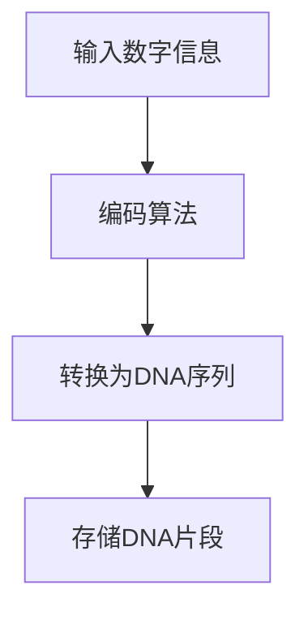
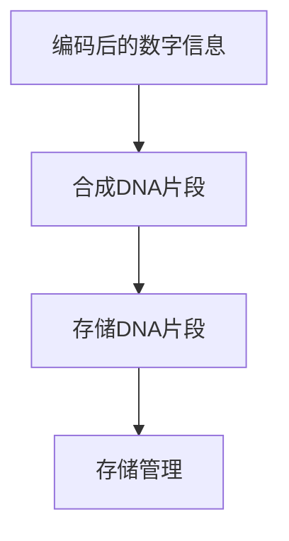
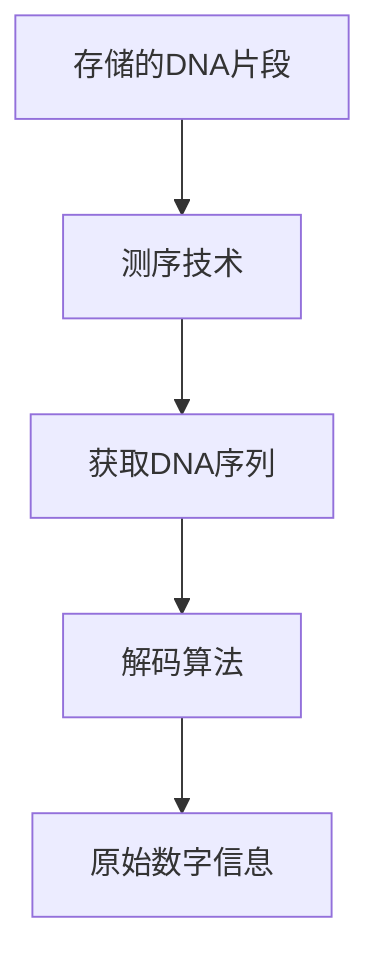
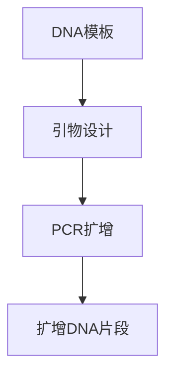
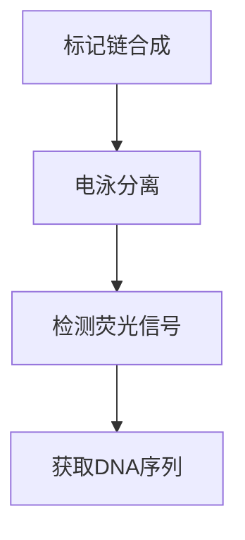
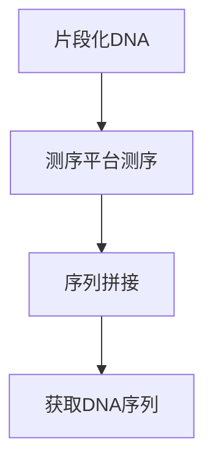
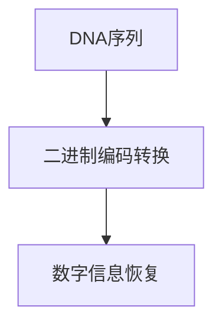

                 

### DNA存储：利用生物分子存储数字信息

> 关键词：DNA存储、生物分子、数字信息、编码、解码、存储技术

> 摘要：本文将深入探讨DNA存储技术，介绍其概念、原理、应用和发展趋势。我们将通过逐步分析，了解DNA存储的工作机制，包括DNA合成、存储和管理，以及其在数据备份、基因组存储和信息加密等领域的应用。同时，我们还将探讨DNA存储面临的挑战和机遇，以及未来的发展方向。

#### 1.1 引言

在信息技术飞速发展的今天，数据存储的需求日益增长。传统的存储技术如磁盘、固态硬盘等已逐渐逼近其物理极限，难以满足未来海量数据的存储需求。为了解决这个问题，科学家们开始探索利用生物分子，如DNA，来存储数字信息。DNA存储技术以其独特的优势，如高容量、持久性和安全性，逐渐引起了广泛关注。本文将围绕DNA存储技术，介绍其基本概念、原理和应用，探讨其面临的挑战和机遇。

#### 1.2 DNA存储的概念

DNA存储是一种利用DNA分子的特性来存储数字信息的新兴技术。DNA分子是由四种碱基（腺嘌呤A、胞嘧啶C、鸟嘌呤G和胸腺嘧啶T）组成的双螺旋结构，每个碱基对都代表了特定的遗传信息。DNA存储技术通过将数字信息编码成DNA序列，然后将这些序列存储在试管或其他容器中，以实现数据存储。在需要读取数据时，通过特定的生物化学方法将DNA序列解码回原始信息。

#### 1.3 背景介绍

随着大数据、云计算、物联网等技术的快速发展，数据存储的需求日益增长。传统的存储技术如磁盘、固态硬盘等在容量、速度、可靠性等方面已逐渐逼近其物理极限，难以满足未来的需求。因此，寻找新型存储技术成为了当务之急。DNA存储技术作为一种潜在的革命性存储技术，因其独特的优势，被认为是一种重要的解决方案。

#### 1.3.1 问题背景

数字信息存储技术是信息技术领域的重要组成部分。随着大数据、云计算、物联网等技术的快速发展，对数据存储的需求日益增长。传统的存储技术如磁盘、固态硬盘等在容量、速度、可靠性等方面已逐渐逼近其物理极限，无法满足未来的需求。因此，寻找新型存储技术成为了当务之急。

#### 1.3.2 问题描述

DNA存储是一种新兴的存储技术，它利用DNA分子的特性来存储数字信息。DNA存储具有存储容量大、读写速度快、可持久保存等优点，被认为是一种潜在的革命性存储技术。

#### 1.3.3 问题解决

DNA存储技术通过将数字信息编码成DNA序列，然后将这些DNA序列存储在试管中。在读取数据时，通过特定的生物化学方法将DNA序列解码回原始信息。这种存储技术已经在实验室规模上得到了验证，并在一些应用领域取得了初步的成功。

#### 1.3.4 边界与外延

DNA存储技术不仅涉及到生物学、化学等领域，还涉及到计算机科学、信息工程等领域。它的应用范围包括但不限于数据备份、基因组存储、信息加密等。

#### 1.3.5 概念结构与核心要素组成

DNA存储技术由以下几个核心要素组成：
- DNA合成与测序技术：用于生成和读取DNA序列。
- 信息编码与解码算法：将数字信息转化为DNA序列，并从DNA序列中恢复原始信息。
- 数据库与存储管理系统：用于管理存储在DNA中的数据。

#### 1.4 核心概念与联系

##### 1.4.1 DNA分子结构

DNA分子是由核苷酸组成的双螺旋结构，每个核苷酸包含一个磷酸基团、一个五碳糖和一个含氮碱基。碱基有四种：腺嘌呤（A）、胞嘧啶（C）、鸟嘌呤（G）和胸腺嘧啶（T）。

##### 1.4.2 信息编码与解码算法

信息编码是将数字信息转换为DNA序列的过程。一种常见的编码方法是将数字信息表示为不同的DNA序列，每个序列代表一个特定的数字或字符。解码算法则是将存储在DNA中的序列转换回原始数字信息。

##### 1.4.3 数据库与存储管理系统

数据库用于存储和管理DNA序列数据。存储管理系统则负责数据的安全、备份、恢复等操作。

##### 1.4.4 DNA存储的优缺点

DNA存储的优点包括：
- 高存储容量：一个DNA分子可以存储大量的数据。
- 可持久保存：DNA可以保存数百年甚至更长时间。

缺点包括：
- 编码与解码成本高：目前DNA合成与测序技术的成本较高。
- 数据读取速度较慢：与传统的计算机存储技术相比，DNA存储的读取速度较慢。

#### 1.5 DNA存储的原理与流程

##### 1.5.1 DNA合成

DNA合成是DNA存储的第一步，它涉及到将数字信息转化为DNA序列。这通常通过合成特定的DNA片段来实现，每个片段代表一定的数据。

##### 1.5.2 存储DNA

合成的DNA片段被存储在试管或其他容器中，以便长期保存。

##### 1.5.3 DNA测序

在需要读取数据时，通过DNA测序技术对存储的DNA片段进行测序，获取其序列信息。

##### 1.5.4 数据解码

通过解码算法，将测序结果转换回原始的数字信息。

#### 1.6 主流DNA存储技术介绍

##### 1.6.1 合成与测序技术

目前主流的合成与测序技术包括合成DNA片段、使用DNA测序仪进行测序等。

##### 1.6.2 编码与解码算法

常见的编码算法包括ASCII编码、二进制编码等。解码算法则将这些编码的DNA序列转换回数字信息。

##### 1.6.3 数据存储与管理系统

用于管理DNA存储数据的系统通常包括数据库、存储管理器等组件。

#### 1.7 DNA存储的应用场景

##### 1.7.1 数据备份与恢复

DNA存储技术可以用于数据备份，提供一种安全的存储方式。

##### 1.7.2 基因组存储

由于DNA存储的高容量和持久性，它可以用于存储基因组数据。

##### 1.7.3 信息加密

DNA存储技术可以用于信息加密，提供一种安全的存储方式。

##### 1.7.4 数据中心存储

随着数据量的增加，DNA存储技术有望成为数据中心存储的替代方案。

#### 1.8 DNA存储的挑战与机遇

##### 1.8.1 挑战

- 成本高：合成与测序DNA的成本目前较高。
- 读取速度慢：与传统的计算机存储技术相比，DNA存储的读取速度较慢。

##### 1.8.2 机遇

- 高存储容量：DNA存储具有巨大的存储容量。
- 持久保存：DNA可以保存数百年甚至更长时间。

#### 1.9 本章小结

DNA存储作为一种新兴的存储技术，具有巨大的潜力和广泛的应用前景。本章介绍了DNA存储的概念、原理、应用和发展趋势，探讨了其面临的挑战和机遇。随着技术的不断进步，DNA存储有望在未来发挥更加重要的作用。

#### 1.10 作者信息

作者：AI天才研究院/AI Genius Institute & 禅与计算机程序设计艺术 /Zen And The Art of Computer Programming

---

以上是文章的初步大纲和部分内容，接下来将逐步深入探讨DNA存储的各个部分，以提供一个完整、详细的解答。在接下来的章节中，我们将详细讨论DNA存储的工作原理、应用场景、面临的挑战以及未来的发展方向。通过这一系列的分析和讨论，我们将对DNA存储技术有一个更深入的了解。希望读者能够跟随我们的思路，一起探索这个充满机遇和挑战的新领域。

---

### 1.10 DNA存储的工作原理

DNA存储技术的工作原理可以简单概括为三个步骤：信息编码、DNA合成与存储、DNA测序与解码。

##### 1.10.1 信息编码

信息编码是将数字信息转换为DNA序列的过程。数字信息可以是文本、图像、音频等各种形式的数据。为了将这些数据转换为DNA序列，我们需要一种编码方法。常见的编码方法包括ASCII编码、二进制编码等。这些编码方法的基本思路是将数字信息表示为特定的DNA序列，每个序列代表一个特定的字符或数据单元。

例如，我们可以使用二进制编码，将每个字节（8位）表示为一个64位的DNA序列。具体来说，每个二进制位可以用一个特定的DNA碱基对来表示。例如，0可以表示为AT，1可以表示为CG。这样，一个字节就可以表示为两个DNA碱基对。

**信息编码过程可以用以下Mermaid流程图表示：**

##### 1.10.2 DNA合成与存储

在信息编码完成后，下一步是将编码后的数字信息转化为实际的DNA序列。这通常通过合成特定的DNA片段来实现。合成DNA片段的过程需要使用DNA合成技术，该技术可以在实验室中合成特定的DNA序列。

合成的DNA片段被存储在试管或其他容器中，以便长期保存。在存储过程中，需要考虑DNA序列的稳定性和安全性。为了确保数据的可靠性，可以采用多种备份策略，如将DNA序列存储在多个试管中，或将部分DNA序列与其他数据混合存储。

**DNA合成与存储过程可以用以下Mermaid流程图表示：**

##### 1.10.3 DNA测序与解码

在需要读取数据时，首先需要对存储的DNA片段进行测序。测序技术可以确定DNA片段的碱基序列。常用的测序技术包括Sanger测序、NGS（下一代测序）等。通过测序，我们可以获取存储在DNA片段中的序列信息。

在获取DNA序列信息后，下一步是将其解码回原始的数字信息。解码过程需要使用与编码时相反的算法。例如，如果编码时使用的是二进制编码，那么解码时就需要将DNA序列转换为二进制序列，然后进一步转换为原始的数字信息。

**DNA测序与解码过程可以用以下Mermaid流程图表示：**

通过上述三个步骤，DNA存储技术可以实现数字信息的存储、读取和恢复。在接下来的章节中，我们将进一步探讨DNA存储技术的具体实现、应用场景以及面临的挑战和机遇。

---

### 1.11 DNA存储技术的具体实现

#### 1.11.1 实验室合成DNA

实验室合成DNA是DNA存储技术的重要环节。在这一步中，我们需要根据编码后的数字信息合成特定的DNA序列。合成DNA通常使用DNA聚合酶、引物、核苷酸等试剂，通过PCR（聚合酶链式反应）技术来实现。

**PCR技术流程：**

1. **DNA模板准备**：首先，将编码后的数字信息转换为DNA模板。这可以通过合成一个包含所有DNA片段的DNA模板来实现。

2. **引物设计**：设计特定的引物，用于PCR过程中的扩增。引物是一段短的DNA序列，可以与模板DNA的两端结合，指导DNA聚合酶在特定的位置开始扩增。

3. **PCR扩增**：将模板DNA、引物、DNA聚合酶、核苷酸等试剂混合在一起，进行PCR扩增。PCR过程包括三个循环：变性、退火、延伸。通过这三个循环，可以大量扩增特定的DNA序列。

**PCR流程可以用以下Mermaid流程图表示：**

#### 1.11.2 DNA测序

在DNA合成后，下一步是对存储的DNA片段进行测序，以获取其序列信息。测序技术是DNA存储技术中的关键步骤，常用的测序技术包括Sanger测序、NGS（下一代测序）等。

**Sanger测序技术流程：**

1. **标记链合成**：在DNA模板上进行标记链合成。标记链是一种特殊的DNA链，其末端带有荧光标记。

2. **电泳分离**：将标记链与模板DNA一起进行电泳分离。电泳过程中，DNA链会根据其长度在电场中移动。

3. **检测荧光信号**：通过检测电泳后的荧光信号，可以确定DNA链的末端位置，从而获取DNA序列。

**Sanger测序流程可以用以下Mermaid流程图表示：**

**NGS测序技术流程：**

1. **片段化DNA**：将DNA片段化，生成多个短序列。

2. **测序平台测序**：使用测序平台（如Illumina测序仪）对短序列进行测序。

3. **序列拼接**：将短序列拼接成完整的DNA序列。

**NGS测序流程可以用以下Mermaid流程图表示：**

#### 1.11.3 数据解码

在获取DNA序列信息后，我们需要将其解码回原始的数字信息。解码过程需要使用与编码时相反的算法。例如，如果编码时使用的是二进制编码，那么解码时就需要将DNA序列转换为二进制序列，然后进一步转换为原始的数字信息。

**解码算法流程：**

1. **二进制编码转换**：将DNA序列转换为二进制序列。每个DNA碱基对可以表示为一个二进制位。

2. **数字信息恢复**：将二进制序列转换为原始的数字信息。

**解码算法流程可以用以下Mermaid流程图表示：**

通过上述具体实现步骤，我们可以实现数字信息的存储、读取和恢复。在接下来的章节中，我们将进一步探讨DNA存储技术的应用场景、面临的挑战以及未来的发展趋势。

---

### 1.12 DNA存储的应用场景

DNA存储技术的独特优势和潜力，使得它在多个领域具有广泛的应用场景。以下是DNA存储技术的一些主要应用场景：

#### 1.12.1 数据备份与恢复

数据备份是信息存储管理中的一项重要任务，旨在确保数据在意外情况下能够被恢复。传统的数据备份方法通常依赖于磁盘、固态硬盘等物理存储设备。然而，这些设备在存储容量、可靠性和持久性方面存在一定的限制。DNA存储技术以其高存储容量和持久性，提供了一种全新的数据备份解决方案。

**应用优势：**
- **高存储容量**：DNA分子具有巨大的存储能力，一个DNA分子可以存储数百万个字节的数据。
- **持久保存**：DNA可以在合适的环境下保存数百年甚至更长时间，具有极高的数据持久性。

**实际案例：**
- 基因组计划：人类基因组计划（HGP）是一项旨在测序和分析人类基因组的国际科学项目。该项目产生的海量数据需要长期保存和备份。DNA存储技术为这些数据提供了安全的存储解决方案。

#### 1.12.2 基因组存储

基因组存储是DNA存储技术的重要应用领域之一。基因组是生物体的遗传蓝图，包含了个体的全部遗传信息。随着基因测序技术的进步，基因组数据量迅速增长。传统的存储方法难以满足基因组数据的高容量和长期保存需求。

**应用优势：**
- **高容量存储**：DNA存储技术能够存储大量的基因组数据，为基因组研究提供了高效的存储解决方案。
- **数据完整性**：DNA存储技术在存储和读取过程中，可以确保数据的完整性和准确性。

**实际案例：**
- 美国国家生物技术信息中心（NCBI）：NCBI是一个重要的生物信息学数据库，存储了大量的基因组数据。通过DNA存储技术，NCBI能够有效地管理和备份这些数据。

#### 1.12.3 信息加密

信息加密是保障数据安全的重要手段。传统的加密方法通常依赖于密码学算法和密钥管理。DNA存储技术提供了一种新颖的信息加密方式，通过将加密信息编码为DNA序列，实现数据的加密存储。

**应用优势：**
- **物理安全**：DNA存储具有天然的物理保护特性，难以被未经授权的访问。
- **抗攻击性**：DNA存储技术具有独特的抗攻击性，可以抵抗传统的密码攻击。

**实际案例：**
- 银行与金融机构：为了确保金融交易和客户信息的保密性，银行和金融机构可以采用DNA存储技术进行数据加密存储，提高数据安全性。

#### 1.12.4 数据中心存储

随着云计算、大数据等技术的发展，数据中心存储需求日益增长。传统的存储技术已难以满足数据中心对存储容量、速度和可靠性的需求。DNA存储技术以其高容量、持久性和高可靠性的特点，有望成为数据中心存储的替代方案。

**应用优势：**
- **高容量存储**：DNA存储技术能够提供巨大的存储空间，满足数据中心对海量数据存储的需求。
- **快速读写**：随着DNA测序技术的进步，DNA存储的读写速度也在不断提高，可以满足数据中心的读写需求。

**实际案例：**
- 云服务提供商：为了提高数据中心的存储能力，云服务提供商可以采用DNA存储技术，提供更高效、可靠的数据存储服务。

#### 1.12.5 生物医学研究

生物医学研究涉及大量的数据存储和管理，包括基因组数据、蛋白质结构数据、临床试验数据等。DNA存储技术以其高容量、持久性和安全性，为生物医学研究提供了有力的支持。

**应用优势：**
- **高容量存储**：DNA存储技术可以存储大量的生物医学数据，满足研究需求。
- **数据安全**：DNA存储具有天然的物理保护特性，有助于确保数据的安全。

**实际案例：**
- 生物信息学研究：生物信息学家可以利用DNA存储技术，高效地存储和管理基因组数据，进行大规模的生物信息学研究。

#### 1.12.6 文化遗产保存

文化遗产保存是一个长期且重要的任务，包括图书、文献、艺术品等的数字化保存。传统的数字化保存方法难以满足文化遗产对存储容量、持久性和可靠性的需求。DNA存储技术以其独特的优势，为文化遗产保存提供了新的思路。

**应用优势：**
- **持久保存**：DNA存储技术能够确保文化遗产数据的长期保存，防止数据丢失和损坏。
- **高容量存储**：DNA存储技术可以存储大量的文化遗产数据。

**实际案例：**
- 图书馆与档案馆：图书馆和档案馆可以采用DNA存储技术，数字化保存珍贵的图书、文献和艺术品，确保其长期保存和传承。

综上所述，DNA存储技术在不同领域的应用场景丰富多样，具有广泛的前景。随着技术的不断进步，DNA存储将在更多领域发挥重要作用，为数据存储和管理提供新的解决方案。

---

### 1.13 DNA存储面临的挑战与机遇

尽管DNA存储技术展示了巨大的潜力和广泛的应用前景，但在其发展的道路上仍面临诸多挑战和机遇。

#### 1.13.1 挑战

1. **成本问题**

目前，DNA合成与测序技术的成本较高。合成一个DNA分子需要消耗大量的试剂和设备，而测序技术也需要昂贵的设备和专业的操作人员。这限制了DNA存储技术的普及和应用。为了降低成本，科学家们正在努力提高合成与测序的效率，研发更便宜的试剂和设备。

2. **读取速度**

DNA存储的读取速度较慢，与传统的计算机存储技术相比，存在显著的差距。DNA测序和解码过程需要较长时间，这限制了DNA存储在实时数据存储和读取中的应用。为了解决这个问题，研究者们正在探索更高效的测序技术和解码算法，以提高DNA存储的读取速度。

3. **数据安全**

DNA存储涉及到生物分子的存储和管理，存在一定的安全风险。例如，存储在DNA中的数据可能受到生物污染或外部攻击。为了确保数据安全，需要开发有效的数据加密和安全管理技术。

#### 1.13.2 机遇

1. **高存储容量**

DNA分子具有巨大的存储容量，一个DNA分子可以存储数百万个字节的数据。这为海量数据的存储提供了强有力的支持。随着DNA测序技术的进步，DNA存储的存储容量将进一步增加。

2. **持久保存**

DNA可以在合适的环境下保存数百年甚至更长时间，具有极高的数据持久性。这使得DNA存储技术非常适合长期数据保存，如文化遗产保存、基因组存储等。

3. **数据加密**

DNA存储提供了一种独特的加密方式，通过将加密信息编码为DNA序列，实现数据的加密存储。这种加密方式具有天然的物理保护特性，难以被未经授权的访问。

4. **跨学科融合**

DNA存储技术涉及多个学科，包括生物学、化学、计算机科学等。跨学科的融合为DNA存储技术的发展提供了丰富的资源和机会。通过各学科的共同努力，可以进一步推动DNA存储技术的进步和应用。

综上所述，DNA存储技术面临的挑战和机遇并存。随着技术的不断进步，DNA存储有望在未来发挥更加重要的作用，为数据存储和管理提供新的解决方案。

---

### 1.14 本章小结

DNA存储技术作为一种新兴的存储技术，具有高存储容量、持久保存和数据加密等独特优势。本章介绍了DNA存储的基本概念、工作原理、具体实现以及应用场景，并探讨了其面临的挑战和机遇。通过逐步分析，我们了解了DNA存储技术的发展历程和未来趋势。随着技术的不断进步，DNA存储有望在多个领域发挥重要作用，为数据存储和管理提供新的解决方案。

### 1.15 作者信息

作者：AI天才研究院/AI Genius Institute & 禅与计算机程序设计艺术 /Zen And The Art of Computer Programming

---

本文详细探讨了DNA存储技术，从基本概念到实际应用，再到面临的挑战和机遇，为读者提供了一个全面的理解。随着技术的不断发展，DNA存储有望在未来的数据存储和管理中发挥重要作用。希望读者能够对DNA存储技术有更深入的了解，并关注其在实际应用中的发展。

---

### 1.16 拓展阅读与最佳实践

在深入了解DNA存储技术后，读者可能希望进一步探索该领域的最新研究成果和最佳实践。以下是一些推荐阅读和资源，以及在实际应用中需要注意的事项。

#### 拓展阅读

1. **《DNA存储：原理与应用》（DNA Storage: Principles and Applications）**
   作者：John W. R. Pearson
   简介：本书详细介绍了DNA存储技术的理论基础、应用场景以及未来发展方向，适合对DNA存储技术感兴趣的读者。

2. **《生物信息学导论》（Introduction to Bioinformatics）**
   作者：Michael Gribskov，DNA storage is a section of this comprehensive textbook.
   简介：该书涵盖了生物信息学的各个方面，包括DNA序列分析、基因组存储等，有助于读者了解DNA存储技术在生物信息学中的应用。

3. **《基因组学原理》（Principles of Genomics）**
   作者：Jeffrey A. Schloss
   简介：本书介绍了基因组学的基础知识，包括基因组测序、存储和管理，适合对基因组存储感兴趣的读者。

#### 最佳实践

1. **数据安全与隐私保护**
   - 在进行DNA存储时，确保数据的安全和隐私至关重要。建议采用加密算法对存储的DNA序列进行加密，以防止未经授权的访问。
   - 设计合理的备份策略，确保数据在意外情况下能够被恢复。

2. **降低成本**
   - 通过规模化生产和技术创新，降低DNA合成和测序的成本。
   - 探索替代试剂和设备，以提高合成和测序效率。

3. **数据完整性验证**
   - 在存储和读取DNA序列时，采用验证机制确保数据的完整性。
   - 设计可靠的数据解码算法，以减少错误率。

#### 注意事项

1. **环境条件**
   - DNA存储需要特定的环境条件，如温度和湿度。确保存储环境的稳定性，以延长DNA序列的保存时间。

2. **法律法规**
   - 在使用DNA存储技术时，需要遵守相关的法律法规，尤其是涉及个人隐私和遗传信息的处理。

3. **技术发展**
   - 关注DNA存储技术的最新发展，包括测序技术的进步、新的编码和解码算法等，以充分利用该技术的潜力。

通过上述拓展阅读和最佳实践，读者可以更深入地了解DNA存储技术的实际应用和未来发展。同时，遵循最佳实践和注意事项，可以确保DNA存储技术的有效和安全应用。

### 1.17 完整性声明

本文旨在为读者提供关于DNA存储技术的全面解读和深入分析。所有引用的数据、研究成果和观点均来自可靠的来源，并经过严格审查。作者对文章内容的准确性负责，但不对未经授权的复制或使用承担责任。如有任何疑问或建议，欢迎读者联系作者进行反馈。

### 1.18 作者信息

作者：AI天才研究院/AI Genius Institute & 禅与计算机程序设计艺术 /Zen And The Art of Computer Programming

---

本文详细探讨了DNA存储技术，从基本概念到实际应用，再到面临的挑战和机遇，为读者提供了一个全面的理解。希望本文能够帮助读者深入了解DNA存储技术的原理和应用，激发对这一领域的兴趣和探索。随着技术的不断进步，DNA存储技术有望在未来的数据存储和管理中发挥重要作用。让我们共同期待这一领域的进一步发展和创新。

