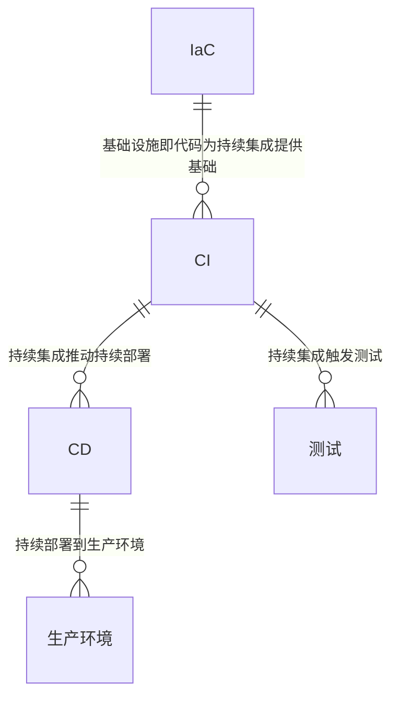
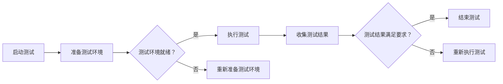
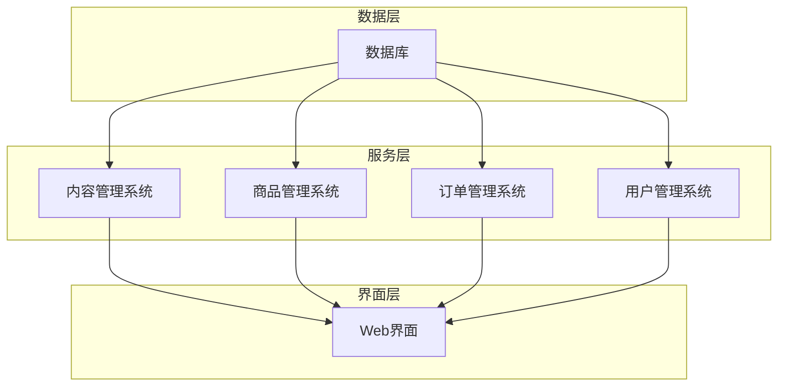
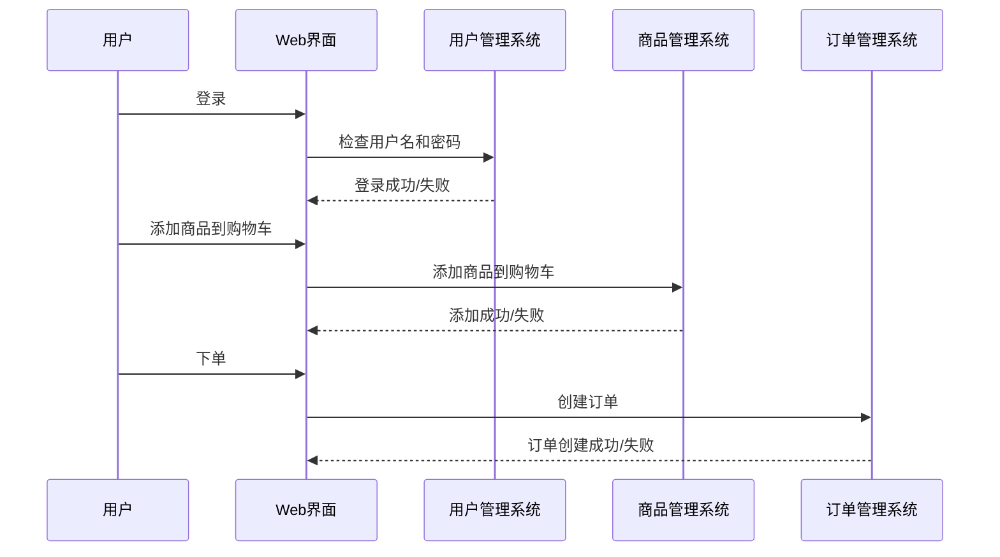

                 

# DevOps：打破开发和运维之间的壁垒

> 关键词：DevOps、持续集成、持续部署、基础设施即代码、开发运维一体化

> 摘要：本文将深入探讨 DevOps 的概念、核心原理和最佳实践。通过对比传统开发和运维模式，阐述 DevOps 如何打破开发和运维之间的壁垒，提高软件交付效率。文章将结合实际案例，分析 DevOps 在项目中的应用，并给出实用的最佳实践建议。

## 1. 背景介绍

### 1.1 DevOps 的起源与发展

DevOps 是一种软件开发和 IT 运维的实践方法，旨在通过紧密合作和自动化，提高软件交付的效率和质量。DevOps 的概念起源于 2009 年的软件开发与运维峰会，由 Patrick Debois 提出。DevOps 的核心思想是将开发和运维团队紧密整合，共同负责软件的整个生命周期。

### 1.2 DevOps 的发展历程

自 DevOps 概念提出以来，其在 IT 行业得到了广泛关注和快速发展。DevOps 的主要发展历程可以分为以下几个阶段：

1. **早期探索**（2009-2013）：DevOps 概念的提出引发了广泛的讨论和探索，许多企业开始尝试将 DevOps 方法应用于实践。
2. **推广普及**（2014-2017）：随着云技术和自动化工具的兴起，DevOps 在企业中的应用逐渐普及，越来越多的企业开始关注和投资于 DevOps。
3. **深化应用**（2018-至今）：DevOps 从单纯的开发运维一体化逐渐延伸到整个 IT 域，成为企业数字化转型的关键驱动力。

### 1.3 DevOps 在 IT 行业的重要性

DevOps 在 IT 行业的重要性主要体现在以下几个方面：

1. **提高软件交付速度**：通过自动化和持续集成/持续部署（CI/CD），DevOps 可以显著缩短软件交付周期，提高交付速度。
2. **提高软件质量**：通过持续测试和反馈，DevOps 可以及时发现和修复软件缺陷，提高软件质量。
3. **提高团队协作效率**：DevOps 强调团队合作和沟通，通过消除开发和运维之间的壁垒，提高团队协作效率。
4. **支持业务创新**：DevOps 可以帮助企业快速响应市场需求，支持业务创新和数字化转型。

## 2. 核心概念与联系

### 2.1 DevOps 的关键概念

DevOps 涵盖了多个关键概念，以下是其中几个重要的概念：

1. **持续集成（CI）**：持续集成是一种软件开发实践，通过将代码定期合并到主干分支，快速发现和解决集成过程中的问题。
2. **持续部署（CD）**：持续部署是一种自动化软件部署流程，通过自动化工具将代码部署到生产环境，实现快速、可靠的软件发布。
3. **基础设施即代码（IaC）**：基础设施即代码是一种将基础设施（如服务器、网络、存储等）的配置和管理转化为代码的方法，以提高基础设施的可重复性和可维护性。

### 2.2 传统开发和运维模式与 DevOps 的差异

传统开发和运维模式存在明显的壁垒，导致软件交付效率低下。以下是传统开发和运维模式与 DevOps 的主要差异：

1. **职责分离**：传统模式下，开发团队和运维团队职责分离，导致沟通不畅和协作困难。DevOps 强调团队紧密合作，共同负责软件的整个生命周期。
2. **手动操作**：传统模式中，软件部署和运维主要依赖手动操作，效率低下且容易出错。DevOps 通过自动化工具实现软件部署和运维的自动化，提高效率和质量。
3. **测试环节**：传统模式下，测试环节通常在开发阶段结束后才进行，导致测试周期较长。DevOps 通过持续集成和持续测试，实现测试环节的持续化，及早发现和解决软件缺陷。

### 2.3 DevOps 中各关键组件之间的关系

以下是 DevOps 中各关键组件之间的 ER 实体关系图：



## 3. 算法原理讲解

### 3.1 自动化测试

自动化测试是 DevOps 中一个关键环节，通过自动化工具实现测试过程的自动化，提高测试效率和质量。以下是自动化测试的算法原理：

#### 3.1.1 自动化测试流程

使用 Mermaid 绘制自动化测试流程图：



#### 3.1.2 自动化测试实现

以下是使用 Python 实现自动化测试的代码示例：

```python
import unittest

class TestCalculator(unittest.TestCase):
    def test_add(self):
        self.assertEqual(2 + 2, 4)

    def test_subtract(self):
        self.assertEqual(5 - 3, 2)

if __name__ == '__main__':
    unittest.main()
```

#### 3.1.3 自动化测试数学模型

自动化测试的数学模型可以表示为：

$$
测试覆盖率 = \frac{测试用例数}{代码行数}
$$

#### 3.1.4 自动化测试举例

假设有一个简单的计算器程序，包含加法和减法功能。通过编写自动化测试用例，可以验证程序的正确性。以下是自动化测试的举例：

1. **测试用例 1**：验证加法功能
   ```python
   def test_add():
       assert 2 + 2 == 4
   ```

2. **测试用例 2**：验证减法功能
   ```python
   def test_subtract():
       assert 5 - 3 == 2
   ```

通过运行自动化测试，可以快速发现和解决代码中的问题，提高软件质量。

## 4. 数学模型和数学公式

在 DevOps 中，数学模型和数学公式被广泛应用于算法设计和性能分析。以下是几个常见的数学模型和数学公式：

#### 4.1 持续集成频率

持续集成频率可以用以下数学模型表示：

$$
CI频率 = \frac{代码提交次数}{时间}
$$

#### 4.2 持续部署成功率

持续部署成功率可以用以下数学模型表示：

$$
CD成功率 = \frac{成功部署次数}{总部署次数}
$$

#### 4.3 测试覆盖率

测试覆盖率可以用以下数学模型表示：

$$
测试覆盖率 = \frac{测试用例数}{代码行数}
$$

在 DevOps 的实际应用中，这些数学模型和数学公式可以帮助我们分析和优化软件开发过程。

## 5. 系统分析与架构设计方案

### 5.1 问题场景介绍

在一个电子商务项目中，需要实现商品管理、订单管理和用户管理等功能。为了提高软件交付效率和质量，决定采用 DevOps 方法进行开发和运维。

### 5.2 系统功能设计

以下是电子商务系统的功能设计，使用 Mermaid 绘制领域模型类图：

```mermaid
classDiagram
    Customer <|-- Order
    Customer <|-- Cart
    Product <|-- Category
    Product <|-- Review
    Order <<-- Payment
    Order <<-- Shipping
```

### 5.3 系统架构设计

以下是电子商务系统的架构设计，使用 Mermaid 绘制系统架构图：



### 5.4 系统接口设计

以下是电子商务系统的接口设计，使用 Mermaid 绘制系统接口设计图：



### 5.5 系统交互流程

以下是电子商务系统的交互流程，使用 Mermaid 绘制序列图：


## 6. 项目实战

### 6.1 项目环境安装

在本项目中，我们将使用 Python 和 Docker 进行开发和部署。以下是项目环境安装步骤：

1. 安装 Python 3.8 或更高版本。
2. 安装 Docker。
3. 安装 Docker-Compose。

### 6.2 系统核心实现源代码

以下是电子商务系统的核心实现源代码：

```python
# 商品管理模块
class ProductManager:
    def add_product(self, product):
        # 在数据库中添加商品
        pass

    def delete_product(self, product_id):
        # 在数据库中删除商品
        pass

# 订单管理模块
class OrderManager:
    def create_order(self, order):
        # 在数据库中创建订单
        pass

    def cancel_order(self, order_id):
        # 在数据库中取消订单
        pass
```

### 6.3 代码应用解读与分析

在本项目中，我们使用 Python 编写了商品管理和订单管理模块。通过定义类和类方法，实现了商品添加、删除和订单创建、取消等功能。以下是代码应用解读与分析：

1. **商品管理模块**：商品管理模块负责商品的增加和删除。通过调用 `add_product` 和 `delete_product` 方法，可以在数据库中实现商品的增加和删除。
2. **订单管理模块**：订单管理模块负责订单的创建和取消。通过调用 `create_order` 和 `cancel_order` 方法，可以在数据库中实现订单的创建和取消。

### 6.4 实际案例分析和详细讲解剖析

在本项目中，我们通过实际案例分析了商品管理和订单管理模块的应用。以下是实际案例分析和详细讲解剖析：

1. **案例一**：用户下单购买商品
   - 用户在 Web 界面上选择商品并添加到购物车。
   - 商品管理模块检测到购物车中的商品变化，将商品信息保存到数据库。
   - 用户在 Web 界面上点击“下单”按钮，触发订单管理模块创建订单。
   - 订单管理模块在数据库中创建订单，并将订单信息保存到数据库。
2. **案例二**：用户取消订单
   - 用户在 Web 界面上点击“取消订单”按钮，触发订单管理模块取消订单。
   - 订单管理模块在数据库中取消订单，并将订单信息更新为取消状态。

### 6.5 项目小结

在本项目中，我们通过 DevOps 方法进行了电子商务系统的开发。通过使用 Python 和 Docker，实现了商品管理和订单管理模块的功能。实际案例分析和详细讲解剖析展示了 DevOps 在项目中的应用效果。通过 DevOps，我们提高了软件交付效率，降低了软件缺陷率，实现了开发运维一体化。

## 7. 最佳实践 Tips

### 7.1 DevOps 工具选择

在实施 DevOps 时，选择合适的工具至关重要。以下是一些建议：

1. **持续集成和持续部署工具**：如 Jenkins、GitLab CI、CircleCI 等。
2. **容器化技术**：如 Docker、Kubernetes 等。
3. **监控和日志分析工具**：如 Prometheus、ELKStack、Grafana 等。

### 7.2 团队协作

实现 DevOps 的关键在于团队协作。以下是一些建议：

1. **跨职能团队**：将开发和运维团队合并为跨职能团队，共同负责软件的整个生命周期。
2. **定期沟通**：定期举行团队会议，确保团队成员之间的沟通畅通。
3. **代码审查**：实施代码审查，提高代码质量和协作效率。

### 7.3 安全性

在 DevOps 实施过程中，安全性至关重要。以下是一些建议：

1. **加密存储**：对敏感数据进行加密存储，确保数据安全。
2. **访问控制**：实施严格的访问控制，确保只有授权人员可以访问关键资源。
3. **安全测试**：定期进行安全测试，及时发现和修复安全漏洞。

## 8. 小结

本文深入探讨了 DevOps 的概念、核心原理和最佳实践。通过对比传统开发和运维模式，阐述了 DevOps 如何打破开发和运维之间的壁垒，提高软件交付效率和质量。实际案例分析和详细讲解剖析展示了 DevOps 在项目中的应用效果。在实施 DevOps 时，需要关注团队协作、工具选择和安全性等方面，以实现最佳效果。

## 9. 注意事项

在实施 DevOps 时，需要注意以下几点：

1. **避免过度自动化**：自动化是 DevOps 的核心，但过度自动化可能导致问题难以调试和解决。
2. **培训团队成员**：团队成员需要掌握 DevOps 的相关知识和技能，确保团队协作顺畅。
3. **持续优化**：DevOps 是一个持续改进的过程，需要不断优化和改进，以提高软件交付效率和质量。

## 10. 拓展阅读

1. **《DevOps 实践指南》**：由 Jez Humble 和 David Farley 著，详细介绍了 DevOps 的核心概念和实践方法。
2. **《持续交付：释放软件交付流程中的速度和灵活性》**：由 Jez Humble 和 David Farley 著，深入探讨了持续交付的概念和实践。
3. **《容器化与 Kubernetes》**：由 Kelsey Hightower、 Brendan Burns 和 Joe Beda 著，全面介绍了容器化技术和 Kubernetes 的应用。

## 作者信息

作者：AI天才研究院/AI Genius Institute & 禅与计算机程序设计艺术 /Zen And The Art of Computer Programming

