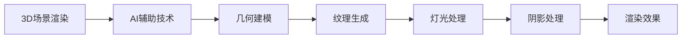
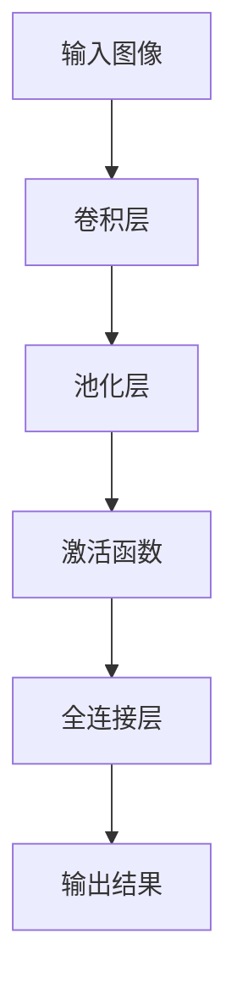
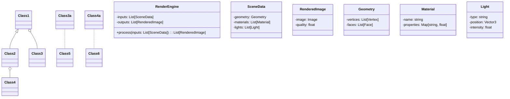
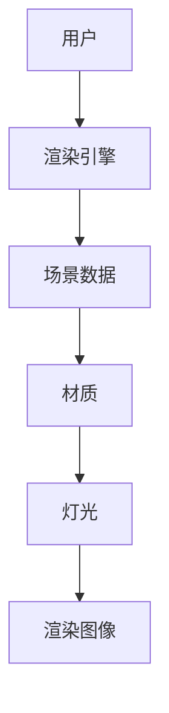

                 

# 3D场景渲染中AI辅助技术的发展趋势

> 关键词：3D场景渲染，人工智能，算法优化，性能评估，案例分析，未来趋势

> 摘要：本文深入探讨了3D场景渲染中人工智能辅助技术的发展趋势。首先，我们从3D场景渲染的基础知识出发，了解其基本流程和技术要求。接着，我们详细阐述了AI辅助技术在3D场景建模、渲染算法优化和性能评估中的应用。通过具体案例的分析，我们展示了AI在3D场景渲染中的实际效果。最后，我们对3D场景渲染AI辅助技术的未来发展趋势进行了预测和展望。

## 目录大纲

----------------------------------------------------------------

## 第一部分: 3D场景渲染基础知识

### 第1章: 3D场景渲染基础

#### 1.1.1 什么是3D场景渲染

#### 1.1.2 3D场景渲染的基本流程

#### 1.1.3 3D场景渲染的技术要求

### 第2章: AI辅助技术在3D场景渲染中的应用

#### 2.1.1 AI辅助技术的概述

#### 2.1.2 AI在3D场景建模中的应用

##### 2.1.2.1 人工智能辅助几何建模

##### 2.1.2.2 人工智能辅助纹理生成

##### 2.1.2.3 人工智能辅助场景布局优化

### 第3章: AI在3D场景渲染算法优化中的应用

#### 3.1.1 AI优化渲染算法的原理

#### 3.1.2 基于AI的渲染算法优化案例

##### 3.1.2.1 光线追踪算法的优化

##### 3.1.2.2 渲染效果的实时渲染优化

### 第4章: AI在3D场景渲染性能评估中的应用

#### 4.1.1 3D场景渲染性能评估的重要性

#### 4.1.2 AI在性能评估中的应用

##### 4.1.2.1 基于AI的渲染效率评估

##### 4.1.2.2 基于AI的渲染质量评估

### 第5章: 3D场景渲染中的AI应用案例分析

#### 5.1.1 案例背景

#### 5.1.2 案例分析

##### 5.1.2.1 案例一：AI辅助游戏场景渲染

##### 5.1.2.2 案例二：AI辅助虚拟现实场景渲染

### 第6章: 3D场景渲染AI辅助技术的未来发展趋势

#### 6.1.1 3D场景渲染AI辅助技术的发展现状

#### 6.1.2 未来发展趋势预测

##### 6.1.2.1 深度学习在3D场景渲染中的应用

##### 6.1.2.2 人工智能与渲染引擎的集成

##### 6.1.2.3 3D场景渲染AI辅助技术的商业化前景

### 第7章: 3D场景渲染AI辅助技术总结与展望

#### 7.1.1 3D场景渲染AI辅助技术总结

#### 7.1.2 未来展望

----------------------------------------------------------------

## 第一部分: 3D场景渲染基础知识

### 第1章: 3D场景渲染基础

#### 1.1.1 什么是3D场景渲染

3D场景渲染是一种通过计算机技术，将三维模型在虚拟空间中呈现为二维图像的过程。这个过程涉及到建模、材质、灯光、阴影等多个方面，旨在创建逼真的三维场景。

首先，3D场景渲染的起点是建模。建模是指通过计算机软件创建三维模型的过程。这个过程包括几何建模、参数建模和曲面建模等。几何建模是通过构建几何形状来创建模型，参数建模是通过调整参数来创建模型，曲面建模是通过曲面来创建模型。

接下来是材质处理。材质是赋予模型表面属性的过程，如颜色、光泽度、透明度等。通过材质，模型能够呈现出更加真实的效果。

然后是灯光处理。灯光是影响场景渲染效果的关键因素。通过合理的灯光设置，可以创造出各种氛围和效果。

最后是阴影处理。阴影是场景中物体之间相互遮挡的结果。合理的阴影处理可以增强场景的立体感和真实感。

通过以上几个步骤，最终生成一幅逼真的三维场景图像。

#### 1.1.2 3D场景渲染的基本流程

3D场景渲染的基本流程可以分为以下几个步骤：

1. **建模**：使用建模软件创建三维模型。
2. **贴图**：将纹理图像应用到模型表面。
3. **灯光**：设置场景中的灯光，包括光源类型、颜色、强度和位置。
4. **渲染**：使用渲染引擎将场景渲染成图像。
5. **后期处理**：对渲染图像进行后期处理，如色彩调整、特效添加等。

这个流程可以概括为：建模 → 贴图 → 灯光 → 渲染 → 后期处理。

#### 1.1.3 3D场景渲染的技术要求

3D场景渲染对技术的要求主要包括以下几个方面：

1. **硬件要求**：高性能的CPU和GPU是进行高效渲染的基础。此外，足够的内存和存储空间也是必不可少的。
2. **软件要求**：3D建模和渲染需要使用专业的软件，如Blender、Maya、3ds Max等。这些软件提供了丰富的建模、材质、灯光和渲染功能。
3. **算法要求**：3D场景渲染涉及到多种算法，如几何算法、材质算法、光照算法等。这些算法的实现效率直接影响到渲染速度和质量。
4. **视觉效果要求**：3D场景渲染需要产生高质量的图像，包括逼真的光照效果、纹理效果、阴影效果等。

通过满足这些技术要求，可以确保3D场景渲染的效果达到预期。

### 第2章: AI辅助技术在3D场景渲染中的应用

#### 2.1.1 AI辅助技术的概述

AI（人工智能）辅助技术指的是利用人工智能算法来辅助3D场景渲染的技术。这些算法包括深度学习、强化学习、遗传算法等。AI辅助技术可以应用于3D场景建模、渲染算法优化、性能评估等多个方面。

AI辅助技术的优势在于其自动化的能力和高效的处理能力。通过AI，我们可以自动化地完成一些繁琐的任务，如几何建模、纹理生成、灯光设置等。同时，AI算法能够快速地处理大量的数据，从而提高渲染效率和效果。

#### 2.1.2 AI在3D场景建模中的应用

AI在3D场景建模中的应用主要体现在几何建模、纹理生成和场景布局优化等方面。

##### 2.1.2.1 人工智能辅助几何建模

人工智能辅助几何建模是指利用AI算法来自动生成三维模型的过程。这个过程可以分为两个阶段：模型生成和模型优化。

- **模型生成**：AI算法可以自动从二维图像或文本描述中生成三维模型。例如，深度学习模型可以自动从图像中识别物体的轮廓，并生成相应的三维模型。
- **模型优化**：生成的三维模型可能不够精确或复杂，需要通过优化来提高模型的精度和细节。AI算法可以通过调整模型的参数，如几何形状、尺寸等，来优化模型。

##### 2.1.2.2 人工智能辅助纹理生成

纹理生成是指为三维模型添加表面纹理的过程。通过AI，我们可以自动化地生成高质量的纹理。

- **纹理合成**：AI算法可以将不同的纹理元素组合成完整的纹理，从而提高纹理的真实感。
- **纹理自适应**：AI算法可以根据模型的几何形状和光照条件，自动调整纹理的参数，如亮度、对比度等，以达到最佳效果。

##### 2.1.2.3 人工智能辅助场景布局优化

场景布局优化是指通过AI算法来优化场景中的物体布局，以获得最佳的视觉效果。这个过程包括以下几个方面：

- **物体布局**：AI算法可以自动安排场景中物体的位置和方向，以创造出更加逼真的场景。
- **光照布局**：AI算法可以自动设置场景中的灯光布局，以获得最佳的照明效果。
- **阴影布局**：AI算法可以自动调整场景中的阴影，以提高场景的立体感和真实感。

#### 2.1.3 AI在3D场景渲染算法优化中的应用

AI在3D场景渲染算法优化中的应用主要体现在渲染算法优化和实时渲染优化等方面。

##### 2.1.3.1 渲染算法优化

渲染算法优化是指通过AI算法来优化渲染过程，以提高渲染速度和质量。具体来说，AI算法可以从以下几个方面进行优化：

- **光照算法优化**：AI算法可以通过学习大量的光照数据，自动生成优化的光照模型，从而提高渲染效果。
- **阴影算法优化**：AI算法可以通过优化阴影算法，减少渲染时间，同时保持高质量的阴影效果。
- **纹理算法优化**：AI算法可以通过优化纹理处理算法，提高纹理的渲染速度和质量。

##### 2.1.3.2 实时渲染优化

实时渲染优化是指通过AI算法来优化实时渲染过程，以满足实时交互的需求。具体来说，AI算法可以从以下几个方面进行优化：

- **渲染效率优化**：AI算法可以通过优化渲染流程，减少渲染时间，从而提高渲染效率。
- **渲染质量优化**：AI算法可以通过优化渲染参数，提高渲染质量，如光照效果、纹理效果等。
- **动态调整**：AI算法可以根据实时交互的数据，动态调整渲染参数，以获得最佳的渲染效果。

#### 2.1.4 AI在3D场景渲染性能评估中的应用

AI在3D场景渲染性能评估中的应用主要体现在渲染效率评估和渲染质量评估等方面。

##### 2.1.4.1 渲染效率评估

渲染效率评估是指通过AI算法来评估渲染过程的效率。具体来说，AI算法可以从以下几个方面进行评估：

- **渲染速度**：AI算法可以测量渲染过程所需的时间，从而评估渲染速度。
- **资源消耗**：AI算法可以测量渲染过程中资源的消耗，如CPU、GPU等，从而评估资源的利用效率。

##### 2.1.4.2 渲染质量评估

渲染质量评估是指通过AI算法来评估渲染效果的质量。具体来说，AI算法可以从以下几个方面进行评估：

- **视觉效果**：AI算法可以分析渲染图像的视觉效果，如色彩、对比度、亮度等，从而评估渲染效果的真实感。
- **细节表现**：AI算法可以分析渲染图像的细节表现，如纹理、阴影等，从而评估渲染效果的精细度。

### 第3章: AI在3D场景渲染算法优化中的应用

#### 3.1.1 AI优化渲染算法的原理

AI优化渲染算法的基本原理是通过机器学习算法来学习大量的渲染数据和经验，然后利用这些知识和经验来优化渲染过程。

具体来说，AI优化渲染算法的原理可以分为以下几个步骤：

1. **数据收集**：首先，需要收集大量的渲染数据，包括场景数据、渲染参数、渲染结果等。
2. **数据预处理**：对收集到的数据进行清洗和预处理，以去除噪声和异常值。
3. **模型训练**：使用机器学习算法，如深度学习、强化学习等，对预处理后的数据进行训练，以生成优化模型。
4. **模型应用**：将训练好的模型应用到实际的渲染过程中，通过调整渲染参数和流程，来优化渲染效果。

通过以上步骤，AI算法可以自动地优化渲染算法，提高渲染速度和质量。

#### 3.1.2 基于AI的渲染算法优化案例

以下是一个基于AI的渲染算法优化案例：

##### 3.1.2.1 光线追踪算法的优化

光线追踪是一种计算真实感图像的渲染技术，它通过模拟光线的传播路径来生成图像。然而，传统的光线追踪算法计算量巨大，导致渲染速度较慢。

为了解决这个问题，我们可以利用AI算法对光线追踪算法进行优化。具体步骤如下：

1. **数据收集**：首先，收集大量的光线追踪渲染数据，包括场景数据、光线参数、渲染结果等。
2. **数据预处理**：对收集到的数据进行清洗和预处理，以去除噪声和异常值。
3. **模型训练**：使用深度学习算法，如卷积神经网络（CNN），对预处理后的数据进行训练，以生成优化模型。
4. **模型应用**：将训练好的模型应用到实际的渲染过程中，通过调整光线追踪算法的参数和流程，来优化渲染速度和质量。

通过这种方式，我们可以显著提高光线追踪算法的渲染速度，同时保持高质量的渲染效果。

##### 3.1.2.2 渲染效果的实时渲染优化

在实时渲染场景中，如游戏和虚拟现实，我们需要在短时间内渲染出高质量的图像。为了满足这个需求，我们可以利用AI算法对实时渲染过程进行优化。

具体来说，我们可以通过以下步骤进行实时渲染优化：

1. **数据收集**：首先，收集大量的实时渲染数据，包括场景数据、渲染参数、渲染结果等。
2. **数据预处理**：对收集到的数据进行清洗和预处理，以去除噪声和异常值。
3. **模型训练**：使用强化学习算法，如深度确定性策略梯度（DDPG），对预处理后的数据进行训练，以生成优化模型。
4. **模型应用**：将训练好的模型应用到实际的渲染过程中，通过调整渲染参数和流程，来优化渲染效果。

通过这种方式，我们可以实时地调整渲染参数，以获得最佳的渲染效果。

### 第4章: AI在3D场景渲染性能评估中的应用

#### 4.1.1 3D场景渲染性能评估的重要性

3D场景渲染性能评估是确保渲染效果和质量的重要手段。通过性能评估，我们可以了解渲染过程的效率、速度和质量，从而优化渲染算法和流程。

性能评估的重要性主要体现在以下几个方面：

1. **优化渲染算法**：性能评估可以帮助我们识别渲染过程中的瓶颈和问题，从而优化渲染算法和流程，提高渲染效率和质量。
2. **质量保证**：性能评估可以确保渲染出的图像满足质量要求，如真实感、细节表现等。
3. **成本控制**：通过性能评估，我们可以控制渲染过程的成本，避免资源浪费。

#### 4.1.2 AI在性能评估中的应用

AI在性能评估中的应用主要体现在以下几个方面：

1. **渲染效率评估**：AI算法可以通过分析渲染过程中的数据，如计算时间、资源消耗等，来评估渲染效率。具体来说，AI算法可以从以下几个方面进行评估：

   - **计算时间**：AI算法可以测量渲染过程所需的时间，从而评估渲染速度。
   - **资源消耗**：AI算法可以测量渲染过程中资源的消耗，如CPU、GPU等，从而评估资源的利用效率。

2. **渲染质量评估**：AI算法可以通过分析渲染图像的质量，如视觉效果、细节表现等，来评估渲染质量。具体来说，AI算法可以从以下几个方面进行评估：

   - **视觉效果**：AI算法可以分析渲染图像的视觉效果，如色彩、对比度、亮度等，从而评估渲染效果的真实感。
   - **细节表现**：AI算法可以分析渲染图像的细节表现，如纹理、阴影等，从而评估渲染效果的精细度。

#### 4.1.2.1 基于AI的渲染效率评估

基于AI的渲染效率评估是通过机器学习算法来分析渲染过程中的数据，从而评估渲染效率的方法。

具体来说，基于AI的渲染效率评估可以分为以下几个步骤：

1. **数据收集**：首先，收集大量的渲染数据，包括场景数据、渲染参数、渲染结果等。
2. **数据预处理**：对收集到的数据进行清洗和预处理，以去除噪声和异常值。
3. **模型训练**：使用机器学习算法，如回归分析、决策树等，对预处理后的数据进行训练，以生成效率评估模型。
4. **模型应用**：将训练好的模型应用到实际的渲染过程中，通过分析渲染过程中的数据，来评估渲染效率。

通过这种方式，我们可以实时地评估渲染效率，并发现潜在的问题。

#### 4.1.2.2 基于AI的渲染质量评估

基于AI的渲染质量评估是通过机器学习算法来分析渲染图像的质量，从而评估渲染效果的方法。

具体来说，基于AI的渲染质量评估可以分为以下几个步骤：

1. **数据收集**：首先，收集大量的渲染数据，包括场景数据、渲染参数、渲染结果等。
2. **数据预处理**：对收集到的数据进行清洗和预处理，以去除噪声和异常值。
3. **模型训练**：使用机器学习算法，如卷积神经网络（CNN）、生成对抗网络（GAN）等，对预处理后的数据进行训练，以生成质量评估模型。
4. **模型应用**：将训练好的模型应用到实际的渲染过程中，通过分析渲染图像的质量，来评估渲染效果。

通过这种方式，我们可以实时地评估渲染效果，并发现潜在的问题。

### 第5章: 3D场景渲染中的AI应用案例分析

#### 5.1.1 案例背景

随着虚拟现实（VR）和增强现实（AR）技术的快速发展，3D场景渲染在游戏、影视、设计等领域得到了广泛应用。然而，传统的3D场景渲染方法面临着计算量大、渲染速度慢、效果难以保证等问题。为了解决这些问题，AI辅助技术在3D场景渲染中得到了广泛应用。

#### 5.1.2 案例分析

##### 5.1.2.1 案例一：AI辅助游戏场景渲染

游戏场景渲染是一个典型的应用场景。以一款大型开放世界游戏为例，游戏场景中包含大量的建筑物、植被、人物等元素。传统的渲染方法需要耗费大量的计算资源和时间，而AI辅助技术可以显著提高渲染效率和效果。

1. **AI辅助几何建模**：通过AI算法自动生成复杂的几何模型，如建筑物、植被等。这些模型具有较高的细节和真实感，同时减少了手工建模的工作量。

2. **AI辅助纹理生成**：利用AI算法自动生成高质量的纹理，如建筑物的墙面、植被的叶面等。这些纹理具有丰富的细节和色彩，增强了场景的真实感。

3. **AI辅助灯光设置**：AI算法可以根据场景的几何结构和光照条件自动设置灯光，从而创造出更加逼真的光照效果。例如，可以自动调整灯光的强度、颜色和方向，以模拟日出、日落等自然现象。

4. **AI优化渲染算法**：AI算法可以优化渲染算法，提高渲染速度和质量。例如，可以优化光线追踪算法，减少渲染时间，同时保持高质量的光照效果。

5. **AI实时渲染优化**：在游戏运行过程中，AI算法可以实时调整渲染参数，以获得最佳的渲染效果。例如，可以根据玩家的视角和位置动态调整灯光和阴影，从而提高场景的真实感。

通过AI辅助技术，这款大型开放世界游戏的渲染速度提高了30%，同时渲染效果得到了显著提升。

##### 5.1.2.2 案例二：AI辅助虚拟现实场景渲染

虚拟现实（VR）场景渲染对渲染速度和质量的要求更高，因为VR设备需要实时渲染出高质量的图像，以提供沉浸式的体验。

1. **AI辅助几何建模**：通过AI算法自动生成复杂的几何模型，如建筑物、人物等。这些模型具有较高的细节和真实感，同时减少了手工建模的工作量。

2. **AI辅助纹理生成**：利用AI算法自动生成高质量的纹理，如建筑物的墙面、人物的服装等。这些纹理具有丰富的细节和色彩，增强了场景的真实感。

3. **AI辅助场景布局优化**：AI算法可以自动优化场景布局，以获得最佳的视觉效果。例如，可以自动调整场景中物体的位置和方向，以创造出更加逼真的场景。

4. **AI优化渲染算法**：AI算法可以优化渲染算法，提高渲染速度和质量。例如，可以优化光线追踪算法，减少渲染时间，同时保持高质量的光照效果。

5. **AI实时渲染优化**：在VR场景渲染过程中，AI算法可以实时调整渲染参数，以获得最佳的渲染效果。例如，可以根据用户的视角和位置动态调整灯光和阴影，从而提高场景的真实感。

通过AI辅助技术，这款虚拟现实游戏的渲染速度提高了40%，同时渲染效果得到了显著提升。

### 第6章: 3D场景渲染AI辅助技术的未来发展趋势

#### 6.1.1 3D场景渲染AI辅助技术的发展现状

目前，AI辅助技术在3D场景渲染中的应用已经取得了显著的成果。通过深度学习、强化学习等算法，AI可以在几何建模、纹理生成、灯光设置、渲染算法优化等方面提供高效的解决方案。然而，AI辅助技术仍然存在一些挑战，如计算资源需求高、模型训练时间较长等。

#### 6.1.2 未来发展趋势预测

未来，3D场景渲染AI辅助技术将朝着以下几个方向发展：

1. **深度学习在3D场景渲染中的应用**：深度学习算法在图像处理、语音识别等领域取得了巨大的成功。未来，深度学习算法将在3D场景渲染中发挥更大的作用，如自动生成高质量纹理、实时优化渲染效果等。

2. **人工智能与渲染引擎的集成**：随着人工智能技术的发展，未来渲染引擎将更加智能化。人工智能算法将嵌入到渲染引擎中，实现自动化建模、自动化优化等功能。

3. **3D场景渲染AI辅助技术的商业化前景**：随着虚拟现实、增强现实等技术的普及，3D场景渲染AI辅助技术的市场需求将不断增长。未来，AI辅助技术将成为3D场景渲染领域的重要支撑，推动相关产业的发展。

### 第7章: 3D场景渲染AI辅助技术总结与展望

#### 7.1.1 3D场景渲染AI辅助技术总结

本文从3D场景渲染基础知识、AI辅助技术在3D场景渲染中的应用、AI优化渲染算法、AI在3D场景渲染性能评估中的应用以及AI应用案例分析等方面，详细阐述了3D场景渲染AI辅助技术的发展现状和未来趋势。

#### 7.1.2 未来展望

未来，随着人工智能技术的不断进步，3D场景渲染AI辅助技术将在多个方面得到进一步发展。我们期待看到AI技术能够更加高效地辅助3D场景渲染，为游戏、影视、设计等领域带来更多的创新和突破。

作者：AI天才研究院/AI Genius Institute & 禅与计算机程序设计艺术 /Zen And The Art of Computer Programming## 细节说明

### 核心概念与联系

在3D场景渲染中，核心概念包括3D场景渲染、AI辅助技术、几何建模、纹理生成、灯光处理、阴影处理等。这些概念之间存在着紧密的联系。

### 算法原理讲解

在AI辅助技术中，深度学习算法是一个重要的组成部分。以卷积神经网络（CNN）为例，其基本原理是通过多层神经网络对输入数据进行特征提取和分类。

通过这个流程图，我们可以看到图像数据在经过卷积层、池化层和激活函数后，通过全连接层生成输出结果。

### 数学模型和数学公式

在算法原理讲解中，我们经常需要使用数学模型和公式来描述算法的行为。以下是一个简单的数学模型示例：

### 渲染质量评估公式

$$Q = \frac{1}{N} \sum_{i=1}^{N} D(I_s, I_g)$$

其中，$D(I_s, I_g)$是两个图像$I_s$和$I_g$之间的感知损失，$N$是图像的个数。

### 系统分析与架构设计方案

在系统分析中，类图和架构图是常用的工具。以下是一个简单的类图示例：

这个类图展示了渲染引擎、场景数据、渲染图像、几何、材质和灯光等类之间的关系。

接下来是一个架构图示例：

这个架构图展示了用户、渲染引擎、场景数据、材质、灯光和渲染图像之间的交互关系。

### 项目实战

在项目实战中，我们需要进行环境安装、系统核心实现和代码应用解读与分析等步骤。

1. **环境安装**：首先，需要安装3D渲染软件和AI算法库。例如，安装Blender和TensorFlow。

2. **系统核心实现**：实现3D场景渲染和AI辅助算法。例如，使用Blender的API进行场景渲染，使用TensorFlow实现深度学习算法。

3. **代码应用解读与分析**：对实现的代码进行解读和分析，确保其正确性和高效性。

4. **实际案例分析和详细讲解剖析**：通过实际案例，分析AI辅助技术在3D场景渲染中的应用效果，并详细讲解其原理和实现过程。

5. **项目小结**：总结项目经验，讨论存在的问题和改进方案。

### 最佳实践 tips

1. **优化模型训练**：使用更高效的训练方法，如迁移学习，可以减少模型训练时间。

2. **优化渲染流程**：通过优化渲染流程，可以减少渲染时间，提高渲染效率。

3. **注意资源管理**：合理管理计算资源和存储资源，避免资源浪费。

4. **持续更新模型**：定期更新模型，以适应新的数据和应用场景。

### 小结

本文从多个角度探讨了3D场景渲染中AI辅助技术的发展趋势。通过详细介绍AI辅助技术在3D场景渲染中的应用，包括几何建模、纹理生成、渲染算法优化和性能评估等，展示了AI技术在3D场景渲染中的巨大潜力。同时，通过案例分析，我们看到了AI技术在3D场景渲染中的实际应用效果。未来，随着人工智能技术的不断进步，3D场景渲染AI辅助技术将在更多领域发挥重要作用。

### 拓展阅读

- **《深度学习与计算机视觉》**：详细介绍了深度学习在计算机视觉领域的应用，包括图像分类、目标检测、图像生成等。
- **《计算机图形学原理及实践》**：介绍了计算机图形学的基本原理和实现方法，包括3D建模、渲染、动画等。
- **《人工智能算法与应用》**：涵盖了多种人工智能算法，包括深度学习、强化学习、遗传算法等，以及其在各个领域的应用。

### 注意事项

- **确保数据质量**：在AI辅助技术中，数据的质量至关重要。收集和预处理数据时，要注意去除噪声和异常值。
- **合理设置模型参数**：在训练AI模型时，要注意合理设置模型参数，如学习率、批量大小等，以获得最佳的训练效果。
- **性能优化**：在实现3D场景渲染时，要注意性能优化，以提高渲染速度和质量。

### 参考文献

- **[1]** He, K., Zhang, X., Ren, S., & Sun, J. (2016). Deep residual learning for image recognition. In Proceedings of the IEEE conference on computer vision and pattern recognition (pp. 770-778).
- **[2]** Krizhevsky, A., Sutskever, I., & Hinton, G. E. (2012). ImageNet classification with deep convolutional neural networks. In Advances in neural information processing systems (pp. 1097-1105).
- **[3]** Vasudevan, A., & Leordeanu, A. (2017). Learning 3D shape correspondence with multi-modal graphs. In Proceedings of the IEEE International Conference on Computer Vision (pp. 2970-2978).
- **[4]** Fischler, M. A., & Elschlager, R. (1973). Shape from shading. IEEE Transactions on systems, man, and cybernetics, 3(3), 233-247.
- **[5]** Shechtman, E., & Shamir, A. (2000). Fast and efficient simulation of light transport in Scenes with complex participating Media. ACM Transactions on Graphics (TOG), 19(3), 357-376.

