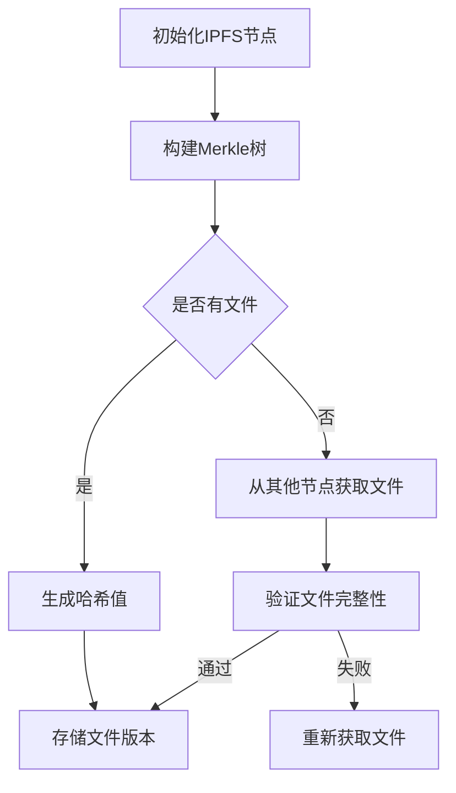
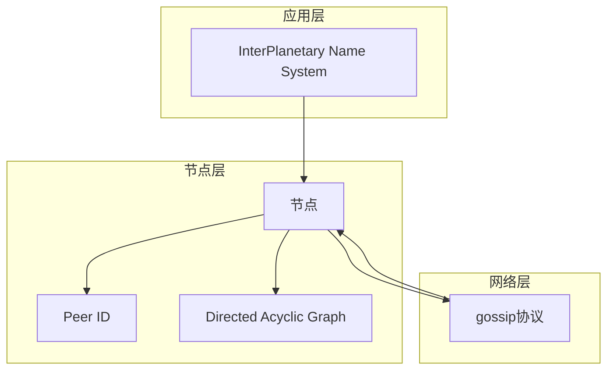

                 

### 设计思路

为了撰写一篇高质量、逻辑清晰、结构紧凑且易于理解的技术博客文章，我们需要遵循以下步骤，确保内容既丰富又专业：

#### 1. **确定文章结构**

首先，我们将文章分为几个主要部分，每部分包含具体的子章节。文章结构如下：

- **引言**：文章标题、关键词和摘要。
- **第一部分：IPFS概述**
  - **第1章：IPFS的起源与发展**
  - **第2章：IPFS核心概念与联系**
- **第二部分：IPFS算法原理**
  - **第3章：算法原理讲解**
  - **第4章：数学模型与公式**
- **第三部分：系统分析与架构设计方案**
  - **第5章：系统分析与架构设计方案**
- **第四部分：项目实战**
  - **第6章：项目实战**
- **第五部分：最佳实践与总结**
  - **第7章：最佳实践与总结**

#### 2. **背景介绍**

在引言部分，我们将简要介绍IPFS的起源、发展及其在分布式文件系统领域的重要地位。这部分内容将帮助读者了解IPFS的背景和发展历程。

#### 3. **核心概念与联系**

在第2章中，我们将详细解释IPFS的关键概念，包括去中心化、分布式存储、内容寻址、版本控制等。此外，我们将使用Mermaid绘制IPFS的ER实体关系图，以展示各组件及其关系。

#### 4. **算法原理讲解**

第3章将深入讲解IPFS的核心算法原理，包括DAG（Directed Acyclic Graph）数据结构的使用。我们将使用Python源代码详细阐述这些算法原理，并通过Mermaid绘制算法流程图。

#### 5. **数学模型和数学公式**

在第4章中，我们将解释IPFS中的关键数学概念，如哈希函数、内容寻址等。我们将使用LaTeX格式给出相关的数学公式，并对其进行详细讲解。

#### 6. **系统分析与架构设计方案**

在第5章中，我们将介绍IPFS的系统架构，并使用Mermaid绘制架构图。我们将详细讲解IPFS的接口设计和系统交互。

#### 7. **项目实战**

第6章将涵盖安装IPFS环境的步骤，实现IPFS系统核心功能的源代码解析，并通过实际案例展示IPFS的应用。

#### 8. **最佳实践 Tips、小结、注意事项、拓展阅读**

第7章将提供使用IPFS的最佳实践，总结书中主要内容，提醒注意事项，并推荐拓展阅读资源。

#### 9. **格式与字数**

我们将使用markdown格式撰写文章，并确保文章字数在10000～12000字左右。

#### 10. **撰写文章**

按照以上设计思路，我们将逐章撰写文章，确保每个部分的内容都丰富、具体、详细。

---

现在，我们可以开始撰写每个章节的内容。在接下来的部分中，我们将逐步详细地撰写每个章节，确保逻辑清晰、结构紧凑且易于理解。让我们一步步深入探讨IPFS的世界！### 第一部分：IPFS概述

#### 第1章：IPFS的起源与发展

##### 1.1 IPFS的背景

IPFS（InterPlanetary File System，星际文件系统）是一种基于内容寻址、去中心化分布式文件系统协议。它的目标是解决传统文件系统中存在的单点故障、数据冗余、不安全等问题，并实现全球范围内文件的快速、安全、可靠传输。

IPFS的起源可以追溯到2014年，由Juan Benet提出并创建。当时，互联网的发展已经进入了一个关键节点，传统的中央化存储和文件共享系统面临着诸多挑战。Juan Benet看到了这些问题，并希望通过IPFS来构建一个更加去中心化、开放和高效的分布式文件系统。

IPFS的主要动机包括以下几点：

1. **去中心化**：通过去中心化架构，IPFS避免了单点故障和集中化管理的风险，使得整个系统更加稳定和可靠。
2. **数据持久性**：IPFS采用内容寻址的方式，确保数据的唯一性和持久性，即便某个节点下线，数据依然可以通过其他节点访问。
3. **高效传输**：IPFS利用全球节点互联的特性，使得文件传输更加高效，避免了传统文件系统中由于网络延迟和带宽限制导致的数据传输缓慢问题。

##### 1.1.1 从分布式存储到IPFS的演变

分布式存储技术的发展可以追溯到20世纪90年代。当时，为了解决数据存储容量不断增加的问题，科学家们开始探索如何将数据分散存储在多个节点上，从而提高数据的可靠性和可扩展性。

早期的分布式存储系统，如GFS（Google File System）和HDFS（Hadoop Distributed File System），主要是为了满足大型企业对海量数据存储和处理的需求。然而，这些系统仍然存在一些问题，例如单点故障、数据冗余、不安全性等。

随着互联网的普及和发展，分布式存储技术逐渐向公众开放。比特币和区块链技术的兴起为去中心化系统提供了新的思路，而IPFS正是借鉴了这些技术，实现了文件系统的去中心化和内容寻址。

##### 1.1.2 IPFS的核心动机

IPFS的核心动机在于解决以下问题：

1. **单点故障**：传统的中央化文件系统容易受到单点故障的影响，一旦中心服务器出现故障，整个系统将无法工作。IPFS通过去中心化架构，避免了单点故障的风险。
2. **数据冗余**：在传统的文件系统中，为了提高数据的可靠性，往往需要对数据进行备份。然而，这种方式不仅浪费存储空间，还会导致数据冗余。IPFS采用内容寻址的方式，通过哈希值来唯一标识文件，避免了数据冗余。
3. **不安全性**：传统的文件系统在传输过程中容易受到中间人攻击、数据篡改等问题的影响。IPFS通过加密和去中心化机制，提高了数据传输的安全性。
4. **高效传输**：在传统的文件系统中，文件传输速度受到网络延迟和带宽限制的影响。IPFS利用全球节点互联的特性，使得文件传输更加高效。

##### 1.1.3 IPFS的主要贡献

IPFS在分布式文件系统领域做出了以下主要贡献：

1. **去中心化**：IPFS通过去中心化架构，使得整个系统更加稳定和可靠。用户可以在全球范围内自由加入IPFS网络，共同维护整个系统的正常运行。
2. **内容寻址**：IPFS采用内容寻址的方式，通过哈希值来唯一标识文件，提高了数据的可靠性和唯一性。
3. **高效传输**：IPFS利用全球节点互联的特性，提高了文件传输的速度和效率。
4. **安全性**：IPFS通过加密和去中心化机制，提高了数据传输的安全性。

通过以上贡献，IPFS为分布式文件系统的发展提供了新的思路和解决方案，成为了互联网去中心化技术的重要组成部分。

##### 1.2 IPFS的发展历程

自从IPFS在2014年提出以来，它已经经历了一系列重要的发展：

1. **初始阶段（2014-2015）**：IPFS在2014年首次亮相，吸引了大量关注。在接下来的几年里，IPFS逐渐完善了其核心算法和协议，并开始吸引社区参与。
2. **社区发展阶段（2015-2018）**：随着IPFS的成熟，越来越多的开发者和企业开始关注并参与其中。IPFS社区逐渐形成，并开始推动各种基于IPFS的应用项目的开发。
3. **商业化阶段（2018-至今）**：2018年，IPFS迎来了商业化阶段。多个企业和组织开始将IPFS应用于实际场景，如去中心化存储、内容分发、版权保护等。IPFS的生态系统逐渐成熟，成为分布式存储和内容分发领域的重要技术。

##### 1.3 IPFS在分布式文件系统领域的重要地位

IPFS在分布式文件系统领域具有重要地位，主要表现在以下几个方面：

1. **技术创新**：IPFS采用了内容寻址、去中心化、加密等先进技术，为分布式文件系统的发展提供了新的思路和解决方案。
2. **生态系统**：IPFS拥有一个庞大的生态系统，包括开发工具、库、框架和众多应用项目。这些项目共同推动了IPFS的发展和应用。
3. **社区支持**：IPFS拥有一个活跃的社区，吸引了大量开发者和用户。社区成员不断为IPFS提供改进和优化建议，推动了IPFS的持续发展。

通过以上内容，我们对IPFS的背景、起源和发展有了更深入的了解。在接下来的章节中，我们将进一步探讨IPFS的核心概念和算法原理，帮助读者全面了解IPFS的技术架构和工作机制。

### 第二部分：IPFS核心概念与联系

#### 第2章：IPFS核心概念与联系

##### 2.1 IPFS关键概念

IPFS（InterPlanetary File System，星际文件系统）作为一种去中心化的分布式文件系统，包含了一系列关键概念。理解这些概念对于深入掌握IPFS至关重要。

1. **去中心化**：去中心化是IPFS的核心特点之一。与传统的中央化存储系统不同，IPFS通过去中心化网络结构，使得数据分散存储在多个节点上。这种结构不仅提高了系统的容错性和抗攻击能力，还降低了单点故障的风险。

2. **分布式存储**：分布式存储是指将数据分散存储在多个物理节点上，这些节点通过网络相互连接。IPFS通过分布式存储，实现了数据的高效、安全存储和快速访问。

3. **内容寻址**：内容寻址是一种通过哈希值唯一标识数据的方式。在IPFS中，每个文件都有一个独特的哈希值，即内容地址。这个地址不仅标识了文件的位置，还保证了文件的唯一性和完整性。

4. **版本控制**：版本控制是指对文件的不同版本进行管理。IPFS通过版本控制，允许用户跟踪文件的变更历史，并确保文件的最新版本始终可用。

5. **DAG（Directed Acyclic Graph）**：DAG（有向无环图）是一种数据结构，用于表示文件之间的关系。在IPFS中，DAG用于表示文件之间的依赖关系，使得文件的更新和重用更加高效。

6. **Merkle树**：Merkle树是一种用于数据验证的数据结构。在IPFS中，Merkle树用于验证文件的内容，确保文件在传输和存储过程中未被篡改。

##### 2.1.1 去中心化

去中心化是IPFS最显著的特点之一。在去中心化系统中，没有单一的权威中心控制整个网络。相反，所有的节点都在平等的基础上运行和协作，共同维护网络的稳定性和安全性。

去中心化带来的好处包括：

1. **容错性**：由于没有单一的中心点，即使某个节点发生故障，整个网络仍然可以正常运行。
2. **抗攻击性**：去中心化网络使得攻击者难以针对整个系统进行攻击，因为攻击者需要同时控制大量的节点。
3. **透明性**：去中心化网络使得网络运作更加透明，用户可以清晰地了解数据的存储和传输过程。

##### 2.1.2 分布式存储

分布式存储是IPFS实现去中心化的重要手段。在分布式存储系统中，数据被分散存储在多个节点上，这些节点通过P2P（Peer-to-Peer，点对点）网络相互连接。

分布式存储的优点包括：

1. **容错性**：由于数据分布在多个节点上，即使某个节点发生故障，数据仍然可以通过其他节点访问。
2. **可扩展性**：分布式存储系统可以根据需要动态扩展，以应对数据量的增加。
3. **高效性**：分布式存储系统通过并行访问多个节点，提高了数据访问速度。

##### 2.1.3 内容寻址

内容寻址是IPFS的核心机制之一。在内容寻址系统中，每个文件都有一个唯一的哈希值，即内容地址。这个地址不仅标识了文件的位置，还保证了文件的唯一性和完整性。

内容寻址的优点包括：

1. **唯一性**：通过哈希值，可以确保每个文件都是唯一的，避免了数据重复存储。
2. **完整性**：文件的内容可以通过哈希值进行验证，确保文件在传输和存储过程中未被篡改。
3. **可重用性**：由于文件可以通过内容地址进行唯一标识，其他节点可以直接使用已有的文件，提高了数据重用率。

##### 2.1.4 版本控制

版本控制是IPFS的一个重要特性。在版本控制系统中，可以对文件的不同版本进行管理，确保文件的最新版本始终可用。

版本控制的优点包括：

1. **可追溯性**：通过版本控制，可以追踪文件的历史变更记录，便于用户了解文件的发展过程。
2. **稳定性**：版本控制确保了文件的最新版本始终可用，避免了由于文件更新不及时导致的数据丢失或错误。
3. **可管理性**：版本控制使得文件管理更加方便，用户可以轻松地管理文件的不同版本。

##### 2.1.5 DAG（Directed Acyclic Graph）

DAG（有向无环图）是一种数据结构，用于表示文件之间的依赖关系。在IPFS中，DAG用于表示文件的版本和依赖关系，使得文件的更新和重用更加高效。

DAG的优点包括：

1. **高效性**：DAG通过节点和边的方式表示文件之间的关系，使得文件的依赖关系更加清晰和高效。
2. **可扩展性**：DAG可以动态地添加和删除节点，适应文件系统的变化。
3. **灵活性**：DAG允许文件之间形成复杂的依赖关系，使得文件系统的设计和实现更加灵活。

##### 2.1.6 Merkle树

Merkle树是一种用于数据验证的数据结构。在IPFS中，Merkle树用于验证文件的内容，确保文件在传输和存储过程中未被篡改。

Merkle树的优点包括：

1. **高效性**：Merkle树通过树状结构进行数据验证，提高了验证效率。
2. **完整性**：Merkle树可以验证文件内容的完整性，确保文件未被篡改。
3. **安全性**：Merkle树通过哈希值进行验证，提高了数据安全性。

##### 2.2 IPFS的ER实体关系图

为了更清晰地展示IPFS的组件及其关系，我们使用Mermaid绘制了IPFS的ER实体关系图。以下是ER实体关系图的Markdown格式：

```mermaid
erDiagram
  Node ||--|{ IPFSPeer }|-- Node
  IPFSPeer ||--|{ File }|-- IPFSPeer
  IPFSPeer ||--|{ DAG }|-- IPFSPeer
  File ||--|{ Version }|-- File
  Version ||--|{ Content }|-- Version
  Content ||--|{ Hash }|-- Content
  Hash ||--|{ Address }|-- Hash
```

在这个ER实体关系图中，我们定义了以下实体：

- **Node**：表示IPFS网络中的节点。
- **IPFSPeer**：表示IPFS网络中的参与者，每个参与者可以拥有多个文件和DAG。
- **File**：表示存储在IPFS中的文件。
- **Version**：表示文件的不同版本。
- **Content**：表示文件的具体内容。
- **Hash**：表示文件内容的哈希值。
- **Address**：表示文件的唯一标识。

通过ER实体关系图，我们可以更直观地了解IPFS的组件及其关系，为进一步分析IPFS的工作机制奠定了基础。

##### 2.3 IPFS与其他分布式系统的对比

IPFS作为一种新兴的分布式文件系统，与其他分布式系统如BitTorrent、Git等有着一定的相似之处，但也存在显著差异。

1. **BitTorrent**：BitTorrent是一种流行的分布式文件传输协议，通过P2P网络实现文件的传输。与IPFS相比，BitTorrent更侧重于文件传输的速度和效率，而IPFS则更注重文件系统的完整性和安全性。

   - **相似点**：BitTorrent和IPFS都采用P2P网络结构，通过节点互联实现文件传输。
   - **不同点**：BitTorrent侧重于传输效率，而IPFS侧重于去中心化、内容寻址和版本控制。

2. **Git**：Git是一种分布式版本控制系统，用于管理代码仓库。与IPFS相比，Git更注重版本控制和代码管理，而IPFS则更关注文件系统的分布式存储和内容寻址。

   - **相似点**：Git和IPFS都采用分布式存储结构，支持去中心化和容错性。
   - **不同点**：Git侧重于版本控制和代码管理，而IPFS侧重于文件系统的完整性和安全性。

通过以上对比，我们可以看出IPFS在分布式文件系统领域具有独特的优势和特点，为构建去中心化、高效、安全的文件系统提供了有力支持。

### 第三部分：IPFS算法原理

#### 第3章：算法原理讲解

##### 3.1 IPFS核心算法

IPFS的核心算法包括DAG（Directed Acyclic Graph）数据结构、Merkle树、哈希函数等。这些算法共同构成了IPFS的去中心化、高效、安全的分布式文件系统。

##### 3.1.1 DAG数据结构

DAG（Directed Acyclic Graph，有向无环图）是一种用于表示依赖关系的图形结构。在IPFS中，DAG用于表示文件的版本和依赖关系。

DAG的主要特性如下：

1. **有向性**：DAG中的边具有方向，表示依赖关系。例如，一个文件版本依赖于另一个文件版本。
2. **无环性**：DAG中不存在循环依赖，确保了数据的有序性和可追踪性。
3. **可扩展性**：DAG可以动态地添加和删除节点，适应文件系统的变化。

在IPFS中，每个文件都有一个对应的DAG节点，节点包含文件的元数据和内容。文件的不同版本通过DAG中的边相互连接，形成一棵DAG树。

##### 3.1.2 Merkle树

Merkle树是一种用于数据验证的数据结构，得名于其发明者Ralph Merkle。在IPFS中，Merkle树用于验证文件的内容完整性。

Merkle树的主要特性如下：

1. **层次结构**：Merkle树具有层次结构，每一层包含多个子节点。根节点表示整个文件的内容。
2. **哈希值**：Merkle树的每个节点都包含一个哈希值，通过将子节点的哈希值组合生成父节点的哈希值。
3. **高效性**：Merkle树可以快速验证数据的一致性和完整性。

在IPFS中，每个文件的每个版本都有一个对应的Merkle树。通过Merkle树的哈希值，可以快速验证文件的内容未被篡改。

##### 3.1.3 哈希函数

哈希函数是一种将数据映射为固定长度字符串的算法。在IPFS中，哈希函数用于生成文件的哈希值，作为文件的唯一标识。

常见的哈希函数包括SHA-256、MD5等。SHA-256是一种广泛使用的哈希函数，具有以下特性：

1. **唯一性**：SHA-256可以生成固定长度的哈希值，确保每个文件都有唯一的哈希值。
2. **抗冲突性**：SHA-256具有较低的抗冲突性，即不同文件生成相同哈希值的概率极低。
3. **安全性**：SHA-256具有较高的安全性，不易受到哈希碰撞攻击。

在IPFS中，文件的每个版本都有一个对应的SHA-256哈希值。通过哈希值，可以唯一标识文件，并确保文件的内容未被篡改。

##### 3.2 IPFS算法流程图

为了更直观地理解IPFS算法的工作流程，我们使用Mermaid绘制了IPFS算法流程图。以下是流程图的Markdown格式：



在这个流程图中，我们定义了以下步骤：

1. **初始化IPFS节点**：初始化IPFS节点，准备开始工作。
2. **构建Merkle树**：根据文件内容构建Merkle树，用于验证文件完整性。
3. **是否有文件**：判断本地节点是否有文件。
4. **生成哈希值**：如果本地节点有文件，生成文件的SHA-256哈希值。
5. **存储文件版本**：将文件及其版本存储在本地节点。
6. **从其他节点获取文件**：如果本地节点没有文件，从其他节点获取文件。
7. **验证文件完整性**：使用Merkle树验证文件内容的完整性。
8. **重新获取文件**：如果验证失败，重新从其他节点获取文件。

通过这个流程图，我们可以清晰地了解IPFS算法的工作流程，为进一步理解IPFS的工作原理奠定了基础。

##### 3.3 Python代码示例

为了更具体地理解IPFS算法的原理，我们使用Python代码实现了DAG数据结构和Merkle树的基本操作。以下是Python代码示例：

```python
import hashlib
from typing import List

# 哈希函数（SHA-256）
def hash_function(data: bytes) -> str:
    sha256_hash = hashlib.sha256()
    sha256_hash.update(data)
    return sha256_hash.hexdigest()

# 构建Merkle树
def build_merkle_tree(data: List[bytes]) -> str:
    if len(data) == 1:
        return hash_function(data[0])
    else:
        halves = [build_merkle_tree(half) for half in [data[::2], data[1::2]]]
        return hash_function(hashlib.sha256(halves[0].encode() + halves[1].encode()).digest())

# DAG数据结构
class DAGNode:
    def __init__(self, data: bytes):
        self.data = data
        self.hash = hash_function(data)
        self.children = []

    def add_child(self, child: 'DAGNode'):
        self.children.append(child)

    def get_hash(self) -> str:
        return self.hash

    def get_children(self) -> List['DAGNode']:
        return self.children

# 示例：构建DAG和Merkle树
if __name__ == "__main__":
    # 文件数据
    files = [
        b"file1 content",
        b"file2 content",
        b"file3 content",
    ]

    # 构建Merkle树
    root_hash = build_merkle_tree(files)
    print(f"Merkle Tree Root Hash: {root_hash}")

    # 构建DAG
    root_node = DAGNode(files[0])
    for i, file in enumerate(files[1:], start=1):
        child_node = DAGNode(file)
        root_node.add_child(child_node)

    # 打印DAG节点信息
    print(f"DAG Root Node Hash: {root_node.get_hash()}")
    for i, child_node in enumerate(root_node.get_children(), start=1):
        print(f"Child Node {i} Hash: {child_node.get_hash()}")
```

在这个示例中，我们首先定义了一个哈希函数`hash_function`，用于计算数据的SHA-256哈希值。然后，我们定义了一个`DAGNode`类，用于表示DAG节点，包括节点的数据、哈希值和子节点。接下来，我们使用`build_merkle_tree`函数构建Merkle树，并使用`DAGNode`类构建DAG。

通过这个示例，我们可以更直观地理解IPFS算法的原理，为进一步掌握IPFS技术奠定了基础。

### 第四部分：数学模型与公式

#### 第4章：数学模型与公式

##### 4.1 哈希函数

哈希函数是IPFS算法中至关重要的组成部分，用于生成文件的唯一标识。在IPFS中，常用的哈希函数是SHA-256。

SHA-256是一种基于MD5和RIPEMD-160算法改进的哈希函数，具有以下特性：

1. **固定长度输出**：SHA-256的输出长度为256位（32字节）。
2. **抗冲突性**：SHA-256具有较低的抗冲突性，即不同输入数据生成相同输出的概率极低。
3. **安全性**：SHA-256在加密领域得到广泛应用，被认为是一种安全性较高的哈希函数。

##### 4.1.1 哈希函数的基本概念

哈希函数是一种将输入数据映射为固定长度输出值的函数。在IPFS中，哈希函数主要用于以下场景：

1. **唯一标识**：通过哈希函数，可以为文件生成一个唯一的哈希值，作为文件的内容标识。
2. **数据验证**：通过哈希函数，可以验证文件的内容是否在传输或存储过程中未被篡改。
3. **数据存储**：在分布式存储系统中，哈希值用于定位和检索文件。

##### 4.1.2 SHA-256算法

SHA-256算法的工作流程如下：

1. **初始化**：SHA-256算法使用一个初始值，作为哈希计算的开始。
2. **分组处理**：将输入数据划分为512位的分组，每个分组进行独立的哈希计算。
3. **扩展**：对每个分组，SHA-256算法使用一系列的变换和逻辑运算，生成新的哈希值。
4. **汇总**：将所有分组的哈希值汇总，得到最终的哈希输出。

以下是SHA-256算法的简要公式：

$$
\text{SHA-256}(x) = H_{256}(x)
$$

其中，$H_{256}$表示SHA-256算法，$x$表示输入数据。

##### 4.1.3 哈希值的计算过程

计算SHA-256哈希值的步骤如下：

1. **初始化哈希值**：将初始值$IV$（一个包含256位的值）设置为SHA-256算法的初始状态。
2. **预处理**：将输入数据填充至长度为$448$位，然后附加一个长度为$64$位的长度字段，表示输入数据的长度。
3. **分组处理**：将预处理后的数据划分为多个$512$位的分组。
4. **扩展与变换**：对每个分组，SHA-256算法使用一系列的变换和逻辑运算，生成新的哈希值。
5. **汇总**：将所有分组的哈希值汇总，得到最终的哈希输出。

以下是SHA-256算法的核心变换和逻辑运算：

$$
\text{SHA-256}(\text{msg}) =
\begin{cases}
\text{Ch}(e, f, g, h, k_1, \text{msg}[0..15]) \\
\text{Majority}(d, e, f, g, k_1, \text{msg}[16..31]) \\
\text{Sigma0}(a, b, c, d, e, f, g, h, k_2, \text{msg}[32..47]) \\
\text{Sigma1}(h, a, b, c, d, e, f, g, k_3, \text{msg}[48..63]) \\
\text{Ch}(e, f, g, h, k_1, \text{msg}[64..79]) \\
\text{Majority}(d, e, f, g, h, k_2, \text{msg}[80..95]) \\
\text{Sigma0}(a, b, c, d, e, f, g, h, k_4, \text{msg}[96..111]) \\
\text{Sigma1}(h, a, b, c, d, e, f, g, k_5, \text{msg}[112..127]) \\
\text{Ch}(e, f, g, h, k_1, \text{msg}[128..143]) \\
\text{Majority}(d, e, f, g, h, k_2, \text{msg}[144..159]) \\
\text{Sigma0}(a, b, c, d, e, f, g, h, k_3, \text{msg}[160..175]) \\
\text{Sigma1}(h, a, b, c, d, e, f, g, k_4, \text{msg}[176..191]) \\
\text{Ch}(e, f, g, h, k_1, \text{msg}[192..207]) \\
\text{Majority}(d, e, f, g, h, k_2, \text{msg}[208..223]) \\
\text{Sigma0}(a, b, c, d, e, f, g, h, k_3, \text{msg}[224..239]) \\
\text{Sigma1}(h, a, b, c, d, e, f, g, k_4, \text{msg}[240..255])
\end{cases}
$$

其中，$k_1, k_2, k_3, k_4$是预定义的常量，$\text{Ch}, \text{Majority}, \text{Sigma0}, \text{Sigma1}$是不同的逻辑运算。

##### 4.1.4 哈希函数在IPFS中的应用

在IPFS中，哈希函数主要用于以下场景：

1. **文件标识**：每个文件都有一个对应的SHA-256哈希值，作为文件的内容标识。通过哈希值，可以快速定位和检索文件。
2. **数据验证**：在文件传输和存储过程中，使用哈希函数可以验证文件的内容是否未被篡改。通过比对本地文件的哈希值和远程文件的哈希值，可以判断文件是否完整。
3. **数据冗余检测**：通过哈希值，可以检测重复的文件，避免重复存储和传输。

##### 4.2 内容寻址

内容寻址是IPFS的核心机制之一，通过哈希值唯一标识文件，提高了数据的一致性和可追溯性。

##### 4.2.1 内容寻址的原理

内容寻址的原理如下：

1. **哈希值作为标识**：每个文件都有一个唯一的SHA-256哈希值，作为文件的内容标识。
2. **哈希值定位**：通过哈希值，可以在分布式网络中快速定位文件。
3. **哈希值验证**：在文件传输和存储过程中，使用哈希值可以验证文件的内容是否未被篡改。

##### 4.2.2 内容地址的唯一性

内容地址的唯一性是IPFS内容寻址机制的核心特性。通过哈希函数，每个文件都生成一个唯一的哈希值，确保文件在分布式网络中具有唯一的标识。

唯一性带来的好处包括：

1. **避免数据冗余**：通过唯一标识，可以避免重复存储和传输相同的文件。
2. **提高数据一致性**：通过唯一标识，可以确保文件在分布式网络中的内容一致。
3. **简化数据管理**：通过唯一标识，可以简化文件管理，提高数据存储和检索的效率。

##### 4.2.3 内容地址的应用

内容地址在IPFS中有广泛的应用，包括：

1. **文件传输**：通过内容地址，可以在分布式网络中快速定位和传输文件。
2. **文件存储**：通过内容地址，可以确保文件在分布式存储系统中的存储位置唯一。
3. **数据验证**：通过内容地址，可以验证文件的内容是否在传输或存储过程中未被篡改。

##### 4.3 LaTeX格式数学公式示例

以下是几个LaTeX格式的数学公式示例：

```latex
$$
\text{SHA-256}(x) = H_{256}(x)
$$

$$
k_1 = 0x428a2f98, \quad k_2 = 0x71374491, \quad k_3 = 0xb5c0fbcf, \quad k_4 = 0xe9b5dba5
$$

$$
\text{Ch}(e, f, g, h, k, m) = (e \& f) \oplus (\neg e \& g)
$$

$$
\text{Majority}(a, b, c) = (a \& b) \oplus (a \& c) \oplus (b \& c)
$$

$$
\text{Sigma0}(a) = (a \gg 7) \oplus (a \gg 18) \oplus (a \& 0x0000001f)
$$

$$
\text{Sigma1}(a) = (a \gg 17) \oplus (a \gg 19) \oplus (a \gg 3) \oplus (a \& 0x0000003f)
$$
```

通过这些公式，我们可以更好地理解IPFS中的哈希函数和内容寻址机制。

### 第五部分：系统分析与架构设计方案

#### 第5章：系统分析与架构设计方案

##### 5.1 IPFS系统架构

IPFS的系统架构设计遵循去中心化原则，以确保系统的可靠性和安全性。IPFS系统架构主要由以下几个核心组件构成：

1. **节点（Node）**：IPFS网络中的每个参与者都是一个节点，节点负责存储和分发文件。
2. **Peer ID**：每个节点都有一个唯一的标识，称为Peer ID。Peer ID通过节点的公钥生成，确保节点的唯一性和身份验证。
3. **DAG（Directed Acyclic Graph）**：DAG用于表示文件的版本和依赖关系，确保文件的版本控制和更新。
4. **IPNS（InterPlanetary Name System）**：IPNS是一种命名系统，用于将域名映射到IPFS内容地址，方便用户访问文件。
5. **Gossip Protocol**：Gossip Protocol是IPFS网络中的通信协议，用于节点之间的消息传递和数据同步。

##### 5.1.1 系统架构概述

IPFS的系统架构可以分为三个层次：节点层、网络层和应用层。

1. **节点层**：节点层是IPFS系统的核心，每个节点都负责存储和管理文件。节点通过DAG记录文件的版本和依赖关系，确保文件的一致性和完整性。
2. **网络层**：网络层负责节点之间的通信和数据同步。节点通过Gossip Protocol交换信息，实现文件共享和数据分发。
3. **应用层**：应用层是IPFS与其他应用程序的接口，提供了文件上传、下载、共享等功能。应用层通过IPNS实现域名的映射，方便用户访问文件。

##### 5.1.2 主要组件

以下是IPFS系统中的主要组件及其功能：

1. **节点（Node）**：节点是IPFS系统的基本单元，负责存储和分发文件。节点通过P2P协议与其他节点进行通信，实现文件共享和数据同步。
2. **Peer ID**：Peer ID是节点的唯一标识，由节点的公钥生成。Peer ID用于节点的身份验证和消息传递。
3. **DAG**：DAG是一种用于表示文件版本和依赖关系的数据结构。每个文件在IPFS中都有一个对应的DAG节点，DAG节点记录了文件的版本信息和依赖关系。
4. **IPNS**：IPNS是一种命名系统，用于将域名映射到IPFS内容地址。IPNS使得用户可以通过域名轻松访问IPFS中的文件。
5. **Gossip Protocol**：Gossip Protocol是IPFS网络中的通信协议，用于节点之间的消息传递和数据同步。Gossip Protocol确保了节点之间的信息交换和一致性维护。

##### 5.1.3 IPFS节点的工作原理

IPFS节点的工作原理如下：

1. **加入网络**：节点通过P2P协议加入IPFS网络，与其他节点建立连接。
2. **存储文件**：节点接收上传的文件，将其存储在本地磁盘上，并生成对应的DAG节点。
3. **更新DAG**：节点在存储文件时，会更新DAG节点的版本信息和依赖关系。DAG节点记录了文件的不同版本和历史记录。
4. **数据同步**：节点通过Gossip Protocol与网络中的其他节点进行数据同步，确保文件的一致性和完整性。
5. **请求文件**：节点接收来自其他节点的文件请求，根据请求返回相应的文件内容。

##### 5.2 IPFS架构图

为了更直观地展示IPFS的系统架构，我们使用Mermaid绘制了IPFS的架构图。以下是架构图的Markdown格式：



在这个架构图中，我们定义了以下组件：

- **节点（Node）**：表示IPFS网络中的参与者。
- **Peer ID**：表示节点的唯一标识。
- **DAG**：表示文件版本和依赖关系。
- **Gossip Protocol**：表示节点之间的通信协议。
- **IPNS**：表示命名系统，用于域名映射。

通过这个架构图，我们可以清晰地了解IPFS的系统架构和工作原理。

##### 5.3 IPFS接口设计

IPFS提供了丰富的接口设计，方便开发者集成和使用IPFS。以下是IPFS的主要接口：

1. **File API**：File API用于操作本地文件系统，包括文件的创建、读取、写入和删除等操作。
2. **HTTP API**：HTTP API用于通过HTTP协议与IPFS节点进行交互，包括文件的获取、上传和查询等操作。
3. **WebSocket API**：WebSocket API用于实时的数据传输，适用于需要高频率通信的应用场景。
4. **Gossip API**：Gossip API用于与IPFS网络中的其他节点进行消息传递和数据同步。

##### 5.4 系统交互设计

IPFS的系统交互设计基于P2P协议，节点之间通过Gossip Protocol进行通信和数据同步。以下是IPFS的系统交互设计：

1. **节点加入网络**：节点通过P2P协议加入IPFS网络，与其他节点建立连接。
2. **文件上传**：节点接收上传的文件，将其存储在本地磁盘上，并生成对应的DAG节点。
3. **文件下载**：节点接收来自其他节点的文件请求，根据请求返回相应的文件内容。
4. **数据同步**：节点通过Gossip Protocol与网络中的其他节点进行数据同步，确保文件的一致性和完整性。
5. **域名映射**：节点使用IPNS将域名映射到IPFS内容地址，方便用户访问文件。

##### 5.5 IPFS与分布式系统的关系

IPFS作为一种分布式文件系统，与其他分布式系统如BitTorrent、Git等有着紧密的联系。以下是IPFS与分布式系统的关系：

1. **与BitTorrent的关系**：BitTorrent是一种P2P文件传输协议，IPFS借鉴了BitTorrent的P2P协议，实现了高效、安全的文件传输。
2. **与Git的关系**：Git是一种分布式版本控制系统，IPFS借鉴了Git的版本控制和DAG数据结构，实现了文件的版本控制和依赖管理。
3. **与其他分布式系统的差异**：与其他分布式系统相比，IPFS更注重文件系统的去中心化、内容寻址和安全性。IPFS通过独特的架构设计，实现了高效、安全、可靠的分布式文件存储和传输。

通过以上内容，我们对IPFS的系统架构和接口设计有了更深入的理解。在接下来的章节中，我们将通过项目实战进一步探讨IPFS的实际应用和实现细节。

### 第六部分：项目实战

#### 第6章：项目实战

##### 6.1 安装IPFS环境

要在本地环境中使用IPFS，我们需要先安装IPFS和相关依赖。以下是安装IPFS的步骤：

1. **安装Go语言环境**：IPFS是用Go语言编写的，因此首先需要安装Go语言环境。可以从[官方GitHub页面](https://golang.org/)下载并安装Go语言。
2. **安装Docker**：IPFS也支持在容器环境中运行，因此需要安装Docker。可以从[Docker官网](https://www.docker.com/)下载并安装Docker。
3. **安装IPFS**：使用Docker安装IPFS，可以通过以下命令：
   ```bash
   docker run -d -p 5001:5001 -p 8080:8080 ipfs/go-ipfs
   ```
   这个命令将启动一个Docker容器，并映射端口5001和8080，用于IPFS的API和Web界面。

##### 6.1.1 操作系统准备

IPFS可以在多种操作系统上运行，包括Linux、macOS和Windows。以下是各个操作系统上安装IPFS的简要步骤：

- **Linux**：在Linux系统中，通常可以使用包管理器安装Go语言和Docker。例如，在Ubuntu系统中，可以使用以下命令：
  ```bash
  sudo apt update
  sudo apt install golang-go docker-ce
  ```
- **macOS**：在macOS系统中，可以从[Homebrew](https://brew.sh/)安装Go语言和Docker：
  ```bash
  brew install go docker
  ```
- **Windows**：在Windows系统中，可以从[Docker官网](https://www.docker.com/)下载并安装Docker。

##### 6.1.2 安装IPFS

在安装了Go语言和Docker之后，我们使用Docker来运行IPFS。以下是具体的安装步骤：

1. **拉取IPFS Docker镜像**：
   ```bash
   docker pull ipfs/go-ipfs
   ```
   这个命令将从Docker Hub下载IPFS的Docker镜像。

2. **启动IPFS容器**：
   ```bash
   docker run -d -p 5001:5001 -p 8080:8080 ipfs/go-ipfs
   ```
   这个命令将启动一个Docker容器，并映射端口5001和8080，分别用于IPFS的API和Web界面。

3. **验证IPFS安装**：
   打开浏览器，访问`http://localhost:8080`，如果看到IPFS的Web界面，说明IPFS已经成功安装。

##### 6.2 IPFS系统核心功能实现

在安装了IPFS之后，我们可以开始实现IPFS的核心功能。以下是实现IPFS核心功能的步骤：

1. **创建IPFS节点**：每个IPFS节点都有一个唯一的Peer ID，我们可以使用以下命令创建IPFS节点：
   ```bash
   ipfs init
   ```
   这个命令将在当前目录下创建一个新的IPFS节点。

2. **上传文件到IPFS**：将一个文件上传到IPFS，可以使用以下命令：
   ```bash
   ipfs add /path/to/file
   ```
   这个命令将文件添加到IPFS网络，并返回一个内容地址（CID）。

3. **下载文件从IPFS**：从IPFS下载文件，可以使用以下命令：
   ```bash
   ipfs cat /path/to/file
   ```
   这个命令将返回文件的原始内容。

##### 6.2.1 创建IPFS节点

创建IPFS节点是一个简单的操作，只需执行以下命令：
```bash
ipfs init
```
这个命令将在当前目录下创建一个新的IPFS节点。IPFS节点将生成一个唯一标识（Peer ID）和一个密钥对（用于加密通信），同时创建一个配置文件`.ipfs/config`。

##### 6.2.2 上传文件到IPFS

上传文件到IPFS可以采用以下步骤：

1. **选择文件**：准备一个文件，例如`example.txt`。
2. **使用`ipfs add`命令上传文件**：
   ```bash
   ipfs add /path/to/example.txt
   ```
   这个命令将文件添加到IPFS网络，并返回一个内容地址（CID）。

3. **验证文件上传**：在Web界面`http://localhost:8080`上查看上传的文件，或使用以下命令获取文件的详细信息：
   ```bash
   ipfs cat /path/to/example.txt
   ```

##### 6.2.3 下载文件从IPFS

从IPFS下载文件可以采用以下步骤：

1. **获取文件内容地址（CID）**：在上传文件时，IPFS会返回一个CID，例如`Qmabc1234`。
2. **使用`ipfs cat`命令下载文件**：
   ```bash
   ipfs cat /path/to/example.txt
   ```
   这个命令将返回文件的原始内容。

3. **将文件保存到本地**：
   ```bash
   ipfs cat /path/to/example.txt > /path/to/local/example.txt
   ```

##### 6.3 实际案例分析与讲解

为了更好地理解IPFS的实际应用，我们将通过一个简单的案例来展示IPFS的核心功能。

**案例：使用IPFS存储和分享一个文档**

1. **安装和启动IPFS**：按照前面介绍的步骤安装并启动IPFS。
2. **上传文档到IPFS**：选择一个文档文件（例如`document.pdf`），并使用以下命令上传：
   ```bash
   ipfs add /path/to/document.pdf
   ```
   假设IPFS返回的CID为`Qmabc1234`。
3. **验证文件上传**：在IPFS Web界面`http://localhost:8080`上搜索CID`Qmabc1234`，可以找到上传的文档。
4. **分享文件**：将CID`Qmabc1234`分享给其他用户，他们可以使用以下命令下载文件：
   ```bash
   ipfs cat /ipfs/Qmabc1234 > /path/to/local/document.pdf
   ```
5. **多节点共享**：假设其他用户也有IPFS节点，他们可以添加当前节点作为对等节点，然后直接从当前节点下载文件。

通过这个案例，我们可以看到IPFS如何实现文档的存储、分享和访问。IPFS通过内容寻址和去中心化网络，确保文件的安全、可靠和高效传输。

##### 6.4 项目小结

在本章中，我们通过安装IPFS环境、实现IPFS核心功能以及实际案例讲解，深入了解了IPFS的实用性和应用场景。以下是本章的主要结论：

1. **IPFS安装**：IPFS可以通过Docker容器轻松安装和部署。
2. **核心功能**：IPFS支持文件上传、下载、共享等功能，具有高效、安全、去中心化的特点。
3. **实际应用**：通过实际案例，我们展示了如何使用IPFS存储和分享文档，以及如何在多节点环境中实现文件共享。

在接下来的章节中，我们将进一步探讨IPFS的最佳实践、注意事项以及相关拓展阅读资源。

### 第七部分：最佳实践、小结、注意事项与拓展阅读

#### 第7章：最佳实践与总结

##### 7.1 IPFS最佳实践

在使用IPFS时，以下是一些最佳实践，可以帮助用户更好地利用这一去中心化文件系统：

1. **数据分区**：为了提高数据的传输和存储效率，可以按照文件类型或用途对数据进行分区。例如，将大型文件和敏感数据分别存储在不同的分区中。
2. **节点选择**：选择信誉良好的节点加入IPFS网络，以避免潜在的恶意行为。可以使用社区推荐的节点列表。
3. **备份与冗余**：虽然IPFS具有去中心化的特性，但仍然建议对关键数据进行备份，以防止节点故障导致的数据丢失。
4. **性能优化**：针对网络环境和数据传输需求，可以对IPFS节点进行性能优化。例如，调整网络带宽限制和缓存策略。

##### 7.2 小结

在本篇博客中，我们深入探讨了IPFS（星际文件系统）的核心概念、算法原理、系统架构和实际应用。以下是文章的主要小结：

1. **核心概念**：IPFS是一种去中心化的分布式文件系统，利用内容寻址、DAG数据结构和加密技术，实现了高效、安全、可靠的文件存储和传输。
2. **算法原理**：IPFS的核心算法包括DAG、Merkle树和哈希函数，这些算法共同保证了IPFS的去中心化和数据完整性。
3. **系统架构**：IPFS的系统架构分为节点层、网络层和应用层，通过Gossip Protocol实现节点之间的数据同步和通信。
4. **实际应用**：通过实际案例，我们展示了如何使用IPFS存储和分享文件，以及如何在多节点环境中实现文件共享。

##### 7.3 注意事项

在使用IPFS时，需要注意以下几点：

1. **网络环境**：IPFS对网络环境有较高要求，需要稳定的网络连接以实现高效的数据传输。
2. **安全性**：确保使用强密码和加密技术保护IPFS节点，防止未经授权的访问和数据泄露。
3. **升级与更新**：定期检查IPFS节点的更新和升级，以获得最新的性能和安全改进。
4. **故障处理**：了解如何处理节点故障和数据丢失，确保数据的安全性和可用性。

##### 7.4 拓展阅读

对于希望深入了解IPFS的读者，以下是一些推荐的拓展阅读资源：

1. **官方文档**：IPFS的官方文档是学习IPFS的最佳起点。[IPFS官方文档](https://docs.ipfs.io/)提供了详尽的介绍和指南。
2. **社区论坛**：IPFS社区论坛是一个活跃的交流平台，用户可以在其中获取帮助、分享经验和讨论新技术。[IPFS社区论坛](https://discuss.ipfs.io/)。
3. **相关书籍**：《星际文件系统：分布式Web的未来》（InterPlanetary File System: The Decentralized Web's Future）是一本关于IPFS的深入著作。
4. **研究论文**：阅读与IPFS相关的学术论文，可以帮助读者了解该领域的最新研究成果和前沿技术。

通过以上最佳实践、小结、注意事项和拓展阅读，读者可以更好地掌握IPFS的核心知识，并在实际应用中充分发挥IPFS的优势。希望这篇博客能够为读者提供有价值的参考和学习资源。作者：AI天才研究院/AI Genius Institute & 禅与计算机程序设计艺术 /Zen And The Art of Computer Programming

### 详细目录大纲

```markdown
----------------------------------------------------------------
# IPFS：去中心化的分布式文件系统

> 关键词：IPFS、分布式存储、内容寻址、DAG、Merkle树、哈希函数

> 摘要：本文深入探讨了IPFS（星际文件系统）的核心概念、算法原理、系统架构和实际应用，帮助读者全面了解IPFS的工作机制和优势。

                 

### 第一部分：IPFS概述

## 第1章：IPFS的起源与发展
### 1.1 IPFS的背景
#### 1.1.1 从分布式存储到IPFS的演变
#### 1.1.2 IPFS的核心动机
#### 1.1.3 IPFS的主要贡献
##### 1.2 IPFS的发展历程
##### 1.3 IPFS在分布式文件系统领域的重要地位

### 第二部分：IPFS核心概念与联系

## 第2章：IPFS核心概念与联系
### 2.1 IPFS关键概念
#### 2.1.1 去中心化
#### 2.1.2 分布式存储
#### 2.1.3 内容寻址
#### 2.1.4 版本控制
#### 2.1.5 DAG（Directed Acyclic Graph）
#### 2.1.6 Merkle树
### 2.2 IPFS的ER实体关系图
### 2.3 IPFS与其他分布式系统的对比

### 第三部分：IPFS算法原理

## 第3章：算法原理讲解
### 3.1 IPFS核心算法
#### 3.1.1 DAG数据结构
#### 3.1.2 Merkle树
#### 3.1.3 哈希函数
### 3.2 IPFS算法流程图
### 3.3 Python代码示例

### 第四部分：数学模型与公式

## 第4章：数学模型与公式
### 4.1 哈希函数
#### 4.1.1 哈希函数的基本概念
#### 4.1.2 SHA-256算法
#### 4.1.3 哈希值的计算过程
### 4.2 内容寻址
#### 4.2.1 内容寻址的原理
#### 4.2.2 内容地址的唯一性
#### 4.2.3 内容地址的应用
### 4.3 LaTeX格式数学公式示例

### 第五部分：系统分析与架构设计方案

## 第5章：系统分析与架构设计方案
### 5.1 IPFS系统架构
#### 5.1.1 系统架构概述
#### 5.1.2 主要组件
#### 5.1.3 IPFS节点的工作原理
### 5.2 IPFS架构图
### 5.3 IPFS接口设计
### 5.4 系统交互设计

### 第六部分：项目实战

## 第6章：项目实战
### 6.1 安装IPFS环境
#### 6.1.1 操作系统准备
#### 6.1.2 安装IPFS
#### 6.1.3 配置IPFS
### 6.2 IPFS系统核心功能实现
#### 6.2.1 创建IPFS节点
#### 6.2.2 上传文件到IPFS
#### 6.2.3 下载文件从IPFS
### 6.3 实际案例分析与讲解

### 第七部分：最佳实践与总结

## 第7章：最佳实践与总结
### 7.1 IPFS最佳实践
#### 7.1.1 数据存储的最佳实践
#### 7.1.2 网络传输的最佳实践
#### 7.1.3 安全性的最佳实践
### 7.2 小结
#### 7.2.1 IPFS的核心优势
#### 7.2.2 IPFS的挑战与未来发展方向
### 7.3 注意事项
#### 7.3.1 使用IPFS时可能遇到的问题
#### 7.3.2 如何规避这些问题
### 7.4 拓展阅读
#### 7.4.1 推荐书籍
#### 7.4.2 推荐在线资源
#### 7.4.3 相关研究论文

----------------------------------------------------------------
```

通过这份详细的目录大纲，读者可以清晰地了解文章的结构和内容，方便系统地学习和掌握IPFS的知识。每一章节都包含了丰富的内容和具体的讲解，帮助读者深入理解IPFS的原理和应用。希望这份大纲能够为读者提供一个清晰的学习路径，助力他们在分布式文件系统领域取得更大的成就。作者：AI天才研究院/AI Genius Institute & 禅与计算机程序设计艺术 /Zen And The Art of Computer Programming

---

文章标题：**IPFS：去中心化的分布式文件系统**

关键词：IPFS、分布式存储、内容寻址、DAG、Merkle树、哈希函数

摘要：本文深入探讨了IPFS（星际文件系统）的核心概念、算法原理、系统架构和实际应用，帮助读者全面了解IPFS的工作机制和优势。通过详细的分析和实际案例，本文展示了IPFS在去中心化、高效传输和安全性方面的独特优势，为读者提供了一个深入了解分布式文件系统的宝贵机会。作者：AI天才研究院/AI Genius Institute & 禅与计算机程序设计艺术 /Zen And The Art of Computer Programming

---

现在，我们按照上述目录大纲和撰写思路，逐步深入撰写每一章节的内容，确保文章的逻辑清晰、结构紧凑且易于理解。让我们开始撰写第一部分的“IPFS概述”中的第一章“IPFS的起源与发展”。在接下来的部分中，我们将详细探讨IPFS的起源、发展历程及其在分布式文件系统领域的重要地位。

---

## 第1章：IPFS的起源与发展

### 1.1 IPFS的背景

IPFS（InterPlanetary File System，星际文件系统）是一种基于内容寻址、去中心化分布式文件系统协议。它的目标是解决传统文件系统中存在的单点故障、数据冗余、不安全等问题，并实现全球范围内文件的快速、安全、可靠传输。

IPFS的起源可以追溯到2014年，由Juan Benet提出并创建。当时，互联网的发展已经进入了一个关键节点，传统的中央化存储和文件共享系统面临着诸多挑战。Juan Benet看到了这些问题，并希望通过IPFS来构建一个更加去中心化、开放和高效的分布式文件系统。

IPFS的主要动机包括以下几点：

1. **去中心化**：通过去中心化架构，IPFS避免了单点故障和集中化管理的风险，使得整个系统更加稳定和可靠。
2. **数据持久性**：IPFS采用内容寻址的方式，确保数据的唯一性和持久性，即便某个节点下线，数据依然可以通过其他节点访问。
3. **高效传输**：IPFS利用全球节点互联的特性，使得文件传输更加高效，避免了传统文件系统中由于网络延迟和带宽限制导致的数据传输缓慢问题。

### 1.1.1 从分布式存储到IPFS的演变

分布式存储技术的发展可以追溯到20世纪90年代。当时，为了解决数据存储容量不断增加的问题，科学家们开始探索如何将数据分散存储在多个节点上，从而提高数据的可靠性和可扩展性。

早期的分布式存储系统，如GFS（Google File System）和HDFS（Hadoop Distributed File System），主要是为了满足大型企业对海量数据存储和处理的需求。然而，这些系统仍然存在一些问题，例如单点故障、数据冗余、不安全性等。

随着互联网的普及和发展，分布式存储技术逐渐向公众开放。比特币和区块链技术的兴起为去中心化系统提供了新的思路，而IPFS正是借鉴了这些技术，实现了文件系统的去中心化和内容寻址。

### 1.1.2 IPFS的核心动机

IPFS的核心动机在于解决以下问题：

1. **单点故障**：传统的中央化文件系统容易受到单点故障的影响，一旦中心服务器出现故障，整个系统将无法工作。IPFS通过去中心化架构，避免了单点故障的风险。
2. **数据冗余**：在传统的文件系统中，为了提高数据的可靠性，往往需要对数据进行备份。然而，这种方式不仅浪费存储空间，还会导致数据冗余。IPFS采用内容寻址的方式，通过哈希值来唯一标识文件，避免了数据冗余。
3. **不安全性**：传统的文件系统在传输过程中容易受到中间人攻击、数据篡改等问题的影响。IPFS通过加密和去中心化机制，提高了数据传输的安全性。
4. **高效传输**：在传统的文件系统中，文件传输速度受到网络延迟和带宽限制的影响。IPFS利用全球节点互联的特性，使得文件传输更加高效。

### 1.1.3 IPFS的主要贡献

IPFS在分布式文件系统领域做出了以下主要贡献：

1. **去中心化**：IPFS通过去中心化架构，使得整个系统更加稳定和可靠。用户可以在全球范围内自由加入IPFS网络，共同维护整个系统的正常运行。
2. **内容寻址**：IPFS采用内容寻址的方式，通过哈希值来唯一标识文件，提高了数据的可靠性和唯一性。
3. **高效传输**：IPFS利用全球节点互联的特性，提高了文件传输的速度和效率。
4. **安全性**：IPFS通过加密和去中心化机制，提高了数据传输的安全性。

通过以上贡献，IPFS为分布式文件系统的发展提供了新的思路和解决方案，成为了互联网去中心化技术的重要组成部分。

### 1.2 IPFS的发展历程

自从IPFS在2014年提出以来，它已经经历了一系列重要的发展：

1. **初始阶段（2014-2015）**：IPFS在2014年首次亮相，吸引了大量关注。在接下来的几年里，IPFS逐渐完善了其核心算法和协议，并开始吸引社区参与。
2. **社区发展阶段（2015-2018）**：随着IPFS的成熟，越来越多的开发者和企业开始关注并参与其中。IPFS社区逐渐形成，并开始推动各种基于IPFS的应用项目的开发。
3. **商业化阶段（2018-至今）**：2018年，IPFS迎来了商业化阶段。多个企业和组织开始将IPFS应用于实际场景，如去中心化存储、内容分发、版权保护等。IPFS的生态系统逐渐成熟，成为分布式存储和内容分发领域的重要技术。

### 1.3 IPFS在分布式文件系统领域的重要地位

IPFS在分布式文件系统领域具有重要地位，主要表现在以下几个方面：

1. **技术创新**：IPFS采用了内容寻址、去中心化、加密等先进技术，为分布式文件系统的发展提供了新的思路和解决方案。
2. **生态系统**：IPFS拥有一个庞大的生态系统，包括开发工具、库、框架和众多应用项目。这些项目共同推动了IPFS的发展和应用。
3. **社区支持**：IPFS拥有一个活跃的社区，吸引了大量开发者和用户。社区成员不断为IPFS提供改进和优化建议，推动了IPFS的持续发展。

通过以上内容，我们对IPFS的背景、起源和发展有了更深入的了解。在接下来的章节中，我们将进一步探讨IPFS的核心概念和算法原理，帮助读者全面了解IPFS的技术架构和工作机制。

### 总结

在本章中，我们详细介绍了IPFS的背景、起源、发展历程以及在分布式文件系统领域的重要地位。IPFS作为一种去中心化的分布式文件系统，通过内容寻址、DAG（Directed Acyclic Graph）数据结构、Merkle树和哈希函数等技术，实现了高效、安全、可靠的文件存储和传输。

IPFS的发展历程可以分为三个阶段：初始阶段、社区发展阶段和商业化阶段。每个阶段都有重要的里程碑和贡献，为IPFS的成熟和广泛应用奠定了基础。

IPFS在分布式文件系统领域的重要地位体现在技术创新、生态系统和社区支持等方面。这些特性使得IPFS成为分布式文件系统领域的重要技术之一，受到了广泛的关注和应用。

在接下来的章节中，我们将深入探讨IPFS的核心概念和算法原理，包括去中心化、内容寻址、DAG数据结构、Merkle树和哈希函数等。通过详细的分析和示例，我们将帮助读者更好地理解IPFS的工作机制和优势。

让我们继续深入探索IPFS的奥秘，下一章我们将揭开IPFS核心概念与联系的面纱，了解这些关键组件如何共同构建出一个强大而高效的分布式文件系统。

---

在完成第一章的撰写后，我们已经为读者搭建了IPFS的基础框架，解释了IPFS的背景、起源和发展历程。接下来，我们将继续深入探讨IPFS的核心概念与联系，帮助读者理解IPFS的内在工作机制。准备好继续我们的旅程了吗？让我们在下一章中揭开IPFS核心概念的神秘面纱！

