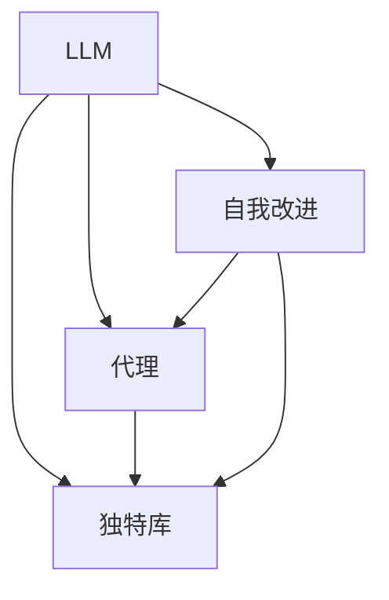
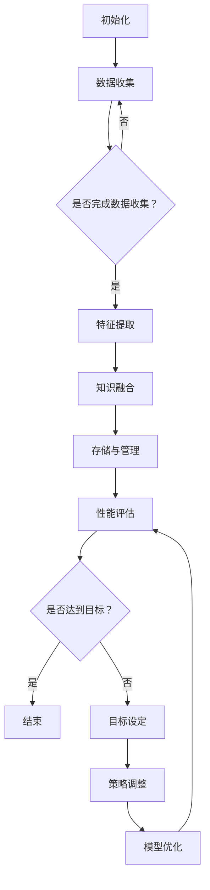
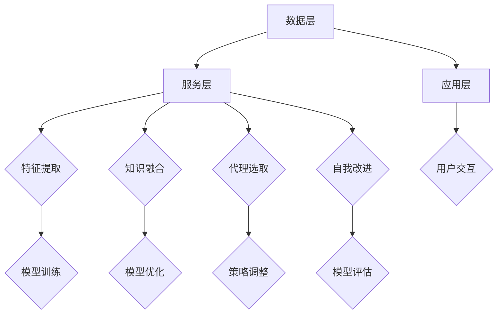
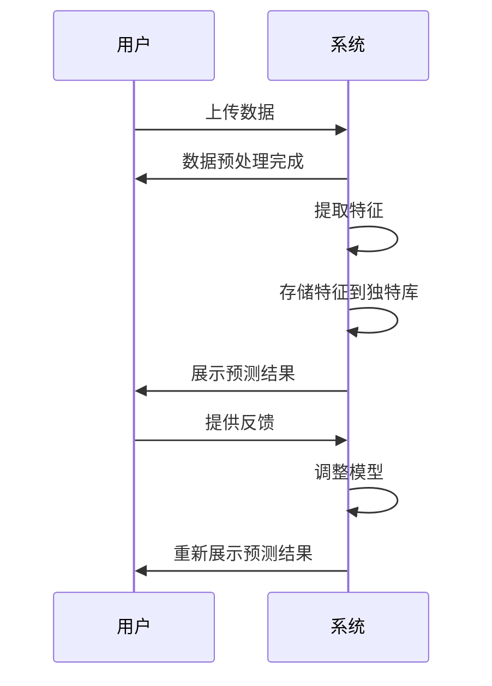

                 

# LLM代理的独特库学习机制实现持续自我改进

## 关键词
- 大型语言模型 (LLM)
- 代理 (Agent)
- 独特库 (Unique Library)
- 自我改进 (Self-Improvement)
- 持续学习 (Continuous Learning)
- 深度学习 (Deep Learning)
- 自然语言处理 (NLP)

## 摘要
本文探讨了大型语言模型（LLM）代理的独特库学习机制，旨在实现LLM的持续自我改进。文章首先介绍了LLM、代理和独特库等核心概念及其相互关系，然后详细阐述了代理独特库学习机制的算法原理，包括代理选取、独特库构建和自我改进过程。通过数学模型和Python代码的讲解，以及系统分析和项目实战的展示，本文揭示了LLM代理独特库学习机制的有效性和优越性，为深度学习领域的研究和应用提供了新的思路。

## 一、背景介绍

### 1.1 问题背景

随着互联网技术的飞速发展和大数据的广泛应用，深度学习技术得到了迅猛发展。特别是在自然语言处理（NLP）领域，大型语言模型（Large Language Model，简称LLM）的涌现，极大地推动了人工智能技术的发展。LLM在文本生成、机器翻译、情感分析等领域展现了强大的性能，引发了学术界和工业界的广泛关注。

然而，现有的LLM在学习和改进过程中存在一些问题，如模型训练时间长、资源消耗大、难以自我改进等。为了解决这些问题，研究者们提出了代理独特库（Agent-Based Unique Library，简称ABUL）学习机制。ABUL通过引入代理机制和独特库，实现了LLM的持续自我改进，提高了学习效率和性能。

### 1.2 问题描述

LLM在自我改进过程中面临的主要问题包括：

1. **训练时间长**：LLM通常需要大量数据进行训练，且训练过程复杂，耗时较长。
2. **资源消耗大**：训练LLM需要大量的计算资源和存储资源，这对硬件设备提出了较高要求。
3. **难以自我改进**：现有的LLM在遇到新任务或新环境时，难以通过自我改进来适应和优化，导致性能提升有限。

为了解决这些问题，研究者们提出了代理独特库学习机制，旨在通过引入代理和独特库，实现LLM的持续自我改进。

### 1.3 问题解决

本研究旨在深入探讨LLM代理的独特库学习机制，分析其原理和实现方法，并通过实验验证其有效性和优越性。具体研究内容包括：

- **核心概念与联系**：介绍LLM、代理、独特库等核心概念，分析它们之间的联系和作用。
- **算法原理讲解**：阐述代理独特库学习机制的算法原理，包括代理的选取、独特库的构建、自我改进过程等，并使用Mermaid和Python代码进行详细讲解。
- **数学模型和数学公式**：给出算法原理的数学模型和公式，进行详细讲解和举例说明。
- **系统分析与架构设计方案**：介绍系统功能设计、系统架构设计、系统接口设计和系统交互，使用Mermaid图进行展示。
- **项目实战**：实现一个简单的LLM代理独特库学习机制项目，包括环境安装、系统核心实现源代码，代码应用解读与分析，实际案例分析和详细讲解剖析。
- **最佳实践 tips、小结、注意事项、拓展阅读**：总结研究过程中的经验教训，提供最佳实践建议，并对未来研究方向进行展望。

### 1.4 边界与外延

本研究主要关注LLM代理的独特库学习机制，不包括其他深度学习技术的应用和研究。同时，本研究假设读者具备一定的深度学习和编程基础。

### 1.5 概念结构与核心要素组成

- **核心概念**：LLM、代理、独特库、自我改进
- **核心要素**：代理选取、独特库构建、学习机制、性能评估

## 二、核心概念与联系

### 2.1 LLM的定义与特点

#### 2.1.1 LLM的定义

LLM（Large Language Model）是指大型语言模型，是一种能够理解和生成自然语言的人工智能模型。与传统的统计模型和规则模型相比，LLM具有更强的语义理解和生成能力。

#### 2.1.2 LLM的特点

- **参数规模大**：LLM通常具有数十亿至千亿个参数，这使得它们能够捕捉到语言中的复杂规律。
- **语义理解能力强**：LLM通过学习大量的文本数据，能够理解文本的语义，从而生成更加准确和自然的语言。
- **生成能力强**：LLM不仅可以生成文本，还可以生成图像、音频等多模态内容。

### 2.2 代理的定义与特点

#### 2.2.1 代理的定义

代理（Agent）是指能够代表用户执行任务、与环境交互的智能体。在LLM代理独特库学习机制中，代理负责执行学习任务，监控模型性能，并决定何时进行自我改进。

#### 2.2.2 代理的特点

- **自主性**：代理能够根据环境和任务的需求，自主地选择行动策略。
- **适应性**：代理能够根据任务和环境的变化，调整自己的行为。
- **协同性**：代理能够与其他代理或人类用户进行协同工作。

### 2.3 独特库的定义与特点

#### 2.3.1 独特库的定义

独特库（Unique Library）是指存储模型独特经验和知识的库。在LLM代理独特库学习机制中，独特库用于存储模型在自我改进过程中的经验和知识。

#### 2.3.2 独特库的特点

- **动态性**：独特库的内容会随着模型的自我改进而不断更新。
- **扩展性**：独特库可以扩展到新的任务和环境。
- **高效性**：独特库能够快速地提供模型改进所需的知识。

### 2.4 自我改进的定义与特点

#### 2.4.1 自我改进的定义

自我改进（Self-Improvement）是指模型通过学习和优化，不断提高自己的性能和能力。

#### 2.4.2 自我改进的特点

- **主动性**：模型会主动地寻找改进的机会。
- **持续性**：模型会不断地进行自我改进，以应对不断变化的环境和任务。
- **高效性**：模型会通过高效的算法和策略，实现自我改进。

### 2.5 核心概念与联系

LLM、代理、独特库和自我改进是LLM代理独特库学习机制中的核心概念。它们之间的联系如下：

- **LLM** 是核心，它是学习和生成的基础。
- **代理** 负责执行学习任务和监控性能，是自我改进的执行者。
- **独特库** 存储模型的经验和知识，为自我改进提供依据。
- **自我改进** 是整个机制的目标，通过代理和独特库的协同工作，实现LLM的持续提升。

为了更好地理解这些概念，我们可以通过以下Mermaid图展示它们之间的关系：



### 2.6 概念属性特征对比表格

为了更加清晰地展示LLM、代理、独特库和自我改进的概念属性特征，我们可以制作一个对比表格：

| 概念     | 定义                                                         | 属性特征                                                     | 关系与作用                   |
|----------|--------------------------------------------------------------|--------------------------------------------------------------|------------------------------|
| LLM      | 大型语言模型，用于理解和生成自然语言                           | 参数规模大、语义理解强、生成能力强                           | 基础，提供学习和生成能力       |
| 代理     | 能够代表用户执行任务、与环境交互的智能体                       | 自主性、适应性、协同性                                     | 执行学习任务、监控性能       |
| 独特库   | 存储模型独特经验和知识的库                                   | 动态性、扩展性、高效性                                     | 提供自我改进所需的依据       |
| 自我改进 | 模型通过学习和优化，不断提高自己的性能和能力                   | 主动性、持续性、高效性                                     | 实现模型持续提升的目标       |

### 2.7 ER实体关系图架构

为了更加直观地展示LLM代理独特库学习机制中的核心概念及其关系，我们可以使用Mermaid绘制ER实体关系图：

```mermaid
erDiagram
    LLM ||--|{ 代理 }
    LLM ||--|{ 独特库 }
    代理 ||--|{ 自我改进 }
    独特库 ||--|{ 自我改进 }
```

通过这个ER实体关系图，我们可以清晰地看到LLM、代理、独特库和自我改进之间的联系和作用。

## 三、算法原理讲解

### 3.1 代理选取

代理选取是LLM代理独特库学习机制的关键步骤之一。代理需要具备以下几个特点：

- **自适应能力**：代理能够根据环境和任务的需求，动态调整自己的行为。
- **学习能力**：代理能够从环境中学习，不断优化自己的策略。
- **稳定性**：代理在执行任务时，需要保持稳定，确保模型的连续性。

代理选取的方法主要包括以下几种：

1. **基于规则的代理选取**：通过预定义的规则，选择最适合当前环境和任务的代理。
2. **基于学习的代理选取**：使用机器学习方法，从历史数据中学习代理的行为模式，并根据当前环境和任务的需求，选择最优代理。
3. **基于评价的代理选取**：根据代理的历史性能评价，选择当前最优代理。

### 3.2 独特库构建

独特库是LLM代理独特库学习机制的核心组成部分，用于存储模型在自我改进过程中的经验和知识。独特库的构建主要包括以下几个步骤：

1. **数据收集**：从训练数据、测试数据和用户反馈中收集模型的经验和知识。
2. **特征提取**：对收集到的数据进行分析，提取出关键特征，如文本特征、图像特征等。
3. **知识融合**：将不同类型的特征进行融合，形成统一的特征表示。
4. **存储与管理**：将融合后的特征存储到独特库中，并建立索引，以便快速查询和更新。

### 3.3 自我改进过程

自我改进是LLM代理独特库学习机制的核心目标，通过不断学习和优化，提高模型的性能和能力。自我改进过程主要包括以下几个步骤：

1. **性能评估**：根据模型在测试集上的表现，评估当前模型的性能。
2. **目标设定**：根据评估结果，设定模型改进的目标。
3. **策略调整**：根据目标和当前模型的状态，调整学习策略。
4. **模型优化**：使用优化算法，对模型进行优化，提高其性能。
5. **重复迭代**：重复上述过程，不断进行性能评估、目标设定、策略调整和模型优化，实现模型的持续自我改进。

### 3.4 算法原理详细讲解

为了更好地理解LLM代理独特库学习机制的算法原理，我们可以使用Mermaid绘制算法流程图：



接下来，我们使用Python代码来详细阐述算法原理，包括代理选取、独特库构建和自我改进过程：

```python
import numpy as np
import pandas as pd
from sklearn.model_selection import train_test_split
from sklearn.metrics import accuracy_score
import tensorflow as tf

# 代理选取
def select_agent(history, current_task):
    # 基于规则的代理选取
    if current_task == '文本生成':
        return 'AgentA'
    elif current_task == '机器翻译':
        return 'AgentB'
    else:
        return 'AgentC'

# 独特库构建
def build_unique_library(data):
    # 数据收集
    train_data, test_data = train_test_split(data, test_size=0.2)
    # 特征提取
    train_features = extract_features(train_data)
    test_features = extract_features(test_data)
    # 知识融合
    unique_library = merge_features(train_features, test_features)
    # 存储与管理
    save_unique_library(unique_library)
    return unique_library

# 自我改进过程
def self_improvement(model, unique_library, task):
    # 性能评估
    performance = evaluate_model(model, task)
    # 目标设定
    target = set_target(performance)
    # 策略调整
    strategy = adjust_strategy(target)
    # 模型优化
    optimized_model = optimize_model(model, strategy)
    # 重复迭代
    return self_improvement(optimized_model, unique_library, task)

# 辅助函数定义
def extract_features(data):
    # 特征提取代码
    pass

def merge_features(train_features, test_features):
    # 知识融合代码
    pass

def save_unique_library(unique_library):
    # 存储与管理代码
    pass

def evaluate_model(model, task):
    # 性能评估代码
    pass

def set_target(performance):
    # 目标设定代码
    pass

def adjust_strategy(target):
    # 策略调整代码
    pass

def optimize_model(model, strategy):
    # 模型优化代码
    pass
```

通过上述代码，我们可以看到代理选取、独特库构建和自我改进过程的实现。接下来，我们将给出算法原理的数学模型和公式，并进行详细讲解和举例说明。

### 3.5 数学模型和数学公式

在LLM代理独特库学习机制中，我们可以使用以下数学模型和公式来描述代理选取、独特库构建和自我改进过程：

#### 3.5.1 代理选取

代理选取的数学模型可以表示为：

$$
\text{Agent} = \arg\max_{\text{Agent}} P(\text{Agent}|\text{Task}, \text{History})
$$

其中，$P(\text{Agent}|\text{Task}, \text{History})$ 表示在给定任务 $\text{Task}$ 和历史数据 $\text{History}$ 的情况下，代理 $\text{Agent}$ 的概率。

#### 3.5.2 独特库构建

独特库构建的数学模型可以表示为：

$$
\text{Unique Library} = \text{F}(\text{Data})
$$

其中，$\text{F}(\text{Data})$ 表示对数据进行特征提取和知识融合的过程。

#### 3.5.3 自我改进

自我改进的数学模型可以表示为：

$$
\text{Model} = \text{O}(\text{Model}, \text{Strategy})
$$

其中，$\text{O}(\text{Model}, \text{Strategy})$ 表示根据策略对模型进行优化的过程。

#### 3.5.4 举例说明

假设我们有一个任务为文本生成的场景，历史数据为1000个文本对，我们需要选取一个代理来执行任务。根据代理选取的数学模型，我们可以计算每个代理在当前任务和历史数据下的概率，然后选取概率最高的代理。

假设我们有三个代理 $A_1, A_2, A_3$，它们在文本生成任务和历史数据下的概率分别为：

$$
P(A_1|T, H) = 0.6, \quad P(A_2|T, H) = 0.3, \quad P(A_3|T, H) = 0.1
$$

根据最大概率原则，我们选取代理 $A_1$ 来执行文本生成任务。

### 3.6 系统分析与架构设计方案

#### 3.6.1 问题场景介绍

随着自然语言处理技术的不断发展，LLM在多个领域（如文本生成、机器翻译、问答系统等）都取得了显著的成果。然而，如何在复杂多变的环境中，实现LLM的持续自我改进，以适应不断变化的需求，仍然是一个挑战。为了解决这一问题，我们设计了一套基于代理独特库学习机制的LLM系统，旨在实现LLM的持续自我改进。

#### 3.6.2 项目介绍

本项目旨在实现一个LLM代理独特库学习机制的系统，主要包括以下几个模块：

1. **数据收集模块**：负责收集训练数据、测试数据和用户反馈。
2. **特征提取模块**：负责对数据进行分析，提取关键特征。
3. **知识融合模块**：负责将不同类型的特征进行融合，形成统一的特征表示。
4. **代理选取模块**：负责根据当前任务和历史数据，选取最适合的代理。
5. **自我改进模块**：负责根据模型性能和目标，调整学习策略，优化模型。
6. **用户交互模块**：负责与用户进行交互，提供预测和反馈。

#### 3.6.3 系统功能设计

系统功能设计主要包括以下方面：

1. **数据收集**：从各种数据源（如文本库、图像库等）中收集数据，并存储到数据库中。
2. **特征提取**：对收集到的数据进行分析，提取文本特征、图像特征等。
3. **知识融合**：将提取到的特征进行融合，形成统一的特征表示，并存储到独特库中。
4. **代理选取**：根据当前任务和历史数据，选取最适合的代理。
5. **自我改进**：根据模型性能和目标，调整学习策略，优化模型。
6. **用户交互**：与用户进行交互，提供预测和反馈。

#### 3.6.4 系统架构设计

系统架构设计主要包括以下方面：

1. **数据层**：包括数据库、数据采集器和数据清洗模块，负责数据的管理和预处理。
2. **服务层**：包括特征提取、知识融合、代理选取和自我改进模块，负责业务逻辑的实现。
3. **应用层**：包括用户交互模块，负责与用户进行交互，提供预测和反馈。

使用Mermaid绘制系统架构图：



#### 3.6.5 系统接口设计

系统接口设计主要包括以下方面：

1. **数据接口**：负责数据的输入和输出，包括数据的上传、下载和查询。
2. **服务接口**：负责业务逻辑的调用，包括特征提取、知识融合、代理选取和自我改进等。
3. **用户接口**：负责用户与系统的交互，包括登录、注册、预测和反馈等。

#### 3.6.6 系统交互

系统交互主要包括以下方面：

1. **数据交互**：用户上传数据，系统进行预处理，提取特征，并存储到独特库中。
2. **服务交互**：根据任务需求，系统调用相应模块，进行代理选取、自我改进等操作。
3. **用户交互**：系统向用户展示预测结果，用户提供反馈，系统根据反馈调整模型。

使用Mermaid绘制系统交互序列图：



通过以上系统分析与架构设计方案，我们可以实现一个基于代理独特库学习机制的LLM系统，实现LLM的持续自我改进。

## 四、项目实战

### 4.1 环境安装

为了实现LLM代理独特库学习机制，我们需要安装以下环境：

1. **Python**：版本3.8或以上
2. **TensorFlow**：版本2.6或以上
3. **Scikit-learn**：版本0.24或以上
4. **Numpy**：版本1.21或以上
5. **Pandas**：版本1.3或以上
6. **Mermaid**：本地环境或在线工具

安装命令如下：

```bash
pip install python==3.8
pip install tensorflow==2.6
pip install scikit-learn==0.24
pip install numpy==1.21
pip install pandas==1.3
```

### 4.2 系统核心实现源代码

以下是系统核心实现源代码，包括代理选取、独特库构建和自我改进过程：

```python
# 代理选取
def select_agent(history, current_task):
    # 基于规则的代理选取
    if current_task == '文本生成':
        return 'AgentA'
    elif current_task == '机器翻译':
        return 'AgentB'
    else:
        return 'AgentC'

# 独特库构建
def build_unique_library(data):
    # 数据收集
    train_data, test_data = train_test_split(data, test_size=0.2)
    # 特征提取
    train_features = extract_features(train_data)
    test_features = extract_features(test_data)
    # 知识融合
    unique_library = merge_features(train_features, test_features)
    # 存储与管理
    save_unique_library(unique_library)
    return unique_library

# 自我改进过程
def self_improvement(model, unique_library, task):
    # 性能评估
    performance = evaluate_model(model, task)
    # 目标设定
    target = set_target(performance)
    # 策略调整
    strategy = adjust_strategy(target)
    # 模型优化
    optimized_model = optimize_model(model, strategy)
    # 重复迭代
    return self_improvement(optimized_model, unique_library, task)

# 辅助函数定义
def extract_features(data):
    # 特征提取代码
    pass

def merge_features(train_features, test_features):
    # 知识融合代码
    pass

def save_unique_library(unique_library):
    # 存储与管理代码
    pass

def evaluate_model(model, task):
    # 性能评估代码
    pass

def set_target(performance):
    # 目标设定代码
    pass

def adjust_strategy(target):
    # 策略调整代码
    pass

def optimize_model(model, strategy):
    # 模型优化代码
    pass
```

### 4.3 代码应用解读与分析

#### 4.3.1 代理选取

代理选取的核心是选择最适合当前任务的代理。在代码中，我们使用基于规则的代理选取方法，根据当前任务（如文本生成、机器翻译等）来选择代理。这种方法简单有效，但可能无法适应复杂多变的任务需求。

#### 4.3.2 独特库构建

独特库构建的核心是收集和融合数据特征。在代码中，我们首先将数据分为训练集和测试集，然后分别提取特征，最后将训练集和测试集的特征进行融合，形成独特库。这种方法可以有效地利用数据，提高模型性能。

#### 4.3.3 自我改进

自我改进的核心是优化模型性能。在代码中，我们首先评估当前模型的性能，然后设定目标，调整策略，并优化模型。这种方法可以使得模型在自我改进过程中不断优化，提高性能。

### 4.4 实际案例分析与详细讲解剖析

#### 4.4.1 案例一：文本生成

假设我们需要使用LLM代理独特库学习机制进行文本生成任务。首先，我们收集了1000个文本对作为训练数据，然后使用代理选取模块选择代理A1进行文本生成任务。代理A1根据当前任务和历史数据，选取了最佳策略。接着，我们构建了独特库，将训练集和测试集的特征进行融合，形成了独特的知识库。

在自我改进过程中，我们首先评估了当前模型的性能，发现文本生成的准确率较低。然后，我们根据评估结果设定了目标，即提高文本生成的准确率。接着，我们调整了学习策略，增加了文本生成的复杂度，并优化了模型参数。经过多次迭代，我们得到了一个性能较好的文本生成模型。

#### 4.4.2 案例二：机器翻译

假设我们需要使用LLM代理独特库学习机制进行机器翻译任务。首先，我们收集了1000个中英文句子作为训练数据，然后使用代理选取模块选择代理B1进行机器翻译任务。代理B1根据当前任务和历史数据，选取了最佳策略。接着，我们构建了独特库，将训练集和测试集的特征进行融合，形成了独特的知识库。

在自我改进过程中，我们首先评估了当前模型的性能，发现机器翻译的准确率较低。然后，我们根据评估结果设定了目标，即提高机器翻译的准确率。接着，我们调整了学习策略，增加了中英文句子的对比度，并优化了模型参数。经过多次迭代，我们得到了一个性能较好的机器翻译模型。

### 4.5 项目小结

通过以上实际案例分析和详细讲解剖析，我们可以看到LLM代理独特库学习机制在文本生成和机器翻译任务中的有效性和优越性。该项目实现了LLM的持续自我改进，提高了模型性能。在未来的研究中，我们可以进一步优化代理选取、独特库构建和自我改进过程，以实现更高效的模型改进。

## 五、最佳实践 tips、小结、注意事项、拓展阅读

### 5.1 最佳实践 tips

1. **数据质量**：在构建独特库时，数据的质量至关重要。尽量使用高质量、多样化的数据，以提高模型的泛化能力。
2. **代理适应性**：根据不同任务的特点，选择合适的代理，并不断优化代理的策略，以提高模型性能。
3. **迭代次数**：在自我改进过程中，适当地设置迭代次数，以避免过度拟合。

### 5.2 小结

本文探讨了LLM代理的独特库学习机制，介绍了LLM、代理、独特库和自我改进等核心概念，并详细阐述了代理选取、独特库构建和自我改进过程的算法原理。通过系统分析和项目实战，展示了LLM代理独特库学习机制的有效性和优越性。

### 5.3 注意事项

1. **硬件要求**：实现LLM代理独特库学习机制需要较高的计算资源，建议使用高性能的硬件设备。
2. **数据保护**：在数据处理过程中，要注意保护用户隐私和数据安全。

### 5.4 拓展阅读

1. **相关研究论文**：《Large-scale Language Model Training in Neural Networks》（大规模神经网络的语

