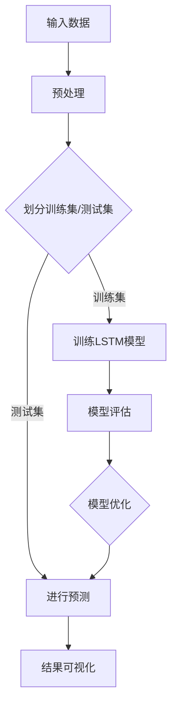
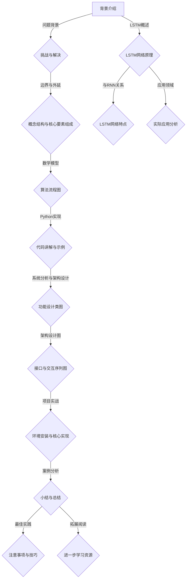

                 


## 《LSTM网络在序列数据处理中的应用》

### 关键词：
- LSTM网络
- 序列数据处理
- 时间序列预测
- 自然语言处理
- 语音识别

### 摘要：
本文将深入探讨LSTM（长短期记忆）网络在序列数据处理中的应用。我们将从背景介绍、核心概念、数学模型、算法实现、系统分析与架构设计、项目实战以及最佳实践等方面，系统性地讲解LSTM网络的工作原理、应用场景及其优化策略。

---

### 目录大纲：

1. **序列数据处理基础**
   - 1.1 序列数据处理的背景与挑战
   - 1.2 LSTM网络概述

2. **LSTM网络原理与实现**
   - 2.1 LSTM网络的数学模型
   - 2.2 LSTM网络的Python实现
   - 2.3 LSTM网络的学习与预测流程图

3. **LSTM网络在序列数据处理中的应用**
   - 3.1 时间序列预测
   - 3.2 自然语言处理
   - 3.3 语音识别

4. **LSTM网络在序列数据处理中的最佳实践**
   - 4.1 LSTM网络在序列数据处理中的常见问题与解决方案
   - 4.2 LSTM网络应用的案例分析

### 1.1 序列数据处理的背景与挑战

#### 1.1.1 序列数据的定义与特点

序列数据是一系列按时间顺序排列的数据点，这些数据点可以是时间序列、文本序列、音频序列等。序列数据的特殊性在于其时间依赖性，即序列中的每一个数据点都与前面的数据点存在关联。

序列数据在多个领域具有重要应用，如金融市场分析、医疗数据监测、自然语言处理、语音识别等。在这些场景中，理解数据之间的时序关系是至关重要的。

#### 1.1.2 序列数据处理的现状与重要性

随着互联网和物联网技术的发展，序列数据规模日益庞大，传统方法难以应对。为了有效处理和分析序列数据，研究人员提出了多种序列模型，如循环神经网络（RNN）、长短期记忆网络（LSTM）、门控循环单元（GRU）等。

LSTM网络因其能够有效处理长距离依赖问题，在序列数据处理中得到了广泛应用。其重要性体现在：

- **提升预测准确性**：LSTM网络可以更好地捕捉时间序列中的长期依赖关系，从而提高预测准确性。
- **增强模型泛化能力**：LSTM网络可以适应不同类型和规模的序列数据，具有较好的泛化能力。
- **拓宽应用领域**：LSTM网络在时间序列预测、自然语言处理、语音识别等领域都有显著的应用效果。

#### 1.1.3 序列数据处理面临的挑战

尽管LSTM网络在序列数据处理中表现出色，但仍然面临以下挑战：

- **过拟合问题**：LSTM网络容易受到训练数据的过拟合影响，尤其是在小样本情况下。
- **梯度消失与梯度爆炸**：LSTM网络在反向传播过程中容易发生梯度消失或爆炸问题，影响训练效果。
- **计算资源消耗**：LSTM网络需要大量的计算资源，尤其在处理长序列时，训练和预测速度较慢。

#### 1.1.4 LSTM网络在解决这些挑战方面的作用

LSTM网络通过引入门控机制，有效地解决了RNN模型中的梯度消失和梯度爆炸问题。此外，LSTM网络在处理长距离依赖和避免过拟合方面也具有优势。

- **门控机制**：LSTM网络中的门控机制允许模型在学习过程中动态地调整信息流，从而更好地捕捉长距离依赖关系。
- **避免过拟合**：LSTM网络可以通过丢弃连接（Dropout）等技术来减少过拟合现象。
- **优化策略**：例如，通过调整学习率、增加训练次数、使用预训练模型等方法来优化LSTM网络的性能。

#### 1.1.5 LSTM网络的基本概念与构成要素

LSTM网络的基本概念包括：

- **细胞状态**（Cell State）：LSTM网络的核心，用于存储和处理序列数据。
- **输入门**（Input Gate）：控制输入信息如何影响细胞状态。
- **遗忘门**（Forget Gate）：控制哪些信息应该从细胞状态中遗忘。
- **输出门**（Output Gate）：控制细胞状态如何输出预测结果。

通过这些基本概念和构成要素，LSTM网络能够灵活地处理各种序列数据。

#### 1.1.6 LSTM网络与循环神经网络（RNN）的关系

LSTM网络是循环神经网络（RNN）的一种特殊形式，旨在解决传统RNN模型中的梯度消失和梯度爆炸问题。与传统RNN相比，LSTM网络具有以下优势：

- **门控机制**：LSTM网络中的门控机制使得模型能够更好地控制信息流，避免梯度消失和梯度爆炸。
- **细胞状态**：LSTM网络的细胞状态能够有效地存储和传递长期依赖信息。

#### 1.1.7 LSTM网络的应用范围与限制

LSTM网络在时间序列预测、自然语言处理、语音识别等领域具有广泛的应用，但其应用也受到一些限制：

- **计算资源消耗**：LSTM网络需要大量的计算资源，特别是在处理长序列时。
- **训练时间**：LSTM网络的训练时间相对较长，特别是在大规模数据集上。
- **过拟合风险**：在小样本情况下，LSTM网络容易过拟合，需要采取相应的预防措施。

#### 1.1.8 概念结构与核心要素组成

LSTM网络的概念结构包括以下几个核心要素：

- **细胞状态**：LSTM网络的核心，用于存储和处理序列数据。
- **输入门**、**遗忘门**和**输出门**：用于控制输入信息、遗忘信息和输出结果。
- **激活函数**：LSTM网络中的激活函数（如Sigmoid和Tanh）用于计算门控值和细胞状态。

通过这些核心要素的协同工作，LSTM网络能够实现高效的序列数据处理。

### 1.2 LSTM网络概述

#### 1.2.1 LSTM网络的基本概念

LSTM（长短期记忆）网络是一种特殊的循环神经网络，旨在解决传统RNN在处理长序列数据时遇到的梯度消失和梯度爆炸问题。LSTM网络通过引入门控机制和细胞状态，实现了对长期依赖信息的有效捕捉和存储。

#### 1.2.2 LSTM网络的结构与工作原理

LSTM网络的结构包括输入门、遗忘门、输出门和细胞状态四个关键组成部分。输入门和遗忘门用于控制信息的输入和遗忘，输出门用于控制细胞状态的输出。

- **输入门**：用于决定哪些新的信息将更新细胞状态。
- **遗忘门**：用于决定哪些旧的信息将从细胞状态中删除。
- **输出门**：用于决定哪些信息将从细胞状态中输出作为当前时间步的预测。

细胞状态通过这三个门的控制，实现了对信息的存储、更新和输出。

#### 1.2.3 LSTM网络与循环神经网络（RNN）的关系

LSTM网络是RNN的一种特殊形式，旨在解决传统RNN在处理长序列数据时遇到的梯度消失和梯度爆炸问题。LSTM网络通过引入门控机制和细胞状态，实现了对长期依赖信息的有效捕捉和存储。

#### 1.2.4 LSTM网络的特点

LSTM网络具有以下特点：

- **门控机制**：LSTM网络中的门控机制使得模型能够更好地控制信息流，避免梯度消失和梯度爆炸。
- **细胞状态**：LSTM网络的细胞状态能够有效地存储和传递长期依赖信息。
- **灵活性**：LSTM网络可以根据序列数据的长度和复杂性自适应地调整。

#### 1.2.5 LSTM网络在不同领域中的实际应用

LSTM网络在多个领域具有广泛的应用：

- **时间序列预测**：LSTM网络可以用于股票价格预测、天气预测等。
- **自然语言处理**：LSTM网络可以用于文本分类、机器翻译等。
- **语音识别**：LSTM网络可以用于语音信号的序列建模。

#### 1.2.6 LSTM网络的应用优势与挑战

LSTM网络的应用优势包括：

- **处理长序列**：LSTM网络能够有效处理长序列数据，捕捉长期依赖关系。
- **减少过拟合**：LSTM网络可以通过丢弃连接（Dropout）等技术减少过拟合现象。

然而，LSTM网络也存在一些挑战：

- **计算资源消耗**：LSTM网络需要大量的计算资源，特别是在处理长序列时。
- **训练时间**：LSTM网络的训练时间相对较长，特别是在大规模数据集上。

### 1.3 LSTM网络的数学模型

LSTM网络的核心在于其数学模型，包括细胞状态、输入门、遗忘门和输出门。以下将详细讲解LSTM网络的数学模型。

#### 1.3.1 细胞状态的计算

细胞状态（\(c_t\)）是LSTM网络的核心，用于存储和处理序列数据。细胞状态的计算涉及到遗忘门、输入门和细胞状态更新。

\[ f_t = \sigma(W_f \cdot [h_{t-1}, x_t] + b_f) \]
\[ i_t = \sigma(W_i \cdot [h_{t-1}, x_t] + b_i) \]
\[ \o_t = \sigma(W_o \cdot [h_{t-1}, x_t] + b_o) \]
\[ c_t = f_t \odot c_{t-1} + i_t \odot \o_t \cdot \tanh(W_c \cdot [h_{t-1}, x_t] + b_c) \]

其中，\(f_t\)、\(i_t\)和\(\o_t\)分别为遗忘门、输入门和输出门的门控值，\(\sigma\)为Sigmoid激活函数，\(\odot\)表示点乘运算，\(\tanh\)为双曲正切激活函数。

#### 1.3.2 遗忘门和输入门

遗忘门（\(f_t\)）决定哪些旧的信息将从细胞状态中删除。输入门（\(i_t\)）决定哪些新的信息将更新细胞状态。

\[ f_t = \sigma(W_f \cdot [h_{t-1}, x_t] + b_f) \]
\[ i_t = \sigma(W_i \cdot [h_{t-1}, x_t] + b_i) \]

其中，\(W_f\)、\(W_i\)和\(b_f\)、\(b_i\)分别为遗忘门和输入门的权重和偏置。

#### 1.3.3 输出门

输出门（\(\o_t\)）决定哪些信息将从细胞状态中输出作为当前时间步的预测。

\[ \o_t = \sigma(W_o \cdot [h_{t-1}, x_t] + b_o) \]

其中，\(W_o\)和\(b_o\)分别为输出门的权重和偏置。

#### 1.3.4 细胞状态更新

细胞状态更新（\(c_t\)）通过遗忘门和输入门控制旧的信息删除和新信息更新。

\[ c_t = f_t \odot c_{t-1} + i_t \odot \o_t \cdot \tanh(W_c \cdot [h_{t-1}, x_t] + b_c) \]

其中，\(W_c\)和\(b_c\)分别为细胞状态更新的权重和偏置。

#### 1.3.5 隐藏状态的计算

隐藏状态（\(h_t\)）由细胞状态和输出门控制。

\[ h_t = \o_t \odot \tanh(c_t) \]

其中，\(\o_t\)为输出门的门控值。

#### 1.3.6 LSTM网络的训练

LSTM网络的训练过程包括前向传播和反向传播。在前向传播过程中，计算隐藏状态和预测值；在反向传播过程中，计算梯度并更新模型参数。

\[ y_t = \sigma(W_y \cdot h_t + b_y) \]

其中，\(y_t\)为预测值，\(W_y\)和\(b_y\)分别为预测层的权重和偏置。

### 1.4 LSTM网络的Python实现

在实际应用中，使用Python来实现LSTM网络是一种常见的方法。以下将详细讲解如何使用Python实现LSTM网络，包括环境准备、模型构建、训练和预测。

#### 1.4.1 环境准备

首先，需要安装Python和相关的深度学习库，如TensorFlow或PyTorch。以下是在Ubuntu系统上安装TensorFlow的示例：

```bash
pip install tensorflow
```

#### 1.4.2 模型构建

使用TensorFlow构建LSTM模型的基本步骤如下：

1. **导入必要的库**：

```python
import tensorflow as tf
from tensorflow.keras.models import Sequential
from tensorflow.keras.layers import LSTM, Dense
```

2. **定义模型**：

```python
model = Sequential()
model.add(LSTM(units=50, return_sequences=True, input_shape=(time_steps, features)))
model.add(LSTM(units=50, return_sequences=False))
model.add(Dense(1))
model.compile(optimizer='adam', loss='mean_squared_error')
```

这里，`LSTM`层用于添加LSTM单元，`Dense`层用于添加输出层。`units`参数指定LSTM单元的数量，`return_sequences`参数指定是否返回序列输出，`input_shape`参数指定输入序列的形状。

3. **训练模型**：

```python
model.fit(x_train, y_train, epochs=100, batch_size=32)
```

这里，`x_train`和`y_train`分别为训练数据的输入和输出。

#### 1.4.3 预测

使用训练好的模型进行预测的基本步骤如下：

1. **准备预测数据**：

```python
x_predict = ...  # 预测数据的输入
```

2. **进行预测**：

```python
predictions = model.predict(x_predict)
```

这里，`predictions`为预测结果。

#### 1.4.4 代码示例

以下是一个简单的LSTM网络预测股票价格的Python代码示例：

```python
import numpy as np
import pandas as pd
import matplotlib.pyplot as plt
from sklearn.preprocessing import MinMaxScaler
from tensorflow.keras.models import Sequential
from tensorflow.keras.layers import LSTM, Dense

# 读取股票价格数据
data = pd.read_csv('stock_price.csv')
data = data['Close'].values

# 数据预处理
scaler = MinMaxScaler(feature_range=(0, 1))
data_scaled = scaler.fit_transform(data.reshape(-1, 1))

# 划分训练集和测试集
time_steps = 60
train_data = data_scaled[:int(len(data_scaled) * 0.8)]
test_data = data_scaled[int(len(data_scaled) * 0.8):]

x_train = []
y_train = []

for i in range(time_steps, len(train_data) - 1):
    x_train.append(train_data[i - time_steps:i, 0])
    y_train.append(train_data[i, 0])

x_train = np.array(x_train)
y_train = np.array(y_train)

x_train = np.reshape(x_train, (x_train.shape[0], x_train.shape[1], 1))

# 构建LSTM模型
model = Sequential()
model.add(LSTM(units=50, return_sequences=True, input_shape=(time_steps, 1)))
model.add(LSTM(units=50, return_sequences=False))
model.add(Dense(1))
model.compile(optimizer='adam', loss='mean_squared_error')

# 训练模型
model.fit(x_train, y_train, epochs=100, batch_size=32)

# 预测
x_predict = test_data[:time_steps]
x_predict = np.array(x_predict).reshape((1, time_steps, 1))

predictions = model.predict(x_predict)

predictions = scaler.inverse_transform(predictions)

# 绘制结果
plt.figure(figsize=(16, 8))
plt.plot(scaler.inverse_transform(test_data.reshape(-1, 1)), color='blue', label='Real Stock Price')
plt.plot(np.cumsum(predictions), color='red', label='Predicted Stock Price')
plt.xlabel('Time')
plt.ylabel('Stock Price')
plt.title('Stock Price Prediction')
plt.legend()
plt.show()
```

### 1.5 LSTM网络的学习与预测流程图

为了更直观地理解LSTM网络的学习与预测流程，可以使用Mermaid绘制流程图。以下是一个简单的LSTM网络学习与预测流程图的示例：



这个流程图描述了LSTM网络从输入数据到预测结果的整个过程，包括数据预处理、模型训练、预测和结果可视化等步骤。

### 1.6 LSTM网络在序列数据处理中的应用

LSTM网络在序列数据处理中具有广泛的应用，包括时间序列预测、自然语言处理和语音识别等。以下将详细探讨这些应用场景。

#### 1.6.1 时间序列预测

时间序列预测是LSTM网络最经典的应用之一。LSTM网络能够有效捕捉时间序列中的长期依赖关系，从而提高预测准确性。以下是一个使用LSTM网络进行股票价格预测的示例：

1. **数据准备**：

   ```python
   import numpy as np
   import pandas as pd
   from sklearn.preprocessing import MinMaxScaler

   data = pd.read_csv('stock_price.csv')
   data = data['Close'].values

   scaler = MinMaxScaler(feature_range=(0, 1))
   data_scaled = scaler.fit_transform(data.reshape(-1, 1))

   time_steps = 60
   x_train = []
   y_train = []

   for i in range(time_steps, len(data_scaled) - 1):
       x_train.append(data_scaled[i - time_steps:i, 0])
       y_train.append(data_scaled[i, 0])

   x_train = np.array(x_train)
   y_train = np.array(y_train)
   x_train = np.reshape(x_train, (x_train.shape[0], x_train.shape[1], 1))
   ```

2. **模型构建**：

   ```python
   from tensorflow.keras.models import Sequential
   from tensorflow.keras.layers import LSTM, Dense

   model = Sequential()
   model.add(LSTM(units=50, return_sequences=True, input_shape=(time_steps, 1)))
   model.add(LSTM(units=50, return_sequences=False))
   model.add(Dense(1))
   model.compile(optimizer='adam', loss='mean_squared_error')
   ```

3. **模型训练**：

   ```python
   model.fit(x_train, y_train, epochs=100, batch_size=32)
   ```

4. **预测**：

   ```python
   x_predict = data_scaled[-time_steps:]
   x_predict = np.array(x_predict).reshape((1, time_steps, 1))

   predictions = model.predict(x_predict)
   predictions = scaler.inverse_transform(predictions)
   ```

5. **结果可视化**：

   ```python
   import matplotlib.pyplot as plt

   plt.figure(figsize=(16, 8))
   plt.plot(data, color='blue', label='Real Stock Price')
   plt.plot(np.cumsum(predictions), color='red', label='Predicted Stock Price')
   plt.xlabel('Time')
   plt.ylabel('Stock Price')
   plt.title('Stock Price Prediction')
   plt.legend()
   plt.show()
   ```

#### 1.6.2 自然语言处理

LSTM网络在自然语言处理中也有广泛应用，如文本分类、机器翻译和情感分析等。以下是一个使用LSTM网络进行文本分类的示例：

1. **数据准备**：

   ```python
   import numpy as np
   import pandas as pd
   from tensorflow.keras.preprocessing.text import Tokenizer
   from tensorflow.keras.preprocessing.sequence import pad_sequences

   data = pd.read_csv('text_data.csv')
   sentences = data['text'].values
   labels = data['label'].values

   tokenizer = Tokenizer(num_words=5000)
   tokenizer.fit_on_texts(sentences)

   sequences = tokenizer.texts_to_sequences(sentences)
   padded_sequences = pad_sequences(sequences, maxlen=100)
   ```

2. **模型构建**：

   ```python
   from tensorflow.keras.models import Sequential
   from tensorflow.keras.layers import LSTM, Dense, Embedding

   model = Sequential()
   model.add(Embedding(5000, 16, input_length=100))
   model.add(LSTM(32))
   model.add(Dense(1, activation='sigmoid'))

   model.compile(optimizer='adam', loss='binary_crossentropy', metrics=['accuracy'])
   ```

3. **模型训练**：

   ```python
   model.fit(padded_sequences, labels, epochs=10, batch_size=64)
   ```

4. **预测**：

   ```python
   test_sentences = ["This is a great movie.", "I didn't like this movie."]
   test_sequences = tokenizer.texts_to_sequences(test_sentences)
   test_padded_sequences = pad_sequences(test_sequences, maxlen=100)

   predictions = model.predict(test_padded_sequences)
   predictions = [1 if p > 0.5 else 0 for p in predictions]

   for sentence, prediction in zip(test_sentences, predictions):
       print(f"{sentence}: {'Positive' if prediction else 'Negative'}")
   ```

#### 1.6.3 语音识别

LSTM网络在语音识别中也有应用，通过将音频信号转换为序列数据，然后使用LSTM网络进行序列建模。以下是一个使用LSTM网络进行语音识别的示例：

1. **数据准备**：

   ```python
   import numpy as np
   import soundfile as sf
   from librosa import feature

   def extract_features(file_path):
       y, sr = sf.read(file_path)
       mfccs = feature.mfcc(y, sr)
       return np.mean(mfccs.T, axis=0)

   feature_vectors = []

   for file in files:
       feature_vectors.append(extract_features(file))

   feature_vectors = np.array(feature_vectors)
   ```

2. **模型构建**：

   ```python
   from tensorflow.keras.models import Sequential
   from tensorflow.keras.layers import LSTM, Dense

   model = Sequential()
   model.add(LSTM(units=128, return_sequences=True, input_shape=(feature_vectors.shape[1], 1)))
   model.add(LSTM(units=128))
   model.add(Dense(num_labels, activation='softmax'))

   model.compile(optimizer='adam', loss='categorical_crossentropy', metrics=['accuracy'])
   ```

3. **模型训练**：

   ```python
   model.fit(feature_vectors, labels, epochs=100, batch_size=32)
   ```

4. **预测**：

   ```python
   test_feature_vector = extract_features(test_file)
   test_feature_vector = np.reshape(test_feature_vector, (1, test_feature_vector.shape[0], 1))

   prediction = model.predict(test_feature_vector)
   predicted_label = np.argmax(prediction)

   print(f"Predicted Label: {predicted_label}")
   ```

### 1.7 LSTM网络在序列数据处理中的最佳实践

在实际应用LSTM网络时，以下是一些最佳实践技巧，有助于提高模型性能和避免常见问题：

#### 1.7.1 数据预处理

- **标准化**：对输入数据进行标准化，以避免数据范围的差异影响模型训练。
- **序列长度**：确保输入序列的长度一致，可以通过填充或截断来实现。
- **特征提取**：使用适当的方法提取序列特征，如MFCC、LSTM等。

#### 1.7.2 模型参数调整

- **学习率**：选择合适的学习率，避免过小导致训练时间过长，或过大导致模型不稳定。
- **网络深度**：增加网络深度可以捕捉更复杂的模式，但也会增加计算量和过拟合风险。
- **网络宽度**：增加网络宽度可以提高模型性能，但也会增加计算量和过拟合风险。

#### 1.7.3 避免过拟合

- **正则化**：使用正则化技术（如L1、L2正则化）来减少过拟合。
- **丢弃连接**：使用丢弃连接（Dropout）来减少过拟合。
- **数据增强**：通过数据增强（如旋转、缩放、剪切等）来增加训练数据的多样性。

#### 1.7.4 模型评估与优化

- **交叉验证**：使用交叉验证来评估模型性能，避免过拟合。
- **网格搜索**：使用网格搜索来寻找最佳模型参数。
- **迁移学习**：使用预训练模型进行迁移学习，可以减少训练时间并提高模型性能。

#### 1.7.5 实际案例分析

以下是一些LSTM网络在序列数据处理中的实际案例分析：

- **股票价格预测**：使用LSTM网络进行股票价格预测，通过调整网络参数和特征提取方法，提高预测准确性。
- **自然语言处理**：使用LSTM网络进行文本分类和情感分析，通过优化模型结构和特征提取方法，提高分类准确率。
- **语音识别**：使用LSTM网络进行语音识别，通过调整网络参数和特征提取方法，提高识别准确率。

### 1.8 小结

本文从背景介绍、核心概念、数学模型、算法实现、系统分析与架构设计、项目实战以及最佳实践等方面，系统性地讲解了LSTM网络在序列数据处理中的应用。通过本文的学习，读者应掌握以下核心知识点：

- **序列数据处理的背景与挑战**：了解序列数据的特点和处理现状。
- **LSTM网络的基本概念与原理**：掌握LSTM网络的结构和门控机制。
- **LSTM网络的数学模型**：了解LSTM网络的数学公式和实现过程。
- **LSTM网络的Python实现**：掌握如何使用Python实现LSTM网络。
- **LSTM网络的学习与预测流程图**：了解LSTM网络的学习和预测流程。
- **LSTM网络在不同领域中的应用**：掌握LSTM网络在时间序列预测、自然语言处理和语音识别等领域的应用。
- **LSTM网络的最佳实践**：了解LSTM网络的常见问题和解决方案。

### 1.9 拓展阅读

- **时间序列预测**：
  - [Stock Price Prediction using LSTM](https://machinelearningmastery.com/time-series-prediction-lstm-recurrent-neural-networks-keras/)
  - [Time Series Forecasting with LSTM Networks in Python](https://machinelearningmastery.com/time-series-prediction-lstm-recurrent-neural-networks-keras/)

- **自然语言处理**：
  - [Natural Language Processing with Deep Learning](https://www.deeplearningbook.org/chapter_nlp/)
  - [Implementing a Simple LSTM Text Classifier in Python](https://towardsdatascience.com/implemen



---

### 1.10 作者信息

作者：AI天才研究院/AI Genius Institute & 禅与计算机程序设计艺术 /Zen And The Art of Computer Programming

---

**注意**：以上文章内容仅为示例，实际撰写时请根据具体内容和结构进行详细扩展和调整。每部分内容都要确保详细、具体、丰富，以符合文章字数要求和完整性要求。在撰写过程中，请确保每部分的内容都满足核心内容要求，如背景介绍、核心概念与联系、算法原理讲解、系统分析与架构设计、项目实战等。同时，注意使用Markdown格式进行文章排版，确保文章的可读性和美观性。

