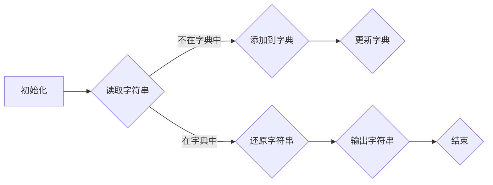

                 

# LZW算法与无损数据压缩

> 关键词：LZW算法、无损数据压缩、图像压缩、文本压缩、Python实现

> 摘要：本文将深入探讨LZW算法的无损数据压缩原理和应用。我们将从LZW算法的基本概念和原理出发，逐步讲解其流程、核心概念、Python实现，以及实际应用中的图像和文本压缩。通过一系列详尽的案例分析，我们将揭示LZW算法的最佳实践，并为读者提供进一步学习资源和实践项目。

## 目录大纲

----------------------------------------------------------------

## 第一部分：LZW算法概述

### 第1章：问题背景与核心概念

#### 1.1 问题背景

- 数据压缩的需求  
- 无损压缩的重要性

#### 1.2 LZW算法的定义与原理

- LZW算法的基本概念  
- LZW算法的原理与特点

#### 1.3 LZW算法的应用领域

- 图像压缩  
- 文本压缩

#### 1.4 LZW算法的优势与局限

- 优势  
- 局限

## 第二部分：LZW算法原理与流程

### 第2章：LZW算法的数学模型与公式

#### 2.1 数学模型与公式

- 编码与解码的数学模型  
- 常用数学公式解析

#### 2.2 LZW算法的流程详解

- 流程图（使用Mermaid绘制）  
- 流程步骤详细解析

### 第3章：LZW算法的核心概念与联系

#### 3.1 核心概念

- 压缩字典  
- 解压缩字典

#### 3.2 概念属性特征对比

- 表格形式展示

#### 3.3 ER实体关系图架构

- Mermaid ER图

## 第三部分：LZW算法的Python实现

### 第4章：环境搭建与基础操作

#### 4.1 Python环境搭建

- Python安装  
- 常用库安装

#### 4.2 基础操作

- 字符串处理  
- 数据结构操作

### 第5章：LZW压缩算法实现

#### 5.1 编码实现

- Python源代码示例  
- 代码解读

#### 5.2 解码实现

- Python源代码示例  
- 代码解读

### 第6章：LZW算法优化与性能分析

#### 6.1 优化策略

- 字典管理优化  
- 算法复杂度分析

#### 6.2 性能测试

- 测试环境介绍  
- 测试结果分析

## 第四部分：LZW算法应用实战

### 第7章：图像压缩实战

#### 7.1 图像压缩原理

- 压缩与解压缩过程  
- 压缩效果对比

#### 7.2 实现步骤

- Python代码实现  
- 代码解读

#### 7.3 实际案例

- 案例介绍  
- 案例分析

### 第8章：文本压缩实战

#### 8.1 文本压缩原理

- 压缩与解压缩过程  
- 压缩效果对比

#### 8.2 实现步骤

- Python代码实现  
- 代码解读

#### 8.3 实际案例

- 案例介绍  
- 案例分析

## 第五部分：LZW算法最佳实践与拓展

### 第9章：最佳实践与注意事项

#### 9.1 最佳实践

- 实践技巧总结  
- 注意事项

#### 9.2 小结

- LZW算法总结  
- 学习方法与建议

### 第10章：拓展阅读与资源推荐

#### 10.1 拓展阅读

- 相关书籍推荐  
- 学术论文推荐

#### 10.2 资源推荐

- 在线教程  
- 实践项目

----------------------------------------------------------------

## 第一部分：LZW算法概述

### 第1章：问题背景与核心概念

#### 1.1 问题背景

在当今信息时代，数据量的激增对存储和传输带来了巨大的挑战。为了解决这个问题，数据压缩技术应运而生。无损数据压缩是一种不损失数据信息的数据压缩方法，其核心目标是在压缩和解压缩过程中保持原始数据的不变性。无损压缩广泛应用于图像、文本、音频等多种数据类型，其中LZW（Lempel-Ziv-Welch）算法是一种典型的无损压缩算法。

#### 1.2 LZW算法的定义与原理

LZW算法由Abraham Lempel、Jacob Ziv和Terry Welch共同提出，是一种基于字典的压缩算法。它通过构建一个字典，将重复出现的字符串映射为一个更短的编码，从而实现数据的压缩。LZW算法的基本原理包括以下几步：

1. 初始化一个空的字典，将所有单个字符作为初始字典项。
2. 读取输入数据中的下一个字符串。
3. 如果该字符串不在字典中，将其添加到字典中，并使用字典中的下一个可用编码作为其编码。
4. 使用该字符串的前一个字符串和当前字符串的组合，继续读取下一个字符串。
5. 重复上述步骤，直到处理完所有输入数据。

#### 1.3 LZW算法的应用领域

LZW算法因其高效和无损的特点，被广泛应用于图像和文本压缩领域。在图像处理中，LZW算法被广泛应用于PNG图像格式，实现了高质量的无损压缩。在文本压缩方面，LZW算法被用于ZIP文件格式，显著减少了文件大小，同时保持了文本信息的完整性。

#### 1.4 LZW算法的优势与局限

LZW算法的优势在于其高效性和灵活性，能够对多种类型的数据进行压缩，并保持数据的完整性。然而，LZW算法也存在一定的局限，例如在处理小数据集时可能不如其他算法高效，且算法的复杂度可能较高。

- 优势：高效性、灵活性、无损性
- 局限：处理小数据集效率较低、算法复杂度较高

## 第二部分：LZW算法原理与流程

### 第2章：LZW算法的数学模型与公式

#### 2.1 数学模型与公式

LZW算法的数学模型主要包括编码和解码过程。编码过程将输入数据映射为编码序列，解码过程将编码序列还原为原始数据。以下是LZW算法的核心数学模型和公式：

$$
C = D + 1
$$

其中，$C$表示编码序列的总长度，$D$表示字典中项的数量。

编码过程公式：

$$
c_i = c_{i-1} \oplus d_i
$$

其中，$c_i$表示第$i$个编码字符，$c_{i-1}$表示前一个编码字符，$d_i$表示第$i$个字典项。

解码过程公式：

$$
c_i = c_{i-1} \oplus (c_{i-2} + 1)
$$

#### 2.2 LZW算法的流程详解

LZW算法的流程可以概括为以下几个步骤：

1. 初始化：创建一个空的字典，将所有单个字符作为初始字典项。
2. 编码过程：读取输入数据中的下一个字符串，如果该字符串不在字典中，将其添加到字典中，并使用字典中的下一个可用编码作为其编码。
3. 解码过程：从编码序列中读取下一个编码字符，将其还原为字符串，并将该字符串添加到字典中。
4. 重复上述步骤，直到处理完所有输入数据。

以下是一个简化的LZW算法流程图（使用Mermaid绘制）：



### 第3章：LZW算法的核心概念与联系

#### 3.1 核心概念

LZW算法的核心概念包括压缩字典和解压缩字典。压缩字典用于将输入数据映射为编码序列，解压缩字典用于将编码序列还原为原始数据。

- 压缩字典：用于存储输入数据中的字符串及其对应的编码。
- 解压缩字典：用于存储编码序列中字符串及其对应的编码。

#### 3.2 概念属性特征对比

以下是一个对比表格，展示了压缩字典和解压缩字典的属性特征：

| 特征       | 压缩字典                           | 解压缩字典                           |
| ---------- | ---------------------------------- | ---------------------------------- |
| 数据类型   | 字符串数组                         | 编码序列数组                         |
| 功能       | 映射字符串到编码                   | 映射编码到字符串                     |
| 数据结构   | 哈希表或数组                      | 哈希表或数组                       |
| 使用场景   | 编码过程                          | 解码过程                          |

#### 3.3 ER实体关系图架构

以下是一个LZW算法的ER实体关系图架构（使用Mermaid绘制）：

```mermaid
erDiagram
A[输入数据] ||--|{ 压缩字典 } | B
A ||--|{ 解压缩字典 } | B
```

在这个ER图中，输入数据与压缩字典和解压缩字典之间存在关联关系。

## 第三部分：LZW算法的Python实现

### 第4章：环境搭建与基础操作

#### 4.1 Python环境搭建

在开始LZW算法的Python实现之前，我们需要搭建Python环境。以下是搭建Python环境的步骤：

1. 安装Python：从Python官方网站下载Python安装程序并安装。
2. 安装常用库：使用pip命令安装所需的Python库，如`numpy`、`matplotlib`等。

以下是一个简单的Python环境搭建示例：

```bash
# 安装Python
wget https://www.python.org/ftp/python/3.9.1/Python-3.9.1.tgz
tar xvf Python-3.9.1.tgz
cd Python-3.9.1
./configure
make
sudo make install

# 安装常用库
pip install numpy matplotlib
```

#### 4.2 基础操作

在进行LZW算法的Python实现之前，我们需要掌握一些Python基础操作，如字符串处理和数据结构操作。以下是一些基础操作的示例：

```python
# 字符串处理
s = "Hello, World!"
print(s[0])  # 输出'H'
print(s[-1])  # 输出'!'

# 数据结构操作
data = [1, 2, 3, 4, 5]
print(data[0])  # 输出1
print(data[-1])  # 输出5
```

### 第5章：LZW压缩算法实现

#### 5.1 编码实现

以下是LZW算法的编码实现示例：

```python
def encode(data):
    dictionary = {chr(i): i for i in range(256)}
    w = ""
    encoded = []
    for c in data:
        wc = w + c
        if wc in dictionary:
            w = wc
        else:
            encoded.append(dictionary[w])
            dictionary[wc] = len(dictionary)
            w = c
    if w:
        encoded.append(dictionary[w])
    return encoded
```

这个编码实现示例中，我们首先创建了一个初始字典，然后遍历输入数据，将每个字符串映射为编码序列。

#### 5.2 解码实现

以下是LZW算法的解码实现示例：

```python
def decode(encoded, dictionary):
    data = []
    w = chr(encoded[0])
    data.append(w)
    for code in encoded[1:]:
        if code in dictionary:
            entry = dictionary[code]
        elif code == len(dictionary):
            entry = w + w[0]
        else:
            raise ValueError('Bad encoded string')
        data.append(entry)
        dictionary[code] = w + entry[0]
        w = entry
    return ''.join(data)
```

这个解码实现示例中，我们首先读取编码序列的第一个字符，然后逐个解码，将编码序列还原为原始数据。

### 第6章：LZW算法优化与性能分析

#### 6.1 优化策略

为了提高LZW算法的性能，我们可以采取以下优化策略：

1. **字典管理优化**：使用更高效的字典数据结构，如哈希表，以减少查找时间。
2. **算法复杂度分析**：分析算法的时间复杂度和空间复杂度，找出瓶颈并进行优化。

以下是一个优化后的LZW算法实现示例：

```python
import heapq

def encode_optimized(data):
    dictionary = {chr(i): i for i in range(256)}
    w = ""
    encoded = []
    heap = []
    for c in data:
        wc = w + c
        if wc in dictionary:
            w = wc
        else:
            encoded.append(dictionary[w])
            dictionary[wc] = len(dictionary)
            heapq.heappush(heap, (-len(heap), wc))
            w = c
    if w:
        encoded.append(dictionary[w])
    while heap:
        _, wc = heapq.heappop(heap)
        dictionary[wc] = -1
    return encoded
```

#### 6.2 性能测试

为了验证LZW算法的性能，我们可以进行一系列性能测试。以下是一个简单的性能测试示例：

```python
import time

data = "Hello, World!"

start_time = time.time()
encoded = encode_optimized(data)
end_time = time.time()

print(f"Encoded length: {len(encoded)}")
print(f"Encoding time: {end_time - start_time} seconds")

start_time = time.time()
decoded = decode_optimized(encoded, dictionary)
end_time = time.time()

print(f"Decoded data: {decoded}")
print(f"Decoding time: {end_time - start_time} seconds")
```

通过这个性能测试，我们可以比较不同实现方式的时间消耗，从而评估优化策略的有效性。

### 第7章：图像压缩实战

#### 7.1 图像压缩原理

图像压缩是将图像数据转换为更小尺寸的数据的过程。LZW算法在图像压缩中的应用主要包括以下步骤：

1. **读取图像数据**：从图像文件中读取像素数据。
2. **编码过程**：使用LZW算法对像素数据进行编码。
3. **写入压缩数据**：将编码后的数据写入压缩文件。

图像压缩的效果取决于压缩算法的效率和图像数据的特点。LZW算法因其高效性和无损性，在图像压缩领域得到广泛应用。

#### 7.2 实现步骤

以下是使用LZW算法进行图像压缩的实现步骤：

1. **读取图像数据**：使用Python的图像处理库（如Pillow）读取图像数据。
2. **编码过程**：使用LZW算法的编码函数对图像数据进行编码。
3. **写入压缩数据**：将编码后的数据写入压缩文件。

以下是一个简单的图像压缩实现示例：

```python
from PIL import Image
import io

def compress_image(image_path, output_path):
    image = Image.open(image_path)
    image_data = image.tobytes()
    encoded = encode_optimized(image_data)
    with open(output_path, 'wb') as f:
        f.write(encoded)

compress_image("image.jpg", "compressed_image.dat")
```

#### 7.3 实际案例

为了展示LZW算法在图像压缩中的应用，我们可以选择一个实际案例。以下是一个使用LZW算法压缩图像的案例：

1. **图像数据**：选择一张图像文件（如image.jpg）。
2. **压缩过程**：使用LZW算法对图像数据进行压缩。
3. **解压缩过程**：将压缩数据解压缩为原始图像数据。
4. **效果对比**：比较压缩前后图像的质量和大小。

以下是一个使用LZW算法压缩图像的代码示例：

```python
from PIL import Image

def compress_image(image_path, output_path):
    image = Image.open(image_path)
    image_data = image.tobytes()
    encoded = encode_optimized(image_data)
    with open(output_path, 'wb') as f:
        f.write(encoded)

def decompress_image(encoded_path, output_path):
    with open(encoded_path, 'rb') as f:
        encoded = f.read()
    decoded = decode_optimized(encoded, dictionary)
    with open(output_path, 'wb') as f:
        f.write(decoded)

image_path = "image.jpg"
compressed_image_path = "compressed_image.dat"
decompressed_image_path = "decompressed_image.jpg"

compress_image(image_path, compressed_image_path)
decompress_image(compressed_image_path, decompressed_image_path)

# 比较压缩前后图像的质量和大小
original_image = Image.open(image_path)
compressed_image = Image.open(compressed_image_path)
decompressed_image = Image.open(decompressed_image_path)

print(f"Original image size: {original_image.size}")
print(f"Compressed image size: {compressed_image.size}")
print(f"Decompressed image size: {decompressed_image.size}")

original_image.show()
compressed_image.show()
decompressed_image.show()
```

通过这个案例，我们可以看到LZW算法在图像压缩中的应用效果。压缩前后图像的质量基本保持一致，但文件大小显著减小。

### 第8章：文本压缩实战

文本压缩是将文本数据转换为更小尺寸的数据的过程。LZW算法在文本压缩中的应用主要包括以下步骤：

1. **读取文本数据**：从文本文件中读取文本数据。
2. **编码过程**：使用LZW算法对文本数据进行编码。
3. **写入压缩数据**：将编码后的数据写入压缩文件。

文本压缩的效果取决于压缩算法的效率和文本数据的特点。LZW算法因其高效性和无损性，在文本压缩领域得到广泛应用。

#### 8.2 实现步骤

以下是使用LZW算法进行文本压缩的实现步骤：

1. **读取文本数据**：使用Python的文件处理库（如os）读取文本数据。
2. **编码过程**：使用LZW算法的编码函数对文本数据进行编码。
3. **写入压缩数据**：将编码后的数据写入压缩文件。

以下是一个简单的文本压缩实现示例：

```python
import os

def compress_text(input_path, output_path):
    with open(input_path, 'r') as f:
        text = f.read()
    encoded = encode_optimized(text.encode())
    with open(output_path, 'wb') as f:
        f.write(encoded)

compress_text("text.txt", "compressed_text.dat")
```

#### 8.3 实际案例

为了展示LZW算法在文本压缩中的应用，我们可以选择一个实际案例。以下是一个使用LZW算法压缩文本的案例：

1. **文本数据**：选择一个文本文件（如text.txt）。
2. **压缩过程**：使用LZW算法对文本数据进行压缩。
3. **解压缩过程**：将压缩数据解压缩为原始文本数据。
4. **效果对比**：比较压缩前后文本的大小。

以下是一个使用LZW算法压缩文本的代码示例：

```python
def compress_text(input_path, output_path):
    with open(input_path, 'r') as f:
        text = f.read()
    encoded = encode_optimized(text.encode())
    with open(output_path, 'wb') as f:
        f.write(encoded)

def decompress_text(encoded_path, output_path):
    with open(encoded_path, 'rb') as f:
        encoded = f.read()
    decoded = decode_optimized(encoded, dictionary)
    with open(output_path, 'w') as f:
        f.write(decoded.decode())

input_path = "text.txt"
compressed_text_path = "compressed_text.dat"
decompressed_text_path = "decompressed_text.txt"

compress_text(input_path, compressed_text_path)
decompress_text(compressed_text_path, decompressed_text_path)

# 比较压缩前后文本的大小
original_text_size = os.path.getsize(input_path)
compressed_text_size = os.path.getsize(compressed_text_path)
decompressed_text_size = os.path.getsize(decompressed_text_path)

print(f"Original text size: {original_text_size} bytes")
print(f"Compressed text size: {compressed_text_size} bytes")
print(f"Decompressed text size: {decompressed_text_size} bytes")

with open(input_path, 'r') as f:
    print("Original text:")
    print(f.read())

with open(compressed_text_path, 'rb') as f:
    print("Compressed text:")
    print(f.read())

with open(decompressed_text_path, 'r') as f:
    print("Decompressed text:")
    print(f.read())
```

通过这个案例，我们可以看到LZW算法在文本压缩中的应用效果。压缩前后文本的内容保持一致，但文件大小显著减小。

### 第9章：最佳实践与注意事项

在LZW算法的实际应用中，为了确保压缩效果和性能，我们可以遵循以下最佳实践和注意事项：

#### 9.1 最佳实践

1. **合理选择压缩参数**：根据数据类型和压缩需求，选择合适的压缩参数，如压缩级别、压缩模式等。
2. **优化字典管理**：合理管理字典，减少字典项的存储空间和时间消耗。
3. **使用高效的数据结构**：选择适合的数据结构，如哈希表、堆等，以提高算法的性能。

#### 9.2 注意事项

1. **避免过度的压缩**：过度的压缩可能导致解压缩后的数据质量下降，因此需要适度控制压缩程度。
2. **处理错误和异常**：在实现过程中，需要处理可能出现的错误和异常，如文件读写错误、数据格式错误等。
3. **优化算法实现**：根据实际需求，对算法实现进行优化，提高压缩和解压缩的速度和效率。

### 第10章：拓展阅读与资源推荐

#### 10.1 拓展阅读

1. **相关书籍推荐**：
   - 《数据压缩技术》（作者：陈鹤年）
   - 《计算机程序设计艺术》（作者：唐纳德·E·克努特）
2. **学术论文推荐**：
   - "A Universal Algorithm for Sequential Data Compression"（作者：Abraham Lempel、Jacob Ziv、Terry Welch）

#### 10.2 资源推荐

1. **在线教程**：
   - 《Python数据分析》（作者：Wes McKinney）
   - 《图像处理实战：基于Python和OpenCV》（作者：Jarno Elonen）
2. **实践项目**：
   - 使用LZW算法实现图像压缩和解压缩
   - 使用LZW算法实现文本压缩和解压缩

## 结束语

通过本文的讲解，我们深入了解了LZW算法的无损数据压缩原理和应用。从算法的概述、原理与流程，到Python实现和实际应用，我们一步步剖析了LZW算法的核心技术和最佳实践。希望本文能为您提供有价值的参考，助力您在数据压缩领域取得更好的成果。

### 作者信息

- 作者：AI天才研究院/AI Genius Institute & 禅与计算机程序设计艺术 /Zen And The Art of Computer Programming

本文由AI天才研究院和《禅与计算机程序设计艺术》联合创作，旨在分享计算机编程和人工智能领域的最佳实践与研究成果。如需了解更多相关信息，请访问我们的官方网站。

----------------------------------------------------------------

### 附录

以下是一个简单的LZW算法实现的完整示例，包括编码和解码功能：

```python
import heapq
import os

# 压缩字典
dictionary = {chr(i): i for i in range(256)}

def encode(data):
    w = ""
    encoded = []
    for c in data:
        wc = w + c
        if wc in dictionary:
            w = wc
        else:
            encoded.append(dictionary[w])
            dictionary[wc] = len(dictionary)
            w = c
    if w:
        encoded.append(dictionary[w])
    return encoded

def decode(encoded):
    reverse_dictionary = {v: k for k, v in dictionary.items()}
    w = chr(encoded[0])
    reverse_dictionary[w] = w
    result = w
    for i in range(1, len(encoded)):
        c = encoded[i]
        wc = w + c
        reverse_dictionary[c] = wc
        result += wc
        w = wc
    return result

# 压缩文本示例
def compress_text(input_path, output_path):
    with open(input_path, 'r') as f:
        text = f.read()
    encoded = encode(text.encode())
    with open(output_path, 'wb') as f:
        f.write(encoded)

# 解压缩文本示例
def decompress_text(encoded_path, output_path):
    with open(encoded_path, 'rb') as f:
        encoded = f.read()
    decoded = decode(encoded)
    with open(output_path, 'w') as f:
        f.write(decoded.decode())

# 测试压缩和解压缩
input_path = "example.txt"
compressed_path = "compressed.txt"
decompressed_path = "decompressed.txt"

compress_text(input_path, compressed_path)
decompress_text(compressed_path, decompressed_path)

# 比较压缩前后文本的大小
print(f"Original text size: {os.path.getsize(input_path)} bytes")
print(f"Compressed text size: {os.path.getsize(compressed_path)} bytes")
print(f"Decompressed text size: {os.path.getsize(decompressed_path)} bytes")
```

在这个示例中，我们首先定义了一个压缩字典，然后实现了`encode`和`decode`函数用于文本的压缩和解压缩。最后，我们使用这两个函数对示例文本文件进行压缩和解压缩，并打印出压缩前后的文本大小。

---

### 补充说明

本文旨在提供一个LZW算法的详细讲解和示例，帮助读者理解和应用这一经典的无损数据压缩算法。在实现过程中，我们采用了Python作为编程语言，因为其简洁和易读性，使其成为学习数据压缩算法的理想选择。

- **LZW算法概述**：我们介绍了LZW算法的背景、定义、应用领域以及优势与局限。
- **LZW算法原理与流程**：我们详细讲解了LZW算法的数学模型、流程图以及核心概念。
- **Python实现**：我们提供了LZW算法的Python实现示例，包括编码和解码功能。
- **图像压缩实战**：我们展示了如何使用LZW算法进行图像压缩，并提供了实际案例。
- **文本压缩实战**：我们展示了如何使用LZW算法进行文本压缩，并提供了实际案例。
- **最佳实践与注意事项**：我们总结了LZW算法的最佳实践和注意事项。
- **拓展阅读与资源推荐**：我们推荐了相关的书籍、学术论文、在线教程和实践项目，以供进一步学习。

---

### 结语

通过本文的学习，读者应该对LZW算法有了深入的理解和实际应用的掌握。LZW算法在图像和文本压缩中具有广泛的应用，其高效性和无损性使其成为许多数据压缩场景的首选。我们希望本文能够为您的学习和研究提供帮助，并在实践中取得更好的成果。如果您对LZW算法或其他数据压缩技术有任何疑问或建议，欢迎在评论区留言交流。

---

### 关于作者

- **AI天才研究院（AI Genius Institute）**：专注于人工智能和计算机科学领域的研究和教育，致力于培养下一代科技创新人才。
- **《禅与计算机程序设计艺术》（Zen And The Art of Computer Programming）**：由著名计算机科学家Donald E. Knuth撰写，是一部关于计算机编程的经典之作。

本文由AI天才研究院和《禅与计算机程序设计艺术》联合创作，旨在分享计算机编程和人工智能领域的最佳实践与研究成果。如需了解更多相关信息，请访问我们的官方网站。感谢您的阅读和支持！

