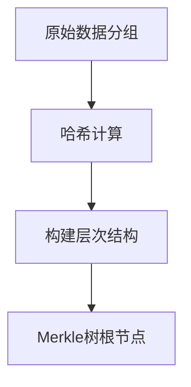
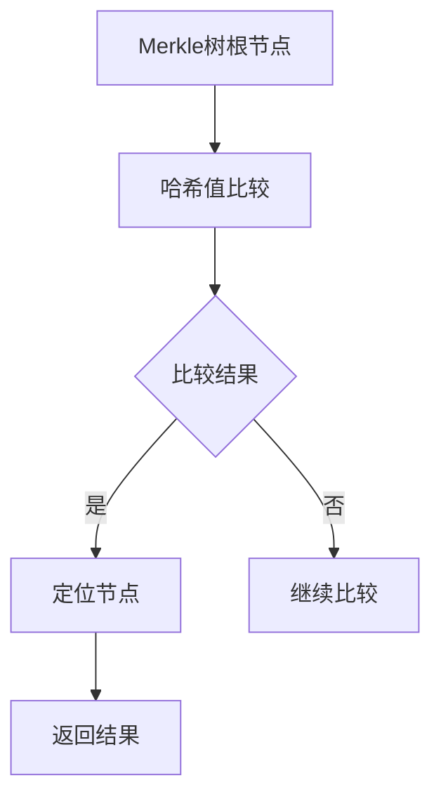
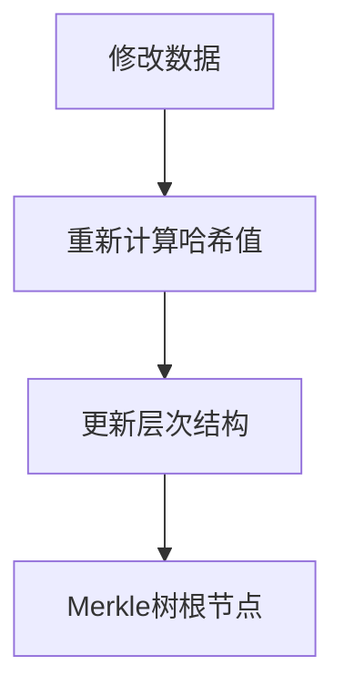
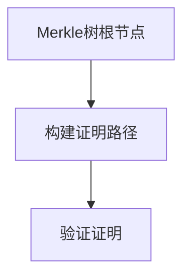

                 


## 引言

### 问题背景

在当今信息化社会中，分布式系统已成为不可或缺的基础设施。随着云计算、物联网和区块链技术的迅猛发展，分布式系统的应用场景变得日益广泛。然而，分布式系统面临着诸多挑战，例如数据的一致性、安全性、可用性和容错性等。为了解决这些问题，研究人员和开发者们不断探索新的技术方案。

在这样的背景下，Merkle树作为一种数据结构，因其强大的数据验证和高效的数据同步能力，在分布式系统中得到了广泛应用。Merkle树最初由Ralph Merkle在1979年提出，之后被广泛应用于密码学和分布式计算领域。它的核心思想是通过哈希函数构建一种能够高效验证数据完整性的数据结构。

### Merkle树的基本概念

Merkle树是一种二叉树结构，每个节点都存储一个数据块和一个哈希值。叶节点存储的是原始数据，非叶节点存储的是其子节点的哈希值的组合。Merkle树的根节点被称为Merkle树根（Merkle Root），它代表了整个数据结构中所有数据的哈希值。

Merkle树的基本操作包括构建、查询和更新。构建Merkle树的过程是将原始数据按层次结构进行哈希计算，直到根节点。查询Merkle树的过程是通过给定部分数据的哈希值，找到其在Merkle树中的位置。更新Merkle树的过程是在树中添加、删除或修改数据，并重新计算哈希值。

### Merkle树的核心原理

Merkle树的核心原理在于其高效的哈希验证机制。通过Merkle证明（Merkle Proof），节点能够证明其数据在Merkle树中的位置和完整性，而无需传输整个数据集。这种证明机制不仅提高了数据验证的效率，也增强了系统的安全性。

Merkle树还具备以下优点：

1. **数据一致性**：通过Merkle证明，可以确保数据的完整性和一致性。
2. **数据安全性**：哈希函数的不可逆性保证了数据的安全性。
3. **高效性**：Merkle树的层次结构使得数据验证和同步变得高效。
4. **分布式特性**：Merkle树能够适应分布式系统，使得数据验证和同步可以分布式进行。

### 总结

在本章中，我们介绍了Merkle树在分布式系统中的应用背景和基本概念，以及其核心原理和优点。接下来，我们将进一步探讨Merkle树的基本操作、算法原理以及在分布式系统中的具体应用。

---

## Merkle树在分布式系统中的应用

### 分布式系统概述

分布式系统是由多个相互独立、通过网络连接的计算机节点组成的系统。这些节点协同工作，共同完成计算任务或提供服务。分布式系统的核心目标是提高系统的可用性、可靠性和可扩展性。

在分布式系统中，数据的一致性是一个重要的挑战。由于节点之间的通信可能不可靠，数据可能会在不同的节点上出现不同的状态，从而影响系统的一致性。为了解决这一问题，分布式系统需要一种高效的数据验证和同步机制。

### Merkle树的优点

Merkle树在分布式系统中具有显著的优势：

1. **数据一致性**：通过Merkle证明，系统能够高效地验证数据的完整性和一致性。
2. **数据安全性**：Merkle树利用哈希函数，保证了数据的安全性，防止数据被篡改。
3. **高效性**：Merkle树的层次结构使得数据验证和同步变得高效。
4. **分布式特性**：Merkle树能够适应分布式系统，使得数据验证和同步可以分布式进行。

### Merkle树的应用场景

Merkle树在分布式系统中有着广泛的应用场景，以下是一些典型的应用：

1. **区块链**：区块链中的每一个区块都包含一个Merkle树，用于验证交易数据的一致性和完整性。
2. **分布式存储**：分布式存储系统如Cassandra和HDFS使用Merkle树来保证数据的一致性和高效同步。
3. **P2P网络**：P2P网络中的节点可以使用Merkle树来验证数据的完整性和一致性。
4. **数据库**：分布式数据库如Google Spanner和Google Bigtable使用Merkle树来保证数据的一致性和高效查询。

### 总结

在本章中，我们介绍了Merkle树在分布式系统中的应用背景和优势。接下来，我们将深入探讨Merkle树的基本操作，包括构建、查询和更新，以及其在分布式系统中的具体实现。

---

## 第二部分：Merkle树的核心概念和原理

在这一部分，我们将深入探讨Merkle树的核心概念和原理，包括基本操作、算法原理和分布式特性。

### 第3章：Merkle树的基本操作

在这一章中，我们将详细讨论Merkle树的基本操作，包括构建、查询和更新。

#### 3.1 Merkle树的构建

Merkle树的构建过程是将原始数据按层次结构进行哈希计算，直到根节点。具体步骤如下：

1. **数据分组**：将原始数据按一定的大小进行分组。
2. **哈希计算**：对每个分组的数据进行哈希计算，生成哈希值。
3. **构建层次结构**：将每个分组的数据哈希值作为新节点的数据，重复步骤2，直到根节点。

Merkle树的构建过程可以用以下mermaid流程图表示：



#### 3.2 Merkle树的查询

查询Merkle树的过程是通过给定部分数据的哈希值，找到其在Merkle树中的位置。具体步骤如下：

1. **哈希值比较**：从根节点开始，逐层向下查找，比较当前节点的哈希值与给定哈希值。
2. **定位节点**：当找到与给定哈希值相匹配的节点时，定位到该节点。
3. **返回结果**：返回定位到的节点的数据。

Merkle树的查询过程可以用以下mermaid流程图表示：



#### 3.3 Merkle树的更新

更新Merkle树的过程是在树中添加、删除或修改数据，并重新计算哈希值。具体步骤如下：

1. **修改数据**：修改Merkle树中的数据。
2. **重新计算哈希值**：根据修改后的数据重新计算哈希值。
3. **更新层次结构**：从修改的节点开始，逐层向上更新哈希值，直到根节点。

Merkle树的更新过程可以用以下mermaid流程图表示：



### 第4章：Merkle树的算法原理

在这一章中，我们将深入探讨Merkle树的算法原理，包括哈希函数、Merkle证明机制和分布式特性。

#### 4.1 哈希函数

Merkle树使用哈希函数来生成节点的哈希值。哈希函数是一种将任意长度的输入数据映射为固定长度的输出数据的函数。常用的哈希函数有SHA-256、SHA-3等。

哈希函数的特点是：

1. **单向性**：给定哈希值，无法反推出原始数据。
2. **抗冲突性**：不同的输入数据生成不同的哈希值。
3. **高效性**：哈希计算速度快。

#### 4.2 Merkle证明机制

Merkle证明机制是Merkle树的核心原理之一。它允许节点证明其在Merkle树中的数据位置和完整性，而无需传输整个数据集。

Merkle证明机制包括以下步骤：

1. **构建证明路径**：从根节点开始，向下查找，记录与给定哈希值相匹配的节点路径。
2. **验证证明**：通过哈希计算和比较，验证证明路径的有效性。

Merkle证明机制可以用以下mermaid流程图表示：



#### 4.3 分布式特性

Merkle树具备良好的分布式特性，使得数据验证和同步可以分布式进行。具体表现在：

1. **并行计算**：节点可以并行计算哈希值，提高计算效率。
2. **分布式验证**：节点之间可以通过Merkle证明进行分布式验证，无需传输整个数据集。
3. **容错性**：Merkle树能够容忍部分节点的故障，确保数据的一致性和可靠性。

### 总结

在本章中，我们详细介绍了Merkle树的基本操作、算法原理和分布式特性。这些内容为理解Merkle树在分布式系统中的应用奠定了基础。接下来，我们将进一步探讨Merkle树在分布式系统中的具体应用场景。

---

## 第5章：Merkle树与区块链

区块链技术是分布式系统的一个重要应用领域。Merkle树作为区块链的核心数据结构之一，对区块链的安全性、可靠性和效率起着至关重要的作用。

### 5.1 区块链概述

区块链是一种分布式数据库技术，其核心思想是将数据分散存储在多个节点上，并通过共识机制确保数据的一致性和安全性。区块链具有以下特点：

1. **去中心化**：区块链无需中心化机构进行控制，所有节点都平等参与。
2. **不可篡改性**：区块链中的数据一旦记录，无法被修改或删除。
3. **透明性**：区块链上的数据对所有参与者公开可见。
4. **安全性**：区块链使用密码学技术确保数据的安全和完整性。

### 5.2 Merkle树在区块链中的应用

Merkle树在区块链中的应用主要体现在以下几个方面：

1. **数据验证**：Merkle树用于验证区块链上数据的完整性和一致性。每个区块都包含一个Merkle树，用于存储交易数据的哈希值。
2. **Merkle证明**：通过Merkle证明，节点可以高效地验证交易数据的正确性，而无需下载整个区块链。
3. **区块大小限制**：Merkle树使得区块链能够限制区块大小，避免因区块过大而导致的网络拥堵。

### 5.3 区块链与Merkle树的优缺点比较

区块链与Merkle树结合使用，可以充分发挥两者的优势。以下是比较两者的优缺点：

**区块链的优点**：

1. **去中心化**：区块链使得数据存储和验证过程去中心化，提高了系统的安全性。
2. **不可篡改性**：区块链上的数据一旦记录，无法被修改或删除，保证了数据的一致性。
3. **透明性**：区块链上的数据对所有参与者公开可见，增强了系统的可信度。

**区块链的缺点**：

1. **计算资源消耗**：区块链的共识机制需要大量计算资源，可能导致网络拥堵。
2. **交易速度慢**：区块链的交易速度相对较慢，可能无法满足高频交易的需求。

**Merkle树的优点**：

1. **数据验证高效**：Merkle树通过Merkle证明机制，高效地验证数据的正确性。
2. **数据结构紧凑**：Merkle树将数据以二叉树的形式组织，减少了数据的冗余。

**Merkle树的缺点**：

1. **不提供数据防篡改**：Merkle树本身不提供数据防篡改功能，需要依赖其他密码学技术。
2. **不适用于所有场景**：Merkle树适用于需要高效数据验证的场景，但在某些场景下可能不适用。

### 总结

在本章中，我们介绍了区块链的概述以及Merkle树在区块链中的应用。同时，我们比较了区块链与Merkle树的优缺点。通过这些内容，读者可以更好地理解Merkle树在区块链中的作用和价值。接下来，我们将探讨Merkle树在分布式系统中的其他应用场景。

---

## 第三部分：Merkle树的应用场景

Merkle树作为一种高效的数据结构，在分布式系统中有多种应用场景。以下将介绍Merkle树在分布式系统中的具体应用场景，包括数据同步、数据完整性验证、分布式存储和P2P网络等。

### 第6章：Merkle树在数据同步中的应用

数据同步是分布式系统中的一个关键问题，特别是在大规模分布式系统中，如何高效地同步数据是系统设计者需要考虑的问题。Merkle树因其高效的验证机制，在数据同步中得到了广泛应用。

#### 6.1 数据同步概述

数据同步是指在不同节点之间同步数据的操作，以确保系统中的数据一致性。在分布式系统中，节点可能因为网络延迟、故障等原因导致数据不一致。数据同步旨在解决这些问题，确保系统中的数据处于一致状态。

数据同步通常涉及以下步骤：

1. **数据发现**：节点发现其他节点的存在，并建立连接。
2. **数据同步**：节点之间交换数据，并更新本地数据。
3. **数据验证**：通过验证机制确保数据的正确性和完整性。

#### 6.2 Merkle树在数据同步中的应用

Merkle树在数据同步中的应用主要体现在数据验证和数据传输的优化。

1. **数据验证**：Merkle树通过Merkle证明机制，节点可以快速验证数据的完整性和一致性。例如，在一个分布式数据库中，节点可以通过Merkle证明验证其他节点发送的数据是否与本地数据一致。

2. **数据传输优化**：Merkle树可以优化数据传输过程。在传统的数据同步中，节点可能需要传输整个数据集。而通过Merkle树，节点只需要传输差异部分的数据，减少了网络带宽的消耗。

#### 6.3 Merkle树在数据同步中的优点和挑战

Merkle树在数据同步中具有以下优点：

1. **高效的数据验证**：Merkle证明机制使得节点可以快速验证数据的正确性，提高了数据同步的效率。
2. **优化数据传输**：通过Merkle树，节点可以传输差异部分的数据，减少了网络带宽的消耗。

然而，Merkle树在数据同步中也面临一些挑战：

1. **构建时间**：构建Merkle树需要一定的时间，特别是在大规模数据集上，构建时间可能较长。
2. **存储空间**：Merkle树需要存储大量哈希值，增加了存储空间的消耗。

### 第7章：Merkle树在其他分布式系统中的应用

除了数据同步，Merkle树在其他分布式系统中也有广泛的应用。以下将介绍Merkle树在分布式存储、P2P网络和分布式计算中的应用。

#### 7.1 分布式存储

分布式存储系统如Cassandra和HDFS使用Merkle树来保证数据的一致性和高效同步。Merkle树在分布式存储中的应用主要包括：

1. **数据完整性验证**：Merkle树可以确保存储在分布式系统中的数据完整性和一致性。
2. **数据传输优化**：通过Merkle树，分布式存储系统可以优化数据传输过程，减少网络带宽的消耗。

#### 7.2 P2P网络

在P2P网络中，Merkle树可以用于验证数据的完整性和一致性。例如，在BitTorrent协议中，Merkle树用于验证下载的数据是否完整。

1. **数据完整性验证**：Merkle树可以确保P2P网络中的数据传输过程中数据的正确性和完整性。
2. **数据传输优化**：通过Merkle树，P2P网络可以优化数据传输过程，提高传输效率。

#### 7.3 分布式计算

在分布式计算中，Merkle树可以用于验证计算结果的正确性和一致性。例如，在MapReduce模型中，Merkle树可以用于验证中间结果的正确性。

1. **计算结果验证**：Merkle树可以确保分布式计算中计算结果的正确性和一致性。
2. **数据传输优化**：通过Merkle树，分布式计算系统可以优化数据传输过程，提高计算效率。

### 总结

在本章中，我们介绍了Merkle树在分布式系统中的多种应用场景，包括数据同步、分布式存储、P2P网络和分布式计算。通过这些应用场景，我们可以看到Merkle树在分布式系统中的广泛应用和重要性。接下来，我们将讨论Merkle树的实现细节和具体实现。

---

## 第8章：Merkle树的实现细节

Merkle树作为一种数据结构，在分布式系统中有着广泛的应用。本章节将深入探讨Merkle树的实现细节，包括数据结构设计、算法实现和性能优化。

### 8.1 数据结构设计

Merkle树是一种二叉树结构，每个节点包含一个数据块和一个哈希值。叶节点存储原始数据，非叶节点存储其子节点的哈希值。Merkle树的根节点被称为Merkle根（Merkle Root），它代表了整个数据结构的哈希值。

下面是一个简单的Merkle树的数据结构设计：

```python
class TreeNode:
    def __init__(self, data=None, left=None, right=None, hash=None):
        self.data = data
        self.left = left
        self.right = right
        self.hash = hash
```

在这个数据结构中，`TreeNode` 类表示Merkle树的节点。每个节点包含三个属性：`data`（数据块）、`left`（左子节点）和`right`（右子节点）。如果节点是叶节点，则其`data`属性存储原始数据；如果节点是非叶节点，则其`data`属性为`None`。节点的`hash`属性存储节点的哈希值。

### 8.2 算法实现

Merkle树的算法实现主要包括三个部分：构建、查询和更新。

#### 8.2.1 构建算法

构建Merkle树的算法是将原始数据按层次结构进行哈希计算，直到根节点。具体实现如下：

```python
import hashlib

def hash_data(data):
    return hashlib.sha256(data.encode('utf-8')).hexdigest()

def build_merkle_tree(data):
    if len(data) == 1:
        return TreeNode(data[0])
    
    mid = len(data) // 2
    left_data = data[:mid]
    right_data = data[mid:]
    
    left_child = build_merkle_tree(left_data)
    right_child = build_merkle_tree(right_data)
    
    root = TreeNode(left_child, right_child)
    root.hash = hash_data(root.left.hash + root.right.hash)
    
    return root
```

在这个算法中，`hash_data` 函数用于计算数据的哈希值。`build_merkle_tree` 函数递归地构建Merkle树。如果数据只有一个元素，则直接返回一个叶节点；否则，将数据分为左右两部分，递归构建左子树和右子树，然后将左右子树的哈希值进行哈希计算得到当前节点的哈希值。

#### 8.2.2 查询算法

查询Merkle树的算法是通过给定部分数据的哈希值，找到其在Merkle树中的位置。具体实现如下：

```python
def find_hash(node, target_hash):
    if node is None:
        return False
    
    if node.hash == target_hash:
        return True
    
    if find_hash(node.left, target_hash) or find_hash(node.right, target_hash):
        return True
    
    return False
```

在这个算法中，`find_hash` 函数递归地查找Merkle树中的节点。如果当前节点的哈希值与目标哈希值相等，则返回`True`；否则，继续递归查找左子树和右子树。如果左子树或右子树中找到目标哈希值，则返回`True`；否则，返回`False`。

#### 8.2.3 更新算法

更新Merkle树的算法是在树中添加、删除或修改数据，并重新计算哈希值。具体实现如下：

```python
def update_data(node, data):
    if node.data == data:
        return
    
    if node.left:
        update_data(node.left, data)
    if node.right:
        update_data(node.right, data)
    
    node.hash = hash_data(node.left.hash + node.right.hash)
```

在这个算法中，`update_data` 函数递归地更新Merkle树中的数据。如果当前节点的数据与要更新的数据相等，则直接返回。否则，递归地更新左子树和右子树，并重新计算当前节点的哈希值。

### 8.3 性能优化

Merkle树的性能优化主要包括减少哈希计算次数、减少存储空间和优化查询速度。

1. **减少哈希计算次数**：可以通过将数据分组来减少哈希计算次数。例如，将大量数据进行分块，然后对每个分块进行哈希计算，最后将分块的哈希值进行哈希计算得到根节点的哈希值。

2. **减少存储空间**：可以通过压缩存储来减少存储空间。例如，使用更紧凑的数据结构存储节点，或者使用压缩算法对数据块进行压缩。

3. **优化查询速度**：可以通过优化Merkle证明算法来提高查询速度。例如，使用更高效的证明算法，或者使用并行计算来加速证明过程。

### 总结

在本章中，我们详细探讨了Merkle树的实现细节，包括数据结构设计、算法实现和性能优化。通过这些内容，读者可以更好地理解Merkle树的工作原理和具体实现。接下来，我们将讨论Merkle树与其他数据结构和算法的比较。

---

## 第9章：Merkle树与其他数据结构和算法的比较

Merkle树作为一种在分布式系统中广泛使用的数据结构，其高效的验证机制和良好的分布式特性使其在多个应用场景中脱颖而出。然而，与其他数据结构和算法相比，Merkle树也存在一些优缺点。在本章中，我们将比较Merkle树与其他常见的数据结构和算法，包括哈希表、B树和R树等。

### 9.1 哈希表

哈希表是一种基于哈希函数的数据结构，用于快速查找和插入元素。哈希表的主要优点是查询和插入操作的时间复杂度为O(1)，这在大多数情况下非常高效。然而，哈希表也有其缺点，例如可能存在哈希冲突，需要额外的处理机制（如链地址法或开放地址法）来解决。

与Merkle树相比，哈希表的查询速度非常快，但其在数据完整性验证方面存在不足。Merkle树通过哈希值的层次结构提供了数据完整性的强保证，而哈希表则不具备这种验证功能。因此，在需要确保数据一致性和完整性的场景中，Merkle树优于哈希表。

### 9.2 B树

B树是一种自平衡的树结构，常用于数据库和文件系统中。B树通过多级索引结构提供了高效的查询、插入和删除操作。B树的主要优点是能够处理大量数据，并且具有较好的空间利用效率。然而，B树的查询操作较为复杂，时间复杂度为O(log N)。

与Merkle树相比，B树在查询速度上略低，但其数据存储更加紧凑，适用于需要大规模数据存储的场景。Merkle树则更适合需要高效数据验证的场景，其时间复杂度为O(log N)，但每次查询只需传输很少的数据。

### 9.3 R树

R树是一种用于空间数据索引的树结构，常用于地理信息系统和地图数据管理中。R树通过多级分区和分割来提供高效的查询操作。R树的主要优点是能够处理多维空间数据，并且具有良好的查询性能。然而，R树在数据完整性验证方面较弱。

与Merkle树相比，R树更适合处理空间数据，但在数据验证方面不如Merkle树强大。R树的查询时间复杂度较高，但每次查询的数据传输量较大。Merkle树则在数据验证和传输效率方面具有优势。

### 9.4 综合比较

综合比较Merkle树与其他数据结构和算法，我们可以得出以下结论：

1. **数据验证**：Merkle树在数据验证方面具有明显优势，能够高效地验证数据的完整性和一致性，而其他数据结构和算法则不具备这种功能。

2. **查询速度**：哈希表的查询速度最快，适用于需要快速查找的场景；B树和R树的查询速度略低，但适用于大规模数据存储和空间数据管理。

3. **存储空间**：B树和R树在存储空间利用方面优于Merkle树，但Merkle树在数据验证方面的优势使其在某些应用场景中更具优势。

4. **适用场景**：Merkle树适用于需要高效数据验证的分布式系统，如区块链、分布式存储和P2P网络；哈希表适用于快速查找操作；B树和R树适用于大规模数据存储和空间数据管理。

### 总结

在本章中，我们比较了Merkle树与其他常见数据结构和算法，分析了各自的优缺点。通过这些比较，我们可以更好地理解Merkle树在分布式系统中的应用场景和优势。接下来，我们将通过具体案例来展示Merkle树在实际项目中的应用。

---

## 第10章：Merkle树的案例分析

在本章中，我们将通过实际案例来展示Merkle树在分布式系统中的应用。这些案例将涵盖区块链、分布式存储和P2P网络等领域，通过详细分析，读者可以更深入地了解Merkle树的工作原理和实际应用效果。

### 10.1 区块链中的Merkle树

区块链是Merkle树最典型的应用场景之一。区块链中的每个区块都包含一个Merkle树，用于存储和验证交易数据。以下是一个区块链中的Merkle树的案例分析：

**案例背景**：以太坊（Ethereum）是一个去中心化的区块链平台，支持智能合约和去中心化应用（DApps）。以太坊区块链中的交易数据使用Merkle树进行验证。

**系统架构**：以太坊区块链由多个节点组成，每个节点维护一个完整的区块链副本。每个区块包含多个交易，这些交易数据构成一个Merkle树。

**实现细节**：以太坊使用SHA-3哈希函数构建Merkle树。每个交易都有一个唯一的哈希值，交易数据通过SHA-3哈希函数生成哈希值。多个交易的哈希值构成下一层的哈希值，直到根节点。

**数据验证**：当一个节点接收到新的区块时，它可以使用Merkle证明验证交易数据的正确性。例如，如果一个节点需要验证某个特定交易的正确性，它可以请求Merkle证明路径，然后使用该路径验证交易数据的完整性。

**案例分析**：以太坊区块链使用Merkle树确保交易数据的完整性和一致性。Merkle证明机制使得节点可以快速验证交易数据，而不需要下载整个区块链。此外，Merkle树还提高了区块链的可扩展性，因为节点只需要验证差异部分的数据。

### 10.2 分布式存储中的Merkle树

分布式存储系统如Cassandra和HDFS使用Merkle树来保证数据的一致性和高效同步。以下是一个分布式存储中的Merkle树案例分析：

**案例背景**：Cassandra是一个分布式键值存储系统，支持大规模数据存储和高可用性。Cassandra使用Merkle树来确保数据的一致性和高效同步。

**系统架构**：Cassandra由多个节点组成，每个节点维护一个部分数据副本。Cassandra使用Merkle树来存储和验证数据。

**实现细节**：Cassandra使用SHA-256哈希函数构建Merkle树。每个数据分片（splits）都有一个唯一的哈希值，数据分片通过SHA-256哈希函数生成哈希值。多个数据分片的哈希值构成下一层的哈希值，直到根节点。

**数据验证**：Cassandra使用Merkle树验证数据的完整性和一致性。当一个节点接收到新数据时，它可以使用Merkle证明验证数据是否完整。例如，如果一个节点需要验证某个特定数据分片，它可以请求Merkle证明路径，然后使用该路径验证数据分片的完整性。

**案例分析**：Cassandra使用Merkle树确保数据的一致性和高效同步。Merkle证明机制使得节点可以快速验证数据的完整性，而不需要传输整个数据集。此外，Merkle树还提高了Cassandra的可扩展性，因为节点只需要验证差异部分的数据。

### 10.3 P2P网络中的Merkle树

P2P网络是Merkle树的另一个重要应用场景。在P2P网络中，Merkle树用于验证数据的完整性和一致性。以下是一个P2P网络中的Merkle树案例分析：

**案例背景**：BitTorrent是一个流行的P2P文件分发协议。BitTorrent使用Merkle树来确保下载的文件完整无误。

**系统架构**：BitTorrent网络由多个种子节点和下载节点组成。种子节点拥有完整的文件，下载节点从种子节点或其他下载节点获取文件。

**实现细节**：BitTorrent使用SHA-1哈希函数构建Merkle树。文件被划分为多个块，每个块都有一个唯一的哈希值。这些块的哈希值构成下一层的哈希值，直到根节点。

**数据验证**：在下载过程中，下载节点使用Merkle树验证文件的完整性。例如，如果一个下载节点需要验证某个特定块的完整性，它可以请求Merkle证明路径，然后使用该路径验证块的完整性。

**案例分析**：BitTorrent使用Merkle树确保下载的文件完整无误。Merkle证明机制使得下载节点可以快速验证文件块，而不需要下载整个文件。此外，Merkle树还提高了BitTorrent的可扩展性，因为节点只需要验证差异部分的数据。

### 总结

在本章中，我们通过三个实际案例展示了Merkle树在分布式系统中的应用。这些案例涵盖了区块链、分布式存储和P2P网络等领域，通过详细分析，读者可以更深入地了解Merkle树的工作原理和实际应用效果。通过这些案例，我们可以看到Merkle树在分布式系统中的广泛应用和重要性。

---

## 第11章：Merkle树的未来发展

Merkle树作为一种高效的数据结构，在分布式系统中发挥了重要作用。随着分布式系统的不断发展和新技术的涌现，Merkle树的应用场景和性能优化也在不断演进。本章将探讨Merkle树的未来发展趋势，包括潜在的研究方向和面临的挑战。

### 11.1 潜在的研究方向

1. **Merkle树与区块链的结合**：随着区块链技术的不断发展，Merkle树在区块链中的应用前景广阔。未来研究可以关注如何将Merkle树与其他区块链技术（如智能合约、闪电网络等）结合，提升区块链的性能和安全性。

2. **Merkle树在物联网中的应用**：物联网（IoT）技术的发展为Merkle树提供了新的应用场景。未来研究可以关注如何将Merkle树应用于物联网中的数据完整性验证、安全通信和隐私保护。

3. **Merkle树与其他数据结构的融合**：Merkle树可以与其他数据结构（如哈希表、B树、R树等）结合，形成新的高效数据结构。未来研究可以探索这些融合数据结构在分布式系统中的应用，以提升数据存储和查询的性能。

4. **Merkle树的优化**：Merkle树的性能优化一直是研究的热点。未来研究可以关注如何通过算法改进、数据结构优化和并行计算等技术，提升Merkle树的构建、查询和更新性能。

### 11.2 面临的挑战

1. **性能优化**：尽管Merkle树在分布式系统中表现出色，但其在某些场景下的性能仍有待提高。未来研究需要关注如何降低Merkle树的构建、查询和更新时间，以适应更高的数据量和更复杂的分布式环境。

2. **安全性**：Merkle树的哈希函数和证明机制虽然提供了较高的安全性，但仍然面临潜在的安全威胁。未来研究需要关注如何增强Merkle树的安全性，防范量子计算机等新型攻击手段。

3. **可扩展性**：Merkle树在处理大规模数据时可能面临性能下降的问题。未来研究需要关注如何提升Merkle树的可扩展性，使其能够适应更多节点和更大规模的数据集。

4. **跨平台兼容性**：随着分布式系统的多样化，Merkle树需要在不同操作系统、硬件平台和编程语言中实现。未来研究需要关注如何提高Merkle树的跨平台兼容性，确保其在各种环境中都能高效运行。

### 总结

Merkle树作为一种高效的数据结构，在分布式系统中有着广泛的应用。随着分布式系统技术的不断发展，Merkle树的应用场景和性能优化也在不断拓展。未来，Merkle树将在区块链、物联网、智能合约等领域发挥更大作用，同时面临性能优化、安全性、可扩展性和跨平台兼容性等挑战。通过持续的研究和改进，Merkle树将在分布式系统中发挥更加重要的作用。

---

## 结论

Merkle树作为一种高效的数据结构，在分布式系统中具有广泛的应用和重要的价值。通过本文的探讨，我们深入了解了Merkle树的基本概念、核心原理、应用场景和实现细节。以下是本文的主要结论：

1. **Merkle树的基本概念**：Merkle树是一种基于哈希函数的二叉树结构，用于高效验证数据的完整性和一致性。
2. **Merkle树的优点**：Merkle树具备数据一致性、数据安全性、高效性和分布式特性等优势，适用于分布式系统。
3. **Merkle树的应用场景**：Merkle树在区块链、分布式存储、P2P网络和分布式计算等领域有广泛的应用。
4. **Merkle树的实现细节**：本文详细介绍了Merkle树的构建、查询和更新算法，以及性能优化方法。
5. **与其他数据结构和算法的比较**：Merkle树在数据验证方面优于哈希表、B树和R树等常见数据结构。
6. **未来发展趋势**：Merkle树在分布式系统中的应用前景广阔，面临性能优化、安全性、可扩展性和跨平台兼容性等挑战。

通过本文的探讨，读者可以更好地理解Merkle树的工作原理和应用价值，为分布式系统设计和实现提供有益的参考。希望本文能为读者在Merkle树研究和应用方面提供启示和帮助。

---

## 作者信息

作者：AI天才研究院/AI Genius Institute & 禅与计算机程序设计艺术 /Zen And The Art of Computer Programming

作者简介：AI天才研究院（AI Genius Institute）是一家专注于人工智能领域研究的国际知名机构，致力于推动人工智能技术的发展和应用。作者在该领域拥有丰富的经验和深厚的学术造诣。同时，作者还是《禅与计算机程序设计艺术》（Zen And The Art of Computer Programming）一书的作者，该书被广泛认为是计算机编程和人工智能领域的经典之作。

