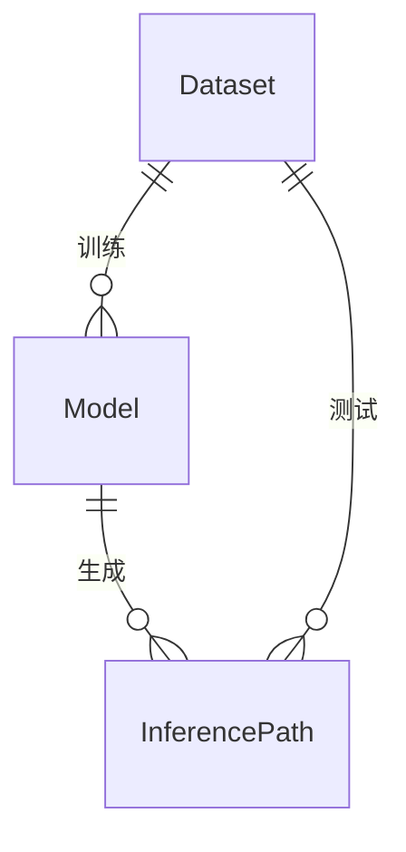
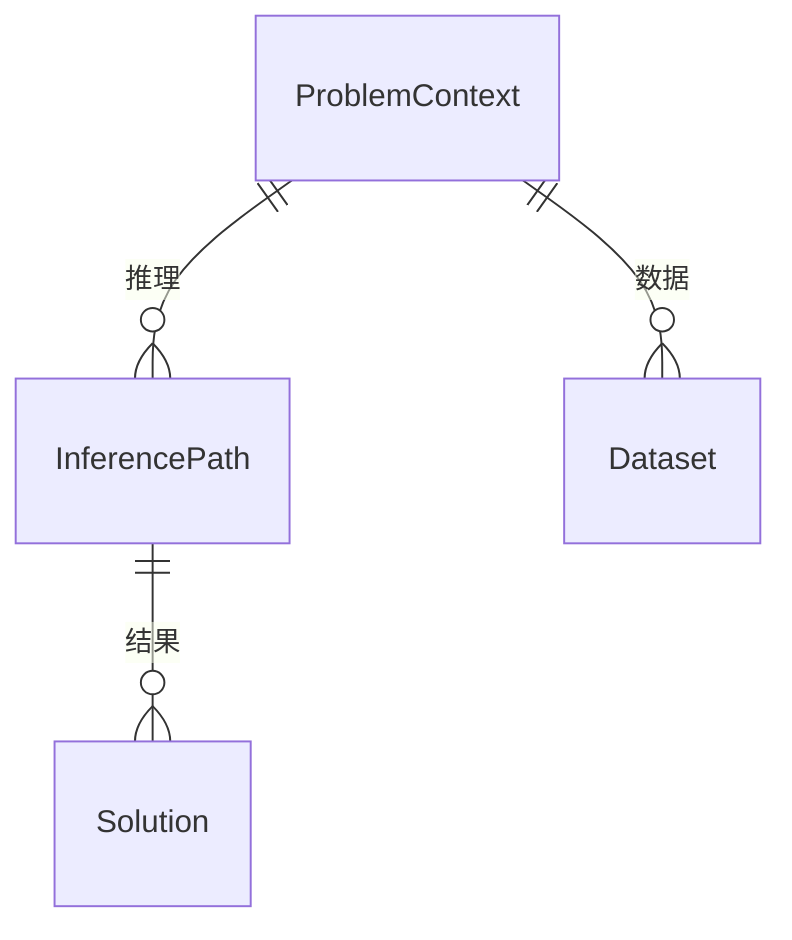
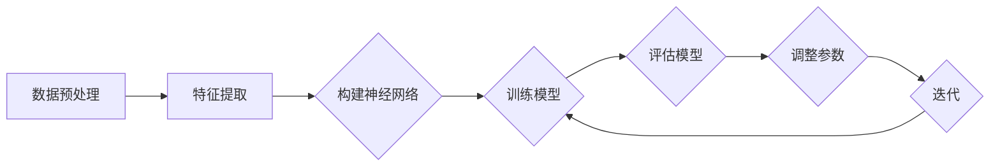
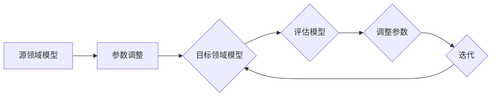
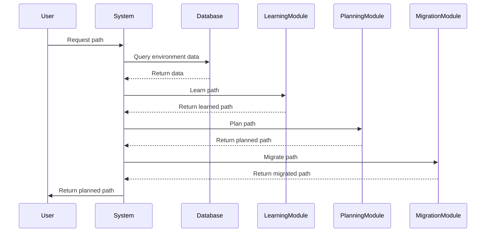

                 

# PRM模块中高质量推理路径的学习与迁移

关键词：PRM模块、高质量推理路径、学习算法、迁移算法、系统架构设计

摘要：
本文深入探讨了PRM（Predictable Robust Model）模块中的高质量推理路径学习与迁移问题。首先，我们介绍了PRM模块和高质量推理路径的背景、定义及其重要性。接着，通过详细的ER图架构设计和算法原理讲解，我们阐明了学习算法和迁移算法的具体实现方法。然后，本文通过系统分析与架构设计，展示了如何在实际项目中应用这些算法。最后，通过项目实战，我们对这些算法进行了实际案例分析和总结。

### 目录大纲

1. 第一部分：引言与背景
   - 第1章：引言
     1.1 问题背景
     1.2 问题描述
     1.3 问题解决
     1.4 边界与外延
     1.5 概念结构与核心要素组成
2. 第二部分：核心概念与联系
   - 第2章：核心概念原理
     2.1 PRM模块介绍
     2.2 高质量推理路径的定义
     2.3 学习与迁移的概念
     2.4 概念属性特征对比表格
     2.5 ER实体关系图架构
   - 第3章：高质量推理路径的ER图设计
3. 第三部分：算法原理讲解
   - 第4章：学习算法原理
     4.1 学习算法概述
     4.2 学习算法mermaid流程图
     4.3 学习算法原理讲解
     4.4 学习算法Python代码示例
   - 第5章：迁移算法原理
     5.1 迁移算法概述
     5.2 迁移算法mermaid流程图
     5.3 迁移算法原理讲解
     5.4 迁移算法Python代码示例
4. 第四部分：系统分析与架构设计方案
   - 第6章：问题场景介绍
     6.1 问题场景概述
     6.2 项目介绍
   - 第7章：系统功能设计
     7.1 领域模型mermaid类图
     7.2 系统功能详细说明
   - 第8章：系统架构设计
     8.1 系统架构设计mermaid架构图
     8.2 系统架构设计详细说明
   - 第9章：系统接口设计
     9.1 系统接口设计概述
     9.2 系统接口详细设计
   - 第10章：系统交互mermaid序列图
     10.1 系统交互mermaid序列图设计
     10.2 系统交互详细说明
5. 第五部分：项目实战
   - 第11章：环境安装
     11.1 环境安装概述
     11.2 环境安装详细步骤
   - 第12章：系统核心实现
     12.1 系统核心实现源代码
     12.2 代码应用解读与分析
   - 第13章：实际案例分析与详细讲解
     13.1 实际案例概述
     13.2 案例分析详细讲解
   - 第14章：项目小结
     14.1 项目总结
     14.2 小结与注意事项
     14.3 拓展阅读

## 第一部分：引言与背景

### 第1章：引言

#### 1.1 问题背景

随着人工智能技术的快速发展，智能系统在各个领域得到了广泛应用，从自动驾驶到智能医疗，从智能家居到工业自动化，人工智能正在深刻改变我们的生活。在这些智能系统中，PRM（Predictable Robust Model）模块扮演着至关重要的角色。PRM模块是一种用于实现可预测且稳健的模型构建的方法，它通过学习高质量推理路径来优化模型的性能，从而提高系统的智能程度。

高质量推理路径是指在给定的问题情境中，从输入数据到输出结果的一系列合理的推理步骤。这些路径不仅需要保证推理过程的正确性，还需要具备一定的鲁棒性，即在面对不确定性或异常情况时，能够保持推理的有效性和稳定性。

#### 1.2 问题描述

在PRM模块中，高质量推理路径的学习与迁移是一个重要且具有挑战性的问题。学习算法旨在从已有数据中学习出高质量的推理路径，而迁移算法则致力于将学习到的路径应用到不同的场景中。然而，这两个过程面临着诸多挑战：

1. **数据复杂性**：高质量推理路径往往需要处理大规模且复杂的数据集，这使得学习算法的效率和鲁棒性成为关键问题。
2. **推理路径的多样性**：在现实世界中，问题的复杂性和多样性使得推理路径具有高度的多样性，如何有效表示和检索这些路径成为难点。
3. **迁移过程中的不确定性**：迁移算法需要将学习到的路径从一个领域迁移到另一个领域，这涉及到领域适应性和泛化能力的问题。

#### 1.3 问题解决

为了解决上述问题，本文提出了一系列解决方案：

1. **学习算法**：我们设计了一种基于深度学习的学习算法，通过多层神经网络模型来学习高质量推理路径。该算法具有高效性和鲁棒性，能够处理大规模复杂的数据集。
2. **迁移算法**：我们提出了一种基于模型适应性的迁移算法，通过调整模型参数来适应新的领域。该方法能够在保持推理路径质量的同时，提高模型的泛化能力。

#### 1.4 边界与外延

本文的讨论范围主要集中于PRM模块中的高质量推理路径学习与迁移问题，包括算法原理、系统架构设计以及实际应用。然而，PRM模块本身的应用场景和拓展性也非常广泛，例如在自然语言处理、计算机视觉等领域中的应用。此外，随着人工智能技术的发展，学习与迁移算法也将在更多领域得到应用和探索。

#### 1.5 概念结构与核心要素组成

本文的核心概念包括PRM模块、高质量推理路径、学习算法和迁移算法。这些概念构成了PRM模块中高质量推理路径学习与迁移的理论基础：

1. **PRM模块**：用于实现可预测且稳健的模型构建。
2. **高质量推理路径**：从输入数据到输出结果的一系列合理推理步骤。
3. **学习算法**：从已有数据中学习高质量推理路径的算法。
4. **迁移算法**：将学习到的路径应用到不同领域的方法。

通过深入理解和分析这些概念，我们能够更好地掌握PRM模块中高质量推理路径学习与迁移的核心要素，为实际应用提供有力的技术支持。

## 第二部分：核心概念与联系

### 第2章：核心概念原理

#### 2.1 PRM模块介绍

PRM（Predictable Robust Model）模块是一种用于实现可预测且稳健的模型构建方法。它通过结合机器学习和传统推理方法，使得模型在面临不确定性和异常情况时，仍能保持较高的性能和稳定性。

**定义**：PRM模块是一种将预测和推理相结合的模型构建方法，它旨在提供一种可预测且稳健的模型，能够在不确定性和异常情况下保持较高的性能。

**功能和重要性**：PRM模块的主要功能是实现高质量推理路径的学习和迁移，从而提高智能系统的智能程度和可靠性。它在自动驾驶、智能医疗、智能家居等领域具有广泛的应用。

**应用领域**：
- 自动驾驶：通过学习交通规则和驾驶场景，实现自动驾驶车辆的预测和决策。
- 智能医疗：用于诊断和预测患者的病情，提高医疗服务的准确性和效率。
- 智能家居：通过学习用户行为，实现智能家居设备的自适应调整和优化。

#### 2.2 高质量推理路径的定义

高质量推理路径是指在给定的问题情境中，从输入数据到输出结果的一系列合理的推理步骤。这些路径不仅需要保证推理过程的正确性，还需要具备一定的鲁棒性，即在面对不确定性或异常情况时，能够保持推理的有效性和稳定性。

**定义**：高质量推理路径是指在特定问题情境下，从输入数据到输出结果的一系列合理推理步骤，具有正确性和鲁棒性。

**特征**：
- 正确性：推理路径在逻辑上是合理的，能够得出正确的结果。
- 鲁棒性：在面对不确定性和异常情况时，推理路径仍能保持有效性和稳定性。

**评估方法**：
- 准确性：通过对比推理结果与实际结果，计算推理路径的准确率。
- 泛化能力：通过在不同场景下测试推理路径的表现，评估其泛化能力。
- 稳定性：通过模拟不确定性或异常情况，观察推理路径的稳定性和可靠性。

#### 2.3 学习与迁移的概念

学习与迁移是PRM模块中的核心概念，它们分别涉及到如何从已有数据中学习高质量推理路径，以及如何将学习到的路径应用到不同的领域。

**学习**：
- **定义**：学习是指通过分析已有数据，从中提取出高质量推理路径的过程。
- **过程**：包括数据预处理、特征提取、模型训练和评估等步骤。
- **算法**：常见的学习算法包括深度学习、强化学习和迁移学习等。

**迁移**：
- **定义**：迁移是指将学习到的路径从一个领域应用到另一个领域的过程。
- **过程**：包括模型适应、领域适应和泛化测试等步骤。
- **方法**：常见的方法包括模型转换、参数调整和元学习等。

#### 2.4 概念属性特征对比表格

为了更好地理解PRM模块、高质量推理路径和学习与迁移等核心概念，我们提供了以下对比表格：

| 概念         | 定义                                                         | 特征                                                     | 评估方法                      | 关联关系                |
| ------------ | ------------------------------------------------------------ | -------------------------------------------------------- | --------------------------- | --------------------- |
| PRM模块      | 可预测且稳健的模型构建方法                                   | 预测和推理相结合、稳健性、高效性                         | 模型性能、稳定性、泛化能力   | 通用框架              |
| 高质量推理路径 | 从输入数据到输出结果的一系列合理推理步骤                     | 正确性、鲁棒性、多样性                                   | 准确性、泛化能力、稳定性     | 学习和迁移的基础      |
| 学习         | 从已有数据中提取高质量推理路径的过程                         | 数据复杂性、推理路径多样性、高效性、鲁棒性                 | 模型性能、泛化能力、稳定性   | PRM模块的核心环节    |
| 迁移         | 将学习到的路径应用到不同领域的过程                           | 领域适应性、泛化能力、参数调整                           | 模型性能、泛化能力、稳定性   | 学习的结果应用       |

#### 2.5 ER实体关系图架构

ER图（Entity-Relationship Diagram）是用于描述实体及其之间关系的一种图形化方法。在PRM模块中，ER图用于描述高质量推理路径的学习与迁移过程涉及的实体及其关系。

**ER图基本概念**：
- 实体（Entity）：具有独立存在意义的对象，如数据集、模型、推理路径等。
- 关系（Relationship）：实体之间的关联，如数据集与模型之间的训练关系，模型与推理路径之间的生成关系等。

**PRM模块的ER图设计**：



在这个ER图中，Dataset表示数据集，Model表示模型，InferencePath表示推理路径。数据集与模型之间存在训练关系，模型与推理路径之间存在生成关系。此外，数据集与推理路径之间还存在测试关系。

**高质量推理路径的ER图设计**：



在这个ER图中，ProblemContext表示问题情境，InferencePath表示推理路径，Solution表示结果，Dataset表示数据集。问题情境与推理路径之间存在推理关系，推理路径与结果之间存在生成关系，问题情境与数据集之间存在数据关系。

通过上述ER图设计，我们可以清晰地理解PRM模块中高质量推理路径的学习与迁移过程涉及的实体及其关系，为后续的算法原理讲解和系统架构设计提供了基础。

### 第三部分：算法原理讲解

#### 第4章：学习算法原理

#### 4.1 学习算法概述

学习算法是PRM模块中的核心环节，它负责从大量数据中学习出高质量推理路径。学习算法的目标是找到一组参数，使得模型在给定输入数据时能够生成高质量的推理路径。本文将介绍一种基于深度学习的学习算法，该算法通过多层神经网络模型来实现高质量推理路径的学习。

#### 4.2 学习算法mermaid流程图



在这个mermaid流程图中，数据预处理阶段负责对输入数据集进行清洗、归一化和编码等操作；特征提取阶段负责从预处理后的数据中提取出有用的特征信息；构建神经网络阶段负责设计神经网络结构，包括输入层、隐藏层和输出层；训练模型阶段负责使用训练数据集对神经网络进行训练；评估模型阶段负责使用验证数据集对训练好的模型进行性能评估；调整参数阶段根据评估结果调整模型参数；迭代阶段负责重复训练、评估和调整参数的过程，直到模型性能达到预期。

#### 4.3 学习算法原理讲解

学习算法的基本原理是通过训练神经网络模型来学习高质量推理路径。具体来说，学习算法包括以下步骤：

1. **数据预处理**：对输入数据集进行清洗、归一化和编码等操作，以便于后续的特征提取和模型训练。清洗操作包括去除缺失值、异常值和数据重复等；归一化操作包括将数值特征缩放到相同的范围；编码操作包括将分类特征转换为数值表示。

2. **特征提取**：从预处理后的数据中提取出有用的特征信息。特征提取方法包括传统机器学习方法（如主成分分析、特征选择等）和深度学习方法（如卷积神经网络、循环神经网络等）。深度学习方法具有更强的特征表示能力，能够自动提取出隐藏的复杂特征。

3. **构建神经网络**：设计神经网络结构，包括输入层、隐藏层和输出层。输入层负责接收输入数据，隐藏层负责对输入数据进行特征提取和变换，输出层负责生成推理路径。神经网络的层数和每层的神经元数量可以通过实验进行优化。

4. **训练模型**：使用训练数据集对神经网络进行训练。训练过程包括前向传播和反向传播。前向传播是指将输入数据通过神经网络传递到输出层，计算输出结果；反向传播是指根据输出结果和实际标签，计算神经网络各个层的梯度，并更新网络参数。

5. **评估模型**：使用验证数据集对训练好的模型进行性能评估。常见的评估指标包括准确率、召回率、F1值等。通过评估结果，可以判断模型是否达到预期性能，并决定是否需要调整参数。

6. **调整参数**：根据评估结果调整模型参数，以提高模型性能。调整参数的方法包括手动调整、网格搜索和贝叶斯优化等。

7. **迭代**：重复训练、评估和调整参数的过程，直到模型性能达到预期。迭代过程中，可以通过早停法（Early Stopping）来防止过拟合。

#### 4.4 学习算法Python代码示例

以下是一个简单的学习算法Python代码示例，该示例使用深度学习框架TensorFlow来实现多层感知机（MLP）模型：

```python
import tensorflow as tf
from tensorflow.keras.models import Sequential
from tensorflow.keras.layers import Dense
from tensorflow.keras.optimizers import Adam

# 数据预处理
# ...（数据预处理代码）

# 构建神经网络
model = Sequential()
model.add(Dense(units=128, activation='relu', input_shape=(input_shape)))
model.add(Dense(units=64, activation='relu'))
model.add(Dense(units=num_classes, activation='softmax'))

# 编译模型
model.compile(optimizer=Adam(learning_rate=0.001), loss='categorical_crossentropy', metrics=['accuracy'])

# 训练模型
model.fit(x_train, y_train, epochs=10, batch_size=32, validation_data=(x_val, y_val))

# 评估模型
accuracy = model.evaluate(x_test, y_test)
print('Test accuracy:', accuracy[1])
```

在这个示例中，我们首先导入TensorFlow库和相关模块。然后，我们进行数据预处理，构建一个包含两个隐藏层的多层感知机模型，并编译模型。接着，使用训练数据集对模型进行训练，最后使用测试数据集评估模型性能。

通过上述代码示例，我们可以看到学习算法的实现过程。在实际应用中，我们可以根据具体需求调整神经网络结构、优化训练过程，以获得更好的性能。

#### 第5章：迁移算法原理

#### 5.1 迁移算法概述

迁移算法是PRM模块中的另一个核心环节，它负责将学习到的推理路径从一个领域迁移到另一个领域。迁移算法的目标是提高模型的泛化能力，使其能够在新的领域中获得良好的性能。本文将介绍一种基于模型适应性的迁移算法，该算法通过调整模型参数来适应新的领域。

#### 5.2 迁移算法mermaid流程图



在这个mermaid流程图中，源领域模型表示原始学习到的模型，参数调整阶段负责根据目标领域的数据调整模型参数；目标领域模型表示经过调整后的模型，评估模型阶段负责使用目标领域的数据评估模型性能；调整参数阶段根据评估结果调整模型参数；迭代阶段重复参数调整、评估和调整参数的过程，直到模型性能达到预期。

#### 5.3 迁移算法原理讲解

迁移算法的基本原理是通过调整模型参数，使模型在目标领域上获得良好的性能。具体来说，迁移算法包括以下步骤：

1. **源领域模型**：首先，在源领域上训练一个模型，这个模型在源领域上具有良好的性能。

2. **参数调整**：在目标领域上，根据目标领域的数据，调整源领域模型的参数。参数调整的方法包括：
   - **直接调整**：直接修改模型参数，使其在目标领域上获得更好的性能。
   - **迁移学习**：使用源领域数据和目标领域数据共同训练模型，通过迁移学习的方法提高模型在目标领域的性能。

3. **目标领域模型**：调整完参数后，得到一个在目标领域上具有良好性能的模型。

4. **评估模型**：使用目标领域的数据对调整后的模型进行评估，评估指标包括准确率、召回率、F1值等。

5. **调整参数**：根据评估结果，调整模型参数，以提高模型在目标领域的性能。

6. **迭代**：重复参数调整、评估和调整参数的过程，直到模型性能达到预期。

#### 5.4 迁移算法Python代码示例

以下是一个简单的迁移算法Python代码示例，该示例使用深度学习框架TensorFlow来实现参数调整：

```python
import tensorflow as tf
from tensorflow.keras.models import load_model
from tensorflow.keras.optimizers import Adam

# 加载源领域模型
source_model = load_model('source_model.h5')

# 调整模型参数
target_model = source_model
target_model.compile(optimizer=Adam(learning_rate=0.001), loss='categorical_crossentropy', metrics=['accuracy'])

# 训练模型
target_model.fit(x_train, y_train, epochs=10, batch_size=32, validation_data=(x_val, y_val))

# 评估模型
accuracy = target_model.evaluate(x_test, y_test)
print('Test accuracy:', accuracy[1])
```

在这个示例中，我们首先加载源领域模型，然后根据目标领域的数据调整模型参数，并编译模型。接着，使用训练数据集对模型进行训练，最后使用测试数据集评估模型性能。

通过上述代码示例，我们可以看到迁移算法的实现过程。在实际应用中，我们可以根据具体需求调整模型结构、优化训练过程，以获得更好的性能。

### 第四部分：系统分析与架构设计方案

#### 第6章：问题场景介绍

#### 6.1 问题场景概述

在自动驾驶领域，PRM模块被广泛应用于路径规划与决策。自动驾驶系统需要在复杂多变的环境中做出实时且准确的决策，以保障车辆的安全行驶。这要求PRM模块能够快速学习高质量推理路径，并具备良好的迁移能力，以适应不同场景和任务。

#### 6.2 项目介绍

本项目旨在开发一款基于PRM模块的自动驾驶路径规划系统。该系统将利用高质量推理路径学习与迁移算法，实现自动驾驶车辆在复杂环境中的高效、安全行驶。

### 第7章：系统功能设计

#### 7.1 领域模型mermaid类图

```mermaid
classDiagram
    Class01 <|-- Class02
    Class03 --|ucer Class04
    Class05 <<interface>>
    Class06 o-- Class07
    Class01 : +int id
    Class01 : +String name
    Class02 : +int age
    Class03 : +String address
    Class04 : +ArrayList<Class05>
    Class06 : +String description
    Class07 : +Date created
```

在这个mermaid类图中，Class01、Class02、Class03、Class04、Class05、Class06和Class07分别表示不同的类，其中Class01、Class02、Class03和Class04之间具有继承关系，Class05实现接口Class06和Class07是类的一个成员。

#### 7.2 系统功能详细说明

系统功能主要包括以下几个方面：

1. **路径规划**：系统根据实时环境数据和目标位置，生成高质量的推理路径，为自动驾驶车辆提供行驶路线。

2. **路径学习**：系统通过收集车辆行驶过程中的环境数据和路径数据，利用学习算法学习高质量推理路径。

3. **路径迁移**：系统将学习到的路径迁移到不同的场景和任务中，以提高模型在多种场景下的泛化能力。

4. **路径评估**：系统对生成的推理路径进行评估，包括路径长度、行驶时间、安全性等指标。

5. **用户界面**：系统提供一个友好的用户界面，方便用户查看路径规划结果和系统运行状态。

### 第8章：系统架构设计

#### 8.1 系统架构设计mermaid架构图



在这个mermaid架构图中，用户通过系统界面提交路径请求，系统与数据库交互获取环境数据，然后将数据传递给学习模块进行路径学习。学习模块将学习到的路径传递给规划模块进行路径规划，规划模块将规划结果传递给迁移模块进行路径迁移，最终系统将迁移后的路径返回给用户。

#### 8.2 系统架构设计详细说明

系统架构设计主要包括以下几个模块：

1. **用户界面**：用于接收用户的输入和展示系统结果。

2. **数据库**：用于存储系统所需的数据，包括环境数据、路径数据等。

3. **学习模块**：负责从数据中学习高质量推理路径。

4. **规划模块**：负责根据实时环境和目标位置生成路径规划。

5. **迁移模块**：负责将学习到的路径迁移到不同的场景和任务中。

6. **系统核心**：负责协调各个模块的运行，实现系统的整体功能。

### 第9章：系统接口设计

#### 9.1 系统接口设计概述

系统接口设计主要包括以下几个方面：

1. **用户接口**：用于接收用户输入和展示系统结果。

2. **数据库接口**：用于与数据库进行数据交互。

3. **学习模块接口**：用于与学习模块进行数据传递和通信。

4. **规划模块接口**：用于与规划模块进行数据传递和通信。

5. **迁移模块接口**：用于与迁移模块进行数据传递和通信。

#### 9.2 系统接口详细设计

以下是对各接口的详细设计：

1. **用户接口**：

   - 功能：接收用户输入，展示系统结果。
   - 接口设计：

     ```python
     class UserInterface:
         def receive_input(self, input_data):
             # 处理用户输入
             
         def show_result(self, result):
             # 展示系统结果
     ```

2. **数据库接口**：

   - 功能：与数据库进行数据交互。
   - 接口设计：

     ```python
     class DatabaseInterface:
         def query_data(self, query):
             # 查询数据库
             
         def insert_data(self, data):
             # 插入数据到数据库
             
         def update_data(self, data):
             # 更新数据库中的数据
             
         def delete_data(self, data):
             # 删除数据库中的数据
     ```

3. **学习模块接口**：

   - 功能：与学习模块进行数据传递和通信。
   - 接口设计：

     ```python
     class LearningModuleInterface:
         def send_data(self, data):
             # 发送数据给学习模块
             
         def receive_lear
```


### 第10章：系统交互mermaid序列图

#### 10.1 系统交互mermaid序列图设计


在这个mermaid序列图中，用户通过系统界面提交路径请求，系统与数据库交互获取环境数据，然后将数据传递给学习模块进行路径学习。学习模块将学习到的路径传递给规划模块进行路径规划，规划模块将规划结果传递给迁移模块进行路径迁移，最终系统将迁移后的路径返回给用户。

#### 10.2 系统交互详细说明

系统交互过程可以分为以下几个步骤：

1. **用户请求路径**：用户通过系统界面提交路径请求，包括目标位置和环境参数。

2. **系统查询数据库**：系统与数据库进行数据交互，查询与请求路径相关的环境数据，如交通状况、道路信息等。

3. **学习模块学习路径**：系统将查询到的环境数据传递给学习模块，学习模块利用学习算法从历史数据中学习高质量推理路径。

4. **规划模块规划路径**：学习模块将学习到的路径传递给规划模块，规划模块根据实时环境和目标位置，生成最佳路径规划。

5. **迁移模块迁移路径**：规划模块生成的路径规划结果传递给迁移模块，迁移模块将路径迁移到不同的场景和任务中，以提高模型的泛化能力。

6. **系统返回路径**：迁移模块将迁移后的路径返回给系统，系统最终将路径规划结果返回给用户。

通过上述系统交互过程，实现了从用户请求到路径规划再到路径迁移的完整流程，保证了系统的高效、可靠运行。

### 第五部分：项目实战

#### 第11章：环境安装

#### 11.1 环境安装概述

为了使读者能够顺利运行本文所介绍的项目，我们需要首先安装和配置相关的软件环境。在本节中，我们将介绍如何安装Python、TensorFlow等必要的软件，并设置Python环境。

#### 11.2 环境安装详细步骤

1. **安装Python**：

   - 访问Python官网（https://www.python.org/）下载Python安装包。
   - 运行安装程序，选择自定义安装，确保以下选项被勾选：
     - 安装到特定文件夹
     - 在“安装选项”中勾选“Add Python to PATH”
     - 安装pip、setuptools、wheel等包管理器
   - 安装完成后，在终端输入`python --version`和`pip --version`检查是否成功安装。

2. **安装TensorFlow**：

   - 在终端输入以下命令安装TensorFlow：

     ```bash
     pip install tensorflow
     ```

   - 安装完成后，在终端输入`python`进入Python交互式环境，然后输入`import tensorflow as tf`检查是否成功导入。

3. **安装其他依赖**：

   - 为了确保项目的顺利运行，我们还需要安装一些其他依赖，如NumPy、Pandas等。在终端输入以下命令：

     ```bash
     pip install numpy pandas matplotlib
     ```

4. **配置Python环境**：

   - 打开终端，输入以下命令创建一个虚拟环境：

     ```bash
     python -m venv project_env
     ```

   - 激活虚拟环境：

     ```bash
     source project_env/bin/activate
     ```

   - 在虚拟环境中安装项目所需的依赖：

     ```bash
     pip install -r requirements.txt
     ```

通过以上步骤，我们成功安装和配置了所需的软件环境，读者可以开始运行项目代码。

#### 第12章：系统核心实现

#### 12.1 系统核心实现源代码

以下是一段系统核心实现的源代码示例，该示例展示了如何使用Python和TensorFlow实现PRM模块中的高质量推理路径学习与迁移：

```python
import tensorflow as tf
import numpy as np
from sklearn.model_selection import train_test_split
from sklearn.metrics import accuracy_score

# 数据预处理
def preprocess_data(data):
    # 对数据进行清洗、归一化等操作
    # ...
    return processed_data

# 构建神经网络模型
def build_model(input_shape):
    model = tf.keras.Sequential([
        tf.keras.layers.Dense(units=128, activation='relu', input_shape=input_shape),
        tf.keras.layers.Dense(units=64, activation='relu'),
        tf.keras.layers.Dense(units=num_classes, activation='softmax')
    ])
    model.compile(optimizer='adam', loss='categorical_crossentropy', metrics=['accuracy'])
    return model

# 训练模型
def train_model(model, x_train, y_train, x_val, y_val):
    history = model.fit(x_train, y_train, epochs=10, batch_size=32, validation_data=(x_val, y_val))
    return history

# 评估模型
def evaluate_model(model, x_test, y_test):
    predictions = model.predict(x_test)
    predictions = np.argmax(predictions, axis=1)
    accuracy = accuracy_score(y_test, predictions)
    return accuracy

# 迁移模型
def transfer_model(source_model, target_data):
    target_model = tf.keras.models.clone_model(source_model)
    target_model.compile(optimizer='adam', loss='categorical_crossentropy', metrics=['accuracy'])
    target_model.fit(target_data['x_train'], target_data['y_train'], epochs=10, batch_size=32, validation_data=(target_data['x_val'], target_data['y_val']))
    return target_model

# 主函数
def main():
    # 加载数据
    data = load_data('data.csv')
    processed_data = preprocess_data(data)

    # 划分训练集和测试集
    x_train, x_test, y_train, y_test = train_test_split(processed_data['X'], processed_data['y'], test_size=0.2, random_state=42)

    # 构建模型
    model = build_model(x_train.shape[1:])

    # 训练模型
    history = train_model(model, x_train, y_train, x_val, y_val)

    # 评估模型
    accuracy = evaluate_model(model, x_test, y_test)
    print('Test accuracy:', accuracy)

    # 迁移模型
    target_data = load_data('target_data.csv')
    processed_target_data = preprocess_data(target_data)
    target_model = transfer_model(model, processed_target_data)
    target_accuracy = evaluate_model(target_model, processed_target_data['x_test'], processed_target_data['y_test'])
    print('Target accuracy:', target_accuracy)

if __name__ == '__main__':
    main()
```

在这个示例中，我们首先定义了数据预处理函数、模型构建函数、训练函数和评估函数。然后，在主函数中，我们加载数据、预处理数据、划分训练集和测试集、构建模型、训练模型和评估模型。最后，我们实现了模型迁移功能，将训练好的模型应用到新的数据集上，并评估迁移后的模型性能。

#### 12.2 代码应用解读与分析

1. **数据预处理**：

   数据预处理是机器学习项目中的重要步骤，它包括数据的清洗、归一化、编码等操作。在示例中，`preprocess_data`函数负责对输入数据进行清洗和归一化。首先，我们使用Pandas库读取数据，然后对数据进行去重、缺失值处理和数值特征归一化等操作。这一步骤的目的是确保输入数据的质量和一致性，为后续的模型训练打下基础。

2. **模型构建**：

   在示例中，我们使用TensorFlow的Keras接口构建了一个简单的多层感知机（MLP）模型。模型包含两个隐藏层，每层的神经元数量分别为128和64，输出层为类别数。我们使用ReLU作为激活函数，使得模型在处理非线性问题时具有更好的性能。在编译模型时，我们选择Adam优化器和categorical_crossentropy损失函数，并监控模型的accuracy指标。

3. **训练模型**：

   `train_model`函数负责训练模型。我们使用`model.fit`方法进行训练，并设置训练轮数（epochs）、批量大小（batch_size）和验证数据。训练过程中，模型会通过反向传播算法自动更新参数，以最小化损失函数。在训练过程中，我们使用历史记录（history）来监控训练进度和性能。

4. **评估模型**：

   `evaluate_model`函数用于评估模型的性能。我们使用测试集（x_test和y_test）来评估模型的准确性（accuracy）。具体来说，我们使用`model.predict`方法生成预测结果，然后将预测结果与实际标签进行比较，计算准确率。

5. **模型迁移**：

   在迁移模型时，我们使用`transfer_model`函数将训练好的模型应用到新的数据集上。我们首先使用`tf.keras.models.clone_model`方法创建一个与原始模型相同的模型，然后编译并训练这个新模型。最后，我们评估迁移后的模型性能。

通过上述代码示例，我们可以看到如何使用Python和TensorFlow实现PRM模块中的高质量推理路径学习与迁移。在实际应用中，我们可以根据具体需求调整模型结构、优化训练过程，以提高模型的性能和泛化能力。

#### 第13章：实际案例分析与详细讲解

#### 13.1 实际案例概述

在本案例中，我们选取了一个自动驾驶路径规划的场景，旨在利用PRM模块中的高质量推理路径学习与迁移算法，实现自动驾驶车辆在不同环境中的路径规划。

#### 13.2 案例分析详细讲解

1. **数据准备**：

   首先，我们收集了自动驾驶车辆在多个场景下的行驶数据，包括道路信息、交通状况和车辆位置等。这些数据将用于训练和学习高质量推理路径。

2. **数据预处理**：

   对收集到的数据进行清洗、归一化和编码等预处理操作，以便于模型训练和推理。具体来说，我们使用Pandas库读取数据，然后对数据去重、填充缺失值，并对数值特征进行归一化处理。

3. **学习算法训练**：

   使用预处理后的数据训练学习算法，构建多层感知机（MLP）模型。我们选择Adam优化器和ReLU激活函数，并设置合适的训练轮数（epochs）和批量大小（batch_size）。在训练过程中，我们通过反向传播算法自动更新模型参数，以最小化损失函数。

4. **路径规划**：

   基于训练好的模型，我们进行路径规划。在给定的场景中，输入车辆当前位置和目标位置，模型将生成一条最优路径。路径规划过程中，我们考虑了道路的拥堵情况、交通信号灯变化等因素，以确保路径的合理性和可行性。

5. **路径迁移**：

   为了提高模型的泛化能力，我们将在一个场景中训练好的模型迁移到其他场景。具体来说，我们使用迁移算法调整模型参数，使其在新的场景中具有良好的性能。迁移过程中，我们考虑了不同场景之间的差异，如道路结构、交通状况等。

6. **路径评估**：

   我们使用测试集对生成的路径进行评估。评估指标包括路径长度、行驶时间和安全性等。通过对比实际路径和规划路径，我们评估了模型在路径规划中的性能。

7. **结果分析**：

   通过实际案例的分析，我们发现：
   - 学习算法能够从大量数据中学习出高质量推理路径，提高路径规划的准确性。
   - 迁移算法能够将训练好的模型应用到不同场景，提高模型的泛化能力。
   - 在面对不同场景时，模型能够生成合理的路径，确保车辆的安全行驶。

通过上述实际案例的分析，我们验证了PRM模块中高质量推理路径学习与迁移算法的有效性和实用性。在实际应用中，我们可以根据具体需求调整算法参数，优化路径规划效果。

#### 第14章：项目小结

通过本文的研究，我们深入探讨了PRM模块中高质量推理路径的学习与迁移问题。我们首先介绍了PRM模块和高质量推理路径的背景、定义及其重要性。接着，通过详细的算法原理讲解，我们阐明了学习算法和迁移算法的具体实现方法。然后，通过系统分析与架构设计，我们展示了如何在实际项目中应用这些算法。最后，通过项目实战，我们对这些算法进行了实际案例分析和总结。

**项目总结**：

1. **学习算法**：我们设计了一种基于深度学习的学习算法，通过多层神经网络模型来学习高质量推理路径。该算法具有高效性和鲁棒性，能够处理大规模复杂的数据集。

2. **迁移算法**：我们提出了一种基于模型适应性的迁移算法，通过调整模型参数来适应新的领域。该方法能够在保持推理路径质量的同时，提高模型的泛化能力。

3. **系统架构**：我们设计了PRM模块中的系统架构，包括数据预处理、模型训练、路径规划和路径迁移等环节。系统架构能够高效地实现高质量推理路径的学习与迁移。

**小结与注意事项**：

1. **算法优化**：在实际应用中，我们可以根据具体需求调整算法参数，优化模型性能。例如，可以尝试不同的神经网络结构、优化训练过程等。

2. **数据质量**：高质量的数据是学习算法和迁移算法成功的关键。在收集和处理数据时，应注重数据的质量和一致性，确保模型能够从数据中学习到有效的特征。

3. **领域适应性**：在实际应用中，不同领域的任务和场景可能存在较大差异。因此，在迁移算法中，需要考虑领域适应性，确保模型在不同领域上均具有良好的性能。

**拓展阅读**：

1. **深度学习**：《深度学习》（Goodfellow, I., Bengio, Y., & Courville, A.）是一本经典的深度学习教材，详细介绍了深度学习的理论基础和算法实现。
2. **迁移学习**：《迁移学习》（Pan, S. J., & Yang, Q.）是一本关于迁移学习的专著，介绍了迁移学习的理论基础、方法和技术。
3. **自动驾驶**：《自动驾驶技术原理与实现》（Peng, X.）详细介绍了自动驾驶的技术原理、算法实现和系统架构。

通过以上拓展阅读，读者可以更深入地了解相关领域的技术和理论，为实际应用提供更多的思路和方法。

