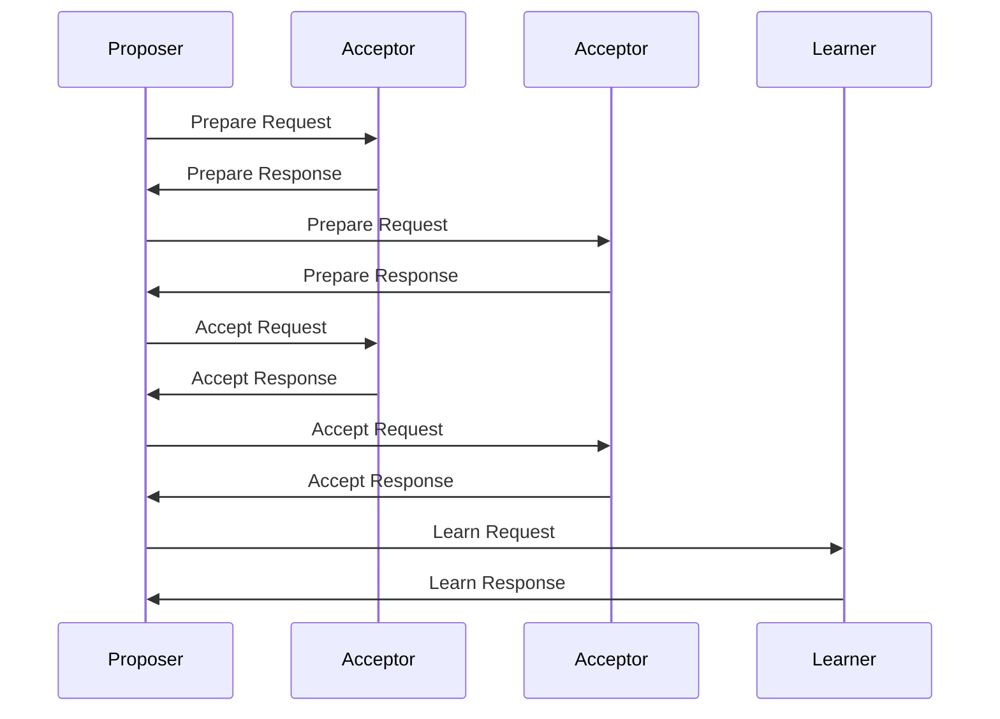

                 

### 文章标题

# Paxos算法与分布式共识问题

> 关键词：Paxos算法、分布式共识、共识问题、分布式系统、算法原理

> 摘要：本文详细介绍了Paxos算法及其在分布式共识问题中的应用。通过深入剖析Paxos算法的原理、流程、扩展和优化，探讨了其在分布式数据库、分布式存储系统以及其他分布式系统中的应用案例。文章旨在帮助读者理解Paxos算法的核心思想，掌握其在分布式共识问题中的关键作用，并提供实践经验以指导实际开发。

---

### 第1章: Paxos算法概述

Paxos算法是一种解决分布式系统中一致性问题的经典算法，由计算机科学家Leslie Lamport于1990年提出。该算法旨在确保一组分布式节点能够在可能发生故障的环境中就某个值达成共识。由于其在解决分布式共识问题上的卓越性能，Paxos算法成为分布式系统设计和研究的重要基石。

#### 1.1 Paxos算法产生的背景

#### 1.1.1 分布式系统的挑战

分布式系统通过将任务分布在多个节点上，提高了系统的性能和可靠性。然而，分布式系统的复杂性也带来了诸多挑战：

- **网络延迟和故障**：网络连接的不稳定性和节点故障是分布式系统面临的常见问题。
- **数据一致性问题**：如何在分布式节点间保持数据一致性是分布式系统的核心挑战。
- **共识问题**：如何在多个节点间达成一致决策，是分布式系统设计中的一大难题。

#### 1.1.2 共识问题的提出

在分布式系统中，共识问题是指一组节点需要就某个值或状态达成一致。共识问题可以表现为多个方面，如：

- **选举问题**：如何在一个分布式系统中选择出一个领导者。
- **状态机复制**：如何确保所有节点能够同步状态机。
- **数据复制与一致性**：如何在多个节点上复制数据并保持一致性。

#### 1.1.3 Paxos算法的提出

为了解决分布式系统中的共识问题，Leslie Lamport提出了Paxos算法。Paxos算法通过一系列机制和步骤，确保多个节点能够在可能发生故障的环境中达成一致决策。其核心思想是通过角色分配和协议流程，实现节点间的协作和共识。

#### 1.2 Paxos算法的基本概念

#### 1.2.1 Paxos算法的组成部分

Paxos算法由三个主要角色组成：提议者（Proposer）、接收者（Acceptor）和学习者（Learner）。这三个角色在整个算法过程中扮演着不同的角色，协同工作以达成共识。

- **提议者（Proposer）**：提议者负责生成提案，向接收者提出值。
- **接收者（Acceptor）**：接收者负责接收和响应提议者的提案，并维护已接受提案的记录。
- **学习者（Learner）**：学习者负责学习已接受提案的值，确保其在后续操作中能够同步。

#### 1.2.2 Paxos算法的参与者

Paxos算法通常应用于一组节点组成的分布式系统中。每个节点可以是提议者、接收者或学习者，也可以同时承担多个角色。节点通过通信网络进行交互，共同完成共识过程。

#### 1.2.3 Paxos算法的目标

Paxos算法的主要目标是确保一组分布式节点能够在可能发生故障的环境中就某个值达成共识。具体目标包括：

- **一致性**：所有参与者最终能就某个值达成一致。
- **可用性**：即使部分节点故障，算法仍然能够正常工作。
- **分区容错性**：在分区（网络分割）情况下，算法能够继续运行并最终达成共识。

#### 1.3 Paxos算法的边界与外延

#### 1.3.1 Paxos算法适用范围

Paxos算法适用于多种分布式系统场景，如分布式数据库、分布式存储、分布式锁服务等。其核心在于解决分布式系统中的一致性问题，确保多个节点能够在数据变化和状态更新时达成一致。

#### 1.3.2 Paxos算法的限制条件

尽管Paxos算法在分布式共识问题中具有广泛的应用，但它也有一些限制条件：

- **通信成本**：Paxos算法要求节点之间频繁通信，可能带来较高的通信成本。
- **性能优化**：为了提高性能，需要对Paxos算法进行适当优化和调整。

#### 1.3.3 Paxos算法的核心要素组成

Paxos算法由以下核心要素组成：

- **角色分配**：节点在算法过程中承担不同的角色，实现角色的动态分配。
- **协议流程**：算法通过一系列步骤和协议，确保节点间的协作和共识。
- **状态机复制**：算法实现状态机的复制和同步，确保分布式系统中的一致性。

### 第2章: Paxos算法原理与流程

Paxos算法的核心在于其原理和流程，通过角色分配和协议步骤，实现分布式节点间的共识。以下是Paxos算法的基本原理和主要流程。

#### 2.1 Paxos算法的基本原理

Paxos算法的基本原理可以概括为以下三点：

- **角色分配**：每个节点在算法过程中承担提议者、接收者或学习者角色，角色动态分配，确保节点间的协作。
- **提案和响应**：提议者生成提案，向接收者发送提案请求和响应，接收者接收并响应提案。
- **达成共识**：通过一系列提案和响应，最终在分布式节点间达成共识，确定一个值。

#### 2.1.1 提议者（Proposer）的工作原理

提议者（Proposer）在Paxos算法中负责生成提案，具体工作原理如下：

1. **生成提案**：提议者生成一个提案，包含一个值和一个提案编号。
2. **发送提案请求**：提议者向所有接收者发送提案请求，请求接收者接受该提案。
3. **等待响应**：提议者等待接收者的响应，如果接收者接受提案，则继续下一步；否则，重新生成提案。

#### 2.1.2 接收者（Acceptor）的工作原理

接收者（Acceptor）在Paxos算法中负责接收和响应提案请求，具体工作原理如下：

1. **接收提案请求**：接收者接收提议者的提案请求，检查提案编号是否符合预期。
2. **发送提案响应**：如果提案编号符合预期，接收者接受该提案，并返回响应；否则，拒绝提案。
3. **维护已接受提案记录**：接收者记录已接受提案的值和提案编号，确保后续提案的响应一致性。

#### 2.1.3 学习者（Learner）的工作原理

学习者（Learner）在Paxos算法中负责学习已接受提案的值，具体工作原理如下：

1. **接收提案值**：学习者从接收者处学习已接受提案的值。
2. **更新状态机**：学习者更新自己的状态机，确保与已接受提案的值一致。

#### 2.2 Paxos算法的主要流程

Paxos算法的主要流程可以分为三个阶段：提案阶段（Prepare阶段）、接受阶段（Accept阶段）和学习阶段（Learn阶段）。以下是每个阶段的详细流程：

##### 2.2.1 提案阶段（Prepare阶段）

1. **提议者生成提案**：提议者生成一个提案，包含一个值和一个提案编号。
2. **发送提案请求**：提议者向所有接收者发送提案请求，请求接收者接受该提案。
3. **接收者响应提案请求**：接收者接收提案请求，检查提案编号，并返回响应。
4. **提议者收集响应**：提议者等待接收者的响应，如果超过半数接收者响应，则继续下一步。

##### 2.2.2 接受阶段（Accept阶段）

1. **提议者发送接受请求**：提议者向所有接收者发送接受请求，请求接收者接受该提案。
2. **接收者响应接受请求**：接收者接收接受请求，如果提案编号符合预期，则接受提案，并返回响应。
3. **提议者收集响应**：提议者等待接收者的响应，如果超过半数接收者响应，则继续下一步。

##### 2.2.3 学习阶段（Learn阶段）

1. **提议者发送学习请求**：提议者向所有接收者发送学习请求，请求接收者学习已接受提案的值。
2. **接收者响应学习请求**：接收者接收学习请求，学习已接受提案的值，并返回响应。
3. **提议者收集响应**：提议者等待接收者的响应，如果超过半数接收者响应，则继续下一步。

4. **学习者更新状态机**：学习者从接收者处学习已接受提案的值，更新自己的状态机。

#### 2.3 Paxos算法的Mermaid流程图展示

为了更直观地理解Paxos算法的流程，我们可以使用Mermaid语言绘制其流程图。以下是一个简化的Paxos算法流程图：



该流程图展示了Paxos算法的基本流程，包括提议者生成提案、发送提案请求、接收者响应提案请求、提议者发送接受请求、接收者响应接受请求以及学习者更新状态机的步骤。

### 第3章: Paxos算法的扩展与优化

Paxos算法作为一种经典的分布式共识算法，虽然解决了分布式系统中的许多一致性问题，但其在性能、扩展性和适应性方面仍有改进空间。为了满足不同应用场景的需求，研究人员和开发者对Paxos算法进行了多种扩展与优化。以下是几种常见的扩展与优化方法。

#### 3.1 Paxos算法的改进与扩展

##### 3.1.1 Fast Paxos

Fast Paxos是一种对Paxos算法的优化方法，旨在减少算法的通信次数和响应时间。其核心思想是通过减少提案和响应的阶段，加快共识的达成速度。Fast Paxos的主要改进包括：

- **减少提案阶段**：在Fast Paxos中，提议者只需发送一次提案请求，而不是多次。
- **合并接受阶段和提案阶段**：Fast Paxos将接受阶段和提案阶段合并，减少响应次数。

##### 3.1.2 Multi-Paxos

Multi-Paxos是对Paxos算法的进一步扩展，允许多个提议者同时工作，以提高系统的性能和可用性。Multi-Paxos的主要特点包括：

- **多提议者并发**：在Multi-Paxos中，多个提议者可以同时提出不同的提案，从而提高系统的并发能力。
- **动态领导者选举**：Multi-Paxos引入了领导者的概念，领导者负责协调提议者的工作，并在需要时进行选举。

##### 3.1.3 Paxos优化方案

除了Fast Paxos和Multi-Paxos，还有许多其他的Paxos优化方案，如Paxos鸵鸟（Paxos Ostrich）、Paxos兔子（Paxos Rabbit）等。这些优化方案通过不同的策略，如减少通信次数、简化协议流程、增加容错性等，提高了Paxos算法的性能和适应性。

#### 3.2 Paxos算法的数学模型

Paxos算法的数学模型为理解其工作原理和优化提供了理论基础。以下是Paxos算法的数学模型：

##### 3.2.1 Paxos算法的数学公式

Paxos算法的核心可以通过以下数学公式来描述：

$$
\text{Propose}(v) =
\begin{cases}
    \text{Prepare}(n) \land \text{Accept}(v, n) & \text{如果 } n = \max(n') \\
    \text{Reject}(n) & \text{否则}
\end{cases}
$$

其中，Propose表示提议者提出的提案，Prepare表示接收者响应的提案请求，Accept表示接收者接受的提案，Reject表示接收者拒绝的提案。n和n'分别表示提案的编号和最大提案编号。

##### 3.2.2 Paxos算法的数学模型解释

Paxos算法的数学模型描述了提议者、接收者和学习者之间的交互过程。通过Prepare请求和Accept响应，提议者可以获取接收者的响应，从而确定是否可以接受提案。如果接收者接受提案，则学习者可以学习提案的值，确保分布式系统中的一致性。

##### 3.2.3 Paxos算法数学模型举例说明

假设有一个分布式系统，包含三个提议者P1、P2和P3，以及三个接收者A1、A2和A3。假设P1首先提出提案v1，其提案编号为1。

1. **P1提出提案v1**：
   - P1向所有接收者发送Prepare请求（Prepare(1)）。
   - 接收者A1、A2和A3收到Prepare请求，并返回Accept响应（Accept(v1, 1)）。

2. **P1收集响应**：
   - P1收到所有接收者的Accept响应，确定可以接受提案v1。

3. **P1发送Accept请求**：
   - P1向所有接收者发送Accept请求（Accept(v1, 1)）。

4. **接收者响应Accept请求**：
   - 接收者A1、A2和A3收到Accept请求，并返回Accept响应（Accept(v1, 1)）。

5. **P1发送Learn请求**：
   - P1向所有接收者发送Learn请求（Learn(v1)）。

6. **接收者响应Learn请求**：
   - 接收者A1、A2和A3收到Learn请求，并返回Learn响应（Learn(v1)）。

7. **学习者更新状态机**：
   - 学习者从接收者处学习提案v1的值，更新自己的状态机。

通过上述步骤，分布式系统中的三个提议者和三个接收者最终在提案v1上达成了一致。

### 第4章: 分布式共识问题的概念与类型

分布式共识问题是分布式系统中一个重要且复杂的问题。它涉及到如何在不同节点之间达成一致，以确保系统整体的一致性和可靠性。本章将介绍分布式共识问题的定义、意义以及常见类型。

#### 4.1 分布式共识问题的定义

分布式共识问题是指在分布式系统中，多个节点需要就某个值或状态达成一致的情况。在分布式系统中，由于网络延迟、节点故障等原因，节点之间的通信可能不总是可靠的。因此，分布式共识问题旨在解决如何在不可靠的通信环境下，确保节点能够就某个值或状态达成一致。

#### 4.1.1 分布式系统中的共识问题

分布式共识问题是分布式系统中普遍存在的挑战之一。以下是分布式共识问题的一些常见情况：

- **选举问题**：在分布式系统中，需要选举出一个领导者来协调其他节点的操作。
- **状态机复制**：在分布式数据库中，需要确保所有节点拥有相同的状态机，以便在故障发生时能够快速恢复。
- **数据一致性**：在分布式系统中，多个节点可能同时修改数据，如何保持数据的一致性是一个重要问题。

#### 4.1.2 共识问题的意义

分布式共识问题对于分布式系统的稳定运行至关重要。以下是共识问题的一些关键意义：

- **数据一致性**：通过共识算法，分布式系统能够确保多个节点对数据的修改是一致的，避免数据冲突。
- **容错性**：共识算法能够容忍节点故障，确保系统继续运行，并在故障恢复后重新达成一致。
- **可用性**：共识算法能够确保分布式系统的可用性，即使部分节点故障，系统仍然能够正常工作。

#### 4.1.3 共识问题的类型

分布式共识问题可以分为多种类型，以下是其中几种常见的类型：

- **完全一致**：所有节点必须就某个值或状态达成完全一致，否则系统无法继续运行。
- **最终一致**：节点之间可能存在短暂的差异，但最终会达到一致状态。
- **弱一致性**：节点之间对值或状态的达成一致没有严格要求，允许存在一定程度的不一致。

#### 4.2 常见分布式共识算法

为了解决分布式共识问题，研究人员和开发者提出了多种共识算法。以下是几种常见的分布式共识算法：

##### 4.2.1 Paxos算法

Paxos算法是一种经典的分布式共识算法，由Leslie Lamport提出。Paxos算法通过一系列角色和协议步骤，确保分布式节点能够在可能发生故障的环境中就某个值达成共识。Paxos算法的核心在于其角色分配和协议流程，具有高可用性和强一致性。

##### 4.2.2 Raft算法

Raft算法是一种基于Paxos算法的分布式共识算法，由Diego Ongaro和John Ousterhout提出。Raft算法通过简化Paxos算法的协议流程，提高了算法的可理解性和性能。Raft算法的核心在于其日志复制和领导者选举机制，确保分布式系统的一致性和可用性。

##### 4.2.3 其他分布式共识算法

除了Paxos算法和Raft算法，还有许多其他分布式共识算法，如PBFT（Practical Byzantine Fault Tolerance）、PBFT-SM（PBFT with State Machine Replication）等。这些算法在分布式系统中的应用场景和性能特点有所不同，可以根据具体需求选择合适的算法。

### 第5章: Paxos算法在分布式共识问题中的应用

Paxos算法作为一种经典的分布式共识算法，在分布式系统中得到了广泛应用。本节将详细探讨Paxos算法在分布式数据库、分布式存储系统以及其他分布式系统中的应用案例，以展示其在解决共识问题方面的优势。

#### 5.1 Paxos算法在分布式数据库中的应用

分布式数据库是分布式系统的一个重要应用领域，Paxos算法在分布式数据库系统中被广泛采用，以解决数据一致性问题。以下是Paxos算法在分布式数据库中的应用案例：

##### 5.1.1 分布式数据库中的共识问题

在分布式数据库中，多个节点可能同时执行数据更新操作，如何确保所有节点对数据的修改是一致的，是一个重要的共识问题。以下是分布式数据库中常见的共识问题：

- **数据一致性**：如何确保多个节点对同一数据对象的修改是一致的。
- **故障恢复**：在节点故障时，如何确保系统能够恢复到一致性状态。
- **性能优化**：如何在保证一致性的同时，提高系统的性能。

##### 5.1.2 Paxos算法在分布式数据库中的应用案例

以下是Paxos算法在分布式数据库中的应用案例：

1. **分布式键值存储**：
   - 在分布式键值存储系统中，Paxos算法被用来确保多个节点对键值对的修改是一致的。例如，Apache Cassandra和Google Spanner等分布式数据库系统采用了Paxos算法来处理数据一致性问题。

2. **分布式关系数据库**：
   - 在分布式关系数据库中，Paxos算法被用来确保多个节点对表的更新是一致的。例如，Google F1和Spanner等分布式关系数据库系统采用了Paxos算法来处理数据一致性问题。

3. **分布式事务处理**：
   - 在分布式事务处理系统中，Paxos算法被用来确保事务的一致性。例如，分布式事务处理框架如Apache HBase和Google Spanner等采用了Paxos算法来处理分布式事务的一致性问题。

#### 5.2 Paxos算法在分布式存储系统中的应用

分布式存储系统是另一个广泛应用的分布式系统领域，Paxos算法在分布式存储系统中也被广泛采用，以解决数据一致性和容错性问题。以下是Paxos算法在分布式存储系统中的应用案例：

##### 5.2.1 分布式存储系统中的共识问题

在分布式存储系统中，多个节点可能同时执行数据写入操作，如何确保所有节点对数据的写入是一致的，是一个重要的共识问题。以下是分布式存储系统中常见的共识问题：

- **数据一致性**：如何确保多个节点对同一数据块的写入是一致的。
- **容错性**：如何确保在节点故障时，系统能够恢复到一致性状态。
- **性能优化**：如何在保证一致性的同时，提高系统的性能。

##### 5.2.2 Paxos算法在分布式存储系统中的应用案例

以下是Paxos算法在分布式存储系统中的应用案例：

1. **分布式文件系统**：
   - 在分布式文件系统中，Paxos算法被用来确保多个节点对文件块的写入是一致的。例如，Google FUSE和Ceph等分布式文件系统采用了Paxos算法来处理数据一致性问题。

2. **分布式块存储**：
   - 在分布式块存储系统中，Paxos算法被用来确保多个节点对块存储的写入是一致的。例如，Amazon S3和Google Cloud Storage等分布式块存储系统采用了Paxos算法来处理数据一致性问题。

3. **分布式对象存储**：
   - 在分布式对象存储系统中，Paxos算法被用来确保多个节点对对象的写入是一致的。例如，Amazon S3和Google Cloud Storage等分布式对象存储系统采用了Paxos算法来处理数据一致性问题。

#### 5.3 Paxos算法在其他分布式系统中的应用

除了分布式数据库和分布式存储系统，Paxos算法还在其他分布式系统中得到了广泛应用，如分布式锁服务、分布式消息队列等。以下是Paxos算法在其他分布式系统中的应用案例：

##### 5.3.1 分布式消息队列

分布式消息队列是分布式系统中的一个重要组件，用于实现异步通信和数据传输。Paxos算法在分布式消息队列系统中被用来确保消息的一致性。以下是Paxos算法在分布式消息队列中的应用案例：

1. **消息传递一致性**：
   - 在分布式消息队列系统中，Paxos算法被用来确保消息的传递是一致的。例如，Apache Kafka和RabbitMQ等分布式消息队列系统采用了Paxos算法来处理消息一致性。

2. **事务消息**：
   - 在分布式事务消息系统中，Paxos算法被用来确保事务消息的一致性。例如，Apache RocketMQ和Apache Kafka等分布式消息队列系统采用了Paxos算法来处理事务消息的一致性问题。

##### 5.3.2 分布式锁服务

分布式锁服务用于在分布式系统中实现并发控制和资源同步。Paxos算法在分布式锁服务系统中被用来确保锁的一致性。以下是Paxos算法在分布式锁服务中的应用案例：

1. **分布式锁协议**：
   - 在分布式锁服务系统中，Paxos算法被用来实现分布式锁协议。例如，Zookeeper和etcd等分布式锁服务系统采用了Paxos算法来处理分布式锁的一致性问题。

2. **多租户锁服务**：
   - 在多租户分布式锁服务系统中，Paxos算法被用来确保不同租户的锁请求是一致的。例如，分布式数据库中的多租户锁服务采用了Paxos算法来处理多租户锁的一致性问题。

### 第6章: Paxos算法的实践与案例分析

在实际应用中，Paxos算法被广泛用于分布式系统的各个领域。通过具体的实践和案例分析，我们可以更深入地理解Paxos算法的实际应用效果和操作流程。

#### 6.1 Paxos算法实现环境搭建

在开始实践之前，我们需要搭建一个Paxos算法的实现环境。以下是环境搭建的步骤：

1. **准备开发环境**：
   - 确保系统安装了Python和必要的依赖库（如gRPC、Thrift等）。

2. **克隆Paxos算法代码库**：
   ```shell
   git clone https://github.com/peterbourgon/paxos.git
   ```

3. **进入代码目录**：
   ```shell
   cd paxos
   ```

4. **安装依赖库**：
   ```shell
   pip install -r requirements.txt
   ```

5. **启动Paxos服务器**：
   ```shell
   python paxos_server.py
   ```

6. **启动Paxos客户端**：
   ```shell
   python paxos_client.py
   ```

#### 6.2 Paxos算法系统架构设计

Paxos算法系统架构设计包括功能设计、架构设计、接口设计和交互设计。以下是系统架构设计的详细说明：

##### 6.2.1 Paxos算法系统功能设计

Paxos算法系统的核心功能包括：

- **提议者功能**：生成提案，发送提案请求，等待接收者响应。
- **接收者功能**：接收提案请求，响应接收者，维护已接受提案记录。
- **学习者功能**：学习已接受提案的值，更新状态机。

##### 6.2.2 Paxos算法系统架构设计

Paxos算法系统的架构设计包括以下组件：

- **提议者（Proposer）**：负责生成提案和发送提案请求。
- **接收者（Acceptor）**：负责接收提案请求和响应接收者。
- **学习者（Learner）**：负责学习已接受提案的值。

##### 6.2.3 Paxos算法系统接口设计

Paxos算法系统的接口设计包括以下API接口：

- **提议者接口**：用于生成提案和发送提案请求。
- **接收者接口**：用于接收提案请求和响应接收者。
- **学习者接口**：用于学习已接受提案的值。

##### 6.2.4 Paxos算法系统交互设计

Paxos算法系统的交互设计包括以下交互流程：

1. **提议者与接收者交互**：
   - 提议者发送提案请求给接收者，接收者响应提案请求。
   - 提议者收集接收者的响应，确定是否可以接受提案。
   - 提议者发送接受请求给接收者，接收者响应接受请求。

2. **接收者与学习者交互**：
   - 接收者接收学习者发送的学习请求，返回已接受提案的值。
   - 学习者从接收者处学习提案的值，更新状态机。

#### 6.3 Paxos算法应用案例

以下是一个简单的Paxos算法应用案例，展示如何使用Paxos算法实现分布式系统中的数据一致性。

##### 6.3.1 案例背景

在一个分布式数据库系统中，多个节点需要就某个数据对象的修改达成一致。假设有两个节点A和B，需要确保对数据对象的修改是一致的。

##### 6.3.2 Paxos算法在案例中的应用

1. **提议者生成提案**：
   - 节点A生成一个提案，包含数据修改的值和提案编号。

2. **提议者发送提案请求**：
   - 节点A向节点B发送提案请求，请求节点B接受提案。

3. **接收者响应提案请求**：
   - 节点B接收提案请求，检查提案编号，并返回响应。

4. **提议者收集响应**：
   - 节点A等待节点B的响应，如果超过半数接收者响应，则继续下一步。

5. **提议者发送接受请求**：
   - 节点A向节点B发送接受请求，请求节点B接受提案。

6. **接收者响应接受请求**：
   - 节点B接收接受请求，如果提案编号符合预期，则接受提案，并返回响应。

7. **学习者更新状态机**：
   - 节点A从节点B处学习已接受提案的值，更新状态机。

通过上述步骤，节点A和节点B就数据对象的修改达成了一致。

##### 6.3.3 案例分析与讲解

在这个案例中，Paxos算法通过提议者、接收者和学习者的协作，实现了分布式数据库系统中数据的一致性。以下是Paxos算法在案例中的关键步骤分析：

- **提案生成**：节点A生成一个提案，包含数据修改的值和提案编号。
- **提案请求**：节点A向节点B发送提案请求，请求节点B接受提案。
- **响应收集**：节点A等待节点B的响应，如果超过半数接收者响应，则继续下一步。
- **接受请求**：节点A向节点B发送接受请求，请求节点B接受提案。
- **接受响应**：节点B接收接受请求，如果提案编号符合预期，则接受提案，并返回响应。
- **状态机更新**：节点A从节点B处学习已接受提案的值，更新状态机。

通过以上分析，我们可以看到Paxos算法在解决分布式数据库系统中数据一致性问题上的关键作用。在实际应用中，可以根据具体需求对Paxos算法进行优化和调整，以提高系统的性能和可用性。

##### 6.3.4 案例总结

通过这个简单的案例，我们可以了解到Paxos算法在分布式数据库系统中的应用效果。Paxos算法通过角色分配和协议流程，实现了分布式节点间的数据一致性。在实际开发中，我们可以根据具体场景和需求，对Paxos算法进行优化和调整，以满足不同应用的需求。

### 第7章: Paxos算法的最佳实践与总结

在分布式系统中，Paxos算法被广泛用于解决共识问题，确保数据一致性和系统可靠性。为了在实际应用中充分发挥Paxos算法的优势，以下是一些最佳实践和总结。

#### 7.1 Paxos算法的最佳实践

##### 7.1.1 Paxos算法在分布式系统中的配置优化

- **网络延迟优化**：针对网络延迟较大的场景，可以通过增加接收者数量来提高算法的响应速度。
- **故障检测**：实现高效的故障检测机制，确保系统能够及时发现和处理节点故障。
- **负载均衡**：合理分配提议者和接收者的负载，避免单点瓶颈。

##### 7.1.2 Paxos算法在分布式系统中的故障处理

- **故障恢复**：在节点故障时，及时触发故障恢复机制，确保系统能够快速恢复。
- **日志记录**：对Paxos算法的日志进行详细记录，便于故障诊断和性能优化。
- **重试策略**：在通信失败时，合理设置重试策略，避免无限循环。

##### 7.1.3 Paxos算法在分布式系统中的性能调优

- **并发控制**：合理控制并发提案的数量，避免过大的并发压力。
- **缓存策略**：在合适的位置使用缓存，减少通信次数，提高算法性能。
- **协议优化**：根据具体应用场景，对Paxos算法的协议进行优化，减少通信开销。

#### 7.2 Paxos算法的总结与展望

##### 7.2.1 Paxos算法的总结

- **一致性保障**：Paxos算法通过角色分配和协议流程，确保分布式节点能够达成一致决策，保障系统的一致性。
- **容错性**：Paxos算法具有较好的容错性，能够容忍部分节点的故障，确保系统继续运行。
- **性能优化**：Paxos算法可以通过多种方式优化，提高其在分布式系统中的应用性能。

##### 7.2.2 Paxos算法的发展方向

- **优化算法性能**：进一步优化Paxos算法的通信开销和响应时间，提高算法性能。
- **分布式系统应用**：探索Paxos算法在更多分布式系统中的应用场景，如分布式计算、分布式存储等。
- **与其他算法融合**：与其他分布式算法（如Raft、PBFT等）进行融合，构建更强大的分布式共识系统。

##### 7.2.3 Paxos算法在实际应用中的注意事项

- **网络可靠性**：Paxos算法对网络可靠性有较高要求，确保网络连接稳定。
- **性能调优**：根据具体应用场景，合理配置和优化Paxos算法，确保系统性能。
- **故障处理**：实现高效的故障检测和恢复机制，确保系统稳定运行。

#### 7.3 拓展阅读

- **Paxos算法原理与实现**：深入理解Paxos算法的原理和实现，有助于更好地掌握其在分布式系统中的应用。
- **分布式系统设计**：了解分布式系统的设计和架构，有助于更好地理解Paxos算法在分布式系统中的应用。
- **分布式算法比较**：比较Paxos算法与其他分布式算法（如Raft、PBFT等）的优缺点，选择合适的算法应用于实际场景。

通过以上总结和最佳实践，我们可以更好地理解和应用Paxos算法，为分布式系统的一致性和可靠性提供有力保障。在实际开发中，结合具体需求和场景，灵活运用Paxos算法，充分发挥其优势，为分布式系统的稳定运行提供支持。

### 作者信息

- 作者：AI天才研究院/AI Genius Institute & 禅与计算机程序设计艺术 /Zen And The Art of Computer Programming

---

通过本文的详细探讨，我们深入了解了Paxos算法的背景、原理、应用和实践。Paxos算法作为一种经典的分布式共识算法，在分布式系统的一致性和可靠性方面发挥着重要作用。希望本文能帮助读者更好地理解Paxos算法的核心思想，掌握其在分布式共识问题中的关键作用，并为其在实际开发中的应用提供指导。未来，我们将继续探讨分布式算法和系统设计的其他方面，为构建高效可靠的分布式系统贡献智慧。

