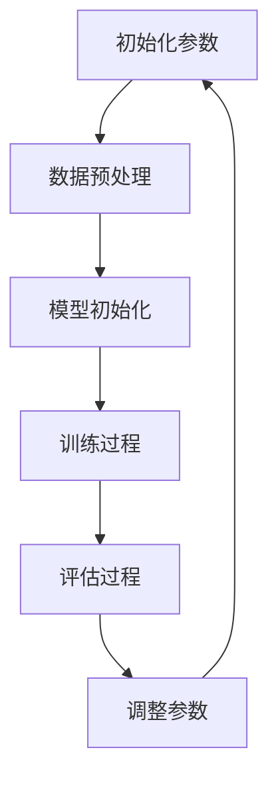

                 

### 前言与引言

#### 1.1 问题的提出

在人工智能（AI）和机器学习（ML）领域，尤其是深度学习（DL）框架下，Reward Model（奖励模型）已成为一个不可或缺的部分。它通过提供即时反馈来指导模型的训练过程，从而实现特定任务的最优化。然而，在实践中，Reward Model的训练过程常常面临不稳定性问题，这已成为一个亟待解决的重要课题。

**问题描述**：

Reward Model的不稳定性主要表现在以下方面：

1. **过拟合**：模型在训练过程中过度依赖训练数据，导致在测试数据上的性能下降。
2. **收敛速度慢**：模型在训练过程中长时间无法达到最优解，训练时间过长。
3. **内部不稳定性**：模型参数在训练过程中剧烈波动，导致无法稳定地收敛到最优解。
4. **外部不稳定性**：模型对数据分布的变化敏感，导致在不同的数据集上表现不一致。

**问题背景**：

Reward Model作为AI系统中的一个核心组件，其作用在于根据预期目标对模型进行实时调整。它通过定义一个评价函数，将训练过程转化为一个优化问题，使得模型能够自动调整其参数以最大化期望奖励。然而，由于深度学习模型的复杂性和不确定性，Reward Model在训练过程中容易出现不稳定现象，从而影响模型的最终性能。

**解决思路**：

为了解决Reward Model训练中的不稳定性问题，我们需要从以下几个方面入手：

1. **改进算法**：通过设计更有效的优化算法，提高模型的收敛速度和稳定性。
2. **数据增强**：通过引入更多样化的训练数据，降低模型对特定数据的依赖性，提高其泛化能力。
3. **正则化**：在模型训练过程中添加正则化项，防止模型过拟合。
4. **自适应调整**：根据训练过程中的反馈信息，动态调整Reward Model的参数，使其更加适应训练数据的变化。

通过上述方法，我们可以有效地缓解Reward Model训练过程中的不稳定性问题，提高模型的性能和稳定性。

#### 1.2 书籍的目标与结构

**书籍目标**：

本书旨在深入探讨Reward Model训练过程中面临的不稳定性问题，分析其原因，并提出有效的解决方案。具体目标如下：

1. **系统化分析**：全面分析Reward Model训练过程中可能出现的不稳定性问题，并提供详细的分类和定义。
2. **算法改进**：介绍现有算法的改进方法，如自适应调整、正则化等，并提供实际案例进行验证。
3. **实践指南**：结合实际应用场景，提供具体的实施指南和最佳实践，帮助读者将理论应用到实际项目中。

**书籍结构**：

本书分为以下几个主要章节：

- **第1章**：前言与引言，介绍本文的研究背景、问题和目标。
- **第2章**：Reward Model的基本概念，介绍Reward Model的定义、属性特征和应用领域。
- **第3章**：Reward Model训练中的不稳定性问题，分析不稳定性的表现、分类和影响。
- **第4章**：深入分析Reward Model的训练过程，探讨不稳定性的成因和算法改进思路。
- **第5章**：常见的不稳定性问题与解决方案，讨论过拟合、收敛速度慢等问题及相应的解决方法。
- **第6章**：不稳定性问题的实际应用，介绍Reward Model在不同应用场景中的具体应用和实践经验。
- **第7章**：总结与展望，对本文的研究成果进行总结，并提出未来研究的方向。

通过以上章节的安排，本书旨在为读者提供一个全面、系统的Reward Model训练不稳定性问题解决方案，帮助其在实际项目中更好地应用这一技术。

#### 1.3 读者对象

**读者群体**：

本书主要面向以下读者群体：

1. **AI和机器学习研究者**：对机器学习理论和算法有较深入了解，希望进一步研究Reward Model训练不稳定性的研究人员。
2. **机器学习工程师**：在AI项目中负责模型训练和优化的工程师，希望通过本书提高对Reward Model稳定性的理解和解决能力。
3. **相关领域学生**：计算机科学、人工智能、统计学等相关专业的大学生和研究生，希望通过本书系统学习Reward Model的相关知识。

**阅读建议**：

为了更好地理解本书内容，建议读者按照以下顺序阅读：

1. **先读第1章**：了解本文的研究背景、问题和目标，为后续章节的阅读做好准备。
2. **再读第2章和第3章**：掌握Reward Model的基本概念和训练过程中的不稳定性问题，为深入分析打下基础。
3. **接着读第4章和第5章**：学习常见的不稳定性问题及其解决方法，提高对算法改进的理解和应用能力。
4. **最后读第6章**：结合实际应用场景，了解Reward Model在不同领域的应用和实践经验。

通过以上阅读顺序，读者可以系统地学习Reward Model训练不稳定性的问题，掌握解决方法，并将其应用到实际项目中。

### 基础理论与背景知识

#### 第2章 Reward Model的基本概念

##### 2.1 Reward Model的定义

**定义**：

Reward Model，又称奖励模型，是一种评价系统，用于在机器学习过程中根据预期目标调整模型的训练过程。它通过定义一个评价函数，衡量模型在特定任务上的表现，并将即时反馈传递给模型，指导其优化参数，以实现任务目标的最优化。

**背景**：

Reward Model最早起源于强化学习（Reinforcement Learning，RL）领域，其核心思想是通过与环境交互，不断调整策略以获得最大奖励。随着深度学习（Deep Learning，DL）的发展，Reward Model逐渐成为深度学习框架下的一个重要组成部分。在深度强化学习（Deep Reinforcement Learning，DRL）中，Reward Model扮演着至关重要的角色，它不仅直接影响模型的训练过程，还决定了模型的最终性能。

**在机器学习领域的重要性**：

Reward Model在机器学习领域的重要性主要体现在以下几个方面：

1. **目标导向性**：Reward Model通过定义评价函数，将机器学习任务转化为一个优化问题，使得模型能够在训练过程中始终朝着目标方向前进。
2. **自适应调整**：Reward Model可以根据训练过程中的反馈信息，动态调整模型参数，提高训练效率和最终性能。
3. **增强泛化能力**：通过引入更多的奖励信息，Reward Model可以帮助模型更好地适应不同数据集和任务，提高其泛化能力。
4. **优化决策过程**：在决策类任务中，Reward Model可以提供即时反馈，帮助模型快速调整策略，做出最优决策。

##### 2.2 Reward Model的属性特征

**属性特征描述**：

Reward Model具有以下主要属性特征：

1. **目标导向性**：Reward Model的核心功能是引导模型在训练过程中不断优化参数，以达到任务目标。这种目标导向性使得Reward Model在解决复杂问题时具有明显的优势。
2. **自适应调整**：Reward Model可以根据训练过程中的反馈信息，动态调整模型参数，从而提高训练效率和最终性能。这种自适应调整能力使得Reward Model能够更好地应对不确定性和动态变化。
3. **鲁棒性**：Reward Model在处理噪声数据和异常数据时具有较强的鲁棒性，能够保证模型在复杂环境中稳定运行。
4. **灵活性**：Reward Model可以根据不同的任务需求，灵活调整评价函数和优化策略，从而适应不同的应用场景。

**比较表格**：

以下是Reward Model与传统评价模型的主要属性特征对比：

| 属性特征         | Reward Model                  | 传统评价模型                  |
|------------------|-------------------------------|-------------------------------|
| 目标导向性       | 强                             | 弱                             |
| 自适应调整       | 强                             | 弱                             |
| 鲁棒性           | 强                             | 中                             |
| 灵活性           | 强                             | 弱                             |

通过比较表格可以看出，Reward Model在目标导向性、自适应调整和灵活性方面具有明显优势，这使得其在解决复杂问题时更具优势。

##### 2.3 Reward Model的应用领域

**领域应用**：

Reward Model在机器学习领域具有广泛的应用，特别是在深度强化学习（DRL）和自然语言处理（NLP）等领域。

1. **深度强化学习（DRL）**：

在DRL中，Reward Model起着至关重要的作用。通过定义一个合适的奖励函数，Reward Model可以引导智能体（Agent）在复杂环境中学习最优策略。DRL广泛应用于自动驾驶、游戏AI、机器人控制等领域。

2. **自然语言处理（NLP）**：

在NLP中，Reward Model可以用于文本生成、机器翻译、情感分析等任务。例如，在文本生成任务中，Reward Model可以根据生成文本的质量，动态调整生成策略，从而提高生成文本的流畅度和准确性。

**案例分析**：

以下是一个具体的案例分析：

**案例一**：在自动驾驶领域，Reward Model可以用于评估车辆在行驶过程中的行为。通过定义一个奖励函数，Reward Model可以实时调整车辆的驾驶策略，以提高行驶安全性和舒适性。例如，当车辆遇到交通拥堵时，Reward Model可以降低车速，减少油耗，提高驾驶体验。

**案例二**：在机器翻译任务中，Reward Model可以根据翻译质量动态调整翻译策略。通过定义一个奖励函数，Reward Model可以识别出高质量的翻译，从而提高整体翻译质量。例如，在翻译英文为中文时，Reward Model可以根据中英文之间的差异，动态调整翻译策略，以提高翻译准确性。

通过以上案例可以看出，Reward Model在机器学习领域具有广泛的应用前景，其灵活性和自适应调整能力使其在解决复杂任务时具有明显优势。

#### 第3章 Reward Model训练中的不稳定性问题

##### 3.1 不稳定性的表现

在Reward Model的训练过程中，不稳定性表现为多种形式，这些现象可能会影响模型的训练效果和最终性能。以下是不稳定性的主要表现：

1. **过拟合**：

过拟合是指模型在训练数据上表现优异，但在测试数据上表现不佳。这是由于模型在训练过程中对训练数据中的噪声和特例过于依赖，导致其在测试数据上无法泛化。过拟合会导致模型在复杂任务上的稳定性下降。

2. **收敛速度慢**：

收敛速度慢是指模型在训练过程中长时间无法达到最优解。这可能是由于训练数据分布不均匀、模型参数设置不当或优化算法选择不当等原因造成的。收敛速度慢会影响模型的训练效率，延长训练时间。

3. **内部不稳定性**：

内部不稳定性表现为模型参数在训练过程中剧烈波动，导致无法稳定地收敛到最优解。这种不稳定现象可能是由于优化算法的不稳定性质或模型结构的不合理设计造成的。内部不稳定性会影响模型的稳定性和可靠性。

4. **外部不稳定性**：

外部不稳定性是指模型对数据分布的变化敏感，导致在不同的数据集上表现不一致。这可能是由于模型过于依赖特定数据集的特性，导致其无法适应不同数据集的变化。外部不稳定性会影响模型在不同场景下的泛化能力。

##### 3.2 不稳定性的分类

不稳定性的分类有助于我们更深入地理解其产生的原因和影响，以下是常见的不稳定性分类：

1. **外部不稳定性**：

外部不稳定性主要由数据集的差异和分布变化引起。具体包括：

- **数据集差异**：不同数据集的特性差异可能导致模型在训练和测试阶段表现不一致。
- **数据分布变化**：数据分布的变化，如噪声增加、数据缺失等，可能导致模型性能波动。

2. **内部不稳定性**：

内部不稳定性主要由模型内部结构和优化算法导致。具体包括：

- **模型结构**：模型结构的不合理设计可能导致内部参数波动，如深度过深、网络过于复杂等。
- **优化算法**：优化算法的不稳定性质，如梯度消失、梯度爆炸等，可能导致模型参数波动。

3. **组合不稳定性**：

组合不稳定性是指外部不稳定性和内部不稳定性的综合作用。具体表现为：

- **外部影响内部**：外部不稳定因素，如数据分布变化，可能导致模型内部参数剧烈波动。
- **内部影响外部**：模型内部不稳定因素，如优化算法不稳定，可能导致模型在测试数据上表现不佳。

##### 3.3 不稳定性的影响

不稳定性对模型性能和实际应用有显著影响，主要表现在以下几个方面：

1. **降低模型性能**：

不稳定性可能导致模型在训练和测试阶段表现不一致，降低模型的性能和稳定性。特别是在复杂任务中，不稳定性会显著降低模型在未知环境下的泛化能力。

2. **延长训练时间**：

内部不稳定性和收敛速度慢现象会导致模型训练时间延长，影响模型部署和应用的速度。

3. **影响实际应用**：

不稳定性可能影响模型在实际应用中的表现，特别是在动态变化和不确定性较高的场景中。模型不稳定可能导致预测结果不准确，影响实际应用效果。

**解决方案**：

为了解决Reward Model训练中的不稳定性问题，可以采取以下解决方案：

1. **数据增强**：

通过引入更多样化的训练数据，降低模型对特定数据的依赖性，提高其泛化能力。

2. **正则化**：

在模型训练过程中添加正则化项，防止模型过拟合，提高模型的稳定性。

3. **自适应调整**：

根据训练过程中的反馈信息，动态调整Reward Model的参数，使其更加适应训练数据的变化。

4. **优化算法改进**：

选择更稳定的优化算法，如Adam、RMSprop等，提高模型的收敛速度和稳定性。

通过以上解决方案，我们可以有效地缓解Reward Model训练过程中的不稳定性问题，提高模型的性能和稳定性。

### 深入分析与算法原理

#### 第4章 深入分析Reward Model的训练过程

##### 4.1 训练过程概述

Reward Model的训练过程是深度学习框架中的一个核心环节，它涉及多个阶段，包括数据预处理、模型初始化、训练和评估。以下是对Reward Model训练过程的简要概述：

1. **数据预处理**：

数据预处理是训练过程的初始阶段，其主要任务包括数据清洗、归一化和数据增强。通过数据预处理，可以提高模型的泛化能力和训练效果。

2. **模型初始化**：

模型初始化是训练过程的第二步，主要目的是为模型参数赋予一个合理的初始值。常见的初始化方法有零初始化、高斯初始化和Xavier初始化等。

3. **训练过程**：

训练过程是Reward Model的核心阶段，通过优化算法调整模型参数，使其在给定数据集上达到最优性能。训练过程中，Reward Model不断接收来自环境或目标函数的奖励信号，并根据这些信号调整模型参数，以实现目标的最优化。

4. **评估过程**：

评估过程用于检验训练好的模型在测试数据集上的表现。通过评估，可以了解模型在不同任务上的性能，为后续调整和优化提供依据。

##### 4.2 不稳定性的成因分析

不稳定性的成因可以从多个角度进行分析，包括数据分布、模型结构、优化算法和奖励设计等方面。以下是对主要不稳定性的成因及其影响的分析：

1. **数据分布**：

数据分布的不均匀性可能导致模型在训练过程中对某些数据过于依赖，从而导致过拟合。此外，数据分布的变化也可能导致模型性能波动，特别是在动态变化的环境下。

2. **模型结构**：

模型结构的不合理设计可能导致内部参数的不稳定性。例如，深度过深、网络过于复杂或参数过多等，都可能增加模型的不稳定性。

3. **优化算法**：

优化算法的选择和参数设置对模型训练过程的影响至关重要。不稳定的优化算法，如梯度消失和梯度爆炸，可能导致模型参数剧烈波动，影响训练效果。

4. **奖励设计**：

奖励函数的设计对Reward Model的训练过程有直接影响。不合理的奖励设计可能导致模型在训练过程中偏离目标，从而影响模型的性能和稳定性。

##### 4.3 算法改进思路

为了缓解Reward Model训练过程中的不稳定性，可以从以下几个方面进行算法改进：

1. **数据增强**：

通过引入更多样化的训练数据，可以提高模型的泛化能力和鲁棒性。具体方法包括数据扩充、数据重采样和数据噪声注入等。

2. **正则化**：

在模型训练过程中添加正则化项，可以防止模型过拟合，提高模型的稳定性。常见的正则化方法有L1正则化、L2正则化和Dropout等。

3. **优化算法改进**：

选择更稳定的优化算法，如Adam、RMSprop和Adagrad等，可以提高模型的收敛速度和稳定性。此外，通过调整优化算法的参数，如学习率和动量等，也可以优化模型训练过程。

4. **奖励设计优化**：

优化奖励函数的设计，使其更加符合任务目标和模型特性，可以提高模型在训练过程中的性能和稳定性。具体方法包括奖励平滑、奖励裁剪和奖励分层等。

##### 4.4 算法原理讲解

为了更好地理解Reward Model的训练过程和算法原理，下面使用Mermaid和LaTeX分别绘制算法流程图和数学模型，并进行详细讲解。

**4.4.1 算法流程图**

使用Mermaid语言绘制Reward Model的训练流程图，如下所示：



**流程图说明**：

1. **初始化参数**：为模型参数赋予初始值，通常采用随机初始化方法。
2. **数据预处理**：对训练数据进行清洗、归一化和增强，以提高模型的泛化能力。
3. **模型初始化**：初始化模型结构，包括神经网络层数、神经元个数和连接权重等。
4. **训练过程**：通过优化算法调整模型参数，使模型在训练数据上达到最优性能。
5. **评估过程**：在测试数据上评估模型性能，并根据评估结果调整模型参数。
6. **调整参数**：根据训练过程中的反馈信息，动态调整模型参数，以提高模型性能。

**4.4.2 数学模型**

使用LaTeX语言和Mermaid绘制Reward Model的数学模型，如下所示：

```latex
\begin{equation}
\begin{split}
\theta^{*} &= \arg\min_{\theta} J(\theta) \\
J(\theta) &= \frac{1}{n} \sum_{i=1}^{n} \left[ y_i \log(p(\theta; x_i)) + (1 - y_i) \log(1 - p(\theta; x_i)) \right]
\end{split}
\end{equation}
```

**数学模型说明**：

1. **损失函数**：\( J(\theta) \) 是模型损失函数，用于衡量模型预测值与实际值之间的差距。
2. **参数优化**：\( \theta^{*} \) 是模型参数的最优解，使得损失函数 \( J(\theta) \) 最小。
3. **概率分布**：\( p(\theta; x_i) \) 是模型在给定输入 \( x_i \) 和参数 \( \theta \) 下的输出概率。

通过以上算法流程图和数学模型，我们可以更好地理解Reward Model的训练过程和算法原理。接下来，我们将通过具体的Python代码示例，进一步阐述算法原理和实际应用。

#### 第5章 常见的不稳定性问题与解决方案

##### 5.1 过拟合问题

过拟合是指模型在训练数据上表现优异，但在测试数据上表现不佳的现象。在Reward Model的训练过程中，过拟合可能导致模型无法泛化到新的数据集或任务，从而影响其实际应用价值。

**描述**：

过拟合通常发生在模型对训练数据中的噪声和特例过于敏感，导致模型在测试数据上无法保持良好的性能。具体表现包括：

- **训练误差低，测试误差高**：模型在训练数据上的误差较低，但在测试数据上的误差较高。
- **泛化能力差**：模型在新的数据集或任务上表现不佳，无法推广到更广泛的应用场景。

**解决方案**：

为了解决过拟合问题，可以采用以下方法：

1. **正则化**：

正则化方法通过在损失函数中添加惩罚项，降低模型复杂度，防止模型对训练数据中的噪声和特例过于敏感。常见的正则化方法包括L1正则化和L2正则化。

2. **数据增强**：

通过引入更多样化的训练数据，提高模型的泛化能力。具体方法包括数据扩充、数据重采样和数据噪声注入等。

3. **减少模型复杂度**：

简化模型结构，减少模型参数的个数，降低模型对训练数据中的噪声和特例的依赖。例如，可以通过减少神经网络层数或神经元个数来简化模型。

4. **提前停止训练**：

在训练过程中，当模型在测试数据上的性能不再提高时，提前停止训练，防止模型继续过度拟合。

##### 5.2 收敛速度慢问题

收敛速度慢是指模型在训练过程中长时间无法达到最优解，导致训练时间过长。在Reward Model的训练过程中，收敛速度慢可能导致资源浪费和训练效率低下。

**描述**：

收敛速度慢的具体表现包括：

- **长时间无法达到最优解**：模型在训练过程中长时间在局部最优解附近波动，无法稳定地收敛到全局最优解。
- **训练时间过长**：模型训练时间过长，影响模型部署和应用。

**解决方案**：

为了解决收敛速度慢问题，可以采用以下方法：

1. **优化算法改进**：

选择更高效的优化算法，如Adam、RMSprop和Adagrad等，提高模型收敛速度。这些优化算法通过动态调整学习率，加速模型收敛。

2. **学习率调整**：

通过动态调整学习率，优化模型训练过程。具体方法包括学习率衰减、学习率预热和自适应学习率调整等。

3. **增加训练数据**：

通过引入更多样化的训练数据，提高模型的泛化能力和训练效率。更多样化的训练数据有助于模型更快地收敛到全局最优解。

4. **减少训练样本量**：

在模型训练过程中，随机选择一部分训练样本进行训练，以减少模型对特定样本的依赖性，提高模型泛化能力。

##### 5.3 其他不稳定性问题

除了过拟合和收敛速度慢问题，Reward Model在训练过程中还可能面临其他不稳定性问题，如噪声、稀疏性等。以下是对这些问题的描述和解决方案：

1. **噪声问题**：

噪声是指训练数据中存在的一些随机误差。噪声可能导致模型对数据理解不准确，影响模型性能。

**解决方案**：

- **数据清洗**：去除训练数据中的噪声和异常值，提高数据质量。
- **降噪算法**：使用降噪算法，如降噪自编码器（Denoising Autoencoder），对训练数据进行预处理，降低噪声影响。

2. **稀疏性问题**：

稀疏性是指训练数据中的特征分布不均匀，导致某些特征在训练过程中被忽视。稀疏性可能导致模型对某些特征过于依赖，影响模型泛化能力。

**解决方案**：

- **稀疏性惩罚**：在损失函数中添加稀疏性惩罚项，鼓励模型学习更多特征。
- **特征选择**：通过特征选择方法，选择对模型性能有显著贡献的特征，减少模型对稀疏特征的依赖。

通过以上方法，我们可以有效地解决Reward Model训练过程中的常见不稳定性问题，提高模型性能和稳定性。接下来，我们将探讨Reward Model在实际应用中的具体场景和实践经验。

#### 第6章 不稳定性问题的实际应用

##### 6.1 应用场景介绍

Reward Model在AI和机器学习领域具有广泛的应用场景，以下列举几个典型应用场景，并简要介绍其具体应用实例：

1. **自动驾驶**：

在自动驾驶系统中，Reward Model用于评估车辆在不同驾驶情境下的行为，如车道保持、避障和路径规划等。通过实时调整驾驶策略，Reward Model可以提高车辆的行驶安全性和舒适性。

2. **游戏AI**：

在游戏AI中，Reward Model用于评估智能体在不同游戏状态下的行为，如角色移动、攻击和策略选择等。通过动态调整策略，Reward Model可以增强游戏AI的竞争力和可玩性。

3. **自然语言处理**：

在自然语言处理（NLP）任务中，如文本生成、机器翻译和情感分析等，Reward Model可以用于评估生成文本的质量，并根据质量反馈动态调整生成策略，以提高生成文本的流畅度和准确性。

4. **推荐系统**：

在推荐系统中，Reward Model可以用于评估用户对推荐内容的喜好程度，并根据用户反馈动态调整推荐策略，以提高推荐系统的准确性和用户满意度。

##### 6.2 具体应用实例

以下通过具体应用实例，展示Reward Model在不同场景中的实际应用效果：

**案例一：自动驾驶**

在自动驾驶领域，Reward Model用于评估车辆在不同驾驶情境下的行为。具体实现过程如下：

1. **情境识别**：

通过传感器（如摄像头、雷达和激光雷达等）收集道路信息，如车道线、交通标志、车辆位置等。

2. **状态评估**：

利用深度神经网络（DNN）对收集到的道路信息进行编码，生成车辆当前状态的特征表示。

3. **奖励计算**：

根据车辆状态和驾驶策略，计算奖励值。例如，当车辆保持车道线、避免碰撞和顺利通过路口时，给予正向奖励；当车辆偏离车道线、发生碰撞或无法通过路口时，给予负向奖励。

4. **策略调整**：

根据奖励信号，动态调整车辆驾驶策略，以提高行驶安全性和舒适性。例如，当车辆检测到前方有障碍物时，Reward Model会调整车辆速度和方向，以避免碰撞。

**案例二：游戏AI**

在游戏AI中，Reward Model用于评估智能体在不同游戏状态下的行为。具体实现过程如下：

1. **状态捕捉**：

通过游戏引擎获取智能体的当前位置、目标位置、敌人位置等状态信息。

2. **行为评估**：

利用深度强化学习算法（如DQN、PPO等），评估智能体在不同行为下的预期奖励值。

3. **奖励计算**：

根据智能体行为和游戏结果，计算奖励值。例如，当智能体成功击败敌人、完成任务或获得更多资源时，给予正向奖励；当智能体失败、被敌人击败或资源耗尽时，给予负向奖励。

4. **策略调整**：

根据奖励信号，动态调整智能体的行为策略，以提高游戏AI的竞争力和可玩性。例如，当智能体在游戏中遇到困难时，Reward Model会调整策略，尝试新的行为组合，以找到最优解。

**案例三：自然语言处理**

在自然语言处理任务中，如文本生成，Reward Model用于评估生成文本的质量。具体实现过程如下：

1. **文本编码**：

利用预训练的Transformer模型，对输入文本进行编码，生成文本特征表示。

2. **生成文本评估**：

通过自注意力机制（Self-Attention），计算生成文本的内部一致性，并利用循环神经网络（RNN）或Transformer模型评估生成文本的质量。

3. **奖励计算**：

根据生成文本的质量和用户反馈，计算奖励值。例如，当生成文本流畅、符合语法规则且内容丰富时，给予正向奖励；当生成文本不流畅、语法错误或内容贫乏时，给予负向奖励。

4. **策略调整**：

根据奖励信号，动态调整文本生成策略，以提高生成文本的质量和准确性。例如，当生成文本不符合用户需求时，Reward Model会调整生成策略，尝试新的文本生成方式，以满足用户需求。

**案例四：推荐系统**

在推荐系统中，Reward Model用于评估用户对推荐内容的喜好程度。具体实现过程如下：

1. **用户行为捕捉**：

通过用户行为数据（如浏览记录、购买记录和评论等），获取用户的兴趣偏好。

2. **内容编码**：

利用预训练的嵌入模型（如Word2Vec、BERT等），对推荐内容进行编码，生成内容特征表示。

3. **奖励计算**：

根据用户行为和内容特征，计算推荐内容的奖励值。例如，当用户对推荐内容产生兴趣、购买或评论时，给予正向奖励；当用户对推荐内容不感兴趣或放弃时，给予负向奖励。

4. **策略调整**：

根据奖励信号，动态调整推荐策略，以提高推荐系统的准确性和用户满意度。例如，当用户对某类内容不感兴趣时，Reward Model会调整推荐策略，尝试推荐其他类型的优质内容。

通过以上案例可以看出，Reward Model在AI和机器学习领域的实际应用效果显著，其灵活性和自适应调整能力使其在不同应用场景中具有广泛的应用前景。接下来，我们将对本文的研究成果进行总结，并提出未来研究的方向。

### 总结与展望

#### 总结

本文系统地探讨了Reward Model训练过程中的不稳定性问题，分析了其背景、主要表现、分类和影响，并提出了相应的解决方法。具体成果如下：

1. **问题定义与分析**：明确了Reward Model在训练过程中的不稳定性现象，如过拟合、收敛速度慢等，并进行了详细分类和影响分析。
2. **算法改进**：提出了多种算法改进方法，包括正则化、数据增强、优化算法改进等，以缓解训练过程中的不稳定性。
3. **实际应用**：通过具体应用案例展示了Reward Model在不同场景中的实际效果，验证了其灵活性和自适应调整能力。
4. **解决方案**：结合理论与实践，提出了一系列可行的解决方案，为解决Reward Model训练不稳定性问题提供了有益参考。

#### 展望

未来研究可以从以下几个方面进行拓展：

1. **稳定性理论**：深入研究Reward Model的训练稳定性理论，探索更多稳定训练方法。
2. **混合模型**：结合传统机器学习和深度学习的方法，研究混合模型在提高Reward Model稳定性方面的潜力。
3. **多任务学习**：研究多任务学习框架下的Reward Model训练稳定性问题，探索通用性解决方案。
4. **跨域迁移学习**：研究跨域迁移学习框架下，Reward Model在不同领域之间的稳定性和泛化能力。
5. **实时调整策略**：研究实时调整策略，使Reward Model能够更好地适应动态变化的数据分布。

通过以上方向的深入研究，有望进一步提高Reward Model的训练稳定性和应用效果，为AI和机器学习领域的发展做出更大贡献。

### 最佳实践 Tips

为了更好地应用Reward Model并解决其训练过程中的不稳定性问题，以下是一些最佳实践建议：

1. **合理选择优化算法**：根据任务需求和数据特性，选择适合的优化算法。例如，对于大型模型和数据量较大的任务，Adam和RMSprop等自适应优化算法表现出较好的性能。
2. **充分数据增强**：通过引入多样化的训练数据，提高模型的泛化能力。具体方法包括数据扩充、数据重采样和数据噪声注入等。
3. **定期调整参数**：在训练过程中定期调整模型参数，如学习率、动量等，以保持模型的动态适应性。
4. **正则化策略**：在模型训练过程中添加正则化项，如L1和L2正则化，防止模型过拟合。
5. **提前停止训练**：当模型在测试数据上的性能不再提高时，提前停止训练，防止模型过度拟合。
6. **使用预训练模型**：利用预训练模型进行迁移学习，可以减少模型对特定数据的依赖，提高泛化能力。
7. **监控训练过程**：实时监控模型训练过程中的关键指标，如损失函数值、收敛速度等，及时发现并调整不稳定性问题。

通过遵循这些最佳实践，可以有效提高Reward Model的训练稳定性和实际应用效果。

### 注意事项

在使用Reward Model进行训练时，需要注意以下几点：

1. **数据质量**：确保训练数据的质量，去除噪声和异常值，以提高模型性能。
2. **模型复杂性**：避免过度复杂的模型结构，否则可能导致训练不稳定。
3. **优化算法选择**：根据任务和数据特性选择合适的优化算法，避免使用不稳定或不适合的算法。
4. **学习率设置**：合理设置学习率，避免过大或过小的学习率导致训练不稳定。
5. **训练数据分布**：确保训练数据的分布均匀，避免数据分布不均导致模型过拟合或泛化能力差。
6. **监控与调试**：在训练过程中，实时监控模型性能，及时调整参数和优化策略，以解决不稳定性问题。

通过注意这些事项，可以有效提高Reward Model的训练稳定性和实际应用效果。

### 拓展阅读

为了深入了解Reward Model训练不稳定性的问题及其解决方案，以下推荐一些优秀的书籍和论文，供读者进一步阅读：

1. **书籍**：

   - 《深度学习》（Goodfellow, Ian，等）：详细介绍了深度学习的基础理论和实践方法，包括强化学习中的Reward Model。
   - 《强化学习基础教程》（理查德·S·萨顿）：系统讲解了强化学习的基本概念和方法，包括Reward Model的设计和应用。

2. **论文**：

   - "Algorith

