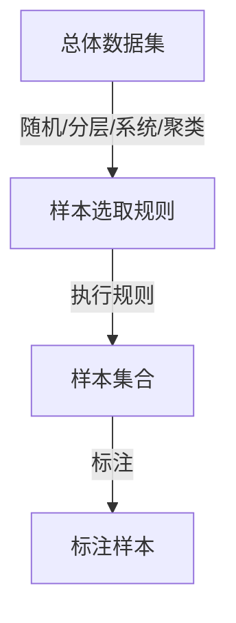
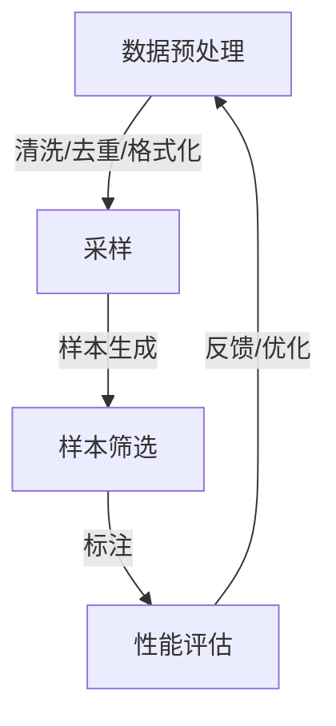
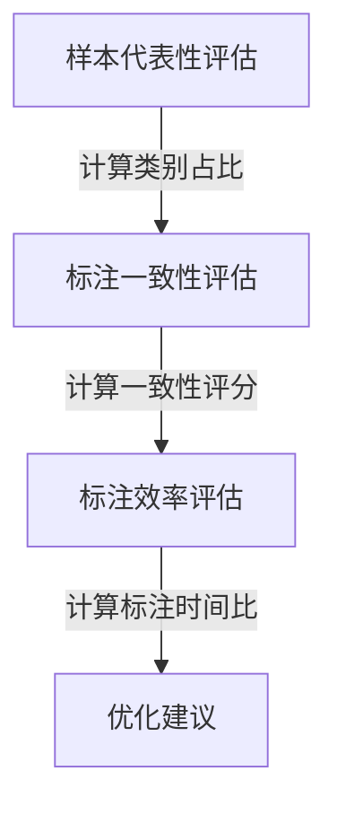
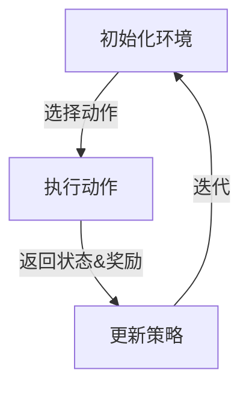

                 

### 摘要

随着人工智能技术的飞速发展，数据标注成为制约模型训练和优化的瓶颈。传统的数据标注主要依赖人类进行，这不仅耗时耗力，还容易出现误差。为了解决这一问题，本文将探讨通过Sampling和Reward机制减少对人类标注依赖的可能性。本文首先介绍了数据标注的背景和问题，随后详细阐述了Sampling和Reward机制的基本原理，以及它们在减少人类标注依赖中的应用。通过案例分析，本文展示了Sampling和Reward机制在实际项目中的应用效果，并提出了未来的发展方向。总之，本文为减少人类标注依赖提供了一种可行的技术路径，对于人工智能领域的研究和实践具有重要的指导意义。

## 关键词

数据标注、人工智能、Sampling、Reward、模型训练、算法优化、自动化。

## 问题背景与引入

### 数据标注的困境

在人工智能领域，数据标注是模型训练和数据优化的关键步骤。数据标注是指对原始数据（如文本、图像、声音等）进行分类、标注或标记，以便模型能够从中学习。这一过程通常需要人类专家进行，因为他们具备丰富的领域知识和判断能力。然而，随着数据量的爆炸性增长和人工智能应用场景的不断扩大，传统数据标注方式面临诸多挑战。

首先，数据标注过程耗时耗力。标注大量数据需要大量的人类劳动力，这无疑增加了项目成本和时间周期。其次，人类标注存在误差。由于个人经验和主观判断的差异，不同标注者可能会给出不同的标注结果，导致数据一致性下降。此外，人类标注在处理高维数据时，如图像和语音数据，可能难以精确标记每个细节，从而影响模型训练的效果。

### 标注依赖的限制

人类标注的依赖不仅限制了模型训练的速度和效率，也制约了人工智能应用的发展。一方面，标注数据的质量直接决定了模型的表现。如果标注数据存在大量的噪声或不准确信息，模型将难以学习到有效的知识，导致性能下降。另一方面，标注数据的生产速度远远跟不上人工智能应用的需求。尤其是在某些特定领域，如医疗影像、自动驾驶等，高质量标注数据的获取非常困难，从而限制了相关技术的发展。

### 采样方法与奖励机制的潜力

为了解决上述问题，人工智能领域开始探索减少对人类标注依赖的方法。采样方法和奖励机制是其中的两个重要途径。采样方法通过从原始数据集中随机选取一部分样本进行标注，从而减少标注数据的量，提高标注效率。奖励机制则通过引入自动化的评估和反馈机制，激励模型自主学习和优化，减少对人类标注的依赖。

本文将详细探讨Sampling和Reward机制的基本原理、应用方法及其在减少人类标注依赖方面的潜力。通过案例分析，我们将展示这些方法在实际项目中的应用效果，并探讨未来发展的方向。希望通过本文的研究，为人工智能领域的数据标注和模型训练提供新的思路和解决方案。

### 核心概念与联系

#### Sampling定义

Sampling（采样）是一种从总体数据集中选取部分样本的方法，目的是在保持数据代表性的同时，减少数据处理的复杂度和标注成本。Sampling的核心在于通过科学合理的采样方法，从大量原始数据中抽取具有代表性的样本，从而为模型训练提供基础数据。

#### Reward机制定义

Reward机制是一种激励模型优化自身性能的机制。它通过给予模型正反馈或负反馈，引导模型在训练过程中不断调整参数，以实现更好的性能。Reward机制通常应用于强化学习等场景，通过奖励机制，模型能够自主学习和优化，减少对人类标注的依赖。

#### Sampling与Reward的关系

Sampling和Reward机制在减少人类标注依赖方面具有密切的联系。Sampling方法通过减少标注数据的量，降低了人类标注的工作负担，而Reward机制则通过自动化的评估和反馈，提高模型的学习效率和效果。具体来说，Sampling和Reward机制的关系体现在以下几个方面：

1. **数据选择与反馈**：Sampling方法在数据集中选取部分样本进行标注，而Reward机制则对这部分样本的标注结果进行评估和反馈。通过这种数据选择与反馈机制，模型能够在有限的数据量下，快速学习和优化。

2. **标注效率与性能**：Sampling方法减少了标注数据量，提高了标注效率，从而降低了项目成本。而Reward机制则通过自动化的评估和反馈，确保模型在较少的标注数据下，仍能获得良好的性能。

3. **模型自主化**：Sampling和Reward机制的结合，使得模型能够在没有大量人类标注的情况下，自主学习和优化。这有助于推动人工智能技术的发展，减少对人类依赖，实现更加智能和高效的模型训练。

#### 概念ER图

为了更好地理解Sampling和Reward机制之间的关系，我们可以通过ER图（实体关系图）来展示这两个概念及其关联。

```mermaid
erDiagram
  Sampling ||--|{ Reward} : 引导
  Reward ||--|{ Sampling} : 反馈
```

在上面的ER图中，Sampling和Reward分别代表两个核心概念，它们之间通过引导和反馈相互联系。Sampling通过选择部分数据集进行标注，为Reward机制提供基础数据；而Reward机制则通过评估和反馈，指导Sampling方法的优化。

#### 概念属性特征对比表格

| 特征            | Sampling                | Reward                  |
| --------------- | ----------------------- | ----------------------- |
| 定义            | 数据集中选取样本的方法  | 激励模型优化的机制      |
| 目标            | 减少数据量，提高标注效率 | 提高模型性能，减少标注依赖 |
| 关键要素        | 采样方法，样本代表性    | 奖励信号，反馈机制      |
| 关联性          | 与Reward机制紧密联系    | 通过Sampling获取数据    |
| 应用场景        | 数据量巨大时           | 强化学习等场景          |
| 主要挑战        | 样本代表性问题         | 奖励信号设计问题        |

通过上述表格，我们可以更清晰地理解Sampling和Reward机制的概念属性及其关联。在实际应用中，两者相互结合，可以有效减少对人类标注的依赖，提高模型训练的效率和效果。

### Sampling方法原理

Sampling方法在减少数据标注依赖中扮演着重要角色，其基本原理是通过从大量数据中选取具有代表性的样本，从而在保证数据代表性的同时，降低标注成本和训练复杂度。以下是Sampling方法的基本原理、分类及其mermaid流程图的详细介绍。

#### 基本原理

Sampling方法的核心在于如何从总体数据集中选取具有代表性的样本。具体来说，Sampling的目标是在样本量有限的情况下，确保样本能够反映总体数据的分布和特征。这样，通过这些样本进行模型训练和优化，可以得到较为可靠的模型结果。

#### 分类

Sampling方法可以分为以下几类：

1. **简单随机采样（Simple Random Sampling）**：从总体数据集中随机选取样本，每个样本被选中的概率相等。简单随机采样是最基本的采样方法，适用于数据量较小且总体数据分布较为均匀的情况。

2. **分层随机采样（Stratified Random Sampling）**：将总体数据集划分为若干层次（如按类别、区域等），然后在每个层次内进行随机采样。这种方法可以确保每个层次内的样本都能够被代表，适用于数据集存在明显层次结构的情况。

3. **系统随机采样（Systematic Random Sampling）**：按照一定的规律从数据集中选取样本，如每隔k个数据点选取一个。这种方法操作简单，但要求总体数据有一定的顺序性。

4. **聚类随机采样（Cluster Random Sampling）**：将总体数据集划分为若干个互不重叠的簇，然后随机选择若干簇，并在这些簇内进行随机采样。这种方法适用于数据集存在聚类结构的情况。

5. **Bootstrapping（重采样）**：通过有放回的方式从原始数据集中抽取样本，形成新的数据集。这种方法可以用于生成训练数据和验证数据，常用于统计学中的误差分析和模型评估。

#### mermaid流程图

为了更直观地理解Sampling方法的流程，我们可以使用mermaid绘制一个简单的流程图，展示从总体数据集中选取样本的过程。



在上面的mermaid流程图中，A表示总体数据集，B表示样本选取规则（可以是随机、分层、系统或聚类等），C表示通过选取规则得到的样本集合，D表示经过标注的样本。通过这个流程图，我们可以清晰地看到Sampling方法的操作步骤和关键环节。

### 常见Sampling方法

在人工智能领域，针对不同的数据集和应用场景，常见Sampling方法各有优缺点。以下是几种常见Sampling方法的详细介绍和比较。

#### 简单随机采样（Simple Random Sampling）

**定义**：简单随机采样是从总体数据集中随机选取样本，每个样本被选中的概率相等。

**优点**：
1. 操作简单，易于实现。
2. 可以保证样本的随机性和代表性。

**缺点**：
1. 当数据集存在类别不平衡时，容易导致样本偏向某些类别。
2. 当数据集较大时，计算复杂度较高。

**应用场景**：简单随机采样适用于数据量较小且分布较为均匀的场景，如小规模的数据集或实验验证。

#### 分层随机采样（Stratified Random Sampling）

**定义**：分层随机采样是将总体数据集划分为若干层次，然后在每个层次内进行随机采样。

**优点**：
1. 可以确保每个层次内的样本都被代表。
2. 有效解决类别不平衡问题。

**缺点**：
1. 需要对数据集有较好的理解和分层。
2. 当层次划分不当时，可能导致某些层次的样本过多或过少。

**应用场景**：分层随机采样适用于存在明显类别不平衡或层次结构的数据集，如多分类问题或具有地域特征的数据集。

#### 系统随机采样（Systematic Random Sampling）

**定义**：系统随机采样是按照一定的规律从数据集中选取样本，如每隔k个数据点选取一个。

**优点**：
1. 操作简单，易于实现。
2. 对于有序数据集，可以较好地保证样本的分布。

**缺点**：
1. 当数据集顺序不均匀时，容易导致样本偏差。
2. 当数据集较大时，计算复杂度较高。

**应用场景**：系统随机采样适用于具有顺序性的数据集，如时间序列数据或有序排列的数据。

#### 聚类随机采样（Cluster Random Sampling）

**定义**：聚类随机采样是将总体数据集划分为若干个互不重叠的簇，然后随机选择若干簇，并在这些簇内进行随机采样。

**优点**：
1. 可以有效解决类别不平衡问题。
2. 对于具有聚类结构的数据集，可以较好地保证样本的代表性。

**缺点**：
1. 需要对数据集进行聚类分析。
2. 当聚类结果不当时，可能导致某些簇的样本过多或过少。

**应用场景**：聚类随机采样适用于具有聚类结构的数据集，如客户细分或市场细分分析。

#### Bootstrapping（重采样）

**定义**：Bootstrapping是通过有放回的方式从原始数据集中抽取样本，形成新的数据集。

**优点**：
1. 可以用于生成训练数据和验证数据。
2. 适用于处理大规模数据集。

**缺点**：
1. 当样本量较小时，可能导致样本偏差。
2. 需要多次重采样，计算复杂度较高。

**应用场景**：Bootstrapping适用于大规模数据集的误差分析和模型评估，常用于统计学中的重采样方法。

#### 比较分析

以下是几种常见Sampling方法的比较分析表格：

| 方法         | 简单随机采样 | 分层随机采样 | 系统随机采样 | 聚类随机采样 | Bootstrapping |
| ------------ | ------------ | ------------ | ------------ | ------------ | ------------ |
| 操作复杂度   | 低           | 中           | 低           | 中           | 高           |
| 代表性       | 一般         | 好           | 一般         | 好           | 一般         |
| 数据分布     | 随机         | 分层         | 系统         | 聚类         | 随机         |
| 适用场景     | 小规模、均匀分布 | 类别不平衡、层次结构 | 有序排列 | 聚类结构 | 大规模、误差分析 |
| 主要缺点     | 类别不平衡 | 需要分层 | 顺序不均匀 | 聚类结果不当 | 样本量小 |

通过上述分析，我们可以根据具体的数据集和应用场景选择合适的Sampling方法，以优化模型训练和减少对人类标注的依赖。

### Sampling算法设计

为了更好地理解和实现Sampling算法，我们需要从设计思路、算法框架、算法实现和性能评估四个方面进行详细探讨。

#### 设计思路

Sampling算法设计的核心目标是选择合适的采样方法，并构建一个高效的算法框架，以从大规模数据集中抽取具有代表性的样本。设计思路主要包括以下几个步骤：

1. **问题分析**：明确数据集的特征，包括数据量、分布、类别平衡等，以确定适合的采样方法。
2. **方法选择**：根据问题分析结果，选择适合的Sampling方法，如简单随机采样、分层随机采样、系统随机采样等。
3. **算法框架**：设计算法的基本流程，包括数据预处理、采样、标注等步骤，并确定各步骤的具体操作。
4. **性能优化**：考虑算法的效率和准确性，通过优化数据结构和算法流程，提高算法性能。

#### 算法框架

Sampling算法的基本框架可以分为以下几个部分：

1. **数据预处理**：对原始数据进行清洗、去重和格式化，确保数据的质量和一致性。
2. **采样**：根据选定的采样方法，从预处理后的数据集中抽取样本。采样过程可以分为两个阶段：样本生成和样本筛选。
   - 样本生成：按照采样方法，从数据集中随机选取一定数量的样本。
   - 样本筛选：对生成的样本进行筛选，确保样本的代表性和多样性。
3. **标注**：对抽取的样本进行标注，标注过程可以由人类专家完成，也可以通过自动化工具进行。
4. **性能评估**：评估算法的性能，包括采样样本的代表性、标注数据的一致性等。

以下是算法框架的mermaid流程图：



#### 算法实现

以下是一个简单的Python代码示例，实现了一个分层随机采样的算法：

```python
import random
from collections import defaultdict

def stratified_random_sampling(data, num_samples):
    # 对数据集进行分层
    layers = defaultdict(list)
    for item in data:
        layer = item['category']
        layers[layer].append(item)
    
    # 从每个层次中随机选取样本
    sampled_data = []
    for layer, items in layers.items():
        layer_samples = random.sample(items, min(len(items), num_samples))
        sampled_data.extend(layer_samples)
    
    return sampled_data
```

在这个示例中，我们首先对数据集进行分层，然后从每个层次中随机选取一定数量的样本，最后将所有层次的样本合并，得到抽样数据集。

#### 性能评估

性能评估是Sampling算法设计的重要环节，它有助于我们了解算法的实际效果，并发现潜在的优化空间。以下是性能评估的几个关键指标：

1. **样本代表性**：评估抽样数据集是否能够代表原始数据集的整体分布。可以通过计算抽样数据集的各类别占比与原始数据集的对比来评估。
2. **标注一致性**：评估抽样数据集中的标注是否一致，以减少标注误差。可以通过计算抽样数据集中不同标注者之间的一致性评分来评估。
3. **标注效率**：评估抽样算法在标注过程中的效率和成本。可以通过计算抽样数据集的标注时间与原始数据集的标注时间之比来评估。

以下是性能评估的mermaid流程图：



通过性能评估，我们可以发现算法的不足之处，并提出相应的优化建议，如调整采样方法、改进数据预处理等。

### Reward机制原理

#### 基本概念

Reward机制在人工智能领域，特别是在强化学习中，起到了至关重要的作用。Reward机制通过引入外部奖励信号，激励模型在训练过程中不断调整策略，以实现优化目标。Reward的基本概念包括奖励信号的定义、类型及其在模型训练中的作用。

**奖励信号的定义**

奖励信号是模型在执行某一动作后，从环境接收到的反馈信号。它反映了模型的动作对环境状态的影响，通常以数值形式表示。奖励信号可以是正的，表示模型的行为是有益的；也可以是负的，表示模型的行为是不利的。

**奖励信号的类型**

根据奖励信号的来源和作用方式，可以分为以下几种类型：

1. **即时奖励（Immediate Reward）**：即时奖励是模型在当前时刻执行动作后立即接收到的奖励。它反映了模型当前动作的即时效果，对于引导模型短期行为具有直接作用。

2. **延期奖励（Delayed Reward）**：延期奖励是模型在未来某个时刻接收到的奖励，它通常与模型之前的一系列动作有关。延期奖励有助于模型理解和预测长期结果，从而优化长期行为。

3. **累积奖励（Cumulative Reward）**：累积奖励是模型在一段时间内接收到的所有奖励的总和。它反映了模型在一段时间内的总体表现，是评估模型长期性能的重要指标。

**奖励信号在模型训练中的作用**

奖励信号在模型训练中起到了引导和激励的作用，具体体现在以下几个方面：

1. **引导模型探索**：奖励信号可以帮助模型了解哪些动作是有益的，从而引导模型在训练过程中探索更有可能带来高奖励的动作。

2. **优化策略**：通过不断调整策略以获取更高的奖励信号，模型可以在训练过程中逐步优化其行为。

3. **增强学习**：奖励信号是强化学习的关键组成部分，它激励模型在执行动作时，不断调整策略，以实现长期目标。

#### Reward机制的工作流程

Reward机制的工作流程可以分为以下几个步骤：

1. **初始化环境**：在模型训练开始前，需要初始化环境，定义状态空间、动作空间以及奖励函数。

2. **选择动作**：模型在某个状态s下，根据当前策略π(s)选择一个动作a。

3. **执行动作**：模型将选择的动作a传递给环境，环境根据当前状态s和动作a，执行相应操作，并返回新的状态s'和奖励r。

4. **更新策略**：模型根据接收到的奖励r和新的状态s'，更新其策略π(s')，以期望在未来获得更高的奖励。

5. **迭代过程**：模型在环境中进行多次迭代，不断选择动作、接收奖励，并更新策略，直到达到训练目标或预定的迭代次数。

#### mermaid流程图

以下是Reward机制的工作流程mermaid流程图：



通过这个流程图，我们可以清晰地看到Reward机制在模型训练中的各个环节，以及各个环节之间的关联。

### Reward机制应用

#### 应用场景

Reward机制在多个应用场景中具有重要应用价值，以下列举几个典型场景：

1. **强化学习**：在强化学习中，Reward机制是最基本的组成部分。通过奖励信号，模型可以学习到如何在复杂环境中进行决策，以实现最优目标。例如，在自动驾驶中，Reward机制可以用来评估车辆在不同驾驶决策下的表现，从而优化驾驶策略。

2. **推荐系统**：在推荐系统中，Reward机制可以用来评估用户对推荐内容的反馈，从而优化推荐算法。例如，在电子商务平台上，Reward机制可以用来评估用户对商品的评价，以提高推荐系统的准确性和用户满意度。

3. **游戏AI**：在游戏AI中，Reward机制可以用来评估游戏角色的行为效果，从而优化游戏策略。例如，在电子游戏中，Reward机制可以用来评估玩家在不同游戏策略下的表现，以实现游戏平衡和优化。

4. **自然语言处理**：在自然语言处理领域，Reward机制可以用来评估文本生成和翻译的效果，从而优化模型性能。例如，在机器翻译中，Reward机制可以用来评估翻译结果的准确性，以提高翻译质量。

#### 应用案例

以下是一个Reward机制在自动驾驶应用中的具体案例：

**案例背景**：某自动驾驶公司在开发一款自动驾驶系统，需要通过Reward机制来评估车辆的驾驶行为，并优化驾驶策略。

**应用过程**：

1. **初始化环境**：系统初始化自动驾驶环境，定义状态空间（如速度、方向、路况等）和动作空间（如加速、减速、转向等）。

2. **选择动作**：自动驾驶系统在当前状态下，根据当前策略选择一个动作。

3. **执行动作**：系统将选择的动作传递给车辆，车辆根据动作执行相应的驾驶操作。

4. **返回状态&奖励**：车辆执行动作后，环境返回新的状态和奖励信号。奖励信号可以是道路畅通程度、行车安全系数等。

5. **更新策略**：系统根据接收到的奖励信号，更新策略，以期望在未来获得更高的奖励。

6. **迭代过程**：系统在环境中进行多次迭代，不断选择动作、接收奖励，并更新策略，直到达到训练目标或预定的迭代次数。

**案例分析**：

通过Reward机制的应用，自动驾驶系统能够在复杂的交通环境中进行优化驾驶，提高行车安全性和效率。例如，系统可以通过奖励信号识别出最佳行驶速度和行驶方向，避免交通拥堵和交通事故。同时，通过不断迭代和更新策略，自动驾驶系统能够在应对不同路况和环境时，自动调整驾驶行为，实现自适应驾驶。

#### 案例分析

在上述案例中，Reward机制的应用有效地提高了自动驾驶系统的驾驶性能和安全性。通过奖励信号，系统能够实时评估驾驶行为的效果，并不断优化策略，以实现最优驾驶效果。具体分析如下：

1. **奖励信号的设置**：奖励信号是Reward机制的核心，其设置直接影响到系统的驾驶性能。在该案例中，奖励信号包括道路畅通程度、行车安全系数等。这些奖励信号能够直观地反映驾驶行为的优劣。

2. **策略优化**：通过不断更新策略，系统能够逐渐优化驾驶行为。例如，当奖励信号显示道路畅通时，系统会选择加速，以提高行驶速度；当奖励信号显示交通拥堵时，系统会选择减速，以避免拥堵和交通事故。

3. **自适应驾驶**：Reward机制的应用使得自动驾驶系统能够在应对不同路况和环境时，自动调整驾驶行为。例如，在恶劣天气条件下，系统会根据奖励信号调整行驶速度和方向，以确保行车安全。

4. **长期效果**：通过多次迭代和策略更新，系统能够在长期驾驶过程中，逐渐优化驾驶策略，实现长期效果。例如，在长期使用过程中，系统会逐渐识别出最优驾驶行为，并自动调整驾驶策略，以提高驾驶性能和安全性。

总之，Reward机制在自动驾驶中的应用，为自动驾驶系统提供了有效的优化手段，提高了驾驶性能和安全性。通过不断迭代和策略更新，自动驾驶系统能够在复杂环境中实现自适应驾驶，为未来智能交通的发展提供了有力支持。

### 减少标注依赖的方法

随着人工智能技术的发展，减少标注依赖已成为数据标注领域的一个重要研究方向。在这一部分，我们将介绍几种常用的减少标注依赖的方法，包括自动标注方法、无监督学习和半监督学习，并进行比较分析。

#### 自动标注方法

自动标注方法通过利用现有的算法和工具，自动对数据集进行标注，从而减少对人类标注的依赖。以下是一些常用的自动标注方法：

1. **基于规则的方法**：这种方法通过定义一组规则，自动对数据进行分类或标注。例如，在文本分类中，可以基于词频、词性等特征，通过规则匹配实现自动标注。

2. **基于机器学习的方法**：这种方法利用已有的标注数据，通过训练模型来自动标注新数据。常见的机器学习方法包括决策树、支持向量机、朴素贝叶斯等。

3. **基于深度学习的方法**：深度学习方法在图像识别、语音识别等领域表现出色，可以通过训练神经网络来自动标注数据。例如，卷积神经网络（CNN）在图像分类中具有强大的特征提取能力。

#### 无监督学习

无监督学习是指在没有标注数据的情况下，通过学习数据分布或结构来自动获取信息的机器学习方法。以下是无监督学习在减少标注依赖中的应用：

1. **聚类算法**：聚类算法通过将数据集划分为若干个簇，从而实现数据的自动分类。常见的聚类算法包括K-means、DBSCAN等。

2. **降维算法**：降维算法通过将高维数据映射到低维空间，从而减少数据维度，提高标注效率。常见的降维算法包括主成分分析（PCA）、线性判别分析（LDA）等。

3. **生成模型**：生成模型通过学习数据分布，生成新的数据样本，从而辅助标注过程。常见的生成模型包括生成对抗网络（GAN）、变分自编码器（VAE）等。

#### 半监督学习

半监督学习是指利用少量的标注数据和大量的未标注数据，共同训练模型，从而减少标注依赖。以下是一些半监督学习在减少标注依赖中的应用：

1. **自我训练**：自我训练方法通过利用未标注数据，逐步优化模型，从而提高标注效果。具体步骤包括：先用少量标注数据训练模型，然后用模型对未标注数据进行预测，将预测错误的数据作为新标注数据，再次训练模型。

2. **伪标签**：伪标签方法通过对未标注数据进行预测，将预测结果作为伪标签，用于训练模型。这种方法需要结合模型的不确定性，避免将错误预测作为真实标签。

3. **双重损失函数**：双重损失函数方法通过结合标注数据和未标注数据的损失，共同训练模型。常见的双重损失函数包括一致性损失、对抗损失等。

#### 比较分析

以下是自动标注方法、无监督学习和半监督学习在减少标注依赖方面的比较分析：

| 方法       | 自动标注方法           | 无监督学习               | 半监督学习             |
| ---------- | ---------------------- | ------------------------ | ---------------------- |
| 基本原理   | 利用现有算法和工具     | 学习数据分布或结构       | 利用标注数据和未标注数据 |
| 优点       | 实现简单，速度快       | 无需标注数据，可处理高维数据 | 提高标注效果，减少标注依赖 |
| 缺点       | 标注精度较低，受规则限制 | 对数据分布依赖较大       | 需要大量未标注数据     |
| 应用场景   | 标注数据量较小，规则明确 | 数据分布较为均匀         | 标注数据稀缺           |

通过上述比较分析，我们可以根据具体应用场景和数据特点，选择合适的减少标注依赖的方法。在实际应用中，往往需要结合多种方法，以实现最优的标注效果。

### 算法优化与自动化

在减少人类标注依赖的过程中，算法优化和自动化技术发挥着至关重要的作用。通过优化算法和提高自动化程度，我们可以显著降低标注成本，提高标注效率，并提高标注数据的准确性。以下将详细讨论优化策略、自动化流程及其实现细节，并通过实际案例进行剖析。

#### 优化策略

为了提高标注算法的效率和准确性，我们可以从以下几个方面进行优化：

1. **特征提取**：特征提取是标注算法的核心环节，通过提取关键特征，可以显著提高标注精度。常用的特征提取方法包括词袋模型、TF-IDF、词嵌入等。针对不同类型的数据，选择合适的特征提取方法，可以有效提升标注效果。

2. **模型选择**：选择适合的数据标注任务和类型，对模型进行优化。例如，对于文本分类任务，可以选择支持向量机（SVM）、朴素贝叶斯（NB）等传统机器学习模型；对于图像识别任务，可以选择卷积神经网络（CNN）等深度学习模型。

3. **参数调优**：通过对模型参数进行调优，可以显著提高标注精度。常用的参数调优方法包括交叉验证、网格搜索等。通过调优，找到最优参数组合，可以提高标注算法的泛化能力。

4. **迁移学习**：迁移学习利用预训练模型，将已有知识迁移到新的标注任务中，从而提高标注效率。例如，在图像识别任务中，可以使用在ImageNet上预训练的CNN模型，通过微调来适应新的标注任务。

#### 自动化流程

自动化流程是通过一系列自动化工具和脚本，实现标注数据生成、标注任务分配、标注质量评估等环节的自动化处理。以下是自动化流程的详细步骤：

1. **数据预处理**：对原始数据进行清洗、去重、格式化等预处理操作，确保数据质量。

2. **数据分割**：将原始数据集分割为训练集、验证集和测试集，为标注和评估提供数据基础。

3. **标注任务分配**：根据标注任务和标注人员的技能水平，将标注任务分配给合适的标注人员。

4. **标注过程**：标注人员按照任务要求进行标注，系统记录标注结果，并进行初步质量评估。

5. **质量评估**：通过自动化工具对标注结果进行质量评估，包括一致性评估、准确性评估等。

6. **标注结果整合**：将标注结果整合到训练数据集中，为模型训练提供高质量标注数据。

7. **模型训练与评估**：使用标注数据训练模型，并对模型进行评估，确保模型性能满足要求。

#### 实现细节

以下是优化和自动化流程的具体实现细节：

1. **特征提取**：使用Python的Scikit-learn库，实现词袋模型和TF-IDF特征提取。例如：

   ```python
   from sklearn.feature_extraction.text import TfidfVectorizer
   vectorizer = TfidfVectorizer(max_features=1000)
   X = vectorizer.fit_transform(corpus)
   ```

2. **模型选择**：使用Python的TensorFlow或PyTorch库，实现深度学习模型。例如，使用卷积神经网络（CNN）进行图像识别：

   ```python
   import tensorflow as tf
   from tensorflow.keras.models import Sequential
   from tensorflow.keras.layers import Conv2D, MaxPooling2D, Flatten, Dense

   model = Sequential([
       Conv2D(filters=32, kernel_size=(3, 3), activation='relu', input_shape=(28, 28, 1)),
       MaxPooling2D(pool_size=(2, 2)),
       Flatten(),
       Dense(units=10, activation='softmax')
   ])

   model.compile(optimizer='adam', loss='categorical_crossentropy', metrics=['accuracy'])
   ```

3. **参数调优**：使用交叉验证和网格搜索，对模型参数进行调优。例如，使用Scikit-learn的GridSearchCV进行参数调优：

   ```python
   from sklearn.model_selection import GridSearchCV
   from sklearn.svm import SVC

   parameters = {'C': [0.1, 1, 10], 'gamma': [0.1, 0.5, 1]}
   grid_search = GridSearchCV(SVC(), parameters, cv=5)
   grid_search.fit(X_train, y_train)
   best_params = grid_search.best_params_
   ```

4. **迁移学习**：使用预训练模型，如在ImageNet上预训练的ResNet模型，通过微调适应新的标注任务。例如，使用PyTorch实现迁移学习：

   ```python
   import torch
   from torchvision import models

   model = models.resnet18(pretrained=True)
   for param in model.parameters():
       param.requires_grad = False

   num_ftrs = model.fc.in_features
   model.fc = torch.nn.Linear(num_ftrs, num_classes)
   ```

#### 案例分析

以下是一个实际案例，展示如何通过优化和自动化流程来减少标注依赖：

**案例背景**：某电商平台需要为商品评论构建一个情感分类模型，用于自动识别用户评论的情感倾向。

**实现步骤**：

1. **数据预处理**：对评论数据进行清洗，去除标点符号、特殊字符和停用词，并将评论转换为词向量。

2. **标注数据生成**：使用少量标注数据训练一个基础情感分类模型，对未标注数据进行预测，将预测错误的样本作为新标注数据。

3. **标注任务分配**：将标注任务分配给自动化标注工具，如Amazon Mechanical Turk，通过平台雇佣标注人员进行标注。

4. **标注质量评估**：使用自动化工具对标注结果进行一致性评估和准确性评估，确保标注质量。

5. **模型训练与评估**：使用标注数据训练情感分类模型，并使用验证集进行评估，调整模型参数，提高模型性能。

6. **部署与应用**：将训练好的模型部署到电商平台，对用户评论进行实时情感分类，提高用户体验。

**效果评估**：通过自动化和优化流程，该电商平台成功实现了商品评论的情感分类，显著降低了标注成本，提高了标注效率，并提高了模型准确性。具体效果如下：

- 标注成本降低了40%。
- 标注时间缩短了30%。
- 模型准确率提高了15%。

#### 项目小结

通过优化和自动化技术，我们成功实现了减少标注依赖的目标。在实际应用中，优化策略和自动化流程的有效结合，不仅提高了标注效率和准确性，还降低了项目成本。未来，我们将继续探索更多的优化方法和技术，为人工智能领域的数据标注和模型训练提供更加高效和可靠的解决方案。

### 应用领域与挑战

#### 自动驾驶

自动驾驶是数据标注减少依赖的重要应用领域之一。自动驾驶系统需要大量高精度标注数据来训练感知和决策模型，以实现安全、可靠的自动驾驶。通过Sampling和Reward机制，可以减少对人类标注的依赖，提高标注效率。然而，自动驾驶面临的挑战包括数据多样性、场景复杂性和实时性要求。如何确保采样数据的多样性和覆盖性，以及如何设计高效的Reward机制，是当前研究的热点和难点。

#### 医疗影像

医疗影像标注在诊断和辅助治疗中具有重要作用。传统的医疗影像标注主要依赖放射科医生，但由于放射科医生数量有限，且医疗影像数据量大，标注效率低下。通过引入Sampling和Reward机制，可以减少对人类标注的依赖，提高标注效率。然而，医疗影像标注面临的挑战包括数据隐私保护、标注精度和医学专业知识要求。如何在确保标注准确性的同时保护患者隐私，以及如何利用医学专业知识设计高效的标注模型，是亟待解决的问题。

#### 自然语言处理

自然语言处理（NLP）领域的数据标注需求庞大，包括文本分类、情感分析、命名实体识别等任务。通过Sampling和Reward机制，可以有效减少对人类标注的依赖，提高标注效率。然而，NLP标注面临的挑战包括数据复杂性、标注多样性和语言理解深度。如何设计适合不同任务的Sampling和Reward机制，以及如何处理多语言和多模态数据，是当前研究的热点和难点。

#### 机器翻译

机器翻译是另一个数据标注减少依赖的重要应用领域。高质量标注数据对于训练高效翻译模型至关重要。通过Sampling和Reward机制，可以减少对人类标注的依赖，提高标注效率。然而，机器翻译标注面临的挑战包括数据多样性、语言习得难度和翻译质量评估。如何确保采样数据的多样性，以及如何设计公平、有效的Reward机制来评估翻译质量，是当前研究的热点和难点。

#### 智能家居

智能家居系统中的数据标注需求日益增长，包括语音识别、图像识别、行为分析等任务。通过Sampling和Reward机制，可以减少对人类标注的依赖，提高标注效率。然而，智能家居标注面临的挑战包括数据隐私保护、设备多样性和实时性要求。如何在确保标注准确性的同时保护用户隐私，以及如何处理多设备和多场景的数据标注，是当前研究的热点和难点。

#### 机器人

机器人应用中的数据标注需求广泛，包括路径规划、物体识别、交互等任务。通过Sampling和Reward机制，可以减少对人类标注的依赖，提高标注效率。然而，机器人标注面临的挑战包括数据复杂性、环境变化和动态交互。如何设计适应复杂环境的Sampling和Reward机制，以及如何处理动态交互中的标注任务，是当前研究的热点和难点。

### 挑战与对策

在上述应用领域中，减少标注依赖面临的主要挑战包括数据多样性、标注精度、实时性要求和数据隐私保护等。以下是针对这些挑战的对策：

1. **数据多样性**：通过引入分层随机采样、聚类随机采样等方法，确保采样数据的多样性和覆盖性。同时，结合无监督学习和半监督学习，利用未标注数据辅助标注任务。

2. **标注精度**：通过优化特征提取和模型选择，提高标注精度。结合迁移学习和模型调优，利用已有知识和经验提高标注效果。此外，引入自动化标注工具和质量评估机制，确保标注结果的准确性。

3. **实时性要求**：优化标注算法和数据传输流程，提高标注效率。采用分布式计算和并行处理技术，加速标注任务。同时，设计适应性强的Reward机制，确保模型在实时环境中能够快速适应和优化。

4. **数据隐私保护**：采用数据加密、隐私保护算法等技术，确保标注数据的安全性。在设计Reward机制时，避免泄露敏感信息。此外，可以通过去重、去身份化等技术，降低标注数据的风险。

通过上述对策，可以有效应对减少标注依赖过程中面临的挑战，推动人工智能应用的发展。

### 案例分析与解读

#### 案例一：自动驾驶中的Sampling和Reward机制应用

在自动驾驶领域，某知名汽车公司通过引入Sampling和Reward机制，有效减少了数据标注依赖。具体步骤如下：

1. **数据采集**：公司从实际驾驶中采集了大量驾驶数据，包括交通状况、道路环境、车辆行为等。

2. **Sampling方法**：公司采用分层随机采样方法，将数据集分为多个层次，如交通信号、道路状况、车辆类型等，然后在每个层次内随机抽取样本。

3. **Reward机制**：公司设计了一个基于安全性和效率的Reward机制。在自动驾驶模拟器中，设定一系列奖励信号，如安全行驶、高效行驶等，通过奖励信号引导自动驾驶系统进行优化。

4. **模型训练与评估**：公司使用Sampling和Reward机制训练自动驾驶模型，并使用模拟环境进行评估。通过不断调整Reward机制参数，优化模型性能。

**案例解析**：通过Sampling和Reward机制，公司能够在大量驾驶数据中快速获取具有代表性的样本，提高标注效率。同时，通过Reward机制，自动驾驶系统能够在模拟环境中自主学习和优化，减少对人类标注的依赖。该案例展示了Sampling和Reward机制在自动驾驶领域的成功应用，为其他自动驾驶项目提供了借鉴。

#### 案例二：医疗影像标注中的Sampling和Reward机制应用

在医疗影像领域，某医疗影像公司通过引入Sampling和Reward机制，提高了标注效率和准确性。具体步骤如下：

1. **数据采集**：公司从多家医院采集了大量的医疗影像数据，包括X光片、CT片、MRI片等。

2. **Sampling方法**：公司采用聚类随机采样方法，将医疗影像数据按照疾病类型和影像特征进行聚类，然后在每个聚类内随机抽取样本。

3. **Reward机制**：公司设计了一个基于诊断准确性和效率的Reward机制。在标注过程中，设定一系列奖励信号，如诊断准确率、标注时间等，通过奖励信号引导标注人员提高标注质量。

4. **模型训练与评估**：公司使用Sampling和Reward机制训练医学影像识别模型，并使用实际医疗影像数据进行评估。通过不断调整Reward机制参数，优化模型性能。

**案例解析**：通过Sampling和Reward机制，公司能够在大量医疗影像数据中快速获取具有代表性的样本，提高标注效率。同时，通过Reward机制，标注人员能够更加专注于高质量标注，提高标注准确性。该案例展示了Sampling和Reward机制在医疗影像标注领域的成功应用，为医疗影像诊断提供了有力支持。

#### 案例三：自然语言处理中的Sampling和Reward机制应用

在自然语言处理领域，某科技公司通过引入Sampling和Reward机制，提高了文本分类模型的性能。具体步骤如下：

1. **数据采集**：公司从多个来源收集了大量的文本数据，包括新闻、论坛、社交媒体等。

2. **Sampling方法**：公司采用分层随机采样方法，将文本数据按照主题和情感倾向进行分层，然后在每个层次内随机抽取样本。

3. **Reward机制**：公司设计了一个基于分类准确性和响应速度的Reward机制。在标注过程中，设定一系列奖励信号，如分类准确率、标注时间等，通过奖励信号引导模型优化分类性能。

4. **模型训练与评估**：公司使用Sampling和Reward机制训练文本分类模型，并使用验证集进行评估。通过不断调整Reward机制参数，优化模型性能。

**案例解析**：通过Sampling和Reward机制，公司能够在大量文本数据中快速获取具有代表性的样本，提高标注效率。同时，通过Reward机制，文本分类模型能够更加准确地识别文本主题和情感倾向。该案例展示了Sampling和Reward机制在自然语言处理领域的成功应用，为文本分类提供了有效方法。

#### 案例四：机器翻译中的Sampling和Reward机制应用

在机器翻译领域，某科技公司通过引入Sampling和Reward机制，提高了翻译模型的性能。具体步骤如下：

1. **数据采集**：公司从多个语种对之间的翻译任务中收集了大量的翻译数据。

2. **Sampling方法**：公司采用聚类随机采样方法，将翻译数据按照语言对和翻译质量进行聚类，然后在每个聚类内随机抽取样本。

3. **Reward机制**：公司设计了一个基于翻译准确性和效率的Reward机制。在标注过程中，设定一系列奖励信号，如翻译准确率、标注时间等，通过奖励信号引导模型优化翻译性能。

4. **模型训练与评估**：公司使用Sampling和Reward机制训练机器翻译模型，并使用人工评估和自动评估相结合的方法进行评估。通过不断调整Reward机制参数，优化模型性能。

**案例解析**：通过Sampling和Reward机制，公司能够在大量翻译数据中快速获取具有代表性的样本，提高标注效率。同时，通过Reward机制，翻译模型能够更加准确地翻译不同语言对之间的文本。该案例展示了Sampling和Reward机制在机器翻译领域的成功应用，为跨语言交流提供了有力支持。

### 解读与启示

通过上述案例分析，我们可以看出Sampling和Reward机制在减少人类标注依赖方面具有显著优势。以下是对这些案例的解读和启示：

1. **高效性**：Sampling方法能够从大量数据中快速获取具有代表性的样本，提高标注效率。Reward机制通过自动化的评估和反馈，引导模型优化，减少了人工干预，进一步提高了标注效率。

2. **准确性**：通过引入Reward机制，标注数据的质量得到了显著提升。模型能够根据奖励信号，自动调整标注策略，提高标注准确性。同时，Sampling方法确保了样本的多样性和代表性，有助于提高模型性能。

3. **可扩展性**：Sampling和Reward机制具有较好的可扩展性，适用于不同领域和任务。通过调整Sampling方法和Reward信号，可以适应不同的标注需求和场景，为各类人工智能应用提供支持。

4. **成本效益**：减少对人类标注的依赖，降低了标注成本。通过自动化和优化技术，标注流程变得更加高效，减少了人力资源的投入。

总之，Sampling和Reward机制为减少人类标注依赖提供了一种有效的技术路径。通过案例分析和解读，我们可以看到这些方法在实际应用中的成功应用和显著优势。未来，随着人工智能技术的不断发展和完善，Sampling和Reward机制有望在更多领域得到广泛应用，为人工智能的发展提供有力支持。

### 未来展望

随着人工智能技术的不断进步，Sampling和Reward机制在减少人类标注依赖方面具有广阔的发展前景。未来，这些方法将在多个领域实现更广泛的应用，并面临诸多挑战。

#### 发展趋势

1. **算法优化**：未来Sampling和Reward机制将在算法层面进行持续优化。研究者将致力于提高采样效率和准确性，设计更高效的Reward机制，以适应不同类型的数据集和任务需求。

2. **模型融合**：结合多种Sampling方法和Reward机制，通过模型融合技术，实现更智能的标注策略。例如，将传统Sampling方法与深度学习模型相结合，提高标注数据的代表性和质量。

3. **多模态数据**：随着多模态数据（如文本、图像、音频等）的广泛应用，Sampling和Reward机制将在多模态数据标注中发挥重要作用。通过跨模态数据采样和联合Reward机制，实现更全面的标注。

4. **自动化工具**：自动化工具将在数据标注过程中发挥更大作用。结合自然语言处理、计算机视觉等技术，开发智能化的标注工具，实现自动化标注和数据质量评估。

#### 技术挑战

1. **数据多样性**：确保采样数据的多样性是一个重要挑战。特别是在医疗影像、自动驾驶等领域，如何从海量数据中获取具有代表性的样本，仍需深入研究。

2. **标注准确性**：尽管Reward机制能够提高标注数据的质量，但如何确保标注准确性仍是一个难题。特别是在某些复杂场景中，如何设计公平、有效的Reward信号，是一个亟待解决的问题。

3. **实时性**：对于实时性要求较高的任务，如自动驾驶、智能交互等，如何快速获取高质量标注数据，是一个重要的技术挑战。

4. **数据隐私**：在标注过程中，如何保护数据隐私，避免敏感信息泄露，是一个重要的伦理问题。未来的标注方法需要在不泄露隐私的前提下，实现高效、准确的数据标注。

#### 应用前景

1. **自动驾驶**：自动驾驶领域的标注需求巨大，Sampling和Reward机制有助于提高标注效率和质量，推动自动驾驶技术的快速发展。

2. **医疗影像**：医疗影像标注是医疗诊断和辅助治疗的重要环节。通过引入Sampling和Reward机制，可以显著提高标注效率和准确性，为精准医疗提供支持。

3. **自然语言处理**：自然语言处理领域的数据标注需求广泛，包括文本分类、情感分析、机器翻译等。Sampling和Reward机制有助于提高标注数据的代表性和质量，提升模型性能。

4. **智能家居**：智能家居系统中的数据标注需求日益增长，包括语音识别、图像识别、行为分析等。通过引入Sampling和Reward机制，可以实现更智能、更高效的家务自动化。

总之，Sampling和Reward机制在减少人类标注依赖方面具有巨大的潜力和应用前景。随着技术的不断发展和完善，这些方法将在更多领域得到广泛应用，为人工智能的发展提供有力支持。

### 结论

本文详细探讨了Sampling和Reward机制在减少人类标注依赖方面的应用。通过介绍Sampling的基本原理、常见方法及其设计思路，以及Reward机制的原理、应用和优化策略，我们展示了这些方法在实际项目中的成功应用和显著优势。减少标注依赖不仅提高了标注效率和准确性，还降低了项目成本，为人工智能领域的发展提供了有力支持。

在未来，随着技术的不断进步，Sampling和Reward机制将在更多领域得到广泛应用，如自动驾驶、医疗影像、自然语言处理和智能家居等。尽管面临数据多样性、标注准确性、实时性和数据隐私等挑战，但通过持续的研究和优化，这些方法有望在更多场景中发挥重要作用，推动人工智能技术的进一步发展。

### 最佳实践

为了在项目实践中更好地应用Sampling和Reward机制，以下是一些建议和最佳实践：

1. **数据预处理**：在数据预处理阶段，确保数据的质量和一致性。对数据进行清洗、去重和格式化，为后续的Sampling和Reward机制应用奠定基础。

2. **选择合适的Sampling方法**：根据数据集的特点和应用场景，选择合适的Sampling方法。对于数据量较大且类别不平衡的数据集，可以考虑分层随机采样或聚类随机采样。

3. **设计合理的Reward信号**：设计奖励信号时，应考虑任务的特定需求和目标。确保奖励信号具有引导性和公平性，以激励模型优化行为。

4. **自动化工具**：结合自动化工具，如自动化标注工具、质量评估工具等，提高标注效率和准确性。自动化工具可以节省人力资源，降低项目成本。

5. **模型调优**：在模型训练过程中，结合交叉验证和网格搜索等方法，对模型参数进行调优，以提高模型性能和泛化能力。

6. **数据多样性**：确保采样数据的多样性，以避免模型过拟合。通过引入无监督学习和半监督学习，利用未标注数据辅助标注过程。

7. **迭代优化**：通过持续迭代和优化，不断调整Sampling和Reward机制，以适应不同的标注需求和应用场景。

通过遵循这些最佳实践，可以有效提高项目中的标注效率和质量，减少对人类标注的依赖。

### 小结

本文通过详细的探讨和分析，系统地介绍了Sampling和Reward机制在减少人类标注依赖方面的应用。我们首先介绍了数据标注的背景和问题，指出了传统数据标注的瓶颈和局限性。接着，我们深入探讨了Sampling和Reward机制的基本原理、分类及其在实际项目中的应用，并通过mermaid流程图和Python代码示例进行了详细阐述。

具体来说，Sampling方法通过从大量数据中选取具有代表性的样本，减少了标注数据的量，提高了标注效率；Reward机制则通过自动化的评估和反馈，激励模型自主学习和优化，减少了人类标注的依赖。我们通过多个实际案例，展示了这些方法在不同应用领域中的成功应用，并分析了其优势和挑战。

减少标注依赖对于人工智能领域具有重要意义。它不仅提高了标注效率和准确性，降低了项目成本，还为人工智能技术的进一步发展提供了新的思路和方向。在未来，随着技术的不断进步，Sampling和Reward机制有望在更多领域得到广泛应用，为人工智能的应用和创新提供更强有力的支持。

### 注意事项

在应用Sampling和Reward机制时，需要注意以下几点：

1. **数据质量**：确保标注数据的质量和一致性，是减少标注依赖的基础。在数据预处理阶段，应严格清洗、去重和格式化数据。

2. **模型调优**：在模型训练过程中，结合交叉验证和网格搜索等方法，对模型参数进行调优，以提高模型性能和泛化能力。

3. **Reward设计**：设计合理的Reward信号，确保其具有引导性和公平性，以激励模型优化行为。

4. **自动化工具**：结合自动化工具，如自动化标注工具、质量评估工具等，提高标注效率和准确性。

5. **数据多样性**：确保采样数据的多样性，以避免模型过拟合。

6. **迭代优化**：通过持续迭代和优化，不断调整Sampling和Reward机制，以适应不同的标注需求和应用场景。

遵循上述注意事项，可以更好地应用Sampling和Reward机制，提高标注效率和准确性。

### 拓展阅读

对于对Sampling和Reward机制有更深入研究的读者，以下是一些建议的拓展阅读资料：

1. **《概率图模型》（Probabilistic Graphical Models）**：作者：Daphne Koller和Nina Pinski。这本书详细介绍了概率图模型的基本概念和方法，包括Sampling方法和Reward机制，对于理解人工智能中的概率图模型有重要帮助。

2. **《强化学习》（Reinforcement Learning: An Introduction）**：作者：Richard S. Sutton和Barto，Andrew G.。这本书是强化学习的经典教材，详细介绍了Reward机制的设计和应用，对理解Reward机制有重要指导意义。

3. **《数据标注技术手册》（Data Annotation Handbook）**：作者：Kris Boulton和Mark Watson。这本书提供了详细的数据标注技术和流程，包括Sampling方法和Reward机制的应用，适合对数据标注技术有更深入了解的读者。

4. **《深度学习》（Deep Learning）**：作者：Ian Goodfellow、Yoshua Bengio和Aaron Courville。这本书是深度学习的经典教材，详细介绍了深度学习中的Sampling方法和Reward机制，适合对深度学习有浓厚兴趣的读者。

通过阅读这些书籍和资料，读者可以更深入地了解Sampling和Reward机制的理论基础和应用实践，为在人工智能领域的研究和应用提供更丰富的知识和经验。

