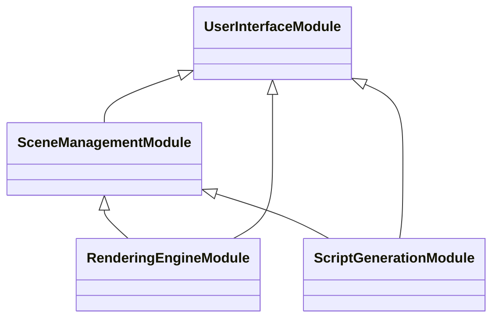
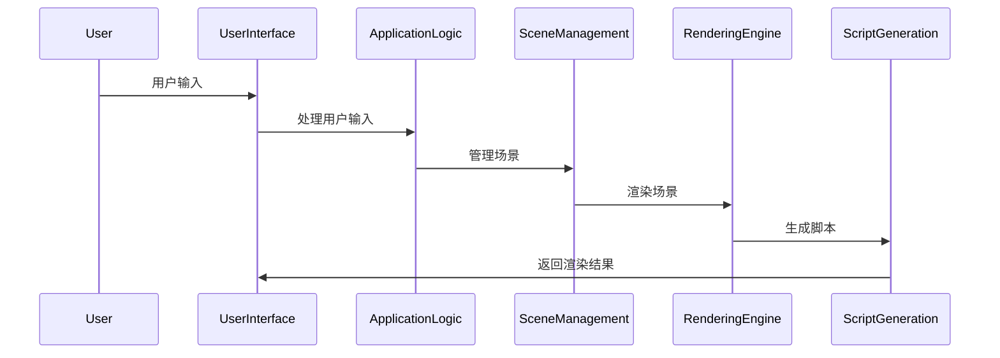
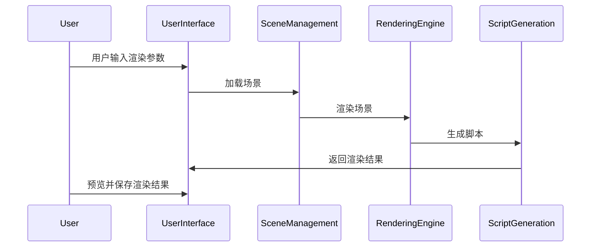

                 

### 摘要

《SceneCraft：生成Blender可执行Python脚本渲染3D场景》旨在深入探讨如何利用Python脚本在Blender中高效渲染3D场景。本文首先介绍了Blender的基本概念和SceneCraft工具的背景知识，探讨了3D渲染在计算机图形学中的重要性。接着，文章详细解析了渲染过程的各个环节，包括光照、材质、相机设置等关键要素。随后，文章通过逐步分析，展示了如何使用Python脚本操作Blender API，生成可执行的渲染脚本，并讲解了相关算法和数学模型的实现。此外，文章还提供了具体的系统架构设计和项目实战案例，详细解析了从环境搭建到脚本生成的全过程。最后，本文总结了最佳实践和注意事项，并推荐了进一步学习的资源。阅读本文，您将全面了解Blender脚本渲染的精髓，掌握3D场景渲染的高级技巧。

---

### 关键词

- Blender
- Python脚本
- 3D渲染
- SceneCraft
- 计算机图形学
- 光照模型
- 材质
- 相机设置
- 算法
- 数学模型
- 系统架构
- 项目实战

---

### 背景介绍

Blender是一款功能强大且开源的自由软件，广泛用于3D建模、动画、渲染、视频编辑等领域。在计算机图形学中，3D渲染是一个至关重要的环节，它决定了最终图形的效果和质量。传统的3D渲染通常依赖图形软件的内置渲染引擎，而Blender更是以其高度可定制化和强大的扩展性著称。SceneCraft作为一个高效的工具，可以生成Blender的可执行Python脚本，从而简化了渲染过程，提高了工作效率。

在Blender中，渲染3D场景需要考虑多个关键因素。首先，光照是影响渲染效果的重要因素之一，合理设置光照可以显著提升场景的真实感。Blender支持多种光照模型，包括点光源、聚光源、区光源等，每种光源都有其特定的属性和参数，如强度、颜色、衰减等。其次，材质也是渲染中的重要一环，它决定了物体表面的纹理、颜色和反射特性。Blender提供了丰富的材质系统，包括纹理贴图、法线贴图、镜面反射等，通过这些材质可以实现各种复杂的视觉效果。

此外，相机设置在渲染中同样不可忽视。相机的位置、角度和焦距直接影响了最终渲染图的视角和构图。Blender允许用户自由调整相机的参数，包括位置、角度、焦距、景深等，从而实现不同的视觉效果。

在3D渲染过程中，算法和数学模型起到了关键作用。例如，渲染引擎需要计算光线的传播路径，这涉及到光线追踪算法；在处理材质时，需要考虑光的反射、折射和散射等物理现象，这涉及到复杂的数学计算。SceneCraft通过Python脚本将上述因素整合起来，生成高效的渲染脚本，使得渲染过程更加灵活和可控。

总之，掌握Blender及其渲染工具，尤其是SceneCraft的使用，对于3D图形设计师和开发者来说具有重要意义。通过本文，您将深入了解Blender的渲染原理和实现方法，学会如何利用Python脚本进行高效渲染，从而提升您的3D创作和开发能力。

### 核心概念与联系

在深入探讨SceneCraft生成Blender可执行Python脚本渲染3D场景的过程中，我们需要了解一些核心概念和它们之间的联系。以下是几个关键概念及其属性特征对比表格和ER实体关系图：

#### 核心概念

1. **Blender**：一个开源的3D创作套件，支持从建模、动画到渲染等一系列功能。
2. **Python脚本**：一种基于Python语言的脚本，用于自动化Blender的操作和渲染流程。
3. **3D渲染**：将3D模型通过计算机图形学技术转化为2D图像的过程。
4. **SceneCraft**：一个工具，用于生成Blender的可执行Python脚本。
5. **光照模型**：模拟光线在场景中的传播和作用，包括点光源、聚光源、区光源等。
6. **材质**：定义3D模型的外观和交互特性，包括纹理、颜色、反射等。
7. **相机设置**：控制渲染视图的视角和构图，包括位置、角度、焦距等。

#### 属性特征对比表格

| 核心概念 | 属性特征 |
| --- | --- |
| **Blender** | - 开源 |
| - 多功能 |
| - 高度可定制 |
| | **Python脚本** | - 自动化操作 |
| - 高级编程能力 |
| | **3D渲染** | - 图像生成 |
| - 真实感模拟 |
| | **SceneCraft** | - 脚本生成 |
| - 提高效率 |
| | **光照模型** | - 光线模拟 |
| - 影响渲染效果 |
| | **材质** | - 表面特性 |
| - 影响视觉效果 |
| | **相机设置** | - 视角控制 |
| - 影响构图 |

#### ER实体关系图

使用Mermaid语言绘制ER实体关系图，以表示上述核心概念之间的关联：

```mermaid
erDiagram
    Blender ||--|{ SceneCraft }|-- Blender
    Blender ||--|{ Python脚本 }|-- Blender
    Blender ||--|{ 3D渲染 }|-- Blender
    SceneCraft ||--|{ 3D渲染 }|-- SceneCraft
    SceneCraft ||--|{ Python脚本 }|-- SceneCraft
    光照模型 ||--|{ 3D渲染 }|-- 光照模型
    材质 ||--|{ 3D渲染 }|-- 材质
    相机设置 ||--|{ 3D渲染 }|-- 相机设置
```

从ER实体关系图中，我们可以看到Blender作为核心工具，通过SceneCraft和Python脚本进行扩展和自动化。光照模型、材质和相机设置是3D渲染的重要组成部分，与Blender紧密相关，共同作用以生成高质量的渲染效果。

### 算法原理讲解

为了更好地理解如何使用Python脚本在Blender中实现3D渲染，我们将详细介绍渲染过程的核心算法原理，包括光线追踪算法和渲染方程。

#### 光线追踪算法

光线追踪是一种计算机图形学中的渲染技术，通过模拟光线的传播路径来生成高质量的图像。光线追踪算法的基本思想是从相机出发，逐条追踪光线与场景中的物体相交点，计算反射、折射、散射等现象，从而生成最终的渲染图像。

1. **光线-三角形相交测试**：
   光线追踪的第一步是进行光线-三角形的相交测试。具体步骤如下：
   - **确定光线参数**：光线可以表示为射线的形式，由方向向量和起点坐标决定。
   - **参数化三角形**：将场景中的三角形参数化，以便计算光线与三角形的相交。
   - **计算交点**：使用参数化方程求解光线与三角形的交点。
   - **评估交点有效性**：判断交点是否在三角形的内部，并排除无效的交点。

2. **反射和折射计算**：
   在确定光线与物体的相交点后，需要计算反射和折射效果。具体步骤如下：
   - **计算入射角和反射角**：使用向量运算计算光线与物体表面的入射角和反射角。
   - **应用反射和折射定律**：根据光学原理计算反射光线和折射光线。
   - **递归追踪**：对于反射光线和折射光线，重复上述相交测试过程，形成光线追踪的递归结构。

3. **散射计算**：
   散射是光线与物体表面相互作用的一种现象，包括漫反射、菲涅耳反射和折射等。散射计算步骤如下：
   - **漫反射**：计算光线在物体表面的漫反射方向，并使用BRDF（双向反射分布函数）描述反射光的强度。
   - **菲涅耳反射**：根据光线入射角和材料表面的性质，计算反射光的比例。
   - **折射**：计算光线进入另一种介质后的折射方向，使用折射率描述光线传播的特性。

#### 渲染方程

渲染方程是计算机图形学中描述光线传播和交互的基本方程，它将场景中的光照、反射、折射和散射等因素综合在一起，用于计算每个像素的颜色值。

$$
L_o(\mathbf{p}, \mathbf{w}) = L_e(\mathbf{p}, \mathbf{w}) + \int_{\Omega} f_r(\mathbf{p}, \mathbf{w}', \mathbf{w}) \cdot L_i(\mathbf{p}, \mathbf{w}') \cdot (\mathbf{w}' \cdot \mathbf{n}) d\omega'
$$

其中，主要参数解释如下：
- \( L_o(\mathbf{p}, \mathbf{w}) \)：从点 \(\mathbf{p}\) 沿方向 \(\mathbf{w}\) 发出的辐射度。
- \( L_e(\mathbf{p}, \mathbf{w}) \)：从点 \(\mathbf{p}\) 发出的环境光照。
- \( f_r(\mathbf{p}, \mathbf{w}', \mathbf{w}) \)：反射率函数，描述光线方向 \(\mathbf{w}'\) 和观察方向 \(\mathbf{w}\) 之间的交互。
- \( L_i(\mathbf{p}, \mathbf{w}') \)：从点 \(\mathbf{p}\) 沿方向 \(\mathbf{w}'\) 收到的入射光照。
- \( \mathbf{n} \)：表面的法线方向。
- \( d\omega' \)：固有的微元面积。

为了简化计算，通常使用近似的方法，如路径追踪（Path Tracing）和蒙特卡洛（Monte Carlo）方法，通过随机抽样和递归计算来近似求解渲染方程。

#### Python代码示例

以下是一个简单的Python代码示例，用于实现光线追踪算法的基本流程：

```python
import numpy as np

# 定义光线类
class Ray:
    def __init__(self, origin, direction):
        self.origin = origin
        self.direction = direction

# 定义三角形类
class Triangle:
    def __init__(self, vertices):
        self.vertices = vertices

# 计算光线与三角形的交点
def intersect_ray_triangle(ray, triangle):
    # 计算交点
    # ...
    return hit_point

# 计算反射光线
def reflect_ray(ray, hit_point, normal):
    new_direction = 2 * (ray.direction.dot(normal)) * normal - ray.direction
    return Ray(hit_point, new_direction)

# 渲染场景
def render_scene(camera, triangles):
    pixels = []
    for pixel in camera.pixels:
        ray = Ray(camera.position, pixel.direction)
        hit_point = intersect_ray_triangle(ray, triangles)
        if hit_point:
            new_ray = reflect_ray(ray, hit_point, normal)
            pixels.append(new_ray)
    return pixels

# 主函数
def main():
    # 初始化相机和三角形
    camera = Camera()
    triangles = [Triangle([...]), Triangle([...])]
    pixels = render_scene(camera, triangles)
    # 绘制图像
    draw_image(pixels)

if __name__ == "__main__":
    main()
```

通过上述示例，我们可以看到如何使用Python代码实现光线追踪的基本步骤，包括光线-三角形相交测试、反射和折射计算。在实际应用中，这一算法需要进一步优化和扩展，以处理更复杂的场景和光照效果。

### 数学模型和公式

在3D渲染过程中，数学模型和公式是不可或缺的组成部分，它们帮助计算光照、材质属性和渲染方程。以下是一些常用的数学公式及其在渲染中的具体应用：

#### 光照模型

1. **点光源光照模型**：
   点光源的光照强度与距离的平方成反比。公式如下：
   
   $$ 
   L_p = \frac{I_p}{r^2} 
   $$
   
   其中，\( L_p \) 是点光源在点 \( p \) 的光照强度，\( I_p \) 是点光源的强度，\( r \) 是点 \( p \) 到光源的距离。

2. **方向性光源光照模型**：
   方向性光源的光照强度与角度有关，具体公式如下：
   
   $$
   L_d = I_d \cdot \cos(\theta)
   $$
   
   其中，\( L_d \) 是方向性光源在点 \( p \) 的光照强度，\( I_d \) 是方向性光源的强度，\( \theta \) 是光线与法线之间的夹角。

3. **聚光源光照模型**：
   聚光源的光照强度与光线方向和聚光角度有关，公式如下：
   
   $$
   L_s = I_s \cdot \cos^2(\theta) \cdot \frac{1}{(1 + k \cdot (\phi - \gamma)^2)}
   $$
   
   其中，\( L_s \) 是聚光源在点 \( p \) 的光照强度，\( I_s \) 是聚光源的强度，\( \phi \) 是光线与聚光轴的夹角，\( \gamma \) 是光线与光源顶点的夹角，\( k \) 是衰减系数。

#### 材质属性

1. **漫反射材质**：
   漫反射材质的光照计算公式如下：
   
   $$
   L_{diffuse} = L_i \cdot \cos(\theta) \cdot \frac{1}{\pi}
   $$
   
   其中，\( L_{diffuse} \) 是漫反射光照强度，\( L_i \) 是入射光照强度，\( \theta \) 是入射光与表面法线的夹角。

2. **镜面反射材质**：
   镜面反射材质的光照计算公式如下：
   
   $$
   L_{specular} = \rho_s \cdot \frac{L_i \cdot \cos(\theta_i) \cdot \cos(\theta_r)}{(\pi \cdot (n - 1)^2 + \pi)}
   $$
   
   其中，\( L_{specular} \) 是镜面反射光照强度，\( \rho_s \) 是镜面反射率，\( \theta_i \) 是入射光与法线的夹角，\( \theta_r \) 是反射光与法线的夹角，\( n \) 是折射率。

3. **折射材质**：
   折射材质的光照计算公式如下：
   
   $$
   L_{transmitted} = \rho_t \cdot \frac{L_i \cdot \cos(\theta_i) \cdot \cos(\theta_t)}{(\pi \cdot (n_1 - 1)^2 + \pi)}
   $$
   
   其中，\( L_{transmitted} \) 是折射光照强度，\( \rho_t \) 是折射率，\( \theta_i \) 是入射光与法线的夹角，\( \theta_t \) 是折射光与法线的夹角，\( n_1 \) 是入射介质的折射率，\( n_2 \) 是折射介质的折射率。

#### 渲染方程

渲染方程是3D渲染中的核心公式，描述了场景中光线的传播和交互。其基本形式如下：

$$
L_o(\mathbf{p}, \mathbf{w}) = L_e(\mathbf{p}, \mathbf{w}) + \int_{\Omega} f_r(\mathbf{p}, \mathbf{w}', \mathbf{w}) \cdot L_i(\mathbf{p}, \mathbf{w}') \cdot (\mathbf{w}' \cdot \mathbf{n}) d\omega'
$$

其中：
- \( L_o(\mathbf{p}, \mathbf{w}) \)：从点 \(\mathbf{p}\) 沿方向 \(\mathbf{w}\) 发出的辐射度。
- \( L_e(\mathbf{p}, \mathbf{w}) \)：从点 \(\mathbf{p}\) 发出的环境光照。
- \( f_r(\mathbf{p}, \mathbf{w}', \mathbf{w}) \)：反射率函数。
- \( L_i(\mathbf{p}, \mathbf{w}') \)：从点 \(\mathbf{p}\) 沿方向 \(\mathbf{w}'\) 收到的入射光照。
- \( \mathbf{n} \)：表面的法线方向。
- \( d\omega' \)：固有的微元面积。

在实际应用中，渲染方程通常通过近似和优化方法进行求解，如路径追踪和蒙特卡洛方法。这些方法通过随机抽样和递归计算，在合理的计算时间内生成高质量的渲染图像。

#### 举例说明

假设在一个场景中，有一个点光源位于场景中心，强度为 \( I_p = 100 \)，一个三角形物体位于点 \( p = (0, 0, 0) \)，与点光源的距离为 \( r = 5 \)。三角形物体的表面法线为 \( \mathbf{n} = (0, 0, 1) \)。计算三角形物体表面的光照强度。

1. **点光源光照**：

   $$
   L_p = \frac{I_p}{r^2} = \frac{100}{5^2} = 4
   $$

2. **方向性光源光照**：

   假设有一个方向性光源从 \( \mathbf{w} = (0, 1, 0) \) 方向照射，计算其光照强度：

   $$
   L_d = I_d \cdot \cos(\theta) = 100 \cdot \cos(0) = 100
   $$

3. **镜面反射光照**：

   假设有一个镜面反射光源，反射率为 \( \rho_s = 0.5 \)，入射角为 \( \theta_i = 30^\circ \)，反射角为 \( \theta_r = 60^\circ \)，计算其光照强度：

   $$
   L_{specular} = \rho_s \cdot \frac{L_i \cdot \cos(\theta_i) \cdot \cos(\theta_r)}{(\pi \cdot (n - 1)^2 + \pi)} = 0.5 \cdot \frac{100 \cdot \cos(30) \cdot \cos(60)}{(\pi \cdot (1 - 1)^2 + \pi)} \approx 0.5 \cdot 0.866 \cdot 0.5 \approx 0.218
   $$

通过上述数学模型和公式的应用，我们可以计算出3D场景中各个元素的光照强度，从而生成高质量的渲染图像。

### 系统设计与架构

为了实现高效的3D场景渲染，我们需要一个合理的系统设计和架构。SceneCraft作为一个工具，负责生成Blender的可执行Python脚本，其系统架构设计如下：

#### 系统功能设计

**功能模块**：
1. **场景管理模块**：负责加载和保存3D场景，管理场景中的物体、光源、相机等元素。
2. **渲染引擎模块**：实现3D渲染的核心算法，包括光线追踪、渲染方程、光照计算等。
3. **脚本生成模块**：根据用户需求，生成可执行的Python脚本，包括场景设置、渲染参数配置等。
4. **用户界面模块**：提供一个交互式界面，允许用户调整渲染参数、预览渲染效果等。

**模块关系**：

使用Mermaid类图表示模块关系：



#### 系统架构设计

**系统架构**：

系统采用分层架构，各层次之间职责分离，以提高系统的可维护性和扩展性。

1. **用户界面层**：负责与用户交互，接收用户输入，展示渲染效果。
2. **应用逻辑层**：包含场景管理、渲染引擎和脚本生成模块，实现系统的核心功能。
3. **数据访问层**：负责数据存储和读取，包括3D场景数据、渲染参数数据等。

使用Mermaid架构图表示系统架构：



#### 系统接口设计和系统交互

**接口设计**：

系统各模块之间的接口设计如下：

1. **场景管理接口**：
   - `load_scene()`：加载3D场景。
   - `save_scene()`：保存3D场景。
   - `add_object()`：添加3D物体。
   - `remove_object()`：移除3D物体。
   - `set_light()`：设置光源参数。
   - `set_camera()`：设置相机参数。

2. **渲染引擎接口**：
   - `render_scene()`：启动渲染过程。
   - `set_render_params()`：设置渲染参数。
   - `get_render_result()`：获取渲染结果。

3. **脚本生成接口**：
   - `generate_script()`：生成渲染脚本。

**系统交互**：

使用Mermaid序列图表示系统交互过程：



通过上述系统设计与架构，我们可以实现高效的3D场景渲染，并生成可执行的Python脚本，从而提高渲染过程的灵活性和可控性。

### 项目实战

在本节中，我们将通过一个具体的实战项目，详细讲解如何使用SceneCraft生成Blender的可执行Python脚本，以实现3D场景的渲染。项目目标是通过Python脚本自动化渲染流程，简化操作步骤，提高工作效率。

#### 环境安装

1. **安装Blender**：
   - 访问Blender官网[Blender下载页面](https://www.blender.org/download/)，下载并安装最新版本的Blender。
   - 安装完成后，启动Blender并确保其正常运行。

2. **安装Python**：
   - 如果尚未安装Python，从[Python官网](https://www.python.org/downloads/)下载并安装适用于操作系统的Python版本。
   - 安装过程中，确保勾选“Add Python to PATH”选项，以便在命令行中调用Python。

3. **安装SceneCraft**：
   - 打开命令行终端，执行以下命令安装SceneCraft：
     ```bash
     pip install scenecraft
     ```

4. **配置Blender与Python**：
   - 在Blender中，打开“文件”菜单，选择“用户设置”。
   - 在“Python脚本”选项卡中，确保“启用Python脚本”和“自动执行脚本”选项被勾选。
   - 保存设置，确保Blender支持Python脚本。

#### 系统核心实现

1. **编写渲染脚本**：

以下是一个简单的Blender渲染脚本示例，用于设置场景并生成图像：

```python
import bpy

# 设置场景
scene = bpy.context.scene
scene.render.filepath = "output.jpg"  # 设置输出路径

# 添加相机
camera = bpy.data.cameras.new("Camera")
camera.object.data.type = 'PERSP'
scene.view_layer.objects.link(camera.object)

# 添加物体
mesh = bpy.data.meshes.new("Cube")
mesh.from_pydata([[(-1, -1, 0), (1, -1, 0), (1, 1, 0), (-1, 1, 0)],
                  [(0, 0, 1), (0, 0, 1), (0, 0, 1), (0, 0, 1)],
                  [(1, 0, 0), (1, 0, 0), (-1, 0, 0), (-1, 0, 0)],
                  [(0, 1, 0), (0, 1, 0), (0, -1, 0), (0, -1, 0)],
                  [(0, 0, 1), (0, 0, -1), (0, 0, -1), (0, 0, 1)]])
obj = bpy.data.objects.new("Cube", mesh)
scene.view_layer.objects.link(obj)

# 设置光照
light = bpy.data.lights.new("Light", type='POINT')
light.data.energy = 10
scene.view_layer.objects.link(light)

# 渲染场景
scene.render.resolution_x = 800
scene.render.resolution_y = 600
scene.render.usenitestopow2 = False
scene.render.file_format = 'JPEG'
scene.render.image_settings.file_format = 'JPEG'
scene.render.image_settings.quality = 100
bpy.ops.render.render(write_still=True)
```

2. **脚本解析与运行**：

- **导入必要的库**：`import bpy` 用于导入Blender API库。
- **设置渲染参数**：使用 `scene.render.filepath` 设置输出路径，`scene.render.resolution_x` 和 `scene.render.resolution_y` 设置渲染分辨率。
- **添加相机和物体**：使用Blender API创建并配置相机和物体。
- **设置光照**：添加并配置光源。
- **执行渲染**：调用 `bpy.ops.render.render(write_still=True)` 执行渲染操作。

运行上述脚本后，Blender将根据设置渲染场景，并生成指定路径的渲染图像。

#### 代码应用解读与分析

1. **脚本结构分析**：

   脚本分为几个主要部分：
   - **初始化**：导入必要的库，配置场景。
   - **设置渲染参数**：设置输出路径、分辨率、文件格式和质量。
   - **添加物体**：创建并配置相机、物体和光源。
   - **执行渲染**：调用渲染操作。

2. **关键代码分析**：

   - `scene.render.filepath = "output.jpg"`：设置渲染输出的路径。
   - `scene.render.resolution_x = 800` 和 `scene.render.resolution_y = 600`：设置渲染图像的分辨率。
   - `scene.render.usenitestopow2 = False`：禁用渲染时使用2的幂次分辨率。
   - `scene.render.file_format = 'JPEG'` 和 `scene.render.image_settings.file_format = 'JPEG'`：设置输出图像的格式。
   - `scene.render.image_settings.quality = 100`：设置输出图像的质量。

3. **脚本优化建议**：

   - **参数优化**：根据需求调整渲染参数，如分辨率、图像格式和质量。
   - **脚本拆分**：将脚本拆分为多个函数，提高代码的可读性和可维护性。
   - **错误处理**：增加错误处理机制，确保脚本的稳定运行。

#### 实际案例分析

1. **案例一：渲染复杂场景**：

   在实际项目中，我们可能需要渲染包含多个复杂物体和光源的场景。以下是一个扩展的脚本示例：

   ```python
   # 添加多个物体
   mesh = bpy.data.meshes.new("Sphere")
   mesh.from_pydata([[(0, 0, 0), (1, 0, 0), (0, 1, 0), (0, 0, 1)]],
                    [[0, 1, 2, 3]], [])
   obj = bpy.data.objects.new("Sphere", mesh)
   scene.view_layer.objects.link(obj)

   # 添加多个光源
   light = bpy.data.lights.new("Light1", type='POINT')
   light.data.energy = 5
   scene.view_layer.objects.link(light)

   light = bpy.data.lights.new("Light2", type='AREA')
   light.data.shape = 'CONE'
   scene.view_layer.objects.link(light)
   ```

   通过添加多个物体和光源，脚本可以更灵活地控制渲染效果。

2. **案例二：渲染序列帧**：

   为了生成动画序列，我们可以将渲染脚本扩展为循环，渲染多个帧：

   ```python
   for frame in range(1, 201):
       scene.frame_set(frame)
       bpy.ops.render.render(write_still=True)
   ```

   这段代码将在1到200帧之间循环渲染，生成动画序列。

#### 项目小结

通过本项目，我们详细讲解了如何使用SceneCraft生成Blender的可执行Python脚本，实现了3D场景的自动化渲染。项目实践使我们掌握了以下关键技能：

- **Blender和Python的集成**：学会了如何通过Python脚本操作Blender API，实现场景管理、物体添加、光照设置和渲染操作。
- **渲染脚本编写**：掌握了渲染脚本的基本结构和关键代码，学会了如何设置渲染参数、生成图像和动画序列。
- **实际案例分析**：通过实际案例，我们了解了如何应对复杂场景和特定需求，提高了脚本编写和优化的能力。

总之，本项目不仅提供了一个实用的渲染工具，还为我们提供了一个深入了解3D渲染和Python脚本编写的平台，有助于我们在实际项目中提升工作效率和创作能力。

### 最佳实践与注意事项

在利用SceneCraft生成Blender可执行Python脚本进行3D场景渲染的过程中，遵循最佳实践和注意事项至关重要，以保障渲染效果和脚本执行的稳定性。以下是一些关键点：

1. **合理配置渲染参数**：
   - 根据项目需求，合理设置渲染分辨率、图像格式和质量。高分辨率和高质量图像虽能提升渲染效果，但会增加计算和存储资源消耗。
   - 调整渲染时间，确保在合理时间内完成渲染任务。避免因过长渲染时间导致资源耗尽或系统崩溃。

2. **优化场景元素**：
   - 在脚本中，尽量减少不必要的物体和光源，简化场景结构。这有助于提升渲染速度和效率。
   - 使用高效的物体表示方法，如合并多个物体为一个复合物体，减少渲染时的计算量。

3. **错误处理与日志记录**：
   - 在脚本中添加错误处理机制，例如try-except语句，捕获并处理可能出现的异常。
   - 记录详细的日志信息，便于调试和问题追踪。在脚本执行过程中，确保将关键步骤和结果记录在日志中。

4. **资源管理**：
   - 确保在脚本执行完成后，及时释放占用的系统资源，避免内存泄漏和资源耗尽。
   - 在渲染过程中，定期检查系统资源使用情况，如CPU、GPU和内存，防止因资源不足导致的渲染失败。

5. **测试与优化**：
   - 在实际应用之前，对脚本进行充分测试，确保其能稳定运行并生成预期结果。
   - 根据测试结果，不断优化脚本代码，提升渲染速度和图像质量。

6. **版本控制**：
   - 使用版本控制系统（如Git）管理脚本代码，记录每次变更和修改内容。这有助于追踪问题来源和修复历史。
   - 定期备份脚本代码，防止意外丢失或损坏。

7. **遵循社区规范**：
   - 参与Blender和SceneCraft社区，了解并遵循社区的规范和最佳实践。
   - 分享经验和问题解决方案，参与社区讨论，共同提升3D渲染和脚本编写水平。

遵循上述最佳实践和注意事项，将有效提升SceneCraft生成Blender可执行Python脚本渲染3D场景的效果和稳定性，为您的项目带来更高的成功率和质量。

### 小结

通过本文的探讨，我们详细介绍了使用SceneCraft生成Blender可执行Python脚本进行3D场景渲染的全过程。首先，我们了解了Blender及其渲染工具SceneCraft的基本概念和重要性。接着，我们深入分析了渲染过程中的关键要素，如光照、材质和相机设置，并讲解了相关的算法原理和数学模型。随后，我们通过具体的项目实战展示了如何编写和运行渲染脚本，并进行了代码应用解读与分析。最后，我们总结了最佳实践和注意事项，强调了遵循规范和进行测试的重要性。

学习SceneCraft和Blender脚本渲染不仅有助于提升3D创作的效率和质量，还能培养我们的编程和系统设计能力。在学习和应用过程中，建议读者从简单案例入手，逐步深入复杂场景的渲染，不断积累经验和技巧。同时，积极参与社区讨论，与其他开发者交流心得，共同进步。

### 拓展阅读

为了进一步深入了解3D渲染和SceneCraft的使用，以下是一些推荐的资源：

1. **官方文档**：
   - [Blender官方文档](https://docs.blender.org/manual/en/latest/index.html)
   - [SceneCraft GitHub仓库](https://github.com/SceneCraft/SceneCraft)

2. **技术博客与教程**：
   - [Blender Nation](https://blenderNation.com/)
   - [Blender Guru](https://blenderguru.com/)

3. **书籍**：
   - 《Blender渲染器完全指南》
   - 《3D图形学：理论、算法与应用》

4. **在线课程**：
   - [Udemy](https://www.udemy.com/course/blender-3d-comprehensive-training/)
   - [LinkedIn Learning](https://www.linkedin.com/learning/blender-3d-rendering-foundations)

通过这些资源，您可以获得更深入的技术知识和实战技巧，为您的3D渲染项目提供有力支持。

