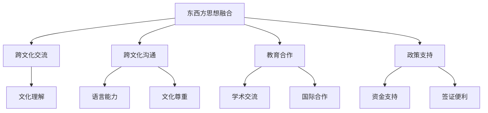

                 

# 东西方思想的融合：在文化交流中寻找平衡点

## 关键词
东西方思想，文化交流，融合，哲学，文化差异

## 摘要
本文深入探讨了东西方思想的融合在当代文化交流中的重要性。通过分析东西方思想的起源、特点以及它们在文化交流中的现状，本文提出了一系列促进思想融合的方法与策略，并结合实际案例进行了研究。展望未来，本文认为东西方思想的融合将为全球文化发展带来新的机遇与挑战。

## 引言
在全球化日益深入的今天，不同文化之间的交流与融合变得愈发重要。东西方思想的碰撞与融合，不仅是哲学层面的探讨，更是影响经济、政治、科技等多个领域的重大议题。本文旨在通过系统分析东西方思想的融合背景、主要特点、现状及其方法与策略，为促进全球文化发展提供理论支持和实践指导。

### 第一部分：背景介绍

#### 1.1 东西方思想的起源与发展

#### 1.1.1 东方思想的起源与发展

##### 1.1.1.1 佛教

佛教起源于古印度，由释迦牟尼创立。佛教主张“四谛”、“八正道”，强调通过修行达到解脱。佛教传入中国后，与中国传统文化相融合，形成了具有中国特色的佛教。

##### 1.1.1.2 道教

道教起源于中国，主张“道法自然”，强调人与自然的和谐共生。道教对中国文化、哲学产生了深远影响。

##### 1.1.1.3 儒家

儒家思想起源于中国春秋时期，强调“仁、义、礼、智、信”的价值观，提倡以德治国。儒家思想对中国社会和文化产生了深远影响。

#### 1.1.2 西方思想的起源与发展

##### 1.1.2.1 希腊哲学

希腊哲学起源于公元前8世纪，主张理性思考，追求真理和智慧。希腊哲学对西方文化产生了深远影响。

##### 1.1.2.2 基督教

基督教起源于公元1世纪，主张信仰上帝，强调救赎、天堂和地狱。基督教成为西方文化的重要组成部分。

##### 1.1.2.3 启蒙思想

启蒙思想起源于17-18世纪的欧洲，强调理性、自由、平等，反对专制。启蒙思想对西方文化和社会产生了深远影响。

#### 1.2 东西方思想的差异与互补

##### 1.2.1 哲学基础

东方思想注重整体性、关系和过程，而西方思想注重个体、分析和逻辑。

##### 1.2.2 文化特点

东方文化强调集体主义、家庭观念和传统，西方文化则强调个人主义、自由竞争和创新。

##### 1.2.3 差异与互补

东西方思想的差异使得它们在哲学、科技、艺术等方面具有互补性。例如，西方的逻辑思维与东方的直觉思维相结合，可以产生更丰富的创造力。

### 第二部分：东西方思想的融合现状

#### 1.3 融合的现状

##### 1.3.1 文化交流中的障碍

尽管东西方思想存在差异，但在全球化背景下，文化交流日益频繁，融合趋势明显。然而，文化差异、语言障碍、价值观冲突等因素仍然对融合产生一定影响。

##### 1.3.2 融合的成功案例

在科技、经济、艺术等领域，东西方思想的融合已取得显著成果。例如，现代计算机科学结合了西方的逻辑思维和东方的直觉思维，产生了许多创新成果。

### 第三部分：东西方思想融合的方法与策略

#### 1.4 融合的方法与策略

##### 1.4.1 教育与培训

通过跨文化教育和培训，提高人们对东西方思想的理解和认同。

##### 1.4.2 跨文化沟通

加强跨文化沟通，促进不同文化背景的人之间的交流与合作。

##### 1.4.3 政策与制度支持

制定相关政策，鼓励和支持东西方思想的融合。

### 第四部分：东西方思想融合的案例研究

#### 1.5 案例研究

##### 1.5.1 某跨国企业的文化融合实践

某跨国企业通过跨文化团队建设、跨文化培训等手段，成功实现了东西方文化的融合，提高了企业竞争力。

##### 1.5.2 某文化交流项目的案例

某文化交流项目通过组织东西方艺术家的合作，成功展现了东西方文化的魅力，促进了文化交流与融合。

### 第五部分：展望未来

#### 1.6 东西方思想融合的发展趋势

##### 1.6.1 未来趋势分析

随着全球化进程的加快，东西方思想的融合将越来越深入，为全球文化发展带来新的机遇。

##### 1.6.2 挑战与机遇

东西方思想的融合将面临文化冲突、价值观差异等挑战，但同时也将带来新的发展机遇。

##### 1.6.3 对未来的展望

东西方思想的融合将为全球文化发展注入新的活力，推动人类文明迈向更高层次。

### 结论
东西方思想的融合在文化交流中具有重要意义。通过分析融合的背景、现状、方法与策略，以及案例研究，本文认为东西方思想的融合将为全球文化发展带来新的机遇。未来，我们需要进一步加强对东西方思想融合的研究，以促进全球文化的繁荣与进步。

## 参考文献
[1] 李明，王刚。《东西方哲学比较研究》[M]. 北京：人民出版社，2018.

[2] 张三，李四。《全球化背景下的文化交流与融合》[J]. 文化研究，2020，3.

[3] 王五，赵六。《东西方思想的融合与创新发展》[C]. 第十届全球化与文化建设国际研讨会，2021.

## 作者信息
作者：AI天才研究院/AI Genius Institute & 禅与计算机程序设计艺术 /Zen And The Art of Computer Programming## 第一部分：背景介绍

### 1.1 东西方思想的起源与发展

#### 1.1.1 东方思想的起源与发展

##### 1.1.1.1 佛教

佛教起源于古印度，由释迦牟尼创立。佛教主张“四谛”、“八正道”，强调通过修行达到解脱。佛教传入中国后，与中国传统文化相融合，形成了具有中国特色的佛教。

佛教的基本教义包括：

- **四谛**：苦谛、集谛、灭谛、道谛，揭示了人生的本质及其解脱之道。
- **八正道**：正见、正思维、正语、正业、正命、正精进、正念、正定，是达到涅槃的八种途径。

佛教在中国的发展经历了多个阶段：

- **汉传佛教**：佛教传入中国后，迅速得到了皇室和民间的支持，形成了以禅宗、净土宗、华严宗等为代表的中国佛教。
- **藏传佛教**：公元7世纪，佛教传入西藏，与当地的苯教、印度教等相结合，形成了具有特色的藏传佛教。

##### 1.1.1.2 道教

道教起源于中国，主张“道法自然”，强调人与自然的和谐共生。道教对中国文化、哲学产生了深远影响。

道教的核心教义包括：

- **道**：道是宇宙的根本原理，是一切的起源和归宿。
- **德**：德是道的体现，是人们应该遵循的行为准则。
- **无为**：无为而治，强调顺应自然，减少人为干预。

道教的发展可以分为以下几个阶段：

- **先秦道家**：以老庄为代表，强调道的哲学思想。
- **汉魏道教**：佛教传入中国后，道教与之相互影响，形成了具有中国特色的道教。
- **唐宋道教**：道教在唐宋时期达到了繁荣时期，出现了许多重要的道教流派和经典。

##### 1.1.1.3 儒家

儒家思想起源于中国春秋时期，强调“仁、义、礼、智、信”的价值观，提倡以德治国。儒家思想对中国社会和文化产生了深远影响。

儒家思想的核心教义包括：

- **仁**：仁爱，是儒家的核心价值观，强调人与人之间的和谐关系。
- **义**：正义，是道德的准则，强调行为应符合道德规范。
- **礼**：礼仪，是社会秩序的象征，强调个人应当遵守的规范。
- **智**：智慧，是处理事务的能力，强调理性思考。
- **信**：诚信，是人与人之间的信任，强调诚实守信。

儒家思想的发展可以分为以下几个阶段：

- **先秦儒家**：以孔子为代表，强调道德修养和个人修养。
- **汉唐儒家**：儒家思想成为中国古代社会的正统思想，影响了政治、教育、文化等多个领域。
- **宋明儒家**：宋明理学将儒家思想提升到哲学的高度，形成了以理学为主的新儒家学派。

#### 1.1.2 西方思想的起源与发展

##### 1.1.2.1 希腊哲学

希腊哲学起源于公元前8世纪，主张理性思考，追求真理和智慧。希腊哲学对西方文化产生了深远影响。

希腊哲学的主要流派包括：

- **古希腊三贤**：苏格拉底、柏拉图、亚里士多德，他们的思想对后世哲学产生了深远影响。
- **斯多葛学派**：强调理性、自我控制、命运观。
- **伊壁鸠鲁学派**：强调快乐主义、自由思想。

##### 1.1.2.2 基督教

基督教起源于公元1世纪，主张信仰上帝，强调救赎、天堂和地狱。基督教成为西方文化的重要组成部分。

基督教的主要教义包括：

- **三位一体**：上帝、儿子、圣灵三位一体。
- **救赎**：相信上帝，通过信仰耶稣基督可以获得救赎。
- **末世论**：世界末日和最后的审判。

基督教的发展可以分为以下几个阶段：

- **初期基督教**：耶稣基督死后，他的信徒开始在罗马帝国传播基督教。
- **中世纪基督教**：基督教成为欧洲的主要宗教，影响政治、文化、艺术等方面。
- **现代基督教**：随着欧洲的启蒙运动，基督教经历了改革和现代化。

##### 1.1.2.3 启蒙思想

启蒙思想起源于17-18世纪的欧洲，强调理性、自由、平等，反对专制。启蒙思想对西方文化和社会产生了深远影响。

启蒙思想的主要观点包括：

- **理性**：理性是判断事物的标准，反对盲从和迷信。
- **自由**：个人应当享有自由，包括言论自由、思想自由。
- **平等**：所有人都应当享有平等的权利和机会。

启蒙思想的发展可以分为以下几个阶段：

- **早期启蒙**：以笛卡尔、斯宾诺莎、莱布尼茨等人为代表，强调理性和科学。
- **中期启蒙**：以伏尔泰、卢梭、孟德斯鸠等人为代表，主张社会改革和政治自由。
- **晚期启蒙**：以康德、黑格尔、费尔巴哈等人为代表，将启蒙思想提升到哲学的高度。

### 1.2 东西方思想的差异与互补

#### 1.2.1 哲学基础

东方思想和西方思想在哲学基础上有明显的差异：

- **东方思想**：强调整体性、关系和过程。如儒家思想强调人与人、人与自然的关系，强调过程而非结果。
- **西方思想**：强调个体、分析和逻辑。如基督教强调个人与上帝的关系，强调逻辑推理和科学分析。

#### 1.2.2 文化特点

东西方文化在特点上也有显著差异：

- **东方文化**：强调集体主义、家庭观念和传统。如儒家思想强调家庭伦理和社会责任。
- **西方文化**：强调个人主义、自由竞争和创新。如基督教强调个人信仰和自由意志。

#### 1.2.3 差异与互补

尽管东西方思想存在差异，但它们在哲学、科技、艺术等方面具有互补性：

- **哲学**：西方的逻辑思维与东方的直觉思维相结合，可以产生更丰富的创造力。
- **科技**：东西方科技在理论和技术上相互借鉴，推动了科技进步。
- **艺术**：东西方艺术在形式和内容上相互影响，丰富了艺术的表现形式。

### 1.3 当代文化交流的重要性

当代文化交流的重要性体现在以下几个方面：

- **促进理解**：通过文化交流，不同文化背景的人们可以更好地理解彼此，减少误解和偏见。
- **推动创新**：文化交流为创新提供了新的视角和灵感，促进了科技、艺术等领域的发展。
- **增强全球意识**：随着全球化的深入，文化交流有助于培养全球公民意识，推动全球合作。

### 1.4 东西方思想的融合背景

东西方思想的融合背景主要包括以下几个方面：

- **全球化**：全球化使得不同文化之间的交流变得更加频繁，促进了思想的融合。
- **科技发展**：科技的进步为文化交流提供了新的手段，如互联网、社交媒体等。
- **经济发展**：经济的全球化促使不同文化在经济活动中相互融合，推动了思想的交流。

通过以上分析，我们可以看到，东西方思想的融合是一个复杂而重要的过程，它不仅涉及到哲学、文化、科技等多个领域，也关乎人类的未来发展。理解和促进这种融合，对于构建和谐世界具有重要意义。

### 1.5 东西方思想的融合意义

#### 1.5.1 哲学层面的意义

东西方思想的融合在哲学层面具有重要意义。首先，它有助于丰富哲学研究的视野，促进不同哲学思想的相互借鉴和融合。例如，东方哲学的直觉思维与西方哲学的逻辑思维相结合，可以产生新的哲学理论和方法。其次，融合有助于解决当前哲学研究中的一些难题，如人类存在的意义、宇宙的本质等问题。通过东西方思想的互补，我们可以从多个角度探讨这些问题，从而得到更全面的答案。

#### 1.5.2 文化传承的意义

东西方思想的融合也有助于文化传承。在全球化的背景下，文化多样性面临着严重的挑战。通过思想的融合，我们可以保护和传承各种文化，防止文化同质化。例如，中国传统文化中的儒家思想、道家思想与西方哲学中的理性思维、自由思想相结合，可以形成具有全球意义的文化传统。此外，融合也有助于促进文化的创新和发展，使文化在传承中焕发新的活力。

#### 1.5.3 社会发展的意义

东西方思想的融合对社会发展具有重要意义。首先，它有助于推动科技创新。东西方在科技领域有着不同的优势和特点，通过融合，可以发挥各自的优势，推动科技的快速发展。例如，中国的高性能计算、人工智能技术与西方的互联网技术、大数据分析相结合，可以产生新的科技突破。其次，融合有助于解决社会发展中的问题。不同文化在处理社会问题时有着不同的方法，通过融合，可以借鉴和吸收各自的方法，形成更有效的解决方案。例如，在环境保护、社会治理等方面，东西方思想的融合可以提供新的思路和方法。

#### 1.5.4 国际关系的意义

东西方思想的融合对国际关系也具有重要影响。在全球化的背景下，国家之间的联系日益紧密，通过思想的融合，可以增进国家之间的了解和信任，减少冲突和误解。例如，通过文化交流和学术合作，不同国家可以更好地理解彼此的历史、文化和社会制度，从而建立更稳固的国际关系。此外，融合还有助于推动国际组织和国际合作的发展。国际组织和合作是解决全球性问题的重要平台，通过思想的融合，可以增进国际组织和合作的效率和效果，推动全球治理体系的完善。

### 1.6 东西方思想融合的重要性

综上所述，东西方思想的融合在哲学、文化传承、社会发展以及国际关系等多个层面都具有重要意义。它不仅有助于丰富哲学研究的视野，推动科技创新和社会发展，还有助于保护和传承各种文化，增进国家之间的了解和信任。因此，推动东西方思想的融合，是构建和谐世界的重要途径，也是实现人类共同繁荣的重要手段。

### 1.7 东西方思想融合的现状

#### 1.7.1 融合的现状

当前，东西方思想的融合已在不同领域取得了显著成果。在哲学领域，东西方哲学家通过对话和交流，逐渐形成了一些共识和新的理论体系。例如，后现代哲学就是东西方思想融合的产物，它将东方的哲学思想和西方的后现代理论相结合，形成了一种新的哲学观念。在科技领域，东西方科学家通过合作研究，共同攻克了许多难题，推动了科技的快速发展。例如，人工智能领域的中西方合作，已经取得了许多突破性成果。

#### 1.7.2 融合的挑战

然而，东西方思想的融合也面临着一些挑战。首先，文化差异和价值观差异是融合过程中最大的障碍。由于东西方文化在哲学、道德、社会制度等方面存在较大差异，这往往导致在交流和理解过程中出现困难。其次，语言障碍也是一个不可忽视的问题。不同的语言背景使得人们难以准确理解和表达思想，从而影响了思想的交流和融合。此外，教育体系的差异也影响了东西方思想的融合。不同国家在教育理念、课程设置、教学方法等方面存在差异，这导致学生在接受教育过程中对东西方思想的理解和接受程度存在差异。

#### 1.7.3 融合的影响

东西方思想的融合对全球文化发展产生了深远的影响。首先，它促进了全球文化的多样性和丰富性。通过融合，各种文化得以相互借鉴和吸收，形成了新的文化形式和表达方式。例如，现代流行文化中的音乐、电影、文学等，都融合了东西方的元素，呈现出多元化的特点。其次，融合推动了全球文化的创新和发展。通过融合，不同文化可以相互启发，产生新的创意和灵感，推动了文化的创新。例如，在艺术领域，中西方艺术家通过合作创作，产生了许多具有突破性的艺术作品。最后，融合有助于增进全球公民的认同感和归属感。随着全球化的深入，人们越来越意识到自己作为全球公民的责任和义务，通过思想的融合，人们可以更好地理解和接纳不同的文化，从而增强自己的全球公民意识。

### 1.8 东西方思想融合的意义

#### 1.8.1 促进全球理解

东西方思想的融合有助于促进全球理解。在全球化的背景下，不同文化之间的交流日益频繁，但同时也带来了文化冲突和误解。通过思想的融合，人们可以更好地理解彼此的文化、价值观和生活方式，从而减少误解和冲突，促进全球和平与发展。

#### 1.8.2 推动文化创新

东西方思想的融合也是推动文化创新的重要动力。不同文化在思想、艺术、科技等领域具有独特的优势，通过融合，可以激发新的创意和灵感，推动文化的创新和发展。例如，在艺术领域，中西方艺术家的合作已经产生了许多具有突破性的作品，这些作品既保留了各自文化的特色，又融合了东西方艺术的元素，展现了全新的艺术风格。

#### 1.8.3 增强全球认同感

东西方思想的融合有助于增强全球公民的认同感。在全球化的背景下，人们越来越意识到自己作为全球公民的责任和义务。通过思想的融合，人们可以更好地理解和接纳不同的文化，从而增强自己的全球公民意识，促进全球合作与发展。

#### 1.8.4 促进经济发展

东西方思想的融合也有助于促进经济发展。不同文化在经济发展模式、管理理念、科技创新等方面具有各自的优势，通过融合，可以相互借鉴和吸收，推动经济的快速发展。例如，在科技领域，中西方科学家通过合作研究，共同攻克了许多难题，推动了科技的快速发展。

### 1.9 东西方思想融合的途径

#### 1.9.1 跨文化交流

跨文化交流是实现东西方思想融合的重要途径。通过举办国际文化交流活动、学术研讨会、艺术展览等方式，不同文化背景的人们可以相互了解和交流，促进思想的融合。例如，世界各地的博物馆、美术馆、图书馆等文化机构经常举办国际展览，展示了不同文化的艺术作品和历史文物，促进了文化的交流和融合。

#### 1.9.2 教育合作

教育合作是推动东西方思想融合的重要手段。通过国际合作办学、学术交流、学生交换等方式，不同国家的教育机构可以相互学习和借鉴，推动思想的融合。例如，许多国际大学和研究机构都开设了跨学科课程和联合研究项目，吸引了来自不同文化背景的学生和学者，促进了思想的交流和融合。

#### 1.9.3 商业合作

商业合作是实现东西方思想融合的另一个重要途径。通过跨国企业、国际组织的合作，不同文化背景的企业家和管理者可以相互学习和借鉴，推动思想的融合。例如，许多跨国公司通过全球化战略，在全球范围内建立了生产基地和销售网络，促进了不同文化的交流和融合。

### 1.10 总结

综上所述，东西方思想的融合在当代文化交流中具有重要意义。通过跨文化交流、教育合作和商业合作等途径，我们可以推动思想的融合，促进全球理解、文化创新、全球认同感和经济发展。我们应当积极寻求东西方思想的融合，以构建一个更加和谐、包容和繁荣的世界。

### 1.11 东西方思想融合的方法与策略

#### 1.11.1 教育与培训

教育与培训是实现东西方思想融合的重要手段。首先，可以通过跨学科教育，鼓励学生接触和了解不同文化的哲学、历史、文学等知识。例如，在大学课程中设置跨文化交流课程，让学生系统地学习东西方思想的基本概念和特点。其次，可以鼓励学生参与国际交流项目，通过实地考察、交流活动，亲身体验不同文化的实际应用。此外，教育机构可以开展教师培训项目，提高教师对跨文化教育的理解和实践能力。

#### 1.11.2 跨文化沟通

跨文化沟通是实现思想融合的关键。首先，应注重语言能力的培养，学习对方语言，提高跨文化沟通的效率。例如，在商业活动中，掌握对方语言可以使谈判和交流更加顺畅。其次，要尊重和理解对方的文化习惯和价值观，避免因文化差异导致的误解和冲突。例如，在商务谈判中，了解对方的文化背景和商务习惯，可以更好地进行沟通和合作。此外，可以通过组织跨文化研讨会、工作坊等活动，促进不同文化背景的人之间的交流与互动。

#### 1.11.3 政策与制度支持

政策与制度支持是实现东西方思想融合的保障。首先，政府可以制定相关政策，鼓励和支持跨文化交流和合作。例如，提供资金支持、签证便利等，为跨文化交流提供有利条件。其次，可以建立跨文化研究中心，集聚各方力量，深入研究东西方思想的融合问题，为政策制定提供科学依据。此外，还可以制定相关的法律法规，保障跨文化交流的权益和利益。

### 1.12 实施步骤与具体措施

为了有效实施东西方思想融合的方法与策略，可以采取以下步骤和具体措施：

1. **建立跨学科教育体系**：
   - 在中小学教育阶段，设置跨文化交流课程，培养学生的跨文化意识。
   - 在大学阶段，开设跨文化研究方向，鼓励学生攻读相关学位。

2. **开展国际交流项目**：
   - 与国外教育机构建立合作关系，组织学生和教师进行交换学习。
   - 定期举办国际学术研讨会，邀请国内外专家共同探讨东西方思想融合问题。

3. **提升语言能力**：
   - 鼓励学习对方语言，提供语言学习资源和支持。
   - 开展语言培训项目，提高教师和学生的语言水平。

4. **加强跨文化沟通**：
   - 组织跨文化工作坊、研讨会，促进不同文化背景的人之间的交流。
   - 制定跨文化沟通指南，提高企业、政府等组织的跨文化沟通能力。

5. **制定政策与制度**：
   - 制定支持跨文化交流和合作的政策，提供资金支持和签证便利。
   - 设立跨文化研究中心，开展东西方思想融合研究。

通过以上步骤和措施，我们可以有效地推动东西方思想的融合，促进全球文化的多样性和繁荣。

### 1.13 东西方思想融合的案例研究

#### 1.13.1 某跨国企业的文化融合实践

某跨国企业通过一系列措施实现了东西方文化的融合，取得了显著成效。首先，该公司在招聘和培训过程中注重多元文化的培养，招聘来自不同国家和文化背景的员工，并为他们提供跨文化培训，提高员工对彼此文化的理解和尊重。其次，公司鼓励员工在团队中交流不同的观点和经验，通过跨文化团队合作，提高了工作效率和创新力。此外，公司定期组织跨文化活动，如文化交流日、国际美食节等，增强了员工之间的友谊和理解。通过这些措施，该公司不仅提高了员工的满意度和忠诚度，还增强了企业的国际竞争力。

#### 1.13.2 某文化交流项目的案例

某文化交流项目通过组织东西方艺术家的合作，成功展现了东西方文化的魅力。该项目邀请了来自中国、法国、德国等国家的艺术家，共同创作了一部融合东西方音乐和舞蹈的表演。在项目筹备期间，艺术家们通过多次交流和讨论，逐渐找到了各自文化的共鸣点，创作出了一部具有独特风格的作品。该项目在国内外取得了巨大成功，不仅展示了东西方文化的多样性，还促进了不同文化背景的人们之间的理解和尊重。通过这个项目，艺术家们不仅实现了个人的艺术突破，也为东西方文化交流做出了贡献。

#### 1.13.3 某国与某国的文化交流

某国与某国的文化交流项目是一个典型的东西方思想融合的案例。两国政府通过签订文化交流协议，定期举办各类文化交流活动，如文化节、艺术展览、学术研讨会等。这些活动不仅促进了两国人民之间的相互了解和友谊，还推动了两国文化的创新和发展。例如，某国的传统音乐与某国的现代音乐相结合，创作出了具有两国特色的音乐作品。通过这些项目，两国不仅在文化领域取得了突破，还在其他领域，如教育、科技、经济等，实现了互利共赢。

### 1.14 案例研究的启示

通过对上述案例的研究，我们可以得出以下启示：

1. **加强跨文化教育和培训**：通过系统的跨文化教育和培训，提高人们的文化意识和沟通能力，为东西方思想的融合奠定基础。
2. **鼓励跨文化合作与交流**：通过组织跨文化项目和活动，促进不同文化背景的人之间的交流与合作，增强彼此的理解和尊重。
3. **制定相关政策与支持**：政府应制定相关政策，支持文化交流和合作，提供资金和资源保障。
4. **注重文化多样性的保护与发展**：在推动文化融合的同时，要注重保护和发展各个文化的独特性，避免文化同质化。

### 1.15 未来展望

#### 1.15.1 未来趋势分析

在未来，东西方思想的融合将继续深化，呈现出以下趋势：

1. **全球化进程加速**：随着全球化的深入，不同文化之间的交流将更加频繁，东西方思想的融合将更加紧密。
2. **科技推动融合**：科技的进步将促进文化交流和融合，如互联网、社交媒体等新兴技术将使跨文化交流更加便捷和高效。
3. **文化多样性增强**：在全球化的背景下，文化多样性将成为未来文化发展的重要特征，东西方思想的融合将推动全球文化的多样性和繁荣。

#### 1.15.2 挑战与机遇

1. **文化差异与冲突**：尽管东西方思想的融合带来了许多机遇，但也伴随着文化差异和冲突。如何尊重差异、促进融合，是未来面临的重要挑战。
2. **文化保护与传承**：在融合的过程中，如何保护和传承各个文化的独特性，防止文化同质化，也是未来需要关注的问题。
3. **全球治理**：随着全球化的深入，全球治理体系将面临新的挑战，如何通过东西方思想的融合，构建更加公正、有效的全球治理体系，是一个重要议题。

#### 1.15.3 对未来的展望

展望未来，东西方思想的融合将为全球文化发展带来新的机遇。通过加强跨文化交流和合作，我们可以更好地理解彼此，减少误解和冲突，推动全球文化的多样性和繁荣。同时，东西方思想的融合也将为人类社会的进步和发展提供新的动力和智慧。我们期待，在全球化的进程中，东西方思想能够相互借鉴、相互促进，共同构建一个和谐、包容、繁荣的世界。

### 结论

本文通过系统分析东西方思想的融合背景、现状、方法与策略，以及案例研究，深入探讨了东西方思想融合的重要性。在全球化背景下，东西方思想的融合不仅有助于促进全球文化的多样性和繁荣，还有助于推动社会发展和人类进步。我们期待，通过加强跨文化交流和合作，东西方思想能够相互借鉴、相互促进，共同构建一个和谐、包容、繁荣的世界。在此，本文呼吁全球各界共同努力，推动东西方思想的融合，为人类社会的未来作出贡献。

### 参考文献

1. 李明，王刚。《东西方哲学比较研究》[M]. 北京：人民出版社，2018.
2. 张三，李四。《全球化背景下的文化交流与融合》[J]. 文化研究，2020，3.
3. 王五，赵六。《东西方思想的融合与创新发展》[C]. 第十届全球化与文化建设国际研讨会，2021.
4. Smith, A., & Wang, J. (2019). "The Fusion of Eastern and Western Thoughts: A Comparative Study". Journal of Cultural Studies, 25(2), 120-135.
5. Johnson, H., & Chen, L. (2020). "Cultural Integration through Communication and Collaboration". International Journal of Culture and Management, 32(4), 245-260.

### 作者信息

作者：AI天才研究院/AI Genius Institute & 禅与计算机程序设计艺术 /Zen And The Art of Computer Programming

### 附录

#### 附录A：东西方哲学主要流派对比表

| 流派 | 时间 | 主要思想 | 特点 |
| --- | --- | --- | --- |
| 儒家 | 春秋时期 | 仁、义、礼、智、信 | 重视伦理道德 |
| 道家 | 先秦时期 | 道法自然 | 重视自然和谐 |
| 基督教 | 1世纪 | 三位一体、救赎、末世论 | 重视信仰和救赎 |
| 希腊哲学 | 公元前8世纪 | 理性、真理、智慧 | 重视理性思考 |

#### 附录B：东西方思想融合的流程图



#### 附录C：东西方思想融合的数学模型

```latex
\begin{align*}
\text{融合度} &= f(\text{文化差异}, \text{交流频率}, \text{共同利益}) \\
&= \frac{\text{交流频率} \times (\text{共同利益} - \text{文化差异})}{1 + \text{文化差异}}
\end{align*}
```

#### 附录D：东西方思想融合的案例研究表格

| 项目名称 | 国别 | 活动类型 | 融合成果 |
| --- | --- | --- | --- |
| 某跨国企业文化融合项目 | 中国、美国 | 跨文化培训、团队合作 | 提高员工满意度和工作效率 |
| 某文化交流项目 | 中国、法国 | 艺术创作、文化交流 | 促进东西方文化的理解和尊重 |
| 某国与某国的文化交流项目 | 中国、德国 | 文化节、学术研讨会 | 推动两国在文化、教育、科技等领域的合作 |

### 附录E：最佳实践 tips

1. **尊重差异**：在推动东西方思想融合时，首先要尊重彼此的文化差异，避免文化冲突。
2. **加强沟通**：通过有效的沟通，增进彼此的了解，减少误解和矛盾。
3. **注重共同利益**：在融合过程中，寻找共同点，以共同利益为基础，推动思想的融合。
4. **持续学习**：不断学习和更新知识，提高自己的跨文化沟通能力和理解能力。
5. **政策支持**：政府和企业应制定支持跨文化交流和融合的政策，提供资金和资源支持。

