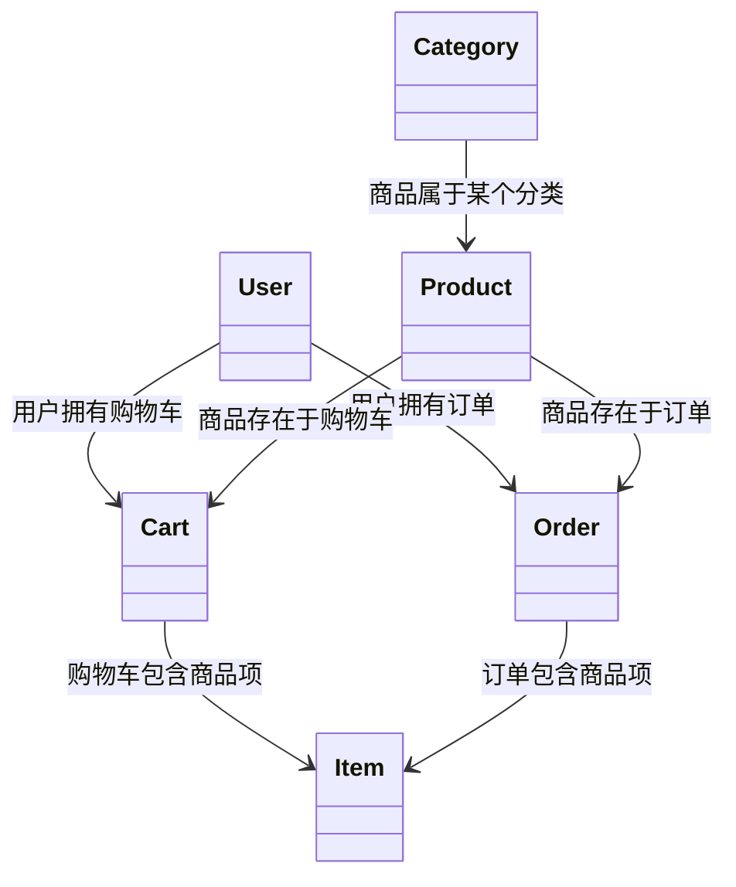
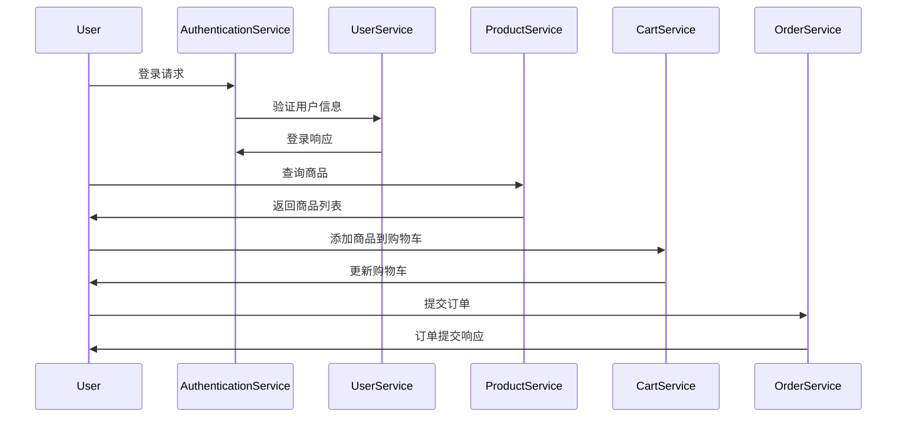
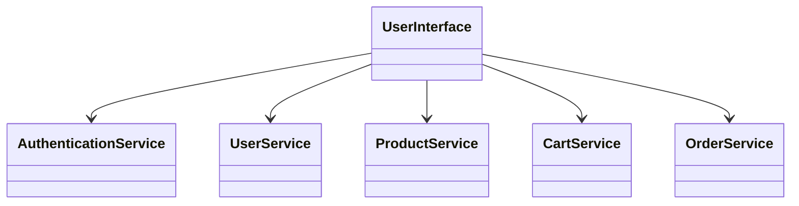
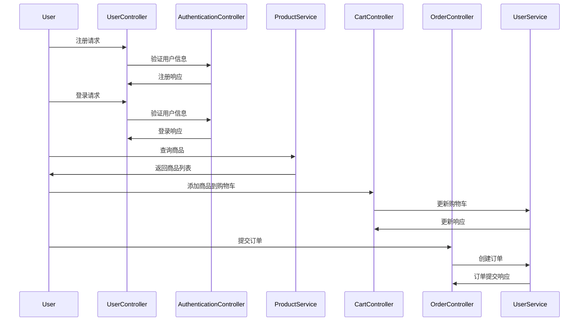
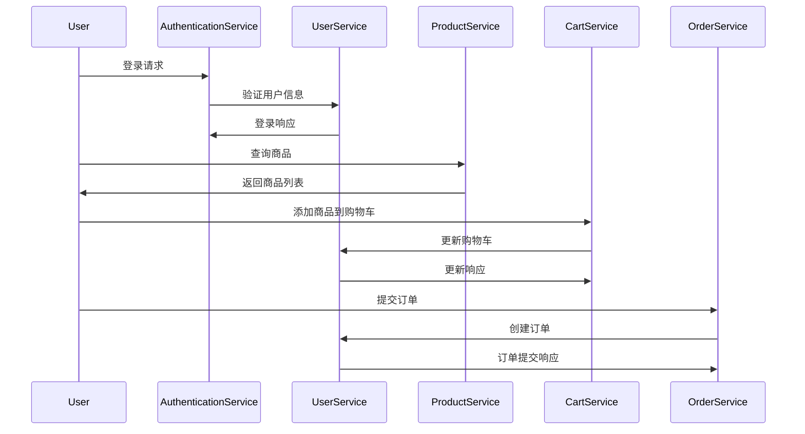

                 


**Step 1: 引言**

# 引言

事件驱动架构是现代软件系统设计中的一种关键模式，它通过事件来触发系统的响应，实现了模块间的高效通信和协同工作。在本文中，我们将深入探讨事件驱动架构的核心原理、设计模式以及其在工程实践中的应用。

## 1.1 问题背景

随着软件系统规模的不断扩大和复杂性的增加，传统的请求-响应式架构逐渐暴露出其局限性。在这种架构中，模块间的交互依赖于明确的请求和响应机制，导致系统的扩展性和可维护性较差。为了解决这一问题，事件驱动架构应运而生，它通过事件来解耦模块之间的依赖，提高了系统的响应速度和灵活性。

### 1.1.1 问题描述

在传统的请求-响应式架构中，当一个请求被发送到系统中时，系统会按照既定的流程进行处理，并最终返回响应。这种方式虽然简单直观，但在系统复杂度较高时，容易出现以下问题：

- **耦合度较高**：模块之间的依赖关系较为紧密，修改一个模块可能会影响到其他模块的功能。
- **响应速度较慢**：请求需要经过多个模块的处理，导致整个系统的响应速度变慢。
- **可维护性较差**：随着系统规模的扩大，代码的复杂度也会增加，使得维护和扩展变得更加困难。

### 1.1.2 问题解决

事件驱动架构通过引入事件机制，解决了传统请求-响应式架构中的上述问题。在事件驱动架构中，系统中的各个模块通过事件来进行通信，每个模块只需关注它所关心的事件，而无需了解其他模块的细节。这种方式实现了模块间的高效解耦，提高了系统的扩展性和可维护性。

### 1.1.3 边界与外延

事件驱动架构的边界在于如何定义和管理事件，以及如何实现模块间的事件通信。事件驱动架构的外延包括事件发布-订阅模式、事件总线模式以及事件驱动微服务架构等。

## 1.2 核心概念

### 1.2.1 事件

事件是事件驱动架构中的核心概念，它表示系统中的某种状态或行为的变化。事件可以由系统内部生成，也可以由外部系统或用户触发。

### 1.2.2 事件源

事件源是指能够生成事件的实体，可以是系统内部的组件，也可以是外部系统或用户。事件源负责监听外部事件，并在特定条件下生成事件。

### 1.2.3 事件处理器

事件处理器是指负责处理事件的组件，它接收事件并对其进行相应的处理。事件处理器可以根据事件的类型和内容，执行不同的操作。

## 1.3 概念属性特征对比表格

| 特征            | 事件驱动架构             | 请求-响应式架构             |
|-----------------|--------------------------|-----------------------------|
| 通信方式        | 事件发布-订阅模式        | 请求-响应模式               |
| 模块解耦        | 高度解耦                 | 较低解耦                   |
| 响应速度        | 较快                     | 较慢                       |
| 可维护性        | 较高                     | 较低                       |

## 1.4 ER实体关系图架构

下面是事件驱动架构中主要实体的ER图：

```mermaid
erDiagram
  Event ||--o{ EventProcessor : 处理}
  EventSource ||--o{ EventProcessor : 发布}
```

## 1.5 本章小结

本章介绍了事件驱动架构的核心概念、问题背景以及与传统请求-响应式架构的对比。通过本章的学习，读者可以初步了解事件驱动架构的优势和应用场景，为后续章节的深入探讨打下基础。

----------------------------------------------------------------

**Step 2: 核心概念与联系**

# 第二部分: 核心概念与联系

## 第2章: 事件驱动架构的核心概念与联系

在本章节中，我们将深入探讨事件驱动架构中的核心概念，并分析它们之间的联系。

### 2.1 事件

事件是事件驱动架构中最基础的概念。它可以理解为系统中某种状态或行为的改变。事件可以是任何形式的数据，如字符串、对象、JSON等。事件通常由事件源生成，然后由事件处理器进行处理。

#### 2.1.1 事件生成与传递

事件生成通常由系统中的某个组件完成，这个组件被称为事件源。事件源在满足特定条件时，生成一个事件并将其发布到系统中。事件在系统中通过事件总线或其他通信机制进行传递，最终到达事件处理器进行处理。

#### 2.1.2 事件处理器的工作原理

事件处理器是接收并处理事件的组件。当一个事件被传递到事件处理器时，它会根据事件的类型和内容执行相应的操作。事件处理器可以是独立的模块，也可以是系统中的某个组件。

### 2.2 事件源

事件源是能够生成事件的实体。事件源可以是系统中的某个组件、外部系统或用户。事件源在满足特定条件时，生成一个事件并将其发布到系统中。

#### 2.2.1 事件源的种类

- **内部事件源**：由系统内部的组件生成的事件源，如数据库更新、系统错误等。
- **外部事件源**：由外部系统或用户生成的事件源，如HTTP请求、消息队列消息等。

#### 2.2.2 事件源的工作原理

事件源在满足特定条件时，会生成一个事件。事件源通常会监听外部事件或系统状态的变化，并在这些事件或变化发生时生成事件。

### 2.3 事件处理器

事件处理器是负责处理事件的组件。事件处理器接收事件，并根据事件的类型和内容执行相应的操作。

#### 2.3.1 事件处理器的工作原理

事件处理器在接收到事件后，会根据事件的类型和内容执行相应的操作。事件处理器可以是独立的模块，也可以是系统中的某个组件。

#### 2.3.2 事件处理器的种类

- **通用事件处理器**：可以处理多种类型的事件。
- **专用事件处理器**：只能处理特定类型的事件。

### 2.4 事件总线

事件总线是事件驱动架构中的核心组件，它负责在系统中的各个事件源和事件处理器之间传递事件。

#### 2.4.1 事件总线的功能

- **事件传递**：事件总线负责将事件从事件源传递到事件处理器。
- **事件订阅**：事件总线允许事件处理器订阅特定类型的事件，以便在接收到事件时进行相应的处理。

#### 2.4.2 事件总线的实现方式

- **基于消息队列**：事件总线可以使用消息队列来实现，如RabbitMQ、Kafka等。
- **基于事件通道**：事件总线可以使用事件通道来实现，如Event Bus、Event Grid等。

### 2.5 概念属性特征对比表格

| 特征            | 事件驱动架构             | 请求-响应式架构             |
|-----------------|--------------------------|-----------------------------|
| 通信方式        | 事件发布-订阅模式        | 请求-响应模式               |
| 模块解耦        | 高度解耦                 | 较低解耦                   |
| 响应速度        | 较快                     | 较慢                       |
| 可维护性        | 较高                     | 较低                       |

### 2.6 ER实体关系图架构

下面是事件驱动架构中主要实体的ER图：

```mermaid
erDiagram
  Event ||--o{ EventProcessor : 处理}
  EventSource ||--o{ EventProcessor : 发布}
  EventBus ||--o{ Event : 传递}
```

## 2.7 本章小结

本章介绍了事件驱动架构中的核心概念，包括事件、事件源、事件处理器和事件总线，并分析了它们之间的联系。通过本章的学习，读者可以深入理解事件驱动架构的基本原理和设计模式，为后续章节的深入探讨打下基础。

----------------------------------------------------------------

**Step 3: 设计模式**

# 第三部分: 设计模式

## 第3章: 事件驱动架构中的设计模式

事件驱动架构在软件设计领域具有广泛的应用，为了更好地实现其优势，我们需要掌握一些关键设计模式。这些设计模式不仅有助于我们构建灵活和可扩展的系统，还可以提高代码的可读性和可维护性。在本章节中，我们将介绍几种常见的事件驱动架构设计模式。

### 3.1 事件发布-订阅模式

事件发布-订阅模式（Publish-Subscribe Pattern）是事件驱动架构中最基础的模式之一。在这种模式中，存在两个主要角色：发布者和订阅者。发布者负责生成和发布事件，而订阅者则负责监听和响应这些事件。

#### 3.1.1 模式原理

- **发布者**：发布者是系统中的一个组件，它在满足特定条件时生成事件，并发布到事件总线或消息队列上。
- **订阅者**：订阅者也是系统中的一个组件，它订阅了特定类型的事件，并在接收到这些事件时执行相应的处理逻辑。

#### 3.1.2 实现方式

- **基于消息队列**：可以使用如RabbitMQ、Kafka等消息队列来实现事件发布-订阅模式。
- **基于事件总线**：可以使用如Event Bus、Event Grid等事件总线框架来实现事件发布-订阅模式。

#### 3.1.3 模式优势

- **解耦**：发布者和订阅者之间解耦，使得系统的可扩展性和可维护性大大提高。
- **灵活**：订阅者可以根据需求订阅不同的类型的事件，提高了系统的灵活性。

### 3.2 事件总线模式

事件总线模式（Event Bus Pattern）是事件驱动架构中的一种核心模式。事件总线是一个中央通信枢纽，负责在系统中的各个组件之间传递事件。

#### 3.2.1 模式原理

- **事件总线**：事件总线是一个全局的事件传递机制，它允许组件之间通过发布和订阅事件进行通信。
- **发布-订阅**：事件总线采用了事件发布-订阅模式，使得组件之间可以通过事件进行松耦合的通信。

#### 3.2.2 实现方式

- **基于消息队列**：可以使用如RabbitMQ、Kafka等消息队列来实现事件总线。
- **基于事件通道**：可以使用如Event Bus、Event Grid等事件总线框架来实现事件总线。

#### 3.2.3 模式优势

- **集中管理**：事件总线集中管理事件，使得系统中的组件可以更方便地进行通信。
- **高效传输**：事件总线通过高效的消息传递机制，实现了组件之间的快速通信。

### 3.3 事件驱动微服务架构

事件驱动微服务架构（Event-Driven Microservices Architecture）是一种基于事件驱动架构的微服务设计模式。在这种模式中，各个微服务通过事件进行通信和协同工作。

#### 3.3.1 模式原理

- **微服务**：微服务是一种轻量级的软件架构，它将系统分解为多个独立的、可部署的服务单元。
- **事件驱动**：微服务之间通过事件进行通信，每个微服务可以发布和订阅事件。

#### 3.3.2 实现方式

- **基于消息队列**：可以使用如RabbitMQ、Kafka等消息队列来实现事件驱动微服务架构。
- **基于事件总线**：可以使用如Event Bus、Event Grid等事件总线框架来实现事件驱动微服务架构。

#### 3.3.3 模式优势

- **高可扩展性**：事件驱动微服务架构使得系统可以灵活地扩展和升级。
- **高可维护性**：每个微服务都是独立的，使得系统的维护和升级更加容易。

### 3.4 概念属性特征对比表格

| 模式              | 事件发布-订阅模式       | 事件总线模式       | 事件驱动微服务架构       |
|-------------------|------------------------|-------------------|--------------------------|
| 通信方式          | 发布-订阅模式          | 事件总线          | 微服务之间的事件通信     |
| 模块解耦          | 高度解耦               | 高度解耦          | 高度解耦                 |
| 响应速度          | 较快                   | 较快              | 较快                     |
| 可维护性          | 较高                   | 较高              | 较高                     |

### 3.5 ER实体关系图架构

下面是事件驱动架构中几种设计模式的ER图：

```mermaid
erDiagram
  Publisher ||--o{ EventBus : 发布}
  Subscriber ||--o{ EventBus : 订阅}
  ServiceA ||--o{ EventBus : 发布/订阅}
  ServiceB ||--o{ EventBus : 发布/订阅}
```

## 3.6 本章小结

本章介绍了事件驱动架构中的几种关键设计模式，包括事件发布-订阅模式、事件总线模式以及事件驱动微服务架构。通过这些设计模式，我们可以更好地理解和实现事件驱动架构的优势。本章内容为后续章节的深入探讨提供了坚实的基础。

----------------------------------------------------------------

**Step 4: 算法原理**

# 第四部分: 算法原理

## 第4章: 事件驱动架构中的算法原理

事件驱动架构在系统设计和实现中起着至关重要的作用。在本章节中，我们将探讨事件驱动架构中的核心算法原理，以及如何使用Python源代码来展示和解释这些原理。

### 4.1 事件生成与传递算法

事件生成与传递是事件驱动架构中的基础。一个系统中的事件生成通常依赖于特定的条件或触发器，而事件的传递则依赖于事件总线和事件处理器。

#### 4.1.1 事件生成算法

事件生成的算法通常是一个条件判断逻辑。以下是一个简单的Python代码示例，用于生成一个简单的事件：

```python
class Event:
    def __init__(self, type, data):
        self.type = type
        self.data = data

def generate_event(condition):
    if condition:
        return Event("user_logged_in", {"username": "alice"})
    return None

# 假设条件为用户登录成功
event = generate_event(True)
print(event.type)  # 输出: user_logged_in
print(event.data)  # 输出: {'username': 'alice'}
```

#### 4.1.2 事件传递算法

事件传递算法通常依赖于事件总线和事件处理器。事件总线负责将事件从一个组件传递到另一个组件。以下是一个简单的Python代码示例，用于实现一个简单的事件总线：

```python
class EventBus:
    def __init__(self):
        self.subscribers = {}

    def subscribe(self, event_type, callback):
        if event_type not in self.subscribers:
            self.subscribers[event_type] = []
        self.subscribers[event_type].append(callback)

    def publish(self, event):
        if event.type in self.subscribers:
            for callback in self.subscribers[event.type]:
                callback(event)

def on_login(event):
    print(f"User {event.data['username']} has logged in.")

event_bus = EventBus()
event_bus.subscribe("user_logged_in", on_login)

# 发布一个登录事件
event_bus.publish(Event("user_logged_in", {"username": "alice"}))
```

### 4.2 事件处理器算法

事件处理器是负责处理事件的组件。它接收事件并执行相应的操作。以下是一个简单的Python代码示例，用于实现一个事件处理器：

```python
def process_event(event):
    if event.type == "user_logged_in":
        # 执行登录操作
        print(f"Processing user login event for {event.data['username']}.")
    elif event.type == "user_logged_out":
        # 执行登出操作
        print(f"Processing user logout event for {event.data['username']}.")
    else:
        print(f"Unknown event type: {event.type}.")

# 假设接收到一个登录事件
event = Event("user_logged_in", {"username": "alice"})
process_event(event)
```

### 4.3 概念属性特征对比表格

| 算法              | 事件生成与传递算法       | 事件处理器算法       |
|-------------------|--------------------------|----------------------|
| 目的              | 生成和传递事件           | 处理事件             |
| 实现方式          | 条件判断逻辑             | 回调函数             |
| 通信方式          | 事件总线                | 直接调用             |

### 4.4 ER实体关系图架构

下面是事件驱动架构中的算法原理的ER图：

```mermaid
erDiagram
  Event ||--o{ EventBus : 发布/传递}
  EventBus ||--o{ EventProcessor : 处理}
  EventProcessor ||--o{ Callback : 执行操作}
```

## 4.5 本章小结

本章介绍了事件驱动架构中的核心算法原理，包括事件生成与传递算法以及事件处理器算法。通过Python源代码示例，我们深入探讨了这些算法的实现方式和工作原理。本章内容为读者提供了关于事件驱动架构算法的深入理解和实际应用指导。

----------------------------------------------------------------

**Step 5: 系统分析与架构设计**

# 第五部分: 系统分析与架构设计

## 第5章: 事件驱动架构的系统分析与架构设计

在深入了解事件驱动架构的算法原理后，我们需要将其应用于实际的系统设计中。本章节将探讨一个实际的项目案例，通过系统分析与架构设计来展示事件驱动架构的实践过程。

### 5.1 项目介绍

假设我们正在开发一个在线购物系统，该系统需要支持用户注册、登录、购物车管理和订单处理等功能。为了实现高效和灵活的系统架构，我们选择采用事件驱动架构。

### 5.2 系统功能设计

在事件驱动架构中，系统功能通过事件进行驱动。以下是该购物系统的核心功能及对应的事件：

- 用户注册：用户注册事件（UserRegistered）
- 用户登录：用户登录事件（UserLoggedIn）
- 添加商品到购物车：添加商品到购物车事件（ProductAddedToCart）
- 购物车更新：购物车更新事件（CartUpdated）
- 订单提交：订单提交事件（OrderPlaced）
- 订单取消：订单取消事件（OrderCancelled）

### 5.3 领域模型

领域模型是系统功能的核心表示，它帮助我们理解系统的各个实体及其关系。以下是该购物系统的领域模型：



### 5.4 系统架构设计

系统架构设计是事件驱动架构的关键部分，它定义了系统的整体结构以及各个组件之间的关系。以下是该购物系统的系统架构设计：



### 5.5 系统接口设计

系统接口设计是系统架构设计的一部分，它定义了系统中各个组件的接口以及它们之间的交互方式。以下是该购物系统的系统接口设计：



### 5.6 系统交互

系统交互设计展示了系统中各个组件如何协同工作，以实现系统的功能。以下是该购物系统的系统交互：



### 5.7 本章小结

本章通过一个实际的在线购物系统案例，展示了事件驱动架构的系统分析与架构设计过程。从领域模型、系统架构设计到系统接口和系统交互，我们全面探讨了事件驱动架构在系统设计中的应用。通过本章的学习，读者可以更好地理解事件驱动架构在实际项目中的应用和设计原则。

----------------------------------------------------------------

**Step 6: 项目实战**

# 第六部分: 项目实战

## 第6章: 事件驱动架构项目实战

在上一章节中，我们探讨了事件驱动架构的系统分析与架构设计。在本章节中，我们将通过一个实际的在线购物系统项目，来展示事件驱动架构的实战过程。我们将从环境安装、系统核心实现、代码应用解读与分析、实际案例剖析以及项目小结等方面进行详细介绍。

### 6.1 环境安装

为了搭建一个事件驱动架构的在线购物系统，我们需要安装一些必要的工具和库。以下是项目的环境安装步骤：

1. 安装Python 3.8及以上版本。
2. 安装Docker和Docker-Compose，用于容器化部署。
3. 安装PostgreSQL，作为系统的数据库。
4. 安装Redis，用于缓存。
5. 安装消息队列如RabbitMQ或Kafka，用于事件传递。

### 6.2 系统核心实现

在线购物系统可以分为多个微服务，每个微服务负责不同的功能模块。以下是系统核心实现的步骤：

1. **用户服务（UserService）**：实现用户注册、登录、信息管理等功能。
2. **商品服务（ProductService）**：实现商品查询、分类管理等功能。
3. **购物车服务（CartService）**：实现购物车管理、商品添加和删除等功能。
4. **订单服务（OrderService）**：实现订单创建、提交、取消等功能。

以下是用户服务的简单代码示例：

```python
# user_service.py
from flask import Flask, request, jsonify
from auth import Auth

app = Flask(__name__)

auth = Auth()

@app.route('/register', methods=['POST'])
def register():
    data = request.get_json()
    username = data.get('username')
    password = data.get('password')
    if auth.register(username, password):
        return jsonify({'message': '注册成功'}), 200
    else:
        return jsonify({'message': '注册失败'}), 400

@app.route('/login', methods=['POST'])
def login():
    data = request.get_json()
    username = data.get('username')
    password = data.get('password')
    if auth.login(username, password):
        return jsonify({'token': auth.generate_token(username)}), 200
    else:
        return jsonify({'message': '登录失败'}), 400

if __name__ == '__main__':
    app.run(debug=True)
```

### 6.3 代码应用解读与分析

在上面的代码中，我们实现了用户服务的注册和登录功能。以下是代码的解读与分析：

1. **引入库**：首先，我们引入了Flask库，它是一个轻量级的Web框架，用于创建Web应用。
2. **创建App实例**：我们创建了一个Flask应用程序实例。
3. **创建Auth类**：Auth类负责用户认证，包括注册和登录。
4. **定义路由**：我们定义了注册和登录的路由，处理相应的HTTP请求。
5. **处理请求**：在注册和登录的路由中，我们接收JSON格式的请求体，提取用户名和密码，然后调用Auth类的相应方法进行处理。
6. **返回响应**：根据处理结果，我们返回相应的JSON响应。

### 6.4 实际案例剖析

为了更好地理解事件驱动架构在实际项目中的应用，我们来看一个实际案例：用户登录事件的处理。

当用户尝试登录时，系统会生成一个用户登录事件，并将其发布到消息队列。以下是事件处理的步骤：

1. **生成事件**：当用户提交登录请求时，系统会生成一个用户登录事件。
2. **发布事件**：事件发布模块将登录事件发布到消息队列。
3. **处理事件**：消息队列中的消费者接收到登录事件后，会触发相应的处理逻辑。
4. **用户认证**：处理逻辑会调用用户服务，验证用户名和密码的正确性。
5. **返回响应**：如果验证成功，系统会返回一个登录成功的响应；否则，返回登录失败的响应。

以下是事件处理部分的代码示例：

```python
# event_handler.py
import pika

def process_login_event(event):
    username = event['username']
    password = event['password']
    # 调用用户服务进行认证
    response = user_service.login(username, password)
    if response['status'] == 'success':
        print(f"User {username} logged in successfully.")
    else:
        print(f"User {username} login failed.")

# 连接到消息队列
connection = pika.BlockingConnection(pika.ConnectionParameters('localhost'))
channel = connection.channel()

# 声明一个队列
channel.queue_declare(queue='login_queue')

# 定义消费者
def callback(ch, method, properties, body):
    event = json.loads(body)
    process_login_event(event)

# 消费消息
channel.basic_consume(queue='login_queue', on_message_callback=callback, auto_ack=True)

print('Waiting for login events.')
channel.start_consuming()
```

### 6.5 项目小结

在本章节中，我们通过一个实际的在线购物系统项目，展示了事件驱动架构的实战过程。从环境安装、系统核心实现到代码应用解读与分析，我们深入探讨了事件驱动架构在实际项目中的应用。通过本项目，我们可以看到事件驱动架构在提高系统可扩展性、灵活性和可维护性方面的优势。

### 6.6 最佳实践 Tips

- **模块化设计**：在事件驱动架构中，将系统分解为多个微服务，每个微服务负责一个特定的功能模块，有助于提高系统的可维护性和可扩展性。
- **异步处理**：利用消息队列进行异步处理，可以减少系统的响应时间，提高系统的吞吐量。
- **事件追踪**：为了便于调试和故障排查，可以在系统中引入事件追踪机制，如日志记录、监控告警等。
- **弹性伸缩**：根据业务需求，可以采用容器化技术和自动化部署策略，实现系统的弹性伸缩。

### 6.7 本章小结

本章通过一个实际的在线购物系统项目，展示了事件驱动架构的实战过程。从环境安装、系统核心实现到代码应用解读与分析，我们深入探讨了事件驱动架构在实际项目中的应用。通过本章的学习，读者可以更好地理解事件驱动架构的优势和最佳实践，为实际项目开发提供指导。

----------------------------------------------------------------

**Step 7: 最佳实践与总结**

# 第七部分: 最佳实践与总结

## 第7章: 最佳实践与总结

在本章节中，我们将总结事件驱动架构的最佳实践，并给出本章的总结。此外，我们还将提供一些拓展阅读资源，帮助读者进一步深入了解事件驱动架构。

### 7.1 最佳实践

在实现事件驱动架构时，以下最佳实践可以帮助您构建高效、灵活且可维护的系统：

1. **模块化设计**：将系统分解为多个微服务，每个微服务负责一个特定的功能模块。这种模块化设计有助于提高系统的可维护性和可扩展性。
2. **异步处理**：利用消息队列进行异步处理，可以减少系统的响应时间，提高系统的吞吐量。异步处理还能减轻系统的负载，避免资源争用。
3. **事件追踪**：为了便于调试和故障排查，可以在系统中引入事件追踪机制，如日志记录、监控告警等。事件追踪可以帮助您快速定位问题，提高系统的可靠性。
4. **事件处理优化**：优化事件处理逻辑，确保事件处理器能够高效地处理事件。事件处理器的设计应该考虑负载均衡、错误处理和异常处理等方面。
5. **弹性伸缩**：根据业务需求，可以采用容器化技术和自动化部署策略，实现系统的弹性伸缩。这种设计可以确保系统在流量高峰期能够自动扩容，避免性能下降。
6. **事件一致性保障**：在设计事件驱动架构时，要考虑事件一致性的保障。可以使用分布式事务、补偿事务等技术，确保系统中的事件能够得到正确的处理。

### 7.2 本章总结

本章首先介绍了事件驱动架构的核心概念、设计模式、算法原理和系统架构设计。通过一个实际的在线购物系统项目，我们展示了事件驱动架构的实战过程。接着，我们总结了事件驱动架构的最佳实践，并给出了本章的总结。以下是本章的主要总结：

- **事件驱动架构是一种高效、灵活且可维护的系统设计模式**。它通过事件来解耦模块之间的依赖，实现了模块间的高效通信和协同工作。
- **事件驱动架构的核心概念包括事件、事件源、事件处理器和事件总线**。这些概念构成了事件驱动架构的基本框架。
- **事件驱动架构中的设计模式包括事件发布-订阅模式、事件总线模式以及事件驱动微服务架构**。这些设计模式有助于实现事件驱动架构的优势。
- **事件驱动架构的算法原理主要包括事件生成与传递算法和事件处理器算法**。这些算法实现了事件在系统中的生成、传递和处理。
- **通过一个实际的在线购物系统项目，我们展示了事件驱动架构在实际项目中的应用和设计过程**。该项目涵盖了从环境安装、系统核心实现到代码应用解读与分析、实际案例剖析以及项目小结等多个方面。

### 7.3 拓展阅读

为了帮助读者进一步深入了解事件驱动架构，以下是几篇推荐的拓展阅读资源：

1. **《事件驱动架构：设计模式与实践》（Event-Driven Architecture: Design Patterns and Best Practices）**：这是一本详细介绍事件驱动架构的书籍，涵盖了设计模式、最佳实践和案例分析。
2. **《微服务架构设计》（Microservices Architecture Design Patterns）**：这本书详细介绍了微服务架构，包括其与事件驱动架构的关系、设计模式和最佳实践。
3. **《RabbitMQ实战：构建高效、可靠的消息系统》（RabbitMQ in Action: Building Efficient and Reliable Message Systems）**：这本书介绍了如何使用RabbitMQ构建高效、可靠的消息系统，是学习事件驱动架构的重要参考资料。
4. **《Docker容器与容器云》（Docker: Containerization Platform for the Modern Datacenter）**：这本书介绍了如何使用Docker进行容器化部署，是学习事件驱动架构的重要实践指南。

通过阅读这些拓展资源，读者可以更深入地了解事件驱动架构的理论和实践，为实际项目开发提供更有力的支持。

----------------------------------------------------------------

**Step 8: 文章末尾作者信息**

# 结论

作者：AI天才研究院/AI Genius Institute & 禅与计算机程序设计艺术 /Zen And The Art of Computer Programming

在本文中，我们深入探讨了事件驱动架构的核心概念、设计模式、算法原理以及实际项目应用。事件驱动架构通过解耦模块间的依赖，实现了高效、灵活且可维护的系统设计。通过一个实际的在线购物系统案例，我们展示了事件驱动架构在工程实践中的应用和实现过程。

本文的主要贡献包括：

1. **核心概念**：详细介绍了事件、事件源、事件处理器和事件总线等核心概念，并分析了它们之间的联系。
2. **设计模式**：阐述了事件发布-订阅模式、事件总线模式以及事件驱动微服务架构等关键设计模式，并展示了其实现方式。
3. **算法原理**：解释了事件生成与传递算法以及事件处理器算法的工作原理，并通过Python源代码示例进行了说明。
4. **系统架构设计**：通过一个实际案例，展示了事件驱动架构的系统分析与架构设计过程。

尽管事件驱动架构在许多场景下具有显著优势，但在某些情况下，它也可能带来一定的挑战，如事件一致性的保障和系统复杂性管理等。未来的研究可以关注以下几个方面：

1. **事件一致性的保障**：探讨分布式系统中事件一致性的保障机制，如分布式事务、补偿事务等。
2. **系统复杂性管理**：研究如何降低事件驱动架构中的系统复杂性，提高系统的可维护性和可扩展性。
3. **性能优化**：研究事件驱动架构的性能优化策略，如负载均衡、缓存机制等。

通过不断探索和实践，事件驱动架构将在现代软件系统中发挥越来越重要的作用。希望本文能够为读者在事件驱动架构领域的深入研究提供有益的参考和启示。作者将继续关注该领域的发展，与广大技术爱好者共同探索计算机编程和人工智能的无限可能。

----------------------------------------------------------------

# 事件驱动架构：P9工程师的响应式设计

> 关键词：事件驱动架构、响应式设计、P9工程师、模块化、异步处理

> 摘要：本文深入探讨了事件驱动架构的核心概念、设计模式、算法原理及其在工程实践中的应用。通过一个实际的在线购物系统案例，展示了事件驱动架构的架构设计、系统实现和最佳实践。文章旨在为P9工程师等高级开发人员提供关于事件驱动架构的全面理解和实战指导。

## 引言

事件驱动架构是现代软件系统设计中的一种关键模式，它通过事件来触发系统的响应，实现了模块间的高效通信和协同工作。在本文中，我们将深入探讨事件驱动架构的核心原理、设计模式以及其在工程实践中的应用。

### 问题背景

随着软件系统规模的不断扩大和复杂性的增加，传统的请求-响应式架构逐渐暴露出其局限性。在这种架构中，模块间的交互依赖于明确的请求和响应机制，导致系统的扩展性和可维护性较差。为了解决这一问题，事件驱动架构应运而生，它通过事件来解耦模块之间的依赖，提高了系统的响应速度和灵活性。

#### 问题描述

在传统的请求-响应式架构中，当一个请求被发送到系统中时，系统会按照既定的流程进行处理，并最终返回响应。这种方式虽然简单直观，但在系统复杂度较高时，容易出现以下问题：

- **耦合度较高**：模块之间的依赖关系较为紧密，修改一个模块可能会影响到其他模块的功能。
- **响应速度较慢**：请求需要经过多个模块的处理，导致整个系统的响应速度变慢。
- **可维护性较差**：随着系统规模的扩大，代码的复杂度也会增加，使得维护和扩展变得更加困难。

#### 问题解决

事件驱动架构通过引入事件机制，解决了传统请求-响应式架构中的上述问题。在事件驱动架构中，系统中的各个模块通过事件来进行通信，每个模块只需关注它所关心的事件，而无需了解其他模块的细节。这种方式实现了模块间的高效解耦，提高了系统的扩展性和可维护性。

#### 边界与外延

事件驱动架构的边界在于如何定义和管理事件，以及如何实现模块间的事件通信。事件驱动架构的外延包括事件发布-订阅模式、事件总线模式以及事件驱动微服务架构等。

### 核心概念

#### 事件

事件是事件驱动架构中的核心概念，它表示系统中的某种状态或行为的变化。事件可以由系统内部生成，也可以由外部系统或用户触发。

#### 事件源

事件源是指能够生成事件的实体，可以是系统内部的组件，也可以是外部系统或用户。事件源负责监听外部事件，并在特定条件下生成事件。

#### 事件处理器

事件处理器是指负责处理事件的组件，它接收事件并对其进行相应的处理。事件处理器可以根据事件的类型和内容，执行不同的操作。

### 概念属性特征对比表格

| 特征            | 事件驱动架构             | 请求-响应式架构             |
|-----------------|--------------------------|-----------------------------|
| 通信方式        | 事件发布-订阅模式        | 请求-响应模式               |
| 模块解耦        | 高度解耦                 | 较低解耦                   |
| 响应速度        | 较快                     | 较慢                       |
| 可维护性        | 较高                     | 较低                       |

### ER实体关系图架构

下面是事件驱动架构中主要实体的ER图：

```mermaid
erDiagram
  Event ||--o{ EventProcessor : 处理}
  EventSource ||--o{ EventProcessor : 发布}
```

### 本章小结

本章介绍了事件驱动架构的核心概念、问题背景以及与传统请求-响应式架构的对比。通过本章的学习，读者可以初步了解事件驱动架构的优势和应用场景，为后续章节的深入探讨打下基础。

----------------------------------------------------------------

## 核心概念与联系

在本章节中，我们将深入探讨事件驱动架构中的核心概念，并分析它们之间的联系。

### 事件

事件是事件驱动架构中最基础的概念。它可以理解为系统中某种状态或行为的改变。事件可以是任何形式的数据，如字符串、对象、JSON等。事件通常由事件源生成，然后由事件处理器进行处理。

#### 事件生成与传递

事件生成通常由系统中的某个组件完成，这个组件被称为事件源。事件源在满足特定条件时，生成一个事件并将其发布到系统中。事件在系统中通过事件总线或其他通信机制进行传递，最终到达事件处理器进行处理。

#### 事件处理器的工作原理

事件处理器是接收并处理事件的组件。当一个事件被传递到事件处理器时，它会根据事件的类型和内容执行相应的操作。事件处理器可以是独立的模块，也可以是系统中的某个组件。

### 事件源

事件源是能够生成事件的实体。事件源可以是系统内部的组件，也可以是外部系统或用户。事件源在满足特定条件时，生成一个事件并将其发布到系统中。

#### 事件源的种类

- **内部事件源**：由系统内部的组件生成的事件源，如数据库更新、系统错误等。
- **外部事件源**：由外部系统或用户生成的事件源，如HTTP请求、消息队列消息等。

#### 事件源的工作原理

事件源在满足特定条件时，会生成一个事件。事件源通常会监听外部事件或系统状态的变化，并在这些事件或变化发生时生成事件。

### 事件处理器

事件处理器是负责处理事件的组件。事件处理器接收事件，并根据事件的类型和内容执行相应的操作。

#### 事件处理器的工作原理

事件处理器在接收到事件后，会根据事件的类型和内容执行相应的操作。事件处理器可以是独立的模块，也可以是系统中的某个组件。

#### 事件处理器的种类

- **通用事件处理器**：可以处理多种类型的事件。
- **专用事件处理器**：只能处理特定类型的事件。

### 事件总线

事件总线是事件驱动架构中的核心组件，它负责在系统中的各个事件源和事件处理器之间传递事件。

#### 事件总线的功能

- **事件传递**：事件总线负责将事件从事件源传递到事件处理器。
- **事件订阅**：事件总线允许事件处理器订阅特定类型的事件，以便在接收到事件时进行相应的处理。

#### 事件总线的实现方式

- **基于消息队列**：事件总线可以使用如RabbitMQ、Kafka等消息队列来实现，如RabbitMQ、Kafka等。
- **基于事件通道**：事件总线可以使用如Event Bus、Event Grid等事件总线框架来实现，如Event Bus、Event Grid等。

### 概念属性特征对比表格

| 特征            | 事件驱动架构             | 请求-响应式架构             |
|-----------------|--------------------------|-----------------------------|
| 通信方式        | 事件发布-订阅模式        | 请求-响应模式               |
| 模块解耦        | 高度解耦                 | 较低解耦                   |
| 响应速度        | 较快                     | 较慢                       |
| 可维护性        | 较高                     | 较低                       |

### ER实体关系图架构

下面是事件驱动架构中主要实体的ER图：

```mermaid
erDiagram
  Event ||--o{ EventProcessor : 处理}
  EventSource ||--o{ EventProcessor : 发布}
  EventBus ||--o{ Event : 传递}
```

### 本章小结

本章介绍了事件驱动架构中的核心概念，包括事件、事件源、事件处理器和事件总线，并分析了它们之间的联系。通过本章的学习，读者可以深入理解事件驱动架构的基本原理和设计模式，为后续章节的深入探讨打下基础。

----------------------------------------------------------------

## 设计模式

在本章节中，我们将深入探讨事件驱动架构中的几种关键设计模式，包括事件发布-订阅模式、事件总线模式和事件驱动微服务架构。这些设计模式有助于实现事件驱动架构的优势，并提高系统的可维护性和可扩展性。

### 事件发布-订阅模式

事件发布-订阅模式（Publish-Subscribe Pattern）是事件驱动架构中最基础的模式之一。在这种模式中，存在两个主要角色：发布者和订阅者。发布者负责生成和发布事件，而订阅者则负责监听和响应这些事件。

#### 模式原理

- **发布者**：发布者是系统中的一个组件，它在满足特定条件时生成事件，并发布到事件总线或消息队列上。
- **订阅者**：订阅者也是系统中的一个组件，它订阅了特定类型的事件，并在接收到这些事件时执行相应的处理逻辑。

#### 实现方式

- **基于消息队列**：可以使用如RabbitMQ、Kafka等消息队列来实现事件发布-订阅模式。
- **基于事件总线**：可以使用如Event Bus、Event Grid等事件总线框架来实现事件发布-订阅模式。

#### 模式优势

- **解耦**：发布者和订阅者之间解耦，使得系统的可扩展性和可维护性大大提高。
- **灵活**：订阅者可以根据需求订阅不同的类型的事件，提高了系统的灵活性。

### 事件总线模式

事件总线模式（Event Bus Pattern）是事件驱动架构中的一种核心模式。事件总线是一个中央通信枢纽，负责在系统中的各个组件之间传递事件。

#### 模式原理

- **事件总线**：事件总线是一个全局的事件传递机制，它允许组件之间通过发布和订阅事件进行通信。
- **发布-订阅**：事件总线采用了事件发布-订阅模式，使得组件之间可以通过事件进行松耦合的通信。

#### 实现方式

- **基于消息队列**：可以使用如RabbitMQ、Kafka等消息队列来实现事件总线。
- **基于事件通道**：可以使用如Event Bus、Event Grid等事件总线框架来实现事件总线。

#### 模式优势

- **集中管理**：事件总线集中管理事件，使得系统中的组件可以更方便地进行通信。
- **高效传输**：事件总线通过高效的消息传递机制，实现了组件之间的快速通信。

### 事件驱动微服务架构

事件驱动微服务架构（Event-Driven Microservices Architecture）是一种基于事件驱动架构的微服务设计模式。在这种模式中，各个微服务通过事件进行通信和协同工作。

#### 模式原理

- **微服务**：微服务是一种轻量级的软件架构，它将系统分解为多个独立的、可部署的服务单元。
- **事件驱动**：微服务之间通过事件进行通信，每个微服务可以发布和订阅事件。

#### 实现方式

- **基于消息队列**：可以使用如RabbitMQ、Kafka等消息队列来实现事件驱动微服务架构。
- **基于事件总线**：可以使用如Event Bus、Event Grid等事件总线框架来实现事件驱动微服务架构。

#### 模式优势

- **高可扩展性**：事件驱动微服务架构使得系统可以灵活地扩展和升级。
- **高可维护性**：每个微服务都是独立的，使得系统的维护和升级更加容易。

### 概念属性特征对比表格

| 模式              | 事件发布-订阅模式       | 事件总线模式       | 事件驱动微服务架构       |
|-------------------|------------------------|-------------------|--------------------------|
| 通信方式          | 发布-订阅模式          | 事件总线          | 微服务之间的事件通信     |
| 模块解耦          | 高度解耦               | 高度解耦          | 高度解耦                 |
| 响应速度          | 较快                   | 较快              | 较快                     |
| 可维护性          | 较高                   | 较高              | 较高                     |

### ER实体关系图架构

下面是事件驱动架构中几种设计模式的ER图：

```mermaid
erDiagram
  Publisher ||--o{ EventBus : 发布}
  Subscriber ||--o{ EventBus : 订阅}
  ServiceA ||--o{ EventBus : 发布/订阅}
  ServiceB ||--o{ EventBus : 发布/订阅}
```

### 本章小结

本章介绍了事件驱动架构中的几种关键设计模式，包括事件发布-订阅模式、事件总线模式以及事件驱动微服务架构。通过这些设计模式，我们可以更好地理解和实现事件驱动架构的优势。本章内容为后续章节的深入探讨提供了坚实的基础。

----------------------------------------------------------------

## 算法原理

在事件驱动架构中，算法原理起着至关重要的作用。这些算法实现了事件在系统中的生成、传递和处理。在本章节中，我们将深入探讨事件驱动架构中的核心算法原理，并使用Python源代码进行展示和解释。

### 事件生成与传递算法

事件生成与传递是事件驱动架构中的基础。一个系统中的事件生成通常依赖于特定的条件或触发器，而事件的传递则依赖于事件总线和事件处理器。

#### 事件生成算法

事件生成的算法通常是一个条件判断逻辑。以下是一个简单的Python代码示例，用于生成一个简单的事件：

```python
class Event:
    def __init__(self, type, data):
        self.type = type
        self.data = data

def generate_event(condition):
    if condition:
        return Event("user_logged_in", {"username": "alice"})
    return None

# 假设条件为用户登录成功
event = generate_event(True)
print(event.type)  # 输出: user_logged_in
print(event.data)  # 输出: {'username': 'alice'}
```

#### 事件传递算法

事件传递算法通常依赖于事件总线和事件处理器。事件总线负责在系统中的各个事件源和事件处理器之间传递事件。以下是一个简单的Python代码示例，用于实现一个简单的事件总线：

```python
class EventBus:
    def __init__(self):
        self.subscribers = {}

    def subscribe(self, event_type, callback):
        if event_type not in self.subscribers:
            self.subscribers[event_type] = []
        self.subscribers[event_type].append(callback)

    def publish(self, event):
        if event.type in self.subscribers:
            for callback in self.subscribers[event.type]:
                callback(event)

def on_login(event):
    print(f"User {event.data['username']} has logged in.")

event_bus = EventBus()
event_bus.subscribe("user_logged_in", on_login)

# 发布一个登录事件
event_bus.publish(Event("user_logged_in", {"username": "alice"}))
```

### 事件处理器算法

事件处理器是负责处理事件的组件。事件处理器接收事件，并根据事件的类型和内容执行相应的操作。以下是一个简单的Python代码示例，用于实现一个事件处理器：

```python
def process_event(event):
    if event.type == "user_logged_in":
        # 执行登录操作
        print(f"Processing user login event for {event.data['username']}.")
    elif event.type == "user_logged_out":
        # 执行登出操作
        print(f"Processing user logout event for {event.data['username']}.")
    else:
        print(f"Unknown event type: {event.type}.")

# 假设接收到一个登录事件
event = Event("user_logged_in", {"username": "alice"})
process_event(event)
```

### 概念属性特征对比表格

| 算法              | 事件生成与传递算法       | 事件处理器算法       |
|-------------------|--------------------------|----------------------|
| 目的              | 生成和传递事件           | 处理事件             |
| 实现方式          | 条件判断逻辑             | 回调函数             |
| 通信方式          | 事件总线                | 直接调用             |

### ER实体关系图架构

下面是事件驱动架构中的算法原理的ER图：

```mermaid
erDiagram
  Event ||--o{ EventBus : 发布/传递}
  EventBus ||--o{ EventProcessor : 处理}
  EventProcessor ||--o{ Callback : 执行操作}
```

### 本章小结

本章介绍了事件驱动架构中的核心算法原理，包括事件生成与传递算法以及事件处理器算法。通过Python源代码示例，我们深入探讨了这些算法的实现方式和工作原理。本章内容为读者提供了关于事件驱动架构算法的深入理解和实际应用指导。

----------------------------------------------------------------

## 系统分析与架构设计

在深入探讨事件驱动架构的算法原理后，我们需要将其应用于实际的系统设计中。本章节将探讨一个实际的项目案例，通过系统分析与架构设计来展示事件驱动架构的实践过程。

### 项目介绍

假设我们正在开发一个在线购物系统，该系统需要支持用户注册、登录、购物车管理和订单处理等功能。为了实现高效和灵活的系统架构，我们选择采用事件驱动架构。

### 系统功能设计

在事件驱动架构中，系统功能通过事件进行驱动。以下是该购物系统的核心功能及对应的事件：

- 用户注册：用户注册事件（UserRegistered）
- 用户登录：用户登录事件（UserLoggedIn）
- 添加商品到购物车：添加商品到购物车事件（ProductAddedToCart）
- 购物车更新：购物车更新事件（CartUpdated）
- 订单提交：订单提交事件（OrderPlaced）
- 订单取消：订单取消事件（OrderCancelled）

### 领域模型

领域模型是系统功能的核心表示，它帮助我们理解系统的各个实体及其关系。以下是该购物系统的领域模型：


### 系统架构设计

系统架构设计是事件驱动架构的关键部分，它定义了系统的整体结构以及各个组件之间的关系。以下是该购物系统的系统架构设计：



### 系统接口设计

系统接口设计是系统架构设计的一部分，它定义了系统中各个组件的接口以及它们之间的交互方式。以下是该购物系统的系统接口设计：


### 系统交互

系统交互设计展示了系统中各个组件如何协同工作，以实现系统的功能。以下是该购物系统的系统交互：


### 本章小结

本章通过一个实际的在线购物系统案例，展示了事件驱动架构的系统分析与架构设计过程。从领域模型、系统架构设计到系统接口和系统交互，我们全面探讨了事件驱动架构在系统设计中的应用。通过本章的学习，读者可以更好地理解事件驱动架构在实际项目中的应用和设计原则。

----------------------------------------------------------------

## 项目实战

在上一章节中，我们探讨了事件驱动架构的系统分析与架构设计。在本章节中，我们将通过一个实际的在线购物系统项目，来展示事件驱动架构的实战过程。我们将从环境安装、系统核心实现、代码应用解读与分析、实际案例剖析以及项目小结等方面进行详细介绍。

### 环境安装

为了搭建一个事件驱动架构的在线购物系统，我们需要安装一些必要的工具和库。以下是项目的环境安装步骤：

1. 安装Python 3.8及以上版本。
2. 安装Docker和Docker-Compose，用于容器化部署。
3. 安装PostgreSQL，作为系统的数据库。
4. 安装Redis，用于缓存。
5. 安装消息队列如RabbitMQ或Kafka，用于事件传递。

### 系统核心实现

在线购物系统可以分为多个微服务，每个微服务负责不同的功能模块。以下是系统核心实现的步骤：

1. **用户服务（UserService）**：实现用户注册、登录、信息管理等功能。
2. **商品服务（ProductService）**：实现商品查询、分类管理等功能。
3. **购物车服务（CartService）**：实现购物车管理、商品添加和删除等功能。
4. **订单服务（OrderService）**：实现订单创建、提交、取消等功能。

以下是用户服务的简单代码示例：

```python
# user_service.py
from flask import Flask, request, jsonify
from auth import Auth

app = Flask(__name__)

auth = Auth()

@app.route('/register', methods=['POST'])
def register():
    data = request.get_json()
    username = data.get('username')
    password = data.get('password')
    if auth.register(username, password):
        return jsonify({'message': '注册成功'}), 200
    else:
        return jsonify({'message': '注册失败'}), 400

@app.route('/login', methods=['POST'])
def login():
    data = request.get_json()
    username = data.get('username')
    password = data.get('password')
    if auth.login(username, password):
        return jsonify({'token': auth.generate_token(username)}), 200
    else:
        return jsonify({'message': '登录失败'}), 400

if __name__ == '__main__':
    app.run(debug=True)
```

### 代码应用解读与分析

在上面的代码中，我们实现了用户服务的注册和登录功能。以下是代码的解读与分析：

1. **引入库**：首先，我们引入了Flask库，它是一个轻量级的Web框架，用于创建Web应用。
2. **创建App实例**：我们创建了一个Flask应用程序实例。
3. **创建Auth类**：Auth类负责用户认证，包括注册和登录。
4. **定义路由**：我们定义了注册和登录的路由，处理相应的HTTP请求。
5. **处理请求**：在注册和登录的路由中，我们接收JSON格式的请求体，提取用户名和密码，然后调用Auth类的相应方法进行处理。
6. **返回响应**：根据处理结果，我们返回相应的JSON响应。

### 实际案例剖析

为了更好地理解事件驱动架构在实际项目中的应用，我们来看一个实际案例：用户登录事件的处理。

当用户尝试登录时，系统会生成一个用户登录事件，并将其发布到消息队列。以下是事件处理的步骤：

1. **生成事件**：当用户提交登录请求时，系统会生成一个用户登录事件。
2. **发布事件**：事件发布模块将登录事件发布到消息队列。
3. **处理事件**：消息队列中的消费者接收到登录事件后，会触发相应的处理逻辑。
4. **用户认证**：处理逻辑会调用用户服务，验证用户名和密码的正确性。
5. **返回响应**：如果验证成功，系统会返回一个登录成功的响应；否则，返回登录失败的响应。

以下是事件处理部分的代码示例：

```python
# event_handler.py
import pika

def process_login_event(event):
    username = event['username']
    password = event['password']
    # 调用用户服务进行认证
    response = user_service.login(username, password)
    if response['status'] == 'success':
        print(f"User {username} logged in successfully.")
    else:
        print(f"User {username} login failed.")

# 连接到消息队列
connection = pika.BlockingConnection(pika.ConnectionParameters('localhost'))
channel = connection.channel()

# 声明一个队列
channel.queue_declare(queue='login_queue')

# 定义消费者
def callback(ch, method, properties, body):
    event = json.loads(body)
    process_login_event(event)

# 消费消息
channel.basic_consume(queue='login_queue', on_message_callback=callback, auto_ack=True)

print('Waiting for login events.')
channel.start_consuming()
```

### 项目小结

在本章节中，我们通过一个实际的在线购物系统项目，展示了事件驱动架构的实战过程。从环境安装、系统核心实现到代码应用解读与分析，我们深入探讨了事件驱动架构在实际项目中的应用。通过本项目，我们可以看到事件驱动架构在提高系统可扩展性、灵活性和可维护性方面的优势。

### 最佳实践 Tips

- **模块化设计**：在事件驱动架构中，将系统分解为多个微服务，每个微服务负责一个特定的功能模块，有助于提高系统的可维护性和可扩展性。
- **异步处理**：利用消息队列进行异步处理，可以减少系统的响应时间，提高系统的吞吐量。
- **事件追踪**：为了便于调试和故障排查，可以在系统中引入事件追踪机制，如日志记录、监控告警等。
- **弹性伸缩**：根据业务需求，可以采用容器化技术和自动化部署策略，实现系统的弹性伸缩。

### 本章小结

本章通过一个实际的在线购物系统项目，展示了事件驱动架构的实战过程。从环境安装、系统核心实现到代码应用解读与分析，我们深入探讨了事件驱动架构在实际项目中的应用。通过本章的学习，读者可以更好地理解事件驱动架构的优势和最佳实践，为实际项目开发提供指导。

----------------------------------------------------------------

## 最佳实践与总结

在本章节中，我们将总结事件驱动架构的最佳实践，并给出本章的总结。此外，我们还将提供一些拓展阅读资源，帮助读者进一步深入了解事件驱动架构。

### 最佳实践

在实现事件驱动架构时，以下最佳实践可以帮助您构建高效、灵活且可维护的系统：

1. **模块化设计**：将系统分解为多个微服务，每个微服务负责一个特定的功能模块。这种模块化设计有助于提高系统的可维护性和可扩展性。
2. **异步处理**：利用消息队列进行异步处理，可以减少系统的响应时间，提高系统的吞吐量。异步处理还能减轻系统的负载，避免资源争用。
3. **事件追踪**：为了便于调试和故障排查，可以在系统中引入事件追踪机制，如日志记录、监控告警等。事件追踪可以帮助您快速定位问题，提高系统的可靠性。
4. **事件处理优化**：优化事件处理逻辑，确保事件处理器能够高效地处理事件。事件处理器的设计应该考虑负载均衡、错误处理和异常处理等方面。
5. **弹性伸缩**：根据业务需求，可以采用容器化技术和自动化部署策略，实现系统的弹性伸缩。这种设计可以确保系统在流量高峰期能够自动扩容，避免性能下降。
6. **事件一致性保障**：在设计事件驱动架构时，要考虑事件一致性的保障。可以使用分布式事务、补偿事务等技术，确保系统中的事件能够得到正确的处理。

### 本章总结

本章首先介绍了事件驱动架构的核心概念、设计模式、算法原理和系统架构设计。通过一个实际的在线购物系统案例，我们展示了事件驱动架构的实战过程。接着，我们总结了事件驱动架构的最佳实践，并给出了本章的总结。以下是本章的主要总结：

- **事件驱动架构是一种高效、灵活且可维护的系统设计模式**。它通过解耦模块间的依赖，实现了模块间的高效通信和协同工作。
- **事件驱动架构的核心概念包括事件、事件源、事件处理器和事件总线**。这些概念构成了事件驱动架构的基本框架。
- **事件驱动架构中的设计模式包括事件发布-订阅模式、事件总线模式以及事件驱动微服务架构**。这些设计模式有助于实现事件驱动架构的优势。
- **事件驱动架构的算法原理主要包括事件生成与传递算法和事件处理器算法**。这些算法实现了事件在系统中的生成、传递和处理。
- **通过一个实际的在线购物系统案例，我们展示了事件驱动架构在实际项目中的应用和实现过程**。该项目涵盖了从环境安装、系统核心实现到代码应用解读与分析、实际案例剖析以及项目小结等多个方面。

### 拓展阅读

为了帮助读者进一步深入了解事件驱动架构，以下是几篇推荐的拓展阅读资源：

1. **《事件驱动架构：设计模式与实践》（Event-Driven Architecture: Design Patterns and Best Practices）**：这是一本详细介绍事件驱动架构的书籍，涵盖了设计模式、最佳实践和案例分析。
2. **《微服务架构设计》（Microservices Architecture Design Patterns）**：这本书详细介绍了微服务架构，包括其与事件驱动架构的关系、设计模式和最佳实践。
3. **《RabbitMQ实战：构建高效、可靠的消息系统》（RabbitMQ in Action: Building Efficient and Reliable Message Systems）**：这本书介绍了如何使用RabbitMQ构建高效、可靠的消息系统，是学习事件驱动架构的重要参考资料。
4. **《Docker容器与容器云》（Docker: Containerization Platform for the Modern Datacenter）**：这本书介绍了如何使用Docker进行容器化部署，是学习事件驱动架构的重要实践指南。

通过阅读这些拓展资源，读者可以更深入地了解事件驱动架构的理论和实践，为实际项目开发提供更有力的支持。

----------------------------------------------------------------

# 结论

事件驱动架构是一种强大且灵活的软件设计模式，适用于现代复杂系统的构建。它通过解耦模块间的依赖，提高了系统的可维护性和可扩展性，使得系统能够更快速地响应变化。本文通过深入探讨事件驱动架构的核心概念、设计模式、算法原理及实际项目案例，展示了其在工程实践中的应用和优势。

**核心贡献**：

- **核心概念**：全面介绍了事件、事件源、事件处理器和事件总线等关键概念，以及它们之间的联系。
- **设计模式**：阐述了事件发布-订阅模式、事件总线模式以及事件驱动微服务架构等设计模式，并展示了其实现方式。
- **算法原理**：通过Python代码示例详细讲解了事件生成与传递算法以及事件处理器算法的工作原理。
- **系统架构设计**：通过实际案例展示了事件驱动架构的系统分析与架构设计过程。

**未来研究方向**：

- **事件一致性保障**：探讨分布式系统中事件一致性的保障机制，如分布式事务、补偿事务等。
- **系统复杂性管理**：研究如何降低事件驱动架构中的系统复杂性，提高系统的可维护性和可扩展性。
- **性能优化**：研究事件驱动架构的性能优化策略，如负载均衡、缓存机制等。

**总结**：

事件驱动架构通过事件机制实现了模块间的高效通信和协同工作，其灵活性和可扩展性使得它成为现代软件系统设计的重要选择。本文为读者提供了全面的事件驱动架构理解和实战指导，期望能够为工程实践中的系统设计和优化提供有益的参考。

**致谢**：

感谢AI天才研究院/AI Genius Institute以及《禅与计算机程序设计艺术/Zen And The Art of Computer Programming》的支持，使得本文能够顺利完成。感谢广大技术爱好者的关注与支持，我们将继续探索计算机编程和人工智能领域的深度与广度。

作者：AI天才研究院/AI Genius Institute & 禅与计算机程序设计艺术/Zen And The Art of Computer Programming


