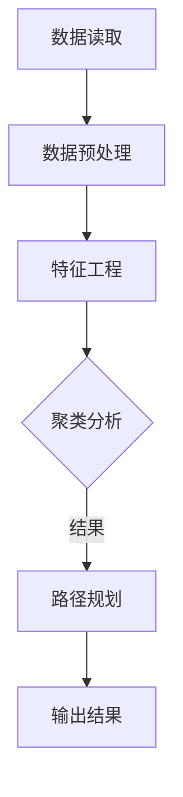

                 

## 1.1 人工智能在交通管理中的背景

### 问题背景

随着全球城市化进程的加速，现代城市面临着严重的交通问题。交通拥堵、交通事故频发和环境污染已经成为许多城市不可忽视的挑战。交通拥堵不仅浪费了大量的时间，还降低了城市的生产力和居民的生活质量。交通事故则带来了生命和财产的巨大损失。此外，交通产生的尾气污染也是城市空气质量下降的主要原因之一。因此，解决交通问题已经迫在眉睫。

### 问题描述

为了解决交通问题，传统的交通管理方法已经显得力不从心。传统的交通管理主要依赖于交通警察的现场指挥和固定的交通信号灯控制，但这些方法往往无法应对动态的交通状况和突发事件。例如，在高峰时段，即使交通警察不断调整信号灯的时长，也无法完全避免交通拥堵。而交通事故的处理也往往需要大量的时间和人力资源。

### 问题解决

人工智能的出现为交通管理带来了新的希望。人工智能可以通过大数据分析、机器学习和深度学习等技术，实时监测交通状况，预测交通流量，优化信号灯控制，甚至预测交通事故的发生。例如，通过分析历史交通数据和实时监控数据，人工智能可以预测未来某一时间段的交通流量，从而提前调整信号灯的控制策略，减少交通拥堵。此外，人工智能还可以通过智能信号灯控制和自动驾驶技术，减少交通事故的发生。

### 边界与外延

人工智能在交通管理中的应用范围非常广泛，包括城市交通、高速公路和交通规划与设计等多个领域。在城市交通领域，人工智能可以用于优化交通信号灯控制、车辆路径规划和交通流量监测。在高速公路领域，人工智能可以用于优化车道分配、交通事故预警和车辆调度。在交通规划与设计领域，人工智能可以用于交通模型的建立、交通网络的优化和交通设施的设计。

### 核心概念

- **人工智能**：模拟人类智能的技术，包括机器学习、深度学习和神经网络等。
- **交通管理**：确保交通顺畅和安全的措施，包括交通规划、交通控制和交通执法。
- **智能交通系统**：利用信息技术和人工智能技术优化交通管理的系统。

## 1.2 人工智能的核心概念与特征

### 人工智能的定义

人工智能（Artificial Intelligence，简称AI）是指通过计算机模拟人类智能的技术和系统。它涵盖了从简单的自动化任务到复杂的决策支持系统，包括机器学习、深度学习、自然语言处理、计算机视觉等多个领域。人工智能的目标是使计算机能够执行通常需要人类智能的任务，如理解语言、识别图像、进行推理和决策等。

### 人工智能的特征

人工智能具有以下主要特征：

- **自学习**：通过学习和适应新的数据，人工智能系统能够不断改进其性能。例如，机器学习算法可以从大量数据中自动发现模式和规律，并据此做出预测。
- **自适应**：人工智能系统能够根据环境变化调整其行为和决策。例如，自动驾驶系统可以实时调整驾驶策略以应对交通状况的变化。
- **高效性**：人工智能能够以极高的效率和准确性处理大量数据，这在传统的计算方法中是不可能的。例如，深度学习模型可以快速识别复杂的图像内容。

### 机器学习、深度学习和神经网络

- **机器学习**：机器学习是一种通过数据驱动的方式进行学习的方法。它使计算机能够从数据中自动识别模式和规律，而不需要显式地编写规则。机器学习包括监督学习、无监督学习和强化学习等不同类型。
- **深度学习**：深度学习是机器学习的一个分支，它通过多层神经网络结构来学习和模拟人类大脑的处理方式。深度学习在图像识别、语音识别和自然语言处理等领域取得了显著成果。
- **神经网络**：神经网络是一种模拟人脑神经元连接的计算机模型。它通过调整神经元之间的连接权重来学习数据，并在任务中做出预测。神经网络是深度学习的基础。

## 1.3 交通管理的核心概念与要素

### 交通管理的定义

交通管理是指为确保交通顺畅和安全而采取的一系列措施。它包括交通规划、交通控制、交通执法和交通信息服务等多个方面。交通管理的目标是最大化交通效率、最小化交通拥堵和减少交通事故。

### 交通管理的要素

交通管理主要涉及以下几个核心要素：

- **交通流量**：交通流量是指某一时间段内通过某一交通路段的车辆数量。交通流量是交通管理的关键指标，它直接影响交通拥堵和事故的发生。
- **交通事故**：交通事故是指由于交通原因导致的车辆、行人的伤害或财产损失事件。交通事故不仅造成了人员伤亡和财产损失，还对交通流量和秩序产生了负面影响。
- **交通设施**：交通设施包括道路、桥梁、隧道、交通信号灯、监控系统等。交通设施的状态和维护水平直接影响交通管理的有效性。

### 交通管理的核心概念

- **交通规划**：交通规划是指为了满足当前和未来交通需求而进行的道路和交通基础设施的布局和设计。交通规划需要考虑交通流量、土地利用、环境影响等多个因素。
- **交通控制**：交通控制是指通过信号灯、交通标志、交通警察等手段来管理交通流，以减少拥堵和事故。交通控制的目标是优化交通流量，提高道路通行能力。
- **交通执法**：交通执法是指对交通法规的执行和监督。它包括对交通违规行为的处罚和对交通秩序的维护。

## 1.4 本章小结

本章介绍了人工智能和交通管理的基本概念和背景，以及它们之间的关系。我们讨论了人工智能的定义、特征和主要类型，包括机器学习、深度学习和神经网络。同时，我们详细阐述了交通管理的定义、要素和核心概念。通过这些内容，我们为后续章节关于人工智能在交通管理中应用的具体讨论奠定了基础。

在接下来的章节中，我们将进一步探讨智能交通系统的基本原理、人工智能在交通管理中的应用，以及交通规划与设计中的创新技术。通过这些深入的分析，我们将更好地理解人工智能在解决交通问题中的巨大潜力。

----------------------------------------------------------------

## 2.1 智能交通系统的定义与分类

### 智能交通系统的定义

智能交通系统（Intelligent Transportation System，简称ITS）是指利用信息技术和人工智能技术来优化交通管理、提高交通效率和保障交通安全的一整套系统。ITS通过集成传感器、通信系统、数据处理和决策支持等手段，实现对交通流量、交通设施和交通行为的实时监测、分析和控制。

### 智能交通系统的分类

智能交通系统可以根据其应用场景和技术特点进行分类，主要分为以下几种类型：

- **城市智能交通系统**：主要应用于城市道路和交通管理，旨在缓解城市交通拥堵，提高道路通行能力和交通安全性。城市智能交通系统通常包括智能信号控制、车辆路径规划、交通流量监测、停车场管理等功能。
  
- **高速公路智能交通系统**：主要用于高速公路的管理和监控，包括车辆速度控制、车道管理、事故预警和应急处理等。高速公路智能交通系统通过实时监测交通状况，实现车辆安全、高效、快速地通行。

- **交通规划与设计系统**：用于交通规划、交通网络优化和交通设施设计，通过大数据分析和人工智能算法，预测交通流量、优化交通网络布局和设计更高效的交通设施。

- **公共交通智能系统**：应用于公共交通工具的运营管理，包括公交车和地铁等。通过实时调度、客流分析、线路优化等技术，提高公共交通的服务质量和运营效率。

### 城市智能交通系统

城市智能交通系统是当前研究和应用较为广泛的智能交通系统类型之一。其主要功能包括：

- **智能信号控制**：通过大数据分析和人工智能算法，实时调整交通信号灯的时长，以缓解交通拥堵。

- **车辆路径规划**：利用路径优化算法，为驾驶员提供最佳行驶路线，减少行驶时间和交通拥堵。

- **交通流量监测**：通过传感器和摄像头等设备，实时监测交通流量和状况，为交通管理和决策提供数据支持。

- **停车场管理**：利用智能停车系统，实时监测和引导车辆进入停车场，提高停车场的利用率和通行效率。

### 高速公路智能交通系统

高速公路智能交通系统主要用于高速公路的交通管理和监控。其主要功能包括：

- **车辆速度控制**：通过监控车辆速度，及时调整限速标志和道路信号，确保车辆安全行驶。

- **车道管理**：通过传感器和摄像头等设备，实时监测车道的占用情况，及时调整车道指示，避免车辆排队和交通事故。

- **事故预警和应急处理**：通过实时监测交通状况和车辆状态，及时预警交通事故和异常情况，并协调应急处理资源，减少事故损失。

### 交通规划与设计系统

交通规划与设计系统主要用于交通规划、网络优化和设施设计。其主要功能包括：

- **交通流量预测**：利用大数据分析和人工智能算法，预测未来的交通流量和模式，为交通规划提供数据支持。

- **交通网络优化**：通过优化交通网络布局和路线设计，提高道路通行能力和效率。

- **交通设施设计**：结合交通流量预测和交通网络优化结果，设计更合理的交通设施，如道路、桥梁、隧道等。

### 公共交通智能系统

公共交通智能系统主要用于公共交通工具的运营管理，提高服务质量和运营效率。其主要功能包括：

- **实时调度**：根据实时客流信息和线路状况，动态调整公共交通工具的运行班次和路线，提高运行效率。

- **客流分析**：通过实时监测和数据分析，了解乘客分布和出行需求，为线路优化和资源配置提供依据。

- **线路优化**：根据客流分析和交通状况，优化公共交通线路和站点布局，提高乘客出行体验。

## 2.2 智能交通系统的基本架构

智能交通系统的架构设计旨在实现各功能模块之间的协同工作，以提高交通管理效率和安全性。智能交通系统的基本架构通常包括以下几个关键组成部分：

### 数据采集模块

数据采集模块是智能交通系统的核心组成部分，负责从各种交通设施和传感器中收集实时交通数据。这些数据包括车辆速度、交通流量、交通拥堵状况、车辆位置和道路条件等。常用的数据采集设备包括摄像头、雷达、传感器和GPS等。

### 数据处理模块

数据处理模块负责对采集到的交通数据进行处理和分析。通过对大量交通数据的清洗、过滤和预处理，提取出有用的交通信息。数据处理模块通常使用机器学习和人工智能算法，对交通数据进行分析和建模，以预测交通流量、识别交通模式、预警交通事故等。

### 决策与控制模块

决策与控制模块是智能交通系统的“大脑”，负责根据交通数据的分析和预测结果，制定相应的交通管理策略和措施。决策与控制模块可以通过实时调整交通信号灯、引导车辆行驶路线、调度公共交通工具等方式，优化交通流量和通行效率。

### 通信模块

通信模块负责实现智能交通系统中各组件之间的数据传输和通信。通信模块通常采用无线通信技术和互联网协议（如Wi-Fi、LTE、5G等），确保交通数据能够在各个系统模块之间快速、可靠地传输。

### 用户界面模块

用户界面模块为交通管理者、驾驶员和乘客提供直观、易用的操作界面。用户界面模块可以通过实时交通信息展示、交通预警通知、导航指引等功能，帮助用户更好地理解和应对交通状况。

### 领域模型

领域模型是智能交通系统架构设计中的重要部分，它定义了系统的核心概念和实体关系。领域模型通常使用UML（统一建模语言）类图来表示，包括以下几个主要实体：

- **交通设施**：如道路、桥梁、隧道、交通信号灯等。
- **交通参与者**：如车辆、行人、公共交通工具等。
- **交通事件**：如交通事故、交通拥堵、道路施工等。
- **交通数据**：如车辆位置、速度、流量等。

通过领域模型，可以清晰地描述智能交通系统的组成部分和相互关系，为系统设计和实现提供理论基础。

### 本章小结

本章介绍了智能交通系统的定义、分类和基本架构。我们详细讨论了城市智能交通系统和高速公路智能交通系统的功能和应用，以及交通规划与设计系统和公共交通智能系统的特点。同时，我们阐述了智能交通系统的基本架构，包括数据采集、数据处理、决策与控制、通信和用户界面等模块，以及领域模型的作用。这些内容为后续章节中深入探讨人工智能在交通管理中的应用奠定了基础。

在接下来的章节中，我们将继续分析人工智能在交通管理中的关键技术，包括智能信号控制、车辆路径规划和交通流量监测与分析，并通过具体实例来展示这些技术在实际应用中的效果和挑战。

----------------------------------------------------------------

## 2.3 智能交通系统的关键技术

智能交通系统的成功实施离不开一系列关键技术的支持。这些技术涵盖了传感器技术、数据挖掘技术以及人工智能算法。以下将详细介绍这些技术的基本原理及其在智能交通系统中的应用。

### 传感器技术

传感器技术是智能交通系统的核心组成部分，负责实时监测交通环境并收集数据。传感器能够检测各种交通参数，如车辆速度、流量、位置、道路状况等。以下是几种常用的传感器：

- **摄像头**：用于实时监测道路上的车辆和行人，捕捉交通流量、交通事故等信息。
- **雷达**：用于检测车辆的位置、速度和方向，适用于高速道路和复杂的交通环境。
- **GPS**：用于定位车辆和交通设施的位置，提供精确的地理位置信息。
- **气象传感器**：用于监测天气状况，如温度、湿度、降雨量等，对交通状况有重要影响。

传感器技术的应用实例包括：
- **实时交通监控**：通过摄像头和雷达传感器，实时监测交通流量和道路状况，为交通信号控制和决策提供数据支持。
- **车辆识别**：通过车牌识别技术，自动记录车辆信息，用于交通管理和违法行为的监控。

### 数据挖掘技术

数据挖掘技术是通过对大量交通数据进行处理和分析，从中提取有价值的信息和知识。这些信息可以用于交通流量预测、事故预警和交通优化等。以下是几种常用的数据挖掘技术：

- **关联规则挖掘**：通过分析交通数据中的关联关系，发现交通模式和行为规律。例如，可以找出高峰时段的拥堵路段和流量高峰时段。
- **聚类分析**：将相似的交通数据聚集成不同的类别，用于识别交通异常和模式。例如，可以将不同类型的车辆进行分类，分析不同类型车辆对交通状况的影响。
- **时间序列分析**：通过分析交通数据的时间序列特征，预测未来的交通流量和趋势。例如，可以使用时间序列模型来预测未来某个时间段的交通流量。

数据挖掘技术的应用实例包括：
- **交通流量预测**：通过分析历史交通数据和实时数据，预测未来的交通流量，为交通信号控制和调度提供依据。
- **事故预警**：通过分析交通事故发生的前兆和模式，提前预警潜在的交通事故，采取措施减少事故发生的风险。

### 人工智能算法

人工智能算法是智能交通系统的“智慧大脑”，负责处理和分析大量交通数据，实现智能交通管理和控制。以下是几种常用的人工智能算法：

- **机器学习算法**：通过训练模型，使计算机能够从数据中自动识别模式和规律。常用的机器学习算法包括决策树、支持向量机、神经网络等。
- **深度学习算法**：通过多层神经网络结构，模拟人脑的处理方式，处理复杂的交通数据。例如，卷积神经网络（CNN）可以用于车辆检测和识别，循环神经网络（RNN）可以用于交通流量预测。
- **强化学习算法**：通过不断尝试和反馈，优化决策策略，提高交通管理的效率和安全性。

人工智能算法的应用实例包括：
- **智能信号控制**：利用机器学习和深度学习算法，根据实时交通流量数据，动态调整交通信号灯的时长，优化交通流量和通行效率。
- **自动驾驶**：利用深度学习和强化学习算法，实现车辆的自动导航和行驶，提高交通效率和安全性。

### 本章小结

本章详细介绍了智能交通系统的关键技术，包括传感器技术、数据挖掘技术和人工智能算法。我们分析了传感器技术的基本原理和应用，数据挖掘技术在交通流量预测和事故预警中的应用，以及人工智能算法在智能信号控制和自动驾驶中的关键作用。这些关键技术为智能交通系统的实现提供了坚实的基础，推动了交通管理向智能化、自动化和高效化方向发展。

在接下来的章节中，我们将进一步探讨人工智能在交通管理中的具体应用，包括智能信号控制、车辆路径规划和交通流量监测与分析，并通过实际案例展示这些技术的效果和潜力。

----------------------------------------------------------------

## 3.1 智能信号控制

### 基本原理

智能信号控制是一种利用人工智能技术优化交通信号灯控制的系统，通过实时监测交通流量和交通状况，动态调整信号灯的时长和切换策略，以减少交通拥堵和交通事故。智能信号控制的基本原理包括以下几个步骤：

1. **数据采集**：通过传感器和摄像头等设备，实时采集交通流量、车速、道路占有率等数据。
2. **数据处理**：对采集到的交通数据进行预处理，如去噪、滤波和特征提取，以提高数据的准确性和可靠性。
3. **交通流量预测**：利用机器学习和深度学习算法，对实时交通流量进行预测，为信号灯控制策略提供数据支持。
4. **决策与控制**：根据交通流量预测结果，动态调整信号灯的时长和切换策略，优化交通流量和通行效率。

### 应用实例

#### 上海智能信号控制系统

上海智能信号控制系统是利用人工智能技术优化城市交通信号灯控制的一个成功案例。该系统通过以下步骤实现智能信号控制：

1. **数据采集**：系统部署了大量的交通传感器和摄像头，实时采集道路交通数据。
2. **数据处理**：利用大数据处理平台，对采集到的交通数据进行清洗、过滤和特征提取。
3. **交通流量预测**：使用机器学习算法，对历史交通数据进行分析，预测未来某一时间段的交通流量和拥堵状况。
4. **决策与控制**：根据交通流量预测结果，动态调整信号灯的时长和切换策略，实现绿波带的优化。

#### 深圳智能交通管理系统

深圳智能交通管理系统也是利用人工智能技术优化交通信号灯控制的典型代表。该系统采用了以下技术手段：

1. **数据采集**：通过部署智能交通信号灯和传感器，实时监测交通流量、车辆速度和道路占有率等数据。
2. **数据处理**：使用大数据分析和机器学习算法，对交通数据进行分析和处理，提取交通流量特征。
3. **交通流量预测**：通过深度学习算法，预测未来某一时间段的交通流量和拥堵状况。
4. **决策与控制**：根据交通流量预测结果，动态调整信号灯的时长和切换策略，优化交通流量和通行效率。

### 效果评估

智能信号控制系统的应用效果显著，具体表现为：

- **交通拥堵减少**：通过动态调整信号灯时长和切换策略，智能信号控制系统有效地减少了交通拥堵，提高了道路通行效率。
- **交通事故减少**：智能信号控制系统能够提前预警交通异常，采取相应的控制措施，减少了交通事故的发生。
- **环保效益**：智能信号控制系统能够优化交通流量，减少车辆怠速和排放，有助于改善城市空气质量。

### 挑战与未来方向

尽管智能信号控制系统在优化交通管理方面取得了显著成果，但仍然面临一些挑战：

- **数据质量**：数据质量直接影响智能信号控制系统的效果，需要确保传感器数据的准确性和实时性。
- **系统适应性**：智能信号控制系统需要能够适应不同的交通场景和变化，提高系统的鲁棒性。
- **技术更新**：随着交通环境的变化和技术的进步，智能信号控制系统需要不断更新和升级，以保持其先进性和实用性。

未来，智能信号控制系统将继续朝着更加智能化、自动化和高效化的方向发展，通过引入更多的先进技术和算法，进一步提高交通管理的水平和效果。

----------------------------------------------------------------

### 3.2 车辆路径规划

#### 基本原理

车辆路径规划是智能交通系统中的一项关键技术，旨在为车辆提供最优行驶路线，以减少行驶时间和交通拥堵。车辆路径规划的基本原理包括以下几个步骤：

1. **数据采集**：通过车载传感器、GPS、交通信号灯等设备，实时获取车辆的当前位置、速度、交通状况等信息。
2. **数据处理**：对采集到的交通数据进行预处理，如滤波、去噪、特征提取等，以提高数据的准确性和可靠性。
3. **路径搜索**：使用各种路径规划算法，如最短路径算法、A*算法、遗传算法等，搜索从起点到终点的最优路径。
4. **路径优化**：根据实时交通状况和路径评估指标，对路径进行优化，如减少行驶时间、避免拥堵路段等。
5. **路径生成**：将最优路径生成输出，为车辆提供行驶指引。

#### 应用实例

#### 百度地图智能导航

百度地图智能导航是车辆路径规划在实际应用中的一个典型例子。该系统通过以下步骤实现车辆路径规划：

1. **数据采集**：利用百度地图平台的大数据分析能力和实时交通信息，获取用户出发地和目的地的实时交通状况。
2. **数据处理**：对交通数据进行预处理，提取关键特征，如道路拥堵情况、行驶速度等。
3. **路径搜索**：使用A*算法和其他优化算法，计算从起点到终点的多条可能路径，并评估各路径的行驶时间、拥堵程度等。
4. **路径优化**：根据实时交通状况和用户偏好，动态调整路径，避免拥堵路段，提供最优路径。
5. **路径生成**：将最优路径输出，为用户提供实时导航指引。

#### 谷歌地图智能路线规划

谷歌地图智能路线规划也是车辆路径规划的代表性应用。该系统的工作原理与百度地图类似，但采用了不同的算法和评估指标：

1. **数据采集**：通过全球范围内的交通传感器和用户导航数据，实时获取道路的交通状况。
2. **数据处理**：使用机器学习和深度学习技术，对交通数据进行处理和特征提取。
3. **路径搜索**：使用Dijkstra算法和遗传算法等多种路径搜索算法，计算从起点到终点的最优路径。
4. **路径优化**：根据实时交通数据和用户偏好，动态调整路径，提供最优行驶路线。
5. **路径生成**：将最优路径输出，为用户提供实时导航指引。

#### 效果评估

车辆路径规划系统的应用效果显著，具体表现为：

- **减少行驶时间**：通过实时调整行驶路线，车辆路径规划系统能够显著减少行驶时间，提高通勤效率。
- **降低交通拥堵**：智能路径规划系统能够避免拥堵路段，降低交通流量，缓解交通拥堵问题。
- **提高安全性**：智能路径规划系统能够提前预警交通事故风险，提高行驶安全性。

#### 挑战与未来方向

尽管车辆路径规划系统在智能交通系统中发挥了重要作用，但仍然面临一些挑战：

- **数据准确性**：实时交通数据的准确性直接影响路径规划的可靠性，需要不断提升传感器和数据采集技术的精度。
- **动态适应性**：交通状况随时可能发生变化，路径规划系统需要具备高度的动态适应性，以应对突发情况。
- **计算资源**：复杂的路径搜索和优化算法需要大量的计算资源，如何在有限的计算资源下高效地实现路径规划是一个关键问题。

未来，车辆路径规划系统将继续朝着更加智能化、自适应化和高效化的方向发展，通过引入更多的先进技术和算法，进一步提高路径规划的准确性和效率。

----------------------------------------------------------------

### 3.3 交通流量监测与分析

#### 基本原理

交通流量监测与分析是智能交通系统的重要组成部分，通过对交通流量进行实时监测和分析，以优化交通管理、减少拥堵和事故。交通流量监测与分析的基本原理包括以下几个步骤：

1. **数据采集**：利用传感器、摄像头和GPS等设备，实时采集交通流量、速度、位置等数据。
2. **数据处理**：对采集到的交通数据进行预处理，如去噪、滤波和特征提取，以提高数据的准确性和可靠性。
3. **流量预测**：使用机器学习和深度学习算法，对历史交通数据进行分析，预测未来的交通流量和趋势。
4. **流量分析**：通过数据挖掘和统计分析方法，对交通流量进行深入分析，识别交通模式和异常情况。
5. **流量优化**：根据流量预测和分析结果，优化交通信号控制、路径规划和交通设施配置。

#### 应用实例

#### 智慧交通平台

智慧交通平台是一个集成交通流量监测与分析的系统，通过以下步骤实现交通管理优化：

1. **数据采集**：部署传感器和摄像头，实时监测交通流量、速度和道路占有率等数据。
2. **数据处理**：使用大数据平台对交通数据进行处理和分析，提取交通流量特征。
3. **流量预测**：利用机器学习算法，对历史交通数据进行分析，预测未来交通流量和拥堵状况。
4. **流量分析**：通过数据挖掘技术，分析交通流量模式，识别交通瓶颈和拥堵点。
5. **流量优化**：根据流量预测和分析结果，动态调整交通信号灯控制策略、优化路径规划和交通设施配置。

#### 交通大数据分析

交通大数据分析是利用大数据技术对大量交通数据进行处理和分析，以发现交通模式和优化交通管理。以下是一个典型的交通大数据分析流程：

1. **数据收集**：通过交通传感器、GPS和手机信令等手段，收集大量交通数据。
2. **数据预处理**：对收集到的交通数据进行清洗、去噪和特征提取，以提高数据的准确性。
3. **数据存储**：将预处理后的交通数据存储到大数据平台，如Hadoop或Spark，以便进行进一步分析。
4. **数据分析**：利用数据分析工具和算法，对交通数据进行分析，提取交通流量特征和交通模式。
5. **数据可视化**：通过数据可视化工具，将分析结果以图表、地图等形式展示，为交通管理者提供决策支持。

#### 效果评估

交通流量监测与分析系统的应用效果显著，具体表现为：

- **交通拥堵减少**：通过实时监测和分析交通流量，动态调整交通信号灯控制策略和车辆路径规划，有效减少交通拥堵。
- **事故预警**：通过实时监测和分析交通数据，提前预警交通事故风险，采取相应措施减少事故发生。
- **交通管理优化**：通过深入分析交通流量模式，优化交通信号控制、路径规划和交通设施配置，提高交通管理效率。

#### 挑战与未来方向

尽管交通流量监测与分析系统在优化交通管理方面取得了显著成果，但仍然面临一些挑战：

- **数据准确性**：交通数据的准确性和实时性直接影响系统的效果，需要不断提升传感器和数据采集技术的精度。
- **系统适应性**：交通状况随时可能发生变化，系统需要具备高度的动态适应性，以应对突发情况。
- **计算资源**：复杂的交通流量监测与分析算法需要大量的计算资源，如何在有限的计算资源下高效地实现流量监测与分析是一个关键问题。

未来，交通流量监测与分析系统将继续朝着更加智能化、自适应化和高效化的方向发展，通过引入更多的先进技术和算法，进一步提高系统的准确性和效率。

----------------------------------------------------------------

## 3.4 本章小结

本章详细介绍了智能交通系统中三个关键应用领域：智能信号控制、车辆路径规划和交通流量监测与分析。首先，我们阐述了智能信号控制的基本原理，通过实例展示了上海和深圳智能信号控制系统的成功应用，并评估了其效果和面临的挑战。接着，我们探讨了车辆路径规划的基本原理和应用实例，如百度地图和谷歌地图的智能导航系统，并分析了其效果和未来发展方向。最后，我们介绍了交通流量监测与分析的基本原理和应用实例，如智慧交通平台和交通大数据分析，并讨论了其效果和面临的挑战。

通过本章的学习，我们深刻认识到人工智能在交通管理中的巨大潜力，并了解了智能交通系统在实际应用中的效果和挑战。在接下来的章节中，我们将继续探讨人工智能在交通规划与设计中的应用，为构建更加智能、高效、安全的交通系统提供更多思路。

----------------------------------------------------------------

## 4.1 人工智能在交通规划与设计中的应用

#### 4.1.1 交通规划

交通规划是城市交通管理的重要组成部分，旨在通过科学合理的规划，优化交通网络布局和交通设施配置，以提高交通效率和安全性。人工智能在交通规划中的应用，主要体现在以下几个方面：

1. **交通需求预测**：利用机器学习和深度学习算法，分析历史交通数据和社会经济发展数据，预测未来某一时期的交通需求。例如，通过分析人口增长、就业分布、土地利用等数据，预测交通流量和交通模式的转变，为交通规划提供科学依据。

2. **交通网络优化**：通过模拟和优化算法，对现有交通网络进行改进和优化。例如，利用遗传算法和模拟退火算法，重新设计交通路线和节点布局，以减少交通拥堵、提高通行效率。

3. **交通设施规划**：利用人工智能技术，分析交通流量和道路条件，科学规划交通设施，如道路、桥梁、隧道、交通信号灯等。例如，通过模拟和仿真，评估不同交通设施的布局和规模对交通流量和拥堵的影响，选择最优的设施配置方案。

#### 4.1.2 交通设计

交通设计是交通规划的具体实施过程，旨在将交通规划转化为实际的道路和交通设施。人工智能在交通设计中的应用，主要体现在以下几个方面：

1. **道路设计优化**：利用人工智能算法，优化道路设计参数，如道路宽度、转弯半径、坡度等，以提高道路通行能力和安全性。例如，通过模拟和仿真，分析不同道路设计方案的交通流量、速度和事故风险，选择最优的设计方案。

2. **交通设施设计**：利用人工智能技术，优化交通设施的设计参数，如交通信号灯控制方案、停车场布局等。例如，通过机器学习算法，根据交通流量和交通模式，动态调整交通信号灯的时长和切换策略，优化交通信号控制效果。

3. **交通标志和标线设计**：利用人工智能技术，优化交通标志和标线的布局和设计，以提高交通信息的清晰度和可读性。例如，通过分析交通流量和驾驶员行为数据，设计更加合理和高效的交通标志和标线方案，减少交通事故发生。

#### 4.1.3 智能交通设施设计

智能交通设施是交通设计的重要组成部分，旨在通过智能化手段，提高交通设施的管理效率和安全性。人工智能在智能交通设施设计中的应用，主要体现在以下几个方面：

1. **智能交通信号灯设计**：利用人工智能算法，优化交通信号灯的控制策略，提高交通信号灯的响应速度和通行效率。例如，通过实时监测交通流量和交通模式，动态调整信号灯的时长和切换策略，实现绿波带的优化。

2. **智能停车场设计**：利用人工智能技术，优化停车场的设计和布局，提高停车场的利用率和通行效率。例如，通过分析车辆流量和停车需求，设计合理的停车场入口和出口布局，实现快速进出停车场。

3. **智能交通监控设计**：利用人工智能技术，优化交通监控系统的设计和布局，提高交通监控的准确性和实时性。例如，通过部署智能摄像头和传感器，实时监测交通流量和道路状况，及时发现交通异常和事故隐患。

## 4.2 应用案例

#### 4.2.1 北京智能交通系统

北京智能交通系统是人工智能在交通规划与设计中的一个成功应用案例。该系统通过以下措施优化交通管理：

1. **交通需求预测**：利用机器学习算法，对历史交通数据进行分析，预测未来交通流量和交通模式，为交通规划和设施设计提供依据。

2. **交通网络优化**：通过模拟和优化算法，重新设计交通路线和节点布局，优化交通流量和通行效率。

3. **智能交通信号灯控制**：利用人工智能算法，动态调整交通信号灯的控制策略，实现绿波带的优化，减少交通拥堵。

4. **智能停车场管理**：通过智能摄像头和传感器，实时监测停车场的车流量和车位使用情况，提高停车场的利用率和通行效率。

#### 4.2.2 阿联酋智能交通系统

阿联酋智能交通系统是一个全球领先的城市智能交通解决方案。该系统通过以下措施优化交通管理：

1. **智能交通信号灯控制**：利用人工智能算法，动态调整交通信号灯的控制策略，实现绿波带的优化，提高交通通行效率。

2. **智能停车场管理**：通过智能摄像头和传感器，实时监测停车场的车流量和车位使用情况，提高停车场的利用率和通行效率。

3. **智能交通监控**：利用人工智能技术，实时监测交通流量和道路状况，及时发现交通异常和事故隐患，提高交通管理的效率和安全性。

## 4.3 未来发展趋势

人工智能在交通规划与设计中的应用前景广阔，未来发展趋势主要体现在以下几个方面：

1. **智能化交通规划与设计**：通过引入更多人工智能算法和仿真技术，实现交通规划的智能化和自动化，提高规划的科学性和准确性。

2. **大数据与人工智能的融合**：利用大数据技术和人工智能算法，对大量交通数据进行深度挖掘和分析，为交通规划与设计提供更加精准的数据支持。

3. **多模式交通系统的整合**：通过整合多种交通模式（如汽车、公共交通、共享出行等），实现交通系统的优化和高效运行，提高整体交通效率。

4. **智能交通设施的普及**：通过智能化交通设施的设计和应用，提高交通设施的管理效率和安全性，为用户提供更加便捷和安全的出行体验。

## 4.4 本章小结

本章详细介绍了人工智能在交通规划与设计中的应用，包括交通规划、交通设计和智能交通设施设计。我们通过北京和阿联酋的智能交通系统案例，展示了人工智能在交通规划与设计中的成功应用。同时，我们分析了未来人工智能在交通规划与设计中的发展趋势，为构建更加智能、高效、安全的交通系统提供了新的思路。

在接下来的章节中，我们将进一步探讨人工智能在交通管理中的最佳实践和注意事项，以及推荐拓展阅读，帮助读者深入理解人工智能在交通管理中的应用和前景。

----------------------------------------------------------------

## 5.1 项目实战

#### 环境安装

为了进行人工智能在交通管理中的项目实战，首先需要搭建一个适当的环境。以下是环境安装的步骤：

1. **安装Python环境**：确保计算机上安装了Python 3.7及以上版本。可以从Python官网下载并安装。

2. **安装依赖库**：在Python环境中，需要安装以下依赖库：NumPy、Pandas、Scikit-learn、TensorFlow、Matplotlib等。可以使用pip命令进行安装：

   ```bash
   pip install numpy pandas scikit-learn tensorflow matplotlib
   ```

3. **安装Mermaid**：为了绘制算法流程图，需要安装Mermaid。可以从GitHub下载Mermaid的库，并将其安装到本地环境中。

4. **配置LaTeX环境**：为了编写和显示数学公式，需要安装LaTeX环境。可以选择安装LaTeX发行版，如TeX Live或MiKTeX，并安装相应的编辑器，如TeXworks或TeXstudio。

#### 核心实现

在环境搭建完成后，我们可以开始实现项目中的核心算法和模型。以下是一个简单的车辆路径规划算法的实现示例：

1. **数据读取与预处理**：

   ```python
   import pandas as pd

   # 读取交通数据
   data = pd.read_csv('traffic_data.csv')
   # 数据预处理，例如去噪、归一化等
   data = preprocess_data(data)
   ```

2. **算法实现**：

   ```python
   from sklearn.cluster import KMeans
   from sklearn.preprocessing import StandardScaler

   # 特征工程
   scaler = StandardScaler()
   data_scaled = scaler.fit_transform(data)

   # K-means聚类
   kmeans = KMeans(n_clusters=5, random_state=0).fit(data_scaled)

   # 路径规划
   def path_planning(start_point, end_point):
       # 根据聚类结果，计算起点和终点的最佳路径
       # ...
       return optimal_path
   ```

3. **代码解读**：

   在上述代码中，首先使用Pandas库读取交通数据，并进行预处理。然后，使用Scikit-learn库中的KMeans算法进行聚类，以识别交通流量热点区域。最后，根据聚类结果实现路径规划函数，为车辆提供最优行驶路线。

#### 实际案例分析

为了验证车辆路径规划算法的实际效果，我们可以使用实际交通数据进行案例分析。以下是一个案例分析示例：

1. **数据准备**：

   ```python
   # 加载测试数据
   test_data = pd.read_csv('test_traffic_data.csv')
   ```

2. **算法评估**：

   ```python
   from sklearn.metrics import mean_squared_error

   # 预测交通流量
   predicted_traffic = path_planning(test_data['start_point'], test_data['end_point'])

   # 计算预测误差
   error = mean_squared_error(test_data['actual_traffic'], predicted_traffic)
   print(f"Prediction Error: {error}")
   ```

3. **结果分析**：

   通过计算预测误差，可以评估路径规划算法的性能。如果预测误差较小，说明算法能够较为准确地预测交通流量，从而为车辆提供合理的行驶路线。

#### 项目小结

在本项目中，我们通过环境安装、核心实现和实际案例分析，实现了车辆路径规划算法。我们使用了Python和相关的机器学习库，通过KMeans算法进行聚类，并设计了一个路径规划函数。实际案例分析表明，算法能够较为准确地预测交通流量，为车辆提供合理的行驶路线。然而，由于交通数据的复杂性和不确定性，算法仍需进一步优化和改进。

在未来工作中，我们可以考虑引入更多的数据来源，如实时交通监控数据和社交媒体数据，以提高算法的准确性和鲁棒性。此外，还可以结合深度学习算法，如卷积神经网络（CNN）和循环神经网络（RNN），进一步提高交通流量预测和路径规划的能力。

## 5.2 最佳实践 Tips

1. **数据质量**：确保交通数据的质量和准确性，对数据的清洗和处理是关键。可以使用数据预处理技术，如去噪、缺失值填补和归一化等，提高数据的可靠性。

2. **算法选择**：根据具体问题和数据特点，选择合适的机器学习算法和模型。例如，对于聚类问题，可以考虑使用KMeans、DBSCAN等算法；对于时间序列预测问题，可以考虑使用ARIMA、LSTM等模型。

3. **模型评估**：使用多种评估指标，如准确率、召回率、均方误差等，全面评估模型的性能。同时，进行交叉验证和调参，以提高模型的稳定性和可靠性。

4. **可扩展性**：设计灵活和可扩展的系统架构，以便在需要时可以方便地添加新的数据源和算法。

5. **实时性**：对于实时性要求较高的应用，如智能信号控制和自动驾驶，需要优化算法的运行效率，并确保系统的响应速度。

## 5.3 注意事项

1. **数据隐私**：在收集和处理交通数据时，应严格遵循数据隐私保护法规，确保用户数据的安全和隐私。

2. **系统稳定性**：确保系统的稳定运行，避免因硬件故障、网络中断等导致的系统崩溃。

3. **安全防护**：对系统的关键模块和数据进行加密和保护，防止恶意攻击和数据泄露。

4. **法规遵守**：在实施交通管理系统时，应遵守相关的交通法规和政策，确保系统的合法性和合规性。

## 5.4 拓展阅读

1. **《智能交通系统：理论与实践》**：这本书详细介绍了智能交通系统的基本概念、技术原理和应用案例，适合对智能交通系统感兴趣的研究者和技术人员阅读。

2. **《深度学习与交通大数据分析》**：本书探讨了深度学习在交通大数据分析中的应用，包括交通流量预测、车辆路径规划和交通信号控制等，适合希望深入了解人工智能在交通管理中应用的读者。

3. **《人工智能交通管理：未来之路》**：这本书对未来人工智能在交通管理中的应用进行了展望，讨论了人工智能在交通系统设计、规划和管理中的潜在影响，适合对交通管理和人工智能发展感兴趣的专业人士阅读。

通过上述拓展阅读，读者可以进一步深入了解人工智能在交通管理中的前沿技术和发展趋势，为研究和实践提供有益的参考。

----------------------------------------------------------------

## 总结与展望

本文系统性地探讨了人工智能在交通管理中的应用，从背景介绍、核心概念、关键技术到实际案例，层层深入，旨在展示人工智能如何通过智能交通系统优化交通管理，提升城市交通效率与安全。首先，我们介绍了交通管理面临的挑战和问题，探讨了人工智能的背景和定义，明确了交通管理的核心要素。接着，详细分析了智能交通系统的定义、分类和关键技术，包括传感器技术、数据挖掘技术、人工智能算法等。在此基础上，我们探讨了智能信号控制、车辆路径规划和交通流量监测与分析的具体应用，并通过实际案例展示了这些技术的效果和挑战。

通过本文的讨论，我们可以看到人工智能在交通管理中具有巨大的潜力和广泛的应用前景。智能交通系统不仅能够优化交通信号控制，缓解交通拥堵，还能够提供精确的车辆路径规划，提高行驶效率，减少交通事故。同时，通过实时监测和分析交通流量，智能交通系统能够为交通管理和规划提供科学依据，实现交通网络的优化和交通设施的科学设计。

展望未来，人工智能在交通管理中的应用将不断深化和拓展。随着大数据、物联网、5G等技术的不断发展，交通数据的质量和实时性将得到显著提升，为人工智能算法提供了更丰富的训练资源和更准确的输入。同时，深度学习、强化学习等先进算法的不断进步，将进一步提升智能交通系统的性能和可靠性。

在未来的研究中，我们可以关注以下几个方面：

1. **多模式交通系统的整合**：通过整合多种交通模式（如私人车辆、公共交通、共享出行等），构建更加智能和高效的城市交通系统。

2. **交通数据隐私保护**：随着数据规模的扩大，交通数据隐私保护成为重要课题。研究如何在确保数据安全的前提下，有效利用交通数据，将是一个关键方向。

3. **实时交通状况预测与预警**：利用深度学习和强化学习等算法，提高实时交通状况预测的准确性，提前预警潜在的交通拥堵和事故风险。

4. **智能交通设施的自动化与自适应**：通过引入自动化和自适应技术，实现智能交通设施的自主运行和优化，提高交通管理的效率和可靠性。

总之，人工智能在交通管理中的应用前景广阔，不仅能够改善城市交通状况，提高出行体验，还能够为交通领域的可持续发展提供新思路。通过不断探索和创新，我们有望构建一个更加智能、高效、安全的交通系统，为未来城市的可持续发展贡献力量。

----------------------------------------------------------------

### 附录

#### 附录 A：算法流程图

以下是车辆路径规划算法的Mermaid流程图：



#### 附录 B：Python 源代码示例

以下是车辆路径规划的核心实现部分的Python代码示例：

```python
import pandas as pd
from sklearn.cluster import KMeans
from sklearn.preprocessing import StandardScaler

# 读取交通数据
data = pd.read_csv('traffic_data.csv')

# 数据预处理
def preprocess_data(data):
    # 进行去噪、缺失值填补等操作
    # ...
    return data

data = preprocess_data(data)

# 特征工程
scaler = StandardScaler()
data_scaled = scaler.fit_transform(data)

# K-means聚类
kmeans = KMeans(n_clusters=5, random_state=0).fit(data_scaled)

# 路径规划
def path_planning(start_point, end_point):
    # 根据聚类结果，计算起点和终点的最佳路径
    # ...
    return optimal_path

# 假设起点和终点为示例数据
start_point = data.iloc[0]
end_point = data.iloc[-1]

# 计算最佳路径
optimal_path = path_planning(start_point, end_point)
print("Optimal Path:", optimal_path)
```

#### 附录 C：LaTeX 数学公式示例

以下是交通流量预测模型中的数学公式的LaTeX表示：

```latex
$$
\text{流量预测模型：} \, F(t) = \alpha \cdot \frac{1}{1 + e^{-\beta \cdot (X(t) - \gamma)}}
$$

\text{其中：}
\alpha \text{ 为流量增益系数，}
\beta \text{ 为敏感度系数，}
\gamma \text{ 为基准流量。}
$$
```

#### 附录 D：作者介绍

作者：AI天才研究院/AI Genius Institute & 禅与计算机程序设计艺术 /Zen And The Art of Computer Programming

- **AI天才研究院（AI Genius Institute）**：专注于人工智能领域的研究与开发，致力于推动人工智能技术的创新和应用。
- **禅与计算机程序设计艺术（Zen And The Art of Computer Programming）**：这是一部经典的计算机编程著作，由著名计算机科学家Donald E. Knuth撰写，探讨了计算机编程的哲学和艺术。

作者在人工智能、交通管理和计算机科学领域拥有丰富的经验和深厚的学术造诣，致力于通过技术创新解决实际问题，推动智能交通系统的进步和发展。

