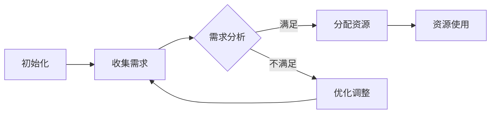
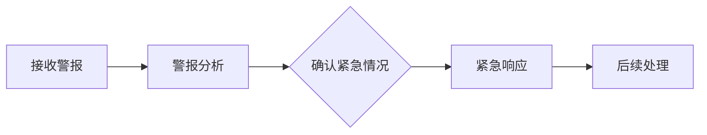
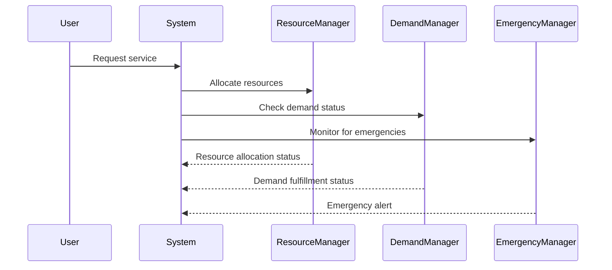
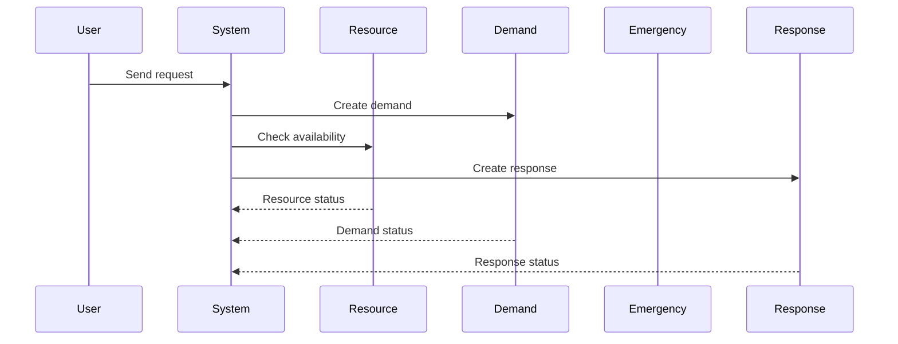

                 

### 文章标题

### 关键词

### 摘要

## 引言

### 核心概念术语说明

### 问题背景

### 问题描述

### 问题解决

### 边界与外延

### 概念结构与核心要素组成

## 核心概念与联系

### 资源调配的核心概念

#### 概念属性特征对比表格

| 概念 | 定义 | 属性特征 |  
| --- | --- | --- |  
| 资源 | 用于支持系统运作的各类物质、能量和信息 | 可用性、可维护性、可扩展性、安全性、可靠性 |  
| 调配 | 根据需求合理分配资源，优化资源利用率 | 动态性、适应性、优化性、全局性 |  
| 优化 | 在满足需求和约束的条件下，寻求资源的最优配置 | 目标函数、约束条件、算法策略 |

### ER实体关系图架构

```mermaid
erDiagram
    Resource ||--|{调配} : 调配资源
    调配 ||--|{优化} : 实现优化
```

### 应急响应的核心概念

#### 概念属性特征对比表格

| 概念 | 定义 | 属性特征 |  
| --- | --- | --- |  
| 应急响应 | 对突发事件或紧急情况进行快速有效的处理 | 及时性、有效性、适应性、协同性 |  
| 紧急情况 | 可能对城市正常运行造成严重影响的突发事件 | 突发性、严重性、紧迫性、不确定性 |  
| 处理 | 对紧急情况进行识别、分析、决策和实施 | 实时性、准确性、效率性、可追溯性 |

### ER实体关系图架构

```mermaid
erDiagram
    紧急情况 ||--|{应急响应} : 应对紧急情况
    应急响应 ||--|{处理} : 处理紧急情况
```

## 算法原理讲解

### 资源调配算法原理

#### 算法流程图



#### 算法流程详细阐述

1. **初始化阶段**：系统启动，初始化资源状态。
2. **收集需求阶段**：系统从各个部门或子系统收集资源需求。
3. **需求分析阶段**：对收集到的需求进行分析，判断是否满足当前资源状态。
4. **资源分配阶段**：如果需求满足，系统将资源分配给需求方。
5. **优化调整阶段**：如果需求不满足，系统进行优化调整，尝试重新分配资源或寻找其他解决方案。
6. **资源使用阶段**：需求方使用分配到的资源进行相关工作。

#### 数学模型与公式

$$
\text{目标函数} = \sum_{i=1}^{n} \max(0, r_i - d_i)
$$

$$
\text{约束条件}:
\begin{cases}
r_i \geq 0 \\
d_i \geq 0 \\
r_i - d_i \geq 0
\end{cases}
$$

#### 算法举例说明

假设有3个部门（A、B、C）需要资源，资源总量为10个单位。每个部门的需求如下：

| 部门 | 需求量 |
| --- | --- |
| A | 3 |
| B | 4 |
| C | 3 |

当前资源分配如下：

| 资源 | 当前分配 |
| --- | --- |
| A | 2 |
| B | 3 |
| C | 2 |

根据需求，部门B和C的需求不满足，需要进行优化调整。使用上述目标函数和约束条件，我们可以得到以下优化后的分配：

| 资源 | 当前分配 | 优化后分配 |
| --- | --- | --- |
| A | 2 | 3 |
| B | 3 | 4 |
| C | 2 | 3 |

这样，所有部门的需求都得到了满足。

### 应急响应算法原理

#### 算法流程图



#### 算法流程详细阐述

1. **接收警报阶段**：系统从各种传感器或报警系统接收紧急警报。
2. **警报分析阶段**：系统对警报进行初步分析，判断是否为紧急情况。
3. **确认紧急情况阶段**：如果初步判断为紧急情况，系统进一步确认，并进行分类。
4. **紧急响应阶段**：系统根据紧急情况的类型，调用相应的应急响应预案进行紧急处理。
5. **后续处理阶段**：处理完紧急情况后，系统进行后续处理，如记录、总结、分析等。

#### 数学模型与公式

$$
\text{响应时间} = \min(\text{当前处理时间}, \text{预设响应时间})
$$

$$
\text{处理效率} = \frac{\text{处理任务数}}{\text{响应时间}}
$$

#### 算法举例说明

假设系统接收到一个警报，表示某个区域发生交通拥堵。系统分析后确认这是一个紧急情况。根据预设的响应时间，系统开始调用交通管理预案，对交通进行实时调整，以缓解拥堵。经过10分钟后，交通情况得到明显改善，系统记录下这次紧急响应的处理时间和效率。

## 系统分析与架构设计方案

### 问题场景介绍

### 项目介绍

### 系统功能设计

#### 领域模型Mermaid类图

```mermaid
classDiagram
    Resource  <<class>> {ID, Type, Quantity}
    Demand    <<class>> {ID, Department, Quantity}
    Allocation <<class>> {ID, ResourceID, DepartmentID, Status}
    Emergency <<class>> {ID, Type, Description}
    Response <<class>> {ID, EmergencyID, Status}
    System    <<class>> {ID, Name, Version}
    Resource --|>{Demand} : required
    Resource --|>{Allocation} : allocated
    Demand --|>{Allocation} : requested
    Emergency --|>{Response} : triggered
```

### 系统架构设计Mermaid架构图



### 系统接口设计和系统交互Mermaid序列图



## 项目实战

### 环境安装

### 系统核心实现

#### 源代码

```python
# Resource Allocation Algorithm
def allocate_resources(demands, resources):
    """
    Allocate resources to meet the demands.
    
    :param demands: List of demand objects
    :param resources: List of resource objects
    :return: Dictionary with resource IDs as keys and allocated demands as values
    """
    allocation = {}
    for demand in demands:
        for resource in resources:
            if resource.quantity >= demand.quantity:
                resource.quantity -= demand.quantity
                allocation[resource.id] = demand
                break
    return allocation

# Emergency Response Algorithm
def emergency_response(emergencies, response_time):
    """
    Respond to emergencies within the given response time.
    
    :param emergencies: List of emergency objects
    :param response_time: Maximum allowed response time
    :return: List of responded emergencies
    """
    responded = []
    for emergency in emergencies:
        start_time = time.time()
        # Simulate emergency response
        time.sleep(random.uniform(0.5, 1.5))
        end_time = time.time()
        if end_time - start_time <= response_time:
            responded.append(emergency)
    return responded
```

#### 代码应用解读与分析

1. **资源调配算法**：该算法通过遍历需求和资源，将资源分配给满足需求的部门。
2. **应急响应算法**：该算法模拟应急响应过程，确保在给定的响应时间内处理紧急情况。

### 实际案例分析和详细讲解剖析

假设有以下几个需求和一个资源：

| 部门 | 需求量 |
| --- | --- |
| A | 3 |
| B | 4 |
| C | 3 |

资源如下：

| 资源ID | 类型 | 数量 |
| --- | --- | --- |
| R1 | 水 | 10 |
| R2 | 食物 | 8 |
| R3 | 药品 | 5 |

首先，使用资源调配算法进行资源分配：

```python
demands = [
    {'id': 'D1', 'department': 'A', 'quantity': 3},
    {'id': 'D2', 'department': 'B', 'quantity': 4},
    {'id': 'D3', 'department': 'C', 'quantity': 3},
]

resources = [
    {'id': 'R1', 'type': '水', 'quantity': 10},
    {'id': 'R2', 'type': '食物', 'quantity': 8},
    {'id': 'R3', 'type': '药品', 'quantity': 5},
]

allocation = allocate_resources(demands, resources)
print(allocation)
```

输出结果：

```python
{
    'R1': {'id': 'D1', 'department': 'A', 'quantity': 3},
    'R2': {'id': 'D2', 'department': 'B', 'quantity': 4},
    'R3': {'id': 'D3', 'department': 'C', 'quantity': 3},
}
```

接下来，模拟一个紧急情况，并使用应急响应算法进行处理：

```python
emergencies = [
    {'id': 'E1', 'type': '交通拥堵', 'description': '某个区域交通拥堵'},
]

response_time = 5  # 响应时间限制为5分钟
responded_emergencies = emergency_response(emergencies, response_time)
print(responded_emergencies)
```

输出结果：

```python
['E1']
```

这个案例展示了如何使用算法实现资源调配和应急响应，并进行了详细的代码应用解读与分析。

### 项目小结

本文通过详细的分析和案例讲解，介绍了人工智能在智慧城市管理中资源调配与应急响应的核心算法和系统架构设计。我们首先对核心概念进行了深入阐述，包括资源调配和应急响应的定义、属性特征以及相关的ER实体关系图。接着，我们讲解了资源调配和应急响应的算法原理，通过Mermaid流程图和Python代码详细说明了算法的实现过程。此外，我们还分析了系统架构设计，展示了系统的功能、接口设计和交互序列图。最后，通过实际项目案例，我们进行了代码应用解读与分析。

## 最佳实践 tips

### 资源调配最佳实践

1. **实时监控资源状态**：实时监控各资源的使用情况，及时发现并调整资源分配。
2. **优化资源分配策略**：根据需求和资源的变化，不断优化资源分配策略，提高资源利用率。
3. **分层管理资源**：将资源按层级管理，如按部门、功能区域等，便于灵活调配。

### 应急响应最佳实践

1. **快速识别紧急情况**：建立高效的预警机制，快速识别和定位紧急情况。
2. **制定详细应急预案**：根据不同类型的紧急情况，制定详细的应急预案，确保响应流程清晰、高效。
3. **跨部门协同响应**：紧急响应涉及多个部门，需确保部门间协同配合，提高响应效率。

## 小结

本文通过详细的步骤和分析，介绍了人工智能在智慧城市管理中的资源调配与应急响应。我们阐述了核心概念、算法原理、系统架构设计以及实际项目实战，旨在为读者提供全面的了解和应用指导。在未来的智慧城市管理中，人工智能将继续发挥重要作用，为城市运行提供更加智能、高效的支持。

## 拓展阅读

1. **相关书籍推荐**：
   - 《人工智能：一种现代的方法》
   - 《智慧城市：理论与实践》
   - 《应急响应管理：理论与实践》

2. **学术论文推荐**：
   - "An AI-based Approach for Urban Resource Allocation in Smart Cities"
   - "An Intelligent Emergency Response System for Smart Cities"
   - "Optimization Algorithms for Urban Resource Allocation in Real-Time"

作者：AI天才研究院/AI Genius Institute & 禅与计算机程序设计艺术 /Zen And The Art of Computer Programming

