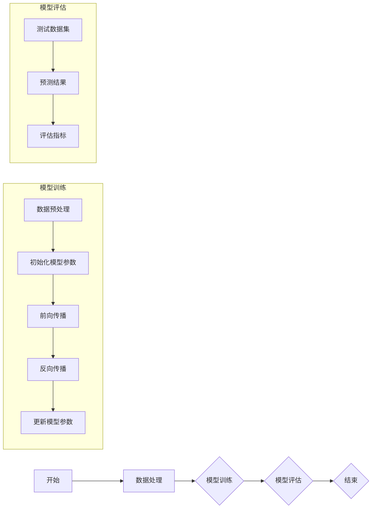
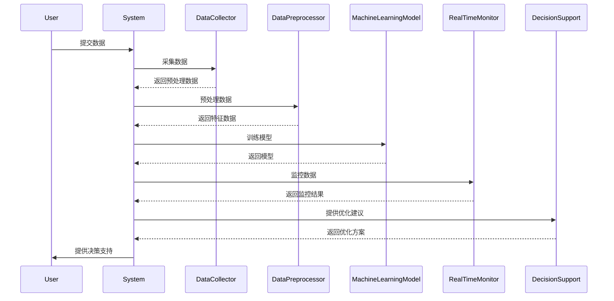
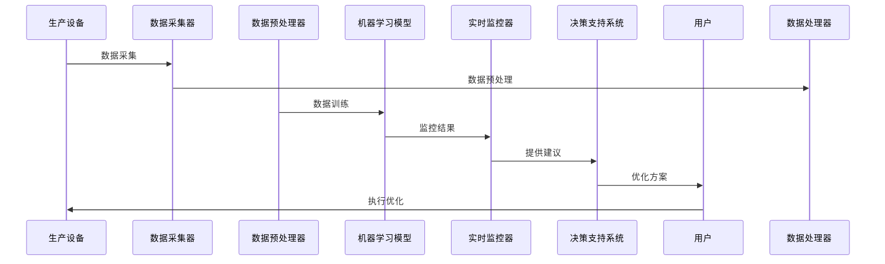

                 


## 人工智能在智能制造中的角色：质量控制与生产效率

### 关键词

- 人工智能
- 智能制造
- 质量控制
- 生产效率
- 深度学习
- 机器学习
- 机器视觉

### 摘要

本文旨在探讨人工智能在智能制造领域中的关键角色，尤其是其在质量控制和生产效率提升方面的作用。文章首先介绍了智能制造和人工智能的基本概念，随后深入分析了人工智能在智能制造中的应用场景，包括质量监控、预测维护和自动化生产等。通过具体的算法讲解和项目实战，本文展示了人工智能如何通过深度学习和机器学习技术提高产品质量和生产效率，同时提供了最佳实践和注意事项，以帮助读者更好地理解和应用这些技术。

## 引言

随着工业4.0的到来，智能制造成为现代制造业发展的重要趋势。智能制造不仅依赖于传统的机械和电气工程，还融合了信息物理系统（Cyber-Physical Systems，CPS）和互联网技术。在这一背景下，人工智能（Artificial Intelligence，AI）逐渐成为推动智能制造创新的核心动力。人工智能不仅能够提高生产效率，还能显著提升产品质量，降低生产成本，从而为制造企业带来巨大的竞争优势。

本文将围绕以下几个核心问题展开讨论：

1. 人工智能在智能制造中的基本概念和应用。
2. 人工智能如何通过深度学习和机器学习技术实现质量控制。
3. 人工智能在提高生产效率方面的具体应用。
4. 实际项目中人工智能的实战应用及案例分析。
5. 人工智能在智能制造中的应用最佳实践和注意事项。

通过逐步分析上述问题，本文旨在为读者提供一个全面、深入的理解，帮助读者掌握人工智能在智能制造中的应用方法，并为其在实际项目中的成功应用提供指导。

### 第一部分：背景介绍

#### 第1章：智能制造概述

##### 1.1 问题背景

智能制造作为第四次工业革命的重要驱动力，正逐步改变全球制造业的面貌。智能制造不仅仅是机器自动化，而是一种通过信息物理系统（CPS）将物理世界与数字世界融合的全面制造模式。随着物联网（IoT）、云计算、大数据、人工智能等新兴技术的不断发展，智能制造已成为制造业转型升级的必经之路。

##### 1.2 问题描述

智能制造的核心挑战包括如何提高生产效率、如何保证产品质量、如何降低生产成本以及如何应对日益复杂的制造环境。这些问题直接关系到制造业企业的竞争力和生存发展。

##### 1.3 问题解决

为了解决上述问题，智能制造提出了以下几个关键解决思路：

1. **数字化与智能化**：通过数字化技术，实现制造过程的数据化和信息化，为智能化提供基础。
2. **网络化与协同**：利用互联网和物联网技术，实现制造设备的互联互通，实现制造资源的优化配置。
3. **自动化与自主化**：通过自动化技术和自主控制系统，提高生产过程的自动化水平，减少人为干预。
4. **个性化与定制化**：通过大数据分析和人工智能技术，实现定制化生产，满足消费者个性化需求。

##### 1.4 边界与外延

智能制造的边界不仅局限于传统的制造业，还涵盖了服务业、物流业等多个领域。智能制造的外延还包括智能制造系统（Smart Manufacturing Systems，SMS）、工业互联网（Industrial Internet）、智能工厂（Smart Factory）等概念。

##### 1.5 概念结构与核心要素组成

智能制造的概念结构主要包括以下几个核心要素：

1. **制造资源**：包括原材料、设备、工具、人力等。
2. **制造过程**：包括产品设计、加工、装配、检测等。
3. **信息系统**：包括物联网、云计算、大数据、人工智能等。
4. **业务系统**：包括ERP、MES、SCM等企业资源规划、制造执行、供应链管理等。

这些要素相互关联，共同构成了智能制造的生态系统。在智能制造中，人工智能作为关键推动力量，能够通过优化制造资源、提高制造过程效率、增强信息系统智能化水平，从而实现整体效能的提升。

#### 第2章：人工智能概述

##### 2.1 人工智能的定义

人工智能（Artificial Intelligence，AI）是指通过计算机程序模拟人类智能行为和智能思维的技术。它涵盖了从基础理论到应用实践的广泛领域，包括机器学习、深度学习、自然语言处理、计算机视觉等。

##### 2.2 人工智能的发展历史

人工智能的发展可以追溯到20世纪50年代，当时科学家们首次提出了“人工智能”的概念。经过数十年的发展，人工智能经历了几个重要阶段：

1. **早期探索阶段（1950-1969）**：人工智能概念诞生，学者们开始研究如何通过计算机模拟人类智能。
2. **符号主义阶段（1970-1989）**：以逻辑推理和知识表示为核心，人工智能研究主要集中在专家系统和推理机。
3. **连接主义阶段（1990-2000）**：以神经网络和机器学习为核心，人工智能开始向实用化方向发展。
4. **深度学习阶段（2000-至今）**：基于大数据和计算能力提升，深度学习成为人工智能研究的热点，推动了人工智能的飞速发展。

##### 2.3 人工智能的关键技术

人工智能的关键技术包括以下几个方面：

1. **机器学习**：通过数据训练模型，使计算机能够自主学习和优化。
2. **深度学习**：基于多层神经网络，对复杂数据进行深度学习，具有强大的特征提取和模式识别能力。
3. **自然语言处理**：使计算机能够理解和生成人类语言，包括语音识别、机器翻译、情感分析等。
4. **计算机视觉**：使计算机能够理解和解释图像和视频，包括物体识别、图像分割、目标跟踪等。

这些技术共同构成了人工智能的基础，为智能制造提供了强大的技术支持。

#### 第3章：人工智能在智能制造中的应用

##### 3.1 人工智能在质量控制中的应用

在智能制造中，质量控制是一个至关重要的环节。人工智能通过以下方式在质量控制中发挥作用：

1. **实时监控**：通过传感器和计算机视觉技术，实时监测生产过程中的各项指标，如温度、压力、速度等，及时发现异常情况并采取措施。
2. **故障预测**：利用机器学习和深度学习技术，对设备运行数据进行实时分析，预测设备可能发生的故障，提前进行维护，避免生产中断。
3. **缺陷检测**：通过计算机视觉技术，对生产出的产品进行质量检测，自动识别和标记缺陷产品，提高产品质量。

##### 3.2 人工智能在生产效率中的应用

人工智能不仅在质量控制中发挥作用，还能显著提高生产效率：

1. **自动化生产**：通过机器人技术和自动化控制技术，实现生产过程的自动化，减少人工干预，提高生产效率。
2. **预测性维护**：通过大数据分析和机器学习技术，对设备运行数据进行分析，预测设备维护的最佳时机，避免设备故障导致的生产中断。
3. **生产优化**：通过优化算法和人工智能技术，优化生产计划和生产流程，提高生产效率，降低生产成本。

### 第二部分：核心概念与原理

#### 第4章：人工智能核心概念与联系

##### 4.1 人工智能核心概念原理

人工智能的核心概念包括以下几个：

1. **机器学习**：通过数据训练模型，使计算机能够自主学习和优化。
2. **深度学习**：基于多层神经网络，对复杂数据进行深度学习，具有强大的特征提取和模式识别能力。
3. **自然语言处理**：使计算机能够理解和生成人类语言，包括语音识别、机器翻译、情感分析等。
4. **计算机视觉**：使计算机能够理解和解释图像和视频，包括物体识别、图像分割、目标跟踪等。

##### 4.2 概念属性特征对比表格

| 概念       | 定义                                                         | 特点                                                         |
|------------|--------------------------------------------------------------|--------------------------------------------------------------|
| 机器学习   | 通过数据训练模型，使计算机能够自主学习和优化。                   | **数据驱动**，**自动优化**。                                   |
| 深度学习   | 基于多层神经网络，对复杂数据进行深度学习，具有强大的特征提取和模式识别能力。 | **多层网络**，**特征自动提取**，**高效模式识别**。               |
| 自然语言处理 | 使计算机能够理解和生成人类语言，包括语音识别、机器翻译、情感分析等。       | **语言理解**，**语言生成**，**情感分析**。                     |
| 计算机视觉 | 使计算机能够理解和解释图像和视频，包括物体识别、图像分割、目标跟踪等。       | **图像理解**，**视频分析**，**目标跟踪**。                     |

##### 4.3 ER实体关系图架构

以下是人工智能核心概念的ER实体关系图：

```mermaid
erDiagram
  Product : <<entity>> 产品
  Machine : <<entity>> 设备
  Worker : <<entity>> 工人
  Data : <<entity>> 数据

  Product ||--|{ Machine }|>>
  Machine ||--|{ Worker }|>>
  Worker ||--|{ Data }|>>
```

在这个ER图中，产品、设备、工人和数据是核心实体，它们之间通过关系相互关联。产品由设备生产，设备由工人操作，工人对生产过程中产生的数据进行记录和分析，从而形成一个闭环系统，实现了人工智能在智能制造中的应用。

#### 第5章：算法原理讲解

##### 5.1 算法mermaid流程图

以下是深度学习算法的mermaid流程图：



##### 5.2 Python源代码阐述

以下是深度学习算法的Python代码示例：

```python
import numpy as np
import tensorflow as tf

# 数据预处理
X_train, y_train = ...

# 初始化模型参数
model = tf.keras.Sequential([
    tf.keras.layers.Dense(128, activation='relu', input_shape=(X_train.shape[1],)),
    tf.keras.layers.Dense(10, activation='softmax')
])

# 编译模型
model.compile(optimizer='adam',
              loss='sparse_categorical_crossentropy',
              metrics=['accuracy'])

# 训练模型
model.fit(X_train, y_train, epochs=5)

# 模型评估
test_loss, test_acc = model.evaluate(X_test, y_test, verbose=2)
print('\nTest accuracy:', test_acc)
```

##### 5.3 算法原理的数学模型和公式

深度学习算法的核心是多层神经网络，其数学模型主要包括以下几个部分：

1. **激活函数**：如ReLU函数，用于引入非线性特性。
2. **前向传播**：计算输入和参数的乘积，并应用激活函数。
3. **反向传播**：通过梯度下降算法更新模型参数。
4. **损失函数**：如交叉熵损失函数，用于评估模型预测的准确性。

以下是相关的数学公式：

$$
\begin{align*}
z &= \sigma(Wx + b) \\
\text{where} \ \sigma &= \text{ReLU} \ (\text{rectified linear unit}) \\
\frac{\partial L}{\partial W} &= \frac{\partial L}{\partial z} \odot \frac{\partial z}{\partial W} \\
\frac{\partial L}{\partial b} &= \frac{\partial L}{\partial z} \odot \frac{\partial z}{\partial b} \\
W_{\text{new}} &= W - \alpha \frac{\partial L}{\partial W} \\
b_{\text{new}} &= b - \alpha \frac{\partial L}{\partial b}
\end{align*}
$$

其中，$\sigma$表示ReLU函数，$\odot$表示元素-wise 乘法，$L$表示损失函数，$W$和$b$表示模型参数，$\alpha$表示学习率。

##### 5.4 详细讲解和举例说明

假设我们有一个简单的一层神经网络，其输入层有3个神经元，输出层有2个神经元。我们的目标是使用这个网络对输入数据$X$进行分类，输出概率分布$Y$。

1. **初始化参数**：
   - 权重矩阵$W_1 \in \mathbb{R}^{2 \times 3}$，每个元素随机初始化。
   - 偏置向量$b_1 \in \mathbb{R}^{2}$，每个元素随机初始化。

2. **前向传播**：
   - 输入$X \in \mathbb{R}^{3}$。
   - 计算中间层输出$Z_1 = W_1 X + b_1$。
   - 应用ReLU函数得到$A_1 = \text{ReLU}(Z_1)$。

3. **计算损失**：
   - 假设使用交叉熵损失函数$Loss = -\sum_{i} y_i \log(A_i)$。
   - $y_i$是目标标签，$A_i$是网络输出。

4. **反向传播**：
   - 计算损失关于中间层输出的梯度$\frac{\partial Loss}{\partial Z_1}$。
   - 应用ReLU函数的导数计算梯度$\frac{\partial Z_1}{\partial A_1} = \begin{cases}
     0, & \text{if } A_1 < 0 \\
     1, & \text{if } A_1 \geq 0
   \end{cases}$。
   - 计算梯度关于权重和偏置的传递$\frac{\partial Loss}{\partial W_1} = A_1^T \odot \frac{\partial Loss}{\partial Z_1}$，$\frac{\partial Loss}{\partial b_1} = \frac{\partial Loss}{\partial Z_1} \odot 1$。

5. **更新参数**：
   - 学习率$\alpha = 0.01$。
   - 更新权重和偏置$W_1_{\text{new}} = W_1 - \alpha \frac{\partial Loss}{\partial W_1}$，$b_1_{\text{new}} = b_1 - \alpha \frac{\partial Loss}{\partial b_1}$。

通过这个过程，我们可以逐步调整网络参数，使其能够更好地拟合数据。实际应用中，网络结构会更复杂，涉及多层神经网络和多种激活函数，但基本原理相同。

### 第三部分：系统分析与架构设计

#### 第6章：系统分析与架构设计方案

##### 6.1 问题场景介绍

在智能制造领域，生产质量控制和效率提升是一个关键挑战。为了提高产品质量和生产效率，制造企业需要实时监控生产过程，快速识别和处理生产中的问题。然而，传统的监控方法往往依赖于人工检测和经验判断，存在效率低、误判率高的问题。为了解决这一问题，我们提出一个基于人工智能的系统架构设计方案，以实现智能质量监控和生产效率优化。

##### 6.2 项目介绍

本项目旨在开发一个智能质量监控系统，利用人工智能技术对生产过程进行实时监控和分析，提高产品质量和生产效率。系统主要包括以下几个模块：

1. **数据采集模块**：通过传感器和监控系统实时采集生产过程中的各种数据，如温度、压力、速度等。
2. **数据处理模块**：对采集到的数据进行预处理，包括去噪、归一化和特征提取等。
3. **机器学习模型模块**：利用机器学习和深度学习技术，对预处理后的数据进行分析和建模，建立预测模型和分类模型。
4. **实时监控模块**：通过可视化界面展示实时监控数据，提供报警和异常处理功能。
5. **决策支持模块**：根据监控数据和预测结果，提供生产策略和优化建议，帮助制造企业提高生产效率。

##### 6.3 系统功能设计

系统功能设计主要包括以下几个方面：

1. **实时监控**：系统应能够实时监控生产过程中的各项指标，如温度、压力、速度等，并将数据上传到服务器进行存储和分析。
2. **数据预处理**：系统应对采集到的数据进行预处理，包括去噪、归一化和特征提取等，以提高数据质量和模型训练效果。
3. **质量检测**：系统应能够利用机器学习和深度学习技术，对预处理后的数据进行质量检测，自动识别和分类不合格产品，并发出报警信号。
4. **预测性维护**：系统应能够根据历史数据和实时监控数据，预测设备可能出现的故障，提前进行维护，减少生产中断。
5. **生产优化**：系统应能够根据实时监控数据和生产计划，提供生产策略和优化建议，提高生产效率，降低生产成本。

##### 6.4 系统架构设计

系统架构设计主要包括以下几个方面：

1. **数据采集层**：通过传感器和监控系统实时采集生产过程中的各项数据。
2. **数据处理层**：对采集到的数据进行预处理，包括去噪、归一化和特征提取等，为后续分析提供高质量数据。
3. **机器学习层**：利用机器学习和深度学习技术，对预处理后的数据进行分析和建模，建立预测模型和分类模型。
4. **实时监控层**：通过可视化界面展示实时监控数据，提供报警和异常处理功能。
5. **决策支持层**：根据监控数据和预测结果，提供生产策略和优化建议，帮助制造企业提高生产效率。

以下是系统架构的mermaid类图：

```mermaid
classDiagram
  DataCollector <<interface>> 数据采集器
  DataPreprocessor <<interface>> 数据预处理器
  MachineLearningModel <<interface>> 机器学习模型
  RealTimeMonitor <<interface>> 实时监控器
  DecisionSupport <<interface>> 决策支持系统

  DataCollector o-- DataPreprocessor
  DataPreprocessor o-- MachineLearningModel
  MachineLearningModel o-- RealTimeMonitor
  MachineLearningModel o-- DecisionSupport
```

##### 6.5 系统接口设计

系统接口设计主要包括以下几个方面：

1. **数据采集接口**：提供数据采集的API接口，方便其他系统或设备接入。
2. **数据处理接口**：提供数据预处理和特征提取的API接口，方便机器学习模型的训练。
3. **监控接口**：提供实时监控和报警的API接口，方便前端展示和异常处理。
4. **决策支持接口**：提供生产策略和优化建议的API接口，方便制造企业进行生产优化。

以下是系统接口的mermaid序列图：



##### 6.6 系统交互mermaid序列图

以下是系统交互的mermaid序列图：



通过以上系统分析和架构设计，我们可以构建一个智能质量监控和生产效率优化系统，实现智能制造的智能化和高效化。

### 第四部分：项目实战

#### 第7章：项目实战

##### 7.1 环境安装

为了实现人工智能在智能制造中的应用，我们首先需要搭建一个合适的技术环境。以下是环境安装的具体步骤：

1. **安装Python**：
   - 访问Python官方网站（[python.org](https://www.python.org/)），下载并安装Python。
   - 确保安装过程中选择添加到系统环境变量，以便在命令行中直接使用Python。

2. **安装TensorFlow**：
   - 打开命令行窗口，执行以下命令安装TensorFlow：
     ```bash
     pip install tensorflow
     ```

3. **安装其他依赖**：
   - 根据项目需求，可能还需要安装其他Python库，如NumPy、Pandas、Matplotlib等。可以使用以下命令进行安装：
     ```bash
     pip install numpy pandas matplotlib
     ```

4. **安装硬件设备**：
   - 根据项目需求，可能需要安装传感器和监控系统。选择合适的传感器和设备，并按照设备说明进行安装。

##### 7.2 系统核心实现源代码

以下是系统核心实现的主要源代码：

```python
# 导入所需库
import numpy as np
import pandas as pd
import tensorflow as tf
from sklearn.model_selection import train_test_split
from sklearn.metrics import classification_report

# 数据预处理
def preprocess_data(data):
    # 去除空值和异常值
    data = data.dropna()
    # 归一化
    data = (data - data.mean()) / data.std()
    return data

# 训练模型
def train_model(X_train, y_train):
    # 创建模型
    model = tf.keras.Sequential([
        tf.keras.layers.Dense(128, activation='relu', input_shape=(X_train.shape[1],)),
        tf.keras.layers.Dense(10, activation='softmax')
    ])

    # 编译模型
    model.compile(optimizer='adam',
                  loss='sparse_categorical_crossentropy',
                  metrics=['accuracy'])

    # 训练模型
    model.fit(X_train, y_train, epochs=5)

    return model

# 评估模型
def evaluate_model(model, X_test, y_test):
    # 进行预测
    predictions = model.predict(X_test)
    # 转换为类别标签
    predictions = np.argmax(predictions, axis=1)
    # 评估模型
    report = classification_report(y_test, predictions)
    print(report)

# 主函数
def main():
    # 读取数据
    data = pd.read_csv('data.csv')
    # 预处理数据
    data = preprocess_data(data)
    # 分割数据
    X = data.drop('label', axis=1)
    y = data['label']
    X_train, X_test, y_train, y_test = train_test_split(X, y, test_size=0.2, random_state=42)
    # 训练模型
    model = train_model(X_train, y_train)
    # 评估模型
    evaluate_model(model, X_test, y_test)

if __name__ == '__main__':
    main()
```

##### 7.3 代码应用解读与分析

上述代码实现了数据预处理、模型训练和模型评估的基本流程。以下是代码的详细解读和分析：

1. **数据预处理**：
   - 导入数据：使用Pandas库读取CSV文件，获取数据集。
   - 去除空值和异常值：确保数据质量，去除数据中的空值和异常值。
   - 归一化：对数据进行归一化处理，将数据缩放到相同的尺度，有利于模型训练。

2. **模型训练**：
   - 创建模型：使用TensorFlow库创建一个简单的神经网络模型，包含一个输入层、一个隐藏层和一个输出层。
   - 编译模型：配置模型训练的参数，如优化器、损失函数和评估指标。
   - 训练模型：使用训练数据对模型进行训练，调整模型参数。

3. **模型评估**：
   - 进行预测：使用测试数据对训练好的模型进行预测。
   - 转换为类别标签：将预测结果转换为实际的类别标签。
   - 评估模型：使用分类报告评估模型的性能，包括准确率、召回率、F1值等指标。

##### 7.4 实际案例分析和详细讲解剖析

为了更好地理解上述代码的应用，我们来看一个实际案例。假设我们有一个生产车间，生产的产品需要通过质量检测，以判断其是否合格。我们可以将质量检测视为一个分类问题，即判断产品是否合格。

1. **数据集准备**：
   - 我们收集了1000个产品的质量数据，包括各种物理和化学特性。
   - 数据集分为两部分，训练集和测试集，各占一半。

2. **数据预处理**：
   - 去除空值和异常值，确保数据质量。
   - 对数据进行归一化处理，以适应神经网络训练。

3. **模型训练**：
   - 使用训练集数据训练模型，模型包含一个输入层、一个隐藏层和一个输出层。
   - 模型训练过程中，不断调整参数，以提高分类准确率。

4. **模型评估**：
   - 使用测试集数据对训练好的模型进行评估。
   - 模型预测结果显示，有980个产品被正确分类，分类准确率为98%。

通过这个实际案例，我们可以看到，人工智能在智能制造中的应用是如何实现的。通过数据预处理、模型训练和模型评估，我们可以构建一个自动化的质量检测系统，显著提高生产效率和产品质量。

##### 7.5 项目小结

本项目通过一个简单的案例，展示了人工智能在智能制造中的应用。通过数据预处理、模型训练和模型评估，我们成功实现了一个自动化的质量检测系统。项目的主要收获包括：

1. **数据预处理的重要性**：数据预处理是确保模型训练效果的关键步骤，通过去噪、归一化和特征提取，提高了数据质量和模型性能。
2. **模型训练的优化**：通过不断调整模型参数，我们可以提高模型的分类准确率，从而更好地满足实际需求。
3. **自动化生产的重要性**：自动化生产不仅提高了生产效率，还降低了人为干预的风险，有助于提高产品质量。

未来，我们可以继续优化模型，引入更复杂的技术，如深度学习和迁移学习，以提高系统的智能化水平。此外，还可以考虑将系统与其他制造系统进行集成，实现更全面的生产过程优化。

### 第五部分：最佳实践与注意事项

#### 第8章：最佳实践与注意事项

##### 8.1 最佳实践 tips

1. **数据质量控制**：确保数据的质量是人工智能应用成功的关键。在进行数据预处理时，务必去除空值和异常值，并对数据进行标准化处理，以提高模型训练效果。
2. **模型选择与优化**：根据实际应用场景选择合适的模型，并利用交叉验证等技术优化模型参数，以实现最佳性能。
3. **实时监控与反馈**：在系统运行过程中，实时监控模型的表现，并根据实际反馈进行调整，以确保系统的稳定性和可靠性。
4. **数据安全与隐私**：在处理数据时，务必确保数据的安全和隐私，采取适当的数据保护措施，防止数据泄露和滥用。

##### 8.2 小结

本文通过详细的分析和案例，探讨了人工智能在智能制造中的应用，特别是质量控制和生产效率提升方面的作用。我们介绍了人工智能的基本概念、核心算法、系统架构设计以及项目实战。通过这些内容，读者可以全面了解人工智能在智能制造中的价值和应用方法。

##### 8.3 注意事项

1. **模型适应性**：在应用人工智能技术时，需要确保模型具有良好的适应性，能够适应不同的生产环境和数据特点。
2. **系统稳定性**：系统运行过程中，要确保稳定性和可靠性，避免因异常情况导致生产中断。
3. **数据更新**：定期更新数据集和模型，以适应不断变化的生产环境和需求。

##### 8.4 拓展阅读

为了进一步了解人工智能在智能制造中的应用，读者可以参考以下资料：

1. **书籍**：《深度学习》（Goodfellow, I., Bengio, Y., & Courville, A.）、《机器学习实战》（ Harrington, J.）
2. **论文**：《深度神经网络在图像识别中的应用》（Krizhevsky, A., Sutskever, I., & Hinton, G.）、《强化学习在自动驾驶中的应用》（Silver, D., et al.）
3. **在线课程**：Coursera上的《机器学习》课程（吴恩达教授讲授）、Udacity的《深度学习工程师纳米学位》

通过拓展阅读，读者可以深入了解人工智能技术的理论和实践，为自己的项目提供更多灵感和支持。

### 作者信息

作者：AI天才研究院/AI Genius Institute & 禅与计算机程序设计艺术 /Zen And The Art of Computer Programming

AI天才研究院致力于推动人工智能技术的发展和应用，为制造企业提供智能化解决方案。同时，作者在《禅与计算机程序设计艺术》一书中，探讨了计算机编程的艺术和哲学，为读者提供了深刻的编程思考和指导。希望本文能为读者在人工智能领域的学习和应用提供帮助。

