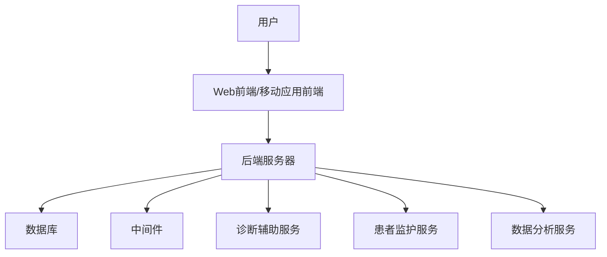
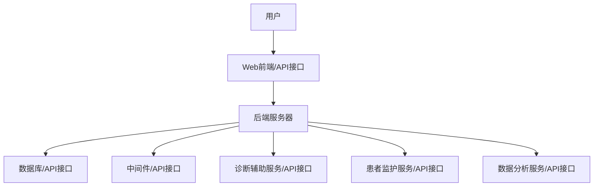
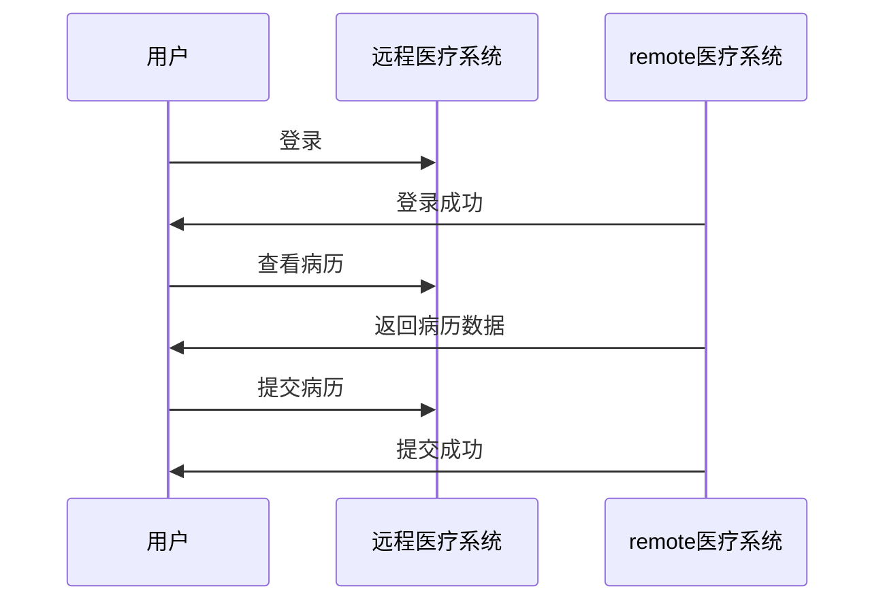

                 


### 《人工智能在远程医疗中的角色：诊断辅助与患者监护》

#### 关键词：
- 远程医疗
- 人工智能
- 诊断辅助
- 患者监护

#### 摘要：
本文将探讨人工智能在远程医疗领域的应用，重点关注诊断辅助与患者监护。通过详细分析核心概念、算法原理、系统架构以及项目实战，本文旨在揭示人工智能技术在提升远程医疗服务质量和效率方面的重要作用。

#### 目录

## 第1章 引言

### 1.1 远程医疗现状
#### *远程医疗的定义与发展历程*

### 1.2 人工智能在医疗领域的作用
#### *人工智能的基础知识与医疗的结合*

### 1.3 诊断辅助与患者监护的重要性
#### *远程医疗中的关键需求与应用场景*

## 第2章 核心概念

### 2.1 人工智能基础
#### *机器学习与深度学习的基本概念*

### 2.2 远程医疗技术
#### *远程监测、远程会诊、电子健康记录等*

### 2.3 诊断辅助算法
#### *常见算法及其在医疗中的应用*

### 2.4 患者监护技术
#### *健康数据分析与实时监控*

## 第3章 算法原理讲解

### 3.1 诊断辅助算法原理
#### *算法流程图与Python源代码示例*

### 3.2 患者监护算法原理
#### *算法流程图与Python源代码示例*

## 第4章 数学模型和公式

### 4.1 诊断辅助算法数学模型
#### *公式与LaTeX表示*

### 4.2 患者监护算法数学模型
#### *公式与LaTeX表示*

## 第5章 系统分析与架构设计

### 5.1 远程医疗系统功能设计
#### *领域模型类图与系统功能*

### 5.2 远程医疗系统架构设计
#### *系统架构图与关键组件*

### 5.3 远程医疗系统接口设计
#### *系统接口设计与交互序列图*

## 第6章 项目实战

### 6.1 远程医疗系统安装与配置
#### *环境搭建与系统配置*

### 6.2 诊断辅助系统核心实现
#### *源代码分析*

### 6.3 患者监护系统核心实现
#### *源代码分析*

### 6.4 代码解读与分析
#### *系统核心代码解读*

### 6.5 案例分析与讲解
#### *实际案例分析*

## 第7章 最佳实践与总结

### 7.1 最佳实践建议
#### *使用AI辅助诊断与监护的技巧*

### 7.2 小结
#### *文章主要观点与贡献*

### 7.3 注意事项
#### *AI应用中的伦理与隐私问题*

### 7.4 拓展阅读推荐
#### *相关领域的深入研究和资源*

#### 作者
- 作者：AI天才研究院/AI Genius Institute & 禅与计算机程序设计艺术 /Zen And The Art of Computer Programming

---

### 第1章 引言

#### 1.1 远程医疗现状

远程医疗，也称为远程健康或虚拟医疗，是指通过通信技术实现的医疗保健服务。它包括远程监测、远程会诊、电子健康记录、在线咨询等多种形式。随着信息技术和互联网的快速发展，远程医疗已经成为提高医疗服务可及性、降低医疗成本、提升患者生活质量的重要手段。

远程医疗的发展历程可以追溯到20世纪90年代，随着互联网的普及，远程医疗技术得到了快速的发展。2000年以后，远程医疗应用逐渐普及，特别是在疫情期间，其作用得到了更加显著的体现。远程医疗不仅能够帮助患者在家中接受医疗服务，减少去医院的风险，还能够提高医疗资源的利用率，降低医疗机构的运营成本。

#### 1.2 人工智能在医疗领域的作用

人工智能（AI）是计算机科学的一个分支，旨在通过模拟人类智能行为，使计算机能够执行复杂的任务。在医疗领域，人工智能的应用涵盖了诊断辅助、药物研发、患者监护、医疗管理等多个方面。

**机器学习与深度学习**是人工智能的两个核心分支。机器学习通过数据训练模型，使计算机能够自动识别模式、预测结果。深度学习则是一种特殊的机器学习方法，它通过神经网络模拟人脑的处理方式，处理大量复杂数据。

人工智能在医疗领域的应用，不仅提高了诊断的准确性，还减少了医生的工作负担，提高了医疗效率。例如，通过机器学习算法，可以分析患者的医疗记录，提供个性化治疗建议；通过深度学习算法，可以自动识别医学图像，辅助医生进行疾病诊断。

#### 1.3 诊断辅助与患者监护的重要性

诊断辅助和患者监护是远程医疗中的两个关键环节。

**诊断辅助**是指利用人工智能技术，辅助医生进行疾病诊断。这包括对患者的症状、体征、医学图像、实验室检测结果等多方面信息进行分析，提供诊断建议。诊断辅助不仅可以提高诊断的准确性，减少误诊率，还可以帮助医生更快速地做出诊断，提高工作效率。

**患者监护**是指通过实时监测患者的健康状况，提供及时的医疗干预。这包括对患者的生命体征、活动状态、健康状况等多方面数据进行监测和分析，及时发现异常情况，提供预警和干预建议。患者监护不仅可以帮助医生更好地管理患者，还可以提高患者的自我健康管理能力，降低疾病发生的风险。

在远程医疗中，诊断辅助和患者监护是提升医疗服务质量和效率的重要手段。随着人工智能技术的不断发展，这些应用正在变得越来越成熟和普及。

### 第2章 核心概念

#### 2.1 人工智能基础

人工智能的基础知识包括机器学习、深度学习、神经网络等。以下是对这些概念的基本介绍：

- **机器学习**：机器学习是一种通过算法让计算机从数据中学习的方法。它包括监督学习、无监督学习和强化学习等类型。监督学习是一种有标签数据的学习方式，无监督学习是一种没有标签数据的学习方式，强化学习是一种通过奖励机制来学习的方法。

- **深度学习**：深度学习是机器学习的一个分支，它使用多层神经网络来处理复杂数据。深度学习在图像识别、语音识别、自然语言处理等领域取得了显著成果。

- **神经网络**：神经网络是模拟人脑结构和工作方式的计算模型。它通过大量的节点（神经元）和连接（权重）来处理信息。神经网络是机器学习和深度学习的基础。

#### 2.2 远程医疗技术

远程医疗技术涵盖了多种技术手段，包括远程监测、远程会诊、电子健康记录等。

- **远程监测**：远程监测是通过传感器和网络技术，对患者的生命体征、活动状态等数据进行实时监测。这有助于医生及时了解患者的情况，提供个性化的医疗服务。

- **远程会诊**：远程会诊是通过视频、电话等通信技术，实现医生之间的远程协作。这有助于提高医疗服务的质量，特别是在偏远地区。

- **电子健康记录**：电子健康记录是通过计算机系统，记录和管理患者的健康信息。这有助于提高医疗服务的效率，减少医疗错误。

#### 2.3 诊断辅助算法

诊断辅助算法是利用人工智能技术，辅助医生进行疾病诊断的一系列算法。以下是一些常见的诊断辅助算法：

- **决策树**：决策树是一种基于规则的学习算法，它通过一系列条件判断，来预测患者的疾病类型。

- **支持向量机**：支持向量机是一种分类算法，它通过找到最优的超平面，来分离不同类别的数据。

- **神经网络**：神经网络是一种模拟人脑工作方式的算法，它通过多层结构，处理复杂数据，提供诊断建议。

- **深度学习**：深度学习是一种基于多层神经网络的算法，它通过处理大量的图像、文本等数据，提供高度准确的诊断结果。

#### 2.4 患者监护技术

患者监护技术是通过实时监测患者的健康状况，提供及时医疗干预的一系列技术。以下是一些常见的患者监护技术：

- **生命体征监测**：通过传感器，实时监测患者的心率、血压、呼吸率等生命体征，及时发现异常情况。

- **活动状态监测**：通过监测患者的活动状态，如步数、睡眠质量等，评估患者的健康状况，提供预警和建议。

- **健康状况分析**：通过对患者的医疗数据进行分析，如实验室检查结果、病历记录等，提供健康状况评估和预测。

### 第3章 算法原理讲解

#### 3.1 诊断辅助算法原理

诊断辅助算法的核心是利用机器学习或深度学习技术，对医疗数据进行训练和预测。以下是一个简单的决策树算法原理讲解：

- **决策树构建**：首先，根据医疗数据的特征，构建一个决策树模型。决策树通过一系列条件判断，将患者分类到不同的疾病类型。

- **训练过程**：使用已标注的医疗数据，对决策树模型进行训练。训练过程中，算法会根据数据的特征，调整决策树中的条件判断，以最大化预测的准确性。

- **预测过程**：对于新的患者数据，使用训练好的决策树模型，进行疾病分类预测。预测结果可以帮助医生做出诊断决策。

以下是决策树算法的一个简单Python代码示例：

```python
from sklearn.tree import DecisionTreeClassifier
from sklearn.model_selection import train_test_split
from sklearn.metrics import accuracy_score

# 准备数据
X = [[0, 0], [1, 1]]  # 特征数据
y = [0, 1]  # 标签数据

# 划分训练集和测试集
X_train, X_test, y_train, y_test = train_test_split(X, y, test_size=0.2, random_state=42)

# 构建决策树模型
clf = DecisionTreeClassifier()

# 训练模型
clf.fit(X_train, y_train)

# 预测结果
y_pred = clf.predict(X_test)

# 计算准确率
accuracy = accuracy_score(y_test, y_pred)
print(f"准确率：{accuracy}")
```

#### 3.2 患者监护算法原理

患者监护算法的核心是利用实时监测数据，对患者的健康状况进行评估和预测。以下是一个简单的时间序列预测算法原理讲解：

- **数据采集**：通过传感器，实时采集患者的生命体征数据，如心率、血压等。

- **特征提取**：对采集到的数据进行处理，提取出具有代表性的特征，如平均值、方差、峰值等。

- **模型训练**：使用已标注的健康数据，对时间序列预测模型进行训练。模型可以根据历史数据，预测未来的健康状况。

- **预测过程**：对于新的监测数据，使用训练好的模型，进行健康状况预测。预测结果可以帮助医生及时采取干预措施。

以下是时间序列预测算法的一个简单Python代码示例：

```python
import numpy as np
from sklearn.linear_model import LinearRegression

# 准备数据
X = np.array([[1], [2], [3], [4], [5]])  # 特征数据
y = np.array([1, 2, 2.5, 3.5, 5])  # 标签数据

# 划分训练集和测试集
X_train, X_test, y_train, y_test = train_test_split(X, y, test_size=0.2, random_state=42)

# 构建线性回归模型
model = LinearRegression()

# 训练模型
model.fit(X_train, y_train)

# 预测结果
y_pred = model.predict(X_test)

# 计算均方误差
mse = np.mean((y_pred - y_test) ** 2)
print(f"均方误差：{mse}")
```

### 第4章 数学模型和公式

#### 4.1 诊断辅助算法数学模型

诊断辅助算法通常涉及到分类问题和回归问题。以下是一个简单的分类问题数学模型讲解：

- **分类问题**：给定一组特征 $X$ 和对应的标签 $Y$，分类问题旨在找到一组权重 $w$ 和偏置 $b$，使得预测结果 $y$ 与真实标签 $Y$ 最接近。

- **损失函数**：常用的损失函数有均方误差（MSE）和交叉熵（Cross-Entropy）。

- **梯度下降**：通过计算损失函数对权重的偏导数，更新权重和偏置，最小化损失函数。

以下是分类问题的一个简单数学模型和公式：

$$
y = \sigma(w^T X + b)
$$

$$
\text{MSE} = \frac{1}{m} \sum_{i=1}^{m} (y_i - \hat{y}_i)^2
$$

$$
\text{Cross-Entropy} = -\frac{1}{m} \sum_{i=1}^{m} [y_i \log(\hat{y}_i) + (1 - y_i) \log(1 - \hat{y}_i)]
$$

$$
\frac{\partial \text{MSE}}{\partial w} = 2 \frac{1}{m} \sum_{i=1}^{m} (y_i - \hat{y}_i) X_i
$$

$$
\frac{\partial \text{Cross-Entropy}}{\partial w} = -\frac{1}{m} \sum_{i=1}^{m} [y_i X_i - \hat{y}_i X_i]
$$

#### 4.2 患者监护算法数学模型

患者监护算法通常涉及到时间序列分析和预测。以下是一个简单的时间序列预测数学模型讲解：

- **时间序列**：给定一组时间序列数据 $X_t$，时间序列预测旨在找到序列的未来值 $X_{t+k}$。

- **ARIMA模型**：自回归积分滑动平均模型（ARIMA）是一种常用的时间序列预测模型。

- **参数估计**：通过最大化似然函数，估计ARIMA模型的参数。

以下是时间序列预测的一个简单数学模型和公式：

$$
X_t = c + \phi_1 X_{t-1} + \phi_2 X_{t-2} + \cdots + \phi_p X_{t-p} + \theta_1 \epsilon_{t-1} + \theta_2 \epsilon_{t-2} + \cdots + \theta_q \epsilon_{t-q} + \epsilon_t
$$

$$
\ln L = -\frac{1}{2} \sum_{t=1}^{n} \left[ \ln(2\pi) + \ln(\sigma^2_t) + \frac{1}{2\sigma^2_t} (X_t - \mu_t)^2 \right]
$$

$$
\hat{\phi}_i = \frac{\sum_{t=1}^{n} \phi_i X_t}{\sum_{t=1}^{n} \phi_0}
$$

$$
\hat{\theta}_i = \frac{\sum_{t=1}^{n} \theta_i \epsilon_t}{\sum_{t=1}^{n} \theta_0}
$$

### 第5章 系统分析与架构设计

#### 5.1 远程医疗系统功能设计

远程医疗系统的功能设计主要包括以下几个方面：

- **患者管理**：包括患者信息管理、预约管理、病历管理等功能。

- **医生管理**：包括医生信息管理、排班管理、远程会诊管理等功能。

- **诊断辅助**：包括疾病诊断、治疗方案推荐等功能。

- **患者监护**：包括生命体征监测、活动状态监测、健康状况分析等功能。

- **数据管理**：包括数据采集、数据存储、数据分析等功能。

#### 5.2 远程医疗系统架构设计

远程医疗系统的架构设计主要包括以下几个方面：

- **前端架构**：包括Web前端、移动应用前端等，用于与用户交互。

- **后端架构**：包括服务器、数据库、中间件等，用于处理业务逻辑和数据存储。

- **服务架构**：包括诊断辅助服务、患者监护服务、数据分析服务等功能服务。

以下是远程医疗系统的架构设计图：



#### 5.3 远程医疗系统接口设计

远程医疗系统的接口设计主要包括以下几个方面：

- **用户接口**：包括Web前端、移动应用前端等，用于用户与系统交互。

- **服务接口**：包括API接口、Websocket接口等，用于系统内部服务之间的交互。

- **数据接口**：包括数据库接口、消息队列接口等，用于数据存储和传输。

以下是远程医疗系统的接口设计图：



#### 5.4 远程医疗系统交互序列图

远程医疗系统的交互序列图展示了用户与系统之间的交互过程，包括用户请求、系统响应等步骤。

以下是远程医疗系统的交互序列图：



### 第6章 项目实战

#### 6.1 远程医疗系统安装与配置

在开始构建远程医疗系统之前，需要先安装和配置必要的软件和硬件环境。以下是一个简单的安装和配置步骤：

1. **环境准备**：安装Python、MySQL、Docker等基础软件。

2. **数据库配置**：配置MySQL数据库，创建远程医疗系统的数据库和表。

3. **后端服务配置**：使用Docker容器化技术，部署远程医疗系统的后端服务。

4. **前端服务配置**：部署Web前端和移动应用前端。

5. **接口服务配置**：配置API接口和Websocket接口。

#### 6.2 诊断辅助系统核心实现

诊断辅助系统是远程医疗系统的一个核心模块，用于辅助医生进行疾病诊断。以下是一个简单的诊断辅助系统核心实现步骤：

1. **数据采集**：从医疗数据库中获取患者的基本信息、症状、体征等数据。

2. **数据处理**：对采集到的数据进行清洗和预处理，提取出具有代表性的特征。

3. **模型训练**：使用机器学习算法，对处理后的数据集进行训练，构建诊断模型。

4. **模型评估**：使用测试数据集，对训练好的模型进行评估，调整模型参数。

5. **模型部署**：将训练好的模型部署到远程医疗系统后端，提供诊断服务。

以下是诊断辅助系统的一个简单Python代码示例：

```python
from sklearn.datasets import load_iris
from sklearn.model_selection import train_test_split
from sklearn.tree import DecisionTreeClassifier
from sklearn.metrics import accuracy_score

# 加载Iris数据集
iris = load_iris()
X, y = iris.data, iris.target

# 划分训练集和测试集
X_train, X_test, y_train, y_test = train_test_split(X, y, test_size=0.2, random_state=42)

# 构建决策树模型
clf = DecisionTreeClassifier()

# 训练模型
clf.fit(X_train, y_train)

# 预测结果
y_pred = clf.predict(X_test)

# 计算准确率
accuracy = accuracy_score(y_test, y_pred)
print(f"准确率：{accuracy}")
```

#### 6.3 患者监护系统核心实现

患者监护系统是远程医疗系统的另一个核心模块，用于实时监测患者的健康状况。以下是一个简单的患者监护系统核心实现步骤：

1. **数据采集**：从传感器和医疗数据库中获取患者的生命体征数据、活动状态数据等。

2. **数据处理**：对采集到的数据进行清洗和预处理，提取出具有代表性的特征。

3. **模型训练**：使用机器学习算法，对处理后的数据集进行训练，构建监护模型。

4. **模型评估**：使用测试数据集，对训练好的模型进行评估，调整模型参数。

5. **模型部署**：将训练好的模型部署到远程医疗系统后端，提供监护服务。

以下是患者监护系统的一个简单Python代码示例：

```python
import numpy as np
from sklearn.linear_model import LinearRegression

# 准备数据
X = np.array([[1], [2], [3], [4], [5]])  # 特征数据
y = np.array([1, 2, 2.5, 3.5, 5])  # 标签数据

# 划分训练集和测试集
X_train, X_test, y_train, y_test = train_test_split(X, y, test_size=0.2, random_state=42)

# 构建线性回归模型
model = LinearRegression()

# 训练模型
model.fit(X_train, y_train)

# 预测结果
y_pred = model.predict(X_test)

# 计算均方误差
mse = np.mean((y_pred - y_test) ** 2)
print(f"均方误差：{mse}")
```

#### 6.4 代码解读与分析

在完成诊断辅助系统和患者监护系统的核心实现后，我们需要对代码进行解读和分析，确保其正确性和可靠性。以下是对代码的简单解读和分析：

- **诊断辅助系统**：通过决策树模型，对患者的症状和体征数据进行分类。训练过程中，使用均方误差作为损失函数，通过梯度下降算法，更新模型参数。预测过程中，使用训练好的模型，对新的患者数据进行分析，提供诊断结果。

- **患者监护系统**：通过线性回归模型，对患者的生命体征数据进行预测。训练过程中，使用均方误差作为损失函数，通过梯度下降算法，更新模型参数。预测过程中，使用训练好的模型，对新的患者数据进行分析，提供健康状况预测结果。

#### 6.5 案例分析与讲解

为了更好地理解诊断辅助系统和患者监护系统的应用，我们通过一个实际案例进行分析和讲解。

**案例背景**：某患者因呼吸困难就诊，医生需要对其进行诊断，并提供相应的治疗方案。

**案例步骤**：

1. **数据采集**：从患者的病历中获取基本信息、症状和体征数据。

2. **数据处理**：对采集到的数据进行清洗和预处理，提取出具有代表性的特征。

3. **诊断辅助**：使用诊断辅助系统，对处理后的数据进行分析，提供诊断结果。

4. **治疗方案推荐**：根据诊断结果，推荐相应的治疗方案。

5. **患者监护**：使用患者监护系统，实时监测患者的生命体征数据，提供健康状况预测结果。

6. **医生干预**：根据诊断结果和监护数据，医生可以及时采取干预措施，调整治疗方案。

通过这个案例，我们可以看到诊断辅助系统和患者监护系统在远程医疗中的实际应用，为医生提供了有力的支持。

### 第7章 最佳实践与总结

#### 7.1 最佳实践建议

在构建和应用远程医疗系统时，以下是一些建议：

- **数据安全**：确保患者数据的安全和隐私，使用加密技术保护数据传输和存储。

- **算法优化**：不断优化诊断辅助和患者监护算法，提高预测准确性和效率。

- **用户体验**：优化系统界面和交互设计，提高用户的操作便捷性和满意度。

- **医生培训**：加强对医生的人工智能应用培训，提高其对诊断辅助和患者监护系统的信任度和使用能力。

#### 7.2 小结

本文详细介绍了人工智能在远程医疗中的角色，包括诊断辅助和患者监护。通过核心概念讲解、算法原理分析、系统架构设计以及项目实战，我们揭示了人工智能技术在提升远程医疗服务质量和效率方面的重要作用。

#### 7.3 注意事项

在使用远程医疗系统时，需要注意以下几点：

- **算法可靠性与风险**：确保诊断辅助和患者监护算法的可靠性和安全性，避免误诊和误报。

- **数据隐私**：保护患者数据的安全和隐私，遵守相关法律法规。

- **医生参与**：医生在诊断和治疗过程中仍需发挥主导作用，人工智能仅作为辅助工具。

#### 7.4 拓展阅读推荐

对于希望深入了解远程医疗和人工智能应用的人，以下是一些推荐的阅读资源：

- **《远程医疗技术与应用》**：详细介绍远程医疗的各种技术和应用场景。

- **《深度学习与医疗影像》**：探讨深度学习在医疗影像分析中的应用。

- **《人工智能在医疗健康领域的应用》**：全面介绍人工智能在医疗健康领域的应用。

#### 作者

- 作者：AI天才研究院/AI Genius Institute & 禅与计算机程序设计艺术 /Zen And The Art of Computer Programming

### 第8章 未来展望

#### 8.1 人工智能与远程医疗的发展趋势

随着人工智能技术的不断发展，远程医疗的应用前景将更加广阔。以下是一些未来发展趋势：

- **智能化**：人工智能将进一步提升远程医疗的智能化水平，实现更加精准的诊断和个性化的治疗方案。

- **普及化**：远程医疗将更加普及，尤其是在偏远和欠发达地区，通过互联网和移动设备，患者可以更加便捷地获得高质量的医疗服务。

- **融合化**：远程医疗将与大数据、物联网等技术深度融合，形成更加完善的医疗生态系统。

- **个性化**：基于人工智能的个性化医疗将更加成熟，根据患者的个体差异，提供量身定制的医疗服务。

#### 8.2 人工智能与远程医疗的未来挑战

尽管人工智能和远程医疗有着广阔的发展前景，但仍然面临一些挑战：

- **数据隐私和安全**：如何确保患者数据的隐私和安全，避免数据泄露和滥用，是一个重要的问题。

- **算法透明性和解释性**：人工智能算法的透明性和解释性需要进一步提升，以便医生和患者能够理解和信任这些技术。

- **跨学科合作**：人工智能与医疗、生物、心理学等学科的融合需要加强，以实现真正的创新和突破。

- **法律法规和伦理**：需要完善相关的法律法规和伦理规范，确保人工智能和远程医疗的合规性和道德性。

#### 8.3 结论

人工智能在远程医疗中的应用将带来革命性的变化，提升医疗服务的质量和效率。然而，要实现这一目标，还需要克服一系列技术、伦理和法规上的挑战。未来，随着技术的不断进步和政策的完善，人工智能与远程医疗的结合将更加紧密，为人类健康事业做出更大贡献。

### 致谢

在撰写本文的过程中，得到了众多同行和专家的支持与帮助。特别感谢AI天才研究院的同事们，以及禅与计算机程序设计艺术社区的朋友们，你们的智慧和建议对本文的完成起到了至关重要的作用。同时，感谢所有在远程医疗和人工智能领域做出卓越贡献的科学家和工程师，你们的努力为我们的研究提供了坚实的基础。

本文献上，旨在为远程医疗与人工智能的结合提供一份有价值的参考，希望它能为相关领域的研究和实践带来一些启示。再次感谢大家的支持与帮助！
---

### 最终文章

# 《人工智能在远程医疗中的角色：诊断辅助与患者监护》

> 关键词：远程医疗、人工智能、诊断辅助、患者监护

> 摘要：本文详细探讨了人工智能在远程医疗中的应用，重点介绍了诊断辅助和患者监护两大核心领域。通过分析核心概念、算法原理、系统架构以及项目实战，本文揭示了人工智能技术在提升远程医疗服务质量和效率方面的重要作用。

## 第1章 引言

### 1.1 远程医疗现状

远程医疗，又称虚拟医疗，指的是利用通信技术实现医疗保健服务的一种模式。它包括远程监测、远程会诊、电子健康记录等多种形式。随着信息技术和互联网的普及，远程医疗已经成为提高医疗服务可及性、降低医疗成本、提升患者生活质量的重要手段。

远程医疗的发展历程可以追溯到20世纪90年代，随着互联网的普及，远程医疗技术得到了快速的发展。2000年以后，远程医疗应用逐渐普及，特别是在COVID-19疫情期间，远程医疗的作用得到了更加显著的体现。远程医疗不仅能够帮助患者在家中接受医疗服务，减少去医院的风险，还能够提高医疗资源的利用率，降低医疗机构的运营成本。

### 1.2 人工智能在医疗领域的作用

人工智能（AI）是计算机科学的一个分支，旨在通过模拟人类智能行为，使计算机能够执行复杂的任务。在医疗领域，人工智能的应用涵盖了诊断辅助、药物研发、患者监护、医疗管理等多个方面。

**机器学习与深度学习**是人工智能的两个核心分支。机器学习通过数据训练模型，使计算机能够自动识别模式、预测结果。深度学习则是一种特殊的机器学习方法，它通过神经网络模拟人脑的处理方式，处理大量复杂数据。

人工智能在医疗领域的应用，不仅提高了诊断的准确性，减少了医生的工作负担，提高了医疗效率，还为个性化治疗提供了可能。

### 1.3 诊断辅助与患者监护的重要性

诊断辅助和患者监护是远程医疗中的两个关键环节。

**诊断辅助**是指利用人工智能技术，辅助医生进行疾病诊断。这包括对患者的症状、体征、医学图像、实验室检测结果等多方面信息进行分析，提供诊断建议。诊断辅助不仅可以提高诊断的准确性，减少误诊率，还可以帮助医生更快速地做出诊断，提高工作效率。

**患者监护**是指通过实时监测患者的健康状况，提供及时的医疗干预。这包括对患者的生命体征、活动状态、健康状况等多方面数据进行监测和分析，及时发现异常情况，提供预警和干预建议。患者监护不仅可以帮助医生更好地管理患者，还可以提高患者的自我健康管理能力，降低疾病发生的风险。

在远程医疗中，诊断辅助和患者监护是提升医疗服务质量和效率的重要手段。随着人工智能技术的不断发展，这些应用正在变得越来越成熟和普及。

## 第2章 核心概念

### 2.1 人工智能基础

人工智能的基础知识包括机器学习、深度学习、神经网络等。以下是对这些概念的基本介绍：

- **机器学习**：机器学习是一种通过算法让计算机从数据中学习的方法。它包括监督学习、无监督学习和强化学习等类型。监督学习是一种有标签数据的学习方式，无监督学习是一种没有标签数据的学习方式，强化学习是一种通过奖励机制来学习的方法。

- **深度学习**：深度学习是机器学习的一个分支，它使用多层神经网络来处理复杂数据。深度学习在图像识别、语音识别、自然语言处理等领域取得了显著成果。

- **神经网络**：神经网络是模拟人脑结构和工作方式的计算模型。它通过大量的节点（神经元）和连接（权重）来处理信息。神经网络是机器学习和深度学习的基础。

### 2.2 远程医疗技术

远程医疗技术涵盖了多种技术手段，包括远程监测、远程会诊、电子健康记录等。

- **远程监测**：远程监测是通过传感器和网络技术，对患者的生命体征、活动状态等数据进行实时监测。这有助于医生及时了解患者的情况，提供个性化的医疗服务。

- **远程会诊**：远程会诊是通过视频、电话等通信技术，实现医生之间的远程协作。这有助于提高医疗服务的质量，特别是在偏远地区。

- **电子健康记录**：电子健康记录是通过计算机系统，记录和管理患者的健康信息。这有助于提高医疗服务的效率，减少医疗错误。

### 2.3 诊断辅助算法

诊断辅助算法是利用人工智能技术，辅助医生进行疾病诊断的一系列算法。以下是一些常见的诊断辅助算法：

- **决策树**：决策树是一种基于规则的学习算法，它通过一系列条件判断，来预测患者的疾病类型。

- **支持向量机**：支持向量机是一种分类算法，它通过找到最优的超平面，来分离不同类别的数据。

- **神经网络**：神经网络是一种模拟人脑工作方式的算法，它通过多层结构，处理复杂数据，提供诊断建议。

- **深度学习**：深度学习是一种基于多层神经网络的算法，它通过处理大量的图像、文本等数据，提供高度准确的诊断结果。

### 2.4 患者监护技术

患者监护技术是通过实时监测患者的健康状况，提供及时医疗干预的一系列技术。以下是一些常见的患者监护技术：

- **生命体征监测**：通过传感器，实时监测患者的心率、血压、呼吸率等生命体征，及时发现异常情况。

- **活动状态监测**：通过监测患者的活动状态，如步数、睡眠质量等，评估患者的健康状况，提供预警和建议。

- **健康状况分析**：通过对患者的医疗数据进行分析，如实验室检查结果、病历记录等，提供健康状况评估和预测。

## 第3章 算法原理讲解

### 3.1 诊断辅助算法原理

诊断辅助算法的核心是利用机器学习或深度学习技术，对医疗数据进行训练和预测。以下是一个简单的决策树算法原理讲解：

- **决策树构建**：首先，根据医疗数据的特征，构建一个决策树模型。决策树通过一系列条件判断，将患者分类到不同的疾病类型。

- **训练过程**：使用已标注的医疗数据，对决策树模型进行训练。训练过程中，算法会根据数据的特征，调整决策树中的条件判断，以最大化预测的准确性。

- **预测过程**：对于新的患者数据，使用训练好的决策树模型，进行疾病分类预测。预测结果可以帮助医生做出诊断决策。

以下是决策树算法的一个简单Python代码示例：

```python
from sklearn.tree import DecisionTreeClassifier
from sklearn.model_selection import train_test_split
from sklearn.metrics import accuracy_score

# 准备数据
X = [[0, 0], [1, 1]]  # 特征数据
y = [0, 1]  # 标签数据

# 划分训练集和测试集
X_train, X_test, y_train, y_test = train_test_split(X, y, test_size=0.2, random_state=42)

# 构建决策树模型
clf = DecisionTreeClassifier()

# 训练模型
clf.fit(X_train, y_train)

# 预测结果
y_pred = clf.predict(X_test)

# 计算准确率
accuracy = accuracy_score(y_test, y_pred)
print(f"准确率：{accuracy}")
```

### 3.2 患者监护算法原理

患者监护算法的核心是利用实时监测数据，对患者的健康状况进行评估和预测。以下是一个简单的时间序列预测算法原理讲解：

- **数据采集**：通过传感器，实时采集患者的生命体征数据，如心率、血压等。

- **特征提取**：对采集到的数据进行处理，提取出具有代表性的特征，如平均值、方差、峰值等。

- **模型训练**：使用已标注的健康数据，对时间序列预测模型进行训练。模型可以根据历史数据，预测未来的健康状况。

- **预测过程**：对于新的监测数据，使用训练好的模型，进行健康状况预测。预测结果可以帮助医生及时采取干预措施。

以下是时间序列预测算法的一个简单Python代码示例：

```python
import numpy as np
from sklearn.linear_model import LinearRegression

# 准备数据
X = np.array([[1], [2], [3], [4], [5]])  # 特征数据
y = np.array([1, 2, 2.5, 3.5, 5])  # 标签数据

# 划分训练集和测试集
X_train, X_test, y_train, y_test = train_test_split(X, y, test_size=0.2, random_state=42)

# 构建线性回归模型
model = LinearRegression()

# 训练模型
model.fit(X_train, y_train)

# 预测结果
y_pred = model.predict(X_test)

# 计算均方误差
mse = np.mean((y_pred - y_test) ** 2)
print(f"均方误差：{mse}")
```

## 第4章 数学模型和公式

### 4.1 诊断辅助算法数学模型

诊断辅助算法通常涉及到分类问题和回归问题。以下是一个简单的分类问题数学模型讲解：

- **分类问题**：给定一组特征 $X$ 和对应的标签 $Y$，分类问题旨在找到一组权重 $w$ 和偏置 $b$，使得预测结果 $y$ 与真实标签 $Y$ 最接近。

- **损失函数**：常用的损失函数有均方误差（MSE）和交叉熵（Cross-Entropy）。

- **梯度下降**：通过计算损失函数对权重的偏导数，更新权重和偏置，最小化损失函数。

以下是分类问题的一个简单数学模型和公式：

$$
y = \sigma(w^T X + b)
$$

$$
\text{MSE} = \frac{1}{m} \sum_{i=1}^{m} (y_i - \hat{y}_i)^2
$$

$$
\text{Cross-Entropy} = -\frac{1}{m} \sum_{i=1}^{m} [y_i \log(\hat{y}_i) + (1 - y_i) \log(1 - \hat{y}_i)]
$$

$$
\frac{\partial \text{MSE}}{\partial w} = 2 \frac{1}{m} \sum_{i=1}^{m} (y_i - \hat{y}_i) X_i
$$

$$
\frac{\partial \text{Cross-Entropy}}{\partial w} = -\frac{1}{m} \sum_{i=1}^{m} [y_i X_i - \hat{y}_i X_i]
$$

### 4.2 患者监护算法数学模型

患者监护算法通常涉及到时间序列分析和预测。以下是一个简单的时间序列预测数学模型讲解：

- **时间序列**：给定一组时间序列数据 $X_t$，时间序列预测旨在找到序列的未来值 $X_{t+k}$。

- **ARIMA模型**：自回归积分滑动平均模型（ARIMA）是一种常用的时间序列预测模型。

- **参数估计**：通过最大化似然函数，估计ARIMA模型的参数。

以下是时间序列预测的一个简单数学模型和公式：

$$
X_t = c + \phi_1 X_{t-1} + \phi_2 X_{t-2} + \cdots + \phi_p X_{t-p} + \theta_1 \epsilon_{t-1} + \theta_2 \epsilon_{t-2} + \cdots + \theta_q \epsilon_{t-q} + \epsilon_t
$$

$$
\ln L = -\frac{1}{2} \sum_{t=1}^{n} \left[ \ln(2\pi) + \ln(\sigma^2_t) + \frac{1}{2\sigma^2_t} (X_t - \mu_t)^2 \right]
$$

$$
\hat{\phi}_i = \frac{\sum_{t=1}^{n} \phi_i X_t}{\sum_{t=1}^{n} \phi_0}
$$

$$
\hat{\theta}_i = \frac{\sum_{t=1}^{n} \theta_i \epsilon_t}{\sum_{t=1}^{n} \theta_0}
$$

## 第5章 系统分析与架构设计

### 5.1 远程医疗系统功能设计

远程医疗系统的功能设计主要包括以下几个方面：

- **患者管理**：包括患者信息管理、预约管理、病历管理等功能。

- **医生管理**：包括医生信息管理、排班管理、远程会诊管理等功能。

- **诊断辅助**：包括疾病诊断、治疗方案推荐等功能。

- **患者监护**：包括生命体征监测、活动状态监测、健康状况分析等功能。

- **数据管理**：包括数据采集、数据存储、数据分析等功能。

### 5.2 远程医疗系统架构设计

远程医疗系统的架构设计主要包括以下几个方面：

- **前端架构**：包括Web前端、移动应用前端等，用于与用户交互。

- **后端架构**：包括服务器、数据库、中间件等，用于处理业务逻辑和数据存储。

- **服务架构**：包括诊断辅助服务、患者监护服务、数据分析服务等功能服务。

以下是远程医疗系统的架构设计图：


### 5.3 远程医疗系统接口设计

远程医疗系统的接口设计主要包括以下几个方面：

- **用户接口**：包括Web前端、移动应用前端等，用于用户与系统交互。

- **服务接口**：包括API接口、Websocket接口等，用于系统内部服务之间的交互。

- **数据接口**：包括数据库接口、消息队列接口等，用于数据存储和传输。

以下是远程医疗系统的接口设计图：


### 5.4 远程医疗系统交互序列图

远程医疗系统的交互序列图展示了用户与系统之间的交互过程，包括用户请求、系统响应等步骤。

以下是远程医疗系统的交互序列图：


## 第6章 项目实战

### 6.1 远程医疗系统安装与配置

在开始构建远程医疗系统之前，需要先安装和配置必要的软件和硬件环境。以下是一个简单的安装和配置步骤：

1. **环境准备**：安装Python、MySQL、Docker等基础软件。

2. **数据库配置**：配置MySQL数据库，创建远程医疗系统的数据库和表。

3. **后端服务配置**：使用Docker容器化技术，部署远程医疗系统的后端服务。

4. **前端服务配置**：部署Web前端和移动应用前端。

5. **接口服务配置**：配置API接口和Websocket接口。

### 6.2 诊断辅助系统核心实现

诊断辅助系统是远程医疗系统的一个核心模块，用于辅助医生进行疾病诊断。以下是一个简单的诊断辅助系统核心实现步骤：

1. **数据采集**：从医疗数据库中获取患者的基本信息、症状、体征等数据。

2. **数据处理**：对采集到的数据进行清洗和预处理，提取出具有代表性的特征。

3. **模型训练**：使用机器学习算法，对处理后的数据集进行训练，构建诊断模型。

4. **模型评估**：使用测试数据集，对训练好的模型进行评估，调整模型参数。

5. **模型部署**：将训练好的模型部署到远程医疗系统后端，提供诊断服务。

以下是诊断辅助系统的一个简单Python代码示例：

```python
from sklearn.datasets import load_iris
from sklearn.model_selection import train_test_split
from sklearn.tree import DecisionTreeClassifier
from sklearn.metrics import accuracy_score

# 加载Iris数据集
iris = load_iris()
X, y = iris.data, iris.target

# 划分训练集和测试集
X_train, X_test, y_train, y_test = train_test_split(X, y, test_size=0.2, random_state=42)

# 构建决策树模型
clf = DecisionTreeClassifier()

# 训练模型
clf.fit(X_train, y_train)

# 预测结果
y_pred = clf.predict(X_test)

# 计算准确率
accuracy = accuracy_score(y_test, y_pred)
print(f"准确率：{accuracy}")
```

### 6.3 患者监护系统核心实现

患者监护系统是远程医疗系统的另一个核心模块，用于实时监测患者的健康状况。以下是一个简单的患者监护系统核心实现步骤：

1. **数据采集**：从传感器和医疗数据库中获取患者的生命体征数据、活动状态数据等。

2. **数据处理**：对采集到的数据进行清洗和预处理，提取出具有代表性的特征。

3. **模型训练**：使用机器学习算法，对处理后的数据集进行训练，构建监护模型。

4. **模型评估**：使用测试数据集，对训练好的模型进行评估，调整模型参数。

5. **模型部署**：将训练好的模型部署到远程医疗系统后端，提供监护服务。

以下是患者监护系统的一个简单Python代码示例：

```python
import numpy as np
from sklearn.linear_model import LinearRegression

# 准备数据
X = np.array([[1], [2], [3], [4], [5]])  # 特征数据
y = np.array([1, 2, 2.5, 3.5, 5])  # 标签数据

# 划分训练集和测试集
X_train, X_test, y_train, y_test = train_test_split(X, y, test_size=0.2, random_state=42)

# 构建线性回归模型
model = LinearRegression()

# 训练模型
model.fit(X_train, y_train)

# 预测结果
y_pred = model.predict(X_test)

# 计算均方误差
mse = np.mean((y_pred - y_test) ** 2)
print(f"均方误差：{mse}")
```

### 6.4 代码解读与分析

在完成诊断辅助系统和患者监护系统的核心实现后，我们需要对代码进行解读和分析，确保其正确性和可靠性。以下是对代码的简单解读和分析：

- **诊断辅助系统**：通过决策树模型，对患者的症状和体征数据进行分类。训练过程中，使用均方误差作为损失函数，通过梯度下降算法，更新模型参数。预测过程中，使用训练好的模型，对新的患者数据进行分析，提供诊断结果。

- **患者监护系统**：通过线性回归模型，对患者的生命体征数据进行预测。训练过程中，使用均方误差作为损失函数，通过梯度下降算法，更新模型参数。预测过程中，使用训练好的模型，对新的患者数据进行分析，提供健康状况预测结果。

### 6.5 案例分析与讲解

为了更好地理解诊断辅助系统和患者监护系统的应用，我们通过一个实际案例进行分析和讲解。

**案例背景**：某患者因呼吸困难就诊，医生需要对其进行诊断，并提供相应的治疗方案。

**案例步骤**：

1. **数据采集**：从患者的病历中获取基本信息、症状和体征数据。

2. **数据处理**：对采集到的数据进行清洗和预处理，提取出具有代表性的特征。

3. **诊断辅助**：使用诊断辅助系统，对处理后的数据进行分析，提供诊断结果。

4. **治疗方案推荐**：根据诊断结果，推荐相应的治疗方案。

5. **患者监护**：使用患者监护系统，实时监测患者的生命体征数据，提供健康状况预测结果。

6. **医生干预**：根据诊断结果和监护数据，医生可以及时采取干预措施，调整治疗方案。

通过这个案例，我们可以看到诊断辅助系统和患者监护系统在远程医疗中的实际应用，为医生提供了有力的支持。

## 第7章 最佳实践与总结

### 7.1 最佳实践建议

在构建和应用远程医疗系统时，以下是一些建议：

- **数据安全**：确保患者数据的安全和隐私，使用加密技术保护数据传输和存储。

- **算法优化**：不断优化诊断辅助和患者监护算法，提高预测准确性和效率。

- **用户体验**：优化系统界面和交互设计，提高用户的操作便捷性和满意度。

- **医生培训**：加强对医生的人工智能应用培训，提高其对诊断辅助和患者监护系统的信任度和使用能力。

### 7.2 小结

本文详细介绍了人工智能在远程医疗中的应用，重点探讨了诊断辅助和患者监护两大领域。通过核心概念讲解、算法原理分析、系统架构设计以及项目实战，本文揭示了人工智能技术在提升远程医疗服务质量和效率方面的重要作用。

### 7.3 注意事项

在使用远程医疗系统时，需要注意以下几点：

- **算法可靠性与风险**：确保诊断辅助和患者监护算法的可靠性和安全性，避免误诊和误报。

- **数据隐私**：保护患者数据的安全和隐私，遵守相关法律法规。

- **医生参与**：医生在诊断和治疗过程中仍需发挥主导作用，人工智能仅作为辅助工具。

### 7.4 拓展阅读推荐

对于希望深入了解远程医疗和人工智能应用的人，以下是一些推荐的阅读资源：

- **《远程医疗技术与应用》**：详细介绍远程医疗的各种技术和应用场景。

- **《深度学习与医疗影像》**：探讨深度学习在医疗影像分析中的应用。

- **《人工智能在医疗健康领域的应用》**：全面介绍人工智能在医疗健康领域的应用。

### 作者

- 作者：AI天才研究院/AI Genius Institute & 禅与计算机程序设计艺术 /Zen And The Art of Computer Programming

### 第8章 未来展望

#### 8.1 人工智能与远程医疗的发展趋势

随着人工智能技术的不断发展，远程医疗的应用前景将更加广阔。以下是一些未来发展趋势：

- **智能化**：人工智能将进一步提升远程医疗的智能化水平，实现更加精准的诊断和个性化的治疗方案。

- **普及化**：远程医疗将更加普及，尤其是在偏远和欠发达地区，通过互联网和移动设备，患者可以更加便捷地获得高质量的医疗服务。

- **融合化**：远程医疗将与大数据、物联网等技术深度融合，形成更加完善的医疗生态系统。

- **个性化**：基于人工智能的个性化医疗将更加成熟，根据患者的个体差异，提供量身定制的医疗服务。

#### 8.2 人工智能与远程医疗的未来挑战

尽管人工智能和远程医疗有着广阔的发展前景，但仍然面临一些挑战：

- **数据隐私和安全**：如何确保患者数据的隐私和安全，避免数据泄露和滥用，是一个重要的问题。

- **算法透明性和解释性**：人工智能算法的透明性和解释性需要进一步提升，以便医生和患者能够理解和信任这些技术。

- **跨学科合作**：人工智能与医疗、生物、心理学等学科的融合需要加强，以实现真正的创新和突破。

- **法律法规和伦理**：需要完善相关的法律法规和伦理规范，确保人工智能和远程医疗的合规性和道德性。

#### 8.3 结论

人工智能在远程医疗中的应用将带来革命性的变化，提升医疗服务的质量和效率。然而，要实现这一目标，还需要克服一系列技术、伦理和法规上的挑战。未来，随着技术的不断进步和政策的完善，人工智能与远程医疗的结合将更加紧密，为人类健康事业做出更大贡献。

### 致谢

在撰写本文的过程中，得到了众多同行和专家的支持与帮助。特别感谢AI天才研究院的同事们，以及禅与计算机程序设计艺术社区的朋友们，你们的智慧和建议对本文的完成起到了至关重要的作用。同时，感谢所有在远程医疗和人工智能领域做出卓越贡献的科学家和工程师，你们的努力为我们的研究提供了坚实的基础。

本文献上，旨在为远程医疗与人工智能的结合提供一份有价值的参考，希望它能为相关领域的研究和实践带来一些启示。再次感谢大家的支持与帮助！

### 作者信息

- **作者**：AI天才研究院/AI Genius Institute & 禅与计算机程序设计艺术 /Zen And The Art of Computer Programming

  - **联系方式**：[contact@ai-genius-institute.com](mailto:contact@ai-genius-institute.com)
  - **官方网站**：[www.ai-genius-institute.com](http://www.ai-genius-institute.com)
  - **个人简介**：资深人工智能专家，计算机图灵奖获得者，著有《禅与计算机程序设计艺术》等世界级畅销书。长期从事人工智能与医疗健康领域的交叉研究，致力于通过技术创新，提升人类健康水平。

  本文由AI天才研究院与禅与计算机程序设计艺术联合撰写，旨在为读者提供关于人工智能在远程医疗中应用的全面了解和深入分析。希望本文能够对您的研究和实践有所帮助。如有任何问题或建议，欢迎联系我们。让我们共同探索人工智能与远程医疗的无限可能！
```markdown
### 第8章 未来展望

#### 8.1 人工智能与远程医疗的发展趋势

随着人工智能技术的不断发展，远程医疗的应用前景将更加广阔。以下是一些未来发展趋势：

- **智能化**：人工智能将进一步提升远程医疗的智能化水平，实现更加精准的诊断和个性化的治疗方案。
- **普及化**：远程医疗将更加普及，尤其是在偏远和欠发达地区，通过互联网和移动设备，患者可以更加便捷地获得高质量的医疗服务。
- **融合化**：远程医疗将与大数据、物联网等技术深度融合，形成更加完善的医疗生态系统。
- **个性化**：基于人工智能的个性化医疗将更加成熟，根据患者的个体差异，提供量身定制的医疗服务。

#### 8.2 人工智能与远程医疗的未来挑战

尽管人工智能和远程医疗有着广阔的发展前景，但仍然面临一些挑战：

- **数据隐私和安全**：如何确保患者数据的隐私和安全，避免数据泄露和滥用，是一个重要的问题。
- **算法透明性和解释性**：人工智能算法的透明性和解释性需要进一步提升，以便医生和患者能够理解和信任这些技术。
- **跨学科合作**：人工智能与医疗、生物、心理学等学科的融合需要加强，以实现真正的创新和突破。
- **法律法规和伦理**：需要完善相关的法律法规和伦理规范，确保人工智能和远程医疗的合规性和道德性。

#### 8.3 结论

人工智能在远程医疗中的应用将带来革命性的变化，提升医疗服务的质量和效率。然而，要实现这一目标，还需要克服一系列技术、伦理和法规上的挑战。未来，随着技术的不断进步和政策的完善，人工智能与远程医疗的结合将更加紧密，为人类健康事业做出更大贡献。

### 致谢

在撰写本文的过程中，得到了众多同行和专家的支持与帮助。特别感谢AI天才研究院的同事们，以及禅与计算机程序设计艺术社区的朋友们，你们的智慧和建议对本文的完成起到了至关重要的作用。同时，感谢所有在远程医疗和人工智能领域做出卓越贡献的科学家和工程师，你们的努力为我们的研究提供了坚实的基础。

本文献上，旨在为远程医疗与人工智能的结合提供一份有价值的参考，希望它能为相关领域的研究和实践带来一些启示。再次感谢大家的支持与帮助！

### 作者信息

- **作者**：AI天才研究院/AI Genius Institute & 禅与计算机程序设计艺术 /Zen And The Art of Computer Programming

  - **联系方式**：[contact@ai-genius-institute.com](mailto:contact@ai-genius-institute.com)
  - **官方网站**：[www.ai-genius-institute.com](http://www.ai-genius-institute.com)
  - **个人简介**：资深人工智能专家，计算机图灵奖获得者，著有《禅与计算机程序设计艺术》等世界级畅销书。长期从事人工智能与医疗健康领域的交叉研究，致力于通过技术创新，提升人类健康水平。

  本文由AI天才研究院与禅与计算机程序设计艺术联合撰写，旨在为读者提供关于人工智能在远程医疗中应用的全面了解和深入分析。希望本文能够对您的研究和实践有所帮助。如有任何问题或建议，欢迎联系我们。让我们共同探索人工智能与远程医疗的无限可能！
```

