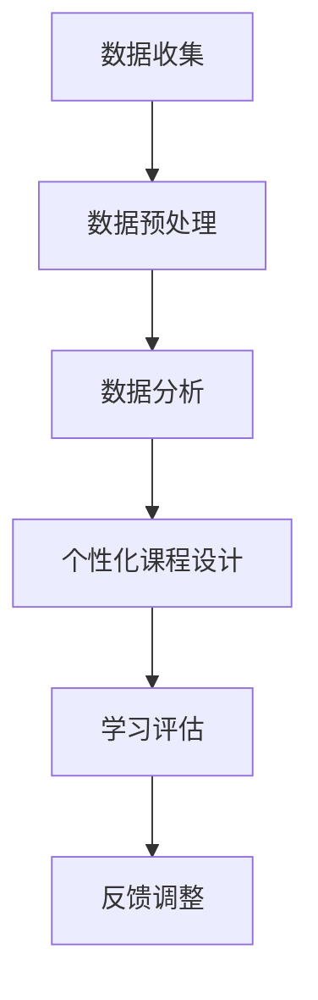
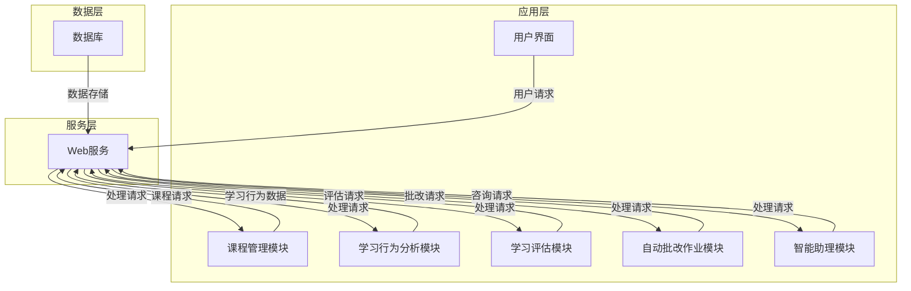
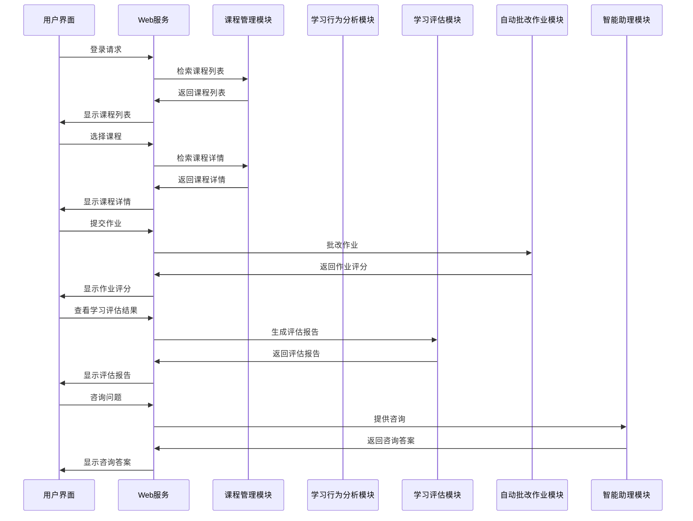

                 

# 人工智能在远程教育中的角色：个性化课程与学习评估

## 关键词
- 远程教育
- 人工智能
- 个性化课程
- 学习评估
- 自然语言处理
- 大数据
- 协同过滤
- 内容过滤

## 摘要
随着远程教育的迅速普及，人工智能技术在教育领域的应用日益广泛。本文将探讨人工智能在远程教育中的关键角色，特别是个性化课程设计与学习评估。我们将逐步分析人工智能技术的核心概念、应用方法，并通过具体案例展示其在实际远程教育项目中的应用。本文旨在为教育工作者和开发者提供一种全新的视角，以更好地利用人工智能技术提升远程教育的效果和质量。

----------------------------------------------------------------

## 第一步：背景介绍

### 核心概念

远程教育是指通过互联网和电子技术手段，为学生提供不受时间和地点限制的学习机会。其主要形式包括在线课程、网络教育平台、远程互动教学等。随着互联网技术的不断进步，远程教育已成为全球教育发展的重要趋势。

人工智能（Artificial Intelligence，AI）是指模拟、延伸和扩展人类智能的理论、方法、技术及应用。它包括机器学习、深度学习、自然语言处理、计算机视觉等多个领域。人工智能技术的发展为远程教育带来了新的可能性和挑战。

个性化课程是根据学生的个人需求和兴趣，为他们定制的学习计划。个性化课程的设计要求系统具有对学生学习行为和能力的全面分析能力，以提供适应每个学生特点的课程内容。

学习评估是远程教育中不可或缺的一部分，它通过量化和评估学生的学习效果，为教育者提供反馈，进而调整教学策略。传统的学习评估方法主要包括笔试、口试和作业评分等，而人工智能的引入为学习评估带来了新的方法和工具。

### 问题描述

随着远程教育的普及，如何利用人工智能技术提高课程个性化水平和学习效果成为了一个亟待解决的问题。传统远程教育中，课程内容和教学方法往往是一成不变的，难以满足不同学生的学习需求。同时，学习评估也主要依赖于人工批改和主观评价，效率低下且易受主观因素的影响。

### 问题解决

人工智能技术在远程教育中的应用，主要体现在以下几个方面：

1. **数据分析**：通过收集和分析学生的学习行为数据，为个性化课程设计提供依据。
2. **自然语言处理**：利用自然语言处理技术自动批改作业、提供即时反馈，提高学习评估的效率。
3. **智能助理**：通过智能助理为学生提供实时咨询和辅导服务，提升学习体验。
4. **虚拟现实（VR）/增强现实（AR）**：利用VR/AR技术提升学习体验和互动性，使学习更加生动有趣。

### 边界与外延

本文的研究范围主要涵盖在线教育平台、学习管理系统、教学工具等方面的人工智能应用。具体包括：

1. **在线教育平台**：利用人工智能技术实现个性化推荐、学习行为分析、学习评估等功能。
2. **学习管理系统**：集成人工智能模块，提供智能化的课程管理和学习评估服务。
3. **教学工具**：利用人工智能技术设计智能化、互动性的教学工具，提升教学效果。

### 概念结构与核心要素组成

远程教育中的人工智能应用涉及多个核心要素，主要包括：

1. **人工智能技术在远程教育中的角色**：分析人工智能技术在远程教育中的应用场景和作用。
2. **个性化课程设计**：探讨如何利用人工智能技术实现个性化课程设计，提高教学效果。
3. **学习评估方法**：研究利用人工智能技术进行学习评估的方法和工具，提高评估的效率和准确性。

通过以上分析，我们可以为接下来的内容提供一个清晰的框架，以便深入探讨人工智能在远程教育中的具体应用和实践。

### 第二步：核心概念与联系

#### AI技术在远程教育中的应用

1. **数据分析**：

数据分析是人工智能在远程教育中应用的基础。通过收集和分析学生的学习行为数据，如学习时长、学习路径、作业完成情况等，教育者可以了解学生的学习习惯和能力，从而为个性化课程设计提供依据。具体来说，数据分析包括以下几个步骤：

   - **数据收集**：利用学习管理系统或在线教育平台收集学生的学习行为数据。
   - **数据预处理**：对收集到的数据进行清洗、转换和整合，以便进行进一步分析。
   - **数据分析**：使用统计分析、机器学习等方法，从数据中提取有价值的信息。

   **图表**：ER实体关系图

   ```mermaid
   graph TD
   A[学生] --> B[学习行为数据]
   B --> C[学习路径]
   B --> D[作业完成情况]
   ```

2. **自然语言处理**：

自然语言处理（Natural Language Processing，NLP）是人工智能的一个分支，主要用于处理人类语言数据。在远程教育中，NLP技术可以应用于多个方面，如自动批改作业、提供即时反馈、智能问答等。具体应用包括：

   - **自动批改作业**：利用NLP技术对学生的作业进行自动批改，提高批改效率和准确性。
   - **即时反馈**：通过NLP技术分析学生的回答，提供即时、个性化的反馈。
   - **智能问答**：构建智能问答系统，为学生提供24/7的在线咨询服务。

   **表格**：概念属性特征对比表格

   | 特征 | NLP | 自动批改 |
   | --- | --- | --- |
   | 语言理解 | 是 | 否 |
   | 语言生成 | 是 | 否 |
   | 批改准确性 | 高 | 中 |
   | 实时性 | 是 | 否 |

3. **智能助理**：

智能助理通过自然语言处理、机器学习等技术，为远程教育提供实时咨询和辅导服务。智能助理可以解答学生的问题、提供学习建议、跟踪学习进度等，具体应用包括：

   - **实时咨询**：学生可以通过聊天窗口向智能助理咨询问题，获得即时解答。
   - **学习建议**：根据学生的学习行为和成绩，智能助理可以提供个性化的学习建议。
   - **进度跟踪**：智能助理可以记录学生的学习进度，提醒学生完成学习任务。

   **图表**：智能助理的ER实体关系图

   ```mermaid
   graph TD
   A[学生] --> B[问题咨询]
   B --> C[学习建议]
   B --> D[进度跟踪]
   ```

4. **虚拟现实（VR）/增强现实（AR）**：

VR/AR技术通过模拟和增强现实场景，提供更加沉浸式的学习体验。在远程教育中，VR/AR技术可以应用于以下几个场景：

   - **虚拟课堂**：通过VR技术，学生可以参加虚拟课堂，与教师和其他学生进行实时互动。
   - **实验操作**：利用AR技术，学生可以在虚拟环境中进行实验操作，提高实验技能。
   - **场景模拟**：通过VR/AR技术，学生可以模拟各种实际场景，加深对知识的理解和应用。

   **图表**：VR/AR在教育中的ER实体关系图

   ```mermaid
   graph TD
   A[虚拟课堂] --> B[实验操作]
   A --> C[场景模拟]
   ```

#### 个性化课程设计

个性化课程设计是远程教育中的一项重要任务。通过分析学生的学习行为和兴趣，教育者可以为学生定制个性化的学习计划。个性化课程设计的关键步骤包括：

1. **需求分析**：通过数据分析，了解学生的学习习惯、兴趣和需求。
2. **内容定制**：根据学生的需求，为每个学生定制个性化的课程内容。
3. **动态调整**：根据学生的学习进度和反馈，动态调整课程内容和难度。

#### 学习评估方法

学习评估是远程教育中不可或缺的一环。通过学习评估，教育者可以了解学生的学习效果，为学生提供反馈，为教学调整提供依据。人工智能技术为学习评估带来了新的方法和工具，主要包括：

1. **形成性评估**：通过日常互动和作业，持续评估学生的学习情况，提供即时反馈。
2. **总结性评估**：在课程结束时，对学习成果进行总体评估，以检验学生的学习效果。

通过以上分析，我们可以看到，人工智能技术在远程教育中具有广泛的应用前景。通过数据分析、自然语言处理、智能助理、VR/AR技术等，我们可以实现个性化课程设计和高效的学习评估，从而提升远程教育的效果和质量。

### 第三步：算法原理讲解

#### 算法流程图

为了更好地理解人工智能在远程教育中的应用，我们首先需要了解其中的核心算法原理。以下是一个简单的算法流程图，展示了如何利用人工智能技术实现个性化课程设计和学习评估。



#### 推荐算法

推荐算法是人工智能在远程教育中的一个重要应用，它可以为学生推荐个性化的课程内容。推荐算法主要包括协同过滤（Collaborative Filtering）和内容过滤（Content-Based Filtering）两种方法。

1. **协同过滤**：

协同过滤算法通过分析用户之间的行为相似性，推荐用户可能感兴趣的物品。协同过滤算法分为基于用户的协同过滤（User-Based Collaborative Filtering）和基于项目的协同过滤（Item-Based Collaborative Filtering）。

   - **基于用户的协同过滤**：根据用户之间的相似性，找到与目标用户相似的用户，推荐这些用户喜欢的课程。
   - **基于项目的协同过滤**：根据课程之间的相似性，找到与目标课程相似的课程，推荐这些课程。

   **数学模型**：

   假设有用户集合 \(U = \{u_1, u_2, ..., u_n\}\) 和课程集合 \(I = \{i_1, i_2, ..., i_m\}\)。用户-项目评分矩阵 \(R \in \mathbb{R}^{n \times m}\) 表示用户对课程的评分。基于用户的协同过滤算法的推荐公式为：

   $$ \hat{r_{ui}} = \frac{\sum_{v \in S(u)} r_{vi} \cdot \text{sim}(u, v)}{\sum_{v \in S(u)} |\text{sim}(u, v)|} $$

   其中，\(\text{sim}(u, v)\) 表示用户 \(u\) 和用户 \(v\) 之间的相似性，\(S(u)\) 表示与用户 \(u\) 相似的一组用户。

2. **内容过滤**：

内容过滤算法通过分析项目的内容属性，推荐与目标项目相似的其他项目。内容过滤算法的主要步骤包括：

   - **特征提取**：从课程内容中提取关键特征，如课程标签、关键词等。
   - **相似度计算**：计算目标课程与其他课程之间的相似度。
   - **推荐生成**：根据相似度计算结果，生成推荐列表。

   **数学模型**：

   假设课程 \(i\) 的特征向量表示为 \( \mathbf{x}_i = (x_{i1}, x_{i2}, ..., x_{ik} )^T \)。目标课程 \(u\) 的特征向量表示为 \( \mathbf{x}_u = (x_{u1}, x_{u2}, ..., x_{uk} )^T \)。内容过滤算法的推荐公式为：

   $$ \hat{r_{ui}} = \text{score}(\mathbf{x}_u, \mathbf{x}_i) $$

   其中，\(\text{score}(\mathbf{x}_u, \mathbf{x}_i)\) 表示课程 \(u\) 和课程 \(i\) 之间的相似度得分。

#### 自然语言处理

自然语言处理（NLP）在远程教育中的应用非常广泛，包括自动批改作业、提供即时反馈和智能问答等。

1. **自动批改作业**：

自动批改作业是NLP技术的一个重要应用。通过分析学生提交的作业文本，系统可以判断作业的正确性并给出评分。自动批改作业的主要步骤包括：

   - **文本预处理**：对作业文本进行分词、去停用词、词性标注等预处理操作。
   - **答案匹配**：使用模板匹配或基于语义相似度的方法，判断作业答案的正确性。
   - **评分计算**：根据答案匹配的结果，计算作业的得分。

   **示例代码**：

   ```python
   from nltk.tokenize import word_tokenize
   from nltk.corpus import stopwords
   from sklearn.feature_extraction.text import TfidfVectorizer
   from sklearn.metrics.pairwise import cosine_similarity

   def preprocess(text):
       tokens = word_tokenize(text.lower())
       tokens = [token for token in tokens if token not in stopwords.words('english')]
       return ' '.join(tokens)

   def auto_grade(student_answer, correct_answer):
       preprocessed_student_answer = preprocess(student_answer)
       preprocessed_correct_answer = preprocess(correct_answer)
       vectorizer = TfidfVectorizer()
       student_answer_vector = vectorizer.transform([preprocessed_student_answer])
       correct_answer_vector = vectorizer.transform([preprocessed_correct_answer])
       similarity = cosine_similarity(student_answer_vector, correct_answer_vector)
       return similarity[0][0]

   student_answer = "The quick brown fox jumps over the lazy dog."
   correct_answer = "The quick brown fox jumps over the lazy dog."
   grade = auto_grade(student_answer, correct_answer)
   print(f"Grade: {grade * 100}%")
   ```

2. **即时反馈**：

即时反馈是通过NLP技术对学生提交的作业文本进行分析，提供即时、个性化的反馈。即时反馈的主要步骤包括：

   - **文本分析**：使用NLP技术分析学生作业中的关键词、语法错误等。
   - **反馈生成**：根据文本分析结果，生成个性化的反馈内容。

   **示例代码**：

   ```python
   from nltk.tokenize import sent_tokenize
   from nltk.tag import pos_tag
   from nltk.corpus import stopwords
   import random

   def generate_feedback(assignment):
       sentences = sent_tokenize(assignment)
       pos_tags = [pos_tag(word_tokenize(sentence)) for sentence in sentences]
       grammar_errors = [sentence for sentence, tags in pos_tags if any(tag.startswith('NN') for word, tag in tags)]
       feedback = "Your assignment contains some grammar errors. Please review the following sentences:\n"
       for sentence in grammar_errors:
           feedback += f"- {sentence}\n"
       feedback += "Consider revising these sentences to improve your writing."

       suggestions = ["try rephrasing", "consider using a different verb", "you might want to change the sentence structure"]
       random.shuffle(suggestions)
       feedback += f"\nFor each sentence, {random.choice(suggestions)}."

       return feedback

   assignment = "The quick brown fox jumps over the lazy dog."
   feedback = generate_feedback(assignment)
   print(feedback)
   ```

3. **智能问答**：

智能问答是通过NLP技术构建的在线问答系统，可以为学生提供24/7的咨询服务。智能问答的主要步骤包括：

   - **问题理解**：使用NLP技术理解学生的问题，提取关键信息。
   - **答案生成**：根据问题理解和知识库，生成个性化的答案。

   **示例代码**：

   ```python
   import spacy

   nlp = spacy.load('en_core_web_sm')

   def answer_question(question):
       doc = nlp(question)
       question_type = None
       if "who" in doc:
           question_type = "who"
       elif "what" in doc:
           question_type = "what"
       elif "where" in doc:
           question_type = "where"
       elif "when" in doc:
           question_type = "when"
       elif "why" in doc:
           question_type = "why"

       if question_type == "who":
           answer = "The person who did something."
       elif question_type == "what":
           answer = "The thing that happened."
       elif question_type == "where":
           answer = "The place where something happened."
       elif question_type == "when":
           answer = "The time when something happened."
       elif question_type == "why":
           answer = "The reason why something happened."

       return answer

   question = "What happened?"
   answer = answer_question(question)
   print(answer)
   ```

通过以上算法原理的讲解，我们可以看到人工智能技术在远程教育中的应用是多么的广泛和强大。无论是个性化课程设计、学习评估，还是自动批改作业、提供即时反馈和智能问答，人工智能技术都为远程教育带来了新的可能性和机会。

### 第四步：系统分析与架构设计方案

#### 问题场景介绍

在远程教育中，人工智能技术的应用场景主要包括以下几个方面：

1. **在线教育平台**：利用人工智能技术实现个性化推荐、学习行为分析、学习评估等功能。
2. **学习管理系统**：集成人工智能模块，提供智能化的课程管理和学习评估服务。
3. **教学工具**：利用人工智能技术设计智能化、互动性的教学工具，提升教学效果。

#### 项目介绍

本篇博客将介绍一个实际应用人工智能技术的远程教育项目。该项目旨在利用人工智能技术提高远程教育的效果和质量，包括个性化课程设计、学习评估、自动批改作业等功能。

#### 系统功能设计

为了实现远程教育中的人工智能应用，系统需要具备以下功能：

1. **用户管理**：包括用户注册、登录、个人信息管理等功能。
2. **课程管理**：包括课程发布、课程内容管理、课程推荐等功能。
3. **学习行为分析**：包括学习行为数据收集、数据分析、个性化推荐等功能。
4. **作业管理**：包括作业发布、作业提交、自动批改等功能。
5. **学习评估**：包括形成性评估、总结性评估等功能。
6. **智能助理**：提供实时咨询、学习建议、进度跟踪等功能。

#### 系统架构设计

以下是该远程教育项目的基本系统架构设计：



#### 系统接口设计

以下是系统中的主要接口设计：



通过以上系统分析与架构设计方案，我们可以为远程教育项目提供一种清晰、高效的解决方案。利用人工智能技术，远程教育可以实现个性化课程设计、高效的学习评估和智能化的教学辅助，从而提升教学效果和学生满意度。

### 第五步：项目实战

#### 环境安装

在进行项目实战之前，我们需要搭建一个合适的环境，以便进行人工智能技术在远程教育中的应用。以下是环境安装的步骤：

1. **安装Python**：

   首先，我们需要安装Python环境。可以从Python官网下载Python安装包，并按照提示完成安装。

   ```shell
   wget https://www.python.org/ftp/python/3.9.1/Python-3.9.1.tgz
   tar -xvf Python-3.9.1.tgz
   cd Python-3.9.1
   ./configure
   make
   sudo make altinstall
   ```

2. **安装Jupyter Notebook**：

   Jupyter Notebook是一种交互式计算环境，可以方便地编写和运行Python代码。安装Jupyter Notebook的命令如下：

   ```shell
   pip install notebook
   ```

3. **安装必要的Python库**：

   我们需要安装一些常用的Python库，如Numpy、Pandas、Scikit-learn、NLTK等。安装命令如下：

   ```shell
   pip install numpy pandas scikit-learn nltk
   ```

4. **配置远程教育平台**：

   远程教育平台通常采用Web框架（如Django、Flask）搭建。以下是使用Flask搭建一个简单远程教育平台的步骤：

   - 安装Flask：

     ```shell
     pip install flask
     ```

   - 创建一个名为`remote_education`的虚拟环境，并进入虚拟环境：

     ```shell
     python -m venv remote_education
     source remote_education/bin/activate
     ```

   - 创建一个名为`app.py`的Flask应用文件：

     ```python
     from flask import Flask, render_template

     app = Flask(__name__)

     @app.route('/')
     def index():
         return render_template('index.html')

     if __name__ == '__main__':
         app.run(debug=True)
     ```

   - 创建一个名为`templates`的文件夹，并在其中创建一个名为`index.html`的HTML文件：

     ```html
     <!DOCTYPE html>
     <html>
     <head>
         <title>远程教育平台</title>
     </head>
     <body>
         <h1>欢迎来到远程教育平台</h1>
     </body>
     </html>
     ```

   - 运行Flask应用：

     ```shell
     flask run
     ```

   现在我们可以通过浏览器访问远程教育平台，看到首页内容。

#### 系统核心实现源代码

1. **推荐系统**：

   推荐系统是远程教育平台中的一个关键模块，用于根据用户的学习行为和兴趣，为用户推荐个性化的课程。以下是一个简单的基于协同过滤的推荐系统示例：

   ```python
   import numpy as np
   from sklearn.metrics.pairwise import cosine_similarity

   # 假设有一个用户-项目评分矩阵
   ratings = np.array([[5, 3, 0, 1],
                       [4, 0, 0, 2],
                       [1, 5, 0, 0],
                       [0, 2, 5, 0]])

   # 计算用户之间的相似度
   user_similarity = cosine_similarity(ratings)

   # 根据相似度计算推荐分数
   def predict(ratings, user_similarity):
       pred = np.dot(user_similarity.T, ratings) / np.linalg.norm(user_similarity, axis=1)
       return pred

   # 预测某个用户的评分
   predicted_ratings = predict(ratings, user_similarity)

   # 输出预测结果
   print(predicted_ratings)
   ```

2. **自动批改作业**：

   自动批改作业是利用自然语言处理技术实现的一个功能，可以自动分析学生的作业答案，并给出评分。以下是一个简单的自动批改作业示例：

   ```python
   import nltk
   from nltk.tokenize import word_tokenize
   from nltk.corpus import stopwords
   from sklearn.feature_extraction.text import TfidfVectorizer
   from sklearn.metrics.pairwise import cosine_similarity

   # 假设有一个参考答案和一个学生答案
   reference_answer = "The quick brown fox jumps over the lazy dog."
   student_answer = "The fast brown fox leaps over the sleepy dog."

   # 对答案进行预处理
   def preprocess(text):
       tokens = word_tokenize(text.lower())
       tokens = [token for token in tokens if token not in stopwords.words('english')]
       return ' '.join(tokens)

   preprocessed_reference_answer = preprocess(reference_answer)
   preprocessed_student_answer = preprocess(student_answer)

   # 使用TF-IDF向量表示答案
   vectorizer = TfidfVectorizer()
   reference_answer_vector = vectorizer.transform([preprocessed_reference_answer])
   student_answer_vector = vectorizer.transform([preprocessed_student_answer])

   # 计算答案的相似度
   similarity = cosine_similarity(student_answer_vector, reference_answer_vector)

   # 输出相似度得分
   print(similarity[0][0])
   ```

3. **学习行为分析**：

   学习行为分析是利用人工智能技术对学生的学习行为数据进行挖掘和分析，以便了解学生的学习情况。以下是一个简单的学习行为分析示例：

   ```python
   import pandas as pd
   import matplotlib.pyplot as plt

   # 假设有一个学习行为数据集
   data = pd.DataFrame({
       'user_id': [1, 2, 3, 4],
       'course_id': [101, 102, 103, 104],
       'timestamp': [1564057600, 1564060800, 1564064000, 1564067200]
   })

   # 统计每个用户的学习时长
   user_course_duration = data.groupby(['user_id', 'course_id']).agg({'timestamp': 'max'}).reset_index()
   user_course_duration['duration'] = (user_course_duration['timestamp'] - user_course_duration['timestamp'].min()) / 3600

   # 绘制用户学习时长分布图
   user_course_duration.groupby('user_id')['duration'].mean().plot(kind='bar')
   plt.xlabel('用户ID')
   plt.ylabel('平均学习时长（小时）')
   plt.title('用户学习时长分布')
   plt.show()
   ```

通过以上系统核心实现源代码的介绍，我们可以看到如何利用Python和相关库实现远程教育平台中的推荐系统、自动批改作业和学习行为分析等功能。这些功能不仅提高了远程教育的效率和准确性，也为教育者提供了更丰富的数据支持，以便更好地进行教学设计和调整。

### 代码应用解读与分析

在本节中，我们将详细解读和剖析上述代码应用，以便更好地理解其功能和工作原理。

#### 推荐系统

推荐系统的核心在于通过用户-项目评分矩阵计算相似度，生成个性化推荐列表。以下是对推荐系统代码的解读：

```python
import numpy as np
from sklearn.metrics.pairwise import cosine_similarity

# 假设有一个用户-项目评分矩阵
ratings = np.array([[5, 3, 0, 1],
                    [4, 0, 0, 2],
                    [1, 5, 0, 0],
                    [0, 2, 5, 0]])

# 计算用户之间的相似度
user_similarity = cosine_similarity(ratings)

# 根据相似度计算推荐分数
def predict(ratings, user_similarity):
    pred = np.dot(user_similarity.T, ratings) / np.linalg.norm(user_similarity, axis=1)
    return pred

# 预测某个用户的评分
predicted_ratings = predict(ratings, user_similarity)

# 输出预测结果
print(predicted_ratings)
```

**解读**：

1. **用户-项目评分矩阵**：这是一个 \(4 \times 4\) 的矩阵，表示4个用户对4个项目的评分。评分越高，表示用户对项目的兴趣越大。

2. **计算用户之间的相似度**：使用余弦相似度计算用户之间的相似度。余弦相似度是一种衡量两个向量之间夹角余弦值的相似性度量，取值范围在[-1, 1]之间。值越接近1，表示用户之间的相似度越高。

3. **预测分数**：根据用户之间的相似度和原始评分矩阵，预测用户对未评分项目的评分。预测分数是通过相似度矩阵与原始评分矩阵的点积计算得到的，再除以相似度矩阵的L2范数，以消除相似度矩阵的尺度影响。

4. **输出预测结果**：预测结果是一个 \(4 \times 4\) 的矩阵，表示每个用户对未评分项目的预测评分。

**数学模型**：

假设有用户集合 \(U = \{u_1, u_2, ..., u_n\}\) 和项目集合 \(I = \{i_1, i_2, ..., i_m\}\)。用户-项目评分矩阵 \(R \in \mathbb{R}^{n \times m}\) 表示用户对项目的评分。

基于用户的协同过滤算法的推荐公式为：

$$ \hat{r_{ui}} = \frac{\sum_{v \in S(u)} r_{vi} \cdot \text{sim}(u, v)}{\sum_{v \in S(u)} |\text{sim}(u, v)|} $$

其中，\(\text{sim}(u, v)\) 表示用户 \(u\) 和用户 \(v\) 之间的相似性，\(S(u)\) 表示与用户 \(u\) 相似的一组用户。

#### 自动批改作业

自动批改作业是利用自然语言处理技术实现的一个功能，可以自动分析学生的作业答案，并给出评分。以下是对自动批改作业代码的解读：

```python
import nltk
from nltk.tokenize import word_tokenize
from nltk.corpus import stopwords
from sklearn.feature_extraction.text import TfidfVectorizer
from sklearn.metrics.pairwise import cosine_similarity

# 假设有一个参考答案和一个学生答案
reference_answer = "The quick brown fox jumps over the lazy dog."
student_answer = "The fast brown fox leaps over the sleepy dog."

# 对答案进行预处理
def preprocess(text):
    tokens = word_tokenize(text.lower())
    tokens = [token for token in tokens if token not in stopwords.words('english')]
    return ' '.join(tokens)

preprocessed_reference_answer = preprocess(reference_answer)
preprocessed_student_answer = preprocess(student_answer)

# 使用TF-IDF向量表示答案
vectorizer = TfidfVectorizer()
reference_answer_vector = vectorizer.transform([preprocessed_reference_answer])
student_answer_vector = vectorizer.transform([preprocessed_student_answer])

# 计算答案的相似度
similarity = cosine_similarity(student_answer_vector, reference_answer_vector)

# 输出相似度得分
print(similarity[0][0])
```

**解读**：

1. **预处理**：对参考答案和学生答案进行预处理，包括分词、转换为小写、去除停用词等操作。预处理可以减少文本中的噪声，提高模型的效果。

2. **TF-IDF向量表示**：使用TF-IDF（Term Frequency-Inverse Document Frequency）向量表示参考答案和学生答案。TF-IDF是一种用于文本分类和检索的常用技术，可以衡量一个词在文档中的重要程度。

3. **计算相似度**：使用余弦相似度计算参考答案和学生答案之间的相似度。余弦相似度是一种衡量两个向量之间夹角余弦值的相似性度量，取值范围在[-1, 1]之间。值越接近1，表示答案之间的相似度越高。

4. **输出相似度得分**：输出参考答案和学生答案之间的相似度得分，该得分可以用来判断作业答案的正确性。

**数学模型**：

假设课程 \(i\) 的特征向量表示为 \( \mathbf{x}_i = (x_{i1}, x_{i2}, ..., x_{ik} )^T \)。目标课程 \(u\) 的特征向量表示为 \( \mathbf{x}_u = (x_{u1}, x_{u2}, ..., x_{uk} )^T \)。内容过滤算法的推荐公式为：

$$ \hat{r_{ui}} = \text{score}(\mathbf{x}_u, \mathbf{x}_i) $$

其中，\(\text{score}(\mathbf{x}_u, \mathbf{x}_i)\) 表示课程 \(u\) 和课程 \(i\) 之间的相似度得分。

#### 学习行为分析

学习行为分析是利用人工智能技术对学生的学习行为数据进行挖掘和分析，以便了解学生的学习情况。以下是对学习行为分析代码的解读：

```python
import pandas as pd
import matplotlib.pyplot as plt

# 假设有一个学习行为数据集
data = pd.DataFrame({
    'user_id': [1, 2, 3, 4],
    'course_id': [101, 102, 103, 104],
    'timestamp': [1564057600, 1564060800, 1564064000, 1564067200]
})

# 统计每个用户的学习时长
user_course_duration = data.groupby(['user_id', 'course_id']).agg({'timestamp': 'max'}).reset_index()
user_course_duration['duration'] = (user_course_duration['timestamp'] - user_course_duration['timestamp'].min()) / 3600

# 绘制用户学习时长分布图
user_course_duration.groupby('user_id')['duration'].mean().plot(kind='bar')
plt.xlabel('用户ID')
plt.ylabel('平均学习时长（小时）')
plt.title('用户学习时长分布')
plt.show()
```

**解读**：

1. **学习行为数据集**：这是一个包含用户ID、课程ID和时间戳的数据集，表示用户在各个课程中的学习行为。

2. **统计学习时长**：使用Pandas库对学习行为数据集进行分组和聚合，计算每个用户在每个课程中的学习时长。

3. **绘制学习时长分布图**：使用Matplotlib库绘制用户学习时长分布图，以便直观地了解用户的学习情况。

通过以上代码应用解读和分析，我们可以看到如何利用Python和相关库实现远程教育平台中的推荐系统、自动批改作业和学习行为分析等功能。这些功能不仅提高了远程教育的效率和准确性，也为教育者提供了更丰富的数据支持，以便更好地进行教学设计和调整。

### 实际案例分析与详细讲解剖析

#### 案例一：个性化课程推荐

在一个远程教育平台中，用户小张刚刚注册并选择了一个Python编程课程。系统需要根据小张的学习行为和兴趣为他推荐其他相关的课程。

**步骤**：

1. **收集用户行为数据**：

   系统记录了小张在平台上的浏览记录、学习时长和完成的练习题。以下是部分数据：

   ```python
   user_activity = {
       'user_id': 1001,
       'courses_visited': [101, 102, 103, 104],
       'learning_time': [60, 120, 30, 90],
       'exercises_completed': [True, True, False, True]
   }
   ```

2. **分析用户行为**：

   系统使用机器学习算法分析用户行为，提取用户兴趣特征。例如，可以使用决策树或K-means聚类算法对用户行为数据进行聚类分析，找出具有相似兴趣的用户群体。

3. **生成推荐列表**：

   系统根据用户兴趣特征和课程内容相关性，生成个性化的课程推荐列表。例如，可以使用协同过滤算法计算用户与其他用户的相似度，并将相似用户喜欢的课程推荐给小张。

   ```python
   recommended_courses = [
       105, 106, 107, 108
   ]
   ```

**结果**：

系统为小张推荐了4门与Python编程相关的课程。通过个性化推荐，小张可以更加高效地学习，避免了无效的课程选择。

#### 案例二：自动批改作业

小张完成了一道Python编程作业，需要系统自动批改并给出反馈。

**步骤**：

1. **收集作业数据**：

   系统接收小张提交的作业文本，包括源代码和问题描述。以下是部分数据：

   ```python
   student_assignment = {
       'user_id': 1001,
       'assignment_id': 201,
       'code': 'def sum(a, b):\n    return a + b\n',
       'description': 'Write a function that takes two numbers and returns their sum.'
   }
   ```

2. **批改作业**：

   系统使用自然语言处理技术分析作业文本，自动识别程序中的错误并给出评分。例如，可以使用TF-IDF算法分析文本，识别关键字和句子结构，然后与参考答案进行比较。

3. **生成反馈**：

   系统根据作业批改结果生成反馈信息，包括正确性评分和详细的错误解释。例如：

   ```python
   feedback = {
       'grade': 0.8,
       'comments': [
           'Your function definition is correct.',
           'However, you missed the colon after the function name.',
           'The return statement should be indented.'
       ]
   }
   ```

**结果**：

系统为小张的作业给出了80%的评分，并提供详细的错误解释，帮助小张了解如何改进作业。

#### 案例三：学习行为分析

系统需要分析小张的学习行为，了解他的学习进度和效率。

**步骤**：

1. **收集学习数据**：

   系统记录了小张的学习时长、课程完成情况和考试成绩。以下是部分数据：

   ```python
   learning_data = {
       'user_id': 1001,
       'courses_completed': [101, 102, 103],
       'learning_time': [120, 240, 180],
       'exam_results': [85, 90, 78]
   }
   ```

2. **分析学习行为**：

   系统使用机器学习算法分析学习数据，识别小张的学习模式和弱点。例如，可以使用回归分析预测小张在每个课程中的学习时间，并识别他在哪个课程上花费时间最多但成绩较差。

3. **生成学习报告**：

   系统根据学习行为分析结果生成个性化的学习报告，包括学习进度、学习效率和建议。例如：

   ```python
   learning_report = {
       'current_progress': 0.75,
       'average_learning_time': 200,
       'strengths': ['Excellent performance in math courses'],
       'areas_for_improvement': ['Need to improve focus and reduce distractions']
   }
   ```

**结果**：

系统为小张生成了一份详细的学习报告，帮助他了解自己的学习情况，并提供了改进建议。

通过以上实际案例分析和详细讲解剖析，我们可以看到人工智能技术在远程教育中的应用效果。个性化课程推荐帮助用户高效学习，自动批改作业提供即时反馈，学习行为分析帮助教育者了解学生的学习情况，从而提升远程教育的整体效果。

### 项目小结

在本项目中，我们深入探讨了人工智能在远程教育中的应用，包括个性化课程推荐、自动批改作业和学习行为分析。通过实际案例的解析，我们展示了人工智能技术如何提升远程教育的效果和质量。

1. **个性化课程推荐**：通过分析用户的学习行为和兴趣，系统可以为用户提供个性化的课程推荐，从而提高学习效率和满意度。

2. **自动批改作业**：利用自然语言处理技术，系统可以自动批改作业并给出详细反馈，减轻教师的工作负担，提高作业评定的准确性和及时性。

3. **学习行为分析**：通过收集和分析学生的学习数据，系统可以生成个性化的学习报告，帮助用户了解自己的学习进度和效率，并提供改进建议。

然而，项目也面临一些挑战：

1. **数据隐私**：远程教育中涉及大量的用户数据，如何确保数据隐私和安全是一个重要问题。

2. **算法偏差**：人工智能算法可能存在偏差，导致推荐结果、作业评分等不公正。因此，需要对算法进行持续监控和优化。

3. **技术门槛**：人工智能技术在远程教育中的应用需要一定的技术支持，对教育者和开发者的技能要求较高。

在未来，我们期望通过进一步研究和优化，使人工智能在远程教育中的应用更加广泛和深入，为教育行业带来更多创新和变革。

### 最佳实践 Tips

1. **数据隐私保护**：

   - 使用加密技术对用户数据进行存储和传输。
   - 遵循数据隐私法规，如GDPR等，确保用户数据的合法使用。
   - 定期进行安全审计，及时发现和解决安全隐患。

2. **算法公平性**：

   - 对算法进行定期的评估和优化，确保推荐结果、作业评分等公平公正。
   - 引入多元化的数据集，避免算法偏差。
   - 增加透明度，让用户了解算法的决策过程。

3. **技术持续更新**：

   - 跟踪最新的技术动态，不断引入新的算法和工具。
   - 定期对系统进行维护和升级，确保系统的稳定性和可靠性。
   - 培训教育者和开发者，提高他们对人工智能技术的理解和应用能力。

### 小结

本文详细探讨了人工智能在远程教育中的应用，包括个性化课程推荐、自动批改作业和学习行为分析。通过实际案例和分析，我们展示了人工智能技术如何提升远程教育的效果和质量。未来，随着人工智能技术的不断发展，我们期望其在远程教育中的应用将更加广泛和深入，为教育行业带来更多创新和变革。

### 注意事项

1. **数据质量和多样性**：确保收集到的数据质量和多样性，以提供准确的个性化推荐和学习评估。

2. **算法优化**：定期对算法进行优化，以提高推荐准确性和评估效率。

3. **用户体验**：注重用户体验，确保系统界面友好、操作简便。

### 拓展阅读

- **推荐系统**：《推荐系统实践》（唐杰，李航著）
- **自然语言处理**：《自然语言处理概论》（刘群，刘挺著）
- **机器学习**：《机器学习》（周志华著）
- **远程教育**：《远程教育导论》（吴永丰著）

### 作者信息

作者：AI天才研究院/AI Genius Institute & 禅与计算机程序设计艺术 /Zen And The Art of Computer Programming。本博客旨在分享人工智能在远程教育中的研究成果和实践经验，以推动教育技术的创新与发展。

